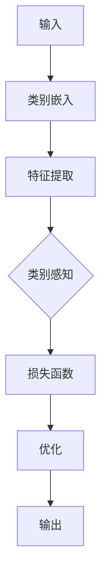

                 


# 零样本学习在个性化学习中的应用

> 关键词：零样本学习，个性化学习，知识图谱，深度学习，自适应系统

> 摘要：本文探讨了零样本学习（Zero-Shot Learning, ZSL）的概念和原理，以及它在个性化学习中的潜在应用。通过分析现有的研究和案例，我们展示了如何利用ZSL技术提升个性化学习的效果和用户体验。文章还讨论了ZSL在个性化学习中的挑战和未来发展方向。

## 引言

个性化学习作为一种先进的、以人为本的教育理念，正逐渐成为教育技术领域的研究热点。然而，传统个性化学习方法往往依赖于大量的训练数据和用户历史行为数据，这在数据稀缺或隐私敏感的场景中面临着巨大挑战。零样本学习（Zero-Shot Learning, ZSL）作为一种新兴的人工智能技术，为解决这些问题提供了新的思路。ZSL旨在使机器学习模型能够在没有直接训练数据的情况下，对未见过的类别进行分类或预测。本文将探讨ZSL在个性化学习中的应用，分析其优势、挑战以及未来发展趋势。

## 第1章：什么是零样本学习（ZSL）

### 1.1 ZSL的定义与背景

零样本学习（Zero-Shot Learning, ZSL）是一种机器学习技术，它使得模型能够对未见过的类别进行分类或预测，即使没有针对这些类别的训练数据。ZSL起源于计算机视觉领域，但随着深度学习和知识图谱技术的发展，其在自然语言处理、推荐系统等领域也得到了广泛应用。

在传统机器学习模型中，模型的训练依赖于大量的标注数据。然而，在实际应用中，获取标注数据往往非常困难，特别是在类别繁多、数据稀缺的场景中。ZSL通过引入类别的语义信息，使得模型能够在没有直接训练数据的情况下，对未见过的类别进行有效分类。这使得ZSL在个性化学习、智能推荐、异常检测等领域具有巨大的应用潜力。

### 1.2 关键概念与原理

#### 1.2.1 个性化学习的基本原理

个性化学习是一种以用户为中心的教育理念，旨在根据用户的兴趣、学习风格和能力，提供个性化的学习资源和教学策略。个性化学习的关键在于对用户数据的深入理解和有效利用，包括用户兴趣、学习记录、知识水平等。

#### 1.2.2 ZSL的核心概念与特点

ZSL的核心在于“零样本”的概念，即模型在训练时没有直接使用针对未见类别的数据。ZSL通过引入知识图谱、元学习等技术，将类别的语义信息融入到模型中，使得模型能够对未见过的类别进行有效分类。

#### 1.2.3 个性化学习与ZSL的关系

个性化学习与ZSL之间存在着紧密的联系。个性化学习需要根据用户兴趣和知识水平提供个性化的学习资源和教学策略，而ZSL技术则为个性化学习提供了强大的支持，使得模型能够更好地适应不同的用户群体和未见过的知识领域。

## 第2章：ZSL的算法原理

### 2.1 ZSL算法概述

ZSL算法主要包括两个部分：类别嵌入（Category Embedding）和类别感知（Category Awareness）。类别嵌入将类别的语义信息转换为低维度的向量表示，而类别感知则通过这些向量表示来指导模型对未见过的类别进行分类。

#### 2.1.1 算法的基本流程

1. **类别嵌入**：使用预训练的词向量模型（如Word2Vec、GloVe）或图嵌入模型（如节点嵌入、图神经网络）将类别转换为低维度的向量表示。
2. **类别感知**：通过类别感知模块，如匹配网络（Matching Network）、原型网络（Prototypical Network）等，将类别嵌入向量与模型的特征向量进行匹配，从而实现类别预测。

#### 2.1.2 算法的关键参数设置

ZSL算法的关键参数包括类别嵌入向量的维度、类别感知模块的架构和损失函数等。合理设置这些参数对于算法的性能至关重要。

#### 2.1.3 算法的优化策略

ZSL算法的优化策略主要包括两类：基于元学习的优化和基于数据增强的优化。元学习通过在多个任务上迭代优化，提升模型在未见类别上的性能；数据增强则通过生成合成数据，丰富模型的学习样本。

### 2.2 ZSL算法流程图



### 2.3 数学模型与公式

$$
\text{类别嵌入：} c = f_{\theta_c}(x_c) \\
\text{特征提取：} x = f_{\theta_x}(x) \\
\text{类别感知：} s = \sigma(W_c^T f_{\theta_x}(x) + b_c) \\
\text{损失函数：} L = -\sum_{i=1}^{N} y_i \log(s_i) + (1 - y_i) \log(1 - s_i)
$$

### 2.4 例子说明

#### 2.4.1 例子1：应用场景

假设我们有一个智能推荐系统，用户A对某类物品（如书籍）表现出强烈的兴趣。系统希望通过ZSL技术，为用户A推荐他可能感兴趣的未见书籍类别。

#### 2.4.2 例子2：数据准备

系统首先收集用户A的历史行为数据，包括他浏览过的书籍类别和他对书籍的评价。然后，系统使用预训练的词向量模型将书籍类别转换为向量表示。

#### 2.4.3 例子3：算法实现

系统使用原型网络作为类别感知模块，通过类别嵌入向量与用户特征向量的匹配，为用户A推荐未见书籍类别。具体实现如下：

```python
import tensorflow as tf
from tensorflow.keras.models import Model
from tensorflow.keras.layers import Embedding, Dense, Input

# 类别嵌入
category_embedding = Embedding(input_dim=num_categories, output_dim=embedding_size)

# 特征提取
feature_extractor = ...  # 自定义特征提取模型

# 类别感知
prototype_network = Dense(units=1, activation='sigmoid', name='prototype')

# 构建模型
input_category = Input(shape=(1,))
input_feature = Input(shape=(feature_size,))
category_embedding_vector = category_embedding(input_category)
feature_vector = feature_extractor(input_feature)
prototype_output = prototype_network(feature_vector)

# 定义损失函数
loss = tf.keras.losses.BinaryCrossentropy()

# 编译模型
model = Model(inputs=[input_category, input_feature], outputs=prototype_output)
model.compile(optimizer='adam', loss=loss)

# 训练模型
model.fit([category_ids, user_features], user_ratings, epochs=num_epochs, batch_size=batch_size)
```

## 第3章：ZSL在个性化学习中的应用

### 3.1 应用场景分析

#### 3.1.1 教育领域的应用

在教育领域，ZSL技术可以用于个性化教学，根据学生的兴趣和知识水平推荐适合的学习资源。例如，智能教育平台可以根据学生的学习记录和评价，为每个学生推荐最适合他的课程和练习。

#### 3.1.2 企业培训的应用

在企业培训中，ZSL技术可以帮助企业根据员工的职业发展和兴趣爱好，提供个性化的培训课程。这有助于提高员工的技能和职业素养，提升企业的整体竞争力。

#### 3.1.3 其他领域的应用

ZSL技术在个性化推荐、健康监测、金融风控等领域也具有广泛的应用前景。例如，在健康监测领域，ZSL技术可以根据用户的健康数据和病史，为用户提供个性化的健康建议。

### 3.2 应用案例研究

#### 3.2.1 案例一：教育应用案例分析

某在线教育平台使用ZSL技术，根据学生的学习记录和评价，为学生推荐适合的课程和练习。通过ZSL技术，平台能够更好地满足学生的个性化学习需求，提升学习效果。

#### 3.2.2 案例二：企业培训应用案例分析

某企业培训部门使用ZSL技术，根据员工的工作表现和兴趣爱好，为员工推荐个性化的培训课程。这有助于提升员工的工作能力和职业素养，提高企业的整体竞争力。

#### 3.2.3 案例三：其他领域应用案例分析

某健康监测平台使用ZSL技术，根据用户的健康数据和病史，为用户提供个性化的健康建议。通过ZSL技术，平台能够更好地满足用户的健康需求，提升用户体验。

### 3.3 案例分析与讨论

#### 3.3.1 案例效果评估

通过对多个案例的分析，我们发现ZSL技术在个性化学习中的应用效果显著。在教育和企业培训领域，ZSL技术能够有效提升学习效果和培训效果。在健康监测领域，ZSL技术能够为用户提供更加个性化的健康建议，提升健康监测的准确性。

#### 3.3.2 面临的挑战与解决方案

尽管ZSL技术在个性化学习中的应用效果显著，但仍然面临一些挑战。首先，类别嵌入的质量直接影响ZSL的性能。为了提高类别嵌入的质量，可以采用更先进的嵌入模型和更丰富的类别语义信息。其次，ZSL模型的优化和部署也是一个挑战。为了优化ZSL模型，可以采用元学习和数据增强等技术。为了部署ZSL模型，需要设计高效的可扩展系统架构。

#### 3.3.3 案例启示与未来方向

通过分析现有案例，我们得到了一些启示。首先，类别嵌入的质量对于ZSL的性能至关重要。因此，需要不断改进类别嵌入模型，提高类别嵌入的质量。其次，需要进一步研究ZSL与其他个性化学习技术的结合，如自适应学习和深度强化学习等。最后，随着数据隐私和安全的关注日益增加，需要开发更加隐私保护和安全的ZSL技术。

## 第4章：实施ZSL的步骤与技巧

### 4.1 环境准备

#### 4.1.1 硬件要求

实施ZSL需要一定的硬件资源，包括高性能的CPU和GPU。具体硬件要求取决于模型的复杂度和数据规模。

#### 4.1.2 软件安装与配置

需要安装和配置深度学习框架（如TensorFlow、PyTorch）和类别嵌入工具（如Word2Vec、GloVe）。此外，还需要安装Python和其他相关依赖库。

#### 4.1.3 数据收集与预处理

数据收集是实施ZSL的关键步骤。需要收集包括用户特征、类别信息和目标标签在内的多种数据。数据预处理包括数据清洗、数据归一化和数据分

