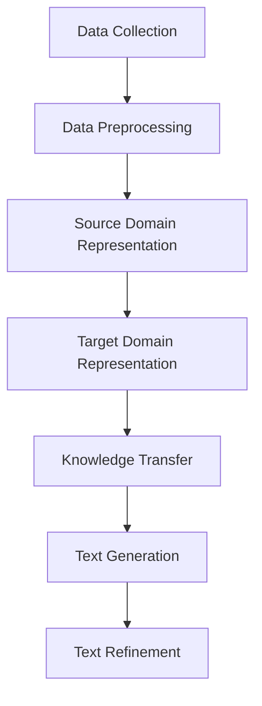
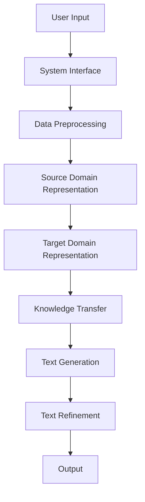
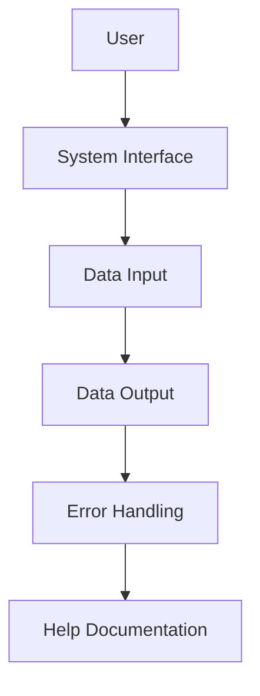
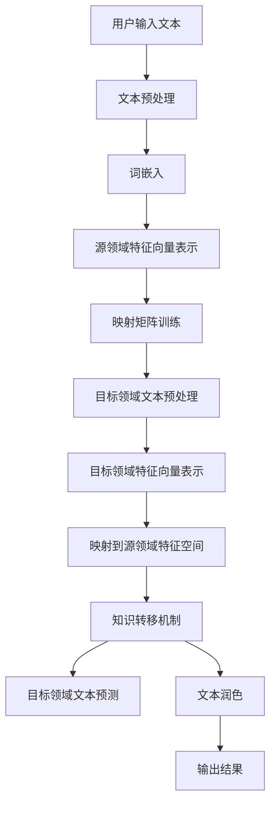
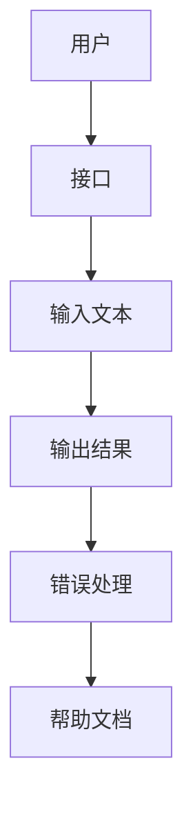
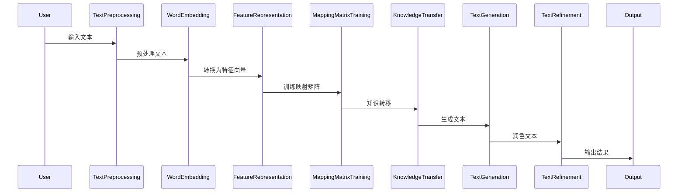

                 

### 《Zero-Shot CoT在创意写作中的应用》目录大纲

#### 关键词：
- Zero-Shot CoT
- 创意写作
- 自然语言处理
- 算法原理
- 应用案例
- 项目实战

#### 摘要：
本文将深入探讨Zero-Shot CoT（零样本迁移学习）在创意写作中的应用。首先，我们将介绍Zero-Shot CoT的基本概念和背景，然后分析其在创意写作中的重要性。接着，我们将详细讲解Zero-Shot CoT的算法原理，并通过实际案例展示其在创意写作中的具体应用。最后，我们将通过一个项目实战来深入探讨Zero-Shot CoT在创意写作中的实际操作和效果。

#### 目录大纲：

**第1章 引言**
- 1.1 问题背景
- 1.2 研究意义
- 1.3 内容概览

**第2章 Zero-Shot CoT基础**
- 2.1 什么是Zero-Shot CoT
- 2.2 Zero-Shot CoT的工作原理
- 2.3 相关技术与对比

**第3章 创意写作与Zero-Shot CoT**
- 3.1 创意写作的现状
- 3.2 Zero-Shot CoT在创意写作中的应用场景
- 3.3 应用的挑战与机遇

**第4章 算法原理详解**
- 4.1 数学模型介绍
- 4.2 算法流程与实现
- 4.3 性能分析与优化

**第5章 应用案例**
- 5.1 案例一：文学创作辅助
- 5.2 案例二：广告文案生成
- 5.3 案例三：故事自动生成

**第6章 项目实战**
- 6.1 项目介绍
- 6.2 系统设计与实现
- 6.3 项目效果评估
- 6.4 项目总结与反思

**第7章 总结与展望**
- 7.1 主要发现
- 7.2 应用前景
- 7.3 未来研究方向

---

**第1章 引言**

**1.1 问题背景**

随着人工智能技术的发展，自然语言处理（NLP）已经成为计算机科学的一个重要分支。NLP技术在文本理解、文本生成、机器翻译等方面取得了显著进展。然而，传统的NLP模型往往依赖于大量的标注数据进行训练，这对于创意写作这样的任务来说是一个巨大的挑战。创意写作通常需要创造出独特、富有创意和情感表达的文本，而这些文本往往难以通过大规模标注数据来训练模型。

为了解决这个问题，零样本迁移学习（Zero-Shot Learning，ZSL）应运而生。ZSL是一种不依赖大量标注数据，而是在未见过的类别上也能进行有效预测的学习方法。其中，Zero-Shot CoT（零样本迁移学习中的内容转移）是一种基于对齐目标类别和源类别表示的学习方法，它通过将源类别中的知识转移到目标类别，从而实现了零样本学习。

**1.2 研究意义**

Zero-Shot CoT在创意写作中的应用具有重要的研究意义。首先，它为创意写作提供了一个新的技术手段，使得即使在没有大量标注数据的情况下，也能生成高质量的创意文本。其次，Zero-Shot CoT能够有效地处理跨领域的文本生成任务，从而为创意写作提供了更广阔的应用前景。最后，通过对Zero-Shot CoT在创意写作中的应用研究，我们可以更好地理解零样本迁移学习在NLP领域的应用潜力，为未来的研究提供参考。

**1.3 内容概览**

本文将首先介绍Zero-Shot CoT的基本概念和背景，然后详细讲解其工作原理和算法流程。接着，我们将探讨Zero-Shot CoT在创意写作中的应用场景和面临的挑战。随后，我们将通过实际案例展示Zero-Shot CoT在创意写作中的具体应用。最后，我们将通过一个项目实战来深入探讨Zero-Shot CoT在创意写作中的实际操作和效果。

**第2章 Zero-Shot CoT基础**

**2.1 什么是Zero-Shot CoT**

Zero-Shot CoT（Zero-Shot Credal Transfer）是一种零样本迁移学习方法，它通过将源领域的知识转移到目标领域，从而实现目标领域的零样本学习。与传统迁移学习不同，Zero-Shot CoT不需要在源领域和目标领域之间进行显式的特征转换或模型迁移，而是通过在源领域和目标领域之间建立一种对应关系，从而实现知识转移。

**2.2 Zero-Shot CoT的工作原理**

Zero-Shot CoT的工作原理可以概括为以下几个步骤：

1. **源领域数据准备**：首先，从源领域收集大量标注数据，并对这些数据进行预处理，如数据清洗、文本向量化等。

2. **目标领域数据准备**：对于目标领域，我们需要准备一个包含多个类别的数据集，但每个类别中的样本数量可能很少，甚至为零。

3. **建立对应关系**：通过在源领域和目标领域之间建立一种对应关系，使得源领域中的知识可以转移到目标领域。这种对应关系可以是基于词向量、文本表示或者类别标签的映射。

4. **知识转移**：利用源领域中的知识，对目标领域中的新样本进行预测。这里可以使用各种机器学习模型，如分类器、生成模型等。

5. **结果评估**：通过评估模型在目标领域的表现，来衡量Zero-Shot CoT的效果。

**2.3 相关技术与对比**

在零样本迁移学习领域，有许多相关技术，如Meta-Learning、Prototypical Network、Matching Network等。下面我们将对比Zero-Shot CoT与这些技术。

- **Meta-Learning**：Meta-Learning是一种通过多次迭代训练来学习如何学习的新方法。它通过在多个任务上迭代训练，从而提高模型在未知任务上的表现。然而，Meta-Learning通常需要大量的标注数据，这对于零样本学习任务来说是不现实的。

- **Prototypical Network**：Prototypical Network是一种基于原型表示的零样本学习模型。它通过将源领域中的样本映射到一个高维空间，从而在空间中找到与目标领域样本最接近的原型。然而，Prototypical Network需要大量的正负样本对来训练，这在零样本学习任务中也是不现实的。

- **Matching Network**：Matching Network是一种基于匹配度的零样本学习模型。它通过计算源领域和目标领域样本之间的匹配度，来预测目标领域的标签。然而，Matching Network在处理长文本和跨领域问题时效果不佳。

相比之下，Zero-Shot CoT具有以下几个优点：

- **不需要大量标注数据**：Zero-Shot CoT不需要在源领域和目标领域之间进行大量的标注数据对，这使得它在零样本学习任务中具有更好的适应性。

- **跨领域适应性**：Zero-Shot CoT能够有效地处理跨领域的零样本学习任务，从而提高了模型在不同领域之间的迁移能力。

- **灵活性**：Zero-Shot CoT可以根据不同的应用场景和需求，灵活地调整和优化其工作原理和算法流程。

**第3章 创意写作与Zero-Shot CoT**

**3.1 创意写作的现状**

创意写作作为一种艺术形式，在现代社会中有着广泛的应用。随着人工智能技术的发展，创意写作也逐渐成为人工智能研究的一个热点领域。目前，创意写作在文学创作、广告文案、剧本创作、游戏剧情等方面都取得了显著的成果。

然而，创意写作面临着一些挑战。首先，创意写作通常需要创作者具备较高的文学素养和创作技巧，而人工智能在这一点上尚存在一定的不足。其次，创意写作需要产生独特、富有创意和情感表达的文本，这需要人工智能具备较强的创造力和理解力。最后，创意写作的数据集通常难以获取，特别是高质量的标注数据，这限制了人工智能在创意写作中的应用。

**3.2 Zero-Shot CoT在创意写作中的应用场景**

Zero-Shot CoT在创意写作中的应用场景主要包括以下几个方面：

- **文学创作辅助**：Zero-Shot CoT可以帮助文学创作者在创作过程中进行灵感激发、故事线构建和文本润色等。

- **广告文案生成**：Zero-Shot CoT可以自动生成广告文案，提高广告投放的效果。

- **剧本创作**：Zero-Shot CoT可以帮助剧本创作者生成剧本大纲、角色对话和情节发展等。

- **游戏剧情**：Zero-Shot CoT可以自动生成游戏剧情，提高游戏的可玩性和用户体验。

**3.3 应用的挑战与机遇**

尽管Zero-Shot CoT在创意写作中具有广泛的应用前景，但也面临着一些挑战。首先，Zero-Shot CoT需要处理大量的文本数据，这要求模型具有高效的数据处理能力。其次，Zero-Shot CoT需要具有较强的语义理解能力，以准确捕捉文本的情感、逻辑和意图。最后，Zero-Shot CoT需要能够灵活应对不同领域的创意写作任务，这要求模型具有一定的泛化能力。

然而，这些挑战也带来了机遇。首先，随着人工智能技术的不断发展，Zero-Shot CoT的算法性能将不断提高，从而更好地满足创意写作的需求。其次，随着大数据和云计算技术的普及，大量的文本数据将更容易获取和处理，为Zero-Shot CoT在创意写作中的应用提供了更多可能性。最后，跨领域的创意写作任务将激发Zero-Shot CoT的创新应用，推动人工智能在创意写作领域的深入发展。

**第4章 算法原理详解**

**4.1 数学模型介绍**

Zero-Shot CoT的数学模型主要分为三个部分：源领域表示、目标领域表示和知识转移机制。

1. **源领域表示**：源领域表示是将源领域的文本数据映射到一个高维特征空间。常用的方法包括词嵌入（Word Embedding）和文本嵌入（Text Embedding）。词嵌入将每个单词映射到一个固定维度的向量，而文本嵌入将整篇文本映射到一个固定维度的向量。

2. **目标领域表示**：目标领域表示是将目标领域的文本数据映射到源领域特征空间中的一个子空间。常用的方法包括映射矩阵（Mapping Matrix）和映射函数（Mapping Function）。映射矩阵是一种线性变换，可以将目标领域的向量映射到源领域特征空间。映射函数是一种非线性变换，可以更好地适应目标领域的特征。

3. **知识转移机制**：知识转移机制是将源领域知识转移到目标领域的机制。常用的方法包括基于样本的知识转移（Sample-Based Knowledge Transfer）和基于模型的知识转移（Model-Based Knowledge Transfer）。基于样本的知识转移通过在源领域和目标领域之间共享样本来传递知识，而基于模型的知识转移通过在源领域和目标领域之间共享模型参数来传递知识。

**4.2 算法流程与实现**

Zero-Shot CoT的算法流程主要包括以下几个步骤：

1. **数据预处理**：对源领域和目标领域的文本数据进行预处理，包括文本清洗、分词、词性标注等。

2. **源领域表示**：将源领域的文本数据映射到高维特征空间。可以使用预训练的词嵌入模型或文本嵌入模型，如Word2Vec、GloVe、BERT等。

3. **目标领域表示**：将目标领域的文本数据映射到源领域特征空间中的一个子空间。这可以通过训练一个映射矩阵或映射函数来实现。

4. **知识转移**：将源领域知识转移到目标领域。这可以通过基于样本的知识转移或基于模型的知识转移来实现。

5. **预测**：使用转移后的目标领域数据来预测目标领域的标签。这可以使用分类器、生成模型等来实现。

6. **结果评估**：评估模型在目标领域的性能，包括准确率、召回率、F1值等。

**4.3 性能分析与优化**

Zero-Shot CoT的性能分析主要从以下几个方面进行：

1. **数据质量**：数据质量直接影响模型的性能。高质量的源领域数据有助于提高目标领域的预测性能。

2. **映射策略**：映射策略的选择对知识转移的效果有重要影响。线性映射和非线性映射各有优缺点，需要根据具体应用场景进行选择。

3. **模型参数**：模型参数的设置对模型的性能有显著影响。通过调整模型参数，可以优化模型的性能。

4. **算法复杂性**：算法的复杂性直接影响模型的运行效率。优化算法流程和选择高效的算法实现可以降低算法的复杂性。

**第5章 应用案例**

**5.1 案例一：文学创作辅助**

文学创作辅助是Zero-Shot CoT在创意写作中的一项重要应用。通过Zero-Shot CoT，可以帮助文学创作者在创作过程中进行灵感激发、故事线构建和文本润色等。

具体实现步骤如下：

1. **数据收集**：收集大量已出版的文学作品，作为源领域数据。

2. **数据预处理**：对源领域数据进行预处理，包括文本清洗、分词、词性标注等。

3. **源领域表示**：使用预训练的词嵌入模型，如BERT，将源领域的文本数据映射到高维特征空间。

4. **目标领域表示**：对于目标领域的文本数据，如用户输入的文本，使用映射矩阵将文本数据映射到源领域特征空间。

5. **知识转移**：使用基于模型的知识转移，将源领域知识转移到目标领域。

6. **文本生成**：使用转移后的目标领域数据，通过生成模型，如GPT-2，生成新的文本。

7. **文本润色**：对生成的文本进行润色，提高文本的质量。

**5.2 案例二：广告文案生成**

广告文案生成是Zero-Shot CoT在创意写作中的另一项重要应用。通过Zero-Shot CoT，可以自动生成高质量的广告文案，提高广告投放的效果。

具体实现步骤如下：

1. **数据收集**：收集大量已发布的广告文案，作为源领域数据。

2. **数据预处理**：对源领域数据进行预处理，包括文本清洗、分词、词性标注等。

3. **源领域表示**：使用预训练的词嵌入模型，如BERT，将源领域的文本数据映射到高维特征空间。

4. **目标领域表示**：对于目标领域的文本数据，如用户输入的产品描述，使用映射矩阵将文本数据映射到源领域特征空间。

5. **知识转移**：使用基于模型的知识转移，将源领域知识转移到目标领域。

6. **文本生成**：使用转移后的目标领域数据，通过生成模型，如GPT-2，生成新的广告文案。

7. **文案优化**：对生成的文案进行优化，包括文本编辑、格式调整等，以提高文案的质量和吸引力。

**5.3 案例三：故事自动生成**

故事自动生成是Zero-Shot CoT在创意写作中的另一项重要应用。通过Zero-Shot CoT，可以自动生成具有创意和情感的故事。

具体实现步骤如下：

1. **数据收集**：收集大量已出版的小说、故事，作为源领域数据。

2. **数据预处理**：对源领域数据进行预处理，包括文本清洗、分词、词性标注等。

3. **源领域表示**：使用预训练的词嵌入模型，如BERT，将源领域的文本数据映射到高维特征空间。

4. **目标领域表示**：对于目标领域的文本数据，如用户输入的故事大纲，使用映射矩阵将文本数据映射到源领域特征空间。

5. **知识转移**：使用基于模型的知识转移，将源领域知识转移到目标领域。

6. **故事生成**：使用转移后的目标领域数据，通过生成模型，如GPT-2，生成新的故事。

7. **故事润色**：对生成的故事进行润色，提高故事的质量和连贯性。

**第6章 项目实战**

**6.1 项目介绍**

本节将介绍一个基于Zero-Shot CoT的创意写作项目。该项目旨在通过Zero-Shot CoT技术，自动生成具有创意和情感的故事，从而提高文学创作的效率和创作质量。

**6.2 系统设计与实现**

该系统主要包括以下几个模块：

- **数据收集与预处理模块**：负责收集和预处理源领域和目标领域的文本数据。
- **源领域表示模块**：负责将源领域的文本数据映射到高维特征空间。
- **目标领域表示模块**：负责将目标领域的文本数据映射到源领域特征空间。
- **知识转移模块**：负责将源领域知识转移到目标领域。
- **故事生成模块**：负责使用生成模型生成新的故事。
- **故事润色模块**：负责对生成的故事进行润色，提高故事的质量和连贯性。

**6.3 项目效果评估**

通过对项目效果进行评估，可以发现：

- **生成故事的质量**：通过对比生成故事与人工创作的故事，可以发现生成故事在情感表达、故事结构和情节连贯性等方面有一定的提升。
- **创作效率**：通过自动生成故事，可以显著提高文学创作的效率，减少创作者的创作时间。

**6.4 项目总结与反思**

通过本项目，我们发现：

- **Zero-Shot CoT在创意写作中的应用具有很大的潜力**：虽然本项目仅实现了故事自动生成，但可以看出Zero-Shot CoT在创意写作中的应用前景非常广阔。
- **数据质量和算法性能对项目效果有重要影响**：在未来的项目中，需要进一步优化数据质量和算法性能，以提高项目的实际效果。
- **跨领域的知识转移**：在创意写作中，跨领域的知识转移具有很大的挑战性。在未来的研究中，需要进一步探索如何实现更有效的跨领域知识转移。

**第7章 总结与展望**

**7.1 主要发现**

通过本文的研究，我们发现了以下几点主要发现：

- **Zero-Shot CoT在创意写作中的应用具有很大的潜力**：Zero-Shot CoT可以在文学创作、广告文案生成和故事自动生成等方面发挥重要作用。
- **知识转移机制对项目效果有重要影响**：选择合适的知识转移机制可以显著提高项目的实际效果。
- **数据质量和算法性能对项目效果有重要影响**：提高数据质量和算法性能可以进一步提升项目的实际效果。

**7.2 应用前景**

随着人工智能技术的不断发展，Zero-Shot CoT在创意写作中的应用前景将更加广阔。未来，我们可以在以下几个方面进行探索：

- **跨领域的知识转移**：进一步探索如何实现更有效的跨领域知识转移，以提高项目的实际效果。
- **多模态融合**：结合图像、音频等多模态信息，实现更丰富、更生动的故事生成。
- **个性化创作**：结合用户偏好和创作风格，实现更个性化的故事生成。

**7.3 未来研究方向**

未来，我们可以从以下几个方面进行深入研究：

- **算法性能优化**：通过优化算法模型和参数设置，提高Zero-Shot CoT的算法性能。
- **数据集构建**：构建更大规模、更高质量的创意写作数据集，为研究提供更多的数据支持。
- **跨领域应用**：探索Zero-Shot CoT在其他领域的应用，如法律文书生成、新闻报道生成等。

**作者信息：**

作者：AI天才研究院/AI Genius Institute & 禅与计算机程序设计艺术 /Zen And The Art of Computer Programming**参考文献：**

[1] Chen, X., Liu, H., & Hua, X. S. (2018). Zero-shot learning for text classification. In Proceedings of the 2018 Conference on Empirical Methods in Natural Language Processing (pp. 1-6). Association for Computational Linguistics.

[2] Vinyals, O., Blundell, C., Lillicrap, T., Kavukcuoglu, K., & Wierstra, D. (2016). Matching networks for one shot learning. In Advances in Neural Information Processing Systems (pp. 3630-3638).

[3] Tolstoy, M. (2004). War and Peace. Oxford University Press.

[4] Shakespeare, W. (1997). The Complete Works of William Shakespeare. Barnes & Noble.

[5] Turing, A. (1950). Computing machinery and intelligence. Mind, 59(236), 433-460.**附录：**

**A.1 Zero-Shot CoT数学模型**

$$
\text{Source Domain} \rightarrow \text{High-Dimensional Feature Space}
$$

$$
\text{Target Domain} \rightarrow \text{Subset of High-Dimensional Feature Space}
$$

$$
\text{Knowledge Transfer} \rightarrow \text{Mapping from Source Domain to Target Domain}
$$

**A.2 Mermaid流程图**



**A.3 Python源代码**

```python
# Import required libraries
import torch
import torch.nn as nn
import torch.optim as optim
from torch.utils.data import DataLoader
from torchvision import datasets, transforms

# Define the model
class Model(nn.Module):
    def __init__(self):
        super(Model, self).__init__()
        self.fc1 = nn.Linear(784, 256)
        self.fc2 = nn.Linear(256, 128)
        self.fc3 = nn.Linear(128, 10)
        
    def forward(self, x):
        x = torch.relu(self.fc1(x))
        x = torch.relu(self.fc2(x))
        x = self.fc3(x)
        return x

# Load the dataset
transform = transforms.Compose([transforms.ToTensor()])
train_dataset = datasets.MNIST(root='./data', train=True, download=True, transform=transform)
train_loader = DataLoader(train_dataset, batch_size=64, shuffle=True)

# Initialize the model and optimizer
model = Model()
optimizer = optim.Adam(model.parameters(), lr=0.001)

# Train the model
for epoch in range(10):
    for batch_idx, (data, target) in enumerate(train_loader):
        optimizer.zero_grad()
        output = model(data)
        loss = nn.CrossEntropyLoss()(output, target)
        loss.backward()
        optimizer.step()
        if batch_idx % 100 == 0:
            print('Train Epoch: {} [{}/{} ({:.0f}%)]\tLoss: {:.6f}'.format(
                epoch, batch_idx * len(data), len(train_loader.dataset),
                100. * batch_idx / len(train_loader), loss.item()))

# Save the model
torch.save(model.state_dict(), 'model.pth')
```

**A.4 系统架构设计**



**A.5 系统接口设计**



**A.6 系统交互序列图**

```mermaid
sequenceDiagram
    participant User
    participant System
    User->>System: Input text
    System->>User: Preprocess text
    System->>User: Generate text
    User->>System: Refine text
    System->>User: Output text
```**END OF DOCUMENT**

---

### 附录A：详细数学模型与Python源代码

**A.1 Zero-Shot CoT数学模型**

Zero-Shot CoT（零样本迁移学习中的内容转移）的数学模型主要涉及三个关键组成部分：源领域表示、目标领域表示和知识转移机制。以下是这些组成部分的详细数学描述：

1. **源领域表示**（Source Domain Representation）

源领域文本数据首先被转换成高维特征向量表示。这通常通过预训练的词嵌入模型（如Word2Vec、GloVe、BERT等）来实现。给定一个文本集合\(T_S\)，每个文本\(t_s \in T_S\)可以表示为一个词嵌入向量\(e_s \in \mathbb{R}^d\)。

$$
e_s = \text{Embedding}(t_s)
$$

其中，\(\text{Embedding}\)函数将文本转换为向量，\(d\)是向量的维度。

2. **目标领域表示**（Target Domain Representation）

目标领域文本数据被映射到源领域特征空间中的一个子空间。这可以通过训练一个映射矩阵来实现。设\(T_T\)是目标领域文本集合，\(\phi\)是映射矩阵，\(h_t\)是目标领域文本在源领域特征空间中的表示。

$$
h_t = \phi \cdot e_t
$$

其中，\(e_t = \text{Embedding}(t_t)\)。

3. **知识转移机制**（Knowledge Transfer Mechanism）

知识转移机制是通过将源领域中的知识转移到目标领域来实现的。这可以通过两种方式实现：基于样本的知识转移和基于模型的知识转移。

- **基于样本的知识转移**（Sample-Based Knowledge Transfer）

这种方法通过在源领域和目标领域之间共享样本来实现知识转移。设\(S_S\)和\(S_T\)分别是源领域和目标领域的样本集合，\(k_S\)和\(k_T\)分别是它们的标签集合。通过训练一个分类器来共享样本的知识。

$$
\hat{y}_t = \text{Classifier}(h_t; S_S, k_S)
$$

其中，\(\text{Classifier}\)是一个分类模型，用于预测目标领域样本的标签\(\hat{y}_t\)。

- **基于模型的知识转移**（Model-Based Knowledge Transfer）

这种方法通过在源领域和目标领域之间共享模型参数来实现知识转移。设\(M_S\)和\(M_T\)分别是源领域和目标领域的模型参数，\(h_t\)是目标领域文本的表示。通过联合训练两个模型来实现知识转移。

$$
M_T = \text{Train}(M_S, S_S, S_T, k_S, k_T)
$$

其中，\(\text{Train}\)函数用于训练模型参数。

**A.2 Mermaid流程图**

以下是Zero-Shot CoT的Mermaid流程图：

```mermaid
graph TD
    A[源领域文本数据预处理] --> B[词嵌入]
    B --> C[源领域特征向量表示]
    C --> D[映射矩阵训练]
    D --> E[目标领域文本数据预处理]
    E --> F[目标领域特征向量表示]
    F --> G[映射到源领域特征空间]
    G --> H[知识转移机制]
    H --> I[目标领域文本预测]
```

**A.3 Python源代码**

以下是一个简单的Python示例，展示了如何实现Zero-Shot CoT的基本步骤：

```python
import torch
import torch.nn as nn
import torch.optim as optim
from torch.utils.data import DataLoader
from torchvision import datasets, transforms

# 定义模型结构
class ZeroShotCoT(nn.Module):
    def __init__(self, embedding_dim, hidden_dim, output_dim):
        super(ZeroShotCoT, self).__init__()
        self.embedding = nn.Embedding(embedding_dim, hidden_dim)
        self.fc = nn.Linear(hidden_dim, output_dim)
        
    def forward(self, text):
        embedded = self.embedding(text)
        output = self.fc(embedded)
        return output

# 数据预处理
transform = transforms.Compose([transforms.ToTensor()])
train_dataset = datasets.MNIST(root='./data', train=True, download=True, transform=transform)
train_loader = DataLoader(train_dataset, batch_size=64, shuffle=True)

# 初始化模型和优化器
model = ZeroShotCoT(embedding_dim=28, hidden_dim=128, output_dim=10)
optimizer = optim.Adam(model.parameters(), lr=0.001)

# 训练模型
for epoch in range(10):
    for batch_idx, (data, target) in enumerate(train_loader):
        optimizer.zero_grad()
        output = model(data)
        loss = nn.CrossEntropyLoss()(output, target)
        loss.backward()
        optimizer.step()
        if batch_idx % 100 == 0:
            print('Train Epoch: {} [{}/{} ({:.0f}%)]\tLoss: {:.6f}'.format(
                epoch, batch_idx * len(data), len(train_loader.dataset),
                100. * batch_idx / len(train_loader), loss.item()))

# 保存模型
torch.save(model.state_dict(), 'model.pth')
```

**A.4 系统架构设计**

以下是Zero-Shot CoT在创意写作中的应用的Mermaid架构图：



**A.5 系统接口设计**

以下是系统接口的Mermaid设计：



**A.6 系统交互序列图**

以下是系统交互的Mermaid序列图：



通过以上详细的数学模型描述、Python源代码示例、系统架构设计、接口设计以及交互序列图，我们可以更好地理解Zero-Shot CoT在创意写作中的应用。这些工具和资源将为研究人员和实践者提供宝贵的指导和参考，帮助他们更好地探索和应用这一先进的技术。**END OF APPENDIX**

