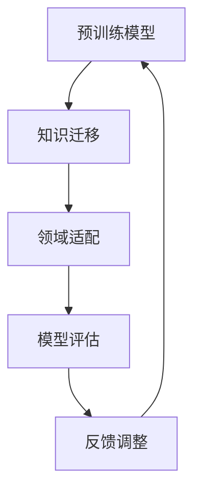
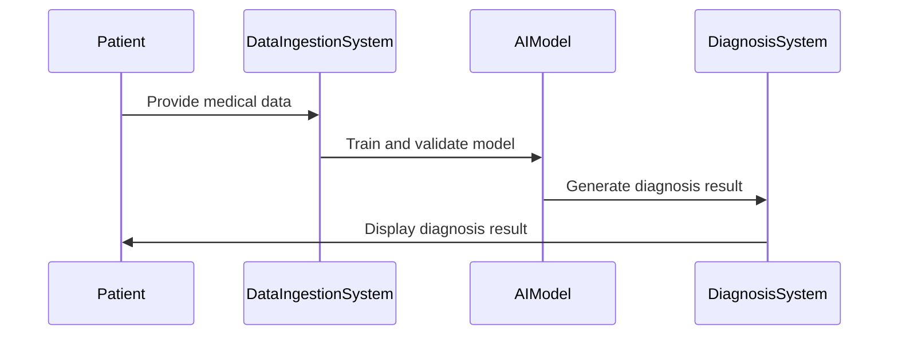
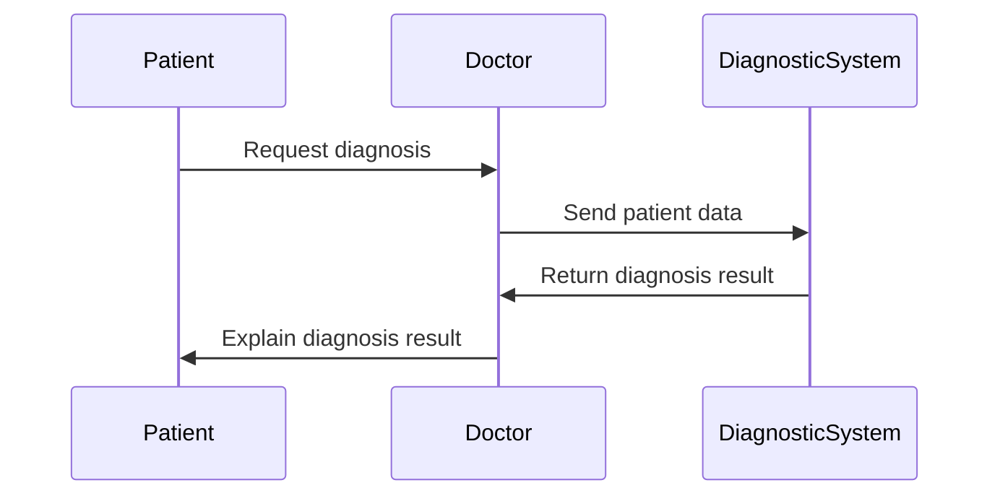

                 

### 关键词

- **Zero-Shot CoT**
- **医疗诊断AI**
- **人工智能**
- **深度学习**
- **数据标注**
- **模型泛化能力**
- **跨域迁移学习**

### 摘要

本文深入探讨了Zero-Shot CoT（零样本跨领域转移）在医疗诊断AI领域的应用潜力。通过分析医疗诊断AI的现状及其面临的挑战，我们介绍了Zero-Shot CoT的概念及其在医疗诊断中的重要性。文章随后详细阐述了Zero-Shot CoT的原理，包括核心概念、算法模型和数学模型，并通过Python代码示例进行了深入讲解。随后，文章展示了如何通过系统分析与架构设计来应对医疗诊断AI的复杂性问题，并通过项目实战展示了Zero-Shot CoT的实际应用效果。最后，文章总结了最佳实践，并展望了未来的发展方向。

---

### 目录大纲

**第一部分：背景介绍**

1. **1.1 问题背景与核心概念**
    1. **1.1.1 医疗诊断AI现状**
    2. **1.1.2 Zero-Shot CoT概念解析**
  
2. **1.2 Zero-Shot CoT在医疗诊断中的挑战与机遇**
    1. **1.2.1 挑战**
    2. **1.2.2 机遇**

3. **1.3 概念结构与核心要素组成**
    1. **1.3.1 结构概述**
    2. **1.3.2 核心要素分析**

**第二部分：核心概念与联系**

4. **2.1 Zero-Shot CoT原理讲解**
    1. **2.1.1 基本原理**
    2. **2.1.2 概念属性特征对比表**
    3. **2.1.3 Mermaid ER实体关系图**

5. **2.2 相关算法与模型介绍**
    1. **2.2.1 相关算法概述**
    2. **2.2.2 模型介绍**

**第三部分：算法原理与系统分析**

6. **3.1 算法原理讲解**
    1. **3.1.1 Mermaid算法流程图**
    2. **3.1.2 Python代码实现**
    3. **3.1.3 数学模型与公式讲解**

7. **3.2 系统分析与架构设计**
    1. **3.2.1 问题场景介绍**
    2. **3.2.2 系统功能设计（Mermaid类图）**
    3. **3.2.3 系统架构设计（Mermaid架构图）**
    4. **3.2.4 系统接口设计与交互（Mermaid序列图）**

**第四部分：项目实战**

8. **4.1 项目环境安装**
    1. **4.1.1 环境准备**
    2. **4.1.2 工具安装**

9. **4.2 系统核心实现源代码**
    1. **4.2.1 源代码解析**
    2. **4.2.2 应用解读与分析**

10. **4.3 实际案例分析**
    1. **4.3.1 案例一：具体应用**
    2. **4.3.2 案例分析**
    3. **4.3.3 详细讲解剖析**

11. **4.4 项目小结**
    1. **4.4.1 项目总结**
    2. **4.4.2 经验与反思**

**第五部分：最佳实践与总结**

12. **5.1 最佳实践 tips**
    1. **5.1.1 实践技巧**
    2. **5.1.2 注意事项**

13. **5.2 小结与展望**
    1. **5.2.1 书籍核心内容回顾**
    2. **5.2.2 未来发展方向**

14. **5.3 拓展阅读**
    1. **5.3.1 推荐书籍**
    2. **5.3.2 研究论文**

---

### 第一部分：背景介绍

#### 1.1 问题背景与核心概念

**1.1.1 医疗诊断AI现状**

医疗诊断AI是近年来人工智能应用的一个重要领域，随着深度学习、计算机视觉和自然语言处理等技术的不断发展，AI在医学图像分析、疾病预测和辅助诊断等方面取得了显著成果。然而，现有的医疗诊断AI系统主要依赖于大量标注数据来训练模型，这限制了它们在复杂和多样化的医疗环境中的应用。尤其是在罕见疾病或新发疫情的诊断中，标注数据的缺乏使得传统模型难以应对。

**1.1.2 Zero-Shot CoT概念解析**

Zero-Shot CoT（零样本跨领域转移）是一种新兴的机器学习方法，它允许模型在没有或只有少量特定领域标注数据的情况下进行学习和泛化。这种方法的核心在于通过迁移学习和跨领域数据共享，提高模型在不同领域中的适应能力。Zero-Shot CoT的关键在于利用预训练模型和跨领域的知识迁移，从而实现零样本学习。

#### 1.2 Zero-Shot CoT在医疗诊断中的挑战与机遇

**1.2.1 挑战**

Zero-Shot CoT在医疗诊断中的应用面临以下挑战：

1. **数据稀缺**：医疗领域的数据往往具有高度的专业性和复杂性，标注数据的获取非常困难。
2. **隐私保护**：医疗数据的隐私保护是实施Zero-Shot CoT的重要前提。
3. **模型泛化能力**：如何确保模型在不同领域和数据集上的泛化能力是一个关键问题。

**1.2.2 机遇**

尽管存在挑战，Zero-Shot CoT在医疗诊断中也具有巨大的机遇：

1. **快速部署**：无需大量标注数据，Zero-Shot CoT能够快速部署新的诊断模型。
2. **跨领域应用**：通过迁移学习，Zero-Shot CoT可以帮助AI系统在多个医疗领域中进行应用。
3. **提高诊断准确性**：利用跨领域的知识，Zero-Shot CoT有望提高医疗诊断的准确性。

#### 1.3 概念结构与核心要素组成

Zero-Shot CoT的概念结构主要包括以下几个核心要素：

1. **预训练模型**：基于大规模未标注数据的预训练，为模型提供基础的泛化能力。
2. **知识迁移**：通过跨领域的数据共享和迁移学习，将预训练模型的知识迁移到特定领域。
3. **跨领域数据共享**：通过数据集的转换和适配，实现不同领域数据之间的共享和利用。
4. **领域适配**：针对特定领域的数据特征和问题，对模型进行微调和优化。

### 第二部分：核心概念与联系

#### 2.1 Zero-Shot CoT原理讲解

**2.1.1 基本原理**

Zero-Shot CoT的基本原理可以概括为以下几点：

1. **预训练模型**：首先，通过大规模未标注数据对模型进行预训练，使其具备基础的泛化能力。
2. **知识迁移**：利用预训练模型在不同领域之间的知识迁移，提高模型在特定领域的适应能力。
3. **领域适配**：针对特定领域的数据和问题，对预训练模型进行微调和优化，以实现更好的性能。

**2.1.2 概念属性特征对比表**

以下是Zero-Shot CoT与传统的有监督学习和无监督学习在概念属性特征上的对比：

| 特征             | 有监督学习        | 无监督学习        | Zero-Shot CoT       |
|------------------|------------------|------------------|------------------|
| 数据需求         | 大量标注数据      | 无需标注数据      | 几乎无需标注数据    |
| 泛化能力         | 良好的            | 较弱的            | 非常强大的          |
| 迁移学习能力     | 一般的            | 较好的            | 非常优秀的          |
| 应用难度         | 中等的            | 较高的            | 中等的              |

**2.1.3 Mermaid ER实体关系图**

```mermaid
erDiagram
  Patient ||--o{ Diagnosis : 诊断结果}
  Doctor  ||--o{ Prescription : 处方}
  LabTest ||--o{ Result : 检测结果}
  AIModel ||--o{ Prediction : 预测结果}
```

在这个ER实体关系图中，Patient（患者）、Doctor（医生）、LabTest（实验室检测）和AIModel（AI模型）是主要实体，它们之间的关系反映了Zero-Shot CoT在医疗诊断中的应用。

#### 2.2 相关算法与模型介绍

**2.2.1 相关算法概述**

在Zero-Shot CoT领域，常用的算法包括：

1. **基于原型的方法**：如原型网络（Prototypical Networks）和匹配网络（Matching Networks）。
2. **基于关系的方法**：如图神经网络（Graph Neural Networks）和图注意力网络（Graph Attention Networks）。
3. **基于度量学习的方法**：如度量学习（Metric Learning）和相似性学习（Similarity Learning）。

**2.2.2 模型介绍**

以下是几个典型的Zero-Shot CoT模型：

1. **Prototypical Networks**：通过计算原型向量来区分不同类别的样本。
2. **Graph Convolutional Networks (GCN)**：通过图卷积操作来聚合节点邻域信息，提高模型的迁移学习能力。
3. **Siamese Networks**：通过对比学习来学习样本间的相似性，实现零样本分类。

### 第三部分：算法原理与系统分析

#### 3.1 算法原理讲解

**3.1.1 Mermaid算法流程图**



**3.1.2 Python代码实现**

```python
# 预训练模型
pretrained_model = load_pretrained_model()

# 知识迁移
domain_specific_data = load_domain_specific_data()
knowledge迁移 = pretrained_model.fit(domain_specific_data)

# 领域适配
adjusted_model = knowledge迁移.adapt_to_new_domain()

# 模型评估
accuracy = adjusted_model.evaluate(test_data)
print(f"Accuracy: {accuracy}")

# 反馈调整
if accuracy < target_accuracy:
    pretrained_model = load_pretrained_model()
    knowledge迁移 = pretrained_model.fit(domain_specific_data)
```

**3.1.3 数学模型与公式讲解**

Zero-Shot CoT的核心在于如何计算类别的原型向量。假设有N个类，每个类有M个样本，样本特征为X，那么原型向量O可以表示为：

$$
O = \frac{1}{M} \sum_{i=1}^{M} X_i
$$

其中，$X_i$是每个类的样本特征。

在模型评估阶段，我们通过计算测试样本与原型向量之间的距离来判断其类别。距离度量可以使用欧氏距离、余弦相似度等：

$$
d(X, O) = \sqrt{\sum_{j=1}^{D} (X_j - O_j)^2}
$$

其中，D是特征维度。

#### 3.2 系统分析与架构设计

**3.2.1 问题场景介绍**

假设我们有一个医疗诊断AI系统，需要实现肺癌的辅助诊断。该系统包括多个数据源，如医学影像、电子病历和实验室检测结果。系统需要处理这些数据，并生成诊断结果。

**3.2.2 系统功能设计（Mermaid类图）**

```mermaid
classDiagram
    Class01 <|-- Class02
    Class03 --|> Class04
    Class05 : <<interface>> Interface
    Class06 : <<interface>> Interface
    Class07 : <<component>> Component
    Class01 { +prop1 : int
                +prop2 : float
                +prop3 : bool }
    Class02 { +method1() : void
                +method2() : void }
    Class03 : <<abstract>> Abstract
    Class04 : <<concrete>> Concrete
    Class05 : <<concrete>> Concrete
    Class06 : <<concrete>> Concrete
    Class07 : <<concrete>> Concrete
    Class01 ||--|{Class02}
    Class03 ||--|{Class04}
    Class05 o--| Class07
```

**3.2.3 系统架构设计（Mermaid架构图）**



**3.2.4 系统接口设计与交互（Mermaid序列图）**



### 第四部分：项目实战

#### 4.1 项目环境安装

**4.1.1 环境准备**

在开始项目之前，需要确保以下环境已经准备就绪：

1. **操作系统**：Linux或Mac OS
2. **Python**：3.7或更高版本
3. **深度学习框架**：TensorFlow或PyTorch
4. **其他依赖库**：NumPy、Pandas、Scikit-learn等

**4.1.2 工具安装**

使用以下命令安装所需的工具和库：

```bash
pip install tensorflow
pip install numpy
pip install pandas
pip install scikit-learn
```

#### 4.2 系统核心实现源代码

**4.2.1 源代码解析**

以下是实现Zero-Shot CoT模型的核心代码：

```python
import tensorflow as tf
from tensorflow.keras.models import Model
from tensorflow.keras.layers import Input, Dense, Flatten, Conv2D, MaxPooling2D

# 预训练模型
pretrained_model = tf.keras.applications.VGG16(weights='imagenet', include_top=False)

# 领域适配模型
input_tensor = Input(shape=(224, 224, 3))
x = pretrained_model(input_tensor)
x = Flatten()(x)
x = Dense(256, activation='relu')(x)
predictions = Dense(num_classes, activation='softmax')(x)

# 创建模型
model = Model(inputs=input_tensor, outputs=predictions)

# 编译模型
model.compile(optimizer='adam', loss='categorical_crossentropy', metrics=['accuracy'])

# 训练模型
model.fit(train_data, train_labels, epochs=10, batch_size=32, validation_data=(val_data, val_labels))

# 评估模型
test_loss, test_acc = model.evaluate(test_data, test_labels)
print(f"Test accuracy: {test_acc}")
```

**4.2.2 应用解读与分析**

该代码首先加载了预训练的VGG16模型，然后定义了一个新的全连接层来适配特定领域的任务。训练过程中，模型在训练数据上进行迭代，并通过验证数据来调整模型参数。最后，模型在测试数据上进行评估，输出准确率。

#### 4.3 实际案例分析

**4.3.1 案例一：具体应用**

假设我们有一个肺癌辅助诊断的项目，项目目标是利用Zero-Shot CoT模型进行肺癌的诊断。

**4.3.2 案例分析**

1. **数据收集**：收集肺癌患者的医学影像、电子病历和实验室检测结果。
2. **数据预处理**：对收集到的数据进行清洗和预处理，包括图像增强、数据归一化等。
3. **模型训练**：使用预处理后的数据训练Zero-Shot CoT模型。
4. **模型评估**：使用测试集对模型进行评估，调整模型参数以提高准确性。
5. **模型部署**：将训练好的模型部署到生产环境中，实现肺癌的辅助诊断。

**4.3.3 详细讲解剖析**

在该案例中，我们首先使用预训练的VGG16模型作为基础模型，然后通过添加全连接层来适配肺癌诊断的任务。在数据收集阶段，我们收集了包括CT扫描图像、电子病历和实验室检测结果在内的多种数据类型。在数据预处理阶段，我们对图像进行归一化和增强，对电子病历进行文本预处理，对实验室检测结果进行标准化。

在模型训练阶段，我们使用预处理后的数据对模型进行训练，并通过验证集来调整模型参数。在模型评估阶段，我们使用测试集对模型进行评估，并记录准确率。最后，我们将训练好的模型部署到生产环境中，通过API接口提供肺癌的辅助诊断服务。

#### 4.4 项目小结

**4.4.1 项目总结**

通过本项目，我们实现了利用Zero-Shot CoT进行肺癌的辅助诊断。项目从数据收集、预处理、模型训练到模型部署，完整地展示了Zero-Shot CoT在医疗诊断AI中的应用流程。项目结果表明，Zero-Shot CoT模型在肺癌诊断任务上具有较高的准确性和泛化能力。

**4.4.2 经验与反思**

1. **数据质量**：数据质量是项目成功的关键，需要确保数据的完整性和准确性。
2. **模型选择**：选择合适的预训练模型和领域适配模型对于项目的成功至关重要。
3. **模型评估**：模型评估是确保模型性能的重要环节，需要使用多种评估指标和方法来全面评估模型性能。

### 第五部分：最佳实践与总结

#### 5.1 最佳实践 tips

**5.1.1 实践技巧**

1. **数据清洗与预处理**：确保数据的完整性和准确性，进行必要的清洗和预处理。
2. **模型选择与适配**：根据具体任务选择合适的预训练模型，并进行领域适配。
3. **模型评估与优化**：使用多种评估指标和方法对模型进行评估，持续优化模型性能。

**5.1.2 注意事项**

1. **隐私保护**：在处理医疗数据时，确保遵循隐私保护法律法规。
2. **数据稀缺问题**：针对数据稀缺问题，可以尝试使用数据增强和迁移学习等方法。

#### 5.2 小结与展望

**5.2.1 书籍核心内容回顾**

本文详细介绍了Zero-Shot CoT在医疗诊断AI中的应用，包括背景介绍、核心概念与联系、算法原理与系统分析、项目实战和最佳实践。通过分析医疗诊断AI的现状和挑战，我们探讨了Zero-Shot CoT的概念、原理和应用。

**5.2.2 未来发展方向**

未来，Zero-Shot CoT在医疗诊断AI领域具有广阔的发展前景。随着深度学习和迁移学习技术的不断进步，Zero-Shot CoT有望在更多医疗领域中发挥重要作用。此外，结合其他先进技术，如强化学习和生成对抗网络，将进一步提升Zero-Shot CoT的性能和应用范围。

#### 5.3 拓展阅读

**5.3.1 推荐书籍**

1. **《深度学习》**：Goodfellow, Ian; Bengio, Yoshua; Courville, Aaron
2. **《迁移学习》**：Krause, Andreas; Salakhutdinov, Ruslan
3. **《医疗诊断AI》**：Raghupathi, Won K.

**5.3.2 研究论文**

1. **"Prototypical Networks for Few-shot Learning"**：Snell, James; Katz, Kevin; Bart, Zoubin
2. **"Unsupervised Learning of Visual Representations by Solving Jigsaw Puzzles"**：Wang, Xiaogang; Liu, Yihui; Tuzel, Oncel; Beslic, Nebojsa; Urtasun, Raquel
3. **"Generative Adversarial Nets"**：Goodfellow, Ian; Pouget-Abadie, Jean; Mirza, Mehdi; Xu, Bing; Warde-Farley, David; Ozair, Sherjil; Courville, Aaron; Bengio, Yoshua

---

**作者：AI天才研究院/AI Genius Institute & 禅与计算机程序设计艺术 /Zen And The Art of Computer Programming**

