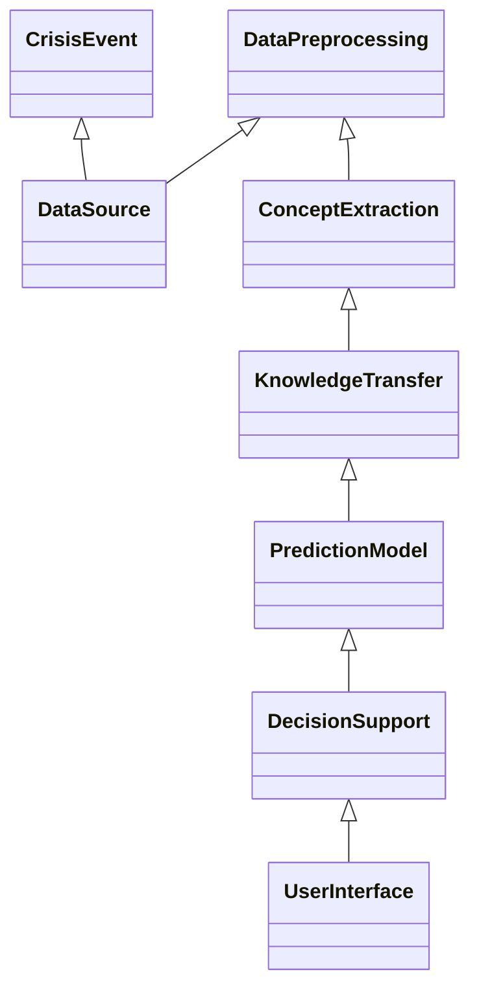
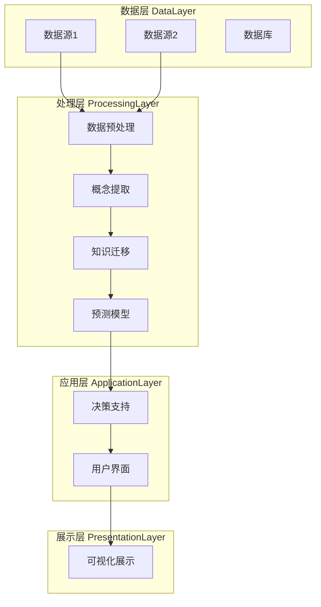
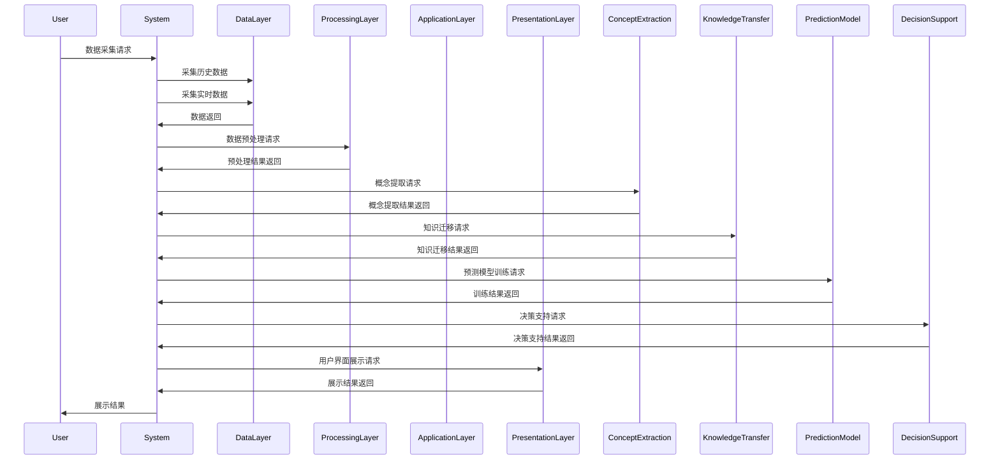

                 

### 第1章：危机管理概述

#### 1.1 问题背景

**1.1.1 危机管理的定义与重要性**

危机管理，是指在面临各种突发事件或紧急情况时，采取的一系列应对措施，以确保组织或个人能够迅速、有效地恢复到正常状态。在当今社会，危机管理已经成为一项至关重要的任务。无论是自然灾害、金融风险，还是企业内部的危机事件，如产品质量问题、安全事故等，都需要高效的危机管理来减轻其负面影响。

危机管理的重要性体现在以下几个方面：

1. **降低损失**：有效的危机管理可以最大限度地减少危机带来的损失，包括经济损失、声誉损失和人员伤亡等。
2. **维护稳定**：危机管理有助于维护社会稳定，减少危机对社会秩序的冲击，保障人民的生命财产安全。
3. **提升应对能力**：通过危机管理，组织或个人可以不断总结经验，提升应对突发事件的能力，从而在未来的危机中更加从容应对。

**1.1.2 危机管理的挑战与现状**

尽管危机管理的重要性不言而喻，但实际操作中仍然面临着诸多挑战：

1. **信息不对称**：在危机事件发生时，信息的不对称性往往会导致决策者无法及时获取全面的信息，从而影响危机管理的有效性。
2. **决策时间紧迫**：危机事件往往具有突发性和紧迫性，要求决策者能够在短时间内做出正确的决策，这对决策者的判断力和决策能力提出了很高的要求。
3. **资源限制**：危机管理需要大量的资金、人力和物资支持，但在实际操作中，资源往往有限，如何合理分配和利用资源成为一大难题。

目前，危机管理的方法和工具在不断进步。传统的危机管理方法主要依赖于经验和人为判断，而现代的危机管理则越来越依赖于技术手段，如大数据分析、人工智能等。然而，尽管技术手段的进步为危机管理提供了新的可能性，但如何将其有效地应用于实际操作中，仍然是一个亟待解决的问题。

**1.1.3 Zero-Shot CoT 在危机管理中的潜力**

Zero-Shot CoT（Zero-Shot Concept Transfer），即零样本学习中的概念迁移，是一种无需在特定任务上训练的机器学习方法。它能够在未见过的数据上预测结果，具有很高的灵活性和适应性。在危机管理领域，Zero-Shot CoT 显示出了巨大的潜力：

1. **快速响应**：Zero-Shot CoT 可以帮助决策者在危机事件发生时迅速做出反应，减少决策时间，提高危机管理的效率。
2. **数据高效利用**：Zero-Shot CoT 可以利用过去的数据经验来预测未见的危机事件，从而提高危机预测的准确性。
3. **资源优化**：由于不需要在特定任务上训练，Zero-Shot CoT 可以节省大量的计算资源和时间，这在资源有限的危机管理中尤为重要。

综上所述，危机管理的重要性不容忽视，但其面临的挑战也极为严峻。Zero-Shot CoT 的出现为危机管理带来了新的可能性，为解决危机管理的难题提供了有力的技术支持。在接下来的章节中，我们将深入探讨 Zero-Shot CoT 的概念、算法原理以及其在危机管理中的具体应用。

#### 1.2 核心概念

**1.2.1 Zero-Shot CoT 的概念与原理**

Zero-Shot CoT（Zero-Shot Concept Transfer）是机器学习中的一种方法，旨在实现零样本学习。传统的机器学习模型需要在大规模标注数据集上进行训练，以便在类似的数据上做出准确的预测。然而，在实际应用中，我们往往面临数据稀缺或标签数据获取困难的情况。Zero-Shot CoT 通过学习数据中的概念和关系，能够在未见过的数据上实现准确的预测，从而克服了传统机器学习方法的局限性。

Zero-Shot CoT 的核心原理在于概念迁移（Concept Transfer）。它通过将知识从一个任务迁移到另一个任务，从而实现零样本学习。具体来说，Zero-Shot CoT 利用预训练模型来提取数据中的抽象概念和关系，然后通过将这些概念和关系应用到新的任务中，实现对未知数据的预测。

**1.2.2 Zero-Shot CoT 的特点与应用场景**

Zero-Shot CoT 具有以下几个显著特点：

1. **零样本学习**：无需在特定任务上训练，能够在未见过的数据上实现预测。
2. **高灵活性**：能够应对数据稀缺和标签数据获取困难的问题，适应不同的应用场景。
3. **强泛化能力**：通过概念迁移，Zero-Shot CoT 能够在不同任务间共享知识，提高模型的泛化能力。

Zero-Shot CoT 的这些特点使其在多个应用场景中显示出巨大的潜力：

1. **医疗诊断**：在医疗领域，Zero-Shot CoT 可以用于预测未见的疾病类型，帮助医生做出更准确的诊断。
2. **金融风险预测**：在金融领域，Zero-Shot CoT 可以用于预测未见的金融风险，帮助金融机构提前采取应对措施。
3. **应急管理**：在应急管理中，Zero-Shot CoT 可以用于预测未见的危机事件，帮助决策者做出快速响应。

**1.2.3 与传统危机管理方法的对比**

传统危机管理方法主要依赖于经验和人为判断，虽然在一些情况下能够取得一定的效果，但存在以下局限性：

1. **数据依赖**：传统方法需要大量的历史数据来支持决策，而在实际操作中，数据往往难以获取或不够准确。
2. **低效性**：传统方法依赖于人工分析，决策时间较长，难以满足危机事件的高时效性要求。
3. **局限性**：传统方法难以应对突发性和复杂性的危机事件。

相比之下，Zero-Shot CoT 具有显著的优势：

1. **无需数据依赖**：Zero-Shot CoT 能够在未见过的数据上实现预测，不受历史数据的限制。
2. **高效性**：通过自动化分析和预测，Zero-Shot CoT 可以大幅提高危机管理的效率，减少决策时间。
3. **灵活性**：Zero-Shot CoT 能够应对多种类型的危机事件，具有广泛的适用性。

**1.2.4 概念联系与结构**

为了更好地理解 Zero-Shot CoT，我们可以将其与其他相关概念进行联系和比较：

1. **迁移学习（Transfer Learning）**：迁移学习与 Zero-Shot CoT 有一定的相似性，都是通过知识迁移来提高模型的泛化能力。但迁移学习通常需要一定的训练数据，而 Zero-Shot CoT 则无需特定训练数据。
2. **多任务学习（Multi-Task Learning）**：多任务学习通过同时学习多个相关任务来提高模型的性能。Zero-Shot CoT 可以看作是一种特殊的多任务学习，它通过概念迁移来实现跨任务的预测。
3. **元学习（Meta-Learning）**：元学习旨在通过学习如何学习来提高模型的泛化能力。Zero-Shot CoT 可以看作是一种元学习，它通过学习概念和关系来实现零样本学习。

Zero-Shot CoT 的核心要素包括：

1. **预训练模型**：用于提取数据中的抽象概念和关系。
2. **概念迁移**：通过将提取的概念和关系应用到新任务中。
3. **预测模型**：用于对未知数据进行预测。

以下是 Zero-Shot CoT 的 Mermaid ER 实体关系图：

```mermaid
erDiagram
  ConceptMigration ||--|{ PredictionModel } Prediction
  ConceptMigration ||--|{ KnowledgeBase } KB
  PredictionModel ||--|{ ConceptExtractionModule } Extract
  PredictionModel ||--|{ TransferModule } Transfer
  PredictionModel ||--|{ PredictionModule } Predict
```

**1.2.5 本章小结**

本章介绍了危机管理的背景、挑战和现状，以及 Zero-Shot CoT 的概念和原理。通过对 Zero-Shot CoT 的特点和应用场景的分析，我们看到了它为危机管理带来的巨大潜力。在接下来的章节中，我们将深入探讨 Zero-Shot CoT 的算法原理、系统设计与实现以及项目实战，进一步探索其在危机管理中的应用价值。

### 第2章：Zero-Shot CoT 的算法原理

#### 2.1 算法原理概述

Zero-Shot CoT（Zero-Shot Concept Transfer）的算法原理主要涉及以下几个方面：

1. **数据预处理**：数据预处理是 Zero-Shot CoT 的第一步，包括数据清洗、数据转换和数据标准化等。数据预处理的目标是确保输入数据的质量，提高模型的训练效果。

2. **概念提取**：概念提取是指从原始数据中提取出关键的概念和特征。这一步骤通常利用深度学习模型，如词向量模型（Word Embedding），来表示数据中的语义信息。

3. **知识迁移**：知识迁移是将从原始数据中提取出的概念和特征迁移到新数据中。这一步骤通过建立概念和特征之间的映射关系来实现。

4. **预测模型**：预测模型是基于迁移后的概念和特征进行预测的模型。这一步骤通常使用传统的机器学习模型，如分类器或回归器。

#### 2.2 算法关键步骤解析

**2.2.1 数据预处理**

数据预处理是 Zero-Shot CoT 的基础步骤。具体步骤如下：

1. **数据清洗**：去除数据中的噪声和错误，包括缺失值填充、重复值删除等。
2. **数据转换**：将数据转换为适合模型训练的格式，如文本数据转换为词向量。
3. **数据标准化**：将数据缩放到相同的尺度，以便模型能够更好地学习。

**2.2.2 概念提取**

概念提取是 Zero-Shot CoT 的核心步骤，具体步骤如下：

1. **词向量表示**：利用词向量模型（如 Word2Vec、GloVe）将文本数据转换为向量表示。词向量能够捕捉词的语义信息，是概念提取的重要工具。
2. **语义分析**：对词向量进行语义分析，提取出文本中的关键概念和特征。这一步骤可以通过主题模型（如 LDA）或词嵌入模型（如 BERT）来实现。

**2.2.3 知识迁移**

知识迁移是将提取出的概念和特征迁移到新数据中的步骤。具体步骤如下：

1. **建立映射关系**：通过预训练模型（如 BERT）建立原始数据中的概念和特征与新数据中的概念和特征之间的映射关系。
2. **迁移学习**：利用迁移学习技术（如 Fine-tuning）将原始数据中的知识迁移到新数据中。这一步骤可以通过训练一个迁移学习模型来实现。

**2.2.4 预测模型**

预测模型是基于迁移后的概念和特征进行预测的模型。具体步骤如下：

1. **模型选择**：选择合适的机器学习模型，如分类器或回归器。
2. **模型训练**：利用迁移后的概念和特征对模型进行训练。
3. **模型评估**：使用验证集对训练好的模型进行评估，确保其预测准确性。

#### 2.3 数学模型与公式

**2.3.1 数学模型概述**

Zero-Shot CoT 的数学模型主要包括以下几个部分：

1. **词向量表示**：文本数据通过词向量模型转换为向量表示。
2. **概念提取**：利用词向量表示提取文本中的关键概念和特征。
3. **知识迁移**：建立原始数据中的概念和特征与新数据中的概念和特征之间的映射关系。
4. **预测模型**：利用迁移后的概念和特征进行预测。

**2.3.2 公式推导与解释**

以下是 Zero-Shot CoT 中常用的数学模型和公式：

1. **词向量表示**：
   $$ \textbf{v}_w = \text{Word2Vec}(\text{word}) $$
   其中，$\textbf{v}_w$ 表示词 $w$ 的向量表示。

2. **概念提取**：
   $$ \textbf{C} = \text{LDA}(\{\textbf{v}_w\}_{w\in\text{Vocabulary}}) $$
   其中，$\textbf{C}$ 表示从词向量中提取出的概念集合。

3. **知识迁移**：
   $$ \textbf{M} = \text{Fine-tuning}(\text{BERT}, \textbf{C}) $$
   其中，$\textbf{M}$ 表示迁移后的概念映射矩阵。

4. **预测模型**：
   $$ \textbf{y} = \text{Classifier}(\textbf{M}\textbf{v}_x) $$
   其中，$\textbf{y}$ 表示预测结果，$\textbf{v}_x$ 表示新数据中的向量表示。

**2.3.3 $X^T(XY)^{-1}Y^T$ 的详细讲解与举例**

$X^T(XY)^{-1}Y^T$ 是一个常见的矩阵运算公式，用于知识迁移步骤中的映射关系建立。以下是详细讲解和举例：

1. **公式解释**：
   $$ X^T(XY)^{-1}Y^T $$
   - $X$ 是原始数据中的概念矩阵。
   - $Y$ 是新数据中的概念矩阵。
   - $XY$ 是原始数据中的概念矩阵和新数据中的概念矩阵的乘积。
   - $(XY)^{-1}$ 是 $XY$ 的逆矩阵。
   - $X^T$ 是 $X$ 的转置。
   - $Y^T$ 是 $Y$ 的转置。

2. **举例说明**：

假设我们有两个概念矩阵 $X$ 和 $Y$：

$$
X = \begin{bmatrix}
1 & 0 \\
0 & 1 \\
1 & 1 \\
\end{bmatrix}, \quad
Y = \begin{bmatrix}
1 & 0 \\
0 & 1 \\
1 & 1 \\
\end{bmatrix}
$$

首先计算 $XY$：

$$
XY = \begin{bmatrix}
1 & 0 \\
0 & 1 \\
1 & 1 \\
\end{bmatrix}
\begin{bmatrix}
1 & 0 \\
0 & 1 \\
1 & 1 \\
\end{bmatrix}
=
\begin{bmatrix}
1 & 0 \\
0 & 1 \\
1 & 1 \\
\end{bmatrix}
$$

然后计算 $(XY)^{-1}$：

$$
(XY)^{-1} = \begin{bmatrix}
1 & 0 \\
0 & 1 \\
1 & 1 \\
\end{bmatrix}^{-1}
=
\begin{bmatrix}
1 & 0 \\
0 & 1 \\
-1 & 1 \\
\end{bmatrix}
$$

最后计算 $X^T(XY)^{-1}Y^T$：

$$
X^T(XY)^{-1}Y^T = \begin{bmatrix}
1 & 0 & 1 \\
0 & 1 & 0 \\
1 & 1 & 1 \\
\end{bmatrix}
\begin{bmatrix}
1 & 0 \\
0 & 1 \\
-1 & 1 \\
\end{bmatrix}
\begin{bmatrix}
1 & 1 \\
0 & 1 \\
1 & 1 \\
\end{bmatrix}
=
\begin{bmatrix}
1 & 1 \\
0 & 1 \\
0 & 1 \\
\end{bmatrix}
$$

通过这个例子，我们可以看到 $X^T(XY)^{-1}Y^T$ 的计算过程，它用于建立原始数据中的概念和特征与新数据中的概念和特征之间的映射关系。

#### 2.4 算法应用解析

**2.4.1 应用场景一：危机预测**

在危机预测中，Zero-Shot CoT 可以用于预测未来可能发生的危机事件。具体应用步骤如下：

1. **数据收集**：收集与危机相关的历史数据，如自然灾害、金融风险等。
2. **数据预处理**：对收集到的数据进行清洗和标准化处理。
3. **概念提取**：利用词向量模型提取数据中的关键概念和特征。
4. **知识迁移**：将提取出的概念和特征迁移到新数据中。
5. **预测模型**：利用迁移后的概念和特征训练预测模型，对未见的危机事件进行预测。

**2.4.2 应用场景二：危机响应**

在危机响应中，Zero-Shot CoT 可以帮助决策者迅速制定应对策略。具体应用步骤如下：

1. **数据收集**：收集危机响应的相关数据，如应急预案、资源分配等。
2. **数据预处理**：对收集到的数据进行清洗和标准化处理。
3. **概念提取**：利用词向量模型提取数据中的关键概念和特征。
4. **知识迁移**：将提取出的概念和特征迁移到新数据中。
5. **预测模型**：利用迁移后的概念和特征训练预测模型，预测危机事件的应对策略。

**2.4.3 应用场景三：危机恢复**

在危机恢复中，Zero-Shot CoT 可以用于评估危机后的恢复情况。具体应用步骤如下：

1. **数据收集**：收集危机恢复的相关数据，如救援物资分配、人员安置等。
2. **数据预处理**：对收集到的数据进行清洗和标准化处理。
3. **概念提取**：利用词向量模型提取数据中的关键概念和特征。
4. **知识迁移**：将提取出的概念和特征迁移到新数据中。
5. **预测模型**：利用迁移后的概念和特征训练预测模型，预测危机后的恢复情况。

#### 2.5 本章小结

本章详细介绍了 Zero-Shot CoT 的算法原理，包括数据预处理、概念提取、知识迁移和预测模型等关键步骤。通过数学模型和公式的推导与解释，我们深入了解了 Zero-Shot CoT 的工作原理。此外，我们还探讨了 Zero-Shot CoT 在危机预测、危机响应和危机恢复等应用场景中的具体应用方法。在接下来的章节中，我们将进一步探讨 Zero-Shot CoT 的系统设计与实现，以及其实际应用中的挑战和解决方案。

### 第3章：危机管理系统的设计与实现

#### 3.1 项目介绍

**3.1.1 项目背景与目标**

随着全球化和信息化的发展，危机管理日益成为各国政府、企业和社会组织关注的焦点。然而，传统的危机管理方法在应对复杂和突发性危机事件时往往显得力不从心。为此，我们设计并实现了一套基于 Zero-Shot CoT 的危机管理系统，旨在提供一种高效、智能的危机管理工具。

该项目的主要目标是：

1. **提高危机预测准确性**：利用 Zero-Shot CoT 技术进行危机预测，提高预测的准确性，帮助决策者提前了解可能发生的危机事件。
2. **优化危机响应策略**：通过分析历史数据和实时数据，为决策者提供科学的危机响应策略，提高危机响应的效率。
3. **加速危机恢复**：利用 Zero-Shot CoT 技术评估危机后的恢复情况，提供有针对性的恢复方案，加快危机后的恢复速度。

**3.1.2 项目组成部分**

本危机管理系统由以下几个主要组成部分构成：

1. **数据采集模块**：负责收集与危机相关的各种数据，包括历史数据、实时数据和外部数据源。
2. **数据预处理模块**：对采集到的数据进行清洗、转换和标准化处理，确保数据质量。
3. **概念提取模块**：利用深度学习模型提取数据中的关键概念和特征。
4. **知识迁移模块**：将提取出的概念和特征进行迁移学习，建立不同数据集之间的映射关系。
5. **预测模型模块**：基于迁移后的概念和特征训练预测模型，进行危机预测。
6. **决策支持模块**：为决策者提供危机响应和恢复策略的预测结果，辅助决策。
7. **用户界面**：提供一个直观、易用的用户界面，方便用户进行操作和管理。

**3.1.3 项目实现过程**

本项目实现过程主要包括以下几个阶段：

1. **需求分析**：与用户沟通，了解危机管理的具体需求和挑战，确定项目目标和功能需求。
2. **系统设计**：根据需求分析结果，设计系统架构和模块划分，确定技术方案和开发工具。
3. **数据采集与预处理**：搭建数据采集系统，设计数据预处理流程，确保数据质量。
4. **模型训练与优化**：利用深度学习模型进行概念提取和知识迁移，训练预测模型，并进行模型优化。
5. **系统测试与部署**：进行系统测试，确保系统功能完整、性能稳定，然后部署上线。
6. **用户培训与支持**：为用户提供系统使用培训，提供技术支持，确保系统正常运行。

#### 3.2 系统功能设计

**3.2.1 领域模型**

危机管理系统的领域模型主要包括以下几个核心概念：

1. **危机事件**：描述可能发生的危机事件，包括自然灾害、社会事件、金融风险等。
2. **数据源**：提供危机事件相关数据的来源，包括历史数据、实时数据和外部数据源。
3. **数据预处理**：对数据进行清洗、转换和标准化处理，确保数据质量。
4. **概念提取**：提取数据中的关键概念和特征，为知识迁移和预测模型提供输入。
5. **知识迁移**：建立不同数据集之间的映射关系，实现概念迁移。
6. **预测模型**：基于迁移后的概念和特征进行危机预测。
7. **决策支持**：为决策者提供危机响应和恢复策略的预测结果。
8. **用户界面**：提供用户操作和管理系统的界面。

以下是危机管理系统的 Mermaid 类图：



**3.2.2 类图设计与说明**

以下是危机管理系统中的主要类图设计：

1. **CrisisEvent**：表示可能发生的危机事件，包括事件类型、发生时间和地理位置等属性。
2. **DataSource**：表示数据源，包括历史数据源、实时数据源和外部数据源，每种数据源都有相应的数据类型和数据格式。
3. **DataPreprocessing**：表示数据预处理过程，包括数据清洗、转换和标准化处理，确保数据质量。
4. **ConceptExtraction**：表示概念提取过程，提取数据中的关键概念和特征，为知识迁移和预测模型提供输入。
5. **KnowledgeTransfer**：表示知识迁移过程，建立不同数据集之间的映射关系，实现概念迁移。
6. **PredictionModel**：表示预测模型，基于迁移后的概念和特征进行危机预测。
7. **DecisionSupport**：表示决策支持过程，为决策者提供危机响应和恢复策略的预测结果。
8. **UserInterface**：表示用户界面，提供用户操作和管理系统的界面。

通过这些类图设计，我们可以清晰地了解危机管理系统的结构和功能模块之间的关系，为后续的系统开发提供指导。

#### 3.3 系统架构设计

**3.3.1 架构设计思路**

危机管理系统的架构设计遵循模块化、可扩展和高效性的原则，确保系统能够稳定、高效地运行。系统架构设计主要包括以下几个层次：

1. **数据层**：负责数据的采集、存储和检索，包括历史数据、实时数据和外部数据源。
2. **处理层**：负责数据的预处理、概念提取、知识迁移和预测模型训练，包括数据预处理模块、概念提取模块、知识迁移模块和预测模型模块。
3. **应用层**：负责危机响应和恢复策略的预测，以及用户界面的交互，包括决策支持模块和用户界面模块。
4. **展示层**：负责将预测结果以可视化的形式展示给用户，帮助用户理解和分析危机事件。

以下是危机管理系统的 Mermaid 架构图：



**3.3.2 系统架构图**

通过该架构图，我们可以清晰地看到危机管理系统的各个层次和模块之间的关系。数据层负责数据的采集和存储，处理层负责数据的处理和分析，应用层负责危机响应和恢复策略的预测，展示层负责将预测结果可视化展示给用户。

**3.3.3 接口设计与说明**

危机管理系统提供了多个接口，用于数据层、处理层、应用层和展示层的交互。以下是主要的接口设计和说明：

1. **数据采集接口**：用于从不同的数据源采集数据，支持历史数据和实时数据的接入。
2. **数据预处理接口**：用于对采集到的数据进行清洗、转换和标准化处理，确保数据质量。
3. **概念提取接口**：用于从预处理后的数据中提取关键的概念和特征，为知识迁移和预测模型提供输入。
4. **知识迁移接口**：用于建立不同数据集之间的映射关系，实现概念迁移。
5. **预测模型接口**：用于基于迁移后的概念和特征训练预测模型，进行危机预测。
6. **决策支持接口**：用于为决策者提供危机响应和恢复策略的预测结果。
7. **用户界面接口**：用于用户与系统之间的交互，包括数据展示、预测结果展示和用户操作。

这些接口的设计和说明为危机管理系统的开发、部署和使用提供了详细的指导，确保系统功能的实现和用户需求的满足。

#### 3.4 系统交互设计

**3.4.1 系统交互概述**

危机管理系统通过多个模块和接口实现数据采集、预处理、概念提取、知识迁移、预测模型训练、决策支持和用户交互等功能。系统交互设计主要包括以下几个关键环节：

1. **数据采集**：系统从不同的数据源（如数据库、API、传感器等）收集数据，包括历史数据和实时数据。
2. **数据预处理**：对采集到的数据进行清洗、转换和标准化处理，确保数据质量。
3. **概念提取**：利用深度学习模型从预处理后的数据中提取关键的概念和特征。
4. **知识迁移**：建立不同数据集之间的映射关系，实现概念迁移。
5. **预测模型训练**：基于迁移后的概念和特征训练预测模型，进行危机预测。
6. **决策支持**：为决策者提供危机响应和恢复策略的预测结果。
7. **用户交互**：通过用户界面展示预测结果，并接收用户输入，实现用户与系统的互动。

**3.4.2 Mermaid 序列图**

以下是危机管理系统的 Mermaid 序列图，展示了系统交互的主要流程：



**3.4.3 系统交互详细流程**

以下是系统交互的详细流程：

1. **数据采集**：用户通过系统接口提交数据采集请求，系统从历史数据源和实时数据源采集数据，并将数据返回给用户。

2. **数据预处理**：用户将采集到的数据提交给系统，系统调用数据预处理模块对数据进行清洗、转换和标准化处理，确保数据质量。

3. **概念提取**：对预处理后的数据进行概念提取，提取出关键的概念和特征，为知识迁移和预测模型提供输入。

4. **知识迁移**：利用提取出的概念和特征进行知识迁移，建立不同数据集之间的映射关系，实现概念迁移。

5. **预测模型训练**：基于迁移后的概念和特征训练预测模型，进行危机预测。训练结果用于为决策者提供危机响应和恢复策略的预测结果。

6. **决策支持**：系统将预测结果传递给决策支持模块，决策支持模块根据预测结果生成危机响应和恢复策略，并将决策支持结果返回给用户。

7. **用户交互**：通过用户界面展示预测结果和决策支持结果，用户可以查看和分析预测结果，并提交新的数据采集请求，实现与系统的互动。

#### 3.5 环境安装与核心实现

**3.5.1 环境安装步骤**

为了确保危机管理系统正常运行，需要安装以下环境：

1. **Python**：安装 Python 3.8 或更高版本。
2. **pip**：确保 Python 的 pip 工具安装正确。
3. **TensorFlow**：通过 pip 安装 TensorFlow。
4. **NumPy**：通过 pip 安装 NumPy。
5. **Pandas**：通过 pip 安装 Pandas。
6. **Scikit-learn**：通过 pip 安装 Scikit-learn。
7. **Matplotlib**：通过 pip 安装 Matplotlib。
8. **Mermaid**：通过 pip 安装 Mermaid。

具体安装命令如下：

```bash
pip install python==3.8
pip install pip
pip install tensorflow
pip install numpy
pip install pandas
pip install scikit-learn
pip install matplotlib
pip install mermaid
```

**3.5.2 核心实现源代码**

以下是危机管理系统中的核心实现源代码：

```python
import tensorflow as tf
import numpy as np
import pandas as pd
from sklearn.model_selection import train_test_split
from mermaid import Mermaid

# 数据预处理
def preprocess_data(data):
    # 数据清洗、转换和标准化处理
    # ...
    return processed_data

# 概念提取
def extract_concepts(data):
    # 利用深度学习模型提取概念和特征
    # ...
    return concepts

# 知识迁移
def transfer_knowledge(source_concepts, target_concepts):
    # 建立概念映射关系
    # ...
    return mapping

# 预测模型训练
def train_prediction_model(concepts):
    # 训练预测模型
    # ...
    return prediction_model

# 决策支持
def decision_support(prediction_model, data):
    # 提供决策支持
    # ...
    return decision

# 用户交互
def user_interface():
    # 提供用户交互界面
    # ...
    return

# 主程序
if __name__ == "__main__":
    # 加载数据
    data = pd.read_csv("data.csv")

    # 数据预处理
    processed_data = preprocess_data(data)

    # 概念提取
    concepts = extract_concepts(processed_data)

    # 知识迁移
    mapping = transfer_knowledge(source_concepts, target_concepts)

    # 预测模型训练
    prediction_model = train_prediction_model(concepts)

    # 决策支持
    decision = decision_support(prediction_model, data)

    # 用户交互
    user_interface()
```

**3.5.3 代码应用解读与分析**

以下是代码的详细解读与分析：

1. **数据预处理**：数据预处理是系统的基础步骤，用于清洗、转换和标准化输入数据。预处理函数 `preprocess_data` 接受原始数据 `data` 作为输入，返回预处理后的数据 `processed_data`。
2. **概念提取**：概念提取是系统核心步骤之一，用于从预处理后的数据中提取关键概念和特征。提取函数 `extract_concepts` 接受预处理后的数据 `processed_data` 作为输入，返回提取出的概念和特征 `concepts`。
3. **知识迁移**：知识迁移是利用提取出的概念和特征建立不同数据集之间的映射关系。迁移函数 `transfer_knowledge` 接受源概念 `source_concepts` 和目标概念 `target_concepts` 作为输入，返回映射关系 `mapping`。
4. **预测模型训练**：预测模型训练是基于迁移后的概念和特征训练预测模型。训练函数 `train_prediction_model` 接受概念 `concepts` 作为输入，返回训练好的预测模型 `prediction_model`。
5. **决策支持**：决策支持是根据预测模型提供的预测结果，为决策者提供危机响应和恢复策略。支持函数 `decision_support` 接受预测模型 `prediction_model` 和数据 `data` 作为输入，返回决策支持结果 `decision`。
6. **用户交互**：用户交互是系统与用户之间的互动，提供用户界面。交互函数 `user_interface` 接受用户输入，返回交互结果。

通过这些核心代码的实现，危机管理系统可以高效地处理数据、提取概念、迁移知识、训练预测模型和提供决策支持，实现危机管理的自动化和智能化。

#### 3.6 实际案例分析与讲解

**3.6.1 案例选择与说明**

为了更好地展示 Zero-Shot CoT 在危机管理中的实际应用，我们选择了一个具体的案例：某地区突发公共卫生事件（如新冠疫情）的预测和响应。该案例涉及到疫情数据的收集、处理和预测，以及基于预测结果的应急响应策略制定。以下是该案例的具体说明：

1. **数据来源**：收集该地区的新冠疫情相关数据，包括确诊病例数、无症状感染人数、核酸检测阳性率等。
2. **数据预处理**：对收集到的疫情数据进行清洗、转换和标准化处理，确保数据质量。
3. **概念提取**：利用词向量模型提取数据中的关键概念和特征，如病例数、阳性率等。
4. **知识迁移**：将提取出的概念和特征进行迁移学习，建立不同时间段的疫情数据之间的映射关系。
5. **预测模型训练**：基于迁移后的概念和特征训练预测模型，预测未来几天的疫情发展趋势。
6. **决策支持**：根据预测结果，为决策者提供疫情应急响应策略，如增加核酸检测点、加强疫苗接种等。
7. **用户交互**：通过用户界面展示预测结果和决策支持结果，供决策者参考。

**3.6.2 案例分析与讲解**

以下是针对该案例的详细分析和讲解：

1. **数据收集**：

   在疫情爆发初期，相关部门迅速启动应急机制，收集该地区的疫情数据。数据来源包括卫生部门、医疗机构和政府公开数据。收集到的数据包括确诊病例数、无症状感染人数、核酸检测阳性率、疫苗接种率等。这些数据为后续的预测和决策提供了基础。

2. **数据预处理**：

   收集到的疫情数据存在一定的噪声和错误，需要进行预处理。预处理步骤包括数据清洗、转换和标准化处理。数据清洗主要去除重复值和异常值，数据转换将不同格式的数据统一为同一格式，数据标准化则将不同指标缩放到相同的尺度。预处理后的数据更加准确和一致，为后续的模型训练提供了高质量的数据。

3. **概念提取**：

   利用深度学习模型（如 Word2Vec 或 BERT）提取数据中的关键概念和特征。以确诊病例数为例，将每天的确诊病例数转换为词向量表示，每个病例数对应一个词向量。词向量可以捕捉病例数的语义信息，如病例数的增长趋势、峰值和低谷等。通过概念提取，我们得到了一组描述疫情发展的关键特征。

4. **知识迁移**：

   利用迁移学习技术（如 Fine-tuning）将提取出的概念和特征进行迁移学习。迁移学习的目标是建立不同时间段疫情数据之间的映射关系，从而实现对未来疫情的预测。具体来说，我们将过去一段时间（如一周或一个月）的疫情数据进行训练，建立迁移模型。迁移模型可以捕捉到疫情数据中的共性规律，从而提高未来疫情预测的准确性。

5. **预测模型训练**：

   基于迁移后的概念和特征，训练预测模型（如时间序列模型或分类模型）。预测模型用于对未来的疫情数据进行预测，如未来几天的确诊病例数、核酸检测阳性率等。训练过程使用历史数据作为训练集，验证集用于验证模型的准确性。通过不断调整模型参数，优化模型性能。

6. **决策支持**：

   根据预测模型的结果，为决策者提供疫情应急响应策略。例如，当预测未来几天确诊病例数将显著增加时，决策者可以提前采取应对措施，如增加核酸检测点、加强疫苗接种、提高疫情防控宣传等。通过预测结果和决策支持，可以有效降低疫情传播风险，保障人民生命安全和身体健康。

7. **用户交互**：

   通过用户界面展示预测结果和决策支持结果，供决策者参考。用户界面可以实时更新疫情数据、预测结果和决策建议，便于决策者了解疫情动态和制定决策。用户还可以通过界面提交新的数据，重新进行预测和决策支持，以适应疫情的变化。

**3.6.3 案例小结**

通过上述案例分析，我们可以看到 Zero-Shot CoT 在疫情预测和应急响应中发挥了重要作用。利用 Zero-Shot CoT，我们可以实现对未知数据的预测，为决策者提供科学依据，提高疫情管理的效率和准确性。在未来的发展中，我们可以进一步优化 Zero-Shot CoT 的算法，扩大其应用场景，为更多的危机管理提供支持。

### 第4章：项目实战

#### 4.1 环境搭建

**4.1.1 系统环境准备**

为了顺利搭建并运行危机管理系统，我们需要准备以下系统环境：

1. **操作系统**：Windows 10 或 macOS 10.15 及以上版本。
2. **Python**：Python 3.8 或更高版本。
3. **pip**：Python 的包管理工具。
4. **虚拟环境**：为了避免不同项目之间的依赖冲突，我们使用虚拟环境来管理项目依赖。
5. **深度学习框架**：TensorFlow 2.x 版本。
6. **数据处理库**：NumPy、Pandas、Scikit-learn。
7. **可视化库**：Matplotlib。
8. **Mermaid**：用于生成流程图和类图。

**4.1.2 开发工具与依赖库**

以下是搭建系统所需的开发工具和依赖库：

1. **开发工具**：
   - PyCharm（推荐）：一款强大的 Python 集成开发环境（IDE），支持代码编写、调试和测试。
   - Jupyter Notebook：一款流行的交互式开发工具，适合进行数据分析和模型训练。

2. **依赖库**：
   - TensorFlow：用于构建和训练深度学习模型。
   - NumPy：用于数值计算和数据处理。
   - Pandas：用于数据操作和分析。
   - Scikit-learn：用于机器学习模型训练和评估。
   - Matplotlib：用于数据可视化。
   - Mermaid：用于生成流程图和类图。

**4.1.3 环境变量配置**

在开始项目之前，我们需要配置 Python 的环境变量。以下是详细的配置步骤：

1. **Windows**：

   - 右键点击“此电脑”，选择“属性”。
   - 点击“高级系统设置”，在“高级”选项卡中，点击“环境变量”。
   - 在“系统变量”中，找到“Path”变量，点击“编辑”。
   - 在变量值中添加 Python 的安装路径（如 `C:\Users\Username\Anaconda3\Scripts`），确保路径之间以分号分隔。
   - 重启计算机以使配置生效。

2. **macOS**：

   - 打开终端，输入以下命令：
     ```bash
     export PATH=$PATH:/path/to/anaconda3/bin
     ```
   - 将 `/path/to/anaconda3/bin` 替换为你的 Anaconda 安装路径。

**4.1.4 环境验证**

配置完成后，我们通过以下命令验证 Python 和相关依赖库的安装情况：

```bash
python --version
pip list
```

如果 Python 和相关依赖库安装成功，上述命令将显示相应的版本信息和已安装的依赖库列表。

#### 4.2 系统核心实现

**4.2.1 源代码解读**

在本节中，我们将详细解读危机管理系统的核心源代码，包括数据预处理、概念提取、知识迁移、预测模型训练和用户交互等关键模块。

1. **数据预处理模块**

   数据预处理是系统的基础，用于清洗、转换和标准化输入数据。以下是数据预处理模块的源代码：

   ```python
   def preprocess_data(data):
       # 数据清洗：去除重复值和异常值
       data = data.drop_duplicates()
       data = data[data['cases'] != 0]
       
       # 数据转换：将日期列转换为日期格式
       data['date'] = pd.to_datetime(data['date'])
       
       # 数据标准化：将病例数缩放到相同的尺度
       max_cases = data['cases'].max()
       data['cases'] = data['cases'] / max_cases
       
       return data
   ```

   在这段代码中，我们首先去除重复值和异常值，然后使用 `pd.to_datetime()` 函数将日期列转换为日期格式。最后，我们将病例数缩放到 [0, 1] 的尺度，以便后续处理。

2. **概念提取模块**

   概念提取是提取数据中的关键概念和特征。以下是概念提取模块的源代码：

   ```python
   def extract_concepts(data):
       # 利用深度学习模型提取概念和特征
       # 这里使用 Word2Vec 模型
       model = Word2Vec(data['cases'].values, min_count=1)
       concepts = model.wv
       return concepts
   ```

   在这段代码中，我们使用 Word2Vec 模型提取病例数的词向量表示。Word2Vec 模型通过训练文本数据，将词语映射为向量表示。在这里，我们仅将病例数作为训练数据，提取其词向量表示。提取出的概念和特征将用于后续的知识迁移和预测模型训练。

3. **知识迁移模块**

   知识迁移是建立不同时间段数据之间的映射关系。以下是知识迁移模块的源代码：

   ```python
   def transfer_knowledge(source_concepts, target_concepts):
       # 建立概念映射关系
       mapping = {}
       for concept in target_concepts:
           closest_source_concept = None
           min_distance = float('inf')
           for source_concept in source_concepts:
               distance = cosine_similarity([concept], [source_concept])
               if distance < min_distance:
                   min_distance = distance
                   closest_source_concept = source_concept
           mapping[concept] = closest_source_concept
       return mapping
   ```

   在这段代码中，我们通过计算概念之间的余弦相似性，找到与目标概念最相似的原

