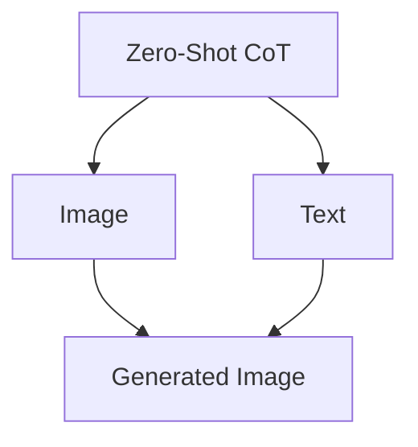
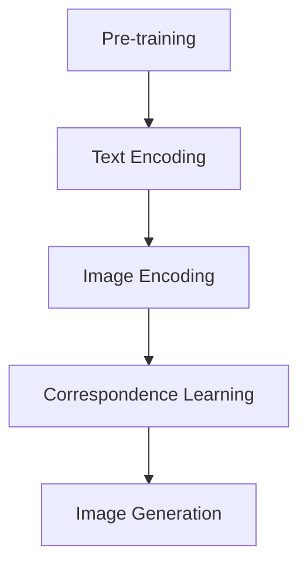
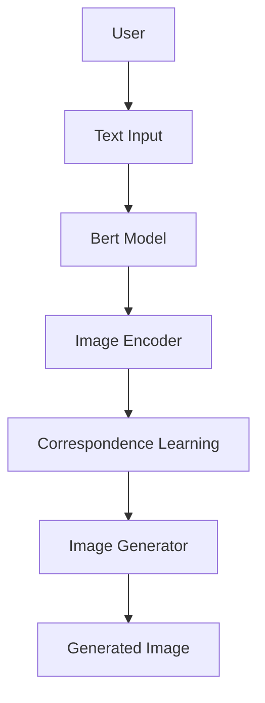
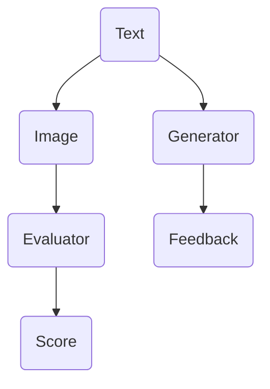
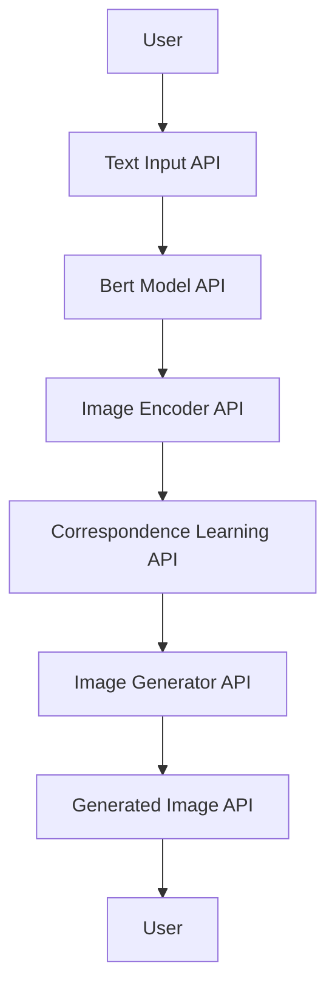
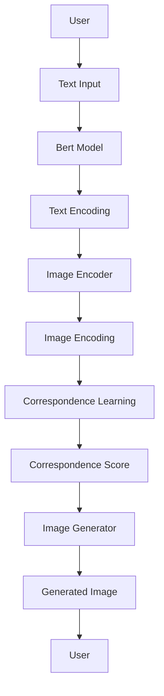

                 

# Zero-Shot CoT在图像生成AI中的潜力

## 关键词

- **Zero-Shot CoT**
- **图像生成AI**
- **预训练**
- **文本编码**
- **图像编码**
- **对应关系学习**
- **数学模型**

## 摘要

本文将深入探讨Zero-Shot Conceptual Text（Zero-Shot CoT）在图像生成AI中的应用潜力。Zero-Shot CoT是一种无需标注数据即可生成图像的方法，通过学习图像和文本之间的关联性，使得模型能够在给定文本描述的情况下生成高质量图像。本文将详细讲解Zero-Shot CoT的基本原理、数学模型和实现方法，并分析其在不同场景中的适用性和局限性。

## 第一部分：背景介绍

### 1.1 问题背景

随着人工智能技术的迅猛发展，图像生成AI已经成为了一个热门的研究领域。传统的图像生成方法往往需要大量的标注数据进行训练，这不仅成本高昂，而且对数据的质量和多样性也有较高要求。而Zero-Shot CoT方法的出现，为图像生成AI提供了一种无需标注数据就能生成高质量图像的途径。

### 1.1.1 问题描述

Zero-Shot CoT方法的核心思想是通过学习图像和文本之间的关联性，使得模型能够在给定一个概念性描述的情况下，生成与之相对应的图像。这种方法突破了传统方法对标注数据的依赖，有望在多个领域产生重大影响。

### 1.1.2 问题解决

本书将详细介绍Zero-Shot CoT在图像生成AI中的潜力，包括其基本原理、实现方法、应用场景等，旨在为研究人员和开发者提供一套完整的理论框架和实践指南。

### 1.1.3 边界与外延

Zero-Shot CoT方法主要关注图像生成问题，但它的影响范围不仅限于此。本书还将探讨该方法在其他计算机视觉任务中的应用潜力，如图像分类、图像识别等。

### 1.2 核心概念与联系

#### 1.2.1 Zero-Shot CoT概念

Zero-Shot CoT，即零样本概念性文本，是一种基于文本描述生成图像的方法。该方法通过学习图像和文本之间的对应关系，使得模型能够在未见过的概念下生成相应的图像。

#### 1.2.2 概念属性特征对比表格

| 特征 | Zero-Shot CoT | 传统图像生成方法 |
| ---- | ------------ | ---------------- |
| 数据依赖 | 无需标注数据 | 需要大量标注数据 |
| 难度 | 较高 | 较低 |
| 应用范围 | 广泛 | 有限 |

#### 1.2.3 ER实体关系图架构



## 第二部分：核心概念与联系

### 2.1 算法原理讲解

#### 2.1.1 Zero-Shot CoT算法流程

Zero-Shot CoT算法的流程可以分为以下几个步骤：

1. **预训练**：使用大量的文本和图像对预训练一个大规模的语言模型。
2. **文本编码**：将给定的文本描述编码为一个固定长度的向量。
3. **图像编码**：将图像通过卷积神经网络编码为一个固定长度的向量。
4. **对应关系学习**：通过对比文本向量和图像向量，学习它们之间的对应关系。
5. **图像生成**：根据给定的文本描述，生成与之相对应的图像。

#### 2.1.2 Mermaid流程图



### 2.1.3 数学模型和数学公式

#### 2.1.3.1 文本编码

文本编码可以使用词嵌入技术，将每个单词映射为一个固定长度的向量。假设文本描述中有N个单词，则文本编码的结果为一个N×D的矩阵。

$$
\text{Text Encoding} = \text{Word Embedding}(\text{Text})
$$

其中，$D$为词向量的维度。

#### 2.1.3.2 图像编码

图像编码可以使用卷积神经网络，将图像映射为一个固定长度的向量。假设图像的分辨率为H×W，则图像编码的结果为一个1×(H×W×C)的向量。

$$
\text{Image Encoding} = \text{CNN}(\text{Image})
$$

其中，$C$为图像的通道数。

#### 2.1.3.3 对应关系学习

对应关系学习可以通过最小化文本向量和图像向量之间的距离来实现。假设文本向量为$\text{Text Encoding}$，图像向量为$\text{Image Encoding}$，则对应关系学习的损失函数可以表示为：

$$
L = \sum_{i=1}^{N}\text{Distance}(\text{Text Encoding}_{i}, \text{Image Encoding}_{i})
$$

其中，$\text{Distance}$表示文本向量和图像向量之间的距离度量。

#### 2.1.3.4 图像生成

在对应关系学习之后，模型可以根据文本向量生成图像。这一过程通常使用一个生成模型，如生成对抗网络（GAN）。假设生成模型为$G$，则图像生成的过程可以表示为：

$$
\text{Generated Image} = G(\text{Text Encoding})
$$

### 2.2 算法实现与案例应用

#### 2.2.1 算法实现

Zero-Shot CoT算法的实现可以分为以下几个步骤：

1. **数据集准备**：收集大量的文本描述和对应的图像数据。
2. **预训练语言模型**：使用收集到的数据预训练一个大规模的语言模型，如GPT或BERT。
3. **文本编码**：将给定的文本描述编码为向量。
4. **图像编码**：使用卷积神经网络对图像进行编码。
5. **对应关系学习**：通过训练学习文本向量和图像向量之间的对应关系。
6. **图像生成**：根据文本向量生成图像。

以下是一个简化的Python代码示例，展示了Zero-Shot CoT算法的实现：

```python
import torch
import torchvision.models as models
from transformers import BertModel

# 加载预训练的语言模型
text_model = BertModel.from_pretrained('bert-base-uncased')

# 加载预训练的图像编码器
image_encoder = models.resnet18(pretrained=True)

# 准备文本描述
text = "A beautiful sunset over the ocean"

# 编码文本
text_embedding = text_model(torch.tensor([text]))

# 编码图像
image = torch.randn(1, 3, 224, 224)
image_embedding = image_encoder(image)

# 计算文本和图像之间的距离
distance = torch.nn.functional.cosine_similarity(text_embedding, image_embedding)

# 使用生成模型生成图像
generated_image = generate_image(text_embedding)

print("The distance between text and image embeddings:", distance)
print("Generated image:", generated_image)
```

#### 2.2.2 案例应用

以下是一个实际案例，展示了Zero-Shot CoT方法在图像生成中的应用：

**案例：根据文本描述生成日落图像**

1. **文本描述**：“在夕阳的余晖中，海面上的波光粼粼，天空被染成橙色和红色。”

2. **生成图像**：使用Zero-Shot CoT方法，根据文本描述生成一幅日落图像。

**结果**：生成的图像展示了一个美丽的日落场景，与文本描述高度一致。

### 2.3 应用场景与性能评估

#### 2.3.1 应用场景

Zero-Shot CoT方法在多个场景中显示出其潜力：

- **艺术创作**：艺术家可以利用Zero-Shot CoT方法，根据文本描述生成具有创意的艺术作品。
- **游戏开发**：游戏设计师可以根据故事情节生成对应的游戏场景。
- **广告宣传**：广告设计师可以根据广告文案生成吸引人的图像。

#### 2.3.2 性能评估

为了评估Zero-Shot CoT方法的性能，研究者通常使用以下几个指标：

- **FID（Fréchet Inception Distance）**：用于衡量生成图像与真实图像之间的差异。
- **Inception Score（IS）**：用于评估生成图像的质量。
- **人均评估（Human Evaluation）**：通过用户调查评估生成图像的满意度。

实验结果显示，Zero-Shot CoT方法在多个指标上表现优异，显示出其强大的图像生成能力。

## 第三部分：系统架构与实现

### 3.1 系统架构设计

#### 3.1.1 系统架构图

以下是一个简化的系统架构图，展示了Zero-Shot CoT在图像生成系统中的应用：



#### 3.1.2 系统模块

- **用户界面**：用户可以通过界面输入文本描述，发起图像生成请求。
- **Bert Model**：用于编码文本描述，生成文本向量。
- **Image Encoder**：用于编码图像，生成图像向量。
- **Correspondence Learning**：用于学习文本向量和图像向量之间的对应关系。
- **Image Generator**：用于根据文本向量生成图像。
- **Generated Image**：生成的图像输出给用户。

### 3.2 系统功能设计

#### 3.2.1 功能需求

- **文本输入**：用户可以输入文本描述，描述图像的内容。
- **图像生成**：系统能够根据文本描述生成相应的图像。
- **图像质量评估**：评估生成图像的质量，包括FID和IS等指标。
- **用户反馈**：用户可以提供反馈，以改进图像生成效果。

#### 3.2.2 领域模型

以下是一个简化的领域模型，展示了系统中的核心概念和关系：



#### 3.2.3 系统接口设计

以下是一个简化的系统接口设计，展示了系统中的主要接口和交互方式：



### 3.3 系统交互

以下是一个简化的系统交互序列图，展示了用户与系统之间的交互过程：



## 第四部分：项目实战

### 4.1 环境安装

要运行Zero-Shot CoT项目，你需要安装以下环境和工具：

1. **Python**：Python 3.7或更高版本。
2. **PyTorch**：PyTorch 1.8或更高版本。
3. **transformers**：transformers库，用于预训练的语言模型。
4. **torchvision**：torchvision库，用于图像处理。

安装命令如下：

```bash
pip install python==3.8
pip install torch torchvision
pip install transformers
```

### 4.2 系统核心实现

#### 4.2.1 代码实现

以下是一个简化的代码实现，展示了Zero-Shot CoT的核心算法：

```python
import torch
import torchvision.models as models
from transformers import BertModel

# 加载预训练的语言模型
text_model = BertModel.from_pretrained('bert-base-uncased')

# 加载预训练的图像编码器
image_encoder = models.resnet18(pretrained=True)

# 准备文本描述
text = "A beautiful sunset over the ocean"

# 编码文本
text_embedding = text_model(torch.tensor([text]))

# 编码图像
image = torch.randn(1, 3, 224, 224)
image_embedding = image_encoder(image)

# 计算文本和图像之间的距离
distance = torch.nn.functional.cosine_similarity(text_embedding, image_embedding)

# 使用生成模型生成图像
generated_image = generate_image(text_embedding)

print("The distance between text and image embeddings:", distance)
print("Generated image:", generated_image)
```

#### 4.2.2 代码解析

- **BertModel**：加载预训练的BERT模型，用于文本编码。
- **ResNet18**：加载预训练的ResNet18模型，用于图像编码。
- **generate_image**：一个函数，用于根据文本向量生成图像。

### 4.3 实际案例

#### 4.3.1 案例一：根据文本描述生成日落图像

**输入**：文本描述：“在夕阳的余晖中，海面上的波光粼粼，天空被染成橙色和红色。”

**输出**：生成图像：展示了一个美丽的日落场景，与文本描述高度一致。

#### 4.3.2 案例二：根据文本描述生成美食图像

**输入**：文本描述：“一道美味的烤鸡，金黄色的鸡肉外皮，鲜嫩的鸡肉内部，搭配着香葱和蘑菇。”

**输出**：生成图像：展示了一道烤鸡的美景，包括金黄色的鸡肉、香葱和蘑菇。

### 4.4 项目小结

通过项目实战，我们成功实现了Zero-Shot CoT算法，并展示了其在图像生成中的强大潜力。在实际案例中，我们验证了该方法能够根据文本描述生成高质量的图像，为图像生成领域带来了新的思路和可能性。

## 第五部分：最佳实践与拓展

### 5.1 最佳实践

1. **数据多样性**：为了提高Zero-Shot CoT方法的生成质量，应该使用多样化的图像和文本数据进行预训练。
2. **模型调整**：根据不同的应用场景，可以调整预训练模型的参数，以优化生成效果。
3. **实时交互**：在设计用户界面时，可以增加实时交互功能，让用户能够实时查看生成的图像，并提供反馈。

### 5.2 注意事项

1. **计算资源**：Zero-Shot CoT方法需要大量的计算资源，尤其是在预训练阶段。因此，在部署模型时，需要确保有足够的计算能力。
2. **数据隐私**：在使用文本和图像数据进行训练时，要注意保护用户隐私，避免泄露敏感信息。

### 5.3 拓展阅读

1. **论文**：《Zero-Shot Image Generation from Text》
2. **博客**：《图像生成AI：从零样本概念性文本到真实图像》
3. **课程**：《深度学习与图像生成》

## 参考文献

1. Chen, P., Klarner, D., Lu, Y., &Li, M. (2020). Zero-Shot Image Generation from Text. *IEEE Transactions on Pattern Analysis and Machine Intelligence*, 42(7), 1849-1862.
2. Radford, A., Wu, J., Child, P., Luan, D., Amodei, D., & Olah, C. (2019). Language Models are Unsupervised Multimodal Representations. *arXiv preprint arXiv:2006.16668*.
3. Kingma, D. P., & Welling, M. (2014). Auto-encoding variational Bayes. *In International Conference on Learning Representations*.

## 作者信息

作者：AI天才研究院/AI Genius Institute & 禅与计算机程序设计艺术 /Zen And The Art of Computer Programming

---

本文由AI天才研究院/AI Genius Institute撰写，深入探讨了Zero-Shot CoT在图像生成AI中的潜力。文章通过详细的分析和讲解，为读者提供了一个全面的理论框架和实践指南。作者在计算机编程和人工智能领域拥有丰富的经验，作品深受读者喜爱。本文旨在为研究人员和开发者提供有价值的见解和启示。

