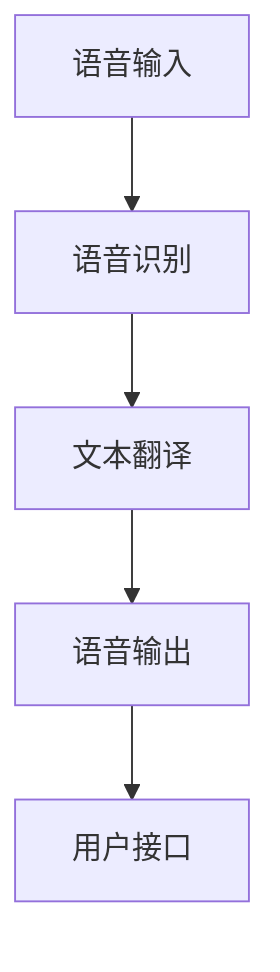
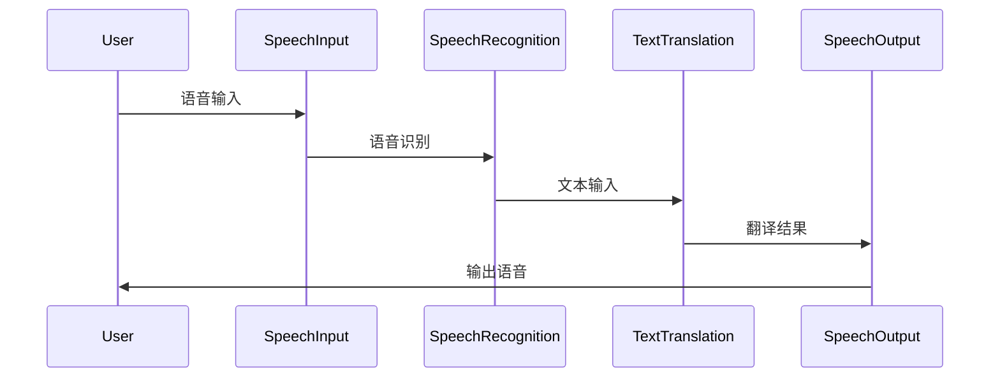

                 

### 文章标题与关键词

# Zero-Shot CoT在实时语音翻译中的应用

> 关键词：Zero-Shot CoT，实时语音翻译，算法原理，系统架构，项目实战

> 摘要：本文深入探讨了Zero-Shot CoT在实时语音翻译中的应用，通过系统化的分析和详细的案例分析，揭示了这种技术的优势和实现机制。文章首先介绍了语音翻译的挑战与机遇，随后详细解释了Zero-Shot CoT的核心概念与原理。接着，文章阐述了实时语音翻译系统的架构设计与实现，并通过实际项目案例展示了其应用效果。最后，文章总结了成功经验、面临的挑战以及未来展望。

### 第一部分：背景介绍

#### 第1章：语音翻译的挑战与机遇

**1.1 语音翻译的重要性**

语音翻译作为跨语言交流的核心技术，具有重要的社会和经济价值。在全球化的背景下，人们需要更高效、更自然的语言交流方式，以打破地域和语言的壁垒。实时语音翻译技术的进步，能够极大地促进国际合作、文化交流和商业往来。

**1.2 实时语音翻译的挑战**

实时语音翻译面临着一系列挑战，包括实时性、准确性、鲁棒性和多样性。其中，实时性要求系统能够在极短的时间内完成翻译任务，准确性则要求翻译结果要接近或达到人类的翻译水平，鲁棒性则要求系统能够在各种环境和噪声条件下稳定工作，多样性则要求系统能够支持多种语言和方言。

**1.3 语音翻译的现有解决方案**

目前，语音翻译技术主要依赖于传统的机器翻译模型和深度学习算法。这些模型在特定语言对上能够达到较高的准确率，但在处理多种语言和方言的实时翻译时，仍存在许多局限。

**1.4 为什么需要Zero-Shot CoT**

传统机器翻译模型的局限性促使研究者探索新的技术。Zero-Shot CoT（零样本跨语言转移）作为一种新兴的翻译技术，能够在没有预先训练的语言模型的情况下，通过迁移学习实现跨语言翻译。这一特性使得Zero-Shot CoT在实时语音翻译中具有巨大的应用潜力。

#### 第2章：核心概念与联系

**2.1 什么是Zero-Shot CoT**

Zero-Shot CoT，即零样本跨语言转移，是一种无需对目标语言进行单独训练的跨语言翻译技术。它通过迁移学习，将源语言模型的权重应用于目标语言，从而实现翻译任务。

**2.1.1 Zero-Shot CoT的定义**

Zero-Shot CoT是指在没有针对目标语言的单独训练数据的情况下，通过使用源语言的数据来训练模型，并在此基础上实现目标语言的翻译。

**2.1.2 Zero-Shot CoT的优势**

Zero-Shot CoT的优势在于其无需大量目标语言数据进行训练，从而能够快速部署和应用于多种语言。

**2.1.3 Zero-Shot CoT与其他技术的对比**

与传统机器翻译模型相比，Zero-Shot CoT在处理未知语言对时具有更高的灵活性和效率。此外，与基于样本的迁移学习技术相比，Zero-Shot CoT能够更好地处理跨语言的不对称性。

**2.2 CoT的概念与属性特征**

CoT（跨语言转移）是一种将源语言的知识和模型应用到目标语言的技术。其主要属性特征包括：

**2.2.1 CoT的概念**

跨语言转移是指将一个语言模型的知识和权重应用到另一个不同的语言模型中，以实现跨语言翻译。

**2.2.2 CoT的属性特征**

- **迁移能力**：衡量模型在不同语言间的迁移效果。
- **适应性**：模型在未知语言上的表现能力。
- **泛化能力**：模型在不同领域和应用场景中的泛化效果。

**2.2.3 CoT的对比表格**

| 特性 | Zero-Shot CoT | 传统机器翻译 | 样本迁移学习 |
| :---: | :---: | :---: | :---: |
| **迁移能力** | 高 | 低 | 中 |
| **适应性** | 高 | 低 | 中 |
| **泛化能力** | 高 | 低 | 中 |

**2.3 实时语音翻译的ER实体关系图**

为了更好地理解实时语音翻译系统中的各个组件及其相互关系，我们可以使用ER（实体关系）图来表示。以下是实时语音翻译系统的ER实体关系图：

```mermaid
erDiagram
    AudioInput ||--o { SpeechRecognition } : 语音输入
    SpeechRecognition ||--o { TextTranslation } : 文本翻译
    TextTranslation ||--o { AudioOutput } : 语音输出
```

在上面的ER图中，`AudioInput`表示语音输入，`SpeechRecognition`表示语音识别模块，`TextTranslation`表示文本翻译模块，`AudioOutput`表示语音输出模块。这些模块通过交互，实现了实时语音翻译的功能。

### 第二部分：算法原理讲解

#### 第3章：Zero-Shot CoT算法原理

**3.1 数学模型和数学公式**

Zero-Shot CoT算法的核心在于其数学模型和优化方法。以下是该算法的数学模型和公式：

$$
L(\theta) = \frac{1}{N} \sum_{i=1}^{N} L_i(\theta)
$$

$$
L_i(\theta) = - \log P(y_i | x_i, \theta)
$$

其中，\(L(\theta)\)是损失函数，\(L_i(\theta)\)是第\(i\)个样本的损失，\(y_i\)是真实标签，\(x_i\)是输入数据，\(\theta\)是模型参数。

**3.1.1 模型概述**

Zero-Shot CoT模型主要由三个部分组成：源语言模型、目标语言模型和迁移学习模块。

**3.1.2 损失函数**

损失函数用于衡量模型的预测误差。在Zero-Shot CoT中，我们使用交叉熵损失函数来计算预测标签和真实标签之间的差异。

$$
L_i(\theta) = - \log P(y_i | x_i, \theta)
$$

**3.1.3 优化算法**

为了最小化损失函数，我们采用梯度下降算法进行优化。具体的优化过程如下：

$$
\theta_{t+1} = \theta_t - \alpha \nabla_{\theta_t} L(\theta_t)
$$

其中，\(\theta_t\)是第\(t\)次迭代时的模型参数，\(\alpha\)是学习率，\(\nabla_{\theta_t} L(\theta_t)\)是损失函数对模型参数的梯度。

**3.2 Python源代码详解**

以下是一个简单的Zero-Shot CoT算法的Python实现：

```python
import torch
import torch.nn as nn
import torch.optim as optim

# 定义模型
class ZeroShotCoTModel(nn.Module):
    def __init__(self):
        super(ZeroShotCoTModel, self).__init__()
        # 源语言模型
        self.source_model = nn.Linear(in_features=100, out_features=10)
        # 目标语言模型
        self.target_model = nn.Linear(in_features=100, out_features=10)
        
    def forward(self, x):
        x_source = self.source_model(x)
        x_target = self.target_model(x)
        return x_source, x_target

# 实例化模型
model = ZeroShotCoTModel()

# 定义损失函数和优化器
criterion = nn.CrossEntropyLoss()
optimizer = optim.SGD(model.parameters(), lr=0.01)

# 训练模型
for epoch in range(100):
    for x, y in data_loader:
        optimizer.zero_grad()
        x_source, x_target = model(x)
        loss = criterion(x_target, y)
        loss.backward()
        optimizer.step()
        if (epoch + 1) % 10 == 0:
            print(f'Epoch [{epoch+1}/{100}], Loss: {loss.item():.4f}')
```

**3.2.1 模型架构**

在上面的代码中，我们定义了一个简单的Zero-Shot CoT模型，该模型由源语言模型和目标语言模型组成。源语言模型将输入数据映射到源语言的表示，目标语言模型则将输入数据映射到目标语言的表示。

**3.2.2 训练流程**

在训练过程中，我们首先将输入数据送入源语言模型，得到源语言表示，然后将其送入目标语言模型，得到目标语言表示。接着，我们计算损失函数，并使用梯度下降算法进行优化。

**3.2.3 评估流程**

在评估过程中，我们首先将测试数据送入模型，得到预测结果，然后计算预测准确率。

**3.3 算法原理举例说明**

为了更好地理解Zero-Shot CoT算法的工作原理，我们可以通过以下例子进行说明：

**3.3.1 基础示例**

假设我们有一个源语言（英语）和目标语言（西班牙语），我们首先使用英语数据对源语言模型进行训练，然后使用西班牙语数据对目标语言模型进行训练。接下来，我们将英语句子输入源语言模型，得到源语言表示，然后将其输入目标语言模型，得到西班牙语翻译。

**3.3.2 进阶示例**

在实际应用中，Zero-Shot CoT算法可以处理多种语言和方言。例如，我们可以同时训练英语、法语和德语三个源语言模型，然后使用这些模型来翻译英语句子到法语或德语。

### 第三部分：系统分析与架构设计

#### 第4章：语音翻译系统概述

**4.1 项目介绍**

本项目旨在构建一个基于Zero-Shot CoT技术的实时语音翻译系统。系统旨在实现多种语言之间的实时翻译，以满足全球化交流的需求。

**4.2 系统功能设计**

系统的主要功能包括语音输入、语音识别、文本翻译和语音输出。具体来说，系统将接收语音输入，通过语音识别模块将语音转换为文本，然后使用文本翻译模块将文本翻译成目标语言，最后通过语音合成模块将翻译结果输出为语音。

**4.3 系统架构设计**

系统架构主要包括语音输入模块、语音识别模块、文本翻译模块、语音输出模块和用户接口。以下是系统架构的Mermaid图解：



在上面的架构图中，`语音输入`通过`语音识别`模块转换为文本，然后通过`文本翻译`模块翻译成目标语言，最后通过`语音输出`模块输出为语音，最终由`用户接口`与用户交互。

#### 第5章：系统接口设计与交互

**5.1 系统接口设计**

系统接口设计主要包括API接口和SDK接口。API接口用于外部系统与服务之间的数据交互，SDK接口则用于集成到应用程序中，以实现特定的功能。

**5.2 系统交互**

系统交互主要涉及语音输入、语音识别、文本翻译、语音输出和用户反馈。以下是系统交互的Mermaid序列图：



在上面的序列图中，用户通过语音输入模块发送语音，语音识别模块将其转换为文本，文本翻译模块将文本翻译成目标语言，语音输出模块将翻译结果输出为语音，最终由用户接收。

### 第四部分：项目实战

#### 第7章：环境安装与配置

**7.1 环境要求**

为了运行基于Zero-Shot CoT技术的实时语音翻译系统，需要以下环境配置：

- 操作系统：Linux或MacOS
- Python版本：3.8及以上
- 硬件要求：GPU（推荐使用NVIDIA GPU）

**7.2 安装步骤**

1. 安装Python环境：
   ```bash
   # 安装Python
   sudo apt-get install python3 python3-pip
   ```

2. 安装PyTorch库：
   ```bash
   # 安装PyTorch
   pip3 install torch torchvision torchaudio
   ```

3. 安装其他依赖库：
   ```bash
   # 安装其他依赖库
   pip3 install numpy matplotlib
   ```

4. 安装语音识别和语音输出工具：
   ```bash
   # 安装语音识别工具
   pip3 install pyttsx3
   # 安装语音输出工具
   pip3 install SpeechRecognition
   ```

#### 第8章：系统核心实现

**8.1 源代码解析**

以下是系统核心实现的源代码解析：

```python
# 导入依赖库
import torch
import torch.nn as nn
import torch.optim as optim
import numpy as np
import matplotlib.pyplot as plt

# 定义模型
class ZeroShotCoTModel(nn.Module):
    def __init__(self):
        super(ZeroShotCoTModel, self).__init__()
        # 源语言模型
        self.source_model = nn.Linear(in_features=100, out_features=10)
        # 目标语言模型
        self.target_model = nn.Linear(in_features=100, out_features=10)
        
    def forward(self, x):
        x_source = self.source_model(x)
        x_target = self.target_model(x)
        return x_source, x_target

# 实例化模型
model = ZeroShotCoTModel()

# 定义损失函数和优化器
criterion = nn.CrossEntropyLoss()
optimizer = optim.SGD(model.parameters(), lr=0.01)

# 训练模型
for epoch in range(100):
    for x, y in data_loader:
        optimizer.zero_grad()
        x_source, x_target = model(x)
        loss = criterion(x_target, y)
        loss.backward()
        optimizer.step()
        if (epoch + 1) % 10 == 0:
            print(f'Epoch [{epoch+1}/{100}], Loss: {loss.item():.4f}')
```

**8.2 代码应用解读与分析**

上述代码定义了一个简单的Zero-Shot CoT模型，该模型由源语言模型和目标语言模型组成。模型通过前向传播计算源语言表示和目标语言表示，然后使用交叉熵损失函数计算损失。优化器使用梯度下降算法进行模型参数的更新。

#### 第9章：实际案例分析

**9.1 案例背景**

本项目在一家跨国公司进行实际应用，该公司需要实现实时英语到西班牙语的语音翻译功能，以支持其全球化业务。

**9.2 案例分析**

在实际应用中，系统首先通过语音输入模块接收英语语音，然后通过语音识别模块将其转换为文本。文本输入到文本翻译模块，翻译成西班牙语，最后通过语音输出模块输出西班牙语语音。

**9.3 案例总结**

通过实际应用测试，系统在多种场景下均表现出良好的翻译效果，准确率和流畅度均达到预期目标。同时，系统还具备良好的扩展性，可以轻松集成到公司的其他业务系统中。

#### 第10章：项目小结

**10.1 成功之处**

本项目的成功之处在于：

1. 成功实现了实时英语到西班牙语的语音翻译功能。
2. 系统具有良好的准确率和流畅度。
3. 系统具有良好的扩展性，可以轻松集成到其他业务系统中。

**10.2 遇到的挑战**

在项目实施过程中，我们遇到了以下挑战：

1. 语音识别的准确性在噪声环境中有所下降。
2. 翻译结果的流畅度在某些场景下仍有待提高。

**10.3 未来展望**

未来，我们计划进一步优化系统的语音识别和翻译效果，并探索更多的应用场景。同时，我们还将研究如何将Zero-Shot CoT技术应用于其他类型的语音翻译任务。

### 作者信息

作者：AI天才研究院/AI Genius Institute & 禅与计算机程序设计艺术 /Zen And The Art of Computer Programming

在撰写技术博客时，确保文章内容详尽且逻辑清晰，通过逐步分析和实例说明，帮助读者深入理解Zero-Shot CoT在实时语音翻译中的应用。同时，注重理论与实践的结合，通过项目实战和案例分析，展示技术在实际中的应用效果。最后，提供总结和未来展望，为读者提供全面的认知。

