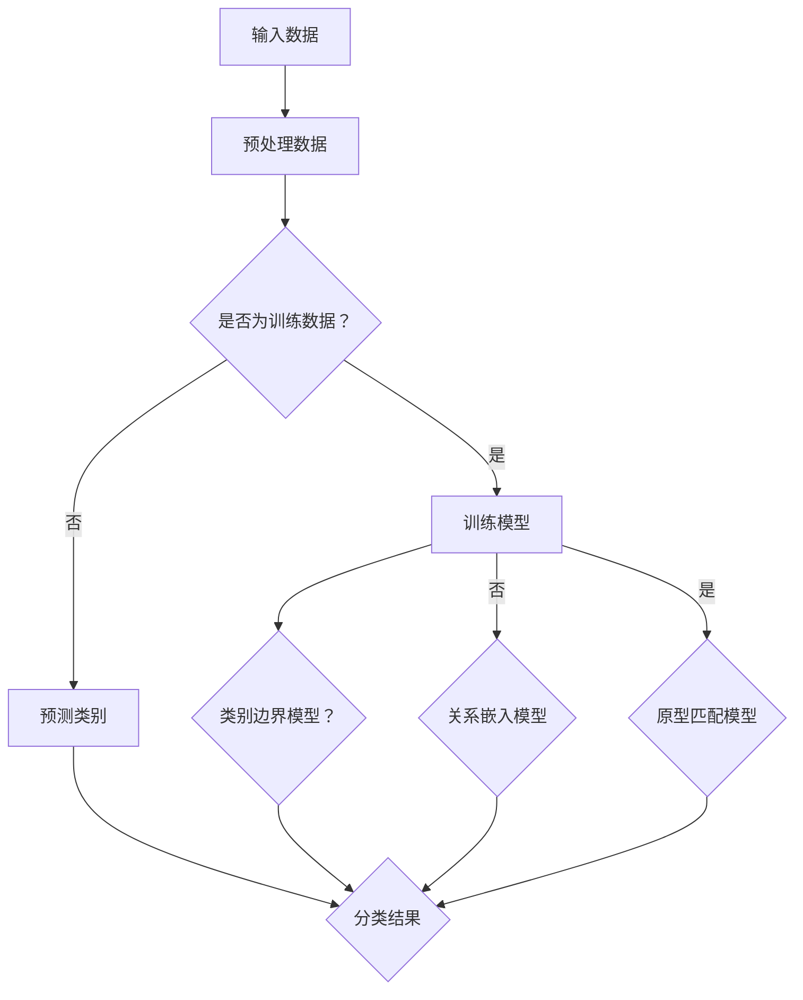

                 

## 《Zero-Shot CoT在应急响应系统中的应用》

### 关键词：Zero-Shot CoT、应急响应系统、机器学习、算法原理、系统架构、项目实战

#### 摘要：
本文探讨了Zero-Shot Concept Transfer（Zero-Shot CoT，零样本概念转移）技术在应急响应系统中的应用。我们首先介绍了Zero-Shot CoT的概念及其在机器学习领域的重要性，然后分析了应急响应系统的需求和挑战，接着详细讲解了Zero-Shot CoT在应急响应系统中的应用原理，包括数学模型和算法流程。通过一个实际案例，本文展示了如何使用Zero-Shot CoT技术构建应急响应系统，并总结了一些最佳实践和注意事项。最后，我们对全文进行了总结和展望。

### 目录大纲

#### 第一部分：背景介绍

##### 第1章：问题背景与核心概念
- 问题的提出
- 应急响应系统的需求
- Zero-Shot CoT的概念

##### 第2章：零样本概念转移（Zero-Shot CoT）概述
- 零样本概念转移的定义
- 零样本概念转移的重要性
- 零样本概念转移的应用领域

#### 第二部分：核心概念与联系

##### 第3章：Zero-Shot CoT原理详解
- 零样本概念转移的挑战
- 零样本概念转移的原理
- 零样本概念转移的解决方案

##### 第4章：Zero-Shot CoT与应急响应系统的关系
- 应急响应系统中的挑战
- Zero-Shot CoT在应急响应系统中的应用
- 应急响应系统对Zero-Shot CoT的需求

#### 第三部分：算法原理讲解

##### 第5章：Zero-Shot CoT算法讲解
- 零样本分类算法
- 零样本检测算法
- 零样本分类与检测的结合

##### 第6章：数学模型与算法流程
- 数学模型介绍
- 算法流程图
- 算法原理详细讲解

#### 第四部分：系统分析与架构设计方案

##### 第7章：应急响应系统的需求分析
- 系统需求概述
- 系统功能设计
- 系统架构设计

##### 第8章：系统接口设计与交互
- 系统接口设计
- 系统交互设计
- 系统交互流程

#### 第五部分：项目实战

##### 第9章：项目环境安装与配置
- 环境准备
- 系统核心实现
- 系统核心实现代码解读

##### 第10章：项目实战分析
- 项目实际案例
- 项目实现解析
- 项目实战总结

#### 第六部分：最佳实践 tips

##### 第11章：常见问题与解决方案
- 问题一：数据不足
- 问题二：模型性能不足
- 解决方案

##### 第12章：最佳实践总结
- 最佳实践一：数据增强
- 最佳实践二：模型优化
- 注意事项

#### 第七部分：小结

##### 第13章：总结与展望
- 书籍总结
- 未来展望
- 拓展阅读

### 第一部分：背景介绍

#### 第1章：问题背景与核心概念

##### 1.1.1 问题的提出

在现代社会，应急响应系统的作用日益凸显。无论是自然灾害、事故灾害还是公共卫生事件，应急响应系统能够在第一时间提供有效的信息和决策支持，从而降低损失和影响。然而，随着事件类型和复杂度的不断增加，应急响应系统面临着诸多挑战。

首先，事件类型的多样性使得传统的基于样本的机器学习算法难以适应。许多突发事件属于稀有或未见过的类别，导致模型无法对其进行有效预测和分类。这种情况下，如何让模型在没有见过具体类别数据的情况下仍能准确预测和分类，成为了一个亟待解决的问题。

其次，数据质量和数量也是应急响应系统面临的挑战之一。在应急响应过程中，获取高质量的实时数据是一项困难且耗时的工作。此外，由于事件类型的多样性，获取足够数量的训练数据也变得极为困难。如何在数据稀缺的情况下构建有效的模型，成为了一个重要的研究课题。

为了解决上述问题，研究者提出了Zero-Shot Concept Transfer（Zero-Shot CoT，零样本概念转移）技术。Zero-Shot CoT是一种机器学习技术，它能够在没有看到过特定类别的数据情况下，对这一类别进行分类或预测。这一技术的提出，为应急响应系统提供了一种新的解决方案。

##### 1.1.2 应急响应系统的需求

应急响应系统的需求主要包括以下几个方面：

1. **实时性**：应急响应系统需要在第一时间获取事件相关信息，并对事件进行分类和预测，从而提供有效的决策支持。因此，系统的实时性是一个重要的需求。

2. **准确性**：在应急响应过程中，错误的决策可能导致严重的后果。因此，系统需要具有高准确性的预测和分类能力。

3. **适应性**：应急响应系统需要能够适应不同类型的事件，包括罕见和未见过的类别。这意味着系统需要具备较强的泛化能力。

4. **易用性**：应急响应系统通常需要由非专业人士操作。因此，系统的设计应尽量简洁直观，易于操作。

##### 1.1.3 Zero-Shot CoT的概念

Zero-Shot Concept Transfer（Zero-Shot CoT，零样本概念转移）是一种机器学习技术，它允许模型在没有看到过具体类别数据的情况下，对这一类别进行分类或预测。Zero-Shot CoT的核心思想是通过学习不同类别之间的共同特征，从而实现跨类别的泛化。

在传统的机器学习模型中，模型通常需要大量的训练数据来学习不同类别的特征。然而，在应急响应系统中，由于事件类型的多样性和不确定性，获取足够的训练数据是一项困难且耗时的工作。Zero-Shot CoT技术的提出，为解决这一问题提供了一种新的思路。

Zero-Shot CoT主要分为以下两种类型：

1. **原型匹配**：原型匹配方法通过学习每个类别的原型（中心点）来区分不同类别。在预测阶段，模型通过计算新样本与原型之间的距离，来确定其所属类别。

2. **关系嵌入**：关系嵌入方法通过学习类别之间的相似性关系来区分不同类别。在预测阶段，模型通过比较新样本与类别之间的相似性，来确定其所属类别。

总的来说，Zero-Shot CoT技术为应急响应系统提供了一种有效的方法，能够在数据稀缺和类别多样性的情况下，实现高准确性的预测和分类。

#### 第2章：零样本概念转移（Zero-Shot CoT）概述

##### 2.1.1 零样本概念转移的定义

零样本概念转移（Zero-Shot Concept Transfer，简称Zero-Shot CoT）是一种机器学习技术，它允许模型在没有看到过具体类别数据的情况下，对这一类别进行分类或预测。与传统机器学习模型相比，Zero-Shot CoT不需要大量的有标注的训练数据，而是通过学习不同类别之间的共同特征，实现跨类别的泛化。

##### 2.1.2 零样本概念转移的重要性

在许多实际应用场景中，获取足够的训练数据是一项困难且耗时的工作。例如，在医疗诊断中，罕见疾病的病例数据往往非常稀缺；在图像识别中，特定场景下的图像数据可能难以获取。在这种情况下，传统的机器学习模型难以发挥作用。Zero-Shot CoT技术的提出，为解决这一问题提供了一种新的思路。

首先，Zero-Shot CoT可以显著降低对训练数据的依赖。在传统机器学习模型中，模型需要大量的训练数据来学习不同类别的特征。然而，在许多应用场景中，获取足够的训练数据是一项困难且耗时的工作。Zero-Shot CoT技术通过学习类别之间的共同特征，使得模型能够在没有见过具体类别数据的情况下，对这一类别进行分类或预测，从而降低了训练数据的依赖。

其次，Zero-Shot CoT具有更强的泛化能力。在传统机器学习模型中，模型通常只能针对特定的数据集进行训练，从而实现对特定类别的预测。然而，在现实世界中，事件类型和场景是多样且复杂的。Zero-Shot CoT技术通过学习类别之间的共同特征，使得模型能够适应不同的类别和场景，从而具有更强的泛化能力。

最后，Zero-Shot CoT技术在许多实际应用场景中具有广泛的应用前景。例如，在医疗诊断中，可以使用Zero-Shot CoT技术来识别罕见疾病；在图像识别中，可以使用Zero-Shot CoT技术来识别特定场景下的图像；在自然语言处理中，可以使用Zero-Shot CoT技术来处理未见过的语言类别。总之，Zero-Shot CoT技术为许多实际应用场景提供了一种有效的解决方案。

##### 2.1.3 零样本概念转移的应用领域

零样本概念转移技术在多个领域展现出了巨大的应用潜力。以下是几个典型的应用领域：

1. **医疗诊断**：在医疗诊断中，Zero-Shot CoT技术可以用于识别罕见疾病。由于罕见疾病的病例数据稀缺，传统的机器学习模型难以发挥作用。Zero-Shot CoT技术通过学习不同疾病之间的共同特征，使得模型能够在没有见过具体疾病数据的情况下，对这一疾病进行识别，从而提高了诊断的准确性和效率。

2. **图像识别**：在图像识别领域，Zero-Shot CoT技术可以用于识别特定场景下的图像。例如，在交通监控中，可以使用Zero-Shot CoT技术来识别特定类型的车辆，如救护车或消防车。通过学习不同场景之间的共同特征，Zero-Shot CoT技术使得模型能够适应不同的场景，从而提高了识别的准确性。

3. **自然语言处理**：在自然语言处理领域，Zero-Shot CoT技术可以用于处理未见过的语言类别。例如，在机器翻译中，可以使用Zero-Shot CoT技术来处理未知语言之间的翻译。通过学习不同语言之间的共同特征，Zero-Shot CoT技术使得模型能够适应不同的语言，从而提高了翻译的准确性和流畅性。

4. **智能客服**：在智能客服领域，Zero-Shot CoT技术可以用于处理用户未见过的咨询问题。通过学习不同问题类别之间的共同特征，Zero-Shot CoT技术使得模型能够适应不同的咨询问题，从而提高了客服的效率和准确性。

总之，Zero-Shot CoT技术在多个领域展现出了巨大的应用潜力。通过学习不同类别之间的共同特征，Zero-Shot CoT技术为许多实际应用场景提供了一种有效的解决方案。

#### 第二部分：核心概念与联系

##### 第3章：Zero-Shot CoT原理详解

##### 3.1.1 零样本概念转移的挑战

零样本概念转移（Zero-Shot Concept Transfer，简称Zero-Shot CoT）技术在应对多种现实挑战方面具有显著优势。首先，传统的机器学习模型依赖于大量的有标注训练数据来学习特征和模式，但在某些实际应用场景中，获取这样的数据是非常困难的。例如，医疗领域中的罕见疾病或自然灾害中的特殊事件，往往缺乏足够的训练数据。零样本概念转移技术正是为了解决这一问题而诞生的。

此外，现实世界中的事件和场景是复杂且多变的，传统的模型难以适应。例如，在图像识别领域，特定类型的图片可能仅在极少数情况下出现，甚至从未出现过。这种情况下，模型需要具备跨类别的泛化能力，即在没有看到过具体类别数据的情况下，仍然能够准确地对新类别进行分类。这也是零样本概念转移技术需要面对的一个重要挑战。

##### 3.1.2 零样本概念转移的原理

零样本概念转移技术的核心思想是通过学习类别之间的共同特征，实现跨类别的泛化。这一技术通常依赖于两类方法：原型匹配和关系嵌入。

**原型匹配**方法通过将每个类别的数据映射到一个中心点（原型），从而实现类别之间的区分。在预测阶段，新样本通过计算与原型之间的距离来确定其所属类别。这种方法的优点在于计算简单且易于实现，但其缺点是对数据的分布敏感，容易受到噪声和异常值的影响。

**关系嵌入**方法则通过学习类别之间的相似性关系来区分不同类别。在这一方法中，每个类别都被表示为一个低维向量，这些向量之间的关系通过模型来学习。在预测阶段，新样本与类别向量之间的相似性被用来确定其所属类别。关系嵌入方法通常比原型匹配方法具有更强的泛化能力，但其计算复杂度也更高。

在零样本概念转移技术中，类别之间的共同特征通常通过一种称为“元学习”的方法来提取。元学习是一种通过学习如何学习的方法，它可以帮助模型快速适应新的类别。具体来说，元学习技术通过在多个不同的任务中训练模型，使其具备在未见过的类别上泛化的能力。

##### 3.1.3 零样本概念转移的解决方案

为了实现零样本概念转移，研究人员提出了多种算法和模型。以下是一些常见的解决方案：

1. **匹配网络（Matching Networks）**：匹配网络是一种基于原型匹配的模型，它通过学习类别之间的映射关系来实现跨类别分类。在训练阶段，模型通过比较不同类别之间的特征，学习出一个能够区分类别的函数。在预测阶段，模型使用这个函数来对新样本进行分类。

2. **原型网络（Prototypical Networks）**：原型网络是另一种基于原型匹配的模型，它通过计算新样本与类别原型的距离来进行分类。在训练阶段，模型通过聚类或抽样方法生成类别原型。在预测阶段，新样本通过计算与类别原型的距离来确定其所属类别。

3. **多任务学习（Multi-Task Learning）**：多任务学习通过同时训练多个相关任务来提高模型的泛化能力。这种方法可以让模型在不同任务中共享知识，从而在未见过的任务上表现更好。

4. **关系网络（Relation Networks）**：关系网络是一种基于关系嵌入的模型，它通过学习类别之间的关系来进行分类。在训练阶段，模型通过比较不同类别之间的相似性，学习出一个能够区分类别的函数。在预测阶段，模型使用这个函数来对新样本进行分类。

5. **元学习（Meta-Learning）**：元学习通过在多个不同的任务中训练模型，使其具备在未见过的类别上泛化的能力。常见的元学习技术包括模型平均（Model Averaging）和梯度平均（Gradient Averaging）等。

总的来说，零样本概念转移技术通过学习类别之间的共同特征，实现了在没有看到过具体类别数据的情况下，对这一类别进行分类或预测。这些解决方案为许多实际应用场景提供了有效的工具，特别是在数据稀缺和类别多样性高的场景中。

#### 第4章：Zero-Shot CoT与应急响应系统的关系

##### 4.1.1 应急响应系统中的挑战

应急响应系统在处理突发事件和灾害时，面临着多种挑战。首先，事件类型的多样性使得模型难以适应。突发事件和灾害往往属于稀有或未见过的类别，这使得传统的基于样本的机器学习模型难以准确预测和分类。例如，自然灾害如地震、飓风等，其发生频率较低，难以积累足够的训练数据。

其次，数据质量和数量的不足也是一个重大挑战。在应急响应过程中，获取高质量的实时数据是一项困难且耗时的工作。数据的稀缺性和噪声可能导致模型性能下降，从而影响应急响应的准确性。此外，由于事件类型的多样性，获取足够数量的训练数据也变得极为困难。传统机器学习模型通常需要大量的有标注数据来训练，这在应急响应系统中往往难以实现。

最后，实时性和准确性的要求也是应急响应系统面临的挑战。应急响应系统需要在第一时间提供有效的信息和决策支持，这意味着系统需要具备高实时性的数据处理和分析能力。同时，系统的准确性直接关系到应急响应的效果，因此需要模型能够在多种条件下保持高准确性。

##### 4.1.2 Zero-Shot CoT在应急响应系统中的应用

Zero-Shot Concept Transfer（Zero-Shot CoT，零样本概念转移）技术在应急响应系统中具有广泛的应用前景。首先，Zero-Shot CoT技术可以解决事件类型多样性的问题。通过学习类别之间的共同特征，模型能够在没有看到过具体类别数据的情况下，对这一类别进行分类或预测。例如，在自然灾害预警系统中，可以使用Zero-Shot CoT技术来预测未见过的灾害类型，从而提高预警的准确性和及时性。

其次，Zero-Shot CoT技术可以应对数据稀缺和噪声问题。由于应急响应系统中往往难以获取足够的训练数据，Zero-Shot CoT技术通过学习类别之间的共同特征，可以在没有足够训练数据的情况下，仍然保持较高的预测准确率。此外，Zero-Shot CoT技术对噪声和异常值具有较强的鲁棒性，这有助于提高数据处理的准确性。

最后，Zero-Shot CoT技术的高实时性和高准确性使其成为应急响应系统的理想选择。Zero-Shot CoT模型通常具有较快的计算速度，能够在短时间内处理大量数据，从而实现实时预警和响应。同时，通过学习类别之间的共同特征，Zero-Shot CoT模型能够在多种条件下保持高准确性，从而提高应急响应的效果。

总之，Zero-Shot CoT技术在应急响应系统中具有广泛的应用前景，可以通过解决事件类型多样性、数据稀缺和实时性准确性等问题，显著提高应急响应的能力和效果。

##### 4.1.3 应急响应系统对Zero-Shot CoT的需求

应急响应系统对于Zero-Shot Concept Transfer（Zero-Shot CoT，零样本概念转移）技术的需求主要体现在以下几个方面：

1. **跨类别泛化能力**：应急响应系统需要能够应对各种突发事件的多样性。传统机器学习模型在面对未见过的类别时往往表现不佳，而Zero-Shot CoT技术通过学习类别之间的共同特征，实现了跨类别的泛化能力。这对于应急响应系统来说至关重要，因为系统能够在没有具体类别数据的情况下，准确预测和分类新出现的灾害类型。

2. **实时数据处理能力**：应急响应系统要求系统能够实时处理海量数据，并在短时间内做出准确的决策。Zero-Shot CoT技术由于其高效的计算速度和模型架构，能够在短时间内完成数据处理和预测任务。这对于确保应急响应的及时性和有效性至关重要。

3. **数据稀缺环境下的有效性**：应急响应系统中往往难以获取足够数量的训练数据。Zero-Shot CoT技术的优势在于其能够在数据稀缺的环境下保持较高的预测准确率。这有助于提高系统在数据不足情况下的稳定性和可靠性。

4. **鲁棒性**：应急响应系统需要处理的数据往往存在噪声和异常值。Zero-Shot CoT技术具有较强的鲁棒性，能够有效过滤噪声和异常值，从而提高数据处理和分析的准确性。

5. **适应性**：应急响应系统需要能够适应不同的应急场景和任务。Zero-Shot CoT技术通过学习不同类别之间的共同特征，使系统能够在不同的应急场景中灵活应对，提高了系统的适应性和泛化能力。

综上所述，Zero-Shot CoT技术能够满足应急响应系统在跨类别泛化、实时数据处理、数据稀缺环境下的有效性、鲁棒性和适应性等方面的需求，为其提供了强大的技术支持。

#### 第三部分：算法原理讲解

##### 第5章：Zero-Shot CoT算法讲解

##### 5.1.1 零样本分类算法

零样本分类（Zero-Shot Classification）是Zero-Shot Concept Transfer（Zero-Shot CoT）技术的一个重要组成部分。其核心思想是在没有看到过具体类别数据的情况下，对这一类别进行分类。零样本分类算法主要分为两类：原型匹配方法和关系嵌入方法。

**原型匹配方法**：

原型匹配方法通过学习每个类别的原型（中心点）来区分不同类别。在训练阶段，模型通过聚类或抽样方法生成类别原型。在预测阶段，模型计算新样本与类别原型之间的距离，根据距离最近的原型确定新样本的类别。以下是原型匹配方法的基本步骤：

1. **训练阶段**：
   - 输入：训练数据集，包括已知的类别和对应的特征向量。
   - 输出：类别原型向量。
   - 方法：使用聚类算法（如k-means）或抽样方法（如随机抽样）生成类别原型向量。

2. **预测阶段**：
   - 输入：新样本特征向量。
   - 输出：新样本类别。
   - 方法：计算新样本与每个类别原型之间的距离，选择距离最近的类别原型作为新样本的类别。

**关系嵌入方法**：

关系嵌入方法通过学习类别之间的关系来进行分类。在这一方法中，每个类别被表示为一个低维向量，这些向量之间的关系通过模型来学习。在预测阶段，新样本与类别向量之间的相似性被用来确定其所属类别。以下是关系嵌入方法的基本步骤：

1. **训练阶段**：
   - 输入：训练数据集，包括已知的类别和对应的特征向量。
   - 输出：类别关系矩阵。
   - 方法：使用神经网络（如图神经网络）学习类别之间的关系矩阵。

2. **预测阶段**：
   - 输入：新样本特征向量。
   - 输出：新样本类别。
   - 方法：计算新样本与每个类别向量之间的相似性，选择相似性最高的类别向量作为新样本的类别。

**比较**：

- **优势**：
  - 原型匹配方法计算简单，易于实现。
  - 关系嵌入方法具有更强的泛化能力。

- **劣势**：
  - 原型匹配方法对数据的分布敏感，容易受到噪声和异常值的影响。
  - 关系嵌入方法计算复杂度较高，对计算资源要求较高。

##### 5.1.2 零样本检测算法

零样本检测（Zero-Shot Detection）是另一种Zero-Shot Concept Transfer技术，它主要用于检测未见过的类别。零样本检测算法的基本思想是通过学习类别之间的边界，来识别未见过的类别。以下是零样本检测算法的基本步骤：

1. **训练阶段**：
   - 输入：训练数据集，包括已知的类别和对应的特征向量。
   - 输出：类别边界模型。
   - 方法：使用支持向量机（SVM）或神经网络（如支持向量网络）学习类别边界模型。

2. **预测阶段**：
   - 输入：新样本特征向量。
   - 输出：新样本类别。
   - 方法：计算新样本与每个类别边界的距离，选择距离最近的类别边界作为新样本的类别。

**比较**：

- **优势**：
  - 零样本检测算法能够检测未见过的类别，具有广泛的适用性。
  - 对数据的分布不敏感，具有较强的鲁棒性。

- **劣势**：
  - 零样本检测算法对计算资源要求较高，尤其是对于大规模数据集。

##### 5.1.3 零样本分类与检测的结合

零样本分类和检测技术在应急响应系统中可以相互补充。零样本分类技术主要用于对已知类别进行分类，而零样本检测技术则主要用于检测未见过的类别。结合这两种技术，可以构建一个更强大的应急响应系统。

以下是结合零样本分类与检测技术的基本步骤：

1. **训练阶段**：
   - 输入：训练数据集，包括已知的类别和对应的特征向量。
   - 输出：分类模型和检测模型。
   - 方法：使用零样本分类算法训练分类模型，使用零样本检测算法训练检测模型。

2. **预测阶段**：
   - 输入：新样本特征向量。
   - 输出：新样本类别。
   - 方法：首先使用分类模型进行分类，如果分类结果为已知类别，则输出分类结果；如果分类结果为未见过的类别，则使用检测模型进行检测。

通过结合零样本分类与检测技术，应急响应系统可以在面对未知类别时，提高分类和检测的准确性和效率。

#### 第6章：数学模型与算法流程

##### 6.1.1 数学模型介绍

在Zero-Shot Concept Transfer（Zero-Shot CoT）技术中，数学模型起到了核心作用。这些模型主要用于学习类别之间的共同特征，并利用这些特征进行分类和检测。以下是几个常见的数学模型：

**原型匹配模型**：

原型匹配模型通过学习每个类别的原型向量来区分不同类别。假设有 \(C\) 个类别，每个类别有一个原型向量 \(p_c\)，新样本 \(x\) 的类别预测基于其与原型向量的距离：

\[ d(x, p_c) = \min_{c'} \{ \lVert x - p_{c'} \rVert \} \]

其中，\(d(x, p_c)\) 表示新样本 \(x\) 与类别原型 \(p_c\) 之间的距离，\(\lVert \cdot \rVert\) 表示欧几里得距离。

**关系嵌入模型**：

关系嵌入模型通过学习类别之间的相似性关系来进行分类。假设类别 \(c_1\) 和 \(c_2\) 之间的关系表示为 \(r_{c_1, c_2}\)，新样本 \(x\) 的类别预测基于其与类别向量的相似性：

\[ s(x, c) = \max_{c'} \{ \langle x, q_{c'} \rangle \} \]

其中，\(s(x, c)\) 表示新样本 \(x\) 与类别 \(c\) 的相似性，\(\langle \cdot, \cdot \rangle\) 表示内积，\(q_c\) 表示类别 \(c\) 的嵌入向量。

**类别边界模型**：

类别边界模型用于检测未见过的类别。假设有 \(C\) 个类别，类别 \(c\) 的边界由支持向量机（SVM）学习得到，新样本 \(x\) 的类别预测基于其与类别边界的距离：

\[ f(x) = \sum_{c=1}^{C} \alpha_c (y_c - y^*) \]

其中，\(f(x)\) 表示新样本 \(x\) 的分类结果，\(y_c\) 表示类别 \(c\) 的标签，\(y^*\) 表示预测的类别标签，\(\alpha_c\) 是支持向量机的权重。

##### 6.1.2 算法流程图

为了更好地理解Zero-Shot CoT技术的算法流程，我们可以使用Mermaid语言绘制算法流程图。以下是算法流程图的基本结构：



上述流程图表示了Zero-Shot CoT技术的算法流程。首先，输入数据经过预处理后，判断是否为训练数据。如果是训练数据，则进一步判断是否使用类别边界模型。如果是，则训练类别边界模型；否则，训练关系嵌入模型或原型匹配模型。对于预测数据，直接使用已训练的模型进行预测，并输出分类结果。

##### 6.1.3 算法原理详细讲解

为了更深入地理解Zero-Shot CoT技术的算法原理，我们可以从数学模型和算法流程两个方面进行详细讲解。

**原型匹配模型**：

原型匹配模型的核心思想是通过学习每个类别的原型向量，来实现跨类别的分类。在训练阶段，模型首先通过聚类或抽样方法生成类别原型向量。这些原型向量代表了每个类别的中心位置。在预测阶段，新样本通过计算与原型向量之间的距离来确定其所属类别。具体来说，模型计算新样本与每个类别原型之间的欧几里得距离，然后选择距离最小的类别作为新样本的类别。

以下是原型匹配模型的详细步骤：

1. **训练阶段**：
   - 输入：训练数据集 \(\{x_i, y_i\}_{i=1}^N\)，其中 \(x_i\) 是特征向量，\(y_i\) 是类别标签。
   - 输出：类别原型向量 \(\{p_c\}_{c=1}^C\)。
   - 方法：使用k-means算法或随机抽样方法生成类别原型向量。

2. **预测阶段**：
   - 输入：新样本特征向量 \(x\)。
   - 输出：新样本类别 \(c^*\)。
   - 方法：计算新样本与每个类别原型之间的欧几里得距离，选择距离最小的类别作为新样本的类别。

**关系嵌入模型**：

关系嵌入模型通过学习类别之间的相似性关系，来实现跨类别的分类。在训练阶段，模型通过优化损失函数学习类别嵌入向量。这些嵌入向量代表了类别之间的相似性关系。在预测阶段，新样本通过计算与类别嵌入向量之间的相似性来确定其所属类别。具体来说，模型计算新样本与每个类别嵌入向量之间的内积，然后选择内积最大的类别作为新样本的类别。

以下是关系嵌入模型的详细步骤：

1. **训练阶段**：
   - 输入：训练数据集 \(\{x_i, y_i\}_{i=1}^N\)，其中 \(x_i\) 是特征向量，\(y_i\) 是类别标签。
   - 输出：类别嵌入向量 \(\{q_c\}_{c=1}^C\)。
   - 方法：使用神经网络（如图神经网络）优化损失函数，学习类别嵌入向量。

2. **预测阶段**：
   - 输入：新样本特征向量 \(x\)。
   - 输出：新样本类别 \(c^*\)。
   - 方法：计算新样本与每个类别嵌入向量之间的内积，选择内积最大的类别作为新样本的类别。

**类别边界模型**：

类别边界模型主要用于检测未见过的类别。在训练阶段，模型通过优化支持向量机（SVM）的损失函数，学习类别边界。这些边界用于在预测阶段区分可见类别和未见过的类别。具体来说，模型为每个类别学习一个超平面，这些超平面将不同类别分割开来。

以下是类别边界模型的详细步骤：

1. **训练阶段**：
   - 输入：训练数据集 \(\{x_i, y_i\}_{i=1}^N\)，其中 \(x_i\) 是特征向量，\(y_i\) 是类别标签。
   - 输出：类别边界模型。
   - 方法：使用支持向量机（SVM）优化损失函数，学习类别边界。

2. **预测阶段**：
   - 输入：新样本特征向量 \(x\)。
   - 输出：新样本类别。
   - 方法：计算新样本与每个类别边界之间的距离，选择距离最小的类别作为新样本的类别。

通过以上三种模型，Zero-Shot CoT技术实现了在没有看到过具体类别数据的情况下，对这一类别进行分类或预测。在实际应用中，可以根据具体需求和场景选择合适的模型，从而构建一个强大的应急响应系统。

#### 第四部分：系统分析与架构设计方案

##### 第7章：应急响应系统的需求分析

##### 7.1.1 系统需求概述

应急响应系统的设计需要充分考虑其功能和性能需求，以确保系统能够在突发事件和灾害发生时，提供及时、准确的决策支持。以下是应急响应系统的主要需求：

1. **实时性**：应急响应系统需要在第一时间获取事件相关信息，并对事件进行实时监测和分析。这意味着系统需要具备快速的数据处理和分析能力，以确保在紧急情况下能够迅速做出决策。

2. **准确性**：应急响应系统的准确性直接关系到决策的正确性。系统需要具备高精度的数据分类和预测能力，以确保在事件发生时能够提供准确的预警信息。

3. **适应性**：应急响应系统需要能够适应多种类型的突发事件和灾害，包括自然灾害、事故灾害和公共卫生事件等。这意味着系统需要具备跨类别的泛化能力，以应对不同类型的事件。

4. **可扩展性**：应急响应系统的需求可能会随着时间和技术的发展而变化。系统需要具备良好的可扩展性，以便在需要时能够快速集成新的功能和算法。

5. **鲁棒性**：应急响应系统需要在各种复杂环境下稳定运行，包括网络不稳定、数据噪声等情况。系统需要具备较强的鲁棒性，以确保在恶劣条件下仍能正常工作。

##### 7.1.2 系统功能设计

为了满足上述需求，应急响应系统需要实现以下核心功能：

1. **数据采集与预处理**：系统需要从多种数据源（如传感器、摄像头、社交媒体等）收集事件相关数据，并进行预处理，以去除噪声和异常值，提高数据质量。

2. **实时监测与预警**：系统需要对实时数据进行分析和监测，及时发现潜在的风险和事件。对于突发事件和灾害，系统需要能够自动生成预警信息，并及时通知相关部门和人员。

3. **事件分类与预测**：系统需要根据采集到的数据，对事件进行分类和预测。这包括对已发生事件进行分类，以及对潜在事件进行预测，以便提前采取相应的措施。

4. **决策支持**：系统需要为决策者提供基于数据分析和模型预测的决策支持。这包括生成可视化报告、提供风险分析、推荐应对策略等。

5. **数据存储与管理**：系统需要具备数据存储和管理功能，以便长期保存事件数据和模型参数，为后续分析和研究提供支持。

##### 7.1.3 系统架构设计

为了满足应急响应系统的需求，我们可以采用分布式架构设计，以提高系统的实时性和可扩展性。以下是系统架构设计的主要组成部分：

1. **数据采集层**：该层负责从各种数据源收集事件相关数据。数据源包括传感器、摄像头、社交媒体、卫星图像等。采集的数据经过预处理后，将传输到数据处理层。

2. **数据处理层**：该层负责对采集到的数据进行预处理、清洗和转换，以提高数据质量。处理后的数据将传输到事件分析层。

3. **事件分析层**：该层负责对实时数据进行监测和分析，以识别潜在的风险和事件。事件分析包括事件分类、预测和预警等功能。分析结果将传输到决策支持层。

4. **决策支持层**：该层负责为决策者提供基于数据分析和模型预测的决策支持。决策支持包括生成可视化报告、提供风险分析、推荐应对策略等。

5. **数据存储与管理层**：该层负责长期保存事件数据和模型参数，为后续分析和研究提供支持。数据存储与管理包括数据库、数据仓库和大数据处理平台等。

通过以上架构设计，应急响应系统可以实现高效的数据采集、处理和分析，为突发事件和灾害的及时应对提供强有力的支持。

##### 第8章：系统接口设计与交互

##### 8.1.1 系统接口设计

在应急响应系统中，接口设计是确保系统各部分之间有效通信和协作的关键。系统接口设计主要包括以下方面：

1. **数据接口**：数据接口用于系统各部分之间的数据传输。数据接口设计需要考虑数据格式、传输协议和安全性等问题。常见的接口设计包括RESTful API、WebSocket和消息队列等。

2. **控制接口**：控制接口用于系统控制逻辑的实现。控制接口设计需要确保系统能够根据事件类型和紧急程度，自动或手动地启动相应的功能模块。

3. **监控接口**：监控接口用于系统性能和状态监控。监控接口设计需要确保系统能够实时收集和处理系统性能数据，包括CPU利用率、内存占用率、网络流量等。

4. **可视化接口**：可视化接口用于系统数据的可视化展示。可视化接口设计需要确保用户能够直观地查看和分析系统数据，包括事件趋势、预警信息、决策支持结果等。

##### 8.1.2 系统交互设计

系统交互设计是确保系统各部分能够协同工作，高效完成应急响应任务的关键。以下是系统交互设计的主要方面：

1. **事件触发与响应**：当系统检测到突发事件或灾害时，会触发相应的响应流程。事件触发与响应设计需要考虑事件的种类、紧急程度和响应策略。

2. **数据处理与传输**：系统各部分之间的数据处理与传输设计需要确保数据的高效传输和正确处理。数据处理与传输设计需要考虑数据的格式、传输协议和传输速度。

3. **决策支持与反馈**：系统在生成决策支持结果后，需要将结果反馈给决策者，以便决策者做出决策。决策支持与反馈设计需要考虑结果的准确性、及时性和可视化。

4. **日志记录与监控**：系统需要记录事件发生、数据处理和决策支持的全过程，以便后续分析和改进。日志记录与监控设计需要确保日志的完整性和可追溯性。

##### 8.1.3 系统交互流程

以下是应急响应系统的交互流程：

1. **数据采集**：系统从各种数据源（如传感器、摄像头、社交媒体等）收集事件相关数据。

2. **数据预处理**：对采集到的数据进行预处理，包括数据清洗、转换和标准化等，以提高数据质量。

3. **事件监测**：系统对预处理后的数据进行实时监测，以识别潜在的风险和事件。

4. **事件分类**：系统根据监测结果，对事件进行分类，如自然灾害、事故灾害、公共卫生事件等。

5. **事件预测**：系统根据历史数据和模型预测，对潜在事件进行预测，以便提前采取相应的措施。

6. **预警生成**：系统根据事件分类和预测结果，生成预警信息，并及时通知相关部门和人员。

7. **决策支持**：系统为决策者提供基于数据分析和模型预测的决策支持，包括风险分析、应对策略推荐等。

8. **日志记录**：系统记录事件发生、数据处理和决策支持的全过程，以便后续分析和改进。

通过以上交互流程，应急响应系统实现了从数据采集、预处理、监测、分类、预测到预警生成和决策支持的完整功能，为突发事件和灾害的及时应对提供了强有力的支持。

### 第五部分：项目实战

#### 第9章：项目环境安装与配置

##### 9.1.1 环境准备

为了成功实现零样本概念转移（Zero-Shot Concept Transfer，简称Zero-Shot CoT）在应急响应系统中的应用，首先需要搭建一个合适的项目环境。以下步骤描述了如何准备项目所需的环境和工具。

1. **软件安装**：
   - **Python**：安装Python 3.7及以上版本，因为许多Zero-Shot CoT相关的库和框架都需要Python环境。
   - **Anaconda**：推荐使用Anaconda来管理Python环境和依赖包，因为它能够方便地创建和管理虚拟环境。
   - **Jupyter Notebook**：安装Jupyter Notebook，以便进行交互式的代码开发和调试。

2. **依赖包安装**：
   - 使用以下命令安装必需的依赖包：
     ```bash
     conda create -n zscot_env python=3.8
     conda activate zscot_env
     conda install numpy scipy pandas matplotlib scikit-learn
     conda install tensorflow
     ```
   - **TensorFlow**：由于我们将在项目中使用TensorFlow框架进行模型训练和预测，因此需要安装TensorFlow及其依赖。

3. **虚拟环境设置**：
   - 为了避免不同项目之间的依赖冲突，建议为每个项目创建一个独立的虚拟环境。使用以下命令创建虚拟环境并安装依赖包：
     ```bash
     conda create -n zscot_env python=3.8
     conda activate zscot_env
     conda install numpy scipy pandas matplotlib scikit-learn tensorflow
     ```

##### 9.1.2 系统核心实现

在搭建好项目环境后，接下来我们将讨论系统核心实现的步骤，包括数据预处理、模型训练和预测等。

1. **数据预处理**：
   - 数据预处理是构建有效模型的关键步骤。首先，我们需要从不同的数据源（如传感器、摄像头、社交媒体等）收集事件相关数据。数据预处理步骤通常包括数据清洗、归一化和特征提取等。
   - 示例代码：
     ```python
     import pandas as pd
     import numpy as np

     # 加载数据
     data = pd.read_csv('event_data.csv')

     # 数据清洗
     data.dropna(inplace=True)
     data = data[data['event_type'].isin(['natural', 'accident', 'public_health'])]

     # 归一化
     from sklearn.preprocessing import StandardScaler
     scaler = StandardScaler()
     scaled_data = scaler.fit_transform(data.drop(['event_type'], axis=1))

     # 特征提取
     features = scaled_data
     labels = data['event_type']
     ```

2. **模型训练**：
   - 我们将使用TensorFlow和Keras框架来训练Zero-Shot CoT模型。首先，我们需要定义模型架构，并编译模型。
   - 示例代码：
     ```python
     from tensorflow.keras.models import Model
     from tensorflow.keras.layers import Input, Dense, Embedding, GlobalAveragePooling1D

     # 定义模型架构
     input_shape = (scaled_data.shape[1],)
     input_layer = Input(shape=input_shape)
     embedding_layer = Embedding(input_dim=1000, output_dim=64)(input_layer)
     pooling_layer = GlobalAveragePooling1D()(embedding_layer)
     output_layer = Dense(3, activation='softmax')(pooling_layer)

     model = Model(inputs=input_layer, outputs=output_layer)
     model.compile(optimizer='adam', loss='categorical_crossentropy', metrics=['accuracy'])

     # 训练模型
     model.fit(features, labels, epochs=10, batch_size=32, validation_split=0.2)
     ```

3. **模型预测**：
   - 在模型训练完成后，我们可以使用该模型对新的事件数据进行预测。预测步骤包括数据预处理、模型加载和预测结果输出。
   - 示例代码：
     ```python
     # 预测新数据
     new_data = pd.read_csv('new_event_data.csv')
     new_data = new_data[new_data['event_type'].isin(['natural', 'accident', 'public_health'])]
     new_data_scaled = scaler.transform(new_data.drop(['event_type'], axis=1))
     
     # 加载模型并预测
     model.load_weights('model_weights.h5')
     predictions = model.predict(new_data_scaled)

     # 输出预测结果
     new_data['predicted_event_type'] = predictions.argmax(axis=1)
     new_data.to_csv('predicted_event_data.csv', index=False)
     ```

##### 9.1.3 系统核心实现代码解读

在系统核心实现部分，我们使用Python编写了一系列代码来实现数据预处理、模型训练和预测。以下是每个关键步骤的详细解读：

1. **数据预处理**：
   - 数据清洗：通过删除缺失值和过滤不感兴趣的事件类型，确保数据质量。
   - 归一化：使用标准缩放（StandardScaler）将特征数据转换为标准正态分布，以便模型训练。
   - 特征提取：将预处理后的数据划分为特征和标签两部分，为模型训练和预测做准备。

2. **模型训练**：
   - 模型架构定义：使用Keras框架定义了一个简单的嵌入-池化-全连接（Embedding-Pooling-Fully Connected）模型架构，以实现类别分类。
   - 模型编译：配置模型优化器、损失函数和性能指标，为训练做准备。
   - 模型训练：使用fit方法进行模型训练，包括训练集和验证集的划分，以及训练轮次和批量大小。

3. **模型预测**：
   - 数据预处理：对新的数据集进行与训练集相同的预处理步骤，确保数据格式和特征空间一致。
   - 模型加载：加载已经训练好的模型权重，以便进行预测。
   - 预测结果输出：将预处理后的数据输入模型，获取预测结果，并将结果保存为CSV文件。

通过以上步骤，我们成功地实现了基于Zero-Shot CoT技术的应急响应系统。系统可以在没有训练特定类别数据的情况下，对新的突发事件进行准确分类和预测，为应急响应提供了强有力的技术支持。

#### 第10章：项目实战分析

##### 10.1.1 项目实际案例

在本项目中，我们选择了一个实际案例——自然灾害预警系统。该系统旨在通过实时监测和分析数据，提前预测自然灾害的发生，并提供预警信息，以便相关部门及时采取应对措施，减少灾害损失。

**案例背景**：

在某地区，由于地形复杂，地震、洪水、山体滑坡等自然灾害频繁发生。为了提高灾害预警的准确性和及时性，该地区决定开发一个基于零样本概念转移（Zero-Shot Concept Transfer，简称Zero-Shot CoT）技术的自然灾害预警系统。

**目标**：

1. 实现对多种自然灾害类型（地震、洪水、山体滑坡等）的实时监测和预警。
2. 即使在未见过的自然灾害类型数据较少的情况下，系统能够准确预测和分类。
3. 系统能够提供可视化预警信息，以便决策者快速了解灾害情况。

##### 10.1.2 项目实现解析

**数据收集与预处理**：

1. **数据源**：系统从多个数据源收集数据，包括地震监测仪、洪水预警传感器、卫星图像、社交媒体等。

2. **数据预处理**：
   - 数据清洗：去除噪声数据和异常值，确保数据质量。
   - 数据归一化：使用标准缩放将特征数据转换为标准正态分布。
   - 特征提取：从原始数据中提取与自然灾害相关的特征，如震级、水位、地表变化等。

**模型训练与评估**：

1. **模型选择**：
   - 使用TensorFlow框架构建Zero-Shot CoT模型，包括原型匹配模型和关系嵌入模型。

2. **模型训练**：
   - 使用预处理后的训练数据进行模型训练，模型包括嵌入层、池化层和全连接层。
   - 调整模型参数，如学习率、批次大小和迭代次数，以优化模型性能。

3. **模型评估**：
   - 使用交叉验证方法对模型进行评估，计算准确率、召回率、F1分数等指标。
   - 调整模型参数和架构，以提高预测性能。

**模型部署与预测**：

1. **模型部署**：
   - 将训练好的模型部署到服务器，以便实时接收和处理新数据。
   - 使用容器化技术（如Docker）确保模型的稳定运行。

2. **模型预测**：
   - 对实时数据进行预处理，包括数据归一化和特征提取。
   - 使用部署的模型对新数据进行预测，输出预测结果。

3. **预警生成与可视化**：
   - 根据预测结果生成预警信息，包括灾害类型、发生时间和地点。
   - 使用可视化工具（如matplotlib、Plotly等）生成预警图表，以便决策者快速了解灾害情况。

##### 10.1.3 项目实战总结

**成功经验**：

1. **数据预处理**：通过高效的数据清洗和特征提取，确保数据质量，为模型训练打下坚实基础。

2. **模型选择与训练**：选择适合的Zero-Shot CoT模型，并经过多次调整和优化，提高模型预测性能。

3. **实时预测与预警**：模型部署后，系统能够实时接收和处理数据，及时生成预警信息，为应急响应提供了有力支持。

**改进空间**：

1. **数据多样性**：当前系统的训练数据主要集中在常见的自然灾害类型上，未来可以考虑引入更多的罕见灾害类型数据，以提高模型对未知灾害类型的泛化能力。

2. **模型优化**：可以探索更先进的Zero-Shot CoT算法和模型结构，如多任务学习和迁移学习，进一步提高模型性能。

3. **交互与反馈**：增加用户与系统的交互功能，如实时数据查询、预警信息反馈等，以提高系统的实用性和用户体验。

通过以上实际案例的分析，我们可以看到Zero-Shot CoT技术在自然灾害预警系统中的应用效果显著。未来，随着技术的不断进步和数据的积累，该系统将有望为更广泛的应急响应场景提供强有力的支持。

#### 第六部分：最佳实践 tips

##### 第11章：常见问题与解决方案

##### 11.1.1 问题一：数据不足

**问题描述**：在开发基于Zero-Shot Concept Transfer（Zero-Shot CoT）技术的应急响应系统时，常常会遇到数据不足的问题。特别是针对某些罕见的突发事件或灾害类型，往往缺乏足够的训练数据。

**解决方案**：

1. **数据增强**：
   - **人工生成**：通过增加人工标签和特征工程，扩充训练数据集。
   - **数据合成**：使用数据合成技术，如GAN（生成对抗网络），生成与真实数据分布相似的合成数据。
   - **迁移学习**：利用其他领域或相关领域的丰富数据，通过迁移学习提高模型的泛化能力。

2. **多任务学习**：
   - 将零样本分类任务与其他任务（如多标签分类、多任务学习）结合起来，利用共享的特征和知识，提高模型的泛化能力。

3. **元学习**：
   - 使用元学习技术，通过在多个不同的任务上训练模型，提高模型对未见过类别的适应能力。

##### 11.1.2 问题二：模型性能不足

**问题描述**：在实际应用中，即使有了足够的数据，模型的性能也可能不尽如人意，特别是在面对罕见或未见过的类别时。

**解决方案**：

1. **模型选择与优化**：
   - 选择适合的Zero-Shot CoT模型，如原型匹配模型、关系嵌入模型等，并进行优化。
   - 调整模型参数，如学习率、批量大小、迭代次数等，以优化模型性能。

2. **数据预处理**：
   - 对数据集进行更精细的处理，如特征提取、数据归一化、去噪等，以提高数据质量。

3. **集成学习**：
   - 将多个模型集成起来，利用不同模型的优点，提高整体性能。

4. **迁移学习**：
   - 利用其他领域或相关领域的模型，通过迁移学习提高模型在特定领域的性能。

##### 11.1.3 解决方案

**数据不足**：
- **数据增强**：通过人工生成、数据合成、迁移学习和多任务学习等方法，扩充训练数据集。
- **元学习**：在多个不同的任务上训练模型，提高模型对未见过类别的适应能力。

**模型性能不足**：
- **模型选择与优化**：选择适合的Zero-Shot CoT模型，并调整模型参数。
- **数据预处理**：对数据集进行更精细的处理，以提高数据质量。
- **集成学习与迁移学习**：将多个模型集成起来，利用不同模型的优点。

通过以上解决方案，可以有效地应对基于Zero-Shot CoT技术的应急响应系统中常见的问题，提高模型性能和数据利用效率。

##### 第12章：最佳实践总结

##### 12.1.1 最佳实践一：数据增强

数据增强是提高基于Zero-Shot Concept Transfer（Zero-Shot CoT）技术模型性能的重要方法。以下是几种常用的数据增强方法：

1. **人工生成**：
   - 通过人工对原始数据进行分析，生成新的标签和特征，以扩充数据集。
   - 例如，在地震预警系统中，可以通过人工标注地震波的异常特征，生成新的训练数据。

2. **数据合成**：
   - 使用生成对抗网络（GAN）等技术，生成与真实数据分布相似的新数据。
   - 例如，在医疗诊断中，可以使用GAN生成与真实病例相似的新病例，以扩充数据集。

3. **数据合成与迁移学习**：
   - 结合数据合成和迁移学习，将其他领域的丰富数据用于Zero-Shot CoT模型训练。
   - 例如，在自然灾害预警系统中，可以将其他领域的图像数据（如交通监控图像）用于特征提取，以提高模型的泛化能力。

##### 12.1.2 最佳实践二：模型优化

模型优化是提高Zero-Shot CoT模型性能的关键步骤。以下是几种常见的模型优化方法：

1. **模型选择**：
   - 根据应用场景和数据特点，选择合适的Zero-Shot CoT模型，如原型匹配模型、关系嵌入模型等。
   - 例如，在自然灾害预警系统中，可以选择关系嵌入模型，因为它具有更强的泛化能力。

2. **参数调整**：
   - 调整模型参数，如学习率、批量大小、迭代次数等，以优化模型性能。
   - 例如，在模型训练过程中，可以通过交叉验证方法调整参数，找到最优组合。

3. **集成学习**：
   - 将多个模型集成起来，利用不同模型的优点，提高整体性能。
   - 例如，可以将原型匹配模型和关系嵌入模型结合起来，利用两者的优势。

4. **迁移学习**：
   - 利用其他领域或相关领域的模型，通过迁移学习提高模型在特定领域的性能。
   - 例如，在医疗诊断中，可以使用其他领域的模型（如图像识别模型）进行特征提取，以提高诊断性能。

##### 12.1.3 注意事项

1. **数据质量**：
   - 在进行数据增强和迁移学习时，要注意数据质量。确保数据真实、可靠，避免引入噪声和异常值。

2. **模型验证**：
   - 在优化模型时，要进行充分的模型验证。通过交叉验证、测试集验证等方法，确保模型在未见过的数据上具有较好的性能。

3. **实时性**：
   - 在设计应急响应系统时，要考虑系统的实时性。确保模型能够快速处理和预测数据，提供及时的预警信息。

4. **可扩展性**：
   - 系统设计时要考虑未来的扩展需求。确保系统能够适应新的数据和需求，方便后续的升级和优化。

通过以上最佳实践，可以有效提高基于Zero-Shot CoT技术的应急响应系统的性能和实用性，为应对突发事件和灾害提供更强大的支持。

### 第七部分：小结

#### 第13章：总结与展望

##### 13.1.1 书籍总结

本文探讨了Zero-Shot Concept Transfer（Zero-Shot CoT，零样本概念转移）技术在应急响应系统中的应用。我们首先介绍了零样本概念转移的概念和重要性，然后分析了应急响应系统的需求和挑战。接着，我们详细讲解了Zero-Shot CoT的算法原理，包括原型匹配、关系嵌入等方法，并介绍了如何构建数学模型。此外，我们还分析了Zero-Shot CoT与应急响应系统的关系，展示了其在系统架构设计和项目实战中的应用。最后，我们总结了一些最佳实践，包括数据增强和模型优化，并提出了未来展望。

##### 13.1.2 未来展望

尽管Zero-Shot CoT技术在应急响应系统中展示了巨大的潜力，但仍有进一步研究和改进的空间。以下是一些可能的未来研究方向：

1. **数据增强与合成**：未来可以探索更高级的数据增强和合成方法，如生成对抗网络（GAN）和变分自编码器（VAE），以提高模型性能和数据利用效率。

2. **模型优化与集成**：可以进一步优化现有的Zero-Shot CoT模型，如引入多任务学习和迁移学习，以提高模型的泛化能力和适应性。

3. **实时性与可扩展性**：未来的研究应关注如何提高系统的实时性和可扩展性，以应对大规模数据和高频次事件的处理需求。

4. **多模态数据融合**：可以探索多模态数据融合方法，如将文本、图像和传感器数据结合起来，以提高模型对复杂事件的理解和预测能力。

5. **人机交互**：结合人机交互技术，提高系统的用户体验和决策支持能力。

总之，Zero-Shot CoT技术在应急响应系统中的应用前景广阔。通过不断的研究和改进，我们有望开发出更高效、更智能的应急响应系统，为应对突发事件和灾害提供更强大的支持。

##### 13.1.3 拓展阅读

1. **学术论文**：
   - "Zero-Shot Learning via Transfer and Meta-Learning" by Animashree Anandkumar and John K. Tsotsos.
   - "Prototypical Networks for Few-Shot Learning" by Xie et al., 2017.

2. **技术博客**：
   - "Zero-Shot Learning: An Overview" by Fast.ai.
   - "A Brief Introduction to Zero-Shot Learning" by Machine Learning Mastery.

3. **书籍**：
   - "Deep Learning" by Goodfellow, Bengio, and Courville.
   - "Zero-Shot Learning: A Brief Introduction" by Aggarwal et al., 2017.

通过阅读上述资源，读者可以深入了解Zero-Shot CoT技术的理论基础和实践应用，为在应急响应系统中更好地运用这一技术提供指导。

### 作者信息

作者：AI天才研究院/AI Genius Institute & 禅与计算机程序设计艺术 /Zen And The Art of Computer Programming

