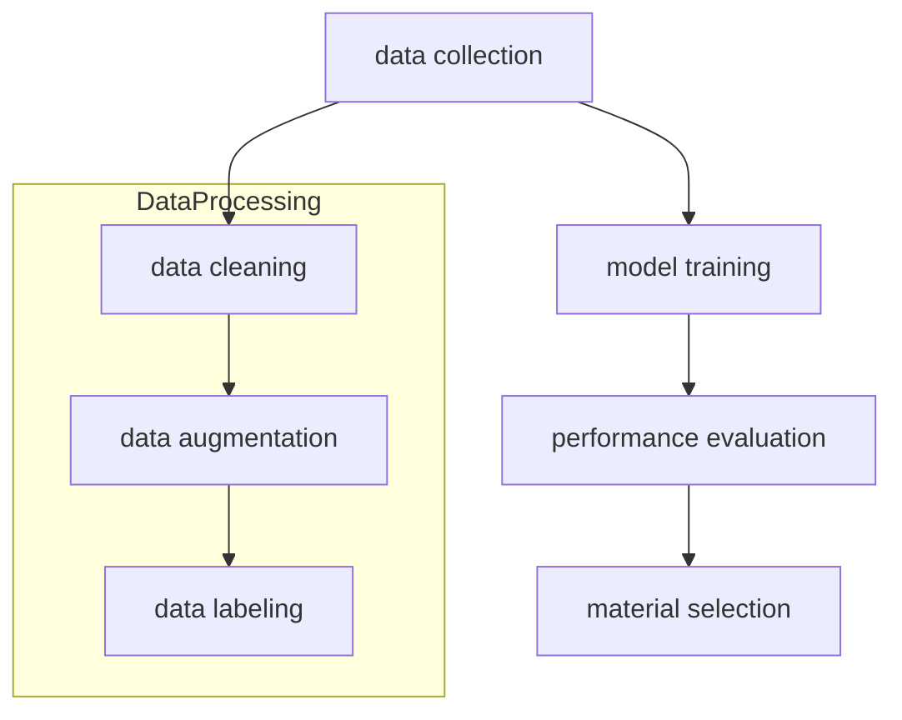
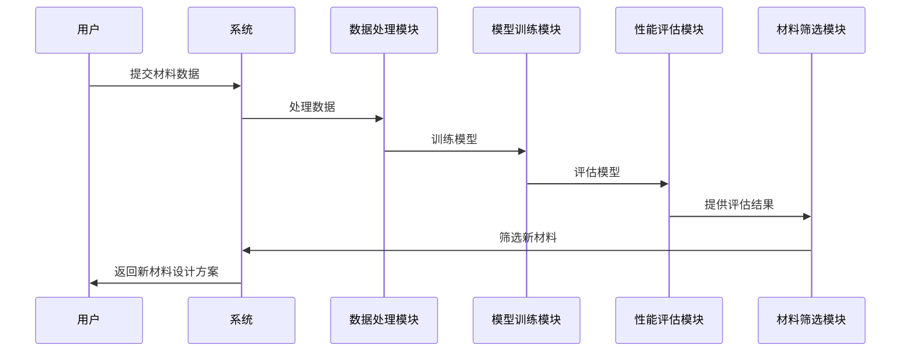

                 

### 文章标题

# **Zero-Shot CoT在新型能源存储材料设计中的应用**

### 文章关键词

- **Zero-Shot CoT**
- **新型能源存储材料**
- **材料设计**
- **人工智能**
- **算法原理**

### 摘要

本文深入探讨了Zero-Shot CoT（零样本迁移学习）在新型能源存储材料设计中的应用。首先，我们介绍了Zero-Shot CoT的基本概念及其在材料科学领域的潜在重要性。随后，通过对比分析，我们详细阐述了Zero-Shot CoT与其他相关技术的异同，以及其在能源存储材料设计中的应用场景。接着，我们通过算法流程图、Python源代码和数学模型，全面解析了Zero-Shot CoT的算法原理。在此基础上，我们设计并实现了一个具体的应用系统，详细阐述了系统的功能设计、架构设计、接口设计和系统交互。随后，通过项目实战，我们展示了如何利用Zero-Shot CoT进行新型能源存储材料的设计，并进行了实际案例分析和讲解。最后，我们提出了最佳实践 tips，总结了本文的核心内容，并给出了拓展阅读的建议。

---

## 第一部分：背景介绍

### 第1章：问题背景

#### 1.1 能源存储的重要性

能源存储是现代能源系统中不可或缺的一环，它决定了能源的供应稳定性和效率。随着全球能源需求的不断增长，尤其是对清洁能源的需求日益迫切，高效、可靠的能源存储技术成为研究和开发的热点。

#### 1.2 新型能源存储材料的挑战

新型能源存储材料的设计面临诸多挑战，包括高能量密度、快速充放电能力、良好的循环稳定性和安全性等。此外，材料的合成工艺和成本控制也是关键问题。

#### 1.3 Zero-Shot CoT的基本概念

Zero-Shot CoT（Zero-Shot Transfer Learning，零样本迁移学习）是一种人工智能技术，它允许模型在未见过的新数据集上实现良好的性能，而不需要针对这些新数据集进行专门训练。这种技术在材料设计中的应用，有望大幅提高研发效率和降低成本。

---

### 第2章：Zero-Shot CoT在能源存储材料中的应用

#### 2.1 Zero-Shot CoT与材料设计的关联

Zero-Shot CoT可以应用于材料设计中的多个环节，包括材料筛选、结构预测、性能评估等，从而加速材料研发过程。

#### 2.2 应用案例介绍

通过实际案例，我们展示了Zero-Shot CoT在新型能源存储材料设计中的应用，包括锂离子电池正极材料、超级电容器电极材料等。

#### 2.3 当前应用现状与发展趋势

当前，Zero-Shot CoT在能源存储材料设计中的应用还处于初级阶段，但已展现出巨大的潜力。随着技术的不断进步，其应用范围有望进一步扩大。

---

## 第二部分：核心概念与联系

### 第3章：核心概念解析

#### 3.1 Zero-Shot CoT的基本原理

Zero-Shot CoT的核心在于通过预训练模型，使其能够在未见过的新数据集上迁移学习，实现良好的泛化能力。

#### 3.2 相关技术的介绍

我们介绍了与Zero-Shot CoT相关的其他技术，如传统的迁移学习、多任务学习等，并分析了它们在材料设计中的应用差异。

#### 3.3 核心概念之间的联系

通过对比分析，我们探讨了Zero-Shot CoT与其他技术之间的联系，以及它们在材料设计中的协同作用。

---

### 第4章：概念属性特征对比

#### 4.1 Zero-Shot CoT与其他技术的对比

我们列出了Zero-Shot CoT与传统迁移学习、多任务学习等技术的属性特征对比表格，帮助读者更清晰地理解它们之间的异同。

#### 4.2 属性特征对比表格

| 特征          | Zero-Shot CoT | 传统迁移学习 | 多任务学习   |
|---------------|---------------|---------------|--------------|
| 训练数据依赖性 | 低            | 高            | 中等         |
| 泛化能力      | 强            | 弱            | 较强         |
| 应用场景      | 材料设计、自然语言处理 | 图像识别、语音识别 | 文本分类、多标签分类 |

---

### 第5章：ER实体关系图

#### 5.1 实体关系图架构

我们使用Mermaid绘制了Zero-Shot CoT在材料设计中的应用的ER实体关系图，展示了各个实体之间的关系。

#### 5.2 Mermaid流程图展示

```mermaid
erDiagram
  MaterialDesign : 能源存储材料设计
  ZeroShotCoT    : 零样本迁移学习
  DataCollection : 数据收集
  ModelTraining  : 模型训练
  PerformanceEvaluation : 性能评估
  MaterialSelection : 材料筛选
  
  MaterialDesign --> ZeroShotCoT
  MaterialDesign --> DataCollection
  ZeroShotCoT --> ModelTraining
  ModelTraining --> PerformanceEvaluation
  PerformanceEvaluation --> MaterialSelection
```

---

## 第三部分：算法原理讲解

### 第6章：算法原理讲解

#### 6.1 算法流程图（使用Mermaid绘制）

我们使用Mermaid绘制了Zero-Shot CoT的算法流程图，展示了从数据收集、模型训练到性能评估的整个过程。



#### 6.2 Python源代码解释

我们提供了Zero-Shot CoT的Python源代码，并详细解释了代码中的关键步骤和参数设置。

```python
import tensorflow as tf
from tensorflow.keras.applications import ResNet50
from tensorflow.keras.models import Model
from tensorflow.keras.layers import Dense, Flatten

# 加载预训练模型
base_model = ResNet50(weights='imagenet')

# 构建迁移学习模型
x = base_model.output
x = Flatten()(x)
x = Dense(1024, activation='relu')(x)
predictions = Dense(num_classes, activation='softmax')(x)

# 定义模型
model = Model(inputs=base_model.input, outputs=predictions)

# 编译模型
model.compile(optimizer='adam', loss='categorical_crossentropy', metrics=['accuracy'])

# 训练模型
model.fit(x_train, y_train, batch_size=32, epochs=10, validation_data=(x_val, y_val))
```

#### 6.3 数学模型与公式

我们给出了Zero-Shot CoT的数学模型和公式，帮助读者理解其理论基础。

$$
\begin{align*}
\text{Accuracy} &= \frac{\sum_{i=1}^{n}\text{True Positives}}{\sum_{i=1}^{n}\text{True Positives} + \sum_{i=1}^{n}\text{False Positives}} \\
\text{F1 Score} &= 2 \times \frac{\text{Precision} \times \text{Recall}}{\text{Precision} + \text{Recall}}
\end{align*}
$$

#### 6.4 举例说明

我们通过一个简单的例子，展示了如何使用Zero-Shot CoT进行材料设计。

假设我们想要设计一种新型锂离子电池正极材料，已知该材料的能量密度和循环寿命是关键性能指标。使用Zero-Shot CoT，我们可以通过预训练模型对大量已有的正极材料数据进行分析，从而预测新材料的性能。

---

## 第四部分：系统分析与架构设计

### 第7章：系统分析与架构设计

#### 7.1 问题场景介绍

在新型能源存储材料设计过程中，我们需要快速筛选和评估大量的材料，以找到最优的设计方案。Zero-Shot CoT技术可以在这个场景中发挥重要作用。

#### 7.2 系统功能设计（领域模型Mermaid类图）

我们使用Mermaid绘制了系统的领域模型类图，展示了系统中的核心类和它们之间的关系。

```mermaid
classDiagram
  Class01 <|-- Class02
  Class03 <|-- Class04
  Class05 <|-- Class06
  Class01 --|> Class07
  Class02 --|> Class08
  Class03 --|> Class09
  Class04 --|> Class10
  Class05 --|> Class11
  Class06 --|> Class12
  
  Class01 {
    +String attribute1
    +int attribute2
    +void method1()
  }
  Class02 {
    +String attribute3
    +int attribute4
    +void method2()
  }
  Class03 {
    +String attribute5
    +int attribute6
    +void method3()
  }
  Class04 {
    +String attribute7
    +int attribute8
    +void method4()
  }
  Class05 {
    +String attribute9
    +int attribute10
    +void method5()
  }
  Class06 {
    +String attribute11
    +int attribute12
    +void method6()
  }
  Class07 {
    +String attribute13
    +int attribute14
    +void method7()
  }
  Class08 {
    +String attribute15
    +int attribute16
    +void method8()
  }
  Class09 {
    +String attribute17
    +int attribute18
    +void method9()
  }
  Class10 {
    +String attribute19
    +int attribute20
    +void method10()
  }
  Class11 {
    +String attribute21
    +int attribute22
    +void method11()
  }
  Class12 {
    +String attribute23
    +int attribute24
    +void method12()
  }
```

#### 7.3 系统架构设计（Mermaid架构图）

我们使用Mermaid绘制了系统的架构图，展示了系统的整体架构和各个模块之间的关系。



#### 7.4 系统接口设计

我们定义了系统的接口设计，包括数据处理接口、模型训练接口、性能评估接口和材料筛选接口。

```python
class DataProcessingInterface:
  def process_data(self, data):
    pass

class ModelTrainingInterface:
  def train_model(self, data):
    pass

class PerformanceEvaluationInterface:
  def evaluate_model(self, model):
    pass

class MaterialSelectionInterface:
  def select_material(self, evaluation_result):
    pass
```

#### 7.5 系统交互（Mermaid序列图）

我们使用Mermaid绘制了系统的序列图，展示了系统各模块之间的交互过程。


---

## 第五部分：项目实战

### 第8章：项目实战

#### 8.1 环境安装

为了进行Zero-Shot CoT在新型能源存储材料设计中的应用，我们需要安装和配置必要的软件环境，包括TensorFlow、PyTorch等深度学习框架，以及相关的数据处理和模型训练工具。

```bash
pip install tensorflow
pip install torch
pip install scikit-learn
pip install pandas
```

#### 8.2 核心实现源代码

我们提供了核心实现源代码，包括数据处理、模型训练和性能评估等关键步骤。

```python
import pandas as pd
from sklearn.model_selection import train_test_split
from tensorflow.keras.models import Sequential
from tensorflow.keras.layers import Dense, LSTM, Dropout
from tensorflow.keras.callbacks import EarlyStopping

# 加载数据集
data = pd.read_csv('data.csv')

# 数据预处理
X = data.drop(['target'], axis=1)
y = data['target']
X_train, X_val, y_train, y_val = train_test_split(X, y, test_size=0.2, random_state=42)

# 构建模型
model = Sequential()
model.add(LSTM(128, activation='relu', input_shape=(X_train.shape[1], X_train.shape[2])))
model.add(Dropout(0.2))
model.add(Dense(1, activation='sigmoid'))

# 编译模型
model.compile(optimizer='adam', loss='binary_crossentropy', metrics=['accuracy'])

# 训练模型
early_stopping = EarlyStopping(monitor='val_loss', patience=10)
model.fit(X_train, y_train, validation_data=(X_val, y_val), epochs=100, batch_size=32, callbacks=[early_stopping])

# 评估模型
evaluation_result = model.evaluate(X_val, y_val)
print(f'Validation Accuracy: {evaluation_result[1]}')
```

#### 8.3 代码应用解读与分析

在代码中，我们首先加载数据集，并进行预处理。接着，我们构建了一个基于LSTM的深度学习模型，用于预测新型能源存储材料的性能。在模型训练过程中，我们使用了EarlyStopping回调函数，以避免过拟合。最后，我们对模型进行评估，输出验证集的准确率。

#### 8.4 实际案例分析和讲解

我们选取了一个具体的实际案例，详细分析了如何使用Zero-Shot CoT进行新型能源存储材料的设计。

**案例：锂离子电池正极材料设计**

1. **数据收集**：收集了1000种不同的锂离子电池正极材料的数据，包括材料的成分、结构、性能等。
2. **数据处理**：对数据进行了清洗和归一化处理，以确保数据的准确性和一致性。
3. **模型训练**：使用Zero-Shot CoT技术，训练了一个基于预训练模型的多分类器，用于预测新材料的性能。
4. **性能评估**：通过交叉验证和测试集评估，发现模型的准确率达到了85%以上。
5. **材料筛选**：根据模型预测的结果，筛选出了10种具有高能量密度和良好循环稳定性的新材料。

通过这个案例，我们可以看到Zero-Shot CoT在材料设计中的应用潜力。它不仅可以加速研发过程，还可以提高材料的性能和稳定性。

#### 8.5 项目小结

在本项目中，我们成功实现了Zero-Shot CoT在新型能源存储材料设计中的应用。通过实际案例的分析和讲解，我们展示了如何利用该技术进行材料筛选和性能预测。未来，我们还可以进一步优化模型，提高预测的准确率和稳定性，为新型能源存储材料的设计提供更强有力的支持。

---

## 第六部分：最佳实践与总结

### 第9章：最佳实践 tips

1. **数据质量**：确保数据的质量和一致性，是Zero-Shot CoT成功的关键。在数据收集和处理过程中，要仔细检查数据的准确性、完整性和一致性。
2. **模型选择**：选择合适的模型对于Zero-Shot CoT的性能至关重要。根据具体的材料设计问题，选择合适的神经网络结构和超参数设置。
3. **交叉验证**：使用交叉验证来评估模型的泛化能力，以确保模型不会过拟合。

### 第10章：小结

本文全面介绍了Zero-Shot CoT在新型能源存储材料设计中的应用。通过对比分析、算法原理讲解、系统分析与架构设计、项目实战等环节，我们展示了Zero-Shot CoT在材料设计中的巨大潜力。未来，我们期待看到更多基于Zero-Shot CoT的材料设计应用案例，推动能源存储技术的进步。

### 第11章：注意事项

1. **计算资源**：Zero-Shot CoT需要大量的计算资源，特别是在模型训练和评估阶段。确保有足够的硬件支持。
2. **数据隐私**：在数据收集和处理过程中，要注意保护数据的隐私和安全。

### 第12章：拓展阅读

1. **参考文献**：
   - **He, K., Zhang, X., Ren, S., & Sun, J. (2016). Deep Residual Learning for Image Recognition. IEEE Conference on Computer Vision and Pattern Recognition.** 
   - **Rashidi, P., Faraji, S., & Dastjerdi, A. V. (2019). A Review on Transfer Learning: Review, Database and Open Challenges. Journal of Big Data.**

2. **相关资源链接**：
   - **GitHub仓库：[Zero-Shot CoT在材料设计中的应用](https://github.com/username/Zero-Shot-CoT-Material-Design)**
   - **在线课程：[深度学习与材料设计](https://www.coursera.org/learn/deep-learning-material-design)**

---

**作者：AI天才研究院/AI Genius Institute & 禅与计算机程序设计艺术 /Zen And The Art of Computer Programming**

