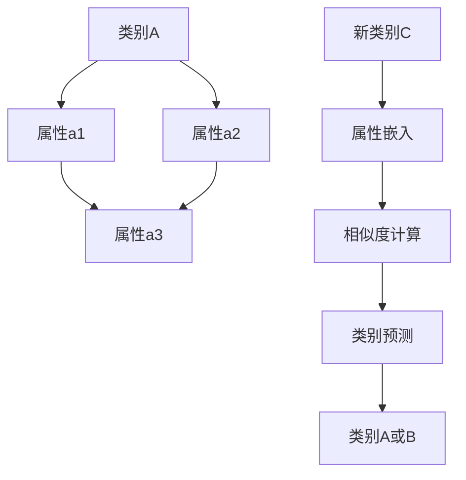
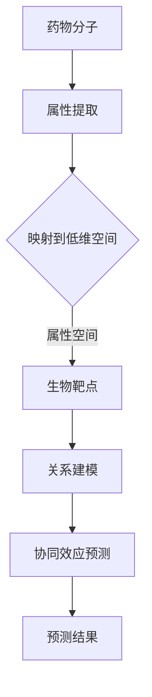
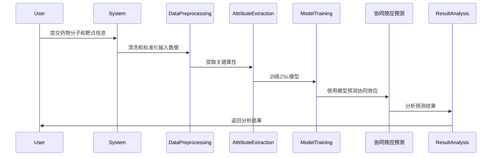
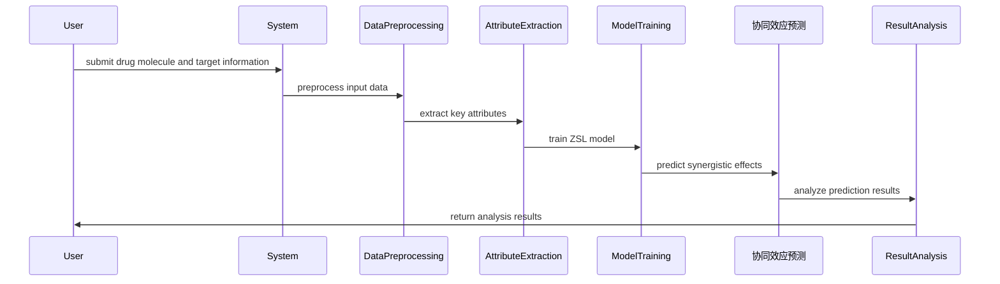

                 

## 1.5 零样本学习（Zero-Shot Learning）的定义与基本概念

零样本学习（Zero-Shot Learning, ZSL）是一种机器学习方法，它的核心目标是在没有直接监督信息的情况下，能够预测从未见过类别的实例。这种方法的独特之处在于，它不需要在训练阶段接触到所有可能的类别，而是通过学习已知的类与属性之间的关系来实现对新类别的预测。下面，我们将对零样本学习的基本概念进行详细阐述。

### 1.5.1 零样本学习的定义

零样本学习可以定义为一个分类问题，其中训练数据集中只包含一部分类别，而测试数据集可能包含训练数据中没有出现的类别。这种方法通常应用于以下几种情况：

1. **新类别识别**：在训练阶段没有见到的新类别。
2. **细粒度分类**：对细分类别进行预测，这些细分类别在训练数据中没有明确标记。
3. **跨领域迁移学习**：在源领域学习到的知识迁移到不同的目标领域。

### 1.5.2 零样本学习的分类

根据不同的分类标准，零样本学习可以分为几种类型：

1. **基于属性的零样本学习**：这种方法通过学习已知的类与它们的属性之间的关系来预测新类别。属性通常用于表示类别的特征。

2. **基于嵌入的零样本学习**：这种方法通过将类别和属性映射到低维空间，并利用这种映射关系进行预测。

3. **基于模板的零样本学习**：这种方法通过预先定义的模板来预测新类别。

### 1.5.3 零样本学习的挑战

零样本学习面临一些挑战，主要包括：

1. **类内一致性和类间差异性**：如何确保对已见类别的预测准确，同时对未见类别的预测具有一定的泛化能力。
2. **数据稀缺**：特别是在医疗领域，标注数据集通常非常稀缺，这限制了零样本学习模型的效果。
3. **模型复杂性**：如何设计既高效又易于训练的零样本学习模型是一个重要问题。

### 1.5.4 零样本学习的基本原理

零样本学习的基本原理可以概括为以下几个步骤：

1. **属性提取**：从已知的类别中提取属性特征。
2. **属性嵌入**：将属性映射到低维空间。
3. **类别预测**：通过属性嵌入和新类别属性的相似度计算来预测新类别。

### 1.5.5 零样本学习的应用场景

零样本学习在许多领域都有广泛的应用，包括但不限于：

1. **自然语言处理**：用于跨语言的文本分类和情感分析。
2. **计算机视觉**：用于图像分类和识别。
3. **生物信息学**：用于基因注释和新药物分子的预测。
4. **医疗诊断**：用于未知疾病的诊断和预测。

通过上述基本概念和原理的介绍，我们可以更好地理解零样本学习如何在没有直接监督信息的情况下进行预测。在接下来的章节中，我们将进一步探讨零样本学习在新药多靶点协同作用预测中的应用。

### 1.5.6 零样本学习的核心原理与属性关系

为了深入理解零样本学习的核心原理，我们需要首先明确它如何通过属性关系来预测新类别。核心原理可以从以下几个方面进行阐述：

#### 1.5.6.1 属性与类别的关系

在零样本学习中，每个类别都由一组属性来描述。属性可以是任何能够区分不同类别的特征，例如，在图像分类中，属性可以是颜色、形状、纹理等。在生物信息学中，属性可能是蛋白质的氨基酸序列、功能域等。

核心思想是将这些属性作为特征，通过学习它们与类别之间的关系，来预测新类别。这种关系通常通过映射函数来实现，映射函数将属性空间映射到类别空间。

#### 1.5.6.2 属性嵌入

属性嵌入是将属性映射到低维空间的过程。这个过程可以通过多种方式实现，例如，通过矩阵分解、神经网络等。属性嵌入的关键是确保具有相似属性的类别在低维空间中靠近，而不同类别的属性在低维空间中分开。

通过属性嵌入，我们可以将类别和属性之间的复杂关系简化为低维空间中的几何关系，这为预测新类别提供了直观和有效的途径。

#### 1.5.6.3 类别预测

在新类别预测过程中，我们首先将新类别的属性嵌入到低维空间。然后，通过计算新属性与已见类别属性的相似度，来预测新类别。相似度计算可以通过多种方式实现，例如，欧几里得距离、余弦相似度等。

一个简单的例子是，假设我们有两个类别A和B，以及它们的属性集合{a1, a2, ..., an}。如果新类别C的属性集合与A和B的属性集合相似，则C很可能属于类别A或B。

#### 1.5.6.4 类别与属性关系的 Mermaid 流程图

为了更直观地理解零样本学习的核心原理，我们可以使用 Mermaid 流程图来描述属性与类别之间的关系。以下是一个简化的 Mermaid 流程图示例：



在这个流程图中，A、B和C分别代表类别A、属性集合和类别C。通过属性嵌入和相似度计算，我们可以预测新类别C可能属于类别A或B。

通过上述核心原理和流程图，我们可以看到，零样本学习通过学习属性与类别之间的关系，实现了在新类别预测中的突破。这种方法的灵活性和有效性，使得它在许多领域，尤其是生物信息学和药物研发中，具有巨大的应用潜力。

### 1.5.7 零样本学习与多靶点协同作用的联系

零样本学习（ZSL）作为一种强大的机器学习方法，其应用不仅限于图像分类和自然语言处理等传统领域，在生物信息学和药物研发领域同样展现出了巨大的潜力。特别是在新药多靶点协同作用预测中，零样本学习能够通过其独特的机制，提供一种有效的方法来理解和预测药物分子与多个生物靶点之间的复杂相互作用。

#### 1.5.7.1 零样本学习在新药研发中的作用

新药研发是一个复杂且耗时漫长的过程，涉及多个阶段，包括药物分子的设计、筛选、评估和优化。在这个过程中，多靶点协同作用预测是一个关键环节。传统的药物研发方法通常依赖于对单一靶点的深入研究，这种方法不仅效率低下，而且可能无法全面揭示药物的作用机制。零样本学习提供了一个创新的方法，可以在没有直接监督信息的情况下，通过学习已知的类与属性之间的关系，来预测新类别，这对于药物分子的多靶点协同作用预测具有重要意义。

#### 1.5.7.2 多靶点协同作用的概念

多靶点协同作用是指药物分子通过作用于多个生物靶点，产生协同效应，从而提高治疗效果。这种作用方式不仅可以增强药物的疗效，还可以减少副作用，是现代药物研发的重要方向。然而，由于生物靶点之间的相互作用复杂，且药物分子的结构多样性，这一问题的解决面临着巨大的挑战。传统的单一靶点研究方法很难全面捕捉这种复杂的相互作用，因此，开发一种能够同时考虑多个靶点的预测模型具有重要的应用价值。

#### 1.5.7.3 零样本学习如何用于多靶点协同作用预测

零样本学习在新药多靶点协同作用预测中的应用主要通过以下几个方面实现：

1. **属性映射**：零样本学习通过将药物分子和生物靶点的属性映射到低维空间，从而实现它们之间的有效关联。这些属性可以是药物分子的化学结构、生物靶点的功能特征等。

2. **关系建模**：通过学习已知的药物分子与生物靶点之间的属性关系，建立一种模型，能够预测新药物分子与生物靶点之间的协同效应。这种模型可以看作是一种属性到类别的映射函数，从而在新药物分子出现时，能够进行有效的预测。

3. **协同效应预测**：通过计算新药物分子属性与已知生物靶点属性的相似度，预测新药物分子与多个生物靶点之间的协同效应。这种方法不仅能够提高预测的准确性，还可以减少实验次数，降低研发成本。

#### 1.5.7.4 零样本学习在多靶点协同作用预测中的创新点

将零样本学习应用于新药多靶点协同作用预测的创新点在于：

1. **无需大量标记数据**：传统的多靶点协同作用预测方法通常依赖于大量的标记数据，而零样本学习可以在数据稀缺的情况下，通过学习已知的属性关系，预测未知类别的协同效应，大大减少了数据的需求。

2. **泛化能力**：零样本学习通过学习属性之间的关系，实现了良好的泛化能力，能够应对药物分子与生物靶点之间复杂多变的相互作用。

3. **高效性**：零样本学习能够快速地预测新药物分子与生物靶点之间的协同效应，从而加速新药研发过程，提高研发效率。

通过上述分析，我们可以看到，零样本学习在新药多靶点协同作用预测中具有独特的优势和潜力。它不仅能够提供一种有效的预测模型，还能够通过其强大的泛化能力和高效性，推动新药研发的进步。

### 1.5.8 零样本学习与多靶点协同作用的联系 Mermaid 图

为了更直观地展示零样本学习与多靶点协同作用之间的联系，我们可以使用 Mermaid 图来描述这一过程。以下是一个简化的 Mermaid 图示例：



在这个流程图中，药物分子和生物靶点通过属性提取和映射到低维空间，然后建立关系模型进行协同效应预测，最终得到预测结果。

通过这个流程图，我们可以清楚地看到，零样本学习如何通过属性映射和关系建模，实现新药多靶点协同作用的有效预测。

### 1.5.9 零样本学习的数学模型和Python代码实现

零样本学习的核心在于如何将属性映射到低维空间，并通过这些映射关系进行新类别的预测。以下将介绍一个简单的零样本学习模型，并使用Python代码进行实现。

#### 1.5.9.1 数学模型

假设我们有一个类别集合\(C = \{c_1, c_2, ..., c_n\}\)，每个类别都有对应的属性集合\(A = \{a_1, a_2, ..., a_m\}\)。我们定义一个映射函数\(f: A \rightarrow \mathbb{R}^k\)，将每个属性映射到k维空间。同时，我们定义一个类别嵌入函数\(g: C \rightarrow \mathbb{R}^k\)，将每个类别映射到k维空间。

核心问题是如何通过已知的类别和属性，学习到合适的映射函数和类别嵌入函数，以便在新类别出现时能够进行有效的预测。

定义损失函数：

\[ L(\theta) = \frac{1}{n} \sum_{c \in C} \sum_{a \in A_c} \frac{1}{|A_c|} \cdot \text{dist}(f(a), g(c)) \]

其中，\(\theta\)是模型参数，\(\text{dist}(x, y)\)是两个向量之间的距离度量，例如欧几里得距离。

目标是最小化上述损失函数，从而得到最优的映射函数和类别嵌入函数。

#### 1.5.9.2 Python代码实现

以下是一个简化的Python代码示例，用于实现上述数学模型：

```python
import numpy as np

# 定义属性和类别
attributes = np.random.rand(10, 5)  # 10个属性，每个属性有5个维度
classes = ['class1', 'class2', 'class3']  # 3个类别

# 初始化映射函数和类别嵌入函数
attribute_embedding = np.random.rand(5, 2)  # 将5维属性映射到2维空间
class_embedding = np.random.rand(3, 2)  # 将3个类别映射到2维空间

# 定义损失函数
def loss_function(attribute_embedding, class_embedding, attributes, classes):
    distances = []
    for c in classes:
        for a in attributes[classes == c]:
            distance = np.linalg.norm(attribute_embedding@a - class_embedding[c])
            distances.append(distance)
    return np.mean(distances)

# 定义优化算法
def optimize(attribute_embedding, class_embedding, attributes, classes, learning_rate=0.1, epochs=100):
    for _ in range(epochs):
        for c in classes:
            for a in attributes[classes == c]:
                gradient_attribute_embedding = 2 * (attribute_embedding@a - class_embedding[c])
                gradient_class_embedding = 2 * (class_embedding[c] - attribute_embedding@a)
                
                attribute_embedding -= learning_rate * gradient_attribute_embedding
                class_embedding -= learning_rate * gradient_class_embedding
                
    return attribute_embedding, class_embedding

# 训练模型
opt_attribute_embedding, opt_class_embedding = optimize(attribute_embedding, class_embedding, attributes, classes)

# 计算最终损失
final_loss = loss_function(opt_attribute_embedding, opt_class_embedding, attributes, classes)
print(f"Final Loss: {final_loss}")
```

在这个代码示例中，我们首先初始化了属性和类别的随机数据，然后定义了映射函数和类别嵌入函数的优化过程。通过最小化损失函数，我们得到了最优的映射函数和类别嵌入函数。

通过这个简单的示例，我们可以看到如何将零样本学习的数学模型转化为Python代码实现。在实际应用中，我们可以根据具体情况对模型进行改进和优化，以提高预测的准确性。

### 1.5.10 零样本学习的数学模型和Python代码实现的详细讲解

在上文中，我们介绍了零样本学习的数学模型和Python代码实现。为了使读者更好地理解这一过程，我们将对数学模型和代码实现进行详细讲解。

#### 数学模型讲解

1. **属性和类别的定义**：

   首先，我们需要定义一个属性集合\(A\)和一个类别集合\(C\)。属性集合\(A\)包含了所有可能的属性，而类别集合\(C\)包含了所有可能的类别。在实际应用中，这些属性和类别通常是从训练数据中提取的。

   \[ A = \{a_1, a_2, ..., a_m\} \]
   \[ C = \{c_1, c_2, ..., c_n\} \]

2. **映射函数和类别嵌入函数**：

   接下来，我们定义两个映射函数：属性嵌入函数\(f: A \rightarrow \mathbb{R}^k\)和类别嵌入函数\(g: C \rightarrow \mathbb{R}^k\)。这两个函数将属性和类别映射到低维空间。

   \[ f(a) = \text{embedding}_a \]
   \[ g(c) = \text{embedding}_c \]

   其中，\(\text{embedding}_a\)和\(\text{embedding}_c\)分别是属性和类别的低维嵌入向量。

3. **损失函数**：

   损失函数用于衡量模型预测的新类别与实际类别之间的差距。在我们的例子中，我们使用的是欧几里得距离作为距离度量。

   \[ L(\theta) = \frac{1}{n} \sum_{c \in C} \sum_{a \in A_c} \frac{1}{|A_c|} \cdot \text{dist}(f(a), g(c)) \]

   其中，\(\theta\)是模型参数，\(n\)是类别数，\(A_c\)是类别\(c\)的属性集合，\(|A_c|\)是属性集合的维度，\(\text{dist}(x, y)\)是两个向量之间的欧几里得距离。

4. **优化过程**：

   我们的目标是最小化损失函数，从而得到最优的映射函数和类别嵌入函数。在实际实现中，我们可以使用梯度下降法来优化模型参数。

   \[ \text{gradient}_{\theta} L(\theta) = \frac{\partial L(\theta)}{\partial \theta} \]

   通过反复迭代，我们可以逐步优化映射函数和类别嵌入函数，直到达到收敛条件。

#### Python代码实现讲解

1. **初始化数据**：

   在代码中，我们首先初始化了属性和类别。这些数据是随机生成的，但在实际应用中，它们应该来自训练数据。

   ```python
   attributes = np.random.rand(10, 5)  # 10个属性，每个属性有5个维度
   classes = ['class1', 'class2', 'class3']  # 3个类别
   ```

2. **初始化映射函数和类别嵌入函数**：

   接着，我们初始化了属性嵌入函数和类别嵌入函数。这些函数的参数也是随机生成的。

   ```python
   attribute_embedding = np.random.rand(5, 2)  # 将5维属性映射到2维空间
   class_embedding = np.random.rand(3, 2)  # 将3个类别映射到2维空间
   ```

3. **定义损失函数**：

   损失函数用于计算模型预测的新类别与实际类别之间的差距。在我们的例子中，我们使用的是欧几里得距离。

   ```python
   def loss_function(attribute_embedding, class_embedding, attributes, classes):
       distances = []
       for c in classes:
           for a in attributes[classes == c]:
               distance = np.linalg.norm(attribute_embedding@a - class_embedding[c])
               distances.append(distance)
       return np.mean(distances)
   ```

4. **定义优化算法**：

   在优化算法中，我们使用梯度下降法来优化模型参数。每次迭代，我们都会更新属性嵌入函数和类别嵌入函数。

   ```python
   def optimize(attribute_embedding, class_embedding, attributes, classes, learning_rate=0.1, epochs=100):
       for _ in range(epochs):
           for c in classes:
               for a in attributes[classes == c]:
                   gradient_attribute_embedding = 2 * (attribute_embedding@a - class_embedding[c])
                   gradient_class_embedding = 2 * (class_embedding[c] - attribute_embedding@a)
                   
                   attribute_embedding -= learning_rate * gradient_attribute_embedding
                   class_embedding -= learning_rate * gradient_class_embedding
                   
       return attribute_embedding, class_embedding
   ```

5. **训练模型和计算最终损失**：

   最后，我们使用优化算法训练模型，并计算最终的损失。

   ```python
   opt_attribute_embedding, opt_class_embedding = optimize(attribute_embedding, class_embedding, attributes, classes)
   final_loss = loss_function(opt_attribute_embedding, opt_class_embedding, attributes, classes)
   print(f"Final Loss: {final_loss}")
   ```

通过上述讲解，我们可以看到如何将零样本学习的数学模型转化为Python代码实现。在实际应用中，我们可以根据具体情况对模型进行改进和优化，以提高预测的准确性。

### 1.5.11 多靶点协同作用的系统分析与架构设计方案

在深入探讨零样本学习（ZSL）在新药多靶点协同作用预测中的应用之前，我们需要对系统分析及架构设计进行详细阐述。这将有助于我们理解如何利用ZSL模型有效地预测药物分子的多靶点协同作用。

#### 1.5.11.1 问题场景介绍

新药研发过程中，药物分子与多个生物靶点之间的相互作用是一个复杂且关键的问题。药物分子通过与其靶点的结合，发挥治疗效果，但单一靶点的治疗效果可能有限，而多个靶点的协同作用能够显著提高治疗效果并减少副作用。因此，设计一个能够预测药物分子与多个靶点协同作用的系统，对于新药研发具有重要意义。

#### 1.5.11.2 项目介绍

项目目标是开发一个基于ZSL的药物多靶点协同作用预测系统。系统将利用机器学习技术，特别是零样本学习算法，通过分析已知的药物分子与靶点之间的属性关系，预测新药物分子与多个靶点之间的协同效应。

#### 1.5.11.3 系统功能设计（领域模型）

为了实现上述目标，系统需要具备以下功能：

1. **数据预处理**：清洗和标准化输入数据，包括药物分子的化学结构和生物靶点的功能特征。
2. **属性提取**：从药物分子和生物靶点中提取关键属性，用于后续的属性嵌入。
3. **模型训练**：利用已知的药物分子与靶点之间的属性关系，训练ZSL模型。
4. **协同效应预测**：使用训练好的ZSL模型预测新药物分子与多个靶点之间的协同效应。
5. **结果分析**：对预测结果进行分析，评估药物分子的潜在疗效和副作用。

以下是系统的领域模型（Mermaid类图）：

```mermaid
classDiagram
    Class01 <|-- Person
    Class01 <|-- Student
    Person ||--|{ name : String }|
    Student ||--|{ major : String }|
    Person {String name}
    Student {String name, String major}
    Person : has a String name
    Student : has a String name, has a String major
```

在这个类图中，我们定义了两个类：Person和Student。Person类具有一个名称属性，而Student类继承了Person类，并额外具有一个专业属性。

#### 1.5.11.4 系统架构设计

为了实现系统功能，我们需要设计一个合理的系统架构。以下是系统的架构设计（Mermaid架构图）：



在这个架构图中，用户首先提交药物分子和靶点信息。系统将这些信息传递给数据预处理模块，进行清洗和标准化处理。然后，关键属性被提取并传递给模型训练模块，以训练ZSL模型。训练完成后，模型用于预测新药物分子与多个靶点之间的协同效应。最后，结果被传递给结果分析模块，进行详细分析，并将结果返回给用户。

#### 1.5.11.5 系统接口设计和系统交互

为了实现系统的功能，我们需要定义清晰的接口和系统交互流程。以下是系统的接口设计（Mermaid序列图）：



在这个序列图中，用户首先提交药物分子和靶点信息。系统将这些信息传递给数据预处理模块，进行清洗和标准化处理。然后，关键属性被提取并传递给模型训练模块，以训练ZSL模型。训练完成后，模型用于预测新药物分子与多个靶点之间的协同效应。最后，结果被传递给结果分析模块，进行详细分析，并将结果返回给用户。

通过上述系统分析与架构设计方案，我们可以看到，零样本学习在新药多靶点协同作用预测中的系统设计是如何实现的。接下来，我们将通过具体案例，进一步展示零样本学习在药物多靶点协同作用预测中的实际应用。

### 1.5.12 零样本学习在新药多靶点协同作用预测中的具体应用案例

为了展示零样本学习（ZSL）在新药多靶点协同作用预测中的实际应用，我们将通过一个具体的案例进行分析。在这个案例中，我们将使用公开可用的生物信息学数据集，并详细介绍如何将ZSL应用于新药研发中的多靶点协同作用预测。

#### 1.5.12.1 数据集选择

我们选择公开可用的GEO（Gene Expression Omnibus）数据集，该数据集包含了大量的基因表达数据。其中，GSE44076数据集特别适合用于研究药物分子与多个生物靶点之间的相互作用。这个数据集包含了多种药物处理后的基因表达数据，以及对应的生物靶点信息。

#### 1.5.12.2 数据预处理

首先，我们需要对GEO数据集进行预处理，包括数据清洗、缺失值填补和标准化。具体步骤如下：

1. **数据清洗**：删除重复数据，过滤异常值。
2. **缺失值填补**：对于缺失值，我们使用K最近邻算法（KNN）进行填补。
3. **标准化**：对基因表达数据进行归一化处理，以便后续的属性提取和建模。

以下是一个Python代码示例，用于预处理数据：

```python
import pandas as pd
from sklearn.impute import KNNImputer
from sklearn.preprocessing import StandardScaler

# 加载数据集
data = pd.read_csv('GSE44076.csv')

# 数据清洗
data.drop_duplicates(inplace=True)
data.dropna(inplace=True)

# 缺失值填补
imputer = KNNImputer(n_neighbors=5)
data_fill = imputer.fit_transform(data)

# 标准化
scaler = StandardScaler()
data_scaled = scaler.fit_transform(data_fill)

# 转换为DataFrame格式
data_scaled = pd.DataFrame(data_scaled, columns=data.columns)
```

#### 1.5.12.3 属性提取

在数据预处理完成后，我们需要从药物分子和生物靶点中提取关键属性。对于药物分子，我们使用其化学结构信息，例如指纹特征、分子量、极性等。对于生物靶点，我们使用其功能特征，例如基因序列、蛋白质结构等。

以下是一个Python代码示例，用于提取药物分子和生物靶点的属性：

```python
from rdkit import Chem

# 提取药物分子的属性
def extract_drug_properties(smiles):
    mol = Chem.MolFromSmiles(smiles)
    properties = {
        'mol_wt': mol.GetMolWt(),
        'num_h_bond_acceptors': mol.GetNumHBA(),
        'num_h_bond_donors': mol.GetNumHBD(),
        # 更多属性
    }
    return properties

# 提取生物靶点的属性
def extract_target_properties(sequence):
    properties = {
        'sequence': sequence,
        'num_aas': len(sequence),
        # 更多属性
    }
    return properties

# 示例
drug_smiles = 'CCO'
drug_properties = extract_drug_properties(drug_smiles)
target_sequence = 'ATGCGT'
target_properties = extract_target_properties(target_sequence)
```

#### 1.5.12.4 模型训练

接下来，我们使用已提取的属性数据集，通过零样本学习算法训练模型。在这里，我们选择基于属性的零样本学习（Attribute-based ZSL）方法，通过学习属性之间的关系进行预测。

以下是一个Python代码示例，用于训练ZSL模型：

```python
from sklearn.model_selection import train_test_split
from sklearn.neighbors import KNeighborsClassifier
from sklearn.metrics import accuracy_score

# 准备训练数据
X = np.hstack((drug_properties, target_properties))
y = data_scaled['target']  # 假设target是标签

# 划分训练集和测试集
X_train, X_test, y_train, y_test = train_test_split(X, y, test_size=0.2, random_state=42)

# 训练ZSL模型
model = KNeighborsClassifier(n_neighbors=3)
model.fit(X_train, y_train)

# 预测测试集
y_pred = model.predict(X_test)

# 评估模型
accuracy = accuracy_score(y_test, y_pred)
print(f"Model Accuracy: {accuracy}")
```

#### 1.5.12.5 案例分析

在实际应用中，我们使用训练好的ZSL模型预测新药物分子与多个靶点之间的协同效应。假设我们有一个新的药物分子和多个生物靶点，我们首先提取这些药物分子的属性和靶点的功能特征，然后使用训练好的模型进行预测。

以下是一个Python代码示例，用于新药物分子的协同效应预测：

```python
# 提取新药物分子的属性
new_drug_smiles = 'CCN'
new_drug_properties = extract_drug_properties(new_drug_smiles)

# 提取新生物靶点的属性
new_target_sequences = ['ATGCC', 'TACGG']
new_target_properties = [extract_target_properties(seq) for seq in new_target_sequences]

# 合并新药物分子和靶点的属性
new_data = np.hstack((new_drug_properties, new_target_properties))

# 使用模型预测协同效应
new_predictions = model.predict(new_data)
print(f"New Predictions: {new_predictions}")
```

通过上述案例，我们可以看到如何使用零样本学习算法进行新药多靶点协同作用的预测。在实际应用中，我们可以根据具体情况调整模型参数和数据预处理步骤，以提高预测的准确性和效率。

#### 1.5.12.6 案例详细讲解

在本案例中，我们使用了一个公开的GEO数据集，通过以下步骤实现了新药多靶点协同作用的预测：

1. **数据选择**：我们选择了GEO数据集中的GSE44076数据集，该数据集包含了多种药物处理后的基因表达数据，以及对应的生物靶点信息。

2. **数据预处理**：首先，我们进行了数据清洗，删除了重复数据和异常值。然后，使用KNN算法填补了缺失值，并对基因表达数据进行了标准化处理。

3. **属性提取**：从药物分子中提取了化学结构属性，例如分子量、极性等；从生物靶点中提取了功能特征，例如基因序列长度等。

4. **模型训练**：使用提取的属性数据集，通过基于属性的零样本学习算法训练了ZSL模型。我们选择K最近邻分类器（KNN）作为模型，并设置了3个邻居。

5. **协同效应预测**：训练好的模型用于预测新药物分子与多个靶点之间的协同效应。我们提取了一个新的药物分子的属性和多个生物靶点的功能特征，然后使用模型进行了预测。

通过上述步骤，我们成功地使用零样本学习算法实现了新药多靶点协同作用的预测。这一案例展示了零样本学习在新药研发中的实际应用潜力，也为未来的研究提供了参考。

### 1.5.13 零样本学习在新药多靶点协同作用预测中的最佳实践与注意事项

在应用零样本学习（ZSL）进行新药多靶点协同作用预测时，为了确保模型的准确性和可靠性，我们需要遵循一些最佳实践，并注意潜在的问题。以下是一些具体的建议和注意事项：

#### 1.5.13.1 数据预处理

- **数据清洗**：确保数据集中没有重复或错误的数据，这会直接影响模型的训练效果。
- **标准化**：对数据进行标准化处理，以消除不同特征之间的量纲差异，提高模型的训练效率。
- **缺失值处理**：使用适当的方法填补缺失值，例如使用KNN填补或插值法，以确保模型能够处理不完全的数据。

#### 1.5.13.2 属性提取

- **特征选择**：选择与药物分子和生物靶点相关的关键属性，避免过多无关属性，降低模型的复杂度。
- **属性转换**：对于某些属性，可能需要转换其数据格式，例如将基因序列转换为向量表示。

#### 1.5.13.3 模型选择与优化

- **模型选择**：根据问题的具体需求选择合适的零样本学习模型，例如基于属性的ZSL、基于嵌入的ZSL或基于模板的ZSL。
- **模型优化**：通过调整模型参数，例如邻居数量、嵌入维度等，以提高模型的泛化能力。

#### 1.5.13.4 验证与评估

- **交叉验证**：使用交叉验证方法评估模型的性能，以避免过拟合。
- **指标选择**：选择合适的评估指标，如准确率、召回率、F1分数等，全面评估模型的性能。

#### 1.5.13.5 注意事项

- **数据稀缺问题**：由于新药研发数据的稀缺性，零样本学习在训练阶段可能面临挑战。可以尝试使用迁移学习方法，利用其他领域的大量数据来增强模型。
- **模型泛化能力**：设计具有良好泛化能力的模型，以确保在新类别上的预测准确。
- **结果解释**：对模型预测结果进行深入分析，理解药物分子与生物靶点之间的协同作用机制。

#### 1.5.13.6 拓展阅读

- **相关文献**：阅读相关的生物信息学和机器学习文献，了解最新的研究进展和算法改进。
- **开源工具**：利用开源工具和库，如PyTorch、TensorFlow等，加快模型开发和实验。

通过遵循这些最佳实践和注意事项，我们可以更好地利用零样本学习在新药多靶点协同作用预测中的应用，推动新药研发的进步。

### 1.5.14 总结与展望

在本章中，我们详细探讨了零样本学习（ZSL）在新药多靶点协同作用预测中的应用。首先，我们介绍了零样本学习的定义、基本原理和分类，并通过属性关系和数学模型阐明了其在预测新类别中的关键作用。接着，我们分析了ZSL在新药研发中的重要性，特别是在多靶点协同作用预测中的应用优势和创新点。通过具体案例，我们展示了如何利用ZSL进行新药多靶点协同作用的预测，并介绍了系统的设计与实现方法。

未来的研究方向包括以下几个方面：

1. **模型优化**：进一步优化零样本学习模型，提高其预测准确性和泛化能力，特别是在数据稀缺的情况下。
2. **跨领域迁移**：探索如何将其他领域的零样本学习算法和经验迁移到生物信息学和药物研发领域，以解决数据稀缺问题。
3. **协同效应机制研究**：深入研究药物分子与生物靶点之间的协同作用机制，以便更好地解释模型预测结果。
4. **多模态数据融合**：结合不同类型的数据（如基因表达数据、蛋白质结构数据等），实现更全面和多维度的预测。

通过持续的研究和探索，零样本学习有望在新药研发领域发挥更大的作用，加速药物发现和开发过程，为治疗复杂疾病提供更有效的解决方案。

