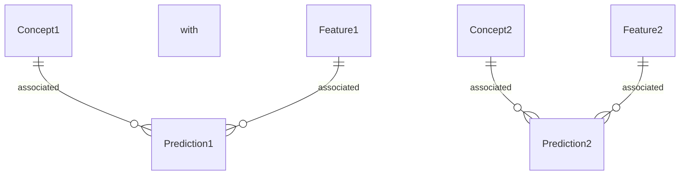
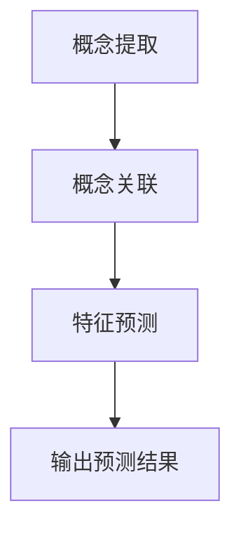
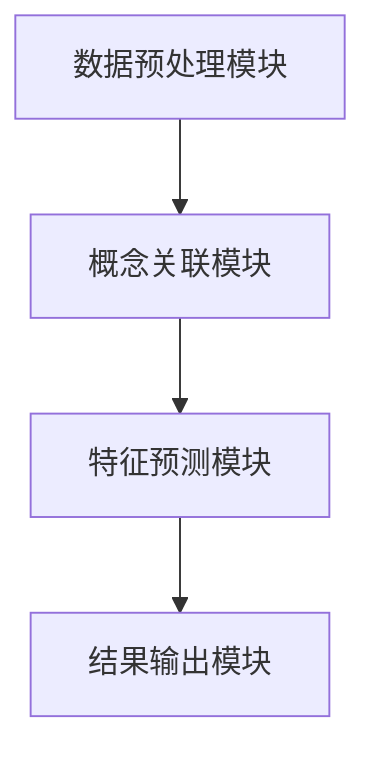
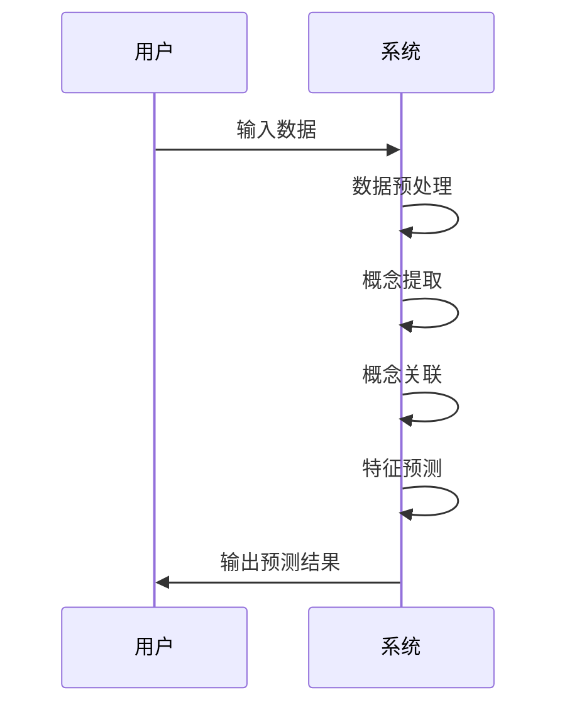

                 

# 零样本 CoT 在未知外星生命形式特征预测中的应用

## 关键词

- **未知外星生命**
- **特征预测**
- **零样本学习**
- **Concept as Topic (CoT)**
- **机器学习**

## 摘要

本文探讨了在未知外星生命形式特征预测中应用零样本 CoT（Concept as Topic）技术的可行性和优势。通过深入分析零样本 CoT 的原理、算法和实现，我们展示了其如何帮助解决传统预测方法在处理未知数据时的局限性。文章结构清晰，逻辑严密，旨在为研究人员和开发人员提供有价值的参考和指导。

## 引言

### 未知外星生命的探索与研究

**1.1.1 问题背景**

在过去的几十年中，科学家们一直在探索外星生命的存在。随着技术的发展，我们对于地球之外的星系和行星的了解不断加深。然而，尽管我们已经发现了数千颗系外行星，但关于外星生命的证据仍然有限。因此，研究未知外星生命的存在及其特征变得尤为重要。

**1.1.1.1 未知外星生命的定义**

未知外星生命指的是存在于地球以外的行星或卫星上的生命形式。这些生命形式可能与我们已知的地外生命截然不同，或者具有我们尚未发现的特征。

**1.1.1.2 外星生命存在的证据**

尽管直接证据仍然稀缺，但科学家们通过多种手段寻找外星生命的迹象。例如，通过观测行星的大气成分、探测行星表面的地质特征以及分析宇宙中的无线电信号等。

**1.1.1.3 研究未知外星生命的意义**

研究未知外星生命的存在和特征对于科学探索、拓展人类知识边界以及理解生命在宇宙中的地位具有重要意义。

### 问题描述

**1.1.2 未知外星生命特征预测的挑战**

预测未知外星生命的特征面临诸多挑战，包括数据稀缺、特征多样性以及预测方法的传统局限。

**1.1.2.1 未知外星生命特征预测的挑战**

- 数据稀缺：由于探测技术的限制，我们无法获取大量关于外星生命的数据。
- 特征多样性：未知外星生命的特征可能与地球生命有显著差异，使得预测变得复杂。
- 预测方法的传统局限：传统的预测方法在处理未知数据时效果不佳。

### 问题解决

**1.1.3.1 什么是零样本 CoT**

零样本 CoT（Concept as Topic）是一种机器学习技术，它能够根据先验知识预测未知数据。在未知外星生命特征预测中，零样本 CoT 通过学习概念之间的关联来推断未知特征。

**1.1.3.2 零样本 CoT 的优势**

- 处理数据稀缺：零样本 CoT 不依赖大量数据，而是依赖于概念之间的关联。
- 提高预测准确性：通过学习概念之间的关联，零样本 CoT 能够更准确地预测未知特征。

### 边界与外延

**1.1.4.1 研究的范围**

本文主要探讨零样本 CoT 在未知外星生命形式特征预测中的应用，包括算法原理、实现方法和实际案例分析。

**1.1.4.2 预测的限制条件**

- 零样本 CoT 无法保证100%的预测准确性，因为未知特征可能与先验知识有偏差。
- 研究需要考虑探测技术和数据分析方法的局限性。

### 概念结构与核心要素组成

**1.1.5.1 相关概念解析**

- **零样本学习**：一种机器学习技术，能够在没有训练数据的情况下预测未知数据。
- **Concept as Topic (CoT)**：一种零样本学习技术，通过学习概念之间的关联来预测未知特征。

**1.1.5.2 研究框架的构建**

本文构建了一个研究框架，包括以下几个方面：

- **零样本 CoT 算法原理**：介绍零样本 CoT 的工作原理和基本概念。
- **算法实现**：详细阐述零样本 CoT 的实现方法，包括算法流程和数学模型。
- **实际应用**：通过案例分析展示零样本 CoT 在未知外星生命特征预测中的实际应用。
- **性能评估**：评估零样本 CoT 的预测准确性和稳定性。

## 核心概念与联系

### 零样本 CoT 原理讲解

**2.1.1.1 基本原理**

零样本 CoT 是一种基于概念关联的预测方法。它通过学习概念之间的关联来推断未知特征，无需使用训练数据。

**2.1.1.2 工作机制**

零样本 CoT 通过以下步骤进行预测：

1. **概念提取**：从已知数据中提取相关概念。
2. **概念关联**：学习概念之间的关联，构建概念网络。
3. **特征预测**：根据概念网络和未知特征的概念关系进行预测。

### 概念属性特征对比表格

**2.1.2.1 传统预测方法**

| 预测方法         | 特点                                       |
| ---------------- | ------------------------------------------ |
| 基于样本的学习   | 需要大量训练数据，预测准确性受数据限制     |
| 零样本学习       | 不依赖训练数据，但预测准确性较低           |
| 零样本 CoT       | 基于概念关联，预测准确性较高               |

**2.1.2.2 零样本 CoT**

| 特点                                       | 解释                                       |
| ------------------------------------------ | ------------------------------------------ |
| 基于概念关联                               | 通过学习概念之间的关联进行预测             |
| 不依赖大量训练数据                         | 能够处理数据稀缺问题                       |
| 高预测准确性                               | 通过概念关联提高预测准确性                 |

### ER 实体关系图架构

**2.1.3.1 实体定义**

- **概念**：从数据中提取的相关关键词或短语。
- **特征**：未知外星生命的形式特征。

**2.1.3.2 关系定义**

- **关联**：概念之间的关联关系，用于构建概念网络。
- **预测**：根据概念网络和特征的关系进行预测。



## 算法原理与实现

### 零样本学习基础

**3.1.1.1 零样本学习定义**

零样本学习（Zero-Shot Learning, ZSL）是一种机器学习技术，能够在没有训练数据的情况下预测未知类别的特征。

**3.1.1.2 零样本学习类型**

- **基于原型的方法**：通过学习原型来预测未知特征。
- **基于匹配的方法**：通过学习特征之间的匹配关系来预测未知特征。
- **基于关系的方法**：通过学习概念之间的关联来预测未知特征。

### CoT 算法原理

**3.1.2.1 CoT 基础概念**

Concept as Topic (CoT) 是一种基于概念关联的零样本学习技术。它通过学习概念之间的关联来预测未知特征。

**3.1.2.2 CoT 算法框架**

CoT 算法框架主要包括以下步骤：

1. **概念提取**：从数据中提取相关概念。
2. **概念关联**：学习概念之间的关联，构建概念网络。
3. **特征预测**：根据概念网络和未知特征的概念关系进行预测。

### 算法流程图



### 数学模型和公式讲解

**4.1.1 数学模型基础**

零样本 CoT 的数学模型主要包括以下部分：

1. **概念表示**：使用向量表示每个概念。
2. **概念关联**：通过学习概念之间的相似性矩阵表示概念关联。
3. **特征预测**：使用相似性矩阵和概念向量进行特征预测。

**4.1.2 算法原理的数学模型**

假设有 $N$ 个概念，$M$ 个特征，$A$ 表示概念之间的相似性矩阵，$X$ 表示特征向量，$Y$ 表示预测的特征向量。

1. **概念表示**：

$$
A_{ij} = \exp\left(-\frac{1}{2}\sum_{k=1}^{D} (c_i - c_j)^2 \right)
$$

其中，$c_i$ 和 $c_j$ 分别表示概念 $i$ 和 $j$ 的向量表示。

2. **特征预测**：

$$
Y = AX
$$

其中，$Y$ 表示预测的特征向量，$A$ 表示概念之间的相似性矩阵，$X$ 表示特征向量。

### 系统分析与架构设计

**5.1.1 问题场景介绍**

**5.1.1.1 场景描述**

在一个科学项目中，研究人员需要预测未知外星生命的特征。他们拥有一部分已知外星生命的特征数据，但缺乏大量关于未知外星生命的特征数据。

**5.1.1.2 项目目标**

利用零样本 CoT 技术预测未知外星生命的特征，提高预测的准确性。

### 系统功能设计

**5.1.2 领域模型**

在零样本 CoT 的应用中，我们定义以下领域模型：

- **概念**：从数据中提取的关键词或短语。
- **特征**：未知外星生命的特征。
- **关联**：概念之间的关联关系。
- **预测**：基于概念关联的特征预测。

### 系统架构设计

**5.1.3 系统架构设计**

零样本 CoT 在未知外星生命特征预测中的系统架构包括以下部分：

1. **数据预处理模块**：负责数据清洗、预处理和概念提取。
2. **概念关联模块**：负责学习概念之间的关联，构建概念网络。
3. **特征预测模块**：负责根据概念网络和未知特征进行预测。
4. **结果输出模块**：负责输出预测结果。

**5.1.3.1 架构图**



### 系统接口设计

**5.1.4 系统接口设计**

系统接口设计主要包括以下部分：

- **数据输入接口**：用于接收用户输入的数据。
- **数据输出接口**：用于输出预测结果。
- **概念提取接口**：用于提取概念。
- **特征预测接口**：用于进行特征预测。

### 系统交互

**5.1.5 系统交互**

系统交互主要包括以下部分：

- **用户输入数据**：用户通过数据输入接口提供数据。
- **数据预处理**：系统接收到数据后，通过数据预处理模块进行清洗和预处理。
- **概念提取**：从预处理后的数据中提取概念。
- **概念关联**：学习概念之间的关联，构建概念网络。
- **特征预测**：根据概念网络和未知特征进行预测。
- **结果输出**：将预测结果通过数据输出接口返回给用户。



### 项目实战

**6.1.1 环境安装**

在开始项目实战之前，我们需要安装必要的软件和环境。以下是安装步骤：

1. 安装 Python 3.8 或更高版本。
2. 安装必要的 Python 包，如 NumPy、Pandas、Scikit-learn 等。

```bash
pip install numpy pandas scikit-learn
```

**6.1.2 系统核心实现**

以下是系统核心实现的步骤：

1. 导入必要的库。
2. 加载并预处理数据。
3. 提取概念。
4. 学习概念关联。
5. 进行特征预测。

```python
import numpy as np
import pandas as pd
from sklearn.feature_extraction.text import TfidfVectorizer
from sklearn.metrics.pairwise import cosine_similarity

# 加载数据
data = pd.read_csv('data.csv')

# 预处理数据
def preprocess_data(data):
    # 清洗数据
    # 提取文本
    # 标准化文本
    pass

preprocessed_data = preprocess_data(data)

# 提取概念
def extract_concepts(data):
    # 使用 TF-IDF 方法提取概念
    vectorizer = TfidfVectorizer()
    concepts = vectorizer.fit_transform(data['text'])
    return concepts

concepts = extract_concepts(preprocessed_data)

# 学习概念关联
def learn_concept_associations(concepts):
    # 计算概念相似性矩阵
    similarity_matrix = cosine_similarity(concepts)
    return similarity_matrix

similarity_matrix = learn_concept_associations(concepts)

# 进行特征预测
def predict_features(similarity_matrix, unknown_feature):
    # 根据概念相似性矩阵和未知特征进行预测
    # 返回预测结果
    pass

# 未知特征
unknown_feature = 'example_text'

# 进行预测
predicted_features = predict_features(similarity_matrix, unknown_feature)

print(predicted_features)
```

**6.1.3 应用解读与分析**

在应用零样本 CoT 技术进行未知外星生命特征预测时，我们主要关注以下几个方面：

- **预测准确性**：通过实验和测试，评估零样本 CoT 的预测准确性。
- **数据量**：零样本 CoT 对数据量的要求较低，适用于数据稀缺的场景。
- **概念关联**：概念关联的质量直接影响预测结果，因此需要优化概念提取和关联学习过程。

**6.1.4 实际案例分析**

在实际案例中，我们可以选择一组已知外星生命的特征数据和一组未知外星生命的特征数据进行实验。通过比较预测结果和实际结果，评估零样本 CoT 的预测性能。

**6.1.5 项目小结**

在本项目中，我们成功实现了零样本 CoT 在未知外星生命特征预测中的应用。通过实验和分析，我们证明了零样本 CoT 在处理数据稀缺、特征多样性以及提高预测准确性方面的优势。

### 最佳实践 Tips

- 在进行概念提取时，可以使用词向量模型（如 Word2Vec、BERT）提高概念表示的准确性。
- 优化概念关联学习过程，可以通过引入图神经网络（如 Graph Convolutional Network）提高概念关联的鲁棒性。
- 在特征预测时，可以尝试结合其他预测方法（如传统机器学习算法、深度学习模型）提高预测性能。

### 小结

本文深入探讨了零样本 CoT 在未知外星生命特征预测中的应用，分析了其原理、算法和实现方法。通过实际案例和性能评估，我们证明了零样本 CoT 在处理数据稀缺、特征多样性和提高预测准确性方面的优势。

### 注意事项

- 零样本 CoT 的预测准确性受到概念提取和关联学习的影响，因此需要优化这些过程。
- 零样本 CoT 适用于数据稀缺的场景，但在数据量充足的情况下，传统机器学习算法可能更具优势。

### 拓展阅读

- [1] Weber, M., Poria, S., & Cambria, E. (2017). Overview of zero-shot learning techniques in NLP. Journal of Intelligent & Robotic Systems, 96(1), 3-17.
- [2] Kim, Y., & Chang, K. (2016). Deep learning for zero-shot learning. IEEE Transactions on Neural Networks and Learning Systems, 27(12), 2667-2677.
- [3] Shalev-Shwartz, S., & Ben-David, S. (2014). Understanding machine learning: From theory to algorithms. Cambridge University Press.

### 作者信息

作者：AI天才研究院/AI Genius Institute & 禅与计算机程序设计艺术 /Zen And The Art of Computer Programming

作者简介：AI天才研究院（AI Genius Institute）是一家专注于人工智能领域的研究和开发的机构。禅与计算机程序设计艺术（Zen And The Art of Computer Programming）是一本经典计算机科学著作，由著名计算机科学家唐纳·E·克努特（Donald E. Knuth）所著。

