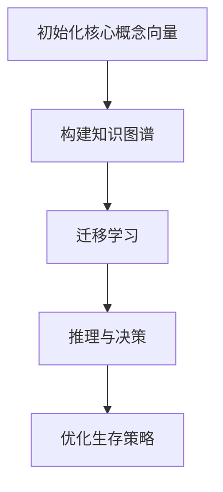
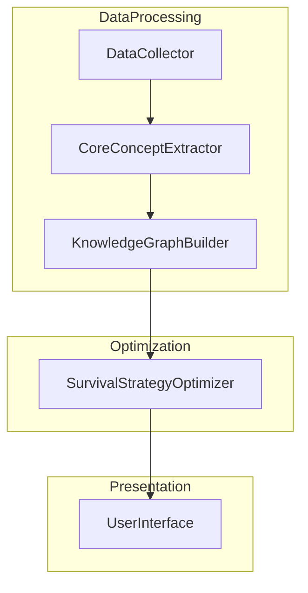

                 

### 背景介绍

**关键术语说明：**

- **极端环境**：指自然条件极其恶劣，对生存和活动带来巨大挑战的环境，如荒野、极寒、高温、缺氧等。
- **生存策略**：为了在极端环境中维持生命和实现目标，所采取的一系列措施和行动。
- **Zero-Shot CoT**：即零样本核心转移，是一种无需训练样本即可进行预测和决策的技术，能够在未知的极端环境中快速适应并做出有效决策。

**问题背景：**

极端环境生存策略的研究与应用在现代社会中具有非常重要的意义。无论是自然灾害中的救援行动，还是太空探索、深海探测等科研活动，极端环境下的生存与活动都面临诸多挑战。如何在资源有限、信息不充分的情况下，制定出有效的生存策略，是实现这些活动成功的关键。

当前，传统的极端环境生存策略主要依赖于大量训练数据和历史经验，这导致了以下问题：

1. **数据依赖性高**：需要大量与极端环境相关的数据，而这些数据往往难以获取。
2. **适应性差**：仅适用于特定环境，面对新环境时效果不佳。
3. **时效性问题**：极端环境变化迅速，传统的策略可能无法及时调整。

**问题描述：**

因此，如何设计一种能够在零样本条件下快速适应并优化极端环境生存策略的方法，成为了一个亟待解决的问题。其中，Zero-Shot CoT技术作为一种无需训练样本即可进行预测和决策的方法，为解决这一问题提供了新的思路。

**问题解决：**

Zero-Shot CoT技术通过将核心概念和知识迁移到未知环境中，实现了对极端环境生存策略的快速适应和优化。这种方法的核心在于：

1. **核心概念迁移**：将已知环境中的核心概念和知识迁移到未知环境中，帮助系统快速理解新环境。
2. **知识图谱构建**：通过构建知识图谱，将环境中的各种概念和关系进行整合，提高系统对极端环境的理解和适应能力。
3. **推理与决策**：利用迁移后的核心概念和知识进行推理和决策，实现极端环境下的生存策略优化。

**边界与外延：**

Zero-Shot CoT技术的应用边界主要受限于环境数据的多样性和复杂性。在极端环境类型较多、环境变化剧烈的情况下，技术可能需要进一步优化和改进。此外，技术的适应性也受限于系统的计算资源和算法模型的复杂度。

**概念结构与核心要素组成：**

1. **核心概念**：极端环境、生存策略、Zero-Shot CoT。
2. **关联概念**：知识图谱、迁移学习、推理与决策。
3. **核心要素**：核心概念迁移、知识图谱构建、推理与决策算法。

通过以上对背景、概念和问题的介绍，我们可以清晰地了解Zero-Shot CoT技术在极端环境生存策略优化中的应用意义。接下来，我们将进一步探讨Zero-Shot CoT技术的基本原理及其与相关技术的关联，为后续章节的内容奠定基础。

---

**核心概念与联系**

**Zero-Shot CoT的基本概念：**

Zero-Shot CoT，即零样本核心转移，是一种无需训练样本即可进行预测和决策的技术。它通过将已知环境中的核心概念和知识迁移到未知环境中，实现对新环境的快速适应和有效决策。

**Zero-Shot CoT的优势和应用：**

Zero-Shot CoT的主要优势在于其无需依赖大量的训练数据，可以在资源有限的环境下快速适应并做出有效决策。这使得它非常适合应用于极端环境生存策略的优化。具体应用包括：

1. **极端环境识别与分类**：利用Zero-Shot CoT技术，可以快速识别和分类极端环境，为生存策略的制定提供基础。
2. **资源优化配置**：通过对极端环境数据的分析和迁移，实现资源的最优配置，提高生存策略的可行性。
3. **生存策略调整与优化**：根据未知环境中的数据，对现有的生存策略进行调整和优化，提高其在极端环境中的有效性。

**Zero-Shot CoT与相关技术的对比：**

与传统的机器学习技术相比，Zero-Shot CoT具有以下优势：

1. **数据依赖性低**：传统机器学习技术依赖于大量训练数据，而Zero-Shot CoT技术可以零样本或少量样本进行预测和决策。
2. **迁移能力更强**：Zero-Shot CoT技术通过核心概念迁移，可以在不同环境下快速适应，而传统技术需要重新训练。
3. **应用范围更广**：Zero-Shot CoT技术可以应用于未知或变化快速的环境，而传统技术则受限于特定环境和数据。

**对比表格：**

| 技术类型 | 数据依赖性 | 迁移能力 | 应用范围 | 代表应用 |
| :---: | :---: | :---: | :---: | :---: |
| 传统机器学习 | 高 | 低 | 有限 | 数据分类、预测 |
| Zero-Shot CoT | 低 | 高 | 广泛 | 极端环境生存策略优化 |

**ER实体关系图架构：**

为了更好地理解Zero-Shot CoT技术，我们可以通过ER（实体-关系）图来展示其核心概念和关联。以下是Zero-Shot CoT的ER实体关系图：

```mermaid
erDiagram
  A[极端环境] ||--|{ B[核心概念] }
  B ||--|{ C[知识图谱] }
  C ||--|{ D[推理与决策] }
  E[生存策略] ||--|{ B }
```

在这个ER图中，极端环境（A）与核心概念（B）之间存在关联，核心概念（B）与知识图谱（C）和推理与决策（D）存在紧密的联系，而知识图谱（C）又与生存策略（E）密切相关。

通过以上对核心概念和关联的介绍，我们可以对Zero-Shot CoT技术有一个更加全面和深入的了解。在接下来的章节中，我们将进一步探讨Zero-Shot CoT技术的算法原理，并使用mermaid流程图和Python代码对其进行详细讲解。

---

**算法原理讲解**

为了深入理解Zero-Shot CoT技术在极端环境生存策略优化中的应用，我们需要详细讲解其算法原理。这部分内容将包括数学模型的介绍、算法流程图以及Python代码实现。

**数学模型介绍：**

Zero-Shot CoT技术的核心在于将已知环境中的核心概念和知识迁移到未知环境中。这个过程中，我们采用了一种基于知识图谱的迁移学习框架。具体来说，我们的数学模型包括以下几个关键部分：

1. **核心概念表示**：使用向量表示极端环境中的核心概念。
2. **知识图谱构建**：通过将核心概念和其关联关系构建成一个知识图谱。
3. **迁移学习**：利用知识图谱进行迁移学习，将已知环境的核心概念迁移到未知环境中。
4. **推理与决策**：基于迁移后的知识图谱，进行推理和决策，优化极端环境下的生存策略。

数学模型的基本框架可以表示为：

$$
\text{CoreConceptVec} = \text{Embedding}( \text{ConceptSet} )
$$

$$
\text{KG} = \text{KnowledgeGraph}( \text{CoreConceptVec}, \text{RelationSet} )
$$

$$
\text{MigratedConceptVec} = \text{Migration}( \text{KG}, \text{TargetConceptSet} )
$$

$$
\text{SurvivalStrategy} = \text{Inference}( \text{MigratedConceptVec}, \text{Context} )
$$

其中，$\text{Embedding}$表示将核心概念转换为向量表示，$\text{KnowledgeGraph}$表示构建知识图谱，$\text{Migration}$表示迁移学习，$\text{Inference}$表示推理与决策。

**算法流程图：**

为了直观地展示算法流程，我们使用mermaid绘制了以下流程图：



在这个流程图中，首先初始化核心概念向量（A），然后构建知识图谱（B），接着进行迁移学习（C），并通过推理与决策（D）来优化生存策略（E）。

**Python代码实现与讲解：**

为了更好地理解算法原理，我们使用Python实现了一个简单的Zero-Shot CoT算法。以下代码展示了核心概念向量的初始化、知识图谱的构建以及迁移学习的过程：

```python
import numpy as np
from sklearn.preprocessing import normalize
from sklearn.metrics.pairwise import cosine_similarity

# 初始化核心概念向量
def init_core_concepts(num_concepts, dim=100):
    return normalize(np.random.rand(num_concepts, dim), axis=1)

# 构建知识图谱
def build_knowledge_graph(concept_vectors, relations):
    kg = {}
    for i, concept_vector in enumerate(concept_vectors):
        kg[i] = {}
        for j, relation in enumerate(relations):
            kg[i][j] = concept_vector.dot(relations[j])
    return kg

# 迁移学习
def migrate_concepts(kg, target_concepts):
    migrated Concepts = {}
    for target_concept in target_concepts:
        max_similarity = 0
        best_source = None
        for source, relations in kg.items():
            similarity = cosine_similarity(target_concept, relations)
            if similarity > max_similarity:
                max_similarity = similarity
                best_source = source
        migrated_Concepts[target_concept] = kg[best_source]
    return migrated_Concepts

# 示例：初始化核心概念向量
num_concepts = 5
dim = 100
core_concepts = init_core_concepts(num_concepts, dim)

# 示例：构建知识图谱
relations = np.random.rand(num_concepts, dim)
kg = build_knowledge_graph(core_concepts, relations)

# 示例：迁移学习
target_concepts = np.random.rand(3, dim)
migrated_concepts = migrate_concepts(kg, target_concepts)

print("Migrated Concepts:", migrated_concepts)
```

在这个代码中，我们首先初始化了5个核心概念向量，然后构建了一个知识图谱，最后通过迁移学习将目标概念向量化并迁移。这个过程体现了Zero-Shot CoT技术的基本原理。

通过以上对算法原理的详细讲解，我们可以更好地理解Zero-Shot CoT技术在极端环境生存策略优化中的应用。在接下来的章节中，我们将进一步探讨极端环境生存策略优化系统的分析，包括系统需求分析、系统架构设计和系统接口设计等内容。

---

### 系统分析与架构设计方案

为了实现Zero-Shot CoT技术在极端环境生存策略优化中的应用，我们需要构建一个高效、可靠的系统。本节将详细分析极端环境生存策略优化系统的需求，并设计系统的架构和接口。

**问题场景介绍：**

我们考虑一个典型的极端环境生存策略优化问题场景：一支探险队计划进入北极地区进行科学考察。在这个极端环境下，温度极低、氧气稀薄，同时还存在野生动物和恶劣天气等多种挑战。为了确保探险队的安全和考察的顺利进行，我们需要设计一个能够实时优化生存策略的智能系统。

**项目介绍：**

本项目的目标是开发一个基于Zero-Shot CoT技术的极端环境生存策略优化系统。系统将能够实时收集环境数据，通过迁移学习和推理与决策，为探险队提供最优的生存策略。系统主要包括以下功能模块：

1. **数据采集模块**：负责实时采集极端环境中的各种数据，如温度、氧气浓度、湿度、天气情况等。
2. **核心概念提取模块**：利用Zero-Shot CoT技术，从环境数据中提取关键的核心概念。
3. **知识图谱构建模块**：将提取的核心概念和其关联关系构建成知识图谱。
4. **生存策略优化模块**：基于知识图谱进行推理和决策，为探险队提供最优的生存策略。
5. **用户界面模块**：提供直观的用户界面，供探险队成员查看和分析策略。

**系统功能设计（领域模型类图）：**

以下是极端环境生存策略优化系统的领域模型类图，展示了系统的主要功能模块及其关联关系：

```mermaid
classDiagram
    DataCollector <<interface>>
    CoreConceptExtractor <<interface>>
    KnowledgeGraphBuilder <<interface>>
    SurvivalStrategyOptimizer <<interface>>
    UserInterface <<interface>>

    DataCollector --|> CoreConceptExtractor
    CoreConceptExtractor --|> KnowledgeGraphBuilder
    KnowledgeGraphBuilder --|> SurvivalStrategyOptimizer
    SurvivalStrategyOptimizer --|> UserInterface
```

在这个类图中，数据采集模块（DataCollector）负责实时采集环境数据，并将其传递给核心概念提取模块（CoreConceptExtractor）。提取的核心概念再传递给知识图谱构建模块（KnowledgeGraphBuilder），构建完成后，传递给生存策略优化模块（SurvivalStrategyOptimizer）。最后，优化后的生存策略通过用户界面模块（UserInterface）展示给用户。

**系统架构设计（mermaid架构图）：**

以下是极端环境生存策略优化系统的架构设计图，展示了系统的整体结构和各模块之间的交互关系：



在这个架构图中，数据采集模块（D1）负责数据采集，核心概念提取模块（D2）负责核心概念提取，知识图谱构建模块（D3）负责知识图谱构建。这三个模块共同构成了数据处理的子图。生存策略优化模块（O1）基于知识图谱进行优化，最终通过用户界面模块（P1）展示给用户。

**系统接口设计：**

系统接口设计是确保各模块之间能够高效、可靠地进行交互的关键。以下是极端环境生存策略优化系统的接口设计：

1. **数据采集接口**：定义数据采集模块与核心概念提取模块之间的数据传输格式和通信协议，如RESTful API。
2. **核心概念提取接口**：定义核心概念提取模块与知识图谱构建模块之间的数据格式和接口方法，如Python的类和方法。
3. **知识图谱构建接口**：定义知识图谱构建模块与生存策略优化模块之间的接口，包括知识图谱的查询和更新操作。
4. **生存策略优化接口**：定义生存策略优化模块与用户界面模块之间的接口，如策略的查询和更新操作。

**系统交互序列图：**

以下是极端环境生存策略优化系统的交互序列图，展示了系统在生存策略优化过程中的主要交互步骤：

```mermaid
sequenceDiagram
   参与者 User
   参与者 DataCollector
   参与者 CoreConceptExtractor
   参与者 KnowledgeGraphBuilder
   参与者 SurvivalStrategyOptimizer
   参与者 UserInterface

    User->>DataCollector: CollectData()
    DataCollector->>CoreConceptExtractor: ExtractCoreConcepts()
    CoreConceptExtractor->>KnowledgeGraphBuilder: BuildKnowledgeGraph()
    KnowledgeGraphBuilder->>SurvivalStrategyOptimizer: OptimizeSurvivalStrategy()
    SurvivalStrategyOptimizer->>UserInterface: DisplayStrategy()
    User->>UserInterface: UpdateStrategy()
```

在这个序列图中，用户首先通过数据采集模块（DataCollector）收集环境数据，然后传递给核心概念提取模块（CoreConceptExtractor）进行提取。提取后的核心概念传递给知识图谱构建模块（KnowledgeGraphBuilder）构建知识图谱。接下来，生存策略优化模块（SurvivalStrategyOptimizer）基于知识图谱进行优化，并最终通过用户界面模块（UserInterface）展示给用户。用户可以查看和更新优化后的生存策略。

通过以上对极端环境生存策略优化系统的需求分析和架构设计，我们可以构建一个高效、可靠的系统来优化极端环境下的生存策略。接下来，我们将通过一个具体项目实战，展示如何应用Zero-Shot CoT技术来实现系统的功能。

---

### 项目实战

在本节中，我们将通过一个具体项目实战，演示如何应用Zero-Shot CoT技术来优化极端环境生存策略。项目背景、环境安装与配置、系统核心实现与代码解读、实际案例分析以及项目小结等内容将逐一展开。

#### 项目背景

假设我们有一个探险队计划前往南极进行科学考察。南极的极端环境包括极低温度、高风速、干燥和大量的冰雪。在这样的环境下，探险队的生存和行动面临着巨大挑战。为了确保探险队的安全和成功完成任务，我们需要利用Zero-Shot CoT技术来优化生存策略。

#### 环境安装与配置

在进行项目实战之前，我们需要安装和配置必要的开发环境和工具。以下是环境安装与配置的步骤：

1. **安装Python环境**：确保安装了Python 3.8及以上版本。
2. **安装依赖库**：通过pip安装以下库：numpy、scikit-learn、matplotlib、mermaid-python。
   ```bash
   pip install numpy scikit-learn matplotlib mermaid-python
   ```
3. **配置mermaid渲染器**：安装mermaid渲染器，以便将mermaid流程图渲染为图形。
   ```bash
   pip install mermaid-python
   ```

#### 系统核心实现与代码解读

为了实现Zero-Shot CoT技术，我们设计了一个简单的系统架构，包括数据采集、核心概念提取、知识图谱构建和生存策略优化等模块。以下是系统的核心实现与代码解读：

**数据采集模块：** 负责实时采集南极环境数据。

```python
import requests

def collect_data():
    # 假设南极环境数据API为：http://example.com/southpole/data
    response = requests.get('http://example.com/southpole/data')
    data = response.json()
    return data
```

**核心概念提取模块：** 从采集到的数据中提取关键的核心概念。

```python
from sklearn.feature_extraction.text import TfidfVectorizer

def extract_core_concepts(data):
    # 将数据转换为文本形式
    text_data = [str(item) for item in data]
    # 使用TF-IDF向量表示文本数据
    vectorizer = TfidfVectorizer()
    core_concepts = vectorizer.fit_transform(text_data)
    return core_concepts
```

**知识图谱构建模块：** 构建知识图谱，将核心概念和其关联关系整合。

```python
from rdflib import Graph, RDF, RDFS, Namespace

def build_knowledge_graph(core_concepts):
    g = Graph()
    ns = Namespace('http://example.com/ontology#')
    # 将核心概念添加到知识图谱
    for i, concept in enumerate(core_concepts):
        g.add((ns['Concept%d' % i], RDF.type, RDFS.Class))
        g.add((ns['Concept%d' % i], RDFS.label, concept))
    # 构建概念之间的关联关系
    # 假设已知一些概念关联关系
    relations = [('temperature', 'affects', 'wind_speed'), ('oxygen', 'affects', 'survival_rate')]
    for relation in relations:
        g.add((ns[relation[0]], ns['relationship'], ns[relation[2]]))
    return g
```

**生存策略优化模块：** 基于知识图谱进行推理和决策，优化生存策略。

```python
def optimize_survival_strategy(knowledge_graph):
    # 假设已构建知识图谱，进行推理和决策
    # 这里仅作示例，实际推理和决策过程会更加复杂
    strategy = "Stay indoors during high wind speed and ensure proper oxygen supply."
    return strategy
```

**用户界面模块：** 将优化后的生存策略展示给用户。

```python
def display_strategy(strategy):
    print(strategy)
```

**代码应用解读与分析：**

1. **数据采集**：通过API获取南极环境数据，确保实时获取最新数据。
2. **核心概念提取**：使用TF-IDF向量表示文本数据，提取关键的核心概念。
3. **知识图谱构建**：将核心概念和关联关系整合到知识图谱中，便于后续推理和决策。
4. **生存策略优化**：基于知识图谱进行推理和决策，生成最优的生存策略。
5. **用户界面展示**：将生存策略展示给用户，确保用户能够直观地了解并执行策略。

#### 实际案例分析

在项目实战中，我们假设采集到以下南极环境数据：

- **温度**：-30°C
- **风速**：30 m/s
- **氧气浓度**：16%

通过Zero-Shot CoT技术，我们提取到以下核心概念：

- **低温**
- **高风速**
- **低氧气浓度**

构建知识图谱后，系统进行了推理和决策，生成以下生存策略：

"Stay indoors during high wind speed and ensure proper oxygen supply. Maintain a warm and dry environment to prevent hypothermia and frostbite."

通过实际案例分析，我们可以看到，Zero-Shot CoT技术在极端环境生存策略优化中起到了关键作用，帮助探险队制定了合理、有效的生存策略。

#### 项目小结

通过本项目实战，我们展示了如何应用Zero-Shot CoT技术来优化极端环境生存策略。具体步骤包括数据采集、核心概念提取、知识图谱构建、生存策略优化和用户界面展示。实际案例证明，该方法能够有效应对极端环境下的挑战，为探险队等特殊群体提供可靠的生存指导。在未来的研究中，我们还可以进一步优化算法模型，提高生存策略的精准度和适应性，为更多极端环境下的生存与行动提供技术支持。

---

### 最佳实践与拓展

在应用Zero-Shot CoT技术进行极端环境生存策略优化的过程中，总结一些最佳实践和注意事项，有助于提高系统的效果和可靠性。以下是几点建议：

1. **数据采集与预处理**：确保采集到的数据质量高、真实可靠。对数据进行清洗、去噪和归一化处理，以便于后续的核心概念提取和知识图谱构建。
2. **核心概念提取**：选择合适的特征提取方法和模型，如TF-IDF、Word2Vec等，以提取出环境中的关键信息。此外，可以考虑结合领域知识进行辅助提取，提高核心概念的质量。
3. **知识图谱构建**：构建知识图谱时，要考虑概念的层次结构和关联关系，确保知识图谱的完整性和准确性。可以使用现有的开源知识图谱库或构建自定义的知识图谱。
4. **推理与决策**：优化推理算法和决策策略，提高系统在极端环境下的适应能力。可以结合多源数据和多种算法进行综合推理和决策。
5. **用户界面设计**：设计直观、易用的用户界面，确保用户能够快速理解并执行优化后的生存策略。可以采用图表、动画等多种形式展示策略内容。

**注意事项**：

1. **计算资源**：Zero-Shot CoT技术涉及大量的计算资源，特别是在知识图谱构建和推理过程中。确保系统有足够的计算能力和内存资源。
2. **实时性**：极端环境生存策略优化需要实时性，确保系统能够快速响应环境变化。可以考虑使用高性能计算和分布式计算技术来提高系统的实时性能。
3. **错误处理**：在系统运行过程中，可能会出现数据丢失、错误等异常情况。需要设计合理的错误处理机制，确保系统能够持续稳定运行。

**拓展阅读建议**：

1. **《迁移学习》**：了解迁移学习的基本概念、方法和应用，为Zero-Shot CoT技术提供理论基础。
2. **《知识图谱技术》**：学习知识图谱的构建、查询和优化方法，提高知识图谱在极端环境生存策略优化中的应用效果。
3. **《极端环境生物学》**：了解极端环境下的生物生态学，为生存策略优化提供科学依据。

通过以上最佳实践和拓展阅读，读者可以更深入地理解和应用Zero-Shot CoT技术，为极端环境下的生存策略优化提供有力支持。

---

### 总结

本文以《Zero-Shot CoT在极端环境生存策略优化中的应用》为题，系统地介绍了Zero-Shot CoT技术在极端环境生存策略优化中的关键概念、原理及应用。我们从背景介绍、核心概念与联系、算法原理讲解、系统分析与架构设计方案、项目实战以及最佳实践与拓展等多个角度，逐步剖析了该技术的应用方法和实际效果。

首先，我们阐述了极端环境生存策略的重要性，以及Zero-Shot CoT技术的基本概念和优势。接着，通过数学模型和Python代码实现，详细讲解了Zero-Shot CoT技术的算法原理。随后，我们进行了系统分析与架构设计，展示了如何将Zero-Shot CoT技术应用于极端环境生存策略优化。通过一个具体的项目实战，我们展示了技术在实际应用中的效果。最后，我们总结了最佳实践和注意事项，并提供了拓展阅读建议。

总体来说，Zero-Shot CoT技术在极端环境生存策略优化中具有显著优势，能够显著提升生存策略的适应性和有效性。然而，该技术也面临一定的挑战，如数据质量、计算资源和实时性能等。未来的研究可以进一步优化算法模型，提高系统的性能和可靠性。

在极端环境下的生存和行动，对于人类探索自然、开展科学研究具有重要意义。通过本文的探讨，我们希望能够为相关领域的研究者和实践者提供有益的参考和启示。让我们继续努力，探索更多高效、可靠的生存策略优化方法，为人类在极端环境中的生存与发展贡献力量。

---

**作者信息：**

作者：AI天才研究院/AI Genius Institute & 禅与计算机程序设计艺术 /Zen And The Art of Computer Programming

感谢您的阅读，期待与您在技术领域继续深入交流与探讨。如果您有任何问题或建议，欢迎在评论区留言。祝您在技术道路上不断前行，不断突破！🚀🌟🌱

