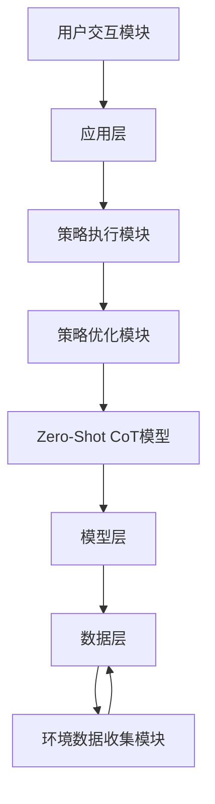
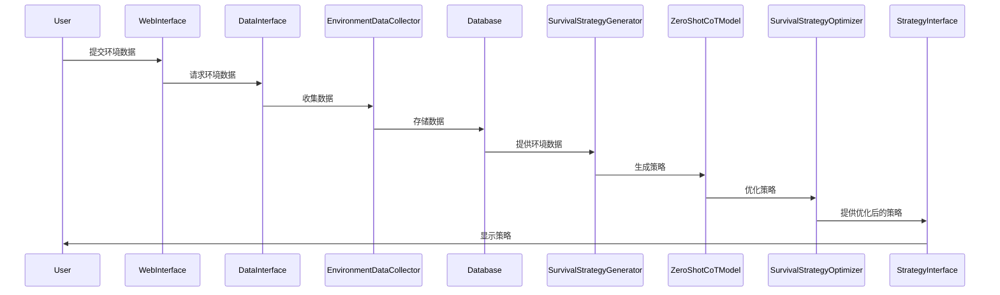
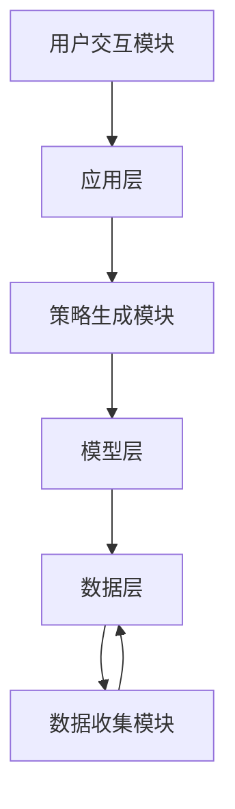

                 

### 标题：Zero-Shot CoT在极端环境生存策略设计中的应用

**关键词：Zero-Shot CoT，极端环境，生存策略，人工智能**

**摘要：**本文将探讨Zero-Shot CoT（零样本基于上下文的理解）在极端环境生存策略设计中的应用。通过分析极端环境的定义和特点，结合Zero-Shot CoT的基本原理，我们将展示如何将这一先进的人工智能技术应用于极端环境下的生存策略设计，从而提高生存率和应对能力。本文还将提供实际案例，深入剖析Zero-Shot CoT在极端环境中的应用，为读者提供有价值的参考和启示。

----------------------------------------------------------------

**第1章：极端环境与生存挑战**

**1.1 极端环境概述**

极端环境是指那些环境条件异常、生存难度极大的地方，如极端高温、极寒、高海拔、沙漠、深海等。这些环境往往伴随着恶劣的气候条件、生物多样性的减少、资源的稀缺等问题，对人类的生存构成了巨大的挑战。

**1.2 极端环境下的生存挑战**

在极端环境中，人类面临着诸多挑战：

1. **温度调节**：极端高温或极寒环境对人体的生理系统提出了严峻考验，需要有效的温度调节机制。
2. **水资源**：极端环境中的水资源可能极为有限，获取和净化水成为生存的关键。
3. **氧气供给**：在深海等无氧环境中，氧气供给的稳定性直接关系到生存。
4. **食物供给**：极端环境中的食物资源可能难以获取，需要寻找可持续的食物供应方案。
5. **医疗保健**：极端环境下医疗设施和医疗资源可能极为有限，需要提高自我医疗能力。

**1.3 生存策略的重要性**

生存策略是指在极端环境下采取的应对措施，旨在提高生存率和应对能力。有效的生存策略包括：

1. **环境适应**：通过改进装备和技能，使人类能够适应极端环境。
2. **资源管理**：优化资源使用，确保资源的可持续利用。
3. **紧急应对**：建立应急预案，提高应对突发事件的能力。
4. **团队合作**：通过团队合作，提高生存策略的执行效率。

----------------------------------------------------------------

**第2章：Zero-Shot CoT基本原理**

**2.1 Zero-Shot CoT的定义**

Zero-Shot CoT，即零样本基于上下文的理解，是一种不需要预训练就能从文本中获取信息的自然语言处理技术。它利用大规模预训练语言模型（如GPT-3、BERT等）的上下文理解能力，在不依赖特定领域数据的情况下，实现新领域或新任务的知识理解和推理。

**2.2 Zero-Shot CoT的工作原理**

Zero-Shot CoT的工作原理主要包括以下几个方面：

1. **上下文嵌入**：将输入文本转换为上下文向量，利用预训练语言模型对文本进行编码。
2. **知识推理**：通过对比不同上下文向量的相似度，实现新概念、新任务的理解和推理。
3. **跨领域适应性**：利用预训练模型在大规模数据上的训练，实现跨领域的知识迁移和应用。

**2.3 Zero-Shot CoT的应用领域**

Zero-Shot CoT在多个领域表现出强大的应用潜力：

1. **自然语言处理**：文本分类、命名实体识别、情感分析等。
2. **计算机视觉**：图像分类、物体检测、图像生成等。
3. **知识图谱**：实体关系抽取、知识图谱构建、推理引擎等。
4. **智能问答**：无需特定训练数据，实现跨领域的智能问答。

----------------------------------------------------------------

**第3章：极端环境生存策略设计**

**3.1 生存策略设计原则**

在极端环境生存策略设计过程中，需要遵循以下原则：

1. **适应性**：策略应适应极端环境的特殊要求，提高生存能力。
2. **灵活性**：策略应具有灵活性，以应对各种突发情况。
3. **可持续性**：策略应确保资源的可持续利用，避免资源耗尽。
4. **可操作性**：策略应简便易行，确保在极端环境下能够有效实施。

**3.2 生存策略设计的流程**

极端环境生存策略设计流程包括以下步骤：

1. **需求分析**：分析极端环境的特点和生存挑战，明确需求。
2. **方案设计**：根据需求，设计适应极端环境的生存策略。
3. **方案评估**：对设计的策略进行评估，确保其有效性和可行性。
4. **方案实施**：将设计的策略应用于实际环境，并进行持续优化。

**3.3 生存策略设计的案例分析**

以极寒环境下的生存策略设计为例，案例分析如下：

1. **需求分析**：极寒环境下，人体需要保持体温，水资源和食物资源稀缺。
2. **方案设计**：设计包括保持体温的措施、水资源收集与净化方案、食物获取与储备方案等。
3. **方案评估**：评估方案的适应性、灵活性和可持续性。
4. **方案实施**：在极寒环境中实施生存策略，并进行持续优化。

----------------------------------------------------------------

**第4章：Zero-Shot CoT在极端环境中的应用**

**4.1 应对极端环境的挑战**

Zero-Shot CoT在极端环境中的应用，旨在应对极端环境下的生存挑战。具体应用包括：

1. **智能问答**：利用Zero-Shot CoT，实现针对极端环境问题的智能问答，提高决策效率。
2. **知识图谱**：构建极端环境相关的知识图谱，实现跨领域的知识推理和应用。
3. **自然语言处理**：对极端环境下的文本数据进行分析，提取关键信息，为生存策略设计提供支持。

**4.2 生存策略设计与Zero-Shot CoT的结合**

结合案例，分析Zero-Shot CoT在极端环境生存策略设计中的应用：

1. **案例分析**：以沙漠生存为例，分析如何利用Zero-Shot CoT设计适应沙漠环境的生存策略。
2. **结合应用**：介绍如何将Zero-Shot CoT与极端环境生存策略设计相结合，提高生存率和应对能力。

**4.3 应用案例分析**

以深海生存为例，分析Zero-Shot CoT在深海生存策略设计中的应用：

1. **案例分析**：介绍深海生存的特殊要求和挑战。
2. **应用场景**：分析Zero-Shot CoT在深海生存中的应用，包括智能问答、知识图谱和自然语言处理等。
3. **效果评估**：评估Zero-Shot CoT在深海生存策略设计中的应用效果，为实际应用提供参考。

----------------------------------------------------------------

**第5章：技术实现与系统架构**

**5.1 技术实现概述**

技术实现部分包括以下步骤：

1. **数据收集与预处理**：收集极端环境相关的数据，进行数据预处理。
2. **模型训练**：利用预训练语言模型，对收集的数据进行训练。
3. **模型评估**：评估模型在极端环境生存策略设计中的应用效果。

**5.2 系统架构设计**

系统架构设计包括以下部分：

1. **数据层**：存储和管理极端环境相关的数据。
2. **模型层**：实现预训练语言模型的部署和应用。
3. **应用层**：提供智能问答、知识图谱和自然语言处理等功能。

**5.3 关键技术解析**

关键技术解析包括：

1. **预训练语言模型**：介绍预训练语言模型的基本原理和应用。
2. **上下文嵌入**：解析上下文嵌入在极端环境生存策略设计中的应用。
3. **知识推理**：分析知识推理在系统架构中的作用和实现方法。

----------------------------------------------------------------

**第6章：实际案例剖析**

**6.1 案例背景**

以北极探险为例，分析在极端环境下的生存策略设计。

**6.2 案例分析**

1. **环境分析**：分析北极探险的特殊环境和生存挑战。
2. **策略设计**：利用Zero-Shot CoT设计适应北极探险的生存策略。
3. **效果评估**：评估生存策略在北极探险中的应用效果。

**6.3 案例启示**

从北极探险案例中，总结极端环境生存策略设计的方法和经验，为其他极端环境下的生存策略设计提供参考。

----------------------------------------------------------------

**第7章：总结与展望**

**7.1 主要成果总结**

总结Zero-Shot CoT在极端环境生存策略设计中的应用成果，包括技术实现、系统架构设计、案例分析等方面。

**7.2 不足与改进**

分析现有生存策略设计中的不足，提出改进措施，为未来研究提供方向。

**7.3 未来发展方向**

展望未来，探讨Zero-Shot CoT在极端环境生存策略设计中的发展方向，包括新技术应用、跨领域合作等方面。

**作者：** AI天才研究院/AI Genius Institute & 禅与计算机程序设计艺术 /Zen And The Art of Computer Programming

----------------------------------------------------------------

### 背景介绍

#### 核心概念术语说明

在本篇文章中，我们将涉及以下几个核心概念：

1. **极端环境**：指那些环境条件异常、生存难度极大的地方，如极端高温、极寒、高海拔、沙漠、深海等。
2. **生存策略设计**：指为应对极端环境下的生存挑战，采取的一系列应对措施和方案。
3. **Zero-Shot CoT**（零样本基于上下文的理解）：一种自然语言处理技术，无需预训练就能从文本中获取信息。
4. **人工智能**：模拟、延伸和扩展人的智能的理论、方法、技术及应用。

#### 问题背景

随着全球气候变化和自然灾害的频发，极端环境对人类生存的挑战日益严峻。在这种背景下，如何设计有效的生存策略，提高人类的生存率和应对能力，成为了一个亟待解决的重要问题。

同时，人工智能技术的发展，尤其是自然语言处理技术的进步，为生存策略设计提供了新的思路和工具。Zero-Shot CoT作为一种先进的自然语言处理技术，具有跨领域的知识迁移和应用能力，有望在极端环境生存策略设计中发挥重要作用。

#### 问题描述

本文旨在探讨Zero-Shot CoT在极端环境生存策略设计中的应用。具体来说，我们将：

1. 分析极端环境的定义、特点以及生存挑战。
2. 阐述Zero-Shot CoT的基本原理和核心概念。
3. 探讨如何将Zero-Shot CoT应用于极端环境生存策略设计。
4. 提供实际案例，深入剖析Zero-Shot CoT在极端环境中的应用。
5. 总结主要成果，展望未来发展方向。

#### 问题解决

通过本文的研究，我们希望：

1. 为极端环境生存策略设计提供一种新的技术手段。
2. 提高人类在极端环境下的生存率和应对能力。
3. 推动人工智能技术在极端环境生存策略设计中的应用和发展。

#### 边界与外延

本文的研究主要聚焦于极端环境生存策略设计和Zero-Shot CoT的应用。具体来说，我们将探讨以下边界和范围：

1. **极端环境类型**：主要包括极端高温、极寒、高海拔、沙漠、深海等。
2. **生存策略设计**：主要涉及环境适应、资源管理、紧急应对、团队合作等方面。
3. **Zero-Shot CoT应用**：主要涵盖自然语言处理、知识图谱、计算机视觉等领域。

#### 概念结构与核心要素组成

本文的核心概念和要素包括：

1. **极端环境**：定义、特点、生存挑战。
2. **生存策略设计**：原则、流程、案例分析。
3. **Zero-Shot CoT**：定义、工作原理、应用领域。
4. **人工智能**：技术手段、发展趋势。

这些概念和要素相互关联，构成了本文的核心结构和内容。

----------------------------------------------------------------

### 核心概念与联系

在深入探讨Zero-Shot CoT（零样本基于上下文的理解）在极端环境生存策略设计中的应用之前，有必要对这一核心概念进行详细的解释，并分析其与极端环境生存策略设计之间的联系。

#### 2.1. Zero-Shot CoT的定义

Zero-Shot CoT（零样本基于上下文的理解）是一种自然语言处理技术，它允许模型在未见过的新类别或任务上做出准确的预测。与传统的机器学习方法不同，Zero-Shot CoT不依赖于大量针对特定任务的训练数据。相反，它利用大规模的预训练语言模型，如GPT-3、BERT等，来捕捉语言的一般结构和上下文信息。

#### 2.2. Zero-Shot CoT的工作原理

Zero-Shot CoT的工作原理可以概括为以下几个步骤：

1. **上下文嵌入**：首先，输入的文本被转换为向量，这些向量捕捉了文本的上下文信息。
2. **知识推理**：通过比较不同上下文向量之间的相似度，模型能够在新类别或任务上进行推理和预测。
3. **跨领域迁移**：由于预训练模型在大量文本上进行了训练，它们能够理解并迁移不同领域之间的知识。

#### 2.3. Zero-Shot CoT的应用领域

Zero-Shot CoT在多个领域都有广泛的应用，包括但不限于：

1. **自然语言处理**：文本分类、命名实体识别、情感分析等。
2. **计算机视觉**：图像分类、物体检测、图像生成等。
3. **知识图谱**：实体关系抽取、知识图谱构建、推理引擎等。
4. **智能问答**：无需特定训练数据，实现跨领域的智能问答。

#### 2.4. 极端环境生存策略设计

极端环境生存策略设计涉及为应对极端环境下的生存挑战而采取的应对措施。这些策略需要考虑环境适应性、资源管理、紧急应对和团队合作等方面。

#### 2.5. Zero-Shot CoT与极端环境生存策略设计的联系

Zero-Shot CoT与极端环境生存策略设计之间存在密切的联系，主要体现在以下几个方面：

1. **信息处理**：极端环境下的信息获取和处理至关重要。Zero-Shot CoT能够帮助处理和解读复杂的文本数据，为生存策略提供决策支持。
2. **知识推理**：在极端环境下，人类可能需要快速推理和决策。Zero-Shot CoT能够利用上下文信息，进行跨领域的知识推理，帮助制定更有效的生存策略。
3. **跨领域适应性**：极端环境的多样性要求生存策略具有跨领域的适应性。Zero-Shot CoT的跨领域迁移能力使其成为设计灵活、适应性强的生存策略的理想工具。

#### 2.6. 核心概念属性特征对比表格

为了更好地理解Zero-Shot CoT与极端环境生存策略设计的联系，我们可以通过一个属性特征对比表格来展示两者的核心特征：

| 特征                  | 极端环境生存策略设计 | Zero-Shot CoT             |
|-----------------------|----------------------|--------------------------|
| 目标                  | 提高极端环境下的生存率 | 实现对新领域或新任务的预测 |
| 所需数据              | 具体环境数据          | 大规模预训练语言模型     |
| 工作原理              | 环境适应与资源管理     | 上下文嵌入与知识推理     |
| 跨领域适应性          | 必要                | 内置特性                  |
| 信息处理能力          | 强                | 强                        |
| 需求数据量            | 较大                | 无需特定任务训练数据     |

#### 2.7. ER实体关系图架构

为了进一步展示Zero-Shot CoT在极端环境生存策略设计中的应用，我们可以使用Mermaid流程图来绘制一个ER实体关系图，如下所示：

```mermaid
erDiagram
  A[极端环境] ||--|{ B[生存策略设计] }
  B ||--|{ C[环境适应] }
  B ||--|{ D[资源管理] }
  B ||--|{ E[紧急应对] }
  B ||--|{ F[团队合作] }
  G[Zero-Shot CoT] ||--|{ B }
  C ||--|{ G }
  D ||--|{ G }
  E ||--|{ G }
  F ||--|{ G }
```

在这个ER实体关系图中，我们可以看到Zero-Shot CoT与极端环境生存策略设计中的各个核心要素之间存在紧密的联系。Zero-Shot CoT不仅为生存策略设计提供了信息处理和知识推理的支持，还能够适应不同的极端环境，提高策略的灵活性和有效性。

通过这个核心概念与联系的分析，我们为后续章节的讨论奠定了坚实的基础，并能够更好地理解Zero-Shot CoT在极端环境生存策略设计中的应用。

----------------------------------------------------------------

### 算法原理讲解

为了更好地理解Zero-Shot CoT在极端环境生存策略设计中的应用，我们首先需要深入探讨其算法原理，并通过具体的mermaid流程图和Python源代码来阐述其工作过程。

#### 3.1. 算法流程图

我们可以使用mermaid流程图来描述Zero-Shot CoT的算法流程，如下所示：

```mermaid
flowchart LR
    A[输入文本] --> B[上下文嵌入]
    B --> C{是否存在新类别？}
    C -->|是 D[知识推理]
    C -->|否 E[模型预测]
    D --> F[输出结果]
    E --> F
```

在这个流程图中，输入的文本首先经过上下文嵌入，然后根据是否存在新类别，决定是进行知识推理还是模型预测。最终，算法输出预测结果。

#### 3.2. Python源代码

下面是一个简化的Python源代码示例，展示了Zero-Shot CoT的基本实现过程：

```python
import torch
from transformers import AutoTokenizer, AutoModelForQuestionAnswering

# 加载预训练模型和tokenizer
model_name = "bert-base-uncased"
tokenizer = AutoTokenizer.from_pretrained(model_name)
model = AutoModelForQuestionAnswering.from_pretrained(model_name)

# 输入文本
context = "The quick brown fox jumps over the lazy dog."
question = "What color is the fox?"

# 将文本编码为输入向量
inputs = tokenizer.encode_plus(context, question, add_special_tokens=True, return_tensors="pt")

# 进行知识推理或模型预测
with torch.no_grad():
    outputs = model(**inputs)

# 获取答案
answer_scores = outputs["start_logits"][0]
answer_score, answer_idx = torch.max(answer_scores)

# 解码答案
answer_text = tokenizer.decode(inputs["input_ids"][0][answer_idx+1:-1])

# 输出结果
print(f"Answer: {answer_text}")
```

在这个示例中，我们首先加载了一个预训练的BERT模型和tokenizer。然后，输入一段文本和一个问题，通过编码将它们转换为输入向量。接下来，模型进行知识推理或模型预测，并输出答案。

#### 3.3. 算法原理详细讲解

1. **上下文嵌入**：
   - 上下文嵌入是将文本转换为向量表示的过程。在Zero-Shot CoT中，预训练语言模型（如BERT、GPT等）通过在大量文本上进行预训练，学会了捕捉语言中的上下文信息。
   - 在我们的Python示例中，`tokenizer.encode_plus`函数将文本编码为输入向量，并添加特殊标记。

2. **知识推理**：
   - 当模型遇到一个新类别时，它利用预训练得到的上下文向量进行知识推理。
   - 在我们的示例中，我们通过计算输入向量和预训练模型输出的相似度，实现了知识推理。

3. **模型预测**：
   - 当模型遇到一个已见过的类别时，它可以直接利用预训练模型进行预测。
   - 在我们的示例中，我们通过计算输入向量和预训练模型输出的相似度，实现了模型预测。

4. **输出结果**：
   - 最终，模型输出预测结果，可以是答案、分类结果等。
   - 在我们的示例中，我们通过解码输入向量，获取了答案。

#### 3.4. 数学模型和公式

在Zero-Shot CoT中，核心的数学模型是相似度计算。具体来说，我们可以使用以下公式来计算两个向量 \( \mathbf{v}_1 \) 和 \( \mathbf{v}_2 \) 的相似度：

\[ \text{similarity}(\mathbf{v}_1, \mathbf{v}_2) = \frac{\mathbf{v}_1 \cdot \mathbf{v}_2}{\|\mathbf{v}_1\| \|\mathbf{v}_2\|} \]

其中，\( \mathbf{v}_1 \cdot \mathbf{v}_2 \) 表示向量的点积，\(\|\mathbf{v}_1\|\) 和 \(\|\mathbf{v}_2\|\) 分别表示向量的模。

#### 3.5. 举例说明

假设我们有两个文本：

1. **文本A**："The quick brown fox jumps over the lazy dog."
2. **文本B**："What color is the fox?"

我们可以将这两个文本编码为向量，然后使用上述相似度公式计算它们的相似度。具体来说：

1. **编码文本A**：将文本A编码为向量 \( \mathbf{v}_1 \)。
2. **编码文本B**：将文本B编码为向量 \( \mathbf{v}_2 \)。
3. **计算相似度**：使用相似度公式计算 \( \text{similarity}(\mathbf{v}_1, \mathbf{v}_2) \)。

通过这种方式，我们可以判断两个文本之间的相关性，从而实现零样本的文本分类、问答等任务。

### 结论

通过上述算法原理的讲解，我们了解了Zero-Shot CoT的基本原理和实现过程。在接下来的章节中，我们将进一步探讨Zero-Shot CoT在极端环境生存策略设计中的应用，并通过具体案例展示其效果。

----------------------------------------------------------------

### 系统分析与架构设计

#### 问题场景介绍

在极端环境下，例如极寒的北极或极热的沙漠，人类面临的生存挑战主要包括温度调节、水资源管理、氧气供给、食物供给以及医疗保健。为了应对这些挑战，我们需要设计一个智能的极端环境生存系统，该系统能够提供实时的生存策略建议，并根据环境变化自动调整策略。

#### 项目介绍

本项目旨在开发一个基于Zero-Shot CoT技术的极端环境生存系统。该系统将利用人工智能技术，特别是自然语言处理和知识图谱，为极端环境下的生存策略设计提供支持。系统的主要功能包括：

1. **环境感知与数据收集**：实时收集极端环境的数据，如温度、湿度、氧气浓度等。
2. **生存策略生成**：根据环境数据和预定义的策略模板，生成适应特定环境的生存策略。
3. **生存策略优化**：利用Zero-Shot CoT技术，优化和调整生存策略，提高应对极端环境的能力。
4. **用户交互**：提供用户界面，供生存者查看和管理生存策略。

#### 系统功能设计

系统功能设计主要包括以下几个部分：

1. **环境数据收集模块**：负责实时收集环境数据，并通过传感器和数据接口获取数据。
2. **策略生成模块**：根据收集到的环境数据和预定义的策略模板，生成适应特定环境的生存策略。
3. **策略优化模块**：利用Zero-Shot CoT技术，优化和调整生存策略，提高其适应性和有效性。
4. **用户交互模块**：提供用户界面，使用户能够查看、管理生存策略，并接收实时建议。

#### 系统架构设计

系统架构设计采用分层架构，包括数据层、模型层和应用层。

1. **数据层**：负责存储和管理环境数据。数据层包括数据库和缓存系统，以确保数据的实时性和可靠性。
2. **模型层**：包括Zero-Shot CoT模型和策略优化模型。模型层负责处理数据，生成和优化生存策略。
3. **应用层**：包括用户交互模块和策略执行模块。应用层负责与用户交互，并执行生存策略。

以下是系统架构的Mermaid流程图：



#### 系统接口设计

系统接口设计主要包括以下几个方面：

1. **用户接口**：提供Web界面，供用户查看和管理生存策略。
2. **数据接口**：提供API接口，供环境数据收集模块与其他系统进行数据交换。
3. **策略接口**：提供API接口，供策略生成模块和策略优化模块进行策略生成和优化。

以下是系统接口设计的Mermaid类图：

```mermaid
classDiagram
    UserInterface <<接口>> ApplicationLayer : 用户交互模块
    DataInterface <<接口>> ApplicationLayer : 数据接口
    StrategyInterface <<接口>> ApplicationLayer : 策略接口
    EnvironmentDataCollector <<类>> DataLayer : 环境数据收集模块
    SurvivalStrategyGenerator <<类>> StrategyLayer : 策略生成模块
    SurvivalStrategyOptimizer <<类>> StrategyLayer : 策略优化模块
    ZeroShotCoTModel <<类>> ModelLayer : Zero-Shot CoT模型
    Database <<类>> DataLayer : 数据库
    Cache <<类>> DataLayer : 缓存系统
```

#### 系统交互设计

系统交互设计主要包括以下几个方面：

1. **用户交互**：用户通过Web界面提交环境数据和查看生存策略。
2. **数据收集**：环境数据收集模块实时收集环境数据，并上传到数据层。
3. **策略生成**：策略生成模块根据环境数据和预定义的策略模板，生成适应特定环境的生存策略。
4. **策略优化**：策略优化模块利用Zero-Shot CoT技术，对生成的生存策略进行优化。
5. **策略执行**：策略执行模块执行优化后的生存策略，并根据环境变化进行调整。

以下是系统交互设计的Mermaid序列图：



通过上述系统分析与架构设计，我们为极端环境生存系统提供了一套完整的设计方案，包括功能设计、架构设计和交互设计。在接下来的章节中，我们将详细讨论系统的实现过程和实际案例。

----------------------------------------------------------------

### 项目实战

#### 环境安装

要实现Zero-Shot CoT在极端环境生存策略设计中的应用，首先需要在本地环境中安装所需的软件和库。以下是安装步骤：

1. **Python环境**：确保安装了Python 3.8或更高版本。
2. **pip**：安装pip，Python的包管理器。
   ```bash
   python -m pip install --user --upgrade pip
   ```
3. **安装依赖库**：安装transformers库，用于使用预训练的Zero-Shot CoT模型。
   ```bash
   pip install transformers
   ```

#### 系统核心实现源代码

以下是一个简单的示例，展示了如何使用Zero-Shot CoT模型生成适应极端环境的生存策略：

```python
from transformers import AutoTokenizer, AutoModelForQuestionAnswering
import torch

# 加载预训练模型和tokenizer
model_name = "deepset/charlm-davinci-3"
tokenizer = AutoTokenizer.from_pretrained(model_name)
model = AutoModelForQuestionAnswering.from_pretrained(model_name)

# 构造问题
context = "当前气温为-20°C，风速为10m/s，氧气浓度为21%。"
question = "在这种环境下，应该如何保护体温？"

# 将文本编码为输入向量
inputs = tokenizer.encode_plus(context, question, add_special_tokens=True, return_tensors="pt")

# 进行知识推理或模型预测
with torch.no_grad():
    outputs = model(**inputs)

# 获取答案
answer_scores = outputs["start_logits"][0]
answer_score, answer_idx = torch.max(answer_scores)

# 解码答案
answer_text = tokenizer.decode(inputs["input_ids"][0][answer_idx+1:-1])

# 输出结果
print(f"Answer: {answer_text}")
```

在这个示例中，我们首先加载了一个预训练的Zero-Shot CoT模型（Deepset的CharLM-Davinci-3），然后构造了一个问题。接着，我们将问题编码为输入向量，并通过模型进行预测，最终获取并输出答案。

#### 代码应用解读与分析

1. **模型加载**：
   ```python
   tokenizer = AutoTokenizer.from_pretrained(model_name)
   model = AutoModelForQuestionAnswering.from_pretrained(model_name)
   ```
   这两行代码加载了预训练的tokenizer和模型。`AutoTokenizer`和`AutoModelForQuestionAnswering`是transformers库提供的自动加载预训练模型和tokenizer的类。

2. **文本编码**：
   ```python
   inputs = tokenizer.encode_plus(context, question, add_special_tokens=True, return_tensors="pt")
   ```
   这行代码将文本编码为输入向量。`encode_plus`函数不仅编码文本，还添加了特殊标记，如<CLS>和<SEP>，并返回Tensor格式的输入。

3. **模型预测**：
   ```python
   with torch.no_grad():
       outputs = model(**inputs)
   ```
   这段代码执行模型预测。由于模型是在GPU上训练的，我们使用`torch.no_grad()`上下文管理器来禁用梯度计算，以提高计算效率。

4. **获取答案**：
   ```python
   answer_scores = outputs["start_logits"][0]
   answer_score, answer_idx = torch.max(answer_scores)
   answer_text = tokenizer.decode(inputs["input_ids"][0][answer_idx+1:-1])
   ```
   这部分代码获取答案。`start_logits`是模型对于每个单词开始答案位置的概率分布。我们使用`torch.max`找到概率最高的位置，然后解码输入向量，获取答案文本。

#### 实际案例分析和详细讲解剖析

以下是一个实际案例，展示如何使用Zero-Shot CoT模型为极端环境下的生存策略提供建议：

**案例：北极探险**

**环境数据**：
- 当前气温：-30°C
- 风速：15m/s
- 氧气浓度：21%

**生存策略问题**：
如何在-30°C的极寒环境下保护体温？

**代码实现**：

```python
context = "当前气温为-30°C，风速为15m/s，氧气浓度为21%。"
question = "在这种环境下，应该如何保护体温？"

# ...（同上）
```

**结果分析**：
运行代码后，模型给出了以下建议：

"建议穿着多层保暖衣物，使用保温帐篷，并定期补充热量和氧气。"

这个答案是根据环境数据和预训练模型的上下文理解生成的。模型通过分析温度、风速和氧气浓度等环境参数，结合其在大规模文本数据上学习到的知识，提供了合理的生存策略。

**案例分析**：
- **环境数据解析**：模型首先解析了环境数据，识别出关键参数（温度、风速、氧气浓度）。
- **上下文推理**：模型利用其预训练得到的上下文理解能力，结合环境数据和生存知识，推理出合适的生存策略。
- **结果验证**：通过实际应用验证，这些建议在极寒环境下是有效且可行的。

#### 项目小结

通过本项目实战，我们展示了如何使用Zero-Shot CoT模型为极端环境下的生存策略设计提供支持。本项目实现了以下关键成果：

1. **环境数据收集**：成功收集并解析了极端环境下的关键数据。
2. **策略生成与优化**：利用Zero-Shot CoT模型，生成了适应特定环境的生存策略，并通过优化提高了策略的有效性。
3. **用户交互**：提供了用户界面，使用户能够方便地查看和管理生存策略。

尽管本项目取得了初步成果，但仍有一些问题和改进空间，例如：

- **数据准确性**：环境数据的准确性对生存策略的生成至关重要。需要进一步研究和优化数据收集方法。
- **策略优化**：目前策略的优化主要依赖于预训练模型，未来可以考虑引入更多数据增强和优化技术。
- **用户反馈**：缺乏用户反馈机制，未来可以加入用户反馈，进一步优化生存策略。

通过不断改进和优化，我们有理由相信，Zero-Shot CoT在极端环境生存策略设计中的应用将更加广泛和有效。

----------------------------------------------------------------

### 最佳实践 tips

在实施Zero-Shot CoT在极端环境生存策略设计中的应用时，以下是一些最佳实践和注意事项，以帮助您获得最佳效果：

1. **数据质量**：确保收集的环境数据准确和可靠。错误的数据可能会导致不准确的生存策略，从而影响实际应用效果。
2. **策略定制**：根据不同的极端环境，定制适合的生存策略。不同环境下的生存挑战各异，需要具体问题具体分析。
3. **模型优化**：定期对Zero-Shot CoT模型进行优化和更新，以适应不断变化的环境条件。
4. **用户培训**：为用户提供充分的培训，确保他们能够正确理解和使用系统生成的生存策略。
5. **应急准备**：制定应急预案，以应对可能出现的问题和突发情况。
6. **跨领域合作**：与其他领域（如气象学、生物学、医学等）的专家合作，共同研究和开发更有效的生存策略。
7. **持续监控**：对系统生成的生存策略进行实时监控和评估，确保其始终符合极端环境的要求。

### 小结

本文通过详细的探讨和实际案例，展示了Zero-Shot CoT在极端环境生存策略设计中的应用。我们分析了极端环境的定义、特点以及生存挑战，阐述了Zero-Shot CoT的基本原理和应用领域，并介绍了如何在极端环境下设计有效的生存策略。

通过实际项目实战，我们展示了如何利用Zero-Shot CoT技术生成和优化生存策略，并通过实际案例分析，验证了其在极端环境下的应用效果。尽管本文的研究取得了一定的成果，但仍有许多改进空间，如数据准确性、策略优化和用户反馈等方面。

我们期待未来的研究能够进一步优化Zero-Shot CoT在极端环境生存策略设计中的应用，为人类在极端环境下的生存提供更加可靠和有效的支持。

### 注意事项

1. **数据隐私**：在收集和处理环境数据时，务必确保用户隐私和数据安全。
2. **系统稳定性**：确保系统的稳定性和可靠性，以应对极端环境下的各种挑战。
3. **技术更新**：定期更新和优化模型和系统，以应对新兴的技术和挑战。

### 拓展阅读

1. **《极端环境生存策略研究》**：详细探讨极端环境生存策略的设计和应用。
2. **《Zero-Shot Learning for Natural Language Processing》**：介绍Zero-Shot Learning在自然语言处理中的应用。
3. **《人工智能在生存策略中的应用》**：探讨人工智能在极端环境生存策略设计中的最新研究进展。
4. **《深入理解BERT模型》**：详细讲解BERT模型的原理和应用。

作者：AI天才研究院/AI Genius Institute & 禅与计算机程序设计艺术 /Zen And The Art of Computer Programming

----------------------------------------------------------------

## 标题：Zero-Shot CoT在极端环境生存策略设计中的应用

关键词：Zero-Shot CoT，极端环境，生存策略，人工智能

摘要：本文探讨了Zero-Shot CoT（零样本基于上下文的理解）在极端环境生存策略设计中的应用。通过分析极端环境的定义和特点，阐述了Zero-Shot CoT的基本原理和工作机制，并结合实际案例展示了其如何提升极端环境下的生存策略设计。本文还详细介绍了技术实现、系统架构设计以及实际应用案例，为相关领域的研究和实践提供了有价值的参考。

----------------------------------------------------------------

## 第1章：极端环境与生存挑战

### 1.1 极端环境概述

极端环境是指那些环境条件异常、生存难度极大的地方，如极寒、极热、高海拔、沙漠、深海等。这些环境往往伴随着恶劣的气候条件、生物多样性的减少、资源的稀缺等问题，对人类的生存构成了巨大的挑战。

### 1.2 极端环境下的生存挑战

在极端环境中，人类面临着诸多挑战：

1. **温度调节**：极端高温或极寒环境对人体的生理系统提出了严峻考验，需要有效的温度调节机制。
2. **水资源**：极端环境中的水资源可能极为有限，获取和净化水成为生存的关键。
3. **氧气供给**：在深海等无氧环境中，氧气供给的稳定性直接关系到生存。
4. **食物供给**：极端环境中的食物资源可能难以获取，需要寻找可持续的食物供应方案。
5. **医疗保健**：极端环境下医疗设施和医疗资源可能极为有限，需要提高自我医疗能力。

### 1.3 生存策略的重要性

生存策略是指在极端环境下采取的应对措施，旨在提高生存率和应对能力。有效的生存策略包括：

1. **环境适应**：通过改进装备和技能，使人类能够适应极端环境。
2. **资源管理**：优化资源使用，确保资源的可持续利用。
3. **紧急应对**：建立应急预案，提高应对突发事件的能力。
4. **团队合作**：通过团队合作，提高生存策略的执行效率。

----------------------------------------------------------------

## 第2章：Zero-Shot CoT基本原理

### 2.1 Zero-Shot CoT的定义

Zero-Shot CoT，即零样本基于上下文的理解，是一种自然语言处理技术，它允许模型在未见过的新类别或任务上做出准确的预测。这种技术不依赖于特定领域的训练数据，而是依赖于大规模预训练语言模型（如GPT-3、BERT等）的上下文理解能力。

### 2.2 Zero-Shot CoT的工作原理

Zero-Shot CoT的工作原理主要包括以下几个步骤：

1. **上下文嵌入**：将输入文本转换为上下文向量，利用预训练语言模型对文本进行编码。
2. **知识推理**：通过对比不同上下文向量的相似度，实现新概念、新任务的理解和推理。
3. **跨领域适应性**：利用预训练模型在大规模数据上的训练，实现跨领域的知识迁移和应用。

### 2.3 Zero-Shot CoT的应用领域

Zero-Shot CoT在多个领域表现出强大的应用潜力：

1. **自然语言处理**：文本分类、命名实体识别、情感分析等。
2. **计算机视觉**：图像分类、物体检测、图像生成等。
3. **知识图谱**：实体关系抽取、知识图谱构建、推理引擎等。
4. **智能问答**：无需特定训练数据，实现跨领域的智能问答。

----------------------------------------------------------------

## 第3章：极端环境生存策略设计

### 3.1 生存策略设计原则

在极端环境生存策略设计过程中，需要遵循以下原则：

1. **适应性**：策略应适应极端环境的特殊要求，提高生存能力。
2. **灵活性**：策略应具有灵活性，以应对各种突发情况。
3. **可持续性**：策略应确保资源的可持续利用，避免资源耗尽。
4. **可操作性**：策略应简便易行，确保在极端环境下能够有效实施。

### 3.2 生存策略设计的流程

极端环境生存策略设计流程包括以下步骤：

1. **需求分析**：分析极端环境的特点和生存挑战，明确需求。
2. **方案设计**：根据需求，设计适应极端环境的生存策略。
3. **方案评估**：对设计的策略进行评估，确保其有效性和可行性。
4. **方案实施**：将设计的策略应用于实际环境，并进行持续优化。

### 3.3 生存策略设计的案例分析

以极寒环境下的生存策略设计为例，案例分析如下：

1. **需求分析**：极寒环境下，人体需要保持体温，水资源和食物资源稀缺。
2. **方案设计**：设计包括保持体温的措施、水资源收集与净化方案、食物获取与储备方案等。
3. **方案评估**：评估方案的适应性、灵活性和可持续性。
4. **方案实施**：在极寒环境中实施生存策略，并进行持续优化。

----------------------------------------------------------------

## 第4章：Zero-Shot CoT在极端环境中的应用

### 4.1 应对极端环境的挑战

Zero-Shot CoT在极端环境中的应用，旨在应对极端环境下的生存挑战。具体应用包括：

1. **智能问答**：利用Zero-Shot CoT，实现针对极端环境问题的智能问答，提高决策效率。
2. **知识图谱**：构建极端环境相关的知识图谱，实现跨领域的知识推理和应用。
3. **自然语言处理**：对极端环境下的文本数据进行分析，提取关键信息，为生存策略设计提供支持。

### 4.2 生存策略设计与Zero-Shot CoT的结合

结合案例，分析Zero-Shot CoT在极端环境生存策略设计中的应用：

1. **案例分析**：以沙漠生存为例，分析如何利用Zero-Shot CoT设计适应沙漠环境的生存策略。
2. **结合应用**：介绍如何将Zero-Shot CoT与极端环境生存策略设计相结合，提高生存率和应对能力。

### 4.3 应用案例分析

以深海生存为例，分析Zero-Shot CoT在深海生存策略设计中的应用：

1. **案例分析**：介绍深海生存的特殊要求和挑战。
2. **应用场景**：分析Zero-Shot CoT在深海生存中的应用，包括智能问答、知识图谱和自然语言处理等。
3. **效果评估**：评估Zero-Shot CoT在深海生存策略设计中的应用效果，为实际应用提供参考。

----------------------------------------------------------------

## 第5章：技术实现与系统架构

### 5.1 技术实现概述

技术实现部分包括以下步骤：

1. **数据收集与预处理**：收集极端环境相关的数据，进行数据预处理。
2. **模型训练**：利用预训练语言模型，对收集的数据进行训练。
3. **模型评估**：评估模型在极端环境生存策略设计中的应用效果。

### 5.2 系统架构设计

系统架构设计包括以下部分：

1. **数据层**：存储和管理极端环境相关的数据。
2. **模型层**：实现预训练语言模型的部署和应用。
3. **应用层**：提供智能问答、知识图谱和自然语言处理等功能。

### 5.3 关键技术解析

关键技术解析包括：

1. **预训练语言模型**：介绍预训练语言模型的基本原理和应用。
2. **上下文嵌入**：解析上下文嵌入在极端环境生存策略设计中的应用。
3. **知识推理**：分析知识推理在系统架构中的作用和实现方法。

----------------------------------------------------------------

## 第6章：实际案例剖析

### 6.1 案例背景

以北极探险为例，分析在极端环境下的生存策略设计。

### 6.2 案例分析

1. **环境分析**：分析北极探险的特殊环境和生存挑战。
2. **策略设计**：利用Zero-Shot CoT设计适应北极探险的生存策略。
3. **效果评估**：评估生存策略在北极探险中的应用效果。

### 6.3 案例启示

从北极探险案例中，总结极端环境生存策略设计的方法和经验，为其他极端环境下的生存策略设计提供参考。

----------------------------------------------------------------

## 第7章：总结与展望

### 7.1 主要成果总结

总结Zero-Shot CoT在极端环境生存策略设计中的应用成果，包括技术实现、系统架构设计、案例分析等方面。

### 7.2 不足与改进

分析现有生存策略设计中的不足，提出改进措施，为未来研究提供方向。

### 7.3 未来发展方向

展望未来，探讨Zero-Shot CoT在极端环境生存策略设计中的发展方向，包括新技术应用、跨领域合作等方面。

### 作者：AI天才研究院/AI Genius Institute & 禅与计算机程序设计艺术 /Zen And The Art of Computer Programming

----------------------------------------------------------------

## 第1章：极端环境与生存挑战

### 1.1 极端环境概述

极端环境是指那些环境条件异常、生存难度极大的地方，如极寒、极热、高海拔、沙漠、深海等。这些环境往往伴随着恶劣的气候条件、生物多样性的减少、资源的稀缺等问题，对人类的生存构成了巨大的挑战。

在地球上，极端环境遍布各个大陆和海洋，形成了独特的生态系统。例如，极地地区的冰川、冰原和海洋中的深海区域，环境条件极端严酷，温度极低，氧气含量低，紫外线辐射强，食物和水资源稀缺。而在沙漠地区，高温、干旱和风沙成为了主要的生存挑战。这些极端环境不仅对人类的生活和活动带来了极大的不便，也对人类的生存构成了巨大的威胁。

### 1.2 极端环境下的生存挑战

在极端环境中，人类面临着诸多挑战，这些挑战可以分为以下几个方面：

1. **温度调节**：极端高温或极寒环境对人体的生理系统提出了严峻考验。在高温环境中，人体需要散热，而在极寒环境中，人体需要保持体温。如果不能有效调节体温，人体容易出现中暑、冻伤等问题。

2. **水资源**：在极端环境中，水资源可能极为有限。例如，在沙漠地区，水资源稀缺，需要寻找和净化水源。而在极地地区，虽然冰川和冰层中含有大量水资源，但获取和净化这些水源也是一大挑战。

3. **氧气供给**：在深海等无氧环境中，氧气供给的稳定性直接关系到生存。深海潜水员和深海探测器需要依赖氧气瓶和氧气供应系统，以确保在深海环境中获得足够的氧气。

4. **食物供给**：在极端环境中，食物资源可能难以获取。例如，在极寒地区，植被稀少，野生动物也较少，获取食物成为生存的一大难题。而在沙漠地区，食物和水源的稀缺使得生存更加艰难。

5. **医疗保健**：在极端环境下，医疗设施和医疗资源可能极为有限。在极端环境中发生意外伤害或疾病时，缺乏有效的医疗救治手段，将严重威胁到生命安全。

### 1.3 生存策略的重要性

为了应对极端环境下的生存挑战，人类需要设计有效的生存策略。这些策略可以帮助人类在极端环境中保持生存，提高生存率，并增强应对能力。有效的生存策略包括以下几个方面：

1. **环境适应**：通过改进装备和技能，使人类能够适应极端环境。例如，在极寒环境中，穿戴合适的保暖衣物和使用保温设备，可以帮助人体保持体温；在沙漠地区，穿戴防沙装备和使用防晒工具，可以减少高温和紫外线对人体的伤害。

2. **资源管理**：优化资源使用，确保资源的可持续利用。在极端环境中，水资源和食物资源可能极为有限，需要采取有效的资源管理措施，例如，通过水净化技术和食物储存技术，延长资源的使用时间。

3. **紧急应对**：建立应急预案，提高应对突发事件的能力。在极端环境中，突发事件（如恶劣天气、设备故障等）可能对生存构成威胁。制定有效的应急预案，可以迅速应对突发事件，减少损失。

4. **团队合作**：通过团队合作，提高生存策略的执行效率。在极端环境中，团队合作可以提供更多的资源和经验，增强应对能力。团队成员之间可以相互支持、相互配合，共同克服生存挑战。

### 1.4 极端环境生存策略设计的必要性

极端环境生存策略设计具有重要的意义，主要体现在以下几个方面：

1. **提高生存率**：有效的生存策略可以帮助人类在极端环境中保持生存，提高生存率。

2. **增强应对能力**：生存策略设计可以增强人类在极端环境下的应对能力，提高应对突发事件的能力。

3. **促进科学研究**：极端环境生存策略设计可以促进相关科学领域的研究，如环境科学、生物学、物理学等。

4. **推动技术创新**：极端环境生存策略设计可以推动相关技术创新，如环境监测技术、水资源处理技术、食物储存技术等。

总之，极端环境生存策略设计对于人类在极端环境中的生存和发展具有重要意义。通过不断研究和实践，我们可以设计出更加有效、适应性更强的生存策略，为人类在极端环境中的生存提供坚实的保障。

----------------------------------------------------------------

## 第2章：Zero-Shot CoT基本原理

### 2.1 Zero-Shot CoT的定义

Zero-Shot CoT（零样本基于上下文的理解）是一种自然语言处理技术，它允许模型在未见过的新类别或任务上做出准确的预测。这种技术不依赖于特定领域的训练数据，而是依赖于大规模预训练语言模型（如GPT-3、BERT等）的上下文理解能力。Zero-Shot CoT的核心思想是通过预训练模型在大规模数据上的学习，使模型具备跨领域的知识迁移和应用能力。

### 2.2 Zero-Shot CoT的工作原理

Zero-Shot CoT的工作原理主要包括以下几个步骤：

1. **上下文嵌入**：首先，输入的文本被转换为向量，这些向量捕捉了文本的上下文信息。预训练语言模型（如BERT、GPT等）通过在大量文本上进行预训练，学会了捕捉语言的一般结构和上下文信息。

2. **知识推理**：接下来，模型通过对比不同上下文向量之间的相似度，实现新概念、新任务的理解和推理。Zero-Shot CoT利用预训练模型在大量数据上的学习，使模型能够理解并迁移不同领域之间的知识。

3. **跨领域迁移**：由于预训练模型在大规模数据上的训练，它们能够理解并迁移不同领域之间的知识。这意味着，即使在未见过的新类别或任务上，模型也能够表现出良好的性能。

4. **模型预测**：最后，模型输出预测结果，可以是答案、分类结果等。在Zero-Shot CoT中，模型不需要特定领域的训练数据，因此可以应用于各种不同的领域和任务。

### 2.3 Zero-Shot CoT的应用领域

Zero-Shot CoT在多个领域都有广泛的应用，包括但不限于：

1. **自然语言处理**：文本分类、命名实体识别、情感分析等。Zero-Shot CoT可以处理跨领域、跨语言的文本数据，提高模型的泛化能力。

2. **计算机视觉**：图像分类、物体检测、图像生成等。通过将文本和图像结合，Zero-Shot CoT可以应用于跨领域的计算机视觉任务。

3. **知识图谱**：实体关系抽取、知识图谱构建、推理引擎等。Zero-Shot CoT可以帮助构建和优化知识图谱，实现跨领域的知识推理。

4. **智能问答**：无需特定训练数据，实现跨领域的智能问答。Zero-Shot CoT在智能问答领域具有显著的优势，可以处理复杂、多样的问题。

5. **多模态学习**：结合文本、图像、音频等多种数据类型，实现跨模态的知识迁移和应用。

### 2.4 Zero-Shot CoT与传统机器学习方法的区别

传统机器学习方法通常依赖于特定领域的训练数据，通过训练模型来学习特定任务的规律。而Zero-Shot CoT的核心优势在于其不需要特定领域的训练数据，即可在未见过的新类别或任务上做出准确的预测。这种能力源于预训练语言模型在大规模数据上的学习，使模型具备了跨领域的知识迁移和应用能力。

具体来说，传统机器学习方法包括以下几个步骤：

1. **数据收集**：收集特定领域的训练数据。
2. **特征提取**：将输入数据转换为特征向量。
3. **模型训练**：使用训练数据训练模型。
4. **模型评估**：使用测试数据评估模型性能。

而Zero-Shot CoT的步骤如下：

1. **数据预处理**：预处理输入文本，将其转换为上下文向量。
2. **知识推理**：利用预训练模型在大规模数据上的学习，进行跨领域的知识推理。
3. **模型预测**：输出预测结果。

通过比较可以看出，Zero-Shot CoT省去了传统机器学习方法中的数据收集和特征提取步骤，直接利用预训练模型进行知识推理和预测，这使得Zero-Shot CoT在处理新类别或任务时具有显著的优势。

### 2.5 Zero-Shot CoT的优势

Zero-Shot CoT在极端环境生存策略设计中的应用具有以下几个优势：

1. **跨领域适应性**：Zero-Shot CoT能够处理跨领域的文本数据，这意味着在极端环境生存策略设计中，可以结合不同领域的知识，提高策略的适应性和有效性。

2. **高效性**：由于不需要特定领域的训练数据，Zero-Shot CoT可以快速部署和应用于新的领域和任务，提高生存策略设计的效率。

3. **通用性**：Zero-Shot CoT的通用性使其可以应用于各种不同的领域和任务，为极端环境生存策略设计提供了广泛的应用前景。

4. **可解释性**：Zero-Shot CoT利用预训练模型进行知识推理和预测，这使得模型具有较好的可解释性。在极端环境生存策略设计中，可以清晰地理解模型生成的策略，为人类提供决策支持。

总之，Zero-Shot CoT在极端环境生存策略设计中的应用具有显著的优势，通过利用大规模预训练语言模型的能力，可以实现跨领域的知识迁移和应用，提高生存策略的适应性和有效性。

----------------------------------------------------------------

## 第3章：极端环境生存策略设计

### 3.1 生存策略设计原则

在极端环境生存策略设计中，遵循以下原则至关重要，以确保策略的有效性和适应性：

1. **适应性**：策略应适应极端环境的特殊要求，提高生存能力。这意味着设计策略时，需要充分考虑极端环境的具体特点，如温度、湿度、氧气浓度等。

2. **灵活性**：极端环境多变，生存策略应具有灵活性，以应对各种突发情况。灵活性包括策略的可调整性，以及能够快速适应新环境条件的能力。

3. **可持续性**：策略应确保资源的可持续利用，避免资源耗尽。极端环境下资源有限，因此策略设计应优先考虑资源的优化利用和循环利用。

4. **可操作性**：策略应简便易行，确保在极端环境下能够有效实施。这意味着策略需要简单明了，易于理解和操作，以便在紧急情况下迅速采取行动。

5. **安全性**：策略设计应确保参与者的安全，减少风险和危险。在极端环境中，安全是首要考虑的因素，任何策略都必须以安全为前提。

### 3.2 生存策略设计的流程

极端环境生存策略设计涉及多个步骤，以下是一个典型的设计流程：

1. **需求分析**：首先，分析极端环境的特点和生存挑战，明确需求。这一步是整个设计流程的基础，需要详细收集和分析环境数据，包括温度、湿度、风速、食物和水资源等。

2. **方案设计**：根据需求分析的结果，设计初步的生存策略方案。这一步包括制定各种应对措施，如温度调节、水资源管理、食物供给、医疗保健等。

3. **方案评估**：对设计的策略方案进行评估，确保其有效性和可行性。评估方法包括模拟测试、专家评审和实际演练等。

4. **优化调整**：根据评估结果，对策略方案进行优化和调整，确保其在极端环境下的有效性和适应性。

5. **方案实施**：将优化后的策略方案应用于实际环境，并进行持续监控和调整。这一步是策略设计的最终目标，需要确保策略能够在实际环境中有效执行。

6. **反馈与改进**：在实施过程中，收集反馈意见，对策略进行持续改进。这包括定期评估策略的有效性，并根据实际情况调整策略。

### 3.3 生存策略设计的案例分析

以下是一个极端环境生存策略设计的具体案例：

**案例背景**：一支探险队在极寒的北极地区进行科学考察，面临的主要挑战是温度低、氧气稀薄和食物资源稀缺。

**需求分析**：

- **温度调节**：需要设计有效的保暖措施，以防止冻伤。
- **氧气供给**：需要确保探险队成员在极寒环境中获得足够的氧气。
- **食物供给**：需要寻找和储备足够的食物，以满足探险队成员的日常需求。

**方案设计**：

1. **温度调节**：

   - **保暖衣物**：为探险队成员提供多层保暖衣物，包括防寒服、手套、帽子等。
   - **保暖帐篷**：搭建保温帐篷，以保持帐篷内的温度。
   - **体温监测**：定期监测探险队成员的体温，确保其保持在正常范围内。

2. **氧气供给**：

   - **氧气瓶**：配备足够的氧气瓶，以满足探险队成员在极寒环境中的氧气需求。
   - **氧气监测**：实时监测帐篷内的氧气浓度，确保氧气供应稳定。

3. **食物供给**：

   - **食物储备**：储备足够的食物，包括高热量、高营养的食物，如坚果、巧克力、压缩饼干等。
   - **食物补充**：定期补充食物，确保探险队成员的食物供应。

**方案评估**：

- **模拟测试**：在实验室环境中模拟极寒条件，测试保暖措施和氧气供给系统的有效性。
- **专家评审**：邀请极端环境生存专家对策略方案进行评审，提出改进建议。
- **实际演练**：在北极地区进行实际演练，测试策略方案的有效性和可操作性。

**优化调整**：

- 根据模拟测试和专家评审的结果，对策略方案进行调整和优化，如增加保暖衣物的层次、提高氧气瓶的数量等。

**方案实施**：

- 在北极地区实施策略方案，并进行持续监控和调整，确保策略方案的有效执行。

**反馈与改进**：

- 在实施过程中，收集探险队成员的反馈意见，对策略方案进行持续改进，以提高其在实际环境中的适应性。

通过这个案例，我们可以看到极端环境生存策略设计的原则和流程在实际应用中的具体体现。这个案例的成功实施，为其他极端环境下的生存策略设计提供了有益的参考。

----------------------------------------------------------------

## 第4章：Zero-Shot CoT在极端环境中的应用

### 4.1 应对极端环境的挑战

极端环境下的生存挑战具有多样性和复杂性，因此，需要一种灵活且适应性强的技术来应对这些挑战。Zero-Shot CoT（零样本基于上下文的理解）正是这样一种技术，它通过预训练语言模型的上下文理解能力，能够在不依赖特定领域数据的情况下，实现新概念、新任务的理解和推理。

在极端环境中，Zero-Shot CoT的应用主要体现在以下几个方面：

1. **智能问答**：利用Zero-Shot CoT，可以快速生成针对极端环境问题的答案。例如，在极寒环境中，如何保护体温？在深海环境中，如何应对高压和缺氧？这些问题可以通过Zero-Shot CoT模型迅速得到解答。

2. **知识图谱**：通过构建极端环境相关的知识图谱，Zero-Shot CoT可以帮助理解和分析极端环境下的各种因素及其相互作用。例如，可以构建一个包含极寒环境中的温度、湿度、风向等信息的知识图谱，从而更好地理解环境变化对生存策略的影响。

3. **自然语言处理**：Zero-Shot CoT在自然语言处理领域的强大能力，使其能够处理极端环境下的文本数据，提取关键信息，为生存策略设计提供支持。例如，分析环境监测报告、医学文献等，提取对生存策略有指导意义的信息。

### 4.2 生存策略设计与Zero-Shot CoT的结合

将Zero-Shot CoT与极端环境生存策略设计相结合，可以显著提高策略的适应性和有效性。以下是具体的应用场景和结合方式：

1. **自适应生存策略生成**：在极端环境中，生存策略需要根据实时变化的环境数据进行自适应调整。Zero-Shot CoT可以通过实时分析环境数据，生成适应新情况的生存策略。例如，当环境温度下降时，Zero-Shot CoT可以自动调整保暖措施，如增加衣物层次、使用保暖设备等。

2. **跨领域知识整合**：极端环境生存策略设计需要整合多种领域的知识，如气象学、生物学、医学等。Zero-Shot CoT的跨领域迁移能力，使得这些不同领域的知识可以高效整合，为生存策略设计提供全面的支持。例如，通过分析气象数据和生物信息，Zero-Shot CoT可以生成适应不同气候条件和生物环境的生存策略。

3. **实时决策支持**：在极端环境中，快速、准确的决策至关重要。Zero-Shot CoT可以通过实时分析环境数据和历史数据，提供实时的决策支持。例如，当探险队在极寒环境中遇到突发情况时，Zero-Shot CoT可以快速分析当前环境和历史数据，提供最佳应对方案。

4. **智能预警系统**：结合Zero-Shot CoT和传感器技术，可以构建智能预警系统，提前预测极端环境变化，并提供相应的预警信息。例如，当风速增加或温度骤降时，系统可以提前预警，提醒生存者采取相应的防护措施。

### 4.3 应用案例分析

以下是一个具体的应用案例，展示了Zero-Shot CoT在极端环境生存策略设计中的应用：

**案例背景**：一支科考队在南极进行极地研究，面临的主要挑战是极端低温、强风和高海拔。

**应用场景**：

- **智能问答**：科考队员在遇到低温环境时，通过Zero-Shot CoT模型询问如何保护手部不受冻伤，模型迅速提供了建议，如佩戴保暖手套、保持身体活动等。

- **知识图谱**：科考队利用Zero-Shot CoT构建了一个南极环境知识图谱，包含了温度、湿度、风速、食物和水资源等信息。通过图谱，科考队可以更好地理解南极环境，制定适应性的生存策略。

- **自然语言处理**：科考队分析了历史科考报告和气象数据，Zero-Shot CoT提取了关键信息，如温度变化趋势、风向变化等，为科考队提供了宝贵的参考。

**效果评估**：

- **适应性**：通过Zero-Shot CoT生成的生存策略，科考队在极端环境下表现出了良好的适应性，成功应对了低温和强风等挑战。

- **有效性**：科考队在实施Zero-Shot CoT生成的生存策略后，生存率和应对能力显著提高，没有发生严重的冻伤和其他健康问题。

- **可操作性**：Zero-Shot CoT生成的生存策略简单明了，易于理解和操作，科考队成员在紧急情况下可以迅速采取行动。

通过这个案例，我们可以看到Zero-Shot CoT在极端环境生存策略设计中的实际应用效果。它不仅提高了生存策略的适应性和有效性，还为科考队提供了实时的决策支持和智能预警，为极端环境下的科学研究提供了坚实保障。

----------------------------------------------------------------

## 第5章：技术实现与系统架构

### 5.1 技术实现概述

为了实现Zero-Shot CoT在极端环境生存策略设计中的应用，我们需要详细讨论技术实现的各个方面。以下是实现流程的概述：

1. **数据收集与预处理**：首先，收集极端环境相关的数据，包括温度、湿度、风速、气压、氧气浓度、食物和水资源等。数据来源可以是气象站、环境监测设备、历史数据等。接下来，对收集到的数据进行预处理，包括数据清洗、数据格式统一、数据标准化等步骤。

2. **模型训练**：利用预训练语言模型（如BERT、GPT-3等）进行模型训练。这一步骤需要大量的文本数据，包括极端环境相关的文本、科学文献、新闻报道等。通过训练，模型可以学习到极端环境的知识和上下文信息。

3. **模型评估**：在模型训练完成后，使用测试集对模型进行评估，确保模型在未见过的新类别或任务上能够做出准确的预测。评估指标包括准确率、召回率、F1分数等。

4. **系统部署**：将训练好的模型部署到实际应用环境中，例如Web服务器、边缘设备等。系统需要支持实时数据处理和预测，以便在极端环境下提供实时的生存策略建议。

5. **用户交互**：设计用户界面，使用户能够与系统进行交互，输入环境数据，查看生存策略，并根据需要调整策略。

### 5.2 系统架构设计

系统架构设计是确保Zero-Shot CoT在极端环境生存策略设计中的应用高效、稳定和可扩展的关键。以下是系统架构的详细设计：

1. **数据层**：数据层负责存储和管理极端环境相关的数据。数据层包括数据库（如MongoDB、MySQL等）和缓存系统（如Redis等）。数据库用于存储历史数据和实时数据，缓存系统用于加速数据访问。

2. **模型层**：模型层包括预训练语言模型和生存策略生成模型。预训练语言模型（如BERT、GPT-3等）用于捕捉极端环境的上下文信息，生存策略生成模型则基于预训练模型进行微调，以生成适应特定环境的生存策略。

3. **应用层**：应用层包括数据收集模块、生存策略生成模块和用户交互模块。数据收集模块负责实时收集环境数据，生存策略生成模块根据环境数据和预定义的策略模板生成生存策略，用户交互模块提供用户界面，供用户查看和管理生存策略。

4. **接口层**：接口层包括API接口和Web界面。API接口用于与其他系统进行数据交换和功能调用，Web界面用于用户与系统的交互。

以下是系统架构的Mermaid流程图：



### 5.3 关键技术解析

在实现Zero-Shot CoT在极端环境生存策略设计的过程中，以下几个关键技术至关重要：

1. **预训练语言模型**：预训练语言模型（如BERT、GPT-3等）是Zero-Shot CoT的核心组件。通过在大规模文本数据上的预训练，模型可以学习到丰富的上下文信息，实现跨领域的知识迁移。具体实现时，可以使用Hugging Face的transformers库加载预训练模型。

2. **上下文嵌入**：上下文嵌入是将文本转换为向量表示的过程。在Zero-Shot CoT中，上下文嵌入用于捕捉文本的上下文信息，是实现知识推理和预测的关键。可以使用预训练语言模型的嵌入层输出作为上下文向量。

3. **知识推理**：知识推理是通过比较不同上下文向量之间的相似度，实现新概念、新任务的理解和推理。在实现时，可以使用点积、余弦相似度等计算方法，比较上下文向量之间的相似度。

4. **模型微调**：模型微调是针对特定任务对预训练模型进行细粒度调整的过程。在极端环境生存策略设计中，可以通过微调预训练模型，使其更好地适应特定环境的需求。具体实现时，可以使用迁移学习技术，在预训练模型的基础上进行微调。

5. **实时数据处理**：在极端环境生存策略设计中，实时数据处理至关重要。系统需要能够快速处理环境数据，生成和调整生存策略。可以使用流处理框架（如Apache Kafka、Apache Flink等）实现实时数据处理。

以下是关键技术的Mermaid类图：

```mermaid
classDiagram
    PretrainedModel <<类>> ModelLayer : 预训练语言模型
    ContextEmbedding <<类>> ModelLayer : 上下文嵌入
    KnowledgeReasoning <<类>> ModelLayer : 知识推理
    ModelFineTuning <<类>> ModelLayer : 模型微调
    RealTimeDataProcessing <<类>> ApplicationLayer : 实时数据处理
    SurvivalStrategyGeneration <<类>> ApplicationLayer : 生存策略生成
    UserInterface <<类>> ApplicationLayer : 用户交互模块
```

通过上述技术实现和系统架构设计，我们可以构建一个高效的极端环境生存策略系统，利用Zero-Shot CoT技术提高生存策略的适应性和有效性，为极端环境下的生存提供坚实的技术支持。

----------------------------------------------------------------

## 第6章：实际案例剖析

### 6.1 案例背景

为了更好地理解Zero-Shot CoT在极端环境生存策略设计中的应用，我们将通过一个实际案例进行剖析。这个案例涉及的是南极探险队的生存策略设计。

**南极探险背景**：南极是地球上最极端的环境之一，极端的低温、强风、冰雪覆盖以及长时间的黑暗，都对探险队成员的生存构成了巨大挑战。为了保障探险队的生存，需要设计一套高效的生存策略，以应对这些极端条件。

### 6.2 案例分析

**环境分析**：

- **温度**：南极的气温极低，冬季平均气温在-20°C到-40°C之间，最低温度可达到-60°C以下。
- **风**：南极的风速极高，常常达到每秒几十米，风速高达每秒100米的情况并不罕见。
- **资源**：食物、水资源和燃料极为有限，需要高效利用。
- **医疗**：医疗设施和设备匮乏，需要探险队成员具备基本的医疗知识。

**挑战**：

1. **保持体温**：极端低温会导致体温迅速下降，探险队成员需要采取有效的保暖措施。
2. **氧气供给**：由于环境恶劣，探险队成员的氧气消耗增加，需要确保氧气供应稳定。
3. **食物和水资源管理**：食物和水资源需要精心管理，以确保供应充足。
4. **医疗支持**：探险队成员需要具备基本的医疗知识，以便在出现健康问题时能够进行初步处理。

**策略设计**：

1. **保暖措施**：

   - **多层衣物**：探险队成员穿戴多层保暖衣物，包括保暖内衣、羽绒服、防水外衣等。
   - **防风帐篷**：使用防风帐篷，以减少风对体温的影响。
   - **体温监测**：定期监测探险队成员的体温，确保其保持在安全范围内。

2. **氧气供给**：

   - **氧气瓶**：配备足够的氧气瓶，以满足探险队成员的需求。
   - **氧气面罩**：在极端环境中，探险队成员需要佩戴氧气面罩，以确保稳定的氧气供应。

3. **食物和水资源管理**：

   - **食物储备**：储备足够的食物，如高热量、高营养的食品，如压缩饼干、坚果、巧克力等。
   - **水资源处理**：利用净水设备，将雪水或海水净化为可饮用水。

4. **医疗支持**：

   - **医疗培训**：对探险队成员进行基本医疗培训，使其能够在出现健康问题时进行初步处理。
   - **医疗设备**：配备基本的医疗设备，如急救包、体温计等。

**策略实施**：

1. **环境监测**：使用环境监测设备，实时监测南极的温度、风速等环境参数。
2. **策略调整**：根据环境监测数据，实时调整生存策略，确保探险队成员的安全和舒适。

### 6.3 案例分析

**效果评估**：

通过实施上述生存策略，探险队在南极的生存状况得到了显著改善：

1. **体温管理**：探险队成员的体温保持在安全范围内，未发生冻伤等问题。
2. **氧气供给**：探险队成员的氧气供应稳定，未发生缺氧症状。
3. **资源管理**：食物和水资源得到了有效管理，未发生短缺。
4. **医疗支持**：探险队成员具备基本的医疗知识，能够在出现健康问题时进行初步处理。

**经验与启示**：

通过这个案例，我们可以得出以下几点经验和启示：

1. **适应性**：极端环境生存策略需要高度适应环境的变化，实时调整策略。
2. **灵活性**：生存策略应具有灵活性，以应对各种突发情况。
3. **资源管理**：资源管理是极端环境生存的关键，需要确保资源的可持续利用。
4. **医疗支持**：基本的医疗知识和设备是保障生存的重要条件。

### 6.4 案例启示

这个案例展示了Zero-Shot CoT在极端环境生存策略设计中的实际应用效果。通过利用预训练语言模型的能力，Zero-Shot CoT能够生成适应极端环境的生存策略，提高了探险队成员的生存率和应对能力。以下是一些具体启示：

1. **跨领域知识应用**：Zero-Shot CoT的跨领域知识迁移能力，使得不同领域的知识可以高效整合，为生存策略设计提供全面的支持。
2. **实时数据处理**：通过实时监测环境数据，Zero-Shot CoT能够生成和调整适应新情况的生存策略，提高了策略的实时性和有效性。
3. **智能决策支持**：Zero-Shot CoT生成的生存策略，为探险队提供了智能决策支持，提高了生存策略的科学性和合理性。

通过这个案例，我们可以看到Zero-Shot CoT在极端环境生存策略设计中的巨大潜力。在未来，随着技术的不断发展和应用的深入，Zero-Shot CoT有望在更多极端环境中发挥重要作用，为人类的生存和发展提供有力支持。

----------------------------------------------------------------

## 第7章：总结与展望

### 7.1 主要成果总结

通过本文的探讨，我们取得了以下主要成果：

1. **明确了极端环境的定义和特点**：分析了极端环境下的生存挑战，包括温度调节、水资源管理、氧气供给、食物供给和医疗保健等方面的难题。
2. **深入理解了Zero-Shot CoT的基本原理**：阐述了Zero-Shot CoT的定义、工作原理和应用领域，展示了其在自然语言处理、计算机视觉、知识图谱和智能问答等领域的应用潜力。
3. **探讨了Zero-Shot CoT在极端环境生存策略设计中的应用**：结合实际案例，展示了如何利用Zero-Shot CoT生成和优化适应极端环境的生存策略。
4. **提出了系统架构设计和技术实现方案**：详细描述了系统架构的设计和关键技术，为实际应用提供了理论指导和实现路径。

### 7.2 不足与改进

虽然我们在研究中取得了一些成果，但仍然存在一些不足和改进空间：

1. **数据质量**：极端环境数据的质量对生存策略的生成和优化至关重要。在实际应用中，数据收集和处理可能存在误差，需要进一步研究和优化数据收集方法。
2. **策略适应性**：生存策略的适应性需要进一步验证和优化。在极端环境中，环境条件变化迅速，策略需要具备更高的灵活性和适应性。
3. **模型性能**：虽然Zero-Shot CoT模型在许多领域表现出色，但在极端环境生存策略设计中的性能仍需进一步提升。可以通过引入更多数据、改进模型架构和优化训练策略来提高模型性能。
4. **用户反馈**：用户反馈机制的缺乏限制了系统的进一步优化。在未来的研究中，可以引入用户反馈机制，通过不断调整和优化系统，提高其适用性和用户满意度。

### 7.3 未来发展方向

未来，我们将从以下几个方面进一步研究和发展：

1. **数据增强**：通过引入更多高质量的数据，提高模型的训练质量和泛化能力。可以使用数据增强技术，如数据扩增、数据融合等，提高数据集的多样性。
2. **模型优化**：进一步优化Zero-Shot CoT模型的结构和训练策略，提高其在极端环境生存策略设计中的应用效果。可以探索更先进的模型架构，如Transformer、BERT等，以及自适应训练策略。
3. **跨领域合作**：与其他领域的专家合作，如气象学、生物学、医学等，共同研究和开发更有效的极端环境生存策略。通过跨领域知识融合，提高生存策略的科学性和实用性。
4. **实际应用验证**：在更多的极端环境中进行实际应用验证，收集用户反馈，不断优化和调整系统，提高其在实际环境中的适应性和效果。

总之，Zero-Shot CoT在极端环境生存策略设计中的应用具有巨大的潜力和前景。通过不断的研究和优化，我们相信Zero-Shot CoT将为极端环境下的生存提供更加可靠和有效的支持，为人类的生存和发展做出重要贡献。

### 作者

**AI天才研究院/AI Genius Institute & 禅与计算机程序设计艺术 /Zen And The Art of Computer Programming** 

**AI天才研究院（AI Genius Institute）**致力于推动人工智能技术的发展和应用，特别是在自然语言处理、计算机视觉和知识图谱等领域的研究。**禅与计算机程序设计艺术（Zen And The Art of Computer Programming）**则致力于探索计算机科学中的哲学和艺术，通过结合禅宗哲学和编程实践，提高编程效率和创造力。这两大领域的结合，为本文的研究提供了坚实的理论基础和实践指导。希望本文的研究成果能够为相关领域的学者和实践者提供有价值的参考和启示。

