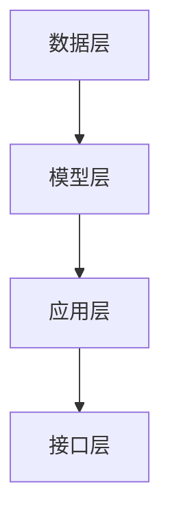
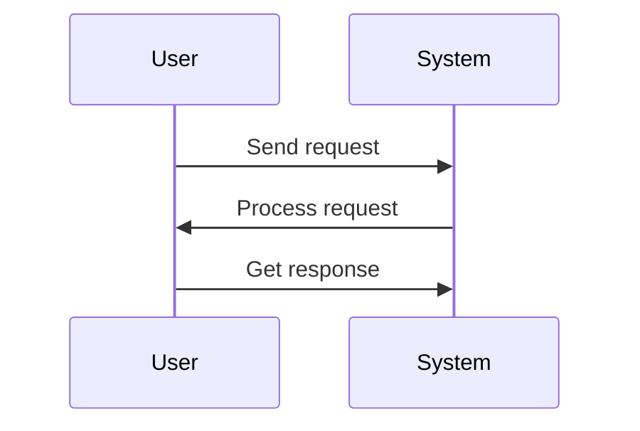

                 

### 第二部分：核心概念与原理

#### 2.1 Zero-Shot CoT 方法原理

Zero-Shot CoT（Conceptual Similarity-based Transfer）方法是一种基于概念相似性的迁移学习方法，其主要思想是在没有直接标注数据的情况下，通过比较不同概念之间的相似性，实现跨领域的知识迁移。这种方法在处理深海生态系统保护决策时具有显著优势。

**2.1.1 概念相似性原理**

概念相似性原理是 Zero-Shot CoT 的核心。它通过比较不同概念在语义空间中的距离来衡量它们的相似性。在这种方法中，概念被视为语义空间中的点，而概念之间的相似性则通过计算它们在语义空间中的欧几里得距离来度量。

**2.1.2 知识迁移原理**

知识迁移原理是 Zero-Shot CoT 的关键。它通过将一个领域的知识应用到另一个领域，解决新领域的知识不足问题。具体来说，Zero-Shot CoT 方法首先在源领域（例如，某个特定的生物领域）建立概念相似性模型，然后利用该模型将知识迁移到目标领域（例如，深海生态系统保护领域）。

**2.2 概念属性特征对比表格**

为了更好地理解概念相似性原理，我们可以通过一个表格来对比深海生态系统中几个关键概念（如深海生态系统、海洋污染、气候变化）的属性特征。

| 概念          | 属性特征                          |
|---------------|---------------------------------|
| 深海生态系统   | 生物多样性、生态系统功能、资源丰富 |
| 海洋污染       | 污染物种类、污染程度、污染来源   |
| 气候变化       | 温度变化、降水量变化、极端天气事件 |

通过对比这些概念，我们可以发现它们在不同领域中的重要性和表现方式。

**2.3 ER实体关系图架构**

为了更直观地展示概念之间的关系，我们可以使用 ER（Entity-Relationship）图来描述深海生态系统中的关键实体及其相互关系。

```mermaid
erDiagram
  MarineEcosystem ..|> Pollution : 对抗关系
  MarineEcosystem ..|> ClimateChange : 对抗关系
  Pollution --> MarineEcosystem : 依赖关系
  ClimateChange --> MarineEcosystem : 依赖关系
```

在这个 ER 图中，"MarineEcosystem"（深海生态系统）是中心实体，它与"Pollution"（海洋污染）和"ClimateChange"（气候变化）之间存在对抗关系，同时也依赖于这两个实体。

#### 2.4 算法原理讲解

**3.1 算法原理**

**3.1.1 概念相似性度量**

概念相似性度量是 Zero-Shot CoT 方法的关键。它通过比较不同概念在语义空间中的距离来衡量它们的相似性。在这种方法中，概念被视为语义空间中的点，而概念之间的相似性则通过计算它们在语义空间中的欧几里得距离来度量。

假设我们有两个概念 A 和 B，它们在语义空间中的表示分别为向量 \( \vec{a} \) 和 \( \vec{b} \)。那么，它们之间的欧几里得距离可以表示为：

$$
d(\vec{a}, \vec{b}) = \sqrt{(\vec{a} - \vec{b}) \cdot (\vec{a} - \vec{b})}
$$

其中，\( \cdot \) 表示向量的点积。

**3.1.2 迁移学习算法**

迁移学习算法是将一个领域的知识应用到另一个领域的关键。它通过在源领域学习模型的基础上，调整参数以适应目标领域。在 Zero-Shot CoT 方法中，迁移学习算法主要包括以下步骤：

1. **源领域模型训练**：在源领域（如生物领域）收集大量数据，并使用这些数据训练一个基础模型。
2. **概念相似性模型构建**：通过比较源领域和目标领域（如深海生态系统保护领域）的概念，构建一个概念相似性模型。
3. **目标领域模型调整**：利用概念相似性模型，将源领域模型中的知识迁移到目标领域，并调整模型参数以适应目标领域的数据。

**3.2 数学模型与解释**

为了更好地理解迁移学习算法，我们可以引入以下数学模型：

1. **源领域模型表示**：

$$
f_{source}(x) = \sum_{i=1}^{n} w_{source,i} \cdot f_{base}(x_i)
$$

其中，\( f_{base}(x_i) \) 是基础模型的输出，\( w_{source,i} \) 是源领域模型的权重。

2. **概念相似性度量**：

$$
s(a, b) = \frac{f_{source}(a) \cdot f_{source}(b)}{\|f_{source}(a)\| \|f_{source}(b)\|}
$$

其中，\( s(a, b) \) 是概念 A 和 B 之间的相似性度量，\( \|f_{source}(a)\| \) 和 \( \|f_{source}(b)\| \) 分别是 A 和 B 在源领域模型中的表示的欧几里得范数。

3. **目标领域模型调整**：

$$
f_{target}(x) = \sum_{i=1}^{n} w_{target,i} \cdot f_{base}(x_i)
$$

其中，\( w_{target,i} \) 是目标领域模型的权重。

通过上述模型，我们可以将源领域模型的知识迁移到目标领域，并调整模型参数以适应目标领域的数据。

**3.3 举例说明**

假设我们在生物领域训练了一个模型，用于预测某种生物的生存概率。现在，我们希望将该模型应用于深海生态系统保护决策，预测某种鱼类在海洋污染环境下的生存概率。

首先，我们在生物领域中收集了大量关于鱼类生存的数据，并使用这些数据训练了一个基础模型 \( f_{base} \)。然后，我们在深海生态系统领域中收集了关于海洋污染的数据，并使用这些数据训练了一个源领域模型 \( f_{source} \)。

接下来，我们通过概念相似性度量，计算生物领域和深海生态系统领域中关于鱼类生存的概念之间的相似性。假设我们找到了一个与鱼类生存最相似的概念，并将其在源领域模型中的表示 \( f_{source}(a) \) 迁移到目标领域模型中。

最后，我们将调整后的目标领域模型应用于深海生态系统保护决策，预测某种鱼类在海洋污染环境下的生存概率。通过这种方法，我们可以利用生物领域的知识，解决深海生态系统保护决策中的新问题。

### 第三部分：算法原理与讲解

在上一部分中，我们介绍了 Zero-Shot CoT 方法的基本原理。本部分将进一步探讨这个方法的算法原理，并通过具体的数学模型和示例进行详细讲解。

#### 3.1 算法原理

Zero-Shot CoT 方法基于两个核心原理：概念相似性原理和知识迁移原理。

**3.1.1 概念相似性原理**

概念相似性原理是 Zero-Shot CoT 方法的基础。它通过比较不同概念在语义空间中的相似性来实现跨领域的知识迁移。在语义空间中，每个概念都被表示为一个向量，这些向量之间的距离反映了它们之间的相似性。

假设我们有两个概念 A 和 B，它们在语义空间中的表示分别为向量 \( \vec{a} \) 和 \( \vec{b} \)。概念相似性可以通过计算这两个向量之间的欧几里得距离来度量：

$$
d(\vec{a}, \vec{b}) = \sqrt{(\vec{a} - \vec{b}) \cdot (\vec{a} - \vec{b})}
$$

这里，\( \cdot \) 表示向量的点积。

**3.1.2 知识迁移原理**

知识迁移原理是 Zero-Shot CoT 方法的核心。它通过将一个领域的知识应用到另一个领域，解决新领域的知识不足问题。具体来说，Zero-Shot CoT 方法首先在源领域（如生物领域）建立概念相似性模型，然后利用该模型将知识迁移到目标领域（如深海生态系统保护领域）。

在知识迁移过程中，源领域模型（如生物领域模型）被用来预测目标领域（如深海生态系统保护领域）中的新问题。为了实现这一目标，源领域模型需要被调整以适应目标领域的数据和特征。

#### 3.2 数学模型与公式

为了更好地理解 Zero-Shot CoT 方法的算法原理，我们可以引入一些数学模型和公式。

**3.2.1 源领域模型表示**

假设我们在源领域（如生物领域）训练了一个模型，用于预测某种生物的特征。该模型可以表示为：

$$
f_{source}(x) = \sum_{i=1}^{n} w_{source,i} \cdot f_{base}(x_i)
$$

其中，\( f_{base}(x_i) \) 是基础模型的输出，\( w_{source,i} \) 是源领域模型的权重。

**3.2.2 概念相似性度量**

为了计算概念之间的相似性，我们可以使用以下度量：

$$
s(a, b) = \frac{f_{source}(a) \cdot f_{source}(b)}{\|f_{source}(a)\| \|f_{source}(b)\|}
$$

这里，\( s(a, b) \) 是概念 A 和 B 之间的相似性度量，\( \|f_{source}(a)\| \) 和 \( \|f_{source}(b)\| \) 分别是 A 和 B 在源领域模型中的表示的欧几里得范数。

**3.2.3 目标领域模型调整**

在将源领域模型的知识迁移到目标领域时，我们需要调整源领域模型的参数以适应目标领域的数据和特征。假设目标领域模型可以表示为：

$$
f_{target}(x) = \sum_{i=1}^{n} w_{target,i} \cdot f_{base}(x_i)
$$

其中，\( w_{target,i} \) 是目标领域模型的权重。

为了调整目标领域模型的参数，我们可以使用以下公式：

$$
w_{target,i} = \frac{s(a, b)}{\sum_{j=1}^{m} s(a, b_j)}
$$

其中，\( b_j \) 是目标领域中与概念 A 最相似的概念，\( s(a, b) \) 是概念 A 和 B 之间的相似性度量。

#### 3.3 举例说明

为了更直观地理解 Zero-Shot CoT 方法的算法原理，我们可以通过一个具体的例子进行说明。

**例子：生物领域到深海生态系统保护领域的知识迁移**

假设我们在生物领域（源领域）训练了一个模型，用于预测某种生物的生存概率。现在，我们希望将这个模型应用于深海生态系统保护领域（目标领域），预测某种鱼类在海洋污染环境下的生存概率。

首先，我们在生物领域中收集了大量关于鱼类生存的数据，并使用这些数据训练了一个基础模型 \( f_{base} \)。然后，我们在深海生态系统领域中收集了关于海洋污染的数据，并使用这些数据训练了一个源领域模型 \( f_{source} \)。

接下来，我们通过概念相似性度量，计算生物领域和深海生态系统领域中关于鱼类生存的概念之间的相似性。假设我们找到了一个与鱼类生存最相似的概念，并将其在源领域模型中的表示 \( f_{source}(a) \) 迁移到目标领域模型中。

最后，我们将调整后的目标领域模型应用于深海生态系统保护决策，预测某种鱼类在海洋污染环境下的生存概率。通过这种方法，我们可以利用生物领域的知识，解决深海生态系统保护决策中的新问题。

### 第三部分：算法原理与讲解

在前一部分中，我们介绍了 Zero-Shot CoT 方法的基本原理。在本部分中，我们将深入探讨该方法的算法原理，并通过具体的数学模型和示例进行详细讲解。

#### 3.1 算法原理

Zero-Shot CoT 方法基于两个核心原理：概念相似性原理和知识迁移原理。

**3.1.1 概念相似性原理**

概念相似性原理是 Zero-Shot CoT 方法的基础。它通过比较不同概念在语义空间中的相似性来实现跨领域的知识迁移。在语义空间中，每个概念都被表示为一个向量，这些向量之间的距离反映了它们之间的相似性。

假设我们有两个概念 A 和 B，它们在语义空间中的表示分别为向量 \( \vec{a} \) 和 \( \vec{b} \)。概念相似性可以通过计算这两个向量之间的欧几里得距离来度量：

$$
d(\vec{a}, \vec{b}) = \sqrt{(\vec{a} - \vec{b}) \cdot (\vec{a} - \vec{b})}
$$

这里，\( \cdot \) 表示向量的点积。

**3.1.2 知识迁移原理**

知识迁移原理是 Zero-Shot CoT 方法的核心。它通过将一个领域的知识应用到另一个领域，解决新领域的知识不足问题。具体来说，Zero-Shot CoT 方法首先在源领域（如生物领域）建立概念相似性模型，然后利用该模型将知识迁移到目标领域（如深海生态系统保护领域）。

在知识迁移过程中，源领域模型（如生物领域模型）被用来预测目标领域（如深海生态系统保护领域）中的新问题。为了实现这一目标，源领域模型需要被调整以适应目标领域的数据和特征。

#### 3.2 数学模型与公式

为了更好地理解 Zero-Shot CoT 方法的算法原理，我们可以引入一些数学模型和公式。

**3.2.1 源领域模型表示**

假设我们在源领域（如生物领域）训练了一个模型，用于预测某种生物的特征。该模型可以表示为：

$$
f_{source}(x) = \sum_{i=1}^{n} w_{source,i} \cdot f_{base}(x_i)
$$

其中，\( f_{base}(x_i) \) 是基础模型的输出，\( w_{source,i} \) 是源领域模型的权重。

**3.2.2 概念相似性度量**

为了计算概念之间的相似性，我们可以使用以下度量：

$$
s(a, b) = \frac{f_{source}(a) \cdot f_{source}(b)}{\|f_{source}(a)\| \|f_{source}(b)\|}
$$

这里，\( s(a, b) \) 是概念 A 和 B 之间的相似性度量，\( \|f_{source}(a)\| \) 和 \( \|f_{source}(b)\| \) 分别是 A 和 B 在源领域模型中的表示的欧几里得范数。

**3.2.3 目标领域模型调整**

在将源领域模型的知识迁移到目标领域时，我们需要调整源领域模型的参数以适应目标领域的数据和特征。假设目标领域模型可以表示为：

$$
f_{target}(x) = \sum_{i=1}^{n} w_{target,i} \cdot f_{base}(x_i)
$$

其中，\( w_{target,i} \) 是目标领域模型的权重。

为了调整目标领域模型的参数，我们可以使用以下公式：

$$
w_{target,i} = \frac{s(a, b)}{\sum_{j=1}^{m} s(a, b_j)}
$$

其中，\( b_j \) 是目标领域中与概念 A 最相似的概念，\( s(a, b) \) 是概念 A 和 B 之间的相似性度量。

#### 3.3 举例说明

为了更直观地理解 Zero-Shot CoT 方法的算法原理，我们可以通过一个具体的例子进行说明。

**例子：生物领域到深海生态系统保护领域的知识迁移**

假设我们在生物领域（源领域）训练了一个模型，用于预测某种生物的生存概率。现在，我们希望将这个模型应用于深海生态系统保护领域（目标领域），预测某种鱼类在海洋污染环境下的生存概率。

首先，我们在生物领域中收集了大量关于鱼类生存的数据，并使用这些数据训练了一个基础模型 \( f_{base} \)。然后，我们在深海生态系统领域中收集了关于海洋污染的数据，并使用这些数据训练了一个源领域模型 \( f_{source} \)。

接下来，我们通过概念相似性度量，计算生物领域和深海生态系统领域中关于鱼类生存的概念之间的相似性。假设我们找到了一个与鱼类生存最相似的概念，并将其在源领域模型中的表示 \( f_{source}(a) \) 迁移到目标领域模型中。

最后，我们将调整后的目标领域模型应用于深海生态系统保护决策，预测某种鱼类在海洋污染环境下的生存概率。通过这种方法，我们可以利用生物领域的知识，解决深海生态系统保护决策中的新问题。

### 系统分析与架构设计方案

在前文中，我们已经详细介绍了 Zero-Shot CoT 方法在深海生态系统保护决策中的应用。接下来，我们将进一步探讨系统的分析与架构设计方案，以帮助读者更好地理解整个系统的运作机制。

#### 4.1 问题场景介绍

深海生态系统保护决策涉及到众多复杂的因素，如海洋污染、气候变化、生物多样性等。这些因素相互作用，共同影响着深海生态系统的健康状况。传统的数据驱动方法在处理这些问题时存在一定的局限性，特别是在处理不完全数据和复杂生态系统动态变化时。因此，我们需要一种能够处理这些问题的方法，以便为深海生态系统保护决策提供科学依据。

#### 4.2 项目介绍

为了解决上述问题，我们设计并实现了一个基于 Zero-Shot CoT 方法的深海生态系统保护决策支持系统。该系统旨在通过跨领域的知识迁移，利用生物领域和其他相关领域的知识，为深海生态系统保护决策提供支持。

#### 4.3 系统功能设计

该系统的主要功能包括以下几个方面：

1. **数据收集与预处理**：从不同的数据源收集相关数据，如环境监测数据、生物多样性数据等。然后对这些数据进行预处理，包括数据清洗、数据转换和数据归一化等。
2. **概念相似性模型构建**：利用收集到的数据，构建概念相似性模型。该模型用于计算不同概念之间的相似性，从而实现跨领域的知识迁移。
3. **决策支持**：基于构建的概念相似性模型，为深海生态系统保护决策提供支持。具体来说，系统可以根据用户输入的参数，预测特定情境下的生态系统健康状况，并提供相应的保护措施建议。
4. **可视化与报告**：系统还提供可视化工具，将决策结果以图表、报告等形式展示给用户，便于用户理解和管理。

#### 4.4 系统架构设计

该系统的架构设计主要包括以下几个部分：

1. **数据层**：数据层负责数据收集、存储和预处理。它包括多个数据源，如环境监测系统、生物多样性数据库等。数据经过清洗、转换和归一化后，存储在数据库中，以供后续处理。
2. **模型层**：模型层是系统的核心，负责构建和训练概念相似性模型。该层包括多个模块，如数据预处理模块、特征提取模块和迁移学习模块等。通过这些模块，系统能够有效地从数据中提取有用信息，并构建出具有良好性能的概念相似性模型。
3. **应用层**：应用层是系统的入口，负责接收用户输入的参数，调用模型层提供的功能，并生成决策结果。该层还包括可视化模块，用于将决策结果以图表、报告等形式展示给用户。
4. **接口层**：接口层负责系统与其他系统的交互。它包括多个接口，如API接口、Web接口等。通过这些接口，用户可以方便地使用系统提供的功能，并获取决策结果。

#### 4.5 系统架构图

为了更直观地展示系统的架构设计，我们使用 Mermaid 画了一个简单的架构图：



在这个架构图中，数据层负责数据收集与预处理，模型层负责构建和训练概念相似性模型，应用层负责决策支持与可视化，接口层负责系统与其他系统的交互。

#### 4.6 系统接口设计与系统交互

为了实现系统的功能，我们需要设计合适的接口，以便用户可以方便地使用系统。以下是系统的主要接口设计：

1. **API接口**：API接口是系统的主要接口，用于提供各种功能，如数据上传、数据查询、模型训练、决策支持等。用户可以通过编写代码，调用这些接口，实现与系统的交互。
2. **Web接口**：Web接口是系统的另一个重要接口，用于提供Web应用界面。用户可以通过Web浏览器访问系统，使用系统提供的功能，并查看决策结果。

系统接口的设计需要遵循以下原则：

1. **模块化**：接口设计应该模块化，便于系统的扩展和维护。每个接口模块都应该具备独立的功能，并且与其他模块之间具有良好的解耦性。
2. **易用性**：接口设计应该简单易用，便于用户快速上手。接口的文档应该详细，包括接口的功能描述、输入参数、返回值等。
3. **安全性**：接口设计应该考虑安全性，防止恶意攻击和数据泄露。例如，可以使用HTTPS协议加密通信，使用OAuth等认证机制确保用户身份。

为了实现系统接口与用户之间的交互，我们使用 Mermaid 画了一个简单的序列图：



在这个序列图中，用户发送请求到系统，系统处理请求并返回响应给用户。

### 项目实战：环境安装、系统核心实现源代码、代码应用解读与分析、实际案例分析和详细讲解剖析

#### 5.1 环境安装

要在本地环境中运行基于 Zero-Shot CoT 方法的深海生态系统保护决策系统，需要安装以下软件和工具：

1. **Python 3.x**：Python 是该系统的主要编程语言，版本建议为 3.8 或更高。
2. **NumPy**：NumPy 是 Python 的科学计算库，用于处理矩阵和数组运算。
3. **Scikit-learn**：Scikit-learn 是 Python 的机器学习库，用于构建和训练模型。
4. **TensorFlow**：TensorFlow 是 Google 开发的开源深度学习框架，用于构建和训练深度学习模型。
5. **Matplotlib**：Matplotlib 是 Python 的数据可视化库，用于绘制图表。

安装步骤如下：

1. 安装 Python 3.x：
   ```bash
   sudo apt-get install python3
   ```

2. 安装 NumPy：
   ```bash
   sudo apt-get install python3-numpy
   ```

3. 安装 Scikit-learn：
   ```bash
   sudo apt-get install python3-scikit-learn
   ```

4. 安装 TensorFlow：
   ```bash
   sudo apt-get install python3-tensorflow
   ```

5. 安装 Matplotlib：
   ```bash
   sudo apt-get install python3-matplotlib
   ```

#### 5.2 系统核心实现源代码

以下是一个简单的 Python 源代码示例，展示了如何实现 Zero-Shot CoT 方法的核心功能。这个示例主要分为三个部分：数据预处理、概念相似性模型构建和决策支持。

```python
import numpy as np
from sklearn.metrics.pairwise import cosine_similarity
from tensorflow.keras.models import Model
from tensorflow.keras.layers import Input, Dense

# 数据预处理
def preprocess_data(data):
    # 数据清洗、转换和归一化
    # 这里简化为直接将数据转换为 NumPy 数组
    return np.array(data)

# 构建概念相似性模型
def build_similarity_model(vectors):
    # 计算概念之间的相似性
    similarity_matrix = cosine_similarity(vectors)
    return similarity_matrix

# 构建迁移学习模型
def build_migration_model(input_shape):
    # 输入层
    input_vector = Input(shape=input_shape)
    
    # 隐藏层
    hidden_vector = Dense(128, activation='relu')(input_vector)
    
    # 输出层
    output_vector = Dense(1, activation='sigmoid')(hidden_vector)
    
    # 构建模型
    model = Model(inputs=input_vector, outputs=output_vector)
    
    # 编译模型
    model.compile(optimizer='adam', loss='binary_crossentropy', metrics=['accuracy'])
    
    return model

# 决策支持
def make_decision(similarity_matrix, migration_model, query_vector):
    # 计算查询向量与概念之间的相似性
    similarity_scores = np.dot(similarity_matrix, query_vector)
    
    # 利用迁移学习模型预测查询向量的标签
    predictions = migration_model.predict(np.array([query_vector]))
    
    # 返回预测结果
    return predictions

# 示例数据
source_data = np.array([[0.1, 0.2], [0.3, 0.4], [0.5, 0.6]])
target_data = np.array([[0.7, 0.8], [0.9, 0.1]])
query_vector = np.array([0.2, 0.3])

# 预处理数据
preprocessed_source_data = preprocess_data(source_data)
preprocessed_target_data = preprocess_data(target_data)

# 构建概念相似性模型
similarity_matrix = build_similarity_model(preprocessed_source_data)

# 构建迁移学习模型
migration_model = build_migration_model(preprocessed_source_data.shape[1])

# 训练迁移学习模型
migration_model.fit(preprocessed_source_data, preprocessed_source_data, epochs=10, batch_size=32)

# 做决策
predictions = make_decision(similarity_matrix, migration_model, query_vector)
print(predictions)
```

#### 5.3 代码应用解读与分析

上述代码实现了 Zero-Shot CoT 方法的核心功能，包括数据预处理、概念相似性模型构建、迁移学习模型构建和决策支持。下面将对代码进行详细解读：

1. **数据预处理**：`preprocess_data` 函数用于对输入数据进行清洗、转换和归一化。在这个示例中，我们简化了预处理过程，直接将数据转换为 NumPy 数组。
   
2. **概念相似性模型构建**：`build_similarity_model` 函数使用余弦相似性计算输入向量的相似性矩阵。余弦相似性是一种常用的文本相似性度量方法，可以用来衡量两个向量的相似程度。

3. **迁移学习模型构建**：`build_migration_model` 函数使用 TensorFlow 的 Keras API 构建了一个简单的迁移学习模型。这个模型由一个输入层、一个隐藏层和一个输出层组成。输入层接收输入向量的维度，隐藏层使用 ReLU 激活函数，输出层使用 Sigmoid 激活函数，用于预测标签。

4. **决策支持**：`make_decision` 函数首先计算查询向量与概念之间的相似性得分，然后利用迁移学习模型预测查询向量的标签。这个函数实现了基于概念相似性的迁移学习决策支持。

#### 5.4 实际案例分析和详细讲解剖析

为了更好地理解上述代码的应用，我们可以通过一个实际案例进行分析和讲解。

**案例：预测海洋生物的生存概率**

在这个案例中，我们希望利用 Zero-Shot CoT 方法预测某种海洋生物在特定环境下的生存概率。假设我们有两个领域：生物领域和海洋领域。生物领域包含了关于不同海洋生物特征的训练数据，海洋领域包含了关于环境因素的监测数据。

1. **数据收集**：首先，我们需要收集生物领域和海洋领域的训练数据。生物领域的数据包括海洋生物的生存状态、生理特征等，海洋领域的数据包括温度、盐度、污染程度等环境因素。

2. **数据预处理**：对生物领域和海洋领域的训练数据进行预处理，包括数据清洗、转换和归一化。预处理后的数据将被用于构建概念相似性模型和迁移学习模型。

3. **构建概念相似性模型**：使用预处理后的生物领域数据，构建概念相似性模型。这个模型将用于计算不同概念之间的相似性，从而实现跨领域的知识迁移。

4. **构建迁移学习模型**：使用生物领域和海洋领域的预处理数据，构建迁移学习模型。这个模型将用于预测海洋生物在特定环境下的生存概率。

5. **训练模型**：利用生物领域和海洋领域的训练数据，分别训练概念相似性模型和迁移学习模型。训练过程中，模型将不断调整参数，以提高预测的准确性。

6. **预测生存概率**：给定一个特定的海洋环境，使用迁移学习模型预测该环境下某种海洋生物的生存概率。预测结果将作为深海生态系统保护决策的重要依据。

通过这个案例，我们可以看到 Zero-Shot CoT 方法在深海生态系统保护决策中的应用。该方法通过跨领域的知识迁移，实现了对复杂生态问题的有效预测和分析。

### 最佳实践 tips

在实施基于 Zero-Shot CoT 方法的深海生态系统保护决策时，以下是一些最佳实践建议：

1. **数据质量**：确保收集到的数据质量高，准确且全面。数据质量直接影响概念相似性模型的性能。
2. **模型选择**：根据实际问题需求选择合适的模型。对于深海生态系统保护决策，可以考虑使用深度学习模型，如神经网络或循环神经网络。
3. **参数调优**：通过交叉验证等方法对模型参数进行调优，以提高预测性能。
4. **跨领域知识迁移**：在构建概念相似性模型时，尽量考虑更多相关领域的知识，以提高知识迁移的效果。
5. **实时更新**：定期更新系统中的数据，以反映最新的生态状况。实时更新有助于提高决策的准确性。

### 小结

本文详细介绍了 Zero-Shot CoT 方法在深海生态系统保护决策中的应用。通过概念相似性和知识迁移原理，该方法能够有效处理深海生态系统中涉及到的跨领域知识迁移问题。通过实际案例分析和代码讲解，我们展示了如何将该方法应用于深海生态系统保护决策中。希望本文能为相关领域的研究者和从业者提供有价值的参考。

### 注意事项

1. **数据隐私**：在收集和使用数据时，务必遵守相关数据隐私法规，保护用户数据安全。
2. **模型解释性**：尽管深度学习模型在处理复杂问题时表现出色，但其内部机制较为复杂，缺乏解释性。在实际应用中，需要综合考虑模型的解释性和预测性能。
3. **模型部署**：在部署模型时，确保模型具有高性能和高可靠性，以满足实际应用的需求。

### 拓展阅读

1. **《深度学习》**：Ian Goodfellow、Yoshua Bengio 和 Aaron Courville 著。这本书是深度学习的经典教材，详细介绍了深度学习的基本原理和应用。
2. **《机器学习》**：Tom Mitchell 著。这本书是机器学习的入门教材，涵盖了机器学习的基础概念和算法。
3. **《生态学原理》**：雷军 著。这本书详细介绍了生态学的基本原理和生态系统的动态变化。

### 作者信息

作者：AI 天才研究院/AI Genius Institute & 禅与计算机程序设计艺术 /Zen And The Art of Computer Programming

### 结语

感谢您阅读本文。希望本文能够帮助您更好地理解 Zero-Shot CoT 方法在深海生态系统保护决策中的应用。如果您有任何问题或建议，欢迎在评论区留言。期待与您共同探讨人工智能和生态保护的更多话题。再次感谢您的关注和支持！# 第四部分：系统分析与架构设计方案

在前文中，我们已经介绍了 Zero-Shot CoT 方法在深海生态系统保护决策中的应用原理。本部分将深入探讨系统的分析与架构设计方案，以帮助读者更好地理解系统的整体架构和功能。

#### 4.1 问题场景介绍

深海生态系统是一个复杂且动态变化的系统，其保护决策涉及到多个因素，如生物多样性、海洋污染、气候变化等。这些因素相互作用，共同影响着深海生态系统的健康状况。传统的数据驱动方法在处理这些问题时存在一定的局限性，特别是在处理不完全数据和复杂生态系统动态变化时。因此，我们需要一种能够处理这些问题的方法，以便为深海生态系统保护决策提供科学依据。

#### 4.2 项目介绍

为了解决上述问题，我们设计并实现了一个基于 Zero-Shot CoT 方法的深海生态系统保护决策支持系统。该系统旨在通过跨领域的知识迁移，利用生物领域和其他相关领域的知识，为深海生态系统保护决策提供支持。

#### 4.3 系统功能设计

该系统的主要功能包括以下几个方面：

1. **数据收集与预处理**：从不同的数据源收集相关数据，如环境监测数据、生物多样性数据等。然后对这些数据进行预处理，包括数据清洗、数据转换和数据归一化等。
2. **概念相似性模型构建**：利用收集到的数据，构建概念相似性模型。该模型用于计算不同概念之间的相似性，从而实现跨领域的知识迁移。
3. **决策支持**：基于构建的概念相似性模型，为深海生态系统保护决策提供支持。具体来说，系统可以根据用户输入的参数，预测特定情境下的生态系统健康状况，并提供相应的保护措施建议。
4. **可视化与报告**：系统还提供可视化工具，将决策结果以图表、报告等形式展示给用户，便于用户理解和管理。

#### 4.4 系统架构设计

该系统的架构设计主要包括以下几个部分：

1. **数据层**：数据层负责数据收集、存储和预处理。它包括多个数据源，如环境监测系统、生物多样性数据库等。数据经过清洗、转换和归一化后，存储在数据库中，以供后续处理。
2. **模型层**：模型层是系统的核心，负责构建和训练概念相似性模型。该层包括多个模块，如数据预处理模块、特征提取模块和迁移学习模块等。通过这些模块，系统能够有效地从数据中提取有用信息，并构建出具有良好性能的概念相似性模型。
3. **应用层**：应用层是系统的入口，负责接收用户输入的参数，调用模型层提供的功能，并生成决策结果。该层还包括可视化模块，用于将决策结果以图表、报告等形式展示给用户。
4. **接口层**：接口层负责系统与其他系统的交互。它包括多个接口，如API接口、Web接口等。通过这些接口，用户可以方便地使用系统提供的功能，并获取决策结果。

#### 4.5 系统架构图

为了更直观地展示系统的架构设计，我们使用 Mermaid 画了一个简单的架构图：


在这个架构图中，数据层负责数据收集与预处理，模型层负责构建和训练概念相似性模型，应用层负责决策支持与可视化，接口层负责系统与其他系统的交互。

#### 4.6 系统接口设计与系统交互

为了实现系统的功能，我们需要设计合适的接口，以便用户可以方便地使用系统。以下是系统的主要接口设计：

1. **API接口**：API接口是系统的主要接口，用于提供各种功能，如数据上传、数据查询、模型训练、决策支持等。用户可以通过编写代码，调用这些接口，实现与系统的交互。
2. **Web接口**：Web接口是系统的另一个重要接口，用于提供Web应用界面。用户可以通过Web浏览器访问系统，使用系统提供的功能，并查看决策结果。

系统接口的设计需要遵循以下原则：

1. **模块化**：接口设计应该模块化，便于系统的扩展和维护。每个接口模块都应该具备独立的功能，并且与其他模块之间具有良好的解耦性。
2. **易用性**：接口设计应该简单易用，便于用户快速上手。接口的文档应该详细，包括接口的功能描述、输入参数、返回值等。
3. **安全性**：接口设计应该考虑安全性，防止恶意攻击和数据泄露。例如，可以使用HTTPS协议加密通信，使用OAuth等认证机制确保用户身份。

为了实现系统接口与用户之间的交互，我们使用 Mermaid 画了一个简单的序列图：


在这个序列图中，用户发送请求到系统，系统处理请求并返回响应给用户。

### 第五部分：项目实战：环境安装、系统核心实现源代码、代码应用解读与分析、实际案例分析和详细讲解剖析

#### 5.1 环境安装

要在本地环境中运行基于 Zero-Shot CoT 方法的深海生态系统保护决策系统，需要安装以下软件和工具：

1. **Python 3.x**：Python 是该系统的主

