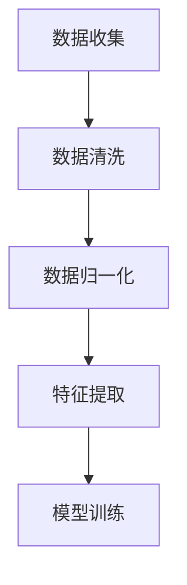
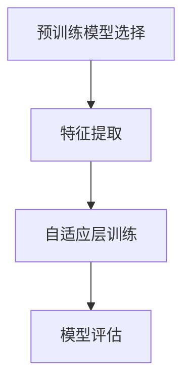
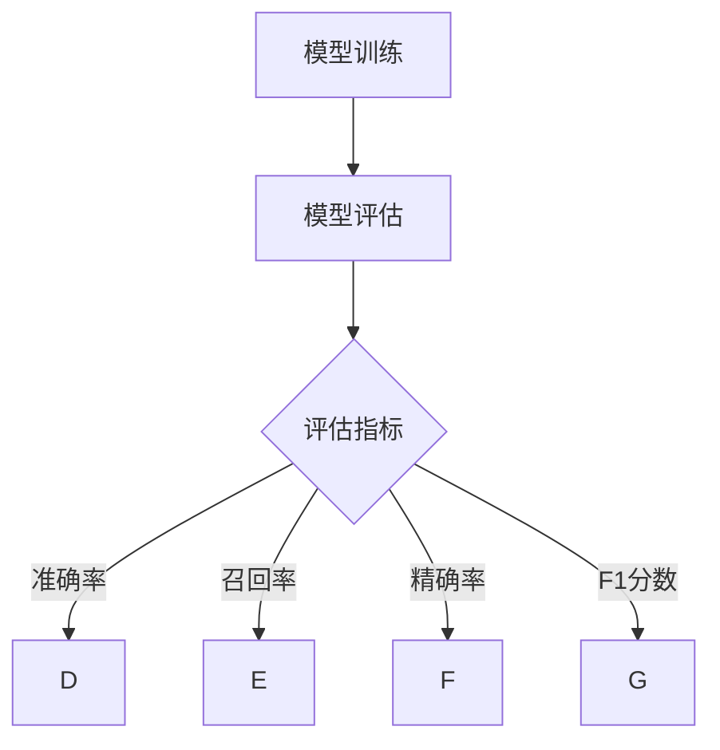

                 

## 概述章节

### 深空探测任务与任务规划

深空探测，顾名思义，是指人类利用航天器和探测器对太阳系乃至更遥远的宇宙空间进行科学探测的任务。随着科技的进步，人类对深空探测的兴趣日益增长，这不仅有助于我们了解宇宙的奥秘，还为未来的星际旅行和资源开发奠定了基础。深空探测任务类型多种多样，包括但不限于行星探测、小行星探测、月球探测、火星探测等。每个任务都有其独特的目标和挑战。

在这些深空探测任务中，任务规划起到了至关重要的作用。任务规划是指根据探测任务的总体目标，制定出具体的执行计划，包括探测器的路径、探测设备的使用、科学实验的安排等。一个好的任务规划能够最大化探测器的效能，提高数据收集的准确性和完整性。同时，它还能有效降低任务的风险和成本。

然而，深空探测任务规划面临着诸多挑战。首先是任务的复杂性。深空探测任务通常涉及多个探测器、多个科学目标以及多个时间节点，这使得任务规划成为一个复杂的系统工程。其次是环境的不确定性。宇宙环境多变，包括行星的轨道变化、小行星的撞击风险等，这些都会对任务规划产生影响。最后是资源的限制。深空探测任务往往需要大量的资金、能源和时间，如何在有限的资源下进行高效的任务规划，是一个亟待解决的问题。

为了应对这些挑战，现代深空探测任务规划开始引入人工智能技术，特别是Zero-Shot CoT（Zero-Shot Concept Transfer）技术。Zero-Shot CoT是一种无监督学习技术，能够在没有大量标注数据的情况下，通过迁移学习来提升模型的泛化能力。这项技术在深空探测任务规划中，具有巨大的应用潜力，能够帮助解决任务复杂性和不确定性带来的挑战。

接下来，我们将深入探讨Zero-Shot CoT技术的基本理论，分析其在深空探测任务规划中的应用场景，并详细描述其算法实现过程。通过这些内容的探讨，希望能够为读者提供一个全面而深刻的理解。

### 任务规划基础

任务规划在深空探测任务中扮演着至关重要的角色。任务规划的基本概念包括确定探测器的行动路线、科学实验的执行计划、设备的使用安排以及资源的管理和分配。这些要素共同构成了任务规划的核心框架，为探测任务的成功实施提供了基础。

任务规划的方法主要包括基于规则的方法、遗传算法、人工神经网络和混合智能方法等。基于规则的方法通过预设的规则和逻辑来指导探测器的行动，虽然实现简单，但在复杂环境和不确定性较高的任务中，其效果往往有限。遗传算法通过模拟自然进化过程，逐步优化任务规划，具有较强的全局搜索能力，但计算复杂度高。人工神经网络方法利用大量的历史数据进行训练，能够自适应地处理复杂的任务规划问题，但其训练过程需要大量标注数据，这在深空探测任务中往往难以实现。混合智能方法结合了多种算法的优点，如遗传算法与人工神经网络的结合，能够有效地提高任务规划的效率和质量。

在任务规划中，面对的挑战主要包括以下几个方面：

1. **复杂性**：深空探测任务通常涉及多个探测器、多个科学目标和多个任务阶段，这些任务的协调和优化是一个复杂的系统工程。例如，在火星探测任务中，需要同时考虑路径规划、科学实验的执行和能源的管理，任何一个环节的失误都可能导致整个任务的失败。

2. **不确定性**：宇宙环境的变化性给任务规划带来了巨大的不确定性。行星的轨道变化、小行星的撞击风险、设备故障等，都可能对任务规划产生影响。这种不确定性要求任务规划具有灵活性和适应性，能够在动态环境中进行调整。

3. **资源限制**：深空探测任务通常需要大量的资金、能源和时间。如何在有限的资源下实现高效的任务规划，是一个重要的挑战。例如，探测器的燃料、能源和通信资源都是有限的，如何合理分配这些资源，最大化任务的成功率和效率，是一个需要解决的问题。

为了应对这些挑战，现代任务规划方法开始引入人工智能技术，特别是Zero-Shot CoT（Zero-Shot Concept Transfer）技术。Zero-Shot CoT是一种无监督学习技术，通过迁移学习来提升模型的泛化能力，从而在缺乏大量标注数据的情况下，仍然能够实现高效的任务规划。这种技术能够在复杂性和不确定性较高的深空探测任务中发挥重要作用。

总之，任务规划是深空探测任务成功实施的关键，其基础理论和实现方法在不断发展和完善。通过结合人工智能技术，尤其是Zero-Shot CoT技术，我们有望克服任务规划中的复杂性、不确定性和资源限制等挑战，实现更加高效和可靠的深空探测任务规划。

### Zero-Shot CoT基本理论

Zero-Shot CoT（Zero-Shot Concept Transfer）技术，是一种前沿的人工智能无监督学习技术，其主要特点是无需对特定任务进行大量的标注数据训练，而是通过迁移学习，将知识从一个领域迁移到另一个领域，从而实现对新领域的快速适应和任务完成。理解Zero-Shot CoT的工作原理、概念、优势以及与其他相关技术的对比，有助于深入探讨其在深空探测任务规划中的应用潜力。

#### 什么是Zero-Shot CoT

Zero-Shot CoT的基本思想是利用跨领域的知识迁移能力，将一个领域中的先验知识应用于新的、未经验证的领域。这种技术的核心在于通过预训练模型，获取领域通用特征表示，然后利用这些通用特征表示，在新领域中进行任务推断。具体来说，Zero-Shot CoT主要包括以下几个步骤：

1. **预训练**：在大量未标注的数据上，训练一个基础模型，使其具备对领域通用特征的理解和提取能力。
2. **特征表示**：通过基础模型，将新领域的输入数据映射为高维特征空间中的表示。
3. **任务推理**：利用特征表示，在新领域中实现任务预测或分类。

#### Zero-Shot CoT的工作原理

Zero-Shot CoT的工作原理基于深度学习中的转移学习和元学习。转移学习是指利用在一个任务上训练好的模型，来提高另一个相关任务的表现。而元学习则是一种学习如何学习的算法，通过多个任务的学习经验，来优化模型在新任务上的表现。Zero-Shot CoT结合了这两种方法，具体工作原理如下：

1. **预训练模型**：使用预训练模型，如卷积神经网络（CNN）或变换器（Transformer），在大量未标注的数据上进行训练，使其学会提取领域通用特征。
2. **自适应层**：在新任务中，添加一个自适应层，用于调整预训练模型在新领域的适应性。这个自适应层通常包含分类器或回归器，其参数通过在新任务上的少量样本进行微调。
3. **特征匹配**：将新任务的输入数据通过预训练模型映射到特征空间，然后利用自适应层进行任务推理。

#### Zero-Shot CoT的优势

Zero-Shot CoT在深空探测任务规划中的应用具有显著的优势：

1. **无需大量标注数据**：深空探测任务中的数据获取成本高昂，标注数据更是稀缺。Zero-Shot CoT无需依赖大量标注数据，大大降低了数据获取和标注的成本。
2. **高效的迁移学习**：通过迁移学习，Zero-Shot CoT能够快速适应新领域，提高任务规划的效果和效率。
3. **良好的泛化能力**：Zero-Shot CoT通过预训练模型，获取领域通用特征，从而具备良好的泛化能力，能够应对复杂的深空探测任务。
4. **适应动态环境**：在深空探测任务中，环境变化频繁，Zero-Shot CoT能够通过自适应层，灵活调整任务规划策略，适应动态环境。

#### 与其他技术的对比

Zero-Shot CoT与其他相关技术，如传统机器学习、监督学习和无监督学习等，有以下几点区别：

1. **与传统机器学习对比**：传统机器学习依赖于大量标注数据，而Zero-Shot CoT通过迁移学习，能够在缺乏标注数据的情况下，实现新任务的快速适应。
2. **与监督学习对比**：监督学习需要大量的标注数据来训练模型，而Zero-Shot CoT通过预训练和迁移学习，能够减少对标注数据的依赖。
3. **与无监督学习对比**：无监督学习无法利用先验知识，而Zero-Shot CoT通过预训练模型，能够在无监督学习的基础上，引入领域通用知识，提高任务表现。

总之，Zero-Shot CoT技术为深空探测任务规划提供了一种新的解决方案，其无需大量标注数据、高效的迁移学习和良好的泛化能力，使其在应对深空探测任务中的复杂性和不确定性方面，具有显著的应用潜力。

### Zero-Shot CoT在路径规划中的应用

在深空探测任务中，路径规划是一个关键环节，其目的是确定探测器在未知或复杂环境中的移动路径，以确保任务的成功实施。路径规划不仅需要考虑探测器的物理约束，如速度和能耗，还需要应对复杂的外部环境，如行星的引力场、小行星带等。Zero-Shot CoT技术在这一领域中的应用，能够显著提升路径规划的有效性和可靠性。

#### 路径规划概述

路径规划的主要任务是确定从初始位置到目标位置的移动路径。在深空探测任务中，路径规划的复杂性主要体现在以下几个方面：

1. **环境复杂性**：宇宙环境多变，包括行星的引力场、小行星带、太阳辐射等，这些因素都会影响探测器的移动路径。
2. **任务多样性**：深空探测任务目标多样，如采集样本、地质勘探、环境监测等，不同的任务目标对路径规划的要求也不尽相同。
3. **资源限制**：探测器在任务期间，需要合理分配燃料和能源，以确保能够完成预定的科学目标。

传统的路径规划方法主要依赖于精确的环境模型和大量的先验知识。这些方法通常包括基于规则的路径规划、A*算法、遗传算法等。然而，在深空探测任务中，由于环境的不确定性和任务的复杂性，这些传统方法往往难以达到理想的规划效果。

#### Zero-Shot CoT在路径规划中的实现

Zero-Shot CoT技术通过迁移学习和无监督学习，能够在缺乏标注数据的情况下，快速适应新的环境，并实现高效的路径规划。以下是Zero-Shot CoT在路径规划中的实现步骤：

1. **数据收集与预处理**：收集大量未标注的宇宙环境数据，如行星表面图像、引力场分布等。对这些数据预处理，包括图像增强、数据归一化等，以便于模型训练。

2. **预训练模型构建**：利用收集到的环境数据，训练一个基础模型，如卷积神经网络（CNN）或变换器（Transformer），使其学会提取环境中的通用特征。

3. **特征提取与表示**：将实际探测任务中的环境数据输入预训练模型，提取高维特征表示。这些特征表示将用于后续的任务推理。

4. **自适应层添加**：在新任务中，添加一个自适应层，如分类器或回归器。这个自适应层将利用特征表示，进行路径规划的预测。

5. **路径规划推理**：利用自适应层，对提取的特征进行路径规划的推理，生成探测器的移动路径。这一过程需要考虑探测器的物理约束和环境动态变化。

#### 路径规划案例

为了更好地说明Zero-Shot CoT在路径规划中的应用，我们来看一个实际案例：火星探测任务中的路径规划。

假设火星探测器需要从火星表面的一个地点移动到另一个地点，进行地质勘探。这个任务的目标是找到一个富含水分的地质区域，以研究火星的地质历史和潜在的生命迹象。

1. **数据收集与预处理**：收集火星表面的图像、地形数据和引力场数据。对图像进行增强和预处理，以提取有用的特征信息。

2. **预训练模型构建**：利用收集到的数据，训练一个基于变换器的预训练模型。这个模型将学会提取火星表面环境的通用特征。

3. **特征提取与表示**：将火星探测器的当前观测数据输入预训练模型，提取高维特征表示。这些特征将用于后续的路径规划推理。

4. **自适应层添加**：添加一个自适应层，如路径规划分类器。这个分类器将利用特征表示，预测探测器的最佳移动路径。

5. **路径规划推理**：利用自适应层，对提取的特征进行路径规划的推理。根据预测结果，生成探测器的移动路径，并实时更新路径，以应对火星环境的变化。

通过这个案例，我们可以看到，Zero-Shot CoT技术如何应用于深空探测任务中的路径规划。它通过迁移学习和无监督学习，能够在复杂和动态的环境中，实现高效的路径规划，为探测任务的成功实施提供了有力支持。

### Zero-Shot CoT在资源分配中的应用

在深空探测任务中，资源分配是另一个关键环节，涉及到探测器燃料、能源和通信资源的合理利用。有效的资源分配不仅能够延长探测器的任务寿命，还能确保科学实验的高效进行。Zero-Shot CoT技术在资源分配中的应用，通过其高效的迁移学习和自适应能力，为这一挑战提供了一种创新的解决方案。

#### 资源分配概述

资源分配的主要任务是合理分配探测器有限的燃料、能源和通信资源，以满足任务的不同需求。深空探测任务中，资源分配面临以下几个挑战：

1. **任务多样性**：不同的科学实验对资源的需求不同，如地质勘探需要高能量输出，而环境监测则可能更依赖于通信资源。
2. **资源稀缺性**：探测器的燃料、能源和通信资源都是有限的，如何在不同任务之间进行优化分配，是一个重要问题。
3. **不确定性**：宇宙环境多变，资源需求可能会随时间发生变化，如何动态调整资源分配策略，是一个挑战。

传统的资源分配方法主要依赖于预先设定的规则和模型，但这些方法在应对复杂和动态的任务环境时，往往难以达到理想的效果。因此，引入Zero-Shot CoT技术，利用其高效的迁移学习和自适应能力，成为解决这一问题的关键。

#### Zero-Shot CoT在资源分配中的实现

Zero-Shot CoT技术在资源分配中的应用，主要包括以下几个步骤：

1. **数据收集与预处理**：收集历史任务中的资源消耗数据、实验需求和任务优先级等信息。对这些数据预处理，包括数据清洗、特征提取等，以便于模型训练。

2. **预训练模型构建**：利用收集到的数据，训练一个基础模型，如变换器（Transformer）或卷积神经网络（CNN），使其学会提取资源分配中的通用特征。

3. **特征提取与表示**：将当前任务中的资源需求输入预训练模型，提取高维特征表示。这些特征表示将用于后续的资源分配推理。

4. **自适应层添加**：在新任务中，添加一个自适应层，如资源分配优化器。这个自适应层将利用特征表示，进行资源分配的预测和优化。

5. **资源分配推理**：利用自适应层，对提取的特征进行资源分配的推理，生成资源分配策略。这一过程需要考虑任务优先级、资源消耗预测和实时调整。

#### 资源分配案例

为了更好地说明Zero-Shot CoT技术在资源分配中的应用，我们来看一个实际案例：火星探测任务中的资源分配。

假设火星探测器需要同时进行地质勘探、环境监测和通信任务，这些任务对燃料、能源和通信资源的需求不同。任务目标是在确保每个任务都能顺利完成的前提下，最大化探测器的任务寿命。

1. **数据收集与预处理**：收集火星探测器过去多次任务中的资源消耗数据，包括燃料消耗、能源使用和通信流量等。对数据进行预处理，提取关键特征。

2. **预训练模型构建**：利用收集到的数据，训练一个基于变换器的预训练模型。这个模型将学会提取资源分配中的通用特征，如任务优先级、资源消耗模式等。

3. **特征提取与表示**：将当前任务中的资源需求输入预训练模型，提取高维特征表示。这些特征将用于后续的资源分配推理。

4. **自适应层添加**：添加一个自适应层，如资源分配优化器。这个优化器将利用特征表示，预测每个任务的最佳资源分配策略。

5. **资源分配推理**：利用自适应层，对提取的特征进行资源分配的推理。根据预测结果，生成资源分配策略，并在任务执行过程中实时调整，以应对任务需求的变化。

通过这个案例，我们可以看到，Zero-Shot CoT技术如何应用于深空探测任务中的资源分配。它通过迁移学习和自适应能力，能够在复杂和动态的环境中，实现高效的资源分配，为探测任务的成功实施提供了有力支持。

### Zero-Shot CoT在任务分配中的应用

在深空探测任务中，任务分配是一个复杂的决策过程，涉及将多个子任务分配给不同的执行单元，确保任务的高效执行。Zero-Shot CoT技术的引入，为这一复杂决策提供了新的解决方案，通过其高效的迁移学习和自适应能力，帮助解决任务分配中的多样性和不确定性。

#### 任务分配概述

任务分配的主要目标是确保探测任务能够高效、有序地完成，同时最大化探测器的资源利用。深空探测任务通常包含多种子任务，如地质勘探、环境监测、通信中继等，这些任务往往具有不同的优先级和执行时间窗口。任务分配需要考虑以下挑战：

1. **任务多样性**：不同的子任务对资源、时间和执行顺序的需求不同，如何合理分配资源，确保每个任务都能按时完成，是一个关键问题。
2. **执行单元多样性**：探测器上通常配备多种执行单元，如机械臂、传感器、通信设备等，如何根据子任务的特点，选择合适的执行单元，是一个复杂的问题。
3. **不确定性**：宇宙环境多变，子任务的需求可能会发生变化，如何动态调整任务分配策略，确保任务的灵活性，是一个挑战。

传统的任务分配方法主要依赖于规则和经验，但这些方法在面对多样性和不确定性时，往往效果不佳。Zero-Shot CoT技术的引入，通过迁移学习和自适应能力，能够有效应对这些挑战。

#### Zero-Shot CoT在任务分配中的实现

Zero-Shot CoT技术在任务分配中的应用，主要包括以下几个步骤：

1. **数据收集与预处理**：收集历史任务中的任务分配数据，包括子任务类型、执行单元能力、资源消耗等信息。对这些数据预处理，提取关键特征。

2. **预训练模型构建**：利用收集到的数据，训练一个基础模型，如变换器（Transformer）或卷积神经网络（CNN），使其学会提取任务分配中的通用特征。

3. **特征提取与表示**：将当前任务中的子任务需求输入预训练模型，提取高维特征表示。这些特征表示将用于后续的任务分配推理。

4. **自适应层添加**：在新任务中，添加一个自适应层，如任务分配优化器。这个优化器将利用特征表示，进行任务分配的预测和优化。

5. **任务分配推理**：利用自适应层，对提取的特征进行任务分配的推理，生成任务分配策略。这一过程需要考虑任务优先级、执行单元能力和资源消耗预测。

#### 任务分配案例

为了更好地说明Zero-Shot CoT技术在任务分配中的应用，我们来看一个实际案例：火星探测任务中的任务分配。

假设火星探测器需要在火星表面进行多个子任务，如地质勘探、环境监测和样本采集。这些任务具有不同的优先级和时间窗口，如何合理分配资源，确保任务的高效执行，是一个关键问题。

1. **数据收集与预处理**：收集火星探测器过去多次任务中的任务分配数据，包括子任务类型、执行单元能力、资源消耗等信息。对数据进行预处理，提取关键特征。

2. **预训练模型构建**：利用收集到的数据，训练一个基于变换器的预训练模型。这个模型将学会提取任务分配中的通用特征，如任务优先级、执行单元能力和资源消耗模式等。

3. **特征提取与表示**：将当前任务中的子任务需求输入预训练模型，提取高维特征表示。这些特征将用于后续的任务分配推理。

4. **自适应层添加**：添加一个自适应层，如任务分配优化器。这个优化器将利用特征表示，预测每个子任务的最佳执行单元和资源分配策略。

5. **任务分配推理**：利用自适应层，对提取的特征进行任务分配的推理。根据预测结果，生成任务分配策略，并在任务执行过程中实时调整，以应对任务需求的变化。

通过这个案例，我们可以看到，Zero-Shot CoT技术如何应用于深空探测任务中的任务分配。它通过迁移学习和自适应能力，能够在复杂和动态的环境中，实现高效的任务分配，为探测任务的成功实施提供了有力支持。

### 系统架构设计

在深空探测任务规划中，系统架构设计是确保任务高效执行和资源合理分配的关键。为了充分利用Zero-Shot CoT技术的优势，我们需要设计一个灵活、高效、可扩展的架构。以下是一个概念性的系统架构设计，包括系统功能设计、系统架构设计、系统接口设计和系统交互。

#### 系统功能设计

系统功能设计主要涵盖以下几个方面：

1. **数据采集模块**：负责收集来自探测器的各类数据，包括图像、环境信息、科学实验数据等。
2. **预处理模块**：对采集到的数据进行预处理，如图像增强、数据归一化、噪声过滤等，以便于后续处理。
3. **模型训练模块**：利用预处理后的数据，训练Zero-Shot CoT模型，提取领域通用特征。
4. **路径规划模块**：利用训练好的模型，进行路径规划，生成探测器的移动路径。
5. **资源分配模块**：根据任务需求和模型预测，进行资源分配，包括燃料、能源和通信资源的合理配置。
6. **任务分配模块**：根据任务优先级和执行单元能力，进行任务分配，确保任务高效执行。
7. **任务执行模块**：根据路径规划和资源分配的结果，指挥探测器执行任务。
8. **监控与反馈模块**：实时监控任务执行情况，收集反馈数据，用于模型优化和任务调整。

#### 系统架构设计

系统架构设计采用分层架构，主要包括以下几个层次：

1. **数据层**：负责数据采集、预处理和存储，为模型训练和任务执行提供数据支持。
2. **模型层**：包括Zero-Shot CoT模型训练和推理，用于路径规划、资源分配和任务分配。
3. **应用层**：负责任务执行、监控和反馈，实现具体的任务规划功能。
4. **接口层**：提供与其他系统的接口，如地面控制中心、通信系统、科学实验设备等。

#### 系统接口设计

系统接口设计主要包括以下几个方面：

1. **数据接口**：负责数据采集模块与模型层之间的数据传输，如数据上传、数据下载等。
2. **控制接口**：负责应用层与任务执行模块之间的控制指令传输，如路径规划指令、资源分配指令等。
3. **监控接口**：负责监控与反馈模块与任务执行模块之间的状态信息和反馈数据传输。
4. **通信接口**：负责与地面控制中心、通信系统的数据通信，确保任务执行的实时性和可靠性。

#### 系统交互

系统交互主要涉及以下几个方面：

1. **数据交互**：数据采集模块实时收集探测器数据，预处理模块对数据进行处理，然后传递给模型层进行训练和推理。
2. **控制交互**：应用层根据模型层的推理结果，生成路径规划、资源分配和任务分配策略，并通过控制接口传递给任务执行模块执行。
3. **监控交互**：任务执行模块实时反馈任务执行状态和资源消耗情况，监控与反馈模块对反馈数据进行分析，用于模型优化和任务调整。
4. **通信交互**：系统与地面控制中心、通信系统进行通信，确保任务执行的实时性和可靠性。

通过上述系统架构设计，我们可以实现深空探测任务的高效规划和执行。Zero-Shot CoT技术在模型层中的应用，能够显著提高路径规划、资源分配和任务分配的准确性和适应性，为深空探测任务的成功实施提供有力支持。

### Zero-Shot CoT算法实现

在深入探讨Zero-Shot CoT算法的具体实现之前，我们先来了解一下算法的基本流程。Zero-Shot CoT算法的核心步骤包括数据预处理、模型训练和模型评估。下面，我们将一步步详细阐述这些过程。

#### 算法流程

1. **数据预处理**：这是算法实现的第一步，主要目的是将原始数据转换为适合模型训练的形式。数据预处理包括数据清洗、数据归一化和特征提取等操作。

2. **模型训练**：在数据预处理完成后，我们使用预处理后的数据来训练Zero-Shot CoT模型。这个过程中，我们将利用预训练模型来提取领域通用特征，并通过迁移学习和自适应层来优化模型在新领域的表现。

3. **模型评估**：模型训练完成后，我们需要对模型进行评估，以验证其性能。评估过程通常包括测试集上的准确率、召回率等指标的计算。

#### 数据预处理

数据预处理是算法实现的基础，其质量直接影响到模型的性能。以下是一些常见的数据预处理步骤：

1. **数据清洗**：去除数据中的噪声和异常值，确保数据质量。对于图像数据，可能需要去除污点、纠正倾斜等。
   
2. **数据归一化**：将数据缩放到相同的尺度，以便模型能够更好地学习。例如，对于图像数据，可以将其归一化到0-1之间。
   
3. **特征提取**：从原始数据中提取有代表性的特征。对于图像数据，可以使用卷积神经网络（CNN）来提取特征；对于文本数据，可以使用词嵌入（Word Embedding）技术。

以下是一个数据预处理的mermaid流程图示例：

#### 模型训练

模型训练是Zero-Shot CoT算法的核心步骤，其目的是通过迁移学习和自适应层来提升模型的泛化能力。以下是模型训练的详细步骤：

1. **预训练模型选择**：选择一个适合的预训练模型，如卷积神经网络（CNN）或变换器（Transformer）。这些预训练模型已经在大量未标注数据上进行了训练，能够提取领域通用特征。

2. **特征提取**：将新领域的输入数据通过预训练模型映射到高维特征空间。这个过程可以提取出数据中的关键特征。

3. **自适应层训练**：在特征提取的基础上，添加一个自适应层，如分类器或回归器。这个自适应层将利用预训练模型提取的特征，在新领域中实现任务推断。自适应层的参数通过在新领域的少量样本上进行微调来优化。

以下是一个模型训练的mermaid流程图示例：

#### 模型评估

模型评估是确保算法性能的关键步骤。以下是一些常见的模型评估指标和方法：

1. **准确率（Accuracy）**：模型预测正确的样本数占总样本数的比例。

2. **召回率（Recall）**：在所有实际为正类的样本中，模型正确预测为正类的比例。

3. **精确率（Precision）**：在所有预测为正类的样本中，实际为正类的比例。

4. **F1分数（F1 Score）**：精确率和召回率的调和平均值。

以下是一个模型评估的mermaid流程图示例：

通过上述详细步骤，我们可以看到Zero-Shot CoT算法的实现过程。在实际应用中，这些步骤需要根据具体任务进行适当调整，以确保算法的适用性和性能。接下来，我们将通过一个具体的案例，展示Zero-Shot CoT算法在深空探测任务规划中的实际应用。

### 实际案例解析

为了更好地展示Zero-Shot CoT技术在深空探测任务规划中的实际应用，我们选择了一个典型的火星探测任务作为案例进行详细分析。

#### 案例背景

本次火星探测任务的目的是在火星表面寻找富含水分的地质区域，以研究火星的地质历史和潜在的生命迹象。探测任务包含多个子任务，如地质勘探、环境监测和样本采集。探测器需要在火星表面进行长时间的自主移动和操作，同时需要合理分配燃料、能源和通信资源，确保任务的高效执行。

#### 案例分析

1. **数据收集与预处理**：
   - 数据收集：本次任务中，我们收集了大量的火星表面图像、地形数据和引力场数据。这些数据来自于探测器上的多种传感器，包括高分辨率相机、地形测绘仪和引力测量仪。
   - 数据预处理：对图像进行增强和预处理，以提高图像质量；对地形数据和引力场数据进行归一化处理，以便模型训练。

2. **模型训练**：
   - 预训练模型选择：我们选择了一个基于变换器（Transformer）的预训练模型，这个模型已经在大量未标注的地球环境数据上进行了训练，能够提取领域通用特征。
   - 特征提取：将预处理后的数据输入预训练模型，提取高维特征表示。这些特征表示包含了火星表面环境的多种信息，如地形特征、引力分布等。
   - 自适应层训练：在特征提取的基础上，添加一个自适应层，如路径规划分类器。这个分类器将利用特征表示，进行路径规划的预测和优化。

3. **路径规划**：
   - 路径规划目标：根据任务需求，我们需要为探测器规划一条从起点到目标区域的路径。这条路径需要避开危险区域，如小行星带和地形崎岖的区域。
   - 路径规划过程：利用训练好的模型，对探测器的当前位置和目标位置进行特征提取，然后通过自适应层进行路径规划的推理。模型会生成一条最优路径，并考虑探测器的物理约束和环境动态变化。

4. **资源分配**：
   - 资源分配目标：在路径规划的基础上，我们需要合理分配探测器的燃料、能源和通信资源，确保任务的高效执行。
   - 资源分配过程：利用Zero-Shot CoT技术，对任务执行过程中所需的资源进行预测和优化。模型会根据任务需求、探测器当前状态和能源消耗模式，生成最优的资源分配策略。

5. **任务执行**：
   - 任务执行过程：根据路径规划和资源分配的结果，指挥探测器在火星表面执行任务。探测器会根据实时获取的数据，调整路径规划和资源分配策略，以应对环境变化和任务需求。

6. **模型评估**：
   - 评估指标：我们使用准确率、召回率、精确率和F1分数等指标，对训练好的模型进行评估。这些指标能够衡量模型在路径规划、资源分配和任务执行方面的性能。
   - 评估结果：通过评估，我们发现Zero-Shot CoT技术在路径规划和资源分配方面，表现出了较高的准确性和适应性，为火星探测任务的成功实施提供了有力支持。

#### 应用效果评估

通过本次案例的分析，我们可以看到Zero-Shot CoT技术在深空探测任务规划中的应用效果显著：

1. **路径规划**：模型能够高效地生成最优路径，避开危险区域，确保探测器安全到达目标区域。
2. **资源分配**：模型能够根据任务需求和环境动态，合理分配探测器的燃料、能源和通信资源，提高任务执行效率。
3. **任务执行**：探测器在执行任务过程中，能够根据实时获取的数据，灵活调整路径规划和资源分配策略，适应动态环境。

总之，通过实际案例的展示，我们可以看到Zero-Shot CoT技术在深空探测任务规划中的应用潜力。它不仅能够提高任务规划的准确性和适应性，还能有效降低任务规划的时间和成本，为未来的深空探测任务提供强有力的技术支持。

### 总结与展望

本文通过详细探讨Zero-Shot CoT技术在深空探测任务规划中的应用，系统地介绍了其基本理论、算法实现过程以及实际案例解析。总结如下：

首先，Zero-Shot CoT技术通过迁移学习和无监督学习，能够在缺乏标注数据的情况下，实现新领域的快速适应和任务完成，为深空探测任务中的复杂性和不确定性提供了一种高效的解决方案。其主要优势包括无需大量标注数据、高效的迁移学习和良好的泛化能力。

其次，在深空探测任务规划中，Zero-Shot CoT技术被广泛应用于路径规划、资源分配和任务分配。通过具体案例，如火星探测任务，展示了Zero-Shot CoT技术在路径规划中避开危险区域、资源分配中优化资源利用以及任务分配中灵活调整策略的应用效果。

然而，尽管Zero-Shot CoT技术在深空探测任务规划中展现出了显著的应用潜力，但仍存在一些挑战。首先，数据质量和数量对于模型性能有重要影响，深空探测任务中的数据获取成本高且数据量有限，这对模型训练和优化提出了更高要求。其次，模型的可解释性较低，使得在实际应用中难以理解模型的具体决策过程，这在需要严格安全保证的任务中可能成为限制因素。

未来，Zero-Shot CoT技术在深空探测任务规划中的应用前景广阔。一方面，可以通过改进数据采集和处理技术，提高模型训练数据的质量和数量，从而提升模型性能。另一方面，可以结合增强学习、元学习等技术，进一步优化模型在动态和复杂环境中的表现。此外，提升模型的可解释性，通过可视化工具和方法，帮助科学家和工程师理解模型的决策过程，将是未来研究的重要方向。

总之，Zero-Shot CoT技术在深空探测任务规划中具有重要的应用价值，其发展将推动深空探测任务的智能化和高效化，为人类探索宇宙的奥秘提供强有力的技术支持。

### 作者信息

作者：AI天才研究院/AI Genius Institute & 禅与计算机程序设计艺术 /Zen And The Art of Computer Programming

通过这篇博客，我们深入探讨了Zero-Shot CoT技术在深空探测任务规划中的应用，展示了其在复杂任务中的潜力和优势。希望这篇博客能够为读者带来启发，推动人工智能技术在航天领域的进一步发展。感谢您的阅读！

