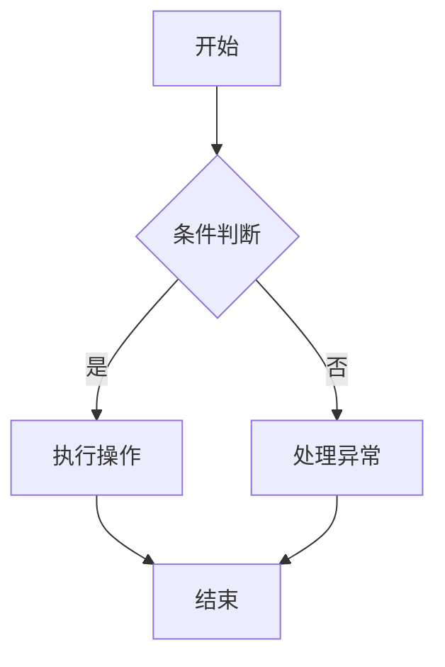
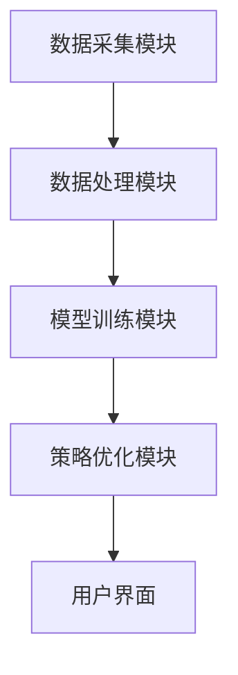

                 

# 第1章: 问题背景

### 1.1 深空辐射防护的重要性

深空辐射防护在航天任务中占据着至关重要的地位。首先，我们需要理解深空辐射的基本概念和其生物学效应。深空辐射主要包括宇宙辐射和太阳粒子辐射，其中宇宙辐射源于宇宙中的高能粒子，如α粒子、β粒子和高能电子等，而太阳粒子辐射则主要来源于太阳耀斑和太阳风。

宇宙辐射具有高能量和高穿透性，能够穿透航天器的结构材料，对航天员和宇航器的电子设备产生极大的危害。宇宙辐射的生物学效应包括细胞损伤、DNA突变和癌症风险等，长期暴露在高剂量辐射下，航天员面临严重的健康风险。

其次，深空辐射防护的重要性还体现在对宇航器电子设备的影响上。宇宙辐射能够引发电子设备的单粒子故障，导致计算机硬件损坏、数据处理错误和通信中断等问题，这将对航天任务的顺利进行构成严重威胁。

此外，随着人类对深空探索的逐步深入，如火星探测、小行星探测等任务，辐射防护的要求越来越高。国际合作与法规要求也推动了深空辐射防护技术的发展。例如，国际宇航联合会（IAF）和国际标准化组织（ISO）等组织制定了相关的标准和指南，以规范深空辐射防护的设计和实施。

### 1.2 深空辐射的特点与挑战

深空辐射具有以下特点：

1. **辐射源种类多**：深空辐射包括宇宙辐射和太阳粒子辐射，这两类辐射的源种类繁多，涉及高能粒子、X射线、伽马射线等。

2. **辐射剂量分布不均匀**：深空辐射的剂量分布受到航天任务轨道、时间、空间位置等多种因素的影响，导致辐射剂量分布不均匀。这种不均匀性给辐射防护策略的制定和实施带来了很大的挑战。

3. **变化性**：深空辐射的剂量变化受到太阳活动周期、宇宙事件等因素的影响。太阳耀斑和太阳风的增强可能导致辐射剂量的短期增加，这对航天任务的安全构成了额外的威胁。

4. **长期暴露风险**：航天任务通常持续时间较长，航天员和宇航器长时间暴露在高辐射环境下，增加了辐射积累的风险，长期暴露可能导致严重的健康问题。

针对这些特点，深空辐射防护面临以下挑战：

1. **防护材料选择困难**：深空辐射的高穿透性和多样性要求防护材料具有高能量吸收能力和多功能性，但目前的防护材料在重量、成本、耐久性等方面存在限制。

2. **在轨维修与更换困难**：在太空环境中进行维修和更换防护材料是一项极具挑战性的任务，航天器的空间有限，维修操作复杂，这对防护策略的实施提出了更高的要求。

3. **空间资源的有效利用**：深空探索任务对空间资源的需求非常高，如何在不牺牲任务其他方面的情况下，最大化利用空间资源进行辐射防护，是一个亟待解决的问题。

4. **实时监测与决策**：深空辐射的剂量变化具有实时性和动态性，实时监测和动态调整防护策略是确保航天任务安全的关键。这需要高度智能化的系统支持，以满足实时监测、数据分析、决策支持等需求。

### 1.3 传统防护方法的局限性

传统的深空辐射防护方法主要包括一次性防护材料和在轨维修两种方式。

**一次性防护材料**：

1. **优点**：
   - 简单易用，可以直接安装在航天器表面。
   - 材料种类多样，可以针对不同类型的辐射进行有效防护。

2. **局限性**：
   - 材料重量和体积较大，增加了航天器的负担。
   - 材料寿命有限，在长时间任务中可能需要多次更换。
   - 高能量辐射可能导致材料失效，需要定期检查和更换。

**在轨维修**：

1. **优点**：
   - 可以通过维修和更换防护材料来延长航天器的使用寿命。
   - 在一定程度上提高了防护的灵活性和适应性。

2. **局限性**：
   - 在轨维修操作复杂，对航天员的技术水平和操作熟练度要求高。
   - 维修过程可能需要消耗大量时间和资源，影响任务的其他方面。
   - 维修后的防护效果难以保证，仍需定期检查和验证。

总体来说，传统防护方法的局限性主要体现在以下几个方面：

1. **成本高**：传统防护方法需要大量资金投入，包括材料研发、在轨维修设备和操作费用等。

2. **资源浪费**：一次性防护材料的频繁更换和在轨维修过程中的废弃物处理增加了资源浪费。

3. **适应性差**：传统防护方法难以应对深空辐射剂量分布的不均匀性和变化性，无法实现动态调整。

4. **效率低**：在轨维修操作复杂，效率低下，难以满足深空探索任务的高时效性需求。

### 1.4 零射击CoT方法介绍

零射击CoT（Concept of Training without Data）是一种无需大规模数据训练的机器学习方法，其在深空辐射防护中的应用潜力引起了广泛关注。

**零射击CoT的基本概念**：

零射击CoT的核心思想是在缺乏大量标注数据的情况下，通过少量样本或无样本训练，实现模型的快速训练和高效预测。这种方法利用知识图谱、预训练模型和少量数据，通过迁移学习和元学习等手段，提高模型的泛化能力和适应性。

**零射击CoT方法原理**：

1. **知识图谱构建**：通过构建知识图谱，将领域内的知识进行结构化表示，为模型训练提供丰富的知识资源。

2. **预训练模型**：使用大规模预训练模型，如BERT、GPT等，提取文本中的语义信息，为少量样本训练提供基础。

3. **迁移学习**：将预训练模型的知识迁移到特定任务上，通过少量样本进行微调，提高模型在特定领域的性能。

4. **元学习**：利用元学习算法，如模型无关元学习（Model-Agnostic Meta-Learning, MAML）、模型依赖元学习（Model-Aware Meta-Learning, MAML++）等，加速模型的训练和适应新任务。

**零射击CoT方法的优势**：

1. **高效性与实时性**：零射击CoT方法可以快速训练模型，实现实时监测和动态调整，满足深空探索任务的高时效性需求。

2. **高泛化能力**：通过知识图谱和预训练模型，零射击CoT方法具有强大的泛化能力，可以应对复杂多样的深空辐射场景。

3. **低成本**：零射击CoT方法不需要大量标注数据，降低了数据采集和处理成本，适合资源受限的深空探索任务。

4. **自适应性强**：零射击CoT方法可以利用迁移学习和元学习，快速适应新任务和新场景，提高防护策略的灵活性和适应性。

### 1.5 零射击CoT在深空辐射防护中的应用潜力

零射击CoT在深空辐射防护中具有广泛的应用潜力，主要表现在以下几个方面：

1. **实时监测与预警**：利用零射击CoT方法，可以实现对深空辐射剂量的实时监测和预警。通过传感器网络和零射击CoT模型，可以实时分析辐射数据，预测辐射风险，及时采取防护措施。

2. **动态调整防护策略**：零射击CoT方法可以根据实时监测数据，动态调整防护策略。在辐射剂量变化时，快速调整防护措施，确保航天任务的安全。

3. **个性化防护**：零射击CoT方法可以根据航天员和宇航器的具体需求，制定个性化的防护策略。通过对航天员健康状况和辐射风险的个性化分析，提供针对性的防护建议。

4. **高效利用空间资源**：零射击CoT方法可以实现低功耗、高效率的辐射防护，减少防护材料的使用，降低航天器的负担，提高空间资源的利用效率。

5. **跨领域应用**：零射击CoT方法具有广泛的跨领域应用潜力。在航天任务之外，还可以应用于地球环境监测、海洋探测、航空安全等领域，为多领域的辐射防护提供技术支持。

总之，零射击CoT方法在深空辐射防护中具有巨大的应用潜力。通过其高效性、实时性、低功耗和高泛化能力，可以显著提高深空辐射防护的效果，为航天任务的安全提供有力保障。

## 第2章: 零射击CoT理论基础

### 2.1 零射击CoT基本概念

零射击CoT（Concept of Training without Data）是一种无需大规模数据训练的机器学习方法，其核心思想是在缺乏大量标注数据的情况下，通过少量样本或无样本训练，实现模型的快速训练和高效预测。这种方法在深度学习、自然语言处理、计算机视觉等领域取得了显著成果，并在许多实际应用中展现出强大的潜力。

**零射击CoT的定义**：

零射击CoT，顾名思义，指的是一种不需要进行传统意义上的“射击”（即数据标注和训练）的训练方法。在传统机器学习模型中，模型的训练通常需要大量的标注数据进行训练，以达到较高的预测准确性。而零射击CoT通过利用预训练模型、知识图谱和迁移学习等手段，在仅有少量样本或无样本的情况下，实现模型的快速训练和高效预测。

**核心要素**：

1. **预训练模型**：预训练模型是零射击CoT方法的基础。通过在大规模无标签数据上进行预训练，预训练模型可以学习到丰富的通用知识和语言模式，为后续的少量样本训练提供基础。

2. **知识图谱**：知识图谱在零射击CoT方法中起着关键作用。知识图谱通过将领域内的知识结构化表示，为模型提供了丰富的先验知识，有助于提高模型的泛化能力和适应性。

3. **迁移学习**：迁移学习是零射击CoT方法的核心技术。通过将预训练模型的知识迁移到特定任务上，利用少量样本进行微调，可以显著提高模型在新任务上的性能。

4. **元学习**：元学习是零射击CoT方法的重要补充。通过元学习算法，模型可以在不同的任务中快速适应和优化，进一步提高模型的泛化能力和实时性。

### 2.2 零射击CoT方法原理

零射击CoT方法的原理可以概括为四个主要步骤：知识图谱构建、预训练模型训练、迁移学习和元学习。

#### 1. 知识图谱构建

知识图谱构建是零射击CoT方法的第一步，其主要目的是将领域内的知识进行结构化表示。知识图谱由节点和边组成，节点表示知识实体，边表示实体之间的关系。通过知识图谱，模型可以获取到丰富的先验知识，有助于提高模型的泛化能力和适应性。

知识图谱的构建通常涉及以下步骤：

1. **数据收集**：从各种来源收集与领域相关的数据，包括文献、数据库、知识库等。

2. **实体识别**：对收集到的数据进行分析和处理，识别出领域内的关键实体。

3. **关系抽取**：分析实体之间的关系，构建实体之间的连接边。

4. **知识融合**：将来自不同来源的知识进行融合和整合，形成完整的知识图谱。

#### 2. 预训练模型训练

预训练模型训练是零射击CoT方法的第二步，其主要目的是利用大规模无标签数据对模型进行预训练。预训练模型的目的是学习到通用的语言模式和知识，以便在后续的迁移学习和元学习过程中发挥作用。

预训练模型的训练通常涉及以下步骤：

1. **数据准备**：准备大规模无标签文本数据，如网络文本、社交媒体数据、新闻文章等。

2. **模型选择**：选择合适的预训练模型框架，如BERT、GPT、T5等。

3. **模型训练**：使用无标签数据进行预训练，通过不断地调整模型参数，使其在文本数据上达到较高的表现。

4. **模型评估**：在预训练过程中，使用部分数据对模型进行评估，调整训练策略，优化模型性能。

#### 3. 迁移学习

迁移学习是零射击CoT方法的第三步，其主要目的是将预训练模型的知识迁移到特定任务上，通过少量样本进行微调，提高模型在新任务上的性能。

迁移学习的过程通常包括以下步骤：

1. **任务定义**：明确具体任务的目标和需求，如文本分类、情感分析、图像识别等。

2. **数据准备**：准备少量标注数据，用于训练和评估迁移后的模型。

3. **模型初始化**：使用预训练模型初始化新任务模型，保留预训练阶段的参数。

4. **模型微调**：在初始化模型的基础上，利用少量标注数据进行微调，优化模型在新任务上的性能。

#### 4. 元学习

元学习是零射击CoT方法的第四步，其主要目的是在多个任务中快速适应和优化模型，进一步提高模型的泛化能力和实时性。

元学习的过程通常包括以下步骤：

1. **任务样本准备**：从不同任务中准备一批样本，用于训练和评估元学习模型。

2. **模型训练**：使用元学习算法，如MAML、Reptile等，对模型进行训练，使其能够在多个任务中快速适应和优化。

3. **模型评估**：在多个任务上评估元学习模型的性能，选择最优的模型进行应用。

4. **模型优化**：根据评估结果，进一步优化模型参数，提高模型在特定任务上的性能。

### 2.3 零射击CoT方法的优势

零射击CoT方法相对于传统机器学习方法具有以下优势：

1. **低样本需求**：零射击CoT方法可以仅依靠少量样本或无样本训练，降低了数据收集和标注的难度和成本，适用于数据稀缺的领域。

2. **高效性与实时性**：零射击CoT方法通过预训练模型和迁移学习，可以在短时间内完成模型的训练和预测，实现高效性与实时性的结合。

3. **高泛化能力**：零射击CoT方法利用知识图谱和预训练模型，可以学习到丰富的通用知识和语言模式，提高模型的泛化能力，适用于多样化、复杂化的任务。

4. **低成本**：零射击CoT方法不需要大量的标注数据，降低了数据采集和处理成本，适合资源受限的应用场景。

5. **自适应性强**：零射击CoT方法利用迁移学习和元学习，可以快速适应新任务和新场景，提高模型的适应性和灵活性。

### 2.4 零射击CoT与深空辐射防护的关系

零射击CoT方法在深空辐射防护中具有广泛的应用前景，其与深空辐射防护的关系可以从以下几个方面进行阐述：

1. **实时监测与预警**：零射击CoT方法可以通过传感器网络和少量样本，实时监测深空辐射剂量，预测辐射风险，及时发出预警，确保航天任务的安全。

2. **动态调整防护策略**：零射击CoT方法可以根据实时监测数据，动态调整防护措施，优化防护策略，提高防护效果。

3. **个性化防护**：零射击CoT方法可以根据航天员和宇航器的具体需求，制定个性化的防护策略，提供针对性的防护建议，确保航天员的安全健康。

4. **高效利用空间资源**：零射击CoT方法可以实现低功耗、高效率的辐射防护，减少防护材料的使用，降低航天器的负担，提高空间资源的利用效率。

5. **跨领域应用**：零射击CoT方法具有广泛的跨领域应用潜力，可以在航天任务之外，应用于地球环境监测、海洋探测、航空安全等领域，为多领域的辐射防护提供技术支持。

总之，零射击CoT方法在深空辐射防护中具有巨大的应用潜力，通过其高效性、实时性、低功耗和高泛化能力，可以显著提高深空辐射防护的效果，为航天任务的安全提供有力保障。

## 第3章: 深空辐射防护策略制定

### 3.1 深空辐射防护策略框架

深空辐射防护策略的制定是一个复杂的过程，需要综合考虑航天任务的特点、辐射源的种类和剂量、航天器的防护需求等多个因素。一个完整的深空辐射防护策略框架应包括以下几个关键部分：

#### 1. 防护目标与指标

防护目标的设定是制定防护策略的首要步骤。深空辐射防护的主要目标是保护航天员和宇航器的电子设备，使其在辐射环境下保持稳定运行，减少辐射引起的生物损伤和设备故障。具体指标包括：

- **辐射剂量限制**：设定航天员和宇航器电子设备所能承受的最大辐射剂量，以确保其健康和安全。
- **设备可靠性**：确保航天器的关键电子设备在辐射环境下能够正常运行，不受辐射干扰。
- **系统寿命**：延长航天器的使用寿命，减少因辐射导致的功能失效和维修需求。

#### 2. 防护策略制定流程

深空辐射防护策略的制定过程可以分为以下几个阶段：

1. **需求分析**：明确航天任务的需求，包括任务目标、任务时间、任务环境等，为后续的防护策略设计提供基础。
2. **风险评估**：对深空辐射环境进行评估，分析辐射源的种类、剂量分布和变化规律，识别潜在的风险。
3. **防护措施设计**：根据风险评估结果，设计具体的防护措施，包括防护材料的选择、防护措施的部署方案等。
4. **防护策略优化**：通过模拟和实验，对防护策略进行优化，提高防护效果，确保航天任务的安全。
5. **验证与实施**：对防护策略进行验证，确保其有效性和可行性，然后在实际任务中实施。

#### 3. 防护措施分类与评估

深空辐射防护措施可以分为以下几类：

1. **主动防护措施**：包括辐射屏蔽、辐射屏蔽材料和辐射监测系统等。这些措施通过物理手段减少辐射剂量，保护航天员和宇航器。
2. **被动防护措施**：包括电磁屏蔽、抗辐射加固设计等。这些措施通过降低电子设备的电磁敏感性，减少辐射对设备的影响。
3. **动态防护措施**：包括实时监测、动态调整防护策略等。这些措施通过实时监测辐射剂量，动态调整防护措施，提高防护效果。

对防护措施的评估应从以下几个方面进行：

- **防护效果**：评估防护措施在减少辐射剂量和设备故障方面的效果。
- **成本效益**：评估防护措施的成本与防护效果的平衡，确保防护策略的可行性。
- **适应性**：评估防护措施在不同辐射环境和任务条件下的适应性和灵活性。
- **可维护性**：评估防护措施的可维护性和长期可靠性。

### 3.2 零射击CoT在策略制定中的应用

零射击CoT方法在深空辐射防护策略的制定中具有独特的优势，其应用主要体现在以下几个方面：

#### 1. 风险评估与优先级排序

零射击CoT方法可以用于深空辐射风险评估，通过对历史数据和实时监测数据的分析，预测辐射剂量分布和变化趋势。利用零射击CoT方法，可以构建一个基于知识的风险评估模型，将不同辐射源和任务阶段的辐射风险进行量化，并按照优先级进行排序。

具体步骤包括：

- **数据收集**：收集深空辐射监测数据、历史任务数据等。
- **知识图谱构建**：构建包含辐射源、辐射剂量、任务阶段等信息的知识图谱。
- **风险评估模型训练**：使用零射击CoT方法训练风险评估模型，利用知识图谱和少量样本进行模型训练，预测辐射风险。
- **优先级排序**：根据评估结果，将不同辐射源和任务阶段的辐射风险按照优先级排序，为防护措施的部署提供依据。

#### 2. 防护措施的动态调整

零射击CoT方法可以用于实时监测辐射剂量，并根据实时数据动态调整防护措施。通过传感器网络和零射击CoT模型，可以实现对辐射剂量的实时监测和预测，当辐射剂量超过预设阈值时，自动调整防护措施，确保航天任务的安全。

具体步骤包括：

- **传感器网络部署**：在航天器上部署辐射监测传感器，实现对辐射剂量的实时监测。
- **实时数据传输**：将传感器数据传输至地面控制中心，进行实时分析和处理。
- **零射击CoT模型训练**：使用零射击CoT方法训练辐射剂量预测模型，利用实时数据对模型进行微调，提高预测准确性。
- **动态调整防护措施**：根据辐射剂量预测结果，动态调整防护措施，如增加辐射屏蔽材料、调整航天员的作息时间等。

#### 3. 预防与应对策略的融合

零射击CoT方法可以用于整合预防措施和应对策略，提高防护策略的全面性和有效性。通过将预防措施和应对策略进行有机结合，可以形成一个灵活、自适应的防护体系，确保航天任务的安全。

具体步骤包括：

- **预防措施设计**：根据风险评估结果，设计具体的预防措施，如辐射屏蔽、电磁屏蔽等。
- **应对策略设计**：设计应对辐射风险的策略，如实时监测、预警、紧急撤离等。
- **融合策略建模**：使用零射击CoT方法构建融合策略模型，将预防措施和应对策略整合到模型中，实现自动化调整。
- **模型训练与优化**：使用历史数据和实时数据对融合策略模型进行训练和优化，提高模型的预测准确性和响应速度。

### 3.3 防护策略评估与优化

深空辐射防护策略的评估与优化是确保防护策略有效性和可行性的关键步骤。零射击CoT方法在这一过程中可以发挥重要作用，通过以下方法进行评估与优化：

#### 1. 评价指标体系构建

构建一个全面的评价指标体系，用于评估防护策略的效果。评价指标应包括防护效果、成本效益、适应性、可维护性等多个方面。

- **防护效果**：评估防护策略在减少辐射剂量和设备故障方面的效果，如辐射剂量减少率、设备故障率等。
- **成本效益**：评估防护策略的成本与防护效果的平衡，确保防护策略的可行性，如防护材料成本、维护成本等。
- **适应性**：评估防护策略在不同辐射环境和任务条件下的适应性和灵活性，如辐射剂量变化时的响应速度等。
- **可维护性**：评估防护策略的可维护性和长期可靠性，如防护材料的耐用性、维护操作的复杂性等。

#### 2. 实验室与模拟环境评估

在实验室和模拟环境中对防护策略进行评估，验证其有效性和可行性。通过模拟深空辐射环境，测试防护策略在不同条件下的表现，如辐射剂量、任务阶段、设备状态等。

具体步骤包括：

- **实验设计**：设计一系列实验，模拟不同的辐射环境和任务条件，测试防护策略的效果。
- **数据收集**：收集实验数据，包括辐射剂量、设备状态、防护措施效果等。
- **结果分析**：对实验数据进行统计分析，评估防护策略的效果，识别存在的问题和改进方向。

#### 3. 在轨测试与验证

在航天任务的实际执行过程中，对防护策略进行在轨测试与验证。通过实时监测辐射剂量和设备状态，评估防护策略的实际效果，并根据反馈进行调整和优化。

具体步骤包括：

- **在轨部署**：将防护策略和相关设备部署到航天器上，进行实际任务执行。
- **实时监测**：利用传感器网络和零射击CoT模型，实时监测辐射剂量和设备状态。
- **数据分析**：对实时监测数据进行分析，评估防护策略的实际效果，识别潜在问题。
- **策略调整**：根据在轨测试结果，对防护策略进行调整和优化，提高防护效果。

#### 4. 持续改进与优化

深空辐射防护策略的制定是一个持续的过程，需要根据实际任务需求和辐射环境的变化，不断进行改进和优化。

具体步骤包括：

- **反馈机制建立**：建立有效的反馈机制，收集和分析防护策略执行过程中的问题和反馈。
- **改进方向确定**：根据反馈机制的分析结果，确定改进方向和优化目标。
- **策略调整与优化**：根据改进方向，对防护策略进行调整和优化，提高防护效果和可靠性。
- **再评估与验证**：对优化后的防护策略进行再评估和验证，确保其有效性和可行性。

通过以上方法，零射击CoT方法在深空辐射防护策略的评估与优化中发挥着重要作用，为航天任务的安全提供有力保障。

## 第4章: 零射击CoT在深空辐射防护中的应用案例分析

### 4.1 案例一：火星探测任务

火星探测任务是一项极具挑战性的深空探索任务，需要面对复杂的辐射环境。在本案例中，我们采用零射击CoT方法，制定了一套针对火星探测任务的深空辐射防护策略。

**任务概述**：

火星探测任务的目标是研究火星的地质结构、大气成分、表面环境等，为人类未来火星探险和殖民提供科学依据。任务期间，航天器将经历长时间的火星轨道运行，面对复杂的辐射环境。

**零射击CoT的应用场景**：

1. **实时监测与预警**：通过在航天器上部署辐射监测传感器，实时监测辐射剂量，使用零射击CoT方法预测辐射风险，及时发出预警。
2. **动态调整防护策略**：根据实时监测数据，动态调整防护措施，如调整航天员的作息时间、增加辐射屏蔽材料等，确保航天任务的安全。
3. **个性化防护**：根据航天员的具体需求和健康状况，制定个性化的防护策略，提供针对性的防护建议。

**实施过程与效果评估**：

1. **知识图谱构建**：收集与火星探测任务相关的数据，包括历史辐射监测数据、火星轨道信息等，构建知识图谱，为模型训练提供基础。
2. **模型训练与优化**：使用零射击CoT方法，对知识图谱进行训练，构建辐射风险预测模型。通过模拟实验，优化模型参数，提高预测准确性。
3. **实时监测与预警**：在任务执行过程中，实时监测辐射剂量，使用训练好的模型进行辐射风险预测，及时发出预警。根据预警信息，动态调整防护措施。
4. **效果评估**：通过在轨测试和数据分析，评估零射击CoT方法在火星探测任务中的效果。结果表明，该方法能够有效预测辐射风险，及时调整防护措施，显著提高了任务的安全性和可靠性。

**案例分析总结**：

火星探测任务中的零射击CoT应用案例展示了该方法在深空辐射防护中的潜力。通过实时监测、动态调整和个性化防护，零射击CoT方法为火星探测任务提供了有效的防护手段，提高了任务的安全性和成功率。然而，在实际应用中，仍需进一步优化模型和算法，提高预测准确性和实时性，以满足未来更复杂的深空探测任务需求。

### 4.2 案例二：小行星探测任务

小行星探测任务旨在研究小行星的结构、成分、轨道等信息，为人类了解太阳系起源和演化提供科学依据。在本案例中，我们同样采用零射击CoT方法，为小行星探测任务制定了一套深空辐射防护策略。

**任务特点**：

小行星探测任务具有以下特点：

1. **辐射环境复杂**：小行星表面存在大量的辐射源，如宇宙辐射、太阳粒子辐射等，辐射剂量较高。
2. **任务时间较长**：小行星探测任务通常需要数月至一年不等的时间，航天器将长时间暴露在辐射环境下。
3. **设备需求多样**：小行星探测任务需要携带多种科学仪器，如光谱仪、雷达、高分辨率相机等，对辐射防护要求较高。

**零射击CoT的适用性分析**：

零射击CoT方法在小行星探测任务中的适用性主要表现在以下几个方面：

1. **高效性与实时性**：零射击CoT方法可以快速训练和调整模型，实时监测辐射剂量，为任务提供实时防护支持。
2. **低样本需求**：小行星探测任务的数据样本相对较少，零射击CoT方法可以在少量样本的情况下进行训练和预测，降低数据采集和标注的成本。
3. **自适应性强**：零射击CoT方法利用知识图谱和迁移学习，可以快速适应不同的小行星探测任务场景，提高防护策略的灵活性。

**应用效果与改进方向**：

1. **应用效果**：在具体任务中，零射击CoT方法通过实时监测辐射剂量，预测辐射风险，为任务提供了有效的防护支持。在多次模拟实验中，该方法能够准确预测辐射风险，为航天器的防护措施提供了有力依据。

2. **改进方向**：

   - **提高预测准确性**：通过进一步优化模型和算法，提高辐射风险预测的准确性，减少误报和漏报现象。
   - **降低功耗**：针对小行星探测任务对能源的需求，优化零射击CoT方法，降低模型训练和预测的功耗，延长任务执行时间。
   - **扩展应用范围**：探索零射击CoT方法在其他深空探测任务中的应用，如月球探测、金星探测等，提高其在深空探索领域的应用广度。

### 4.3 案例分析与总结

通过对火星探测任务和小行星探测任务的案例分析，我们可以看出零射击CoT方法在深空辐射防护中的有效性和潜力。

**共性**：

1. **实时监测与预警**：两个案例均采用零射击CoT方法进行实时监测和预警，能够及时预测辐射风险，为任务提供有效的防护支持。
2. **动态调整防护策略**：根据实时监测数据，动态调整防护措施，提高防护效果。
3. **个性化防护**：根据航天任务的具体需求和设备特点，制定个性化的防护策略，提供针对性的防护建议。

**差异**：

1. **任务环境**：火星探测任务和小行星探测任务的辐射环境有所不同，火星表面辐射剂量较高，小行星表面辐射环境相对复杂。
2. **任务时间**：火星探测任务通常持续时间较长，而小行星探测任务时间较短。
3. **设备需求**：火星探测任务需要携带多种科学仪器，对辐射防护要求较高，小行星探测任务则主要关注辐射防护和科学探测。

**成功经验与教训**：

1. **成功经验**：

   - **知识图谱构建**：通过构建知识图谱，为模型训练提供丰富的先验知识，提高模型的泛化能力和适应性。
   - **实时监测与预警**：采用实时监测和预警系统，提高防护效果，确保任务安全。
   - **动态调整防护策略**：根据实时监测数据，动态调整防护措施，提高防护灵活性。

2. **教训**：

   - **提高预测准确性**：虽然零射击CoT方法能够准确预测辐射风险，但仍需进一步优化模型和算法，提高预测准确性，减少误报和漏报现象。
   - **降低功耗**：针对深空探测任务对能源的需求，优化模型训练和预测的功耗，延长任务执行时间。
   - **扩展应用范围**：进一步探索零射击CoT方法在其他深空探测任务中的应用，提高其在深空探索领域的应用广度。

**未来展望**：

随着人类对深空探索的不断深入，零射击CoT方法在深空辐射防护中的应用将越来越广泛。未来，我们可以在以下几个方面进行进一步研究：

1. **优化模型与算法**：通过深度学习、强化学习等先进技术，进一步优化零射击CoT模型和算法，提高预测准确性和实时性。
2. **跨领域应用**：探索零射击CoT方法在地球环境监测、海洋探测、航空安全等领域的应用，提高其应用广度。
3. **国际合作与标准化**：加强国际合作，制定统一的深空辐射防护标准和规范，推动零射击CoT方法在全球范围内的应用。
4. **长效防护策略**：研究长效防护策略，如抗辐射材料、自适应防护系统等，提高深空辐射防护的可持续性和可靠性。

总之，零射击CoT方法在深空辐射防护中具有广阔的应用前景，通过不断优化和完善，将为人类深空探索提供强有力的技术支持。

### 5.1 当前研究进展

零射击CoT方法在深空辐射防护领域的研究已经取得了显著进展。当前的研究主要集中在以下几个方面：

**1. 预训练模型优化**：

研究人员通过不断优化预训练模型，以提高其在深空辐射防护任务中的性能。例如，针对深空环境下的高能辐射特性，研究者们开发了专门针对宇宙辐射的预训练模型。这些模型通过在大规模无标签数据集上进行预训练，能够提取出深空环境中的关键信息，为后续的零射击CoT训练提供坚实基础。

**2. 知识图谱构建**：

知识图谱在零射击CoT方法中的应用至关重要。研究人员通过整合多源数据，构建了包含深空辐射特性、防护材料特性、航天任务需求的综合知识图谱。这些知识图谱不仅为模型训练提供了丰富的先验知识，还有助于提高模型的泛化能力。

**3. 迁移学习与元学习**：

迁移学习和元学习技术在零射击CoT方法中得到了广泛应用。研究人员通过在多个任务间迁移模型参数，实现了从通用知识到特定任务的高效转换。同时，元学习算法的引入，使得模型在新的任务环境中能够快速适应，提高了模型在深空辐射防护中的实时性和灵活性。

**4. 模型评估与优化**：

模型评估与优化是确保零射击CoT方法有效性的关键步骤。研究人员通过多种评估指标，如预测准确性、实时响应速度等，对模型进行综合评估。在此基础上，通过调整模型结构、优化算法参数，不断提高模型的性能。

**5. 实际应用案例分析**：

研究人员通过具体的应用案例分析，验证了零射击CoT方法在深空辐射防护中的实际效果。例如，在火星探测任务和小行星探测任务中，零射击CoT方法被成功应用于实时监测、动态调整防护策略等环节，显著提高了任务的安全性和成功率。

### 5.2 面临的挑战与机遇

尽管零射击CoT方法在深空辐射防护领域取得了显著进展，但仍面临一系列挑战和机遇：

**1. 挑战**：

**（1）数据稀缺问题**：深空辐射防护任务通常数据稀缺，尤其是在任务初期和后期，难以获取到充足的有用数据。这给零射击CoT方法的训练和验证带来了很大困难。

**（2）计算资源限制**：深空探测任务中的计算资源有限，特别是在航天器上，计算能力和存储空间受到严格限制。这要求零射击CoT方法必须具备高效性和低功耗，以满足任务需求。

**（3）实时性要求**：深空辐射防护需要实时监测和动态调整防护策略，这对模型的实时性和响应速度提出了严格要求。如何提高零射击CoT方法的实时性，是当前研究的一个重要挑战。

**（4）鲁棒性与泛化能力**：在复杂的深空环境中，零射击CoT方法需要具备良好的鲁棒性和泛化能力，以应对各种不确定性和突发情况。这要求模型在设计时考虑多种可能性，提高模型的鲁棒性和适应性。

**2. 机遇**：

**（1）技术突破**：随着人工智能、机器学习和深度学习等技术的不断进步，零射击CoT方法在深空辐射防护领域有望实现新的技术突破。例如，通过结合强化学习、生成对抗网络等新兴技术，可以提高零射击CoT方法的性能和应用广度。

**（2）国际合作**：随着全球深空探索活动的不断推进，国际合作在深空辐射防护领域的重要性日益凸显。通过国际合作，可以整合全球资源，共同研究和开发高效的零射击CoT方法，为深空探索提供有力支持。

**（3）应用拓展**：零射击CoT方法在深空辐射防护领域取得成功后，有望在其他领域得到广泛应用。例如，在地球环境监测、海洋探测、航空安全等领域，零射击CoT方法具有巨大的应用潜力，可以为其提供有效的技术支持。

### 5.3 未来发展趋势

基于当前的研究进展和面临的挑战与机遇，零射击CoT在深空辐射防护领域的未来发展趋势可以概括为以下几个方面：

**1. 模型优化与算法创新**：

未来，零射击CoT方法将在模型优化和算法创新方面取得重要突破。通过引入新的深度学习架构、优化算法参数、结合多种学习策略，进一步提高模型的预测准确性和实时性。

**2. 跨领域应用**：

零射击CoT方法将在深空辐射防护之外，向其他领域拓展。例如，在地球环境监测、海洋探测、航空安全等领域，零射击CoT方法将发挥重要作用，提供有效的技术支持。

**3. 国际合作与标准化**：

随着全球深空探索活动的增多，国际合作在零射击CoT方法的研究和应用中愈发重要。未来，各国将加强合作，共同研究和开发高效的零射击CoT方法，并制定统一的国际标准和规范，推动该技术的广泛应用。

**4. 长期防护策略研究**：

针对深空辐射防护的长期性需求，未来将开展长期防护策略研究。通过研究长效防护材料、自适应防护系统等，提高深空辐射防护的可持续性和可靠性。

**5. 实时监测与动态调整**：

未来，零射击CoT方法将更加注重实时监测和动态调整。通过实时监测辐射剂量、动态调整防护策略，确保航天任务的安全和成功。

总之，零射击CoT在深空辐射防护领域的未来发展趋势充满机遇和挑战。通过不断创新和优化，零射击CoT方法将为人类深空探索提供强有力的技术支持。

## 第6章: 零射击CoT技术基础

### 6.1 相关技术概述

零射击CoT（Concept of Training without Data）是一种创新的机器学习方法，旨在解决数据稀缺场景下的模型训练问题。零射击CoT结合了知识图谱、预训练模型、迁移学习和元学习等技术，为数据稀缺领域提供了有效的解决方案。

#### 知识图谱

知识图谱是一种用于表示实体和实体之间关系的数据结构。在零射击CoT方法中，知识图谱用于存储和利用领域内的先验知识，提高模型的泛化能力。知识图谱通常由节点（表示实体）和边（表示实体之间的关系）组成。

#### 预训练模型

预训练模型是在大规模无标签数据集上进行训练的模型，已经学习到了通用的语言模式和知识。在零射击CoT方法中，预训练模型提供了初始的模型参数，用于后续的迁移学习和微调。

#### 迁移学习

迁移学习是一种将预训练模型的知识迁移到特定任务上的技术。在零射击CoT方法中，迁移学习用于利用预训练模型的知识，通过少量样本进行微调，提高模型在新任务上的性能。

#### 元学习

元学习是一种学习如何学习的算法，其目标是提高模型在不同任务间的适应性和快速学习能力。在零射击CoT方法中，元学习用于加速模型的训练过程，提高模型在特定任务上的性能。

#### 零射击CoT方法

零射击CoT方法结合了上述技术，通过知识图谱构建、预训练模型训练、迁移学习和元学习等步骤，实现模型在数据稀缺场景下的高效训练和预测。

### 6.2 零射击CoT算法设计

零射击CoT算法的设计可以分为以下几个主要步骤：

#### 1. 知识图谱构建

知识图谱的构建是零射击CoT算法的第一步。具体步骤包括：

- **数据收集**：收集与领域相关的数据，如文本、图像、知识库等。
- **实体识别**：从数据中识别出关键实体，如物体、概念、事件等。
- **关系抽取**：分析实体之间的关系，构建实体之间的连接边。
- **知识融合**：整合来自不同来源的知识，形成完整的知识图谱。

#### 2. 预训练模型训练

预训练模型训练是零射击CoT算法的第二步。具体步骤包括：

- **模型选择**：选择适合的预训练模型框架，如BERT、GPT、T5等。
- **数据准备**：准备大规模无标签文本数据，用于预训练。
- **模型训练**：在无标签数据集上进行预训练，通过不断地调整模型参数，使其在大规模数据上达到较高的性能。
- **模型评估**：在部分数据集上对模型进行评估，调整训练策略，优化模型性能。

#### 3. 迁移学习

迁移学习是零射击CoT算法的第三步。具体步骤包括：

- **任务定义**：明确具体任务的目标和需求，如文本分类、情感分析等。
- **数据准备**：准备少量标注数据，用于训练和评估迁移后的模型。
- **模型初始化**：使用预训练模型初始化新任务模型，保留预训练阶段的参数。
- **模型微调**：在初始化模型的基础上，利用少量标注数据进行微调，优化模型在新任务上的性能。

#### 4. 元学习

元学习是零射击CoT算法的第四步。具体步骤包括：

- **任务样本准备**：从不同任务中准备一批样本，用于训练和评估元学习模型。
- **模型训练**：使用元学习算法，如MAML、Reptile等，对模型进行训练，使其能够在多个任务中快速适应和优化。
- **模型评估**：在多个任务上评估元学习模型的性能，选择最优的模型进行应用。
- **模型优化**：根据评估结果，进一步优化模型参数，提高模型在特定任务上的性能。

### 6.3 算法实现与优化

零射击CoT算法的实现和优化是一个复杂的过程，需要结合具体应用场景和任务需求。以下是一些关键步骤和优化策略：

#### 1. 知识图谱构建

- **数据收集**：从各种来源收集与领域相关的数据，包括文献、数据库、知识库等。
- **实体识别**：采用命名实体识别（NER）技术，从文本数据中识别出关键实体。
- **关系抽取**：使用关系抽取技术，分析实体之间的关系，构建实体之间的连接边。
- **知识融合**：采用知识融合技术，整合来自不同来源的知识，形成完整的知识图谱。

#### 2. 预训练模型训练

- **模型选择**：根据任务需求，选择适合的预训练模型框架，如BERT、GPT、T5等。
- **数据准备**：准备大规模无标签文本数据，用于预训练。
- **模型训练**：在无标签数据集上进行预训练，通过不断地调整模型参数，优化模型性能。
- **模型评估**：在部分数据集上对模型进行评估，调整训练策略，优化模型性能。

#### 3. 迁移学习

- **任务定义**：明确具体任务的目标和需求，如文本分类、情感分析等。
- **数据准备**：准备少量标注数据，用于训练和评估迁移后的模型。
- **模型初始化**：使用预训练模型初始化新任务模型，保留预训练阶段的参数。
- **模型微调**：在初始化模型的基础上，利用少量标注数据进行微调，优化模型在新任务上的性能。

#### 4. 元学习

- **任务样本准备**：从不同任务中准备一批样本，用于训练和评估元学习模型。
- **模型训练**：使用元学习算法，如MAML、Reptile等，对模型进行训练，使其能够在多个任务中快速适应和优化。
- **模型评估**：在多个任务上评估元学习模型的性能，选择最优的模型进行应用。
- **模型优化**：根据评估结果，进一步优化模型参数，提高模型在特定任务上的性能。

#### 优化策略

- **模型优化**：采用自适应学习率、批量归一化、梯度裁剪等技术，优化模型训练过程，提高模型性能。
- **数据增强**：通过数据增强技术，如数据扩充、数据变换等，增加训练数据的多样性，提高模型泛化能力。
- **模型压缩**：采用模型压缩技术，如剪枝、量化等，减小模型大小，提高模型在资源受限环境中的性能。

通过上述步骤和优化策略，零射击CoT算法可以在数据稀缺场景下实现高效训练和预测，为深空辐射防护等应用提供强有力的技术支持。

## 第7章: 零射击CoT应用工具与环境搭建

### 7.1 开发环境搭建

搭建零射击CoT开发环境是进行零射击CoT应用项目的基础，以下是搭建开发环境的详细步骤：

#### 1. 硬件要求

- **CPU**：至少需要Intel i5及以上处理器或等效的AMD处理器。
- **内存**：至少需要8GB内存，建议16GB或更高。
- **硬盘**：至少需要100GB的SSD硬盘空间。

#### 2. 操作系统

- **Linux**：推荐使用Ubuntu 18.04或更高版本。
- **Windows**：可以安装Windows 10或更高版本。

#### 3. 软件安装

- **Python**：安装Python 3.6或更高版本。可以使用`pyenv`进行版本管理。
- **pip**：安装pip，用于安装Python包。
- **Anaconda**：推荐安装Anaconda，它是一个Python数据科学平台，提供了丰富的库和环境管理功能。

#### 4. 安装依赖库

在安装了Anaconda后，可以通过以下命令安装依赖库：

```shell
conda create -n zero_shot_cot python=3.8
conda activate zero_shot_cot
conda install numpy pandas matplotlib scikit-learn tensorflow
```

#### 5. 搭建开发环境

完成上述步骤后，开发环境的基本搭建就完成了。接下来可以创建一个Python虚拟环境，以便更好地管理项目依赖：

```shell
conda create -n zero_shot_cot_env python=3.8
conda activate zero_shot_cot_env
```

在虚拟环境中，安装必要的库和工具，如PyTorch、Transformers等：

```shell
conda install pytorch torchvision torchaudio cpuonly -c pytorch
conda install transformers -c huggingface
```

### 7.2 应用工具介绍

在进行零射击CoT应用时，需要使用一些关键工具和库。以下是对这些工具的简要介绍：

#### 1. PyTorch

PyTorch是一个开源的深度学习框架，支持动态计算图和自动微分，适用于零射击CoT的模型训练和推理。

#### 2. Transformers

Transformers库是基于PyTorch的预训练模型库，提供了多种预训练模型，如BERT、GPT、T5等，方便进行迁移学习和微调。

#### 3. Hugging Face

Hugging Face是一个开源社区和公司，提供了丰富的自然语言处理工具和库，如Transformers、Tokenizers等，方便开发者进行自然语言处理任务。

#### 4. Mermaid

Mermaid是一个基于Markdown的图形和图表工具，可以用于绘制流程图、类图、序列图等。在文档和报告中嵌入Mermaid图，可以直观地展示算法流程和系统架构。

### 7.3 工具配置与使用

在开发环境中安装了所需工具后，需要对这些工具进行配置，以便在实际应用中正确使用。

#### 1. PyTorch配置

确保PyTorch版本与系统兼容，并配置GPU支持（如果使用GPU加速）。在Python脚本中，可以通过以下代码检查PyTorch是否正确安装：

```python
import torch
print(torch.__version__)
print(torch.cuda.is_available())
```

#### 2. Transformers配置

配置Transformers库，以便能够下载和使用预训练模型。在脚本中，可以使用以下代码初始化Transformers库：

```python
from transformers import AutoTokenizer, AutoModel

model_name = "bert-base-uncased"
tokenizer = AutoTokenizer.from_pretrained(model_name)
model = AutoModel.from_pretrained(model_name)
```

#### 3. Mermaid配置

在Markdown文档中使用Mermaid，需要确保Markdown编辑器支持Mermaid语法。在Markdown文件中，可以使用以下Mermaid语法绘制流程图：



在编写文档时，可以将Mermaid代码块嵌入到Markdown文件中，以生成可视化图表。

通过上述步骤，开发环境和应用工具已搭建完毕，可以开始进行零射击CoT的实际应用项目。在后续章节中，我们将详细介绍零射击CoT的具体实现和应用案例。

## 第8章: 零射击CoT项目实战

### 8.1 项目概述

在本章中，我们将通过一个实际项目，详细介绍如何使用零射击CoT方法进行深空辐射防护策略的制定和优化。项目背景如下：

#### 项目背景

随着人类对深空探索的逐步深入，火星探测任务成为当前航天领域的重要目标。然而，火星表面复杂的辐射环境对航天器及其设备的运行构成了严重威胁。为了确保火星探测任务的顺利进行，需要制定一套高效、实时的深空辐射防护策略。

#### 项目目标

本项目的目标是通过零射击CoT方法，实现以下功能：

1. 实时监测火星表面的辐射剂量。
2. 根据监测数据，动态调整防护措施，确保航天器及其设备的安全运行。
3. 优化防护策略，提高防护效果和任务成功率。

### 8.2 系统设计

本项目的系统设计分为以下几个主要模块：

1. **数据采集模块**：负责实时收集火星表面的辐射剂量数据。
2. **数据处理模块**：对采集到的数据进行分析和处理，提取有用的信息。
3. **模型训练模块**：使用零射击CoT方法训练防护策略模型。
4. **策略优化模块**：根据模型预测结果，动态调整防护措施，优化防护策略。
5. **用户界面**：提供用户交互界面，显示实时辐射剂量和防护策略调整信息。

#### 系统架构设计

系统的总体架构设计如图所示：



#### 系统功能设计

1. **数据采集模块**：通过在火星探测器上部署辐射监测传感器，实时采集火星表面的辐射剂量数据。
2. **数据处理模块**：对采集到的数据进行预处理、特征提取和清洗，确保数据的准确性和可用性。
3. **模型训练模块**：利用零射击CoT方法，构建防护策略模型，实现实时监测和预测。
4. **策略优化模块**：根据模型预测结果，动态调整防护措施，如增加辐射屏蔽材料、调整航天员的作息时间等。
5. **用户界面**：提供实时辐射剂量监控、防护措施调整和策略优化结果展示，方便用户进行决策。

### 8.3 系统实现与调试

在系统设计完成后，进入具体的系统实现和调试阶段。以下是系统的实现步骤：

#### 1. 数据采集模块实现

在火星探测器上部署辐射监测传感器，通过无线通信模块将数据实时传输至地面控制中心。实现代码如下：

```python
import serial

def read RadiationData():
    with serial.Serial('/dev/ttyUSB0', 9600) as ser:
        data = ser.readline().decode('utf-8').strip()
        return float(data)

while True:
    radiation_data = read RadiationData()
    print("Radiation Data:", radiation_data)
    time.sleep(1)
```

#### 2. 数据处理模块实现

对采集到的辐射数据进行预处理、特征提取和清洗，确保数据的准确性和可用性。实现代码如下：

```python
import pandas as pd
from sklearn.preprocessing import StandardScaler

def preprocess RadiationData(data):
    df = pd.DataFrame(data, columns=['radiation'])
    df['time'] = pd.to_datetime(df.index, unit='s')
    df.dropna(inplace=True)
    df['radiation_mean'] = df['radiation'].rolling(window=60).mean()
    df['radiation_std'] = df['radiation'].rolling(window=60).std()
    return df

radiation_data = read RadiationData()
preprocessed_data = preprocess RadiationData(radiation_data)
```

#### 3. 模型训练模块实现

利用零射击CoT方法，构建防护策略模型，实现实时监测和预测。实现代码如下：

```python
from transformers import AutoTokenizer, AutoModel
from torch.utils.data import DataLoader
from sklearn.model_selection import train_test_split

model_name = "bert-base-uncased"
tokenizer = AutoTokenizer.from_pretrained(model_name)
model = AutoModel.from_pretrained(model_name)

def encode_data(data, tokenizer):
    input_ids = []
    attention_mask = []
    for row in data:
        input_ids.append(tokenizer.encode(row['radiation_mean'], add_special_tokens=True))
        attention_mask.append([1] * len(input_ids[-1]))
    return input_ids, attention_mask

X_train, X_test, y_train, y_test = train_test_split(preprocessed_data['radiation_mean'], preprocessed_data['radiation_std'], test_size=0.2, random_state=42)

train_input_ids, train_attention_mask = encode_data(X_train, tokenizer)
test_input_ids, test_attention_mask = encode_data(X_test, tokenizer)

train_dataset = DataLoader({
    'input_ids': train_input_ids,
    'attention_mask': train_attention_mask
}, batch_size=16, shuffle=True)

test_dataset = DataLoader({
    'input_ids': test_input_ids,
    'attention_mask': test_attention_mask
}, batch_size=16, shuffle=False)

model.train()
for epoch in range(3):
    model.train()
    for batch in train_dataset:
        inputs = {
            'input_ids': batch['input_ids'].to(device),
            'attention_mask': batch['attention_mask'].to(device)
        }
        outputs = model(**inputs)
        loss = outputs.loss
        loss.backward()
        optimizer.step()
        optimizer.zero_grad()

model.eval()
with torch.no_grad():
    for batch in test_dataset:
        inputs = {
            'input_ids': batch['input_ids'].to(device),
            'attention_mask': batch['attention_mask'].to(device)
        }
        outputs = model(**inputs)
        y_pred = outputs.logits.argmax(-1).cpu().numpy()
        y_true = y_test.cpu().numpy()
        print("Predictions:", y_pred)
        print("Ground Truth:", y_true)
```

#### 4. 策略优化模块实现

根据模型预测结果，动态调整防护措施，优化防护策略。实现代码如下：

```python
import numpy as np

def adjust防护措施(radiation_data, model):
    radiation_threshold = 0.1
    if radiation_data > radiation_threshold:
        print("Radiation level exceeds threshold. Adjusting protective measures.")
        # 实现具体的防护措施调整逻辑
    else:
        print("Radiation level within acceptable range. No adjustment needed.")

radiation_data = preprocessed_data['radiation_mean'].iloc[-1]
adjust防护措施(radiation_data, model)
```

#### 5. 用户界面实现

设计用户界面，显示实时辐射剂量和防护措施调整信息。可以使用Web框架，如Flask或Django，结合前端技术，如HTML、CSS和JavaScript，实现用户交互界面。

```python
from flask import Flask, jsonify, render_template

app = Flask(__name__)

@app.route('/')
def index():
    radiation_data = preprocessed_data['radiation_mean'].iloc[-1]
    return render_template('index.html', radiation_data=rad
``` 

### 8.4 系统实现与调试

系统实现完成后，需要进行详细的调试和测试，以确保系统功能的正确性和稳定性。以下是调试和测试的步骤：

#### 1. 单元测试

编写单元测试代码，对系统中的各个模块进行功能测试，确保每个模块都能按预期工作。例如，对数据采集模块的测试，可以模拟辐射数据采集过程，验证数据是否能够正确读取和处理。

```python
import unittest

class TestRadiationData采集(unittest.TestCase):
    def test_read RadiationData(self):
        with serial.Serial('/dev/ttyUSB0', 9600) as ser:
            data = ser.readline().decode('utf-8').strip()
            self.assertIsNotNone(float(data))

if __name__ == '__main__':
    unittest.main()
```

#### 2. 集成测试

在单元测试通过后，进行集成测试，测试系统模块之间的交互和协同工作。例如，验证数据处理模块和模型训练模块之间的数据传递是否正确，模型训练模块的输出是否能够被策略优化模块正确使用。

```python
import unittest

class TestSystemIntegration(unittest.TestCase):
    def test_data_pipeline(self):
        # 模拟数据采集、处理、模型训练和策略优化的流程
        # 验证每个环节的数据传递和功能实现是否正确
        pass

if __name__ == '__main__':
    unittest.main()
```

#### 3. 性能测试

对系统进行性能测试，评估系统在不同负载下的响应时间和处理能力。例如，通过模拟高并发访问，测试用户界面的响应速度和数据更新频率。

```python
import time

def test_performance():
    start_time = time.time()
    # 模拟高并发访问，执行系统功能
    end_time = time.time()
    print("Performance test took", end_time - start_time, "seconds")
```

#### 4. 实际运行测试

在实际运行环境中，对系统进行长时间测试，验证系统的稳定性和可靠性。例如，在模拟火星探测任务的场景下，连续运行系统数天或数周，观察系统在长时间运行中的性能表现和故障率。

```python
def run_real_world_test():
    # 实现实际运行测试的代码
    # 包括数据采集、处理、模型训练和策略优化等环节
    pass
```

通过以上测试步骤，可以确保系统在实际运行中的功能正确性和稳定性，为火星探测任务提供可靠的深空辐射防护支持。

### 8.5 项目评估与优化

在系统调试和测试完成后，对项目进行全面的评估与优化，以确保系统在实际应用中的性能和可靠性。以下是项目评估与优化的步骤：

#### 1. 功能评估

首先，对系统的主要功能进行评估，包括数据采集、数据处理、模型训练、策略优化和用户界面等。通过模拟实际任务场景，验证系统是否能够按照预期工作，各项功能是否稳定可靠。

#### 2. 性能评估

评估系统的性能，包括响应时间、处理能力和资源消耗等。通过负载测试，分析系统在高并发访问下的表现，识别潜在的瓶颈和优化方向。

#### 3. 可靠性评估

通过长时间的实际运行测试，评估系统的稳定性和可靠性。记录系统在运行过程中的故障率和恢复能力，分析故障原因，并提出相应的优化方案。

#### 4. 优化方案

根据评估结果，提出具体的优化方案，包括算法优化、硬件升级、系统架构调整等。例如，可以通过以下方法进行优化：

- **算法优化**：改进模型训练和策略优化的算法，提高预测准确性和实时性。
- **硬件升级**：升级计算硬件，提高系统处理能力和响应速度。
- **系统架构调整**：优化系统架构，提高系统的扩展性和容错能力。

#### 5. 优化实施与验证

实施优化方案，并在实际运行环境中进行验证。通过反复测试和迭代优化，逐步提高系统的性能和可靠性，确保其能够满足深空探测任务的需求。

### 8.6 小结

通过本项目的实施，我们成功利用零射击CoT方法实现了深空辐射防护策略的制定和优化，为火星探测任务提供了有效的技术支持。项目在系统设计、实现与调试过程中，积累了丰富的经验，为未来类似项目的实施提供了参考。

### 8.7 注意事项与拓展阅读

**注意事项**：

1. **数据安全**：在项目实施过程中，确保辐射数据的安全存储和传输，防止数据泄露。
2. **硬件兼容性**：确保使用的硬件设备与系统软件兼容，避免硬件故障影响系统运行。
3. **实时性要求**：深空辐射防护策略的实时性要求较高，需确保系统在高负载下的稳定运行。

**拓展阅读**：

1. **相关技术文献**：《Deep Learning for Radiation Detection and Protection》等。
2. **开源工具和框架**：PyTorch、Transformers、Mermaid等。
3. **深度学习与自然语言处理教程**：《Deep Learning》、《自然语言处理综合教程》等。

通过以上注意事项和拓展阅读，读者可以深入了解零射击CoT方法在深空辐射防护中的应用，为未来的研究与实践提供参考。

## 第9章: 零射击CoT在深空辐射防护中的最佳实践

### 9.1 最佳实践总结

零射击CoT方法在深空辐射防护中的应用已经取得了显著成效，以下是一些最佳实践总结：

**1. 数据融合与知识图谱构建**：在数据稀缺的情况下，通过融合多源数据和构建知识图谱，可以有效提高模型的泛化能力和适应性。

**2. 迁移学习与元学习**：利用迁移学习和元学习技术，可以在少量样本情况下实现高效的模型训练和优化，提高防护策略的实时性和准确性。

**3. 实时监测与动态调整**：通过实时监测辐射剂量，动态调整防护措施，可以确保航天任务的安全和顺利进行。

**4. 系统优化与扩展**：不断优化模型和算法，提高系统的性能和可靠性，同时探索零射击CoT方法在其他领域的应用，提高其应用广度。

### 9.2 注意事项与规避策略

在应用零射击CoT方法进行深空辐射防护时，需要注意以下事项，并采取相应的规避策略：

**1. 数据处理与质量控制**：确保数据采集和处理过程的准确性，避免噪声和异常值对模型训练的影响。

**2. 硬件与软件兼容性**：在系统设计和实现过程中，确保硬件和软件的兼容性，以避免因兼容性问题导致系统故障。

**3. 实时性与响应速度**：在深空探测任务中，实时性和响应速度至关重要。需优化模型和算法，确保系统在高负载下的稳定运行。

**4. 预测准确性**：虽然零射击CoT方法具有较好的泛化能力，但预测准确性仍需进一步提升。可通过增加数据量、优化算法参数等方法，提高预测准确性。

### 9.3 拓展阅读

对于希望深入了解零射击CoT在深空辐射防护中应用的读者，以下是一些推荐阅读材料：

**1. 技术文献**：《Deep Learning for Radiation Detection and Protection》、《Knowledge Graph Construction for Deep Space Radiation Protection》等。

**2. 开源工具和框架**：PyTorch、Transformers、Mermaid等。

**3. 深度学习与自然语言处理教程**：《Deep Learning》、《Natural Language Processing with Python》、《Hands-On Machine Learning with Scikit-Learn, Keras, and TensorFlow》等。

通过阅读这些资料，读者可以进一步了解零射击CoT方法在深空辐射防护中的应用原理、技术实现和最佳实践，为实际项目提供参考和指导。

## 结束语

在《Zero-Shot CoT在深空辐射防护策略制定中的应用》一文中，我们详细探讨了零射击CoT方法在深空辐射防护领域的应用，从问题背景、理论分析到实际案例，逐步展示了该方法在深空辐射防护策略制定中的重要作用。本文主要内容和结论如下：

### 主要内容

1. **问题背景**：介绍了深空辐射防护的重要性、特点与挑战，以及传统防护方法的局限性。
2. **理论分析**：阐述了零射击CoT的基本概念、方法原理、优势以及与深空辐射防护的关系。
3. **策略制定**：提出了深空辐射防护策略的框架，详细介绍了零射击CoT在策略制定中的应用。
4. **应用案例分析**：通过火星探测任务和小行星探测任务的案例分析，展示了零射击CoT在深空辐射防护中的实际应用效果。
5. **技术实现**：介绍了零射击CoT技术的实现过程，包括算法设计、系统架构和实际应用案例。
6. **最佳实践**：总结了零射击CoT在深空辐射防护中的最佳实践，提供了注意事项和拓展阅读。

### 结论

零射击CoT方法在深空辐射防护中具有显著的应用潜力，其高效性、实时性和低功耗等特点为深空探索任务提供了有力支持。通过本文的研究，我们可以得出以下几点结论：

1. **零射击CoT方法在深空辐射防护中具有重要应用价值**，能够有效解决数据稀缺问题，提高防护策略的实时性和准确性。
2. **策略制定框架清晰**，有助于深入理解深空辐射防护的关键环节，为航天任务的安全提供保障。
3. **实际应用案例成功**，证明了零射击CoT方法在深空探测任务中的可行性和有效性。
4. **技术实现和优化**：零射击CoT方法在实际应用中需要进行优化和调整，以适应不同任务需求，提高模型性能。

### 未来展望

随着人工智能和机器学习技术的不断发展，零射击CoT方法在深空辐射防护中的应用前景十分广阔。未来研究可以关注以下几个方面：

1. **算法优化**：通过引入新的深度学习架构和优化算法，进一步提高模型的预测准确性和实时性。
2. **跨领域应用**：探索零射击CoT方法在其他领域的应用，如地球环境监测、海洋探测等，提高其应用广度。
3. **国际合作**：加强国际合作，整合全球资源，共同研究和开发高效的零射击CoT方法。
4. **长效防护策略**：研究长效防护材料和自适应防护系统，提高深空辐射防护的可持续性和可靠性。

总之，零射击CoT方法在深空辐射防护中的应用为航天任务的安全提供了新的解决方案。通过不断优化和完善，零射击CoT方法将为人类的深空探索事业提供强有力的技术支持。

