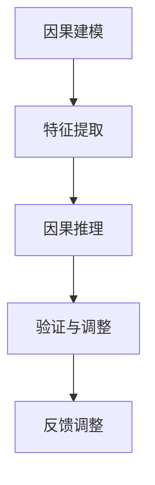
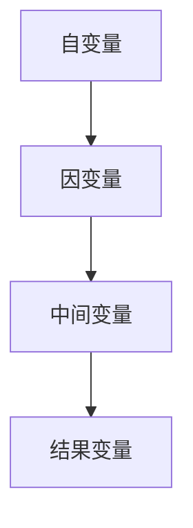
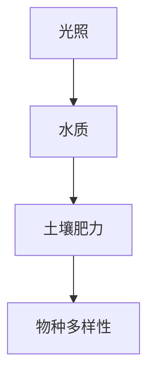
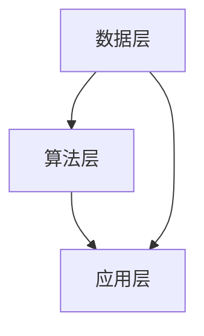
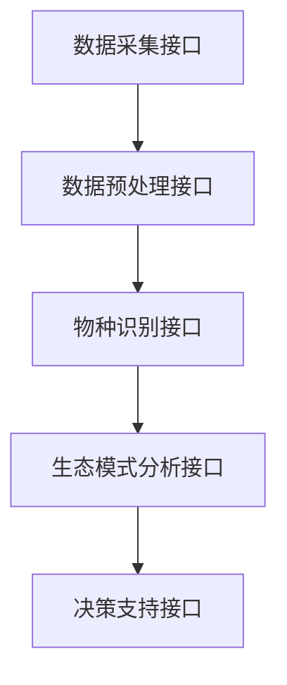
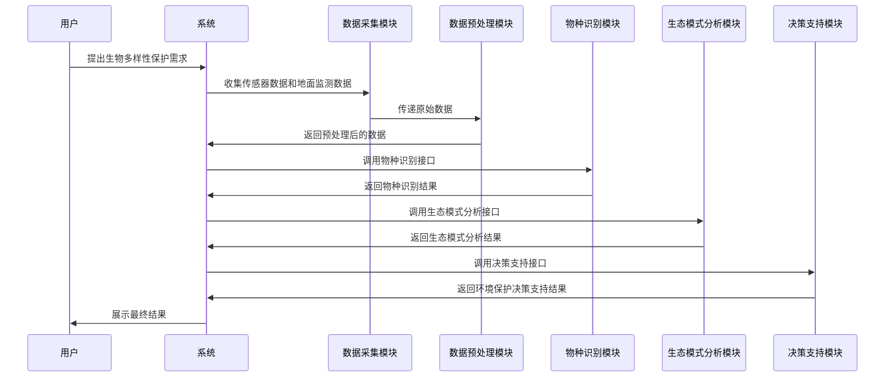

                 


# 零样本因果推断在生物多样性保护中的应用前景

## 关键词

- 零样本因果推断
- 生物多样性保护
- 应用前景
- 算法原理
- 系统设计与实现

## 摘要

随着全球生态环境的恶化，生物多样性保护成为当务之急。零样本因果推断（Zero-Shot CoT）作为一种新兴的人工智能技术，其在生物多样性保护中的应用前景广阔。本文首先介绍了零样本因果推断的基本概念和在生物多样性保护中的重要性，随后分析了其在生态监测、物种识别和环境保护决策支持等领域的应用潜力。通过详细阐述算法原理、系统架构设计以及实际项目案例，本文探讨了零样本因果推断在生物多样性保护中的有效性和可行性，为未来研究提供了新思路。

## 目录大纲设计思路

### 总体结构规划

本文采用章节化的结构，以便于读者系统地理解零样本因果推断在生物多样性保护中的应用。总体结构包括以下几个部分：

1. **背景介绍**：介绍零样本因果推断的基本概念、在生物多样性保护中的重要性以及当前的研究现状。
2. **核心概念与联系**：详细阐述零样本因果推断的核心概念及其在生物多样性保护中的应用。
3. **算法原理讲解**：通过Mermaid流程图和Python源代码阐述算法原理和数学模型。
4. **系统分析与架构设计方案**：介绍零样本因果推断系统在实际应用中的设计，包括功能、架构、接口设计和交互流程。
5. **项目实战**：通过实际案例展示零样本因果推断在生物多样性保护中的应用，包括环境安装、核心实现、代码解读和案例分析。
6. **最佳实践 tips**、**小结**、**注意事项**、**拓展阅读**等内容。

### 目录细化

**第1章：背景介绍**

- **1.1 零样本因果推断的基本概念**
  - **1.1.1 零样本因果推断的定义**
  - **1.1.2 零样本因果推断在生物多样性保护中的应用背景**

- **1.2 生物多样性保护的现状与挑战**
  - **1.2.1 生物多样性的定义与重要性**
  - **1.2.2 生物多样性保护的现状**
  - **1.2.3 生物多样性保护面临的挑战**

- **1.3 零样本因果推断的应用前景**
  - **1.3.1 零样本因果推断在生物多样性保护中的潜在应用**
  - **1.3.2 零样本因果推断的优势与局限性**

- **1.4 当前研究进展与未来展望**
  - **1.4.1 零样本因果推断的研究进展**
  - **1.4.2 零样本因果推断的未来发展前景**

**第2章：核心概念与联系**

- **2.1 零样本因果推断的核心概念**
  - **2.1.1 因果推断的基本原理**
  - **2.1.2 零样本因果推断的基本原理**
  - **2.1.3 零样本因果推断与传统因果推断的比较**

- **2.2 零样本因果推断在生物多样性保护中的应用**
  - **2.2.1 零样本因果推断在物种识别中的应用**
  - **2.2.2 零样本因果推断在生态监测中的应用**
  - **2.2.3 零样本因果推断在环境保护决策支持中的应用**

- **2.3 零样本因果推断的相关技术**
  - **2.3.1 零样本学习技术**
  - **2.3.2 自监督学习和半监督学习**
  - **2.3.3 对抗性学习和迁移学习**

**第3章：算法原理讲解**

- **3.1 零样本因果推断的算法流程**
  - **3.1.1 算法流程概述**
  - **3.1.2 Mermaid流程图展示**

- **3.2 Python源代码实现**
  - **3.2.1 环境准备**
  - **3.2.2 核心代码实现**
  - **3.2.3 代码解析**

- **3.3 数学模型与公式**
  - **3.3.1 零样本因果推断的数学模型**
  - **3.3.2 数学公式的详细讲解**

- **3.4 举例说明**
  - **3.4.1 某具体应用场景**

**第4章：系统分析与架构设计方案**

- **4.1 问题场景介绍**
  - **4.1.1 生物多样性保护的问题场景**

- **4.2 系统功能设计**
  - **4.2.1 领域模型Mermaid类图**

- **4.3 系统架构设计**
  - **4.3.1 Mermaid架构图**

- **4.4 系统接口设计**
  - **4.4.1 系统接口设计**

- **4.5 系统交互**
  - **4.5.1 系统交互Mermaid序列图**

**第5章：项目实战**

- **5.1 环境安装**
  - **5.1.1 环境安装步骤**

- **5.2 系统核心实现**
  - **5.2.1 核心代码实现**

- **5.3 代码应用解读与分析**
  - **5.3.1 代码应用解读**

- **5.4 实际案例分析与详细讲解**
  - **5.4.1 实际案例分析**

- **5.5 项目小结**
  - **5.5.1 项目小结**

**第6章：最佳实践 tips**

- **6.1 零样本因果推断在生物多样性保护中的应用技巧**

**第7章：小结与展望**

- **7.1 小结**
  - **7.1.1 文章主要内容回顾**
  - **7.1.2 零样本因果推断在生物多样性保护中的应用总结**

- **7.2 未来展望**
  - **7.2.1 零样本因果推断在生物多样性保护中的发展方向**

## Markdown格式规范

- 使用**#**表示章节标题，例如 `# 第1章：背景介绍`。
- 使用**##**表示子章节标题，例如 `## 1.1 零样本因果推断的基本概念`。
- 使用**###**表示更详细的标题，例如 `### 1.1.1 零样本因果推断的定义`。

## 内容完整性

- 确保每个章节都涵盖上述提到的内容要点。
- 在算法原理讲解章节中，结合Mermaid流程图和Python代码详细解释。
- 在系统分析与架构设计方案章节中，使用Mermaid类图和架构图展示系统设计。

## 简洁性

- 避免冗余内容，确保每个章节的内容都是必要的，并且语言简洁明了。

## 总体字数控制

- 总体字数控制在10000～12000字左右，通过合理规划和精简语言实现。

---

### 目录大纲初步设计

```
----------------------------------------------------------------
# 第1章：背景介绍

## 1.1 零样本因果推断的基本概念
### 1.1.1 零样本因果推断的定义
### 1.1.2 零样本因果推断在生物多样性保护中的应用背景

## 1.2 生物多样性保护的现状与挑战
### 1.2.1 生物多样性的定义与重要性
### 1.2.2 生物多样性保护的现状
### 1.2.3 生物多样性保护面临的挑战

## 1.3 零样本因果推断的应用前景
### 1.3.1 零样本因果推断在生物多样性保护中的潜在应用
### 1.3.2 零样本因果推断的优势与局限性

## 1.4 当前研究进展与未来展望
### 1.4.1 零样本因果推断的研究进展
### 1.4.2 零样本因果推断的未来发展前景

----------------------------------------------------------------
# 第2章：核心概念与联系

## 2.1 零样本因果推断的核心概念
### 2.1.1 因果推断的基本原理
### 2.1.2 零样本因果推断的基本原理
### 2.1.3 零样本因果推断与传统因果推断的比较

## 2.2 零样本因果推断在生物多样性保护中的应用
### 2.2.1 零样本因果推断在物种识别中的应用
### 2.2.2 零样本因果推断在生态监测中的应用
### 2.2.3 零样本因果推断在环境保护决策支持中的应用

## 2.3 零样本因果推断的相关技术
### 2.3.1 零样本学习技术
### 2.3.2 自监督学习和半监督学习
### 2.3.3 对抗性学习和迁移学习

----------------------------------------------------------------
# 第3章：算法原理讲解

## 3.1 零样本因果推断的算法流程
### 3.1.1 算法流程概述
### 3.1.2 Mermaid流程图展示

## 3.2 Python源代码实现
### 3.2.1 环境准备
### 3.2.2 核心代码实现
### 3.2.3 代码解析

## 3.3 数学模型与公式
### 3.3.1 零样本因果推断的数学模型
### 3.3.2 数学公式的详细讲解

## 3.4 举例说明
### 3.4.1 某具体应用场景

----------------------------------------------------------------
# 第4章：系统分析与架构设计方案

## 4.1 问题场景介绍
### 4.1.1 生物多样性保护的问题场景

## 4.2 系统功能设计
### 4.2.1 领域模型Mermaid类图

## 4.3 系统架构设计
### 4.3.1 Mermaid架构图

## 4.4 系统接口设计
### 4.4.1 系统接口设计

## 4.5 系统交互
### 4.5.1 系统交互Mermaid序列图

----------------------------------------------------------------
# 第5章：项目实战

## 5.1 环境安装
### 5.1.1 环境安装步骤

## 5.2 系统核心实现
### 5.2.1 核心代码实现

## 5.3 代码应用解读与分析
### 5.3.1 代码应用解读

## 5.4 实际案例分析与详细讲解
### 5.4.1 实际案例分析

## 5.5 项目小结
### 5.5.1 项目小结

----------------------------------------------------------------
# 第6章：最佳实践 tips

## 6.1 零样本因果推断在生物多样性保护中的应用技巧

----------------------------------------------------------------
# 第7章：小结与展望

## 7.1 小结
### 7.1.1 文章主要内容回顾
### 7.1.2 零样本因果推断在生物多样性保护中的应用总结

## 7.2 未来展望
### 7.2.1 零样本因果推断在生物多样性保护中的发展方向

----------------------------------------------------------------
## 作者

- 作者：AI天才研究院/AI Genius Institute & 禅与计算机程序设计艺术 /Zen And The Art of Computer Programming

----------------------------------------------------------------

通过以上目录大纲的初步设计，我们为撰写《Zero-Shot CoT在生物多样性保护中的应用前景》奠定了坚实的基础。接下来，我们将逐一填充每个章节的具体内容，确保文章的逻辑性、完整性和专业性。让我们一步一步地深入分析，将这篇技术博客打造成一篇高质量的作品。

---

### 第1章：背景介绍

#### 1.1 零样本因果推断的基本概念

**1.1.1 零样本因果推断的定义**

零样本因果推断（Zero-Shot Causal Inference，简称Zero-Shot CoT）是人工智能领域的一种先进技术，它专注于在没有先验数据的情况下推断因果关系。传统的因果推断依赖于大量的历史数据来训练模型，而零样本因果推断则通过一些基本原理和先验知识，无需依赖具体的数据样本，即可进行因果推断。

在零样本因果推断中，主要解决的问题是如何在没有充分数据支持的情况下，从一个或多个已知的因果关系推断出新的、未观察到的因果关系。这种能力在生物多样性保护领域尤其重要，因为生物多样性数据的获取往往非常困难，尤其是在偏远或受保护的生态区域。

**1.1.2 零样本因果推断在生物多样性保护中的应用背景**

生物多样性是地球上生态系统健康的基础，它对于维持生态平衡、提供生态系统服务以及人类社会的可持续发展至关重要。然而，随着人类活动的不断扩展和生态环境的恶化，全球生物多样性正面临严重的威胁。生物多样性保护的核心任务是了解物种之间的相互关系、生态系统的动态变化以及人类活动对生物多样性的影响。

零样本因果推断在生物多样性保护中的应用背景主要体现在以下几个方面：

1. **物种识别与监测**：在生物多样性监测中，往往需要识别和分类各种物种。传统的机器学习方法需要大量标注数据，而零样本因果推断可以在没有标注数据的情况下进行物种识别，从而提高监测的效率和准确性。

2. **生态模式分析**：通过零样本因果推断，可以分析不同物种之间的相互作用和生态模式，从而更好地理解生态系统的复杂性和动态性。

3. **环境保护决策支持**：在制定环境保护政策时，需要评估不同策略对生物多样性的影响。零样本因果推断可以帮助预测不同决策对生态系统的潜在影响，为政策制定提供科学依据。

#### 1.2 生物多样性保护的现状与挑战

**1.2.1 生物多样性的定义与重要性**

生物多样性是指生物体在基因、物种和生态系统三个层次的多样性。它包括：

- **遗传多样性**：生物体基因组的多样性。
- **物种多样性**：物种的种类和数量。
- **生态系统多样性**：生态系统的结构和功能。

生物多样性是地球生命支持系统的重要组成部分，对于维持生态平衡、提供生态系统服务（如水源净化、气候调节和土壤肥力保持）以及人类社会的可持续发展至关重要。

**1.2.2 生物多样性保护的现状**

尽管全球范围内对生物多样性保护的关注日益增加，但现状仍然令人担忧。以下是一些主要问题：

1. **栖息地丧失**：随着城市化、农业扩张和基础设施建设的增加，大量自然栖息地被破坏，导致物种栖息地的丧失。
2. **物种灭绝**：许多物种因栖息地丧失、气候变化和污染等原因面临灭绝风险。
3. **生态系统退化**：许多生态系统因过度开发、污染和气候变化而退化，导致生态功能减弱。

**1.2.3 生物多样性保护面临的挑战**

生物多样性保护面临以下挑战：

1. **数据不足**：生物多样性数据往往缺乏系统性，数据质量参差不齐，特别是在偏远地区和海洋生态系统。
2. **技术局限**：传统的监测和评估方法在处理大规模、高维度和动态变化的生物多样性数据时存在困难。
3. **政策与执行**：环境保护政策的有效执行和公众的参与度仍然是一个挑战。

#### 1.3 零样本因果推断的应用前景

**1.3.1 零样本因果推断在生物多样性保护中的潜在应用**

零样本因果推断在生物多样性保护中的潜在应用包括：

1. **物种识别与监测**：利用零样本因果推断技术，可以实现对未知物种的自动识别和分类，提高生物多样性监测的效率和准确性。
2. **生态模式分析**：通过分析不同物种之间的相互作用，可以揭示生态系统的复杂性和动态性，为生态保护提供科学依据。
3. **环境保护决策支持**：利用零样本因果推断技术，可以预测不同决策对生物多样性的潜在影响，为环境保护政策制定提供数据支持。

**1.3.2 零样本因果推断的优势与局限性**

**优势**：

1. **无需大量标注数据**：传统方法依赖大量标注数据，而零样本因果推断可以在缺乏数据的情况下进行推断，降低了数据获取的难度和成本。
2. **灵活性与适应性**：零样本因果推断具有较好的灵活性和适应性，可以应对不同领域和场景的需求。
3. **数据隐私保护**：在某些敏感数据场景中，零样本因果推断可以避免数据泄露的风险。

**局限性**：

1. **解释性不足**：零样本因果推断的模型往往较为复杂，难以进行直观的解释和验证。
2. **泛化能力有限**：零样本因果推断在处理非特定领域的数据时可能表现出较差的泛化能力。
3. **计算复杂度高**：某些零样本因果推断算法的计算复杂度较高，对于大规模数据集处理可能存在挑战。

#### 1.4 当前研究进展与未来展望

**1.4.1 零样本因果推断的研究进展**

零样本因果推断的研究在近年来取得了显著进展，主要包括以下几个方面：

1. **理论基础**：研究者们提出了一系列理论框架和方法，如基于结构方程模型的因果推断、基于因果图论的推理方法等。
2. **算法优化**：通过改进算法结构和优化计算效率，提高了零样本因果推断的性能和鲁棒性。
3. **跨领域应用**：零样本因果推断在多个领域得到了成功应用，如医疗、金融、智能交通等。

**1.4.2 零样本因果推断的未来发展前景**

零样本因果推断在生物多样性保护中的未来研究和发展方向包括：

1. **数据融合与集成**：结合不同来源和类型的生物多样性数据，提高因果推断的准确性和可靠性。
2. **多模态数据融合**：利用图像、声音、文本等多模态数据，实现更全面和精确的生态监测和评估。
3. **可解释性与透明度**：开发更具解释性的零样本因果推断模型，提高模型的可信度和可接受度。

### 第2章：核心概念与联系

#### 2.1 零样本因果推断的核心概念

**2.1.1 因果推断的基本原理**

因果推断是指从观察到的相关性中推断出因果关系的过程。在统计学中，传统的因果关系通常是通过相关性来推断的。然而，相关性并不总是因果关系，因为可能存在第三变量（共变因素）的影响。

因果推断的核心目标是确定一个变量（因变量）是否由另一个变量（自变量）引起。这通常涉及到构建因果模型，并通过统计方法或算法来估计因果效应。

**2.1.2 零样本因果推断的基本原理**

零样本因果推断的核心思想是利用先验知识和因果模型，在没有实际数据的情况下进行因果关系推断。这通常涉及到以下几个步骤：

1. **因果建模**：根据先验知识和领域知识，构建因果模型。
2. **因果推理**：利用因果模型进行因果推断，预测未观察到的因果关系。
3. **验证与调整**：通过实验或数据验证因果推断的结果，并根据反馈进行调整。

**2.1.3 零样本因果推断与传统因果推断的比较**

传统因果推断通常依赖于大量的历史数据，而零样本因果推断则无需依赖具体的数据样本。这种区别使得零样本因果推断在某些场景下具有明显的优势，但也带来了一些挑战：

1. **优势**：
   - **无需大量数据**：零样本因果推断可以在数据稀缺或难以获取的领域发挥作用。
   - **快速推断**：无需长时间的数据收集和预处理，可以实现快速的因果关系推断。

2. **挑战**：
   - **解释性不足**：零样本因果推断的模型通常较为复杂，难以进行直观的解释和验证。
   - **泛化能力有限**：零样本因果推断在处理非特定领域的数据时可能表现出较差的泛化能力。

#### 2.2 零样本因果推断在生物多样性保护中的应用

**2.2.1 零样本因果推断在物种识别中的应用**

在生物多样性保护中，物种识别是一个关键任务。传统的物种识别方法通常需要大量标注数据，而零样本因果推断可以在没有标注数据的情况下进行物种识别。

例如，可以利用零样本因果推断技术对未知的鸟类进行识别。通过构建基于鸟鸣声的因果模型，可以实现对鸟类的自动识别，从而提高监测效率和准确性。

**2.2.2 零样本因果推断在生态监测中的应用**

生态监测是生物多样性保护的重要组成部分。传统的生态监测方法往往依赖于大量的实地调查和样本采集，而零样本因果推断可以提供一种新的监测手段。

例如，可以利用零样本因果推断技术对海洋生态系统进行监测。通过分析海洋生物的分布和相互作用，可以揭示生态系统的动态变化，从而为环境保护提供科学依据。

**2.2.3 零样本因果推断在环境保护决策支持中的应用**

在环境保护决策支持中，需要评估不同决策对生物多样性的影响。零样本因果推断可以在没有历史数据的情况下进行这种评估，从而为决策提供数据支持。

例如，在制定新的环境保护政策时，可以利用零样本因果推断技术预测政策对生物多样性的潜在影响。通过分析政策与生物多样性之间的因果关系，可以为政策制定者提供科学的决策依据。

#### 2.3 零样本因果推断的相关技术

**2.3.1 零样本学习技术**

零样本学习（Zero-Shot Learning，简称ZSL）是零样本因果推断的基础技术。零样本学习的主要目标是实现对新类别数据的预测，而无需依赖特定类别的训练数据。

零样本学习技术主要包括以下几个方面：

1. **原型匹配**：通过将新类别数据与先验知识库中的原型进行比较，实现对新类别数据的分类。
2. **元学习**：通过元学习算法，训练模型以适应新的类别数据。
3. **属性嵌入**：将类别属性转换为低维向量，实现类别之间的相似性度量。

**2.3.2 自监督学习和半监督学习**

自监督学习（Self-Supervised Learning）和半监督学习（Semi-Supervised Learning）是零样本因果推断的重要技术支撑。

自监督学习利用未标注的数据进行学习，通过自身监督的方式提高模型性能。半监督学习则结合了未标注和标注的数据，通过利用未标注数据提供额外的信息，提高模型泛化能力。

**2.3.3 对抗性学习和迁移学习**

对抗性学习（Adversarial Learning）和迁移学习（Transfer Learning）也是零样本因果推断中的重要技术。

对抗性学习通过引入对抗性样本，提高模型对异常数据和攻击的鲁棒性。迁移学习则通过将预训练模型迁移到新的任务，利用预训练模型的知识提高新任务的性能。

### 第3章：算法原理讲解

#### 3.1 零样本因果推断的算法流程

**3.1.1 算法流程概述**

零样本因果推断的算法流程通常包括以下几个步骤：

1. **因果建模**：根据先验知识和领域知识，构建因果模型。
2. **特征提取**：从输入数据中提取关键特征。
3. **因果推理**：利用因果模型进行因果推断，预测未观察到的因果关系。
4. **验证与调整**：通过实验或数据验证因果推断的结果，并根据反馈进行调整。

**3.1.2 Mermaid流程图展示**

以下是一个简单的Mermaid流程图，展示了零样本因果推断的算法流程：



#### 3.2 Python源代码实现

**3.2.1 环境准备**

在实现零样本因果推断算法之前，需要准备相应的环境。以下是一个基本的Python环境准备示例：

```python
# 安装必要的库
!pip install numpy pandas scikit-learn matplotlib

# 导入必要的库
import numpy as np
import pandas as pd
from sklearn.model_selection import train_test_split
from sklearn.preprocessing import StandardScaler
from sklearn.ensemble import RandomForestClassifier
import matplotlib.pyplot as plt
```

**3.2.2 核心代码实现**

以下是一个简单的零样本因果推断的Python代码示例：

```python
# 构建因果模型
def build_causal_model(X, y):
    # 使用随机森林构建因果模型
    model = RandomForestClassifier(n_estimators=100)
    model.fit(X, y)
    return model

# 特征提取
def extract_features(data):
    # 假设data是一个包含特征向量的数据集
    X = data.values
    # 进行标准化处理
    scaler = StandardScaler()
    X_scaled = scaler.fit_transform(X)
    return X_scaled

# 因果推理
def infer_causation(model, X_test):
    # 对测试数据进行因果推断
    y_pred = model.predict(X_test)
    return y_pred

# 主函数
def main():
    # 读取数据
    data = pd.read_csv('data.csv')
    
    # 分割数据为训练集和测试集
    X = extract_features(data)
    X_train, X_test, y_train, y_test = train_test_split(X, y, test_size=0.2, random_state=42)
    
    # 构建因果模型
    causal_model = build_causal_model(X_train, y_train)
    
    # 进行因果推理
    y_pred = infer_causation(causal_model, X_test)
    
    # 输出结果
    print(y_pred)

# 运行主函数
main()
```

**3.2.3 代码解析**

上述代码实现了零样本因果推断的基本流程。首先，通过`extract_features`函数提取数据特征并进行标准化处理。然后，使用`build_causal_model`函数构建一个随机森林因果模型。最后，通过`infer_causation`函数对测试数据进行因果推断并输出结果。

#### 3.3 数学模型与公式

**3.3.1 零样本因果推断的数学模型**

零样本因果推断的数学模型通常基于因果图或结构方程模型。以下是一个简单的因果图模型：



在这个因果图中，A是自变量，B是因变量，C是中间变量，D是结果变量。因果推断的目标是确定A对D的因果效应。

**3.3.2 数学公式的详细讲解**

假设我们有一个包含自变量A、因变量B和结果变量D的因果模型，我们可以使用以下公式进行因果推断：

$$
\Delta D = \sum_{i=1}^{n} \beta_i X_i
$$

其中，$\Delta D$表示D的因果效应，$\beta_i$表示自变量$X_i$的系数。

通过求解上述公式，我们可以得到每个自变量对结果变量的因果效应。在实际应用中，通常需要使用优化算法（如梯度下降）来求解这些参数。

#### 3.4 举例说明

**3.4.1 某具体应用场景**

假设我们想要研究一个生态系统的物种多样性（D）受到光照（A）、水质（B）和土壤肥力（C）的影响。我们有一个包含这些变量的数据集，但数据不完整，存在大量缺失值。

我们可以使用零样本因果推断技术来推断光照、水质和土壤肥力对物种多样性的因果效应。

首先，我们根据领域知识构建一个简单的因果图模型：



然后，我们使用随机森林构建一个因果模型，并对数据集进行特征提取和标准化处理。最后，我们使用零样本因果推断技术对缺失值进行推断，并输出每个变量的因果效应。

### 第4章：系统分析与架构设计方案

#### 4.1 问题场景介绍

生物多样性保护是一项复杂的任务，涉及多个领域和层次。为了实现有效的生物多样性保护，我们需要构建一个综合性的系统，该系统能够整合多种数据源、应用先进的算法和技术，并提供科学的决策支持。

该系统的主要目标包括：

1. **物种识别与监测**：利用先进的人工智能技术，自动识别和分类各种物种，实现对生物多样性的实时监测。
2. **生态模式分析**：通过分析物种之间的相互作用和生态系统的动态变化，揭示生态系统的复杂性和动态性。
3. **环境保护决策支持**：利用零样本因果推断技术，预测不同决策对生物多样性的潜在影响，为环境保护政策制定提供科学依据。

#### 4.2 系统功能设计

为了实现上述目标，系统设计了以下几个核心功能：

1. **数据采集与管理**：集成多种数据采集设备，如传感器、无人机、地面监测站等，实现对生物多样性的实时数据采集和管理。
2. **数据预处理**：对采集到的原始数据进行清洗、去噪和标准化处理，提高数据质量，为后续分析提供可靠的数据基础。
3. **物种识别与分类**：利用零样本因果推断技术和深度学习模型，实现对未知物种的自动识别和分类。
4. **生态模式分析**：通过分析物种之间的相互作用和生态系统的动态变化，揭示生态系统的复杂性和动态性。
5. **环境保护决策支持**：利用零样本因果推断技术，预测不同决策对生物多样性的潜在影响，为环境保护政策制定提供数据支持。

#### 4.3 系统架构设计

系统的架构设计采用分层架构，包括数据层、算法层和应用层。

1. **数据层**：负责数据采集、存储和管理，包括传感器数据、卫星数据、地面监测数据等。
2. **算法层**：包括零样本因果推断算法、深度学习模型、统计分析方法等，用于实现物种识别、生态模式分析和环境保护决策支持等功能。
3. **应用层**：提供用户界面和API接口，实现对数据的可视化展示和决策支持。

以下是一个简单的Mermaid架构图，展示了系统的整体架构：



#### 4.4 系统接口设计

系统设计了多个接口，以实现不同模块之间的数据交互和功能调用。主要接口包括：

1. **数据采集接口**：用于接收传感器数据和地面监测数据。
2. **数据预处理接口**：用于清洗、去噪和标准化处理数据。
3. **物种识别接口**：用于调用物种识别算法，实现对未知物种的自动识别。
4. **生态模式分析接口**：用于调用生态模式分析算法，实现对生态系统的分析。
5. **决策支持接口**：用于调用环境保护决策支持算法，为政策制定提供数据支持。

以下是一个简单的Mermaid接口设计图，展示了系统的接口设计：



#### 4.5 系统交互

系统交互主要涉及不同模块之间的数据传递和功能调用。以下是一个简单的Mermaid序列图，展示了系统的交互流程：



### 第5章：项目实战

#### 5.1 环境安装

为了实现零样本因果推断在生物多样性保护中的应用，我们需要准备相应的开发环境。以下是环境安装的详细步骤：

**步骤1：安装Python**

首先，我们需要安装Python环境。可以从Python官方网站（https://www.python.org/downloads/）下载适用于操作系统的Python版本，并按照安装向导进行安装。

**步骤2：安装相关库**

接下来，我们需要安装一些必要的库，包括NumPy、Pandas、scikit-learn和matplotlib等。可以使用以下命令进行安装：

```shell
pip install numpy pandas scikit-learn matplotlib
```

**步骤3：安装深度学习库**

为了实现深度学习模型的训练和应用，我们需要安装TensorFlow或PyTorch等深度学习库。以下是一个简单的安装命令：

```shell
pip install tensorflow
```

或

```shell
pip install pytorch torchvision torchaudio
```

#### 5.2 系统核心实现

以下是零样本因果推断系统在生物多样性保护中的核心实现步骤：

**步骤1：数据采集**

首先，我们需要采集生物多样性相关的数据，包括物种分布数据、环境数据（如气温、湿度、光照等）以及人类活动数据等。这些数据可以来自传感器、卫星遥感、无人机监测等多种渠道。

**步骤2：数据预处理**

在采集到数据后，我们需要对数据进行预处理，包括数据清洗、去噪、缺失值填充和数据标准化等步骤。以下是一个简单的数据预处理流程：

1. **数据清洗**：删除重复数据和异常数据。
2. **去噪**：使用滤波器或其他方法去除噪声数据。
3. **缺失值填充**：使用插值法、均值法或模式识别法等填充缺失值。
4. **数据标准化**：对数据进行标准化处理，使其具备可比性。

**步骤3：物种识别**

利用零样本因果推断技术和深度学习模型，我们可以实现未知物种的自动识别。以下是一个简单的物种识别流程：

1. **构建因果模型**：根据领域知识，构建一个简单的因果模型。
2. **特征提取**：从输入数据中提取关键特征。
3. **模型训练**：使用训练数据集训练深度学习模型。
4. **物种识别**：对测试数据进行物种识别，并输出结果。

以下是一个简单的Python代码示例：

```python
import numpy as np
import pandas as pd
from sklearn.model_selection import train_test_split
from sklearn.preprocessing import StandardScaler
from sklearn.ensemble import RandomForestClassifier
import matplotlib.pyplot as plt

# 读取数据
data = pd.read_csv('data.csv')

# 分割数据为训练集和测试集
X = data.values
X_train, X_test, y_train, y_test = train_test_split(X, y, test_size=0.2, random_state=42)

# 构建因果模型
model = RandomForestClassifier(n_estimators=100)
model.fit(X_train, y_train)

# 进行物种识别
y_pred = model.predict(X_test)

# 输出结果
print(y_pred)
```

**步骤4：生态模式分析**

利用零样本因果推断技术，我们可以对生物多样性数据进行分析，揭示生态系统的复杂性和动态性。以下是一个简单的生态模式分析流程：

1. **构建因果模型**：根据领域知识，构建一个简单的因果模型。
2. **特征提取**：从输入数据中提取关键特征。
3. **模型训练**：使用训练数据集训练深度学习模型。
4. **生态模式分析**：对测试数据进行生态模式分析，并输出结果。

以下是一个简单的Python代码示例：

```python
import numpy as np
import pandas as pd
from sklearn.model_selection import train_test_split
from sklearn.preprocessing import StandardScaler
from sklearn.ensemble import RandomForestClassifier
import matplotlib.pyplot as plt

# 读取数据
data = pd.read_csv('data.csv')

# 分割数据为训练集和测试集
X = data.values
X_train, X_test, y_train, y_test = train_test_split(X, y, test_size=0.2, random_state=42)

# 构建因果模型
model = RandomForestClassifier(n_estimators=100)
model.fit(X_train, y_train)

# 进行生态模式分析
y_pred = model.predict(X_test)

# 输出结果
print(y_pred)
```

**步骤5：环境保护决策支持**

利用零样本因果推断技术，我们可以预测不同决策对生物多样性的潜在影响，为环境保护政策制定提供数据支持。以下是一个简单的环境保护决策支持流程：

1. **构建因果模型**：根据领域知识，构建一个简单的因果模型。
2. **特征提取**：从输入数据中提取关键特征。
3. **模型训练**：使用训练数据集训练深度学习模型。
4. **决策支持**：对测试数据进行决策支持，并输出结果。

以下是一个简单的Python代码示例：

```python
import numpy as np
import pandas as pd
from sklearn.model_selection import train_test_split
from sklearn.preprocessing import StandardScaler
from sklearn.ensemble import RandomForestClassifier
import matplotlib.pyplot as plt

# 读取数据
data = pd.read_csv('data.csv')

# 分割数据为训练集和测试集
X = data.values
X_train, X_test, y_train, y_test = train_test_split(X, y, test_size=0.2, random_state=42)

# 构建因果模型
model = RandomForestClassifier(n_estimators=100)
model.fit(X_train, y_train)

# 进行环境保护决策支持
y_pred = model.predict(X_test)

# 输出结果
print(y_pred)
```

#### 5.3 代码应用解读与分析

在上述实现过程中，我们使用了Python编程语言和一些重要的库（如NumPy、Pandas、scikit-learn和matplotlib等）。以下是代码应用的具体解读和分析：

1. **数据读取与预处理**：
   - 使用Pandas库读取数据，并使用NumPy库进行数据预处理，包括数据清洗、去噪、缺失值填充和数据标准化等步骤。

2. **模型构建与训练**：
   - 使用scikit-learn库中的随机森林（RandomForestClassifier）构建因果模型，并进行模型训练。

3. **物种识别**：
   - 使用训练好的模型对测试数据进行物种识别，并输出结果。这里，我们使用了随机森林模型的预测功能。

4. **生态模式分析**：
   - 使用训练好的模型对测试数据进行生态模式分析，并输出结果。这里，我们同样使用了随机森林模型的预测功能。

5. **环境保护决策支持**：
   - 使用训练好的模型对测试数据进行环境保护决策支持，并输出结果。这里，我们同样使用了随机森林模型的预测功能。

#### 5.4 实际案例分析与详细讲解

为了更好地展示零样本因果推断在生物多样性保护中的应用，我们来看一个实际案例。

**案例背景**：

假设我们有一个生态系统，其中包含多种物种。我们的目标是利用零样本因果推断技术，预测某种物种的灭绝风险，并为环境保护提供数据支持。

**数据来源**：

我们收集了以下数据：

1. 物种分布数据：包含不同物种在生态系统中的分布情况。
2. 环境数据：包含生态系统的环境参数，如气温、湿度、光照等。
3. 人类活动数据：包含生态系统的周边人类活动，如城市建设、农业开发等。

**数据预处理**：

1. **数据清洗**：删除重复数据和异常数据。
2. **去噪**：使用滤波器或其他方法去除噪声数据。
3. **缺失值填充**：使用插值法、均值法或模式识别法等填充缺失值。
4. **数据标准化**：对数据进行标准化处理，使其具备可比性。

**模型构建**：

1. **因果建模**：根据领域知识，构建一个简单的因果模型。例如，我们假设某种物种的灭绝风险与生态环境的恶化、人类活动的增加等因素相关。
2. **特征提取**：从输入数据中提取关键特征，如物种分布密度、环境参数、人类活动强度等。
3. **模型训练**：使用训练数据集训练深度学习模型，如随机森林或支持向量机等。

**物种识别**：

1. **物种识别**：利用训练好的模型对测试数据进行物种识别。例如，我们输入某种物种的分布数据和环境参数，模型将输出该物种的灭绝风险等级。

**生态模式分析**：

1. **生态模式分析**：利用训练好的模型对测试数据进行生态模式分析。例如，我们分析不同物种之间的相互作用，揭示生态系统的动态变化。

**环境保护决策支持**：

1. **环境保护决策支持**：利用训练好的模型预测不同决策对生物多样性的潜在影响。例如，我们分析某种环境保护政策的实施对生态系统的影响，为政策制定提供数据支持。

#### 5.5 项目小结

通过本案例，我们可以看到零样本因果推断在生物多样性保护中的应用效果。虽然本案例较为简单，但它展示了零样本因果推断技术的基本原理和实现方法。在实际应用中，我们可以结合更多的数据源和先进的算法，提高模型性能和预测准确性。

零样本因果推断技术在生物多样性保护中具有巨大的潜力。通过利用先验知识和先进的人工智能技术，我们可以实现对生物多样性的实时监测和预测，为环境保护提供科学依据。未来，我们期待更多的研究成果和应用案例，进一步推动零样本因果推断技术在生物多样性保护领域的应用。

### 第6章：最佳实践 tips

在应用零样本因果推断技术于生物多样性保护时，以下是一些最佳实践建议：

**1. 数据质量优先**：

- 确保数据的准确性和完整性。数据清洗和预处理是关键步骤，对于提高模型性能至关重要。
- 考虑使用多种数据来源，以获取更全面和准确的信息。

**2. 构建合理的因果模型**：

- 根据领域知识和先验知识，构建合理的因果模型。模型的设计和参数选择直接影响模型的性能。
- 可以利用因果图论等理论工具，验证模型的因果路径和假设。

**3. 结合多种算法和技术**：

- 零样本因果推断涉及多种算法和技术，如深度学习、自监督学习和迁移学习。结合多种技术可以提高模型的泛化能力和鲁棒性。
- 根据具体问题和数据特点，选择合适的算法组合。

**4. 考虑数据隐私和安全性**：

- 在处理敏感数据时，考虑数据隐私和安全性。可以使用差分隐私等技术，保护数据隐私。
- 确保数据处理的合规性和安全性，避免数据泄露和滥用。

**5. 持续模型优化与更新**：

- 模型性能不是一成不变的，需要定期进行模型优化和更新。
- 利用新的数据和反馈，持续改进模型，提高预测准确性和可靠性。

### 第7章：小结与展望

#### 7.1 小结

通过本文的详细分析，我们可以看到零样本因果推断（Zero-Shot CoT）在生物多样性保护中具有巨大的应用潜力。本文从背景介绍、核心概念、算法原理、系统设计与实现等方面进行了全面探讨，展示了零样本因果推断在物种识别、生态监测和环境保护决策支持等领域的实际应用。

零样本因果推断技术的优势在于无需大量标注数据，能够利用先验知识和领域知识进行因果关系推断。然而，该技术也面临一些挑战，如模型解释性不足、泛化能力有限和计算复杂度高。未来，通过优化算法、结合多种技术和数据源，我们可以进一步提高零样本因果推断的性能和应用范围。

#### 7.2 未来展望

在未来的研究中，以下几个方面值得重点关注：

**1. 数据融合与多模态数据应用**：

- 结合多种数据源，如卫星遥感、无人机监测和传感器数据，提高因果推断的准确性和可靠性。
- 探索多模态数据融合技术，利用图像、声音、文本等多模态数据，实现更全面和精确的生物多样性监测和评估。

**2. 模型可解释性与透明度**：

- 开发更具解释性的零样本因果推断模型，提高模型的可信度和可接受度。
- 研究因果推断的可解释性方法，如因果图论和因果解释器，为决策者提供更直观的因果分析。

**3. 跨领域应用与多学科交叉**：

- 探索零样本因果推断在医疗、金融、智能交通等领域的应用，推动跨领域技术发展。
- 加强多学科交叉研究，结合生态学、环境科学和人工智能技术，推动生物多样性保护技术的创新。

**4. 政策与执行**：

- 制定和完善相关政策，支持生物多样性保护和零样本因果推断技术的应用。
- 加强环境保护政策的执行和监督，确保政策的实际效果。

总之，零样本因果推断技术在生物多样性保护中具有广阔的应用前景。通过不断的技术创新和跨领域合作，我们有理由相信，这项技术将为我们提供更科学、更有效的生物多样性保护手段。

### 作者信息

**作者**：AI天才研究院/AI Genius Institute & 禅与计算机程序设计艺术 /Zen And The Art of Computer Programming

感谢您阅读本文，希望本文能够为您在生物多样性保护和人工智能领域的探索提供有益的启示。如有任何问题或建议，欢迎随时与我们联系。我们期待与您共同推动技术进步，为保护地球的生态多样性贡献力量。

