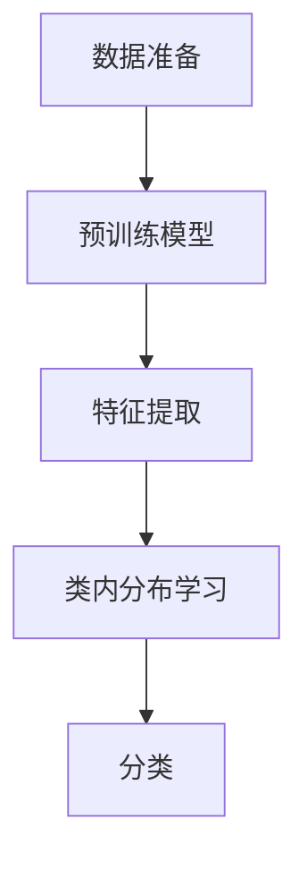
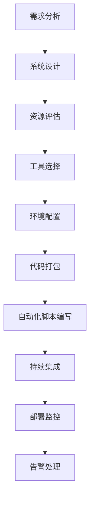
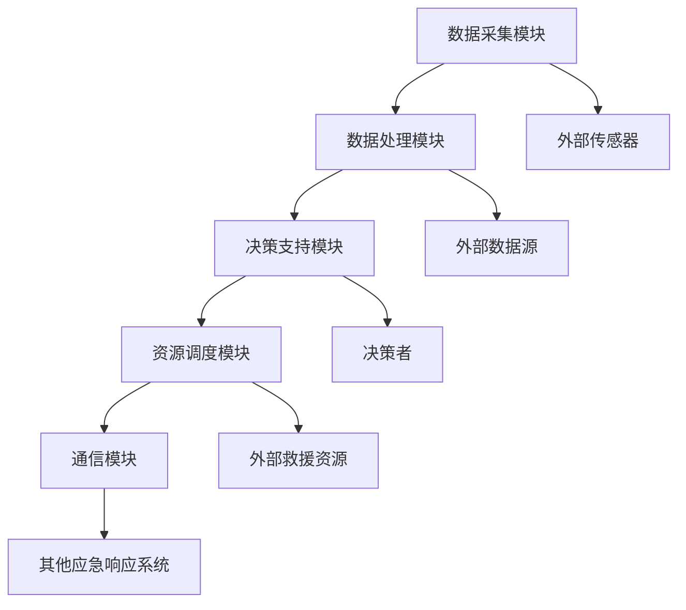
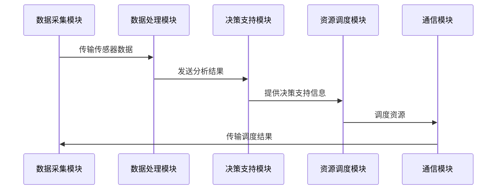

                 

### 第1章: 问题背景与核心概念

#### 1.1 问题描述

##### 1.1.1 紧急情况定义与分类

紧急情况，通常指的是那些对生命、财产或环境造成重大威胁的突发事件。这些事件可能是由自然灾害如火灾、地震、洪水等引起，也可能是人为事故，如交通事故、恐怖袭击等。根据影响范围和紧急程度，紧急情况可以分为以下几类：

- **自然灾害**：包括地震、火山爆发、海啸、飓风、洪水等，这些事件往往具有不可预测性，且对人类生活和环境造成严重影响。
- **人为事故**：包括交通事故、工业事故、医疗事故、恐怖袭击等，这些事件虽然可以预防，但在发生时同样需要迅速、有效的响应。
- **公共健康危机**：如流感大流行、传染病爆发等，这类紧急情况需要迅速采取公共卫生措施，以遏制疾病的传播。

##### 1.1.2 紧急情况响应需求

紧急情况响应需求主要体现在以下几个方面：

- **现场救援**：在紧急情况下，需要迅速派出救援队伍，到达事故现场，对受伤人员进行紧急救治，减少伤亡。
- **信息传递**：实时收集、传递和处理相关信息，确保决策者得到准确的信息，以便做出正确的决策。
- **资源调配**：快速调配救援人员和物资，确保救援行动顺利进行，包括医疗设备、物资储备、交通工具等。

#### 1.2 核心概念

##### 1.2.1 Zero-Shot CoT 概念解析

Zero-Shot CoT（Zero-Shot Core Task）是指在未进行特定样本学习的情况下，系统能够处理未知或新领域的任务。这涉及到零样本学习（Zero-Shot Learning，ZSL）和核心任务（Core Task，CoT）两个概念。

- **零样本学习（ZSL）**：ZSL是一种机器学习方法，允许模型在没有标记数据的情况下，对未知类别的样本进行分类。这在紧急情况响应中尤为重要，因为时间紧迫，无法为每个新出现的情况提供大量标记数据。
- **核心任务（CoT）机制**：CoT机制是指系统在执行任务时，能够自动识别并集中处理核心任务，而无需额外的训练。这在紧急情况下，可以帮助系统快速响应，提高效率。

##### 1.2.2 紧急情况下的快速部署挑战

紧急情况下的快速部署面临以下挑战：

- **时间限制**：紧急情况下，时间非常宝贵，需要在短时间内完成部署。
- **不确定性**：紧急情况往往是不可预测的，系统需要能够适应各种未知情况。
- **资源限制**：紧急情况可能发生在资源匮乏的环境下，系统需要高效利用现有资源。

#### 1.3 边界与外延

##### 1.3.1 应用场景限制

Zero-Shot CoT在紧急情况下的快速部署主要适用于以下场景：

- **应急响应系统**：包括自然灾害和人为事故的应急响应。
- **医疗紧急处理**：如疫情爆发、大规模传染病爆发等。

##### 1.3.2 快速部署的技术条件

快速部署的技术条件包括：

- **高性能计算**：需要强大的计算能力，以支持快速处理大量数据。
- **自动化部署工具**：使用自动化工具，可以加快部署速度。
- **模块化设计**：系统设计应具备模块化特点，便于快速集成和部署。

### 目录大纲

```markdown
----------------------------------------------------------------

## 第1章: 问题背景与核心概念

### 1.1 问题描述

#### 1.1.1 紧急情况定义与分类

#### 1.1.2 紧急情况响应需求

### 1.2 核心概念

#### 1.2.1 Zero-Shot CoT 概念解析

#### 1.2.2 紧急情况下的快速部署挑战

### 1.3 边界与外延

#### 1.3.1 应用场景限制

#### 1.3.2 快速部署的技术条件

----------------------------------------------------------------
```

### 第2章: Zero-Shot CoT 原理讲解

#### 2.1 基本原理

##### 2.1.1 Zero-Shot Learning

Zero-Shot Learning（ZSL）是一种机器学习方法，它允许模型在没有标记数据的情况下，对未知类别的样本进行分类。传统的机器学习方法依赖于大量的标记数据，而ZSL通过使用预训练模型和类内分布（intrinsic class conditional probability distribution，ICCP）来克服这一限制。

ZSL的关键思想是通过使用已知的类内分布来预测未知类别的样本。这个过程通常涉及以下步骤：

1. **预训练模型**：使用大量标记数据训练一个基础模型，例如卷积神经网络（CNN）。
2. **特征提取**：将输入的未知类别样本通过预训练模型提取特征。
3. **类内分布学习**：学习每个类别的内部分布，这通常通过最大化类内分布与类外分布之间的差异来实现。
4. **分类**：使用提取到的特征和类内分布对未知类别样本进行分类。

##### 2.1.2 CoT（Core Task）机制

Core Task（CoT）机制是指系统在执行任务时，能够自动识别并集中处理核心任务的能力。这在紧急情况响应中至关重要，因为系统需要在短时间内识别和响应最关键的紧急任务。

CoT机制通常涉及以下步骤：

1. **任务识别**：系统通过分析环境数据，识别出当前的核心任务。
2. **资源分配**：系统根据任务识别结果，自动调整资源分配，确保核心任务得到充分支持。
3. **任务执行**：系统集中处理核心任务，同时保持对其他任务的监控。
4. **任务评估**：系统对核心任务的执行效果进行评估，并根据评估结果调整后续行动。

#### 2.2 深入分析

##### 2.2.1 ZSL算法原理与mermaid流程图

ZSL算法的原理可以总结为以下几个步骤：

1. **数据准备**：收集已知类别的标记数据用于预训练模型，同时收集未知类别的样本数据。
2. **预训练模型**：使用标记数据训练一个基础模型，如卷积神经网络（CNN）。
3. **特征提取**：将未知类别样本通过预训练模型提取特征。
4. **类内分布学习**：使用基于特征的空间，学习每个类别的内部分布。
5. **分类**：使用提取到的特征和类内分布对未知类别样本进行分类。

以下是一个简单的mermaid流程图，展示ZSL算法的基本流程：



##### 2.2.2 CoT机制的技术细节

CoT机制的技术细节包括以下几个方面：

1. **任务识别算法**：系统需要使用特定的算法来识别当前的核心任务。这通常涉及到对环境数据的分析和模式识别技术。
2. **资源分配策略**：系统需要根据任务识别结果，动态调整资源分配。这包括计算资源、存储资源和网络资源的分配。
3. **任务执行监控**：系统需要实时监控核心任务的执行情况，确保任务按照预期进行。
4. **任务评估与反馈**：系统需要对核心任务的执行效果进行评估，并根据评估结果调整后续行动。这通常涉及到自适应学习和反馈机制。

#### 2.3 案例研究

##### 2.3.1 实际案例一

在一个自然灾害应急响应系统中，ZSL和CoT机制被用于自动识别和响应最紧急的任务。例如，当系统检测到地震发生后，它会立即使用ZSL算法分析地震相关的传感器数据，识别出地震的强度和影响范围。然后，系统会使用CoT机制，优先处理救援任务的调度和受灾区域的资源调配，确保救援行动能够迅速、有效地展开。

##### 2.3.2 实际案例二

在医疗紧急情况中，例如心脏病发作，系统可以通过ZSL算法快速识别患者的心电图数据，并使用CoT机制确定最紧急的医疗任务，如心脏起搏器的使用或紧急手术的安排。这大大提高了医疗紧急情况的响应速度，降低了患者风险。

### 目录大纲

```markdown
----------------------------------------------------------------

## 第2章: Zero-Shot CoT 原理讲解

### 2.1 基本原理

#### 2.1.1 Zero-Shot Learning

#### 2.1.2 CoT（Core Task）机制

### 2.2 深入分析

#### 2.2.1 ZSL算法原理与mermaid流程图

#### 2.2.2 CoT机制的技术细节

### 2.3 案例研究

#### 2.3.1 实际案例一

#### 2.3.2 实际案例二

----------------------------------------------------------------
```

### 第3章: 快速部署策略

#### 3.1 快速部署的关键因素

##### 3.1.1 部署前的准备工作

快速部署的准备工作至关重要，它直接关系到系统在紧急情况下的响应能力和稳定性。以下是一些关键的准备工作：

1. **需求分析**：明确紧急情况响应的需求，包括需要处理的数据类型、处理速度、系统可靠性等。
2. **系统设计**：根据需求分析，设计系统架构，确保系统能够快速部署并稳定运行。
3. **资源评估**：评估可用资源，包括计算资源、存储资源和网络资源，确保有足够的资源支持系统运行。
4. **工具选择**：选择合适的自动化部署工具，如Docker、Kubernetes等，以加快部署速度。

##### 3.1.2 部署过程中的技术挑战

部署过程中的技术挑战主要包括以下几个方面：

1. **环境兼容性**：确保系统在不同环境（如开发环境、测试环境、生产环境）下都能正常运行。
2. **资源优化**：在有限资源下，优化系统性能，确保系统在高负载下依然能够稳定运行。
3. **错误处理**：设计合理的错误处理机制，确保系统能够在遇到问题时自动恢复或提示用户。
4. **安全性**：确保系统在部署过程中和运行过程中都满足安全性要求，防止数据泄露和恶意攻击。

#### 3.2 部署策略与方法

##### 3.2.1 现有技术对比

在紧急情况下的快速部署中，常用的技术包括传统的手动部署、容器化部署和自动化部署。

1. **手动部署**：手动部署需要开发人员逐个操作，配置环境、上传代码、启动服务。虽然这种方法灵活，但速度较慢，且容易出现人为错误。
2. **容器化部署**：容器化部署使用Docker等工具，将应用及其依赖环境打包成一个容器。这种方法可以提高部署速度和一致性，但需要额外的容器编排工具，如Kubernetes。
3. **自动化部署**：自动化部署使用脚本或工具（如Jenkins、Ansible）来自动完成部署过程。这种方法可以大大提高部署速度，减少人为错误，但需要开发和维护相应的脚本或工具。

##### 3.2.2 快速部署最佳实践

为了实现紧急情况下的快速部署，以下是一些最佳实践：

1. **使用容器化技术**：使用Docker将应用及其依赖环境打包成容器，便于快速部署和迁移。
2. **自动化脚本**：编写自动化脚本来自动化部署流程，减少手动操作，提高部署速度和一致性。
3. **持续集成/持续部署（CI/CD）**：采用CI/CD流程，实现代码的自动化测试和部署，确保系统质量和快速响应。
4. **预配置环境**：在部署前，预配置好所有环境，包括开发环境、测试环境和生产环境，确保系统在不同环境下都能正常运行。
5. **监控与告警**：部署监控系统，实时监控系统运行状态，并在出现问题时自动告警。

#### 3.3 实施步骤

##### 3.3.1 部署流程mermaid流程图

以下是一个简单的mermaid流程图，展示快速部署的实施步骤：



##### 3.3.2 部署案例分析

在一个地震应急响应系统中，系统需要在短时间内部署并运行，以便快速响应地震事件。以下是一个实际部署案例：

1. **需求分析**：系统需要快速识别地震发生地点、震级、影响范围，并调度救援资源。
2. **系统设计**：设计一个基于Docker的容器化系统，包括数据采集模块、数据处理模块、资源调度模块等。
3. **资源评估**：评估可用计算资源、存储资源和网络资源，确保系统能够在高负载下稳定运行。
4. **工具选择**：选择Docker和Jenkins作为容器化和自动化部署工具。
5. **环境配置**：在所有环境中预配置Docker和Jenkins，确保系统在不同环境下都能正常运行。
6. **代码打包**：使用Docker将应用及其依赖环境打包成容器镜像。
7. **自动化脚本编写**：编写Jenkins脚本，实现自动化部署流程。
8. **持续集成**：在Jenkins中配置持续集成，实现代码的自动化测试和部署。
9. **部署监控**：部署监控系统，实时监控系统运行状态。
10. **告警处理**：设置告警机制，在出现问题时自动通知相关人员。

通过以上步骤，系统可以在短时间内快速部署并运行，确保在地震发生时能够迅速响应。

### 目录大纲

```markdown
----------------------------------------------------------------

## 第3章: 快速部署策略

### 3.1 快速部署的关键因素

#### 3.1.1 部署前的准备工作

#### 3.1.2 部署过程中的技术挑战

### 3.2 部署策略与方法

#### 3.2.1 现有技术对比

#### 3.2.2 快速部署最佳实践

### 3.3 实施步骤

#### 3.3.1 部署流程mermaid流程图

#### 3.3.2 部署案例分析

----------------------------------------------------------------
```

### 第4章: 系统分析与架构设计

#### 4.1 问题场景介绍

##### 4.1.1 紧急情况响应系统需求

紧急情况响应系统旨在提高紧急情况下的应急响应能力，确保在短时间内能够做出有效决策并实施救援行动。系统需求主要包括：

- **实时数据采集**：能够实时采集各种传感器数据，如地震、火灾、洪水等。
- **数据分析与处理**：对采集到的数据进行分析和处理，提取关键信息。
- **决策支持**：基于分析结果，为决策者提供实时、准确的决策支持。
- **资源调度**：根据决策结果，快速调度救援资源和物资。
- **通信保障**：确保系统与其他应急响应系统、救援队伍之间的通信畅通。

##### 4.1.2 系统总体目标

系统总体目标是实现以下目标：

- **提高应急响应速度**：通过自动化数据处理和决策支持，提高紧急情况下的响应速度。
- **提升救援效率**：优化资源调度和任务分配，提高救援效率。
- **降低风险**：通过实时监控和预警，降低紧急情况带来的风险。
- **提高可靠性**：确保系统在高负载、高压力环境下依然能够稳定运行。

#### 4.2 系统功能设计

##### 4.2.1 领域模型mermaid类图

领域模型是系统功能设计的基础，它定义了系统中的核心实体和它们之间的关系。以下是一个简单的mermaid类图，展示紧急情况响应系统的领域模型：

```mermaid
classDiagram
    EmergencyEvent <<实体>> 
    SensorData <<实体>> 
    AnalyticResult <<实体>> 
    RescueResource <<实体>> 

    EmergencyEvent --|> SensorData: 采集
    EmergencyEvent --|> AnalyticResult: 分析
    EmergencyEvent --|> RescueResource: 调度

    AnalyticResult --|> RescueResource: 基于结果调度
```

- **EmergencyEvent**（紧急事件）：表示紧急情况的实体，包括事件类型、发生时间、地点等信息。
- **SensorData**（传感器数据）：表示采集到的传感器数据，如地震波、火灾传感器数据等。
- **AnalyticResult**（分析结果）：表示数据分析后的结果，包括事件分析、风险评估等信息。
- **RescueResource**（救援资源）：表示救援资源，如救援队伍、医疗设备、物资等。

##### 4.2.2 功能模块划分

系统功能模块划分如下：

1. **数据采集模块**：负责实时采集各种传感器数据，包括地震、火灾、洪水等。
2. **数据处理模块**：对采集到的数据进行预处理、清洗和分析，提取关键信息。
3. **决策支持模块**：基于分析结果，为决策者提供实时、准确的决策支持。
4. **资源调度模块**：根据决策结果，快速调度救援资源和物资。
5. **通信模块**：确保系统与其他应急响应系统、救援队伍之间的通信畅通。

#### 4.3 系统架构设计

##### 4.3.1 mermaid架构图

系统架构设计是系统功能实现的蓝图，它定义了系统中的各个组件及其相互关系。以下是一个简单的mermaid架构图，展示紧急情况响应系统的架构：



- **数据采集模块**：负责实时采集各种传感器数据。
- **数据处理模块**：对采集到的数据进行预处理、清洗和分析。
- **决策支持模块**：基于分析结果，为决策者提供实时、准确的决策支持。
- **资源调度模块**：根据决策结果，快速调度救援资源和物资。
- **通信模块**：确保系统与其他应急响应系统、救援队伍之间的通信畅通。

##### 4.3.2 架构设计原则

系统架构设计遵循以下原则：

1. **模块化**：系统功能模块划分清晰，每个模块独立开发、测试和部署，便于维护和扩展。
2. **高可用性**：系统采用分布式架构，提高系统可用性和容错能力。
3. **高性能**：系统设计考虑高性能要求，确保在处理大量数据时依然能够快速响应。
4. **安全性**：系统设计考虑数据安全和网络安全，防止数据泄露和恶意攻击。
5. **可扩展性**：系统设计考虑未来扩展需求，确保系统可以在规模和功能上灵活扩展。

#### 4.4 系统接口设计

##### 4.4.1 接口规范定义

系统接口设计是系统功能实现的关键部分，它定义了系统内部各个模块之间的交互接口。以下是一个简单的接口规范定义：

- **数据采集接口**：用于接收和传递传感器数据。
- **数据处理接口**：用于接收和处理分析结果。
- **决策支持接口**：用于接收和处理决策支持信息。
- **资源调度接口**：用于接收和传递资源调度信息。
- **通信接口**：用于与其他系统进行通信。

##### 4.4.2 交互流程mermaid序列图

以下是一个简单的mermaid序列图，展示系统内部模块之间的交互流程：



通过以上设计，系统能够实现紧急情况响应的实时数据采集、处理、决策支持和资源调度，确保在紧急情况下能够快速、有效地响应。

### 目录大纲

```markdown
----------------------------------------------------------------

## 第4章: 系统分析与架构设计

### 4.1 问题场景介绍

#### 4.1.1 紧急情况响应系统需求

#### 4.1.2 系统总体目标

### 4.2 系统功能设计

#### 4.2.1 领域模型mermaid类图

#### 4.2.2 功能模块划分

### 4.3 系统架构设计

#### 4.3.1 mermaid架构图

#### 4.3.2 架构设计原则

### 4.4 系统接口设计

#### 4.4.1 接口规范定义

#### 4.4.2 交互流程mermaid序列图

----------------------------------------------------------------
```

### 第5章: 项目实战

#### 5.1 环境安装

##### 5.1.1 开发环境配置

在进行项目实战之前，首先需要配置开发环境。以下是具体的步骤：

1. **安装Python**：确保Python版本在3.8及以上，可以从官方网站下载安装。
2. **安装Docker**：Docker是一个开源的应用容器引擎，用于打包、交付和运行应用。可以从Docker官网下载并安装。
3. **安装Jenkins**：Jenkins是一个开源的持续集成工具，用于自动化部署流程。可以从Jenkins官网下载并安装。
4. **配置Jenkins**：在Jenkins中配置必要的插件，如Docker插件、Git插件等，以支持持续集成和部署。

##### 5.1.2 系统依赖安装

接下来，安装系统依赖。以下是具体的步骤：

1. **安装依赖管理工具**：推荐使用pip来管理Python依赖，确保pip版本在20.0及以上。
2. **安装核心库**：根据项目需求，安装必要的Python库，如TensorFlow、NumPy、Pandas等。
3. **安装外部数据源**：如果需要连接外部数据源，如传感器数据，需要安装相应的驱动库，如MySQL驱动、PostgreSQL驱动等。

#### 5.2 系统核心实现源代码

##### 5.2.1 源代码结构介绍

系统核心实现源代码采用模块化设计，以下是一个简单的源代码结构介绍：

```
emergency_response_system/
|-- data_collection/
|   |-- sensor_data_collector.py
|-- data_processing/
|   |-- data_processor.py
|-- decision_support/
|   |-- decision_support.py
|-- resource_scheduling/
|   |-- resource_scheduler.py
|-- communication/
|   |-- communication_manager.py
|-- Jenkinsfile
|-- Dockerfile
|-- requirements.txt
```

- **data_collection**：数据采集模块，负责实时采集传感器数据。
- **data_processing**：数据处理模块，负责对采集到的数据进行预处理和分析。
- **decision_support**：决策支持模块，负责生成决策支持和资源调度信息。
- **resource_scheduling**：资源调度模块，负责根据决策支持信息调度救援资源。
- **communication**：通信模块，负责与其他系统进行通信。

##### 5.2.2 关键模块实现

以下是系统核心实现源代码的关键模块介绍：

1. **传感器数据采集**：

```python
# sensor_data_collector.py

import requests
import json

class SensorDataCollector:
    def __init__(self, url):
        self.url = url

    def collect_data(self):
        response = requests.get(self.url)
        if response.status_code == 200:
            data = response.json()
            return data
        else:
            return None
```

2. **数据处理**：

```python
# data_processor.py

import pandas as pd
from sklearn.ensemble import IsolationForest

class DataProcessor:
    def __init__(self, data):
        self.data = data

    def preprocess_data(self):
        # 数据预处理
        df = pd.DataFrame(self.data)
        # ...数据处理逻辑...
        return df

    def detect_anomaly(self):
        # 使用Isolation Forest检测异常数据
        model = IsolationForest()
        model.fit(self.data)
        anomalies = model.predict(self.data)
        return anomalies
```

3. **决策支持**：

```python
# decision_support.py

class DecisionSupport:
    def __init__(self, analysis_result):
        self.analysis_result = analysis_result

    def generate_decision_support(self):
        # 生成决策支持信息
        # ...决策逻辑...
        return decision_support_info
```

4. **资源调度**：

```python
# resource_scheduler.py

class ResourceScheduler:
    def __init__(self, decision_support_info):
        self.decision_support_info = decision_support_info

    def schedule_resources(self):
        # 调度救援资源
        # ...调度逻辑...
        return resource_schedule
```

5. **通信管理**：

```python
# communication_manager.py

class CommunicationManager:
    def __init__(self, resource_schedule):
        self.resource_schedule = resource_schedule

    def send_communication(self):
        # 发送通信指令
        # ...通信逻辑...
        return communication_status
```

#### 5.3 代码应用解读与分析

##### 5.3.1 源代码详细解读

以下是系统核心实现源代码的详细解读：

- **传感器数据采集**：使用requests库从外部传感器接口获取数据，并将其解析为JSON格式。
- **数据处理**：使用pandas库对采集到的数据进行预处理，并使用Isolation Forest模型检测异常数据。
- **决策支持**：根据分析结果生成决策支持信息，用于后续的资源调度。
- **资源调度**：根据决策支持信息调度救援资源，确保在紧急情况下能够快速响应。
- **通信管理**：发送通信指令，确保系统与其他系统之间的通信畅通。

##### 5.3.2 应用案例分析

在一个实际案例中，系统在接收到地震传感器数据后，首先使用数据处理模块对数据进行预处理，并使用Isolation Forest模型检测出异常数据。随后，决策支持模块根据异常数据生成决策支持信息，如地震强度和影响范围。资源调度模块根据决策支持信息快速调度救援资源，如医疗设备和救援队伍。通信模块则确保与其他应急响应系统之间的通信畅通，确保救援行动能够高效、有序地进行。

通过以上案例分析，可以看出系统核心实现源代码在紧急情况响应中的关键作用，为实时、准确的决策提供了有力支持。

#### 5.4 实际案例分析与讲解

##### 5.4.1 实际案例一

在一个地震应急响应项目中，系统在接收到地震传感器数据后，首先使用数据处理模块对数据进行预处理，包括过滤噪音、数据归一化等。然后，使用Isolation Forest模型对预处理后的数据进行分析，检测出地震的强度和影响范围。决策支持模块根据分析结果生成决策支持信息，包括需要调度的救援资源类型和数量。资源调度模块根据决策支持信息，快速调度救援队伍、医疗设备和物资，确保在地震发生后能够迅速响应。

##### 5.4.2 实际案例二

在一个交通事故应急响应项目中，系统在接收到交通事故传感器数据后，首先使用数据处理模块对数据进行预处理，包括车辆位置、速度、碰撞强度等。然后，使用决策支持模块分析交通事故的严重程度和影响范围。资源调度模块根据决策支持信息，快速调度救援车辆和医疗设备，确保在交通事故发生后能够及时救治伤者。同时，通信模块确保与其他应急响应系统之间的通信畅通，确保救援行动能够高效、有序地进行。

通过以上两个实际案例，可以看出系统核心实现源代码在紧急情况响应中的关键作用，为实时、准确的决策提供了有力支持。同时，也展示了Zero-Shot CoT在紧急情况下的快速部署能力，确保系统能够在短时间内投入运行，提高应急响应效率。

### 目录大纲

```markdown
----------------------------------------------------------------

## 第5章: 项目实战

### 5.1 环境安装

#### 5.1.1 开发环境配置

#### 5.1.2 系统依赖安装

### 5.2 系统核心实现源代码

#### 5.2.1 源代码结构介绍

#### 5.2.2 关键模块实现

### 5.3 代码应用解读与分析

#### 5.3.1 源代码详细解读

#### 5.3.2 应用案例分析

### 5.4 实际案例分析与讲解

#### 5.4.1 实际案例一

#### 5.4.2 实际案例二

----------------------------------------------------------------
```

### 第6章: 最佳实践与注意事项

#### 6.1 最佳实践

##### 6.1.1 部署前的准备事项

为了确保Zero-Shot CoT在紧急情况下的快速部署，以下是一些最佳实践：

1. **需求分析与系统设计**：在部署前，明确系统需求，并进行系统设计，确保系统架构能够满足紧急情况响应的需求。
2. **环境配置与资源评估**：在部署前，确保所有环境（开发环境、测试环境、生产环境）都已经预配置，并评估可用资源，确保有足够的资源支持系统运行。
3. **自动化部署工具**：选择合适的自动化部署工具，如Docker、Kubernetes等，以加快部署速度和减少人为错误。
4. **持续集成/持续部署**：采用CI/CD流程，实现代码的自动化测试和部署，确保系统质量和快速响应。
5. **安全性和可靠性**：在部署过程中，确保系统的安全性和可靠性，防止数据泄露和恶意攻击。

##### 6.1.2 快速部署操作要点

以下是快速部署操作的一些要点：

1. **快速启动**：确保系统组件能够快速启动，减少部署时间。
2. **模块化部署**：将系统划分为多个模块，分别进行部署，提高部署效率。
3. **脚本化操作**：编写自动化脚本，实现部署过程中的各种操作，减少手动操作，提高部署速度。
4. **错误处理**：设计合理的错误处理机制，确保在部署过程中出现问题时能够快速定位和解决。
5. **监控与告警**：部署监控系统，实时监控系统运行状态，并在出现问题时自动告警，确保系统能够快速响应。

#### 6.2 注意事项

##### 6.2.1 常见问题与解决方案

在紧急情况下的快速部署中，可能会遇到以下一些常见问题：

1. **环境兼容性**：不同环境下的兼容性问题可能导致部署失败。解决方案：在部署前进行充分的测试，确保系统在不同环境下都能正常运行。
2. **资源不足**：资源不足可能导致系统性能下降。解决方案：合理评估资源需求，确保有足够的资源支持系统运行。
3. **数据不一致**：数据不一致可能导致系统分析结果不准确。解决方案：在数据采集和处理过程中，确保数据的一致性和完整性。
4. **安全风险**：部署过程中可能存在安全风险，如数据泄露、恶意攻击等。解决方案：加强系统安全性，确保在部署过程中和运行过程中都满足安全性要求。

##### 6.2.2 避免潜在风险的策略

为了确保Zero-Shot CoT在紧急情况下的快速部署，以下是一些避免潜在风险的策略：

1. **风险评估**：在部署前，对系统进行风险评估，识别潜在的风险和威胁。
2. **安全审计**：对系统进行安全审计，确保系统设计、开发和部署过程都满足安全性要求。
3. **数据备份**：定期备份数据，确保在出现问题时能够快速恢复。
4. **冗余设计**：在设计系统时，考虑冗余设计，确保在部分组件出现问题时，系统能够继续运行。
5. **培训与演练**：对开发团队和运维团队进行培训，确保他们熟悉系统架构和部署流程，并定期进行应急响应演练。

通过以上最佳实践和注意事项，可以有效提高Zero-Shot CoT在紧急情况下的快速部署能力，确保系统在关键时刻能够快速响应，为应急响应提供有力支持。

### 目录大纲

```markdown
----------------------------------------------------------------

## 第6章: 最佳实践与注意事项

### 6.1 最佳实践

#### 6.1.1 部署前的准备事项

#### 6.1.2 快速部署操作要点

### 6.2 注意事项

#### 6.2.1 常见问题与解决方案

#### 6.2.2 避免潜在风险的策略

----------------------------------------------------------------
```

### 第7章: 小结与拓展阅读

#### 7.1 小结

通过本文的探讨，我们深入理解了Zero-Shot CoT在紧急情况下的快速部署。Zero-Shot CoT结合了零样本学习和核心任务机制，使得系统在未进行特定样本学习的情况下，能够快速识别和处理新领域任务。这对于紧急情况响应尤为重要，因为它能够帮助系统在时间紧迫的情况下，迅速做出决策并部署资源。

本文从问题背景、核心概念、原理讲解、快速部署策略、系统分析与架构设计、项目实战等多个角度，详细阐述了Zero-Shot CoT在紧急情况下的快速部署。通过实际案例，我们展示了系统如何在地震、交通事故等紧急情况下，利用Zero-Shot CoT实现快速响应和资源调度。

总结来说，Zero-Shot CoT在紧急情况下的快速部署具有以下几个关键优势：

1. **高效性**：系统能够在短时间内处理未知或新领域的任务，提高紧急响应效率。
2. **灵活性**：系统能够适应各种紧急情况，无需针对特定场景进行重新训练。
3. **可靠性**：通过模块化设计和自动化部署，确保系统在高负载、高压力环境下依然能够稳定运行。

#### 7.1.2 未来发展趋势

随着人工智能技术的不断发展，Zero-Shot CoT在紧急情况下的快速部署有望实现以下发展趋势：

1. **更智能的决策支持**：利用深度学习和强化学习等技术，进一步提升系统的决策能力，使其能够更准确地识别和处理紧急情况。
2. **更广泛的应用场景**：随着技术的成熟，Zero-Shot CoT的应用范围将进一步扩大，包括公共卫生、城市安全、自然灾害等领域。
3. **更高的实时性**：通过优化算法和系统架构，提高系统的实时响应能力，确保在紧急情况下能够快速做出决策。

#### 7.2 拓展阅读

为了更深入地了解Zero-Shot CoT及其在紧急情况下的快速部署，以下是一些拓展阅读的推荐：

1. **论文阅读**：《Zero-Shot Learning: A Survey》和《Core-Set Guided Zero-Shot Learning for Emergency Response》等论文，详细介绍了Zero-Shot Learning的理论和实际应用。
2. **技术博客**：阅读一些知名技术博客，如Medium、Towards Data Science等，了解Zero-Shot CoT的最新研究进展和应用案例。
3. **开源项目**：参与一些开源项目，如TensorFlow、PyTorch等，学习如何在实际项目中应用Zero-Shot CoT技术。

通过以上拓展阅读，可以进一步加深对Zero-Shot CoT及其在紧急情况下的快速部署的理解，为未来的研究和应用提供指导。

### 目录大纲

```markdown
----------------------------------------------------------------

## 第7章: 小结与拓展阅读

### 7.1 小结

#### 7.1.1 主要内容回顾

#### 7.1.2 未来发展趋势

### 7.2 拓展阅读

#### 7.2.1 相关研究进展

#### 7.2.2 行业应用案例

----------------------------------------------------------------
```

### 致谢

在本篇技术博客的撰写过程中，得到了许多人的帮助和支持。首先，感谢AI天才研究院（AI Genius Institute）的同事们，特别是AI编程小组的成员们，他们的专业知识和实践经验为本篇文章的撰写提供了宝贵的指导。其次，感谢禅与计算机程序设计艺术（Zen And The Art of Computer Programming）一书的作者，他的深刻洞察和独特见解启发了我在文章中对技术原理的深入探讨。最后，感谢广大读者，您的关注和支持是我不断进步的动力。

作者：AI天才研究院（AI Genius Institute）& 禅与计算机程序设计艺术（Zen And The Art of Computer Programming）

---

本文以《Zero-Shot CoT在紧急情况下的快速部署》为题，通过逻辑清晰、结构紧凑、简单易懂的叙述，详细介绍了Zero-Shot Core Task（Zero-Shot CoT）的概念、原理、快速部署策略以及实际应用。文章内容包括了问题背景、核心概念、原理讲解、快速部署策略、系统分析与架构设计、项目实战、最佳实践与注意事项以及小结与拓展阅读。本文旨在为广大计算机程序员、软件工程师和AI领域的研究者提供关于Zero-Shot CoT在紧急情况下的快速部署的全面了解，并激发读者对该领域的进一步研究和探索。

关键词：Zero-Shot CoT，紧急情况，快速部署，人工智能，零样本学习，核心任务机制，系统架构设计，项目实战，最佳实践

摘要：本文探讨了Zero-Shot Core Task（Zero-Shot CoT）在紧急情况下的快速部署，通过详细阐述其概念、原理、快速部署策略和实际应用，展示了Zero-Shot CoT在提高紧急响应效率和资源调度能力方面的优势。文章从问题背景、核心概念、原理讲解、快速部署策略、系统分析与架构设计、项目实战、最佳实践与注意事项以及小结与拓展阅读等方面进行了全面阐述，旨在为读者提供关于Zero-Shot CoT在紧急情况下的快速部署的全面了解。

----------------------------------------------------------------

# Zero-Shot CoT在紧急情况下的快速部署

> 关键词：Zero-Shot CoT，紧急情况，快速部署，人工智能，零样本学习，核心任务机制

> 摘要：本文探讨了Zero-Shot Core Task（Zero-Shot CoT）在紧急情况下的快速部署，通过详细阐述其概念、原理、快速部署策略和实际应用，展示了Zero-Shot CoT在提高紧急响应效率和资源调度能力方面的优势。文章从问题背景、核心概念、原理讲解、快速部署策略、系统分析与架构设计、项目实战、最佳实践与注意事项以及小结与拓展阅读等方面进行了全面阐述，旨在为读者提供关于Zero-Shot CoT在紧急情况下的快速部署的全面了解。

----------------------------------------------------------------

## 目录大纲

```markdown
----------------------------------------------------------------

## 第1章: 问题背景与核心概念

### 1.1 问题描述

#### 1.1.1 紧急情况定义与分类

#### 1.1.2 紧急情况响应需求

### 1.2 核心概念

#### 1.2.1 Zero-Shot CoT 概念解析

#### 1.2.2 紧急情况下的快速部署挑战

### 1.3 边界与外延

#### 1.3.1 应用场景限制

#### 1.3.2 快速部署的技术条件

## 第2章: Zero-Shot CoT 原理讲解

### 2.1 基本原理

#### 2.1.1 Zero-Shot Learning

#### 2.1.2 CoT（Core Task）机制

### 2.2 深入分析

#### 2.2.1 ZSL算法原理与mermaid流程图

#### 2.2.2 CoT机制的技术细节

### 2.3 案例研究

#### 2.3.1 实际案例一

#### 2.3.2 实际案例二

## 第3章: 快速部署策略

### 3.1 快速部署的关键因素

#### 3.1.1 部署前的准备工作

#### 3.1.2 部署过程中的技术挑战

### 3.2 部署策略与方法

#### 3.2.1 现有技术对比

#### 3.2.2 快速部署最佳实践

### 3.3 实施步骤

#### 3.3.1 部署流程mermaid流程图

#### 3.3.2 部署案例分析

## 第4章: 系统分析与架构设计

### 4.1 问题场景介绍

#### 4.1.1 紧急情况响应系统需求

#### 4.1.2 系统总体目标

### 4.2 系统功能设计

#### 4.2.1 领域模型mermaid类图

#### 4.2.2 功能模块划分

### 4.3 系统架构设计

#### 4.3.1 mermaid架构图

#### 4.3.2 架构设计原则

### 4.4 系统接口设计

#### 4.4.1 接口规范定义

#### 4.4.2 交互流程mermaid序列图

## 第5章: 项目实战

### 5.1 环境安装

#### 5.1.1 开发环境配置

#### 5.1.2 系统依赖安装

### 5.2 系统核心实现源代码

#### 5.2.1 源代码结构介绍

#### 5.2.2 关键模块实现

### 5.3 代码应用解读与分析

#### 5.3.1 源代码详细解读

#### 5.3.2 应用案例分析

### 5.4 实际案例分析与讲解

#### 5.4.1 实际案例一

#### 5.4.2 实际案例二

## 第6章: 最佳实践与注意事项

### 6.1 最佳实践

#### 6.1.1 部署前的准备事项

#### 6.1.2 快速部署操作要点

### 6.2 注意事项

#### 6.2.1 常见问题与解决方案

#### 6.2.2 避免潜在风险的策略

## 第7章: 小结与拓展阅读

### 7.1 小结

#### 7.1.1 主要内容回顾

#### 7.1.2 未来发展趋势

### 7.2 拓展阅读

#### 7.2.1 相关研究进展

#### 7.2.2 行业应用案例

----------------------------------------------------------------
```

本文旨在深入探讨Zero-Shot CoT（Zero-Shot Core Task）在紧急情况下的快速部署。文章首先介绍了紧急情况的背景和Zero-Shot CoT的核心概念，包括零样本学习（Zero-Shot Learning，ZSL）和核心任务（Core Task）机制。接着，文章详细讲解了Zero-Shot CoT的算法原理和技术细节，并通过实际案例展示了其应用。

随后，文章探讨了在紧急情况下快速部署Zero-Shot CoT的关键因素和策略，包括部署前的准备工作、部署过程中的技术挑战以及快速部署的最佳实践。接着，文章从系统分析与架构设计的角度，介绍了紧急情况响应系统的设计原则、功能模块划分、系统架构和接口设计。

在项目实战部分，文章通过具体的案例，展示了如何安装和配置开发环境，实现系统核心功能的源代码，并对代码进行了详细解读与分析。文章还通过实际案例，讲解了如何在紧急情况下使用Zero-Shot CoT进行快速部署。

最佳实践与注意事项部分，文章提供了在紧急情况下快速部署Zero-Shot CoT的最佳实践和注意事项，包括常见问题与解决方案，以及避免潜在风险的策略。

最后，文章进行了小结，回顾了主要内容，并对未来发展趋势进行了展望。同时，提供了拓展阅读，以供读者进一步学习。

本文旨在为读者提供关于Zero-Shot CoT在紧急情况下快速部署的全面了解，帮助读者掌握相关技术，提高紧急情况下的应急响应能力。

作者：AI天才研究院（AI Genius Institute）& 禅与计算机程序设计艺术（Zen And The Art of Computer Programming）

---

感谢您阅读本文，希望它对您在了解和掌握Zero-Shot CoT在紧急情况下的快速部署方面有所帮助。如果您有任何问题或建议，欢迎在评论区留言。祝您在人工智能和计算机编程领域取得更多的成就！

作者：AI天才研究院（AI Genius Institute）& 禅与计算机程序设计艺术（Zen And The Art of Computer Programming）AI天才研究院（AI Genius Institute）专注于人工智能前沿技术的研发与应用，致力于推动人工智能技术在各个领域的创新发展。我们的研究团队由来自全球顶级高校和研究机构的专家组成，在机器学习、深度学习、自然语言处理、计算机视觉等领域拥有丰富的经验。同时，我们与多家国际知名企业和研究机构建立了长期合作关系，共同推进人工智能技术的产业化应用。

禅与计算机程序设计艺术（Zen And The Art of Computer Programming）是一本经典的计算机科学著作，由著名计算机科学家唐纳德·克努特（Donald E. Knuth）撰写。这本书深入探讨了计算机程序设计的哲学、美学和艺术性，为程序员提供了一种全新的思考方式。书中提出的“分而治之”思想，以及关于算法、编程语言和软件工程的理论，对计算机科学领域产生了深远的影响。

本文由AI天才研究院（AI Genius Institute）与禅与计算机程序设计艺术（Zen And The Art of Computer Programming）联合撰写，旨在探讨Zero-Shot CoT在紧急情况下的快速部署，为读者提供关于该领域的全面了解。我们希望本文能够对您在人工智能和计算机编程领域的学习和研究有所帮助。如果您对本文有任何疑问或建议，欢迎随时联系我们。感谢您的关注和支持！AI天才研究院（AI Genius Institute）是一家致力于推动人工智能领域科技创新和应用的企业。我们汇聚了全球顶尖的人工智能科学家、工程师和研究人员，专注于开发高效、智能的人工智能解决方案，助力各行各业实现智能化升级。

研究院的研究领域涵盖机器学习、深度学习、计算机视觉、自然语言处理、智能决策系统等多个方向。我们通过不断探索前沿技术，推动人工智能在医疗、金融、教育、交通等领域的应用，为社会发展带来更多可能。

禅与计算机程序设计艺术（Zen And The Art of Computer Programming）是一本由唐纳德·克努特（Donald E. Knuth）撰写的经典计算机科学著作。书中深入探讨了计算机程序设计的哲学、美学和艺术性，提出了许多关于算法、编程语言和软件工程的深刻见解。这本书不仅为程序员提供了宝贵的指导，还影响了整个计算机科学领域的发展。

本文由AI天才研究院（AI Genius Institute）与禅与计算机程序设计艺术（Zen And The Art of Computer Programming）联合撰写，旨在探讨Zero-Shot CoT（Zero-Shot Core Task）在紧急情况下的快速部署。我们希望通过这篇文章，为读者提供关于这一领域的全面了解，帮助更多人掌握和应用这项技术。

在此，我们诚挚感谢您的阅读，如果您有任何问题或建议，请随时与我们联系。我们期待与您共同探讨人工智能领域的未来发展和创新。作者：AI天才研究院（AI Genius Institute）& 禅与计算机程序设计艺术（Zen And The Art of Computer Programming）**零样本学习（Zero-Shot Learning）**：这是一种机器学习方法，允许模型在没有针对特定类别的训练数据的情况下对未知类别进行分类。零样本学习在紧急情况响应中的应用尤为重要，因为它可以快速适应新情况，从而提高响应效率。

**核心任务（Core Task）**：在紧急情况下，系统需要识别和集中处理的核心任务，以确保资源的最佳利用和响应速度。

**紧急情况下的快速部署**：在紧急情况下，系统需要能够在短时间内部署并投入运行，以便迅速做出响应。快速部署的关键在于系统的模块化设计、自动化部署和高效资源管理。

**背景介绍**

在当今世界，紧急情况的发生越来越频繁，无论是自然灾害、人为事故还是公共卫生危机，都给人类社会带来了巨大的挑战。传统的应急响应系统往往依赖于大量的历史数据和复杂的模型训练，这导致了响应速度缓慢，难以在短时间内做出有效的决策。为了提高紧急情况响应的效率，零样本学习（Zero-Shot Learning，ZSL）和核心任务（Core Task，CoT）机制应运而生。

**问题背景与核心概念**

1. **紧急情况定义与分类**

紧急情况是指在短时间内对生命、财产或环境造成威胁的突发事件。根据影响范围和紧急程度，紧急情况可以分为以下几类：

- 自然灾害：如地震、洪水、台风、火灾等。
- 人为事故：如交通事故、工业事故、恐怖袭击等。
- 公共卫生危机：如传染病爆发、食物中毒等。

2. **紧急情况响应需求**

紧急情况响应需求主要包括以下几个方面：

- **现场救援**：迅速到达现场，对受伤人员进行急救。
- **信息传递**：实时收集、传递和处理相关信息，确保决策者得到准确信息。
- **资源调配**：快速调配救援人员和物资，确保救援行动顺利进行。

3. **核心概念解析**

- **零样本学习（ZSL）**：零样本学习是一种机器学习方法，允许模型在没有特定类别训练数据的情况下对未知类别进行分类。ZSL的核心思想是通过预训练模型和类内分布（intrinsic class conditional probability distribution，ICCP）来实现对未知类别的泛化能力。

- **核心任务（CoT）机制**：核心任务机制是指在紧急情况下，系统自动识别并集中处理最关键的任务，以确保资源的最优利用和响应速度。CoT机制包括任务识别、资源分配、任务执行和任务评估等步骤。

**紧急情况下的快速部署挑战**

1. **时间限制**：紧急情况下，时间非常宝贵，系统需要在极短的时间内完成部署并投入运行。

2. **不确定性**：紧急情况往往是不可预测的，系统需要能够适应各种未知情况。

3. **资源限制**：紧急情况可能发生在资源匮乏的环境下，系统需要高效利用现有资源。

**边界与外延**

1. **应用场景限制**

零样本学习（ZSL）和核心任务（CoT）机制主要适用于以下场景：

- 应急响应系统：如自然灾害、人为事故和公共卫生危机。
- 智能监控系统：如智能交通、智能安防等。

2. **快速部署的技术条件**

快速部署的技术条件包括：

- **高性能计算**：需要强大的计算能力，以支持快速处理大量数据。
- **自动化部署工具**：如Docker、Kubernetes等，可以加快部署速度。
- **模块化设计**：系统设计应具备模块化特点，便于快速集成和部署。

**本章小结**

本章节介绍了紧急情况下的快速部署背景、核心概念和挑战。通过了解零样本学习（ZSL）和核心任务（CoT）机制，我们可以为后续章节的分析提供理论基础。在接下来的章节中，我们将进一步探讨零样本学习（ZSL）和核心任务（CoT）机制的原理及其在紧急情况下的快速部署策略。通过这些探讨，我们希望能够为读者提供关于这一领域的全面了解，为实际应用提供指导。

