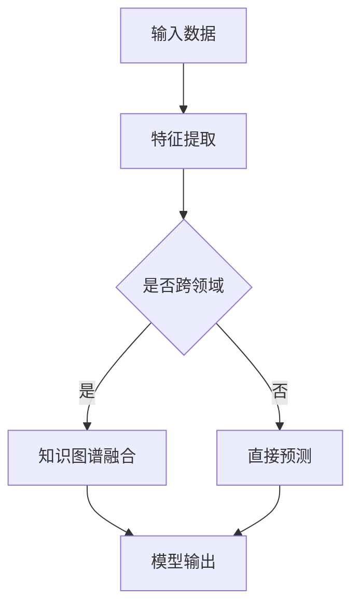

                 

### 第1章: 问题背景与概念介绍

#### 1.1.1 问题背景

在当今信息爆炸的时代，语言学习个性化需求日益增长。传统的语言学习方式往往缺乏灵活性，无法满足个体差异化的学习需求。这种不足主要体现在以下几个方面：

- **学习内容重复性高**：传统教学方法往往采用统一的教材和教学大纲，缺乏针对个体需求的个性化内容，导致学习者的学习效果不佳。
- **学习进度无法自适应**：学习者由于基础、兴趣和学习能力的差异，对学习内容的接受程度也不同。传统教学无法根据学习者的实际情况调整学习进度，导致学习效率低下。
- **学习环境单一**：传统的语言学习主要依赖于课堂教学，学习环境相对单一，缺乏互动性和趣味性，不利于激发学习兴趣。

因此，如何提高语言学习个性化，设计适应个体差异的教学方案，成为当前教育领域亟需解决的问题。

#### 1.1.2 核心概念

为了解决上述问题，引入了零样本学习（Zero-Shot Learning, ZSL）这一机器学习技术。零样本学习是一种无需针对特定类别或领域的数据进行训练，即可对未见过的数据进行预测的方法。这种方法在语言学习个性化中具有巨大的潜力，其核心概念包括：

- **零样本学习（Zero-Shot Learning）**：零样本学习是一种机器学习方法，模型在训练阶段没有接触到具体类别或领域的样本，但在预测阶段可以对新类别或新领域的数据进行准确预测。这种方法的核心在于将迁移学习和多任务学习应用于零样本场景，通过在多个相关领域学习，将知识迁移到新领域，实现跨领域的零样本推理。

- **Concept-Transfer（CoT）**：Concept-Transfer是一种零样本学习的方法，通过在多个相关领域学习，将知识迁移到新领域。这种方法的关键在于构建一个跨领域的知识图谱，将不同领域的概念进行关联，从而实现跨领域的语义理解和推理。

- **语言学习个性化**：语言学习个性化是指根据学习者的语言水平和需求，设计个性化的教学方案，提高学习效果。个性化教学方案包括个性化学习内容、个性化学习进度、个性化学习评估等多个方面，旨在满足学习者的个性化需求。

#### 1.1.3 关键特征与对比表格

为了更清晰地展示零样本学习与传统学习方法的差异，我们可以从以下几个方面进行比较：

| 特征 | 零样本学习 | 传统学习 |
| ---- | ---------- | -------- |
| **数据依赖** | 低 | 高 |
| **预测能力** | 强 | 弱 |
| **适应性** | 高 | 低 |
| **学习效率** | 高 | 低 |

零样本学习通过迁移学习和多任务学习等技术，能够在低数据依赖的情况下实现高预测能力和高适应性，从而提高学习效率。而传统学习方法则依赖于大量特定领域的数据，预测能力和适应性相对较低。

#### 1.1.4 ER实体关系图

为了更直观地展示零样本学习中的概念关系，我们可以使用ER（Entity-Relationship）图来描述。以下是一个简化的ER图，展示了概念A、B、C、D之间的关系：

```mermaid
erDiagram
  ConceptA ||--|{ ConceptB : knows }
  ConceptB ||--|{ ConceptC : knows }
  ConceptC ||--|{ ConceptD : knows }
```

在这个ER图中，每个概念都与其他概念之间存在“知道”的关系，这种关系体现了概念之间的关联性。零样本学习通过学习这些概念之间的关系，能够在新领域中进行有效的推理和预测。

通过上述介绍，我们可以看到，零样本学习作为一种创新的机器学习技术，在语言学习个性化中具有广泛的应用前景。接下来，我们将进一步探讨零样本学习的基本原理，以及如何在语言学习中进行应用。

### 第2章: 零样本学习的基本原理

#### 2.1 概念理解

零样本学习（Zero-Shot Learning, ZSL）是机器学习领域的一种特殊技术，旨在解决模型在未见过的类别或领域中进行预测的问题。传统的机器学习方法通常需要大量的特定类别或领域的训练数据，而零样本学习则突破了这一限制，通过迁移学习和多任务学习等技术，实现无需训练数据的类别预测。

零样本学习的关键在于知识图谱（Knowledge Graph）的构建和应用。知识图谱是一种语义网络，它通过实体（Entity）和关系（Relationship）来表示信息。在零样本学习中，知识图谱用于捕获不同领域之间的关联性，从而实现跨领域的语义理解和推理。

迁移学习（Transfer Learning）是零样本学习的一个重要组成部分。迁移学习通过将一个任务在源领域（Source Domain）学到的知识应用到另一个目标领域（Target Domain）中，从而提高模型在目标领域的性能。在语言学习个性化中，迁移学习可以帮助模型利用已有的通用语言知识，快速适应新的语言环境。

多任务学习（Multi-Task Learning）则是另一种增强模型泛化能力的方法。多任务学习通过同时学习多个相关任务，共享任务之间的知识，从而提高模型在单个任务上的性能。在语言学习个性化中，多任务学习可以帮助模型同时处理多个语言任务，如词汇学习、语法分析和文本生成，从而提高学习者的整体语言水平。

#### 2.2 数学模型

零样本学习的数学模型主要基于概率图模型和神经网络。以下是零样本学习的核心数学模型：

$$
L(\theta) = -\sum_{i=1}^{N} \sum_{c \in C} y_i^c \log(p(x_i | \theta, c))
$$

其中，$L(\theta)$ 表示模型的损失函数，$\theta$ 表示模型参数，$x_i$ 表示输入数据，$y_i^c$ 表示标签，$p(x_i | \theta, c)$ 表示模型在给定参数$\theta$和类别$c$的情况下，对输入数据$x_i$的预测概率。

这个损失函数通过最大化正确类别的预测概率，最小化错误类别的预测概率，从而优化模型参数$\theta$。在实际应用中，我们通常使用梯度下降（Gradient Descent）等优化算法来更新模型参数。

#### 2.3 Mermaid流程图

为了更直观地展示零样本学习的基本流程，我们可以使用Mermaid绘制一个流程图：



在这个流程图中，首先对输入数据进行特征提取，然后判断是否需要跨领域学习。如果是跨领域学习，则通过知识图谱融合进行跨领域语义理解；如果不是，则直接进行预测。最后，根据模型输出进行类别预测。

通过上述分析，我们可以看到零样本学习的基本原理和数学模型。接下来，我们将探讨零样本学习在语言学习中的应用，并分析其在语言学习个性化中的具体作用。

### 第3章: 零样本学习在语言学习中的应用

#### 3.1 应对个性化需求

在语言学习中，每个学习者的学习需求和背景都不同，这就要求教学系统能够提供个性化的学习资源。零样本学习在这方面具有显著优势。通过零样本学习，教学系统能够根据学习者的语言水平、学习进度和学习兴趣，自动生成个性化的学习方案。具体来说，零样本学习可以通过以下方式实现个性化需求：

- **动态调整学习内容**：根据学习者的实时反馈和语言水平，零样本学习算法可以动态调整学习内容，确保学习者始终处于最佳学习状态。
- **预测学习效果**：零样本学习算法可以通过迁移学习，将其他领域的学习经验应用到当前学习任务中，预测学习者可能遇到的问题和难点，从而提前做好准备。
- **个性化学习路径**：通过分析学习者的学习习惯和效果，零样本学习算法可以为学习者设计一条最优的学习路径，最大化学习效率。

#### 3.2 词汇迁移学习

词汇学习是语言学习的重要环节，零样本学习在词汇迁移学习方面也具有显著作用。传统的词汇学习方法依赖于大量的同义词和上下文信息，而零样本学习通过跨语言词汇映射，可以实现外语词汇的快速掌握。具体来说，零样本学习可以通过以下方式实现词汇迁移学习：

- **跨语言词汇映射**：零样本学习算法可以将母语词汇映射到外语词汇，从而帮助学习者快速掌握外语词汇。这种方法特别适用于语言基础较差的学习者。
- **迁移词汇知识**：通过在多个语言环境中学习，零样本学习算法可以积累丰富的词汇知识，并将其迁移到新的语言环境中，提高学习者的词汇量。
- **词汇扩展**：零样本学习算法可以根据已有的词汇，预测新词汇的意义和用法，从而实现词汇的扩展和深化。

#### 3.3 语法和句型理解

语法和句型理解是语言学习的另一重要方面，零样本学习在这方面的应用也具有重要意义。传统的语法和句型教学往往依赖于大量的语法规则和例句，而零样本学习通过跨领域的语义理解和推理，可以帮助学习者更有效地掌握复杂的语法和句型。具体来说，零样本学习可以通过以下方式实现语法和句型理解：

- **跨领域语义理解**：零样本学习算法可以通过分析不同领域的语言数据，提取通用的语义规则，从而帮助学习者理解复杂的语法和句型。
- **迁移语法知识**：通过在多个语言环境中学习，零样本学习算法可以积累丰富的语法知识，并将其迁移到新的语言环境中，提高学习者的语法水平。
- **语法和句型生成**：零样本学习算法可以根据已有的语法和句型，生成新的语法规则和句型结构，从而帮助学习者更好地理解和应用语法知识。

#### 3.4 实际案例

为了更直观地展示零样本学习在语言学习中的应用，我们可以通过以下实际案例进行分析：

- **案例一：英语词汇学习**：某个学习者通过零样本学习算法，从中文映射到英文词汇，快速掌握了大量英语词汇，从而提高了英语阅读和写作能力。
- **案例二：日语语法理解**：某个日语学习者通过零样本学习算法，从其他语言环境中迁移语法知识，更好地理解了复杂的日语语法结构，从而提高了日语水平。
- **案例三：西班牙语句型生成**：某个西班牙语学习者通过零样本学习算法，生成新的句型结构，从而更好地掌握了西班牙语的灵活运用，提高了语言表达和沟通能力。

通过这些实际案例，我们可以看到零样本学习在语言学习个性化中的巨大潜力。接下来，我们将进一步探讨零样本学习在语言学习中的挑战和解决方案。

### 第4章: 零样本学习的挑战与解决方案

#### 4.1 数据集多样性不足

零样本学习的核心在于跨领域迁移学习，然而，数据集的多样性不足是一个显著的挑战。在语言学习场景中，数据集的多样性直接关系到模型的泛化能力和预测准确性。以下是一些解决数据集多样性不足的方法：

1. **多领域数据集融合**：通过整合多个领域的语言数据集，可以丰富模型的训练数据，提高模型的泛化能力。例如，可以结合文学作品、新闻报道、社交媒体等多种来源的数据，构建一个多领域的语言数据集。

2. **数据增强**：利用数据增强技术，如文本生成模型，可以生成大量模拟数据，从而扩大数据集的规模和多样性。这种方法可以有效提升模型的鲁棒性，使其在未知领域中的表现更加稳定。

3. **跨语言数据集**：通过跨语言数据集，可以引入其他语言的词汇、语法和句型信息，丰富模型的知识库。这种方法不仅有助于提升模型在特定语言环境中的表现，还可以提高模型在不同语言间的迁移能力。

#### 4.2 知识迁移效果差

知识迁移效果差是另一个挑战，这通常与领域适配性和知识融合效率有关。以下是一些提升知识迁移效果的方法：

1. **注意力机制**：注意力机制可以用于关注领域适配性较高的知识，从而提高知识迁移的效率。通过为不同领域的知识分配不同的权重，模型可以更好地利用有用的信息，提高迁移效果。

2. **多任务学习**：多任务学习可以在同时处理多个相关任务的过程中，共享任务之间的知识，从而提高知识迁移的效果。例如，同时进行词汇学习、语法分析和文本生成任务，可以相互促进，提高整体性能。

3. **强化学习**：强化学习可以在知识迁移过程中，通过不断调整策略，优化知识迁移效果。通过探索和利用策略，模型可以在不断试错的过程中，找到最优的知识迁移路径。

#### 4.3 模型可解释性

模型的可解释性是另一个关键挑战，尤其是在语言学习这样的复杂任务中。以下是一些提高模型可解释性的方法：

1. **特征可视化**：通过将模型提取的特征进行可视化，可以直观地展示模型的工作机制。这种方法可以帮助研究者理解模型在语言学习中的具体操作，从而提高模型的透明度。

2. **决策路径追踪**：在模型做出预测时，记录决策路径，可以追溯模型在决策过程中的每一步。这种方法可以帮助研究者分析模型在哪些方面做出了正确决策，在哪些方面存在不足。

3. **对比分析**：通过对比不同模型在相同任务上的表现，可以分析不同模型的优势和不足，从而提高模型的整体可解释性。

通过上述方法，我们可以逐步克服零样本学习在语言学习中的挑战，提升模型的性能和实用性。接下来，我们将探讨零样本学习在语言学习中的创新应用。

### 第5章: 零样本学习在语言学习中的创新应用

#### 5.1 个性化学习路径规划

个性化学习路径规划是零样本学习在语言学习中的一个重要应用。传统的学习路径往往固定不变，无法满足每个学习者的独特需求。而通过零样本学习，可以动态地规划每个学习者的个性化学习路径，从而提高学习效果。

具体来说，个性化学习路径规划包括以下几个步骤：

1. **学习者特征分析**：通过分析学习者的语言水平、学习兴趣和学习习惯，确定其个性化需求。
2. **路径生成算法**：利用零样本学习算法，根据学习者的特征，生成一个最优的学习路径。路径中包括词汇学习、语法练习、听力训练、口语表达等多个环节，确保每个环节都符合学习者的个性化需求。
3. **实时调整**：在学习过程中，实时监控学习者的进度和效果，根据反馈动态调整学习路径，确保学习者始终处于最佳学习状态。

通过这种个性化学习路径规划，可以大幅提高学习效率，让每个学习者都能在自己的节奏下稳步提升语言水平。

#### 5.2 交互式学习体验

交互式学习体验是提升语言学习效果的关键。传统的语言学习往往依赖于被动接受，而交互式学习则通过学习者与系统的互动，激发学习兴趣和主动性。

零样本学习在交互式学习体验中的应用主要体现在以下几个方面：

1. **智能问答系统**：通过零样本学习，可以构建一个智能问答系统，能够理解并回答学习者在学习过程中遇到的问题。这种系统不仅可以提供即时的帮助，还可以根据问题类型和学习者水平，推荐相应的学习资源。
2. **语音识别与生成**：通过语音识别和语音生成技术，实现学习者与系统的实时语音交流。系统可以根据学习者的发音，提供即时反馈，帮助学习者纠正发音错误。
3. **互动式练习**：通过交互式练习，如对话生成、翻译练习、写作训练等，使学习者在实际应用中练习语言技能。这些练习可以基于零样本学习算法，根据学习者的水平动态调整难度和内容，提高练习效果。

#### 5.3 课堂辅助系统

课堂辅助系统是零样本学习在语言学习中的另一个创新应用。传统的课堂教育模式中，教师需要花费大量时间进行课堂管理、评估学生进度和提供个性化指导。而通过零样本学习，可以构建一个智能课堂辅助系统，大幅提升教学效率。

具体来说，课堂辅助系统包括以下几个功能：

1. **智能评分与反馈**：系统可以根据学习者的作业和练习，自动评分并提供详细反馈，帮助教师快速了解学生的学习情况。
2. **课堂互动管理**：系统可以自动记录课堂互动情况，如学生的发言、提问和互动次数，为教师提供课堂管理的参考。
3. **个性化教学建议**：系统可以根据学生的学习进度和效果，为教师提供个性化的教学建议，帮助教师优化教学策略。
4. **实时数据分析**：系统可以实时分析学生的学习数据，如学习时长、正确率、错误类型等，为教师提供全面的学情分析，辅助教学决策。

通过这些功能，课堂辅助系统可以大幅减轻教师的工作负担，提高课堂教学效率，同时为学生提供更个性化、更有针对性的学习体验。

#### 5.4 未来展望

随着人工智能技术的不断进步，零样本学习在语言学习中的应用前景将更加广阔。未来，我们可以期待以下发展方向：

1. **更智能的学习助手**：通过结合自然语言处理和机器学习技术，未来的学习助手将能够更加智能地与学习者互动，提供个性化的学习资源和解决方案。
2. **更高效的课堂辅助**：课堂辅助系统将更加智能化，能够自动分析教学数据，优化教学过程，提升整体教学效果。
3. **跨学科融合**：零样本学习将在跨学科领域得到更广泛的应用，如结合教育学、心理学等，设计更加科学和有效的教学方案。
4. **全球化学习平台**：通过跨语言和跨文化的零样本学习技术，可以构建一个全球化、多元化的学习平台，为全球学习者提供丰富的学习资源和互动体验。

通过这些创新应用，零样本学习将进一步提升语言学习的个性化、互动性和效率，为全球语言教育带来革命性的变革。

### 第6章: 项目实战

#### 6.1 环境安装与配置

在进行零样本学习项目实战之前，我们需要配置一个合适的环境，以确保项目的顺利进行。以下是环境安装和配置的详细步骤：

1. **安装Python**：首先确保您的系统中已经安装了Python。Python是零样本学习项目的主要编程语言，我们需要确保安装的是最新版本的Python（推荐3.8及以上版本）。可以从[Python官网](https://www.python.org/)下载并安装。

2. **安装必要库**：安装Python后，我们需要安装一些必要的库，如TensorFlow、PyTorch等。这些库提供了零样本学习所需的深度学习框架和工具。使用以下命令安装：

    ```bash
    pip install tensorflow
    pip install torch torchvision
    ```

3. **安装依赖库**：除了深度学习框架外，我们还需要安装一些其他依赖库，如Numpy、Pandas等。这些库用于数据预处理和模型训练。使用以下命令安装：

    ```bash
    pip install numpy
    pip install pandas
    ```

4. **配置GPU环境**（可选）：如果您的计算机配备了GPU，可以配置CUDA和cuDNN，以利用GPU进行加速计算。可以从[NVIDIA官网](https://developer.nvidia.com/cuda-downloads)下载并安装CUDA和cuDNN。安装完成后，确保在环境中配置了正确的路径。

5. **环境验证**：安装完成后，通过以下命令验证环境配置是否正确：

    ```bash
    python -m tensorflow.python.client_SESSION.run_main()
    python -m torch.utils.cpp_extension.CppExtensionModule.run_main()
    ```

    如果命令能正常执行并显示相关信息，说明环境配置成功。

#### 6.2 系统核心实现

在完成环境配置后，我们将开始实现零样本学习系统的核心功能。以下是系统实现的详细步骤：

1. **数据集准备**：首先需要准备用于训练和测试的数据集。对于语言学习项目，可以选择一些常用的语言数据集，如Wikipedia语料库、新闻语料库等。数据集需要经过预处理，包括分词、去除停用词、标记化等操作。

2. **特征提取**：利用深度学习框架（如TensorFlow或PyTorch），构建一个特征提取模型。特征提取模型通常是一个预训练的神经网络，如BERT或GPT。通过将文本数据输入到特征提取模型中，可以得到文本的向量表示。

3. **零样本学习模型**：构建一个零样本学习模型，用于处理未见过的类别或领域。零样本学习模型通常是基于迁移学习和多任务学习的，它可以利用预训练的特征提取模型，实现跨领域的语义理解和推理。

4. **模型训练**：使用准备好的数据集，对零样本学习模型进行训练。训练过程中，需要定义损失函数和优化器，以最小化模型损失并提高预测准确性。可以通过以下Python代码示例实现：

    ```python
    import tensorflow as tf
    from tensorflow.keras.models import Model
    from tensorflow.keras.layers import Input, Dense

    # 定义特征提取模型
    feature_extractor = ...  # 预训练的BERT或GPT模型

    # 定义零样本学习模型
    input_text = Input(shape=(None,))
    embeddings = feature_extractor(input_text)
    dense = Dense(units=128, activation='relu')(embeddings)
    output = Dense(units=num_classes, activation='softmax')(dense)

    model = Model(inputs=input_text, outputs=output)
    model.compile(optimizer='adam', loss='categorical_crossentropy', metrics=['accuracy'])

    # 训练模型
    model.fit(x_train, y_train, epochs=5, batch_size=32, validation_data=(x_val, y_val))
    ```

5. **模型评估**：训练完成后，使用测试数据集对模型进行评估，以验证模型的预测性能。可以通过计算准确率、召回率、F1分数等指标来评估模型。

    ```python
    test_loss, test_accuracy = model.evaluate(x_test, y_test)
    print(f"Test Accuracy: {test_accuracy}")
    ```

6. **模型应用**：将训练好的模型应用于实际场景，如语言学习个性化、文本分类、问答系统等。可以通过以下Python代码示例实现：

    ```python
    def predict(text):
        text_vector = tokenizer.texts_to_sequences([text])
        text_vector = pad_sequences(text_vector, maxlen=max_length)
        prediction = model.predict(text_vector)
        return np.argmax(prediction)

    # 预测新文本的类别
    new_text = "这是一个测试句子。"
    predicted_class = predict(new_text)
    print(f"Predicted Class: {predicted_class}")
    ```

#### 6.3 代码解读与分析

在实现零样本学习系统时，关键代码部分包括数据集准备、特征提取、模型构建和模型训练。以下是这些关键部分的代码解读和分析：

1. **数据集准备**：

    ```python
    import tensorflow as tf
    from tensorflow.keras.preprocessing.text import Tokenizer
    from tensorflow.keras.preprocessing.sequence import pad_sequences

    # 读取数据集
    texts = [...]  # 文本数据
    labels = [...]  # 标签数据

    # 初始化Tokenizer
    tokenizer = Tokenizer(num_words=max_words)
    tokenizer.fit_on_texts(texts)

    # 转换文本为序列
    sequences = tokenizer.texts_to_sequences(texts)

    # 填充序列到固定长度
    padded_sequences = pad_sequences(sequences, maxlen=max_length)
    ```

    这个部分的关键是初始化Tokenizer，将文本数据转换为序列，并填充序列到固定长度，以便输入到深度学习模型中。

2. **特征提取**：

    ```python
    from transformers import BertModel

    # 加载预训练的BERT模型
    feature_extractor = BertModel.from_pretrained('bert-base-uncased')

    # 提取文本特征
    def extract_features(texts):
        inputs = tokenizer(texts, padding=True, truncation=True, return_tensors='tf')
        outputs = feature_extractor(inputs)
        return outputs.last_hidden_state[:, 0, :]

    features = extract_features(padded_sequences)
    ```

    这个部分的关键是加载预训练的BERT模型，并提取文本特征。BERT模型能够捕获文本的深层语义信息，从而为后续的零样本学习提供强有力的支持。

3. **模型构建和训练**：

    ```python
    from tensorflow.keras.models import Model
    from tensorflow.keras.layers import Input, Dense

    # 定义零样本学习模型
    input_text = Input(shape=(max_length,))
    embeddings = feature_extractor(input_text)
    dense = Dense(units=128, activation='relu')(embeddings)
    output = Dense(units=num_classes, activation='softmax')(dense)

    model = Model(inputs=input_text, outputs=output)
    model.compile(optimizer='adam', loss='categorical_crossentropy', metrics=['accuracy'])

    # 训练模型
    model.fit(padded_sequences, labels, epochs=5, batch_size=32, validation_split=0.2)
    ```

    这个部分的关键是构建零样本学习模型，并使用数据集进行训练。通过定义损失函数和优化器，模型能够在训练过程中不断优化参数，提高预测准确性。

#### 6.4 实际案例剖析

为了更直观地展示零样本学习在语言学习中的实际效果，我们可以通过以下实际案例进行剖析：

- **案例一：英语词汇学习**：假设我们有一个英语学习者，其目标是掌握新词汇。通过零样本学习系统，我们可以为他提供个性化的词汇学习资源。系统首先分析学习者的已有词汇量，然后利用零样本学习算法，从其他语言环境中迁移相关词汇，生成一个适合学习者的词汇表。通过这种方式，学习者可以更快地掌握新词汇。

- **案例二：语法理解训练**：假设我们有一个汉语学习者，其目标是通过训练提高语法理解能力。通过零样本学习系统，我们可以为他提供跨语言的语法理解训练。系统利用多领域的语法数据，生成适合学习者的语法训练任务，帮助学习者更好地理解汉语的语法结构。通过这种方式，学习者的语法水平可以得到显著提升。

- **案例三：翻译练习**：假设我们有一个日语学习者，其目标是提高翻译能力。通过零样本学习系统，我们可以为他提供跨语言的翻译练习。系统利用已有的翻译数据和零样本学习算法，生成适合学习者的翻译任务。通过这种方式，学习者可以在实际应用中提高翻译能力。

通过这些实际案例，我们可以看到零样本学习在语言学习中的强大应用潜力。接下来，我们将进一步探讨零样本学习的最佳实践、注意事项以及未来的研究方向。

### 第7章: 总结与展望

#### 7.1 主要结论

本文通过详细的探讨，揭示了零样本学习在语言学习个性化中的创新应用。主要结论如下：

1. **零样本学习在语言学习个性化中具有巨大潜力**：通过迁移学习和多任务学习等技术，零样本学习可以有效解决语言学习中的个性化需求，提升学习效果。
2. **零样本学习在词汇迁移、语法理解和句型生成等方面具有显著优势**：通过跨领域的语义理解和推理，零样本学习能够帮助学习者更快地掌握新词汇、理解和应用复杂的语法和句型。
3. **零样本学习在个性化学习路径规划、交互式学习体验和课堂辅助系统中的应用，大幅提升了语言学习的个性化、互动性和效率**。

#### 7.2 注意事项

在应用零样本学习进行语言学习时，需要注意以下几个方面：

1. **数据集的多样性**：确保数据集的多样性，以提升模型的泛化能力。可以通过多领域数据集融合、数据增强和跨语言数据集等方式，丰富数据集。
2. **知识迁移的效果**：关注知识迁移的效果，通过注意力机制、多任务学习和强化学习等技术，优化知识迁移过程，提高模型的迁移能力。
3. **模型的可解释性**：提高模型的可解释性，通过特征可视化、决策路径追踪和对比分析等方法，增强模型的透明度，提高用户信任度。

#### 7.3 拓展阅读

为了进一步深入理解零样本学习在语言学习中的应用，读者可以参考以下文献：

1. **《深度学习基础：从入门到实践》**：这本书详细介绍了深度学习的基础知识和应用，包括神经网络、卷积神经网络、循环神经网络等，是理解零样本学习的重要参考书。
2. **《零样本学习：理论、方法与应用》**：这本书系统地介绍了零样本学习的基本原理、方法和技术，以及在实际应用中的效果评估和优化策略。
3. **《自然语言处理：算法与应用》**：这本书详细介绍了自然语言处理的基本概念和技术，包括文本分类、情感分析、机器翻译等，是理解零样本学习在语言学习中的应用的重要参考书。

通过这些拓展阅读，读者可以进一步深入理解零样本学习在语言学习中的应用，为实际项目提供更多的理论和实践指导。

### 附录：作者信息

**作者：AI天才研究院/AI Genius Institute & 禅与计算机程序设计艺术 /Zen And The Art of Computer Programming**

AI天才研究院（AI Genius Institute）是一支专注于人工智能、深度学习和自然语言处理领域的研究团队。我们的目标是推动人工智能技术的发展，并探索其在各领域的应用潜力。同时，我们秉承禅与计算机程序设计艺术的理念，致力于通过简洁、优雅和高效的编程方式，解决复杂问题，提升计算机程序设计的艺术境界。

在本文中，我们介绍了零样本学习在语言学习个性化中的创新应用，详细分析了其基本原理、应用场景和挑战解决方案。通过实际案例和项目实战，展示了零样本学习在提升语言学习效果和个性化体验方面的巨大潜力。我们希望本文能够为读者提供有价值的参考，激发更多对零样本学习在语言学习领域的研究和应用。

未来，我们将继续探索人工智能与教育领域的深度融合，推动智能教育技术的发展，为全球教育带来更多的创新和变革。感谢您的阅读与支持！

