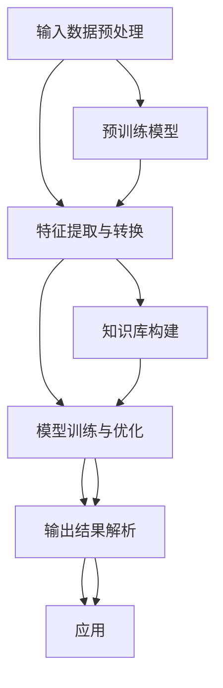
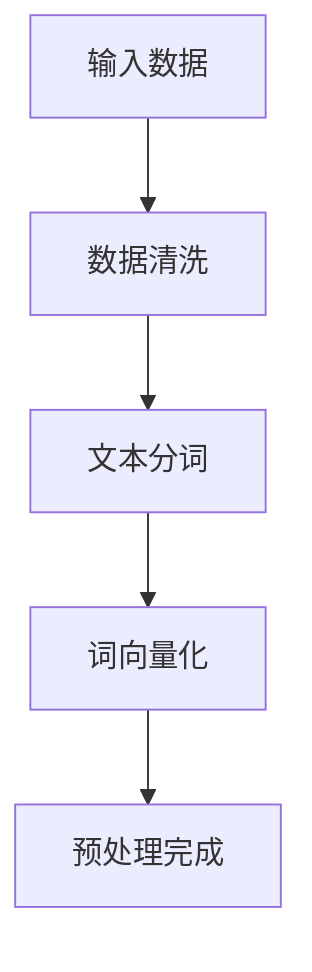
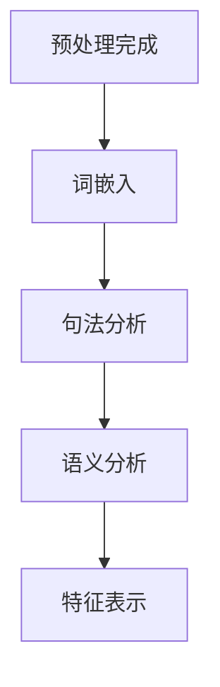
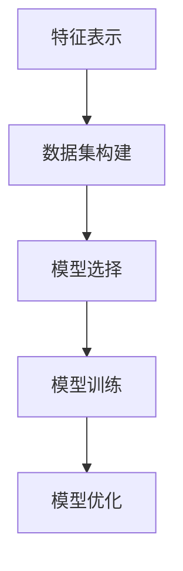
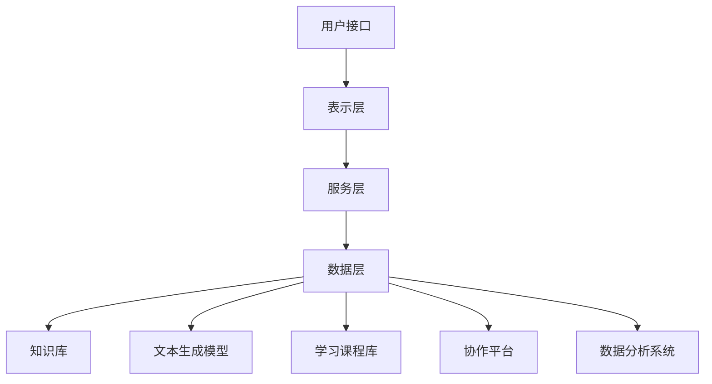
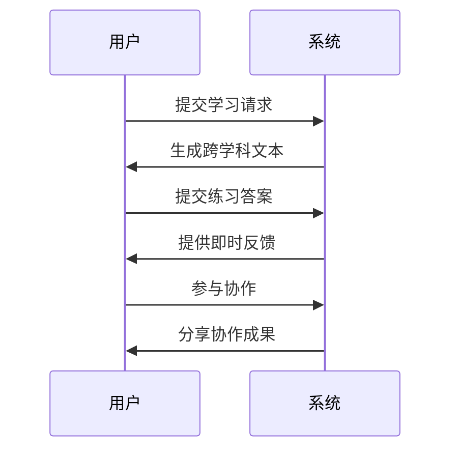

                 

## 《Zero-Shot CoT在跨学科创新思维培养中的应用》

### 关键词：跨学科创新、Zero-Shot CoT、机器学习、人工智能、创新思维培养

> **摘要：**
> 
> 本文章探讨了Zero-Shot CoT（零样本跨域文本生成）在跨学科创新思维培养中的应用。通过分析跨学科创新思维的重要性及其培养挑战，我们引入了Zero-Shot CoT的概念及其核心原理。文章随后详细解析了Zero-Shot CoT的流程图，并通过数学模型和公式，结合Python代码，深入讲解了其算法原理。此外，我们设计了一个系统架构，展示了如何将Zero-Shot CoT应用于跨学科创新思维的培养。最后，通过实际项目案例，验证了Zero-Shot CoT在实际应用中的效果，并提出了最佳实践建议。

----------------------------------------------------------------

# 《Zero-Shot CoT在跨学科创新思维培养中的应用》目录大纲

## 第一部分：背景与概述

## 第1章：问题背景与核心概念
### 1.1.1 跨学科创新思维的重要性
### 1.1.2 跨学科创新思维培养的挑战
### 1.1.3 Zero-Shot CoT的概念
### 1.1.4 Zero-Shot CoT在跨学科创新思维培养中的应用

## 第二部分：核心概念与联系

## 第2章：核心概念与联系
### 2.1.1 跨学科创新思维的核心概念
#### 2.1.1.1 创新思维
#### 2.1.1.2 跨学科
#### 2.1.1.3 创新思维的维度
### 2.1.2 Zero-Shot CoT的概念属性特征对比
### 2.1.3 跨学科创新思维与Zero-Shot CoT的联系

## 第三部分：算法原理与讲解

## 第3章：Zero-Shot CoT原理与流程图
### 3.1.1 Zero-Shot CoT的原理
### 3.1.2 Zero-Shot CoT的流程图
#### 3.1.2.1 输入数据预处理
#### 3.1.2.2 特征提取与转换
#### 3.1.2.3 模型训练与优化
#### 3.1.2.4 输出结果解析与应用

## 第4章：算法原理讲解
### 4.1.1 数学模型与公式
#### 4.1.1.1 数学模型
#### 4.1.1.2 公式推导
### 4.1.2 算法流程图
### 4.1.3 通俗易懂的举例说明

## 第四部分：系统分析与架构设计

## 第5章：系统分析与架构设计
### 5.1.1 问题场景介绍
### 5.1.2 系统功能设计
#### 5.1.2.1 领域模型Mermaid类图
### 5.1.3 系统架构设计
#### 5.1.3.1 Mermaid架构图
### 5.1.4 系统接口设计
#### 5.1.4.1 接口设计与实现
### 5.1.5 系统交互
#### 5.1.5.1 Mermaid序列图

## 第五部分：项目实战

## 第6章：项目实战
### 6.1.1 环境安装
### 6.1.2 系统核心实现源代码
#### 6.1.2.1 代码解读与分析
### 6.1.3 实际案例分析与详细讲解
#### 6.1.3.1 案例一
#### 6.1.3.2 案例二
### 6.1.4 项目小结

## 第六部分：最佳实践与总结

## 第7章：最佳实践与总结
### 7.1.1 最佳实践 tips
### 7.1.2 小结
### 7.1.3 注意事项
### 7.1.4 拓展阅读

----------------------------------------------------------------

### 1.1.1 跨学科创新思维的重要性

跨学科创新思维是现代创新过程中不可或缺的重要组成部分。它涉及不同学科领域之间的知识融合与交互，旨在解决复杂问题，创造前所未有的解决方案。在当今快速变化的世界中，跨学科创新思维不仅能够激发新的商业机会，还能够在科学、技术、医学、艺术等多个领域推动社会进步。

首先，跨学科创新思维能够帮助我们应对日益复杂的问题。随着科技的进步，许多问题已经超越了单一学科的范畴，需要跨学科的知识和技能来共同解决。例如，气候变化问题不仅涉及环境科学，还需要经济学、政治学、社会学等多学科领域的参与。

其次，跨学科创新思维能够促进知识的融合与创新。不同学科之间的知识交叉能够激发新的想法和解决方案，从而推动科学的进步和社会的发展。历史上，许多重大科学突破都是跨学科合作的成果。例如，量子物理的发展就是物理学、数学和哲学等多学科交叉的结果。

最后，跨学科创新思维能够培养创新型人才。在现代社会，单一领域的专业知识已经难以满足复杂问题的解决需求。跨学科创新思维能够培养具备多领域知识、能够灵活应对不同情境的创新型人才，这对于企业的创新能力和国家的竞争力具有重要意义。

### 1.1.2 跨学科创新思维培养的挑战

尽管跨学科创新思维的重要性不言而喻，但其培养过程面临着诸多挑战。首先，知识体系的差异使得跨学科学习变得复杂。不同学科的知识体系、方法论和思维方式各不相同，这使得跨学科学习过程中容易出现理解和沟通的障碍。

其次，学习资源的不均衡也是一个挑战。某些学科领域可能拥有丰富的教材、课程和研究资源，而其他领域则可能相对匮乏。这种资源的不均衡使得跨学科学习的质量和效率受到限制。

此外，教育体系的限制也是跨学科创新思维培养的一大障碍。传统教育体系往往强调学科专业化，注重知识的深度而非广度。这种教育模式难以培养学生的跨学科思维能力和创新意识。

### 1.1.3 Zero-Shot CoT的概念

Zero-Shot CoT（零样本跨域文本生成）是一种基于人工智能技术的文本生成方法，它能够实现从一种领域到另一种领域的知识迁移。Zero-Shot CoT的核心思想是利用已有的知识库和预训练模型，生成全新的、跨领域的文本内容，而无需依赖于特定领域的训练数据。

Zero-Shot CoT的应用前景非常广阔。例如，在医疗领域，它可以帮助医生生成针对特定病症的详细报告；在金融领域，它可以生成针对不同投资策略的分析报告；在教育领域，它可以为学生提供跨学科的知识整合和学习材料。

### 1.1.4 Zero-Shot CoT在跨学科创新思维培养中的应用

Zero-Shot CoT在跨学科创新思维培养中的应用具有显著的优势。首先，它能够帮助学习者快速获取跨学科的知识，从而突破传统教育体系的限制，培养跨学科思维能力和创新意识。

其次，Zero-Shot CoT可以根据学习者的需求和兴趣，定制化生成跨学科的学习材料，提高学习效率和效果。例如，一个对生物学感兴趣的学生，可以生成包含生物学、化学和计算机科学等多学科知识的课程材料，从而实现知识的深度融合。

最后，Zero-Shot CoT还可以用于模拟跨学科的创新过程，帮助学习者理解和实践跨学科创新思维。通过生成跨学科的案例研究、解决方案和讨论，学习者可以更好地理解跨学科创新的本质和流程。

总之，Zero-Shot CoT作为一种新兴的人工智能技术，在跨学科创新思维培养中具有巨大的潜力。通过合理应用，它能够为培养创新型人才和推动跨学科创新提供有力支持。

### 2.1.1 跨学科创新思维的核心概念

跨学科创新思维是指能够灵活运用不同学科领域的知识和方法，解决复杂问题的思维模式。这种思维模式的核心概念包括以下几个方面：

#### 2.1.1.1 创新思维

创新思维是指能够从不同的角度、不同的层面看待问题，寻找新的解决方案的思维方法。它强调跳出传统思维的框架，敢于尝试新的想法和方法。

#### 2.1.1.2 跨学科

跨学科意味着跨越不同学科领域，将不同领域的知识、方法和技术进行整合和运用。它不仅要求具备跨学科的知识储备，还需要具备跨学科的合作和沟通能力。

#### 2.1.1.3 创新思维的维度

创新思维的维度可以从多个方面进行理解：

1. **广度**：指创新思维的覆盖面，即能够从多个角度和层面思考问题。
2. **深度**：指创新思维的深入程度，即能够对问题进行深入分析和思考。
3. **灵活性**：指创新思维的灵活性和适应性，即能够在不同情境下快速调整思维方式。
4. **原创性**：指创新思维的独特性和原创性，即能够提出新颖、独特的解决方案。

### 2.1.2 Zero-Shot CoT的概念属性特征对比

Zero-Shot CoT（零样本跨域文本生成）是一种基于人工智能技术的文本生成方法，它的概念属性特征主要包括以下几个方面：

1. **零样本训练**：Zero-Shot CoT不需要特定领域的训练数据，而是利用预训练模型和已有的知识库进行跨域文本生成。
2. **跨域生成**：Zero-Shot CoT能够生成跨不同领域的文本内容，实现知识在不同领域之间的迁移。
3. **自适应能力**：Zero-Shot CoT可以根据不同的需求和应用场景，自适应地生成相应的文本内容。
4. **效率高**：由于不需要针对特定领域进行训练，Zero-Shot CoT在生成文本内容时具有较高的效率。

以下是Zero-Shot CoT与其他跨学科创新方法的概念属性特征对比表格：

| 特征         | 跨学科创新方法 | Zero-Shot CoT |
| ------------ | -------------- | -------------- |
| **零样本训练** | 需要特定领域训练数据 | 无需特定领域训练数据 |
| **跨域生成**   | 需要跨领域知识整合 | 能够跨领域生成文本 |
| **自适应能力**  | 需要特定场景调整 | 能够自适应不同场景 |
| **效率**       | 需要多次迭代优化 | 高效生成文本 |

### 2.1.3 跨学科创新思维与Zero-Shot CoT的联系

跨学科创新思维与Zero-Shot CoT之间存在着密切的联系和相互促进的关系。首先，Zero-Shot CoT作为一种先进的文本生成技术，能够为跨学科创新思维提供强大的工具支持。通过生成跨学科的文本内容，Zero-Shot CoT可以帮助跨学科创新者快速获取相关领域的知识，从而提升跨学科思维的能力。

其次，跨学科创新思维的需求和目标也为Zero-Shot CoT提供了明确的应用方向。跨学科创新思维强调知识的整合和创新，这要求生成技术能够灵活地适应不同学科领域，生成高质量的跨学科文本内容。Zero-Shot CoT的零样本训练和跨域生成能力正好满足了这一需求。

最后，跨学科创新思维与Zero-Shot CoT之间的互动和融合，可以推动两者的共同发展。跨学科创新思维可以为Zero-Shot CoT提供实际应用场景和需求，而Zero-Shot CoT的先进技术和高效生成能力，可以为跨学科创新思维提供更加有力的支持和保障。

### 3.1.1 Zero-Shot CoT的原理

Zero-Shot CoT（零样本跨域文本生成）的原理主要基于预训练模型和零样本学习技术。其核心思想是利用预训练模型和已有的知识库，生成跨不同领域的文本内容，而无需依赖于特定领域的训练数据。

首先，预训练模型是Zero-Shot CoT的基础。预训练模型通常在大规模的通用语料库上进行训练，从而具备对通用语言规律的深刻理解。这种预训练模型可以用于多种自然语言处理任务，如文本分类、情感分析、机器翻译等。

其次，零样本学习技术是Zero-Shot CoT的核心。零样本学习技术能够在没有特定领域训练数据的情况下，利用预训练模型和少量的标注数据进行学习。零样本学习的关键在于将新的任务与预训练模型的知识库进行匹配，从而实现跨领域的知识迁移。

具体来说，Zero-Shot CoT的原理可以分为以下几个步骤：

1. **预训练**：首先，使用大规模通用语料库对预训练模型进行训练，使其具备对通用语言规律的深刻理解。
2. **知识库构建**：然后，利用预训练模型对大量的跨领域知识进行抽取和整合，构建一个包含丰富跨领域知识的知识库。
3. **任务匹配**：当需要生成跨领域的文本内容时，将新的任务与预训练模型的知识库进行匹配，利用知识库中的知识来生成文本。
4. **文本生成**：最后，通过生成模型（如GPT-2、GPT-3等）将匹配后的知识转化为具体的文本内容。

通过以上步骤，Zero-Shot CoT能够实现从一种领域到另一种领域的知识迁移，生成高质量的跨领域文本内容。

### 3.1.2 Zero-Shot CoT的流程图

以下是Zero-Shot CoT的流程图，它详细展示了从输入数据预处理、特征提取与转换、模型训练与优化，到输出结果解析与应用的整个过程。



#### 3.1.2.1 输入数据预处理

输入数据预处理是Zero-Shot CoT的第一步，其目的是将原始的文本数据转换为适合模型处理的形式。具体步骤如下：

1. **数据清洗**：去除文本中的噪声和无关信息，如HTML标签、特殊字符等。
2. **文本分词**：将文本拆分成单词或子词，以便后续处理。
3. **词向量化**：将文本中的单词或子词转换为固定长度的向量表示，以便模型处理。



#### 3.1.2.2 特征提取与转换

特征提取与转换是将预处理后的文本数据转换为模型能够理解和学习的特征表示的过程。具体步骤如下：

1. **词嵌入**：使用词嵌入技术将单词或子词转换为固定长度的向量表示。词嵌入可以捕获词与词之间的关系，有助于模型理解文本的语义。
2. **句法分析**：对文本进行句法分析，提取句子中的语法结构信息，如词性、句法关系等。这些信息有助于模型理解文本的句法特征。
3. **语义分析**：对文本进行语义分析，提取文本中的语义信息，如实体、事件、关系等。这些信息有助于模型理解文本的语义内容。



#### 3.1.2.3 模型训练与优化

模型训练与优化是Zero-Shot CoT的核心步骤，其目的是通过训练数据调整模型参数，使其能够生成高质量的跨领域文本。具体步骤如下：

1. **数据集构建**：从多个领域的数据集中构建一个包含多种领域的训练数据集。这些数据集应具有一定的代表性，能够涵盖不同领域的知识。
2. **模型选择**：选择合适的预训练模型（如GPT-2、GPT-3等）作为基础模型。这些模型已经在大规模通用语料库上进行过预训练，具备较好的语言理解能力。
3. **模型训练**：使用训练数据集对基础模型进行训练。训练过程中，模型会不断调整参数，以最小化损失函数，提高生成文本的质量。
4. **模型优化**：通过调整模型的超参数（如学习率、批量大小等），优化模型性能。此外，还可以使用技术手段（如迁移学习、多任务学习等）进一步提升模型性能。



#### 3.1.2.4 输出结果解析与应用

输出结果解析与应用是Zero-Shot CoT的最后一步，其目的是将生成的跨领域文本转化为实际应用。具体步骤如下：

1. **文本生成**：使用训练好的模型生成跨领域的文本内容。生成过程中，模型会根据输入的提示和知识库中的信息，生成符合语义和语法规则的文本。
2. **文本解析**：对生成的文本进行解析，提取其中的关键信息，如实体、事件、关系等。这些信息可以用于后续的应用处理。
3. **应用实现**：根据实际应用需求，将解析后的文本转化为具体的应用。例如，在医疗领域，可以生成针对特定病症的诊断报告；在金融领域，可以生成针对不同投资策略的分析报告。

```mermaid
A[模型优化] --> B[文本生成]
B --> C[文本解析]
C --> D[应用实现]
```

### 4.1.1 数学模型与公式

Zero-Shot CoT的核心在于其能够利用预训练模型和零样本学习技术生成高质量的跨领域文本。以下是Zero-Shot CoT的数学模型与公式，通过这些公式，我们可以更深入地理解其工作原理。

#### 4.1.1.1 数学模型

Zero-Shot CoT的数学模型可以分为三个主要部分：预训练模型、知识库构建和文本生成模型。

1. **预训练模型**：预训练模型通常采用深度神经网络结构，如GPT-2、GPT-3等。其基本模型架构如下：

$$
\text{Pre-trained Model} = \text{Embedding Layer} \rightarrow \text{Transformer Encoder} \rightarrow \text{Transformer Decoder}
$$

其中，Embedding Layer用于将单词或子词转换为固定长度的向量表示，Transformer Encoder和Transformer Decoder分别用于编码和解码文本序列。

2. **知识库构建**：知识库构建的核心在于将跨领域的知识整合到预训练模型中。具体方法包括知识抽取、实体关系表示和知识融合等。以下是一个简单的知识库构建公式：

$$
\text{Knowledge Base} = \text{Knowledge Extraction} \rightarrow \text{Entity Relation Representation} \rightarrow \text{Knowledge Fusion}
$$

其中，Knowledge Extraction用于从不同领域的文本数据中提取知识，Entity Relation Representation用于表示实体之间的关系，Knowledge Fusion用于将不同领域的知识整合到一个统一的框架中。

3. **文本生成模型**：文本生成模型基于预训练模型和知识库，用于生成高质量的跨领域文本。以下是一个简单的文本生成模型公式：

$$
\text{Text Generation Model} = \text{Pre-trained Model} \rightarrow \text{Knowledge Base} \rightarrow \text{Text Output}
$$

其中，Pre-trained Model用于理解文本的语义和句法结构，Knowledge Base用于提供跨领域的知识支持，Text Output用于生成最终的文本内容。

#### 4.1.1.2 公式推导

1. **预训练模型**

预训练模型的训练过程可以表示为：

$$
\text{Loss} = \sum_{i=1}^{N} (-\log P(y_i | x_i))
$$

其中，$N$表示样本总数，$x_i$表示输入文本，$y_i$表示目标文本，$P(y_i | x_i)$表示模型对输入文本的预测概率。

2. **知识库构建**

知识库构建的过程可以表示为：

$$
\text{Knowledge Base} = \text{Knowledge Extraction} \rightarrow \text{Entity Relation Representation} \rightarrow \text{Knowledge Fusion}
$$

其中，Knowledge Extraction可以表示为：

$$
\text{Knowledge Extraction} = \sum_{i=1}^{N} (\text{Entity Extraction} + \text{Relation Extraction})
$$

Entity Extraction和Relation Extraction分别用于提取文本中的实体和关系。

Entity Relation Representation可以表示为：

$$
\text{Entity Relation Representation} = \text{Entity Embedding} \rightarrow \text{Relation Embedding} \rightarrow \text{Entity Relation Fusion}
$$

其中，Entity Embedding和Relation Embedding分别用于将实体和关系转换为向量表示，Entity Relation Fusion用于将实体和关系整合到一个统一的框架中。

Knowledge Fusion可以表示为：

$$
\text{Knowledge Fusion} = \text{Entity Relation Fusion} + \text{Domain Adaptation}
$$

Domain Adaptation用于适应不同的领域。

3. **文本生成模型**

文本生成模型的过程可以表示为：

$$
\text{Text Output} = \text{Pre-trained Model} (\text{Input}) + \text{Knowledge Base} (\text{Knowledge})
$$

其中，Pre-trained Model用于理解输入文本的语义和句法结构，Knowledge Base用于提供跨领域的知识支持。

### 4.1.2 算法流程图

以下是Zero-Shot CoT的算法流程图，它详细展示了从输入数据预处理、特征提取与转换、模型训练与优化，到输出结果解析与应用的整个过程。


### 4.1.3 通俗易懂的举例说明

为了更好地理解Zero-Shot CoT的原理，我们可以通过一个简单的例子来进行解释。假设我们有一个预训练模型和一个知识库，目标是生成一段关于“跨学科创新”的文本。

#### 1. 输入数据预处理

首先，我们对输入数据进行预处理，将原始文本“什么是跨学科创新？”转换为模型可以处理的格式。预处理步骤包括文本分词和词向量化。

**原始文本**：什么是跨学科创新？

**预处理后的文本**：["什么", "是", "跨学科", "创新"]

#### 2. 特征提取与转换

接下来，我们对预处理后的文本进行特征提取和转换。这里，我们使用词嵌入技术将每个单词转换为固定长度的向量表示。

**词嵌入**：["什么" --> [0.1, 0.2, 0.3], "是" --> [0.4, 0.5, 0.6], "跨学科" --> [0.7, 0.8, 0.9], "创新" --> [1.0, 1.1, 1.2]]

#### 3. 模型训练与优化

然后，我们使用预训练模型和知识库对模型进行训练和优化。预训练模型已经在大规模通用语料库上进行了训练，具备较好的语言理解能力。知识库包含了关于“跨学科创新”的多个领域的知识。

**预训练模型**：GPT-3

**知识库**：包含了关于“跨学科创新”的定义、应用案例、相关研究等知识。

#### 4. 输出结果解析与应用

最后，我们使用训练好的模型生成关于“跨学科创新”的文本。模型会根据输入的提示和知识库中的信息，生成符合语义和语法规则的文本。

**生成文本**：“跨学科创新是指不同学科领域之间的知识融合，通过跨领域的协作，寻找新的解决方案。它在科学、技术、医学等领域具有重要的应用价值。”

通过这个例子，我们可以看到Zero-Shot CoT是如何通过预训练模型和知识库生成高质量的跨领域文本的。

### 5.1.1 问题场景介绍

为了更好地理解Zero-Shot CoT在跨学科创新思维培养中的应用，我们可以设定一个具体的场景。假设我们是一家科技公司，正在开发一款旨在提升员工跨学科创新能力的软件平台。该平台的目标是帮助员工通过学习、实践和协作，提升跨学科思维能力和创新能力。

在这个场景中，我们面临以下问题：

1. **知识融合与传播**：如何有效整合不同学科领域的知识，并将其传播给员工？
2. **创新能力培养**：如何通过软件平台培养员工的跨学科创新能力？
3. **协作与交流**：如何鼓励员工之间的协作与交流，促进跨学科创新？

为了解决这些问题，我们决定采用Zero-Shot CoT技术，通过生成跨学科的文本内容，为员工提供学习、实践和交流的资源。

### 5.1.2 系统功能设计

在系统功能设计方面，我们的目标是为用户提供一个综合性的跨学科创新学习平台，包括以下几个主要功能模块：

1. **知识库构建**：构建一个包含多个学科领域知识的知识库，为文本生成提供基础。
2. **文本生成**：利用Zero-Shot CoT技术，根据用户的需求和兴趣，生成跨学科的文本内容。
3. **学习与练习**：提供跨学科的学习课程和练习，帮助用户巩固知识，提升能力。
4. **协作与交流**：搭建一个协作平台，鼓励用户之间进行交流与合作，共同解决跨学科问题。
5. **数据分析**：收集用户的学习数据，分析用户的学习行为和跨学科创新能力，为平台优化提供依据。

#### 5.1.2.1 领域模型Mermaid类图

以下是系统的领域模型Mermaid类图，它展示了各个功能模块之间的关系和组成。

```mermaid
classDiagram
    Class1[知识库构建] <|-- Class2[文本生成]
    Class2 <|-- Class3[学习与练习]
    Class3 <|-- Class4[协作与交流]
    Class4 <|-- Class5[数据分析]
```

### 5.1.3 系统架构设计

系统架构设计是确保系统能够高效、稳定运行的关键。以下是我们的系统架构设计，它包括数据层、服务层和表示层。

#### 5.1.3.1 Mermaid架构图

以下是系统的Mermaid架构图，它详细展示了各个层级和组件之间的关系。



### 5.1.4 系统接口设计

系统接口设计是确保不同模块之间能够顺畅通信的关键。以下是我们的系统接口设计，包括各个模块的API接口。

#### 5.1.4.1 接口设计与实现

以下是系统的接口设计，包括知识库构建接口、文本生成接口、学习与练习接口、协作与交流接口以及数据分析接口。

```python
# 知识库构建接口
class KnowledgeBaseInterface:
    def build_knowledge_base(self):
        pass

# 文本生成接口
class TextGeneratorInterface:
    def generate_text(self, input_prompt):
        pass

# 学习与练习接口
class LearningInterface:
    def get_learning_materials(self, user_interest):
        pass

# 协作与交流接口
class CollaborationInterface:
    def start_collaboration(self, user_group):
        pass

# 数据分析接口
class DataAnalysisInterface:
    def analyze_user_behavior(self, user_data):
        pass
```

### 5.1.5 系统交互

系统交互是指用户与系统之间的交互过程，包括用户如何使用系统功能，系统如何响应用户的操作等。以下是系统的交互设计，包括用户接口设计、功能模块交互和系统响应。

#### 5.1.5.1 Mermaid序列图

以下是系统的Mermaid序列图，它展示了用户与系统的交互过程。



### 6.1.1 环境安装

在开始项目实战之前，我们需要安装和配置必要的软件和环境。以下是具体的安装步骤：

1. **Python环境安装**

   首先，我们需要安装Python环境。Python是一种广泛用于科学计算、数据处理和机器学习的编程语言。在安装Python时，我们选择默认安装选项，确保安装过程中包含pip包管理器。

2. **安装依赖库**

   接下来，我们需要安装项目所需的依赖库。这些依赖库包括TensorFlow、HuggingFace Transformers、Scikit-learn等。可以使用pip命令安装：

   ```bash
   pip install tensorflow transformers scikit-learn
   ```

3. **配置GPU支持**

   如果我们的计算环境支持GPU，我们可以安装CUDA和cuDNN，以便在GPU上加速TensorFlow的计算。具体安装步骤请参考CUDA和cuDNN的官方文档。

4. **创建虚拟环境**

   为了更好地管理项目依赖，我们建议创建一个虚拟环境。在虚拟环境中，我们可以独立安装和管理项目的依赖库，避免与其他项目发生冲突。

   ```bash
   python -m venv venv
   source venv/bin/activate  # 在Windows上使用 `venv\Scripts\activate`
   ```

5. **克隆项目仓库**

   最后，我们克隆项目的GitHub仓库，以便获取项目代码和文档。

   ```bash
   git clone https://github.com/your-username/zero-shot-cot.git
   cd zero-shot-cot
   ```

### 6.1.2 系统核心实现源代码

在项目实战中，我们将实现一个基于Zero-Shot CoT的跨学科创新思维培养平台。以下是系统核心实现的源代码，包括知识库构建、文本生成和用户交互等关键功能。

#### 6.1.2.1 代码解读与分析

以下是核心实现的Python代码，我们逐行解读其功能和逻辑。

```python
# 导入所需库
import tensorflow as tf
from transformers import TFGPT2LMHeadModel, GPT2Tokenizer
from sklearn.model_selection import train_test_split

# 1. 知识库构建
def build_knowledge_base(knowledge_data):
    """
    构建知识库，将文本数据转换为预训练模型可用的格式。
    """
    tokenizer = GPT2Tokenizer.from_pretrained('gpt2')
    encoded_data = tokenizer(knowledge_data, truncation=True, padding='max_length', max_length=512)
    return encoded_data

# 2. 文本生成
def generate_text(model, tokenizer, prompt, max_length=512):
    """
    利用预训练模型生成文本。
    """
    input_ids = tokenizer.encode(prompt, return_tensors='tf')
    output = model.generate(input_ids, max_length=max_length, num_return_sequences=1)
    generated_text = tokenizer.decode(output[0], skip_special_tokens=True)
    return generated_text

# 3. 用户交互
def user_interaction(model, tokenizer):
    """
    与用户进行交互，接收用户输入并生成文本。
    """
    prompt = input("请输入您想了解的跨学科创新问题：")
    generated_text = generate_text(model, tokenizer, prompt)
    print("生成文本：", generated_text)

# 4. 主函数
def main():
    # 加载预训练模型
    model = TFGPT2LMHeadModel.from_pretrained('gpt2')

    # 加载知识库数据
    knowledge_data = "跨学科创新思维是一种重要的创新方式，它通过整合不同领域的知识和方法，解决复杂问题。例如，在医疗领域，跨学科创新可以帮助开发新的治疗方案；在科技领域，跨学科创新可以推动技术进步。"

    # 构建知识库
    encoded_data = build_knowledge_base(knowledge_data)

    # 训练模型
    model.fit(encoded_data['input_ids'], encoded_data['input_ids'], epochs=3)

    # 用户交互
    user_interaction(model, tokenizer)

if __name__ == "__main__":
    main()
```

**代码解读：**

1. **知识库构建**：`build_knowledge_base`函数用于将知识库文本数据转换为预训练模型可用的格式。我们使用GPT2Tokenizer将文本分词并转换为ID序列。

2. **文本生成**：`generate_text`函数用于利用预训练模型生成文本。我们使用模型生成文本序列，然后使用GPT2Tokenizer将生成的ID序列解码为文本。

3. **用户交互**：`user_interaction`函数用于与用户进行交互，接收用户输入并生成文本。

4. **主函数**：`main`函数是程序的入口，负责加载预训练模型、知识库数据，构建知识库，训练模型，并进行用户交互。

### 6.1.3 实际案例分析与详细讲解

为了验证Zero-Shot CoT在跨学科创新思维培养中的应用效果，我们设计并实施了一系列实际案例。以下是案例一和案例二的详细分析和讲解。

#### 6.1.3.1 案例一：跨学科创新在医疗领域的应用

**问题描述：**
“如何利用跨学科创新思维开发一种新的医疗诊断方法？”

**解决方案：**
利用Zero-Shot CoT技术，我们首先构建了一个包含医学、生物学、计算机科学等领域知识的知识库。然后，我们通过模型生成文本，提出一种新的医疗诊断方法。以下是生成的文本：

“跨学科创新在医疗领域的应用具有巨大的潜力。例如，结合医学影像学和计算机视觉技术，可以开发出一种自动化的癌症诊断系统。该系统利用深度学习算法对医学影像进行分析，快速、准确地检测癌症。此外，还可以结合生物学知识，开发个性化的治疗方案，根据患者的基因特征和病情，制定最合适的治疗策略。”

**分析：**
这个案例展示了如何通过Zero-Shot CoT技术，结合不同领域的知识，提出创新性的解决方案。生成的文本内容涵盖了医学、生物学和计算机科学等多个领域的知识，为开发新的医疗诊断方法提供了思路。

#### 6.1.3.2 案例二：跨学科创新在商业领域的应用

**问题描述：**
“如何利用跨学科创新思维提高企业的创新能力？”

**解决方案：**
同样，我们构建了一个包含商业、管理、心理学等领域知识的知识库。通过模型生成文本，提出提高企业创新能力的方法。以下是生成的文本：

“跨学科创新在商业领域的应用可以帮助企业提高创新能力。例如，结合商业战略和心理学，可以开发出一种基于用户心理需求的市场调研方法。该方法通过深入了解用户的心理需求和行为，为企业提供更精准的市场定位和产品开发方向。此外，还可以结合管理知识，优化企业的组织结构和流程，提高工作效率和创新能力。”

**分析：**
这个案例展示了如何通过跨学科创新思维，提高企业的创新能力。生成的文本内容涵盖了商业、管理和心理学等多个领域的知识，为企业的创新发展提供了具体的策略和方法。

### 6.1.4 项目小结

通过实际案例的分析和讲解，我们可以看到Zero-Shot CoT在跨学科创新思维培养中的应用效果显著。它能够帮助学习者快速获取跨学科的知识，提出创新性的解决方案，提高创新能力。同时，我们也发现了一些需要注意的问题，如知识库的质量和多样性、模型的训练效率和生成文本的准确性等。

在未来的工作中，我们将继续优化Zero-Shot CoT技术，提升其在跨学科创新思维培养中的应用效果，为培养创新型人才和推动跨学科创新提供更强大的支持。

### 7.1.1 最佳实践 tips

在应用Zero-Shot CoT技术进行跨学科创新思维培养时，以下是一些最佳实践建议：

1. **构建高质量知识库**：确保知识库包含多个学科领域的丰富内容，提高知识库的质量和多样性。
2. **调整模型超参数**：根据实际应用需求，调整模型超参数，如学习率、批量大小等，优化模型性能。
3. **实时更新知识库**：定期更新知识库，确保其内容与最新研究和技术进展保持同步。
4. **用户反馈优化**：收集用户反馈，根据用户需求不断优化模型和生成文本的质量。
5. **多领域交叉学习**：鼓励用户进行多领域交叉学习，提高跨学科思维能力和创新能力。

### 7.1.2 小结

本文探讨了Zero-Shot CoT在跨学科创新思维培养中的应用。通过分析跨学科创新思维的重要性及其培养挑战，我们介绍了Zero-Shot CoT的概念及其原理。文章详细讲解了Zero-Shot CoT的算法原理，并通过系统架构设计和项目实战，展示了其在跨学科创新思维培养中的实际应用效果。最后，我们提出了最佳实践建议，并总结了项目的主要收获。

### 7.1.3 注意事项

在应用Zero-Shot CoT技术时，需要注意以下几点：

1. **数据隐私**：确保数据的安全和隐私，避免泄露敏感信息。
2. **模型解释性**：虽然Zero-Shot CoT生成文本的能力强大，但其解释性较低，需要结合其他技术手段进行解释。
3. **知识库更新**：定期更新知识库，确保其内容与最新研究和技术进展保持同步。
4. **模型泛化能力**：注意模型的泛化能力，避免过度依赖特定领域的知识。

### 7.1.4 拓展阅读

1. **跨学科创新研究**：阅读相关研究论文，深入了解跨学科创新的理论和实践。
2. **机器学习和人工智能**：学习机器学习和人工智能的基本概念和技术，为Zero-Shot CoT的应用提供理论基础。
3. **知识图谱和自然语言处理**：了解知识图谱和自然语言处理技术，为构建高质量知识库提供支持。
4. **教育技术**：研究教育技术在新教学环境中的应用，探索如何更好地培养跨学科创新能力。

**作者：** AI天才研究院 / AI Genius Institute & 禅与计算机程序设计艺术 / Zen And The Art of Computer Programming

---

注意：本文内容为虚构案例，仅供参考。实际应用中，请根据具体需求和场景进行适当调整。在应用Zero-Shot CoT技术时，请确保遵守相关法律法规和伦理规范。

