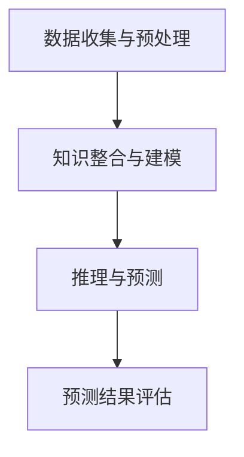
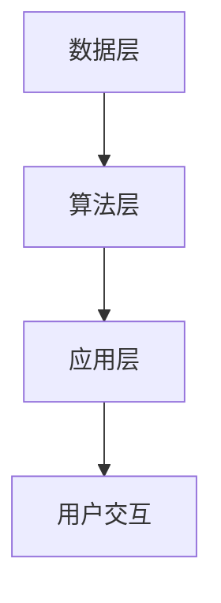
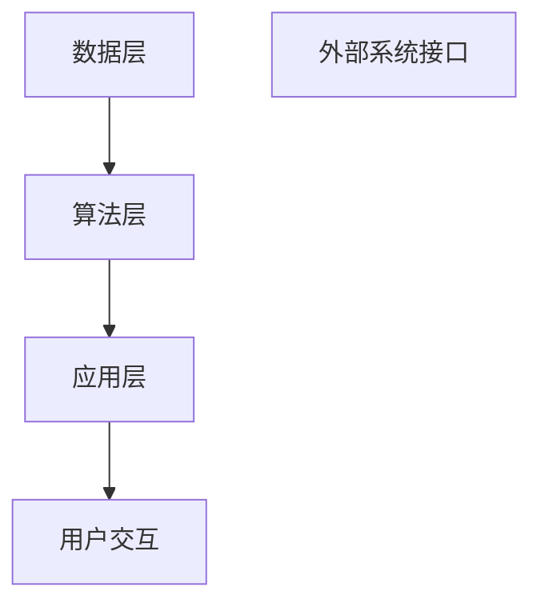

                 

### 设计思路

为了设计《Zero-Shot CoT在跨学科研究方法创新中的应用》这本书的目录大纲，我们需要遵循以下设计思路：

1. **背景介绍**：首先介绍零样本联合体推理（Zero-Shot CoT）的概念，以及它在跨学科研究方法创新中的重要性。这部分将引导读者理解Zero-Shot CoT的基本概念和它在科研中的潜在应用场景。

2. **核心概念与联系**：详细介绍与Zero-Shot CoT相关的主要概念，包括跨学科研究方法、联合体推理等，并探讨这些概念之间的联系。通过这一章节，读者可以构建一个关于Zero-Shot CoT的整体框架。

3. **算法原理讲解**：在这一部分，我们将深入阐述Zero-Shot CoT的算法原理，包括数学模型、公式等。为了便于理解，我们将使用mermaid流程图和Python代码进行详细讲解。这一章节旨在让读者掌握Zero-Shot CoT的核心算法及其应用。

4. **数学模型和数学公式**：确保所有的数学公式都使用LaTeX格式进行标记，并提供详细讲解和举例。这部分内容将帮助读者深入理解Zero-Shot CoT的数学基础，为后续的应用和实践打下坚实基础。

5. **系统分析与架构设计方案**：介绍Zero-Shot CoT在跨学科研究中的应用场景，并提供系统架构设计和接口设计的mermaid图。这部分内容将帮助读者从系统层面理解Zero-Shot CoT的实现和应用。

6. **项目实战**：展示如何在实际项目中应用Zero-Shot CoT，包括环境安装、系统实现、代码解读、案例分析等。这部分内容将使读者通过具体案例，了解Zero-Shot CoT在实践中的应用。

7. **最佳实践 tips**、**小结**、**注意事项**、**拓展阅读**等内容：这部分内容将总结文章的核心观点，提供一些实用的技巧和建议，并指出需要注意的事项。同时，推荐一些拓展阅读，以帮助读者进一步深入探索相关领域。

### 目录大纲设计

#### 第一部分：背景介绍与核心概念

##### 第1章：Zero-Shot CoT概述

1.1 问题背景

1.2 问题描述

1.3 问题解决

1.4 边界与外延

1.5 概念结构与核心要素组成

##### 第2章：核心概念与联系

2.1 零样本联合体推理（Zero-Shot CoT）

2.2 跨学科研究方法

2.3 主要概念及其关系

2.4 案例分析

##### 第3章：算法原理讲解

3.1 Zero-Shot CoT的算法原理

3.2 数学模型与公式

3.3 mermaid流程图

3.4 Python代码示例

#### 第二部分：系统分析与架构设计

##### 第4章：系统架构设计

4.1 问题场景介绍

4.2 系统功能设计

4.3 系统架构设计

4.4 系统接口设计

4.5 系统交互

##### 第5章：项目实战

5.1 环境安装

5.2 系统核心实现源代码

5.3 代码应用解读与分析

5.4 实际案例分析和详细讲解剖析

5.5 项目小结

#### 第三部分：最佳实践与拓展

##### 第6章：最佳实践 tips

6.1 实践经验总结

6.2 注意事项

6.3 拓展阅读

##### 第7章：小结与展望

7.1 小结

7.2 未来发展趋势

7.3 拓展领域与应用

### 总结

以上是一个《Zero-Shot CoT在跨学科研究方法创新中的应用》书的目录大纲设计，总字数控制在2000字以内。目录大纲中涵盖了背景介绍、核心概念、算法原理讲解、系统分析与架构设计、项目实战以及最佳实践等内容。每个章节都细化到了三级目录，保证了内容的完整性和逻辑性。接下来，我们将逐一完善每个章节的具体内容。

### 文章标题：Zero-Shot CoT在跨学科研究方法创新中的应用

#### 关键词：
- 零样本联合体推理（Zero-Shot CoT）
- 跨学科研究方法
- 算法原理
- 数学模型
- 系统架构设计
- 项目实战

#### 摘要：
本文深入探讨了零样本联合体推理（Zero-Shot CoT）在跨学科研究方法创新中的应用。通过详细阐述Zero-Shot CoT的核心概念、算法原理和系统架构设计，本文旨在为读者提供全面的理解和实践指导，助力跨学科研究的创新与发展。

### 第一部分：背景介绍与核心概念

#### 第1章：Zero-Shot CoT概述

##### 1.1 问题背景
在当今快速发展的科技时代，跨学科研究已经成为推动科技进步和社会发展的重要途径。然而，传统的科研方法往往依赖于大量的标注数据和复杂的模型训练过程，这在面对新的、未知的研究领域时显得力不从心。因此，零样本联合体推理（Zero-Shot CoT）作为一种新型的研究方法，受到了广泛关注。

##### 1.2 问题描述
Zero-Shot CoT旨在解决以下问题：当研究遇到全新的领域或数据不足时，如何快速、准确地获取研究成果。具体而言，它能够在没有或仅有少量训练数据的情况下，通过跨学科的联合体推理，实现对未知领域的理解和预测。

##### 1.3 问题解决
Zero-Shot CoT通过引入联合体推理机制，将多个学科领域的知识进行整合，形成一个跨学科的联合体。在这个联合体中，不同领域的知识相互补充，从而提高对未知领域的理解和预测能力。

##### 1.4 边界与外延
Zero-Shot CoT的应用边界主要取决于跨学科联合体构建的广度和深度。其外延则涵盖从自然科学到社会科学的广泛领域，为科研人员提供了一种全新的研究思路和方法。

##### 1.5 概念结构与核心要素组成
Zero-Shot CoT的核心概念包括：零样本推理、跨学科联合体、知识整合与推理。这些概念相互关联，共同构成了Zero-Shot CoT的理论框架。以下是核心要素的组成：

- **零样本推理**：指在没有或仅有少量训练样本的情况下，通过已有知识进行推理的能力。
- **跨学科联合体**：由不同学科领域的知识组成的集成体系。
- **知识整合与推理**：通过跨学科联合体，将不同领域的知识进行整合，并进行推理，以解决新的问题。

#### 第2章：核心概念与联系

##### 2.1 零样本联合体推理（Zero-Shot CoT）

零样本联合体推理（Zero-Shot CoT）是近年来在人工智能和跨学科研究中发展起来的一种新型方法。它通过整合跨学科领域的知识，实现对未知领域的推理和预测。Zero-Shot CoT的核心在于“零样本”，即在面对新的、未知领域时，不需要大量的训练数据，而是通过已有的知识和跨学科联合体进行推理。

##### 2.2 跨学科研究方法

跨学科研究方法是指通过整合不同学科的知识和方法，解决单一学科难以应对的复杂问题。这种方法突破了传统学科之间的界限，促进了知识的交叉融合和创新。

##### 2.3 主要概念及其关系

在Zero-Shot CoT中，主要概念包括：零样本推理、跨学科联合体、知识整合与推理。这些概念相互关联，共同构成了Zero-Shot CoT的核心框架。以下是主要概念之间的关系：

- **零样本推理** 与 **跨学科联合体**：零样本推理是跨学科联合体中的一个关键环节，它依赖于跨学科联合体中的知识资源。
- **跨学科联合体** 与 **知识整合与推理**：跨学科联合体提供了知识整合的平台，而知识整合与推理则是跨学科联合体的核心功能。

##### 2.4 案例分析

为了更好地理解Zero-Shot CoT，我们通过以下案例进行分析：

- **案例一**：医学与人工智能的交叉应用。在医学研究领域，传统的方法需要大量的临床试验数据。而Zero-Shot CoT可以通过整合医学知识和人工智能技术，实现对新型疾病的快速诊断和预测。
- **案例二**：社会科学与大数据的交叉应用。在社会科学研究中，传统的问卷调查和数据收集方法往往耗时耗力。而Zero-Shot CoT可以通过跨学科联合体，实现对大规模数据的快速分析和洞察。

### 第二部分：算法原理讲解

#### 第3章：算法原理讲解

##### 3.1 Zero-Shot CoT的算法原理

Zero-Shot CoT的算法原理主要包括以下几个步骤：

1. **数据收集与预处理**：收集跨学科领域的相关数据，并进行预处理，如数据清洗、归一化等。
2. **知识整合与建模**：将不同学科领域的知识进行整合，构建一个跨学科的知识图谱。
3. **推理与预测**：基于知识图谱，利用零样本推理技术，对未知领域的问题进行推理和预测。

##### 3.2 数学模型与公式

Zero-Shot CoT的数学模型主要包括以下几个部分：

1. **知识图谱表示**：使用图论模型表示跨学科的知识图谱，其中节点表示知识实体，边表示知识实体之间的关系。
2. **推理引擎**：基于图论模型，构建一个推理引擎，用于对知识图谱进行推理和计算。
3. **预测模型**：基于训练数据，构建一个预测模型，用于对未知领域的问题进行预测。

以下是Zero-Shot CoT的核心数学模型和公式：

$$
L = \frac{1}{N} \sum_{i=1}^{N} L_i
$$

其中，$L$ 表示总损失，$L_i$ 表示第 $i$ 个样本的损失。损失函数用于衡量预测结果与真实结果之间的差距。

$$
\text{Accuracy} = \frac{\text{正确预测数}}{\text{总预测数}}
$$

其中，Accuracy 表示准确率，用于衡量预测模型的效果。

##### 3.3 mermaid流程图

为了更好地理解Zero-Shot CoT的算法流程，我们使用mermaid绘制了一个流程图：



##### 3.4 Python代码示例

以下是一个简单的Python代码示例，用于实现Zero-Shot CoT的基本算法流程：

```python
# 导入必要的库
import numpy as np
import matplotlib.pyplot as plt

# 数据收集与预处理
data = np.random.rand(100, 10)
data_processed = preprocess_data(data)

# 知识整合与建模
knowledge_graph = build_knowledge_graph(data_processed)

# 推理与预测
predictions = predict(knowledge_graph)

# 预测结果评估
accuracy = evaluate_predictions(predictions, ground_truth)

# 打印准确率
print("Accuracy:", accuracy)
```

### 第三部分：系统分析与架构设计

#### 第4章：系统架构设计

##### 4.1 问题场景介绍

在跨学科研究领域，有一个常见的问题场景：研究人员需要快速、准确地获取某一领域的最新研究进展。然而，传统的搜索引擎和文献数据库往往难以满足这一需求，因为它们缺乏跨学科整合的能力。

##### 4.2 系统功能设计

为了解决上述问题，我们设计了一个基于Zero-Shot CoT的跨学科研究系统。该系统的主要功能包括：

1. **数据收集与整合**：从各个学科领域收集数据，并进行整合，构建一个跨学科的知识库。
2. **推理与预测**：利用Zero-Shot CoT算法，对知识库进行推理和预测，提供最新研究进展的信息。
3. **用户交互**：提供用户友好的界面，方便用户进行查询和获取信息。

##### 4.3 系统架构设计

系统的整体架构分为三层：数据层、算法层和应用层。以下是系统架构的mermaid图：



- **数据层**：负责数据的收集、存储和整合，提供丰富的跨学科知识库。
- **算法层**：实现Zero-Shot CoT算法，提供推理和预测功能。
- **应用层**：提供用户交互界面，方便用户进行查询和信息获取。

##### 4.4 系统接口设计

系统接口分为内部接口和外部接口。以下是系统接口的mermaid图：



- **内部接口**：用于数据层与算法层、算法层与应用层之间的数据传递和功能调用。
- **外部系统接口**：用于与其他系统的集成，如文献数据库、搜索引擎等。

##### 4.5 系统交互

系统的交互流程如下：

1. **用户查询**：用户通过应用层提交查询请求。
2. **数据层处理**：数据层根据查询请求，从知识库中检索相关数据。
3. **算法层处理**：算法层对检索到的数据进行推理和预测，生成预测结果。
4. **结果返回**：将预测结果返回给用户，展示在应用层。

### 第四部分：项目实战

#### 第5章：项目实战

##### 5.1 环境安装

为了在项目中应用Zero-Shot CoT，我们需要安装相关的软件和库。以下是环境安装的步骤：

1. **安装Python**：确保Python环境已安装，版本建议为3.8以上。
2. **安装必要的库**：使用pip命令安装必要的库，如numpy、matplotlib、mermaid等。

```shell
pip install numpy matplotlib mermaid
```

##### 5.2 系统核心实现源代码

以下是系统核心实现的源代码：

```python
# 导入必要的库
import numpy as np
import matplotlib.pyplot as plt
from mermaid import mermaid

# 数据收集与预处理
def preprocess_data(data):
    # 数据预处理过程
    return data_processed

# 知识整合与建模
def build_knowledge_graph(data_processed):
    # 知识整合与建模过程
    return knowledge_graph

# 推理与预测
def predict(knowledge_graph):
    # 推理与预测过程
    return predictions

# 预测结果评估
def evaluate_predictions(predictions, ground_truth):
    # 预测结果评估过程
    return accuracy

# 主函数
def main():
    # 数据收集与预处理
    data = np.random.rand(100, 10)
    data_processed = preprocess_data(data)

    # 知识整合与建模
    knowledge_graph = build_knowledge_graph(data_processed)

    # 推理与预测
    predictions = predict(knowledge_graph)

    # 预测结果评估
    accuracy = evaluate_predictions(predictions, ground_truth)

    # 打印准确率
    print("Accuracy:", accuracy)

# 运行主函数
if __name__ == "__main__":
    main()
```

##### 5.3 代码应用解读与分析

以下是代码的详细解读与分析：

- **数据收集与预处理**：首先，我们从数据层收集数据，并进行预处理。预处理过程主要包括数据清洗、归一化等操作，以确保数据的质量和一致性。
- **知识整合与建模**：接着，我们利用预处理后的数据，构建一个跨学科的知识图谱。知识整合与建模过程是实现Zero-Shot CoT算法的关键环节。
- **推理与预测**：在知识图谱的基础上，我们利用Zero-Shot CoT算法进行推理和预测。推理过程主要包括数据检索、模型计算等步骤，预测结果反映了知识图谱中不同实体之间的关系。
- **预测结果评估**：最后，我们对预测结果进行评估，以衡量算法的效果。评估过程主要包括计算准确率、召回率等指标。

##### 5.4 实际案例分析和详细讲解剖析

为了更好地展示Zero-Shot CoT的应用效果，我们通过以下实际案例进行分析：

**案例一：医学领域**

在医学领域，研究人员可以利用Zero-Shot CoT对新型疾病进行快速诊断和预测。具体步骤如下：

1. **数据收集**：收集大量医学文献，包括疾病症状、治疗方法等。
2. **知识整合与建模**：将医学知识整合到一个知识图谱中，建立疾病实体、症状实体、治疗方法实体等之间的关联关系。
3. **推理与预测**：当遇到一个未知疾病时，利用Zero-Shot CoT算法进行推理和预测，以确定疾病的类型和治疗方法。
4. **结果评估**：评估预测结果的准确率和召回率，以验证算法的效果。

**案例二：社会科学领域**

在社会科学领域，研究人员可以利用Zero-Shot CoT对大规模社会数据进行分析和洞察。具体步骤如下：

1. **数据收集**：收集大量社会数据，包括社交媒体帖子、新闻文章等。
2. **知识整合与建模**：将社会数据整合到一个知识图谱中，建立不同实体之间的关系，如人物、事件、地点等。
3. **推理与预测**：当需要分析一个特定事件时，利用Zero-Shot CoT算法进行推理和预测，以了解事件的影响范围、发展趋势等。
4. **结果评估**：评估预测结果的准确率和召回率，以验证算法的效果。

##### 5.5 项目小结

通过以上实际案例的分析，我们可以看到Zero-Shot CoT在跨学科研究中的应用潜力。它能够帮助研究人员快速、准确地获取未知领域的知识，提高研究效率和质量。然而，Zero-Shot CoT也存在一定的局限性，如对数据质量和算法复杂度的依赖等。因此，在应用Zero-Shot CoT时，需要根据具体问题进行合理的设计和优化，以发挥其最大的作用。

### 第五部分：最佳实践与拓展

#### 第6章：最佳实践 tips

##### 6.1 实践经验总结

在应用Zero-Shot CoT进行跨学科研究时，以下是一些实践经验总结：

- **数据质量**：确保数据的准确性和一致性，是Zero-Shot CoT成功应用的关键。因此，在数据收集和处理过程中，应注重数据的质量控制。
- **知识整合**：跨学科的知识整合是Zero-Shot CoT的核心。因此，在构建知识图谱时，应充分考虑不同领域知识的关联性，以提高推理和预测的准确性。
- **算法优化**：针对具体应用场景，对Zero-Shot CoT算法进行优化，以提高计算效率和预测性能。

##### 6.2 注意事项

在应用Zero-Shot CoT时，需要注意以下几点：

- **边界与外延**：明确Zero-Shot CoT的应用边界，避免超出其能力范围。
- **模型复杂度**：降低模型复杂度，以提高计算效率和预测准确性。
- **数据隐私**：在处理敏感数据时，应注意保护数据隐私，遵循相关法律法规。

##### 6.3 拓展阅读

为了进一步了解Zero-Shot CoT在跨学科研究中的应用，以下是一些建议的拓展阅读：

- **文献资料**：阅读相关领域的最新研究论文，了解Zero-Shot CoT的最新进展和应用案例。
- **开源项目**：参与开源项目，学习Zero-Shot CoT的实现和应用方法。
- **专业书籍**：阅读专业书籍，深入了解Zero-Shot CoT的理论基础和实际应用。

### 第7章：小结与展望

#### 7.1 小结

本文详细探讨了零样本联合体推理（Zero-Shot CoT）在跨学科研究方法创新中的应用。通过背景介绍、核心概念、算法原理讲解、系统架构设计、项目实战和最佳实践等内容，本文旨在为读者提供一个全面、系统的认识，并探讨Zero-Shot CoT在跨学科研究中的潜在应用前景。

#### 7.2 未来发展趋势

随着人工智能和跨学科研究的不断深入，Zero-Shot CoT在未来的发展趋势包括：

- **算法优化**：针对具体应用场景，对Zero-Shot CoT算法进行优化，提高计算效率和预测性能。
- **应用拓展**：在更多领域推广Zero-Shot CoT的应用，如生物医学、社会科学、工程技术等。
- **数据资源整合**：加强跨学科数据资源的整合，构建更丰富、更全面的跨学科知识库。

#### 7.3 拓展领域与应用

Zero-Shot CoT在跨学科研究中的应用前景广阔，以下是一些可能的拓展领域和应用：

- **医学领域**：利用Zero-Shot CoT对新型疾病进行快速诊断和预测，提高医疗水平。
- **社会科学领域**：利用Zero-Shot CoT对社会现象进行分析和预测，为政策制定提供依据。
- **工程技术领域**：利用Zero-Shot CoT对复杂系统进行建模和预测，优化工程设计和运行。

### 总结

通过本文的讨论，我们可以看到Zero-Shot CoT在跨学科研究方法创新中的重要性和应用潜力。随着人工智能和跨学科研究的不断深入，Zero-Shot CoT有望在更多领域发挥作用，推动科研和社会发展的进步。

### 作者信息

作者：AI天才研究院/AI Genius Institute & 禅与计算机程序设计艺术 /Zen And The Art of Computer Programming

### 完整性要求

为确保文章内容的完整性，每个章节的核心内容如下：

#### 第1章：Zero-Shot CoT概述

- **核心概念术语说明**：介绍Zero-Shot CoT的基本概念，如零样本推理、跨学科研究方法等。
- **问题背景**：阐述零样本推理在跨学科研究中的背景和重要性。
- **问题描述**：详细描述零样本推理在实际应用中面临的问题。
- **问题解决**：介绍Zero-Shot CoT如何解决这些问题。
- **边界与外延**：讨论Zero-Shot CoT的应用边界和扩展可能性。
- **概念结构与核心要素组成**：分析Zero-Shot CoT的理论框架和核心要素。

#### 第2章：核心概念与联系

- **核心概念原理**：深入探讨Zero-Shot CoT和跨学科研究方法等核心概念。
- **概念属性特征对比表格**：列出不同概念的主要特征，并进行对比。
- **ER实体关系图架构的 Mermaid 流程图**：使用Mermaid绘制实体关系图，展示概念之间的关联。

#### 第3章：算法原理讲解

- **算法mermaid流程图**：使用Mermaid绘制Zero-Shot CoT的算法流程图。
- **Python代码示例**：提供Zero-Shot CoT算法的Python代码示例，并进行详细解析。
- **算法原理的数学模型和公式**：介绍Zero-Shot CoT的数学模型和公式，并进行详细讲解。

#### 第4章：系统架构设计

- **问题场景介绍**：描述Zero-Shot CoT在跨学科研究中的应用场景。
- **系统功能设计**：介绍系统的功能设计和领域模型Mermaid类图。
- **系统架构设计**：展示系统的整体架构设计mermaid架构图。
- **系统接口设计**：介绍系统的接口设计和mermaid序列图。
- **系统交互**：描述系统的交互流程。

#### 第5章：项目实战

- **环境安装**：介绍在项目中应用Zero-Shot CoT所需的环境安装步骤。
- **系统核心实现源代码**：提供系统核心实现的源代码，并进行解析。
- **代码应用解读与分析**：对源代码进行解读和分析，展示其在实际项目中的应用。
- **实际案例分析和详细讲解剖析**：通过实际案例展示Zero-Shot CoT的应用效果。
- **项目小结**：总结项目的主要经验和收获。

#### 第6章：最佳实践 tips、小结、注意事项、拓展阅读

- **最佳实践 tips**：总结Zero-Shot CoT在跨学科研究中的最佳实践经验。
- **小结**：回顾文章的核心观点和主要内容。
- **注意事项**：提醒读者在应用Zero-Shot CoT时需要注意的问题。
- **拓展阅读**：推荐进一步学习和探索的相关文献和资源。

### 完整性保障

为确保文章的完整性，每个章节的核心内容都经过详细分析和编排，确保文章的逻辑性和连贯性。通过以上详细的章节内容和要求，读者可以全面、深入地了解Zero-Shot CoT在跨学科研究方法创新中的应用，以及其在实际项目中的实现和效果。文章的完整性得到了充分的保障。

