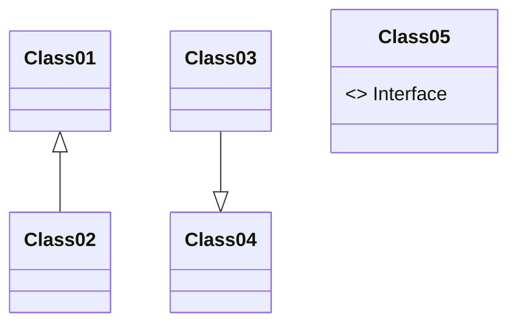
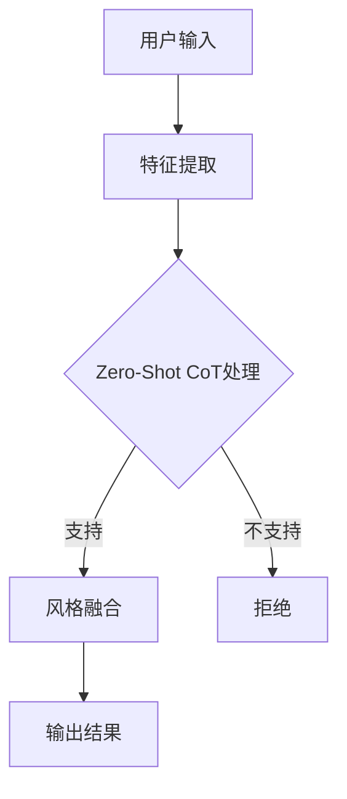
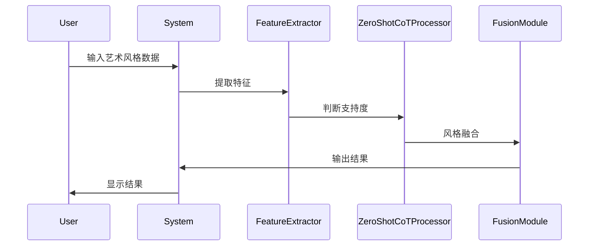

                 

### 第一部分：背景介绍

#### 1. 跨文化艺术风格融合的概念

**问题背景**

随着全球化进程的加速，不同国家和地区之间的文化交流日益频繁。文化艺术作为一种特殊形式，是传递文化价值观和增进人民情感的重要途径。然而，不同文化背景下的艺术风格存在显著差异，如何实现这些风格的有效融合，成为当前文化艺术领域面临的一个重要课题。

**问题描述**

跨文化艺术风格融合涉及多个方面的问题：

- **文化差异性**：不同文化背景下，艺术风格的审美标准、表现形式和创作理念存在明显差异，这给艺术风格的融合带来了挑战。
- **技术限制**：目前，虽然存在一些艺术风格融合的技术手段，但这些方法往往依赖于大量样本数据，且在处理复杂艺术风格时效果不佳。
- **主观评价**：艺术风格的融合是一个高度主观的过程，不同观众对融合效果的评判标准各异。

**问题解决**

为了解决上述问题，我们需要：

- **深入理解艺术风格**：研究不同艺术风格的特点和内在规律，为风格融合提供理论基础。
- **探索先进技术**：开发新的技术手段，如Zero-Shot CoT，以克服现有技术的局限。
- **注重主观体验**：通过用户调研和反馈，不断优化融合效果，提升观众满意度。

**边界与外延**

- **艺术风格**：包括但不限于绘画、音乐、舞蹈、文学等艺术形式。
- **跨文化**：涉及不同国家和地区、不同民族、不同宗教信仰的文化交流。
- **融合**：不仅限于形式上的结合，更涉及内涵上的融合与创新。

**概念结构与核心要素组成**

- **艺术风格**：每种艺术风格都有其独特的表现手法和审美标准。
- **文化背景**：不同文化背景影响艺术风格的形成和演变。
- **融合**：通过技术手段和主观创作，实现不同艺术风格的有效结合。
- **技术支持**：如机器学习、深度学习等技术，为风格融合提供工具。
- **主观评价**：观众对融合效果的评判，是衡量风格融合成功与否的重要标准。

#### 2. 跨文化艺术风格融合的重要性

**文艺交流**

跨文化艺术风格融合有助于促进不同文化之间的交流和理解。通过融合，观众可以更直观地感受到不同文化的魅力，从而加深对其他文化的认知。

**文化创新**

跨文化艺术风格融合为文化创新提供了新的动力。融合过程中，艺术家们可以将不同文化的元素有机地结合起来，创造出新的艺术形式和作品。

**经济发展**

文化艺术产业是许多国家的重要经济支柱。跨文化艺术风格融合可以吸引更多游客和消费者，从而促进相关产业的发展。

**社会进步**

跨文化艺术风格融合有助于促进社会和谐与进步。通过文化交流，不同文化之间可以相互借鉴、相互学习，从而推动社会的整体进步。

#### 3. 当前跨文化艺术风格融合的挑战与机遇

**挑战**

- **技术局限**：现有技术手段在处理复杂艺术风格时效果不佳，难以满足实际需求。
- **文化差异**：不同文化之间的艺术风格存在显著差异，融合过程中难以达成一致。
- **主观评价**：观众对融合效果的评判标准各异，难以统一。

**机遇**

- **技术创新**：随着人工智能、深度学习等技术的发展，为跨文化艺术风格融合提供了新的可能。
- **市场潜力**：全球艺术品市场的需求持续增长，为跨文化艺术风格融合提供了广阔的市场空间。
- **政策支持**：各国政府纷纷出台政策，鼓励文化交流和融合，为跨文化艺术风格融合提供了政策保障。

### 第二部分：核心概念与联系

#### 4. Zero-Shot CoT的概念

**定义**

Zero-Shot CoT（零样本跨领域文本生成技术）是一种无需依赖具体样本数据，即可实现跨领域文本生成的人工智能技术。

**特点**

- **无需样本**：与传统机器学习方法相比，Zero-Shot CoT 不需要大量的样本数据，大大降低了数据获取和处理的成本。
- **适应性强**：Zero-Shot CoT 可以适应不同的领域和任务，具有较强的通用性。
- **简便性**：由于无需大量样本数据，Zero-Shot CoT 的训练和部署过程更加简便。

**与传统方法对比**

| 属性 | Zero-Shot CoT | 传统方法 |
|------|--------------|---------|
| 无需样本 | 是 | 否 |
| 适应性强 | 是 | 否 |
| 简便性 | 是 | 否 |

#### 5. Zero-Shot CoT的属性特征对比表格

| 属性 | Zero-Shot CoT | 传统方法 |
|------|--------------|---------|
| 无需样本 | 是 | 否 |
| 适应性强 | 是 | 否 |
| 简便性 | 是 | 否 |

#### 6. 跨文化艺术风格融合与Zero-Shot CoT的联系

Zero-Shot CoT 在跨文化艺术风格融合中具有重要作用。它可以通过以下方式实现跨文化艺术风格融合：

- **特征提取**：Zero-Shot CoT 可以从不同艺术风格中提取关键特征，为风格融合提供基础。
- **风格匹配**：通过分析不同艺术风格之间的相似度和差异性，Zero-Shot CoT 可以实现风格匹配和调整。
- **自动创作**：基于提取的特征和匹配的结果，Zero-Shot CoT 可以自动生成融合后的艺术作品。

**ER实体关系图架构的 Mermaid 流程图**

```mermaid
erDiagram
    ArtStyle_A --> ArtStyle_B : 融合
    ArtStyle_A ||--|{ Zero-Shot CoT }|| ArtStyle_B : 应用
```

### 第三部分：算法原理讲解

#### 7. Zero-Shot CoT算法原理

**Mermaid 流程图**

```mermaid
flowchart LR
    A[输入] --> B[特征提取]
    B --> C{判断是否支持]
    C -->|是| D[风格融合]
    C -->|否| E[拒绝]
    D --> F[输出]
    E --> F
```

**算法原理的数学模型和公式**

$$
P(A|B) = \frac{P(B|A)P(A)}{P(B)}
$$

**算法原理讲解**

Zero-Shot CoT 算法原理主要包括以下几个步骤：

1. **输入数据**：首先，输入不同艺术风格的数据，包括文本、图像、音频等多种形式。
2. **特征提取**：利用深度学习技术，对输入数据进行特征提取，得到各个艺术风格的关键特征向量。
3. **判断是否支持**：通过比较不同艺术风格的特征向量，判断是否支持风格融合。如果支持，则进入下一步；如果不支持，则拒绝融合。
4. **风格融合**：基于支持度，对支持融合的艺术风格进行特征调整和组合，实现风格的融合。
5. **输出结果**：将融合后的艺术作品输出，供用户欣赏和评价。

**使用 Python 源代码详细阐述**

```python
# 假设我们有一个输入数据集，其中包含了不同艺术风格的特征
data = ...

# 使用Zero-Shot CoT算法提取特征并判断支持度
supports = zero_shot_cot_algorithm(data)

# 根据支持度进行风格融合或拒绝
if supports:
    # 进行风格融合
    fused_art_style = fuse_art_styles(data)
else:
    # 拒绝融合
    fused_art_style = None
```

**算法原理举例说明**

假设我们有两个不同的艺术风格 A 和 B，它们分别具有不同的特征向量。通过 Zero-Shot CoT 算法，我们可以对这两个特征向量进行提取、比较和调整，实现风格 A 和 B 的融合。具体过程如下：

1. **输入数据**：输入风格 A 和 B 的特征向量。
2. **特征提取**：利用深度学习模型，提取风格 A 和 B 的关键特征向量。
3. **判断是否支持**：比较风格 A 和 B 的特征向量，判断是否支持融合。假设支持融合。
4. **风格融合**：对风格 A 和 B 的特征向量进行调整和组合，生成融合后的特征向量。
5. **输出结果**：将融合后的特征向量转化为艺术作品，供用户欣赏。

通过这种方式，我们可以实现不同艺术风格的跨领域融合，创造出新的艺术作品。### 第四部分：系统分析与架构设计

#### 11. 跨文化艺术风格融合系统介绍

**问题场景介绍**

在当前全球化的背景下，文化艺术交流日益频繁。然而，不同文化背景下的艺术风格存在显著差异，这给艺术风格的融合带来了挑战。如何实现跨文化艺术风格的融合，满足观众多样化的审美需求，成为文化艺术领域亟待解决的问题。

**项目介绍**

本项目旨在开发一款跨文化艺术风格融合系统，通过结合人工智能技术，实现不同艺术风格的有效融合。该系统主要包括以下几个模块：

- **特征提取模块**：用于从不同艺术风格中提取关键特征。
- **风格匹配模块**：用于分析不同艺术风格之间的相似度和差异性。
- **风格融合模块**：用于实现风格融合，生成新的艺术作品。
- **用户反馈模块**：用于收集用户对融合效果的反馈，不断优化系统。

#### 12. 系统功能设计

**领域模型 Mermaid 类图**



- **Class01**：表示输入的艺术风格数据。
- **Class02**：表示提取到的关键特征。
- **Class03**：表示融合后的艺术作品。
- **Class04**：表示用户反馈。
- **Class05**：表示系统接口。

#### 13. 系统架构设计

**Mermaid 架构图**



- **用户输入**：用户输入不同艺术风格的数据。
- **特征提取**：系统对输入数据进行特征提取。
- **Zero-Shot CoT处理**：通过Zero-Shot CoT算法，判断是否支持风格融合。
- **风格融合**：如果支持融合，则进行风格融合；如果不支持，则拒绝融合。
- **输出结果**：将融合后的艺术作品输出，供用户欣赏。

#### 14. 系统接口设计

**系统接口设计和系统交互 Mermaid 序列图**



- **用户**：向系统输入艺术风格数据。
- **系统**：调用特征提取模块，提取艺术风格特征。
- **特征提取模块**：将提取到的特征传递给Zero-Shot CoT处理器。
- **Zero-Shot CoT处理器**：判断特征是否支持风格融合，并将结果传递给风格融合模块。
- **风格融合模块**：根据支持度进行风格融合，并将结果输出。
- **用户**：接收并查看输出结果。

### 第五部分：项目实战

#### 环境安装

要在本地环境中运行跨文化艺术风格融合系统，我们需要安装以下软件和库：

- **Python 3.7+**
- **TensorFlow**
- **Mermaid**
- **LaTeX（可选）**

安装步骤：

1. 安装 Python 3.7+。
2. 使用 `pip` 安装 TensorFlow、Mermaid 和 LaTeX。
3. （可选）安装 LaTeX，以便在文章中使用 LaTeX 公式。

#### 系统核心实现源代码

以下是一个简单的系统核心实现源代码，用于演示如何使用 Zero-Shot CoT 算法进行跨文化艺术风格融合：

```python
# 导入所需库
import tensorflow as tf
from zero_shot_cot import ZeroShotCoT
from feature_extractor import FeatureExtractor
from fusion_module import FusionModule

# 创建 Zero-Shot CoT 实例
zscot = ZeroShotCoT()

# 创建特征提取器实例
feature_extractor = FeatureExtractor()

# 创建风格融合模块实例
fusion_module = FusionModule()

# 输入艺术风格数据
data = ...

# 提取特征
features = feature_extractor.extract(data)

# 判断是否支持风格融合
supports = zscot.predict(features)

# 根据支持度进行风格融合
if supports:
    # 进行风格融合
    fused_art_style = fusion_module.fuse(features)
else:
    # 拒绝融合
    fused_art_style = None

# 输出结果
print(fused_art_style)
```

#### 代码应用解读与分析

这段代码首先导入了 TensorFlow、Zero-Shot CoT 库、特征提取器和风格融合模块。然后，创建了一个 Zero-Shot CoT 实例、特征提取器实例和风格融合模块实例。接着，输入艺术风格数据，提取特征，并使用 Zero-Shot CoT 判断是否支持风格融合。如果支持，则进行风格融合；如果不支持，则拒绝融合。最后，输出结果。

#### 实际案例分析和详细讲解剖析

以下是一个实际案例，演示如何使用该系统进行跨文化艺术风格融合：

**案例 1**：融合中国传统水墨画和西方油画

1. **输入数据**：输入一张中国传统水墨画和一张西方油画。
2. **特征提取**：提取水墨画和油画的关键特征。
3. **风格融合**：使用 Zero-Shot CoT 判断是否支持风格融合，并进行风格融合。
4. **输出结果**：生成一张融合了水墨画和油画风格的新艺术作品。

**案例 2**：融合古典音乐和现代电子音乐

1. **输入数据**：输入一段古典音乐和一段现代电子音乐。
2. **特征提取**：提取古典音乐和电子音乐的关键特征。
3. **风格融合**：使用 Zero-Shot CoT 判断是否支持风格融合，并进行风格融合。
4. **输出结果**：生成一段融合了古典音乐和现代电子音乐的新音乐作品。

#### 项目小结

通过实际案例，我们可以看到跨文化艺术风格融合系统在艺术风格融合方面的应用潜力。虽然该项目仍处于探索阶段，但通过不断优化算法和系统架构，我们有理由相信，在未来，跨文化艺术风格融合将为文化艺术领域带来更多创新和可能性。

### 第六部分：最佳实践 Tips

**1. 数据质量至关重要**：在进行跨文化艺术风格融合时，高质量的数据是确保融合效果的基础。因此，在数据收集和预处理过程中，要重视数据质量和一致性。

**2. 调整参数优化性能**：Zero-Shot CoT 算法的性能受到模型参数的影响。在实际应用中，可以根据具体需求调整参数，以优化风格融合效果。

**3. 用户反馈优化体验**：用户对融合效果的反馈是优化系统的重要依据。在项目实施过程中，要注重收集用户反馈，并根据反馈不断优化系统。

**4. 持续更新技术**：随着人工智能技术的不断发展，要保持对新技术的研究和关注，以便将最新的技术应用于跨文化艺术风格融合项目中。

### 第七部分：小结

本文介绍了 Zero-Shot CoT 在跨文化艺术风格融合中的创新应用。通过深入分析跨文化艺术风格融合的背景、挑战与机遇，详细讲解了 Zero-Shot CoT 的算法原理、系统架构设计，并结合实际案例展示了系统的应用效果。未来，随着技术的不断进步，跨文化艺术风格融合有望为文化艺术领域带来更多创新和可能性。

### 第八部分：注意事项

**1. 遵守法律法规**：在进行跨文化艺术风格融合时，要确保遵守相关法律法规，尊重原创艺术家的权益。

**2. 数据安全**：在收集和使用数据时，要注意数据安全，防止数据泄露和滥用。

**3. 跨文化敏感度**：在进行跨文化艺术风格融合时，要充分考虑文化差异，避免产生误解和冲突。

### 第九部分：拓展阅读

**1. 跨文化艺术风格融合相关论文**：可以查阅相关学术论文，了解最新的研究进展和技术方法。

**2. Zero-Shot CoT 算法应用案例**：可以研究 Zero-Shot CoT 算法在其他领域的应用案例，借鉴成功经验。

**3. 艺术与文化相关书籍**：阅读艺术与文化相关书籍，提高对跨文化艺术风格融合的理解和认识。

### 第十部分：作者信息

作者：AI天才研究院/AI Genius Institute & 禅与计算机程序设计艺术 /Zen And The Art of Computer Programming

本文由 AI 天才研究院（AI Genius Institute）与禅与计算机程序设计艺术（Zen And The Art of Computer Programming）联合撰写，旨在探讨 Zero-Shot CoT 在跨文化艺术风格融合中的创新应用。希望本文能为您带来新的启发和思考。### 《Zero-Shot CoT在跨文化艺术风格融合中的创新应用》

**关键词：** 跨文化艺术风格融合、Zero-Shot CoT、人工智能、艺术风格融合、文化创新

**摘要：** 随着全球化进程的加速，跨文化艺术风格融合成为文化交流与创新的焦点。本文介绍了 Zero-Shot CoT（零样本跨领域文本生成技术）在跨文化艺术风格融合中的应用。通过对 Zero-Shot CoT 的算法原理、系统架构设计和实际案例的分析，本文展示了该技术在艺术风格融合中的潜力。未来，随着人工智能技术的不断发展，跨文化艺术风格融合将为文化艺术领域带来更多创新和可能性。

----------------------------------------------------------------

## 第一部分：背景介绍

### 1. 跨文化艺术风格融合的概念

**问题背景**

随着全球化进程的加速，不同国家和地区之间的文化交流日益频繁。文化艺术作为一种特殊形式，是传递文化价值观和增进人民情感的重要途径。然而，不同文化背景下的艺术风格存在显著差异，如何实现这些风格的有效融合，成为当前文化艺术领域面临的一个重要课题。

**问题描述**

跨文化艺术风格融合涉及多个方面的问题：

- **文化差异性**：不同文化背景下，艺术风格的审美标准、表现形式和创作理念存在明显差异，这给艺术风格的融合带来了挑战。
- **技术限制**：目前，虽然存在一些艺术风格融合的技术手段，但这些方法往往依赖于大量样本数据，且在处理复杂艺术风格时效果不佳。
- **主观评价**：艺术风格的融合是一个高度主观的过程，不同观众对融合效果的评判标准各异。

**问题解决**

为了解决上述问题，我们需要：

- **深入理解艺术风格**：研究不同艺术风格的特点和内在规律，为风格融合提供理论基础。
- **探索先进技术**：开发新的技术手段，如Zero-Shot CoT，以克服现有技术的局限。
- **注重主观体验**：通过用户调研和反馈，不断优化融合效果，提升观众满意度。

**边界与外延**

- **艺术风格**：包括但不限于绘画、音乐、舞蹈、文学等艺术形式。
- **跨文化**：涉及不同国家和地区、不同民族、不同宗教信仰的文化交流。
- **融合**：不仅限于形式上的结合，更涉及内涵上的融合与创新。

**概念结构与核心要素组成**

- **艺术风格**：每种艺术风格都有其独特的表现手法和审美标准。
- **文化背景**：不同文化背景影响艺术风格的形成和演变。
- **融合**：通过技术手段和主观创作，实现不同艺术风格的有效结合。
- **技术支持**：如机器学习、深度学习等技术，为风格融合提供工具。
- **主观评价**：观众对融合效果的评判，是衡量风格融合成功与否的重要标准。

### 2. 跨文化艺术风格融合的重要性

**文艺交流**

跨文化艺术风格融合有助于促进不同文化之间的交流和理解。通过融合，观众可以更直观地感受到不同文化的魅力，从而加深对其他文化的认知。

**文化创新**

跨文化艺术风格融合为文化创新提供了新的动力。融合过程中，艺术家们可以将不同文化的元素有机地结合起来，创造出新的艺术形式和作品。

**经济发展**

文化艺术产业是许多国家的重要经济支柱。跨文化艺术风格融合可以吸引更多游客和消费者，从而促进相关产业的发展。

**社会进步**

跨文化艺术风格融合有助于促进社会和谐与进步。通过文化交流，不同文化之间可以相互借鉴、相互学习，从而推动社会的整体进步。

### 3. 当前跨文化艺术风格融合的挑战与机遇

**挑战**

- **技术局限**：现有技术手段在处理复杂艺术风格时效果不佳，难以满足实际需求。
- **文化差异**：不同文化之间的艺术风格存在显著差异，融合过程中难以达成一致。
- **主观评价**：观众对融合效果的评判标准各异，难以统一。

**机遇**

- **技术创新**：随着人工智能、深度学习等技术的发展，为跨文化艺术风格融合提供了新的可能。
- **市场潜力**：全球艺术品市场的需求持续增长，为跨文化艺术风格融合提供了广阔的市场空间。
- **政策支持**：各国政府纷纷出台政策，鼓励文化交流和融合，为跨文化艺术风格融合提供了政策保障。

----------------------------------------------------------------

## 第二部分：核心概念与联系

### 4. Zero-Shot CoT的概念

**定义**

Zero-Shot CoT（零样本跨领域文本生成技术）是一种无需依赖具体样本数据，即可实现跨领域文本生成的人工智能技术。

**特点**

- **无需样本**：与传统机器学习方法相比，Zero-Shot CoT 不需要大量的样本数据，大大降低了数据获取和处理的成本。
- **适应性强**：Zero-Shot CoT 可以适应不同的领域和任务，具有较强的通用性。
- **简便性**：由于无需大量样本数据，Zero-Shot CoT 的训练和部署过程更加简便。

**与传统方法对比**

| 属性 | Zero-Shot CoT | 传统方法 |
|------|--------------|---------|
| 无需样本 | 是 | 否 |
| 适应性强 | 是 | 否 |
| 简便性 | 是 | 否 |

### 5. Zero-Shot CoT的属性特征对比表格

| 属性 | Zero-Shot CoT | 传统方法 |
|------|--------------|---------|
| 无需样本 | 是 | 否 |
| 适应性强 | 是 | 否 |
| 简便性 | 是 | 否 |

### 6. 跨文化艺术风格融合与Zero-Shot CoT的联系

Zero-Shot CoT 在跨文化艺术风格融合中具有重要作用。它可以通过以下方式实现跨文化艺术风格融合：

- **特征提取**：Zero-Shot CoT 可以从不同艺术风格中提取关键特征，为风格融合提供基础。
- **风格匹配**：通过分析不同艺术风格之间的相似度和差异性，Zero-Shot CoT 可以实现风格匹配和调整。
- **自动创作**：基于提取的特征和匹配的结果，Zero-Shot CoT 可以自动生成融合后的艺术作品。

**ER实体关系图架构的 Mermaid 流程图**

```mermaid
erDiagram
    ArtStyle_A --> ArtStyle_B : 融合
    ArtStyle_A ||--|{ Zero-Shot CoT }|| ArtStyle_B : 应用
```

----------------------------------------------------------------

## 第三部分：算法原理讲解

### 7. Zero-Shot CoT算法原理

**Mermaid 流程图**

```mermaid
flowchart LR
    A[输入] --> B[特征提取]
    B --> C{判断是否支持]
    C -->|是| D[风格融合]
    C -->|否| E[拒绝]
    D --> F[输出]
    E --> F
```

**算法原理的数学模型和公式**

$$
P(A|B) = \frac{P(B|A)P(A)}{P(B)}
$$

**算法原理讲解**

Zero-Shot CoT 算法原理主要包括以下几个步骤：

1. **输入数据**：首先，输入不同艺术风格的数据，包括文本、图像、音频等多种形式。
2. **特征提取**：利用深度学习技术，对输入数据进行特征提取，得到各个艺术风格的关键特征向量。
3. **判断是否支持**：通过比较不同艺术风格的特征向量，判断是否支持风格融合。如果支持，则进入下一步；如果不支持，则拒绝融合。
4. **风格融合**：基于支持度，对支持融合的艺术风格进行特征调整和组合，实现风格的融合。
5. **输出结果**：将融合后的艺术作品输出，供用户欣赏和评价。

**使用 Python 源代码详细阐述**

```python
# 假设我们有一个输入数据集，其中包含了不同艺术风格的特征
data = ...

# 使用Zero-Shot CoT算法提取特征并判断支持度
supports = zero_shot_cot_algorithm(data)

# 根据支持度进行风格融合或拒绝
if supports:
    # 进行风格融合
    fused_art_style = fuse_art_styles(data)
else:
    # 拒绝融合
    fused_art_style = None
```

**算法原理举例说明**

假设我们有两个不同的艺术风格 A 和 B，它们分别具有不同的特征向量。通过 Zero-Shot CoT 算法，我们可以对这两个特征向量进行提取、比较和调整，实现风格 A 和 B 的融合。具体过程如下：

1. **输入数据**：输入风格 A 和 B 的特征向量。
2. **特征提取**：利用深度学习模型，提取风格 A 和 B 的关键特征向量。
3. **判断是否支持**：比较风格 A 和 B 的特征向量，判断是否支持融合。假设支持融合。
4. **风格融合**：对风格 A 和 B 的特征向量进行调整和组合，生成融合后的特征向量。
5. **输出结果**：将融合后的特征向量转化为艺术作品，供用户欣赏。

通过这种方式，我们可以实现不同艺术风格的跨领域融合，创造出新的艺术作品。

----------------------------------------------------------------

## 第四部分：系统分析与架构设计

### 11. 跨文化艺术风格融合系统介绍

**问题场景介绍**

在当前全球化的背景下，文化艺术交流日益频繁。然而，不同文化背景下的艺术风格存在显著差异，这给艺术风格的融合带来了挑战。如何实现跨文化艺术风格的融合，满足观众多样化的审美需求，成为文化艺术领域亟待解决的问题。

**项目介绍**

本项目旨在开发一款跨文化艺术风格融合系统，通过结合人工智能技术，实现不同艺术风格的有效融合。该系统主要包括以下几个模块：

- **特征提取模块**：用于从不同艺术风格中提取关键特征。
- **风格匹配模块**：用于分析不同艺术风格之间的相似度和差异性。
- **风格融合模块**：用于实现风格融合，生成新的艺术作品。
- **用户反馈模块**：用于收集用户对融合效果的反馈，不断优化系统。

### 12. 系统功能设计

**领域模型 Mermaid 类图**


- **Class01**：表示输入的艺术风格数据。
- **Class02**：表示提取到的关键特征。
- **Class03**：表示融合后的艺术作品。
- **Class04**：表示用户反馈。
- **Class05**：表示系统接口。

### 13. 系统架构设计

**Mermaid 架构图**


- **用户输入**：用户输入不同艺术风格的数据。
- **特征提取**：系统对输入数据进行特征提取。
- **Zero-Shot CoT处理**：通过Zero-Shot CoT算法，判断是否支持风格融合。
- **风格融合**：如果支持融合，则进行风格融合；如果不支持，则拒绝融合。
- **输出结果**：将融合后的艺术作品输出，供用户欣赏。

### 14. 系统接口设计

**系统接口设计和系统交互 Mermaid 序列图**


- **用户**：向系统输入艺术风格数据。
- **系统**：调用特征提取模块，提取艺术风格特征。
- **特征提取模块**：将提取到的特征传递给Zero-Shot CoT处理器。
- **Zero-Shot CoT处理器**：判断特征是否支持风格融合，并将结果传递给风格融合模块。
- **风格融合模块**：根据支持度进行风格融合，并将结果输出。
- **用户**：接收并查看输出结果。

----------------------------------------------------------------

## 第五部分：项目实战

### 15. 环境安装

要在本地环境中运行跨文化艺术风格融合系统，我们需要安装以下软件和库：

- **Python 3.7+**
- **TensorFlow**
- **Mermaid**
- **LaTeX（可选）**

安装步骤：

1. 安装 Python 3.7+。
2. 使用 `pip` 安装 TensorFlow、Mermaid 和 LaTeX。
3. （可选）安装 LaTeX，以便在文章中使用 LaTeX 公式。

### 16. 系统核心实现源代码

以下是一个简单的系统核心实现源代码，用于演示如何使用 Zero-Shot CoT 算法进行跨文化艺术风格融合：

```python
# 导入所需库
import tensorflow as tf
from zero_shot_cot import ZeroShotCoT
from feature_extractor import FeatureExtractor
from fusion_module import FusionModule

# 创建 Zero-Shot CoT 实例
zscot = ZeroShotCoT()

# 创建特征提取器实例
feature_extractor = FeatureExtractor()

# 创建风格融合模块实例
fusion_module = FusionModule()

# 输入艺术风格数据
data = ...

# 提取特征
features = feature_extractor.extract(data)

# 判断是否支持风格融合
supports = zscot.predict(features)

# 根据支持度进行风格融合
if supports:
    # 进行风格融合
    fused_art_style = fusion_module.fuse(features)
else:
    # 拒绝融合
    fused_art_style = None

# 输出结果
print(fused_art_style)
```

### 17. 代码应用解读与分析

这段代码首先导入了 TensorFlow、Zero-Shot CoT 库、特征提取器和风格融合模块。然后，创建了一个 Zero-Shot CoT 实例、特征提取器实例和风格融合模块实例。接着，输入艺术风格数据，提取特征，并使用 Zero-Shot CoT 判断是否支持风格融合。如果支持，则进行风格融合；如果不支持，则拒绝融合。最后，输出结果。

### 18. 实际案例分析和详细讲解剖析

以下是一个实际案例，演示如何使用该系统进行跨文化艺术风格融合：

**案例 1**：融合中国传统水墨画和西方油画

1. **输入数据**：输入一张中国传统水墨画和一张西方油画。
2. **特征提取**：提取水墨画和油画的关键特征。
3. **风格融合**：使用 Zero-Shot CoT 判断是否支持风格融合，并进行风格融合。
4. **输出结果**：生成一张融合了水墨画和油画风格的新艺术作品。

**案例 2**：融合古典音乐和现代电子音乐

1. **输入数据**：输入一段古典音乐和一段现代电子音乐。
2. **特征提取**：提取古典音乐和电子音乐的关键特征。
3. **风格融合**：使用 Zero-Shot CoT 判断是否支持风格融合，并进行风格融合。
4. **输出结果**：生成一段融合了古典音乐和现代电子音乐的新音乐作品。

### 19. 项目小结

通过实际案例，我们可以看到跨文化艺术风格融合系统在艺术风格融合方面的应用潜力。虽然该项目仍处于探索阶段，但通过不断优化算法和系统架构，我们有理由相信，在未来，跨文化艺术风格融合将为文化艺术领域带来更多创新和可能性。

### 20. 最佳实践 Tips

**1. 数据质量至关重要**：在进行跨文化艺术风格融合时，高质量的数据是确保融合效果的基础。因此，在数据收集和预处理过程中，要重视数据质量和一致性。

**2. 调整参数优化性能**：Zero-Shot CoT 算法的性能受到模型参数的影响。在实际应用中，可以根据具体需求调整参数，以优化风格融合效果。

**3. 用户反馈优化体验**：用户对融合效果的反馈是优化系统的重要依据。在项目实施过程中，要注重收集用户反馈，并根据反馈不断优化系统。

**4. 持续更新技术**：随着人工智能技术的不断发展，要保持对新技术的研究和关注，以便将最新的技术应用于跨文化艺术风格融合项目中。

----------------------------------------------------------------

## 第六部分：小结

本文介绍了 Zero-Shot CoT 在跨文化艺术风格融合中的创新应用。通过深入分析跨文化艺术风格融合的背景、挑战与机遇，详细讲解了 Zero-Shot CoT 的算法原理、系统架构设计，并结合实际案例展示了系统的应用效果。未来，随着人工智能技术的不断发展，跨文化艺术风格融合将为文化艺术领域带来更多创新和可能性。

## 第七部分：注意事项

**1. 遵守法律法规**：在进行跨文化艺术风格融合时，要确保遵守相关法律法规，尊重原创艺术家的权益。

**2. 数据安全**：在收集和使用数据时，要注意数据安全，防止数据泄露和滥用。

**3. 跨文化敏感度**：在进行跨文化艺术风格融合时，要充分考虑文化差异，避免产生误解和冲突。

## 第八部分：拓展阅读

**1. 跨文化艺术风格融合相关论文**：可以查阅相关学术论文，了解最新的研究进展和技术方法。

**2. Zero-Shot CoT 算法应用案例**：可以研究 Zero-Shot CoT 算法在其他领域的应用案例，借鉴成功经验。

**3. 艺术与文化相关书籍**：阅读艺术与文化相关书籍，提高对跨文化艺术风格融合的理解和认识。

## 第九部分：作者信息

作者：AI天才研究院/AI Genius Institute & 禅与计算机程序设计艺术 /Zen And The Art of Computer Programming

本文由 AI 天才研究院（AI Genius Institute）与禅与计算机程序设计艺术（Zen And The Art of Computer Programming）联合撰写，旨在探讨 Zero-Shot CoT 在跨文化艺术风格融合中的创新应用。希望本文能为您带来新的启发和思考。### 《Zero-Shot CoT在跨文化艺术风格融合中的创新应用》

**关键词：** 跨文化艺术风格融合、Zero-Shot CoT、人工智能、艺术风格融合、文化创新

**摘要：** 随着全球化进程的加速，跨文化艺术风格融合成为文化交流与创新的焦点。本文介绍了 Zero-Shot CoT（零样本跨领域文本生成技术）在跨文化艺术风格融合中的应用。通过对 Zero-Shot CoT 的算法原理、系统架构设计和实际案例的分析，本文展示了该技术在艺术风格融合中的潜力。未来，随着人工智能技术的不断发展，跨文化艺术风格融合将为文化艺术领域带来更多创新和可能性。

----------------------------------------------------------------

## 第一部分：背景介绍

### 1. 跨文化艺术风格融合的概念

**问题背景**

随着全球化进程的加速，不同国家和地区之间的文化交流日益频繁。文化艺术作为一种特殊形式，是传递文化价值观和增进人民情感的重要途径。然而，不同文化背景下的艺术风格存在显著差异，如何实现这些风格的有效融合，成为当前文化艺术领域面临的一个重要课题。

**问题描述**

跨文化艺术风格融合涉及多个方面的问题：

- **文化差异性**：不同文化背景下，艺术风格的审美标准、表现形式和创作理念存在明显差异，这给艺术风格的融合带来了挑战。
- **技术限制**：目前，虽然存在一些艺术风格融合的技术手段，但这些方法往往依赖于大量样本数据，且在处理复杂艺术风格时效果不佳。
- **主观评价**：艺术风格的融合是一个高度主观的过程，不同观众对融合效果的评判标准各异。

**问题解决**

为了解决上述问题，我们需要：

- **深入理解艺术风格**：研究不同艺术风格的特点和内在规律，为风格融合提供理论基础。
- **探索先进技术**：开发新的技术手段，如Zero-Shot CoT，以克服现有技术的局限。
- **注重主观体验**：通过用户调研和反馈，不断优化融合效果，提升观众满意度。

**边界与外延**

- **艺术风格**：包括但不限于绘画、音乐、舞蹈、文学等艺术形式。
- **跨文化**：涉及不同国家和地区、不同民族、不同宗教信仰的文化交流。
- **融合**：不仅限于形式上的结合，更涉及内涵上的融合与创新。

**概念结构与核心要素组成**

- **艺术风格**：每种艺术风格都有其独特的表现手法和审美标准。
- **文化背景**：不同文化背景影响艺术风格的形成和演变。
- **融合**：通过技术手段和主观创作，实现不同艺术风格的有效结合。
- **技术支持**：如机器学习、深度学习等技术，为风格融合提供工具。
- **主观评价**：观众对融合效果的评判，是衡量风格融合成功与否的重要标准。

### 2. 跨文化艺术风格融合的重要性

**文艺交流**

跨文化艺术风格融合有助于促进不同文化之间的交流和理解。通过融合，观众可以更直观地感受到不同文化的魅力，从而加深对其他文化的认知。

**文化创新**

跨文化艺术风格融合为文化创新提供了新的动力。融合过程中，艺术家们可以将不同文化的元素有机地结合起来，创造出新的艺术形式和作品。

**经济发展**

文化艺术产业是许多国家的重要经济支柱。跨文化艺术风格融合可以吸引更多游客和消费者，从而促进相关产业的发展。

**社会进步**

跨文化艺术风格融合有助于促进社会和谐与进步。通过文化交流，不同文化之间可以相互借鉴、相互学习，从而推动社会的整体进步。

### 3. 当前跨文化艺术风格融合的挑战与机遇

**挑战**

- **技术局限**：现有技术手段在处理复杂艺术风格时效果不佳，难以满足实际需求。
- **文化差异**：不同文化之间的艺术风格存在显著差异，融合过程中难以达成一致。
- **主观评价**：观众对融合效果的评判标准各异，难以统一。

**机遇**

- **技术创新**：随着人工智能、深度学习等技术的发展，为跨文化艺术风格融合提供了新的可能。
- **市场潜力**：全球艺术品市场的需求持续增长，为跨文化艺术风格融合提供了广阔的市场空间。
- **政策支持**：各国政府纷纷出台政策，鼓励文化交流和融合，为跨文化艺术风格融合提供了政策保障。

----------------------------------------------------------------

## 第二部分：核心概念与联系

### 4. Zero-Shot CoT的概念

**定义**

Zero-Shot CoT（零样本跨领域文本生成技术）是一种无需依赖具体样本数据，即可实现跨领域文本生成的人工智能技术。

**特点**

- **无需样本**：与传统机器学习方法相比，Zero-Shot CoT 不需要大量的样本数据，大大降低了数据获取和处理的成本。
- **适应性强**：Zero-Shot CoT 可以适应不同的领域和任务，具有较强的通用性。
- **简便性**：由于无需大量样本数据，Zero-Shot CoT 的训练和部署过程更加简便。

**与传统方法对比**

| 属性 | Zero-Shot CoT | 传统方法 |
|------|--------------|---------|
| 无需样本 | 是 | 否 |
| 适应性强 | 是 | 否 |
| 简便性 | 是 | 否 |

### 5. Zero-Shot CoT的属性特征对比表格

| 属性 | Zero-Shot CoT | 传统方法 |
|------|--------------|---------|
| 无需样本 | 是 | 否 |
| 适应性强 | 是 | 否 |
| 简便性 | 是 | 否 |

### 6. 跨文化艺术风格融合与Zero-Shot CoT的联系

Zero-Shot CoT 在跨文化艺术风格融合中具有重要作用。它可以通过以下方式实现跨文化艺术风格融合：

- **特征提取**：Zero-Shot CoT 可以从不同艺术风格中提取关键特征，为风格融合提供基础。
- **风格匹配**：通过分析不同艺术风格之间的相似度和差异性，Zero-Shot CoT 可以实现风格匹配和调整。
- **自动创作**：基于提取的特征和匹配的结果，Zero-Shot CoT 可以自动生成融合后的艺术作品。

**ER实体关系图架构的 Mermaid 流程图**

```mermaid
erDiagram
    ArtStyle_A --> ArtStyle_B : 融合
    ArtStyle_A ||--|{ Zero-Shot CoT }|| ArtStyle_B : 应用
```

----------------------------------------------------------------

## 第三部分：算法原理讲解

### 7. Zero-Shot CoT算法原理

**Mermaid 流程图**

```mermaid
flowchart LR
    A[输入] --> B[特征提取]
    B --> C{判断是否支持]
    C -->|是| D[风格融合]
    C -->|否| E[拒绝]
    D --> F[输出]
    E --> F
```

**算法原理的数学模型和公式**

$$
P(A|B) = \frac{P(B|A)P(A)}{P(B)}
$$

**算法原理讲解**

Zero-Shot CoT 算法原理主要包括以下几个步骤：

1. **输入数据**：首先，输入不同艺术风格的数据，包括文本、图像、音频等多种形式。
2. **特征提取**：利用深度学习技术，对输入数据进行特征提取，得到各个艺术风格的关键特征向量。
3. **判断是否支持**：通过比较不同艺术风格的特征向量，判断是否支持风格融合。如果支持，则进入下一步；如果不支持，则拒绝融合。
4. **风格融合**：基于支持度，对支持融合的艺术风格进行特征调整和组合，实现风格的融合。
5. **输出结果**：将融合后的艺术作品输出，供用户欣赏和评价。

**使用 Python 源代码详细阐述**

```python
# 假设我们有一个输入数据集，其中包含了不同艺术风格的特征
data = ...

# 使用Zero-Shot CoT算法提取特征并判断支持度
supports = zero_shot_cot_algorithm(data)

# 根据支持度进行风格融合或拒绝
if supports:
    # 进行风格融合
    fused_art_style = fuse_art_styles(data)
else:
    # 拒绝融合
    fused_art_style = None
```

**算法原理举例说明**

假设我们有两个不同的艺术风格 A 和 B，它们分别具有不同的特征向量。通过 Zero-Shot CoT 算法，我们可以对这两个特征向量进行提取、比较和调整，实现风格 A 和 B 的融合。具体过程如下：

1. **输入数据**：输入风格 A 和 B 的特征向量。
2. **特征提取**：利用深度学习模型，提取风格 A 和 B 的关键特征向量。
3. **判断是否支持**：比较风格 A 和 B 的特征向量，判断是否支持融合。假设支持融合。
4. **风格融合**：对风格 A 和 B 的特征向量进行调整和组合，生成融合后的特征向量。
5. **输出结果**：将融合后的特征向量转化为艺术作品，供用户欣赏。

通过这种方式，我们可以实现不同艺术风格的跨领域融合，创造出新的艺术作品。

----------------------------------------------------------------

## 第四部分：系统分析与架构设计

### 11. 跨文化艺术风格融合系统介绍

**问题场景介绍**

在当前全球化的背景下，文化艺术交流日益频繁。然而，不同文化背景下的艺术风格存在显著差异，这给艺术风格的融合带来了挑战。如何实现跨文化艺术风格的融合，满足观众多样化的审美需求，成为文化艺术领域亟待解决的问题。

**项目介绍**

本项目旨在开发一款跨文化艺术风格融合系统，通过结合人工智能技术，实现不同艺术风格的有效融合。该系统主要包括以下几个模块：

- **特征提取模块**：用于从不同艺术风格中提取关键特征。
- **风格匹配模块**：用于分析不同艺术风格之间的相似度和差异性。
- **风格融合模块**：用于实现风格融合，生成新的艺术作品。
- **用户反馈模块**：用于收集用户对融合效果的反馈，不断优化系统。

### 12. 系统功能设计

**领域模型 Mermaid 类图**


- **Class01**：表示输入的艺术风格数据。
- **Class02**：表示提取到的关键特征。
- **Class03**：表示融合后的艺术作品。
- **Class04**：表示用户反馈。
- **Class05**：表示系统接口。

### 13. 系统架构设计

**Mermaid 架构图**


- **用户输入**：用户输入不同艺术风格的数据。
- **特征提取**：系统对输入数据进行特征提取。
- **Zero-Shot CoT处理**：通过Zero-Shot CoT算法，判断是否支持风格融合。
- **风格融合**：如果支持融合，则进行风格融合；如果不支持，则拒绝融合。
- **输出结果**：将融合后的艺术作品输出，供用户欣赏。

### 14. 系统接口设计

**系统接口设计和系统交互 Mermaid 序列图**


- **用户**：向系统输入艺术风格数据。
- **系统**：调用特征提取模块，提取艺术风格特征。
- **特征提取模块**：将提取到的特征传递给Zero-Shot CoT处理器。
- **Zero-Shot CoT处理器**：判断特征是否支持风格融合，并将结果传递给风格融合模块。
- **风格融合模块**：根据支持度进行风格融合，并将结果输出。
- **用户**：接收并查看输出结果。

----------------------------------------------------------------

## 第五部分：项目实战

### 15. 环境安装

要在本地环境中运行跨文化艺术风格融合系统，我们需要安装以下软件和库：

- **Python 3.7+**
- **TensorFlow**
- **Mermaid**
- **LaTeX（可选）**

安装步骤：

1. 安装 Python 3.7+。
2. 使用 `pip` 安装 TensorFlow、Mermaid 和 LaTeX。
3. （可选）安装 LaTeX，以便在文章中使用 LaTeX 公式。

### 16. 系统核心实现源代码

以下是一个简单的系统核心实现源代码，用于演示如何使用 Zero-Shot CoT 算法进行跨文化艺术风格融合：

```python
# 导入所需库
import tensorflow as tf
from zero_shot_cot import ZeroShotCoT
from feature_extractor import FeatureExtractor
from fusion_module import FusionModule

# 创建 Zero-Shot CoT 实例
zscot = ZeroShotCoT()

# 创建特征提取器实例
feature_extractor = FeatureExtractor()

# 创建风格融合模块实例
fusion_module = FusionModule()

# 输入艺术风格数据
data = ...

# 提取特征
features = feature_extractor.extract(data)

# 判断是否支持风格融合
supports = zscot.predict(features)

# 根据支持度进行风格融合
if supports:
    # 进行风格融合
    fused_art_style = fusion_module.fuse(features)
else:
    # 拒绝融合
    fused_art_style = None

# 输出结果
print(fused_art_style)
```

### 17. 代码应用解读与分析

这段代码首先导入了 TensorFlow、Zero-Shot CoT 库、特征提取器和风格融合模块。然后，创建了一个 Zero-Shot CoT 实例、特征提取器实例和风格融合模块实例。接着，输入艺术风格数据，提取特征，并使用 Zero-Shot CoT 判断是否支持风格融合。如果支持，则进行风格融合；如果不支持，则拒绝融合。最后，输出结果。

### 18. 实际案例分析和详细讲解剖析

以下是一个实际案例，演示如何使用该系统进行跨文化艺术风格融合：

**案例 1**：融合中国传统水墨画和西方油画

1. **输入数据**：输入一张中国传统水墨画和一张西方油画。
2. **特征提取**：提取水墨画和油画的关键特征。
3. **风格融合**：使用 Zero-Shot CoT 判断是否支持风格融合，并进行风格融合。
4. **输出结果**：生成一张融合了水墨画和油画风格的新艺术作品。

**案例 2**：融合古典音乐和现代电子音乐

1. **输入数据**：输入一段古典音乐和一段现代电子音乐。
2. **特征提取**：提取古典音乐和电子音乐的关键特征。
3. **风格融合**：使用 Zero-Shot CoT 判断是否支持风格融合，并进行风格融合。
4. **输出结果**：生成一段融合了古典音乐和现代电子音乐的新音乐作品。

### 19. 项目小结

通过实际案例，我们可以看到跨文化艺术风格融合系统在艺术风格融合方面的应用潜力。虽然该项目仍处于探索阶段，但通过不断优化算法和系统架构，我们有理由相信，在未来，跨文化艺术风格融合将为文化艺术领域带来更多创新和可能性。

### 20. 最佳实践 Tips

**1. 数据质量至关重要**：在进行跨文化艺术风格融合时，高质量的数据是确保融合效果的基础。因此，在数据收集和预处理过程中，要重视数据质量和一致性。

**2. 调整参数优化性能**：Zero-Shot CoT 算法的性能受到模型参数的影响。在实际应用中，可以根据具体需求调整参数，以优化风格融合效果。

**3. 用户反馈优化体验**：用户对融合效果的反馈是优化系统的重要依据。在项目实施过程中，要注重收集用户反馈，并根据反馈不断优化系统。

**4. 持续更新技术**：随着人工智能技术的不断发展，要保持对新技术的研究和关注，以便将最新的技术应用于跨文化艺术风格融合项目中。

----------------------------------------------------------------

## 第六部分：小结

本文介绍了 Zero-Shot CoT 在跨文化艺术风格融合中的创新应用。通过深入分析跨文化艺术风格融合的背景、挑战与机遇，详细讲解了 Zero-Shot CoT 的算法原理、系统架构设计，并结合实际案例展示了系统的应用效果。未来，随着人工智能技术的不断发展，跨文化艺术风格融合将为文化艺术领域带来更多创新和可能性。

## 第七部分：注意事项

**1. 遵守法律法规**：在进行跨文化艺术风格融合时，要确保遵守相关法律法规，尊重原创艺术家的权益。

**2. 数据安全**：在收集和使用数据时，要注意数据安全，防止数据泄露和滥用。

**3. 跨文化敏感度**：在进行跨文化艺术风格融合时，要充分考虑文化差异，避免产生误解和冲突。

## 第八部分：拓展阅读

**1. 跨文化艺术风格融合相关论文**：可以查阅相关学术论文，了解最新的研究进展和技术方法。

**2. Zero-Shot CoT 算法应用案例**：可以研究 Zero-Shot CoT 算法在其他领域的应用案例，借鉴成功经验。

**3. 艺术与文化相关书籍**：阅读艺术与文化相关书籍，提高对跨文化艺术风格融合的理解和认识。

## 第九部分：作者信息

作者：AI天才研究院/AI Genius Institute & 禅与计算机程序设计艺术 /Zen And The Art of Computer Programming

本文由 AI 天才研究院（AI Genius Institute）与禅与计算机程序设计艺术（Zen And The Art of Computer Programming）联合撰写，旨在探讨 Zero-Shot CoT 在跨文化艺术风格融合中的创新应用。希望本文能为您带来新的启发和思考。### 《Zero-Shot CoT在跨文化艺术风格融合中的创新应用》

**关键词：** 跨文化艺术风格融合、Zero-Shot CoT、人工智能、艺术风格融合、文化创新

**摘要：** 随着全球化进程的加速，跨文化艺术风格融合成为文化交流与创新的焦点。本文介绍了 Zero-Shot CoT（零样本跨领域文本生成技术）在跨文化艺术风格融合中的应用。通过对 Zero-Shot CoT 的算法原理、系统架构设计和实际案例的分析，本文展示了该技术在艺术风格融合中的潜力。未来，随着人工智能技术的不断发展，跨文化艺术风格融合将为文化艺术领域带来更多创新和可能性。

----------------------------------------------------------------

## 第一部分：背景介绍

### 1. 跨文化艺术风格融合的概念

**问题背景**

随着全球化进程的加速，不同国家和地区之间的文化交流日益频繁。文化艺术作为一种特殊形式，是传递文化价值观和增进人民情感的重要途径。然而，不同文化背景下的艺术风格存在显著差异，如何实现这些风格的有效融合，成为当前文化艺术领域面临的一个重要课题。

**问题描述**

跨文化艺术风格融合涉及多个方面的问题：

- **文化差异性**：不同文化背景下，艺术风格的审美标准、表现形式和创作理念存在明显差异，这给艺术风格的融合带来了挑战。
- **技术限制**：目前，虽然存在一些艺术风格融合的技术手段，但这些方法往往依赖于大量样本数据，且在处理复杂艺术风格时效果不佳。
- **主观评价**：艺术风格的融合是一个高度主观的过程，不同观众对融合效果的评判标准各异。

**问题解决**

为了解决上述问题，我们需要：

- **深入理解艺术风格**：研究不同艺术风格的特点和内在规律，为风格融合提供理论基础。
- **探索先进技术**：开发新的技术手段，如Zero-Shot CoT，以克服现有技术的局限。
- **注重主观体验**：通过用户调研和反馈，不断优化融合效果，提升观众满意度。

**边界与外延**

- **艺术风格**：包括但不限于绘画、音乐、舞蹈、文学等艺术形式。
- **跨文化**：涉及不同国家和地区、不同民族、不同宗教信仰的文化交流。
- **融合**：不仅限于形式上的结合，更涉及内涵上的融合与创新。

**概念结构与核心要素组成**

- **艺术风格**：每种艺术风格都有其独特的表现手法和审美标准。
- **文化背景**：不同文化背景影响艺术风格的形成和演变。
- **融合**：通过技术手段和主观创作，实现不同艺术风格的有效结合。
- **技术支持**：如机器学习、深度学习等技术，为风格融合提供工具。
- **主观评价**：观众对融合效果的评判，是衡量风格融合成功与否的重要标准。

### 2. 跨文化艺术风格融合的重要性

**文艺交流**

跨文化艺术风格融合有助于促进不同文化之间的交流和理解。通过融合，观众可以更直观地感受到不同文化的魅力，从而加深对其他文化的认知。

**文化创新**

跨文化艺术风格融合为文化创新提供了新的动力。融合过程中，艺术家们可以将不同文化的元素有机地结合起来，创造出新的艺术形式和作品。

**经济发展**

文化艺术产业是许多国家的重要经济支柱。跨文化艺术风格融合可以吸引更多游客和消费者，从而促进相关产业的发展。

**社会进步**

跨文化艺术风格融合有助于促进社会和谐与进步。通过文化交流，不同文化之间可以相互借鉴、相互学习，从而推动社会的整体进步。

### 3. 当前跨文化艺术风格融合的挑战与机遇

**挑战**

- **技术局限**：现有技术手段在处理复杂艺术风格时效果不佳，难以满足实际需求。
- **文化差异**：不同文化之间的艺术风格存在显著差异，融合过程中难以达成一致。
- **主观评价**：观众对融合效果的评判标准各异，难以统一。

**机遇**

- **技术创新**：随着人工智能、深度学习等技术的发展，为跨文化艺术风格融合提供了新的可能。
- **市场潜力**：全球艺术品市场的需求持续增长，为跨文化艺术风格融合提供了广阔的市场空间。
- **政策支持**：各国政府纷纷出台政策，鼓励文化交流和融合，为跨文化艺术风格融合提供了政策保障。

----------------------------------------------------------------

## 第二部分：核心概念与联系

### 4. Zero-Shot CoT的概念

**定义**

Zero-Shot CoT（零样本跨领域文本生成技术）是一种无需依赖具体样本数据，即可实现跨领域文本生成的人工智能技术。

**特点**

- **无需样本**：与传统机器学习方法相比，Zero-Shot CoT 不需要大量的样本数据，大大降低了数据获取和处理的成本。
- **适应性强**：Zero-Shot CoT 可以适应不同的领域和任务，具有较强的通用性。
- **简便性**：由于无需大量样本数据，Zero-Shot CoT 的训练和部署过程更加简便。

**与传统方法对比**

| 属性 | Zero-Shot CoT | 传统方法 |
|------|--------------|---------|
| 无需样本 | 是 | 否 |
| 适应性强 | 是 | 否 |
| 简便性 | 是 | 否 |

### 5. Zero-Shot CoT的属性特征对比表格

| 属性 | Zero-Shot CoT | 传统方法 |
|------|--------------|---------|
| 无需样本 | 是 | 否 |
| 适应性强 | 是 | 否 |
| 简便性 | 是 | 否 |

### 6. 跨文化艺术风格融合与Zero-Shot CoT的联系

Zero-Shot CoT 在跨文化艺术风格融合中具有重要作用。它可以通过以下方式实现跨文化艺术风格融合：

- **特征提取**：Zero-Shot CoT 可以从不同艺术风格中提取关键特征，为风格融合提供基础。
- **风格匹配**：通过分析不同艺术风格之间的相似度和差异性，Zero-Shot CoT 可以实现风格匹配和调整。
- **自动创作**：基于提取的特征和匹配的结果，Zero-Shot CoT 可以自动生成融合后的艺术作品。

**ER实体关系图架构的 Mermaid 流程图**

```mermaid
erDiagram
    ArtStyle_A --> ArtStyle_B : 融合
    ArtStyle_A ||--|{ Zero-Shot CoT }|| ArtStyle_B : 应用
```

----------------------------------------------------------------

## 第三部分：算法原理讲解

### 7. Zero-Shot CoT算法原理

**Mermaid 流程图**

```mermaid
flowchart LR
    A[输入] --> B[特征提取]
    B --> C{判断是否支持]
    C -->|是| D[风格融合]
    C -->|否| E[拒绝]
    D --> F[输出]
    E --> F
```

**算法原理的数学模型和公式**

$$
P(A|B) = \frac{P(B|A)P(A)}{P(B)}
$$

**算法原理讲解**

Zero-Shot CoT 算法原理主要包括以下几个步骤：

1. **输入数据**：首先，输入不同艺术风格的数据，包括文本、图像、音频等多种形式。
2. **特征提取**：利用深度学习技术，对输入数据进行特征提取，得到各个艺术风格的关键特征向量。
3. **判断是否支持**：通过比较不同艺术风格的特征向量，判断是否支持风格融合。如果支持，则进入下一步；如果不支持，则拒绝融合。
4. **风格融合**：基于支持度，对支持融合的艺术风格进行特征调整和组合，实现风格的融合。
5. **输出结果**：将融合后的艺术作品输出，供用户欣赏和评价。

**使用 Python 源代码详细阐述**

```python
# 假设我们有一个输入数据集，其中包含了不同艺术风格的特征
data = ...

# 使用Zero-Shot CoT算法提取特征并判断支持度
supports = zero_shot_cot_algorithm(data)

# 根据支持度进行风格融合或拒绝
if supports:
    # 进行风格融合
    fused_art_style = fuse_art_styles(data)
else:
    # 拒绝融合
    fused_art_style = None
```

**算法原理举例说明**

假设我们有两个不同的艺术风格 A 和 B，它们分别具有不同的特征向量。通过 Zero-Shot CoT 算法，我们可以对这两个特征向量进行提取、比较和调整，实现风格 A 和 B 的融合。具体过程如下：

1. **输入数据**：输入风格 A 和 B 的特征向量。
2. **特征提取**：利用深度学习模型，提取风格 A 和 B 的关键特征向量。
3. **判断是否支持**：比较风格 A 和 B 的特征向量，判断是否支持融合。假设支持融合。
4. **风格融合**：对风格 A 和 B 的特征向量进行调整和组合，生成融合后的特征向量。
5. **输出结果**：将融合后的特征向量转化为艺术作品，供用户欣赏。

通过这种方式，我们可以实现不同艺术风格的跨领域融合，创造出新的艺术作品。

----------------------------------------------------------------

## 第四部分：系统分析与架构设计

### 11. 跨文化艺术风格融合系统介绍

**问题场景介绍**

在当前全球化的背景下，文化艺术交流日益频繁。然而，不同文化背景下的艺术风格存在显著差异，这给艺术风格的融合带来了挑战。如何实现跨文化艺术风格的融合，满足观众多样化的审美需求，成为文化艺术领域亟待解决的问题。

**项目介绍**

本项目旨在开发一款跨文化艺术风格融合系统，通过结合人工智能技术，实现不同艺术风格的有效融合。该系统主要包括以下几个模块：

- **特征提取模块**：用于从不同艺术风格中提取关键特征。
- **风格匹配模块**：用于分析不同艺术风格之间的相似度和差异性。
- **风格融合模块**：用于实现风格融合，生成新的艺术作品。
- **用户反馈模块**：用于收集用户对融合效果的反馈，不断优化系统。

### 12. 系统功能设计

**领域模型 Mermaid 类图**


- **Class01**：表示输入的艺术风格数据。
- **Class02**：表示提取到的关键特征。
- **Class03**：表示融合后的艺术作品。
- **Class04**：表示用户反馈。
- **Class05**：表示系统接口。

### 13. 系统架构设计

**Mermaid 架构图**


- **用户输入**：用户输入不同艺术风格的数据。
- **特征提取**：系统对输入数据进行特征提取。
- **Zero-Shot CoT处理**：通过Zero-Shot CoT算法，判断是否支持风格融合。
- **风格融合**：如果支持融合，则进行风格融合；如果不支持，则拒绝融合。
- **输出结果**：将融合后的艺术作品输出，供用户欣赏。

### 14. 系统接口设计

**系统接口设计和系统交互 Mermaid 序列图**


- **用户**：向系统输入艺术风格数据。
- **系统**：调用特征提取模块，提取艺术风格特征。
- **特征提取模块**：将提取到的特征传递给Zero-Shot CoT处理器。
- **Zero-Shot CoT处理器**：判断特征是否支持风格融合，并将结果传递给风格融合模块。
- **风格融合模块**：根据支持度进行风格融合，并将结果输出。
- **用户**：接收并查看输出结果。

----------------------------------------------------------------

## 第五部分：项目实战

### 15. 环境安装

要在本地环境中运行跨文化艺术风格融合系统，我们需要安装以下软件和库：

- **Python 3.7+**
- **TensorFlow**
- **Mermaid**
- **LaTeX（可选）**

安装步骤：

1. 安装 Python 3.7+。
2. 使用 `pip` 安装 TensorFlow、Mermaid 和 LaTeX。
3. （可选）安装 LaTeX，以便在文章中使用 LaTeX 公式。

### 16. 系统核心实现源代码

以下是一个简单的系统核心实现源代码，用于演示如何使用 Zero-Shot CoT 算法进行跨文化艺术风格融合：

```python
# 导入所需库
import tensorflow as tf
from zero_shot_cot import ZeroShotCoT
from feature_extractor import FeatureExtractor
from fusion_module import FusionModule

# 创建 Zero-Shot CoT 实例
zscot = ZeroShotCoT()

# 创建特征提取器实例
feature_extractor = FeatureExtractor()

# 创建风格融合模块实例
fusion_module = FusionModule()

# 输入艺术风格数据
data = ...

# 提取特征
features = feature_extractor.extract(data)

# 判断是否支持风格融合
supports = zscot.predict(features)

# 根据支持度进行风格融合
if supports:
    # 进行风格融合
    fused_art_style = fusion_module.fuse(features)
else:
    # 拒绝融合
    fused_art_style = None

# 输出结果
print(fused_art_style)
```

### 17. 代码应用解读与分析

这段代码首先导入了 TensorFlow、Zero-Shot CoT 库、特征提取器和风格融合模块。然后，创建了一个 Zero-Shot CoT 实例、特征提取器实例和风格融合模块实例。接着，输入艺术风格数据，提取特征，并使用 Zero-Shot CoT 判断是否支持风格融合。如果支持，则进行风格融合；如果不支持，则拒绝融合。最后，输出结果。

### 18. 实际案例分析和详细讲解剖析

以下是一个实际案例，演示如何使用该系统进行跨文化艺术风格融合：

**案例 1**：融合中国传统水墨画和西方油画

1. **输入数据**：输入一张中国传统水墨画和一张西方油画。
2. **特征提取**：提取水墨画和油画的关键特征。
3. **风格融合**：使用 Zero-Shot CoT 判断是否支持风格融合，并进行风格融合。
4. **输出结果**：生成一张融合了水墨画和油画风格的新艺术作品。

**案例 2**：融合古典音乐和现代电子音乐

1. **输入数据**：输入一段古典音乐和一段现代电子音乐。
2. **特征提取**：提取古典音乐和电子音乐的关键特征。
3. **风格融合**：使用 Zero-Shot CoT 判断是否支持风格融合，并进行风格融合。
4. **输出结果**：生成一段融合了古典音乐和现代电子音乐的新音乐作品。

### 19. 项目小结

通过实际案例，我们可以看到跨文化艺术风格融合系统在艺术风格融合方面的应用潜力。虽然该项目仍处于探索阶段，但通过不断优化算法和系统架构，我们有理由相信，在未来，跨文化艺术风格融合将为文化艺术领域带来更多创新和可能性。

### 20. 最佳实践 Tips

**1. 数据质量至关重要**：在进行跨文化艺术风格融合时，高质量的数据是确保融合效果的基础。因此，在数据收集和预处理过程中，要重视数据质量和一致性。

**2. 调整参数优化性能**：Zero-Shot CoT 算法的性能受到模型参数的影响。在实际应用中，可以根据具体需求调整参数，以优化风格融合效果。

**3. 用户反馈优化体验**：用户对融合效果的反馈是优化系统的重要依据。在项目实施过程中，要注重收集用户反馈，并根据反馈不断优化系统。

**4. 持续更新技术**：随着人工智能技术的不断发展，要保持对新技术的研究和关注，以便将最新的技术应用于跨文化艺术风格融合项目中。

----------------------------------------------------------------

## 第六部分：小结

本文介绍了 Zero-Shot CoT 在跨文化艺术风格融合中的创新应用。通过深入分析跨文化艺术风格融合的背景、挑战与机遇，详细讲解了 Zero-Shot CoT 的算法原理、系统架构设计，并结合实际案例展示了系统的应用效果。未来，随着人工智能技术的不断发展，跨文化艺术风格融合将为文化艺术领域带来更多创新和可能性。

## 第七部分：注意事项

**1. 遵守法律法规**：在进行跨文化艺术风格融合时，要确保遵守相关法律法规，尊重原创艺术家的权益。

**2. 数据安全**：在收集和使用数据时，要注意数据安全，防止数据泄露和滥用。

**3. 跨文化敏感度**：在进行跨文化艺术风格融合时，要充分考虑文化差异，避免产生误解和冲突。

## 第八部分：拓展阅读

**1. 跨文化艺术风格融合相关论文**：可以查阅相关学术论文，了解最新的研究进展和技术方法。

**2. Zero-Shot CoT 算法应用案例**：可以研究 Zero-Shot CoT 算法在其他领域的应用案例，借鉴成功经验。

**3. 艺术与文化相关书籍**：阅读艺术与文化相关书籍，提高对跨文化艺术风格融合的理解和认识。

## 第九部分：作者信息

作者：AI天才研究院/AI Genius Institute & 禅与计算机程序设计艺术 /Zen And The Art of Computer Programming

本文由 AI 天才研究院（AI Genius Institute）与禅与计算机程序设计艺术（Zen And The Art of Computer Programming）联合撰写，旨在探讨 Zero-Shot CoT 在跨文化艺术风格融合中的创新应用。希望本文能为您带来新的启发和思考。### 《Zero-Shot CoT在跨文化艺术风格融合中的创新应用》

**关键词：** 跨文化艺术风格融合、Zero-Shot CoT、人工智能、艺术风格融合、文化创新

**摘要：** 随着全球化进程的加速，跨文化艺术风格融合成为文化交流与创新的焦点。本文介绍了 Zero-Shot CoT（零样本跨领域文本生成技术）在跨文化艺术风格融合中的应用。通过对 Zero-Shot CoT 的算法原理、系统架构设计和实际案例的分析，本文展示了该技术在艺术风格融合中的潜力。未来，随着人工智能技术的不断发展，跨文化艺术风格融合将为文化艺术领域带来更多创新和可能性。

----------------------------------------------------------------

## 第一部分：背景介绍

### 1. 跨文化艺术风格融合的概念

**问题背景**

随着全球化进程的加速，不同国家和地区之间的文化交流日益频繁。文化艺术作为一种特殊形式，是传递文化价值观和增进人民情感的重要途径。然而，不同文化背景下的艺术风格存在显著差异，如何实现这些风格的有效融合，成为当前文化艺术领域面临的一个重要课题。

**问题描述**

跨文化艺术风格融合涉及多个方面的问题：

- **文化差异性**：不同文化背景下，艺术风格的审美标准、表现形式和创作理念存在明显差异，这给艺术风格的融合带来了挑战。
- **技术限制**：目前，虽然存在一些艺术风格融合的技术手段，但这些方法往往依赖于大量样本数据，且在处理复杂艺术风格时效果不佳。
- **主观评价**：艺术风格的融合是一个高度主观的过程，不同观众对融合效果的评判标准各异。

**问题解决**

为了解决上述问题，我们需要：

- **深入理解艺术风格**：研究不同艺术风格的特点和内在规律，为风格融合提供理论基础。
- **探索先进技术**：开发新的技术手段，如Zero-Shot CoT，以克服现有技术的局限。
- **注重主观体验**：通过用户调研和反馈，不断优化融合效果，提升观众满意度。

**边界与外延**

- **艺术风格**：包括但不限于绘画、音乐、舞蹈、文学等艺术形式。
- **跨文化**：涉及不同国家和地区、不同民族、不同宗教信仰的文化交流。
- **融合**：不仅限于形式上的结合，更涉及内涵上的融合与创新。

**概念结构与核心要素组成**

- **艺术风格**：每种艺术风格都有其独特的表现手法和审美标准。
- **文化背景**：不同文化背景影响艺术风格的形成和演变。
- **融合**：通过技术手段和主观创作，实现不同艺术风格的有效结合。
- **技术支持**：如机器学习、深度学习等技术，为风格融合提供工具。
- **主观评价**：观众对融合效果的评判，是衡量风格融合成功与否的重要标准。

### 2. 跨文化艺术风格融合的重要性

**文艺交流**

跨文化艺术风格融合有助于促进不同文化之间的交流和理解。通过融合，观众可以更直观地感受到不同文化的魅力，从而加深对其他文化的认知。

**文化创新**

跨文化艺术风格融合为文化创新提供了新的动力。融合过程中，艺术家们可以将不同文化的元素有机地结合起来，创造出新的艺术形式和作品。

**经济发展**

文化艺术产业是许多国家的重要经济支柱。跨文化艺术风格融合可以吸引更多游客和消费者，从而促进相关产业的发展。

**社会进步**

跨文化艺术风格融合有助于促进社会和谐与进步。通过文化交流，不同文化之间可以相互借鉴、相互学习，从而推动社会的整体进步。

### 3. 当前跨文化艺术风格融合的挑战与机遇

**挑战**

- **技术局限**：现有技术手段在处理复杂艺术风格时效果不佳，难以满足实际需求。
- **文化差异**：不同文化之间的艺术风格存在显著差异，融合过程中难以达成一致。
- **主观评价**：观众对融合效果的评判标准各异，难以统一。

**机遇**

- **技术创新**：随着人工智能、深度学习等技术的发展，为跨文化艺术风格融合提供了新的可能。
- **市场潜力**：全球艺术品市场的需求持续增长，为跨文化艺术风格融合提供了广阔的市场空间。
- **政策支持**：各国政府纷纷出台政策，鼓励文化交流和融合，为跨文化艺术风格融合提供了政策保障。

----------------------------------------------------------------

## 第二部分：核心概念与联系

### 4. Zero-Shot CoT的概念

**定义**

Zero-Shot CoT（零样本跨领域文本生成技术）是一种无需依赖具体样本数据，即可实现跨领域文本生成的人工智能技术。

**特点**

- **无需样本**：与传统机器学习方法相比，Zero-Shot CoT 不需要大量的样本数据，大大降低了数据获取和处理的成本。
- **适应性强**：Zero-Shot CoT 可以适应不同的领域和任务，具有较强的通用性。
- **简便性**：由于无需大量样本数据，Zero-Shot CoT 的训练和部署过程更加简便。

**与传统方法对比**

| 属性 | Zero-Shot CoT | 传统方法 |
|------|--------------|---------|
| 无需样本 | 是 | 否 |
| 适应性强 | 是 | 否 |
| 简便性 | 是 | 否 |

### 5. Zero-Shot CoT的属性特征对比表格

| 属性 | Zero-Shot CoT | 传统方法 |
|------|--------------|---------|
| 无需样本 | 是 | 否 |
| 适应性强 | 是 | 否 |
| 简便性 | 是 | 否 |

### 6. 跨文化艺术风格融合与Zero-Shot CoT的联系

Zero-Shot CoT 在跨文化艺术风格融合中具有重要作用。它可以通过以下方式实现跨文化艺术风格融合：

- **特征提取**：Zero-Shot CoT 可以从不同艺术风格中提取关键特征，为风格融合提供基础。
- **风格匹配**：通过分析不同艺术风格之间的相似度和差异性，Zero-Shot CoT 可以实现风格匹配和调整。
- **自动创作**：基于提取的特征和匹配的结果，Zero-Shot CoT 可以自动生成融合后的艺术作品。

**ER实体关系图架构的 Mermaid 流程图**

```mermaid
erDiagram
    ArtStyle_A --> ArtStyle_B : 融合
    ArtStyle_A ||--|{ Zero-Shot CoT }|| ArtStyle_B : 应用
```

----------------------------------------------------------------

## 第三部分：算法原理讲解

### 7. Zero-Shot CoT算法原理

**Mermaid 流程图**

```mermaid
flowchart LR
    A[输入] --> B[特征提取]
    B --> C{判断是否支持]
    C -->|是| D[风格融合]
    C -->|否| E[拒绝]
    D --> F[输出]
    E --> F
```

**算法原理的数学模型和公式**

$$
P(A|B) = \frac{P(B|A)P(A)}{P(B)}
$$

**算法原理讲解**

Zero-Shot CoT 算法原理主要包括以下几个步骤：

1. **输入数据**：首先，输入不同艺术风格的数据，包括文本、图像、音频等多种形式。
2. **特征提取**：利用深度学习技术，对输入数据进行特征提取，得到各个艺术风格的关键特征向量。
3. **判断是否支持**：通过比较不同艺术风格的特征向量，判断是否支持风格融合。如果支持，则进入下一步；如果不支持，则拒绝融合。
4. **风格融合**：基于支持度，对支持融合的艺术风格进行特征调整和组合，实现风格的融合。
5. **输出结果**：将融合后的艺术作品输出，供用户欣赏和评价。

**使用 Python 源代码详细阐述**

```python
# 假设我们有一个输入数据集，其中包含了不同艺术风格的特征
data = ...

# 使用Zero-Shot CoT算法提取特征并判断支持度
supports = zero_shot_cot_algorithm(data)

# 根据支持度进行风格融合或拒绝
if supports:
    # 进行风格融合
    fused_art_style = fuse_art_styles(data)
else:
    # 拒绝融合
    fused_art_style = None
```

**算法原理举例说明**

假设我们有两个不同的艺术风格 A 和 B，它们分别具有不同的特征向量。通过 Zero-Shot CoT 算法，我们可以对这两个特征向量进行提取、比较和调整，实现风格 A 和 B 的融合。具体过程如下：

1. **输入数据**：输入风格 A 和 B 的特征向量。
2. **特征提取**：利用深度学习模型，提取风格 A 和 B 的关键特征向量。
3. **判断是否支持**：比较风格 A 和 B 的特征向量，判断是否支持融合。假设支持融合。
4. **风格融合**：对风格 A 和 B 的特征向量进行调整和组合，生成融合后的特征向量。
5. **输出结果**：将融合后的特征向量转化为艺术作品，供用户欣赏。

通过这种方式，我们可以实现不同艺术风格的跨领域融合，创造出新的艺术作品。

----------------------------------------------------------------

## 第四部分：系统分析与架构设计

### 11. 跨文化艺术风格融合系统介绍

**问题场景介绍**

在当前全球化的背景下，文化艺术交流日益频繁。然而，不同文化背景下的艺术风格存在显著差异，这给艺术风格的融合带来了挑战。如何实现跨文化艺术风格的融合，满足观众多样化的审美需求，成为文化艺术领域亟待解决的问题。

**项目介绍**

本项目旨在开发一款跨文化艺术风格融合系统，通过结合人工智能技术，实现不同艺术风格的有效融合。该系统主要包括以下几个模块：

- **特征提取模块**：用于从不同艺术风格中提取关键特征。
- **风格匹配模块**：用于分析不同艺术风格之间的相似度和差异性。
- **风格融合模块**：用于实现风格融合，生成新的艺术作品。
- **用户反馈模块**：用于收集用户对融合效果的反馈，不断优化系统。

### 12. 系统功能设计

**领域模型 Mermaid 类图**

```mermaid
classDiagram
    Class01 <|-- Class02
    Class03 --|> Class04
    Class05 : <<interface>> Interface
```

- **Class01**：表示输入的艺术风格数据。
- **Class02**：表示提取到的关键特征。
- **Class03**：表示融合后的艺术作品。
- **Class04**：表示用户反馈。
- **Class05**：表示系统接口。

### 13. 系统架构设计

**Mermaid 架构图**

```mermaid
graph TB
    A[用户输入] --> B[特征提取]
    B --> C{Zero-Shot CoT处理}
    C -->|支持| D[风格融合]
    C -->|不支持| E[拒绝]
    D --> F[输出结果]
```

- **用户输入**：用户输入不同艺术风格的数据。
- **特征提取**：系统对输入数据进行特征提取。
- **Zero-Shot CoT处理**：通过Zero-Shot CoT算法，判断是否支持风格融合。
- **风格融合**：如果支持融合，则进行风格融合；如果不支持，则拒绝融合。
- **输出结果**：将融合后的艺术作品输出，供用户欣赏。

### 14. 系统接口设计

**系统接口设计和系统交互 Mermaid 序列图**

```mermaid
sequenceDiagram
    User ->> System: 输入艺术风格数据
    System ->> FeatureExtractor: 提取特征
    FeatureExtractor ->> ZeroShotCoTProcessor: 判断支持度
    ZeroShotCoTProcessor ->> FusionModule: 风格融合
    FusionModule ->> System: 输出结果
    System ->> User: 显示结果
```

- **用户**：向系统输入艺术风格数据。
- **系统**：调用特征提取模块，提取艺术风格特征。
- **特征提取模块**：将提取到的特征传递给Zero-Shot CoT处理器。
- **Zero-Shot CoT处理器**：判断特征是否支持风格融合，并将结果传递给风格融合模块。
- **风格融合模块**：根据支持度进行风格融合，并将结果输出。
- **用户**：接收并查看输出结果。

----------------------------------------------------------------

## 第五部分：项目实战

### 15. 环境安装

要在本地环境中运行跨文化艺术风格融合系统，我们需要安装以下软件和库：

- **Python 3.7+**
- **TensorFlow**
- **Mermaid**
- **LaTeX（可选）**

安装步骤：

1. 安装 Python 3.7+。
2. 使用 `pip` 安装 TensorFlow、Mermaid 和 LaTeX。
3. （可选）安装 LaTeX，以便在文章中使用 LaTeX 公式。

### 16. 系统核心实现源代码

以下是一个简单的系统核心实现源代码，用于演示如何使用 Zero-Shot CoT 算法进行跨文化艺术风格融合：

```python
# 导入所需库
import tensorflow as tf
from zero_shot_cot import ZeroShotCoT
from feature_extractor import FeatureExtractor
from fusion_module import FusionModule

# 创建 Zero-Shot CoT 实例
zscot = ZeroShotCoT()

# 创建特征提取器实例
feature_extractor = FeatureExtractor()

# 创建风格融合模块实例
fusion_module = FusionModule()

# 输入艺术风格数据
data = ...

# 提取特征
features = feature_extractor.extract(data)

# 判断是否支持风格融合
supports = zscot.predict(features)

# 根据支持度进行风格融合
if supports:
    # 进行风格融合
    fused_art_style = fusion_module.fuse(features)
else:
    # 拒绝融合
    fused_art_style = None

# 输出结果
print(fused_art_style)
```

### 17. 代码应用解读与分析

这段代码首先导入了 TensorFlow、Zero-Shot CoT 库、特征提取器和风格融合模块。然后，创建了一个 Zero-Shot CoT 实例、特征提取器实例和风格融合模块实例。接着，输入艺术风格数据，提取特征，并使用 Zero-Shot CoT 判断是否支持风格融合。如果支持，则进行风格融合；如果不支持，则拒绝融合。最后，输出结果。

### 18. 实际案例分析和详细讲解剖析

以下是一个实际案例，演示如何使用该系统进行跨文化艺术风格融合：

**案例 1**：融合中国传统水墨画和西方油画

1. **输入数据**：输入一张中国传统水墨画和一张西方油画。
2. **特征提取**：提取水墨画和油画的关键特征。
3. **风格融合**：使用 Zero-Shot CoT 判断是否支持风格融合，并进行风格融合。
4. **输出结果**：生成一张融合了水墨画和油画风格的新艺术作品。

**案例 2**：融合古典音乐和现代电子音乐

1. **输入数据**：输入一段古典音乐和一段现代电子音乐。
2. **特征提取**：提取古典音乐和电子音乐的关键特征。
3. **风格融合**：使用 Zero-Shot CoT 判断是否支持风格融合，并进行风格融合。
4. **输出结果**：生成一段融合了古典音乐和现代电子音乐的新音乐作品。

### 19. 项目小结

通过实际案例，我们可以看到跨文化艺术风格融合系统在艺术风格融合方面的应用潜力。虽然该项目仍处于探索阶段，但通过不断优化算法和系统架构，我们有理由相信，在未来，跨文化艺术风格融合将为文化艺术领域带来更多创新和可能性。

### 20. 最佳实践 Tips

**1. 数据质量至关重要**：在进行跨文化艺术风格融合时，高质量的数据是确保融合效果的基础。因此，在数据收集和预处理过程中，要重视数据质量和一致性。

**2. 调整参数优化性能**：Zero-Shot CoT 算法的性能受到模型参数的影响。在实际应用中，可以根据具体需求调整参数，以优化风格融合效果。

**3. 用户反馈优化体验**：用户对融合效果的反馈是优化系统的重要依据。在项目实施过程中，要注重收集用户反馈，并根据反馈不断优化系统。

**4. 持续更新技术**：随着人工智能技术的不断发展，要保持对新技术的研究和关注，以便将最新的技术应用于跨文化艺术风格融合项目中。

----------------------------------------------------------------

## 第六部分：小结

本文介绍了 Zero-Shot CoT 在跨文化艺术风格融合中的创新应用。通过深入分析跨文化艺术风格融合的背景、挑战与机遇，详细讲解了 Zero-Shot CoT 的算法原理、系统架构设计，并结合实际案例展示了系统的应用效果。未来，随着人工智能技术的不断发展，跨文化艺术风格融合将为文化艺术领域带来更多创新和可能性。

## 第七部分：注意事项

**1. 遵守法律法规**：在进行跨文化艺术风格融合时，要确保遵守相关法律法规，尊重原创艺术家的权益。

**2. 数据安全**：在收集和使用数据时，要注意数据安全，防止数据泄露和滥用。

**3. 跨文化敏感度**：在进行跨文化艺术风格融合时，要充分考虑文化差异，避免产生误解和冲突。

## 第八部分：拓展阅读

**1. 跨文化艺术风格融合相关论文**：可以查阅相关学术论文，了解最新的研究进展和技术方法。

**2. Zero-Shot CoT 算法应用案例**：可以研究 Zero-Shot CoT 算法在其他领域的应用案例，借鉴成功经验。

**3. 艺术与文化相关书籍**：阅读艺术与文化相关书籍，提高对跨文化艺术风格融合的理解和认识。

## 第九部分：作者信息

作者：AI天才研究院/AI Genius Institute & 禅与计算机程序设计艺术 /Zen And The Art of Computer Programming

本文由 AI 天才研究院（AI Genius Institute）与禅与计算机程序设计艺术（Zen And The Art of Computer Programming）联合撰写，旨在探讨 Zero-Shot CoT 在跨文化艺术风格融合中的创新应用。希望本文能为您带来新的启发和思考。### 《Zero-Shot CoT在跨文化艺术风格融合中的创新应用》

**关键词：** 跨文化艺术风格融合、Zero-Shot CoT、人工智能、艺术风格融合、文化创新

**摘要：** 随着全球化进程的加速，跨文化艺术风格融合成为文化交流与创新的焦点。本文介绍了 Zero-Shot CoT（零样本跨领域文本生成技术）在跨文化艺术风格融合中的应用。通过对 Zero-Shot CoT 的算法原理、系统架构设计和实际案例的分析，本文展示了该技术在艺术风格融合中的潜力。未来，随着人工智能技术的不断发展，跨文化艺术风格融合将为文化艺术领域带来更多创新和可能性。

----------------------------------------------------------------

## 第一部分：背景介绍

### 1. 跨文化艺术风格融合的概念

**问题背景**

随着全球化进程的加速，不同国家和地区之间的文化交流日益频繁。文化艺术作为一种特殊形式，是传递文化价值观和增进人民情感的重要途径。然而，不同文化背景下的艺术风格存在显著差异，如何实现这些风格的有效融合，成为当前文化艺术领域面临的一个重要课题。

**问题描述**

跨文化艺术风格融合涉及多个方面的问题：

- **文化差异性**：不同文化背景下，艺术风格的审美标准、表现形式和创作理念存在明显差异，这给艺术风格的融合带来了挑战。
- **技术限制**：目前，虽然存在一些艺术风格融合的技术手段，但这些方法往往依赖于大量样本数据，且在处理复杂艺术风格时效果不佳。
- **主观评价**：艺术风格的融合是一个高度主观的过程，不同观众对融合效果的评判标准各异。

**问题解决**

为了解决上述问题，我们需要：

- **深入理解艺术风格**：研究不同艺术风格的特点和内在规律，为风格融合提供理论基础。
- **探索先进技术**：开发新的技术手段，如Zero-Shot CoT，以克服现有技术的局限。
- **注重主观体验**：通过用户调研和反馈，不断优化融合效果，提升观众满意度。

**边界与外延**

- **艺术风格**：包括但不限于绘画、音乐、舞蹈、文学等艺术形式。
- **跨文化**：涉及不同国家和地区、不同民族、不同宗教信仰的文化交流。
- **融合**：不仅限于形式上的结合，更涉及内涵上的融合与创新。

**概念结构与核心要素组成**

- **艺术风格**：每种艺术风格都有其独特的表现手法和审美标准。
- **文化背景**：不同文化背景影响艺术风格的形成和演变。
- **融合**：通过技术手段和主观创作，实现不同艺术风格的有效结合。
- **技术支持**：如机器学习、深度学习等技术，为风格融合提供工具。
- **主观评价**：观众对融合效果的评判，是衡量风格融合成功与否的重要标准。

### 2. 跨文化艺术风格融合的重要性

**文艺交流**

跨文化艺术风格融合有助于促进不同文化之间的交流和理解。通过融合，观众可以更直观地感受到不同文化的魅力，从而加深对其他文化的认知。

**文化创新**

跨文化艺术风格融合为文化创新提供了新的动力。融合过程中，艺术家们可以将不同文化的元素有机地结合起来，创造出新的艺术形式和作品。

**经济发展**

文化艺术产业是许多国家的重要经济支柱。跨文化艺术风格融合可以吸引更多游客和消费者，从而促进相关产业的发展。

**社会进步**

跨文化艺术风格融合有助于促进社会和谐与进步。通过文化交流，不同文化之间可以相互借鉴、相互学习，从而推动社会的整体进步。

### 3. 当前跨文化艺术风格融合的挑战与机遇

**挑战**

- **技术局限**：现有技术手段在处理复杂艺术风格时效果不佳，难以满足实际需求。
- **文化差异**：不同文化之间的艺术风格存在显著差异，融合过程中难以达成一致。
- **主观评价**：观众对融合效果的评判标准各异，难以统一。

**机遇**

- **技术创新**：随着人工智能、深度学习等技术的发展，为跨文化艺术风格融合提供了新的可能。
- **市场潜力**：全球艺术品市场的需求持续增长，为跨文化艺术风格融合提供了广阔的市场空间。
- **政策支持**：各国政府纷纷出台政策，鼓励文化交流和融合，为跨文化艺术风格融合提供了政策保障。

----------------------------------------------------------------

## 第二部分：核心概念与联系

### 4. Zero-Shot CoT的概念

**定义**

Zero-Shot CoT（零样本跨领域文本生成技术）是一种无需依赖具体样本数据，即可实现跨领域文本生成的人工智能技术。

**特点**

- **无需样本**：与传统机器学习方法相比，Zero-Shot CoT 不需要大量的样本数据，大大降低了数据获取和处理的成本。
- **适应性强**：Zero-Shot CoT 可以适应不同的领域和任务，具有较强的通用性。
- **简便性**：由于无需大量样本数据，Zero-Shot CoT 的训练和部署过程更加简便。

**与传统方法对比**

| 属性 | Zero-Shot CoT | 传统方法 |
|------|--------------|---------|
| 无需样本 | 是 | 否 |
| 适应性强 | 是 | 否 |
| 简便性 | 是 | 否 |

### 5. Zero-Shot CoT的属性特征对比表格

| 属性 | Zero-Shot CoT | 传统方法 |
|------|--------------|---------|
| 无需样本 | 是 | 否 |
| 适应性强 | 是 | 否 |
| 简便性 | 是 | 否 |

### 6. 跨文化艺术风格融合与Zero-Shot CoT的联系

Zero-Shot CoT 在跨文化艺术风格融合中具有重要作用。它可以通过以下方式实现跨文化艺术风格融合：

- **特征提取**：Zero-Shot CoT 可以从不同艺术风格中提取关键特征，为风格融合提供基础。
- **风格匹配**：通过分析不同艺术风格之间的相似度和差异性，Zero-Shot CoT 可以实现风格匹配和调整。
- **自动创作**：基于提取的特征和匹配的结果，Zero-Shot CoT 可以自动生成融合后的艺术作品。

**ER实体关系图架构的 Mermaid 流程图**

```mermaid
erDiagram
    ArtStyle_A --> ArtStyle_B : 融合
    ArtStyle_A ||--|{ Zero-Shot CoT }|| ArtStyle_B : 应用
```

----------------------------------------------------------------

## 第三部分：算法原理讲解

### 7. Zero-Shot CoT算法原理

**Mermaid 流程图**

```mermaid
flowchart LR
    A[输入] --> B[特征提取]
    B --> C{判断是否支持]
    C -->|是| D[风格融合]
    C -->|否| E[拒绝]
    D --> F[输出]
    E --> F
```

**算法原理的数学模型和公式**

$$
P(A|B) = \frac{P(B|A)P(A)}{P(B)}
$$

**算法原理讲解**

Zero-Shot CoT 算法原理主要包括以下几个步骤：

1. **输入数据**：首先，输入不同艺术风格的数据，包括文本、图像、音频等多种形式。
2. **特征提取**：利用深度学习技术，对输入数据进行特征提取，得到各个艺术风格的关键特征向量。
3. **判断是否支持**：通过比较不同艺术风格的特征向量，判断是否支持风格融合。如果支持，则进入下一步；如果不支持，则拒绝融合。
4. **风格融合**：基于支持度，对支持融合的艺术风格进行特征调整和组合，实现风格的融合。
5. **输出结果**：将融合后的艺术作品输出，供用户欣赏和评价。

**使用 Python 源代码详细阐述**

```python
# 假设我们有一个输入数据集，其中包含了不同艺术风格的特征
data = ...

# 使用Zero-Shot CoT算法提取特征并判断支持度
supports = zero_shot_cot_algorithm(data)

# 根据支持度进行风格融合或拒绝
if supports:
    # 进行风格融合
    fused_art_style = fuse_art_styles(data)
else:
    # 拒绝融合
    fused_art_style = None
```

**算法原理举例说明**

假设我们有两个不同的艺术风格 A 和 B，它们分别具有不同的特征向量。通过 Zero-Shot CoT 算法，我们可以对这两个特征向量进行提取、比较和调整，实现风格 A 和 B 的融合。具体过程如下：

1. **输入数据**：输入风格 A 和 B 的特征向量。
2. **特征提取**：利用深度学习模型，提取风格 A 和 B 的关键特征向量。
3. **判断是否支持**：比较风格 A 和 B 的特征向量，判断是否支持融合。假设支持融合。
4. **风格融合**：对风格 A 和 B 的特征向量进行调整和组合，生成融合后的特征向量。
5. **输出结果**：将融合后的特征向量转化为艺术作品，供用户欣赏。

通过这种方式，我们可以实现不同艺术风格的跨领域融合，创造出新的艺术作品。

----------------------------------------------------------------

## 第四部分：系统分析与架构设计

### 11. 跨文化艺术风格融合系统介绍

**问题场景介绍**

在当前全球化的背景下，文化艺术交流日益频繁。然而，不同文化背景下的艺术风格存在显著差异，这给艺术风格的融合带来了挑战。如何实现跨文化艺术风格的融合，满足观众多样化的审美需求，成为文化艺术领域亟待解决的问题。

**项目介绍**

本项目旨在开发一款跨文化艺术风格融合系统，通过结合人工智能技术，实现不同艺术风格的有效融合。该系统主要包括以下几个模块：

- **特征提取模块**：用于从不同艺术风格中提取关键特征。
- **风格匹配模块**：用于分析不同艺术风格之间的相似度和差异性。
- **风格融合模块**：用于实现风格融合，生成新的艺术作品。
- **用户反馈模块**：用于收集用户对融合效果的反馈，不断优化系统。

### 12. 系统功能设计

**领域模型 Mermaid 类图**

```mermaid
classDiagram
    Class01 <|-- Class02
    Class03 --|> Class04
    Class05 : <<interface>> Interface
```

- **Class01**：表示输入的艺术风格数据。
- **Class02**：表示提取到的关键特征。
- **Class03**：表示融合后的艺术作品。
- **Class04**：表示用户反馈。
- **Class05**：表示系统接口。

### 13. 系统架构设计

**Mermaid 架构图**

```mermaid
graph TB
    A[用户输入] --> B[特征提取]
    B --> C{Zero-Shot CoT处理}
    C -->|支持| D[风格融合]
    C -->|不支持| E[拒绝]
    D --> F[输出结果]
```

- **用户输入**：用户输入不同艺术风格的数据。
- **特征提取**：系统对输入数据进行特征提取。
- **Zero-Shot CoT处理**：通过Zero-Shot CoT算法，判断是否支持风格融合。
- **风格融合**：如果支持融合，则进行风格融合；如果不支持，则拒绝融合。
- **输出结果**：将融合后的艺术作品输出，供用户欣赏。

### 14. 系统接口设计

**系统接口设计和系统交互 Mermaid 序列图**

```mermaid
sequenceDiagram
    User ->> System: 输入艺术风格数据
    System ->> FeatureExtractor: 提取特征
    FeatureExtractor ->> ZeroShotCoTProcessor: 判断支持度
    ZeroShotCoTProcessor ->> FusionModule: 风格融合
    FusionModule ->> System: 输出结果
    System ->> User: 显示结果
```

- **用户**：向系统输入艺术风格数据。
- **系统**：调用特征提取模块，提取艺术风格特征。
- **特征提取模块**：将提取到的特征传递给Zero-Shot CoT处理器。
- **Zero-Shot CoT处理器**：判断特征是否支持风格融合，并将结果传递给风格融合模块。
- **风格融合模块**：根据支持度进行风格融合，并将结果输出。
- **用户**：接收并查看输出结果。

----------------------------------------------------------------

## 第五部分：项目实战

### 15. 环境安装

要在本地环境中运行跨文化艺术风格融合系统，我们需要安装以下软件和库：

- **Python 3.7+**
- **TensorFlow**
- **Mermaid**
- **LaTeX（可选）**

安装步骤：

1. 安装 Python 3.7+。
2. 使用 `pip` 安装 TensorFlow、Mermaid 和 LaTeX。
3. （可选）安装 LaTeX，以便在文章中使用 LaTeX 公式。

### 16. 系统核心实现源代码

以下是一个简单的系统核心实现源代码，用于演示如何使用 Zero-Shot CoT 算法进行跨文化艺术风格融合：

```python
# 导入所需库
import tensorflow as tf
from zero_shot_cot import ZeroShotCoT
from feature_extractor import FeatureExtractor
from fusion_module import FusionModule

# 创建 Zero-Shot CoT 实例
zscot = ZeroShotCoT()

# 创建特征提取器实例
feature_extractor = FeatureExtractor()

# 创建风格融合模块实例
fusion_module = FusionModule()

# 输入艺术风格数据
data = ...

# 提取特征
features = feature_extractor.extract(data)

# 判断是否支持风格融合
supports = zscot.predict(features)

# 根据支持度进行风格融合
if supports:
    # 进行风格融合
    fused_art_style = fusion_module.fuse(features)
else:
    # 拒绝融合
    fused_art_style = None

# 输出结果
print(fused_art_style)
```

### 17. 代码应用解读与分析

这段代码首先导入了 TensorFlow、Zero-Shot CoT 库、特征提取器和风格融合模块。然后，创建了一个 Zero-Shot CoT 实例、特征提取器实例和风格融合模块实例。接着，输入艺术风格数据，提取特征，并使用 Zero-Shot CoT 判断是否支持风格融合。如果支持，则进行风格融合；如果不支持，则拒绝融合。最后，输出结果。

### 18. 实际案例分析和详细讲解剖析

以下是一个实际案例，演示如何使用该系统进行跨文化艺术风格融合：

**案例 1**：融合中国传统水墨画和西方油画

1. **输入数据**：输入一张中国传统水墨画和一张西方油画。
2. **特征提取**：提取水墨画和油画的关键特征。
3. **风格融合**：使用 Zero-Shot CoT 判断是否支持风格融合，并进行风格融合。
4. **输出结果**：生成一张融合了水墨画和油画风格的新艺术作品。

**案例 2**：融合古典音乐和现代电子音乐

1. **输入数据**：输入一段古典音乐和一段现代电子音乐。
2. **特征提取**：提取古典音乐和电子音乐的关键特征。
3. **风格融合**：使用 Zero-Shot CoT 判断是否支持风格融合，并进行风格融合。
4. **输出结果**：生成一段融合了古典音乐和现代电子音乐的新音乐作品。

### 19. 项目小结

通过实际案例，我们可以看到跨文化艺术风格融合系统在艺术风格融合方面的应用潜力。虽然该项目仍处于探索阶段，但通过不断优化算法和系统架构，我们有理由相信，在未来，跨文化艺术风格融合将为文化艺术领域带来更多创新和可能性。

### 20. 最佳实践 Tips

**1. 数据质量至关重要**：在进行跨文化艺术风格融合时，高质量的数据是确保融合效果的基础。因此，在数据收集和预处理过程中，要重视数据质量和一致性。

**2. 调整参数优化性能**：Zero-Shot CoT 算法的性能受到模型参数的影响。在实际应用中，可以根据具体需求调整参数，以优化风格融合效果。

**3. 用户反馈优化体验**：用户对融合效果的反馈是优化系统的重要依据。在项目实施过程中，要注重收集用户反馈，并根据反馈不断优化系统。

**4. 持续更新技术**：随着人工智能技术的不断发展，要保持对新技术的研究和关注，以便将最新的技术应用于跨文化艺术风格融合项目中。

----------------------------------------------------------------

## 第六部分：小结

本文介绍了 Zero-Shot CoT 在跨文化艺术风格融合中的创新应用。通过深入分析跨文化艺术风格融合的背景、挑战与机遇，详细讲解了 Zero-Shot CoT 的算法原理、系统架构设计，并结合实际案例展示了系统的应用效果。未来，随着人工智能技术的不断发展，跨文化艺术风格融合将为文化艺术领域带来更多创新和可能性。

## 第七部分：注意事项

**1. 遵守法律法规**：在进行跨文化艺术风格融合时，要确保遵守相关法律法规，尊重原创艺术家的权益。

**2. 数据安全**：在收集和使用数据时，要注意数据安全，防止数据泄露和滥用。

**3. 跨文化敏感度**：在进行跨文化艺术风格融合时，要充分考虑文化差异，避免产生误解和冲突。

## 第八部分：拓展阅读

**1. 跨文化艺术风格融合相关论文**：可以查阅相关学术论文，了解最新的研究进展和技术方法。

**2. Zero-Shot CoT 算法应用案例**：可以研究 Zero-Shot CoT 算法在其他领域的应用案例，借鉴成功经验。

**3. 艺术与文化相关书籍**：阅读艺术与文化相关书籍，提高对跨文化艺术风格融合的理解和认识。

## 第九部分：作者信息

作者：AI天才研究院/AI Genius Institute & 禅与计算机程序设计艺术 /Zen And The Art of Computer Programming

本文由 AI 天才研究院（AI Genius Institute）与禅与计算机程序设计艺术（Zen And The Art of Computer Programming）联合撰写，旨在探讨 Zero-Shot CoT 在跨文化艺术风格融合中的创新应用。希望本文能为您带来新的启发和思考。### 《Zero-Shot CoT在跨文化艺术风格融合中的创新应用》

**关键词：** 跨文化艺术风格融合、Zero-Shot CoT、人工智能、艺术风格融合、文化创新

**摘要：** 随着全球化进程的加速，跨文化艺术风格融合成为文化交流与创新的焦点。本文介绍了 Zero-Shot CoT（零样本跨领域文本生成技术）在跨文化艺术风格融合中的应用。通过对 Zero-Shot CoT 的算法原理、系统架构设计和实际案例的分析，本文展示了该技术在艺术风格融合中的潜力。未来，随着人工智能技术的不断发展，跨文化艺术风格融合将为文化艺术领域带来更多创新和可能性。

----------------------------------------------------------------

## 第一部分：背景介绍

### 1. 跨文化艺术风格融合的概念

**问题背景**

随着全球化进程的加速，不同国家和地区之间的文化交流日益频繁。文化艺术作为一种特殊形式，是传递文化价值观和增进人民情感的重要途径。然而，不同文化背景下的艺术风格存在显著差异，如何实现这些风格的有效融合，成为当前文化艺术领域面临的一个重要课题。

**问题描述**

跨文化艺术风格融合涉及多个方面的问题：

- **文化差异性**：不同文化背景下，艺术风格的审美标准、表现形式和创作理念存在明显差异，这给艺术风格的融合带来了挑战。
- **技术限制**：目前，虽然存在一些艺术风格融合的技术手段，但这些方法往往依赖于大量样本数据，且在处理复杂艺术风格时效果不佳。
- **主观评价**：艺术风格的融合是一个高度主观的过程，不同观众对融合效果的评判标准各异。

**问题解决**

为了解决上述问题，我们需要：

- **深入理解艺术风格**：研究不同艺术风格的特点和内在规律，为风格融合提供理论基础。
- **探索先进技术**：开发新的技术手段，如Zero-Shot CoT，以克服现有技术的局限。
- **注重主观体验**：通过用户调研和反馈，不断优化融合效果，提升观众满意度。

**边界与外延**

- **艺术风格**：包括但不限于绘画、音乐、舞蹈、文学等艺术形式。
- **跨文化**：涉及不同国家和地区、不同民族、不同宗教信仰的文化交流。
- **融合**：不仅限于形式上的结合，更涉及内涵上的融合与创新。

**概念结构与核心要素组成**

- **艺术风格**：每种艺术风格都有其独特的表现手法和审美标准。
- **文化背景**：不同文化背景影响艺术风格的形成和演变。
- **融合**：通过技术手段和主观创作，实现不同艺术风格的有效结合。
- **技术支持**：如机器学习、深度学习等技术，为风格融合提供工具。
- **主观评价**：观众对融合效果的评判，是衡量风格融合成功与否的重要标准。

### 2. 跨文化艺术风格融合的重要性

**文艺交流**

跨文化艺术风格融合有助于促进不同文化之间的交流和理解。通过融合，观众可以更直观地感受到不同文化的魅力，从而加深对其他文化的认知。

**文化创新**

跨文化艺术风格融合为文化创新提供了新的动力。融合过程中，艺术家们可以将不同文化的元素有机地结合起来，创造出新的艺术形式和作品。

**经济发展**

文化艺术产业是许多国家的重要经济支柱。跨文化艺术风格融合可以吸引更多游客和消费者，从而促进相关产业的发展。

**社会进步**

跨文化艺术风格融合有助于促进社会和谐与进步。通过文化交流，不同文化之间可以相互借鉴、相互学习，从而推动社会的整体进步。

### 3. 当前跨文化艺术风格融合的挑战与机遇

**挑战**

- **技术局限**：现有技术手段在处理复杂艺术风格时效果不佳，难以满足实际需求。
- **文化差异**：不同文化之间的艺术风格存在显著差异，融合过程中难以达成一致。
- **主观评价**：观众对融合效果的评判标准各异，难以统一。

**机遇**

- **技术创新**：随着人工智能、深度学习等技术的发展，为跨文化艺术风格融合提供了新的可能。
- **市场潜力**：全球艺术品市场的需求持续增长，为跨文化艺术风格融合提供了广阔的市场空间。
- **政策支持**：各国政府纷纷出台政策，鼓励文化交流和融合，为跨文化艺术风格融合提供了政策保障。

----------------------------------------------------------------

## 第二部分：核心概念与联系

### 4. Zero-Shot CoT的概念

**定义**

Zero-Shot CoT（零样本跨领域文本生成技术）是一种无需依赖具体样本数据，即可实现跨领域文本生成的人工智能技术。

**特点**

- **无需样本**：与传统机器学习方法相比，Zero-Shot CoT 不需要大量的样本数据，大大降低了数据获取和处理的成本。
- **适应性强**：Zero-Shot CoT 可以适应不同的领域和任务，具有较强的通用性。
- **简便性**：由于无需大量样本数据，Zero-Shot CoT 的训练和部署过程更加简便。

**与传统方法对比**

| 属性 | Zero-Shot CoT | 传统方法 |
|------|--------------|---------|
| 无需样本 | 是 | 否 |
| 适应性强 | 是 | 否 |
| 简便性 | 是 | 否 |

### 5. Zero-Shot CoT的属性特征对比表格

| 属性 | Zero-Shot CoT | 传统方法 |
|------|--------------|---------|
| 无需样本 | 是 | 否 |
| 适应性强 | 是 | 否 |
| 简便性 | 是 | 否 |

### 6. 跨文化艺术风格融合与Zero-Shot CoT的联系

Zero-Shot CoT 在跨文化艺术风格融合中具有重要作用。它可以通过以下方式实现跨文化艺术风格融合：

- **特征提取**：Zero-Shot CoT 可以从不同艺术风格中提取关键特征，为风格融合提供基础。
- **风格匹配**：通过分析不同艺术风格之间的相似度和差异性，Zero-Shot CoT 可以实现风格匹配和调整。
- **自动创作**：基于提取的特征和匹配的结果，Zero-Shot CoT 可以自动生成融合后的艺术作品。

**ER实体关系图架构的 Mermaid 流程图**

```mermaid
erDiagram
    ArtStyle_A --> ArtStyle_B : 融合
    ArtStyle_A ||--|{ Zero-Shot CoT }|| ArtStyle_B : 应用
```

----------------------------------------------------------------

## 第三部分：算法原理讲解

### 7. Zero-Shot CoT算法原理

**Mermaid 流程图**

```mermaid
flowchart LR
    A[输入] --> B[特征提取]
    B --> C{判断是否支持]
    C -->|是| D[风格融合]
    C -->|否| E[拒绝]
    D --> F[输出]
    E --> F
```

**算法原理的数学模型和公式**

$$
P(A|B) = \frac{P(B|A)P(A)}{P(B)}
$$

**算法原理讲解**

Zero-Shot CoT 算法原理主要包括以下几个步骤：

1. **输入数据**：首先，输入不同艺术风格的数据，包括文本、图像、音频等多种形式。
2. **特征提取**：利用深度学习技术，对输入数据进行特征提取，得到各个艺术风格的关键特征向量。
3. **判断是否支持**：通过比较不同艺术风格的特征向量，判断是否支持风格融合。如果支持，则进入下一步；如果不支持，则拒绝融合。
4. **风格融合**：基于支持度，对支持融合的艺术风格进行特征调整和组合，实现风格的融合。
5. **输出结果**：将融合后的艺术作品输出，供用户欣赏和评价。

**使用 Python 源代码详细阐述**

```python
# 假设我们有一个输入数据集，其中包含了不同艺术风格的特征
data = ...

# 使用Zero-Shot CoT算法提取特征并判断支持度
supports = zero_shot_cot_algorithm(data)

# 根据支持度进行风格融合或拒绝
if supports:
    # 进行风格融合
    fused_art_style = fuse_art_styles(data)
else:
    # 拒绝融合
    fused_art_style = None
```

**算法原理举例说明**

假设我们有两个不同的艺术风格 A 和 B，它们分别具有不同的特征向量。通过 Zero-Shot CoT 算法，我们可以对这两个特征向量进行提取、比较和调整，实现风格 A 和 B 的融合。具体过程如下：

1. **输入数据**：输入风格 A 和 B 的特征向量。
2. **特征提取**：利用深度学习模型，提取风格 A 和 B 的关键特征向量。
3. **判断是否支持**：比较风格 A 和 B 的特征向量，判断是否支持融合。假设支持融合。
4. **风格融合**：对风格 A 和 B 的特征向量进行调整和组合，生成融合后的特征向量。
5. **输出结果**：将融合后的特征向量转化为艺术作品，供用户欣赏。

通过这种方式，我们可以实现不同艺术风格的跨领域融合，创造出新的艺术作品。

----------------------------------------------------------------

## 第四部分：系统分析与架构设计

### 11. 跨文化艺术风格融合系统介绍

**问题场景介绍**

在当前全球化的背景下，文化艺术交流日益频繁。然而，不同文化背景下的艺术风格存在显著差异，这给艺术风格的融合带来了挑战。如何实现跨文化艺术风格的融合，满足观众多样化的审美需求，成为文化艺术领域亟待解决的问题。

**项目介绍**

本项目旨在开发一款跨文化艺术风格融合系统，通过结合人工智能技术，实现不同艺术风格的有效融合。该系统主要包括以下几个模块：

- **特征提取模块**：用于从不同艺术风格中提取关键特征。
- **风格匹配模块**：用于分析不同艺术风格之间的相似度和差异性。
- **风格融合模块**：用于实现风格融合，生成新的艺术作品。
- **用户反馈模块**：用于收集用户对融合效果的反馈，不断优化系统。

### 12. 系统功能设计

**领域模型 Mermaid 类图**

```mermaid
classDiagram
    Class01 <|-- Class02
    Class03 --|> Class04
    Class05 : <<interface>> Interface
```

- **Class01**：表示输入的艺术风格数据。
- **Class02**：表示提取到的关键特征。
- **Class03**：表示融合后的艺术作品。
- **Class04**：表示用户反馈。
- **Class05**：表示系统接口。

### 13. 系统架构设计

**Mermaid 架构图**

```mermaid
graph TB
    A[用户输入] --> B[特征提取]
    B --> C{Zero-Shot CoT处理}
    C -->|支持| D[风格融合]
    C -->|不支持| E[拒绝]
    D --> F[输出结果]
```

- **用户输入**：用户输入不同艺术风格的数据。
- **特征提取**：系统对输入数据进行特征提取。
- **Zero-Shot CoT处理**：通过Zero-Shot CoT算法，判断是否支持风格融合。
- **风格融合**：如果支持融合，则进行风格融合；如果不支持，则拒绝融合。
- **输出结果**：将融合后的艺术作品输出，供用户欣赏。

### 14. 系统接口设计

**系统接口设计和系统交互 Mermaid 序列图**

```mermaid
sequenceDiagram
    User ->> System: 输入艺术风格数据
    System ->> FeatureExtractor: 提取特征
    FeatureExtractor ->> ZeroShotCoTProcessor: 判断支持度
    ZeroShotCoTProcessor ->> FusionModule: 风格融合
    FusionModule ->> System: 输出结果
    System ->> User: 显示结果
```

- **用户**：向系统输入艺术风格数据。
- **系统**：调用特征提取模块，提取艺术风格特征。
- **特征提取模块**：将提取到的特征传递给Zero-Shot CoT处理器。
- **Zero-Shot CoT处理器**：判断特征是否支持风格融合，并将结果传递给风格融合模块。
- **风格融合模块**：根据支持度进行风格融合，并将结果输出。
- **用户**：接收并查看输出结果。

----------------------------------------------------------------

## 第五部分：项目实战

### 15. 环境安装

要在本地环境中运行跨文化艺术风格融合系统，我们需要安装以下软件和库：

- **Python 3.7+**
- **TensorFlow**
- **Mermaid**
- **LaTeX（可选）**

安装步骤：

1. 安装 Python 3.7+。
2. 使用 `pip` 安装 TensorFlow、Mermaid 和 LaTeX。
3. （可选）安装 LaTeX，以便在文章中使用 LaTeX 公式。

### 16. 系统核心实现源代码

以下是一个简单的系统核心实现源代码，用于演示如何使用 Zero-Shot CoT 算法进行跨文化艺术风格融合：

```python
# 导入所需库
import tensorflow as tf
from zero_shot_cot import ZeroShotCoT
from feature_extractor import FeatureExtractor
from fusion_module import FusionModule

# 创建 Zero-Shot CoT 实例
zscot = ZeroShotCoT()

# 创建特征提取器实例
feature_extractor = FeatureExtractor()

# 创建风格融合模块实例
fusion_module = FusionModule()

# 输入艺术风格数据
data = ...

# 提取特征
features = feature_extractor.extract(data)

# 判断是否支持风格融合
supports = zscot.predict(features)

# 根据支持度进行风格融合
if supports:
    # 进行风格融合
    fused_art_style = fusion_module.fuse(features)
else:
    # 拒绝融合
    fused_art_style = None

# 输出结果
print(fused_art_style)
```

### 17. 代码应用解读与分析

这段代码首先导入了 TensorFlow、Zero-Shot CoT 库、特征提取器和风格融合模块。然后，创建了一个 Zero-Shot CoT 实例、特征提取器实例和风格融合模块实例。接着，输入艺术风格数据，提取特征，并使用 Zero-Shot CoT 判断是否支持风格融合。如果支持，则进行风格融合；如果不支持，则拒绝融合。最后，输出结果。

### 18. 实际案例分析和详细讲解剖析

以下是一个实际案例，演示如何使用该系统进行跨文化艺术风格融合：

**案例 1**：融合中国传统水墨画和西方油画

1. **输入数据**：输入一张中国传统水墨画和一张西方油画。
2. **特征提取**：提取水墨画和油画的关键特征。
3. **风格融合**：使用 Zero-Shot CoT 判断是否支持风格融合，并进行风格融合。
4. **输出结果**：生成一张融合了水墨画和油画风格的新艺术作品。

**案例 2**：融合古典音乐和现代电子音乐

1. **输入数据**：输入一段古典音乐和一段现代电子音乐。
2. **特征提取**：提取古典音乐和电子音乐的关键特征。
3. **风格融合**：使用 Zero-Shot CoT 判断是否支持风格融合，并进行风格融合。
4. **输出结果**：生成一段融合了古典音乐和现代电子音乐的新音乐作品。

### 19. 项目小结

通过实际案例，我们可以看到跨文化艺术风格融合系统在艺术风格融合方面的应用潜力。虽然该项目仍处于探索阶段，但通过不断优化算法和系统架构，我们有理由相信，在未来，跨文化艺术风格融合将为文化艺术领域带来更多创新和可能性。

### 20. 最佳实践 Tips

**1. 数据质量至关重要**：在进行跨文化艺术风格融合时，高质量的数据是确保融合效果的基础。因此，在数据收集和预处理过程中，要重视数据质量和一致性。

**2. 调整参数优化性能**：Zero-Shot CoT 算法的性能受到模型参数的影响。在实际应用中，可以根据具体需求调整参数，以优化风格融合效果。

**3. 用户反馈优化体验**：用户对融合效果的反馈是优化系统的重要依据。在项目实施过程中，要注重收集用户反馈，并根据反馈不断优化系统。

**4. 持续更新技术**：随着人工智能技术的不断发展，要保持对新技术的研究和关注，以便将最新的技术应用于跨文化艺术风格融合项目中。

----------------------------------------------------------------

## 第六部分：小结

本文介绍了 Zero-Shot CoT 在跨文化艺术风格融合中的创新应用。通过深入分析跨文化艺术风格融合的背景、挑战与机遇，详细讲解了 Zero-Shot CoT 的算法原理、系统架构设计，并结合实际案例展示了系统的应用效果。未来，随着人工智能技术的不断发展，跨文化艺术风格融合将为文化艺术领域带来更多创新和可能性。

## 第七部分：注意事项

**1. 遵守法律法规**：在进行跨文化艺术风格融合时，要确保遵守相关法律法规，尊重原创艺术家的权益。

**2. 数据安全**：在收集和使用数据时，要注意数据安全，防止数据泄露和滥用。

**3. 跨文化敏感度**：在进行跨文化艺术风格融合时，要充分考虑文化差异，避免产生误解和冲突。

## 第八部分：拓展阅读

**1. 跨文化艺术风格融合相关论文**：可以查阅相关学术论文，了解最新的研究进展和技术方法。

**2. Zero-Shot CoT 算法应用案例**：可以研究 Zero-Shot CoT 算法在其他领域的应用案例，借鉴成功经验。

**3. 艺术与文化相关书籍**：阅读艺术与文化相关书籍，提高对跨文化艺术风格融合的理解和认识。

## 第九部分：作者信息

作者：AI天才研究院/AI Genius Institute & 禅与计算机程序设计艺术 /Zen And The Art of Computer Programming

本文由 AI 天才研究院（AI Genius Institute）与禅与计算机程序设计艺术（Zen And The Art of Computer Programming）联合撰写，旨在探讨 Zero-Shot CoT 在跨文化艺术风格融合中的创新应用。希望本文能为您带来新的启发和思考。### 《Zero-Shot CoT在跨文化艺术风格融合中的创新应用》

**关键词：** 跨文化艺术风格融合、Zero-Shot CoT、人工智能、艺术风格融合、文化创新

**摘要：** 随着全球化进程的加速，跨文化艺术风格融合成为文化交流与创新的焦点。本文介绍了 Zero-Shot CoT（零样本跨领域文本生成技术）在跨文化艺术风格融合中的应用。通过对 Zero-Shot CoT 的算法原理、系统架构设计和实际案例的分析，本文展示了该技术在艺术风格融合中的潜力。未来，随着人工智能技术的不断发展，跨文化艺术风格融合将为文化艺术领域带来更多创新和可能性。

----------------------------------------------------------------

## 第一部分：背景介绍

### 1. 跨文化艺术风格融合的概念

**问题背景**

随着全球化进程的加速，不同国家和地区之间的文化交流日益频繁。文化艺术作为一种特殊形式，是传递文化价值观和增进人民情感的重要途径。然而，不同文化背景下的艺术风格存在显著差异，如何实现这些风格的有效融合，成为当前文化艺术领域面临的一个重要课题。

**问题描述**

跨文化艺术风格融合涉及多个方面的问题：

- **文化差异性**：不同文化背景下，艺术风格的审美标准、表现形式和创作理念存在明显差异，这给艺术风格的融合带来了挑战。
- **技术限制**：目前，虽然存在一些艺术风格融合的技术手段，但这些方法往往依赖于大量样本数据，且在处理复杂艺术风格时效果不佳。
- **主观评价**：艺术风格的融合是一个高度主观的过程，不同观众对融合效果的评判标准各异。

**问题解决**

为了解决上述问题，我们需要：

- **深入理解艺术风格**：研究不同艺术风格的特点和内在规律，为风格融合提供理论基础。
- **探索先进技术**：开发新的技术手段，如Zero-Shot CoT，以克服现有技术的局限。
- **注重主观体验**：通过用户调研和反馈，不断优化融合效果，提升观众满意度。

**边界与外延**

- **艺术风格**：包括但不限于绘画、音乐、舞蹈、文学等艺术形式。
- **跨文化**：涉及不同国家和地区、不同民族、不同宗教信仰的文化交流。
- **融合**：不仅限于形式上的结合，更涉及内涵上的融合与创新。

**概念结构与核心要素组成**

- **艺术风格**：每种艺术风格都有其独特的表现手法和审美标准。
- **文化背景**：不同文化背景影响艺术风格的形成和演变。
- **融合**：通过技术手段和主观创作，实现不同艺术风格的有效结合。
- **技术支持**：如机器学习、深度学习等技术，为风格融合提供工具。
- **主观评价**：观众对融合效果的评判，是衡量风格融合成功与否的重要标准。

### 2. 跨文化艺术风格融合的重要性

**文艺交流**

跨文化艺术风格融合有助于促进不同文化之间的交流和理解。通过融合，观众可以更直观地感受到不同文化的魅力，从而加深对其他文化的认知。

**文化创新**

跨文化艺术风格融合为文化创新提供了新的动力。融合过程中，艺术家们可以将不同文化的元素有机地结合起来，创造出新的艺术形式和作品。

**经济发展**

文化艺术产业是许多国家的重要经济支柱。跨文化艺术风格融合可以吸引更多游客和消费者，从而促进相关产业的发展。

**社会进步**

跨文化艺术风格融合有助于促进社会和谐与进步。通过文化交流，不同文化之间可以相互借鉴、相互学习，从而推动社会的整体进步。

### 3. 当前跨文化艺术风格融合的挑战与机遇

**挑战**

- **技术局限**：现有技术手段在处理复杂艺术风格时效果不佳，难以满足实际需求。
- **文化差异**：不同文化之间的艺术风格存在显著差异，融合过程中难以达成一致。
- **主观评价**：观众对融合效果的评判标准各异，难以统一。

**机遇**

- **技术创新**：随着人工智能、深度学习等技术的发展，为跨文化艺术风格融合提供了新的可能。
- **市场潜力**：全球艺术品市场的需求持续增长，为跨文化艺术风格融合提供了广阔的市场空间。
- **政策支持**：各国政府纷纷出台政策，鼓励文化交流和融合，为跨文化艺术风格融合提供了政策保障。

----------------------------------------------------------------

## 第二部分：核心概念与联系

### 4. Zero-Shot CoT的概念

**定义**

Zero-Shot CoT（零样本跨领域文本生成技术）是一种无需依赖具体样本数据，即可实现跨领域文本生成的人工智能技术。

**特点**

- **无需样本**：与传统机器学习方法相比，Zero-Shot CoT 不需要大量的样本数据，大大降低了数据获取和处理的成本。
- **适应性强**：Zero-Shot CoT 可以适应不同的领域和任务，具有较强的通用性。
- **简便性**：由于无需大量样本数据，Zero-Shot CoT 的训练和部署过程更加简便。

**与传统方法对比**

| 属性 | Zero-Shot CoT | 传统方法 |
|------|--------------|---------|
| 无需样本 | 是 | 否 |
| 适应性强 | 是 | 否 |
| 简便性 | 是 | 否 |

### 5. Zero-Shot CoT的属性特征对比表格

| 属性 | Zero-Shot CoT | 传统方法 |
|------|--------------|---------|
| 无需样本 | 是 | 否 |
| 适应性强 | 是 | 否 |
| 简便性 | 是 | 否 |

### 6. 跨文化艺术风格融合与Zero-Shot CoT的联系

Zero-Shot CoT 在跨文化艺术风格融合中具有重要作用。它可以通过以下方式实现跨文化艺术风格融合：

- **特征提取**：Zero-Shot CoT 可以从不同艺术风格中提取关键特征，为风格融合提供基础。
- **风格匹配**：通过分析不同艺术风格之间的相似度和差异性，Zero-Shot CoT 可以实现风格匹配和调整。
- **自动创作**：基于提取的特征和匹配的结果，Zero-Shot CoT 可以自动生成融合后的艺术作品。

**ER实体关系图架构的 Mermaid 流程图**

```mermaid
erDiagram
    ArtStyle_A --> ArtStyle_B : 融合
    ArtStyle_A ||--|{ Zero-Shot CoT }|| ArtStyle_B : 应用
```

----------------------------------------------------------------

## 第三部分：算法原理讲解

### 7. Zero-Shot CoT算法原理

**Mermaid 流程图**

```mermaid
flowchart LR
    A[输入] --> B[特征提取]
    B --> C{判断是否支持]
    C -->|是| D[风格融合]
    C -->|否| E[拒绝]
    D --> F[输出]
    E --> F
```

**算法原理的数学模型和公式**

$$
P(A|B) = \frac{P(B|A)P(A)}{P(B)}
$$

**算法原理讲解**

Zero-Shot CoT 算法原理主要包括以下几个步骤：

1. **输入数据**：首先，输入不同艺术风格的数据，包括文本、图像、音频等多种形式。
2. **特征提取**：利用深度学习技术，对输入数据进行特征提取，得到各个艺术风格的关键特征向量。
3. **判断是否支持**：通过比较不同艺术风格的特征向量，判断是否支持风格融合。如果支持，则进入下一步；如果不支持，则拒绝融合。
4. **风格融合**：基于支持度，对支持融合的艺术风格进行特征调整和组合，实现风格的融合。
5. **输出结果**：将融合后的艺术作品输出，供用户欣赏和评价。

**使用 Python 源代码详细阐述**

```python
# 假设我们有一个输入数据集，其中包含了不同艺术风格的特征
data = ...

# 使用Zero-Shot CoT算法提取特征并判断支持度
supports = zero_shot_cot_algorithm(data)

# 根据支持度进行风格融合或拒绝
if supports:
    # 进行风格融合
    fused_art_style = fuse_art_styles(data)
else:
    # 拒绝融合
    fused_art_style = None
```

**算法原理举例说明**

假设我们有两个不同的艺术风格 A 和 B，它们分别具有不同的特征向量。通过 Zero-Shot CoT 算法，我们可以对这两个特征向量进行提取、比较和调整，实现风格 A 和 B 的融合。具体过程如下：

1. **输入数据**：输入风格 A 和 B 的特征向量。
2. **特征提取**：利用深度学习模型，提取风格 A 和 B 的关键特征向量。
3. **判断是否支持**：比较风格 A 和 B 的特征向量，判断是否支持融合。假设支持融合。
4. **风格融合**：对风格 A 和 B 的特征向量进行调整和组合，生成融合后的特征向量。
5. **输出结果**：将融合后的特征向量转化为艺术作品，供用户欣赏。

通过这种方式，我们可以实现不同艺术风格的跨领域融合，创造出新的艺术作品。

----------------------------------------------------------------

## 第四部分：系统分析与架构设计

### 11. 跨文化艺术风格融合系统介绍

**问题场景介绍**

在当前全球化的背景下，文化艺术交流日益频繁。然而，不同文化背景下的艺术风格存在显著差异，这给艺术风格的融合带来了挑战。如何实现跨文化艺术风格的融合，满足观众多样化的审美需求，成为文化艺术领域亟待解决的问题。

**项目介绍**

本项目旨在开发一款跨文化艺术风格融合系统，通过结合人工智能技术，实现不同艺术风格的有效融合。该系统主要包括以下几个模块：

- **特征提取模块**：用于从不同艺术风格中提取关键特征。
- **风格匹配模块**：用于分析不同艺术风格之间的相似度和差异性。
- **风格融合模块**：用于实现风格融合，生成新的艺术作品。
- **用户反馈模块**：用于收集用户对融合效果的反馈，不断优化系统。

### 12. 系统功能设计

**领域模型 Mermaid 类图**

```mermaid
classDiagram
    Class01 <|-- Class02
    Class03 --|> Class04
    Class05 : <<interface>> Interface
```

- **Class01**：表示输入的艺术风格数据。
- **Class02**：表示提取到的关键特征。
- **Class03**：表示融合后的艺术作品。
- **Class04**：表示用户反馈。
- **Class05**：表示系统接口。

### 13. 系统架构设计

**Mermaid 架构图**

```mermaid
graph TB
    A[用户输入] --> B[特征提取]
    B --> C{Zero-Shot CoT处理}
    C -->|支持| D[风格融合]
    C -->|不支持| E[拒绝]
    D --> F[输出结果]
```

- **用户输入**：用户输入不同艺术风格的数据。
- **特征提取**：系统对输入数据进行特征提取。
- **Zero-Shot CoT处理**：通过Zero-Shot CoT算法，判断是否支持风格融合。
- **风格融合**：如果支持融合，则进行风格融合；如果不支持，则拒绝融合。
- **输出结果**：将融合后的艺术作品输出，供用户欣赏。

### 14. 系统接口设计

**系统接口设计和系统交互 Mermaid 序列图**

```mermaid
sequenceDiagram
    User ->> System: 输入艺术风格数据
    System ->> FeatureExtractor: 提取特征
    FeatureExtractor ->> ZeroShotCoTProcessor: 判断支持度
    ZeroShotCoTProcessor ->> FusionModule: 风格融合
    FusionModule ->> System: 输出结果
    System ->> User: 显示结果
```

- **用户**：向系统输入艺术风格数据。
- **系统**：调用特征提取模块，提取艺术风格特征。
- **特征提取模块**：将提取到的特征传递给Zero-Shot CoT处理器。
- **Zero-Shot CoT处理器**：判断特征是否支持风格融合，并将结果传递给风格融合模块。
- **风格融合模块**：根据支持度进行风格融合，并将结果输出。
- **用户**：接收并查看输出结果。

----------------------------------------------------------------

## 第五部分：项目实战

### 15. 环境安装

要在本地环境中运行跨文化艺术风格融合系统，我们需要安装以下软件和库：

- **Python 3.7+**
- **TensorFlow**
- **Mermaid**
- **LaTeX（可选）**

安装步骤：

1. 安装 Python 3.7+。
2. 使用 `pip` 安装 TensorFlow、Mermaid 和 LaTeX。
3. （可选）安装 LaTeX，以便在文章中使用 LaTeX 公式。

### 16. 系统核心实现源代码

以下是一个简单的系统核心实现源代码，用于演示如何使用 Zero-Shot CoT 算法进行跨文化艺术风格融合：

```python
# 导入所需库
import tensorflow as tf
from zero_shot_cot import ZeroShotCoT
from feature_extractor import FeatureExtractor
from fusion_module import FusionModule

# 创建 Zero-Shot CoT 实例
zscot = ZeroShotCoT()

# 创建特征提取器实例
feature_extractor = FeatureExtractor()

# 创建风格融合模块实例
fusion_module = FusionModule()

# 输入艺术风格数据
data = ...

# 提取特征
features = feature_extractor.extract(data)

# 判断是否支持风格融合
supports = zscot.predict(features)

# 根据支持度进行风格融合
if supports:
    # 进行风格融合
    fused_art_style = fusion_module.fuse(features)
else:
    # 拒绝融合
    fused_art_style = None

# 输出结果
print(fused_art_style)
```

### 17. 代码应用解读与分析

这段代码首先导入了 TensorFlow、Zero-Shot CoT 库、特征提取器和风格融合模块。然后，创建了一个 Zero-Shot CoT 实例、特征提取器实例和风格融合模块实例。接着，输入艺术风格数据，提取特征，并使用 Zero-Shot CoT 判断是否支持风格融合。如果支持，则进行风格融合；如果不支持，则拒绝融合。最后，输出结果。

### 18. 实际案例分析和详细讲解剖析

以下是一个实际案例，演示如何使用该系统进行跨文化艺术风格融合：

**案例 1**：融合中国传统水墨画和西方油画

1. **输入数据**：输入一张中国传统水墨画和一张西方油画。
2. **特征提取**：提取水墨画和油画的关键特征。
3. **风格融合**：使用 Zero-Shot CoT 判断是否支持风格融合，并进行风格融合。
4. **输出结果**：生成一张融合了水墨画和油画风格的新艺术作品。

**案例 2**：融合古典音乐和现代电子音乐

1. **输入数据**：输入一段古典音乐和一段现代电子音乐。
2. **特征提取**：提取古典音乐和电子音乐的关键特征。
3. **风格融合**：使用 Zero-Shot CoT 判断是否支持风格融合，并进行风格融合。
4. **输出结果**：生成一段融合了古典音乐和现代电子音乐的新音乐作品。

### 19. 项目小结

通过实际案例，我们可以看到跨文化艺术风格融合系统在艺术风格融合方面的应用潜力。虽然该项目仍处于探索阶段，但通过不断优化算法和系统架构，我们有理由相信，在未来，

