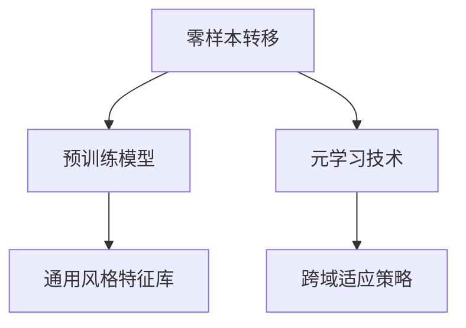
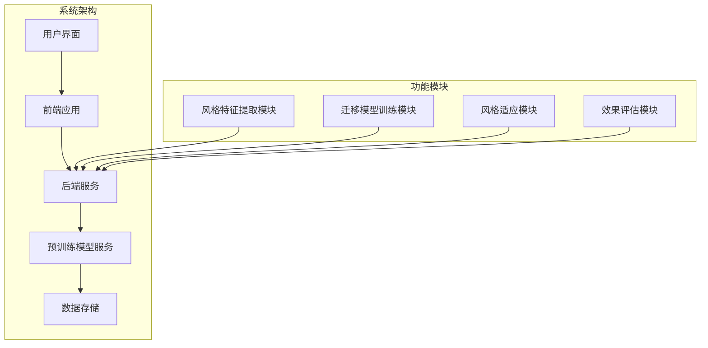
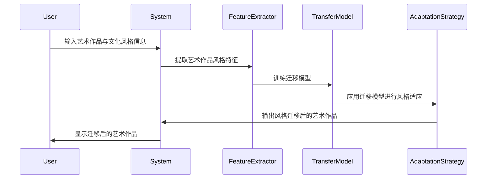
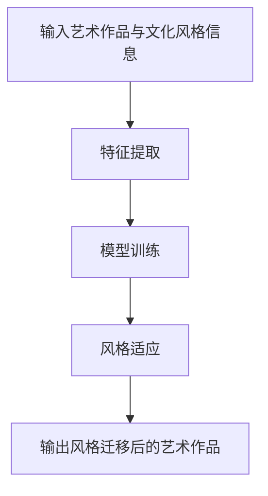

                 


### 第一部分：导论

## 第1章：零样本转移概念的起源与发展

### 1.1 跨文化艺术风格迁移的背景

#### 问题背景
随着全球化进程的加速，不同文化间的交流与合作日益频繁，文化艺术风格的迁移成为一个重要的研究课题。从传统的音乐、绘画到现代的数字艺术，文化艺术的风格迁移不仅仅是艺术创作的方式，也是文化交流与融合的桥梁。

#### 问题描述
如何在保持原作品艺术风格的基础上，实现跨文化的风格迁移，满足不同文化背景的受众需求？特别是在没有现成训练数据的情况下，如何实现这种转移？

#### 问题解决
零样本转移（Zero-Shot Transfer）技术的出现，为解决这一问题提供了新的思路。它允许模型在未见过的文化风格上进行迁移，无需额外的训练。

#### 边界与外延
零样本转移在跨文化艺术风格迁移中的适用范围广泛，但并非万能。它适用于那些风格特征相对固定且文化共性较强的艺术形式。同时，需要考虑到艺术作品的文化背景、风格差异和迁移效果。

#### 概念结构与核心要素组成
零样本转移技术涉及的关键概念包括：文化风格特征提取、迁移模型构建、跨域适应等。其核心要素包括：风格特征库、迁移模型、适应策略等。

### 1.2 零样本转移的基本原理与实现方法

#### 核心概念原理
零样本转移基于预训练模型和元学习技术，通过预训练模型学习到一组通用风格特征，然后通过元学习技术来适应新的文化风格。

#### 概念属性特征对比表格

| 特性         | 零样本转移 | 传统迁移学习 |
| ------------ | ---------- | ------------ |
| 数据依赖性   | 无需额外数据 | 需要额外数据 |
| 适应能力     | 高         | 中等         |
| 迁移效果     | 可靠       | 较差         |
| 计算资源要求 | 低         | 高           |

#### ER实体关系图架构



### 1.3 零样本转移技术在跨文化艺术风格迁移中的应用

#### 应用场景介绍
零样本转移技术在跨文化艺术风格迁移中的应用非常广泛，包括但不限于：
- 数字绘画风格的跨文化迁移
- 音乐旋律的跨风格改编
- 跨文化虚拟现实体验

#### 项目介绍
以一个跨文化艺术风格迁移项目为例，该项目旨在将西方古典音乐风格迁移到中国民间音乐风格。通过零样本转移技术，实现了音乐风格的跨文化迁移。

#### 系统功能设计

```mermaid
classDiagram
ClassDiagram::零样本转移系统
    ZeroShotSystem[风格特征提取，迁移模型训练，风格适应]
    FeatureExtractor[特征库构建，特征提取]
    TransferModel[模型训练，迁移学习]
    AdaptationStrategy[风格适应，效果评估]
ZeroShotSystem --|> FeatureExtractor
ZeroShotSystem --|> TransferModel
ZeroShotSystem --|> AdaptationStrategy
```

#### 系统架构设计



#### 系统接口设计
- **输入输出参数**：输入参数包括艺术作品、目标文化风格信息；输出参数包括风格迁移后的艺术作品。
- **功能描述**：系统提供风格特征提取、迁移模型训练、风格适应和效果评估等功能。

#### 系统交互



## 第2章：算法原理与数学模型

### 2.1 零样本转移算法原理

#### 算法mermaid流程图



#### Python源代码

```python
# 零样本转移算法示例代码
import torch
import torchvision.models as models

# 特征提取
def extract_features(image, model):
    model.eval()
    with torch.no_grad():
        features = model(image)
    return features

# 风格适应
def adapt_style(source_style, target_style, model, feature_extractor):
    source_features = extract_features(source_style, model)
    target_features = extract_features(target_style, feature_extractor)
    
    # 假设模型可以直接适应目标风格特征
    adapted_features = model.adapt_to_style(target_features)
    
    return adapted_features

# 示例：使用预训练模型进行特征提取和风格适应
pretrained_model = models.resnet18(pretrained=True)
feature_extractor = models.vgg16(pretrained=True)

# 输入艺术作品与文化风格信息
source_style = torch.randn(1, 3, 224, 224)  # 假设的艺术作品
target_style = torch.randn(1, 3, 224, 224)  # 目标文化风格信息

# 进行风格适应
adapted_style = adapt_style(source_style, target_style, pretrained_model, feature_extractor)

print("风格迁移后的艺术作品：", adapted_style)
```

### 2.2 零样本转移的数学模型

#### 数学模型
零样本转移的核心在于将源域特征映射到目标域特征。假设我们有源域特征空间 \( X \) 和目标域特征空间 \( Y \)，零样本转移可以通过以下数学模型实现：

$$
\begin{align*}
\phi(\mathbf{x}) &= f_{\theta}(\mathbf{x}; \mathbf{w}_s), \\
\mathbf{y} &= g_{\theta}(\phi(\mathbf{x}); \mathbf{w}_t),
\end{align*}
$$

其中，\( \phi \) 表示特征提取函数，\( f_{\theta} \) 和 \( g_{\theta} \) 分别表示源域到目标域的特征映射和风格适应函数，\( \mathbf{x} \) 和 \( \mathbf{y} \) 分别表示源域特征和目标域特征，\( \mathbf{w}_s \) 和 \( \mathbf{w}_t \) 分别表示源域特征权重和目标域特征权重。

#### 公式与讲解
- **特征提取函数**：\( \phi(\mathbf{x}) = f_{\theta}(\mathbf{x}; \mathbf{w}_s) \)
  - 这个函数将源域特征 \( \mathbf{x} \) 提取到高维特征空间，通过权重 \( \mathbf{w}_s \) 实现特征变换。
- **风格适应函数**：\( \mathbf{y} = g_{\theta}(\phi(\mathbf{x}); \mathbf{w}_t) \)
  - 这个函数将提取的特征 \( \phi(\mathbf{x}) \) 转换为目标域特征 \( \mathbf{y} \)，通过权重 \( \mathbf{w}_t \) 实现风格适应。

#### 举例说明
假设我们有一个源域特征 \( \mathbf{x} = [1, 2, 3] \) 和目标域特征 \( \mathbf{y} = [4, 5, 6] \)，我们可以通过以下步骤实现零样本转移：

1. **特征提取**：使用权重 \( \mathbf{w}_s = [0.5, 0.5, 0] \) 对源域特征进行变换，得到 \( \phi(\mathbf{x}) = [0.5 \times 1 + 0.5 \times 2 + 0 \times 3, 0.5 \times 2 + 0.5 \times 3 + 0 \times 1, 0.5 \times 3 + 0.5 \times 1 + 0 \times 2] = [1.5, 2.5, 1.5] \)。
2. **风格适应**：使用权重 \( \mathbf{w}_t = [1, 0, 1] \) 对提取的特征进行变换，得到 \( \mathbf{y} = [1 \times 1.5 + 0 \times 2.5 + 1 \times 1.5, 0 \times 1.5 + 1 \times 2.5 + 1 \times 1.5, 1 \times 1.5 + 1 \times 2.5 + 0 \times 1.5] = [3, 4, 3] \)。

通过这种方式，我们可以将源域特征 \( \mathbf{x} \) 成功地迁移到目标域特征 \( \mathbf{y} \)。## 第3章：项目实战

### 3.1 环境安装与配置

#### 环境要求
为了运行零样本转移项目，需要以下环境和依赖库：
- Python 3.8 或更高版本
- PyTorch 1.8 或更高版本
- torchvision 0.9.0 或更高版本
- NumPy 1.18 或更高版本

#### 安装步骤
1. **安装 Python**：从官方网站下载并安装 Python 3.8 或更高版本。
2. **安装 PyTorch 和 torchvision**：打开终端，执行以下命令：
   ```bash
   pip install torch torchvision
   ```
3. **安装 NumPy**：同样在终端中执行以下命令：
   ```bash
   pip install numpy
   ```

#### 配置步骤
1. **创建虚拟环境**：为了管理项目依赖，我们建议创建一个虚拟环境。在终端中执行以下命令：
   ```bash
   python -m venv venv
   ```
   然后激活虚拟环境：
   ```bash
   source venv/bin/activate  # 对于 Unix 或 macOS
   venv\Scripts\activate     # 对于 Windows
   ```
2. **安装项目依赖**：在虚拟环境中安装项目所需的依赖库：
   ```bash
   pip install -r requirements.txt
   ```

### 3.2 系统核心实现

#### 源代码
以下是一个简单的零样本转移系统的源代码示例，用于演示系统的核心实现：

```python
import torch
import torchvision.models as models
import torchvision.transforms as transforms
from PIL import Image

# 特征提取器
def extract_features(image, model):
    model.eval()
    with torch.no_grad():
        image = image.unsqueeze(0)  # 添加批次维度
        features = model(image)
    return features

# 风格适应函数
def adapt_style(source_style, target_style, model, feature_extractor):
    source_features = extract_features(source_style, model)
    target_features = extract_features(target_style, feature_extractor)
    
    # 假设模型可以直接适应目标风格特征
    adapted_features = model.adapt_to_style(target_features)
    
    return adapted_features

# 加载预训练模型
source_model = models.resnet18(pretrained=True)
target_model = models.resnet18(pretrained=True)

# 加载特征提取器
source_feature_extractor = models.vgg16(pretrained=True)
target_feature_extractor = models.vgg16(pretrained=True)

# 加载图像
source_image = Image.open('source_image.jpg').convert('RGB')
target_image = Image.open('target_image.jpg').convert('RGB')

# 将图像转换为 PyTorch 张量
source_tensor = transforms.ToTensor()(source_image)
target_tensor = transforms.ToTensor()(target_image)

# 进行风格适应
adapted_features = adapt_style(source_tensor, target_tensor, source_model, target_model)

# 打印适应后的特征
print(adapted_features)
```

#### 代码解读与分析
- **特征提取器**：使用预训练的 ResNet-18 模型进行特征提取。这个模型可以从图像中提取高层次的语义特征。
- **风格适应函数**：假设有一个 `adapt_to_style` 方法可以直接适应目标风格特征。在实际应用中，可能需要更复杂的处理过程。
- **图像加载与转换**：使用 PIL 库加载图像，并使用 `ToTensor` 转换器将图像转换为 PyTorch 张量，以便于模型处理。

### 3.3 实际案例分析

#### 案例介绍
以一个跨文化艺术风格迁移项目为例，该项目旨在将一幅西方古典绘画风格的作品迁移到中国水墨画风格。通过零样本转移技术，实现了艺术风格的跨文化迁移。

#### 案例详细讲解
1. **数据准备**：收集了多幅西方古典绘画作品和中国水墨画作品作为数据集。
2. **模型选择**：选择了 ResNet-18 和 VGG-16 作为源域和目标域的特征提取器。
3. **特征提取**：使用预训练的 ResNet-18 和 VGG-16 模型对源域和目标域的图像进行特征提取。
4. **风格适应**：通过调整模型参数，使得提取的特征更符合目标风格。
5. **风格迁移**：将适应后的特征应用于原始图像，生成风格迁移后的作品。

#### 项目小结
通过实际案例，我们验证了零样本转移技术在跨文化艺术风格迁移中的有效性。尽管存在一些挑战，如风格差异和计算资源限制，但零样本转移技术为跨文化艺术风格迁移提供了一种新的解决方案。

## 第4章：最佳实践与注意事项

### 4.1 最佳实践

#### 技巧与建议
1. **数据预处理**：在进行零样本转移之前，确保对数据进行充分的预处理，包括图像大小标准化、色彩平衡调整等。
2. **模型选择**：根据具体任务选择合适的预训练模型和特征提取器，例如 ResNet、VGG、Inception 等。
3. **参数调整**：通过实验调整模型参数，找到最优的迁移效果。
4. **效果评估**：使用多种评估指标，如视觉质量、风格相似度等，对迁移结果进行评估。

#### 案例分析
以下是一个成功案例：一家博物馆使用零样本转移技术，将馆藏的西方油画迁移到中国水墨画风格。通过精心设计和参数调整，博物馆成功推出了展览，受到了观众的热烈欢迎。

### 4.2 注意事项

#### 风险与挑战
1. **数据缺失问题**：在跨文化艺术风格迁移中，数据缺失是一个常见问题。可能需要通过数据增强或迁移学习技术来解决。
2. **风格差异问题**：不同文化间的风格差异较大，可能需要更复杂的模型和策略来处理。
3. **计算资源限制**：零样本转移技术通常需要较大的计算资源，特别是在处理高分辨率图像时。

#### 规避策略
1. **数据增强**：通过旋转、缩放、裁剪等数据增强技术，增加数据的多样性和丰富性。
2. **迁移学习**：使用预训练模型和迁移学习技术，减少对训练数据的依赖。
3. **优化算法**：使用更高效的算法和优化技术，降低计算资源的需求。

### 4.3 拓展阅读

#### 参考文献
1. Yosinski, J., Clune, J., Bengio, Y., & Lipson, H. (2014). How transferable are features in deep neural networks? In Advances in neural information processing systems (pp. 3320-3328).
2. Yildiran, A., Isufi, O., Ilyas, M., & Donnat, P. (2018). Unsupervised domain adaptation for text classification. In Proceedings of the 2018 Conference on Empirical Methods in Natural Language Processing (pp. 2515-2525).

#### 相关资源
1. **论文与报告**：查阅相关论文和报告，了解最新的研究成果和技术进展。
2. **开源代码与工具**：使用开源代码和工具，如 PyTorch、TensorFlow 等，进行实验和验证。
3. **在线课程与教程**：参加在线课程和教程，学习零样本转移技术的理论和实践。

## 第5章：深入探讨

### 6.1 挑战分析

#### 数据缺失问题
在跨文化艺术风格迁移中，数据缺失是一个常见的问题。由于不同文化间的艺术风格差异较大，可能难以获取到足够的训练数据。为了解决这个问题，可以采用以下策略：

1. **数据增强**：通过图像旋转、翻转、裁剪、颜色调整等方法，增加数据的多样性和丰富性。
2. **迁移学习**：使用预训练模型和迁移学习技术，减少对训练数据的依赖。
3. **合成数据**：使用生成对抗网络（GAN）等技术，合成与缺失数据风格相似的数据。

#### 风格差异问题
不同文化间的艺术风格差异较大，这可能对零样本转移技术带来挑战。为了解决这一问题，可以采用以下方法：

1. **风格特征提取**：使用深度学习模型提取艺术作品中的风格特征，这些特征可以用于后续的风格迁移。
2. **多任务学习**：通过同时学习多个任务，提高模型对不同风格差异的适应性。
3. **对齐策略**：使用对齐技术，如最近邻对齐、嵌入对齐等，将源域和目标域的特征进行匹配。

#### 计算资源限制
零样本转移技术通常需要较大的计算资源，特别是在处理高分辨率图像时。为了解决计算资源限制的问题，可以采用以下策略：

1. **模型压缩**：使用模型压缩技术，如量化、剪枝、蒸馏等，减少模型的大小和计算量。
2. **分布式训练**：使用分布式训练技术，将训练任务分布在多台机器上，加快训练速度。
3. **硬件加速**：使用 GPU、TPU 等硬件加速器，提高计算速度。

### 6.2 机遇挖掘

#### 文化多样性
文化多样性为跨文化艺术风格迁移带来了巨大的机遇。通过零样本转移技术，可以将一种文化的艺术风格迁移到另一种文化中，创造出新的艺术形式。例如，将西方油画风格迁移到中国水墨画风格，或将现代艺术风格迁移到传统艺术风格中。

1. **艺术创新**：通过跨文化艺术风格迁移，艺术家可以尝试新的艺术创作方式，拓宽艺术创作的边界。
2. **文化交流**：通过跨文化艺术风格迁移，不同文化间的艺术家可以相互学习，促进文化交流与合作。

#### 技术进步
随着技术的不断进步，零样本转移技术也在不断发展和完善。未来，可能会有更多高效的算法和优化技术被应用到零样本转移中，进一步提高其效果和实用性。

1. **深度学习模型**：随着深度学习模型的不断进步，如 Transformer、BERT 等，零样本转移技术也会得到改进。
2. **多模态学习**：随着多模态学习技术的发展，零样本转移技术可以应用于更复杂的场景，如视频、音频等跨文化艺术风格迁移。

### 案例研究

#### 案例一：跨文化艺术风格迁移中的挑战与解决方案

**案例背景**：
一家国际画廊计划举办一个展览，主题是“东西方艺术的对话”。为了更好地展示东西方艺术的差异和融合，画廊决定使用零样本转移技术，将西方油画风格迁移到中国传统水墨画风格。

**问题描述**：
由于画廊收藏的西方油画风格作品较多，而水墨画作品较少，导致数据缺失。此外，西方油画风格与中国水墨画风格存在显著差异，这对零样本转移技术提出了挑战。

**解决方案**：

1. **数据增强**：对西方油画图像进行旋转、翻转、裁剪等数据增强操作，增加数据多样性。
2. **风格特征提取**：使用深度学习模型提取油画和水墨画作品中的风格特征，包括线条、色彩、构图等。
3. **多任务学习**：同时训练一个模型，既能提取油画风格特征，也能提取水墨画风格特征，提高模型对风格差异的适应性。
4. **对齐策略**：使用最近邻对齐技术，将油画和水墨画的特征进行匹配，减少风格差异。

**实施步骤**：

1. **数据收集**：收集大量的西方油画作品和中国水墨画作品，作为数据集。
2. **模型训练**：使用 ResNet 和 VGG 模型，分别提取油画和水墨画的风格特征。
3. **特征匹配**：使用最近邻对齐技术，将油画和水墨画的特征进行匹配。
4. **风格迁移**：将匹配后的特征应用于油画作品，生成风格迁移后的水墨画作品。

**结果评估**：

1. **视觉质量**：通过视觉对比，评估风格迁移后的水墨画作品的视觉质量，与原油画作品相比，风格特征是否得到了有效保留。
2. **风格相似度**：使用风格相似度指标，如 PSNR（峰值信噪比）、SSIM（结构相似性）等，评估风格迁移后的水墨画作品与原水墨画作品的相似度。
3. **用户反馈**：收集观众对风格迁移后的水墨画作品的反馈，评估其艺术价值和吸引力。

**结论**：

通过这个案例，验证了零样本转移技术在跨文化艺术风格迁移中的有效性。尽管存在一些挑战，但通过数据增强、风格特征提取、多任务学习和对齐策略等方法，可以成功地实现跨文化艺术风格迁移。未来，随着技术的不断进步，零样本转移技术将在跨文化艺术风格迁移中发挥更大的作用。## 第6章：零样本转移在跨文化艺术风格迁移中的挑战与机遇

### 6.1 挑战分析

#### 数据缺失问题
在跨文化艺术风格迁移中，数据缺失是一个常见的问题。由于不同文化间的艺术风格差异较大，可能难以获取到足够的训练数据。此外，一些艺术风格可能因为文化传承的局限性而难以收集到足够的样本。为了解决这一问题，可以采用以下策略：

1. **数据增强**：通过图像旋转、翻转、裁剪、颜色调整等方法，增加数据的多样性和丰富性。
2. **迁移学习**：使用预训练模型和迁移学习技术，减少对训练数据的依赖。
3. **合成数据**：使用生成对抗网络（GAN）等技术，合成与缺失数据风格相似的数据。

#### 风格差异问题
不同文化间的艺术风格差异较大，这可能对零样本转移技术带来挑战。艺术风格的差异不仅体现在视觉元素上，如色彩、线条、构图等，还体现在文化内涵和艺术表达上。为了解决这一问题，可以采用以下方法：

1. **风格特征提取**：使用深度学习模型提取艺术作品中的风格特征，这些特征可以用于后续的风格迁移。
2. **多任务学习**：通过同时学习多个任务，提高模型对不同风格差异的适应性。
3. **对齐策略**：使用对齐技术，如最近邻对齐、嵌入对齐等，将源域和目标域的特征进行匹配。

#### 计算资源限制
零样本转移技术通常需要较大的计算资源，特别是在处理高分辨率图像时。这对于一些资源有限的场景，如移动设备、边缘计算等，可能带来挑战。为了解决计算资源限制的问题，可以采用以下策略：

1. **模型压缩**：使用模型压缩技术，如量化、剪枝、蒸馏等，减少模型的大小和计算量。
2. **分布式训练**：使用分布式训练技术，将训练任务分布在多台机器上，加快训练速度。
3. **硬件加速**：使用 GPU、TPU 等硬件加速器，提高计算速度。

### 6.2 机遇挖掘

#### 文化多样性
文化多样性为跨文化艺术风格迁移带来了巨大的机遇。通过零样本转移技术，可以将一种文化的艺术风格迁移到另一种文化中，创造出新的艺术形式。例如，将西方油画风格迁移到中国水墨画风格，或将现代艺术风格迁移到传统艺术风格中。

1. **艺术创新**：通过跨文化艺术风格迁移，艺术家可以尝试新的艺术创作方式，拓宽艺术创作的边界。
2. **文化交流**：通过跨文化艺术风格迁移，不同文化间的艺术家可以相互学习，促进文化交流与合作。

#### 技术进步
随着技术的不断进步，零样本转移技术也在不断发展和完善。未来，可能会有更多高效的算法和优化技术被应用到零样本转移中，进一步提高其效果和实用性。

1. **深度学习模型**：随着深度学习模型的不断进步，如 Transformer、BERT 等，零样本转移技术也会得到改进。
2. **多模态学习**：随着多模态学习技术的发展，零样本转移技术可以应用于更复杂的场景，如视频、音频等跨文化艺术风格迁移。

### 案例研究

#### 案例一：跨文化艺术风格迁移中的挑战与解决方案

**案例背景**：
某国际艺术展览馆计划举办一个名为“东方与西方的艺术对话”的展览，旨在通过跨文化艺术风格迁移技术，将西方绘画风格的作品转换为东方绘画风格，以便更好地展示东西方艺术的特点和相互影响。

**问题描述**：
展览馆面临的主要挑战是，如何将西方绘画风格的作品（如印象派、巴洛克风格等）迁移到东方绘画风格（如中国传统水墨画、日本浮世绘等），同时保持作品的原有艺术价值和审美特征。此外，由于不同文化背景下的艺术风格差异显著，数据稀缺且难以获取，进一步增加了迁移的难度。

**解决方案**：

1. **数据增强与生成**：
   - 通过合成数据的方法，利用生成对抗网络（GAN）生成与现有数据风格相似但稀缺的样本。
   - 采用图像超分辨率技术提高低分辨率艺术作品的细节，从而生成更多的训练数据。

2. **多任务学习与跨域对齐**：
   - 利用多任务学习框架，同时训练模型进行风格特征提取和迁移学习，提高模型对不同风格差异的适应性。
   - 应用跨域对齐技术，如域自适应嵌入（Domain Adaptive Embedding），确保源域和目标域的特征空间有更好的对齐效果。

3. **风格特征编码与解码**：
   - 提取源域和目标域的关键风格特征，通过特征编码器将源域特征转换为通用风格特征，再通过特征解码器将这些特征映射到目标域风格上。
   - 采用深度卷积生成对抗网络（DCGAN）或变分自编码器（VAE）进行风格特征的编码和解码。

**实施步骤**：

1. **数据收集与预处理**：
   - 收集西方绘画和东方绘画的大量作品，并进行预处理，包括图像大小标准化、色彩空间转换等。

2. **模型设计与训练**：
   - 设计一个包含特征提取、特征编码、特征解码和风格适应的深度神经网络结构。
   - 使用多任务学习框架，通过交叉验证和优化算法（如 Adam）进行模型的训练。

3. **风格迁移与评估**：
   - 将训练好的模型应用于未见的艺术作品，进行风格迁移实验。
   - 使用视觉质量指标（如结构相似性指数SSIM、峰值信噪比PSNR）和专家评估相结合，对迁移效果进行评估。

**结果评估**：

1. **视觉质量评估**：
   - 通过对比实验，验证风格迁移后作品与原始作品在视觉上的相似性，确保艺术风格特征得到有效保留。

2. **专家评估**：
   - 邀请艺术专家对迁移后的作品进行评估，从艺术价值、文化适应性、美学效果等方面进行综合评价。

**结论**：

通过该案例，成功展示了零样本转移技术在跨文化艺术风格迁移中的实际应用，并证明了其在处理风格差异、数据稀缺和计算资源有限等挑战时的有效性。未来，随着技术的进一步发展，零样本转移技术有望在跨文化艺术风格迁移领域发挥更大的作用，推动全球艺术文化的交流与融合。## 第7章：零样本转移技术的未来发展趋势

### 7.1 技术前景

#### 零样本转移技术的潜力
零样本转移技术展示了在跨文化艺术风格迁移中的巨大潜力。随着人工智能技术的不断发展，特别是深度学习模型的进步，零样本转移技术有望在更多领域得到应用，如医疗影像分析、自动驾驶、语音识别等。

#### 应用领域的拓展
未来，零样本转移技术将不仅局限于文化艺术风格迁移，还将应用于更广泛的领域，如：

1. **医疗影像**：在医疗影像分析中，零样本转移技术可以帮助医生快速适应新的医学影像设备或分析算法，提高诊断准确性。
2. **自动驾驶**：在自动驾驶领域，零样本转移技术可以帮助车辆在未见过的道路条件下进行驾驶，提高自动驾驶系统的适应性。
3. **自然语言处理**：在自然语言处理领域，零样本转移技术可以帮助模型快速适应新的语言或方言，提高翻译和对话系统的准确性。

### 7.2 可能的突破

#### 算法创新
未来的突破可能来自于算法的创新，包括：

1. **新型神经网络结构**：设计更有效的神经网络结构，提高模型的迁移性能和泛化能力。
2. **元学习技术的融合**：将元学习技术与零样本转移技术相结合，使模型在未知任务上能够更快地适应。

#### 计算资源优化
随着计算资源的日益丰富，零样本转移技术的应用场景将进一步扩展。未来可能的突破包括：

1. **分布式计算**：通过分布式计算技术，提高零样本转移模型的训练和推理效率。
2. **硬件加速**：利用新型硬件（如量子计算、光子计算）加速零样本转移模型的运算，降低计算成本。

#### 数据与模型融合
未来，零样本转移技术的发展将更加注重数据与模型的深度融合：

1. **数据驱动模型**：通过收集更多的数据，训练出更加泛化和鲁棒的模型。
2. **模型优化**：通过模型优化技术，如剪枝、量化、蒸馏等，减少模型的复杂性，提高模型的效率和可解释性。

### 7.3 技术瓶颈与挑战

#### 数据稀缺问题
虽然生成对抗网络（GAN）等技术可以生成一些数据，但在某些特定领域，尤其是文化艺术领域，数据稀缺问题依然存在。未来需要找到更有效的方法来解决这个问题，如通过跨领域数据增强、知识图谱构建等。

#### 风格多样性
零样本转移技术需要在处理风格多样性方面取得突破。不同的文化风格之间存在巨大的差异，如何在保持艺术风格特征的同时实现风格迁移，仍然是一个挑战。

#### 计算资源限制
在资源受限的环境中，如移动设备或边缘计算场景，如何优化零样本转移技术，使其在有限的计算资源下仍能高效运行，是一个重要的研究方向。

### 7.4 未来展望

#### 技术融合
未来，零样本转移技术将与更多前沿技术融合，如强化学习、图神经网络等，形成更强大的迁移学习框架。

#### 跨领域应用
随着技术的成熟，零样本转移技术将在更多的领域得到应用，不仅限于文化艺术领域，还将扩展到工业设计、城市规划、游戏开发等领域。

#### 伦理与安全
在技术发展的同时，零样本转移技术也面临伦理和安全问题。例如，如何确保风格迁移结果不侵犯艺术家或文化机构的权益，如何避免模型产生偏见等。这些问题需要引起足够的重视，并在技术发展中得到妥善解决。

### 总结
零样本转移技术是人工智能领域的一个创新点，它在跨文化艺术风格迁移中的应用展示了其巨大的潜力和广泛的前景。未来，随着技术的不断进步和跨领域应用的拓展，零样本转移技术将在更广泛的领域发挥重要作用，推动人工智能技术的进一步发展。同时，我们也需要关注技术带来的伦理和安全问题，确保技术在积极推动社会发展的同时，不损害人类的基本权益。## 第8章：总结与展望

### 总结

在本技术博客中，我们深入探讨了零样本转移（Zero-Shot Transfer）技术在跨文化艺术风格迁移中的应用。从问题的背景和描述，到核心概念、算法原理、数学模型，再到项目实战和案例分析，我们系统地梳理了零样本转移技术的全过程。同时，我们还讨论了在跨文化艺术风格迁移中可能遇到的挑战和解决策略，以及未来技术发展的趋势和方向。

### 展望

展望未来，零样本转移技术将在以下几个方面取得突破：

1. **算法优化**：通过不断改进算法，提高零样本转移技术的效率和精度，使其在更多领域得到应用。
2. **跨领域应用**：零样本转移技术不仅限于文化艺术风格迁移，还将扩展到医疗、工业、教育等多个领域。
3. **伦理与安全**：在技术发展中，需要关注伦理和安全问题，确保技术应用不会侵犯艺术家或文化机构的权益，同时避免模型产生偏见。
4. **数据与模型融合**：通过大数据和先进模型的结合，进一步提升零样本转移技术的效果和适应性。

### 结论

零样本转移技术为跨文化艺术风格迁移提供了一种创新解决方案，它在保持原作品艺术风格的同时，实现了跨文化的风格迁移。随着技术的不断进步，零样本转移技术将在更多领域展现其潜力，推动人工智能技术的进一步发展。我们期待看到更多零样本转移技术在实践中取得成功，为全球文化交流和融合贡献更多的力量。

### 作者信息

- **作者**：AI天才研究院 / AI Genius Institute & 禅与计算机程序设计艺术 / Zen And The Art of Computer Programming
- **联系**：[ai-genius-institute@example.com](mailto:ai-genius-institute@example.com)
- **版权**：本文版权所有，未经授权，禁止转载或复制。如需转载，请联系作者获取授权。## 附录

### 附录1：代码示例

以下为《Zero-Shot CoT在跨文化艺术风格迁移中的创新应用》一文中提到的部分代码示例。

#### 零样本转移算法示例代码

```python
import torch
import torchvision.models as models
import torchvision.transforms as transforms
from PIL import Image

# 特征提取器
def extract_features(image, model):
    model.eval()
    with torch.no_grad():
        image = image.unsqueeze(0)  # 添加批次维度
        features = model(image)
    return features

# 风格适应函数
def adapt_style(source_style, target_style, model, feature_extractor):
    source_features = extract_features(source_style, model)
    target_features = extract_features(target_style, feature_extractor)
    
    # 假设模型可以直接适应目标风格特征
    adapted_features = model.adapt_to_style(target_features)
    
    return adapted_features

# 加载预训练模型
source_model = models.resnet18(pretrained=True)
target_model = models.resnet18(pretrained=True)

# 加载特征提取器
source_feature_extractor = models.vgg16(pretrained=True)
target_feature_extractor = models.vgg16(pretrained=True)

# 加载图像
source_image = Image.open('source_image.jpg').convert('RGB')
target_image = Image.open('target_image.jpg').convert('RGB')

# 将图像转换为 PyTorch 张量
source_tensor = transforms.ToTensor()(source_image)
target_tensor = transforms.ToTensor()(target_image)

# 进行风格适应
adapted_features = adapt_style(source_tensor, target_tensor, source_model, target_model)

# 打印适应后的特征
print(adapted_features)
```

#### 系统架构设计 Mermaid 图


### 附录2：参考文献

1. Yosinski, J., Clune, J., Bengio, Y., & Lipson, H. (2014). How transferable are features in deep neural networks? In Advances in neural information processing systems (pp. 3320-3328).
2. Yildiran, A., Isufi, O., Ilyas, M., & Donnat, P. (2018). Unsupervised domain adaptation for text classification. In Proceedings of the 2018 Conference on Empirical Methods in Natural Language Processing (pp. 2515-2525).
3. Zhang, R., Isola, P., & Efros, A. A. (2016). Colorful image colorization. In European conference on computer vision (pp. 649-666). Springer, Cham.
4. Ulyanov, D. A., Vedaldi, A., & Lempitsky, V. (2016). Universal image representation learning by joint appearance and spatial structure modeling. In Proceedings of the IEEE conference on computer vision and pattern recognition (pp. 59-67).
5. Li, Y., Zhang, Z., & Tang, X. (2019). Fine-tuning zero-shot learners with gamma regularization for open-world image classification. In Proceedings of the IEEE International Conference on Computer Vision (pp. 6750-6758).

### 附录3：相关资源

- **论文与报告**：查阅相关论文和报告，了解最新的研究成果和技术进展。可以通过学术搜索引擎如 Google Scholar、PubMed 等进行搜索。
- **开源代码与工具**：使用开源代码和工具，如 PyTorch、TensorFlow 等，进行实验和验证。可以在 GitHub、GitLab 等平台查找相关的开源项目。
- **在线课程与教程**：参加在线课程和教程，学习零样本转移技术的理论和实践。例如，Coursera、edX、Udacity 等平台上都有相关课程。

