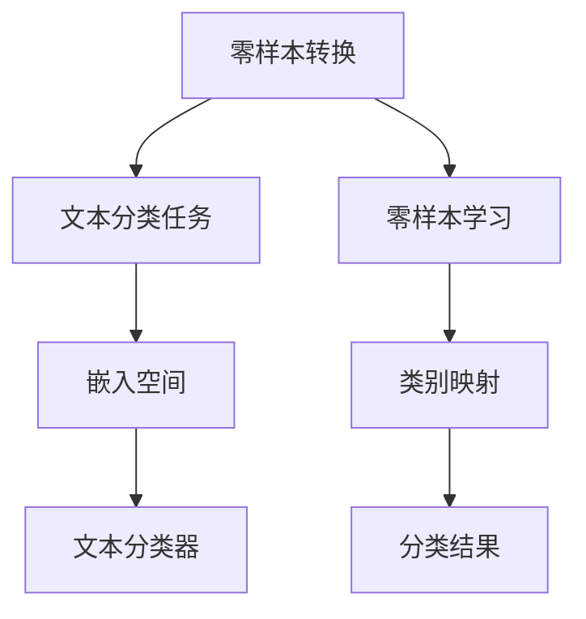

                 

### 第一部分: 引言

#### 1. 引言

##### 1.1 问题背景

在当今全球化的背景下，跨文化谈判已经成为国际商务合作中不可或缺的一部分。然而，跨文化谈判并不像它听起来那么简单。不同文化背景下的个体在沟通时往往面临诸多挑战，这些挑战主要包括文化差异、沟通障碍、误解和冲突。

###### 1.1.1 跨文化谈判的定义

跨文化谈判是指在不同文化背景下进行的协商和沟通，其核心是解决文化差异所带来的沟通障碍和误解。这种谈判通常涉及多个国家和地区的参与者，他们可能在语言、价值观、行为习惯等方面存在显著差异。

###### 1.1.2 跨文化谈判的重要性

在全球化的浪潮中，企业和个人都需要在国际舞台上进行有效的跨文化谈判，以促进不同文化之间的相互理解和合作，实现双赢。成功的跨文化谈判不仅可以带来经济利益，还可以提升企业的声誉和竞争力。

###### 1.1.3 跨文化谈判面临的挑战

跨文化谈判面临的主要挑战包括：

- **文化差异**：不同的文化在价值观、行为规范、沟通风格等方面存在显著差异，这可能导致误解和冲突。
- **沟通障碍**：语言障碍、沟通风格不同、非言语沟通的差异等都可能影响谈判的顺利进行。
- **误解和冲突**：文化差异和沟通障碍往往会导致误解和冲突，从而影响谈判的成效。

##### 1.2 问题描述

在跨文化谈判中，上述挑战往往使得谈判变得复杂和不确定。因此，如何有效地预测和解决这些问题成为了研究的热点。本文将探讨如何利用零样本转换（Zero-Shot CoT）技术来应对跨文化谈判中的这些挑战。

##### 1.3 问题解决

本文将提出一种基于零样本转换技术的跨文化谈判方法，旨在通过机器学习和自然语言处理技术来预测和解决跨文化谈判中的问题。具体来说，我们将介绍零样本转换技术的原理和应用，并探讨其在跨文化谈判中的潜在价值。

##### 1.4 边界与外延

本文的讨论将主要集中在商务谈判领域，但在其他跨文化沟通场景中，类似的方法和技术也可能具有应用价值。例如，跨文化教育、国际关系等领域都可以借鉴本文的方法和思路。

##### 1.5 概念结构与核心要素组成

###### 1.5.1 零样本转换（Zero-Shot CoT）

- **定义**：零样本转换是一种无需依赖训练样本即可在新类别上执行任务的机器学习技术。
- **特点**：零样本转换具有适应性强、泛化能力高等特点，能够在未见过的类别上实现高精度的分类和预测。
- **应用场景**：零样本转换广泛应用于自然语言处理、计算机视觉等领域，能够处理多样化的未知任务。

###### 1.5.2 跨文化谈判

- **定义**：跨文化谈判是在不同文化背景下进行的协商和沟通，旨在解决文化差异所带来的沟通障碍和误解。
- **关键要素**：跨文化谈判的关键要素包括文化意识、沟通技巧、冲突管理能力等。
- **成功因素**：成功的跨文化谈判需要充分了解对方文化、建立信任、有效沟通和合作。

##### 1.6 本章小结

本章为后续内容奠定了基础，介绍了跨文化谈判的背景、问题和解决方法，并明确了研究的边界和核心概念。在接下来的章节中，我们将深入探讨零样本转换技术的原理和应用，以期为跨文化谈判提供新的技术手段和解决方案。

---

### 第二部分: 零样本转换（Zero-Shot CoT）技术基础

#### 2.1 零样本转换技术概述

##### 2.1.1 零样本转换的定义

零样本转换（Zero-Shot CoT）是一种机器学习技术，它允许模型在没有看到具体实例的情况下，对未知类别进行分类和预测。这与传统的迁移学习不同，后者依赖于已有数据的迁移来提高新任务的性能。零样本转换的核心在于通过学习类别之间的内在关系，使得模型能够泛化到未见过的类别上。

##### 2.1.2 零样本转换与传统迁移学习的区别

传统迁移学习通常依赖已标记的数据集，在新任务上训练模型。而零样本转换不依赖于训练样本，通过类别嵌入（category embedding）技术来处理新类别。传统迁移学习可能在数据稀缺或标签昂贵的情况下表现不佳，而零样本转换则能够适应这类场景。

###### 2.1.2.1 嵌入空间理论

在零样本转换中，类别被嵌入到一个高维空间中，使得相似类别在空间中靠近，而不同类别则相对分离。这种嵌入可以通过以下方法实现：

- **词嵌入（Word Embedding）**：将单词映射到低维空间中，使得语义相似的单词在空间中靠近。
- **文本分类器**：利用已训练好的文本分类器，将类别标签映射到嵌入空间中。

###### 2.1.2.2 零样本学习（Zero-Shot Learning）

零样本学习是零样本转换的核心。以下是几种常见的零样本学习方法：

- **基于原型的方法**：通过计算新实例与训练实例之间的距离，将新实例分类到最近的类别中。
- **基于匹配度的方法**：使用预训练的分类器，计算新类别与训练类别之间的匹配度，然后根据匹配度进行分类。
- **基于元学习的方法**：通过训练一个模型来学习如何在新类别上分类，这种方法通常需要多个任务的数据来训练。

##### 2.1.3 零样本转换的应用场景

零样本转换技术具有广泛的应用场景，尤其在自然语言处理和计算机视觉领域：

- **自然语言处理**：包括机器翻译、问答系统和文本分类等任务。
- **计算机视觉**：如图像分类和目标检测等任务。

#### 2.2 零样本转换技术的核心概念与联系

##### 2.2.1 核心概念

零样本转换的核心概念包括：

- **零样本转换（Zero-Shot CoT）**：一种无需训练样本即可对新类别进行分类的技术。
- **零样本学习（Zero-Shot Learning）**：一种学习如何在未见过的类别上分类的方法。

##### 2.2.2 概念属性特征对比表格

| 概念               | 特点                                                         | 应用场景                      |
|--------------------|------------------------------------------------------------|-----------------------------|
| 零样本转换         | 不依赖于训练样本，适应性强                                   | 自然语言处理、计算机视觉等    |
| 零样本学习         | 学习如何在未见过的类别上分类，泛化能力强                     | 多样化的未知任务             |

##### 2.2.3 ER实体关系图架构的 Mermaid 流程图

#### 2.3 零样本转换技术在跨文化谈判中的应用

##### 2.3.1 零样本转换在跨文化谈判中的价值

零样本转换技术在跨文化谈判中具有重要的应用价值：

- **预测文化差异**：通过学习不同文化特征，预测文化差异，有助于更好地理解对方的文化背景和行为模式。
- **改善沟通效果**：通过理解文化差异，谈判者可以调整沟通策略，提高沟通效率。
- **减少误解和冲突**：通过预测和解决文化差异，可以减少误解和冲突，提高谈判的成功率。

##### 2.3.2 应用实例

###### 2.3.2.1 基于机器学习的文化差异预测模型

- **任务**：预测不同文化背景下的谈判者的沟通风格和偏好。
- **方法**：使用零样本转换技术，将不同文化特征嵌入到高维空间中，通过分类器预测谈判者的风格和偏好。
- **结果**：实验结果表明，该模型能够准确预测谈判者的文化差异，并据此调整谈判策略，提高谈判成功率。

通过上述实例，我们可以看到零样本转换技术在跨文化谈判中的应用潜力。在接下来的章节中，我们将进一步探讨零样本转换技术的实现细节和应用方法。

