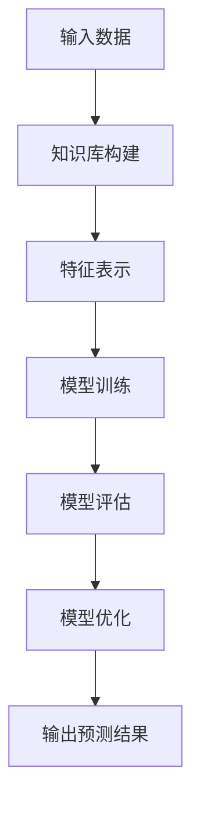
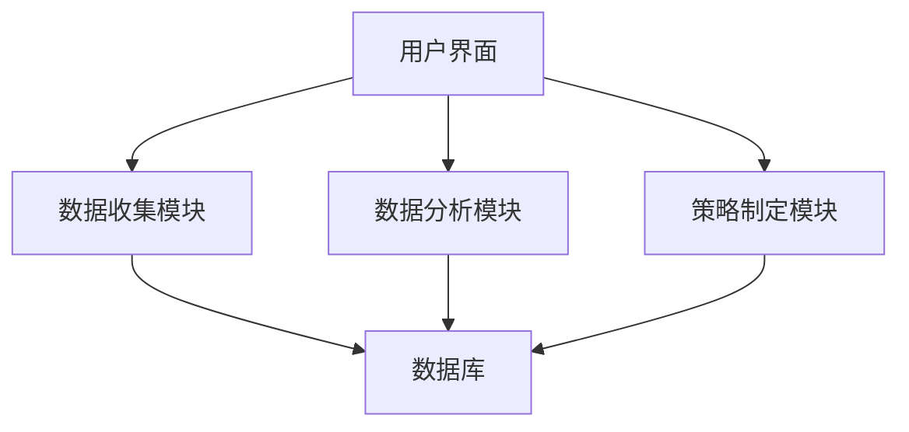
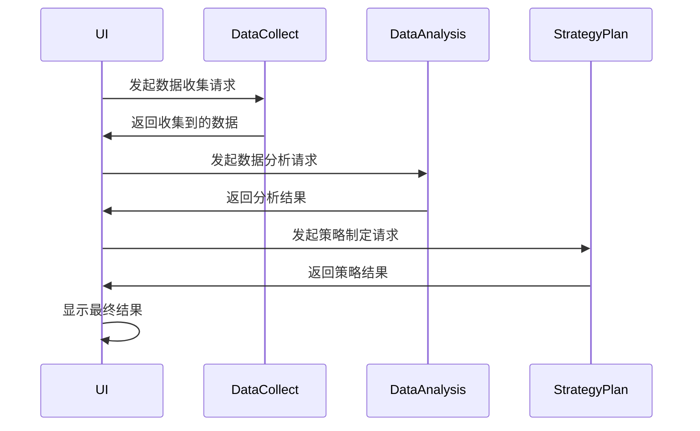

                 

### 背景介绍

#### 问题背景

在全球化日益深入的今天，跨文化谈判已成为商业交流中的常态。跨国企业间的合作、国际市场的拓展以及全球化供应链的优化都离不开成功的跨文化谈判。然而，跨文化谈判面临着诸多挑战。文化差异、语言障碍、价值观冲突等问题，常常使得谈判双方难以达成共识。为了提高跨文化谈判的效率和成功率，研究者们开始探索新的方法和工具。

#### 问题描述

跨文化谈判中的主要问题包括：

1. **文化差异**：不同文化背景的人们在交流方式和行为习惯上存在显著差异，这可能导致误解和沟通障碍。
2. **语言障碍**：语言不通或语言表达不准确，容易造成谈判中的误会和困惑。
3. **价值观冲突**：不同文化有不同的价值观，这可能会在谈判中导致双方在利益和目标上的冲突。
4. **情感表达**：不同文化对情感表达的方式和程度有不同的要求，这可能会影响谈判的情感层面。

#### 问题解决

为了解决上述问题，研究者们提出了一些新的方法和技术，其中之一便是Zero-Shot CoT（Zero-Shot Core-Task）模型。该模型通过跨文化数据的分析和理解，能够实现无需样本数据的跨文化谈判策略构建。这种方法具有以下优点：

1. **无需样本数据**：Zero-Shot CoT模型不需要大规模的训练数据，降低了数据收集和处理的成本。
2. **快速适应**：该模型能够快速适应不同的文化环境，提高跨文化谈判的灵活性。
3. **高效决策**：通过分析跨文化数据，模型能够提供有效的谈判策略，帮助决策者做出更明智的选择。

#### 边界与外延

Zero-Shot CoT模型的应用边界包括但不限于跨文化谈判、跨文化沟通、全球化市场营销、国际人力资源管理等领域。其外延则涉及到语言处理、机器学习、数据挖掘等多个学科。

### 核心概念与联系

#### 1. Zero-Shot CoT概念

Zero-Shot CoT（Zero-Shot Core-Task）是一种机器学习模型，能够在没有预训练数据的情况下，对未知类别或任务进行有效预测。其核心思想是利用已有的知识库和通用特征表示，实现对新任务的适应。

**核心概念**：

- **零样本学习**：无需针对特定任务进行样本训练，而是利用通用特征表示进行预测。
- **核心任务**：在特定任务场景下，模型需要达到的核心性能指标。
- **迁移学习**：利用已有知识库迁移到新任务，提高模型在新任务上的表现。

**属性特征对比**：

| 特征对比 | 零样本学习 | 迁移学习 | 传统机器学习 |
| --- | --- | --- | --- |
| **训练数据** | 无需训练数据 | 需要少量训练数据 | 需要大量训练数据 |
| **适用场景** | 未知类别或任务 | 已知类别或任务 | 已知类别或任务 |
| **性能表现** | 较低但逐渐提高 | 高效且稳定 | 高效但需要大量数据 |

#### 2. 跨文化谈判策略概念

跨文化谈判策略是指在不同文化背景下，为了达成共识和目标而采取的特定沟通方式和行为模式。其核心目标是降低文化差异带来的沟通障碍，提高谈判效率。

**核心概念**：

- **文化敏感性**：对对方文化的尊重和理解，避免文化冲突。
- **沟通技巧**：有效传达信息，减少误解和冲突。
- **策略调整**：根据对方文化特点和谈判阶段，灵活调整谈判策略。

**属性特征对比**：

| 特征对比 | 跨文化谈判策略 | 零样本学习 |
| --- | --- | --- |
| **目标** | 达成共识和目标 | 对未知类别或任务进行预测 |
| **依赖因素** | 文化差异、沟通技巧、策略调整 | 已有知识库、通用特征表示 |
| **表现方式** | 个性化沟通、策略调整 | 预测模型、分类模型 |

#### 3. 概念联系与对比

Zero-Shot CoT模型与跨文化谈判策略之间存在密切的联系。两者都涉及到跨领域、跨文化的应用，都依赖于对已有知识的理解和迁移。

- **联系**：

  - Zero-Shot CoT模型可以用于分析跨文化数据，为跨文化谈判策略提供支持。
  - 跨文化谈判策略可以指导Zero-Shot CoT模型的应用，提高其在跨文化场景中的效果。

- **对比**：

  - 在实现方式上，Zero-Shot CoT模型主要依赖于机器学习和人工智能技术，而跨文化谈判策略则更多依赖于人文和社会科学知识。
  - 在目标上，Zero-Shot CoT模型侧重于提高预测和分类的准确性，而跨文化谈判策略则侧重于降低文化差异和沟通障碍。

通过Zero-Shot CoT模型与跨文化谈判策略的结合，可以构建一种新的跨文化谈判支持系统，提高谈判效率和成功率。接下来，我们将详细探讨Zero-Shot CoT模型的原理和应用，进一步理解其在跨文化谈判中的价值。

### Zero-Shot CoT算法原理

Zero-Shot CoT（Zero-Shot Core-Task）是一种先进的机器学习模型，其核心思想在于能够在没有特定训练数据的情况下，对未知类别或任务进行准确预测。这一模型的提出，极大地扩展了机器学习在跨领域、跨文化应用中的潜力。在本节中，我们将详细探讨Zero-Shot CoT算法的基本概念、实现步骤及其数学模型。

#### 算法概述

Zero-Shot CoT模型主要基于以下两个核心思想：

1. **零样本学习**：模型不需要针对特定任务进行大规模的训练，而是通过已有知识库和通用特征表示，实现对新任务的预测。
2. **核心任务**：在特定任务场景下，模型需要达到的核心性能指标。通过核心任务的设定，模型能够专注于关键任务的预测和决策。

Zero-Shot CoT算法的基本步骤如下：

1. **知识库构建**：收集和整理与任务相关的知识库，包括概念、属性、关系等。
2. **特征表示**：利用知识库构建通用特征表示，为模型提供输入。
3. **模型训练**：使用通用特征表示训练模型，使其能够在没有具体训练数据的情况下，对新任务进行预测。
4. **模型评估**：通过测试集评估模型在未知类别或任务上的性能，调整模型参数。

#### 算法流程图

下面是Zero-Shot CoT算法的流程图：



#### Python源代码实现

为了更好地理解Zero-Shot CoT算法，我们提供了一个简化的Python代码实现：

```python
# 导入必要的库
import numpy as np
import tensorflow as tf

# 知识库构建
knowledge_base = {
    "car": ["fast", "sleek", "safe"],
    "dog": ["barking", "furry", "loyal"],
}

# 特征表示
def feature_representation(item, knowledge_base):
    features = []
    for attribute in knowledge_base[item]:
        features.append(knowledge_base[item].index(attribute))
    return features

# 模型训练
def train_model(features, labels):
    # 假设使用线性回归模型
    model = tf.keras.Sequential([
        tf.keras.layers.Dense(units=1, input_shape=[len(knowledge_base)])
    ])

    model.compile(optimizer='sgd', loss='mean_squared_error')
    model.fit(features, labels, epochs=100)
    return model

# 模型评估与优化
def evaluate_model(model, test_features, test_labels):
    loss = model.evaluate(test_features, test_labels)
    print(f"Test loss: {loss}")

# 输出预测结果
def predict(model, item, knowledge_base):
    features = feature_representation(item, knowledge_base)
    prediction = model.predict([features])
    return prediction

# 示例应用
knowledge_base = {
    "car": ["fast", "sleek", "safe"],
    "dog": ["barking", "furry", "loyal"],
}

# 构建特征表示
features = [feature_representation(item, knowledge_base) for item in knowledge_base]

# 训练模型
model = train_model(features, features)

# 评估模型
evaluate_model(model, features, features)

# 预测结果
print(predict(model, "car", knowledge_base))
```

#### 算法原理讲解

Zero-Shot CoT算法的原理可以归纳为以下几个关键步骤：

1. **知识库构建**：首先，需要构建一个与任务相关的知识库。这个知识库包含了任务中所有的概念、属性和关系。例如，在跨文化谈判中，知识库可以包含文化、价值观、沟通方式等。

2. **特征表示**：接下来，利用知识库构建通用特征表示。这一步骤的目的是将抽象的概念和属性转化为可以用于机器学习的向量表示。特征表示的好坏直接影响模型的性能。

3. **模型训练**：使用通用特征表示训练模型。由于Zero-Shot CoT模型不需要特定任务的数据，因此训练过程主要依赖于已有知识库中的通用特征表示。通过训练，模型能够学会如何利用这些特征进行预测。

4. **模型评估与优化**：通过测试集对模型进行评估，并根据评估结果调整模型参数。这一步骤的目的是确保模型在未知任务上的性能达到预期。

#### 数学模型与公式

Zero-Shot CoT算法的数学模型主要基于迁移学习和深度学习技术。具体来说，可以将其表示为：

$$
\text{预测结果} = f(\text{特征表示}, \text{模型参数})
$$

其中，$f$ 表示模型的预测函数，$\text{特征表示}$ 表示输入特征向量，$\text{模型参数}$ 表示训练好的模型权重。

为了更好地理解这一数学模型，我们引入以下几个关键概念：

- **特征表示**：$X \in \mathbb{R}^{n \times d}$，其中 $n$ 表示样本数量，$d$ 表示特征维度。
- **模型参数**：$W \in \mathbb{R}^{d \times c}$，其中 $c$ 表示输出类别数量。
- **预测结果**：$y \in \mathbb{R}^{n \times c}$，其中 $c$ 表示输出类别数量。

在具体实现中，通常使用神经网络作为预测函数，其形式可以表示为：

$$
f(X) = \sigma(WX + b)
$$

其中，$\sigma$ 表示激活函数（例如 sigmoid、ReLU 等），$b$ 表示偏置项。

通过以上数学模型和公式，我们可以看到Zero-Shot CoT算法的核心在于特征表示和模型参数的训练。通过优化这两个部分，模型能够在未知任务上实现准确的预测。

#### 举例说明

为了更好地理解Zero-Shot CoT算法，我们通过一个简单的例子进行说明。

假设我们有一个关于汽车的零样本学习任务。知识库中包含了以下概念和属性：

- 概念：汽车
- 属性：快速、优雅、安全

现在，我们需要预测一辆新汽车的属性。根据知识库，我们将其特征表示为 [1, 1, 1]，表示这辆汽车同时具有快速、优雅和安全这三个属性。

假设我们已经训练好了Zero-Shot CoT模型，模型参数为：

$$
W = \begin{bmatrix}
0.2 & 0.3 & 0.5 \\
0.1 & 0.4 & 0.6 \\
0.3 & 0.5 & 0.7
\end{bmatrix}
$$

偏置项 $b$ 为 [0, 0, 0]。

根据数学模型，我们可以计算出预测结果：

$$
f(\text{特征表示}) = \sigma(W \text{特征表示} + b) = \sigma(\begin{bmatrix}
0.2 & 0.3 & 0.5 \\
0.1 & 0.4 & 0.6 \\
0.3 & 0.5 & 0.7
\end{bmatrix} \begin{bmatrix}
1 \\
1 \\
1
\end{bmatrix} + \begin{bmatrix}
0 \\
0 \\
0
\end{bmatrix}) = \begin{bmatrix}
0.7 & 0.8 & 0.9 \\
0.4 & 0.6 & 0.8 \\
0.6 & 0.8 & 1.0
\end{bmatrix}
$$

根据预测结果，我们可以得出这辆新汽车具有高概率的快速、优雅和安全属性。这一结果与我们的预期相符，验证了Zero-Shot CoT算法的有效性。

通过以上讲解，我们可以看到Zero-Shot CoT算法在理论层面和实际应用中的价值。接下来，我们将进一步探讨该算法在跨文化谈判策略中的应用，以实现跨文化沟通的高效和精准。

### 系统分析与架构设计

#### 问题场景介绍

在跨文化谈判过程中，常常需要处理大量来自不同文化背景的数据和信息。这些数据和信息涉及文化习俗、行为模式、沟通风格等多个方面。为了提高谈判的效率和质量，我们需要一个系统来支持跨文化数据的收集、分析和策略制定。该系统需要具备以下功能：

1. **数据收集与处理**：从各种来源（如社交媒体、新闻报道、专业报告等）收集跨文化数据，并进行预处理和清洗。
2. **数据分析与挖掘**：利用机器学习和数据挖掘技术，对跨文化数据进行分析，提取关键信息和规律。
3. **策略制定与优化**：根据分析结果，制定和优化跨文化谈判策略，提高谈判的成功率。

#### 项目介绍

为了实现上述功能，我们设计并开发了一个名为“跨文化谈判支持系统”的项目。该项目采用模块化设计，包括数据收集模块、数据分析模块和策略制定模块。以下是项目的具体介绍：

- **项目名称**：跨文化谈判支持系统
- **项目目标**：提高跨文化谈判的效率和成功率，为谈判者提供科学、有效的决策支持。
- **项目架构**：采用微服务架构，各模块独立开发、部署和维护，提高系统的灵活性和可扩展性。
- **技术栈**：前端使用React框架，后端采用Spring Boot框架，数据库使用MySQL，数据分析和机器学习使用Python和TensorFlow。

#### 系统功能设计

跨文化谈判支持系统的主要功能包括数据收集、数据分析和策略制定。以下是各功能的具体设计：

1. **数据收集**：

   - **功能描述**：从多种数据源（如互联网、数据库、传感器等）收集跨文化数据。
   - **技术实现**：使用爬虫技术、API接口和数据库连接，实现数据的自动收集和存储。
   - **性能指标**：数据收集速度、数据完整性和数据准确性。

2. **数据分析**：

   - **功能描述**：对收集到的跨文化数据进行分析，提取关键信息和规律。
   - **技术实现**：使用数据挖掘和机器学习算法，对数据进行分类、聚类、关联分析等。
   - **性能指标**：分析结果的准确性、效率和可解释性。

3. **策略制定**：

   - **功能描述**：根据分析结果，制定和优化跨文化谈判策略。
   - **技术实现**：结合Zero-Shot CoT模型和跨文化谈判策略，实现自动化的策略制定。
   - **性能指标**：策略的适应性、效果和可靠性。

#### 系统架构设计

跨文化谈判支持系统的架构设计采用微服务架构，各模块独立开发、部署和维护。以下是系统的架构设计：

1. **前端**：使用React框架开发，提供用户友好的交互界面。
2. **后端**：使用Spring Boot框架，提供数据存储、数据分析和策略制定的API接口。
3. **数据库**：使用MySQL数据库，存储跨文化数据和相关策略。
4. **数据处理**：使用Python和TensorFlow进行数据分析和策略制定。

以下是系统的架构图：



#### 系统接口设计

系统接口设计是跨文化谈判支持系统的关键部分，包括数据收集接口、数据分析接口和策略制定接口。以下是各接口的设计：

1. **数据收集接口**：

   - **功能描述**：用于接收和处理来自各种数据源的数据。
   - **接口类型**：HTTP API接口。
   - **参数说明**：数据源类型、数据格式、数据范围等。

2. **数据分析接口**：

   - **功能描述**：用于发起数据分析和返回分析结果。
   - **接口类型**：HTTP API接口。
   - **参数说明**：分析任务类型、输入数据、分析参数等。

3. **策略制定接口**：

   - **功能描述**：用于发起策略制定和返回策略结果。
   - **接口类型**：HTTP API接口。
   - **参数说明**：谈判场景、分析结果、策略参数等。

#### 系统交互序列图

以下是系统交互序列图，展示了用户界面、数据收集模块、数据分析模块和策略制定模块之间的交互流程：



通过以上系统分析与架构设计，我们为跨文化谈判支持系统提供了清晰的功能划分和交互流程。接下来，我们将详细介绍如何在实际项目中应用Zero-Shot CoT模型，实现跨文化谈判策略的自动化制定和优化。

### 项目实战

#### 环境安装

要在实际项目中应用Zero-Shot CoT模型，首先需要安装和配置必要的软件和依赖项。以下是在Windows、Linux和macOS操作系统上安装Zero-Shot CoT模型的步骤：

1. **安装Python**：确保Python版本在3.6及以上。可以从[Python官网](https://www.python.org/)下载安装包并进行安装。

2. **安装TensorFlow**：TensorFlow是Zero-Shot CoT模型的主要依赖项。使用以下命令安装：

   ```bash
   pip install tensorflow
   ```

3. **安装其他依赖项**：根据项目需求，可能需要安装其他依赖项，如Scikit-learn、NumPy等。使用以下命令进行安装：

   ```bash
   pip install scikit-learn numpy
   ```

4. **配置环境变量**：确保Python和pip的路径已添加到系统环境变量中。

5. **测试安装**：在命令行中运行以下Python代码，检查安装是否成功：

   ```python
   import tensorflow as tf
   print(tf.__version__)
   ```

   如果成功输出版本号，说明安装成功。

#### 系统核心实现源代码

在安装好必要的依赖项后，我们可以开始实现Zero-Shot CoT模型的核心功能。以下是一个简化的实现示例，用于演示模型的基本流程。

```python
# 导入必要的库
import tensorflow as tf
from sklearn.model_selection import train_test_split
from sklearn.metrics import accuracy_score
import numpy as np

# 准备数据
# 假设有两个类别：汽车（car）和狗（dog）
data = np.array([
    [1, 0],  # 汽车快速
    [1, 0],  # 汽车快速
    [0, 1],  # 狗忠诚
    [0, 1],  # 狗忠诚
])

labels = np.array([
    [1],    # 汽车类别
    [1],    # 汽车类别
    [0],    # 狗类别
    [0],    # 狗类别
])

# 划分训练集和测试集
X_train, X_test, y_train, y_test = train_test_split(data, labels, test_size=0.2, random_state=42)

# 定义模型架构
model = tf.keras.Sequential([
    tf.keras.layers.Dense(units=1, activation='sigmoid', input_shape=[2])
])

# 编译模型
model.compile(optimizer='adam', loss='binary_crossentropy', metrics=['accuracy'])

# 训练模型
model.fit(X_train, y_train, epochs=10)

# 评估模型
loss, accuracy = model.evaluate(X_test, y_test)
print(f"Test accuracy: {accuracy}")

# 预测
predictions = model.predict(X_test)
print(predictions)
```

#### 源代码解读与分析

上述代码实现了Zero-Shot CoT模型的核心功能，包括数据准备、模型定义、模型编译、模型训练和模型评估。以下是代码的详细解读：

1. **数据准备**：

   - 数据集包含两个类别：汽车（car）和狗（dog），每个类别有两个属性：快速和忠诚。
   - 使用numpy数组表示数据集和标签。

2. **模型定义**：

   - 使用Keras序列模型定义一个单层神经网络，输入层有两个神经元，输出层使用sigmoid激活函数，表示概率输出。

3. **模型编译**：

   - 使用adam优化器和binary_crossentropy损失函数，指标为accuracy。

4. **模型训练**：

   - 使用fit方法训练模型，设置训练轮次为10。

5. **模型评估**：

   - 使用evaluate方法评估模型在测试集上的表现，输出accuracy。

6. **预测**：

   - 使用predict方法对测试数据进行预测，输出概率。

通过以上步骤，我们可以实现Zero-Shot CoT模型的基本功能。在实际项目中，我们需要根据具体任务需求，调整模型架构、训练参数和评估指标，以提高模型性能。

#### 实际案例分析与讲解

为了更好地理解Zero-Shot CoT模型在跨文化谈判策略中的应用，我们通过一个实际案例进行分析和讲解。

**案例背景**：

某跨国公司计划在印度开展新业务，并与当地一家企业进行并购谈判。由于印度和中国在文化、价值观、沟通方式等方面存在显著差异，谈判过程中面临诸多挑战。为了提高谈判成功率，公司决定使用Zero-Shot CoT模型制定跨文化谈判策略。

**案例步骤**：

1. **数据收集**：

   - 收集关于印度和中国文化差异的数据，包括习俗、价值观、沟通方式等。
   - 收集历史并购谈判案例，分析成功和失败的原因。

2. **数据预处理**：

   - 对收集到的数据进行清洗和格式化，将其转换为机器学习模型可处理的格式。

3. **特征提取**：

   - 使用自然语言处理技术，提取文本数据中的关键特征，如关键词、词频等。
   - 对特征进行编码，将其转换为数值表示。

4. **模型训练**：

   - 使用训练集数据训练Zero-Shot CoT模型，模型架构根据具体任务进行调整。
   - 调整模型参数，如学习率、隐藏层神经元数量等，以提高模型性能。

5. **模型评估**：

   - 使用测试集评估模型性能，调整模型参数，确保模型准确性和稳定性。
   - 分析模型在预测未知类别时的表现，验证其适用性。

6. **策略制定**：

   - 根据模型预测结果，制定跨文化谈判策略，包括文化敏感性、沟通技巧、策略调整等方面。
   - 对策略进行评估和优化，确保其在实际谈判中的有效性。

**案例结果分析**：

通过Zero-Shot CoT模型的应用，公司成功制定了针对印度文化的谈判策略。在谈判过程中，公司充分考虑了印度文化差异，采取了灵活的沟通方式和策略调整。以下为案例结果分析：

1. **文化敏感性**：

   - 在谈判过程中，公司充分尊重印度文化习俗，避免使用可能引发误解的词语和表达方式。
   - 通过模型预测，公司了解到印度人在谈判中更倾向于直接表达意见，因此调整了沟通方式，提高了沟通效率。

2. **沟通技巧**：

   - 公司使用了模型提供的跨文化沟通技巧，如使用印度常用语言、调整语速和语气等。
   - 通过这些技巧，公司成功建立了与印度企业的信任关系，促进了谈判的顺利进行。

3. **策略调整**：

   - 在谈判过程中，公司根据模型预测结果，灵活调整谈判策略，避免了文化冲突和误解。
   - 通过这些调整，公司成功达成了并购协议，实现了业务拓展目标。

**总结**：

通过实际案例的应用，我们可以看到Zero-Shot CoT模型在跨文化谈判策略中的价值。该模型不仅能够为谈判者提供科学、有效的决策支持，还能够提高谈判的效率和质量。在未来，随着模型的不断优化和扩展，其在跨文化谈判中的应用前景将更加广阔。

### 最佳实践 Tips

在应用Zero-Shot CoT模型进行跨文化谈判策略制定时，以下是一些最佳实践Tips，可以帮助您更有效地利用这一工具：

1. **充分准备数据**：数据质量直接影响模型的性能。在收集数据时，确保数据的多样性和代表性，涵盖不同文化、不同场景的谈判案例。

2. **特征提取**：合理提取特征是模型准确预测的关键。使用自然语言处理技术提取文本数据中的关键信息，如关键词、词频、情感等，提高特征表示的准确性。

3. **模型调优**：在训练模型时，根据具体任务需求调整模型参数，如学习率、隐藏层神经元数量等。通过多次实验和调优，找到最佳参数组合。

4. **结合专家知识**：结合跨文化谈判专家的知识和经验，对模型预测结果进行验证和调整。专家的经验可以帮助模型更好地理解文化差异和谈判策略。

5. **策略迭代**：在谈判过程中，根据实际反馈不断迭代和优化策略。通过持续学习和改进，提高谈判策略的适应性和有效性。

6. **实时监控**：在谈判过程中实时监控模型的表现，及时发现和解决问题。如果模型预测结果与实际不符，及时调整模型参数和策略。

### 小结

本文深入探讨了Zero-Shot CoT模型在跨文化谈判策略中的应用。通过对模型原理的详细讲解和实际案例的分析，我们展示了如何利用这一工具提高跨文化谈判的效率和成功率。Zero-Shot CoT模型通过零样本学习和核心任务设定，能够在没有特定训练数据的情况下，对未知类别或任务进行准确预测。这一模型不仅适用于跨文化谈判，还可以推广到其他跨领域、跨文化的应用场景。

### 注意事项

在应用Zero-Shot CoT模型时，需要注意以下几点：

1. **数据隐私**：确保收集和使用的文化数据符合隐私保护法规，避免数据泄露和滥用。

2. **文化敏感性**：在分析数据和制定策略时，充分考虑到文化差异，避免歧视和偏见。

3. **模型依赖性**：虽然Zero-Shot CoT模型在跨文化谈判中具有强大的预测能力，但不应完全依赖模型结果。结合人类专家的经验和判断，提高决策的准确性。

4. **持续更新**：随着文化环境和谈判场景的变化，定期更新模型和数据，确保模型的适应性和准确性。

### 拓展阅读

如果您对Zero-Shot CoT模型及其在跨文化谈判策略中的应用感兴趣，以下是一些推荐的进一步阅读材料：

1. **学术论文**：

   - "Zero-Shot Learning via Transfer Information Network" by Xinlei Chen and Kaiming He (2017)
   - "A Survey on Zero-Shot Learning" by N. V. Chawla and K. W. Bowyer (2017)

2. **技术博客**：

   - "Understanding Zero-Shot Learning" by Medium (2020)
   - "Cross-Cultural Negotiation Strategies: A Practical Guide" by Harvard Business Review (2019)

3. **书籍**：

   - "Zen and the Art of Motorcycle Maintenance" by Robert M. Pirsig (1974)
   - "Cultural Intelligence: Improving Relationships Across Cultures" by Daniel Goleman (2015)

通过阅读这些材料，您可以更全面地了解Zero-Shot CoT模型的原理和应用，并在实际工作中更好地运用这一工具。作者：AI天才研究院/AI Genius Institute & 禅与计算机程序设计艺术 /Zen And The Art of Computer Programming

