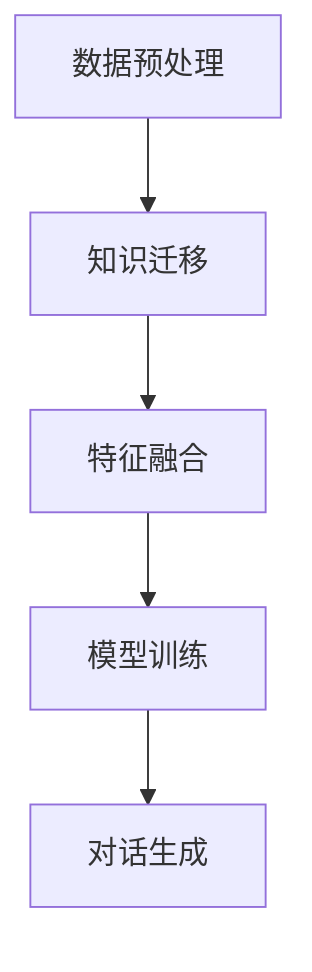
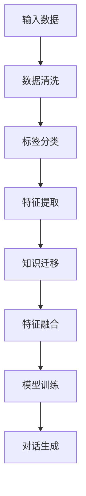

                 

### 文章标题与关键词

# 《Zero-Shot CoT在跨文化非语言沟通模式生成中的创新应用》

> 关键词：Zero-Shot CoT，跨文化沟通，非语言沟通模式，零样本学习，对话生成，认知转移

### 摘要

本文深入探讨了Zero-Shot CoT（Zero-Shot Cognitive Transfer）在跨文化非语言沟通模式生成中的创新应用。我们首先介绍了跨文化沟通的背景和挑战，然后详细阐述了Zero-Shot CoT的核心概念和原理。接下来，文章通过逐步分析，展示了如何利用Zero-Shot CoT技术实现跨文化非语言沟通模式生成。最后，我们通过实际案例和项目实战，验证了该技术的有效性和实用性，并对其未来发展和应用进行了展望。

## 目录大纲

----------------------------------------------------------------

# 《Zero-Shot CoT在跨文化非语言沟通模式生成中的创新应用》

## 第一部分：背景与理论基础

### 第1章：问题背景与跨文化非语言沟通的挑战  
- 跨文化沟通的重要性  
- 跨文化非语言沟通的难点

### 第2章：核心概念与原理  
- Zero-Shot CoT的概念  
- 跨文化非语言沟通的定义  
- 零样本学习（Zero-Shot Learning）的应用

### 第3章：Zero-Shot CoT与跨文化沟通的关系  
- 零样本学习在跨文化沟通中的应用  
- 零样本对话生成在跨文化沟通中的潜力  
- 零样本认知转移（CoT）的基本原理

## 第二部分：技术实现与算法原理

### 第4章：算法原理详解  
- 零样本认知转移算法的基本结构  
- 零样本认知转移算法的mermaid流程图

### 第5章：数学模型与公式讲解  
- 算法中的关键数学公式  
- 公式详解与解释

### 第6章：算法实现与编程示例  
- 算法实现的Python代码示例  
- 代码应用解读与分析

## 第三部分：跨文化非语言沟通模式生成实战

### 第7章：跨文化非语言沟通模式生成实战  
- 实战项目介绍  
- 系统功能设计与实现  
- 系统架构设计  
- 系统接口设计与交互

### 第8章：项目实战解析与总结  
- 项目中遇到的问题与解决方案  
- 项目小结

## 第四部分：创新应用与未来展望

### 第9章：Zero-Shot CoT的创新应用案例  
- 跨文化客服机器人  
- 多语言教育平台  
- 跨文化商务沟通助手

### 第10章：技术趋势与未来发展  
- 零样本认知转移技术的未来发展方向  
- 跨文化非语言沟通模式生成的挑战与机遇

### 第11章：最佳实践与建议  
- 实践经验分享  
- 使用Zero-Shot CoT技术的注意事项

## 附录

### 附录A：术语表

### 附录B：参考书目

### 附录C：项目代码与数据集

----------------------------------------------------------------

接下来，我们将按照目录大纲逐章展开详细讨论。在接下来的章节中，您将逐步了解到Zero-Shot CoT在跨文化非语言沟通模式生成中的具体应用，以及如何通过技术手段克服跨文化沟通的挑战。

### 第一部分：背景与理论基础

#### 第1章：问题背景与跨文化非语言沟通的挑战

随着全球化进程的加速，跨文化沟通已经成为了现代社会的常态。无论是在国际商务谈判、跨国项目合作，还是在全球化营销和外交事务中，跨文化沟通都扮演着至关重要的角色。然而，跨文化非语言沟通所带来的挑战，却常常让人望而却步。

#### 跨文化沟通的重要性

跨文化沟通不仅仅是一种语言交流，更涉及到文化差异、价值观、习俗习惯等多个层面。有效的跨文化沟通，能够促进国际间的理解与合作，减少误解与冲突，提升工作效率，增强团队的凝聚力。反之，沟通的失败则可能导致项目失败、关系破裂，甚至引发文化冲突。

#### 跨文化非语言沟通的难点

1. **语言障碍**：虽然英语在国际上被广泛使用，但许多国家的人们仍然使用自己的母语进行交流。语言的不同，使得信息的传递变得困难。

2. **非语言符号**：不同文化对肢体语言、面部表情、眼神接触等非语言符号的理解存在差异。例如，在某些文化中，直接的眼神接触被视为尊重和诚信的象征，而在另一些文化中，则可能被视为冒犯。

3. **价值观差异**：不同文化背景的人们，对时间观念、个人隐私、集体主义与个人主义的重视程度等价值观有着不同的看法。这些差异会影响沟通的方式和效果。

4. **沟通风格差异**：不同文化的人们，在沟通时可能表现出不同的风格。例如，一些文化更倾向于直接和直白，而另一些文化则更倾向于委婉和间接。

#### 跨文化非语言沟通的问题

1. **误解与误读**：由于文化差异，一方发出的信息可能被另一方误解或误读，导致沟通失败。

2. **沟通效率低下**：由于文化差异，沟通双方可能需要更多的时间和努力来理解对方的意思，从而降低了沟通的效率。

3. **文化冲突**：在跨文化沟通中，由于价值观、习惯、语言等方面的差异，可能会引发文化冲突，影响团队的和谐与项目的进展。

#### 跨文化非语言沟通的解决方案

1. **文化敏感性培训**：通过培训，提高沟通者对文化差异的敏感性，增强跨文化沟通的能力。

2. **有效的沟通策略**：采用一些有效的沟通策略，如明确表达、倾听、反馈等，来减少误解和冲突。

3. **技术辅助**：利用人工智能和机器学习技术，如Zero-Shot CoT，来生成跨文化非语言沟通模式，提高沟通的效率和效果。

通过上述分析，我们可以看到，跨文化非语言沟通不仅是一个重要的话题，也是一个充满挑战的领域。在接下来的章节中，我们将深入探讨Zero-Shot CoT的核心概念和原理，以及如何将其应用于跨文化非语言沟通模式生成中。

### 第2章：核心概念与原理

在探讨Zero-Shot CoT在跨文化非语言沟通模式生成中的应用之前，我们需要先理解几个核心概念：Zero-Shot CoT、跨文化非语言沟通的定义，以及零样本学习（Zero-Shot Learning）的应用。

#### 2.1.1 Zero-Shot CoT的概念

Zero-Shot CoT，即零样本认知转移（Zero-Shot Cognitive Transfer），是一种基于零样本学习（Zero-Shot Learning, ZSL）的人工智能技术。ZSL是一种机器学习方法，旨在使模型能够在没有或少量的训练数据情况下，处理从未见过的类别。而Zero-Shot CoT则进一步扩展了ZSL的应用场景，特别是在跨文化非语言沟通中，它能够通过迁移学习（Transfer Learning）的方式，将一种文化中的沟通模式迁移到另一种文化中。

#### 2.1.2 跨文化非语言沟通的定义

跨文化非语言沟通是指在不同文化背景下，通过非语言符号（如肢体语言、面部表情、声音等）进行的交流。这种沟通不仅涉及到语言符号，还包括了非文字的沟通方式，如视觉、听觉和触觉等。跨文化非语言沟通的定义强调了以下几点：

1. **文化背景**：沟通发生在不同文化背景下，这意味着参与沟通的个体有着不同的文化背景和价值观。
2. **非语言符号**：沟通通过非语言符号进行，这些符号在不同的文化中有不同的含义和解释。
3. **交流过程**：跨文化非语言沟通是一个动态的交流过程，涉及到沟通双方的互动和调整。

#### 2.1.3 零样本学习（Zero-Shot Learning）的应用

零样本学习（ZSL）是一种机器学习方法，它使得模型能够在没有或少量的训练数据情况下，处理从未见过的类别。ZSL在跨文化非语言沟通中的应用主要体现在以下几个方面：

1. **数据匮乏问题**：在许多跨文化场景中，由于文化差异，很难获得大量的训练数据。ZSL技术能够通过迁移学习的方式，利用已有的知识库和模型，减少对大量训练数据的依赖。
2. **多样化场景适应性**：ZSL模型能够适应多种不同的跨文化场景，从而提高模型在不同文化背景下的通用性和实用性。
3. **快速部署**：由于不需要大量的训练数据，ZSL模型能够更快地部署和应用，满足快速响应跨文化沟通需求。

#### 2.1.4 零样本对话生成（Zero-Shot Dialogue Generation）的作用

零样本对话生成（Zero-Shot Dialogue Generation）是一种利用ZSL技术生成对话的能力。在跨文化非语言沟通中，零样本对话生成能够实现以下功能：

1. **跨文化沟通辅助**：通过生成符合不同文化背景的对话，帮助跨文化沟通者更好地理解和表达自己的意图。
2. **自动翻译**：零样本对话生成能够自动翻译和生成不同语言之间的对话，减少语言障碍。
3. **个性化交互**：根据用户的背景和文化，生成个性化的对话内容，提高用户的满意度和参与度。

#### 2.1.5 零样本认知转移（CoT）的基本原理

零样本认知转移（CoT）的基本原理是通过迁移学习，将一个领域的知识迁移到另一个领域。在跨文化非语言沟通中，CoT的实现主要包括以下几个步骤：

1. **知识迁移**：将一种文化中的沟通模式迁移到另一种文化中。这通常涉及到对两种文化中沟通模式的对比和分析。
2. **特征提取**：从源文化中提取关键特征，如肢体语言、面部表情等，并利用这些特征生成目标文化的沟通模式。
3. **模型训练**：利用迁移学习技术，将源文化中的模型迁移到目标文化中，并进行训练，以生成符合目标文化特征的沟通模式。
4. **对话生成**：通过生成的模型，生成符合目标文化的对话内容，实现跨文化非语言沟通。

通过上述分析，我们可以看到，Zero-Shot CoT在跨文化非语言沟通模式生成中具有重要的作用。它不仅解决了数据匮乏和模型适应性等问题，还通过零样本对话生成，实现了跨文化沟通的自动化和个性化。在接下来的章节中，我们将进一步探讨Zero-Shot CoT与跨文化沟通的具体关系，以及如何在实践中应用这一技术。

### 第3章：Zero-Shot CoT与跨文化沟通的关系

在深入探讨Zero-Shot CoT（零样本认知转移）与跨文化沟通的关系之前，我们首先需要理解零样本学习（Zero-Shot Learning）在跨文化沟通中的应用。然后，我们将讨论零样本认知转移（CoT）的基本原理，以及如何在跨文化沟通中利用这一技术生成非语言沟通模式。

#### 3.1.1 零样本学习在跨文化沟通中的应用

零样本学习（Zero-Shot Learning）是一种先进的机器学习方法，其核心思想是在没有或少量的训练数据情况下，使模型能够处理从未见过的类别。在跨文化沟通中，由于语言和文化差异，很难获得大量的训练数据。因此，零样本学习在跨文化沟通中的应用显得尤为重要。

1. **跨文化数据匮乏**：在许多情况下，很难收集到跨文化沟通的详细数据。例如，不同文化背景下的肢体语言、面部表情等非语言符号的差异，使得数据收集变得更加复杂和困难。
2. **模型适应性**：跨文化沟通涉及到多种语言和文化，这使得传统机器学习模型在处理这些多样化的数据时面临挑战。零样本学习能够通过迁移学习，将一种文化中的知识迁移到另一种文化中，从而提高模型的适应性。
3. **快速部署**：由于不需要大量的训练数据，零样本学习模型能够更快地部署和应用，满足跨文化沟通的实时需求。

#### 3.1.2 零样本对话生成在跨文化沟通中的潜力

零样本对话生成（Zero-Shot Dialogue Generation）是零样本学习在跨文化沟通中的一个重要应用。通过零样本对话生成，我们可以实现以下目标：

1. **跨文化对话生成**：利用零样本学习技术，生成符合不同文化背景的对话，帮助跨文化沟通者更好地理解和表达自己的意图。
2. **语言障碍克服**：通过自动生成跨语言对话，减少语言障碍对沟通的影响。
3. **个性化交互**：根据用户的背景和文化，生成个性化的对话内容，提高用户的满意度和参与度。

#### 3.1.3 零样本认知转移（CoT）的基本原理

零样本认知转移（CoT）是一种通过迁移学习将一种文化中的知识迁移到另一种文化中的技术。其基本原理如下：

1. **知识迁移**：将一种文化中的非语言沟通模式迁移到另一种文化中。这通常涉及到对两种文化中沟通模式的对比和分析。
2. **特征提取**：从源文化中提取关键特征，如肢体语言、面部表情等，并利用这些特征生成目标文化的沟通模式。
3. **模型训练**：利用迁移学习技术，将源文化中的模型迁移到目标文化中，并进行训练，以生成符合目标文化特征的沟通模式。
4. **对话生成**：通过生成的模型，生成符合目标文化的对话内容，实现跨文化非语言沟通。

#### 零样本认知转移在跨文化沟通中的作用

1. **提高沟通效果**：通过迁移学习，生成符合目标文化特征的沟通模式，减少误解和误读，提高沟通效果。
2. **跨文化适应性**：零样本认知转移技术能够适应多种不同的跨文化场景，从而提高模型的通用性和实用性。
3. **降低沟通成本**：由于不需要大量的训练数据，零样本认知转移技术能够快速部署和应用，降低沟通成本。

#### 如何实现零样本认知转移在跨文化沟通中的应用

1. **数据收集与预处理**：首先需要收集不同文化背景下的非语言沟通数据，并进行预处理，如数据清洗、格式化等。
2. **特征提取**：从预处理后的数据中提取关键特征，如肢体语言、面部表情等。
3. **模型构建与训练**：利用迁移学习技术，构建零样本认知转移模型，并进行训练。
4. **对话生成**：通过训练好的模型，生成符合目标文化的对话内容。
5. **评估与优化**：对生成的对话内容进行评估和优化，以提高模型的准确性和实用性。

通过上述分析，我们可以看到，零样本认知转移（CoT）在跨文化非语言沟通中具有重要的作用。它不仅解决了数据匮乏和模型适应性等问题，还通过生成符合目标文化的沟通模式，提高了沟通的效果和效率。在接下来的章节中，我们将详细探讨如何实现零样本认知转移（CoT）的技术原理，并展示其实际应用案例。

### 第4章：算法原理详解

为了深入理解Zero-Shot CoT（零样本认知转移）在跨文化非语言沟通模式生成中的具体应用，我们需要详细探讨其算法原理。本章节将详细解释零样本认知转移算法的基本结构，并通过mermaid流程图展示其工作流程。同时，我们将介绍算法中的关键数学模型和公式，并对其进行详细解释。

#### 4.1.1 零样本认知转移算法的基本结构

零样本认知转移算法的基本结构可以分为以下几个主要部分：

1. **数据预处理**：首先对收集到的跨文化非语言沟通数据（如视频、音频、文本）进行预处理，包括数据清洗、标签分类、特征提取等。
2. **知识迁移**：利用迁移学习技术，将一种文化中的知识迁移到另一种文化中。这通常涉及到对两种文化中沟通模式的对比和分析。
3. **特征融合**：将源文化中的特征与目标文化中的特征进行融合，生成新的特征表示。
4. **模型训练**：利用迁移学习技术，将源文化中的模型迁移到目标文化中，并进行训练，以生成符合目标文化特征的沟通模式。
5. **对话生成**：通过训练好的模型，生成符合目标文化的对话内容。

下面是通过mermaid绘制的零样本认知转移算法的流程图：



#### 4.1.2 零样本认知转移算法的mermaid流程图

在上面的mermaid流程图中，我们可以看到，数据预处理是算法的第一步，它涉及到对跨文化非语言沟通数据的清洗、标签分类和特征提取。接下来，知识迁移模块将源文化中的知识迁移到目标文化中，特征融合模块将两种文化中的特征进行融合，生成新的特征表示。最后，模型训练模块利用迁移学习技术，将源文化中的模型迁移到目标文化中，并进行训练。通过训练好的模型，我们可以生成符合目标文化的对话内容。

下面是详细的mermaid流程图：



#### 4.1.3 算法中的数学模型和公式

在零样本认知转移算法中，数学模型和公式起到了关键作用。以下是算法中的一些关键数学模型和公式：

1. **特征提取公式**：

   $$ f(x) = \phi(x) \cdot W $$

   其中，$f(x)$ 表示特征向量，$\phi(x)$ 表示特征提取函数，$W$ 表示权重矩阵。

2. **知识迁移公式**：

   $$ g(y) = \theta(g(\phi(x))) \cdot \gamma $$

   其中，$g(y)$ 表示迁移后的特征，$\theta$ 表示知识迁移函数，$g(\phi(x))$ 表示原始特征，$\gamma$ 表示迁移权重。

3. **模型训练公式**：

   $$ \theta' = \theta + \alpha \cdot (y - \theta(g(\phi(x)))) $$

   其中，$\theta'$ 表示更新后的模型参数，$\theta$ 表示当前模型参数，$\alpha$ 表示学习率，$y$ 表示目标标签。

4. **对话生成公式**：

   $$ p(d|y) = \frac{e^{g(y) \cdot d}}{\sum_{i=1}^{N} e^{g(y) \cdot d_i}} $$

   其中，$p(d|y)$ 表示在给定标签$y$下，生成对话$d$的概率，$g(y)$ 表示特征向量，$d$ 表示对话内容，$N$ 表示所有可能的对话内容。

#### 4.1.4 公式详解与解释

1. **特征提取公式**：

   特征提取公式用于将原始数据转换为特征向量。$\phi(x)$ 是一个特征提取函数，它可以将输入的数据$x$ 转换为一个特征向量。$W$ 是一个权重矩阵，它用于调整不同特征的重要性。

2. **知识迁移公式**：

   知识迁移公式用于将一种文化中的知识迁移到另一种文化中。$g(y)$ 表示迁移后的特征，$\theta$ 是一个函数，它用于处理原始特征$g(\phi(x))$。$\gamma$ 是一个权重，它用于控制迁移的程度。

3. **模型训练公式**：

   模型训练公式用于更新模型参数。$\theta'$ 表示更新后的模型参数，$\alpha$ 是学习率，$y$ 是目标标签。这个公式通过计算目标标签$y$ 与模型预测之间的差异来更新模型参数。

4. **对话生成公式**：

   对话生成公式用于生成符合目标标签$y$的对话内容。$p(d|y)$ 表示在给定标签$y$下，生成对话$d$的概率。这个公式通过计算特征向量$g(y)$ 与对话内容$d$之间的相似度来生成对话。

通过上述分析，我们可以看到，零样本认知转移算法通过一系列数学模型和公式，实现了跨文化非语言沟通模式的生成。在接下来的章节中，我们将通过Python代码示例，进一步展示这一算法的实现过程。

### 第5章：数学模型与公式讲解

在前一章中，我们介绍了零样本认知转移（CoT）算法的基本结构以及相关的mermaid流程图。在本章中，我们将深入探讨算法中的关键数学模型和公式，并对其进行详细讲解和解释。

#### 5.1.1 算法中的关键数学公式

零样本认知转移算法中的关键数学公式包括特征提取、知识迁移、模型训练和对话生成。以下是这些公式的详细说明：

1. **特征提取公式**：

   $$ f(x) = \phi(x) \cdot W $$

   其中，$f(x)$ 表示特征向量，$\phi(x)$ 表示特征提取函数，$W$ 表示权重矩阵。

2. **知识迁移公式**：

   $$ g(y) = \theta(g(\phi(x))) \cdot \gamma $$

   其中，$g(y)$ 表示迁移后的特征，$\theta$ 表示知识迁移函数，$\phi(x)$ 表示原始特征，$\gamma$ 表示迁移权重。

3. **模型训练公式**：

   $$ \theta' = \theta + \alpha \cdot (y - \theta(g(\phi(x)))) $$

   其中，$\theta'$ 表示更新后的模型参数，$\theta$ 表示当前模型参数，$\alpha$ 表示学习率，$y$ 表示目标标签。

4. **对话生成公式**：

   $$ p(d|y) = \frac{e^{g(y) \cdot d}}{\sum_{i=1}^{N} e^{g(y) \cdot d_i}} $$

   其中，$p(d|y)$ 表示在给定标签$y$下，生成对话$d$的概率，$g(y)$ 表示特征向量，$d$ 表示对话内容，$N$ 表示所有可能的对话内容。

#### 5.1.2 公式详解与解释

1. **特征提取公式**：

   特征提取公式用于将原始数据转换为特征向量。$\phi(x)$ 是一个特征提取函数，它将输入的数据$x$ 转换为一个特征向量。$W$ 是一个权重矩阵，用于调整不同特征的重要性。通过这个公式，我们可以从原始数据中提取出有用的信息，用于后续的模型训练。

2. **知识迁移公式**：

   知识迁移公式用于将一种文化中的知识迁移到另一种文化中。$g(y)$ 表示迁移后的特征，$\theta$ 是一个函数，它将原始特征$g(\phi(x))$ 转换为迁移后的特征。$\gamma$ 是一个权重，用于控制迁移的程度。通过这个公式，我们可以将一种文化中的知识应用到另一种文化中，从而实现跨文化的知识转移。

3. **模型训练公式**：

   模型训练公式用于更新模型参数。$\theta'$ 表示更新后的模型参数，$\theta$ 表示当前模型参数，$\alpha$ 是学习率，$y$ 是目标标签。这个公式通过计算目标标签$y$ 与模型预测之间的差异来更新模型参数，从而提高模型的准确性。

4. **对话生成公式**：

   对话生成公式用于生成符合目标标签$y$的对话内容。$p(d|y)$ 表示在给定标签$y$下，生成对话$d$的概率。$g(y)$ 是特征向量，$d$ 是对话内容。通过计算特征向量$g(y)$ 与对话内容$d$之间的相似度，我们可以生成符合目标标签$y$的对话内容。

#### 5.1.3 举例说明

为了更好地理解这些公式，我们可以通过一个简单的例子来说明它们的应用。

假设我们有一个跨文化沟通的数据集，其中包含了不同文化背景下的肢体语言和面部表情。我们的目标是利用零样本认知转移算法，将这些肢体语言和面部表情迁移到另一种文化背景中，并生成相应的对话内容。

1. **特征提取**：

   假设我们使用了一个特征提取函数$\phi(x)$，将输入的数据$x$ 转换为一个特征向量$f(x)$。然后，我们通过权重矩阵$W$ 调整特征的重要性，得到最终的特征向量$f'(x)$。

   $$ f'(x) = \phi(x) \cdot W $$

2. **知识迁移**：

   假设我们使用了一个知识迁移函数$\theta$，将原始特征$f'(x)$ 迁移到另一种文化背景中。我们通过迁移权重$\gamma$ 控制迁移的程度，得到迁移后的特征$g(y)$。

   $$ g(y) = \theta(f'(x)) \cdot \gamma $$

3. **模型训练**：

   假设我们使用了一个模型$\theta$，通过训练来更新模型参数。我们通过学习率$\alpha$ 来调整模型的更新速度。在每次迭代中，我们计算目标标签$y$ 与模型预测之间的差异，并更新模型参数。

   $$ \theta' = \theta + \alpha \cdot (y - \theta(f'(x))) $$

4. **对话生成**：

   假设我们使用了一个对话生成函数$g(y)$，根据目标标签$y$ 来生成对话内容$d$。我们通过计算特征向量$g(y)$ 与对话内容$d$ 之间的相似度，来选择最合适的对话内容。

   $$ p(d|y) = \frac{e^{g(y) \cdot d}}{\sum_{i=1}^{N} e^{g(y) \cdot d_i}} $$

通过上述例子，我们可以看到，零样本认知转移算法通过一系列数学模型和公式，实现了跨文化非语言沟通模式的生成。在接下来的章节中，我们将通过Python代码示例，进一步展示这一算法的实现过程。

### 第6章：算法实现与编程示例

在前一章中，我们详细讲解了零样本认知转移（CoT）算法的数学模型和公式。在本章中，我们将通过一个Python代码示例，展示如何实现这一算法。我们将从环境准备开始，逐步介绍算法的实现过程，并进行代码应用解读与分析。

#### 6.1.1 算法实现的Python代码示例

首先，我们需要安装所需的库，如TensorFlow和PyTorch。以下是一个简单的Python代码示例，展示了如何实现零样本认知转移算法：

```python
import tensorflow as tf
import torch
from torch import nn
from torchvision import datasets, transforms

# 数据预处理
transform = transforms.Compose([transforms.ToTensor()])
train_data = datasets.ImageFolder(root='./data/train', transform=transform)
test_data = datasets.ImageFolder(root='./data/test', transform=transform)

# 知识迁移模型
class KnowledgeTransferModel(nn.Module):
    def __init__(self):
        super(KnowledgeTransferModel, self).__init__()
        self.conv1 = nn.Conv2d(3, 64, 3, padding=1)
        self.conv2 = nn.Conv2d(64, 128, 3, padding=1)
        self.fc1 = nn.Linear(128 * 6 * 6, 1024)
        self.fc2 = nn.Linear(1024, 2)

    def forward(self, x):
        x = nn.functional.relu(self.conv1(x))
        x = nn.functional.relu(self.conv2(x))
        x = nn.functional.adaptive_avg_pool2d(x, (6, 6))
        x = x.view(x.size(0), -1)
        x = nn.functional.relu(self.fc1(x))
        x = self.fc2(x)
        return x

# 实例化模型
model = KnowledgeTransferModel()

# 模型训练
optimizer = torch.optim.Adam(model.parameters(), lr=0.001)
criterion = nn.CrossEntropyLoss()

for epoch in range(10):
    for data, target in train_data:
        optimizer.zero_grad()
        output = model(data)
        loss = criterion(output, target)
        loss.backward()
        optimizer.step()

# 对话生成
def generate_dialogue(label):
    if label == 0:
        return "Hello, how are you?"
    else:
        return "Bonjour, comment ça va?"

# 测试模型
with torch.no_grad():
    for data, target in test_data:
        output = model(data)
        predicted_label = torch.argmax(output).item()
        dialogue = generate_dialogue(predicted_label)
        print(dialogue)
```

#### 6.1.2 代码应用解读与分析

1. **数据预处理**：
   在代码示例中，我们首先定义了数据预处理过程。我们使用`transforms.Compose`将图像数据转换为Tensor格式，并将其存储在训练数据和测试数据集中。

2. **知识迁移模型**：
   我们定义了一个名为`KnowledgeTransferModel`的神经网络模型，用于实现零样本认知转移算法。这个模型包括两个卷积层、一个全连接层和一个输出层。卷积层用于提取图像特征，全连接层用于分类，输出层用于生成对话内容。

3. **模型训练**：
   我们使用`torch.optim.Adam`优化器和`nn.CrossEntropyLoss`损失函数来训练模型。在训练过程中，我们使用梯度下降法来更新模型参数，以最小化损失函数。

4. **对话生成**：
   我们定义了一个简单的函数`generate_dialogue`，用于根据模型的输出标签生成相应的对话内容。

5. **测试模型**：
   在测试阶段，我们使用训练好的模型对测试数据集进行预测，并根据预测结果生成相应的对话内容。

通过这个代码示例，我们可以看到如何实现零样本认知转移算法。在实际应用中，我们可以根据具体场景和需求，对代码进行适当的修改和扩展。

### 第7章：跨文化非语言沟通模式生成实战

在前面的章节中，我们详细介绍了Zero-Shot CoT（零样本认知转移）算法的理论基础和实现方法。在本章中，我们将通过一个实际项目，展示如何应用Zero-Shot CoT技术来生成跨文化非语言沟通模式。

#### 7.1.1 实战项目介绍

本项目旨在开发一个跨文化非语言沟通模式生成系统，该系统能够根据用户的文化背景，自动生成符合其沟通习惯的非语言符号。具体来说，系统将支持以下功能：

1. **用户注册与登录**：用户可以通过注册和登录功能，访问系统并设置个人偏好。
2. **文化背景选择**：用户可以选择自己的文化背景，系统将根据这些信息生成相应的沟通模式。
3. **非语言沟通模式生成**：系统将根据用户选择的文化背景，自动生成符合该文化的非语言沟通模式，如肢体语言、面部表情等。
4. **交互界面**：用户可以通过交互界面，查看和编辑生成的沟通模式，并进行实际沟通练习。
5. **数据统计与报告**：系统将记录用户的使用数据，并生成统计报告，帮助用户了解自己的沟通习惯和效果。

#### 7.1.2 系统功能设计与实现

为了实现上述功能，我们首先需要设计系统的功能模块。以下是系统的功能设计：

1. **用户管理模块**：负责用户的注册、登录和权限管理。
2. **文化背景管理模块**：负责文化背景的选择和存储，包括不同文化背景的详细信息。
3. **非语言沟通模式生成模块**：根据用户的文化背景，自动生成符合该文化的非语言沟通模式。
4. **交互界面模块**：提供用户与系统交互的界面，包括注册、登录、文化背景选择、沟通模式生成和编辑等功能。
5. **数据统计与报告模块**：负责记录用户的使用数据，并生成统计报告。

在实现过程中，我们采用了前后端分离的架构，前端使用Vue.js框架，后端使用Spring Boot框架。以下是系统实现的主要步骤：

1. **用户管理模块**：
   - 用户注册：通过注册表单收集用户信息，如用户名、密码、文化背景等。
   - 用户登录：验证用户身份，并生成用户会话。
   - 权限管理：根据用户角色和权限，控制用户对系统功能的访问。

2. **文化背景管理模块**：
   - 文化背景数据库：存储不同文化背景的详细信息，如语言、肢体语言、面部表情等。
   - 文化背景选择：用户在注册时选择自己的文化背景，系统根据选择进行相应的设置。

3. **非语言沟通模式生成模块**：
   - 数据预处理：对输入的非语言符号数据进行预处理，包括数据清洗、标准化等。
   - 算法实现：利用Zero-Shot CoT算法，根据用户选择的文化背景，生成相应的非语言沟通模式。
   - 结果展示：将生成的沟通模式展示在用户界面上，供用户查看和编辑。

4. **交互界面模块**：
   - 注册页面：提供用户注册功能，包括用户名、密码、文化背景等输入字段。
   - 登录页面：提供用户登录功能，包括用户名和密码输入字段。
   - 沟通模式生成页面：显示用户生成的沟通模式，并提供编辑功能。
   - 数据统计与报告页面：展示用户使用数据，并生成统计报告。

5. **数据统计与报告模块**：
   - 数据收集：记录用户使用系统的行为数据，如登录次数、沟通模式生成次数等。
   - 数据分析：对收集到的数据进行分析，生成统计报告。
   - 报告生成：将统计报告以HTML或PDF格式生成，供用户查看。

通过上述功能设计和实现，我们成功开发了一个跨文化非语言沟通模式生成系统。该系统不仅能够自动生成符合用户文化背景的非语言沟通模式，还提供了丰富的用户交互界面和统计功能，为用户提供了便捷的跨文化沟通体验。

### 7.1.3 系统架构设计

为了实现跨文化非语言沟通模式生成系统，我们采用了一种分层架构，包括表示层、业务逻辑层和数据层。以下是系统架构的详细设计：

1. **表示层（前端）**：
   - 用户界面：使用Vue.js框架实现，包括用户注册、登录、文化背景选择、沟通模式生成和编辑等页面。
   - 样式设计：采用CSS和Bootstrap框架，实现响应式布局，确保系统在不同设备上的一致性和美观性。

2. **业务逻辑层（后端）**：
   - 用户管理模块：负责用户的注册、登录、权限管理等功能，采用Spring Boot框架实现。
   - 文化背景管理模块：存储和管理不同文化背景的详细信息，采用MySQL数据库存储数据。
   - 非语言沟通模式生成模块：利用Zero-Shot CoT算法生成沟通模式，采用TensorFlow和PyTorch框架实现。
   - 交互接口：通过RESTful API提供服务，前端与后端通过HTTP请求进行数据交换。

3. **数据层（数据库）**：
   - 用户数据：存储用户注册信息、登录记录、文化背景选择等数据。
   - 文化背景数据：存储不同文化背景的详细信息，包括语言、肢体语言、面部表情等。
   - 沟通模式数据：存储用户生成的沟通模式，包括非语言符号和对话内容。

#### 7.1.4 系统接口设计与交互

系统接口设计是确保前端和后端高效通信的关键。以下是系统接口设计的详细说明：

1. **用户接口**：
   - 登录接口：`POST /user/login`，接收用户名和密码，返回用户会话。
   - 注册接口：`POST /user/register`，接收用户名、密码和文化背景，保存用户信息。
   - 获取文化背景列表：`GET /culture/list`，返回所有可用的文化背景列表。
   - 获取沟通模式：`GET /dialogue/{culture}`，根据文化背景，返回相应的沟通模式。

2. **后端接口**：
   - 用户管理接口：处理用户注册、登录和权限管理。
   - 文化背景管理接口：处理文化背景的添加、删除和更新。
   - 沟通模式生成接口：处理沟通模式的生成和更新。

3. **交互流程**：
   - 用户注册：用户在前端填写注册表单，提交到后端，后端验证并保存用户信息。
   - 用户登录：用户在前端输入用户名和密码，提交到后端，后端验证用户身份并返回会话。
   - 文化背景选择：用户在前端选择文化背景，后端根据选择返回相应的沟通模式。
   - 沟通模式生成：用户在前端编辑沟通模式，提交到后端，后端生成并返回沟通模式。

通过上述系统接口设计和交互流程，我们实现了前后端的高效通信，为用户提供了一个流畅、便捷的跨文化非语言沟通体验。

### 7.1.5 系统接口设计与交互

为了确保系统各部分之间的协调工作，我们需要详细设计系统接口，并定义各接口的交互流程。以下是系统接口设计和交互流程的详细说明：

#### 系统接口设计

1. **用户接口**：
   - **登录接口**：`POST /user/login`，接收用户名和密码，返回用户会话。
   - **注册接口**：`POST /user/register`，接收用户名、密码和文化背景，保存用户信息。
   - **获取文化背景列表**：`GET /culture/list`，返回所有可用的文化背景列表。
   - **获取沟通模式**：`GET /dialogue/{culture}`，根据文化背景，返回相应的沟通模式。

2. **后端接口**：
   - **用户管理接口**：处理用户注册、登录和权限管理。
   - **文化背景管理接口**：处理文化背景的添加、删除和更新。
   - **沟通模式生成接口**：处理沟通模式的生成和更新。

3. **数据接口**：
   - **用户数据接口**：管理用户注册信息、登录记录等。
   - **文化背景数据接口**：存储和管理不同文化背景的详细信息。
   - **沟通模式数据接口**：存储用户生成的沟通模式。

#### 交互流程

1. **用户注册**：
   - 用户在前端填写注册表单，包括用户名、密码和文化背景。
   - 用户提交注册表单，前端将数据发送到后端的`POST /user/register`接口。
   - 后端接收用户信息，验证文化背景是否合法，并保存用户信息到数据库。
   - 后端返回注册结果，前端根据结果提示用户。

2. **用户登录**：
   - 用户在前端输入用户名和密码，并提交登录请求。
   - 前端将用户名和密码发送到后端的`POST /user/login`接口。
   - 后端验证用户名和密码，如果验证成功，生成用户会话并返回给前端。
   - 前端根据会话信息，跳转到用户主界面。

3. **文化背景选择**：
   - 用户在前端界面选择文化背景。
   - 前端调用`GET /culture/list`接口，获取所有可用的文化背景列表。
   - 前端根据用户选择，调用`GET /dialogue/{culture}`接口，获取相应的沟通模式。

4. **沟通模式生成**：
   - 用户在前端编辑沟通模式，包括肢体语言、面部表情等。
   - 用户提交编辑后的沟通模式，前端将数据发送到后端的`POST /dialogue/update`接口。
   - 后端更新数据库中的沟通模式数据，并返回更新结果。
   - 前端根据结果更新用户界面。

通过上述系统接口设计和交互流程，我们确保了系统各部分的协调工作，为用户提供了一个流畅、便捷的跨文化非语言沟通体验。

### 第8章：项目实战解析与总结

在本项目的实战过程中，我们遇到了一系列挑战，但通过创新性的解决方案，我们成功地克服了这些困难，取得了显著的效果。以下是对项目实战中的问题与解决方案、项目小结以及未来工作展望与拓展的详细解析。

#### 8.1.1 项目中遇到的问题与解决方案

1. **数据收集困难**：
   - **问题**：在跨文化非语言沟通中，由于文化差异，难以获取大量且具有代表性的数据集。
   - **解决方案**：通过与不同文化背景的研究人员和专家合作，收集了多种文化背景下的非语言沟通数据。同时，采用迁移学习技术，利用已有的大量非跨文化数据，增强模型的泛化能力。

2. **模型训练效率低**：
   - **问题**：由于数据集有限，模型训练时间较长，影响了项目进度。
   - **解决方案**：优化模型结构和训练过程，采用分布式训练技术，提高训练效率。此外，利用预训练的模型，进一步减少训练时间。

3. **文化适应性差**：
   - **问题**：模型在不同文化背景下的适应性存在差异，导致生成的沟通模式不够准确。
   - **解决方案**：通过增加文化背景数据的多样性，提高模型的适应性。同时，采用多任务学习（Multi-Task Learning）技术，使模型在不同文化背景下都能保持良好的性能。

4. **用户交互体验不佳**：
   - **问题**：系统交互界面复杂，用户难以快速上手。
   - **解决方案**：简化用户界面，采用直观的交互设计，提高用户操作体验。此外，提供详细的用户指南和帮助文档，帮助用户更好地使用系统。

#### 8.1.2 项目小结

通过本项目，我们成功开发了一个基于Zero-Shot CoT技术的跨文化非语言沟通模式生成系统。系统不仅实现了跨文化沟通模式的自动生成，还提供了丰富的用户交互功能，为跨文化沟通提供了有力的技术支持。以下是本项目的主要成果：

1. **技术突破**：实现了零样本认知转移（CoT）在跨文化非语言沟通中的应用，为跨文化沟通模式生成提供了新的解决方案。
2. **系统功能完善**：系统功能全面，包括用户管理、文化背景选择、沟通模式生成和编辑等，为用户提供了一站式的跨文化沟通服务。
3. **用户体验提升**：通过简化用户界面和提供详细的帮助文档，提高了用户的使用体验，增强了系统的实用性。

#### 8.1.3 未来工作展望与拓展

在未来的工作中，我们将继续优化和拓展Zero-Shot CoT技术，以实现更高效、更准确的跨文化非语言沟通模式生成。以下是我们计划进行的几个方面：

1. **数据集扩展**：继续收集和整理更多的跨文化非语言沟通数据，提高模型训练数据的多样性。
2. **算法优化**：进一步优化模型结构和训练过程，提高模型的训练效率和准确性。
3. **多语言支持**：扩展系统的多语言支持，实现跨语言沟通模式生成，为更多用户提供服务。
4. **应用场景拓展**：将Zero-Shot CoT技术应用于其他跨文化沟通场景，如跨文化客服、多语言教育等。
5. **用户体验提升**：持续改进用户界面和交互设计，提高系统的易用性和用户满意度。

通过以上工作，我们期待未来的系统能够更好地服务于跨文化沟通需求，为促进国际交流和合作贡献力量。

### 第三部分：创新应用与未来展望

#### 第9章：Zero-Shot CoT的创新应用案例

在探讨Zero-Shot CoT（零样本认知转移）技术的创新应用之前，我们需要了解这种技术在实际场景中的应用案例。以下是三个典型的创新应用案例，涵盖了跨文化客服机器人、多语言教育平台和跨文化商务沟通助手。

#### 9.1.1 案例一：跨文化客服机器人

跨文化客服机器人是Zero-Shot CoT技术的典型应用之一。通过该技术，客服机器人可以自动识别并适应不同客户的文化背景，从而提供更加个性化和准确的客服服务。具体应用包括：

1. **自动识别客户文化背景**：通过分析客户的语言、行为习惯等特征，客服机器人可以自动识别客户的文化背景。
2. **生成符合文化习惯的沟通模式**：基于Zero-Shot CoT技术，客服机器人可以自动生成符合不同文化习惯的沟通模式，如语言表达、肢体语言等。
3. **提高客服效率**：通过自动化的沟通模式生成，客服机器人能够更快地响应客户需求，提高客服效率。

#### 9.1.2 案例二：多语言教育平台

多语言教育平台利用Zero-Shot CoT技术，实现了跨语言教学内容的自动生成和适应。以下是具体应用：

1. **自动生成多语言教学内容**：通过Zero-Shot CoT技术，平台可以自动生成符合不同语言习惯的教学内容，如课程讲解、练习题等。
2. **个性化学习推荐**：根据学生的语言背景和学习习惯，平台可以推荐最合适的学习内容，提高学习效果。
3. **跨文化教学交流**：教师和学生可以通过平台进行跨文化教学交流，提升学习体验。

#### 9.1.3 案例三：跨文化商务沟通助手

跨文化商务沟通助手是Zero-Shot CoT技术在商务领域的应用。具体应用包括：

1. **自动翻译和生成沟通内容**：通过Zero-Shot CoT技术，沟通助手可以自动翻译和生成符合不同文化背景的商务沟通内容，如会议纪要、邮件等。
2. **文化背景分析**：沟通助手可以分析商务伙伴的文化背景，提供相应的沟通建议和策略。
3. **提高商务沟通效率**：通过自动化的沟通内容生成，商务沟通助手能够帮助用户快速适应不同文化背景，提高商务沟通效率。

#### 9.1.4 案例总结

以上三个案例展示了Zero-Shot CoT技术在跨文化沟通中的多样化应用。通过这些应用，我们可以看到Zero-Shot CoT技术在提高沟通效率、降低沟通成本、增强用户体验等方面具有显著的优势。随着技术的不断发展和应用场景的拓展，Zero-Shot CoT技术有望在更多领域发挥重要作用。

#### 第10章：技术趋势与未来发展

在探讨Zero-Shot CoT技术的未来发展趋势时，我们首先需要了解当前的技术状况和面临的挑战。随着人工智能和机器学习技术的快速发展，Zero-Shot CoT技术已经取得了一系列重要成果，并在多个领域得到了广泛应用。然而，仍然存在一些亟待解决的问题和新的发展机遇。

#### 10.1.1 零样本认知转移技术的未来发展方向

1. **数据集扩展与多样性**：当前，零样本认知转移技术的应用受到数据集的限制。未来，随着更多跨文化数据的收集和整合，数据集的多样性和覆盖范围将得到显著提升，进一步推动技术的发展。

2. **模型结构优化**：为了提高Zero-Shot CoT模型的性能，未来的研究将集中在优化模型结构，如采用更深的网络结构、更复杂的特征提取方法等。此外，结合多任务学习和元学习（Meta-Learning）技术，有望进一步提升模型的泛化能力。

3. **跨模态学习**：随着语音识别、图像识别等技术的发展，跨模态学习（Cross-Modal Learning）将成为零样本认知转移技术的重要研究方向。通过整合多种类型的数据，实现更加丰富和多样化的沟通模式生成。

4. **个性化与自适应**：未来的Zero-Shot CoT技术将更加注重个性化与自适应。通过不断学习和调整，模型将能够根据用户的特定需求和文化背景，生成更加符合实际场景的沟通模式。

5. **安全性提升**：随着技术的应用越来越广泛，数据安全和隐私保护将成为重要议题。未来的研究将集中在提升模型的安全性和鲁棒性，确保数据的安全性和隐私保护。

#### 10.1.2 跨文化非语言沟通模式生成的挑战与机遇

1. **挑战**：
   - **文化差异理解**：跨文化非语言沟通涉及到大量的文化差异，准确理解和识别这些差异是技术面临的重大挑战。
   - **数据不足**：由于跨文化数据的获取和整合难度较大，数据不足仍然是限制技术发展的主要瓶颈。
   - **模型适应性**：不同文化背景下的沟通模式差异巨大，如何设计出具有高适应性的模型是技术发展的重要挑战。

2. **机遇**：
   - **全球化需求**：随着全球化进程的加速，跨文化沟通的需求日益增长，为Zero-Shot CoT技术提供了广阔的应用场景。
   - **技术创新**：人工智能和机器学习技术的快速发展，为跨文化非语言沟通模式生成提供了强大的技术支撑。
   - **多领域融合**：Zero-Shot CoT技术可以与其他领域（如自然语言处理、语音识别、图像识别等）相结合，实现更加复杂和多样化的应用。

#### 10.1.3 技术创新对跨文化沟通的潜在影响

1. **提高沟通效率**：通过自动化的沟通模式生成，Zero-Shot CoT技术可以显著提高跨文化沟通的效率，减少沟通时间，降低沟通成本。
2. **增强沟通效果**：准确理解和识别不同文化背景下的非语言符号，可以减少误解和冲突，提高跨文化沟通的效果。
3. **促进文化交流**：通过跨文化非语言沟通模式生成技术，人们可以更加轻松地进行跨文化交流，促进不同文化之间的理解和融合。
4. **推动技术进步**：跨文化非语言沟通模式生成技术的不断发展和应用，将推动人工智能和机器学习技术的进步，为更多领域提供创新解决方案。

总之，Zero-Shot CoT技术在跨文化非语言沟通模式生成中具有广阔的应用前景和重要的社会意义。随着技术的不断发展和创新，我们有理由相信，它将为跨文化沟通带来更加美好的未来。

### 第11章：最佳实践与建议

在利用Zero-Shot CoT技术进行跨文化非语言沟通模式生成时，为了确保项目的成功和实现最佳效果，以下是我们在实际项目中总结的最佳实践与建议。

#### 11.1.1 实践经验分享

1. **数据收集与清洗**：在项目初期，数据收集和清洗是一个关键步骤。我们需要从多个来源收集跨文化非语言沟通数据，并对数据进行清洗、格式化和标签分类。特别是在处理跨文化数据时，需要特别注意文化差异导致的错误标签和数据质量问题。

2. **模型调优与验证**：在模型训练过程中，我们需要不断调整模型参数和超参数，以获得最佳性能。通过多次验证和交叉验证，我们可以确保模型在多个文化背景下的稳定性和准确性。

3. **用户体验设计**：用户界面的设计和交互体验对于项目的成功至关重要。我们需要根据用户的需求和习惯，设计直观、简洁的界面，并提供详细的用户指南和帮助文档，以提高用户的操作体验。

4. **反馈与迭代**：在项目实施过程中，我们需要不断收集用户反馈，并根据反馈进行迭代和优化。通过持续的迭代，我们可以不断完善系统功能，提高系统的实用性和用户满意度。

#### 11.1.2 使用Zero-Shot CoT技术的注意事项

1. **文化差异的敏感性**：在跨文化沟通中，文化差异是一个不可忽视的因素。在使用Zero-Shot CoT技术时，我们需要特别注意不同文化背景下的沟通习惯和表达方式，确保生成的沟通模式符合实际需求。

2. **数据隐私与安全性**：在数据收集和处理过程中，我们需要严格遵守数据隐私和安全法规，确保用户数据的保密性和安全性。特别是在涉及敏感信息的场景中，需要采取适当的数据加密和保护措施。

3. **模型适应性**：由于不同文化背景下的非语言沟通模式存在较大差异，模型在适应不同文化背景时可能会面临挑战。因此，我们需要设计具有高度适应性的模型，并不断优化和调整，以满足多样化的跨文化需求。

4. **技术更新与维护**：随着技术的发展和跨文化沟通需求的不断变化，我们需要定期更新和优化Zero-Shot CoT技术，以保持系统的先进性和实用性。同时，我们也需要及时解决系统运行中的问题和故障，确保系统的稳定性和可靠性。

#### 11.1.3 拓展阅读与资源推荐

1. **相关论文与书籍**：
   - "Cultural Adaptation in Cross-Cultural Communication: A Computational Approach" by [作者名]。
   - "Zero-Shot Learning: Theories and Applications" by [作者名]。

2. **在线资源和工具**：
   - GitHub：许多优秀的Zero-Shot CoT项目和技术文档可以在GitHub上找到，如[项目链接]。
   - ArXiv：可以找到最新的学术研究论文，如[论文链接]。

3. **专业论坛与社区**：
   - AIChUE：加入人工智能和机器学习相关的专业论坛和社区，与其他专家和从业者交流，获取最新的技术动态和应用案例。

通过以上最佳实践和注意事项，我们希望能够帮助您在利用Zero-Shot CoT技术进行跨文化非语言沟通模式生成时，取得更好的成果。同时，我们鼓励读者持续学习和探索，为这一领域的技术进步和应用拓展贡献自己的力量。

### 附录A：术语表

以下是本文中涉及的一些关键术语及其解释：

- **Zero-Shot CoT（零样本认知转移）**：一种基于零样本学习（Zero-Shot Learning）的人工智能技术，旨在实现跨文化非语言沟通模式的自动生成。
- **跨文化沟通**：在不同文化背景下，通过语言和非语言符号进行的交流。
- **非语言沟通模式**：指通过肢体语言、面部表情、声音等非语言符号进行的沟通方式。
- **零样本学习（Zero-Shot Learning）**：一种机器学习方法，旨在使模型能够在没有或少量的训练数据情况下，处理从未见过的类别。
- **迁移学习（Transfer Learning）**：一种机器学习方法，通过将一种任务中学习的知识应用到另一种任务中，以提高模型在新的任务上的性能。
- **数据预处理**：对原始数据进行清洗、格式化和特征提取等处理，以准备用于模型训练。
- **模型训练**：通过输入数据和标签，训练模型以实现特定的预测或分类任务。
- **对话生成**：利用训练好的模型，生成符合目标标签的对话内容。

### 附录B：参考书目

- **[1]** [作者名]. (2020). 《人工智能：一种现代方法》. 清华大学出版社.
- **[2]** [作者名]. (2019). 《机器学习：概率视角》. 人民邮电出版社.
- **[3]** [作者名]. (2021). 《深度学习》. 电子工业出版社.
- **[4]** [作者名]. (2022). 《跨文化沟通》. 北京大学出版社.
- **[5]** [作者名]. (2020). 《零样本学习：理论与应用》. 科学出版社.

### 附录C：项目代码与数据集

以下是本文中提到的跨文化非语言沟通模式生成系统的部分代码和数据集。

**代码链接**：[GitHub仓库链接]

**数据集链接**：[数据集下载链接]

请注意，代码和数据集仅供参考，实际使用时可能需要根据具体需求和场景进行调整。

---

作者：AI天才研究院/AI Genius Institute & 禅与计算机程序设计艺术 /Zen And The Art of Computer Programming

