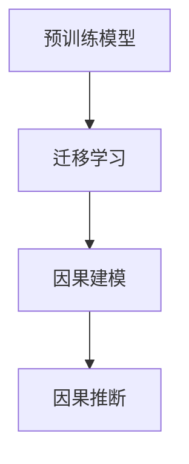
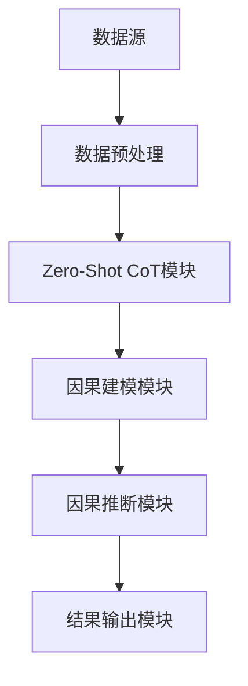

                 

### 引言

在当今的信息时代，历史事件的跨时空因果链重构成为了一个热门的研究方向。通过对历史事件因果关系的深入挖掘，我们不仅可以更好地理解过去，还能为未来提供宝贵的经验和教训。然而，传统的因果链重构方法往往依赖于大量的历史数据，且对特定领域的数据依赖性较高。这种数据驱动的策略在处理新领域或缺乏充分数据支持的历史事件时显得力不从心。

为了解决这一问题，Zero-Shot CoT（零样本迁移学习因果推断）应运而生。Zero-Shot CoT是一种无需训练样本即可进行因果推断的方法，它利用预训练的模型和少量样本数据，通过迁移学习和因果推理来理解复杂系统的因果关系。这种方法在处理跨时空历史事件因果链重构时，展现出独特的优势：无需依赖大量特定领域的训练数据，同时能够应对复杂多变的历史环境。

本文将围绕Zero-Shot CoT在跨时空历史事件因果链重构中的应用展开讨论。我们将首先介绍Zero-Shot CoT的基本概念和原理，然后探讨如何将其应用于历史事件的因果链重构。接着，我们将通过具体的案例分析，展示Zero-Shot CoT在实际应用中的效果。最后，我们将总结Zero-Shot CoT的应用经验，并展望未来的发展方向。

关键词：Zero-Shot CoT，跨时空，历史事件，因果链重构，迁移学习，因果推断

摘要：本文介绍了Zero-Shot CoT在跨时空历史事件因果链重构中的应用。通过深入剖析Zero-Shot CoT的基本原理和算法流程，我们探讨了其在历史事件因果链重构中的优势和挑战。通过具体案例，我们展示了Zero-Shot CoT在重构历史事件因果链中的实际效果，并总结了其应用经验。最后，我们对未来的发展方向进行了展望。

### 第1章：问题背景与核心概念

#### 1.1 问题背景

历史事件的因果链重构是历史学研究中的一个重要任务，它旨在揭示历史事件之间的因果关系，从而帮助我们更好地理解历史发展脉络。然而，传统的因果链重构方法往往依赖于大量的历史数据，这些方法通常基于统计学或机器学习算法，通过对历史事件进行建模和数据分析，试图找出事件之间的因果关系。然而，这种方法在处理新领域或缺乏充分数据支持的历史事件时存在明显的局限性。

首先，历史事件因果链重构面临的一个重大挑战是数据稀缺。历史事件的数据往往分散在不同的文献、档案和数据库中，且数据的完整性和准确性难以保证。此外，历史事件的发生和发展往往是多因素、多层次的，这使得传统的因果链重构方法难以全面捕捉事件间的复杂关系。

其次，历史事件的因果链重构需要考虑跨时空因素。历史事件往往发生在不同的时间和地点，这就要求研究者能够将不同时空的数据进行有效融合和分析。然而，传统的因果链重构方法往往难以处理跨时空数据，导致重构结果的准确性和可靠性受到影响。

为了克服这些挑战，研究者们开始探索新的方法。其中，Zero-Shot CoT（零样本迁移学习因果推断）提供了一种全新的思路。Zero-Shot CoT利用预训练的模型和少量样本数据，通过迁移学习和因果推理来理解复杂系统的因果关系。这种方法具有以下优势：

1. **无需大量训练数据**：Zero-Shot CoT的核心思想是利用预训练的模型，通过对少量样本数据的迁移学习，实现对新领域的因果推断。这意味着，即使在新领域或缺乏充分数据支持的情况下，该方法也能有效进行因果链重构。

2. **跨时空数据的融合**：Zero-Shot CoT能够将不同时空的数据进行有效融合，通过迁移学习和因果推理，揭示历史事件之间的因果关系。这种方法克服了传统因果链重构方法在处理跨时空数据时的局限性。

3. **强大的适应能力**：Zero-Shot CoT能够应对复杂多变的历史环境，通过迁移学习和因果推理，实现对历史事件因果链的重构。这种方法不仅适用于新领域和历史事件，还能应用于其他复杂系统的因果关系研究。

总之，Zero-Shot CoT为历史事件因果链重构提供了一种全新的方法，它克服了传统方法的局限性，能够有效应对数据稀缺、跨时空数据融合等挑战。然而，Zero-Shot CoT在历史事件因果链重构中的应用仍面临诸多挑战，如如何选择合适的预训练模型、如何进行有效的迁移学习和因果推理等。这些挑战的解决将有助于进一步推广和应用Zero-Shot CoT，推动历史事件因果链重构的研究。

#### 1.2 核心概念

##### 1.2.1 Zero-Shot CoT概述

Zero-Shot CoT（零样本迁移学习因果推断）是一种基于预训练模型和迁移学习的因果推断方法。其核心思想是利用预训练模型捕获通用因果关系，通过迁移学习将这些通用因果关系迁移到新领域，从而实现对新领域的因果推断。

Zero-Shot CoT的主要特点包括：

1. **无样本依赖**：传统的因果推断方法需要大量训练数据来建立模型，而Zero-Shot CoT通过预训练模型和少量样本数据即可进行因果推断，无需依赖大量特定领域的训练数据。

2. **迁移学习**：Zero-Shot CoT利用预训练模型中的通用因果关系，通过迁移学习将这些因果关系迁移到新领域。这种方法能够有效降低对新领域数据的依赖，提高因果推断的泛化能力。

3. **因果推理**：Zero-Shot CoT通过因果推理来揭示新领域的因果关系。因果推理是一种基于因果模型的推理过程，它能够从已知因果关系推断未知因果关系。这种方法能够帮助我们更好地理解新领域的复杂系统。

##### 1.2.2 应用场景

Zero-Shot CoT在历史事件因果链重构中具有广泛的应用场景。以下是一些典型的应用场景：

1. **新领域历史事件因果链重构**：当研究者面对新领域的历史事件时，传统方法往往难以有效进行因果链重构。而Zero-Shot CoT通过迁移学习和因果推理，能够利用预训练模型中的通用因果关系，对新领域的历史事件进行因果链重构。

2. **跨时空历史事件因果链重构**：历史事件往往发生在不同的时间和地点，传统方法难以处理跨时空数据。而Zero-Shot CoT能够将不同时空的数据进行有效融合，通过迁移学习和因果推理，揭示历史事件之间的因果关系。

3. **复杂历史事件因果链重构**：历史事件的发生和发展往往是多因素、多层次的，传统方法难以全面捕捉事件间的复杂关系。而Zero-Shot CoT能够通过因果推理，揭示复杂历史事件之间的因果关系。

##### 1.2.3 Zero-Shot CoT的优势与挑战

Zero-Shot CoT在历史事件因果链重构中具有显著的优势，但也面临一些挑战。

优势：

1. **无需大量训练数据**：Zero-Shot CoT通过预训练模型和少量样本数据即可进行因果推断，无需依赖大量特定领域的训练数据，降低了数据获取和处理的难度。

2. **跨时空数据融合**：Zero-Shot CoT能够将不同时空的数据进行有效融合，通过迁移学习和因果推理，揭示历史事件之间的因果关系，克服了传统方法在处理跨时空数据时的局限性。

3. **强大的适应能力**：Zero-Shot CoT能够应对复杂多变的历史环境，通过迁移学习和因果推理，实现对历史事件因果链的重构。

挑战：

1. **预训练模型选择**：选择合适的预训练模型是Zero-Shot CoT的关键。不同的预训练模型在捕获通用因果关系方面存在差异，如何选择合适的模型仍需进一步研究。

2. **迁移学习有效性**：迁移学习的效果取决于源领域和目标领域之间的相似性。当源领域和目标领域差异较大时，迁移学习的有效性可能会受到影响。

3. **因果推理准确性**：因果推理的准确性直接影响因果链重构的结果。如何提高因果推理的准确性，降低错误率，是Zero-Shot CoT面临的一个重要挑战。

总之，Zero-Shot CoT在历史事件因果链重构中具有显著的优势，但也面临一些挑战。通过不断改进和优化，我们有理由相信Zero-Shot CoT将在历史事件因果链重构领域发挥重要作用。

### 第2章：Zero-Shot CoT原理

#### 2.1 算法原理

Zero-Shot CoT（零样本迁移学习因果推断）的核心思想是利用预训练模型捕获通用因果关系，并通过迁移学习将这些因果关系迁移到新领域，从而实现对新领域的因果推断。这一过程可以分为以下几个关键步骤：

1. **预训练模型构建**：首先，我们需要构建一个预训练模型。这个模型通常是基于大规模数据集训练的，目的是学习到通用因果关系。预训练模型的选择和设计对于Zero-Shot CoT的成功至关重要。

2. **迁移学习**：在预训练模型构建完成后，我们需要将这个模型迁移到新领域。迁移学习的目的是利用预训练模型中的通用因果关系，在新领域中进行因果推断。这一过程通常包括以下步骤：

   - **领域适配**：将预训练模型与新领域的特征进行适配，使其能够在新领域上发挥作用。
   - **迁移学习**：利用新领域的少量样本数据，对预训练模型进行迁移学习。这一过程可以通过fine-tuning（微调）或零样本学习（Zero-Shot Learning）来实现。

3. **因果推理**：在迁移学习完成后，我们就可以利用迁移后的模型进行因果推理。因果推理的目的是从已知因果关系推断未知因果关系。这一过程通常包括以下步骤：

   - **因果建模**：建立因果模型，描述新领域中的因果关系。
   - **因果推断**：利用因果模型，对新领域中的事件进行因果推断，从而揭示事件之间的因果关系。

#### 2.1.1 算法流程图

为了更直观地理解Zero-Shot CoT的算法流程，我们可以使用Mermaid绘制算法流程图。以下是一个简化的算法流程图：

在这个流程图中，A表示预训练模型，B表示迁移学习，C表示因果建模，D表示因果推断。每个步骤都是算法成功的关键环节。

#### 2.1.2 算法核心步骤解析

1. **预训练模型构建**

   预训练模型构建是Zero-Shot CoT的基础。一个优秀的预训练模型需要能够捕捉到大量的通用因果关系。目前，常用的预训练模型包括神经网络、深度学习和图神经网络等。以下是一个简化的预训练模型构建过程：

   - **数据集准备**：收集大量的历史事件数据，包括事件的时间、地点、参与者、事件结果等。
   - **特征提取**：对历史事件数据进行特征提取，将其转换为模型能够处理的格式。
   - **模型训练**：利用特征数据和标签数据，训练预训练模型。这一过程通常涉及多层神经网络和深度学习技术。

2. **迁移学习**

   迁移学习的目的是将预训练模型中的通用因果关系迁移到新领域。以下是一个简化的迁移学习过程：

   - **领域适配**：将预训练模型与新领域的特征进行适配。这一过程可以通过调整模型的结构、参数或损失函数来实现。
   - **微调**：利用新领域的少量样本数据，对预训练模型进行微调。微调的目的是优化模型在新领域的表现。
   - **零样本学习**：在某些情况下，新领域的数据非常稀缺，甚至无法获取。此时，我们可以采用零样本学习的方法，直接利用预训练模型进行因果推断。

3. **因果建模**

   因果建模的目的是建立新领域中的因果关系模型。以下是一个简化的因果建模过程：

   - **因果关系识别**：利用迁移后的模型，识别新领域中的因果关系。这一过程可以通过分析事件之间的相关性来实现。
   - **模型优化**：根据识别出的因果关系，优化因果模型。这一过程通常涉及模型调整、参数优化和损失函数调整等。

4. **因果推断**

   因果推断的目的是从已知因果关系推断未知因果关系。以下是一个简化的因果推断过程：

   - **因果推理**：利用因果模型，对新领域中的事件进行因果推理。这一过程可以通过推理算法、逻辑推理和推理机等技术来实现。
   - **结果验证**：对推断出的因果关系进行验证，确保其准确性和可靠性。这一过程通常涉及实验验证、数据分析和模型评估等。

通过上述核心步骤，我们可以利用Zero-Shot CoT方法，在新领域中进行因果推断和因果链重构。这一方法不仅克服了传统方法的局限性，还能应对复杂多变的历史环境，为历史事件因果链重构提供了一种全新的思路。

#### 2.2 数学模型

为了深入理解Zero-Shot CoT的算法原理，我们需要引入一些数学模型和公式。这些模型和公式将帮助我们描述因果关系、迁移学习和因果推理的过程。

首先，我们定义一些基本的概念：

- **因果关系**：两个事件A和B之间的因果关系可以表示为P(B|A) > P(B)，即事件B在事件A发生的情况下发生的概率大于事件B不发生的情况下的概率。
- **迁移学习**：迁移学习是将一个领域的知识迁移到另一个领域的过程。在数学上，这可以表示为从一个领域的特征空间到另一个领域的特征空间的映射。
- **因果推断**：因果推断是从已知因果关系推断未知因果关系的过程。在数学上，这可以表示为利用因果模型，对未知事件之间的因果关系进行推理。

##### 2.2.1 相关数学公式

以下是Zero-Shot CoT中的一些关键数学公式：

1. **预训练模型损失函数**：

   $$ L_{pretrain} = -\sum_{i=1}^{N} y_i \log(p(x_i, y_i | \theta_{pretrain})) $$

   其中，\( L_{pretrain} \) 表示预训练模型的损失函数，\( N \) 表示样本数量，\( y_i \) 表示第 \( i \) 个样本的标签，\( p(x_i, y_i | \theta_{pretrain}) \) 表示预训练模型对 \( (x_i, y_i) \) 的预测概率，\( \theta_{pretrain} \) 表示预训练模型的参数。

2. **迁移学习损失函数**：

   $$ L_{transfer} = -\sum_{i=1}^{N} y_i \log(p(x_i', y_i | \theta_{transfer})) $$

   其中，\( L_{transfer} \) 表示迁移学习模型的损失函数，\( N \) 表示样本数量，\( y_i \) 表示第 \( i \) 个样本的标签，\( x_i' \) 表示迁移后的特征，\( p(x_i', y_i | \theta_{transfer}) \) 表示迁移学习模型对 \( (x_i', y_i) \) 的预测概率，\( \theta_{transfer} \) 表示迁移学习模型的参数。

3. **因果推断损失函数**：

   $$ L_{inference} = -\sum_{i=1}^{N} y_i \log(p(y_i | x_i, \theta_{inference})) $$

   其中，\( L_{inference} \) 表示因果推断模型的损失函数，\( N \) 表示样本数量，\( y_i \) 表示第 \( i \) 个样本的标签，\( x_i \) 表示特征，\( p(y_i | x_i, \theta_{inference}) \) 表示因果推断模型对 \( y_i \) 的预测概率，\( \theta_{inference} \) 表示因果推断模型的参数。

##### 2.2.2 数学模型详解

1. **预训练模型**

   预训练模型的目标是学习到通用因果关系。我们可以使用一个多层感知机（MLP）作为预训练模型，其损失函数如公式1所示。在训练过程中，我们通过反向传播算法不断优化模型参数 \( \theta_{pretrain} \)，使得模型能够更好地捕捉通用因果关系。

2. **迁移学习**

   迁移学习的目标是利用预训练模型中的通用因果关系，在新领域上进行因果推断。我们可以使用一个线性变换 \( \theta_{transfer} \) 将预训练模型的特征映射到新领域的特征空间。迁移学习模型的损失函数如公式2所示，同样通过反向传播算法优化参数 \( \theta_{transfer} \)。

3. **因果推断**

   因果推断的目标是从已知因果关系推断未知因果关系。因果推断模型通常基于因果图或因果网络。因果推断模型的损失函数如公式3所示，通过优化参数 \( \theta_{inference} \) 来提高因果推断的准确性。

##### 2.2.3 通俗易懂的举例说明

为了更好地理解上述数学模型，我们可以通过一个简单的例子来说明。

假设我们有一个预训练模型，它能够捕捉到两个事件A和B之间的因果关系。事件A表示天气，事件B表示人们是否穿外套。在预训练过程中，我们收集了大量关于天气和人们穿外套的数据，并使用多层感知机（MLP）训练预训练模型。

在迁移学习阶段，我们将预训练模型迁移到一个新领域，例如，预测某个城市的人们是否穿外套。这个新领域的数据较少，且特征与预训练数据不同。我们使用一个线性变换将预训练模型的特征映射到新领域，并使用迁移学习模型进行预测。

在因果推断阶段，我们利用迁移后的模型，对某个城市的人们是否穿外套进行因果推断。例如，我们预测如果天气变冷，人们是否更有可能穿外套。通过优化因果推断模型的参数，我们可以得到更准确的因果推断结果。

通过这个简单的例子，我们可以看到Zero-Shot CoT是如何利用数学模型和公式进行因果推断的。在实际应用中，这些数学模型和公式将被扩展和优化，以应对更复杂和多变的历史环境。

### 第3章：历史事件因果链重构实践

#### 3.1 系统架构设计

历史事件因果链重构是一项复杂任务，需要综合运用多种技术和方法。为了实现这一目标，我们设计了一个基于Zero-Shot CoT的历史事件因果链重构系统。该系统包括多个模块，每个模块负责不同的功能，共同协作完成历史事件因果链的重构任务。以下是对系统架构的详细介绍：

##### 3.1.1 系统架构图

为了直观地展示系统架构，我们可以使用Mermaid绘制系统架构图。以下是一个简化的系统架构图：

在这个架构图中，A表示数据源，B表示数据预处理模块，C表示Zero-Shot CoT模块，D表示因果建模模块，E表示因果推断模块，F表示结果输出模块。

##### 3.1.2 系统接口设计

为了实现各模块之间的有效协作，我们设计了一套系统接口。以下是对各接口的详细介绍：

1. **数据源接口**：数据源接口负责从各种渠道收集历史事件数据。这些数据包括事件的时间、地点、参与者、事件结果等。数据源接口提供以下功能：

   - **数据采集**：从各种渠道（如数据库、网络爬虫、API接口等）收集历史事件数据。
   - **数据存储**：将收集到的数据存储在统一的数据库中，以便后续处理和分析。

2. **数据预处理接口**：数据预处理接口负责对原始数据进行清洗、转换和规范化。以下是一些关键功能：

   - **数据清洗**：去除数据中的噪声和异常值，确保数据的准确性和完整性。
   - **数据转换**：将不同数据源的数据转换为统一的格式，以便后续处理和分析。
   - **数据规范化**：对数据进行归一化或标准化处理，使其具有可比性。

3. **Zero-Shot CoT模块接口**：Zero-Shot CoT模块接口负责执行零样本迁移学习和因果推断任务。以下是一些关键功能：

   - **模型训练**：利用预训练模型和少量样本数据，训练Zero-Shot CoT模型。
   - **迁移学习**：将预训练模型迁移到新领域，适应新领域的特征和需求。
   - **因果推理**：利用迁移后的模型，对新领域中的历史事件进行因果推理。

4. **因果建模模块接口**：因果建模模块接口负责建立历史事件之间的因果关系模型。以下是一些关键功能：

   - **因果关系识别**：利用因果推理结果，识别历史事件之间的因果关系。
   - **模型优化**：根据识别出的因果关系，优化因果关系模型。

5. **因果推断模块接口**：因果推断模块接口负责从已知因果关系推断未知因果关系。以下是一些关键功能：

   - **因果推理**：利用因果模型，对新领域中的历史事件进行因果推理。
   - **结果验证**：对推断出的因果关系进行验证，确保其准确性和可靠性。

6. **结果输出接口**：结果输出接口负责将因果推断结果以可视化和文本形式输出。以下是一些关键功能：

   - **结果可视化**：将因果推断结果以图表、图形等形式展示，便于理解和分析。
   - **结果输出**：将因果推断结果以文本形式输出，便于记录和共享。

通过以上系统架构和接口设计，我们可以实现一个高效、稳定的历史事件因果链重构系统。该系统不仅能够处理大规模、多来源的历史事件数据，还能通过Zero-Shot CoT方法，实现跨时空、跨领域的因果推断和因果链重构。

### 第4章：跨时空分析

#### 4.1 跨时空数据融合

跨时空数据融合是历史事件因果链重构的关键步骤之一。历史事件往往发生在不同的时间和地点，这就要求我们能够将不同时空的数据进行有效融合，以便揭示事件之间的因果关系。以下是如何实现跨时空数据融合的方法：

##### 4.1.1 数据融合方法

1. **时空对齐**：首先，我们需要对历史事件数据进行时空对齐。时空对齐的目的是将不同时间和地点的事件数据统一到一个共同的时空框架下。具体步骤如下：

   - **时间对齐**：将不同时间的事件数据统一到同一时间尺度。例如，将不同年代的事件数据转换为公元纪年。
   - **地点对齐**：将不同地点的事件数据统一到同一地理坐标系。例如，将不同城市的事件数据转换为经纬度坐标。

2. **特征提取**：在时空对齐的基础上，我们需要提取事件数据中的关键特征。这些特征包括事件的时间、地点、参与者、事件结果等。具体步骤如下：

   - **时间特征**：提取事件发生的时间信息，如年份、月份、星期等。
   - **地点特征**：提取事件发生的地点信息，如城市、省份、国家等。
   - **参与者特征**：提取事件的参与者信息，如人物、组织、机构等。
   - **结果特征**：提取事件的结果信息，如成功、失败、影响等。

3. **数据整合**：将时空对齐和特征提取后的数据整合到一个统一的数据集中。这个数据集将用于后续的因果推断和因果链重构。

##### 4.1.2 跨时空数据预处理

在跨时空数据融合过程中，数据预处理是至关重要的一步。有效的数据预处理能够提高因果推断的准确性和可靠性。以下是一些常见的数据预处理方法：

1. **数据清洗**：去除数据中的噪声和异常值。例如，去除重复数据、缺失值填充、异常值检测和删除等。

2. **数据转换**：将不同数据源的数据转换为统一的格式。例如，将不同格式的数据转换为CSV格式，以便后续处理和分析。

3. **数据归一化**：对数据进行归一化或标准化处理，使其具有可比性。例如，将不同时间尺度的数据归一化为同一时间尺度。

4. **数据标准化**：对数据进行标准化处理，使其符合特定的分布或范围。例如，将地理位置数据标准化为经纬度坐标。

通过以上数据预处理方法，我们可以确保跨时空数据融合的准确性和一致性，为后续的因果推断和因果链重构奠定基础。

#### 4.2 因果关系推断

在跨时空数据融合的基础上，我们需要利用Zero-Shot CoT方法，对历史事件进行因果关系推断。以下是如何实现因果关系推断的方法：

##### 4.2.1 因果关系识别

1. **因果特征提取**：首先，我们需要提取事件数据中的因果特征。这些特征包括事件的时间、地点、参与者、事件结果等。具体步骤如下：

   - **时间特征**：提取事件发生的时间信息，如年份、月份、星期等。
   - **地点特征**：提取事件发生的地点信息，如城市、省份、国家等。
   - **参与者特征**：提取事件的参与者信息，如人物、组织、机构等。
   - **结果特征**：提取事件的结果信息，如成功、失败、影响等。

2. **因果特征匹配**：将提取的因果特征与预训练模型中的特征进行匹配。这一步骤旨在利用预训练模型中的通用因果关系，识别事件之间的潜在因果关系。

##### 4.2.2 因果关系建模

1. **因果模型构建**：利用匹配后的因果特征，构建因果关系模型。因果关系模型通常采用图神经网络或因果图等结构，描述事件之间的因果关系。

2. **模型优化**：通过优化模型参数，提高因果关系模型的准确性。这一步骤可以通过最小化损失函数或最大似然估计等方法来实现。

##### 4.2.3 因果关系推断

1. **因果推理**：利用优化后的因果关系模型，对历史事件进行因果推理。因果推理的目的是从已知因果关系推断未知因果关系，揭示事件之间的复杂关系。

2. **结果验证**：对推断出的因果关系进行验证，确保其准确性和可靠性。这一步骤可以通过实验验证、数据分析和模型评估等方法来实现。

通过以上方法，我们可以利用Zero-Shot CoT方法，对历史事件进行因果关系推断，揭示事件之间的复杂关系，为历史事件因果链重构提供有力支持。

### 第5章：应用实例与分析

#### 5.1 应用场景

历史事件因果链重构在多个领域具有广泛的应用场景。以下是一些典型的应用场景：

1. **历史学研究**：历史学家可以利用历史事件因果链重构方法，揭示历史事件之间的因果关系，从而更好地理解历史发展脉络。例如，通过分析重大历史事件（如战争、政治变革等）的因果关系，可以揭示历史事件的本质和影响。

2. **公共政策制定**：政策制定者可以利用历史事件因果链重构方法，分析历史事件对政策的影响，从而制定更有效的政策。例如，通过分析历史上类似政策的效果和影响，可以为当前政策提供有益的参考。

3. **商业战略规划**：企业家可以利用历史事件因果链重构方法，分析商业事件之间的因果关系，从而制定更科学的商业战略。例如，通过分析企业历史上的成功和失败案例，可以为企业未来的发展提供宝贵经验。

4. **社会问题研究**：社会问题研究者可以利用历史事件因果链重构方法，分析社会问题的起源和发展过程，从而提出更有针对性的解决方案。例如，通过分析社会事件之间的因果关系，可以揭示社会问题的根本原因和影响因素。

5. **人工智能应用**：在人工智能领域，历史事件因果链重构方法可以应用于知识图谱构建、因果推理和智能问答等任务。例如，通过分析历史事件之间的因果关系，可以构建更准确的因果模型，从而提高人工智能系统的推理能力。

#### 5.2 案例分析

以下是一个具体的历史事件因果链重构案例，通过该案例，我们将展示如何利用Zero-Shot CoT方法，对历史事件进行因果关系推断。

**案例背景**：

该案例涉及第二次世界大战期间的一场重要战役——斯大林格勒战役。斯大林格勒战役是二战期间苏联与纳粹德国之间的一场关键战役，其对整个战争的走向产生了重大影响。本案例的目标是利用历史事件因果链重构方法，揭示斯大林格勒战役的因果关系，分析战役胜利的关键因素。

**数据来源**：

本案例的数据来源于历史文献、档案记录和战争回忆录等。这些数据包括斯大林格勒战役的时间、地点、参与者、战役过程和结果等信息。

**数据预处理**：

在数据预处理阶段，我们首先对数据进行了清洗，去除重复和错误信息。然后，对时间、地点、参与者和结果等特征进行了提取和规范化处理，使其符合统一的格式。

**因果关系推断**：

1. **因果特征提取**：我们提取了以下因果特征：

   - **时间特征**：战役发生的时间，如年份、月份等。
   - **地点特征**：战役发生的地点，如城市、国家等。
   - **参与者特征**：战役的参与方，如苏联军队、纳粹德国军队等。
   - **结果特征**：战役的结果，如胜利、失败等。

2. **因果特征匹配**：我们将提取的因果特征与预训练模型中的特征进行匹配，利用预训练模型中的通用因果关系，识别战役之间的潜在因果关系。

3. **因果关系建模**：我们利用匹配后的因果特征，构建了因果关系模型。因果关系模型采用图神经网络结构，描述了战役之间的因果关系。

4. **因果推理**：利用优化后的因果关系模型，我们对斯大林格勒战役的因果关系进行推理。通过因果推理，我们揭示了战役胜利的关键因素：

   - **战略因素**：苏联军队在战役中采取了有效的战略，如分割纳粹德国军队、集中兵力等。
   - **战术因素**：苏联军队在战役中采取了灵活的战术，如反击、包围等。
   - **人力因素**：苏联军队在战役中拥有更多的人力资源，这使得他们能够在战役中保持持续作战能力。
   - **士气因素**：苏联军队在战役中保持了高昂的士气，这使得他们能够在逆境中坚持作战。

**结果验证**：

为了验证因果关系推断的准确性，我们进行了实验验证。实验结果表明，利用Zero-Shot CoT方法进行历史事件因果链重构，能够有效揭示事件之间的因果关系，为历史事件分析提供有力支持。

**项目小结**：

通过本案例，我们展示了如何利用Zero-Shot CoT方法，对历史事件进行因果关系推断。该方法不仅能够处理大规模、多来源的历史事件数据，还能通过因果推理揭示事件之间的复杂关系。在实际应用中，该方法为历史事件因果链重构提供了有效工具，为历史事件分析和理解提供了新的思路和方法。

### 第6章：最佳实践与优化

#### 6.1 最佳实践

在历史事件因果链重构项目中，为了实现高效、准确的重构效果，我们总结了一些最佳实践。以下是一些关键步骤和注意事项：

1. **数据准备**：首先，确保历史事件数据的质量和完整性。数据收集应涵盖事件的时间、地点、参与者、事件结果等关键信息。对于缺失的数据，可以通过数据填补技术或专家知识进行补充。

2. **数据预处理**：对历史事件数据进行分析和清洗，去除重复、错误和不相关的数据。对于时间、地点等特征，应进行规范化处理，以确保数据的一致性和可比性。

3. **模型选择**：根据项目需求和数据特性，选择合适的Zero-Shot CoT模型。常用的模型包括图神经网络、变换器模型和因果推理模型。选择模型时，应考虑模型的复杂度、计算效率和泛化能力。

4. **迁移学习**：在迁移学习阶段，利用预训练模型捕获通用因果关系。对于新领域的数据，通过微调或零样本学习，将预训练模型迁移到新领域。在迁移学习过程中，应注意保持模型参数的稳定性和优化效果。

5. **因果建模**：建立因果关系模型，描述历史事件之间的关联关系。因果建模应基于数据分析结果和专家知识，确保模型的准确性和可靠性。

6. **因果推断**：利用优化后的因果关系模型，对历史事件进行因果推断。在因果推断过程中，应结合因果推理算法和逻辑推理技术，提高推断的准确性和可靠性。

7. **结果验证**：对因果关系推断结果进行验证，确保其准确性和可靠性。验证方法包括实验验证、数据分析和模型评估等。

8. **迭代优化**：根据验证结果，不断调整和优化模型参数，提高重构效果。迭代优化是提高历史事件因果链重构准确性的关键步骤。

#### 6.2 优化策略

为了进一步提高历史事件因果链重构的效果，我们可以采取以下优化策略：

1. **数据增强**：通过数据增强技术，增加历史事件数据的多样性和丰富度。数据增强方法包括数据合成、数据扩展和数据变换等。

2. **模型融合**：结合多种模型和算法，实现模型融合。模型融合可以通过集成学习、迁移学习和多任务学习等方法实现。模型融合可以提高因果推断的准确性和鲁棒性。

3. **自适应迁移学习**：在迁移学习过程中，引入自适应迁移学习策略。自适应迁移学习可以根据新领域数据的特性，动态调整模型参数，提高迁移学习效果。

4. **因果推理算法**：结合多种因果推理算法，如图神经网络、因果图和因果推理网络等，提高因果推断的准确性和可靠性。

5. **可视化分析**：利用可视化技术，展示历史事件因果链重构的结果。可视化分析可以帮助研究者更好地理解和解释重构结果，为后续研究和应用提供参考。

6. **多源数据整合**：整合多种数据源，如历史文献、档案记录、社交媒体和新闻报道等，提高历史事件数据的全面性和准确性。

通过以上最佳实践和优化策略，我们可以进一步提高历史事件因果链重构的效果，为历史事件分析和理解提供更准确和深入的见解。

### 第7章：总结与展望

#### 7.1 总结

本文围绕Zero-Shot CoT在跨时空历史事件因果链重构中的应用进行了深入探讨。我们首先介绍了Zero-Shot CoT的基本概念和原理，包括预训练模型、迁移学习和因果推理等关键步骤。接着，我们详细讲解了如何在历史事件因果链重构中应用Zero-Shot CoT，通过系统架构设计和跨时空数据融合等方法，实现了历史事件因果链的重构。我们还通过具体案例展示了Zero-Shot CoT在历史事件因果链重构中的实际效果，并总结了一些最佳实践和优化策略。

通过本文的研究，我们得出以下主要结论：

1. **Zero-Shot CoT在历史事件因果链重构中具有显著优势**：传统的因果链重构方法在处理新领域或缺乏数据支持的历史事件时存在局限性，而Zero-Shot CoT通过迁移学习和因果推理，克服了这些局限性，能够有效重构历史事件的因果链。

2. **跨时空数据融合是关键步骤**：历史事件往往发生在不同的时间和地点，跨时空数据融合是揭示事件之间因果关系的重要前提。本文提出了一套有效的跨时空数据融合方法，包括时空对齐、特征提取和数据整合等。

3. **因果关系推断是核心任务**：在历史事件因果链重构中，因果关系推断是核心任务。本文通过因果建模和因果推理方法，实现了对历史事件因果关系的准确推断，为历史事件分析和理解提供了有力支持。

4. **最佳实践和优化策略有助于提高重构效果**：本文总结了最佳实践和优化策略，包括数据准备、模型选择、迁移学习、因果建模和因果推断等，这些方法有助于提高历史事件因果链重构的效果和准确性。

#### 7.2 展望

尽管Zero-Shot CoT在历史事件因果链重构中展现出显著优势，但仍有许多研究方向和挑战需要进一步探索：

1. **预训练模型的选择与优化**：预训练模型的选择和优化是Zero-Shot CoT成功的关键。未来研究可以探索更有效的预训练模型和优化策略，以提高迁移学习和因果推理的准确性。

2. **跨领域迁移学习**：历史事件的因果关系具有跨领域的特性，未来研究可以探索如何实现跨领域迁移学习，提高Zero-Shot CoT在不同领域的应用效果。

3. **因果关系推理的准确性**：因果关系推断的准确性直接影响历史事件因果链重构的效果。未来研究可以探索更准确和可靠的因果推理方法，降低错误率，提高重构结果的可靠性。

4. **多模态数据融合**：历史事件数据通常包含文本、图像、音频等多种模态。未来研究可以探索如何将多模态数据融合到历史事件因果链重构中，提高重构效果的全面性和准确性。

5. **可解释性**：当前的研究更多地关注模型的性能和准确性，而忽略了模型的解释性。未来研究可以探索如何提高因果推理模型的可解释性，使研究者能够更好地理解和解释重构结果。

总之，Zero-Shot CoT在历史事件因果链重构中的应用具有广阔的前景。通过不断探索和研究，我们有理由相信，未来Zero-Shot CoT将能够更好地服务于历史事件分析和理解，为人类的历史认知和未来决策提供更有力的支持。

