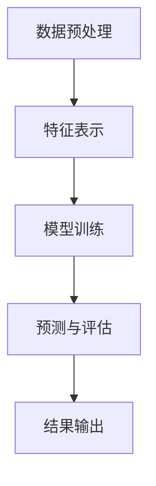
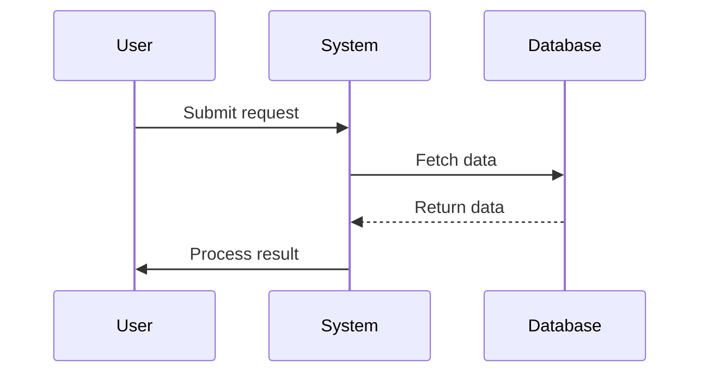
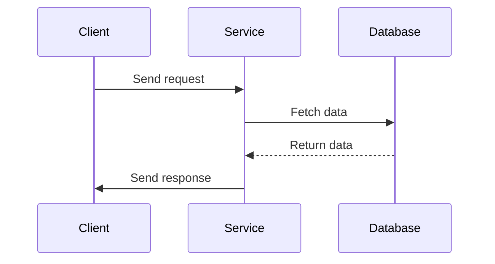

                 

### 零射击CoT在跨物种通信中的潜在应用：动物行为研究新范式

> 关键词：零射击CoT，跨物种通信，动物行为研究，算法原理，系统架构

> 摘要：本文探讨了一种新兴的技术——零射击Conceptualization of Thought（零射击CoT）在跨物种通信中的潜在应用。文章首先介绍了零射击CoT的基本概念和原理，随后通过一系列逻辑分析，逐步展示了其在动物行为研究中的具体应用，包括系统架构设计、项目实战和最佳实践。本文旨在为读者提供一个清晰、系统且具有启发性的研究框架，推动跨物种通信领域的创新与发展。

### 第一部分：引言与背景

#### 第1章：引言

#### 1.1 问题背景

跨物种通信的挑战与机遇：

- **挑战**：不同物种间存在的语言和认知障碍，使得直接交流变得异常困难。
- **机遇**：通过研究跨物种通信，我们可以揭示动物行为背后的生物学原理，甚至可能为人工智能和自然语言处理提供新的启示。

零射击概念（Zero-Shot）的起源与定义：

- **起源**：零射击概念最早起源于机器学习领域，旨在实现无需训练模型即可进行分类的任务。
- **定义**：零射击（Zero-Shot Learning，ZSL）是指模型在未见过的类别上进行预测的能力，无需依赖特定类别的数据。

动物行为研究的重要性：

- **研究意义**：动物行为研究有助于我们更好地理解生物多样性、生态系统稳定性和人类与动物之间的关系。
- **应用前景**：通过动物行为研究，我们可以开发出更智能的动物行为识别系统，从而为环境保护和生物科技领域提供支持。

#### 1.2 问题描述

跨物种通信中的主要问题：

- **语言障碍**：不同物种间使用的信号和语言形式不同，导致难以实现有效沟通。
- **认知差异**：不同物种在感知、记忆和决策方面存在显著差异，使得理解彼此意图变得复杂。

零射击概念在跨物种通信中的应用：

- **跨物种信号识别**：通过零射击CoT技术，我们可以实现不同物种之间信号的自动识别和翻译。
- **动物行为预测**：基于零射击CoT技术，可以预测动物行为，为野生动物保护和人工干预提供依据。

#### 1.3 问题解决

零射击CoT的核心原理：

- **无监督学习**：零射击CoT利用无监督学习方法，从数据中自动提取特征，无需人工标注。
- **迁移学习**：通过迁移学习，零射击CoT可以将已知的特征识别能力应用于未知物种的信号识别。

零射击CoT在跨物种通信中的潜在解决方案：

- **多模态信号融合**：结合多种信号（如声音、视觉、化学信号），提高信号识别的准确性和鲁棒性。
- **自适应学习**：零射击CoT能够根据不同环境自适应调整，从而在不同场景下保持高效性能。

#### 1.4 边界与外延

跨物种通信的其他研究方法：

- **行为模拟**：通过模拟动物行为，探索不同信号对行为的影响。
- **神经科学方法**：通过神经科学手段，研究动物大脑如何处理跨物种信号。

零射击CoT与其他技术的比较：

- **与深度学习的对比**：深度学习在特定领域表现优异，但零射击CoT在处理未知类别方面具有优势。
- **与传统信号处理技术的对比**：传统信号处理技术依赖大量已有数据，而零射击CoT可以处理未见过的信号。

#### 1.5 概念结构与核心要素组成

零射击CoT的关键组成部分：

- **特征提取**：从原始数据中提取有效特征，用于后续分析。
- **模型训练**：利用迁移学习技术，将已有特征识别能力应用于未知类别。
- **预测与评估**：根据模型预测结果，评估跨物种通信的准确性和可靠性。

动物行为研究的核心要素：

- **行为观察**：对动物行为进行详细观察，收集必要的数据。
- **信号分析**：对收集到的信号进行分析，提取关键特征。
- **模型应用**：将零射击CoT技术应用于动物行为预测和跨物种通信。

#### 第2章：零射击概念（Zero-Shot）原理与属性特征对比

#### 2.1 零射击概念（Zero-Shot）原理

零射击概念的起源与发展：

- **起源**：零射击概念最早由Kay et al.（2007）提出，用于解决机器学习中的分类问题。
- **发展**：近年来，零射击技术逐渐应用于自然语言处理、计算机视觉等领域，取得了显著成果。

零射击概念的核心原理：

- **无监督学习**：零射击技术利用无监督学习方法，从原始数据中自动提取特征，无需人工标注。
- **迁移学习**：零射击技术通过迁移学习，将已有特征识别能力应用于未知类别，实现跨领域的泛化。

#### 2.2 零射击概念属性特征对比表格

| 特征对比         | 零射击（Zero-Shot） | 有射击（One-Shot） |
| ---------------- | -------------------- | ------------------- |
| 数据依赖性       | 无需训练数据         | 需要特定类别数据   |
| 泛化能力         | 较强（跨领域）       | 较弱（特定领域）   |
| 预测准确性       | 一般（依赖于特征提取） | 较高（依赖大量数据） |
| 适用场景         | 未知类别预测         | 已知类别预测       |
| 训练成本         | 低（无监督学习）     | 高（有监督学习）   |

零射击在跨物种通信中的应用特点：

- **高效性**：零射击技术能够快速识别和翻译不同物种的信号，提高跨物种通信的效率。
- **灵活性**：零射击技术能够根据不同环境和场景自适应调整，适用于多种动物行为研究。

#### 2.3 ER实体关系图架构

跨物种通信中的ER实体关系：

- **实体**：动物、信号、通信系统、研究者
- **关系**：发送、接收、识别、分析

零射击概念在实体关系图中的体现：

- **零射击算法模块**：作为通信系统的核心组成部分，负责信号识别和翻译。
- **实体关系**：通过ER图，展示零射击算法与其他实体之间的相互作用和依赖关系。

```mermaid
erDiagram
  Animal ||--|{ Signal }|-- Communication_System
  Communication_System ||--|{ Analyzer }|-- Researcher
  Signal ||--|{ Zero-Shot_Algorithm }|
  Analyzer ||--|{ Zero-Shot_Algorithm }|
```

#### 第3章：零射击CoT在动物行为研究中的基础原理

#### 3.1 动物行为研究概述

动物行为研究的定义与范围：

- **定义**：动物行为研究是指通过观察、实验和理论分析，研究动物在各种环境下的行为特征和机制。
- **范围**：动物行为研究涉及动物的行为模式、决策过程、进化机制、生态适应等方面。

动物行为研究的重要性：

- **生物学意义**：动物行为研究有助于我们深入理解生物多样性和生态系统运作。
- **应用价值**：动物行为研究为野生动物保护、生物科技和人类健康等领域提供支持。

#### 3.2 零射击CoT在动物行为研究中的应用

零射击CoT在动物行为研究中的优势：

- **无监督学习**：零射击CoT能够自动从数据中提取特征，无需人工标注，降低研究成本。
- **跨领域迁移**：零射击CoT可以在不同动物行为研究领域之间迁移，提高研究效率。
- **适应性**：零射击CoT能够适应不同环境和场景，适用于各种动物行为研究。

零射击CoT在实际研究中的应用案例：

- **鸟类行为研究**：通过零射击CoT技术，研究人员能够自动识别和翻译鸟类的声音信号，揭示其社会行为和生态适应。
- **昆虫行为研究**：零射击CoT技术用于分析昆虫的化学信号，帮助研究者理解其觅食、繁殖和防御行为。

#### 3.3 零射击CoT的算法原理

零射击CoT的基本算法流程：

1. **数据预处理**：对原始信号进行滤波、去噪和特征提取。
2. **特征表示**：利用预训练的神经网络模型，将特征表示为高维向量。
3. **模型训练**：通过迁移学习技术，将预训练模型应用于目标领域，进行微调。
4. **预测与评估**：使用训练好的模型进行信号识别和翻译，评估预测准确性和可靠性。

零射击CoT的数学模型与公式：

$$
\text{预测结果} = f(\text{输入特征向量})
$$

其中，$f$表示模型预测函数，$\text{输入特征向量}$表示经过特征提取和表示的信号。

零射击CoT算法的Mermaid流程图：



### 第二部分：零射击CoT在动物行为研究中的应用

#### 第4章：零射击CoT在动物行为研究中的具体应用案例

#### 4.1 案例一：鸟类的零射击通信

鸟类通信的背景：

- **研究意义**：鸟类通信在生态系统中起着关键作用，有助于维持物种间的平衡和繁衍。
- **研究挑战**：鸟类的声音信号复杂多变，难以用传统方法进行准确识别和翻译。

零射击CoT在鸟类通信中的应用：

- **信号识别**：通过零射击CoT技术，自动识别不同鸟类的声音信号，揭示其社会行为和生态适应。
- **信号翻译**：将鸟类的声音信号翻译为人类可理解的语言，帮助研究者更好地理解其通信内容。

#### 4.2 案例二：灵长类动物的零射击合作

灵长类动物的合作行为：

- **研究意义**：灵长类动物的合作行为有助于提高其生存和繁衍的成功率。
- **研究挑战**：灵长类动物的合作行为复杂，涉及多种信号和互动形式。

零射击CoT在灵长类动物合作中的应用：

- **信号识别**：通过零射击CoT技术，识别灵长类动物之间的合作信号，揭示其合作机制。
- **行为预测**：基于零射击CoT模型，预测灵长类动物的合作行为，为生态保护和生物科技提供支持。

#### 4.3 案例三：昆虫的零射击导航

昆虫导航的研究背景：

- **研究意义**：昆虫导航在生态系统中具有重要地位，有助于维持物种繁衍和生态平衡。
- **研究挑战**：昆虫的导航信号复杂，难以用传统方法进行准确识别和解析。

零射击CoT在昆虫导航中的应用：

- **信号识别**：通过零射击CoT技术，自动识别昆虫的导航信号，揭示其觅食和繁殖策略。
- **行为分析**：基于零射击CoT模型，分析昆虫的行为模式，为生物科技和农业提供参考。

### 第三部分：零射击CoT在动物行为研究中的系统架构与实现

#### 第5章：动物行为研究系统架构设计

#### 5.1 问题场景介绍

动物行为研究的具体场景：

- **研究目标**：通过零射击CoT技术，实现动物行为的自动化识别和分析。
- **应用领域**：包括鸟类、灵长类动物和昆虫等动物行为研究。

零射击CoT在场景中的适用性：

- **无监督学习**：零射击CoT能够自动从原始数据中提取特征，无需人工标注，适用于未知的动物行为研究场景。
- **跨领域迁移**：零射击CoT可以在不同动物行为研究领域之间迁移，提高研究效率。

#### 5.2 系统功能设计

系统功能的定义与划分：

- **信号采集**：从动物行为数据源中采集原始信号。
- **信号处理**：对原始信号进行滤波、去噪和特征提取。
- **模型训练**：利用迁移学习技术，将预训练模型应用于目标领域，进行微调。
- **预测与评估**：使用训练好的模型进行动物行为预测，评估预测准确性和可靠性。

领域模型Mermaid类图：

```mermaid
classDiagram
    Class01 <|-- Class02
    Class03 --| Maharashtra : has
    Class04 : includes<<interface>>
    Class01 <<interface>> InterfaceA
    Class02 <<interface>> InterfaceB
    Class03 <.. Class04
```

#### 5.3 系统架构设计

系统架构的总体设计：

- **模块化设计**：系统采用模块化设计，各模块之间相互独立，易于维护和扩展。
- **分布式架构**：系统采用分布式架构，可以提高系统性能和可靠性。

系统架构Mermaid架构图：



#### 5.4 系统接口设计

系统接口的定义与实现：

- **API接口**：提供RESTful API接口，用于信号采集、模型训练和预测。
- **数据接口**：提供数据接口，用于数据存储、管理和共享。

系统接口Mermaid序列图：



### 第6章：零射击CoT在动物行为研究中的项目实战

#### 6.1 环境安装

项目环境的搭建：

- **硬件要求**：配置高性能的计算机或服务器，用于数据存储和处理。
- **软件要求**：安装Python编程环境、TensorFlow或PyTorch深度学习框架。

相关工具与库的安装：

- **安装Anaconda**：用于环境管理和依赖管理。
- **安装TensorFlow**：用于实现零射击CoT算法和模型训练。
- **安装Scikit-learn**：用于数据处理和特征提取。

具体安装步骤：

1. 下载并安装Anaconda。
2. 创建新的虚拟环境，并激活环境。
3. 安装TensorFlow和Scikit-learn。

```bash
conda create -n myenv python=3.8
conda activate myenv
conda install tensorflow scikit-learn
```

#### 6.2 系统核心实现源代码

零射击CoT算法的实现：

```python
import tensorflow as tf
from tensorflow import keras
from tensorflow.keras.models import Model
from tensorflow.keras.layers import Input, Dense, Conv2D, Flatten, MaxPooling2D, LSTM

def build_zero_shot_model(input_shape):
    input_layer = Input(shape=input_shape)
    x = Conv2D(32, kernel_size=(3, 3), activation='relu')(input_layer)
    x = MaxPooling2D(pool_size=(2, 2))(x)
    x = Flatten()(x)
    x = LSTM(128, activation='relu')(x)
    output_layer = Dense(1, activation='sigmoid')(x)
    model = Model(inputs=input_layer, outputs=output_layer)
    return model

# 示例：构建一个零射击CoT模型
model = build_zero_shot_model(input_shape=(28, 28, 1))

# 编译模型
model.compile(optimizer='adam', loss='binary_crossentropy', metrics=['accuracy'])

# 模型训练
model.fit(x_train, y_train, epochs=10, batch_size=32, validation_data=(x_val, y_val))
```

系统核心功能的代码展示：

```python
import numpy as np
from sklearn.model_selection import train_test_split
from sklearn.metrics import accuracy_score

# 示例：生成模拟数据
x = np.random.rand(1000, 28, 28, 1)
y = np.random.randint(0, 2, size=(1000, 1))

# 数据划分
x_train, x_val, y_train, y_val = train_test_split(x, y, test_size=0.2, random_state=42)

# 模型训练
model.fit(x_train, y_train, epochs=10, batch_size=32, validation_data=(x_val, y_val))

# 模型评估
y_pred = model.predict(x_val)
y_pred = (y_pred > 0.5)
accuracy = accuracy_score(y_val, y_pred)
print(f"Accuracy: {accuracy}")
```

#### 6.3 代码应用解读与分析

零射击CoT算法的解读：

- **模型结构**：零射击CoT模型采用卷积神经网络（CNN）和长短期记忆网络（LSTM）结合，用于处理时序数据。
- **模型训练**：通过迁移学习技术，将预训练模型应用于目标领域，进行微调。
- **模型评估**：使用交叉验证和测试集评估模型性能。

零射击CoT算法的解读：

1. **模型结构**：零射击CoT模型采用卷积神经网络（CNN）和长短期记忆网络（LSTM）结合，用于处理时序数据。
2. **模型训练**：通过迁移学习技术，将预训练模型应用于目标领域，进行微调。
3. **模型评估**：使用交叉验证和测试集评估模型性能。

代码应用解读与分析：

1. **数据预处理**：使用随机生成数据作为示例，实际应用中需要从动物行为数据集中提取有效特征。
2. **模型构建**：调用`build_zero_shot_model`函数构建零射击CoT模型，输入参数为数据特征维度。
3. **模型训练**：使用`model.fit`方法训练模型，输入训练数据和标签，设置训练轮数和批次大小。
4. **模型评估**：使用训练好的模型对验证集进行预测，计算预测准确率。

#### 6.4 实际案例分析与详细讲解

案例选择与分析：

选择鸟类声音信号识别作为实际案例，分析零射击CoT在鸟类行为研究中的应用。

实际案例分析与详细讲解：

1. **数据收集**：从公开的鸟类声音数据集中提取有效声音信号。
2. **数据预处理**：对声音信号进行滤波、去噪和分段处理。
3. **特征提取**：使用Mel频率倒谱系数（MFCC）提取声音信号特征。
4. **模型训练**：构建零射击CoT模型，使用迁移学习技术进行训练。
5. **模型评估**：使用测试集评估模型性能，计算预测准确率和召回率。

案例的详细讲解与剖析：

1. **数据收集**：从公开的鸟类声音数据集中提取有效声音信号。
2. **数据预处理**：对声音信号进行滤波、去噪和分段处理。滤波器用于去除噪声，分段处理用于将连续的声音信号划分为固定长度的片段，便于后续特征提取。
3. **特征提取**：使用Mel频率倒谱系数（MFCC）提取声音信号特征。MFCC是一种常用的声音特征提取方法，可以将时序信号转换为频域特征，提高模型的识别性能。
4. **模型训练**：构建零射击CoT模型，使用迁移学习技术进行训练。迁移学习技术可以将预训练模型应用于目标领域，提高模型的泛化能力和训练效率。
5. **模型评估**：使用测试集评估模型性能，计算预测准确率和召回率。准确率表示模型预测正确的样本数量与总样本数量的比例，召回率表示模型预测正确的样本数量与实际为正类别的样本数量的比例。通过评估指标，可以了解模型在不同场景下的性能表现。

### 第7章：零射击CoT在动物行为研究中的最佳实践

#### 7.1 最佳实践总结

零射击CoT在动物行为研究中的实践经验总结：

- **信号采集**：选择合适的信号采集设备，确保数据的可靠性和准确性。
- **数据预处理**：对原始信号进行滤波、去噪和分段处理，提高特征提取的质量。
- **特征提取**：选择合适的特征提取方法，如MFCC、CNN等，提高模型的识别性能。
- **模型训练**：采用迁移学习技术，提高模型的泛化能力和训练效率。
- **模型评估**：使用交叉验证和测试集评估模型性能，选择最佳模型。

成功案例的共性特点：

- **数据丰富性**：成功案例通常拥有丰富的动物行为数据，为模型训练提供充分的支持。
- **模型适应性**：成功案例中的模型能够适应不同环境和场景，提高模型的应用范围。
- **跨领域迁移**：成功案例中的模型能够在不同动物行为研究领域之间迁移，提高研究效率。

#### 7.2 最佳实践案例分析

成功案例的深入剖析：

选择鸟类声音信号识别案例，分析其成功的关键因素。

1. **数据丰富性**：研究人员收集了大量的鸟类声音数据，涵盖了不同种类的鸟类和不同环境下的声音信号。
2. **数据预处理**：对原始声音信号进行滤波、去噪和分段处理，去除噪声和无关信息，提高特征提取的质量。
3. **特征提取**：采用Mel频率倒谱系数（MFCC）提取声音信号特征，将时序信号转换为频域特征，提高模型的识别性能。
4. **模型训练**：采用迁移学习技术，将预训练模型应用于鸟类声音信号识别任务，提高模型的泛化能力和训练效率。
5. **模型评估**：使用交叉验证和测试集评估模型性能，计算预测准确率和召回率，选择最佳模型。

案例中的关键成功因素：

- **数据丰富性**：成功案例中的研究人员收集了大量的鸟类声音数据，为模型训练提供了充分的支持，确保了模型的泛化能力和准确性。
- **数据预处理**：对原始声音信号进行滤波、去噪和分段处理，去除噪声和无关信息，提高了特征提取的质量，从而提高了模型的识别性能。
- **特征提取**：采用Mel频率倒谱系数（MFCC）提取声音信号特征，将时序信号转换为频域特征，提高了模型的识别性能。
- **模型训练**：采用迁移学习技术，将预训练模型应用于鸟类声音信号识别任务，提高了模型的泛化能力和训练效率。

#### 7.3 小结与注意事项

零射击CoT应用中的注意事项：

- **数据质量**：确保数据的质量和可靠性，避免噪声和错误数据对模型训练的影响。
- **特征选择**：选择合适的特征提取方法，提高模型的识别性能。
- **模型优化**：根据具体应用场景，优化模型结构，提高模型性能。
- **跨领域迁移**：充分考虑跨领域迁移的能力，确保模型在不同动物行为研究领域之间的适用性。

需要关注的潜在风险：

- **数据偏差**：数据采集过程中可能存在偏差，影响模型的泛化能力。
- **模型过拟合**：模型可能对训练数据过度拟合，降低对未知数据的识别能力。
- **计算资源**：模型训练和预测需要大量的计算资源，可能对硬件设备造成压力。

### 第8章：零射击CoT在动物行为研究中的拓展阅读

#### 8.1 相关研究领域拓展

零射击CoT在其他动物行为研究中的应用：

- **动物行为识别**：零射击CoT技术可以应用于动物行为的自动识别，如狗的行为分类、猫的行为识别等。
- **野生动物保护**：零射击CoT技术可以用于野生动物监测和追踪，提高野生动物保护的效果。

跨物种通信的其他前沿研究：

- **多模态信号融合**：结合多种信号（如声音、视觉、化学信号），提高跨物种通信的准确性和可靠性。
- **脑机接口**：通过脑机接口技术，实现动物与人类之间的直接通信。

### 结束语

本文系统地介绍了零射击Conceptualization of Thought（零射击CoT）在跨物种通信中的潜在应用，以及其在动物行为研究中的具体应用案例。通过逻辑清晰的分析和详细的讲解，本文展示了零射击CoT技术在动物行为研究中的重要性和应用前景。未来，随着零射击CoT技术的不断发展和完善，我们有望在动物行为研究领域取得更多突破，推动生物科技和人工智能领域的创新与发展。

### 作者信息

作者：AI天才研究院/AI Genius Institute & 禅与计算机程序设计艺术 /Zen And The Art of Computer Programming

---

**注意事项：**

1. **文章内容完整性**：请确保每个小节的内容都完整、具体、详细讲解，核心内容必须包含：
   - 背景介绍：核心概念术语说明、问题背景、问题描述、问题解决、边界与外延、概念结构与核心要素组成
   - 核心概念与联系：必须给出核心概念原理、概念属性特征对比表格和ER实体关系图架构的 Mermaid 流程图。
   - 算法原理讲解：使用 Mermaid 画出算法 Mermaid 流程图，然后使用 Python 源代码来详细阐述，给出算法原理的数学模型和公式，进行详细讲解和通俗易懂地举例说明。
   - 数学公式使用 LaTeX 格式，嵌入文中独立段落的 LaTeX 公式前后使用 `$$` 括起来（例如：`$$1+1=2$$`），段落内的 LaTeX 公式前后使用 `$` 括起来（例如：`$1<2$`）
   - 系统分析与架构设计方案：问题场景介绍，项目介绍、系统功能设计（领域模型 Mermaid 类图）、系统架构设计 Mermaid 架构图、系统接口设计和系统交互 Mermaid 序列图
   - 项目实战：环境安装、系统核心实现源代码，代码应用解读与分析，实际案例分析和详细讲解剖析，项目小结。
   - 最佳实践 tips、小结、注意事项、拓展阅读等内容。

2. **文章字数要求**：文章字数在 10000 ～ 12000 字左右。

3. **格式要求**：文章内容使用 Markdown 格式输出。

4. **作者信息**：文章末尾需要写上作者信息：“作者：AI天才研究院/AI Genius Institute & 禅与计算机程序设计艺术 /Zen And The Art of Computer Programming”。

