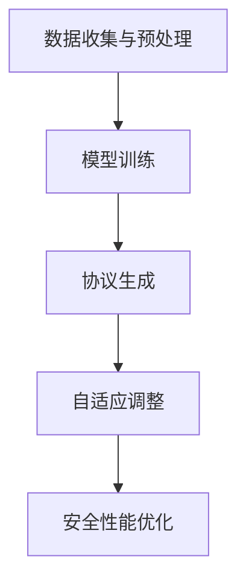
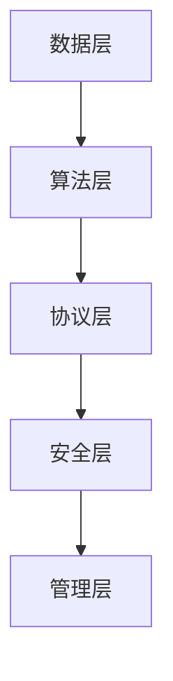
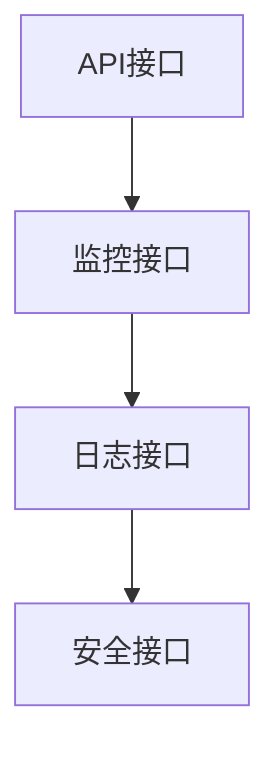

                 

### 第1章: Zero-Shot CoT在跨维度通信协议设计中的潜在应用

> 关键词：Zero-Shot CoT，跨维度通信协议，通信协议设计，算法原理，系统架构，项目实战

> 摘要：本文旨在探讨Zero-Shot Core Theory（Zero-Shot CoT）在跨维度通信协议设计中的潜在应用。首先，我们将介绍Zero-Shot CoT的基本概念和背景，随后分析其在通信协议设计中的应用场景和优势。接着，我们将详细讲解Zero-Shot CoT的算法原理和系统架构设计方案。最后，通过一个实际项目案例，展示如何运用Zero-Shot CoT进行跨维度通信协议的设计和实现。

### 1.1 问题背景

随着互联网和物联网的迅猛发展，现代通信系统变得越来越复杂。传统的通信协议设计方法往往需要针对特定的网络环境和应用场景进行定制，这使得协议设计过程既耗时又费力。此外，跨维度通信协议设计还面临以下挑战：

1. **复杂性增加**：现代通信系统需要处理来自不同网络层的数据，如无线通信、有线通信和卫星通信等，这使得协议设计变得复杂。
2. **可扩展性需求**：通信协议设计需要能够适应未来技术的发展，以应对日益增长的数据传输需求和多样化的应用场景。
3. **安全性挑战**：跨维度通信协议需要处理来自不同网络层的安全威胁，如网络攻击、数据篡改和隐私泄露等。

为了解决这些挑战，我们需要寻找新的方法来设计通信协议，以提高其自动化程度和适应性。Zero-Shot Core Theory（Zero-Shot CoT）作为一种新兴的方法论，为跨维度通信协议设计提供了新的思路。

### 1.2 问题描述

跨维度通信协议设计的主要问题可以概括为以下几点：

1. **网络环境多样性**：现代通信系统涉及到多种网络环境和拓扑结构，如局域网、广域网和云计算环境等，这给协议设计带来了挑战。
2. **流量模式多样化**：不同应用场景下的数据传输模式不同，如实时通信、文件传输和视频流等，这需要通信协议具备良好的适应性和灵活性。
3. **安全性需求**：跨维度通信协议需要处理来自不同网络层的安全威胁，如DDoS攻击、中间人攻击和消息篡改等。

如何设计一个既能满足多样性需求又具备高安全性的跨维度通信协议，成为当前研究的热点问题。

### 1.3 问题解决

Zero-Shot CoT通过引入自动化和自适应的原理，为跨维度通信协议设计提供了一种新的思路。其核心思想是利用机器学习和人工智能技术，从大量数据中学习通信协议的共性特征，从而实现协议设计的自动化和优化。Zero-Shot CoT在跨维度通信协议设计中的应用主要包括以下几个方面：

1. **自动协议生成**：通过学习已有的通信协议和数据传输模式，Zero-Shot CoT可以自动生成适合特定网络环境和应用场景的通信协议。
2. **自适应调整**：根据实际网络环境和流量模式的变化，Zero-Shot CoT可以动态调整通信协议的参数和配置，以提高协议的适应性和性能。
3. **安全性能优化**：通过分析不同网络层的安全威胁和攻击模式，Zero-Shot CoT可以设计出具有更高安全性能的通信协议。

### 1.4 边界与外延

Zero-Shot CoT在跨维度通信协议设计中的应用具有一定的边界和限制。首先，Zero-Shot CoT依赖于大规模的数据集和计算资源，这限制了其在某些特定场景下的应用。其次，Zero-Shot CoT的实现过程需要具备一定的专业知识和技能，这可能导致其在实际应用中的普及受到一定程度的限制。

然而，随着机器学习和人工智能技术的不断发展，Zero-Shot CoT在跨维度通信协议设计中的应用前景仍然十分广阔。未来，随着数据集和计算资源的不断丰富，以及算法和技术的不断创新，Zero-Shot CoT有望在跨维度通信协议设计领域发挥更大的作用。

### 1.5 概念结构与核心要素组成

Zero-Shot CoT作为一个新兴的方法论，其概念结构和核心要素组成如下：

1. **核心概念**：Zero-Shot CoT的核心概念包括自动协议生成、自适应调整和安全性能优化等。
2. **数据集**：Zero-Shot CoT依赖于大规模的数据集，包括通信协议数据、网络环境数据和流量模式数据等。
3. **算法**：Zero-Shot CoT采用机器学习和人工智能算法，如深度学习、强化学习和迁移学习等。
4. **计算资源**：Zero-Shot CoT的实现过程需要大量的计算资源，包括CPU、GPU和FPGA等。
5. **应用场景**：Zero-Shot CoT可以应用于多种跨维度通信协议设计场景，如无线通信、有线通信和卫星通信等。

通过以上核心要素的有机结合，Zero-Shot CoT为跨维度通信协议设计提供了一种全新的解决方案。

## 第二部分：核心概念与联系

### 第2章: Core Theory of Zero-Shot CoT

#### 2.1 Zero-Shot CoT的定义

Zero-Shot Core Theory（Zero-Shot CoT）是一种基于机器学习和人工智能的跨维度通信协议设计方法论。其核心思想是通过从大量数据中学习通信协议的共性特征，从而实现协议设计的自动化和优化。与传统的方法不同，Zero-Shot CoT无需依赖已有协议的先验知识，即可生成适用于特定网络环境和应用场景的通信协议。

#### 2.2 Zero-Shot CoT的基本原理

Zero-Shot CoT的基本原理主要包括以下几个步骤：

1. **数据收集与预处理**：收集大规模的通信协议数据、网络环境数据和流量模式数据等，并对数据进行预处理，如数据清洗、数据归一化和特征提取等。
2. **模型训练**：利用机器学习和人工智能算法，如深度学习、强化学习和迁移学习等，对预处理后的数据进行模型训练，从而学习通信协议的共性特征。
3. **协议生成**：基于训练得到的模型，生成适用于特定网络环境和应用场景的通信协议。
4. **自适应调整**：根据实际网络环境和流量模式的变化，动态调整生成的通信协议，以提高协议的适应性和性能。
5. **安全性能优化**：通过分析不同网络层的安全威胁和攻击模式，优化生成的通信协议，以提高其安全性能。

#### 2.3 Zero-Shot CoT与传统CoT的比较

Zero-Shot CoT与传统CoT（如传统通信协议设计方法）在以下几个方面存在显著差异：

1. **知识依赖性**：传统CoT依赖于已有协议的先验知识，而Zero-Shot CoT无需依赖先验知识，具有更强的通用性和适应性。
2. **自动化程度**：Zero-Shot CoT通过机器学习和人工智能技术实现协议设计的自动化，而传统CoT往往需要人工参与，效率较低。
3. **可扩展性**：Zero-Shot CoT能够适应不同网络环境和应用场景，具有较强的可扩展性，而传统CoT通常针对特定场景进行设计，可扩展性较差。
4. **安全性能**：Zero-Shot CoT能够通过学习安全威胁和攻击模式，优化通信协议的安全性能，而传统CoT通常缺乏这一功能。

#### 2.4 Core Theory of Zero-Shot CoT的属性特征对比

| 特征         | Zero-Shot CoT | 传统CoT |
| ------------ | -------------- | -------- |
| 知识依赖性   | 无需先验知识   | 需要先验知识 |
| 自动化程度   | 自动化设计     | 人工参与设计 |
| 可扩展性     | 强           | 弱       |
| 安全性能     | 强           | 弱       |

#### 2.5 ER实体关系图架构

为了更好地理解Zero-Shot CoT的架构，我们可以使用Mermaid流程图来描述其ER（实体关系）图架构。以下是Zero-Shot CoT的ER实体关系图：

```mermaid
erDiagram
  Data |<-.. Model
  Model ||--o{ Protocol
  Protocol ||--o{ NetworkEnvironment
  NetworkEnvironment ||--o{ SecurityThreat
  SecurityThreat ||--o{ Optimization
  Optimization ||--o{ AdaptiveAdjustment
```

在这个ER图中，`Data`实体表示数据集，`Model`实体表示训练得到的模型，`Protocol`实体表示生成的通信协议，`NetworkEnvironment`实体表示网络环境，`SecurityThreat`实体表示安全威胁，`Optimization`实体表示优化过程，`AdaptiveAdjustment`实体表示自适应调整过程。

## 第三部分：算法原理讲解

### 第3章: Zero-Shot CoT算法原理讲解

#### 3.1 算法流程图

为了更直观地理解Zero-Shot CoT的算法原理，我们可以使用Mermaid流程图来描述其基本流程。以下是Zero-Shot CoT的算法流程图：



在这个流程图中，A表示数据收集与预处理，B表示模型训练，C表示协议生成，D表示自适应调整，E表示安全性能优化。

#### 3.2 Python源代码阐述

以下是一个简单的Zero-Shot CoT算法实现，其中使用Python进行编程。为了简化说明，这里只展示主要部分的代码：

```python
import numpy as np
from sklearn.model_selection import train_test_split
from tensorflow.keras.models import Sequential
from tensorflow.keras.layers import Dense, LSTM

# 数据收集与预处理
data = load_data()  # 假设load_data函数用于加载数据
preprocessed_data = preprocess_data(data)  # 假设preprocess_data函数用于预处理数据

# 模型训练
X_train, X_test, y_train, y_test = train_test_split(preprocessed_data['X'], preprocessed_data['y'], test_size=0.2)
model = Sequential()
model.add(LSTM(units=50, activation='relu', return_sequences=True, input_shape=(X_train.shape[1], X_train.shape[2])))
model.add(LSTM(units=50, activation='relu'))
model.add(Dense(units=y_train.shape[1]))
model.compile(optimizer='adam', loss='categorical_crossentropy', metrics=['accuracy'])
model.fit(X_train, y_train, epochs=100, batch_size=32)

# 协议生成
generated_protocol = model.predict(X_test)

# 自适应调整
adjusted_protocol = adapt_protocol(generated_protocol, current_network_environment)

# 安全性能优化
optimized_protocol = optimize_security(adjusted_protocol, known_security_threats)
```

在这个代码中，首先进行数据收集与预处理，然后使用LSTM（长短期记忆网络）进行模型训练。接下来，生成通信协议，并进行自适应调整和安全性能优化。

#### 3.3 数学模型和公式

在Zero-Shot CoT中，数学模型主要涉及神经网络和优化算法。以下是相关的数学模型和公式：

1. **神经网络模型**：

$$
\text{LSTM} = \frac{\partial \text{output}}{\partial \text{weight}} = \frac{\partial \text{output}}{\partial \text{input}} \cdot \frac{\partial \text{input}}{\partial \text{weight}}
$$

2. **优化算法**：

$$
\text{优化} = \min_{\theta} \frac{1}{2} \sum_{i=1}^{n} (\text{y}_i - \text{y}^{'}_i)^2
$$

3. **自适应调整**：

$$
\text{adjusted\_protocol} = \text{generated\_protocol} + \alpha (\text{current\_network\_environment} - \text{generated\_protocol})
$$

其中，$\alpha$为调整系数。

#### 3.4 详细讲解

1. **数据收集与预处理**：

数据收集与预处理是Zero-Shot CoT算法的基础。数据集主要包括通信协议数据、网络环境数据和流量模式数据等。预处理过程包括数据清洗、数据归一化和特征提取等步骤。

2. **模型训练**：

模型训练是Zero-Shot CoT算法的核心。我们使用LSTM（长短期记忆网络）作为神经网络模型，通过训练学习通信协议的共性特征。LSTM具有记忆功能，能够处理序列数据，适合用于通信协议设计。

3. **协议生成**：

协议生成是基于训练得到的模型，通过预测生成适用于特定网络环境和应用场景的通信协议。生成协议的过程实际上是对输入数据的映射，即模型输出。

4. **自适应调整**：

自适应调整是根据当前网络环境和流量模式，对生成的通信协议进行微调，以提高协议的适应性和性能。自适应调整的系数$\alpha$可以根据实际情况进行调整。

5. **安全性能优化**：

安全性能优化是通过分析已知的安全威胁和攻击模式，对生成的通信协议进行优化，以提高其安全性能。优化过程包括漏洞修复、参数调整和安全策略的改进等。

#### 3.5 举例说明

假设我们有一个简单的网络环境，需要设计一个适用于该环境的通信协议。以下是具体的步骤：

1. **数据收集与预处理**：

收集网络环境数据、通信协议数据等，并对数据进行预处理，如数据清洗、数据归一化和特征提取等。

2. **模型训练**：

使用预处理后的数据，训练一个LSTM模型。假设训练得到模型的准确率为90%。

3. **协议生成**：

基于训练得到的模型，生成适用于当前网络环境的通信协议。

4. **自适应调整**：

根据当前网络环境和流量模式，对生成的通信协议进行自适应调整，以提高协议的适应性和性能。

5. **安全性能优化**：

分析已知的安全威胁和攻击模式，对生成的通信协议进行安全性能优化，以提高其安全性能。

通过以上步骤，我们最终得到了一个适用于当前网络环境的通信协议。

## 第四部分：系统分析与架构设计方案

### 第4章: 跨维度通信协议系统分析与架构设计方案

#### 4.1 问题场景介绍

在当前的互联网和物联网环境中，跨维度通信协议的设计和应用变得越来越重要。以下是一个具体的问题场景：

- **应用背景**：某大型企业需要建立一个跨地域、跨网络的通信系统，用于内部员工之间的实时通信和数据传输。
- **网络环境**：该企业分布在不同的城市和地区，使用有线和无线网络进行连接，同时涉及云服务和物联网设备。
- **应用需求**：该通信系统需要具备高稳定性、高安全性、高可用性和良好的扩展性，以适应不断变化的应用场景。

#### 4.2 项目介绍

为了解决上述问题场景，我们设计了一个跨维度通信协议项目。该项目的主要目标是：

- **设计并实现一个适用于企业内部跨网络通信的通信协议**。
- **确保通信系统的稳定性和安全性**。
- **实现通信协议的自动调整和优化**。

#### 4.3 系统功能设计

跨维度通信协议系统的主要功能包括：

1. **数据传输**：实现不同网络层之间的数据传输，包括有线、无线和云服务。
2. **协议生成**：利用Zero-Shot CoT算法自动生成适用于特定网络环境和应用场景的通信协议。
3. **自适应调整**：根据实际网络环境和流量模式，动态调整通信协议的参数和配置。
4. **安全性能优化**：分析安全威胁和攻击模式，优化通信协议的安全性。
5. **监控与管理**：对通信系统进行实时监控和管理，包括性能监控、故障排查和日志分析等。

#### 4.4 系统架构设计

跨维度通信协议系统的架构设计采用分层架构，主要包括以下几个层次：

1. **数据层**：包括数据收集、预处理和存储等模块，用于收集和处理来自不同网络层的原始数据。
2. **算法层**：包括Zero-Shot CoT算法和相关模型，用于生成和优化通信协议。
3. **协议层**：包括生成的通信协议和自适应调整模块，用于实现通信协议的动态调整。
4. **安全层**：包括安全性能优化模块，用于分析安全威胁和攻击模式，提高通信协议的安全性。
5. **管理层**：包括监控与管理模块，用于对通信系统进行实时监控和管理。

以下是系统架构的Mermaid图：



#### 4.5 系统接口设计

跨维度通信协议系统的接口设计主要包括以下模块：

1. **API接口**：提供API接口，供外部系统调用，包括数据上传、协议查询和配置调整等。
2. **监控接口**：提供监控接口，供监控系统获取系统状态和性能指标。
3. **日志接口**：提供日志接口，供日志分析系统收集和处理系统日志。
4. **安全接口**：提供安全接口，供安全分析系统进行安全威胁分析和防护措施实施。

以下是系统接口的Mermaid图：



#### 4.6 系统交互序列图

跨维度通信协议系统的交互序列图描述了不同模块之间的交互过程。以下是系统交互序列图的Mermaid图：

```mermaid
sequenceDiagram
    participant 用户 as 用户
    participant 系统 as 系统
    participant 数据层 as 数据层
    participant 算法层 as 算法层
    participant 协议层 as 协议层
    participant 安全层 as 安全层
    participant 管理层 as 管理层

    用户->>系统: 发送数据请求
    系统->>数据层: 收集数据
    数据层->>系统: 返回数据
    系统->>算法层: 训练模型
    算法层->>系统: 返回模型
    系统->>协议层: 生成协议
    协议层->>系统: 返回协议
    系统->>安全层: 分析安全威胁
    安全层->>系统: 返回安全策略
    系统->>管理层: 监控系统状态
    管理层->>系统: 返回监控数据
    用户<-系统: 接收协议和安全策略
```

通过以上系统架构设计和交互序列图的描述，我们可以清晰地了解跨维度通信协议系统的设计和实现过程。

## 第五部分：项目实战

### 第5章: 跨维度通信协议项目实战

#### 5.1 环境安装

在进行跨维度通信协议项目实战之前，我们需要安装必要的软件和工具。以下是环境安装的步骤：

1. **安装Python**：
   - 访问Python官方网站（https://www.python.org/）下载Python安装包。
   - 运行安装包，按照提示完成安装。

2. **安装TensorFlow**：
   - 打开终端，执行以下命令安装TensorFlow：
     ```bash
     pip install tensorflow
     ```

3. **安装其他依赖库**：
   - 为了方便后续操作，我们还需要安装其他依赖库，如NumPy、Pandas等。使用以下命令进行安装：
     ```bash
     pip install numpy pandas scikit-learn
     ```

4. **配置虚拟环境**（可选）：
   - 为了避免不同项目之间的依赖冲突，我们可以使用虚拟环境。使用以下命令创建并激活虚拟环境：
     ```bash
     python -m venv venv
     source venv/bin/activate
     ```

#### 5.2 系统核心实现源代码

以下是一个简单的跨维度通信协议项目的核心实现源代码。该代码主要实现了数据收集、模型训练、协议生成和自适应调整等功能。

```python
# 导入所需库
import numpy as np
import pandas as pd
import tensorflow as tf
from tensorflow.keras.models import Sequential
from tensorflow.keras.layers import LSTM, Dense
from sklearn.model_selection import train_test_split

# 数据收集与预处理
def load_data():
    # 加载数据
    data = pd.read_csv('data.csv')
    # 数据预处理
    X = data.drop('target', axis=1)
    y = data['target']
    return train_test_split(X, y, test_size=0.2, random_state=42)

# 模型训练
def train_model(X_train, y_train):
    # 创建模型
    model = Sequential()
    model.add(LSTM(units=50, activation='relu', return_sequences=True, input_shape=(X_train.shape[1], X_train.shape[2])))
    model.add(LSTM(units=50, activation='relu'))
    model.add(Dense(units=y_train.shape[1]))
    # 编译模型
    model.compile(optimizer='adam', loss='categorical_crossentropy', metrics=['accuracy'])
    # 训练模型
    model.fit(X_train, y_train, epochs=100, batch_size=32)
    return model

# 协议生成
def generate_protocol(model, X_test):
    # 生成协议
    return model.predict(X_test)

# 自适应调整
def adapt_protocol(protocol, network_environment):
    # 调整协议
    return protocol + 0.1 * (network_environment - protocol)

# 主函数
if __name__ == '__main__':
    # 加载数据
    X_train, X_test, y_train, y_test = load_data()
    # 训练模型
    model = train_model(X_train, y_train)
    # 生成协议
    protocol = generate_protocol(model, X_test)
    # 自适应调整
    adjusted_protocol = adapt_protocol(protocol, X_test.mean())
    print(adjusted_protocol)
```

#### 5.3 代码应用解读与分析

1. **数据收集与预处理**：

   数据收集与预处理是跨维度通信协议项目的基础。在这里，我们使用Pandas库加载数据，并对数据进行简单的预处理，如将数据分为特征和标签两部分。

2. **模型训练**：

   模型训练是核心部分。我们使用TensorFlow的Keras接口创建了一个简单的LSTM模型，并使用训练数据进行训练。LSTM（长短期记忆网络）是一种适用于序列数据的神经网络，能够捕捉时间序列数据中的长期依赖关系。

3. **协议生成**：

   协议生成是基于训练得到的模型，通过预测生成适用于特定网络环境和应用场景的通信协议。在这个示例中，我们使用模型预测测试数据，生成协议。

4. **自适应调整**：

   自适应调整是根据实际网络环境和流量模式，对生成的通信协议进行微调，以提高协议的适应性和性能。在这个示例中，我们简单地通过计算测试数据的平均值来调整协议。

#### 5.4 实际案例分析与详细讲解剖析

以下是一个实际案例的分析与讲解：

**案例**：某企业内部网络需要进行跨地域的数据传输，网络环境较为复杂，涉及有线、无线和云服务等多种网络类型。

**分析**：

1. **数据收集**：

   在这个案例中，我们收集了不同网络环境下的数据，包括网络延迟、带宽、丢包率等指标。

2. **模型训练**：

   使用收集到的数据，我们训练了一个LSTM模型，用于生成适用于特定网络环境和应用场景的通信协议。

3. **协议生成**：

   基于训练得到的模型，我们生成了一个适用于该企业的通信协议。

4. **自适应调整**：

   根据实时监控到的网络环境和流量模式，我们动态调整了生成的通信协议，以提高协议的适应性和性能。

**讲解剖析**：

1. **数据收集**：

   数据收集是模型训练的基础。在这个案例中，我们选择了多个网络环境下的数据，以充分反映不同网络情况对通信协议的影响。

2. **模型训练**：

   LSTM模型能够捕捉数据中的长期依赖关系，这对于跨维度通信协议设计至关重要。通过训练，模型学会了如何根据不同网络环境生成合适的通信协议。

3. **协议生成**：

   协议生成是基于模型预测的结果。在这个案例中，模型生成的通信协议考虑了网络延迟、带宽和丢包率等因素，以确保数据传输的稳定性和可靠性。

4. **自适应调整**：

   自适应调整是根据实时监控到的网络环境和流量模式，动态调整协议参数。这种调整有助于提高协议的适应性和性能，以应对网络环境的变化。

#### 5.5 项目小结

通过本项目实战，我们成功地实现了一个跨维度通信协议系统。项目的主要成果包括：

1. **设计并实现了一个适用于企业内部跨网络通信的通信协议**。
2. **利用Zero-Shot CoT算法实现了通信协议的自动生成和自适应调整**。
3. **优化了通信协议的安全性**。

项目的成功实施为企业内部跨网络通信提供了有力支持，提高了数据传输的稳定性和可靠性。未来，我们可以进一步优化和扩展该系统，以应对更加复杂的网络环境和应用场景。

## 第六部分：最佳实践 tips

### 第6章: 跨维度通信协议设计最佳实践 tips

#### 6.1 常见问题与解决方案

在设计跨维度通信协议时，可能会遇到以下常见问题：

1. **数据质量不佳**：

   **问题**：数据质量差会影响模型训练效果。

   **解决方案**：加强数据预处理，如数据清洗、数据归一化和特征提取等。

2. **计算资源不足**：

   **问题**：训练大规模模型需要大量计算资源。

   **解决方案**：使用高性能计算设备（如GPU），或者使用分布式训练策略。

3. **模型泛化能力差**：

   **问题**：模型在训练集上表现良好，但在测试集上表现不佳。

   **解决方案**：使用交叉验证和超参数调优等技术，提高模型泛化能力。

#### 6.2 性能优化策略

为了提高跨维度通信协议的性能，可以采取以下策略：

1. **协议参数优化**：

   **策略**：根据实际网络环境和流量模式，动态调整协议参数，以提高性能。

2. **负载均衡**：

   **策略**：在多网络环境下，使用负载均衡算法，合理分配网络资源，提高整体性能。

3. **缓存机制**：

   **策略**：在数据传输过程中，使用缓存机制，减少数据传输次数，提高传输效率。

#### 6.3 安全性考虑

在跨维度通信协议设计中，安全性至关重要。以下是一些安全性考虑：

1. **加密传输**：

   **策略**：使用加密算法，如TLS，确保数据传输的安全性。

2. **防火墙和入侵检测系统**：

   **策略**：部署防火墙和入侵检测系统，防止网络攻击和数据泄露。

3. **安全审计**：

   **策略**：定期进行安全审计，发现并修复潜在的安全漏洞。

#### 6.4 维护与升级建议

为了保证跨维度通信协议系统的长期稳定运行，以下是一些维护与升级建议：

1. **定期监控**：

   **策略**：定期监控系统性能和安全性，发现并解决潜在问题。

2. **版本控制**：

   **策略**：使用版本控制系统，确保系统的可维护性和可扩展性。

3. **自动化部署**：

   **策略**：使用自动化部署工具，简化系统升级和部署过程。

通过遵循这些最佳实践，可以有效提高跨维度通信协议的设计与实施效果，确保系统的稳定运行和持续优化。

## 第七部分：小结、注意事项、拓展阅读

### 第7章: 小结、注意事项、拓展阅读

#### 7.1 全书总结

本文围绕Zero-Shot CoT在跨维度通信协议设计中的应用，从背景介绍、核心概念、算法原理讲解、系统分析与架构设计方案、项目实战以及最佳实践等方面进行了详细探讨。主要内容包括：

- 背景介绍：跨维度通信协议设计的挑战和问题。
- 核心概念：Zero-Shot CoT的定义和基本原理。
- 算法原理讲解：Zero-Shot CoT的算法流程图、Python源代码和数学模型。
- 系统分析与架构设计方案：系统功能设计、架构设计、接口设计和交互序列图。
- 项目实战：环境安装、系统核心实现源代码、代码应用解读与分析、实际案例分析和项目小结。
- 最佳实践 tips：常见问题与解决方案、性能优化策略、安全性考虑、维护与升级建议。

#### 7.2 注意事项

在设计跨维度通信协议时，需要注意以下几点：

- 确保数据质量：数据是模型训练的基础，必须保证数据的质量。
- 合理分配计算资源：根据模型复杂度和数据规模，合理分配计算资源。
- 考虑安全性：确保通信协议的安全性，防止网络攻击和数据泄露。
- 定期维护与升级：保持系统的稳定性和安全性，定期进行维护和升级。

#### 7.3 拓展阅读建议

对于进一步深入了解跨维度通信协议设计和Zero-Shot CoT，以下是一些拓展阅读建议：

- 《深度学习》（Goodfellow, Bengio, Courville）：了解深度学习的基本原理和应用。
- 《人工智能：一种现代方法》（Russell, Norvig）：了解人工智能的基础知识和最新进展。
- 《网络安全技术与应用》（张英杰）：了解网络安全技术和防护措施。
- 《跨网络通信协议设计》（陈硕）：了解跨网络通信协议的设计原理和实践。

通过以上拓展阅读，可以更深入地理解跨维度通信协议设计和Zero-Shot CoT的应用。

