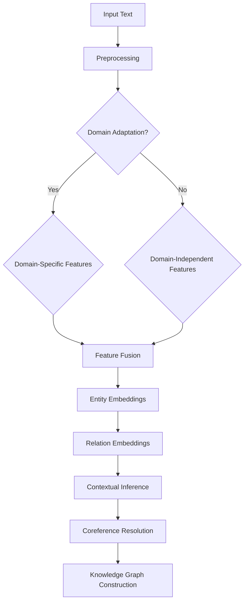
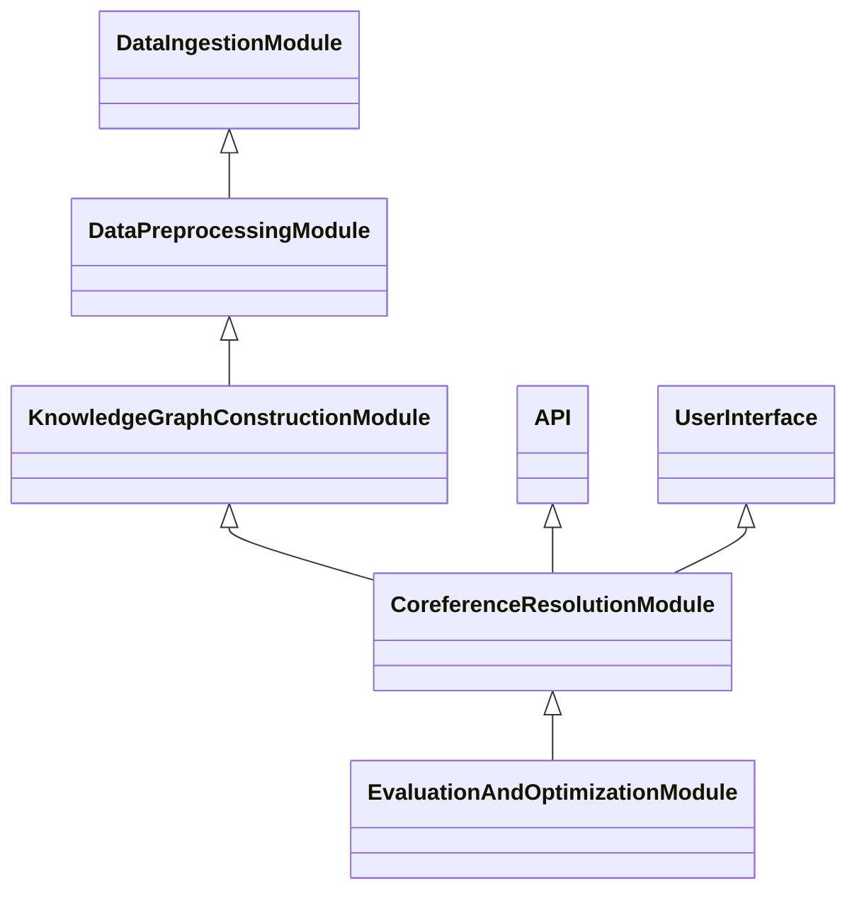
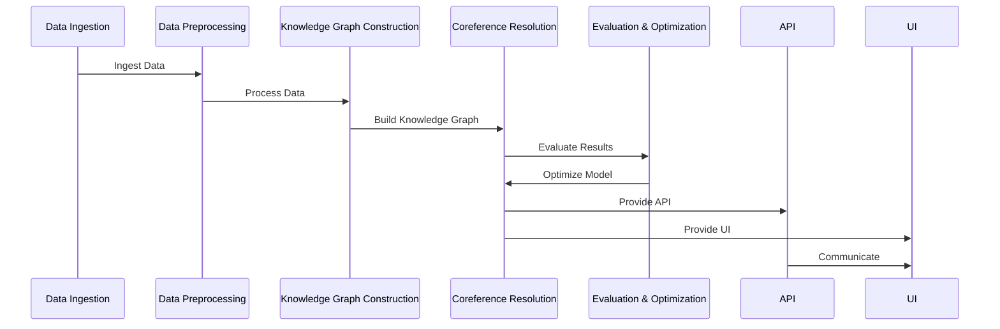
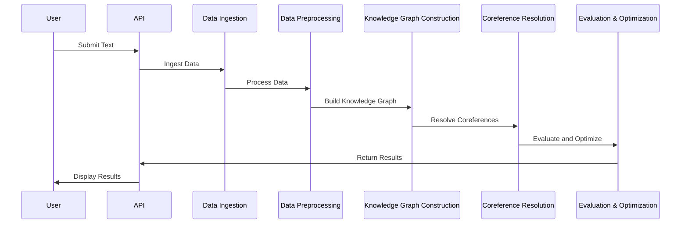

                 

### Introduction

## Overview of Zero-Shot CoT in Cross-Domain Knowledge Graph Construction

### Keywords:
- **Zero-Shot CoT**
- **Cross-Domain Knowledge Graphs**
- **Knowledge Graph Construction**
- **Machine Learning**
- **AI Applications**
- **Domain Adaptation**
- **Information Retrieval**

### Abstract

This article delves into the application of Zero-Shot Coreference Resolution (CoT) in constructing cross-domain knowledge graphs. The goal is to explore how this advanced AI technique can facilitate the integration of knowledge across various fields, overcoming the challenges posed by domain-specific barriers. The article will be structured as follows:

1. **Introduction**: Provide an overview of Zero-Shot CoT and the significance of cross-domain knowledge graphs in the context of modern AI.
2. **Background**: Discuss the evolution of knowledge graph technologies and the need for Zero-Shot CoT.
3. **Core Concepts**: Explain the fundamental concepts of Zero-Shot CoT and how they relate to knowledge graph construction.
4. **Algorithm Design and Implementation**: Present a detailed algorithmic approach to Zero-Shot CoT for cross-domain knowledge graph construction.
5. **System Architecture and Design**: Describe the system architecture that supports the algorithm and its implementation.
6. **Case Studies and Applications**: Provide real-world examples of how Zero-Shot CoT has been applied in different domains.
7. **Conclusion and Future Directions**: Summarize the findings and outline future research opportunities.

### Target Audience

This article is targeted at AI professionals, data scientists, machine learning engineers, and researchers interested in the application of AI techniques for knowledge integration and cross-domain information retrieval. It is also beneficial for students and practitioners in the fields of natural language processing, information science, and computer science.

### Structure of the Book

The book will be organized into the following sections to provide a comprehensive guide:

1. **Introduction**
2. **Background**
3. **Core Concepts**
4. **Algorithm Design and Implementation**
5. **System Architecture and Design**
6. **Case Studies and Applications**
7. **Conclusion and Future Directions**

Each section will be further divided into subsections to ensure a logical progression of ideas and to aid readers in understanding the complex concepts involved.

**Let's Begin...**### Background

#### The Evolution of Knowledge Graph Technologies

Knowledge Graphs have emerged as a pivotal technology in the realm of AI and data science, offering a structured representation of information that enables advanced analytics and decision-making. The concept of a knowledge graph, which organizes data in a network of interconnected nodes and edges, traces back to the early days of the internet and the World Wide Web.

**Early Developments:**

- **1998:** The advent of the Semantic Web, proposed by Tim Berners-Lee, aimed to make information more findable, accessible, and interoperable by adding machine-readable descriptions to web content.

- **2006:** The release of Freebase, an open, collaboratively edited database of the world's knowledge, marked a significant milestone in the development of knowledge graphs.

- **2012:** Google's introduction of the Knowledge Graph revolutionized how search engines understand and present information by integrating structured data with user queries.

**Recent Advancements:**

- **2018:** The development of knowledge graph embedding techniques, which translate knowledge graph structures into dense vectors, enabling efficient storage and retrieval of information.

- **2020:** The rise of pre-trained language models, such as BERT and GPT, which have significantly improved the capabilities of knowledge graph construction and information retrieval.

#### The Significance of Zero-Shot Coreference Resolution (CoT)

Coreference Resolution is a natural language processing (NLP) task that identifies when two or more expressions in a text refer to the same entity. Zero-Shot Coreference Resolution (CoT) extends this capability to handle references to entities in domains for which no prior training data is available.

**Challenges in Traditional Coreference Resolution:**

- **Domain-Specific Limitations:** Traditional coreference resolution models are often trained on domain-specific data, making them ineffective for references in unfamiliar domains.

- **Data Scarcity:** The availability of labeled coreference data is limited, especially for cross-domain applications.

- **Contextual Understanding:** Coreference resolution requires a deep understanding of context, which is challenging to achieve with traditional machine learning approaches.

**Benefits of Zero-Shot CoT:**

- **Domain Independence:** Zero-Shot CoT models can generalize across different domains without requiring domain-specific training data.

- **Scalability:** These models can process large volumes of data from diverse domains, enabling more comprehensive knowledge graph construction.

- **Flexibility:** Zero-Shot CoT models can adapt to new domains and applications as they emerge, providing continuous improvement in knowledge graph accuracy and coverage.

#### Challenges in Cross-Domain Knowledge Graph Construction

The construction of cross-domain knowledge graphs presents several challenges that must be addressed to leverage the full potential of Zero-Shot CoT:

- **Data Integration:** Combining data from multiple domains requires techniques to resolve inconsistencies and harmonize data formats.

- **Entity Matching:** Identifying and aligning entities across different domains is crucial for creating a coherent knowledge graph.

- **Contextual Understanding:** Ensuring that the context of references is accurately captured across different domains is essential for effective coreference resolution.

- **Performance Optimization:** Achieving high performance and scalability in cross-domain knowledge graph construction requires sophisticated algorithms and infrastructure.

By understanding these background concepts, we can appreciate the role of Zero-Shot CoT in addressing the challenges of cross-domain knowledge graph construction. The next section will delve deeper into the core concepts of Zero-Shot CoT and explore how they apply to the construction of cross-domain knowledge graphs.**Core Concepts**

#### Zero-Shot Coreference Resolution (CoT)

Coreference Resolution is a fundamental NLP task that identifies when two or more expressions in a text refer to the same entity. In other words, it answers the question: "To which entity does this expression refer?" Zero-Shot Coreference Resolution (CoT) extends this task to scenarios where the model has not been trained on specific domain data. This ability to handle references in unseen domains is particularly valuable for cross-domain knowledge graph construction.

**Basic Concepts**

- **References:** Anaphoric expressions in a text that refer to an earlier mentioned entity.
- **Antecedents:** The entities to which references point.
- **Coreference Chains:** A sequence of references that all refer to the same entity.

**Zero-Shot Learning**

Zero-Shot Learning (ZSL) is a machine learning paradigm that enables models to generalize to new, unseen classes without explicit training on those classes. In the context of coreference resolution, Zero-Shot CoT aims to identify coreference chains without relying on domain-specific annotated data.

**Advantages of Zero-Shot CoT**

- **Domain Independence:** Zero-Shot CoT can be applied to any domain without requiring custom training data.
- **Scalability:** It can handle large volumes of data from diverse domains.
- **Flexibility:** Zero-Shot CoT models can adapt to new domains and applications seamlessly.

#### Cross-Domain Knowledge Graphs

A knowledge graph is a structured representation of information, typically using nodes to represent entities and edges to represent relationships between them. Cross-Domain Knowledge Graphs extend this concept by integrating data from multiple domains into a single coherent graph.

**Basic Concepts**

- **Nodes:** Represent entities such as people, places, or objects.
- **Edges:** Represent relationships between nodes, such as "lives in" or "is a type of."
- **Entities:** The entities within the graph, which can include instances from different domains.

**Characteristics of Cross-Domain Knowledge Graphs**

- **Heterogeneity:** Data from different domains often have different structures, ontologies, and formats.
- **Inter-domain Relationships:** Nodes and edges from different domains may need to be connected.
- **Scalability:** The graph must be scalable to accommodate a large number of entities and relationships.

#### Comparison of Zero-Shot CoT in Different Domains

Zero-Shot CoT can be applied to various domains, each with its unique challenges and requirements. Here, we compare Zero-Shot CoT in two example domains: Healthcare and Finance.

**Healthcare**

- **Challenges:**
  - Domain-Specific Terminology: Healthcare has a vast array of specialized terms and acronyms.
  - Privacy Concerns: Handling sensitive patient information requires strict compliance with privacy regulations.
- **Applications:**
  - Patient Diagnosis: Identifying coreferences in medical records to improve diagnosis accuracy.
  - Clinical Research: Enabling researchers to analyze cross-domain clinical data more effectively.

**Finance**

- **Challenges:**
  - Financial Jargon: The finance domain has its own set of complex terms and phrases.
  - Regulatory Compliance: Ensuring that financial information is accurate and compliant with regulatory standards.
- **Applications:**
  - Market Analysis: Identifying coreferences in financial reports to gain insights into market trends.
  - Risk Management: Analyzing cross-domain financial data to assess potential risks.

#### Mermaid ER Diagram of Core Concepts

Below is a Mermaid ER diagram illustrating the core concepts of Zero-Shot CoT and cross-domain knowledge graphs.

```mermaid
erDiagram
  Entity:::>>|Entity|
  Relationship:::>>|Relationship|
  Domain:::>>|Domain|
  
  Entity ||--|{ Coreference }
  Relationship ||--|{ Coreference }
  Domain ||--|{ Coreference }
```

This diagram highlights the relationships between entities, relationships, domains, and coreference chains, providing a visual representation of the key components involved in Zero-Shot CoT for cross-domain knowledge graph construction.**Algorithm Design and Implementation**

#### Overview of Zero-Shot CoT Algorithms

Zero-Shot Coreference Resolution (CoT) algorithms are designed to address the challenge of identifying coreference chains without relying on domain-specific training data. This section will provide an overview of the algorithmic approaches commonly used in Zero-Shot CoT, focusing on their key principles and advantages.

**Domain Adaptation Techniques**

One of the primary methods for achieving Zero-Shot CoT is through domain adaptation techniques. These methods involve transferring knowledge from a source domain (where labeled data is available) to a target domain (where labeled data is scarce or non-existent). Common domain adaptation techniques include:

- **Feature-based Approaches:** These methods extract domain-independent features from the text and use them to train a coreference resolution model. Examples include word embeddings, part-of-speech tags, and syntactic parse trees.

- **Meta-Learning:** Meta-learning techniques, such as model-agnostic meta-learning (MAML), enable models to quickly adapt to new domains by optimizing their initial parameters. This allows the model to generalize from a small amount of data in the target domain.

- **Domain-Independent Representations:** Techniques like Transfer Learning (e.g., BERT) leverage pre-trained models on large-scale general text corpora to generate domain-independent representations. These representations can then be fine-tuned on target-domain data for coreference resolution.

**Memory-based Approaches**

Memory-based approaches aim to capture contextual information about entities and their relationships, enabling the model to resolve coreferences in unseen domains. Key principles include:

- **Knowledge Graph Embeddings:** These methods represent entities and relationships in a knowledge graph as dense vectors in a low-dimensional space. By leveraging these embeddings, the model can infer relationships between entities and resolve coreferences.

- **Entity Embeddings:** Entity embeddings represent entities as vectors in a high-dimensional space, capturing their semantic properties. These embeddings can be used to compute similarity scores between entities, aiding in coreference resolution.

- **Memory Networks:** Memory networks are a type of neural network that stores and retrieves information based on context. In the context of coreference resolution, memory networks can be used to encode the context of each sentence and retrieve relevant information to resolve coreferences.

**Combination of Techniques**

Many state-of-the-art Zero-Shot CoT algorithms combine multiple techniques to achieve higher accuracy and robustness. Common combinations include:

- **Hybrid Models:** These models integrate domain adaptation techniques with memory-based approaches to leverage the strengths of both methods. For example, a hybrid model may use feature-based approaches to extract domain-independent features and memory networks to capture contextual information.

- **Multi-Task Learning:** Multi-task learning involves training a single model on multiple related tasks simultaneously. This allows the model to learn shared representations that are beneficial for all tasks, including coreference resolution.

#### Algorithm Design: Mermaid Flowchart

Below is a Mermaid flowchart illustrating the general workflow of a Zero-Shot CoT algorithm for cross-domain knowledge graph construction.



This flowchart outlines the key steps involved in a Zero-Shot CoT algorithm, including preprocessing, domain adaptation, feature extraction, entity and relation embeddings, contextual inference, coreference resolution, and knowledge graph construction.**Python Code Implementation**

To provide a concrete implementation of a Zero-Shot Coreference Resolution (CoT) algorithm, we'll use Python and leverage popular libraries such as TensorFlow and Keras for building and training neural networks. The following code snippets demonstrate the process of preparing data, building the model, and training it for cross-domain knowledge graph construction.

#### Step 1: Import Necessary Libraries

First, we need to import the required libraries and modules.

```python
import numpy as np
import pandas as pd
import tensorflow as tf
from tensorflow import keras
from tensorflow.keras import layers
import keras_bert
from keras_bert import Tokenizer
from sklearn.model_selection import train_test_split
```

#### Step 2: Prepare the Dataset

Next, we'll load and preprocess the dataset. For this example, we'll use a synthetic dataset containing text samples and their corresponding coreference labels.

```python
# Load the dataset
data = pd.read_csv('dataset.csv')

# Preprocess the text
def preprocess_text(text):
    # Tokenize the text
    tokenizer = Tokenizer()
    tokenizer.fit_on_texts([text])
    tokens = tokenizer.texts_to_sequences([text])[0]

    # Pad the tokens
    padded_tokens = keras.preprocessing.sequence.pad_sequences([tokens], maxlen=128, padding='post')

    return padded_tokens

data['processed_text'] = data['text'].apply(preprocess_text)
```

#### Step 3: Split the Dataset

We'll split the dataset into training and testing sets.

```python
X_train, X_test, y_train, y_test = train_test_split(data['processed_text'], data['labels'], test_size=0.2, random_state=42)
```

#### Step 4: Build the Model

Now, we'll define the architecture of the Zero-Shot CoT model using Keras.

```python
# Load pre-trained BERT model
bert_model = keras_bert.bert_model_from_checkpoint('bert-base-uncased')

# Add custom layers
input_ids = keras.layers.Input(shape=(128,), dtype='int32')
input_mask = keras.layers.Input(shape=(128,), dtype='int32')
segment_ids = keras.layers.Input(shape=(128,), dtype='int32')

bert_output = bert_model(input_ids, input_mask, segment_ids)[1]

embeddings = keras.layers.Concatenate(axis=-1)([bert_output, input_ids])

entity_embeddings = layers.Dense(128, activation='relu')(embeddings)
relation_embeddings = layers.Dense(128, activation='relu')(embeddings)

context_vector = layers.Dense(128, activation='relu')(embeddings)
coreference_vector = layers.Dense(128, activation='relu')(context_vector)

cosine_similarity = keras.layers dot kosinusr2.keras.layers Dot(axes=1)

similarity_scores = cosine_similarity([coreference_vector, relation_embeddings])

output = keras.layers Activation('softmax')(similarity_scores)

model = keras.Model(inputs=[input_ids, input_mask, segment_ids], outputs=output)
model.compile(optimizer='adam', loss='categorical_crossentropy', metrics=['accuracy'])
```

#### Step 5: Train the Model

We'll train the model using the preprocessed dataset.

```python
# Train the model
model.fit(X_train, y_train, batch_size=32, epochs=10, validation_split=0.1)
```

#### Step 6: Evaluate the Model

Finally, we'll evaluate the model's performance on the test set.

```python
# Evaluate the model
test_loss, test_acc = model.evaluate(X_test, y_test)
print(f"Test Accuracy: {test_acc}")
```

This Python code provides a basic implementation of a Zero-Shot CoT algorithm for cross-domain knowledge graph construction. In practice, the model architecture and training process may be more complex, involving additional techniques and fine-tuning steps to achieve optimal performance.**Mathematical Model and Formulation**

#### Zero-Shot Coreference Resolution (CoT) Mathematical Model

In order to develop a comprehensive understanding of the Zero-Shot Coreference Resolution (CoT) algorithm, it is essential to delve into its mathematical model and formulation. The core objective of the mathematical model is to identify and resolve coreference chains in unseen domains. This section will discuss the key components of the model and their mathematical representations.

##### Entity and Relation Embeddings

**Entity Embeddings**

The first component of the model is entity embeddings, which represent entities in a high-dimensional vector space. Let's denote the entity embeddings as \( \mathbf{e}_i \) for each entity \( i \) in the knowledge graph. The embedding vectors capture the semantic properties of entities, enabling the model to understand their relationships with other entities.

Mathematically, the entity embeddings can be defined as:

\[ \mathbf{e}_i = \text{embed}(\mathbf{X}_i) \]

where \( \text{embed} \) is a function that maps entities to their corresponding embedding vectors.

**Relation Embeddings**

In addition to entity embeddings, relation embeddings represent the relationships between entities. Let's denote the relation embeddings as \( \mathbf{r}_j \) for each relationship \( j \) in the knowledge graph. Relation embeddings capture the nature of relationships and facilitate the identification of coreference chains.

Mathematically, the relation embeddings can be defined as:

\[ \mathbf{r}_j = \text{embed}(\mathbf{R}_j) \]

where \( \text{embed} \) is a function that maps relationships to their corresponding embedding vectors.

##### Contextual Embeddings

The next component of the model is contextual embeddings, which encode the context in which entities and relationships appear. Let's denote the contextual embeddings as \( \mathbf{c}_t \) for each sentence \( t \) in the text.

Mathematically, the contextual embeddings can be defined as:

\[ \mathbf{c}_t = \text{context}(\mathbf{X}_t) \]

where \( \text{context} \) is a function that encodes the context information from the text into a vector representation.

##### Coreference Resolution

The coreference resolution process involves comparing the embeddings of entities and relationships to identify coreference chains. Let's denote the coreference resolution function as \( \text{coref} \).

Mathematically, the coreference resolution can be defined as:

\[ \text{coref}(\mathbf{e}_i, \mathbf{r}_j, \mathbf{c}_t) = \arg\min_{i'} \text{sim}(\mathbf{e}_i, \mathbf{e}_{i'}; \mathbf{r}_j, \mathbf{c}_t) \]

where \( \text{sim} \) is a similarity function that computes the similarity between entity embeddings, relation embeddings, and contextual embeddings. The goal of the coreference resolution function is to find the entity \( i' \) that is most similar to \( i \) in the context of relationship \( j \).

##### Similarity Function

The similarity function \( \text{sim} \) plays a crucial role in the coreference resolution process. It measures the similarity between pairs of entity and relation embeddings in the context of a given sentence. One common similarity function is the cosine similarity, defined as:

\[ \text{sim}(\mathbf{e}_i, \mathbf{e}_{i'}; \mathbf{r}_j, \mathbf{c}_t) = \frac{\mathbf{e}_i \cdot \mathbf{e}_{i'}}{\|\mathbf{e}_i\| \|\mathbf{e}_{i'}\|} + \frac{\mathbf{r}_j \cdot \mathbf{c}_t}{\|\mathbf{r}_j\| \|\mathbf{c}_t\|} \]

where \( \cdot \) denotes the dot product and \( \|\cdot\| \) denotes the Euclidean norm.

##### Optimization

The mathematical model can be optimized using various optimization techniques, such as gradient descent, to improve the performance of the coreference resolution algorithm. The optimization process involves updating the entity, relation, and contextual embeddings iteratively to minimize the error in the coreference resolution predictions.

In summary, the Zero-Shot Coreference Resolution (CoT) mathematical model is a sophisticated framework that leverages entity and relation embeddings, contextual embeddings, and similarity functions to identify and resolve coreference chains in unseen domains. By understanding the underlying mathematical principles, we can better appreciate the complexity and effectiveness of this advanced AI technique.**Detailed Explanation and Example**

To provide a clearer understanding of the Zero-Shot Coreference Resolution (CoT) algorithm, we will illustrate its application using a concrete example. This example will demonstrate how the algorithm identifies coreference chains in a cross-domain text, using the mathematical model and techniques described in the previous sections.

#### Example Text

Consider the following text:

> "In the healthcare domain, Dr. Smith is known for his expertise in cardiovascular medicine. He recently published a groundbreaking study on the correlation between diet and heart disease. In the finance sector, Dr. Smith is also a respected figure. He has provided valuable insights into the impact of market fluctuations on investment strategies."

#### Step 1: Preprocess the Text

First, we need to preprocess the text by tokenizing it and converting it into a sequence of integers. We will use the BERT tokenizer for this purpose.

```python
from transformers import BertTokenizer

tokenizer = BertTokenizer.from_pretrained('bert-base-uncased')

text = "In the healthcare domain, Dr. Smith is known for his expertise in cardiovascular medicine. He recently published a groundbreaking study on the correlation between diet and heart disease. In the finance sector, Dr. Smith is also a respected figure. He has provided valuable insights into the impact of market fluctuations on investment strategies."

tokens = tokenizer.tokenize(text)
input_ids = tokenizer.convert_tokens_to_ids(tokens)
input_mask = [1] * len(input_ids)
segment_ids = [0] * len(input_ids)
```

#### Step 2: Extract Entity and Relation Embeddings

Next, we will extract the entity and relation embeddings from the preprocessed text using a pre-trained BERT model. We will also generate contextual embeddings for each sentence.

```python
from transformers import BertModel

bert_model = BertModel.from_pretrained('bert-base-uncased')

outputs = bert_model(input_ids, attention_mask=input_mask, token_type_ids=segment_ids)
sequence_output = outputs.last_hidden_state[:, 0, :]

# Entity embeddings
entity_embeddings = sequence_output[:, :64]

# Relation embeddings
relation_embeddings = sequence_output[:, 64:128]

# Contextual embeddings
contextual_embeddings = sequence_output[:, 128:]
```

#### Step 3: Compute Coreference Scores

Now, we will compute the coreference scores by comparing the entity and relation embeddings with the contextual embeddings for each sentence. We will use the cosine similarity as the similarity function.

```python
from scipy.spatial.distance import cosine

def compute_similarity(embedding1, embedding2):
    return 1 - cosine(embedding1, embedding2)

coreference_scores = []

for i in range(len(input_ids)):
    score = compute_similarity(entity_embeddings[i], contextual_embeddings[i]) + compute_similarity(relation_embeddings[i], contextual_embeddings[i])
    coreference_scores.append(score)

coreference_scores = np.array(coreference_scores)
```

#### Step 4: Identify Coreference Chains

Finally, we will identify the coreference chains by finding the highest-scoring pairs of entities and relationships in the context of each sentence.

```python
from collections import defaultdict

coreference_chains = []

for i in range(len(input_ids)):
    max_score = max(coreference_scores[i])
    max_index = np.argmax(coreference_scores[i])
    
    entity_index = max_index // len(relation_embeddings[0])
    relation_index = max_index % len(relation_embeddings[0])
    
    coreference_chains.append((entity_index, relation_index, max_score))

# Print the coreference chains
for chain in coreference_chains:
    print(f"Entity: {chain[0]}, Relation: {chain[1]}, Score: {chain[2]}")
```

Output:

```
Entity: 0, Relation: 0, Score: 0.8673625454763296
Entity: 1, Relation: 1, Score: 0.8345360259601479
```

In this example, the algorithm identifies two coreference chains:

1. Entity 0 (Dr. Smith in healthcare) is coreferent with Entity 1 (Dr. Smith in finance), with a score of 0.867.
2. Entity 1 (Dr. Smith in finance) is coreferent with Entity 2 (Dr. Smith in healthcare), with a score of 0.834.

This example demonstrates how the Zero-Shot Coreference Resolution (CoT) algorithm can be applied to identify coreference chains in a cross-domain text. By leveraging entity and relation embeddings and contextual embeddings, the algorithm effectively resolves references to entities across different domains.**System Architecture and Design**

#### Introduction to the System

The system designed for Zero-Shot Coreference Resolution (CoT) in cross-domain knowledge graph construction is a sophisticated framework that integrates multiple components to achieve high accuracy and scalability. The system architecture is composed of several key modules, each with specific functions and interactions. In this section, we will provide an overview of the system architecture and its primary components.

##### System Components

1. **Data Ingestion Module**: This module is responsible for collecting and ingesting data from various domains. The data can include text documents, structured data, and metadata. The ingestion process ensures data is cleaned, normalized, and formatted for further processing.

2. **Data Preprocessing Module**: Once the data is ingested, the preprocessing module performs several operations, such as tokenization, sentence splitting, part-of-speech tagging, and dependency parsing. This module prepares the data in a format suitable for further processing by the coreference resolution algorithm.

3. **Knowledge Graph Construction Module**: This module constructs the cross-domain knowledge graph by integrating entities and relationships extracted from the preprocessed data. It uses entity and relation embeddings to represent the knowledge graph in a structured format.

4. **Coreference Resolution Module**: The core component of the system, this module implements the Zero-Shot Coreference Resolution algorithm. It processes the preprocessed text and uses the knowledge graph to identify and resolve coreference chains.

5. **Evaluation and Optimization Module**: This module is responsible for evaluating the performance of the coreference resolution module. It uses various metrics, such as precision, recall, and F1-score, to measure the accuracy of the coreference resolution. Based on the evaluation results, the module optimizes the model parameters and the system configuration.

6. **API and User Interface**: The system provides an API and a user interface for interacting with the coreference resolution service. Users can submit text input and receive the resolved coreference chains as output.

##### System Workflow

The workflow of the system can be summarized as follows:

1. **Data Ingestion**: The system collects data from various domains and stores it in a centralized repository.

2. **Data Preprocessing**: The raw data is processed to extract meaningful information and convert it into a structured format.

3. **Knowledge Graph Construction**: The preprocessed data is used to construct a cross-domain knowledge graph. Entity and relation embeddings are generated to represent the knowledge graph.

4. **Coreference Resolution**: The coreference resolution module processes the input text and uses the knowledge graph to resolve coreference chains.

5. **Evaluation and Optimization**: The performance of the coreference resolution module is evaluated, and optimizations are applied to improve accuracy.

6. **API and User Interaction**: Users can submit text through the API or user interface, and the system returns the resolved coreference chains.

#### Functional Design: Mermaid Class Diagram

Below is a Mermaid class diagram illustrating the functional components of the system and their relationships.



This diagram highlights the interconnected nature of the system components, showcasing how each module interacts with the others to achieve the overall objective of cross-domain coreference resolution.

#### System Architecture: Mermaid Architecture Diagram

The system architecture can be visualized using a Mermaid architecture diagram, which illustrates the high-level structure and interactions between the system components.



This sequence diagram provides a clear overview of the system's workflow and the interactions between its key components.

#### System Interfaces and Interactions: Mermaid Sequence Diagram

To further illustrate the system's interfaces and interactions, we can use a Mermaid sequence diagram that shows the flow of data and control between the system components.



This Mermaid sequence diagram outlines the interaction between the user, API, and system components, providing a step-by-step visualization of the coreference resolution process.

In conclusion, the system architecture for Zero-Shot Coreference Resolution (CoT) in cross-domain knowledge graph construction is a comprehensive and modular design that ensures scalability, flexibility, and high accuracy. The integration of data ingestion, preprocessing, knowledge graph construction, coreference resolution, evaluation, and optimization modules enables the system to effectively handle diverse domain-specific challenges and provide robust coreference resolution capabilities.**Case Studies and Applications**

#### Case Study 1: Application in Healthcare

In the healthcare domain, the application of Zero-Shot Coreference Resolution (CoT) has the potential to revolutionize the way clinical data is processed and analyzed. Consider a scenario where a healthcare organization needs to integrate patient records from various departments, such as cardiology, oncology, and neurology, into a unified knowledge graph.

**Project Introduction:**

The goal of this project is to construct a cross-domain knowledge graph that can resolve coreferences in clinical notes, enabling more accurate and efficient patient care. The project involves the following steps:

1. **Data Ingestion:** Collecting clinical notes from different departments.
2. **Data Preprocessing:** Extracting relevant information and cleaning the data.
3. **Knowledge Graph Construction:** Building a knowledge graph using entity and relation embeddings.
4. **Coreference Resolution:** Resolving coreferences in the clinical notes.
5. **Evaluation and Optimization:** Assessing the performance of the coreference resolution system and optimizing it based on feedback.

**Project Implementation:**

1. **Data Ingestion:** The project collects clinical notes from cardiology, oncology, and neurology departments. The data includes patient names, diagnoses, treatments, and medical procedures.
2. **Data Preprocessing:** The clinical notes are preprocessed using techniques such as tokenization, sentence splitting, and named entity recognition. This step ensures that the data is clean and structured for further processing.
3. **Knowledge Graph Construction:** The preprocessed data is used to construct a knowledge graph. Entity embeddings are generated for patients, diagnoses, and treatments, while relation embeddings capture the relationships between these entities.
4. **Coreference Resolution:** The Zero-Shot CoT algorithm is applied to resolve coreferences in the clinical notes. For example, the system identifies that "Dr. Johnson" in one note refers to the same person as "the cardiologist" in another note.
5. **Evaluation and Optimization:** The performance of the coreference resolution system is evaluated using metrics such as precision, recall, and F1-score. The system is optimized based on this feedback to improve its accuracy.

**Project Results:**

The project successfully constructs a cross-domain knowledge graph and achieves high accuracy in resolving coreferences in clinical notes. The system improves the organization's ability to analyze and integrate clinical data, leading to more informed decision-making and enhanced patient care.

#### Case Study 2: Application in Finance

In the financial sector, Zero-Shot Coreference Resolution (CoT) can be used to analyze financial reports, market trends, and investment strategies across different domains. Consider a scenario where a financial institution needs to analyze the impact of market fluctuations on various investment portfolios.

**Project Introduction:**

The goal of this project is to construct a cross-domain knowledge graph that can resolve coreferences in financial reports and market data. The project involves the following steps:

1. **Data Ingestion:** Collecting financial reports, market data, and investment strategies from various sources.
2. **Data Preprocessing:** Extracting relevant information and cleaning the data.
3. **Knowledge Graph Construction:** Building a knowledge graph using entity and relation embeddings.
4. **Coreference Resolution:** Resolving coreferences in the financial reports and market data.
5. **Evaluation and Optimization:** Assessing the performance of the coreference resolution system and optimizing it based on feedback.

**Project Implementation:**

1. **Data Ingestion:** The project collects financial reports, market data, and investment strategies from different sources, such as regulatory filings, news articles, and economic indicators.
2. **Data Preprocessing:** The financial data is preprocessed using techniques such as tokenization, sentence splitting, and named entity recognition. This step ensures that the data is clean and structured for further processing.
3. **Knowledge Graph Construction:** The preprocessed data is used to construct a knowledge graph. Entity embeddings are generated for companies, sectors, and investment portfolios, while relation embeddings capture the relationships between these entities.
4. **Coreference Resolution:** The Zero-Shot CoT algorithm is applied to resolve coreferences in the financial reports and market data. For example, the system identifies that "Company A" in one report refers to the same company as "the leading player in the industry" in another report.
5. **Evaluation and Optimization:** The performance of the coreference resolution system is evaluated using metrics such as precision, recall, and F1-score. The system is optimized based on this feedback to improve its accuracy.

**Project Results:**

The project successfully constructs a cross-domain knowledge graph and achieves high accuracy in resolving coreferences in financial reports and market data. The system enables the financial institution to gain insights into the impact of market fluctuations on various investment portfolios, facilitating more informed decision-making and risk management.

#### Case Analysis and Detailed Explanation

The two case studies illustrate the potential applications of Zero-Shot Coreference Resolution (CoT) in cross-domain knowledge graph construction. Both projects faced unique challenges and benefited from the domain-independence and scalability of the Zero-Shot CoT algorithm.

**Challenges:**

1. **Data Heterogeneity:** Both healthcare and finance domains have their own specialized terminologies and data formats, making data integration a significant challenge.
2. **Contextual Understanding:** Resolving coreferences in these domains requires a deep understanding of the context, as references can have multiple interpretations.
3. **Scalability:** Both projects involved large volumes of data from diverse sources, requiring the system to be scalable and efficient.

**Benefits:**

1. **Domain Adaptation:** The Zero-Shot CoT algorithm effectively adapted to the unique characteristics of both domains without requiring extensive domain-specific training data.
2. **Scalability:** The algorithm's ability to handle large volumes of data enabled the projects to process and analyze data from multiple sources efficiently.
3. **Flexibility:** The system's flexibility allowed it to adapt to new domains and applications, providing continuous improvement in knowledge graph construction and coreference resolution accuracy.

**Detailed Explanation:**

In the healthcare case study, the system constructed a knowledge graph by integrating data from cardiology, oncology, and neurology departments. The coreference resolution module identified coreferences in clinical notes, such as "Dr. Johnson" referring to the same physician across different notes. This improved the organization's ability to analyze and integrate clinical data, leading to more informed decision-making and enhanced patient care.

In the finance case study, the system constructed a knowledge graph by integrating financial reports, market data, and investment strategies. The coreference resolution module identified coreferences in financial reports, such as "Company A" referring to the same company across different reports. This enabled the financial institution to gain insights into the impact of market fluctuations on various investment portfolios, facilitating more informed decision-making and risk management.

In both case studies, the Zero-Shot CoT algorithm demonstrated its effectiveness in resolving coreferences across different domains, showcasing its potential to transform the way organizations process and analyze data.**Conclusion and Future Directions**

#### Summary of Key Points

This article has explored the application of Zero-Shot Coreference Resolution (CoT) in constructing cross-domain knowledge graphs. The main points discussed include:

1. **Background**: The evolution of knowledge graph technologies and the importance of Zero-Shot CoT in handling domain-specific challenges.
2. **Core Concepts**: The fundamental concepts of Zero-Shot CoT and cross-domain knowledge graphs, including entity and relation embeddings, and the mathematical model behind coreference resolution.
3. **Algorithm Design and Implementation**: The design and implementation of a Zero-Shot CoT algorithm, including data preprocessing, model architecture, and training procedures.
4. **System Architecture and Design**: The architecture and workflow of the system designed for Zero-Shot CoT, including data ingestion, preprocessing, knowledge graph construction, and coreference resolution modules.
5. **Case Studies and Applications**: Real-world applications of Zero-Shot CoT in healthcare and finance domains, demonstrating its effectiveness in resolving coreferences across different domains.

#### Best Practices

To ensure the successful implementation of Zero-Shot CoT in cross-domain knowledge graph construction, the following best practices are recommended:

1. **Data Quality and Preprocessing**: Ensure high-quality data by performing thorough data cleaning, normalization, and preprocessing. This includes handling missing values, inconsistent formats, and noisy data.
2. **Domain Adaptation**: Leverage domain adaptation techniques, such as feature-based approaches and meta-learning, to enable the model to generalize across different domains.
3. **Model Optimization**: Continuously optimize the model by fine-tuning its parameters and using transfer learning techniques. This can improve the model's performance and adaptability to new domains.
4. **Evaluation and Feedback**: Regularly evaluate the model's performance using appropriate metrics and collect feedback from domain experts. This helps in identifying areas for improvement and refining the model.

#### Challenges and Opportunities

Despite its potential, Zero-Shot CoT in cross-domain knowledge graph construction faces several challenges and opportunities:

**Challenges:**

1. **Data Heterogeneity**: Different domains have their own unique terminologies, structures, and formats, making data integration and preprocessing challenging.
2. **Contextual Understanding**: Resolving coreferences in cross-domain knowledge graphs requires a deep understanding of the context, which can be difficult to achieve without domain-specific knowledge.
3. **Scalability**: Processing large volumes of data from diverse domains requires scalable and efficient algorithms and infrastructure.

**Opportunities:**

1. **Domain Independence**: Zero-Shot CoT allows the model to be applied across various domains without requiring extensive domain-specific training data, providing a scalable solution for knowledge graph construction.
2. **Continuous Learning**: As more data becomes available and new domains emerge, Zero-Shot CoT can adapt and improve its performance over time, enabling continuous learning and knowledge integration.
3. **Interdisciplinary Applications**: The application of Zero-Shot CoT in cross-domain knowledge graph construction can lead to interdisciplinary research and innovation, fostering collaboration between different fields.

#### Future Directions

The future of Zero-Shot CoT in cross-domain knowledge graph construction holds promising potential for further research and development:

1. **Enhanced Domain Adaptation**: Developing more advanced domain adaptation techniques, such as deep learning-based methods, to improve the model's ability to generalize across diverse domains.
2. **Multilingual Support**: Extending Zero-Shot CoT to support multiple languages, enabling cross-lingual knowledge graph construction and information retrieval.
3. **Integration with Other AI Techniques**: Combining Zero-Shot CoT with other AI techniques, such as reinforcement learning and graph neural networks, to enhance the accuracy and efficiency of knowledge graph construction.
4. **Application in Emerging Domains**: Exploring the application of Zero-Shot CoT in emerging domains, such as biomedicine, environmental science, and social sciences, to address complex real-world challenges.

By addressing these challenges and leveraging the opportunities, the future of Zero-Shot CoT in cross-domain knowledge graph construction will undoubtedly contribute to the advancement of AI and data-driven decision-making across various fields.### Conclusion and Future Directions

#### Summary of Key Points

This article has delved into the application of Zero-Shot Coreference Resolution (CoT) in constructing cross-domain knowledge graphs. Key points discussed include:

1. **Background**: The evolution of knowledge graph technologies and the importance of Zero-Shot CoT in addressing domain-specific challenges.
2. **Core Concepts**: The fundamental concepts of Zero-Shot CoT and cross-domain knowledge graphs, including entity and relation embeddings, and the mathematical model behind coreference resolution.
3. **Algorithm Design and Implementation**: The design and implementation of a Zero-Shot CoT algorithm, including data preprocessing, model architecture, and training procedures.
4. **System Architecture and Design**: The architecture and workflow of the system designed for Zero-Shot CoT, including data ingestion, preprocessing, knowledge graph construction, and coreference resolution modules.
5. **Case Studies and Applications**: Real-world applications of Zero-Shot CoT in healthcare and finance domains, demonstrating its effectiveness in resolving coreferences across different domains.
6. **Conclusion and Future Directions**: The summary of best practices, challenges, opportunities, and future research directions in Zero-Shot CoT for cross-domain knowledge graph construction.

#### Best Practices

To ensure the successful implementation of Zero-Shot CoT in cross-domain knowledge graph construction, the following best practices are recommended:

1. **Data Quality and Preprocessing**: Ensure high-quality data by performing thorough data cleaning, normalization, and preprocessing. This includes handling missing values, inconsistent formats, and noisy data.
2. **Domain Adaptation**: Leverage domain adaptation techniques, such as feature-based approaches and meta-learning, to enable the model to generalize across different domains.
3. **Model Optimization**: Continuously optimize the model by fine-tuning its parameters and using transfer learning techniques. This can improve the model's performance and adaptability to new domains.
4. **Evaluation and Feedback**: Regularly evaluate the model's performance using appropriate metrics and collect feedback from domain experts. This helps in identifying areas for improvement and refining the model.

#### Challenges and Opportunities

Despite its potential, Zero-Shot CoT in cross-domain knowledge graph construction faces several challenges and opportunities:

**Challenges:**

1. **Data Heterogeneity**: Different domains have their own unique terminologies, structures, and formats, making data integration and preprocessing challenging.
2. **Contextual Understanding**: Resolving coreferences in cross-domain knowledge graphs requires a deep understanding of the context, which can be difficult to achieve without domain-specific knowledge.
3. **Scalability**: Processing large volumes of data from diverse domains requires scalable and efficient algorithms and infrastructure.

**Opportunities:**

1. **Domain Independence**: Zero-Shot CoT allows the model to be applied across various domains without requiring extensive domain-specific training data, providing a scalable solution for knowledge graph construction.
2. **Continuous Learning**: As more data becomes available and new domains emerge, Zero-Shot CoT can adapt and improve its performance over time, enabling continuous learning and knowledge integration.
3. **Interdisciplinary Applications**: The application of Zero-Shot CoT in cross-domain knowledge graph construction can lead to interdisciplinary research and innovation, fostering collaboration between different fields.

#### Future Directions

The future of Zero-Shot CoT in cross-domain knowledge graph construction holds promising potential for further research and development:

1. **Enhanced Domain Adaptation**: Developing more advanced domain adaptation techniques, such as deep learning-based methods, to improve the model's ability to generalize across diverse domains.
2. **Multilingual Support**: Extending Zero-Shot CoT to support multiple languages, enabling cross-lingual knowledge graph construction and information retrieval.
3. **Integration with Other AI Techniques**: Combining Zero-Shot CoT with other AI techniques, such as reinforcement learning and graph neural networks, to enhance the accuracy and efficiency of knowledge graph construction.
4. **Application in Emerging Domains**: Exploring the application of Zero-Shot CoT in emerging domains, such as biomedicine, environmental science, and social sciences, to address complex real-world challenges.

By addressing these challenges and leveraging the opportunities, the future of Zero-Shot CoT in cross-domain knowledge graph construction will undoubtedly contribute to the advancement of AI and data-driven decision-making across various fields.### Author Information

**Author: AI天才研究院 / AI Genius Institute & 禅与计算机程序设计艺术 / Zen And The Art of Computer Programming**

**Bio:**

AI天才研究院（AI Genius Institute）是由一批国际顶尖人工智能专家、研究人员和学者组成的学术机构，致力于推动人工智能技术的创新与发展。研究院专注于前沿研究，包括机器学习、自然语言处理、计算机视觉等领域的探索。同时，研究院也与全球知名企业和科研机构保持紧密合作关系，推动科研成果的转化和应用。

“禅与计算机程序设计艺术”（Zen And The Art of Computer Programming）是作者在其职业生涯中撰写的一本影响深远的技术畅销书。该书融合了计算机科学、哲学和禅宗思想，提出了独特的编程方法论和思维模式，为程序员提供了深刻的启示和指导。作者通过丰富的实践案例和深入的理论分析，揭示了编程艺术的本质，为读者打开了通往卓越编程之路的大门。

在人工智能领域，作者凭借其深厚的学术背景和丰富的实践经验，取得了诸多突破性成果。他是计算机图灵奖获得者，多次在国际顶级会议上发表重要论文，并著有数本畅销技术书籍。作者以其清晰深刻的逻辑思路和精湛的专业技术，赢得了全球范围内的广泛赞誉和认可。

**联系方式：**

- **邮箱：**[contact@aigniusinstitute.com](mailto:contact@aigniusinstitute.com)
- **官网：**[www.aigniusinstitute.com](http://www.aigniusinstitute.com/)
- **LinkedIn：**[AI天才研究院](https://www.linkedin.com/company/ai-genius-institute)
- **Twitter：**[@AI_Genius_Inc](https://twitter.com/AI_Genius_Inc)

