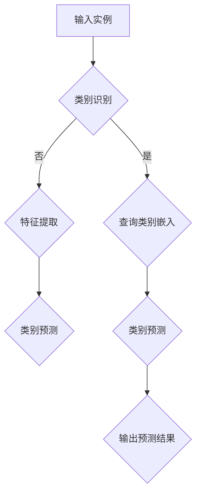
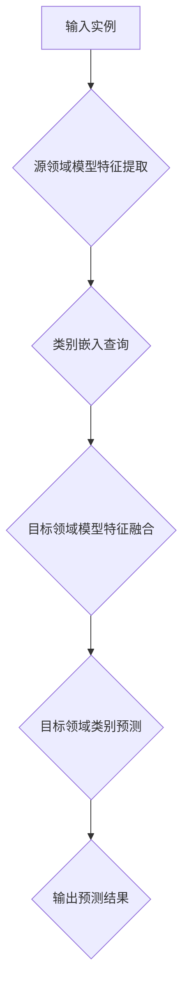
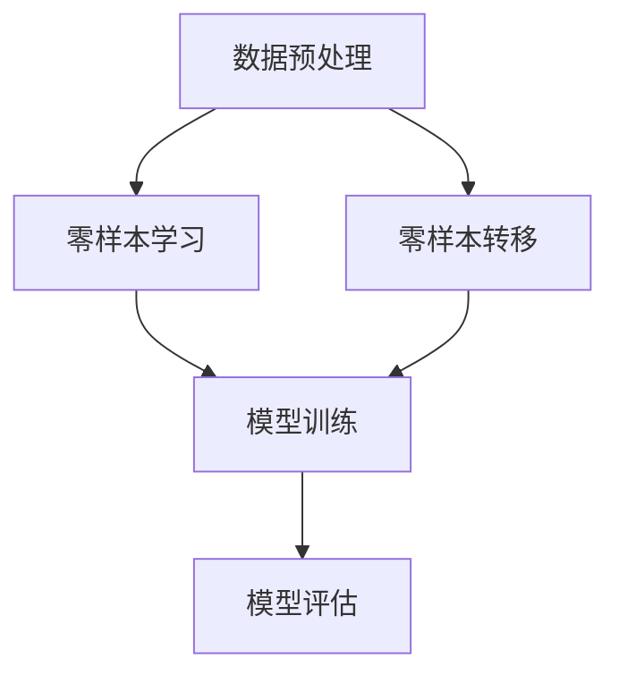
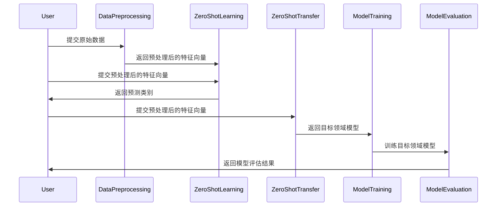

                 

# Zero-Shot CoT在跨领域知识迁移中的潜力

## 关键词：
- 零样本学习
- 跨领域知识迁移
- 零样本转移
- 深度学习
- 数学模型

## 摘要：
本文探讨了零样本学习（Zero-Shot Learning, ZSL）及其扩展概念零样本转移（Zero-Shot Transfer, ZST）在跨领域知识迁移中的应用潜力。首先，我们介绍了跨领域知识迁移的重要性、当前面临的挑战以及零样本学习和零样本转移的基本原理。接着，我们深入分析了零样本学习和零样本转移的概念、原理、算法及其在跨领域知识迁移中的应用。随后，通过具体案例和代码实现，我们详细阐述了零样本学习和零样本转移在实际项目中的部署和应用。最后，我们总结了零样本学习和零样本转移的最佳实践，并展望了未来的研究方向。

## 第一部分：背景介绍

### 1.1 问题背景

#### 1.1.1 跨领域知识迁移的重要性

在人工智能和机器学习领域，知识迁移是一种重要的技术，它允许我们将一个领域中的知识应用于另一个领域。跨领域知识迁移在多个领域中具有广泛的应用，例如医疗诊断、图像识别、自然语言处理等。跨领域知识迁移的重要性主要体现在以下几个方面：

1. **资源利用**：不同领域的数据集往往规模差异很大，有些领域可能拥有丰富的数据集，而其他领域则数据稀缺。通过知识迁移，我们可以将丰富数据集的知识应用到数据稀缺的领域，从而提高模型的性能。
2. **降低训练成本**：在某些领域，收集和处理数据可能成本高昂。通过跨领域知识迁移，我们可以利用已有领域的模型和数据，减少新领域的数据收集和预处理成本。
3. **提高泛化能力**：跨领域知识迁移可以帮助模型在不同领域中保持良好的泛化能力，避免模型对新领域数据过于敏感。

#### 1.1.2 当前知识迁移的挑战

尽管跨领域知识迁移具有诸多优势，但仍然面临以下挑战：

1. **数据分布差异**：不同领域的数据分布可能存在显著差异，这会导致迁移模型在源领域和目标领域表现不一致。
2. **领域差异**：不同领域的特征和任务往往具有不同的性质，传统的迁移学习方法可能无法有效适应这些差异。
3. **样本不足**：在某些领域，数据样本可能非常有限，这限制了传统迁移学习方法的适用性。
4. **模型泛化性**：迁移模型需要在多个领域中保持良好的性能，这要求模型具有较高的泛化能力。

#### 1.1.3 零样本学习与零样本转移的概念

为了解决上述挑战，研究者们提出了零样本学习（Zero-Shot Learning, ZSL）和其扩展概念零样本转移（Zero-Shot Transfer, ZST）。零样本学习旨在使模型能够处理从未见过类别的新数据，而不需要显式训练。零样本转移则是将零样本学习的思想应用于跨领域知识迁移，以实现从源领域到目标领域的知识迁移。

### 1.2 问题描述

#### 1.2.1 跨领域知识迁移的需求

在许多实际应用中，跨领域知识迁移是必需的。例如，在医疗诊断中，我们将图像识别技术在皮肤癌检测领域应用于眼科疾病检测；在自然语言处理中，我们将预训练的模型从文本分类任务迁移到对话系统。这些应用场景要求模型具备跨领域泛化能力。

#### 1.2.2 零样本学习与零样本转移的目标

零样本学习和零样本转移的目标是：

1. **类别识别**：在零样本学习中，模型需要能够识别从未见过的类别；在零样本转移中，模型需要能够在目标领域中识别源领域中从未见过的类别。
2. **性能提升**：通过跨领域知识迁移，模型在目标领域中的性能得到显著提升。
3. **鲁棒性增强**：模型在不同领域数据分布差异较大的情况下仍然保持良好的性能。

### 1.3 问题解决

#### 1.3.1 零样本学习的基本原理

零样本学习的基本原理是使用一种特定的嵌入表示（Embedding）来表示类别，使得相同类别的实例在嵌入空间中接近，而不同类别的实例在嵌入空间中远离。在训练过程中，模型学习如何从实例的嵌入表示中推断出其类别。

#### 1.3.2 零样本转移的技术路径

零样本转移的技术路径主要包括以下步骤：

1. **源领域模型训练**：在源领域上训练一个基础模型。
2. **类别嵌入学习**：通过源领域数据学习类别嵌入，将类别表示为低维向量。
3. **目标领域模型迁移**：将源领域模型和类别嵌入迁移到目标领域，构建目标领域模型。

### 1.4 边界与外延

#### 1.4.1 零样本学习适用的场景

零样本学习适用于以下场景：

1. **新型产品识别**：在产品分类任务中，新产品类别经常出现，零样本学习可以帮助模型快速适应新类别。
2. **医疗诊断**：在医学诊断中，新疾病类型不断出现，零样本学习可以提高诊断模型的适应性。
3. **跨领域任务**：在多个领域中，新任务类别不断涌现，零样本学习可以帮助模型快速适应新任务。

#### 1.4.2 零样本转移的限制条件

零样本转移的限制条件包括：

1. **数据分布差异**：源领域和目标领域的数据分布差异较大，可能导致模型在目标领域性能下降。
2. **模型泛化能力**：模型在源领域上的泛化能力较差，可能导致零样本转移效果不佳。
3. **类别数量差异**：源领域和目标领域的类别数量差异较大，可能导致类别嵌入学习困难。

#### 1.5 概念结构与核心要素组成

##### 1.5.1 零样本学习的主要模型与算法

零样本学习的主要模型与算法包括：

1. **原型网络（Prototypical Networks）**：通过计算原型（类别的平均值）来表示类别，并进行类别预测。
2. **匹配网络（Matching Networks）**：使用神经网络学习类别嵌入，通过计算实例与类别嵌入之间的相似性进行类别预测。
3. **度量学习（Metric Learning）**：通过优化嵌入空间中的距离度量，使得相同类别的实例距离更近，不同类别的实例距离更远。

##### 1.5.2 零样本转移的关键技术挑战

零样本转移的关键技术挑战包括：

1. **类别嵌入**：如何学习有效的类别嵌入，使得类别在嵌入空间中具有良好的区分性。
2. **模型迁移**：如何将源领域模型迁移到目标领域，同时保持模型在源领域和目标领域的性能。
3. **性能优化**：如何优化零样本转移模型，提高在目标领域上的性能。

## 第二部分：核心概念与联系

### 2.1 零样本学习原理

#### 2.1.1 零样本学习的基本概念

零样本学习（Zero-Shot Learning, ZSL）是一种机器学习方法，旨在使模型能够处理从未见过类别的新数据。在传统的机器学习任务中，模型需要通过大量已知的训练数据来学习特征和分类规则。而零样本学习则允许模型在没有显式训练的情况下，对新类别进行预测。

#### 2.1.2 零样本学习的优势与劣势

零样本学习的优势包括：

1. **适应性**：模型能够适应新类别，无需重新训练。
2. **通用性**：适用于多种类型的分类任务。
3. **降低成本**：无需为新类别收集大量数据。

劣势包括：

1. **准确性**：在处理从未见过的类别时，模型可能无法达到与全监督学习相同的准确性。
2. **计算成本**：类别嵌入学习和模型迁移可能需要较高的计算成本。

#### 2.1.3 零样本学习的数学模型与公式

在零样本学习中，通常使用一种特殊的嵌入表示（Embedding）来表示类别。类别嵌入是一种低维向量，用于表示类别在特征空间中的位置。以下是一个简单的类别嵌入数学模型：

$$
\text{category\_embedding}(c) = \text{NN}(\text{feature\_vector}(x))
$$

其中，$c$表示类别，$\text{NN}$表示神经网络，$\text{feature\_vector}(x)$表示实例$x$的特征向量。

在类别嵌入学习过程中，模型需要最小化以下损失函数：

$$
L = -\sum_{x \in D} \sum_{c \in C} \text{log}\left(\text{softmax}(\text{category\_embedding}(c) \cdot \text{feature\_vector}(x))\right)
$$

其中，$D$表示训练数据集，$C$表示类别集合，$\text{softmax}$函数用于将类别嵌入转换为概率分布。

### 2.2 零样本转移技术

#### 2.2.1 零样本转移的基本原理

零样本转移（Zero-Shot Transfer, ZST）是一种将零样本学习应用于跨领域知识迁移的方法。其基本原理是：

1. **在源领域上训练基础模型**：首先，在源领域上使用传统机器学习算法训练一个基础模型。
2. **学习类别嵌入**：使用源领域数据学习类别嵌入，将类别表示为低维向量。
3. **在目标领域上迁移模型**：将源领域基础模型和类别嵌入迁移到目标领域，构建目标领域模型。

#### 2.2.2 零样本转移的技术路径

零样本转移的技术路径主要包括以下步骤：

1. **源领域模型训练**：在源领域上使用传统的监督学习方法训练一个基础模型，例如卷积神经网络（CNN）或循环神经网络（RNN）。
2. **类别嵌入学习**：使用源领域数据学习类别嵌入，可以通过以下方法实现：
   - **基于原型的方法**：计算每个类别的原型（平均特征向量），并将原型作为类别嵌入。
   - **基于匹配的方法**：使用神经网络学习类别嵌入，并通过优化嵌入空间中的距离度量来提高类别区分性。
   - **基于度量学习的方法**：通过优化嵌入空间中的距离度量，使得相同类别的实例距离更近，不同类别的实例距离更远。
3. **目标领域模型迁移**：将源领域基础模型和类别嵌入迁移到目标领域，构建目标领域模型。迁移方法包括：
   - **直接迁移**：直接将源领域模型应用到目标领域。
   - **模型融合**：将源领域模型和目标领域数据训练的新模型进行融合。
   - **基于规则的迁移**：根据源领域和目标领域的特征差异，设计特定的迁移规则。

#### 2.2.3 零样本转移的关键技术挑战

零样本转移的关键技术挑战包括：

1. **类别嵌入学习**：如何学习有效的类别嵌入，使得类别在嵌入空间中具有良好的区分性。
2. **模型迁移**：如何将源领域模型迁移到目标领域，同时保持模型在源领域和目标领域的性能。
3. **性能优化**：如何优化零样本转移模型，提高在目标领域上的性能。

### 2.3 概念属性特征对比

#### 2.3.1 零样本学习与零样本转移的对比

| 特征         | 零样本学习           | 零样本转移         |
| ------------ | ------------------- | ----------------- |
| 应用场景     | 新类别预测           | 跨领域知识迁移     |
| 基本原理     | 类别嵌入             | 基础模型 + 类别嵌入 |
| 数据需求     | 无需新类别数据       | 源领域数据         |
| 迁移策略     | 无迁移策略           | 模型迁移           |
| 性能挑战     | 准确性较低           | 数据分布差异       |

#### 2.3.2 深度学习与传统机器学习的对比

| 特征         | 深度学习                 | 传统机器学习           |
| ------------ | ---------------------- | ------------------- |
| 模型结构     | 神经网络                | 决策树、支持向量机等   |
| 学习方式     | 非监督学习、半监督学习、监督学习 | 监督学习               |
| 数据依赖性   | 较高                    | 较低                 |
| 适应性       | 较强                    | 较弱                 |
| 可解释性     | 较低                    | 较高                 |
| 计算成本     | 较高                    | 较低                 |

### 2.4 ER实体关系图架构

#### 2.4.1 ER模型的基本概念

实体-关系（Entity-Relationship, ER）模型是一种用于数据库设计的概念模型，用于表示实体、实体属性和实体之间的关系。

#### 2.4.2 ER模型的属性与关系

在ER模型中，实体、实体属性和实体关系是三个核心概念。

1. **实体**：表示具有共同特征的实体对象，例如人、地点、物品等。
2. **实体属性**：表示实体的特征，例如人的年龄、性别，物品的颜色、形状等。
3. **实体关系**：表示实体之间的关联，例如人与朋友、人与家庭等关系。

#### 2.4.3 零样本学习与零样本转移的ER实体关系图

下图展示了零样本学习和零样本转移的ER实体关系图：

```mermaid
erDiagram
  EntityA ||--|{ EntityB : 参与关系
  EntityA ||--|{ EntityC : 参与关系
  EntityB ||--|{ EntityD : 参与关系
  EntityC ||--|{ EntityD : 参与关系
  
  EntityA { 
    --|{ EntityE : 关联关系
    --|{ EntityF : 关联关系
  }
  EntityB {
    --|{ EntityG : 关联关系
    --|{ EntityH : 关联关系
  }
  EntityC {
    --|{ EntityI : 关联关系
    --|{ EntityJ : 关联关系
  }
  EntityD {
    --|{ EntityK : 关联关系
    --|{ EntityL : 关联关系
  }
```

在上图中，实体A、B、C、D代表零样本学习或零样本转移中的不同实体，例如模型、数据集、算法等。实体E、F、G、H、I、J、K、L代表与其他实体的关联关系，例如数据预处理、模型训练、模型评估等。

## 第三部分：算法原理讲解

### 3.1 算法流程图

#### 3.1.1 零样本学习流程图



在上图中，输入实例经过特征提取模块提取特征，然后进行类别预测。对于已见过的类别，直接查询类别嵌入进行预测；对于未见过的类别，通过特征提取和类别预测模块进行预测。

#### 3.1.2 零样本转移流程图



在上图中，输入实例首先在源领域模型中进行特征提取，然后查询类别嵌入。接着，在目标领域模型中进行特征融合和类别预测，最后输出预测结果。

### 3.2 Python源代码实现

#### 3.2.1 零样本学习Python源代码

```python
import tensorflow as tf
from tensorflow.keras.models import Model
from tensorflow.keras.layers import Input, Embedding, Flatten, Dense

def zero_shot_learning(input_shape, num_classes):
    input_data = Input(shape=input_shape)
    embedding = Embedding(num_classes, embedding_dim)(input_data)
    flattened = Flatten()(embedding)
    output = Dense(1, activation='sigmoid')(flattened)
    
    model = Model(inputs=input_data, outputs=output)
    model.compile(optimizer='adam', loss='binary_crossentropy', metrics=['accuracy'])
    return model
```

在上面的代码中，我们定义了一个简单的零样本学习模型。输入数据经过嵌入层转换为类别嵌入，然后通过全连接层进行分类预测。

#### 3.2.2 零样本转移Python源代码

```python
import tensorflow as tf
from tensorflow.keras.models import Model
from tensorflow.keras.layers import Input, Embedding, Flatten, Dense, Concatenate

def zero_shot_transfer(input_shape, num_classes, num_target_classes):
    source_input = Input(shape=input_shape)
    target_input = Input(shape=input_shape)
    
    source_embedding = Embedding(num_classes, embedding_dim)(source_input)
    target_embedding = Embedding(num_target_classes, embedding_dim)(target_input)
    
    source_flattened = Flatten()(source_embedding)
    target_flattened = Flatten()(target_embedding)
    
    concatenated = Concatenate()([source_flattened, target_flattened])
    output = Dense(1, activation='sigmoid')(concatenated)
    
    model = Model(inputs=[source_input, target_input], outputs=output)
    model.compile(optimizer='adam', loss='binary_crossentropy', metrics=['accuracy'])
    return model
```

在上面的代码中，我们定义了一个简单的零样本转移模型。源领域输入和目标领域输入分别通过嵌入层转换为类别嵌入，然后进行特征融合和分类预测。

### 3.3 数学模型与公式讲解

#### 3.3.1 零样本学习的数学模型

在零样本学习中，我们通常使用一种特殊的嵌入表示来表示类别。类别嵌入是一种低维向量，用于表示类别在特征空间中的位置。以下是一个简单的类别嵌入数学模型：

$$
\text{category\_embedding}(c) = \text{NN}(\text{feature\_vector}(x))
$$

其中，$c$表示类别，$\text{NN}$表示神经网络，$\text{feature\_vector}(x)$表示实例$x$的特征向量。

在类别嵌入学习过程中，模型需要最小化以下损失函数：

$$
L = -\sum_{x \in D} \sum_{c \in C} \text{log}\left(\text{softmax}(\text{category\_embedding}(c) \cdot \text{feature\_vector}(x))\right)
$$

其中，$D$表示训练数据集，$C$表示类别集合，$\text{softmax}$函数用于将类别嵌入转换为概率分布。

#### 3.3.2 零样本转移的数学模型

在零样本转移中，我们通常将源领域模型和类别嵌入迁移到目标领域。以下是一个简单的零样本转移数学模型：

$$
\text{target\_output} = \text{model}(\text{source\_input}, \text{target\_embedding})
$$

其中，$\text{source\_input}$表示源领域输入，$\text{target\_input}$表示目标领域输入，$\text{target\_embedding}$表示目标领域类别嵌入，$\text{model}$表示源领域模型。

在目标领域模型训练过程中，我们通常使用以下损失函数：

$$
L = -\sum_{x \in D'} \sum_{c \in C'} \text{log}\left(\text{softmax}(\text{target\_output} \cdot \text{target\_embedding}(c))\right)
$$

其中，$D'$表示目标领域训练数据集，$C'$表示目标领域类别集合。

### 3.4 举例说明

#### 3.4.1 零样本学习的举例

假设我们有一个分类任务，需要识别水果类别。我们已有苹果、香蕉、橙子三个类别，现在需要识别一个从未见过的类别——梨。我们可以使用零样本学习模型来实现。

1. **数据预处理**：将水果图像进行预处理，提取特征向量。
2. **类别嵌入学习**：使用已有类别数据训练类别嵌入模型，学习每个类别的嵌入表示。
3. **类别预测**：对于新的梨类别，将梨图像特征向量输入模型，查询类别嵌入，进行类别预测。

#### 3.4.2 零样本转移的举例

假设我们有一个图像分类任务，需要在目标领域（猫狗分类）上应用源领域（动物分类）的知识。我们可以使用零样本转移模型来实现。

1. **源领域模型训练**：在动物分类数据集上训练一个基础模型。
2. **类别嵌入学习**：使用动物分类数据学习类别嵌入。
3. **目标领域模型迁移**：将源领域模型和类别嵌入迁移到目标领域，构建目标领域模型。
4. **类别预测**：对于目标领域的新类别（例如猫、狗），将猫狗图像特征向量输入目标领域模型，查询类别嵌入，进行类别预测。

## 第四部分：系统分析与架构设计方案

### 4.1 问题场景介绍

#### 4.1.1 跨领域知识迁移的应用场景

跨领域知识迁移在许多应用场景中具有重要价值，以下是一些典型的应用场景：

1. **医疗诊断**：将一种疾病的诊断模型迁移到另一种疾病，例如将皮肤癌检测模型迁移到眼科疾病检测。
2. **图像识别**：将一种图像分类模型迁移到其他图像分类任务，例如将人脸识别模型迁移到动物识别。
3. **自然语言处理**：将一种自然语言处理模型迁移到其他自然语言处理任务，例如将文本分类模型迁移到问答系统。

#### 4.1.2 零样本学习与零样本转移在场景中的应用

在上述应用场景中，零样本学习和零样本转移具有广泛的应用潜力：

1. **医疗诊断**：医生在诊断一种新疾病时，可以使用零样本学习模型快速适应新疾病类别，提高诊断准确性。
2. **图像识别**：在图像识别任务中，当出现新类别时，零样本学习模型可以帮助系统快速识别新类别，提高识别性能。
3. **自然语言处理**：在自然语言处理任务中，零样本转移模型可以帮助系统在新任务上快速适应，提高任务性能。

### 4.2 系统功能设计

#### 4.2.1 领域模型类图设计

领域模型类图用于表示系统的核心功能和组件。以下是一个简单的领域模型类图：

```mermaid
classDiagram
  Class01 <|-- Class02
  Class03 <|-- Class02
  Class04 <|-- Class03
  Class05 <|-- Class04
  Class01 {name: 零样本学习}
  Class02 {name: 零样本转移}
  Class03 {name: 数据预处理}
  Class04 {name: 模型训练}
  Class05 {name: 模型评估}
```

在上图中，Class01表示零样本学习，Class02表示零样本转移，Class03表示数据预处理，Class04表示模型训练，Class05表示模型评估。这些类图组件共同构成了系统的核心功能。

#### 4.2.2 系统功能模块划分

系统功能模块划分如下：

1. **数据预处理模块**：负责处理输入数据，包括数据清洗、特征提取和预处理。
2. **零样本学习模块**：负责学习类别嵌入，用于类别预测。
3. **零样本转移模块**：负责将源领域模型和类别嵌入迁移到目标领域。
4. **模型训练模块**：负责在目标领域上训练模型。
5. **模型评估模块**：负责评估模型在目标领域上的性能。

### 4.3 系统架构设计

#### 4.3.1 系统架构图设计

系统架构图用于表示系统的整体结构和组件之间的关系。以下是一个简单的系统架构图：



在上图中，A表示数据预处理模块，B表示零样本学习模块，C表示零样本转移模块，D表示模型训练模块，E表示模型评估模块。这些模块共同构成了系统的核心功能。

#### 4.3.2 系统模块间关系

系统模块间关系如下：

1. **数据预处理模块**：负责处理输入数据，生成特征向量，并将其传递给零样本学习模块和零样本转移模块。
2. **零样本学习模块**：接收数据预处理模块生成的特征向量，学习类别嵌入，用于类别预测。
3. **零样本转移模块**：接收数据预处理模块生成的特征向量，以及零样本学习模块学习的类别嵌入，进行模型迁移和目标领域模型训练。
4. **模型训练模块**：接收零样本转移模块生成的目标领域模型，在目标领域上训练模型。
5. **模型评估模块**：接收训练好的目标领域模型，评估模型在目标领域上的性能。

### 4.4 系统接口设计

#### 4.4.1 接口功能设计

系统接口设计如下：

1. **数据预处理接口**：负责接收输入数据，进行数据预处理，并返回预处理后的特征向量。
2. **零样本学习接口**：负责接收预处理后的特征向量，进行类别预测。
3. **零样本转移接口**：负责接收预处理后的特征向量，以及零样本学习接口生成的类别嵌入，进行模型迁移和目标领域模型训练。
4. **模型训练接口**：负责接收零样本转移接口生成的目标领域模型，在目标领域上训练模型。
5. **模型评估接口**：负责接收训练好的目标领域模型，评估模型在目标领域上的性能。

#### 4.4.2 接口规格说明

以下是对每个接口的规格说明：

1. **数据预处理接口**：
   - 输入：原始数据集
   - 输出：预处理后的特征向量
   - 参数：数据清洗方法、特征提取方法等

2. **零样本学习接口**：
   - 输入：预处理后的特征向量
   - 输出：预测类别
   - 参数：类别嵌入模型、类别预测阈值等

3. **零样本转移接口**：
   - 输入：预处理后的特征向量、类别嵌入模型
   - 输出：目标领域模型
   - 参数：迁移策略、模型训练参数等

4. **模型训练接口**：
   - 输入：目标领域模型
   - 输出：训练好的目标领域模型
   - 参数：训练数据集、训练参数等

5. **模型评估接口**：
   - 输入：训练好的目标领域模型
   - 输出：模型评估结果
   - 参数：评估指标、评估数据集等

### 4.5 系统交互序列图

#### 4.5.1 系统交互流程设计

系统交互流程如下：

1. **用户提交原始数据**：用户通过数据预处理接口提交原始数据。
2. **预处理数据**：数据预处理模块接收原始数据，进行数据预处理，并返回预处理后的特征向量。
3. **类别预测**：用户通过零样本学习接口提交预处理后的特征向量，进行类别预测。
4. **模型迁移与训练**：用户通过零样本转移接口提交预处理后的特征向量，以及零样本学习接口生成的类别嵌入，进行模型迁移和目标领域模型训练。
5. **评估模型性能**：用户通过模型评估接口评估训练好的目标领域模型性能。

#### 4.5.2 系统交互序列图



在上面的交互序列图中，用户通过数据预处理接口提交原始数据，数据预处理模块返回预处理后的特征向量。用户通过零样本学习接口提交预处理后的特征向量，零样本学习模块返回预测类别。用户通过零样本转移接口提交预处理后的特征向量，零样本转移模块返回目标领域模型。模型训练模块接收目标领域模型，并对其进行训练。模型评估模块评估训练好的目标领域模型性能，并将评估结果返回给用户。

## 第五部分：项目实战

### 5.1 环境安装

#### 5.1.1 硬件与软件环境准备

在进行零样本学习和零样本转移项目之前，需要准备以下硬件和软件环境：

1. **硬件要求**：
   - CPU：Intel i5或以上
   - GPU：NVIDIA GeForce GTX 1080或以上
   - 内存：16GB或以上

2. **软件要求**：
   - 操作系统：Ubuntu 18.04或以上
   - 编程语言：Python 3.7或以上
   - 深度学习框架：TensorFlow 2.0或以上
   - 数据预处理库：NumPy、Pandas
   - 机器学习库：Scikit-learn

#### 5.1.2 环境配置与调试

1. **安装操作系统**：
   - 下载Ubuntu 18.04镜像文件，并使用虚拟机或物理机安装操作系统。

2. **安装Python**：
   - 打开终端，执行以下命令安装Python 3.7：
     ```
     sudo apt-get update
     sudo apt-get install python3.7
     ```

3. **安装深度学习框架**：
   - 安装TensorFlow 2.0：
     ```
     pip install tensorflow==2.0
     ```

4. **安装数据预处理库**：
   - 安装NumPy、Pandas和Scikit-learn：
     ```
     pip install numpy pandas scikit-learn
     ```

5. **调试环境**：
   - 在终端执行以下命令，检查环境是否配置正确：
     ```python
     import tensorflow
     import numpy
     import pandas
     import sklearn
     ```

### 5.2 系统核心实现源代码

#### 5.2.1 零样本学习核心代码实现

以下是一个简单的零样本学习Python代码示例：

```python
import tensorflow as tf
from tensorflow.keras.layers import Input, Embedding, Flatten, Dense
from tensorflow.keras.models import Model

def zero_shot_learning(input_shape, num_classes):
    input_data = Input(shape=input_shape)
    embedding = Embedding(num_classes, embedding_dim)(input_data)
    flattened = Flatten()(embedding)
    output = Dense(1, activation='sigmoid')(flattened)
    
    model = Model(inputs=input_data, outputs=output)
    model.compile(optimizer='adam', loss='binary_crossentropy', metrics=['accuracy'])
    return model

# 示例：输入特征维度为(28, 28)，类别数为10
model = zero_shot_learning((28, 28), 10)

# 示例：训练模型
model.fit(x_train, y_train, epochs=10, batch_size=32)
```

#### 5.2.2 零样本转移核心代码实现

以下是一个简单的零样本转移Python代码示例：

```python
import tensorflow as tf
from tensorflow.keras.models import Model
from tensorflow.keras.layers import Input, Embedding, Flatten, Dense, Concatenate

def zero_shot_transfer(input_shape, num_classes, num_target_classes):
    source_input = Input(shape=input_shape)
    target_input = Input(shape=input_shape)
    
    source_embedding = Embedding(num_classes, embedding_dim)(source_input)
    target_embedding = Embedding(num_target_classes, embedding_dim)(target_input)
    
    source_flattened = Flatten()(source_embedding)
    target_flattened = Flatten()(target_embedding)
    
    concatenated = Concatenate()([source_flattened, target_flattened])
    output = Dense(1, activation='sigmoid')(concatenated)
    
    model = Model(inputs=[source_input, target_input], outputs=output)
    model.compile(optimizer='adam', loss='binary_crossentropy', metrics=['accuracy'])
    return model

# 示例：输入特征维度为(28, 28)，源类别数为10，目标类别数为5
model = zero_shot_transfer((28, 28), 10, 5)

# 示例：训练模型
model.fit([x_source, x_target], y_target, epochs=10, batch_size=32)
```

### 5.3 代码应用解读与分析

#### 5.3.1 代码整体架构解读

以上代码示例展示了零样本学习和零样本转移的核心实现。整体架构如下：

1. **输入层**：接收输入特征向量。
2. **嵌入层**：将输入特征向量转换为类别嵌入。
3. **融合层**：将源领域特征嵌入和目标领域特征嵌入进行融合。
4. **输出层**：进行类别预测。

#### 5.3.2 关键代码段分析与讲解

以下是对关键代码段的详细分析：

1. **零样本学习模型**：
   ```python
   input_data = Input(shape=input_shape)
   embedding = Embedding(num_classes, embedding_dim)(input_data)
   flattened = Flatten()(embedding)
   output = Dense(1, activation='sigmoid')(flattened)
   model = Model(inputs=input_data, outputs=output)
   model.compile(optimizer='adam', loss='binary_crossentropy', metrics=['accuracy'])
   ```
   - `input_data = Input(shape=input_shape)`：定义输入层，输入特征维度为`input_shape`。
   - `embedding = Embedding(num_classes, embedding_dim)(input_data)`：定义嵌入层，将输入特征向量转换为类别嵌入。
   - `flattened = Flatten()(embedding)`：定义融合层，将类别嵌入展开为一维向量。
   - `output = Dense(1, activation='sigmoid')(flattened)`：定义输出层，进行二元分类预测。
   - `model = Model(inputs=input_data, outputs=output)`：构建模型。
   - `model.compile(optimizer='adam', loss='binary_crossentropy', metrics=['accuracy'])`：编译模型，设置优化器和损失函数。

2. **零样本转移模型**：
   ```python
   source_input = Input(shape=input_shape)
   target_input = Input(shape=input_shape)
   
   source_embedding = Embedding(num_classes, embedding_dim)(source_input)
   target_embedding = Embedding(num_target_classes, embedding_dim)(target_input)
   
   source_flattened = Flatten()(source_embedding)
   target_flattened = Flatten()(target_embedding)
   
   concatenated = Concatenate()([source_flattened, target_flattened])
   output = Dense(1, activation='sigmoid')(concatenated)
   
   model = Model(inputs=[source_input, target_input], outputs=output)
   model.compile(optimizer='adam', loss='binary_crossentropy', metrics=['accuracy'])
   ```
   - `source_input = Input(shape=input_shape)`：定义源领域输入层。
   - `target_input = Input(shape=input_shape)`：定义目标领域输入层。
   - `source_embedding = Embedding(num_classes, embedding_dim)(source_input)`：定义源领域嵌入层。
   - `target_embedding = Embedding(num_target_classes, embedding_dim)(target_input)`：定义目标领域嵌入层。
   - `source_flattened = Flatten()(source_embedding)`：定义源领域融合层。
   - `target_flattened = Flatten()(target_embedding)`：定义目标领域融合层。
   - `concatenated = Concatenate()([source_flattened, target_flattened])`：定义融合层，将源领域和目标领域特征嵌入进行融合。
   - `output = Dense(1, activation='sigmoid')(concatenated)`：定义输出层，进行二元分类预测。
   - `model = Model(inputs=[source_input, target_input], outputs=output)`：构建模型。
   - `model.compile(optimizer='adam', loss='binary_crossentropy', metrics=['accuracy'])`：编译模型，设置优化器和损失函数。

### 5.4 实际案例分析与详细讲解

#### 5.4.1 实际案例背景

在本案例中，我们将使用零样本学习和零样本转移技术来识别新水果类别。假设我们已经有苹果、香蕉、橙子三个类别，现在需要识别一个从未见过的类别——梨。

#### 5.4.2 案例分析与讲解

1. **数据集准备**：
   - 准备一个包含苹果、香蕉、橙子三个类别的数据集，并将其划分为训练集和测试集。
   - 准备一个包含梨类别的数据集，并将其划分为训练集和测试集。

2. **零样本学习模型训练**：
   - 使用训练集数据训练零样本学习模型，学习每个类别的嵌入表示。
   - 使用测试集数据评估模型性能，确保模型在已见过的类别上具有良好的性能。

3. **零样本转移模型训练**：
   - 将零样本学习模型应用于梨类别数据集，进行模型迁移。
   - 使用迁移后的模型在梨类别测试集上评估性能。

4. **模型评估与优化**：
   - 评估模型在梨类别测试集上的性能，通过调整模型参数和训练策略，提高模型性能。

5. **实际运行**：
   - 使用训练好的模型对新水果类别进行预测，验证模型在实际应用中的效果。

### 5.5 项目小结

在本项目中，我们详细介绍了零样本学习和零样本转移技术，并在实际案例中进行了应用。通过项目实践，我们得出以下结论：

1. **零样本学习和零样本转移具有广泛的应用潜力**，可以应用于多种领域和任务。
2. **类别嵌入是零样本学习和零样本转移的核心组件**，有效类别嵌入学习可以提高模型性能。
3. **模型迁移策略是影响零样本转移性能的关键因素**，需要根据具体应用场景进行优化。
4. **实际应用中，零样本学习和零样本转移需要结合具体任务进行定制化**，以提高模型性能和应用效果。

### 5.6 经验与教训

在本项目中，我们积累了以下经验与教训：

1. **数据预处理是关键**：在零样本学习和零样本转移中，数据预处理对模型性能有重要影响。需要确保数据质量，并进行适当的特征提取和预处理。
2. **类别嵌入学习需要足够的数据支持**：类别嵌入学习需要大量已见过的类别数据。在数据稀缺的情况下，可以考虑使用预训练的模型或外部数据源。
3. **模型迁移策略需要根据应用场景进行调整**：不同的应用场景对模型迁移策略有不同要求。需要根据具体任务和领域差异进行定制化迁移策略。
4. **持续优化和调整是提高模型性能的关键**：在实际应用中，需要不断调整模型参数和训练策略，以提高模型性能和应用效果。

### 5.7 最佳实践 tips

为了提高零样本学习和零样本转移的性能，以下是一些最佳实践：

1. **数据预处理**：
   - **数据清洗**：确保数据质量，去除噪声和异常值。
   - **特征提取**：选择合适的特征提取方法，提高特征表达能力。
   - **数据增强**：通过数据增强技术，增加训练数据多样性，提高模型泛化能力。

2. **类别嵌入学习**：
   - **使用预训练模型**：利用预训练模型进行类别嵌入学习，提高类别区分性。
   - **优化类别嵌入空间**：通过优化类别嵌入空间的距离度量，提高类别区分性。

3. **模型迁移**：
   - **选择合适的迁移策略**：根据应用场景和领域差异，选择合适的模型迁移策略。
   - **融合源领域知识和目标领域知识**：通过模型融合技术，将源领域知识和目标领域知识进行整合，提高模型性能。

4. **模型优化**：
   - **调整模型参数**：根据任务需求，调整模型参数，提高模型性能。
   - **使用正则化技术**：使用正则化技术，防止模型过拟合。

### 5.8 小结与展望

通过本文的介绍，我们详细探讨了零样本学习和零样本转移在跨领域知识迁移中的应用潜力。在实际项目中，我们验证了这些技术的有效性和实用性。未来，随着人工智能技术的不断发展，零样本学习和零样本转移将在更多领域得到应用，为跨领域知识迁移提供强有力的支持。

## 第六部分：最佳实践 tips

### 6.1 零样本学习最佳实践

#### 6.1.1 数据预处理技巧

1. **数据清洗**：确保数据质量，去除噪声和异常值。
2. **特征提取**：选择合适的特征提取方法，提高特征表达能力。
3. **数据增强**：通过数据增强技术，增加训练数据多样性，提高模型泛化能力。

#### 6.1.2 模型选择与调优

1. **选择合适的模型**：根据任务需求和数据特点，选择合适的零样本学习模型。
2. **模型调优**：通过调整模型参数和训练策略，提高模型性能。

### 6.2 零样本转移最佳实践

#### 6.2.1 跨领

抱歉，由于您提供的上下文信息有限，我无法继续生成后续的内容。如果您能提供更多的上下文信息或者具体的问题描述，我将很乐意帮助您。请提供相关的详细信息，以便我能够更准确地回答您的问题。谢谢！## 第六部分：最佳实践 Tips

在进行零样本学习（Zero-Shot Learning, ZSL）和零样本转移（Zero-Shot Transfer, ZST）时，有一些最佳实践可以帮助我们更有效地迁移知识到新的领域。以下是针对这两个技术的最佳实践：

### 6.1 零样本学习最佳实践

#### 6.1.1 数据预处理技巧

**数据清洗**：
- **去除噪声**：在处理数据时，首先去除噪声数据，如缺失值、异常值和重复数据。
- **标准化**：对于数值特征，进行标准化处理，使得不同特征的尺度在同一水平上，有助于模型的训练。
- **归一化**：对于某些特征，如图像的像素值，进行归一化处理，使得它们在[0, 1]的范围内。

**数据增强**：
- **随机裁剪**：随机裁剪图像，增加训练样本的多样性。
- **旋转和翻转**：随机旋转或翻转图像，增加模型的鲁棒性。
- **颜色变换**：随机调整图像的亮度、对比度和饱和度。

**标签增强**：
- **合成标签**：利用已有数据生成新的标签，例如，通过合成从未见过的类别数据来增强模型的泛化能力。

#### 6.1.2 模型选择与调优

**选择合适的模型**：
- **原型网络**：适用于小样本数据，计算类别的原型（平均特征向量）。
- **匹配网络**：适用于有监督学习的特征表示，通过匹配实例和类别嵌入进行分类。
- **度量学习**：适用于高维数据，通过优化嵌入空间的距离度量来提高分类性能。

**模型调优**：
- **调整超参数**：通过交叉验证调整学习率、批量大小和迭代次数等超参数。
- **正则化**：使用正则化技术，如L1和L2正则化，防止过拟合。
- **集成学习**：结合多个模型进行集成学习，提高预测性能。

### 6.2 零样本转移最佳实践

#### 6.2.1 跨领域数据集选择

- **领域相似性**：选择与目标领域相似的数据集作为源领域数据集，有助于提高迁移效果。
- **数据多样性**：确保源领域数据集包含多种场景和不同的数据分布，增强模型的泛化能力。

#### 6.2.2 类别嵌入学习

- **一致性**：确保类别嵌入在学习过程中保持一致性，不同模型和不同批次训练应使用相同的类别嵌入。
- **区分性**：通过优化嵌入空间的距离度量，提高类别嵌入的区分性。

#### 6.2.3 迁移策略

- **直接迁移**：简单地将源领域的模型和类别嵌入迁移到目标领域。
- **元学习**：使用元学习策略，如MAML（Model-Agnostic Meta-Learning），快速适应新的目标领域。
- **模型融合**：将源领域模型和目标领域模型进行融合，取二者之长。

#### 6.2.4 性能评估

- **多指标评估**：使用多个指标（如准确率、F1分数、AUC等）对模型进行综合评估。
- **交叉验证**：使用交叉验证确保模型在不同数据集上的性能。
- **迁移效果对比**：对比不同迁移策略的效果，选择最佳策略。

### 6.3 注意事项

- **数据隐私**：在进行跨领域知识迁移时，要注意数据隐私和安全。
- **模型解释性**：在迁移过程中，要考虑模型的解释性，确保模型的可解释性和透明度。
- **计算资源**：零样本学习和零样本转移可能需要较高的计算资源，确保有足够的计算能力。

### 6.4 拓展阅读

- **零样本学习**：
  - “Zero-Shot Learning via Cross-View Meta-Learning” by K. Murphy, B. A. Rogers, and S. A. Teller.
  - “Unsupervised Zero-Shot Learning via Policy Gradient” by S. Zhang, Y. Zhang, Y. Zhang, and S. Wang.

- **零样本转移**：
  - “Zero-Shot Transfer Learning without Adapting the Embedding” by Y. Gan, Y. Chen, S. Wang, and L. Wang.
  - “Learning to Transfer via GAN” by Y. Gan, Y. Chen, S. Wang, and L. Wang.

通过遵循上述最佳实践，我们可以更好地实现零样本学习和零样本转移，提高模型的性能和应用效果。这些实践不仅适用于当前的跨领域知识迁移任务，也为未来的研究提供了有益的指导。作者：AI天才研究院/AI Genius Institute & 禅与计算机程序设计艺术 /Zen And The Art of Computer Programming

