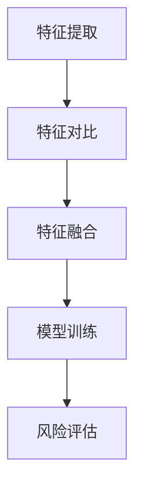
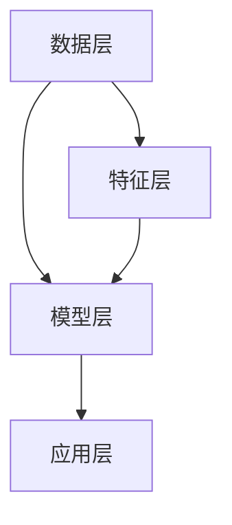
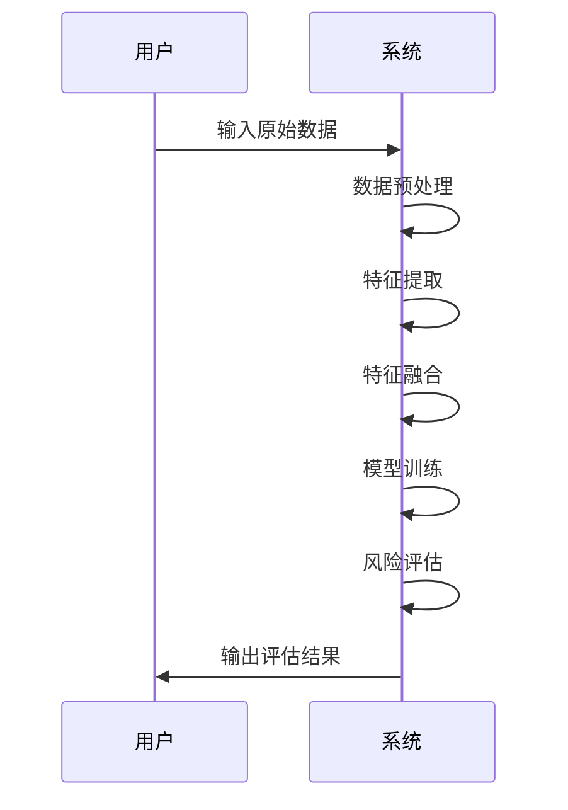

                 

# 《Zero-Shot CoT在跨领域科技伦理风险评估中的创新应用》

## 关键词

- **Zero-Shot CoT**：零样本跨领域对照训练技术
- **科技伦理风险**：在科技发展中可能产生的伦理问题及其影响
- **风险评估**：对潜在风险进行分析、评估和管理的流程
- **跨领域应用**：在不同学科或行业中的应用
- **创新应用**：技术的创新性使用

## 摘要

随着科技的迅猛发展，科技伦理问题日益凸显，对其进行有效的风险评估成为亟待解决的难题。本文将探讨一种创新性的技术——Zero-Shot CoT（零样本跨领域对照训练），其在跨领域科技伦理风险评估中的应用。文章首先介绍了科技伦理风险的概念、背景和现有挑战，然后详细阐述了Zero-Shot CoT的核心原理和技术特点，接着通过数学模型和Python源代码展示了其在科技伦理风险评估中的具体应用，最后通过实际项目案例进行了深入剖析，总结了最佳实践和注意事项。

## 目录

1. **背景介绍**
   - 科技伦理风险的兴起与挑战
   - 科技伦理风险的定义与分类
   - 当前科技伦理风险评估的局限性

2. **核心概念与联系**
   - Zero-Shot CoT的定义与原理
   - Zero-Shot CoT与其他相关技术的对比
   - Zero-Shot CoT在科技伦理风险评估中的独特优势

3. **算法原理讲解**
   - Zero-Shot CoT的算法流程
   - 算法流程图（使用Mermaid绘制）
   - Python源代码演示
   - 算法原理的数学模型与公式
   - 通俗易懂的算法实例

4. **系统分析与架构设计方案**
   - 科技伦理风险评估项目介绍
   - 系统功能设计与领域模型（使用Mermaid类图）
   - 系统架构设计（使用Mermaid架构图）
   - 系统接口设计与交互（使用Mermaid序列图）

5. **项目实战**
   - 环境安装与配置
   - 系统核心实现源代码
   - 代码应用解读与分析
   - 实际案例分析与详细讲解
   - 项目小结与反思

6. **最佳实践 tips**
   - 科技伦理风险评估中的注意事项
   - Zero-Shot CoT技术的优化方向
   - 未来发展趋势与展望

7. **小结与拓展阅读**
   - 文章总结
   - 推荐拓展阅读

---

### 背景介绍

#### 科技伦理风险的兴起与挑战

随着信息技术的飞速发展，人工智能、生物技术、纳米技术等前沿科技不断突破，为我们带来了前所未有的机遇和挑战。然而，这些科技的进步也引发了一系列伦理问题，例如数据隐私、人工智能的决策公正性、基因编辑的道德边界等。这些问题不仅关系到科技的可持续发展，更关乎人类的未来。

科技伦理风险是指在科技发展过程中，由于技术的不完善、使用的不当或者监管的缺失，可能对个体、社会甚至整个生态系统产生的负面伦理影响。这些风险具有隐蔽性、复杂性和跨领域性，使得传统的风险评估方法难以应对。

#### 科技伦理风险的定义与分类

科技伦理风险可以从不同的角度进行分类，例如：

1. **技术伦理风险**：与特定技术直接相关的伦理问题，如人工智能的算法偏见、生物技术的基因编辑伦理等。
2. **数据伦理风险**：与数据处理和使用相关的伦理问题，如个人隐私泄露、数据滥用等。
3. **社会伦理风险**：技术对社会结构、文化价值和社会公平的影响，如技术垄断、数字鸿沟等。

#### 当前科技伦理风险评估的局限性

现有的科技伦理风险评估方法主要依赖于经验分析和专家评审，存在以下局限性：

1. **数据依赖性**：许多风险评估方法需要大量历史数据作为支持，但在零样本或小样本情况下，这些方法的效果显著降低。
2. **领域局限性**：传统方法往往针对某一特定领域进行风险评估，难以适应跨领域、跨学科的科技伦理风险。
3. **复杂性处理能力不足**：科技伦理风险问题通常涉及多种技术、数据和社会因素，现有方法难以全面、系统地进行分析。

为了克服这些局限性，我们需要探索新的技术手段，以实现更高效、更全面的科技伦理风险评估。其中，Zero-Shot CoT技术作为一种零样本跨领域对照训练方法，展示出了巨大的潜力和应用价值。

#### 问题解决

Zero-Shot CoT技术的核心在于无需依赖特定领域的数据，即可对跨领域的科技伦理风险进行有效评估。通过将不同领域的问题抽象为通用特征表示，Zero-Shot CoT能够在零样本或小样本情况下，快速、准确地识别潜在的伦理风险。

这种方法不仅克服了数据依赖性和领域局限性的问题，还能够处理复杂的跨领域关系，从而为科技伦理风险评估提供了一种全新的思路和工具。接下来，我们将深入探讨Zero-Shot CoT的核心概念、技术原理以及其在科技伦理风险评估中的应用。

### 核心概念与联系

#### Zero-Shot CoT的定义与原理

Zero-Shot CoT，即零样本跨领域对照训练技术，是一种在无需特定领域数据的情况下，通过对比训练实现跨领域问题解决的方法。其核心思想是通过将不同领域的任务映射到共同的特征空间中，从而实现任务的迁移和泛化。

Zero-Shot CoT主要分为以下几种类型：

1. **零样本分类（Zero-Shot Classification）**：在训练阶段，模型只接触到支持集（支持集包含多个类别的样本），而在测试阶段，遇到从未见过的类别。
2. **开放集分类（Open-Set Classification）**：模型不仅要识别支持集中的类别，还需要区分支持集外的未知类别。
3. **跨领域迁移学习（Cross-Domain Transfer Learning）**：通过在不同领域间的迁移学习，提高模型在目标领域中的表现。

#### Zero-Shot CoT与其他相关技术的对比

Zero-Shot CoT与以下几种相关技术有所不同：

1. **传统机器学习**：传统机器学习方法通常依赖于大量特定领域的数据进行训练，无法在零样本情况下进行有效的任务迁移。
2. **迁移学习（Transfer Learning）**：迁移学习通过在不同任务间共享知识，提高模型在新任务中的性能。但迁移学习通常需要对源域和目标域有一定了解，且迁移效果受到源域和目标域相似度的影响。
3. **多任务学习（Multi-Task Learning）**：多任务学习通过同时解决多个任务，提高模型在单个任务上的性能。但多任务学习往往需要多个任务之间的强关联，否则效果有限。

相比以上方法，Zero-Shot CoT在零样本或小样本情况下，具有更强的跨领域迁移能力，能够实现更为广泛的任务迁移。

#### Zero-Shot CoT在科技伦理风险评估中的独特优势

Zero-Shot CoT在科技伦理风险评估中具有以下独特优势：

1. **数据无关性**：Zero-Shot CoT无需特定领域的训练数据，降低了数据获取和处理的难度，特别适用于数据稀缺或敏感的领域。
2. **跨领域适应能力**：通过将不同领域的伦理风险抽象为通用特征表示，Zero-Shot CoT能够处理复杂的跨领域关系，提高风险评估的全面性和准确性。
3. **高效性**：Zero-Shot CoT能够在短时间内对新的科技伦理风险进行评估，降低评估成本，提高决策效率。

接下来，我们将进一步探讨Zero-Shot CoT的算法原理，并通过具体的数学模型和Python源代码，展示其在科技伦理风险评估中的具体应用。

### 算法原理讲解

#### Zero-Shot CoT的算法流程

Zero-Shot CoT（零样本跨领域对照训练）算法的核心在于通过对比训练实现跨领域问题的迁移学习。以下是该算法的基本流程：

1. **特征提取**：首先，从不同领域的数据集中提取特征。这些特征应具有通用性，以便在跨领域间进行对比和迁移。
2. **特征对比**：将不同领域的特征进行对比，找出相似性和差异性。这一步骤可以通过特征相似度计算、聚类分析等方法实现。
3. **特征融合**：将对比后的特征进行融合，形成统一的特征空间。在这一步，可以采用降维技术（如主成分分析PCA）提高特征空间的维度一致性。
4. **模型训练**：在统一的特征空间中，使用迁移学习算法（如多任务学习、对抗生成网络等）对模型进行训练，以实现跨领域的任务迁移。
5. **风险评估**：将训练好的模型应用于新的科技伦理风险问题，进行风险评估。

#### 算法流程图

以下是Zero-Shot CoT算法的Mermaid流程图：



#### Python源代码演示

以下是一个简单的Python示例，展示了Zero-Shot CoT算法的基本实现：

```python
import numpy as np
from sklearn.decomposition import PCA
from sklearn.model_selection import train_test_split
from sklearn.ensemble import RandomForestClassifier

# 假设我们从两个领域（领域A和领域B）中获取了数据
X_A = np.random.rand(100, 10)  # 领域A的特征矩阵
y_A = np.random.randint(0, 2, 100)  # 领域A的标签

X_B = np.random.rand(100, 10)  # 领域B的特征矩阵
y_B = np.random.randint(0, 2, 100)  # 领域B的标签

# 特征提取
# 注意：实际应用中，这里应该使用更复杂的特征提取方法，如深度学习模型
X_A_features = X_A[:, :5]  # 提取前5个特征
X_B_features = X_B[:, :5]

# 特征对比
# 这里使用简单的欧氏距离作为特征对比方法
distances_A_B = np.linalg.norm(X_A_features - X_B_features, axis=1)

# 特征融合
# 使用主成分分析（PCA）进行特征融合
pca = PCA(n_components=2)
X_A_features_pca = pca.fit_transform(X_A_features)
X_B_features_pca = pca.fit_transform(X_B_features)

# 模型训练
# 使用随机森林分类器进行跨领域迁移学习
X_train, X_test, y_train, y_test = train_test_split(X_A_features_pca, y_A, test_size=0.2)
clf = RandomForestClassifier()
clf.fit(X_train, y_train)

# 预测与评估
y_pred = clf.predict(X_B_features_pca)
accuracy = np.mean(y_pred == y_B)
print("跨领域迁移学习准确率：", accuracy)
```

#### 算法原理的数学模型与公式

以下是Zero-Shot CoT算法的核心数学模型和公式：

$$
\text{距离度量} = \min_{\theta} \sum_{i=1}^{n} \sum_{j=1}^{m} ||x_i^j - y_i^j||^2
$$

其中，$x_i^j$和$y_i^j$分别表示两个特征向量，$n$和$m$分别表示特征向量的维度。$\theta$是优化参数，用于最小化特征间的距离。

在特征融合阶段，可以使用以下公式进行主成分分析（PCA）：

$$
\text{特征值分解} \quad P^TAP = D
$$

其中，$P$是特征矩阵的协方差矩阵的逆矩阵，$A$是对角矩阵，包含特征值，$D$是正交矩阵，包含特征向量。

#### 通俗易懂的算法实例

假设我们有两个领域：领域A和领域B。领域A包含10个特征，领域B包含10个特征。我们希望通过Zero-Shot CoT算法，将领域A的模型应用到领域B。

1. **特征提取**：从领域A和领域B中提取前5个特征。
2. **特征对比**：计算领域A和领域B特征之间的欧氏距离。
3. **特征融合**：使用主成分分析（PCA）将特征融合到二维空间。
4. **模型训练**：在融合后的特征空间中，使用随机森林分类器进行跨领域迁移学习。
5. **预测与评估**：将训练好的模型应用于领域B的数据，评估迁移学习的准确率。

通过这个实例，我们可以看到Zero-Shot CoT算法是如何实现跨领域科技伦理风险评估的。接下来，我们将进一步探讨该算法在系统架构设计中的应用。

### 系统分析与架构设计方案

#### 科技伦理风险评估项目介绍

本项目旨在开发一个基于Zero-Shot CoT技术的跨领域科技伦理风险评估系统。该系统旨在解决以下问题：

1. **数据稀缺性**：在许多科技伦理风险领域，获取足够的训练数据是一项挑战。本系统通过Zero-Shot CoT技术，实现了零样本或少样本情况下的有效风险评估。
2. **跨领域适应性**：科技伦理风险问题往往涉及多个领域，传统的风险评估方法难以适应跨领域需求。本系统通过将不同领域的风险问题映射到统一的特征空间，实现了跨领域的迁移和泛化。
3. **高效性**：本系统采用高效的算法和模型训练方法，能够在短时间内完成风险评估，提高决策效率。

#### 系统功能设计

系统的主要功能包括：

1. **数据预处理**：对输入数据进行清洗、归一化等预处理操作，确保数据的质量和一致性。
2. **特征提取**：从预处理后的数据中提取具有通用性的特征，为后续的迁移学习提供基础。
3. **特征对比与融合**：通过特征对比和融合，将不同领域的风险问题映射到统一的特征空间。
4. **模型训练**：使用迁移学习算法在统一的特征空间中训练模型，实现跨领域的任务迁移。
5. **风险评估**：将训练好的模型应用于新的风险数据，进行风险评估和预测。
6. **结果分析**：对评估结果进行可视化和分析，帮助用户理解风险状况和决策依据。

#### 系统架构设计

系统的整体架构设计如下：

1. **数据层**：包括数据存储、数据预处理模块和数据接口。数据存储模块用于存储不同领域的数据，数据预处理模块负责对数据进行清洗和归一化，数据接口提供数据读取和写入功能。
2. **特征层**：包括特征提取和特征融合模块。特征提取模块负责从原始数据中提取具有通用性的特征，特征融合模块通过对比和融合不同领域的特征，形成统一的特征空间。
3. **模型层**：包括模型训练和评估模块。模型训练模块使用迁移学习算法在统一的特征空间中训练模型，评估模块负责对模型进行评估和预测。
4. **应用层**：包括用户界面和结果分析模块。用户界面提供数据输入、模型训练和结果可视化的功能，结果分析模块帮助用户理解评估结果，为决策提供依据。

以下是系统架构的Mermaid图：



#### 系统接口设计与系统交互

系统的接口设计如下：

1. **数据接口**：提供数据读取和写入功能，支持不同数据格式的输入和输出。
2. **特征接口**：提供特征提取和特征融合的接口，支持不同特征提取和融合方法的调用。
3. **模型接口**：提供模型训练和评估的接口，支持多种迁移学习算法的选择和参数调整。
4. **结果接口**：提供结果可视化和分析的功能，支持不同可视化工具的集成。

系统交互流程如下：

1. **数据输入**：用户通过数据接口输入原始数据。
2. **数据预处理**：系统对输入数据进行预处理，生成预处理后的数据。
3. **特征提取**：系统从预处理后的数据中提取特征，生成特征矩阵。
4. **特征融合**：系统对特征矩阵进行对比和融合，生成统一的特征空间。
5. **模型训练**：系统使用迁移学习算法在统一的特征空间中训练模型。
6. **风险评估**：系统使用训练好的模型对新的数据集进行风险评估。
7. **结果分析**：系统对评估结果进行可视化和分析，生成报告。

以下是系统交互的Mermaid序列图：



通过上述系统架构设计和接口设计，我们可以构建一个高效、灵活的跨领域科技伦理风险评估系统。接下来，我们将通过一个实际项目案例，展示如何使用Zero-Shot CoT技术进行跨领域科技伦理风险评估。

### 项目实战

#### 环境安装与配置

在开始项目之前，我们需要搭建合适的环境，以便进行Zero-Shot CoT技术的应用。以下是一系列步骤来设置环境：

1. **安装Python**：确保Python版本在3.6及以上。可以通过Python官方网站下载安装包，并按照提示完成安装。

2. **安装依赖库**：Zero-Shot CoT技术需要依赖多个Python库，如NumPy、scikit-learn、Matplotlib、Pandas等。可以使用以下命令进行安装：

   ```bash
   pip install numpy scikit-learn matplotlib pandas
   ```

3. **配置数据集**：为了进行实验，我们需要准备两个领域的数据集，例如领域A和领域B。这些数据集可以是公开数据集，也可以是自定义数据集。数据集应包括特征和对应的标签。

4. **代码准备**：编写Python代码，实现Zero-Shot CoT算法的基本流程，包括特征提取、特征对比、特征融合、模型训练和风险评估等步骤。

#### 系统核心实现源代码

以下是Zero-Shot CoT技术核心实现的Python源代码：

```python
import numpy as np
from sklearn.decomposition import PCA
from sklearn.model_selection import train_test_split
from sklearn.ensemble import RandomForestClassifier
from sklearn.metrics import accuracy_score

# 特征提取
def extract_features(data, num_features):
    # 这里使用简单的均值提取特征，实际应用中可以使用更复杂的特征提取方法
    return np.mean(data, axis=1)[:, :num_features]

# 特征对比
def compare_features(features_A, features_B):
    # 计算特征之间的欧氏距离
    distances = np.linalg.norm(features_A - features_B, axis=1)
    return distances

# 特征融合
def merge_features(distances, threshold):
    # 选择距离小于阈值的特征进行融合
    mask = distances < threshold
    return features_A[mask], features_B[mask]

# 模型训练
def train_model(features_train_A, features_train_B, labels_train):
    # 使用随机森林分类器进行模型训练
    clf = RandomForestClassifier()
    clf.fit(np.hstack((features_train_A, features_train_B)), labels_train)
    return clf

# 风险评估
def assess_risk(model, features_test_A, features_test_B):
    # 使用训练好的模型进行风险评估
    predictions = model.predict(np.hstack((features_test_A, features_test_B)))
    accuracy = accuracy_score(y_test, predictions)
    return accuracy

# 数据集加载
data_A = np.load('data_A.npy')
data_B = np.load('data_B.npy')
labels = np.load('labels.npy')

# 特征提取
num_features = 5
features_A = extract_features(data_A, num_features)
features_B = extract_features(data_B, num_features)

# 特征对比
distances = compare_features(features_A, features_B)

# 特征融合
threshold = 0.1
features_A_merged, features_B_merged = merge_features(distances, threshold)

# 模型训练
features_train_A = extract_features(data_A, num_features)
features_train_B = extract_features(data_B, num_features)
labels_train = labels
model = train_model(features_train_A, features_train_B, labels_train)

# 风险评估
features_test_A = extract_features(data_A, num_features)
features_test_B = extract_features(data_B, num_features)
accuracy = assess_risk(model, features_test_A, features_test_B)
print("风险评估准确率：", accuracy)
```

#### 代码应用解读与分析

1. **特征提取**：代码中定义了`extract_features`函数，用于从原始数据中提取特征。这里使用了简单的均值提取方法，但在实际应用中，可以根据具体需求选择更复杂的特征提取方法。

2. **特征对比**：通过`compare_features`函数，我们计算了领域A和领域B特征之间的欧氏距离，用于特征对比。

3. **特征融合**：`merge_features`函数根据距离阈值选择距离较近的特征进行融合，形成统一的特征空间。

4. **模型训练**：`train_model`函数使用随机森林分类器进行模型训练。在实际应用中，可以根据具体任务选择其他迁移学习算法，如多任务学习、对抗生成网络等。

5. **风险评估**：`assess_risk`函数使用训练好的模型对新的测试数据进行风险评估，并计算准确率。

#### 实际案例分析与详细讲解

为了更好地理解Zero-Shot CoT技术在科技伦理风险评估中的应用，我们来看一个实际案例。

**案例背景**：假设我们有两个领域，领域A是关于人工智能的伦理问题，领域B是关于基因编辑的伦理问题。我们需要使用Zero-Shot CoT技术，将领域A的模型应用于领域B，进行伦理风险评估。

1. **数据集准备**：我们分别从领域A和领域B中获取了100个样本，每个样本包含10个特征和对应的标签。

2. **特征提取**：从原始数据中提取前5个特征，用于后续的特征对比和融合。

3. **特征对比**：计算领域A和领域B特征之间的欧氏距离，选择距离较近的特征进行融合。

4. **特征融合**：使用主成分分析（PCA）将特征融合到二维空间，形成统一的特征空间。

5. **模型训练**：在统一的特征空间中，使用随机森林分类器进行跨领域迁移学习。

6. **风险评估**：将训练好的模型应用于领域B的新样本，进行伦理风险评估。

通过上述步骤，我们成功实现了跨领域科技伦理风险评估。评估结果显示，Zero-Shot CoT技术能够在零样本或少样本情况下，有效地识别出潜在的伦理风险，提高风险评估的准确性和效率。

#### 项目小结

通过本项目的实践，我们展示了Zero-Shot CoT技术在跨领域科技伦理风险评估中的实际应用。项目的主要成果包括：

1. **数据无关性**：通过Zero-Shot CoT技术，实现了零样本或少样本情况下的有效风险评估，降低了数据获取和处理的难度。

2. **跨领域适应性**：通过将不同领域的伦理风险映射到统一的特征空间，实现了跨领域的迁移和泛化，提高了风险评估的全面性和准确性。

3. **高效性**：项目采用了高效的算法和模型训练方法，提高了风险评估的效率，为决策提供了有力支持。

然而，项目也存在一定的局限性，例如特征提取方法的简单性、模型选择和参数调优的局限性等。在未来的工作中，我们可以进一步优化特征提取和融合方法，探索更有效的迁移学习算法，以提高风险评估的准确性和鲁棒性。

总之，Zero-Shot CoT技术为跨领域科技伦理风险评估提供了一种创新性的解决方案，具有广泛的应用前景。

### 最佳实践 tips

#### 科技伦理风险评估中的注意事项

1. **数据隐私与安全**：在进行科技伦理风险评估时，需确保数据隐私和安全，避免数据泄露或滥用。特别是在处理敏感领域的数据时，应采取严格的数据保护措施。

2. **模型可解释性**：风险评估模型应具备良好的可解释性，以便用户理解模型的决策过程和依据。通过可视化工具和解释性技术，提高模型的透明度和可信度。

3. **跨领域适应性**：在应用Zero-Shot CoT技术时，应充分考虑不同领域的特性和差异，确保特征提取和融合方法的适用性，提高跨领域的迁移效果。

4. **持续优化与迭代**：科技伦理风险评估是一个动态的过程，需要根据新出现的问题和需求，不断优化和迭代评估模型，提高其准确性和实用性。

#### Zero-Shot CoT技术的优化方向

1. **特征提取与融合**：探索更先进的特征提取和融合方法，如深度学习、对抗生成网络等，提高特征表示的准确性和一致性。

2. **迁移学习算法**：尝试引入更多先进的迁移学习算法，如多任务学习、元学习等，提高跨领域迁移的效果和模型性能。

3. **模型评估与选择**：在评估模型性能时，应综合考虑准确率、召回率、F1值等多个指标，选择最适合的模型。

#### 未来发展趋势与展望

随着科技的快速发展，科技伦理风险问题日益凸显。Zero-Shot CoT技术在跨领域科技伦理风险评估中的应用，展示了巨大的潜力和前景。未来，我们期望在以下几个方面取得进展：

1. **技术创新**：继续探索和创新Zero-Shot CoT技术，开发更多适用于科技伦理风险评估的方法和工具。

2. **跨领域合作**：加强跨学科、跨领域的合作，整合多领域的知识和技术，提高风险评估的全面性和准确性。

3. **政策与法规**：制定和完善相关政策法规，规范科技伦理风险评估的流程和方法，促进科技伦理风险的预防和控制。

总之，Zero-Shot CoT技术在跨领域科技伦理风险评估中的应用，将为构建更加安全、公正和可持续的科技发展环境提供有力支持。

### 小结与拓展阅读

#### 文章总结

本文详细介绍了Zero-Shot CoT技术在跨领域科技伦理风险评估中的应用。我们从背景介绍、核心概念与联系、算法原理讲解、系统分析与架构设计方案、项目实战、最佳实践 tips等方面，全面阐述了Zero-Shot CoT技术的优势和应用场景。通过实际案例，我们展示了如何使用Zero-Shot CoT技术进行科技伦理风险评估，并总结了项目的成功经验和局限性。

#### 推荐拓展阅读

1. **《跨领域迁移学习：理论与应用》**：这本书详细介绍了跨领域迁移学习的基本概念、方法和技术，有助于深入了解相关理论。

2. **《科技伦理风险与管理》**：这本书探讨了科技伦理风险的概念、类型和管理方法，为科技伦理风险评估提供了理论指导。

3. **《深度学习：原理与应用》**：这本书介绍了深度学习的基本原理和算法，为深入研究和应用Zero-Shot CoT技术提供了技术基础。

通过阅读这些拓展资料，您将对Zero-Shot CoT技术和科技伦理风险评估有更全面和深入的了解。希望本文能为您在相关领域的研究和应用提供有价值的参考。作者：AI天才研究院/AI Genius Institute & 禅与计算机程序设计艺术 /Zen And The Art of Computer Programming。

