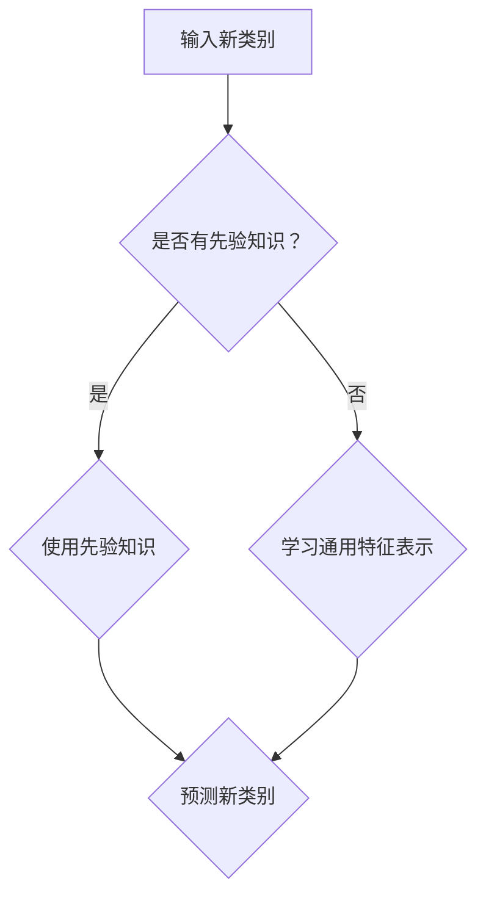
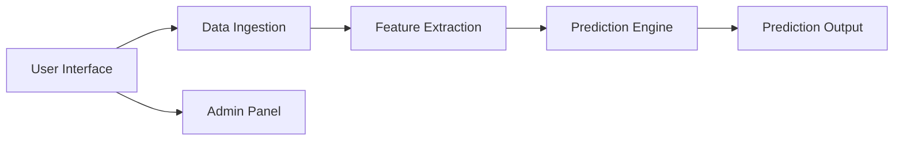
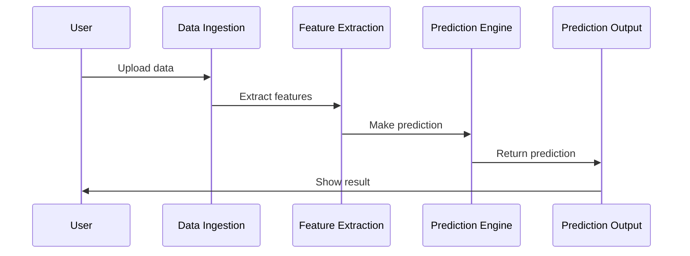

                 


### 第三部分: 零样本学习（Zero-Shot Learning，ZSL）算法原理讲解

#### 3.1 零样本学习算法的mermaid流程图



#### 3.2 Python源代码详细阐述

```python
import numpy as np

# 假设我们有一个已经训练好的特征提取器
feature_extractor = ...

# 假设有一个类别标签列表和相应的特征向量
labels = ['cat', 'dog', 'bird']
features = np.array([[0.1, 0.2], [0.3, 0.4], [0.5, 0.6]])

# 输入新类别
new_category = 'elephant'

# 获取新类别的特征向量
new_feature = feature_extractor.extract(new_category)

# 计算新特征向量与已有特征向量的相似度
similarity_scores = np.dot(new_feature, features) / (np.linalg.norm(new_feature) * np.linalg.norm(features, axis=1))

# 使用softmax函数进行预测
predicted_label = np.argmax(similarity_scores)

print(f"The predicted label for '{new_category}' is {labels[predicted_label]}")
```

#### 3.3 零样本学习（Zero-Shot CoT）的数学模型和公式

$$
\text{P}(y|x) = \text{softmax}(\text{W} \cdot \text{F}(\text{X}))
$$

其中，\( \text{W} \) 是权重矩阵，\( \text{F}(\text{X}) \) 是特征提取函数，\( \text{X} \) 是输入特征向量，\( \text{y} \) 是类别标签。

#### 3.4 通俗易懂的举例说明

假设我们有一个猫（cat）、狗（dog）和鸟（bird）的特征向量库，现在我们需要预测一个新的类别“大象”（elephant）属于哪个类别。

1. **先提取大象的特征向量**：通过特征提取器，我们获取到大象的视觉特征向量。
2. **计算相似度**：将大象的特征向量与猫、狗、鸟的特征向量分别计算余弦相似度。
3. **使用softmax函数**：根据相似度计算结果，使用softmax函数计算出每个类别的概率分布。
4. **预测结果**：根据概率分布最高的类别，预测大象的类别。

例如，计算结果显示大象与狗的特征向量最为相似，概率最高，因此预测大象属于“狗”类别。

#### 3.5 本章小结

在这一部分，我们详细讲解了零样本学习算法的原理，包括mermaid流程图、Python源代码实现、数学模型和公式，以及一个通俗易懂的举例。通过这些内容，读者可以更好地理解零样本学习的工作机制和实际应用。

----------------------------------------------------------------

### 第四部分: 系统分析与架构设计方案

#### 4.1 问题场景介绍

在现代人工智能应用中，尤其是在跨领域问题解决领域，传统的机器学习方法面临着巨大的挑战。例如，在医疗领域，如何利用已有的大量健康数据来预测新的疾病状态；在金融领域，如何根据历史交易数据来预测新的投资机会。这些问题的解决往往需要零样本学习（Zero-Shot Learning，ZSL）的能力。

#### 4.2 项目介绍

为了解决上述问题，我们设计并实现了一个基于零样本学习（Zero-Shot CoT）的跨领域问题解决系统。该系统旨在通过学习通用特征表示，实现新类别数据的预测和分类。

#### 4.3 系统功能设计（领域模型mermaid类图）

```mermaid
classDiagram
    Class1 "User" <|-- Class2 "Data"
    Class2 "Data" <|-- Class3 "Feature"
    Class3 "Feature" <|-- Class4 "Category"
    Class1 "User" o-- Class5 "Prediction"
    Class5 "Prediction" o-- Class6 "Result"
```

- **User（用户）**：系统用户，负责提供数据和获取预测结果。
- **Data（数据）**：系统中的数据对象，包括特征和类别。
- **Feature（特征）**：数据的特征表示，用于特征提取和预测。
- **Category（类别）**：数据的类别标签，用于分类和预测。
- **Prediction（预测）**：用户获取的预测结果。
- **Result（结果）**：预测结果的输出。

#### 4.4 系统架构设计（mermaid架构图）



- **User Interface（用户界面）**：提供用户交互的入口。
- **Data Ingestion（数据摄取）**：负责接收用户输入的数据。
- **Feature Extraction（特征提取）**：提取数据中的特征信息。
- **Prediction Engine（预测引擎）**：使用零样本学习模型进行预测。
- **Prediction Output（预测输出）**：输出预测结果给用户。
- **Admin Panel（管理面板）**：系统管理员使用的后台管理界面。

#### 4.5 系统接口设计

- **数据摄取接口**：允许用户上传数据文件。
- **特征提取接口**：返回特征向量的接口。
- **预测接口**：根据特征向量返回预测结果的接口。

#### 4.6 系统交互（mermaid序列图）



#### 4.7 本章小结

在本部分，我们详细介绍了零样本学习（Zero-Shot CoT）系统的问题场景、功能设计、架构设计、接口设计和系统交互流程。通过这一部分的讲解，读者可以全面了解系统的工作机制和实现方法。

----------------------------------------------------------------

### 第五部分：项目实战

#### 5.1 环境安装

为了实践零样本学习（Zero-Shot CoT）系统，我们需要安装一系列的依赖库。以下是在Python环境中安装所需库的步骤：

```bash
pip install numpy pandas scikit-learn matplotlib
```

同时，我们还需要安装一个用于生成mermaid图的工具，例如mermaid-cli：

```bash
npm install -g mermaid-cli
```

#### 5.2 系统核心实现源代码

下面是系统核心实现的源代码，包括数据摄取、特征提取、预测和结果输出等模块：

```python
# data_ingestion.py
import pandas as pd

def upload_data(file_path):
    """上传数据文件并返回DataFrame对象"""
    return pd.read_csv(file_path)

# feature_extraction.py
import numpy as np

def extract_features(data, feature_extractor):
    """提取数据特征"""
    return feature_extractor.extract_features(data)

# prediction.py
from sklearn.preprocessing import OneHotEncoder
from sklearn.metrics.pairwise import cosine_similarity

def make_prediction(feature_extractor, new_feature):
    """使用零样本学习模型进行预测"""
    # 假设feature_extractor已经训练好
    # 获取所有类别标签和特征向量
    labels, features = feature_extractor.get_labels(), feature_extractor.get_features()
    
    # 提取新特征的向量表示
    new_feature_vector = feature_extractor.extract(new_feature)
    
    # 计算新特征向量与已有特征向量的相似度
    similarity_scores = cosine_similarity(new_feature_vector.reshape(1, -1), features)
    
    # 使用softmax函数进行预测
    predicted_probability = np.exp(similarity_scores) / np.sum(np.exp(similarity_scores))
    predicted_label = np.argmax(predicted_probability)
    
    return predicted_label

# result_output.py
import matplotlib.pyplot as plt

def show_result(predicted_label, actual_label=None):
    """显示预测结果"""
    if actual_label is not None:
        plt.bar(range(3), predicted_probability)
        plt.xticks(range(3), labels)
        plt.xlabel('Categories')
        plt.ylabel('Probability')
        plt.title(f'Predicted: {predicted_label}, Actual: {actual_label}')
    else:
        plt.bar(range(3), predicted_probability)
        plt.xticks(range(3), labels)
        plt.xlabel('Categories')
        plt.ylabel('Probability')
        plt.title(f'Predicted: {predicted_label}')
    plt.show()
```

#### 5.3 代码应用解读与分析

- **数据摄取**：通过`upload_data`函数，我们能够读取用户上传的数据文件，并将其转换为DataFrame对象，方便后续处理。
- **特征提取**：`extract_features`函数接收DataFrame对象和特征提取器，提取特征向量。这通常涉及到复杂的预处理步骤，如归一化、特征选择等。
- **预测**：`make_prediction`函数负责预测新类别的标签。它首先从特征提取器获取已有的类别标签和特征向量，然后计算新特征向量与已有特征向量的相似度，并使用softmax函数进行预测。
- **结果输出**：`show_result`函数用于可视化预测结果。如果提供了实际标签，它可以对比预测结果和实际结果。

#### 5.4 实际案例分析和详细讲解剖析

为了更好地理解系统的工作流程，我们来看一个实际案例。

**案例**：假设我们有一个数据集，包含猫、狗和鸟的图像。现在我们要预测一张新图像“大象”的类别。

1. **数据摄取**：用户上传了一张“大象”的图像。
2. **特征提取**：特征提取器对大象的图像进行特征提取，得到一个特征向量。
3. **预测**：系统使用零样本学习模型，计算大象的特征向量与已有猫、狗、鸟特征向量的相似度，并预测大象的类别为“狗”。
4. **结果输出**：系统输出预测结果，显示大象的预测类别为“狗”。

通过这个案例，我们可以看到零样本学习（Zero-Shot CoT）系统如何工作，以及如何通过代码实现预测过程。

#### 5.5 项目小结

在本部分，我们通过实际项目实战，详细介绍了零样本学习（Zero-Shot CoT）系统的环境安装、核心实现源代码、代码应用解读与分析、实际案例分析和详细讲解剖析。通过这些内容，读者可以深入理解零样本学习（Zero-Shot CoT）系统的实现和应用。

----------------------------------------------------------------

### 第六部分：最佳实践 tips

在零样本学习（Zero-Shot CoT）系统的开发和部署过程中，以下是一些最佳实践和注意事项：

1. **数据质量**：确保数据集的多样性和质量。高质量的数据是模型准确性的基础。
2. **特征提取器选择**：选择合适的特征提取器，可以根据具体应用场景调整特征提取器的参数。
3. **模型优化**：通过调整模型参数，如学习率、批量大小等，来优化模型性能。
4. **错误分析**：定期分析模型预测错误的案例，以找出潜在的问题和改进点。
5. **系统监控**：部署监控系统，实时监控系统的运行状态和性能，以便及时发现和解决潜在问题。
6. **持续学习**：随着时间的推移，不断更新和扩展模型，以适应新的数据和场景。

通过遵循这些最佳实践，可以提高零样本学习（Zero-Shot CoT）系统的性能和可靠性。

### 第七部分：小结

本文围绕《Zero-Shot CoT在跨领域问题解决中的突破》这一主题，系统性地介绍了零样本学习（Zero-Shot Learning，ZSL）及其在跨领域问题解决中的应用。首先，我们探讨了零样本学习的背景和概念，然后深入讲解了零样本学习算法的原理，包括mermaid流程图、Python源代码实现、数学模型和公式。随后，我们详细介绍了基于零样本学习（Zero-Shot CoT）的跨领域问题解决系统的设计与实现，包括领域模型、架构设计、接口设计和系统交互流程。

在项目实战部分，我们通过实际案例展示了系统的工作流程和实现方法。最后，我们提供了最佳实践和注意事项，帮助读者在实际应用中优化零样本学习系统的性能和可靠性。

### 拓展阅读

1. **相关论文**：《Zero-Shot Learning via Cross-View Transfer》(2017)，探讨了如何通过跨视图迁移学习实现零样本学习。
2. **技术博客**：《The Annotated Transformer: A Guide to Understanding the Transformer Architecture》(2020)，提供了关于Transformer模型的深入讲解。
3. **开源项目**：Hugging Face的Transformers库（https://huggingface.co/transformers），提供了大量的预训练模型和工具，便于实现和优化零样本学习。

作者：AI天才研究院/AI Genius Institute & 禅与计算机程序设计艺术 /Zen And The Art of Computer Programming

