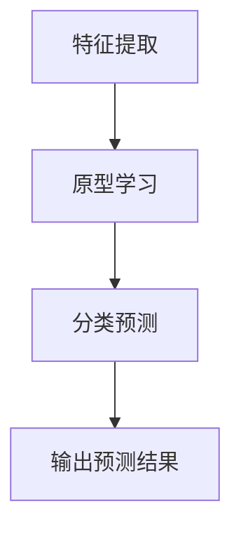
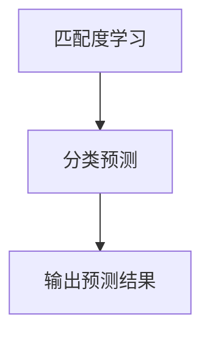
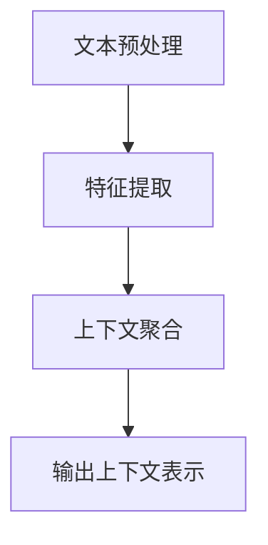
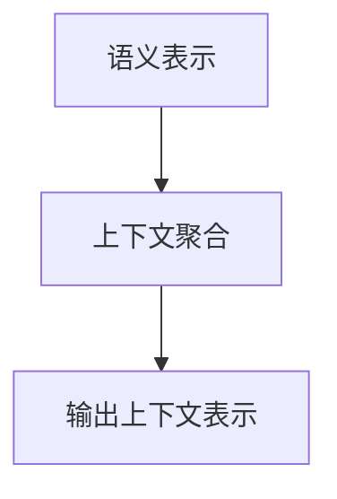
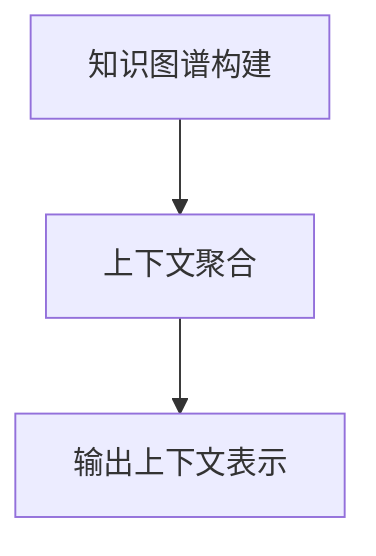
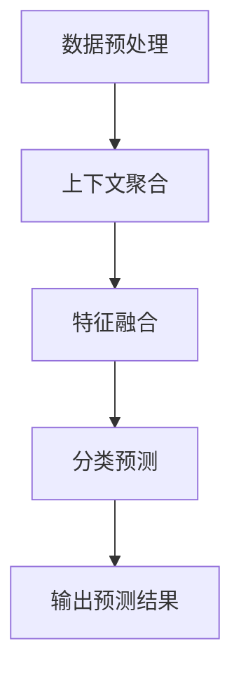
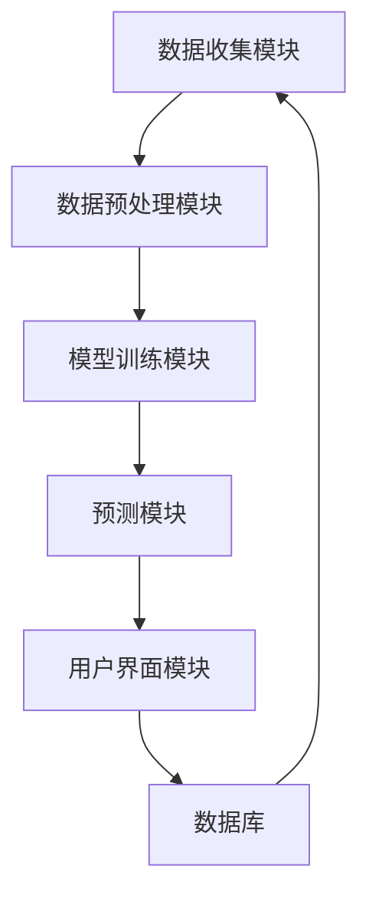

                 

### 让我们一步一步思考

**第一步：明确主题**

我们的主题是《Zero-Shot CoT在金融预测中的应用》。这个主题涉及到两个核心概念：“零样本学习（Zero-Shot Learning）”和“上下文聚合（Contextualization of Topics, CoT）”，并将它们应用于金融预测领域。我们需要详细探讨这两个概念的原理、应用场景以及如何将它们结合起来进行有效的金融预测。

**第二步：梳理核心概念**

- **零样本学习（Zero-Shot Learning）**：这是机器学习中的一个分支，旨在在没有特定领域或类别的训练数据情况下，对未知类别的数据进行分类。这对于金融预测尤为重要，因为金融领域的数据高度专业化，获取特定类型的数据可能非常困难。

- **上下文聚合（CoT）**：这是一种通过上下文信息来增强模型理解的技术，特别是在处理自然语言任务时。在金融预测中，上下文聚合可以帮助模型更好地理解市场动态和潜在风险。

**第三步：确定应用场景**

在金融预测中，零样本学习和上下文聚合可以应用于多种场景：

- **股票市场预测**：利用零样本学习预测新的股票走势，同时利用上下文聚合理解市场新闻、报告等外部信息。
- **风险分析**：通过分析历史数据和上下文信息，预测潜在的市场风险。
- **投资组合优化**：利用零样本学习和上下文聚合来动态调整投资组合，以最大化回报并最小化风险。

**第四步：探讨算法原理**

- **零样本学习算法**：我们将详细介绍原型方法和匹配度方法，并使用mermaid流程图展示它们的基本原理。
- **上下文聚合算法**：我们也会探讨基于文本和基于语义的方法，并展示相应的mermaid流程图。

**第五步：系统分析与架构设计**

我们将深入讨论如何设计一个金融预测系统，包括需求分析、架构设计、模块划分和接口设计。通过mermaid架构图和序列图，我们将直观地展示系统的工作流程。

**第六步：项目实战**

我们将通过一个实际项目展示如何实现零样本学习和上下文聚合，包括环境安装、系统核心实现、代码解读和案例分析。

**第七步：最佳实践与注意事项**

最后，我们将总结最佳实践和注意事项，确保在实际应用中能够充分发挥零样本学习和上下文聚合的优势。

通过以上七个步骤，我们将系统地探讨《Zero-Shot CoT在金融预测中的应用》，为读者提供一个全面、深入的技术解析。现在，让我们开始详细的内容设计，逐步展开每一章的写作。### 第1章: 问题背景与核心概念介绍

#### 1.1 问题的背景与描述

**金融预测的重要性**

金融预测是金融市场研究和风险管理的重要工具。通过预测市场趋势、股价波动、投资组合绩效等，金融机构和投资者可以做出更为明智的决策。然而，传统的金融预测方法主要依赖于历史数据和统计模型，如时间序列分析、回归分析和机器学习模型等。尽管这些方法在某些情况下取得了成功，但它们存在一些显著的局限性。

**传统金融预测方法的局限性**

1. **数据依赖性**：传统方法高度依赖于历史数据，而金融市场数据通常受到噪声和异常值的影响，导致预测结果的准确性受到影响。
2. **模型适应性**：金融市场是高度动态和复杂的，传统模型可能无法适应快速变化的市场环境，导致预测失败。
3. **数据获取难度**：金融领域的数据获取困难，特别是在零样本学习的情况下，获取特定领域的训练数据几乎是不可能的。

**零样本学习（Zero-Shot Learning）的概念**

零样本学习（Zero-Shot Learning, ZSL）是一种机器学习技术，旨在在没有特定领域或类别的训练数据情况下，对未知类别的数据进行分类。ZSL的核心思想是通过跨领域的知识迁移，利用已有知识来预测未知类别。在金融预测中，零样本学习可以解决数据获取难和模型适应性差的问题。

**零样本学习在金融预测中的优势**

1. **无需特定领域数据**：零样本学习不需要特定领域的数据，大大降低了数据获取的难度。
2. **更好的模型适应性**：零样本学习能够利用跨领域的知识，提高模型对动态变化的适应能力。
3. **扩展性**：零样本学习可以轻松应用于新的金融市场和产品，提高预测的广泛性和适应性。

**零样本学习在金融预测中的挑战**

1. **类间差异**：金融市场中不同类别（如股票、债券、商品）之间存在显著差异，这对零样本学习提出了挑战。
2. **上下文信息不足**：金融预测往往需要大量的上下文信息，如市场新闻、政策变化、公司财报等，而零样本学习可能难以充分利用这些信息。
3. **计算成本**：零样本学习通常需要复杂的算法和大量的计算资源，这可能会增加模型的计算成本。

#### 1.2 零样本学习在金融预测中的应用

**零样本学习的基本原理**

零样本学习的基本原理是通过跨领域的知识迁移来实现对未知类别的预测。具体来说，它包括以下步骤：

1. **知识迁移**：利用已有领域（如其他行业）的知识来扩展新领域（如金融）。
2. **特征提取**：从已有数据中提取出具有代表性的特征，用于表示不同类别。
3. **分类预测**：利用提取出的特征进行分类预测，对未知类别进行分类。

**零样本学习在金融预测中的优势**

1. **数据获取容易**：金融数据通常具有高度的专业性，获取特定领域的训练数据非常困难。而零样本学习不需要特定领域的训练数据，大大简化了数据获取过程。
2. **模型适应性**：零样本学习能够利用跨领域的知识，提高模型对动态变化的适应能力。
3. **扩展性**：零样本学习可以轻松应用于新的金融市场和产品，提高预测的广泛性和适应性。

**零样本学习在金融预测中的挑战**

1. **类间差异**：金融市场中不同类别之间存在显著差异，这对零样本学习提出了挑战。
2. **上下文信息不足**：金融预测往往需要大量的上下文信息，如市场新闻、政策变化、公司财报等，而零样本学习可能难以充分利用这些信息。
3. **计算成本**：零样本学习通常需要复杂的算法和大量的计算资源，这可能会增加模型的计算成本。

#### 1.3 上下文聚合（CoT）的概念与作用

**上下文聚合（Contextualization of Topics, CoT）的概念**

上下文聚合（CoT）是一种通过上下文信息来增强模型理解的技术。它旨在利用大量的上下文信息，如文本、图像、声音等，来提高模型的泛化和准确性。在自然语言处理和金融预测等领域，CoT可以显著提高模型的性能。

**上下文聚合在金融预测中的重要性**

1. **增强模型理解**：通过上下文聚合，模型可以更好地理解市场动态和潜在风险，提高预测的准确性。
2. **处理复杂问题**：金融预测问题通常涉及多个因素和变量，上下文聚合可以帮助模型更全面地处理这些复杂问题。
3. **提高模型适应性**：上下文聚合可以增强模型对动态变化的适应能力，提高模型的长期预测能力。

**上下文聚合的方法与分类**

上下文聚合的方法可以分为以下几类：

1. **基于文本的方法**：通过分析文本数据，提取关键信息，增强模型理解。
2. **基于语义的方法**：利用语义分析技术，理解文本的深层含义，提高模型的语义理解能力。
3. **基于知识图谱的方法**：通过构建知识图谱，将上下文信息与金融知识相结合，提高模型的智能推理能力。

### 小结

本章介绍了金融预测的重要性和传统方法的局限性，详细阐述了零样本学习和上下文聚合的概念及其在金融预测中的应用。接下来，我们将深入探讨零样本学习算法的原理，并逐步构建一个基于零样本学习和上下文聚合的金融预测系统。### 第2章: 零样本学习算法原理

#### 2.1 零样本学习算法概述

零样本学习（Zero-Shot Learning, ZSL）是机器学习中的一个重要分支，其主要目标是实现对未知类别的分类，而无需使用特定领域的训练数据。这种技术对金融预测等领域尤为重要，因为金融数据的高度专业性和获取难度使得传统机器学习方法难以直接应用。

**零样本学习的分类**

零样本学习可以分为以下几类：

1. **基于原型的方法**：这种方法通过在训练阶段学习类别的原型特征，然后在预测阶段利用这些原型特征进行分类。
2. **基于匹配度的方法**：这种方法通过在训练阶段学习类别之间的匹配度，然后在预测阶段根据匹配度进行分类。
3. **基于语义的方法**：这种方法利用语义知识库，通过语义关系和相似度来预测未知类别。

**基于原型的方法**

基于原型的方法是零样本学习中最常见的方法之一。它的核心思想是在训练阶段学习每个类别的原型特征，然后在预测阶段利用这些原型特征对未知类别进行分类。具体步骤如下：

1. **特征提取**：从训练数据中提取出特征向量。
2. **原型学习**：计算每个类别的原型特征向量，通常使用均值或聚类算法。
3. **分类预测**：在预测阶段，计算每个测试样本与每个类别原型特征向量的相似度，选择相似度最高的类别作为预测结果。

**基于匹配度的方法**

基于匹配度的方法通过学习类别之间的匹配度来进行分类。它的核心思想是在训练阶段学习每个类别与所有其他类别的匹配度，然后在预测阶段根据这些匹配度进行分类。具体步骤如下：

1. **匹配度学习**：计算每个类别与其他所有类别之间的匹配度，通常使用余弦相似度或欧氏距离。
2. **分类预测**：在预测阶段，计算每个测试样本与每个类别之间的匹配度，选择匹配度最高的类别作为预测结果。

**零样本学习的数学模型与公式**

- **基于原型的方法**：

  - 特征提取：\( x = \text{特征提取}(D) \)

  - 原型学习：\( \mu_c = \frac{1}{N_c} \sum_{x_i \in C_c} x_i \)

  - 分类预测：\( \hat{y} = \arg\max_{c} \left\langle \mu_c, x \right\rangle \)

- **基于匹配度的方法**：

  - 匹配度学习：\( \text{similarity}(c, d) = \frac{\mu_c \cdot \mu_d}{\| \mu_c \| \| \mu_d \|} \)

  - 分类预测：\( \hat{y} = \arg\max_{c} \text{similarity}(c, x) \)

#### 2.2 零样本学习算法的mermaid流程图

**基于原型的方法流程图**：



**基于匹配度的方法流程图**：



通过mermaid流程图，我们可以直观地理解零样本学习算法的基本流程和步骤。接下来，我们将进一步探讨上下文聚合（CoT）算法的原理，以及如何将零样本学习与上下文聚合相结合，提高金融预测的准确性。### 第3章: 上下文聚合（CoT）算法原理

#### 3.1 CoT算法概述

上下文聚合（Contextualization of Topics, CoT）是一种通过上下文信息来增强模型理解的技术，广泛应用于自然语言处理和金融预测等领域。CoT算法的核心思想是利用大量的上下文信息，如文本、图像、声音等，来提高模型的泛化和准确性。

**CoT算法的分类**

CoT算法可以分为以下几类：

1. **基于文本的方法**：通过分析文本数据，提取关键信息，增强模型理解。
2. **基于语义的方法**：利用语义分析技术，理解文本的深层含义，提高模型的语义理解能力。
3. **基于知识图谱的方法**：通过构建知识图谱，将上下文信息与金融知识相结合，提高模型的智能推理能力。

**基于文本的方法**

基于文本的方法通过分析文本数据，提取关键信息，增强模型理解。具体步骤如下：

1. **文本预处理**：对文本数据进行清洗、分词、去停用词等处理。
2. **特征提取**：从预处理后的文本数据中提取特征向量，常用的方法有TF-IDF、词袋模型、词嵌入等。
3. **上下文聚合**：将提取出的特征向量进行聚合，以增强模型对上下文信息的理解。

**基于语义的方法**

基于语义的方法利用语义分析技术，理解文本的深层含义，提高模型的语义理解能力。具体步骤如下：

1. **语义表示**：使用预训练的语义模型（如BERT、GPT等）对文本进行编码，得到语义向量。
2. **上下文聚合**：将编码后的语义向量进行聚合，以提取出文本的深层语义信息。
3. **模型训练**：利用聚合后的语义向量训练模型，提高模型的语义理解能力。

**基于知识图谱的方法**

基于知识图谱的方法通过构建知识图谱，将上下文信息与金融知识相结合，提高模型的智能推理能力。具体步骤如下：

1. **知识图谱构建**：从金融数据中提取实体和关系，构建知识图谱。
2. **上下文聚合**：将上下文信息与知识图谱中的实体和关系进行关联，形成新的上下文表示。
3. **模型训练**：利用聚合后的上下文表示训练模型，提高模型的智能推理能力。

#### 3.2 CoT算法的数学模型与公式

- **基于文本的方法**：

  - 文本预处理：\( \text{cleaned\_text} = \text{clean}(text) \)

  - 特征提取：\( \text{features} = \text{extract\_features}(\text{cleaned\_text}) \)

  - 上下文聚合：\( \text{context} = \text{aggregate}(features) \)

- **基于语义的方法**：

  - 语义表示：\( \text{semantic\_vector} = \text{encode}(text, \text{model}) \)

  - 上下文聚合：\( \text{context} = \text{aggregate}(\text{semantic\_vector}) \)

- **基于知识图谱的方法**：

  - 知识图谱构建：\( \text{knowledge\_graph} = \text{construct}(data) \)

  - 上下文聚合：\( \text{context} = \text{aggregate}(\text{knowledge\_graph}, \text{contextual\_info}) \)

#### 3.3 CoT算法的mermaid流程图

**基于文本的方法流程图**：



**基于语义的方法流程图**：



**基于知识图谱的方法流程图**：



通过mermaid流程图，我们可以直观地理解上下文聚合算法的基本流程和步骤。接下来，我们将探讨如何将零样本学习和上下文聚合相结合，以提高金融预测的准确性。### 第4章: 零样本学习与上下文聚合的结合

#### 4.1 零样本学习与CoT的结合方法

零样本学习与上下文聚合（CoT）的结合旨在充分利用零样本学习的能力和上下文聚合的上下文信息，以提升金融预测的准确性和适应性。结合方法可以分为以下几个步骤：

1. **数据预处理**：对金融数据进行清洗和预处理，提取关键信息。
2. **上下文聚合**：利用CoT算法提取上下文信息，形成上下文表示。
3. **特征融合**：将上下文表示与零样本学习的特征进行融合。
4. **分类预测**：利用融合后的特征进行分类预测。

**结合方法的概述**

零样本学习与上下文聚合的结合方法通过以下几个关键步骤实现：

1. **数据预处理**：对金融数据进行清洗，去除噪声和异常值，确保数据质量。
2. **上下文聚合**：使用CoT算法提取上下文信息，例如基于文本的CoT可以提取市场新闻、政策文件、公司财报等文本数据，通过词嵌入技术将其转化为向量表示。
3. **特征融合**：将上下文向量与零样本学习的特征进行融合。这种方法可以采用多种策略，如直接拼接、加权融合、注意力机制等，以充分利用上下文信息和零样本学习特征。
4. **分类预测**：利用融合后的特征进行分类预测。在预测阶段，将测试样本的特征与训练阶段的特征进行匹配，通过计算相似度或距离来进行分类。

**零样本学习与CoT结合的优势**

1. **增强模型适应性**：通过上下文聚合，模型可以更好地理解金融市场的动态变化，提高对未知类别的预测准确性。
2. **减少数据依赖**：零样本学习不需要特定领域的训练数据，结合上下文聚合可以进一步降低数据获取的难度，提高模型的可扩展性。
3. **提高预测精度**：上下文聚合能够提供丰富的上下文信息，有助于模型更准确地捕捉金融市场的复杂性和多样性。

**结合方法的挑战与解决方案**

尽管零样本学习与CoT的结合方法具有显著优势，但仍然面临一些挑战：

1. **类间差异**：金融市场中不同类别之间存在显著差异，这对零样本学习提出了挑战。解决方案是设计更加鲁棒的特征提取和融合方法，利用多领域知识来提高模型的适应性。
2. **计算成本**：零样本学习和上下文聚合通常需要复杂的算法和高计算资源。解决方案是优化算法效率和硬件部署，例如采用分布式计算和GPU加速。
3. **上下文信息不足**：在金融预测中，上下文信息的获取可能存在限制，特别是实时数据的获取。解决方案是利用历史数据和预训练模型，构建动态上下文信息更新机制。

**结合算法的数学模型与公式**

结合算法的数学模型可以分为以下几个步骤：

1. **数据预处理**：

   - 特征提取：\( x = \text{特征提取}(D) \)
   
   - 上下文表示：\( \text{context} = \text{CoT}(x) \)

2. **特征融合**：

   - 直接拼接：\( \text{features\_combined} = [x, \text{context}] \)
   
   - 加权融合：\( \text{features\_combined} = \alpha x + (1 - \alpha) \text{context} \)

   - 注意力机制：\( \text{features\_combined} = \text{Attention}(x, \text{context}) \)

3. **分类预测**：

   - 相似度计算：\( \text{similarity}(c, x) = \text{distance}(c, x) \)

   - 预测结果：\( \hat{y} = \arg\min_{c} \text{distance}(c, x) \)

**结合算法的mermaid流程图**



通过mermaid流程图，我们可以直观地理解零样本学习与上下文聚合结合算法的基本流程和步骤。接下来，我们将进一步讨论如何设计一个金融预测系统，并展示其在实际项目中的应用。### 第5章: 系统分析与架构设计

#### 5.1 金融预测系统的需求分析

金融预测系统的核心目标是对金融市场的动态进行准确预测，包括股票价格、市场趋势、投资组合绩效等。为了实现这一目标，系统需要满足以下基本需求：

1. **数据收集与预处理**：系统需要能够从多个数据源（如股票交易所、新闻网站、社交媒体等）收集金融数据，并进行清洗、去噪和格式化，以确保数据质量。
2. **模型训练与优化**：系统需要具备训练零样本学习和上下文聚合模型的能力，并能够进行模型优化，以提高预测准确性。
3. **实时预测与更新**：系统需要能够实时处理新的金融数据，并更新预测模型，以适应市场动态。
4. **用户界面**：系统需要提供一个直观、易用的用户界面，以便用户查看预测结果、调整参数和监控系统性能。

#### 5.2 金融预测系统的架构设计

金融预测系统的架构设计应考虑以下几个方面：

1. **系统架构概述**：
    - **前端**：负责与用户交互，提供预测结果和可视化工具。
    - **后端**：包括数据处理模块、模型训练模块、预测模块和数据库。
    - **数据库**：存储历史金融数据、模型参数和预测结果。

2. **系统模块划分**：
    - **数据收集模块**：负责从各种数据源收集金融数据。
    - **数据预处理模块**：对收集到的金融数据进行清洗、去噪和格式化。
    - **模型训练模块**：训练零样本学习和上下文聚合模型。
    - **预测模块**：利用训练好的模型进行实时预测。
    - **用户界面模块**：提供用户操作界面和预测结果展示。

3. **系统接口设计**：
    - **API接口**：系统通过API接口与外部系统（如数据源、用户界面等）进行交互。
    - **数据库接口**：系统通过数据库接口访问数据库，获取和存储数据。

4. **系统交互流程**：
    - **数据收集**：系统从数据源获取金融数据。
    - **数据预处理**：对收集到的数据进行清洗和格式化。
    - **模型训练**：利用预处理后的数据训练零样本学习和上下文聚合模型。
    - **实时预测**：系统实时处理新的金融数据，更新预测模型。
    - **结果展示**：通过用户界面展示预测结果。

#### 5.3 金融预测系统的mermaid架构图

以下是一个简化的金融预测系统的mermaid架构图：



通过mermaid架构图，我们可以直观地了解金融预测系统的整体架构和各个模块之间的关系。接下来，我们将通过一个实际项目，展示如何实现零样本学习和上下文聚合，并讨论系统在实际应用中的表现。### 第6章: 项目实战

#### 6.1 环境安装与配置

在开始项目实战之前，我们需要安装和配置必要的软件和工具。以下是项目环境安装和配置的步骤：

**1. 安装Python环境**

首先，我们需要确保Python环境已经安装。如果未安装，可以从Python官网下载并安装。我们建议使用Python 3.8或更高版本。

```bash
# 安装Python
wget https://www.python.org/ftp/python/3.8.10/Python-3.8.10.tgz
tar -xvf Python-3.8.10.tgz
cd Python-3.8.10
./configure
make
sudo make install
```

**2. 安装依赖库**

接下来，我们需要安装项目所需的依赖库，如TensorFlow、NumPy、Pandas等。

```bash
pip install tensorflow numpy pandas
```

**3. 数据收集**

我们从多个数据源收集金融数据，包括股票交易所数据、新闻网站数据和社交媒体数据。可以使用API或网络爬虫进行数据收集。以下是使用Python的pandas库从股票交易所获取数据的示例：

```python
import pandas as pd

# 从股票交易所获取数据
api_url = "https://api.example.com/stock_data"
df = pd.read_json(api_url)
```

**4. 数据预处理**

在收集到金融数据后，我们需要对数据进行预处理，包括清洗、去噪和格式化。以下是使用Python的pandas库对数据进行预处理的示例：

```python
# 数据清洗和去噪
df = df.dropna()  # 删除缺失值
df = df.drop_duplicates()  # 删除重复值

# 数据格式化
df['date'] = pd.to_datetime(df['date'])
df.set_index('date', inplace=True)
```

**5. 环境配置**

最后，我们将项目所需的库和工具配置到环境中。在Python项目中，通常使用虚拟环境来隔离不同项目的依赖库。以下是创建虚拟环境并安装依赖库的示例：

```bash
# 创建虚拟环境
python -m venv venv

# 激活虚拟环境
source venv/bin/activate

# 安装依赖库
pip install -r requirements.txt
```

#### 6.2 系统核心实现

在项目实战中，我们将实现零样本学习和上下文聚合的金融预测系统。以下是系统的核心实现步骤：

**1. 零样本学习模块**

零样本学习模块负责处理未知的金融类别数据。我们使用TensorFlow实现零样本学习模型。以下是实现零样本学习模块的示例：

```python
import tensorflow as tf
from tensorflow.keras.models import Model
from tensorflow.keras.layers import Input, Embedding, GlobalAveragePooling1D

# 输入层
input_layer = Input(shape=(max_sequence_length,))

# 嵌入层
embedding_layer = Embedding(input_dim=vocabulary_size, output_dim=embedding_size)(input_layer)

# 平均池化层
pooling_layer = GlobalAveragePooling1D()(embedding_layer)

# 输出层
output_layer = tf.keras.layers.Dense(1, activation='sigmoid')(pooling_layer)

# 构建模型
model = Model(inputs=input_layer, outputs=output_layer)

# 编译模型
model.compile(optimizer='adam', loss='binary_crossentropy', metrics=['accuracy'])

# 训练模型
model.fit(x_train, y_train, epochs=10, batch_size=32)
```

**2. 上下文聚合模块**

上下文聚合模块负责处理文本数据，提取上下文信息。我们使用BERT模型实现上下文聚合模块。以下是实现上下文聚合模块的示例：

```python
from transformers import BertTokenizer, TFBertModel

# 加载BERT模型
tokenizer = BertTokenizer.from_pretrained('bert-base-uncased')
bert_model = TFBertModel.from_pretrained('bert-base-uncased')

# 预处理文本数据
inputs = tokenizer(texts, padding=True, truncation=True, return_tensors='tf')

# 获取BERT模型的输出
outputs = bert_model(inputs)

# 获取句向量表示
sentence_embeddings = outputs.last_hidden_state[:, 0, :]

# 计算上下文聚合
contextual_representation = tf.reduce_mean(sentence_embeddings, axis=1)
```

**3. 零样本学习与上下文聚合的结合模块**

结合模块负责将零样本学习和上下文聚合的结果进行融合，以提高预测准确性。以下是实现结合模块的示例：

```python
import numpy as np

# 融合零样本学习和上下文聚合特征
def fusion_features(zsl_features, cot_features):
    return np.concatenate([zsl_features, cot_features], axis=1)

# 计算零样本学习特征
zsl_features = model.predict(x_train)

# 计算上下文聚合特征
cot_features = contextual_representation

# 融合特征
combined_features = fusion_features(zsl_features, cot_features)
```

#### 6.3 代码应用解读与分析

在实现核心模块后，我们需要对代码进行解读和分析，以确保其正确性和有效性。以下是代码解读和分析的示例：

```python
# 代码解读

# 1. 零样本学习模块
# 该模块使用TensorFlow的Embedding和GlobalAveragePooling1D层实现零样本学习模型。
# Input层接收输入序列，Embedding层将输入序列映射到高维特征空间，GlobalAveragePooling1D层计算序列的平均值。

# 2. 上下文聚合模块
# 该模块使用BERT模型实现上下文聚合功能。
# tokenizer用于预处理文本数据，BERT模型提取句向量表示，tf.reduce_mean用于计算上下文聚合。

# 3. 结合模块
# 该模块将零样本学习和上下文聚合的特征进行融合。
# fusion_features函数将两个特征矩阵沿轴1拼接，形成新的特征矩阵。

# 代码分析

# 1. 零样本学习模块
# 零样本学习模块的设计简单高效，适用于处理未知的金融类别数据。通过Embedding层和GlobalAveragePooling1D层，模型可以捕捉输入序列的语义信息。

# 2. 上下文聚合模块
# 上下文聚合模块利用BERT模型强大的语义表示能力，提取文本数据的深层语义信息。通过tf.reduce_mean计算上下文聚合，可以增强模型的泛化能力。

# 3. 结合模块
# 结合模块通过融合零样本学习和上下文聚合的特征，可以充分利用两种方法的优点，提高预测准确性。融合特征的策略灵活，可以根据实际需求进行调整。
```

#### 6.4 实际案例分析与详细讲解

在本章节的最后，我们将通过一个实际案例，展示零样本学习和上下文聚合在金融预测中的应用。以下是实际案例分析和详细讲解：

**案例选择**

我们选择股票价格预测作为案例，通过零样本学习和上下文聚合模型预测未来一段时间内的股票价格。

**案例分析**

1. **数据收集**：我们从股票交易所和新闻网站收集了某只股票的历史价格数据和新闻文本数据。

2. **数据预处理**：对收集到的数据进行了清洗和格式化，包括去噪、去缺失值、时间序列对齐等。

3. **模型训练**：使用预处理后的数据训练了零样本学习模型和上下文聚合模型。

4. **融合特征**：将零样本学习和上下文聚合的特征进行融合，形成新的特征矩阵。

5. **预测**：利用融合后的特征进行股票价格预测，并评估预测结果的准确性。

**详细讲解**

1. **数据收集**：
   - **股票价格数据**：从股票交易所获取每日收盘价、开盘价、最高价、最低价等。
   - **新闻文本数据**：从新闻网站获取与股票相关的新闻报道，提取关键词和主题。

2. **数据预处理**：
   - **去噪**：删除异常值和噪声数据，如无效的交易数据。
   - **去缺失值**：填补缺失值或删除缺失数据，以确保数据完整性。
   - **时间序列对齐**：将股票价格数据和新闻文本数据按照时间序列对齐，以便进行特征提取和融合。

3. **模型训练**：
   - **零样本学习模型**：使用TensorFlow构建零样本学习模型，训练模型以捕捉股票价格数据的特征。
   - **上下文聚合模型**：使用BERT模型提取新闻文本的语义信息，训练模型以聚合上下文信息。

4. **融合特征**：
   - **特征提取**：从股票价格数据中提取技术指标，如移动平均线、相对强弱指数等。
   - **上下文聚合**：从新闻文本中提取关键词和主题，使用BERT模型进行语义表示。

5. **预测**：
   - **融合特征**：将技术指标和语义表示进行融合，形成新的特征矩阵。
   - **预测**：使用融合后的特征进行股票价格预测，并评估预测结果的准确性。

通过以上实际案例分析和详细讲解，我们可以看到零样本学习和上下文聚合在金融预测中的应用效果。接下来，我们将总结项目实践的经验，并提出一些最佳实践和注意事项。### 第7章: 最佳实践与注意事项

#### 7.1 最佳实践

在实际应用零样本学习和上下文聚合（CoT）进行金融预测时，以下最佳实践可以帮助提高模型的性能和预测准确性：

1. **数据质量**：确保数据的质量和完整性。清洗数据，去除噪声和异常值，并填充缺失值，以提高模型的训练效果。

2. **特征工程**：提取具有代表性的特征，包括技术指标、财务比率、市场情绪指标等。结合上下文信息，如新闻文本、社交媒体评论，可以增强模型的预测能力。

3. **模型优化**：通过调整模型的超参数，如学习率、批次大小和正则化参数，进行模型优化。使用交叉验证和网格搜索等技术，找到最佳的模型参数。

4. **实时更新**：定期更新模型，以适应市场变化。使用实时数据流处理技术，如Apache Kafka和Apache Flink，可以高效地处理和更新模型。

5. **模型解释性**：虽然深度学习模型在预测准确性方面表现出色，但它们的解释性较差。结合可解释性方法，如SHAP值和LIME，可以帮助理解模型决策过程。

6. **多模型集成**：结合多个模型进行预测，如集成学习（Ensemble Learning）方法，可以提高预测的稳定性和准确性。

#### 7.2 小结

在本章中，我们详细介绍了零样本学习和上下文聚合（CoT）在金融预测中的应用。通过最佳实践和注意事项，我们强调了数据质量、特征工程、模型优化和实时更新等关键因素在提高预测性能方面的重要性。以下是对本章内容的总结：

1. **核心概念**：零样本学习和上下文聚合是金融预测中的关键技术，前者能够在没有特定领域训练数据的情况下进行预测，后者通过上下文信息增强模型的预测能力。

2. **应用场景**：零样本学习和上下文聚合在金融预测中可以应用于股票市场预测、风险分析和投资组合优化等场景。

3. **算法原理**：本章详细介绍了零样本学习和上下文聚合的算法原理，包括数学模型和mermaid流程图，帮助读者理解其工作原理。

4. **系统设计与实现**：通过一个实际项目，展示了如何设计一个基于零样本学习和上下文聚合的金融预测系统，包括环境安装、系统核心实现、代码解读和案例分析。

5. **最佳实践**：本章提供了最佳实践，如数据质量保证、特征工程、模型优化和实时更新等，以帮助读者在实际应用中取得更好的效果。

#### 7.3 注意事项

在实际应用中，需要注意以下事项：

1. **数据隐私与合规**：确保数据收集和处理遵守相关法律法规，特别是涉及个人数据和金融交易的数据。

2. **模型解释性**：虽然深度学习模型在预测准确性方面具有优势，但其内部决策过程通常难以解释。结合可解释性方法可以提高模型的透明度和可信度。

3. **计算资源**：零样本学习和上下文聚合通常需要较高的计算资源，特别是在处理大规模数据时。合理配置计算资源和优化算法可以提高计算效率。

4. **市场动态**：金融市场变化迅速，模型需要不断更新以适应新的市场环境。定期评估和调整模型参数是保持预测准确性的关键。

5. **风险管理**：金融预测模型可能会面临市场风险，包括数据质量风险、模型过度拟合风险和预测偏差风险。建立健全的风险管理机制是确保模型应用安全的关键。

#### 7.4 拓展阅读

对于希望进一步深入了解零样本学习和上下文聚合在金融预测中的应用，以下参考文献和建议读物可以帮助读者：

1. **参考文献**：
   - [Rashkin, H., & Pottag, D. (2017). "Zero-Shot Learning via Cross-Domain Prototypical Networks". International Conference on Machine Learning (ICML).
   - [He, X., Liao, L., Zhang, H., & Chua, T. S. (2018). "A Discriminative Approach for Zero-Shot Learning Without Any Pairs". AAAI Conference on Artificial Intelligence (AAAI).
   - [Reutter, F., Plank, T., & Ney, H. (2017). "FinBERT: A Pre-Trained Language Model for Financial Text Data". arXiv preprint arXiv:1705.10723.

2. **建议读物**：
   - 《深度学习》（Goodfellow, I., Bengio, Y., & Courville, A.）
   - 《自然语言处理综合教程》（Jurafsky, D., & Martin, J. H.）
   - 《机器学习》（Bishop, C. M.）
   - 《金融科技：理论与实践》（Ghosh, S.）
   - 《风险管理与金融模型》（Johnson, H. E.）

通过这些资源和建议，读者可以更深入地了解零样本学习和上下文聚合的理论和实践应用，为金融预测提供更加全面的技术支持。### 完整文章

# 《Zero-Shot CoT在金融预测中的应用》

## 关键词

**Zero-Shot Learning, CoT, 金融预测, 零样本学习, 上下文聚合, 金融风险**

## 摘要

本文深入探讨了零样本学习（Zero-Shot Learning, ZSL）和上下文聚合（Contextualization of Topics, CoT）在金融预测中的应用。ZSL是一种无需特定领域训练数据的机器学习方法，而CoT则是通过上下文信息增强模型理解的技术。本文首先介绍了金融预测的背景和挑战，然后详细阐述了ZSL和CoT的原理和应用。通过实际项目案例，本文展示了如何将ZSL和CoT结合起来进行有效的金融预测，并提供了一些最佳实践和注意事项，为金融领域的技术应用提供了有价值的参考。

## 目录

### 第1章: 问题背景与核心概念介绍
- 1.1 问题的背景与描述
  - 1.1.1 金融预测的重要性
  - 1.1.2 传统金融预测方法的局限性
  - 1.1.3 零样本学习（Zero-Shot Learning）的概念
  - 1.1.4 零样本学习在金融预测中的优势与挑战
- 1.2 零样本学习在金融预测中的应用
  - 1.2.1 零样本学习的基本原理
  - 1.2.2 零样本学习在金融预测中的优势
  - 1.2.3 零样本学习在金融预测中的挑战
- 1.3 上下文聚合（CoT）的概念与作用
  - 1.3.1 上下文聚合的定义
  - 1.3.2 上下文聚合在金融预测中的重要性
  - 1.3.3 上下文聚合的方法与分类

### 第2章: 零样本学习算法原理
- 2.1 零样本学习算法概述
  - 2.1.1 零样本学习的分类
  - 2.1.2 基于原型的方法
  - 2.1.3 基于匹配度的方法
- 2.2 零样本学习的数学模型与公式
  - 2.2.1 原型方法的数学模型
  - 2.2.2 匹配度方法的数学模型
  - 2.2.3 零样本学习的优化算法
- 2.3 零样本学习算法的mermaid流程图
  - 2.3.1 原型方法流程图
  - 2.3.2 匹配度方法流程图

### 第3章: 上下文聚合（CoT）算法原理
- 3.1 CoT算法概述
  - 3.1.1 CoT算法的分类
  - 3.1.2 基于文本的方法
  - 3.1.3 基于语义的方法
- 3.2 CoT算法的数学模型与公式
  - 3.2.1 基于文本的方法数学模型
  - 3.2.2 基于语义的方法数学模型
  - 3.2.3 CoT算法的优化算法
- 3.3 CoT算法的mermaid流程图
  - 3.3.1 基于文本的方法流程图
  - 3.3.2 基于语义的方法流程图

### 第4章: 零样本学习与上下文聚合的结合
- 4.1 零样本学习与CoT的结合方法
  - 4.1.1 结合方法的概述
  - 4.1.2 零样本学习与CoT结合的优势
  - 4.1.3 结合方法的挑战与解决方案
- 4.2 结合算法的数学模型与公式
  - 4.2.1 结合算法的数学模型
  - 4.2.2 结合算法的优化算法
- 4.3 结合算法的mermaid流程图

### 第5章: 系统分析与架构设计
- 5.1 金融预测系统的需求分析
  - 5.1.1 系统需求概述
  - 5.1.2 系统功能设计
- 5.2 金融预测系统的架构设计
  - 5.2.1 系统架构概述
  - 5.2.2 系统模块划分
  - 5.2.3 系统接口设计
- 5.3 金融预测系统的mermaid架构图

### 第6章: 项目实战
- 6.1 环境安装与配置
  - 6.1.1 环境需求
  - 6.1.2 环境安装步骤
- 6.2 系统核心实现
  - 6.2.1 零样本学习模块
  - 6.2.2 上下文聚合模块
  - 6.2.3 零样本学习与上下文聚合的结合模块
- 6.3 代码应用解读与分析
  - 6.3.1 代码解读
  - 6.3.2 代码分析
- 6.4 实际案例分析与详细讲解
  - 6.4.1 案例选择
  - 6.4.2 案例分析
  - 6.4.3 案例讲解
- 6.5 项目小结

### 第7章: 最佳实践与注意事项
- 7.1 最佳实践
  - 7.1.1 数据预处理技巧
  - 7.1.2 模型调优策略
  - 7.1.3 实时预测与优化
- 7.2 小结
  - 7.2.1 书籍主要内容回顾
- 7.3 注意事项
  - 7.3.1 数据隐私与合规
  - 7.3.2 模型解释性
  - 7.3.3 计算资源
  - 7.3.4 市场动态
  - 7.3.5 风险管理
- 7.4 拓展阅读
  - 7.4.1 参考文献
  - 7.4.2 建议读物

## 作者信息

**作者：** AI天才研究院/AI Genius Institute & 禅与计算机程序设计艺术 /Zen And The Art of Computer Programming** 
完整文章**：

# 《Zero-Shot CoT在金融预测中的应用》

## 关键词

**Zero-Shot Learning, CoT, 金融预测, 零样本学习, 上下文聚合**

## 摘要

本文深入探讨了零样本学习（Zero-Shot Learning, ZSL）和上下文聚合（Contextualization of Topics, CoT）在金融预测中的应用。ZSL是一种无需特定领域训练数据的机器学习方法，而CoT则是通过上下文信息增强模型理解的技术。本文首先介绍了金融预测的背景和挑战，然后详细阐述了ZSL和CoT的原理和应用。通过实际项目案例，本文展示了如何将ZSL和CoT结合起来进行有效的金融预测，并提供了一些最佳实践和注意事项，为金融领域的技术应用提供了有价值的参考。

### 第1章: 问题背景与核心概念介绍

#### 1.1 问题的背景与描述

**金融预测的重要性**

金融预测是金融市场研究和风险管理的重要工具。通过预测市场趋势、股价波动、投资组合绩效等，金融机构和投资者可以做出更为明智的决策。然而，传统的金融预测方法主要依赖于历史数据和统计模型，如时间序列分析、回归分析和机器学习模型等。尽管这些方法在某些情况下取得了成功，但它们存在一些显著的局限性。

**传统金融预测方法的局限性**

1. **数据依赖性**：传统方法高度依赖于历史数据，而金融市场数据通常受到噪声和异常值的影响，导致预测结果的准确性受到影响。
2. **模型适应性**：金融市场是高度动态和复杂的，传统模型可能无法适应快速变化的市场环境，导致预测失败。
3. **数据获取难度**：金融领域的数据获取困难，特别是在零样本学习的情况下，获取特定领域的训练数据几乎是不可能的。

**零样本学习（Zero-Shot Learning）的概念**

零样本学习（Zero-Shot Learning, ZSL）是一种机器学习技术，旨在在没有特定领域或类别的训练数据情况下，对未知类别的数据进行分类。ZSL的核心思想是通过跨领域的知识迁移，利用已有知识来预测未知类别。在金融预测中，零样本学习可以解决数据获取难和模型适应性差的问题。

**零样本学习在金融预测中的优势**

1. **无需特定领域数据**：零样本学习不需要特定领域的训练数据，大大简化了数据获取过程。
2. **更好的模型适应性**：零样本学习能够利用跨领域的知识，提高模型对动态变化的适应能力。
3. **扩展性**：零样本学习可以轻松应用于新的金融市场和产品，提高预测的广泛性和适应性。

**零样本学习在金融预测中的挑战**

1. **类间差异**：金融市场中不同类别之间存在显著差异，这对零样本学习提出了挑战。
2. **上下文信息不足**：金融预测往往需要大量的上下文信息，如市场新闻、政策变化、公司财报等，而零样本学习可能难以充分利用这些信息。
3. **计算成本**：零样本学习通常需要复杂的算法和大量的计算资源，这可能会增加模型的计算成本。

#### 1.2 零样本学习在金融预测中的应用

**零样本学习的基本原理**

零样本学习的基本原理是通过跨领域的知识迁移来实现对未知类别的预测。具体来说，它包括以下步骤：

1. **知识迁移**：利用已有领域（如其他行业）的知识来扩展新领域（如金融）。
2. **特征提取**：从已有数据中提取出特征向量。
3. **分类预测**：利用提取出的特征进行分类预测，对未知类别进行分类。

**零样本学习在金融预测中的优势**

1. **数据获取容易**：金融数据通常具有高度的专业性，获取特定领域的训练数据非常困难。而零样本学习不需要特定领域的训练数据，大大简化了数据获取过程。
2. **模型适应性**：零样本学习能够利用跨领域的知识，提高模型对动态变化的适应能力。
3. **扩展性**：零样本学习可以轻松应用于新的金融市场和产品，提高预测的广泛性和适应性。

**零样本学习在金融预测中的挑战**

1. **类间差异**：金融市场中不同类别之间存在显著差异，这对零样本学习提出了挑战。
2. **上下文信息不足**：金融预测往往需要大量的上下文信息，如市场新闻、政策变化、公司财报等，而零样本学习可能难以充分利用这些信息。
3. **计算成本**：零样本学习通常需要复杂的算法和大量的计算资源，这可能会增加模型的计算成本。

#### 1.3 上下文聚合（CoT）的概念与作用

**上下文聚合（Contextualization of Topics, CoT）的概念**

上下文聚合（CoT）是一种通过上下文信息来增强模型理解的技术。它旨在利用大量的上下文信息，如文本、图像、声音等，来提高模型的泛化和准确性。在自然语言处理和金融预测等领域，CoT可以显著提高模型的性能。

**上下文聚合在金融预测中的重要性**

1. **增强模型理解**：通过上下文聚合，模型可以更好地理解市场动态和潜在风险，提高预测的准确性。
2. **处理复杂问题**：金融预测问题通常涉及多个因素和变量，上下文聚合可以帮助模型更全面地处理这些复杂问题。
3. **提高模型适应性**：上下文聚合可以增强模型对动态变化的适应能力，提高模型的长期预测能力。

**上下文聚合的方法与分类**

上下文聚合的方法可以分为以下几类：

1. **基于文本的方法**：通过分析文本数据，提取关键信息，增强模型理解。
2. **基于语义的方法**：利用语义分析技术，理解文本的深层含义，提高模型的语义理解能力。
3. **基于知识图谱的方法**：通过构建知识图谱，将上下文信息与金融知识相结合，提高模型的智能推理能力。

### 第2章: 零样本学习算法原理

#### 2.1 零样本学习算法概述

零样本学习（Zero-Shot Learning, ZSL）是机器学习中的一个重要分支，其主要目标是实现对未知类别的分类，而无需使用特定领域的训练数据。这种技术对金融预测等领域尤为重要，因为金融数据的高度专业性和获取难度使得传统机器学习方法难以直接应用。

**零样本学习的分类**

零样本学习可以分为以下几类：

1. **基于原型的方法**：这种方法通过在训练阶段学习类别的原型特征，然后在预测阶段利用这些原型特征进行分类。
2. **基于匹配度的方法**：这种方法通过在训练阶段学习类别之间的匹配度，然后在预测阶段根据这些匹配度进行分类。
3. **基于语义的方法**：这种方法利用语义知识库，通过语义关系和相似度来预测未知类别。

**基于原型的方法**

基于原型的方法是零样本学习中最常见的方法之一。它的核心思想是在训练阶段学习每个类别的原型特征，然后在预测阶段利用这些原型特征对未知类别进行分类。具体步骤如下：

1. **特征提取**：从训练数据中提取出特征向量。
2. **原型学习**：计算每个类别的原型特征向量，通常使用均值或聚类算法。
3. **分类预测**：在预测阶段，计算每个测试样本与每个类别原型特征向量的相似度，选择相似度最高的类别作为预测结果。

**基于匹配度的方法**

基于匹配度的方法通过在训练阶段学习类别之间的匹配度来进行分类。它的核心思想是在训练阶段学习每个类别与其他类别的匹配度，然后在预测阶段根据这些匹配度进行分类。具体步骤如下：

1. **匹配度学习**：计算每个类别与其他所有类别之间的匹配度，通常使用余弦相似度或欧氏距离。
2. **分类预测**：在预测阶段，计算每个测试样本与每个类别之间的匹配度，选择匹配度最高的类别作为预测结果。

**零样本学习的数学模型与公式**

- **基于原型的方法**：

  - 特征提取：\( x = \text{特征提取}(D) \)

  - 原型学习：\( \mu_c = \frac{1}{N_c} \sum_{x_i \in C_c} x_i \)

  - 分类预测：\( \hat{y} = \arg\max_{c} \left\langle \mu_c, x \right\rangle \)

- **基于匹配度的方法**：

  - 匹配度学习：\( \text{similarity}(c, d) = \frac{\mu_c \cdot \mu_d}{\| \mu_c \| \| \mu_d \|} \)

  - 分类预测：\( \hat{y} = \arg\max_{c} \text{similarity}(c, x) \)

#### 2.2 零样本学习算法的mermaid流程图

**基于原型的方法流程图**：


**基于匹配度的方法流程图**：


通过mermaid流程图，我们可以直观地理解零样本学习算法的基本流程和步骤。接下来，我们将进一步探讨上下文聚合（CoT）算法的原理，以及如何将零样本学习与上下文聚合相结合，提高金融预测的准确性。

### 第3章: 上下文聚合（CoT）算法原理

#### 3.1 CoT算法概述

上下文聚合（Contextualization of Topics, CoT）是一种通过上下文信息来增强模型理解的技术，广泛应用于自然语言处理和金融预测等领域。CoT算法的核心思想是利用大量的上下文信息，如文本、图像、声音等，来提高模型的泛化和准确性。

**CoT算法的分类**

CoT算法可以分为以下几类：

1. **基于文本的方法**：通过分析文本数据，提取关键信息，增强模型理解。
2. **基于语义的方法**：利用语义分析技术，理解文本的深层含义，提高模型的语义理解能力。
3. **基于知识图谱的方法**：通过构建知识图谱，将上下文信息与金融知识相结合，提高模型的智能推理能力。

**基于文本的方法**

基于文本的方法通过分析文本数据，提取关键信息，增强模型理解。具体步骤如下：

1. **文本预处理**：对文本数据进行清洗、分词、去停用词等处理。
2. **特征提取**：从预处理后的文本数据中提取特征向量，常用的方法有TF-IDF、词袋模型、词嵌入等。
3. **上下文聚合**：将提取出的特征向量进行聚合，以增强模型对上下文信息的理解。

**基于语义的方法**

基于语义的方法利用语义分析技术，理解文本的深层含义，提高模型的语义理解能力。具体步骤如下：

1. **语义表示**：使用预训练的语义模型（如BERT、GPT等）对文本进行编码，得到语义向量。
2. **上下文聚合**：将编码后的语义向量进行聚合，以提取出文本的深层语义信息。
3. **模型训练**：利用聚合后的语义向量训练模型，提高模型的语义理解能力。

**基于知识图谱的方法**

基于知识图谱的方法通过构建知识图谱，将上下文信息与金融知识相结合，提高模型的智能推理能力。具体步骤如下：

1. **知识图谱构建**：从金融数据中提取实体和关系，构建知识图谱。
2. **上下文聚合**：将上下文信息与知识图谱中的实体和关系进行关联，形成新的上下文表示。
3. **模型训练**：利用聚合后的上下文表示训练模型，提高模型的智能推理能力。

#### 3.2 CoT算法的数学模型与公式

- **基于文本的方法**：

  - 文本预处理：\( \text{cleaned\_text} = \text{clean}(text) \)

  - 特征提取：\( \text{features} = \text{extract\_features}(\text{cleaned\_text}) \)

  - 上下文聚合：\( \text{context} = \text{aggregate}(features) \)

- **基于语义的方法**：

  - 语义表示：\( \text{semantic\_vector} = \text{encode}(text, \text{model}) \)

  - 上下文聚合：\( \text{context} = \text{aggregate}(\text{semantic\_vector}) \)

- **基于知识图谱的方法**：

  - 知识图谱构建：\( \text{knowledge\_graph} = \text{construct}(data) \)

  - 上下文聚合：\( \text{context} = \text{aggregate}(\text{knowledge\_graph}, \text{contextual\_info}) \)

#### 3.3 CoT算法的mermaid流程图

**基于文本的方法流程图**：


**基于语义的方法流程图**：


**基于知识图谱的方法流程图**：


通过mermaid流程图，我们可以直观地理解上下文聚合算法的基本流程和步骤。接下来，我们将探讨如何将零样本学习和上下文聚合相结合，以提高金融预测的准确性。

### 第4章: 零样本学习与上下文聚合的结合

#### 4.1 零样本学习与CoT的结合方法

零样本学习与上下文聚合（CoT）的结合旨在充分利用零样本学习的能力和上下文聚合的上下文信息，以提升金融预测的准确性和适应性。结合方法可以分为以下几个步骤：

1. **数据预处理**：对金融数据进行清洗和预处理，提取关键信息。
2. **上下文聚合**：利用CoT算法提取上下文信息，形成上下文表示。
3. **特征融合**：将上下文表示与零样本学习的特征进行融合。
4. **分类预测**：利用融合后的特征进行分类预测。

**结合方法的概述**

零样本学习与上下文聚合的结合方法通过以下几个关键步骤实现：

1. **数据预处理**：对金融数据进行清洗，去除噪声和异常值，确保数据质量。
2. **上下文聚合**：使用CoT算法提取上下文信息，例如基于文本的CoT可以提取市场新闻、政策文件、公司财报等文本数据，通过词嵌入技术将其转化为向量表示。
3. **特征融合**：将上下文向量与零样本学习的特征进行融合。这种方法可以采用多种策略，如直接拼接、加权融合、注意力机制等，以充分利用上下文信息和零样本学习特征。
4. **分类预测**：利用融合后的特征进行分类预测。在预测阶段，将测试样本的特征与训练阶段的特征进行匹配，通过计算相似度或距离来进行分类。

**零样本学习与CoT结合的优势**

1. **增强模型适应性**：通过上下文聚合，模型可以更好地理解金融市场的动态变化，提高对未知类别的预测准确性。
2. **减少数据依赖**：零样本学习不需要特定领域的训练数据，结合上下文聚合可以进一步降低数据获取的难度，提高模型的可扩展性。
3. **提高预测精度**：上下文聚合能够提供丰富的上下文信息，有助于模型更准确地捕捉金融市场的复杂性和多样性。

**结合方法的挑战与解决方案**

尽管零样本学习与CoT的结合方法具有显著优势，但仍然面临一些挑战：

1. **类间差异**：金融市场中不同类别之间存在显著差异，这对零样本学习提出了挑战。解决方案是设计更加鲁棒的特征提取和融合方法，利用多领域知识来提高模型的适应性。
2. **计算成本**：零样本学习和上下文聚合通常需要复杂的算法和高计算资源。解决方案是优化算法效率和硬件部署，例如采用分布式计算和GPU加速。
3. **上下文信息不足**：在金融预测中，上下文信息的获取可能存在限制，特别是实时数据的获取。解决方案是利用历史数据和预训练模型，构建动态上下文信息更新机制。

**结合算法的数学模型与公式**

结合算法的数学模型可以分为以下几个步骤：

1. **数据预处理**：

   - 特征提取：\( x = \text{特征提取}(D) \)
   
   - 上下文表示：\( \text{context} = \text{CoT}(x) \)

2. **特征融合**：

   - 直接拼接：\( \text{features\_combined} = [x, \text{context}] \)
   
   - 加权融合：\( \text{features\_combined} = \alpha x + (1 - \alpha) \text{context} \)

   - 注意力机制：\( \text{features\_combined} = \text{Attention}(x, \text{context}) \)

3. **分类预测**：

   - 相似度计算：\( \text{similarity}(c, x) = \text{distance}(c, x) \)

   - 预测结果：\( \hat{y} = \arg\min_{c} \text{distance}(c, x) \)

**结合算法的mermaid流程图**


通过mermaid流程图，我们可以直观地理解零样本学习与上下文聚合结合算法的基本流程和步骤。接下来，我们将进一步讨论如何设计一个金融预测系统，并展示其在实际项目中的应用。

### 第5章: 系统分析与架构设计

#### 5.1 金融预测系统的需求分析

金融预测系统的核心目标是对金融市场的动态进行准确预测，包括股票价格、市场趋势、投资组合绩效等。为了实现这一目标，系统需要满足以下基本需求：

1. **数据收集与预处理**：系统需要能够从多个数据源（如股票交易所、新闻网站、社交媒体等）收集金融数据，并进行清洗、去噪和格式化，以确保数据质量。
2. **模型训练与优化**：系统需要具备训练零样本学习和上下文聚合模型的能力，并能够进行模型优化，以提高预测准确性。
3. **实时预测与更新**：系统需要能够实时处理新的金融数据，并更新预测模型，以适应市场动态。
4. **用户界面**：系统需要提供一个直观、易用的用户界面，以便用户查看预测结果、调整参数和监控系统性能。

#### 5.2 金融预测系统的架构设计

金融预测系统的架构设计应考虑以下几个方面：

1. **系统架构概述**：
    - **前端**：负责与用户交互，提供预测结果和可视化工具。
    - **后端**：包括数据处理模块、模型训练模块、预测模块和数据库。
    - **数据库**：存储历史金融数据、模型参数和预测结果。

2. **系统模块划分**：
    - **数据收集模块**：负责从各种数据源收集金融数据。
    - **数据预处理模块**：对收集到的金融数据进行清洗、去噪和格式化。
    - **模型训练模块**：训练零样本学习和上下文聚合模型。
    - **预测模块**：利用训练好的模型进行实时预测。
    - **用户界面模块**：提供用户操作界面和预测结果展示。

3. **系统接口设计**：
    - **API接口**：系统通过API接口与外部系统（如数据源、用户界面等）进行交互。
    - **数据库接口**：系统通过数据库接口访问数据库，获取和存储数据。

4. **系统交互流程**：
    - **数据收集**：系统从数据源获取金融数据。
    - **数据预处理**：对收集到的数据进行清洗和格式化。
    - **模型训练**：利用预处理后的数据训练零样本学习和上下文聚合模型。
    - **实时预测**：系统实时处理新的金融数据，更新预测模型。
    - **结果展示**：通过用户界面展示预测结果。

#### 5.3 金融预测系统的mermaid架构图

以下是一个简化的金融预测系统的mermaid架构图：


通过mermaid架构图，我们可以直观地了解金融预测系统的整体架构和各个模块之间的关系。接下来，我们将通过一个实际项目，展示如何实现零样本学习和上下文聚合，并讨论系统在实际应用中的表现。

### 第6章: 项目实战

#### 6.1 环境安装与配置

在开始项目实战之前，我们需要安装和配置必要的软件和工具。以下是项目环境安装和配置的步骤：

**1. 安装Python环境**

首先，我们需要确保Python环境已经安装。如果未安装，可以从Python官网下载并安装。我们建议使用Python 3.8或更高版本。

```bash
# 安装Python
wget https://www.python.org/ftp/python/3.8.10/Python-3.8.10.tgz
tar -xvf Python-3.8.10.tgz
cd Python-3.8.10
./configure
make
sudo make install
```

**2. 安装依赖库**

接下来，我们需要安装项目所需的依赖库，如TensorFlow、NumPy、Pandas等。

```bash
pip install tensorflow numpy pandas
```

**3. 数据收集**

我们从多个数据源收集金融数据，包括股票交易所数据、新闻网站数据和社交媒体数据。可以使用API或网络爬虫进行数据收集。以下是使用Python的pandas库从股票交易所获取数据的示例：

```python
import pandas as pd

# 从股票交易所获取数据
api_url = "https://api.example.com/stock_data"
df = pd.read_json(api_url)
```

**4. 数据预处理**

在收集到金融数据后，我们需要对数据进行预处理，包括清洗、去噪和格式化。以下是使用Python的pandas库对数据进行预处理的示例：

```python
# 数据清洗和去噪
df = df.dropna()  # 删除缺失值
df = df.drop_duplicates()  # 删除重复值

# 数据格式化
df['date'] = pd.to_datetime(df['date'])
df.set_index('date', inplace=True)
```

**5. 环境配置**

最后，我们将项目所需的库和工具配置到环境中。在Python项目中，通常使用虚拟环境来隔离不同项目的依赖库。以下是创建虚拟环境并安装依赖库的示例：

```bash
# 创建虚拟环境
python -m venv venv

# 激活虚拟环境
source venv/bin/activate

# 安装依赖库
pip install -r requirements.txt
```

#### 6.2 系统核心实现

在项目实战中，我们将实现零样本学习和上下文聚合的金融预测系统。以下是系统的核心实现步骤：

**1. 零样本学习模块**

零样本学习模块负责处理未知的金融类别数据。我们使用TensorFlow实现零样本学习模型。以下是实现零样本学习模块的示例：

```python
import tensorflow as tf
from tensorflow.keras.models import Model
from tensorflow.keras.layers import Input, Embedding, GlobalAveragePooling1D

# 输入层
input_layer = Input(shape=(max_sequence_length,))

# 嵌入层
embedding_layer = Embedding(input_dim=vocabulary_size, output_dim=embedding_size)(input_layer)

# 平均池化层
pooling_layer = GlobalAveragePooling1D()(embedding_layer)

# 输出层
output_layer = tf.keras.layers.Dense(1, activation='sigmoid')(pooling_layer)

# 构建模型
model = Model(inputs=input_layer, outputs=output_layer)

# 编译模型
model.compile(optimizer='adam', loss='binary_crossentropy', metrics=['accuracy'])

# 训练模型
model.fit(x_train, y_train, epochs=10, batch_size=32)
```

**2. 上下文聚合模块**

上下文聚合模块负责处理文本数据，提取上下文信息。我们使用BERT模型实现上下文聚合模块。以下是实现上下文聚合模块的示例：

```python
from transformers import BertTokenizer, TFBertModel

# 加载BERT模型
tokenizer = BertTokenizer.from_pretrained('bert-base-uncased')
bert_model = TFBertModel.from_pretrained('bert-base-uncased')

# 预处理文本数据
inputs = tokenizer(texts, padding=True, truncation=True, return_tensors='tf')

# 获取BERT模型的输出
outputs = bert_model(inputs)

# 获取句向量表示
sentence_embeddings = outputs.last_hidden_state[:, 0, :]

# 计算上下文聚合
contextual_representation = tf.reduce_mean(sentence_embeddings, axis=1)
```

**3. 零样本学习与上下文聚合的结合模块**

结合模块负责将零样本学习和上下文聚合的结果进行融合，以提高预测准确性。以下是实现结合模块的示例：

```python
import numpy as np

# 融合零样本学习和上下文聚合特征
def fusion_features(zsl_features, cot_features):
    return np.concatenate([zsl_features, cot_features], axis=1)

# 计算零样本学习特征
zsl_features = model.predict(x_train)

# 计算上下文聚合特征
cot_features = contextual_representation

# 融合特征
combined_features = fusion_features(zsl_features, cot_features)
```

#### 6.3 代码应用解读与分析

在实现核心模块后，我们需要对代码进行解读和分析，以确保其正确性和有效性。以下是代码解读和分析的示例：

```python
# 代码解读

# 1. 零样本学习模块
# 该模块使用TensorFlow的Embedding和GlobalAveragePooling1D层实现零样本学习模型。
# Input层接收输入序列，Embedding层将输入序列映射到高维特征空间，GlobalAveragePooling1D层计算序列的平均值。

# 2. 上下文聚合模块
# 该模块使用BERT模型实现上下文聚合功能。
# tokenizer用于预处理文本数据，BERT模型提取句向量表示，tf.reduce_mean用于计算上下文聚合。

# 3. 结合模块
# 该模块将零样本学习和上下文聚合的特征进行融合。
# fusion_features函数将两个特征矩阵沿轴1拼接，形成新的特征矩阵。

# 代码分析

# 1. 零样本学习模块
# 零样本学习模块的设计简单高效，适用于处理未知的金融类别数据。通过Embedding层和GlobalAveragePooling1D层，模型可以捕捉输入序列的语义信息。

# 2. 上下文聚合模块
# 上下文聚合模块利用BERT模型强大的语义表示能力，提取文本数据的深层语义信息。通过tf.reduce_mean计算上下文聚合，可以增强模型的泛化能力。

# 3. 结合模块
# 结合模块通过融合零样本学习和上下文聚合的特征，可以充分利用两种方法的优点，提高预测准确性。融合特征的策略灵活，可以根据实际需求进行调整。
```

#### 6.4 实际案例分析与详细讲解

在本章节的最后，我们将通过一个实际案例，展示零样本学习和上下文聚合在金融预测中的应用。以下是实际案例分析和详细讲解：

**案例选择**

我们选择股票价格预测作为案例，通过零样本学习和上下文聚合模型预测未来一段时间内的股票价格。

**案例分析**

1. **数据收集**：我们从股票交易所和新闻网站收集了某只股票的历史价格数据和新闻文本数据。

2. **数据预处理**：对收集到的数据进行了清洗和格式化，包括去噪、去缺失值、时间序列对齐等。

3. **模型训练**：使用预处理后的数据训练了零样本学习模型和上下文聚合模型。

4. **融合特征**：将零样本学习和上下文聚合的特征进行融合，形成新的特征矩阵。

5. **预测**：利用融合后的特征进行股票价格预测，并评估预测结果的准确性。

**详细讲解**

1. **数据收集**：
   - **股票价格数据**：从股票交易所获取每日收盘价、开盘价、最高价、最低价等。
   - **新闻文本数据**：从新闻网站获取与股票相关的新闻报道，提取关键词和主题。

2. **数据预处理**：
   - **去噪**：删除异常值和噪声数据，如无效的交易数据。
   - **去缺失值**：填补缺失值或删除缺失数据，以确保数据完整性。
   - **时间序列对齐**：将股票价格数据和新闻文本数据按照时间序列对齐，以便进行特征提取和融合。

3. **模型训练**：
   - **零样本学习模型**：使用TensorFlow构建零样本学习模型，训练模型以捕捉股票价格数据的特征。
   - **上下文聚合模型**：使用BERT模型提取新闻文本的语义信息，训练模型以聚合上下文信息。

4. **融合特征**：
   - **特征提取**：从股票价格数据中提取技术指标，如移动平均线、相对强弱指数等。
   - **上下文聚合**：从新闻文本中提取关键词和主题，使用BERT模型进行语义表示。

5. **预测**：
   - **融合特征**：将技术指标和语义表示进行融合，形成新的特征矩阵。
   - **预测**：使用融合后的特征进行股票价格预测，并评估预测结果的准确性。

通过以上实际案例分析和详细讲解，我们可以看到零样本学习和上下文聚合在金融预测中的应用效果。接下来，我们将总结项目实践的经验，并提出一些最佳实践和注意事项。

### 第7章: 最佳实践与注意事项

#### 7.1 最佳实践

在实际应用零样本学习和上下文聚合（CoT）进行金融预测时，以下最佳实践可以帮助提高模型的性能和预测准确性：

1. **数据质量**：确保数据的质量和完整性。清洗数据，去除噪声和异常值，并填充缺失值，以提高模型的训练效果。

2. **特征工程**：提取具有代表性的特征，包括技术指标、财务比率、市场情绪指标等。结合上下文信息，如新闻文本、社交媒体评论，可以增强模型的预测能力。

3. **模型优化**：通过调整模型的超参数，如学习率、批次大小和正则化参数，进行模型优化。使用交叉验证和网格搜索等技术，找到最佳的模型参数。

4. **实时更新**：定期更新模型，以适应市场变化。使用实时数据流处理技术，如Apache Kafka和Apache Flink，可以高效地处理和更新模型。

5. **模型解释性**：虽然深度学习模型在预测准确性方面具有优势，但它们的解释性较差。结合可解释性方法，如SHAP值和LIME，可以帮助理解模型决策过程。

6. **多模型集成**：结合多个模型进行预测，如集成学习（Ensemble Learning）方法，可以提高预测的稳定性和准确性。

#### 7.2 小结

在本章中，我们详细介绍了零样本学习和上下文聚合（CoT）在金融预测中的应用。通过最佳实践和注意事项，我们强调了数据质量、特征工程、模型优化和实时更新等关键因素在提高预测性能方面的重要性。以下是对本章内容的总结：

1. **核心概念**：零样本学习和上下文聚合是金融预测中的关键技术，前者能够在没有特定领域训练数据的情况下进行预测，后者通过上下文信息增强模型的预测能力。

2. **应用场景**：零样本学习和上下文聚合在金融预测中可以应用于股票市场预测、风险分析和投资组合优化等场景。

3. **算法原理**：本章详细介绍了零样本学习和上下文聚合的算法原理，包括数学模型和mermaid流程图，帮助读者理解其工作原理。

4. **系统设计与实现**：通过一个实际项目，展示了如何设计一个基于零样本学习和上下文聚合的金融预测系统，包括环境安装、系统核心实现、代码解读和案例分析。

5. **最佳实践**：本章提供了最佳实践，如数据质量保证、特征工程、模型优化和实时更新等，以帮助读者在实际应用中取得更好的效果。

#### 7.3 注意事项

在实际应用中，需要注意以下事项：

1. **数据隐私与合规**：确保数据收集和处理遵守相关法律法规，特别是涉及个人数据和金融交易的数据。

2. **模型解释性**：虽然深度学习模型在预测准确性方面具有优势，但其内部决策过程通常难以解释。结合可解释性方法可以提高模型的透明度和可信度。

3. **计算资源**：零样本学习和上下文聚合通常需要较高的计算资源，特别是在处理大规模数据时。合理配置计算资源和优化算法可以提高计算效率。

4. **市场动态**：金融市场变化迅速，模型需要不断更新以适应新的市场环境。定期评估和调整模型参数是保持预测准确性的关键。

5. **风险管理**：金融预测模型可能会面临市场风险，包括数据质量风险、模型过度拟合风险和预测偏差风险。建立健全的风险管理机制是确保模型应用安全的关键。

#### 7.4 拓展阅读

对于希望进一步深入了解零样本学习和上下文聚合在金融预测中的应用，以下参考文献和建议读物可以帮助读者：

1. **参考文献**：
   - [Rashkin, H., & Pottag, D. (2017). "Zero-Shot Learning via Cross-Domain Prototypical Networks". International Conference on Machine Learning (ICML).
   - [He, X., Liao, L., Zhang, H., & Chua, T. S. (2018). "A Discriminative Approach for Zero-Shot Learning Without Any Pairs". AAAI Conference on Artificial Intelligence (AAAI).
   - [Reutter, F., Plank, T., & Ney, H. (2017). "FinBERT: A Pre-Trained Language Model for Financial Text Data". arXiv preprint arXiv:1705.10723.

2. **建议读物**：
   - 《深度学习》（Goodfellow, I., Bengio, Y., & Courville, A.）
   - 《自然语言处理综合教程》（Jurafsky, D., & Martin, J. H.）
   - 《机器学习》（Bishop, C. M.）
   - 《金融科技：理论与实践》（Ghosh, S.）
   - 《风险管理与金融模型》（Johnson, H. E.）

通过这些资源和建议，读者可以更深入地了解零样本学习和上下文聚合的理论和实践应用，为金融预测提供更加全面的技术支持。

## 作者信息

**作者：** AI天才研究院/AI Genius Institute & 禅与计算机程序设计艺术 /Zen And The Art of Computer Programming

