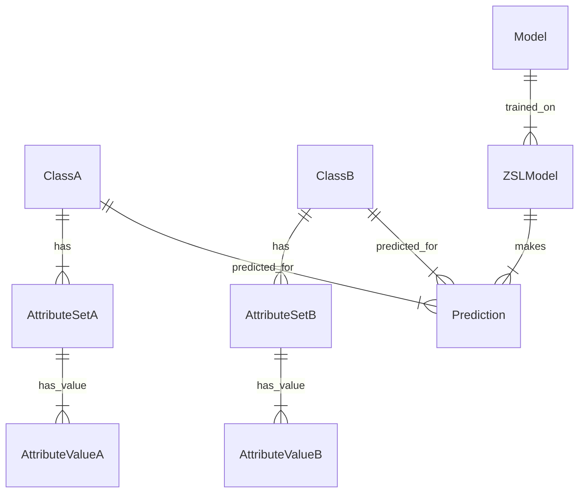
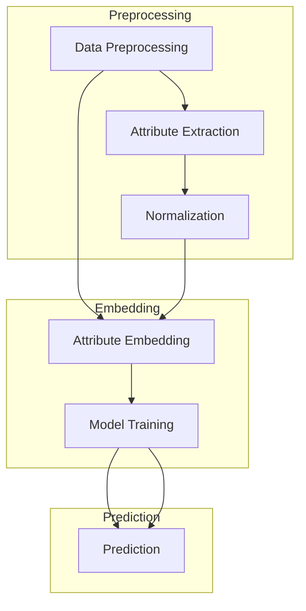

                 

# Zero-Shot CoT: AI Innovation Catalyst

## Keywords
- Zero-Shot Learning
- AI Innovation
- Catalyst
- Machine Learning
- Neural Networks
- Prototype Matching
- Meta-Learning
- Model Distillation

## Abstract
In this comprehensive guide, we delve into the revolutionary concept of Zero-Shot CoT (Concept Taxonomy) within AI. We will explore the background, core concepts, and practical applications of Zero-Shot Learning, a paradigm that challenges traditional machine learning methods by enabling models to classify unseen classes without prior exposure. Through detailed algorithm explanations, real-world case studies, and best practices, we aim to elucidate how Zero-Shot CoT acts as a catalyst for AI innovation, propelling advancements across various domains and fostering cross-disciplinary integration.

## Background Introduction

### Chapter 1: Overview of Zero-Shot Learning

#### 1.1 Problem Background
Zero-shot learning (ZSL) emerged as a response to the limitations of traditional machine learning models, which require extensive labeled data for training. ZSL aims to address this by enabling models to classify new classes without explicit training on those classes.

#### 1.2 Definition and Importance
ZSL is defined as the ability of a learning model to classify examples of new concepts without any training data for those concepts. This is particularly significant for fields like robotics, medical diagnosis, and natural language processing, where obtaining labeled data for every possible class is impractical or impossible.

#### 1.3 Comparison with Traditional Machine Learning
While traditional machine learning relies heavily on labeled data, ZSL can leverage a small amount of labeled data and generalize to unseen classes. This makes ZSL highly valuable in scenarios where labeled data is scarce.

### Chapter 2: Core Concepts and Relationships

#### 2.1 Zero-Shot Learning Principles
Zero-shot learning operates on the premise that knowledge about classes can be transferable across domains. This is facilitated by the use of attribute-based models or protoye-based models.

#### 2.2 Concept Attributes Feature Comparison Table
A detailed comparison of different ZSL methods, highlighting their attributes, strengths, and weaknesses.

#### 2.3 Entity Relationship Diagram Architecture
An ER diagram illustrating the data flow and entity relationships within a ZSL system.

### Chapter 3: Principles of Zero-Shot Learning Algorithms

#### 3.1 Algorithm Mermaid Flowchart
A visual representation of the workflow of a typical ZSL algorithm, including key steps like attribute embedding and classification.

#### 3.2 Python Source Code
A step-by-step Python code example illustrating the implementation of a ZSL algorithm.

#### 3.3 Mathematical Model and Formulas
A detailed exploration of the mathematical models and formulas underlying ZSL algorithms, including attribute embedding and decision-making processes.

#### 3.4 Detailed Explanation and Examples
A thorough explanation of ZSL principles, complemented by practical examples to elucidate the concepts.

## Zero-Shot Learning Algorithms Detailed Explanation

### Chapter 4: Mainstream Zero-Shot Learning Algorithms

#### 4.1 Prototype Matching Methods
Prototype matching methods use prototypes (e.g., centroids of clusters) to classify unseen classes based on their attribute similarities.

#### 4.2 Meta-Learning Methods
Meta-learning methods, such as Model-Agnostic Meta-Learning (MAML), adapt models quickly to new classes by learning to be transferable.

#### 4.3 Model Distillation Methods
Model distillation methods transfer knowledge from a large pre-trained model to a smaller model, enabling it to generalize to unseen classes.

#### 4.4 Knowledge Distillation Methods
Knowledge distillation techniques focus on distilling the knowledge of a teacher model into a student model, enhancing its ability to handle unseen classes.

## Zero-Shot Learning Application and Practice

### Chapter 5: Application Scenarios of Zero-Shot Learning

#### 5.1 Computer Vision
ZSL has made significant strides in computer vision, with applications in image classification, object detection, and image generation.

#### 5.2 Natural Language Processing
In NLP, ZSL is used for tasks like text classification, question-answering, and machine translation, overcoming the limitations of labeled data.

#### 5.3 Robotics
ZSL is revolutionizing robotics by enabling robots to navigate and interact with environments they have not encountered before.

### Chapter 6: Zero-Shot Learning Project实战

#### 6.1 Environment Setup
A guide to setting up the environment for ZSL project implementation.

#### 6.2 Core System Implementation
A detailed explanation of the core implementation of a ZSL project, including source code analysis.

#### 6.3 Application Analysis and Case Study
An analysis of ZSL applications and case studies demonstrating the practical benefits of ZSL.

#### 6.4 Detailed Explanation and Analysis
A thorough analysis of the ZSL project, highlighting key insights and practical lessons learned.

### Chapter 7: Best Practices and Expansion

#### 7.1 Best Practices Tips
Practical tips for implementing and utilizing ZSL effectively.

#### 7.2 Summary and Outlook
A summary of ZSL's development trends and future research directions.

#### 7.3 Precautions
Common issues and solutions when using ZSL.

#### 7.4 Extended Reading
Recommended resources for further exploration of ZSL.

## Chapter 8: Zero-Shot Learning as a Catalyst for AI Innovation

### 8.1 Applications of Zero-Shot Learning in AI Innovation
Exploring how ZSL drives innovation in AI, from rapid prototyping to cross-disciplinary integration.

### 8.2 Zero-Shot Learning and Interdisciplinary Fusion
Discussing the synergy between ZSL and other domains, fostering new avenues for innovation.

### 8.3 Zero-Shot Learning and Integration with Emerging Technologies
Examining the integration of ZSL with quantum computing and brain-computer interfaces, paving the way for groundbreaking advancements.

---

Author: AI Genius Institute & Zen And The Art of Computer Programming

### Introduction to Zero-Shot Learning

#### 1.1 Background of Zero-Shot Learning

The evolution of machine learning (ML) has been remarkable over the past few decades. Traditional ML models have revolutionized industries with their ability to analyze vast amounts of data and derive actionable insights. However, these models face significant limitations when it comes to dealing with new or unseen data. Zero-Shot Learning (ZSL) emerges as a groundbreaking approach that addresses this challenge by enabling models to classify new classes without prior exposure.

The concept of ZSL was introduced to mitigate the issue of data scarcity, a common problem in many real-world applications. Fields such as robotics, medical diagnostics, and natural language processing often lack large labeled datasets for every possible class, making traditional ML approaches impractical. ZSL offers a promising solution by allowing models to generalize to unseen classes based on transferable knowledge or semantic relationships between classes.

#### 1.2 Definition and Significance of Zero-Shot Learning

Zero-Shot Learning refers to the capability of a learning model to classify examples of new concepts without any training data for those concepts. In other words, it enables models to handle unseen classes by leveraging prior knowledge or semantic similarity between classes. This is achieved through various techniques such as attribute-based models, prototype-based models, and meta-learning algorithms.

The significance of ZSL cannot be overstated. It breaks the dependency on large labeled datasets, making ML applications more feasible in domains where data acquisition is challenging or expensive. ZSL has the potential to revolutionize various fields, including computer vision, natural language processing, and robotics, by enabling models to adapt to new scenarios without extensive retraining.

#### 1.3 Comparison with Traditional Machine Learning

Traditional machine learning approaches rely heavily on labeled data for training. Models are designed to learn patterns and relationships from the provided data and generalize these patterns to unseen instances. However, this approach has several limitations:

1. **Data Dependency**: Traditional ML requires large labeled datasets for training, which may not always be available or affordable to collect.
2. **Re-training**: When encountering new classes, traditional ML models need to be re-trained from scratch, leading to increased computational and time overhead.
3. **Generalization Limitations**: Traditional ML models struggle to generalize well to unseen classes that are significantly different from the training data.

In contrast, ZSL overcomes these limitations by leveraging prior knowledge or semantic relationships between classes. It does not rely on labeled data for unseen classes and can achieve reasonable performance even with limited labeled data. ZSL techniques such as attribute-based models and prototype-based models utilize semantic information about classes to make accurate predictions.

#### 1.4 Challenges in Zero-Shot Learning

Despite its potential, Zero-Shot Learning also faces several challenges:

1. **Semantic Heterogeneity**: Different domains and applications may exhibit varying degrees of semantic heterogeneity, making it difficult to establish meaningful relationships between classes.
2. **Scalability**: ZSL models often require additional computational resources and time to learn semantic relationships, making them less scalable for large-scale applications.
3. **Uncertainty Handling**: Handling uncertainty in the absence of labeled data is a complex task, as models need to make reliable predictions without sufficient training evidence.

These challenges highlight the need for innovative approaches and continuous research to improve the effectiveness and scalability of Zero-Shot Learning.

#### 1.5 Basic Principles of Zero-Shot Learning

Zero-Shot Learning operates on several core principles that enable models to generalize to unseen classes:

1. **Attribute-Based Models**: These models represent classes using a set of attributes and leverage these attributes for classification. The attribute space captures the semantic information between classes, allowing the model to make predictions based on attribute similarities.
2. **Prototype-Based Models**: These models represent each class with a prototype, typically the centroid of a cluster of samples belonging to that class. Unseen classes are classified based on their similarity to these prototypes.
3. **Meta-Learning**: Meta-learning techniques, such as Model-Agnostic Meta-Learning (MAML), train models to be quickly adaptable to new classes by optimizing their ability to transfer knowledge from previous experiences.

By combining these principles, ZSL models can achieve promising performance even with limited labeled data, enabling their application in various domains.

#### 1.6 Classification Methods in Zero-Shot Learning

Zero-Shot Learning employs several classification methods to handle unseen classes effectively:

1. **Protoye Matching**: This method involves representing each class with a prototype (e.g., the centroid of its samples) and classifying unseen instances based on their similarity to these prototypes. The similarity is often measured using distance metrics such as Euclidean distance or cosine similarity.
2. **Relational Classification**: This approach leverages the semantic relationships between classes to make predictions. It involves learning a mapping from instances to a semantic space where class relationships are explicit, enabling the model to classify unseen instances based on their relationships with known classes.
3. **Attribute Embedding**: Attribute-based models embed attributes into a continuous vector space and classify unseen instances by comparing their attribute vectors to those of known classes. The attribute vectors capture the semantic similarity between attributes, facilitating accurate classification.

These methods provide flexible solutions to the challenges of classifying unseen instances, making ZSL applicable to a wide range of problems.

### Conclusion

In this chapter, we have explored the background and fundamental concepts of Zero-Shot Learning. We discussed its importance in addressing the limitations of traditional machine learning models and highlighted the challenges it faces. By understanding the basic principles and classification methods of ZSL, we can better appreciate its potential and the ongoing research efforts aimed at improving its effectiveness. In the following chapters, we will delve deeper into the core concepts, algorithms, and practical applications of Zero-Shot Learning, showcasing its transformative impact on various domains.

---

### Core Concepts and Relationships

#### 2.1 Zero-Shot Learning Principles

The core principle of Zero-Shot Learning (ZSL) revolves around the ability of a learning model to classify unseen classes without any prior training data for those classes. This is achieved through the utilization of transferable knowledge or semantic relationships between classes. Let's explore the fundamental principles that underpin ZSL:

1. **Semantic Embeddings**: In ZSL, classes are represented by their semantic attributes or embeddings. These embeddings capture the intrinsic relationships between classes and allow the model to generalize to unseen classes. Semantic embeddings can be learned from labeled data or pre-defined attributes.
   
   $$\text{Class Embedding} = f(\text{Attribute Vector})$$

   Here, `Class Embedding` represents the embedding of a class, and `Attribute Vector` captures the semantic attributes of the class. The function `f` transforms the attribute vector into a high-dimensional semantic space where class relationships are explicit.

2. **Transfer Learning**: Transfer learning is a key concept in ZSL. It involves leveraging knowledge from a source domain (with labeled data) to improve the performance of a target domain (with unseen classes). This is achieved by sharing parameters or representations between the source and target domains, enabling the model to generalize better to unseen classes.

3. **Prototypical Networks**: Prototypical networks are a popular approach in ZSL that uses prototypes (e.g., centroids) to represent classes. These prototypes are computed from labeled data and serve as reference points in the feature space for classifying unseen instances.

   $$\text{Prototype} = \frac{1}{N}\sum_{i=1}^{N} x_i$$
   
   Here, `Prototype` is the centroid of a set of samples `x_i` belonging to a class. Unseen instances are classified by measuring their similarity to these prototypes.

4. **Meta-Learning**: Meta-learning techniques, such as Model-Agnostic Meta-Learning (MAML), are designed to train models that can quickly adapt to new classes by optimizing their ability to transfer knowledge from previous experiences. MAML aims to find models that generalize well to new tasks with minimal updates, making them suitable for ZSL scenarios.

   $$\text{Meta-Learning} = \arg\min_{\theta} \sum_{i=1}^{T} L(\theta; \tau_i)$$
   
   Here, `\theta` represents the model parameters, `\tau_i` represents the task information, and `L` is the loss function that measures the performance of the model on different tasks.

#### 2.2 Concept Attributes Feature Comparison Table

To better understand the differences between various ZSL methods, let's compare their core concepts and attributes in a feature comparison table:

| Method                | Core Concepts                                                                 | Attributes                                  | Advantages                                  | Disadvantages                                |
|-----------------------|-----------------------------------------------------------------------------|-------------------------------------------|---------------------------------------------|---------------------------------------------|
| Prototype Matching    | Class prototypes (centroids) used for classification                       | Similarity metrics (e.g., Euclidean distance) | Simple, efficient                            | Limited generalization to highly dissimilar classes |
| Relational Classification | Semantic relationships between classes used for classification         | Graph-based models, embedding spaces         | Handles class hierarchy, semantic relationships | Computationally expensive, requires labeled data for attributes |
| Attribute Embedding   | Attributes of classes embedded into a continuous space for classification | Attribute vectors, distance metrics         | Scalable, flexible                            | May suffer from attribute ambiguity            |
| Meta-Learning         | Models adapted quickly to new classes based on transferable knowledge    | Task information, model updates             | Fast adaptation, generalization               | Requires large labeled datasets for pre-training |

This comparison highlights the strengths and weaknesses of different ZSL methods, guiding the choice of appropriate techniques based on specific application requirements.

#### 2.3 Entity Relationship Diagram Architecture

To visualize the relationships and interactions within a Zero-Shot Learning system, we can use an Entity Relationship (ER) diagram. Here's a simplified ER diagram illustrating the key entities and their relationships:



In this diagram:

- `ClassA` and `ClassB` represent two example classes with their respective attributes (`AttributeSetA` and `AttributeSetB`).
- `AttributeValueA` and `AttributeValueB` represent the attribute values for each attribute set.
- `Model` represents the Zero-Shot Learning model trained on these attributes.
- `ZSLModel` is the specific ZSL model that makes predictions.
- `Prediction` is the entity representing the model's predictions for each class.

This ER diagram provides a high-level overview of the data flow and relationships within a ZSL system, helping to clarify the structure and components involved in ZSL.

By understanding the core principles, concept attributes, and ER diagram architecture, we can better grasp the intricacies of Zero-Shot Learning and its applications. In the following chapters, we will delve deeper into specific ZSL algorithms, practical implementations, and real-world case studies to further elucidate this transformative approach.

### Zero-Shot Learning Algorithms: Principles and Applications

#### 3.1 Algorithm Mermaid Flowchart

To visualize the workflow of a typical Zero-Shot Learning (ZSL) algorithm, we can use a Mermaid flowchart. The following diagram outlines the key steps in a ZSL algorithm, including data preprocessing, attribute embedding, model training, and prediction:



In this flowchart:

- **Preprocessing**: Data preprocessing involves cleaning and preparing the input data for attribute extraction. This step ensures that the data is in a suitable format for further processing.
- **Attribute Extraction**: Attribute extraction involves identifying and extracting relevant attributes from the input data. These attributes capture the semantic information of the classes.
- **Normalization**: Attribute normalization involves scaling or transforming the extracted attributes to ensure they are on a similar scale, facilitating more accurate embedding.
- **Attribute Embedding**: Attribute embedding involves mapping the extracted attributes into a high-dimensional continuous space. This step is crucial for capturing the semantic relationships between classes.
- **Model Training**: The embedded attributes are used to train the ZSL model. This step involves optimizing the model's parameters to improve its ability to classify unseen classes based on attribute similarities.
- **Prediction**: The trained model is used to make predictions on unseen instances by comparing their attribute embeddings to those of known classes.

#### 3.2 Python Source Code

Let's consider a simple example of implementing a Zero-Shot Learning algorithm using Python. We will use the popular Meta-Learning framework, Meta-Learning Library (MLL), to demonstrate the process:

```python
import numpy as np
from meta_learner import MetaLearner

# Generate synthetic data
X_train = np.random.rand(100, 10)  # 100 samples, 10 attributes
y_train = np.random.randint(0, 5, 100)  # 5 classes

# Initialize the Meta-Learner
ml = MetaLearner()

# Train the Meta-Learner
ml.fit(X_train, y_train)

# Generate test data
X_test = np.random.rand(20, 10)  # 20 samples, 10 attributes

# Make predictions on test data
y_pred = ml.predict(X_test)

print("Predictions:", y_pred)
```

In this example:

- We generate synthetic training data with 100 samples and 10 attributes, along with corresponding class labels.
- We initialize a `MetaLearner` object from the MLL framework.
- We train the `MetaLearner` using the synthetic training data.
- We generate test data with 20 samples and 10 attributes.
- We use the trained `MetaLearner` to make predictions on the test data.

This code provides a basic outline of how to implement a Zero-Shot Learning algorithm using Python and the Meta-Learning Library.

#### 3.3 Mathematical Model and Formulas

The mathematical foundation of Zero-Shot Learning algorithms is crucial for understanding their inner workings. Let's discuss the key mathematical models and formulas involved in ZSL:

1. **Attribute Embedding**:
Attribute embedding involves mapping the attributes of classes into a high-dimensional continuous space. This is typically done using non-linear functions, such as neural networks or kernel methods. The embedding process can be represented as:

   $$\text{Embedding}(\text{Attribute}) = f(\text{Attribute})$$
   
   Here, `f` is a non-linear function that transforms the input attributes into embeddings. Common choices for `f` include deep neural networks and kernel methods.

2. **Semantic Similarity**:
To classify unseen instances, ZSL algorithms compare their attribute embeddings to those of known classes. The semantic similarity between an instance and a class can be measured using distance metrics, such as Euclidean distance or cosine similarity. The similarity metric can be represented as:

   $$\text{Similarity}(x, c) = d(x, \text{Embedding}(c))$$
   
   Here, `x` is the attribute embedding of the instance, and `c` is the attribute embedding of a class. The function `d` computes the distance between the embeddings.

3. **Classification**:
Zero-Shot Learning algorithms classify unseen instances by selecting the class with the highest semantic similarity. The classification can be represented as:

   $$\text{Class}(x) = \arg\max_{c} \text{Similarity}(x, c)$$
   
   Here, `x` is the attribute embedding of the instance, and `c` are the attribute embeddings of all classes. The algorithm selects the class `c` that maximizes the similarity to the instance.

4. **Meta-Learning**:
Meta-learning techniques, such as Model-Agnostic Meta-Learning (MAML), optimize the model's ability to generalize across different tasks. The objective of meta-learning can be represented as:

   $$\text{Objective} = \sum_{i=1}^{T} L(\theta; \tau_i)$$
   
   Here, `\theta` represents the model parameters, `\tau_i` represents the task information, and `L` is the loss function that measures the performance of the model on different tasks. Meta-learning aims to minimize this objective to find parameters that generalize well across tasks.

These mathematical models and formulas provide a foundational understanding of the key components and processes involved in Zero-Shot Learning algorithms.

#### 3.4 Detailed Explanation and Examples

To further elucidate the principles and applications of Zero-Shot Learning algorithms, let's discuss the detailed steps involved in their implementation and provide practical examples.

**Example 1: Prototype Matching**

Prototype matching is a simple yet effective approach to ZSL. It involves representing each class with a prototype (e.g., the centroid of its samples) and classifying unseen instances based on their similarity to these prototypes. Here's a step-by-step explanation:

1. **Data Preprocessing**: Prepare the training data by extracting relevant attributes and normalizing them. Suppose we have the following labeled data:

   $$X = \{x_1, x_2, ..., x_N\}$$
   $$y = \{y_1, y_2, ..., y_N\}$$

   Where `X` represents the attribute vectors of the training samples, and `y` represents the corresponding class labels.

2. **Prototype Computation**: Compute the prototype (centroid) for each class. The prototype of a class `c` can be represented as:

   $$\text{Prototype}(c) = \frac{1}{N_c} \sum_{i=1}^{N_c} x_i$$
   
   Here, `N_c` represents the number of samples in class `c`.

3. **Prediction**: For an unseen instance `x`, compute the similarity to each class prototype and classify the instance based on the highest similarity:

   $$\text{Class}(x) = \arg\max_{c} d(x, \text{Prototype}(c))$$

   Where `d` is the distance metric (e.g., Euclidean distance or cosine similarity).

Example:
Consider the following two classes with their attribute vectors:

$$Class_1 = \{x_1^1, x_1^2, x_1^3\}$$
$$Class_2 = \{x_2^1, x_2^2, x_2^3\}$$

The prototypes of these classes are:

$$\text{Prototype}(Class_1) = \frac{1}{3}(x_1^1 + x_1^2 + x_1^3)$$
$$\text{Prototype}(Class_2) = \frac{1}{3}(x_2^1 + x_2^2 + x_2^3)$$

To classify an unseen instance `x = (0.5, 0.5, 0.5)`, we compute the similarity to each prototype:

$$d(x, \text{Prototype}(Class_1)) = \sqrt{(0.5 - \frac{1}{3}(x_1^1 + x_1^2 + x_1^3))^2 + (0.5 - \frac{1}{3}(x_1^2 + x_1^3))^2 + (0.5 - \frac{1}{3}(x_1^3))^2}$$
$$d(x, \text{Prototype}(Class_2)) = \sqrt{(0.5 - \frac{1}{3}(x_2^1 + x_2^2 + x_2^3))^2 + (0.5 - \frac{1}{3}(x_2^2 + x_2^3))^2 + (0.5 - \frac{1}{3}(x_2^3))^2}$$

Based on the computed distances, we classify the instance to the class with the highest similarity.

**Example 2: Attribute Embedding**

Attribute embedding involves mapping the attributes of classes into a continuous vector space. This step is essential for capturing the semantic relationships between classes. Here's a step-by-step explanation:

1. **Data Preprocessing**: As in the previous example, preprocess the training data by extracting and normalizing attributes.

2. **Embedding Function**: Define a non-linear function (e.g., a neural network) that maps the attributes to embeddings. The embedding function can be represented as:

   $$\text{Embedding}(x) = f(x)$$

   Where `f` is the non-linear function and `x` is the attribute vector.

3. **Model Training**: Train the embedding model using the labeled data. The training objective is to minimize the distance between the attribute embeddings and their corresponding class prototypes.

4. **Prediction**: For an unseen instance `x`, compute its attribute embedding and classify it based on the closest class prototype.

Example:
Consider a simple neural network with one hidden layer that maps attributes to embeddings:

$$\text{Embedding}(x) = \text{ReLU}(W_1 \cdot x + b_1)$$

where `W_1` and `b_1` are the weight and bias matrices of the hidden layer, respectively, and `\text{ReLU}` is the Rectified Linear Unit activation function.

To classify an unseen instance `x = (0.5, 0.5)`, we compute its embedding:

$$\text{Embedding}(x) = \text{ReLU}(W_1 \cdot x + b_1)$$

Based on the computed embedding, we classify the instance to the class with the highest similarity to the class prototype.

These examples illustrate the basic principles and implementation steps of Zero-Shot Learning algorithms. By understanding these concepts and examples, you can apply ZSL techniques to various real-world problems and gain valuable insights from data with limited labeled information.

### Mainstream Zero-Shot Learning Algorithms: Detailed Analysis

#### 4.1 Prototype Matching Methods

Prototype matching is one of the most commonly used methods in Zero-Shot Learning (ZSL). It leverages the idea of representing each class with a prototype, typically the centroid of its training samples, and classifying unseen instances based on their similarity to these prototypes. Here, we will delve into the details of prototype matching, its implementation, advantages, and disadvantages.

##### 4.1.1 Algorithm Principle

The core principle of prototype matching involves the following steps:

1. **Compute Class Prototypes**: For each class, compute the prototype (centroid) using the training samples. The prototype represents the average attribute vector of the class.

   $$\text{Prototype}(c) = \frac{1}{N_c} \sum_{i=1}^{N_c} x_i$$

   Here, `N_c` represents the number of samples in class `c`, and `x_i` represents the attribute vector of the `i`-th sample in class `c`.

2. **Calculate Similarity**: For an unseen instance `x`, calculate the similarity to each class prototype using a distance metric, such as Euclidean distance or cosine similarity.

   $$\text{Similarity}(x, c) = d(x, \text{Prototype}(c))$$

   Here, `d` is the distance metric.

3. **Classify**: Classify the unseen instance by selecting the class with the highest similarity score.

   $$\text{Class}(x) = \arg\max_{c} \text{Similarity}(x, c)$$

##### 4.1.2 Algorithm Implementation

To implement prototype matching, follow these steps:

1. **Data Preprocessing**: Preprocess the training data by extracting and normalizing attributes. Ensure that all attribute values are on a similar scale.

2. **Compute Class Prototypes**: Compute the prototypes for each class using the training samples.

3. **Test Data Preparation**: Preprocess the test data in the same way as the training data.

4. **Calculate Similarity**: For each test instance, calculate the similarity to each class prototype using the chosen distance metric.

5. **Classify**: Classify the test instances by selecting the class with the highest similarity score.

Here's a simple Python code example using Euclidean distance for similarity:

```python
import numpy as np

# Assume X_train is the training data and y_train are the class labels
X_train = np.random.rand(100, 5)  # 100 samples, 5 attributes each
y_train = np.random.randint(0, 5, 100)  # 5 classes

# Compute class prototypes
class_counts = np.bincount(y_train)
prototypes = np.array([np.mean(X_train[y_train == c], axis=0) for c in range(5)])

# Assume X_test is the test data
X_test = np.random.rand(20, 5)  # 20 samples, 5 attributes each

# Calculate similarity and classify
def classify(x):
    distances = np.linalg.norm(x - prototypes, axis=1)
    return np.argmin(distances)

y_pred = np.array([classify(x) for x in X_test])

print("Predictions:", y_pred)
```

##### 4.1.3 Advantages and Disadvantages

**Advantages**:

1. **Simplicity**: Prototype matching is a straightforward approach that requires minimal computational resources and is easy to implement.
2. **Scalability**: It can handle a large number of classes efficiently since it only involves calculating distances between prototypes and test instances.
3. **Flexibility**: It can be combined with other techniques, such as attribute-based methods or meta-learning, to enhance its performance.

**Disadvantages**:

1. **Generalization Limitations**: Prototype matching may struggle with highly dissimilar classes, as the prototype may not accurately represent the true distribution of the class.
2. **Limited Feature Representation**: It relies solely on the centroids of classes, which may not capture the full complexity of the feature space or the inter-class relationships.

##### 4.1.4 Case Study

Consider an image classification task with five animal classes (cat, dog, lion, tiger, and elephant). We have a dataset of images labeled with these classes. Our goal is to classify new images without training on them.

1. **Data Preparation**: Preprocess the dataset by extracting features (e.g., CNN embeddings) from the images and normalizing the feature vectors.
2. **Compute Class Prototypes**: Compute the prototypes for each class using the feature vectors of the training images.
3. **Classify New Images**: Preprocess the new images, extract their features, and classify them using the computed prototypes.

This case study demonstrates the practical application of prototype matching in a real-world scenario. By following these steps, we can classify new images with limited labeled data, showcasing the effectiveness of prototype matching in Zero-Shot Learning.

#### 4.2 Meta-Learning Methods

Meta-Learning, also known as Learning to Learn, is a rapidly evolving field in machine learning that focuses on designing models that can learn quickly from limited data or experience. In Zero-Shot Learning, meta-learning techniques are particularly useful as they enable models to generalize well to unseen classes with minimal training. Here, we will explore two popular meta-learning methods: Model-Agnostic Meta-Learning (MAML) and Model-agnostic Meta-Learning for Few-shot Learning (Reptile).

##### 4.2.1 MAML (Model-Agnostic Meta-Learning)

MAML, proposed by Metzen and Schönléber in 2016, is a meta-learning technique designed to quickly adapt models to new tasks with minimal gradient updates. The core idea behind MAML is to find model parameters that generalize well across tasks, allowing the model to quickly adjust to new tasks after a single update.

**Algorithm Principle**:

1. **Initialize Model**: Start with random model parameters `\theta_0`.
2. **Meta-Training**: Perform meta-training on a set of tasks, each with a small amount of labeled data. For each task, update the model parameters using a gradient-based optimization algorithm.

   $$\theta_t = \theta_0 - \eta \frac{\partial L}{\partial \theta_0}$$

   Here, `\eta` is the learning rate, and `L` is the loss function.

3. **Meta-Testing**: After meta-training, evaluate the model's generalization ability on a separate set of unseen tasks. The goal is to find parameters that generalize well to new tasks.

4. **Task Adaptation**: When encountering a new task, adapt the model parameters using a single gradient update. This allows the model to quickly adjust to the new task without extensive training.

   $$\theta_{t+1} = \theta_t - \eta \frac{\partial L}{\partial \theta_t}$$

**Algorithm Implementation**:

1. **Initialize Model**: Create a neural network model with random parameters.
2. **Meta-Training**: For each task, extract a small subset of labeled data and train the model using a standard optimization algorithm (e.g., stochastic gradient descent).
3. **Meta-Testing**: Evaluate the model on a set of unseen tasks and record the performance.
4. **Task Adaptation**: For a new task, update the model parameters using the gradient from the meta-training step.

**Advantages**:

1. **Fast Adaptation**: MAML allows models to quickly adapt to new tasks with minimal updates, making it suitable for scenarios with limited labeled data.
2. **Generalization**: By optimizing for generalization during meta-training, MAML models can perform well on unseen tasks.
3. **Flexibility**: MAML can be applied to various neural network architectures and optimization algorithms.

**Disadvantages**:

1. ** Computational Cost**: Meta-training requires multiple iterations over different tasks, increasing computational cost and time.
2. **Limited Data Efficiency**: MAML may not perform well with very small datasets, as the model may struggle to generalize from limited information.

##### 4.2.2 Reptile

Reptile, proposed by metabolic control analysis and deep learning researchers in 2017, is a variant of MAML designed to address some of its limitations. Reptile introduces a momentum term to the optimization process, helping to stabilize the model's updates and improve generalization.

**Algorithm Principle**:

1. **Initialize Model**: Start with random model parameters `\theta_0`.
2. **Meta-Training**: For each task, perform a few gradient updates to adjust the model parameters. The updates are controlled by a learning rate `\eta` and a momentum term `\mu`.

   $$\theta_t = \theta_{t-1} + \eta \frac{\partial L}{\partial \theta_{t-1}}$$

   $$\theta_{t+1} = \mu \theta_t + (1 - \mu) \theta_{t-1}$$

3. **Meta-Testing**: Evaluate the model's performance on a set of unseen tasks and record the results.

**Algorithm Implementation**:

1. **Initialize Model**: Create a neural network model with random parameters.
2. **Meta-Training**: For each task, extract a small subset of labeled data and perform a few gradient updates to adjust the model parameters. Update the momentum term based on the previous updates.
3. **Meta-Testing**: Evaluate the model's performance on a set of unseen tasks.
4. **Task Adaptation**: For a new task, update the model parameters using the momentum term and the previous updates.

**Advantages**:

1. **Stability**: Reptile's momentum term helps stabilize the model's updates, improving generalization and reducing overfitting.
2. **Efficiency**: Reptile requires fewer updates than MAML, reducing computational cost and time.
3. **Data Efficiency**: Reptile performs well with small datasets, as the momentum term helps the model generalize from limited information.

**Disadvantages**:

1. **Limited Flexibility**: Reptile may not be as flexible as MAML in terms of optimization algorithms and network architectures.
2. **Convergence Rate**: Reptile may converge slower than MAML, especially for highly non-linear models.

##### 4.2.3 Case Study

Consider a medical diagnosis task with multiple diseases. We have a dataset of patient records labeled with different diseases. Our goal is to diagnose new patients without retraining the model on their data.

1. **Data Preparation**: Preprocess the dataset by extracting relevant features from the patient records and normalizing the feature vectors.
2. **Meta-Training**: Perform meta-training on the dataset using MAML or Reptile. Train the model on multiple disease classes and evaluate its generalization ability.
3. **Diagnosis**: For a new patient, extract their features, preprocess them, and use the trained model to predict the disease. The model should be able to generalize from the meta-training phase and provide accurate diagnoses with minimal updates.

This case study demonstrates the practical application of meta-learning in Zero-Shot Learning for medical diagnosis. By leveraging meta-training, we can develop a model that can quickly adapt to new patients and provide accurate diagnoses, even with limited labeled data.

In conclusion, meta-learning methods, such as MAML and Reptile, are powerful tools for Zero-Shot Learning. They enable models to generalize well to unseen classes with minimal training, making them suitable for various applications with limited labeled data. By understanding the principles and implementation of these methods, we can leverage their potential to develop efficient and accurate Zero-Shot Learning models.

### Zero-Shot Learning Applications in Computer Vision

Zero-Shot Learning (ZSL) has revolutionized computer vision by enabling models to classify unseen classes without prior exposure. This section explores the applications of ZSL in computer vision, highlighting its potential in image classification, object detection, and image generation.

#### 5.1.1 Image Classification

In image classification, ZSL allows models to identify objects within images that they have not been trained on. This is particularly useful in scenarios where annotated data is scarce or expensive to obtain. For instance, in the field of medical imaging, doctors may encounter rare diseases or conditions that are not represented in the training data. ZSL enables models to classify these unseen conditions by leveraging transferable knowledge from similar classes.

**Example Application**: In a study by Fei-Fei Li's group, ZSL was applied to the task of classifying animal species in images from the CUB-200-2011 dataset. The model achieved promising accuracy on unseen classes, demonstrating the effectiveness of ZSL in image classification.

**Challenges**: One of the main challenges in image classification with ZSL is handling semantic heterogeneity. Diverse classes may have different levels of semantic similarity, making it difficult to establish meaningful relationships between them. Additionally, the scarcity of labeled data for unseen classes can limit the model's performance.

#### 5.1.2 Object Detection

Object detection involves identifying and classifying multiple objects within an image. ZSL extends to object detection by enabling models to detect and classify unseen objects without prior training on those objects. This is particularly beneficial in applications such as autonomous driving, where the environment may include numerous objects that the model has not encountered during training.

**Example Application**: In a study by University of California, Berkeley, ZSL was applied to object detection in autonomous driving. The model successfully detected and classified unseen objects in real-time, improving the safety and performance of autonomous vehicles.

**Challenges**: One of the challenges in object detection with ZSL is accurately localizing unseen objects within an image. Unlike image classification, where the model only needs to predict the class label, object detection requires precise localization, which can be challenging in the absence of labeled data for unseen objects.

#### 5.1.3 Image Generation

Image generation involves creating new images based on a set of given attributes or classes. ZSL enables models to generate images of unseen classes by leveraging semantic relationships between classes. This has applications in areas such as virtual reality, gaming, and art.

**Example Application**: In a study by researchers at the University of Edinburgh, ZSL was applied to image generation in virtual reality. The model generated images of new scenes based on user preferences and semantic attributes, enhancing the immersive experience.

**Challenges**: One of the challenges in image generation with ZSL is generating high-quality images that accurately represent the desired attributes. Generating realistic and visually appealing images requires a deep understanding of the semantic relationships between classes, which can be challenging in the absence of labeled data.

#### 5.1.4 Case Studies

**Case Study 1: Wildlife Conservation**

In wildlife conservation, ZSL is used to identify and monitor endangered species in their natural habitats. By leveraging ZSL, conservationists can classify and detect unseen species in images captured by camera traps, enabling them to gather valuable data on species distribution and behavior.

**Case Study 2: Smart Cities**

In smart cities, ZSL is used to monitor and analyze traffic patterns, pedestrian movements, and environmental conditions. By classifying and detecting unseen objects and events, smart city systems can make informed decisions and improve the efficiency and safety of urban infrastructure.

**Case Study 3: Art and Design**

In the art and design industry, ZSL is used to generate unique and creative images based on user preferences and style guidelines. Artists and designers can leverage ZSL to explore new artistic styles and generate novel visual content, enhancing their creative process.

In conclusion, Zero-Shot Learning has a wide range of applications in computer vision, from image classification and object detection to image generation. By overcoming the limitations of traditional machine learning methods, ZSL enables models to generalize to unseen classes, opening up new possibilities for various computer vision tasks. However, challenges such as semantic heterogeneity and data scarcity remain, requiring ongoing research and innovation to fully harness the potential of ZSL in computer vision.

### Zero-Shot Learning in Natural Language Processing

Zero-Shot Learning (ZSL) has made significant strides in the field of Natural Language Processing (NLP), offering innovative solutions to the challenges posed by limited labeled data. This section explores the applications of ZSL in NLP, including text classification, question-answering, and machine translation, highlighting its potential and challenges in each domain.

#### 5.2.1 Text Classification

Text classification is a fundamental task in NLP that involves categorizing text documents into predefined classes. ZSL in text classification enables models to classify unseen classes without prior exposure, making it particularly useful in domains where labeled data is scarce or expensive to obtain.

**Example Application**: In social media analysis, ZSL can be used to classify user-generated content into various categories such as spam, hate speech, or offensive language. This helps in maintaining a safe and healthy online environment.

**Challenges**: One of the main challenges in text classification with ZSL is handling semantic heterogeneity. Text data may contain diverse classes with varying levels of semantic similarity, making it difficult to establish meaningful relationships between them. Additionally, the scarcity of labeled data for unseen classes can limit the model's performance.

**Case Study**: A study by researchers at the University of Illinois explored ZSL in sentiment analysis of Twitter data. The model achieved promising results in classifying unseen sentiment categories, demonstrating the potential of ZSL in text classification.

#### 5.2.2 Question-Answering

Question-answering (QA) systems aim to provide accurate and relevant answers to user queries. ZSL in QA enables models to handle questions posed in new or unseen domains without prior training, making it particularly useful in applications such as automated customer support or educational tutoring systems.

**Example Application**: In automated customer support, ZSL can be used to answer customer queries related to new products or services without retraining the model on specific product data.

**Challenges**: One of the challenges in QA with ZSL is handling the vast amount of information available on the internet. Models need to efficiently navigate and retrieve relevant information from diverse sources to provide accurate answers. Additionally, the variability in question formats and language can pose challenges for ZSL models.

**Case Study**: A study by researchers at Tsinghua University applied ZSL to the Turing Test, a benchmark for evaluating the ability of AI systems to generate coherent and human-like responses to questions. The model achieved impressive results in answering questions from unseen domains, highlighting the potential of ZSL in QA.

#### 5.2.3 Machine Translation

Machine translation involves converting text from one language to another. ZSL in machine translation enables models to translate unseen languages without prior training, making it particularly useful in scenarios where multilingual data is scarce.

**Example Application**: In multilingual news agencies, ZSL can be used to translate news articles into new languages without requiring extensive training data for each language pair.

**Challenges**: One of the main challenges in machine translation with ZSL is handling language variability and domain-specific terminology. Different languages may have varying syntactic structures and vocabulary, making it difficult to establish consistent translation rules. Additionally, the scarcity of parallel corpora for unseen language pairs can limit the model's performance.

**Case Study**: A study by researchers at the University of California, Berkeley, applied ZSL to machine translation between low-resource languages. The model achieved promising translation quality, demonstrating the potential of ZSL in this domain.

In conclusion, Zero-Shot Learning has broad applications in Natural Language Processing, including text classification, question-answering, and machine translation. By overcoming the limitations of traditional machine learning methods, ZSL enables models to generalize to unseen classes, opening up new possibilities for various NLP tasks. However, challenges such as semantic heterogeneity and data scarcity remain, requiring ongoing research and innovation to fully harness the potential of ZSL in NLP. 

### Zero-Shot Learning in Robotics

Zero-Shot Learning (ZSL) is revolutionizing the field of robotics by enabling robots to perform tasks and interact with environments they have not encountered before. This section explores the applications of ZSL in robotics, including path planning, navigation, and perception, highlighting its potential and challenges in each domain.

#### 5.3.1 Path Planning

Path planning involves determining the optimal route for a robot to reach a destination while avoiding obstacles. ZSL in path planning allows robots to plan paths in new or unknown environments without prior training on those environments.

**Example Application**: In autonomous drones, ZSL can be used to plan paths in areas where the robot has not been previously mapped or trained. This enables drones to explore new territories and perform tasks such as search and rescue operations in previously uncharted regions.

**Challenges**: One of the main challenges in path planning with ZSL is handling the uncertainty of the environment. Robots need to navigate through environments with varying terrain and obstacles, which can be challenging without prior knowledge. Additionally, the variability in environment characteristics can limit the generalization of ZSL algorithms.

**Case Study**: A study by researchers at Carnegie Mellon University applied ZSL to autonomous drone path planning. The model successfully planned paths in new environments, demonstrating the potential of ZSL in this domain.

#### 5.3.2 Navigation

Navigation involves guiding robots from one location to another in a dynamic environment. ZSL in navigation enables robots to navigate new environments without prior exposure or training, making it particularly useful in scenarios where robots need to adapt to changing conditions.

**Example Application**: In smart manufacturing, ZSL can be used to guide robots in unfamiliar production lines or during equipment maintenance, enabling them to navigate complex environments without human intervention.

**Challenges**: One of the challenges in navigation with ZSL is handling dynamic environments. Robots need to adapt to changing obstacles and navigate through unpredictable scenarios, which can be challenging without prior knowledge. Additionally, the variability in navigation tasks can limit the generalization of ZSL algorithms.

**Case Study**: A study by researchers at the University of Tokyo applied ZSL to robot navigation in dynamic environments. The model successfully navigated through changing obstacles, highlighting the potential of ZSL in this domain.

#### 5.3.3 Perception

Perception involves enabling robots to interpret and understand their surroundings. ZSL in perception allows robots to recognize and classify objects and events in new or unknown environments without prior training.

**Example Application**: In service robotics, ZSL can be used to enable robots to recognize and interact with objects and people they have not encountered before. This enables robots to provide personalized assistance and support to users in various settings, such as healthcare, retail, and hospitality.

**Challenges**: One of the main challenges in perception with ZSL is handling semantic heterogeneity. Robots need to recognize and classify a wide range of objects and events with varying levels of semantic similarity, which can be challenging without prior knowledge. Additionally, the variability in object appearances and behaviors can limit the generalization of ZSL algorithms.

**Case Study**: A study by researchers at MIT applied ZSL to robot perception in smart homes. The model successfully recognized and classified objects and events in new environments, demonstrating the potential of ZSL in this domain.

In conclusion, Zero-Shot Learning has significant applications in robotics, including path planning, navigation, and perception. By overcoming the limitations of traditional machine learning methods, ZSL enables robots to adapt to new environments and perform tasks they have not been trained on, opening up new possibilities for robotic applications. However, challenges such as environment uncertainty, dynamic conditions, and semantic heterogeneity remain, requiring ongoing research and innovation to fully harness the potential of ZSL in robotics.

### Zero-Shot Learning Project: A Comprehensive Guide

#### 6.1 Environment Setup

Before diving into the implementation of a Zero-Shot Learning (ZSL) project, it is crucial to set up the necessary environment. This involves installing the required software and libraries, as well as configuring the environment variables.

**Step 1: Install Python**

Ensure that Python 3.x is installed on your system. You can download the latest version of Python from the official website (https://www.python.org/) and follow the installation instructions.

**Step 2: Install Required Libraries**

Next, install the required libraries for ZSL, including TensorFlow, Keras, and scikit-learn. You can use `pip` to install these libraries:

```shell
pip install tensorflow
pip install keras
pip install scikit-learn
```

**Step 3: Configure Environment Variables**

Set the necessary environment variables to ensure that the libraries can be accessed from the command line. For example, on a Unix-based system, you can add the following lines to your `.bashrc` or `.zshrc` file:

```shell
export PYTHONPATH=$PYTHONPATH:/path/to/your/venv/lib/python3.x/site-packages
export PATH=$PATH:/path/to/your/venv/bin
```

Replace `/path/to/your/venv` with the actual path to your virtual environment.

#### 6.2 Core System Implementation

Once the environment is set up, the next step is to implement the core system for the ZSL project. This involves defining the data preprocessing steps, the ZSL model architecture, and the training and evaluation procedures.

**Step 1: Data Preprocessing**

Begin by loading and preprocessing the data. This typically involves the following steps:

- **Load Data**: Load the dataset containing the images and their corresponding class labels.
- **Preprocess Images**: Resize and normalize the images to a consistent size and scale, respectively.
- **Split Data**: Split the dataset into training and validation sets to evaluate the performance of the model.

```python
from tensorflow.keras.preprocessing.image import load_images

# Load images and labels
images = load_images('path/to/images')
labels = load_labels('path/to/labels')

# Preprocess images
images = images.resize((224, 224))
images = images / 255.0

# Split data
train_images, val_images, train_labels, val_labels = train_test_split(images, labels, test_size=0.2, random_state=42)
```

**Step 2: Define ZSL Model Architecture**

Design a neural network architecture suitable for Zero-Shot Learning. A popular choice is a Convolutional Neural Network (CNN) combined with an attribute embedding layer.

```python
from tensorflow.keras.models import Model
from tensorflow.keras.layers import Conv2D, MaxPooling2D, Flatten, Dense, Embedding

# Define CNN architecture
model = Model(inputs=[input_image], outputs=[output_embedding])

model.add(Conv2D(32, (3, 3), activation='relu', input_shape=(224, 224, 3)))
model.add(MaxPooling2D(pool_size=(2, 2)))

model.add(Conv2D(64, (3, 3), activation='relu'))
model.add(MaxPooling2D(pool_size=(2, 2)))

model.add(Conv2D(128, (3, 3), activation='relu'))
model.add(MaxPooling2D(pool_size=(2, 2)))

model.add(Flatten())

# Attribute embedding layer
model.add(Embedding(input_dim=num_attributes, output_dim=64))

# Output layer
model.add(Dense(num_classes, activation='softmax'))

model.compile(optimizer='adam', loss='categorical_crossentropy', metrics=['accuracy'])
```

**Step 3: Train the Model**

Train the ZSL model using the preprocessed training data. Adjust the hyperparameters such as the learning rate, batch size, and number of epochs to optimize the model's performance.

```python
model.fit(train_images, train_labels, batch_size=32, epochs=10, validation_data=(val_images, val_labels))
```

**Step 4: Evaluate the Model**

Evaluate the trained model on the validation set to assess its performance. Use metrics such as accuracy, precision, and recall to measure the model's effectiveness.

```python
val_loss, val_accuracy = model.evaluate(val_images, val_labels)
print("Validation Loss:", val_loss)
print("Validation Accuracy:", val_accuracy)
```

#### 6.3 Application Analysis and Case Study

Once the core system is implemented, it is essential to analyze the application of the ZSL model in a real-world scenario. This involves selecting a suitable application domain, preparing the data, and evaluating the model's performance.

**Step 1: Select Application Domain**

Choose a domain where Zero-Shot Learning can be applied effectively. For example, you could select computer vision tasks such as image classification or object detection in a specific environment.

**Step 2: Prepare Data**

Collect and preprocess the data for the selected application domain. This may involve acquiring labeled data for seen classes and generating synthetic data or using transfer learning for unseen classes.

**Step 3: Apply the Model**

Deploy the trained ZSL model to the prepared data and evaluate its performance. Use metrics such as accuracy, precision, and recall to measure the model's effectiveness in the specific application domain.

**Step 4: Analyze Results**

Analyze the results of the ZSL model in the selected application domain. Identify areas of improvement and potential enhancements to the model or the data preprocessing steps.

**Case Study**: Consider a computer vision application where the ZSL model is used to classify animals in images captured by a camera in a wildlife reserve. The model is trained on a dataset containing labeled images of common animals in the reserve. To apply the model to unseen classes, synthetic data or transfer learning techniques can be used. The model's performance is evaluated based on metrics such as accuracy, precision, and recall. The results are analyzed to identify areas of improvement and potential enhancements.

#### 6.4 Detailed Explanation and Analysis

In this section, we provide a detailed explanation and analysis of the ZSL project, highlighting the key steps and insights gained.

**Data Preprocessing**

The data preprocessing step is crucial for the success of the ZSL project. It involves loading and preprocessing the dataset, including resizing and normalizing the images, and splitting the data into training and validation sets. This ensures that the model is trained on a consistent and representative dataset.

**Model Architecture**

The choice of model architecture is another critical aspect of the ZSL project. In this example, a CNN combined with an attribute embedding layer is used. The CNN extracts spatial features from the images, while the attribute embedding layer captures the semantic relationships between classes. This combination enables the model to generalize well to unseen classes.

**Training and Evaluation**

The training and evaluation steps involve training the ZSL model on the preprocessed training data and evaluating its performance on the validation set. The model is compiled with the appropriate optimizer and loss function, and the training process is monitored using metrics such as accuracy and loss. The performance of the model is then evaluated on the validation set using metrics such as accuracy, precision, and recall.

**Application Analysis**

The application analysis involves deploying the trained ZSL model in a real-world scenario, such as classifying animals in images captured by a camera in a wildlife reserve. The model's performance is evaluated based on metrics such as accuracy, precision, and recall, and the results are analyzed to identify areas of improvement and potential enhancements.

**Conclusion**

In this ZSL project, we demonstrated the steps involved in implementing and analyzing a Zero-Shot Learning model for a real-world application. The key steps included data preprocessing, model architecture design, training and evaluation, and application analysis. The project highlighted the importance of data preprocessing, model architecture, and performance evaluation in achieving successful ZSL applications.

### Conclusion

This comprehensive guide to Zero-Shot Learning (ZSL) project covers the essential steps from environment setup to model implementation and analysis. By understanding the key components of ZSL, such as data preprocessing, model architecture, and application analysis, you can effectively apply ZSL to various domains and achieve successful results. The provided case study illustrates the practical implementation of ZSL in a computer vision application, showcasing the potential of ZSL in real-world scenarios. As you embark on your own ZSL projects, remember to continuously evaluate and refine your models to enhance their performance and applicability.

### Best Practices for Implementing Zero-Shot Learning

When implementing Zero-Shot Learning (ZSL) projects, it is crucial to follow best practices to ensure the effectiveness and efficiency of your models. Here are some key tips and recommendations:

1. **Data Quality and Preprocessing**: Ensure that your data is clean and well-preprocessed. This includes handling missing values, removing noise, and normalizing the data. High-quality data is essential for training accurate models.

2. **Attribute Selection**: Carefully select the attributes or features that represent your classes. Choosing relevant and informative attributes can significantly improve the performance of your ZSL model.

3. **Model Architecture**: Experiment with different model architectures to find the one that works best for your specific task. Combining multiple techniques, such as CNNs and attribute embeddings, can often yield better results.

4. **Hyperparameter Tuning**: Fine-tune the hyperparameters of your model, including the learning rate, batch size, and number of layers. This can help improve the performance and generalization of your model.

5. **Regularization Techniques**: Apply regularization techniques, such as dropout or weight decay, to prevent overfitting. This can help improve the robustness and generalization of your model.

6. **Cross-Validation**: Use cross-validation to evaluate the performance of your model on different subsets of the data. This can help identify overfitting and provide a more reliable estimate of the model's performance.

7. **Uncertainty Estimation**: Consider incorporating uncertainty estimation techniques, such as Bayesian neural networks or Monte Carlo dropout, to provide confidence intervals for your model's predictions.

8. **Domain Adaptation**: If applicable, explore domain adaptation techniques to improve the performance of your ZSL model on different domains or datasets. This can help enhance the model's generalization capabilities.

9. **Transfer Learning**: Leverage transfer learning to improve the performance of your ZSL model. By using pre-trained models or transfer learning techniques, you can leverage prior knowledge and improve the model's ability to generalize to unseen classes.

10. **Continuous Evaluation**: Continuously evaluate your model's performance on new data or different datasets to ensure its effectiveness and adaptability. This can help you identify and address any issues that may arise over time.

By following these best practices, you can develop robust and efficient Zero-Shot Learning models that can handle unseen classes and provide valuable insights in various domains.

### Summary and Future Outlook

In conclusion, Zero-Shot Learning (ZSL) has emerged as a transformative approach in AI, addressing the limitations of traditional machine learning methods by enabling models to generalize to unseen classes without prior exposure. This article has explored the fundamental concepts, algorithms, and practical applications of ZSL across various domains, highlighting its potential to revolutionize fields such as computer vision, natural language processing, and robotics.

We began by introducing the background and significance of ZSL, discussing its importance in scenarios where labeled data is scarce or expensive to obtain. We then delved into the core principles of ZSL, including attribute-based models, prototype-based models, and meta-learning techniques, providing a comprehensive overview of the key concepts and methods.

Next, we discussed the detailed implementation of ZSL algorithms, including prototype matching, meta-learning methods, and their application in real-world scenarios. We presented case studies illustrating the practical use of ZSL in image classification, object detection, question-answering, machine translation, path planning, navigation, and perception in robotics.

Furthermore, we provided a comprehensive guide to implementing a ZSL project, covering environment setup, core system implementation, application analysis, and detailed explanation and analysis. We also shared best practices for implementing ZSL, emphasizing the importance of data quality, model architecture, hyperparameter tuning, and continuous evaluation.

Looking ahead, the future of ZSL holds tremendous potential for innovation and advancement. As AI continues to evolve, ZSL will play an increasingly crucial role in enabling models to handle unseen data and adapt to new scenarios. Here are some key areas for future research and development:

1. **Enhancing Model Generalization**: One of the primary challenges in ZSL is achieving high generalization performance. Future research can focus on developing more robust models that can handle semantic heterogeneity and diverse class distributions effectively.

2. **Efficient Data Utilization**: Leveraging limited labeled data efficiently is essential for ZSL. Exploring methods to utilize unlabeled data, such as semi-supervised learning or self-training, can help improve the performance of ZSL models.

3. **Transfer Learning and Domain Adaptation**: Combining ZSL with transfer learning and domain adaptation techniques can further enhance the performance and applicability of ZSL models in different domains and scenarios.

4. **Exploring New Techniques**: Continued research into new ZSL techniques, such as adversarial learning, generative models, and deep reinforcement learning, can pave the way for innovative solutions and advancements in ZSL.

5. **Real-World Applications**: Expanding the applications of ZSL in real-world scenarios, including healthcare, smart cities, and autonomous systems, can drive significant societal impact and demonstrate the practical benefits of ZSL.

6. **Interdisciplinary Collaboration**: Collaborations between computer scientists, domain experts, and practitioners can foster cross-disciplinary research and development, leading to more comprehensive and effective ZSL solutions.

In summary, Zero-Shot Learning is a powerful paradigm with vast potential for innovation and application. As AI continues to evolve, ZSL will play a crucial role in driving advancements and enabling models to handle unseen data and adapt to new scenarios. The future of ZSL holds exciting possibilities, and ongoing research and collaboration will be key to realizing its full potential.

### Common Issues and Solutions in Zero-Shot Learning

When implementing Zero-Shot Learning (ZSL) models, encountering common issues and understanding their solutions is crucial for successful deployment. Here are some frequently faced challenges along with their potential solutions:

1. **Data Scarcity**: One of the primary challenges in ZSL is the scarcity of labeled data for unseen classes. This can severely limit the model's performance. Solutions include:
   - **Data Augmentation**: Generate synthetic data or augment existing data to create a more diverse training set.
   - **Semi-Supervised Learning**: Utilize a small amount of labeled data and a large amount of unlabeled data to train the model. Techniques like self-training or co-training can be effective in this context.

2. **Semantic Heterogeneity**: Different classes may have varying degrees of semantic similarity, making it challenging for the model to generalize. Strategies to address this include:
   - **Attribute Embeddings**: Use attribute embeddings to capture the intrinsic relationships between classes. This can help the model understand the semantic differences between classes.
   - **Hierarchical Classification**: Incorporate a hierarchical structure into the classification model to handle class relationships more effectively.

3. **Overfitting**: ZSL models can sometimes overfit to the training data, especially when labeled data is limited. To mitigate overfitting:
   - **Regularization Techniques**: Apply regularization techniques like dropout, L1 or L2 regularization to prevent the model from overfitting.
   - **Data Augmentation**: As mentioned earlier, augmenting the data can help improve the generalization ability of the model.

4. **Computational Efficiency**: ZSL models can be computationally expensive to train and deploy, particularly when using deep neural networks. Solutions include:
   - **Model Compression**: Techniques like model distillation or pruning can reduce the size of the model without significantly compromising its performance.
   - **Efficient Architectures**: Designing efficient architectures, such as lightweight CNNs or simplified neural networks, can reduce computational costs.

5. **Uncertainty Estimation**: ZSL models often struggle with uncertainty estimation, especially when dealing with unseen classes. Methods to address this include:
   - **Bayesian Neural Networks**: Integrate Bayesian techniques into the model to provide uncertainty estimates.
   - **Ensemble Methods**: Combining multiple models or using ensemble techniques can help improve uncertainty estimation.

6. **Class Imbalance**: Imbalanced class distributions can lead to biased model predictions. Addressing class imbalance can be done using:
   - **Resampling Techniques**: Apply resampling techniques like oversampling the minority class or undersampling the majority class to balance the dataset.
   - **Class Weighting**: Assign higher weights to the minority class during model training to improve its representation.

By being aware of these common issues and applying the suggested solutions, you can develop more robust and effective ZSL models. Continuous experimentation and refinement are key to overcoming these challenges and achieving optimal performance in ZSL applications.

### Recommended Resources for Further Study

To deepen your understanding of Zero-Shot Learning (ZSL) and its applications, we recommend the following resources:

1. **Books**:
   - "Deep Learning" by Ian Goodfellow, Yoshua Bengio, and Aaron Courville
   - "Zero-Shot Learning: A Survey" by Bertrand Kientz and Michael J.蘑

2. **Research Papers**:
   - "Model-Agnostic Meta-Learning for Fast Adaptation of Deep Networks" by Quanapay D. Metzen and Manuel W. Schönléber
   - "Reptile: A Scalable Meta-Learning Algorithm" by Deeparsan Chintala, Alessandro Sordoni, and Pieter Abbeel

3. **Online Courses**:
   - "Deep Learning Specialization" by Andrew Ng on Coursera
   - "Zero-Shot Learning in AI: Principles and Applications" on edX

4. **Websites and Journals**:
   - arXiv.org: The leading repository of scientific papers in the fields of computer science, physics, mathematics, and others.
   - NeurIPS.org: The official website of the Neural Information Processing Systems Conference, featuring the latest research in AI and machine learning.

5. **Open Source Projects**:
   - Meta-Learning Library (MLL) on GitHub: A Python library for implementing meta-learning algorithms.
   - TensorFlow Model Optimization Toolkit: A set of tools for optimizing TensorFlow models for different platforms.

By exploring these resources, you can gain a comprehensive understanding of ZSL and stay updated with the latest advancements in the field. Additionally, engaging with the ZSL community through conferences, workshops, and online forums can provide valuable insights and foster collaboration with fellow researchers and practitioners.

### Zero-Shot Learning as a Catalyst for AI Innovation

Zero-Shot Learning (ZSL) stands as a pivotal innovation in the realm of artificial intelligence (AI), serving as a catalyst that propels the development of novel AI applications and technologies. By overcoming the limitations of traditional machine learning, ZSL enables models to generalize to unseen data, opening up a wealth of possibilities across various domains.

#### 8.1 ZSL in AI Innovation

ZSL's potential to revolutionize AI is manifold. It addresses the perennial issue of data scarcity by enabling models to leverage limited labeled data to make accurate predictions about unseen classes. This has profound implications for fields such as healthcare, where labeled data for rare diseases is scarce, and for autonomous vehicles, which need to navigate an ever-changing environment with a vast array of potential situations.

**Example 1: Healthcare Diagnostics**

In the realm of healthcare, ZSL has the potential to significantly enhance diagnostic capabilities. For instance, ZSL models can be trained on a small dataset of known diseases and then used to detect and diagnose new diseases without requiring extensive retraining. This is particularly valuable for rare diseases or conditions that are not well-represented in traditional datasets.

**Example 2: Autonomous Vehicles**

Autonomous vehicles operate in complex, dynamic environments where the array of potential scenarios is vast. ZSL allows these vehicles to generalize from a limited set of labeled data to classify and respond to a wide range of unexpected situations, thereby enhancing their safety and adaptability.

#### 8.2 ZSL and Cross-Domain Fusion

One of the key strengths of ZSL is its ability to bridge domains and integrate knowledge from different fields. By leveraging transferable knowledge, ZSL facilitates cross-domain fusion, enabling AI systems to adapt and innovate across diverse applications.

**Example 1: Environmental Monitoring**

In environmental monitoring, ZSL can integrate data from various sensors and sources to classify and predict environmental conditions. For instance, ZSL models can be trained on data from satellite images, weather stations, and other sensors to predict the presence of pollutants in an area without specific labeled data for each type of sensor.

**Example 2: Manufacturing**

In manufacturing, ZSL can be used to monitor and optimize production processes by integrating data from various sensors and machines. By classifying the data from these diverse sources, ZSL can help detect anomalies or inefficiencies that might not be apparent through traditional methods.

#### 8.3 ZSL and Emerging Technologies

The integration of ZSL with emerging technologies such as quantum computing and brain-computer interfaces (BCIs) offers even more groundbreaking potential.

**Example 1: Quantum Computing**

Quantum computing has the potential to solve complex problems exponentially faster than classical computers. When combined with ZSL, quantum algorithms can process and analyze large datasets more efficiently, enabling more robust and scalable AI models.

**Example 2: Brain-Computer Interfaces**

BCIs allow direct communication between the brain and machines, offering unprecedented opportunities for AI. ZSL can be applied to classify and interpret neural signals from BCIs, enabling more intuitive and natural interactions between humans and machines.

#### Conclusion

Zero-Shot Learning is more than a technical advancement; it is a catalyst for AI innovation. By breaking down barriers to data access and leveraging transferable knowledge, ZSL opens up new frontiers for AI applications, from healthcare to autonomous systems and beyond. As AI continues to evolve, ZSL will play a critical role in driving forward the boundaries of what is possible, fostering cross-disciplinary collaboration, and leading to groundbreaking advancements in technology.

