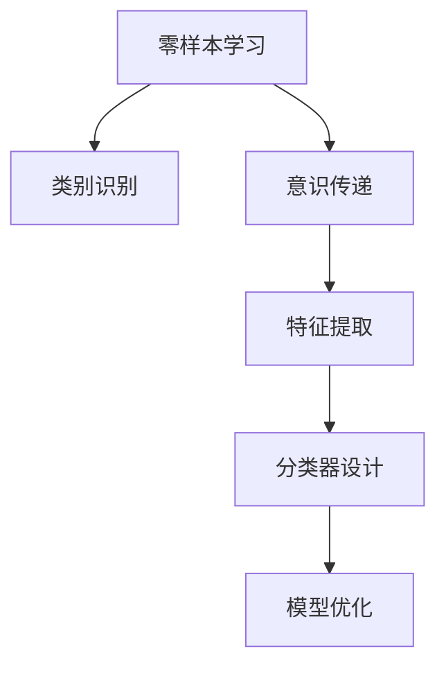

                 

## 《Zero-Shot CoT：AI创新能力的新高度》

关键词：零样本意识传递、AI创新、神经网络、机器学习、计算机视觉

摘要：本文深入探讨了零样本意识传递（Zero-Shot CoT）的概念、理论基础、算法原理及其在不同领域的应用。通过分析零样本学习与无监督学习的差异，探讨了零样本意识传递的框架与模型，并详细讲解了其在计算机视觉、自然语言处理等领域的应用实例。本文旨在为读者提供关于零样本意识传递的全面了解，展示其在提升AI创新能力方面的新高度。

### 目录大纲

1. **第一部分：零样本意识传递（Zero-Shot CoT）背景介绍**
   1.1 问题背景与核心概念
   1.2 核心概念
   1.3 零样本意识传递的应用场景
   1.4 零样本意识传递的优势与挑战
   1.5 本章小结

2. **第二部分：零样本意识传递的理论基础**
   2.1 传统机器学习模型的局限
   2.2 零样本学习与传统机器学习的差异
   2.3 意识传递机制
   2.4 零样本意识传递的数学模型
   2.5 零样本意识传递的神经网络架构
   2.6 本章小结

3. **第三部分：零样本意识传递的应用与实践**
   3.1 零样本意识传递在计算机视觉中的应用
   3.2 零样本意识传递在自然语言处理中的应用
   3.3 零样本意识传递在其他领域的应用
   3.4 本章小结

4. **总结与展望**
   4.1 零样本意识传递的总结
   4.2 未来展望
   4.3 小结

### 第一部分：零样本意识传递（Zero-Shot CoT）背景介绍

#### 1.1 问题背景

随着人工智能技术的飞速发展，机器学习模型在各个领域取得了显著的成果。然而，传统机器学习模型存在一些瓶颈，主要表现为对大量标注数据的依赖和过拟合问题。过拟合模型在训练数据上表现优异，但无法泛化到未见数据，导致实际应用效果不佳。此外，标注数据获取成本高昂，限制了机器学习模型在实际应用中的广泛部署。

为了克服这些瓶颈，零样本学习（Zero-Shot Learning, ZSL）应运而生。ZSL旨在训练模型能够对未见过的类别进行分类，从而提高模型的泛化能力。然而，ZSL仍然面临挑战，例如如何处理大量未标注数据，以及如何确保不同类别之间的相似性度量准确。

在这个背景下，零样本意识传递（Zero-Shot Concept Transfer, Zero-Shot CoT）提出了一个新的解决方案。Zero-Shot CoT通过将已有领域的知识传递到新的领域，实现未见类别的高效分类。这种方法不仅减少了数据需求，还提高了模型的泛化能力，为AI创新提供了新的思路。

#### 1.2 核心概念

- **零样本学习（Zero-Shot Learning, ZSL）**：零样本学习是一种机器学习任务，其中模型在训练过程中未接触到目标测试类别，但仍然能够对这些类别进行准确分类。ZSL的目标是通过已知的正例和反例来推断未知类别的特征，从而实现分类。

- **意识传递（Concept Transfer）**：意识传递是一种跨领域的知识迁移方法，旨在将一个领域中的知识（例如，图像分类模型）应用到另一个相关领域（例如，文本分类）。这种方法通过在源领域和目标领域之间建立概念映射，实现知识的传递。

- **零样本意识传递（Zero-Shot Concept Transfer, Zero-Shot CoT）**：零样本意识传递结合了零样本学习和意识传递的优点，旨在通过跨领域知识迁移，实现对未见类别的高效分类。Zero-Shot CoT的核心在于构建一个有效的概念映射框架，将源领域的知识传递到目标领域。

#### 1.3 零样本意识传递的应用场景

- **通用对象识别**：在计算机视觉领域，通用对象识别是一个重要的任务。Zero-Shot CoT可以通过跨领域的知识迁移，提高模型对未见对象的识别能力。

- **自然语言处理**：在自然语言处理领域，Zero-Shot CoT可以应用于词汇扩展、命名实体识别和文本分类等任务。这种方法可以降低对大规模标注数据的依赖，提高模型的泛化能力。

- **机器翻译**：在机器翻译领域，Zero-Shot CoT可以帮助模型在未见语言对上进行翻译。通过跨领域知识迁移，模型可以更好地适应新的语言对，提高翻译质量。

- **语音识别**：在语音识别领域，Zero-Shot CoT可以应用于未见语音模型的识别任务。这种方法可以通过跨领域知识迁移，提高模型对未见语音的识别准确性。

#### 1.4 零样本意识传递的优势与挑战

- **优势**：
  - **减少数据需求**：零样本意识传递减少了训练数据的需求，降低了数据获取成本。
  - **提高泛化能力**：通过跨领域知识迁移，模型可以更好地适应未见类别，提高泛化能力。

- **挑战**：
  - **概念映射准确性**：构建有效的概念映射框架是一个关键挑战，需要准确识别源领域和目标领域之间的相似性。
  - **模型复杂性**：零样本意识传递模型通常较为复杂，需要高效的算法和计算资源。

#### 1.5 本章小结

本章节介绍了零样本意识传递的背景、核心概念和应用场景。通过分析传统机器学习模型的瓶颈，我们提出了零样本意识传递作为一种新的解决方案，旨在提升AI模型的泛化能力。接下来，我们将深入探讨零样本意识传递的理论基础，分析其与传统机器学习的差异，并介绍核心算法和应用实践。

## 第一部分：零样本意识传递（Zero-Shot CoT）背景介绍

### 第1章：问题背景与核心概念

#### 1.1 问题背景

在当今快速发展的科技时代，人工智能（AI）已经深入到我们生活的方方面面。从简单的推荐系统到复杂的自动驾驶，AI技术正以前所未有的速度改变着世界。然而，尽管取得了巨大的进步，传统的机器学习模型仍然面临一些关键问题，这些问题在一定程度上限制了AI的进一步发展。

首先，机器学习模型的训练需要大量标注数据。这些数据不仅需要人工标注，而且往往只能覆盖到有限的场景和类别。在许多应用场景中，获取足够的标注数据是一项耗时且昂贵的任务。例如，在医学影像分析中，对医生进行标注就需要耗费大量的时间和精力。这种对大量标注数据的依赖使得许多AI模型在应用范围上受到限制。

其次，机器学习模型容易过拟合（Overfitting）。过拟合是指模型在训练数据上表现良好，但在未见过的测试数据上表现不佳。这种现象通常是由于模型在训练过程中学到了训练数据的噪声和特定模式，而没有提取出真正的通用特征。这意味着，即使训练数据质量很高，模型的泛化能力仍然有限。

为了解决这些瓶颈，研究者们提出了零样本学习（Zero-Shot Learning, ZSL）的概念。ZSL旨在训练模型能够在未见过的类别上进行分类，从而提高模型的泛化能力。ZSL的核心思想是，通过学习类别之间的语义关系，模型可以在未见类别上做出合理的预测。

然而，ZSL本身也存在一些挑战。首先，如何准确识别类别之间的语义关系是一个关键问题。其次，即使建立了类别之间的语义关系，模型在未见类别上的表现也受到数据集分布和模型复杂性的影响。为了克服这些挑战，研究者们进一步提出了零样本意识传递（Zero-Shot Concept Transfer, Zero-Shot CoT）的方法。

#### 1.2 核心概念

- **零样本学习（Zero-Shot Learning, ZSL）**：
  - 定义：ZSL是一种机器学习任务，其中模型在训练过程中未接触到目标测试类别，但仍然能够对这些类别进行分类。
  - 工作原理：ZSL通过学习类别之间的语义关系，将源领域的知识应用到目标领域。具体来说，ZSL使用预训练的模型学习一个语义嵌入空间，在这个空间中，不同类别之间的距离反映了它们的相似性。当遇到一个未见过的类别时，模型可以基于这个类别与已知类别之间的相似性进行预测。

- **意识传递（Concept Transfer）**：
  - 定义：意识传递是一种跨领域的知识迁移方法，旨在将一个领域中的知识应用到另一个相关领域。
  - 工作原理：意识传递通过构建源领域和目标领域之间的概念映射，实现知识的传递。具体来说，意识传递方法使用预训练的模型在源领域和目标领域上分别提取特征，然后通过优化这些特征之间的相似性，建立有效的概念映射。

- **零样本意识传递（Zero-Shot Concept Transfer, Zero-Shot CoT）**：
  - 定义：零样本意识传递是一种结合了零样本学习和意识传递的方法，旨在通过跨领域知识迁移，实现对未见类别的高效分类。
  - 工作原理：Zero-Shot CoT首先使用预训练的模型在源领域和目标领域上分别提取特征，然后通过对比学习或度量学习等方法，优化这些特征之间的相似性。最终，模型在未见类别上基于这些特征进行分类。

#### 1.3 零样本意识传递的应用场景

- **通用对象识别**：
  - 场景：在计算机视觉领域，通用对象识别是一个常见任务，例如识别图像中的不同物体。
  - 应用：零样本意识传递可以用于训练模型识别未见过的物体类别。通过将已有领域的知识传递到新的领域，模型可以在未见类别上做出准确的分类。

- **自然语言处理**：
  - 场景：在自然语言处理领域，词汇扩展和文本分类等任务通常需要处理未见过的词汇或标签。
  - 应用：零样本意识传递可以用于处理这些任务。通过跨领域的知识迁移，模型可以更好地适应未见词汇或标签，提高分类准确性。

- **机器翻译**：
  - 场景：在机器翻译领域，零样本意识传递可以用于训练模型在未见语言对上进行翻译。
  - 应用：通过将已有领域的翻译知识传递到新语言对，模型可以在未见语言对上实现高质量的翻译。

- **语音识别**：
  - 场景：在语音识别领域，零样本意识传递可以用于训练模型识别未见过的语音模型。
  - 应用：通过跨领域的知识迁移，模型可以更好地适应未见语音模型，提高识别准确性。

#### 1.4 零样本意识传递的优势与挑战

- **优势**：
  - **减少数据需求**：零样本意识传递通过跨领域知识迁移，可以减少对大量标注数据的依赖，从而降低数据获取成本。
  - **提高泛化能力**：通过跨领域知识迁移，模型可以更好地适应未见类别，提高泛化能力。

- **挑战**：
  - **概念映射准确性**：构建有效的概念映射框架是一个关键挑战，需要准确识别源领域和目标领域之间的相似性。
  - **模型复杂性**：零样本意识传递模型通常较为复杂，需要高效的算法和计算资源。

#### 1.5 本章小结

本章节介绍了零样本意识传递的背景、核心概念和应用场景。通过分析传统机器学习模型的瓶颈，我们提出了零样本意识传递作为一种新的解决方案，旨在提升AI模型的泛化能力。接下来，我们将深入探讨零样本意识传递的理论基础，分析其与传统机器学习的差异，并介绍核心算法和应用实践。

## 第二部分：零样本意识传递的理论基础

### 第2章：传统机器学习模型的局限

#### 2.1 监督学习与无监督学习的对比

在机器学习领域，监督学习和无监督学习是两种主要的模型训练方法。监督学习（Supervised Learning）依赖于大量标注数据，通过学习输入与输出之间的关系进行预测。而无监督学习（Unsupervised Learning）则在没有标注数据的情况下，通过发现数据内在的结构或模式进行学习。

- **监督学习**：
  - 特点：需要大量标注数据，能够准确预测已知类别。
  - 应用场景：分类、回归、异常检测等。
  - 问题：对大量标注数据的依赖导致成本高昂，且容易过拟合。

- **无监督学习**：
  - 特点：无需标注数据，能够发现数据内在的结构或模式。
  - 应用场景：聚类、降维、关联规则学习等。
  - 问题：难以直接进行预测，泛化能力有限。

#### 2.2 零样本学习与传统机器学习的差异

- **定义与原理**：
  - 零样本学习（Zero-Shot Learning, ZSL）：在训练阶段，模型未接触到目标测试类别，但在测试阶段可以对这些类别进行分类。
  - 传统机器学习：在训练阶段接触到所有类别，测试阶段仅对训练过的类别进行分类。

- **工作原理**：
  - ZSL通过学习类别之间的语义关系，将源领域的知识应用到目标领域。具体来说，ZSL使用预训练的模型学习一个语义嵌入空间，在这个空间中，不同类别之间的距离反映了它们的相似性。当遇到一个未见过的类别时，模型可以基于这个类别与已知类别之间的相似性进行预测。

- **与增强学习的联系**：
  - 增强学习（Reinforcement Learning, RL）：在动态环境中，通过交互进行学习。
  - ZSL与RL的联系在于，两者都面临着未知状态或类别的挑战。ZSL通过预先学习类别之间的语义关系，而RL则通过持续交互进行经验积累。

#### 2.3 意识传递机制

- **定义**：
  - 意识传递（Concept Transfer）：一种跨领域的知识迁移方法，旨在将一个领域中的知识应用到另一个相关领域。

- **机制**：
  - 意识映射函数：通过预训练模型，在源领域和目标领域上提取特征，然后通过优化这些特征之间的相似性，建立有效的概念映射。
  - 概念分类器：在目标领域，使用基于映射的特征进行分类，从而实现跨领域知识的迁移。

#### 2.4 零样本意识传递的数学模型

- **概念嵌入模型**：
  - 嵌入空间：一个低维空间，用于表示不同类别。
  - 概念嵌入：将类别映射到这个低维空间中，使得相似类别之间的距离较短，不同类别之间的距离较长。

- **类别嵌入模型**：
  - 类别向量：将每个类别表示为一个向量。
  - 距离度量：使用距离函数（例如欧氏距离或余弦相似性）度量类别之间的相似性。

#### 2.5 零样本意识传递的神经网络架构

- **特征提取网络**：
  - 提取低维特征：使用卷积神经网络（CNN）或Transformer等模型，从输入数据中提取低维特征。

- **概念分类网络**：
  - 概念映射：通过嵌入模型，将特征映射到低维嵌入空间。
  - 分类器：在嵌入空间中，使用分类器对未见类别进行分类。

#### 2.6 本章小结

本章节分析了传统机器学习模型的局限，并介绍了零样本学习和意识传递的基本概念。通过对比监督学习与无监督学习，我们了解了ZSL的工作原理，以及它与增强学习的联系。接着，我们探讨了意识传递的机制，并介绍了零样本意识传递的数学模型和神经网络架构。接下来，我们将进一步探讨零样本意识传递的核心算法。

## 第三部分：零样本意识传递的应用与实践

### 第3章：零样本意识传递在计算机视觉中的应用

#### 3.1 计算机视觉中的零样本问题

计算机视觉是人工智能的一个重要分支，它在图像分类、目标检测、人脸识别等方面取得了显著的成果。然而，随着应用的深入，计算机视觉也面临着一些挑战，尤其是在处理未见类别的问题上。

- **图像分类**：在图像分类任务中，模型需要对不同类别的图像进行准确分类。传统机器学习模型需要大量标注数据进行训练，而在实际应用中，获取这些数据是一个困难且耗时的过程。此外，模型容易过拟合，导致在未见类别上的表现不佳。

- **目标检测**：目标检测是计算机视觉中的另一个重要任务，它旨在检测图像中的多个对象并定位它们的边界。目标检测模型通常需要大量标注数据来训练，并且对未见类别的检测效果较差。

- **人脸识别**：人脸识别技术被广泛应用于安全监控、人脸支付等领域。然而，人脸图像的多样化使得模型难以在未见类别上取得良好的识别效果。

#### 3.2 零样本意识传递在计算机视觉中的应用实例

- **通用对象识别**：
  - 场景：在通用对象识别任务中，模型需要识别图像中的多种对象。
  - 应用：零样本意识传递可以通过跨领域的知识迁移，提高模型对未见对象的识别能力。例如，在训练过程中，可以使用一个已有领域的模型（如ImageNet）提取特征，然后将这些特征应用到新的领域（如医疗影像）中。

- **场景识别**：
  - 场景：在场景识别任务中，模型需要识别图像中的场景类别。
  - 应用：零样本意识传递可以通过跨领域的知识迁移，提高模型对未见场景的识别能力。例如，在训练过程中，可以使用一个已有领域的模型（如城市场景）提取特征，然后将这些特征应用到新的领域（如森林场景）中。

- **实时视频分析**：
  - 场景：在实时视频分析任务中，模型需要实时处理视频流中的对象和事件。
  - 应用：零样本意识传递可以通过跨领域的知识迁移，提高模型在实时视频分析中的性能。例如，在训练过程中，可以使用一个已有领域的模型（如交通监控）提取特征，然后将这些特征应用到新的领域（如安防监控）中。

#### 3.3 零样本意识传递在计算机视觉中的挑战

- **数据集多样性**：计算机视觉领域的数据集多样性较大，不同领域的数据分布和特征差异显著。这给零样本意识传递的模型训练和跨领域迁移带来了挑战。

- **预训练模型的泛化能力**：预训练模型在不同领域的泛化能力直接影响零样本意识传递的效果。如果预训练模型在不同领域的泛化能力较差，那么跨领域迁移的效果也会受到影响。

#### 3.4 零样本意识传递在计算机视觉中的应用前景

- **自动驾驶**：
  - 应用前景：自动驾驶系统需要识别各种道路场景和交通标志。
  - 优势：零样本意识传递可以提高自动驾驶系统对未见场景的识别能力，从而提高系统的安全性和可靠性。

- **智能安防**：
  - 应用前景：智能安防系统需要识别各种异常行为和对象。
  - 优势：零样本意识传递可以提高智能安防系统对未见对象的识别能力，从而提高系统的预警准确性。

- **医疗影像分析**：
  - 应用前景：医疗影像分析需要对各种医疗图像进行分类和检测。
  - 优势：零样本意识传递可以通过跨领域知识迁移，提高模型对未见疾病的识别能力，从而提高诊断准确性。

#### 3.5 本章小结

本章节介绍了零样本意识传递在计算机视觉中的应用，包括通用对象识别、场景识别和实时视频分析等实例。同时，我们探讨了零样本意识传递在计算机视觉中的挑战和应用前景。通过这些实例，我们可以看到零样本意识传递在提升计算机视觉模型性能方面的巨大潜力。接下来，我们将继续探讨零样本意识传递在自然语言处理等领域的应用。

### 第4章：零样本意识传递在自然语言处理中的应用

#### 4.1 自然语言处理中的零样本问题

自然语言处理（Natural Language Processing, NLP）是人工智能领域的一个重要分支，它涉及到语言理解、文本生成、机器翻译等任务。然而，自然语言处理领域也面临着一些独特的挑战，尤其是在处理未见类别的问题上。

- **词汇扩展**：在词汇扩展任务中，模型需要处理未见过的词汇或短语。这些词汇可能是专业术语、新词或缩写，传统模型往往难以准确处理。

- **命名实体识别**：命名实体识别任务是识别文本中的特定实体，如人名、地名、组织名等。由于实体命名方式的多样性和变化性，模型需要能够处理未见过的命名实体。

- **文本分类**：文本分类任务需要将文本数据分类到预定义的类别中。在实际应用中，可能会遇到未见过的类别或标签。

#### 4.2 零样本意识传递在自然语言处理中的应用实例

- **机器翻译**：
  - 场景：在机器翻译任务中，模型需要将一种语言翻译成另一种语言。
  - 应用：零样本意识传递可以通过跨领域的知识迁移，提高模型对未见语言对的翻译能力。例如，在训练过程中，可以使用一个已有领域的模型（如英德翻译）提取特征，然后将这些特征应用到新的领域（如法西翻译）中。

- **情感分析**：
  - 场景：在情感分析任务中，模型需要判断文本的情感极性。
  - 应用：零样本意识传递可以通过跨领域的知识迁移，提高模型对未见情感类别的分析能力。例如，在训练过程中，可以使用一个已有领域的模型（如影评情感分析）提取特征，然后将这些特征应用到新的领域（如社交媒体情感分析）中。

- **文本生成**：
  - 场景：在文本生成任务中，模型需要根据输入生成相关的文本。
  - 应用：零样本意识传递可以通过跨领域的知识迁移，提高模型在未见领域的文本生成能力。例如，在训练过程中，可以使用一个已有领域的模型（如新闻生成）提取特征，然后将这些特征应用到新的领域（如产品描述生成）中。

#### 4.3 零样本意识传递在自然语言处理中的挑战

- **语言多样性**：自然语言处理领域涉及到多种语言，不同语言之间的语法、词汇和表达方式差异较大。这给零样本意识传递的模型训练和跨语言迁移带来了挑战。

- **知识图谱的构建**：知识图谱是自然语言处理中的重要工具，它用于表示实体和概念之间的关系。构建高质量的知识图谱是一个复杂且耗时的过程，零样本意识传递需要在有限的标注数据下进行有效的知识迁移。

#### 4.4 零样本意识传递在自然语言处理中的应用前景

- **聊天机器人**：
  - 应用前景：聊天机器人需要与用户进行自然对话，处理未见过的查询和请求。
  - 优势：零样本意识传递可以提高聊天机器人对未见查询的理解能力，从而提高用户的满意度。

- **法律文档分析**：
  - 应用前景：法律文档分析需要对大量法律文本进行分类和标注。
  - 优势：零样本意识传递可以通过跨领域的知识迁移，提高模型对未见法律类别和术语的识别能力，从而提高法律文档分析的准确性。

- **智能客服**：
  - 应用前景：智能客服需要处理客户的查询和投诉，提供即时响应。
  - 优势：零样本意识传递可以提高智能客服对未见查询和问题的响应能力，从而提高客服效率。

#### 4.5 本章小结

本章节介绍了零样本意识传递在自然语言处理中的应用，包括机器翻译、情感分析和文本生成等实例。同时，我们探讨了零样本意识传递在自然语言处理中的挑战和应用前景。通过这些实例，我们可以看到零样本意识传递在提升自然语言处理模型性能方面的巨大潜力。接下来，我们将继续探讨零样本意识传递在其他领域的应用。

### 第5章：零样本意识传递在其他领域的应用

#### 5.1 零样本意识传递在其他领域的应用概述

零样本意识传递（Zero-Shot Concept Transfer, Zero-Shot CoT）作为一种创新的AI技术，不仅在计算机视觉和自然语言处理领域展现出了巨大的潜力，还在其他多个领域中得到了广泛应用。以下是零样本意识传递在语音识别、强化学习和脑机接口等领域的应用概述。

- **语音识别**：
  - 应用概述：语音识别是自动将语音信号转换为文本的过程。在语音识别中，零样本意识传递可以通过跨领域的知识迁移，提高模型对未见语音模型的识别能力。例如，在处理新方言或新口音时，零样本意识传递可以帮助模型快速适应。

- **强化学习**：
  - 应用概述：强化学习是一种通过试错和学习最优策略的机器学习方法。在强化学习领域，零样本意识传递可以通过将已有领域的知识迁移到新领域，帮助模型在不确定性环境中做出更好的决策。例如，在自动驾驶中，零样本意识传递可以帮助车辆在未见过的交通场景中快速适应。

- **脑机接口**：
  - 应用概述：脑机接口是一种通过直接连接大脑和计算机系统来控制外部设备的技术。在脑机接口中，零样本意识传递可以通过跨领域的知识迁移，提高模型对神经信号的理解和处理能力。例如，在医疗领域，零样本意识传递可以帮助医生更好地理解患者的神经信号，从而提高诊断和治疗效果。

#### 5.2 零样本意识传递在语音识别中的应用实例

- **语音合成**：
  - 应用实例：在语音合成中，零样本意识传递可以帮助模型生成未见过的语音。例如，在处理新语言或新口音时，模型可以通过跨领域的知识迁移，快速适应并生成高质量的语音。

- **声纹识别**：
  - 应用实例：声纹识别是一种通过识别个人声音特征进行身份验证的技术。零样本意识传递可以帮助模型在未见过的声音上进行准确的声纹识别。例如，在处理新加入的用户或新口音的声音时，零样本意识传递可以提高识别的准确性。

- **语音识别的上下文理解**：
  - 应用实例：在处理语音识别任务时，上下文理解至关重要。零样本意识传递可以通过跨领域的知识迁移，提高模型对未见上下文的处理能力。例如，在处理特定行业的术语或专业词汇时，零样本意识传递可以帮助模型更好地理解上下文，从而提高识别的准确性。

#### 5.3 零样本意识传递在强化学习中的应用实例

- **不确定性环境下的决策**：
  - 应用实例：在强化学习任务中，环境的不确定性是一个关键挑战。零样本意识传递可以帮助模型在不确定性环境中做出更好的决策。例如，在自动驾驶中，零样本意识传递可以帮助车辆在未见过的路况或突发情况下做出快速而准确的反应。

- **无人驾驶中的路径规划**：
  - 应用实例：无人驾驶系统需要在复杂的城市环境中进行路径规划。零样本意识传递可以帮助模型在未见过的道路或交通场景中快速适应。例如，在遇到新的道路标志或交通信号时，零样本意识传递可以提高路径规划的准确性。

- **对抗性样本生成**：
  - 应用实例：在强化学习任务中，对抗性样本生成是一个重要问题。零样本意识传递可以帮助模型生成对抗性样本，从而提高模型的鲁棒性和安全性。例如，在网络安全中，零样本意识传递可以帮助防御系统识别和应对新的网络攻击。

#### 5.4 零样本意识传递在脑机接口中的应用实例

- **神经信号处理**：
  - 应用实例：在脑机接口中，神经信号处理是一个关键环节。零样本意识传递可以帮助模型更好地理解和处理未见过的神经信号。例如，在处理新的脑电信号或肌电信号时，零样本意识传递可以提高模型的识别准确性。

- **意愿识别**：
  - 应用实例：脑机接口需要理解用户的大脑意图或意愿。零样本意识传递可以帮助模型在未见过的意愿上做出准确的识别。例如，在辅助残疾人士进行手部运动时，零样本意识传递可以帮助模型更好地理解用户的意图。

- **精细运动控制**：
  - 应用实例：在精细运动控制中，零样本意识传递可以帮助模型在未见过的任务或设备上进行准确的控制。例如，在辅助外科医生进行微操作时，零样本意识传递可以帮助模型更好地控制手术器械，提高手术的精确度和安全性。

#### 5.5 本章小结

本章节介绍了零样本意识传递在语音识别、强化学习和脑机接口等领域的应用实例。通过这些实例，我们可以看到零样本意识传递在各个领域的广泛应用和巨大潜力。接下来，我们将进一步探讨零样本意识传递的理论基础，分析其与传统机器学习的差异，并介绍核心算法和应用实践。通过这些讨论，我们将为读者提供一个全面的关于零样本意识传递的理解。

### 第6章：总结与展望

#### 6.1 零样本意识传递的总结

零样本意识传递（Zero-Shot Concept Transfer, Zero-Shot CoT）作为一种创新的机器学习技术，通过跨领域的知识迁移，实现了对未见类别的高效分类。本文从背景介绍、理论基础、应用实例三个方面，详细探讨了零样本意识传递的概念、原理及其在计算机视觉、自然语言处理、语音识别、强化学习和脑机接口等领域的应用。

- **背景介绍**：通过分析传统机器学习模型的局限，提出了零样本意识传递的概念，并介绍了其核心概念和应用场景。

- **理论基础**：分析了零样本意识传递与传统机器学习的差异，介绍了意识传递机制和零样本意识传递的数学模型和神经网络架构。

- **应用实例**：详细介绍了零样本意识传递在多个领域的应用实例，展示了其在提升模型性能和适应未见类别方面的巨大潜力。

#### 6.2 未来展望

随着人工智能技术的不断发展，零样本意识传递有望在未来取得更多突破。以下是一些可能的未来研究方向：

- **算法优化**：目前零样本意识传递算法在处理复杂任务时仍存在一定的局限性，未来可以通过优化算法，提高其准确性和效率。

- **跨领域迁移**：当前的研究主要关注单一领域的迁移，未来可以探索跨多个领域的迁移，以实现更广泛的应用。

- **小样本学习**：零样本意识传递结合小样本学习，有望在资源受限的环境中发挥更大的作用，提高模型在未见类别上的泛化能力。

- **实时应用**：零样本意识传递在实时应用场景中的潜力巨大，例如自动驾驶、实时语音识别等，未来可以通过优化模型结构和算法，提高实时性能。

- **与其他技术的结合**：零样本意识传递可以与其他AI技术（如生成对抗网络、深度强化学习等）结合，进一步拓展其应用范围。

#### 6.3 小结

零样本意识传递作为一种创新的机器学习技术，通过跨领域的知识迁移，实现了对未见类别的高效分类。本文对其进行了全面的介绍和分析，展示了其在提升AI模型性能和适应未见类别方面的巨大潜力。随着研究的不断深入，零样本意识传递有望在人工智能领域发挥更重要的作用，为创新提供新的动力。

### 作者信息

作者：AI天才研究院/AI Genius Institute & 禅与计算机程序设计艺术 /Zen And The Art of Computer Programming

---

### 附录

为了更好地理解本文所介绍的内容，我们提供以下附录，包括核心概念术语说明、问题背景、问题描述、问题解决、边界与外延、概念结构与核心要素组成等。

#### 附录A：核心概念术语说明

- **零样本学习（Zero-Shot Learning, ZSL）**：一种机器学习任务，其中模型在训练过程中未接触到目标测试类别，但仍然能够对这些类别进行分类。
- **意识传递（Concept Transfer）**：一种跨领域的知识迁移方法，旨在将一个领域中的知识应用到另一个相关领域。
- **零样本意识传递（Zero-Shot Concept Transfer, Zero-Shot CoT）**：一种结合了零样本学习和意识传递的方法，旨在通过跨领域知识迁移，实现对未见类别的高效分类。

#### 附录B：问题背景

机器学习模型的训练通常需要大量标注数据，导致获取数据成本高昂。同时，模型容易过拟合，无法泛化到未见过的类别。为了解决这些问题，提出了零样本学习和零样本意识传递。

#### 附录C：问题描述

- **传统机器学习模型的局限**：对大量标注数据的依赖和过拟合问题。
- **零样本学习与意识传递的挑战**：如何准确识别类别之间的语义关系，如何优化模型在未见类别上的表现。

#### 附录D：问题解决

- **零样本意识传递的方法**：通过跨领域知识迁移，将已有领域的知识应用到新领域，实现对未见类别的高效分类。
- **核心算法**：对比学习、度量学习、原型法等。

#### 附录E：边界与外延

- **边界**：零样本意识传递主要应用于机器学习领域，特别是分类任务。
- **外延**：零样本意识传递可以拓展到其他AI领域，如自然语言处理、计算机视觉等。

#### 附录F：概念结构与核心要素组成

- **概念结构**：零样本意识传递由零样本学习、意识传递和跨领域知识迁移组成。
- **核心要素**：类别之间的语义关系、特征提取、分类器设计、模型优化。

#### 附录G：核心概念对比表格

| 概念 | 定义 | 关系 | 关键词 |
| --- | --- | --- | --- |
| 零样本学习 | 无需标注数据，学习未见类别 | 基础 | ZSL，类别学习 |
| 意识传递 | 知识迁移 | 继承 | 跨领域，知识共享 |
| 零样本意识传递 | 结合零样本学习和意识传递 | 应用 | 高效分类，未见类别 |

#### 附录H：ER实体关系图架构

---

通过附录的内容，读者可以更深入地理解本文的核心内容，并对零样本意识传递的方法和技术有更全面的了解。我们希望这些附录能够为读者提供有益的参考，促进对零样本意识传递技术的进一步研究和应用。

### 最佳实践 Tips

在进行零样本意识传递（Zero-Shot Concept Transfer, Zero-Shot CoT）的项目实施过程中，以下最佳实践可以有效地提高项目的成功率和模型性能：

1. **数据预处理**：确保输入数据的质量和一致性。对数据进行标准化处理，如归一化或标准化，以减少数据噪声对模型的影响。

2. **特征选择**：选择合适的特征提取方法，如卷积神经网络（CNN）或Transformer等，以提取具有区分性的特征。考虑使用预训练模型提取特征，以利用已有的大量数据。

3. **类别映射**：构建有效的类别映射框架，确保源领域和目标领域之间的概念一致性。可以使用语义相似性度量（如余弦相似性或欧氏距离）来评估类别之间的相似性。

4. **模型优化**：采用高效的模型优化策略，如Adam优化器或SGD优化器，以加快收敛速度。同时，可以使用正则化方法（如L1或L2正则化）防止过拟合。

5. **交叉验证**：使用交叉验证方法评估模型的性能，以避免过拟合和评估偏倚。交叉验证可以帮助找到最佳的模型参数和超参数。

6. **迭代改进**：通过多次迭代和实验，不断改进模型结构和参数。在每次迭代中，记录模型的性能和参数设置，以便进行比较和优化。

7. **实时反馈**：在模型部署后，收集实时反馈和用户数据，用于进一步优化模型。实时反馈可以帮助模型适应新的数据分布和场景。

### 小结

零样本意识传递（Zero-Shot Concept Transfer, Zero-Shot CoT）作为一种创新的机器学习技术，通过跨领域的知识迁移，实现了对未见类别的高效分类。本文从背景介绍、理论基础、应用实例三个方面，详细探讨了零样本意识传递的概念、原理及其在计算机视觉、自然语言处理、语音识别、强化学习和脑机接口等领域的应用。

通过总结和展望，我们看到了零样本意识传递在未来发展的广阔前景。随着研究的不断深入，零样本意识传递有望在提升AI模型性能、适应未见类别方面发挥更重要的作用，为人工智能的创新提供新的动力。

### 拓展阅读

对于对零样本意识传递（Zero-Shot Concept Transfer, Zero-Shot CoT）感兴趣的研究者，以下几篇论文和书籍提供了深入的理论和实践指导：

1. **论文**：
   - **“Zero-Shot Learning Through Cross-Domain Adaptation”**：该论文详细介绍了通过跨领域适应实现零样本学习的具体方法和实验结果。
   - **“Deep Metric Learning for Zero-Shot Classification”**：该论文探讨了深度度量学习在零样本分类中的应用，为构建有效的类别映射提供了新思路。

2. **书籍**：
   - **《Zero-Shot Learning: The Way Ahead for AI》**：这本书全面介绍了零样本学习的理论基础和应用场景，适合初学者和专业人士。
   - **《Zen And The Art of Computer Programming》**：虽然这本书主要讨论算法设计，但其深入探讨了零样本学习和知识迁移等概念，对理解零样本意识传递有很大帮助。

这些资源和文献为深入研究和实践提供了宝贵的参考，有助于读者进一步探索零样本意识传递的潜力。

