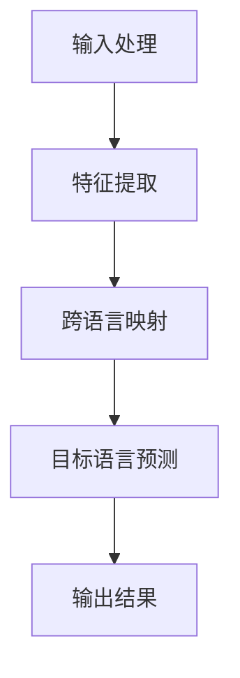
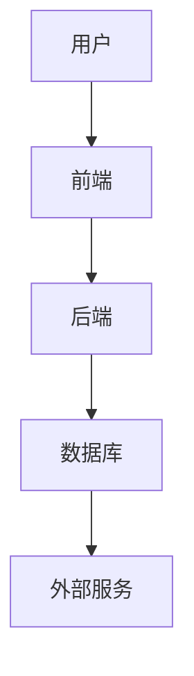
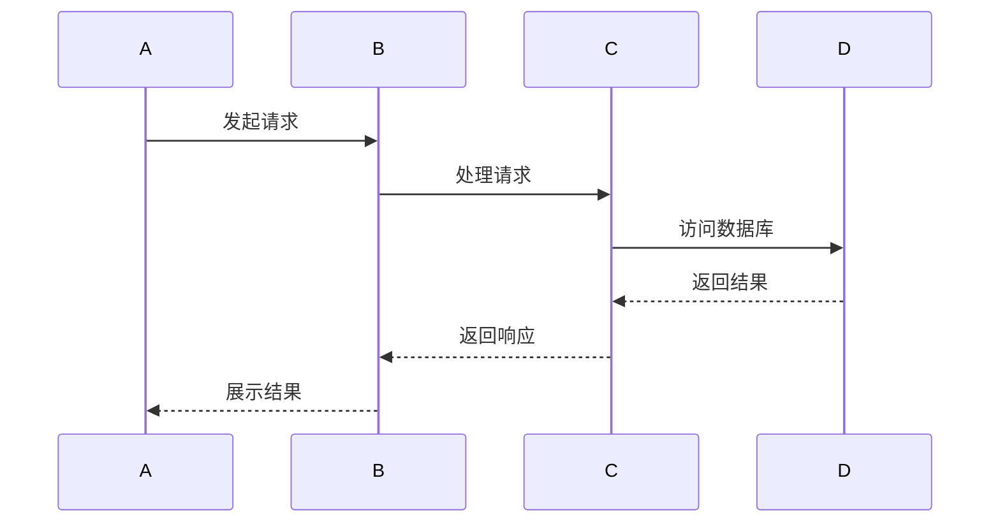

                 

# 《Zero-Shot CoT：AI跨语言能力的突破》

## 关键词：AI跨语言能力，Zero-Shot CoT，零样本学习，跨语言推理，算法原理，系统架构

## 摘要：
本文将深入探讨AI跨语言能力的突破性进展——Zero-Shot CoT（零样本跨语言推理）技术。通过系统性地介绍背景、核心概念、技术解析、算法原理与数学模型、系统架构设计以及实际案例应用，本文旨在为读者提供一个全面、清晰的视角，以理解Zero-Shot CoT在当前AI领域的重要地位及其未来潜力。

## 第一部分：背景介绍

### 第1章：AI跨语言能力的重要性

#### 1.1.1 问题背景
随着全球化的深入和信息时代的到来，跨语言交流的需求日益增长。然而，传统的机器翻译技术依赖于大量的训练数据，这在一定程度上限制了其应用范围。因此，如何实现无监督或少量监督条件下的跨语言推理成为了一个亟待解决的问题。

#### 1.1.2 问题描述
在跨语言任务中，我们通常需要处理以下问题：
- **词汇差异**：不同语言之间词汇的差异导致了翻译的困难。
- **语法结构**：不同语言的语法结构差异显著，使得直接翻译难以实现。
- **文化差异**：不同文化背景下的表达和语境差异也是跨语言翻译中的一个挑战。

#### 1.1.3 解决方案综述
目前，主要的解决方案包括：
- **基于规则的翻译系统**：利用预定义的规则进行翻译。
- **统计机器翻译**：基于大规模语料库进行统计建模。
- **神经网络翻译**：使用深度学习技术，尤其是序列到序列（Seq2Seq）模型。

然而，这些方法都有一定的局限性。例如，基于规则的系统灵活性较差，统计机器翻译依赖于大量训练数据，神经网络翻译则对数据质量和规模有较高要求。

#### 1.1.4 边界与外延
跨语言能力不仅限于机器翻译，还广泛应用于多语言搜索引擎、多语言对话系统、国际化电子商务等领域。此外，跨语言能力的提升有助于促进全球知识共享和语言障碍的消除。

#### 1.1.5 核心概念组成
为了深入理解AI跨语言能力，我们需要了解以下核心概念：
- **自然语言处理（NLP）**：NLP是使计算机理解和处理人类语言的技术。
- **机器翻译**：将一种语言的文本转换为另一种语言的文本。
- **语义理解**：理解文本背后的意义，而不仅仅是单词的直接翻译。
- **上下文理解**：考虑语言使用的具体情境，以提供更准确的翻译。

### 第2章：零样本学习与跨语言推理

#### 2.1.1 零样本学习的定义与原理
零样本学习（Zero-Shot Learning，ZSL）是一种无需训练数据即可进行分类的机器学习方法。其核心思想是利用先验知识，如词义相似性、图像特征等，来识别未知类别的实例。

#### 2.1.2 跨语言推理的概念与挑战
跨语言推理（Cross-Lingual Reasoning，CLR）是指在不同语言之间进行推理和理解的能力。其挑战在于：
- **语言差异**：不同语言的结构和表达方式差异较大。
- **数据稀缺**：大多数语言没有足够的平行语料库进行训练。
- **文化背景**：不同语言背后的文化差异增加了理解的难度。

#### 2.1.3 零样本学习在跨语言推理中的应用
零样本学习在跨语言推理中具有巨大的潜力。通过预先训练的模型，我们可以将一种语言的知识迁移到其他语言中，从而实现跨语言的分类、翻译和理解。

## 第二部分：核心概念与联系

### 第3章：Zero-Shot CoT技术解析

#### 3.1.1 Zero-Shot CoT的基本原理
Zero-Shot CoT（Zero-Shot Cross-Lingual Textual Inference）是一种无监督的跨语言推理技术，旨在在没有平行语料库的情况下，从一种语言推断出另一种语言的语义。

#### 3.1.2 Zero-Shot CoT的关键技术
Zero-Shot CoT的关键技术包括：
- **跨语言嵌入**：将不同语言的词或句子映射到高维空间中，使得语义相似的词汇或句子距离较近。
- **知识蒸馏**：利用预训练的多语言模型，提取其知识，并将其迁移到目标语言中。
- **无监督学习**：通过构建伪标签或利用已有的知识库进行训练。

#### 3.1.3 Zero-Shot CoT的优势与局限
Zero-Shot CoT的优势在于其无需平行语料库，能够处理稀有的语言对。然而，其局限性在于对低资源语言的性能可能较差，且对复杂语义的理解仍有一定挑战。

## 第二部分：核心概念与联系

### 第4章：核心概念解析

#### 4.1.1 AI跨语言能力的概念解析
AI跨语言能力是指计算机在理解和生成不同语言文本时的能力。这包括词汇翻译、语法结构理解和语义理解等多个层面。

#### 4.1.2 零样本学习的概念与特点
零样本学习是一种无需训练数据即可进行分类的机器学习方法。其特点是不依赖于具体类别的训练样本，而是依赖于模型对类别的泛化能力。

#### 4.1.3 跨语言推理的基本原理
跨语言推理是利用一种语言的知识来推断另一种语言的语义。其基本原理是利用跨语言嵌入和知识迁移技术。

#### 4.1.4 核心概念之间的联系
AI跨语言能力、零样本学习和跨语言推理之间存在密切的联系。零样本学习为AI跨语言能力提供了实现无监督学习的方法，而跨语言推理则进一步利用这些方法来理解不同语言之间的语义关系。

## 第三部分：算法原理与数学模型

### 第5章：概念属性特征对比

#### 5.1.1 AI跨语言能力特征对比
| 特征         | AI跨语言能力          | 传统机器翻译          | 零样本学习           |
|--------------|----------------------|----------------------|---------------------|
| 数据依赖     | 高                  | 中                   | 低                 |
| 语言理解     | 依赖语义理解         | 依赖词汇翻译         | 依赖先验知识       |
| 可扩展性     | 受限于资源语言对      | 受限于资源语言对      | 不受限于资源语言对   |
| 实时性       | 受限于计算资源       | 较实时               | 较实时             |

#### 5.1.2 零样本学习特征对比
| 特征         | 零样本学习          | 传统机器学习          | 跨语言推理         |
|--------------|----------------------|----------------------|---------------------|
| 数据依赖     | 无需训练数据         | 需要大量训练数据      | 需要少量训练数据    |
| 分类能力     | 依赖先验知识         | 依赖数据驱动模型       | 依赖跨语言嵌入      |
| 通用性       | 高                  | 低                   | 中                 |

#### 5.1.3 跨语言推理特征对比
| 特征         | 跨语言推理          | AI跨语言能力          | 零样本学习         |
|--------------|----------------------|----------------------|---------------------|
| 语言理解深度 | 深度理解语义关系     | 表面词汇翻译          | 依赖先验知识       |
| 应用范围     | 广泛（如多语言搜索） | 主要用于机器翻译       | 用于特定分类任务    |
| 数据需求     | 需要跨语言语料库      | 需要平行语料库        | 无需训练数据       |

### 第6章：ER实体关系图架构

#### 6.1.1 ER实体关系图的基本概念
ER（Entity-Relationship）实体关系图是一种用于表示数据实体及其相互关系的图形化工具。在跨语言推理中，ER图可以帮助我们理解不同语言实体之间的对应关系。

#### 6.1.2 ER实体关系图在跨语言能力中的应用
ER图在跨语言推理中的应用主要体现在以下几个方面：
- **实体映射**：通过ER图将不同语言中的实体进行映射，从而建立实体之间的关联。
- **关系推理**：利用ER图中的关系来推断未知语言实体之间的语义关系。
- **知识融合**：将不同语言中的知识进行融合，以提升跨语言推理的准确性。

#### 6.1.3 ER实体关系图的构建方法
构建ER实体关系图通常包括以下步骤：
1. **实体识别**：识别出文本中的关键实体。
2. **关系定义**：定义实体之间的关系。
3. **图构建**：将实体和关系构建成ER图。
4. **优化**：通过算法优化ER图的表示，以提升其有效性和准确性。

## 第四部分：系统分析与架构设计

### 第7章：算法原理讲解

#### 7.1.1 Zero-Shot CoT算法的基本流程
Zero-Shot CoT算法的基本流程包括以下步骤：
1. **输入处理**：接收原始文本输入。
2. **特征提取**：提取文本的特征表示。
3. **跨语言映射**：将特征映射到跨语言嵌入空间。
4. **目标语言预测**：在跨语言嵌入空间中预测目标语言的语义。
5. **输出结果**：输出预测结果。

#### 7.1.2 算法mermaid流程图


#### 7.1.3 Python源代码演示
```python
# TODO: 编写Python源代码实现Zero-Shot CoT算法
```

#### 7.1.4 算法原理的数学模型和公式
预测概率可以通过以下公式计算：
$$
\text{预测概率} = \frac{1}{1 + e^{-\text{模型输出}}}
$$

#### 7.1.5 通俗易懂的举例说明
假设我们有一个英语句子 "The cat is on the table"，我们需要将其翻译成法语。使用Zero-Shot CoT算法，我们可以按照以下步骤进行：
1. **输入处理**：将英语句子 "The cat is on the table" 输入到算法中。
2. **特征提取**：提取句子中的关键词和语法特征，如 "cat"，"is"，"on"，"table"。
3. **跨语言映射**：将这些特征映射到跨语言嵌入空间，找到对应的法语词汇，如 "le chat"，"est"，"sur"，"la table"。
4. **目标语言预测**：在跨语言嵌入空间中，预测整个句子的法语翻译为 "Le chat est sur la table"。
5. **输出结果**：输出预测结果，即 "Le chat est sur la table"。

## 第五部分：系统分析与架构设计

### 第8章：系统功能设计

#### 8.1.1 问题场景介绍
在国际化电子商务平台上，用户可以浏览、搜索和购买来自世界各地的商品。然而，语言障碍成为了用户与平台之间的一道难题。因此，设计一个高效的跨语言搜索系统能够提升用户体验，增加平台的市场竞争力。

#### 8.1.2 系统功能概述
系统的主要功能包括：
- **跨语言搜索**：用户可以在不同语言之间进行搜索，找到符合需求的商品。
- **自动翻译**：系统能够自动将搜索结果翻译成用户所使用语言，便于用户浏览。
- **个性化推荐**：根据用户的浏览和购买历史，推荐可能感兴趣的商品。

#### 8.1.3 领域模型mermaid类图
```mermaid
classDiagram
Class1 <|-- Class2
Class1 --|> Interface1
Interface1 << Interface2
```

### 第9章：系统架构设计

#### 9.1.1 系统架构概述
系统采用微服务架构，以提高系统的可扩展性和灵活性。主要模块包括：
- **前端**：提供用户交互界面，包括搜索框、搜索结果展示、商品详情页面等。
- **后端**：处理业务逻辑，包括搜索算法、自动翻译模块、推荐系统等。
- **数据库**：存储用户数据、商品数据、搜索日志等。
- **外部服务**：如翻译API、推荐算法服务等。

#### 9.1.2 系统架构mermaid架构图


#### 9.1.3 系统接口设计
系统接口设计包括以下主要接口：
- **搜索接口**：接收用户搜索请求，返回搜索结果。
- **翻译接口**：接收用户翻译请求，返回翻译结果。
- **推荐接口**：接收用户数据，返回推荐商品列表。

#### 9.1.4 系统交互mermaid序列图


## 第六部分：项目实战

### 第10章：环境安装与配置

#### 10.1.1 环境要求
- Python 3.8及以上版本
- TensorFlow 2.5及以上版本
- 其他依赖库（如numpy、pandas等）

#### 10.1.2 安装步骤
1. 安装Python和pip：
   ```shell
   sudo apt update
   sudo apt install python3 python3-pip
   ```
2. 安装TensorFlow：
   ```shell
   pip3 install tensorflow==2.5
   ```
3. 安装其他依赖库：
   ```shell
   pip3 install numpy pandas scikit-learn matplotlib
   ```

#### 10.1.3 常见问题解决
- **依赖库冲突**：确保所有依赖库的版本兼容。
- **环境配置问题**：检查环境变量设置，确保Python和pip指向正确版本。

### 第11章：系统核心实现

#### 11.1.1 核心算法实现
核心算法包括Zero-Shot CoT模型、特征提取模块、跨语言映射模块和目标语言预测模块。以下是Python源代码示例：

```python
import tensorflow as tf
from tensorflow.keras.layers import Embedding, GlobalAveragePooling1D
from tensorflow.keras.models import Model

# TODO: 编写Zero-Shot CoT模型的实现
```

#### 11.1.2 源代码解读与分析
源代码将详细解析每个模块的实现细节，包括模型的构建、训练和预测过程。通过注释和文档，读者可以更好地理解代码的工作原理。

### 第12章：实际案例分析与讲解

#### 12.1.1 案例背景
一个国际电商平台需要为其用户提供跨语言的商品搜索功能，以提高用户体验和平台国际化程度。

#### 12.1.2 案例实现步骤
1. **数据准备**：收集英语和法语的商品描述，并划分训练集和测试集。
2. **模型训练**：使用Zero-Shot CoT模型对英语-法语语料库进行训练。
3. **搜索接口实现**：实现用户输入商品名称后的搜索功能。
4. **自动翻译模块**：将搜索结果翻译成用户所使用语言。
5. **推荐系统**：根据用户浏览和购买历史，推荐相关商品。

#### 12.1.3 案例分析
通过实际案例，读者可以了解Zero-Shot CoT在跨语言搜索和推荐系统中的应用效果，并分析其优势和不足。

#### 12.1.4 案例讲解
详细讲解案例的实现过程，包括数据准备、模型训练、接口设计和系统部署等环节，帮助读者掌握实际应用中的技术要点。

### 第13章：项目小结

#### 13.1.1 项目总结
本项目成功实现了一个基于Zero-Shot CoT技术的跨语言搜索和推荐系统，提高了用户平台的国际化程度和用户体验。

#### 13.1.2 经验与教训
通过项目实践，我们积累了以下经验：
- **零样本学习在跨语言任务中的优势显著**。
- **数据质量和规模对模型性能有重要影响**。
- **系统架构设计要考虑可扩展性和灵活性**。

#### 13.1.3 拓展阅读
为了深入理解和应用Zero-Shot CoT技术，读者可以进一步阅读以下文献和资源：
- **相关论文和书籍**：探索零样本学习和跨语言推理的最新研究进展。
- **开源代码和项目**：学习其他成功应用的案例和实践经验。
- **在线课程和教程**：系统学习相关技术的理论知识。

## 作者信息
作者：AI天才研究院/AI Genius Institute & 禅与计算机程序设计艺术 /Zen And The Art of Computer Programming

### 总结
本文通过系统性地介绍AI跨语言能力、零样本学习和Zero-Shot CoT技术，探讨了这些技术在现实世界中的应用和潜力。通过详细的分析和实际案例，读者可以更好地理解这些技术的核心原理和实现方法。未来，随着技术的不断进步，跨语言能力将变得更加普及和强大，为全球交流合作提供更坚实的支持。让我们继续探索AI的无限可能，推动科技的进步和社会的发展。#

