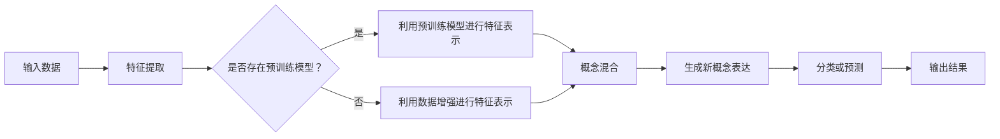
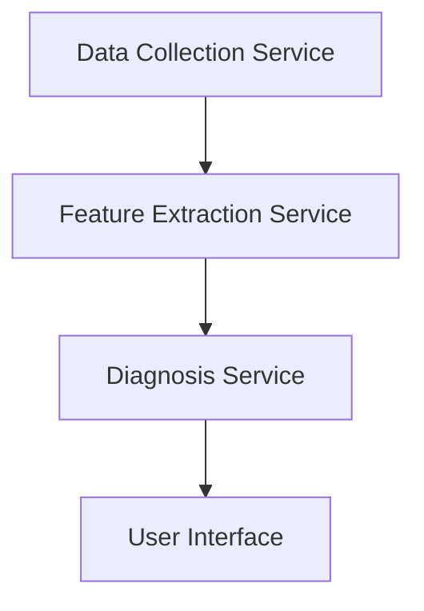
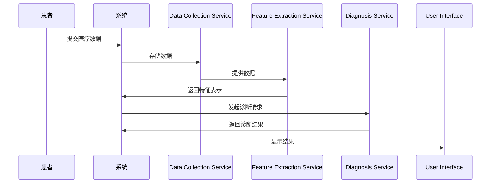
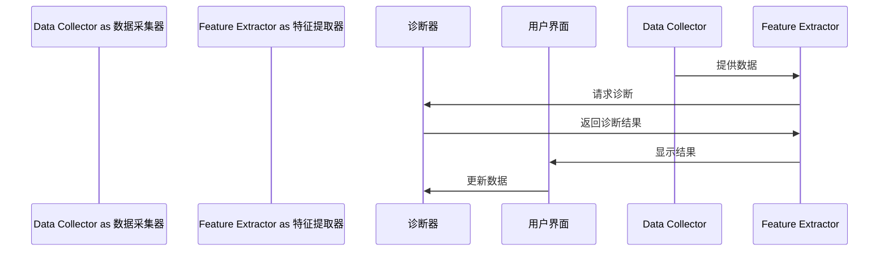

                 

# 《Zero-Shot CoT：提升AI即时应变能力》

> 关键词：Zero-Shot CoT，AI即时应变，概念混合，转移学习，系统架构，Python代码

> 摘要：本文深入探讨了Zero-Shot CoT（Conceptual Blending）的概念、原理和应用，阐述了其在提升人工智能（AI）即时应变能力方面的巨大潜力。通过详细的分析和案例，本文展示了如何利用Zero-Shot CoT算法设计和实现高效的AI系统，为未来的AI研究和应用提供了有价值的参考。

## 《Zero-Shot CoT：提升AI即时应变能力》目录大纲

----------------------------------------------------------------

## 第一部分：背景介绍

### 第1章 问题背景与概念介绍

- **1.1 AI即时应变能力的重要性**
  - AI即时应变能力的基本概念
  - AI即时应变能力在现实世界中的应用

- **1.2 传统AI模型的局限**
  - 传统AI模型的不足之处
  - 传统AI模型无法满足即时应变的需求

- **1.3 Zero-Shot CoT的概念与优势**
  - Zero-Shot CoT的定义
  - Zero-Shot CoT的核心原理
  - Zero-Shot CoT的优势与前景

- **1.4 书籍结构概述**

### 第2章 核心概念与联系

- **2.1 关键概念**
  - **2.1.1 CoT（Conceptual Blending）**
  - **2.1.2 Zero-Shot Learning**
  - **2.1.3 Transfer Learning**

- **2.2 概念属性特征对比表格**

- **2.3 ER实体关系图架构**

## 第二部分：算法原理讲解

### 第3章 Zero-Shot CoT算法原理

- **3.1 算法mermaid流程图**
  
- **3.2 Python源代码解读**

- **3.3 数学模型与公式讲解**
  - **3.3.1 数学模型**
  - **3.3.2 数学公式**

- **3.4 通俗易懂地举例说明**
  - **3.4.1 举例说明一**
  - **3.4.2 举例说明二**
  - **3.4.3 举例说明三**

## 第三部分：系统分析与架构设计

### 第4章 系统分析与架构设计

- **4.1 问题场景介绍**
  
- **4.2 项目介绍**
  
- **4.3 系统功能设计**
  - **4.3.1 领域模型mermaid类图**

- **4.4 系统架构设计**
  - **4.4.1 系统架构mermaid架构图**

- **4.5 系统接口设计**
  - **4.5.1 系统接口mermaid序列图**

- **4.6 系统交互**
  - **4.6.1 系统交互mermaid序列图**

## 第四部分：项目实战

### 第5章 环境安装与系统核心实现

- **5.1 环境安装**
  - **5.1.1 系统要求**
  - **5.1.2 安装步骤**

- **5.2 系统核心实现**
  - **5.2.1 代码结构**
  - **5.2.2 核心代码解读**

- **5.3 代码应用解读与分析**
  - **5.3.1 应用场景**
  - **5.3.2 代码应用解读**
  - **5.3.3 分析与评估**

## 第五部分：最佳实践与总结

### 第6章 最佳实践与技巧

- **6.1 最佳实践一**
  
- **6.2 最佳实践二**
  
- **6.3 最佳实践三**

### 第7章 项目小结与展望

- **7.1 项目小结**
  
- **7.2 未来展望**
  
- **7.3 拓展阅读**

----------------------------------------------------------------

### 第1章 问题背景与概念介绍

#### 1.1 AI即时应变能力的重要性

在当今高度复杂和快速变化的世界中，人工智能（AI）系统的即时应变能力变得越来越重要。AI系统不仅需要在既定任务中表现卓越，还需要能够迅速适应新的情境和挑战。即时应变能力是AI系统能够实时处理未知或意外情况的关键特性。

首先，让我们明确一下AI即时应变能力的基本概念。即时应变能力指的是AI系统在面临新的输入时，能够快速、准确地理解并作出相应决策的能力。这种能力对于许多实际应用场景至关重要，例如自动驾驶、智能客服、医疗诊断等。在这些场景中，AI系统必须能够实时响应环境变化，以确保安全和效率。

AI即时应变能力的重要性体现在以下几个方面：

1. **实时决策**：在许多应用中，如自动驾驶，系统必须在极短的时间内处理大量的传感器数据，并做出安全的驾驶决策。即时应变能力是确保系统能够在紧急情况下做出正确决策的关键。

2. **动态适应性**：现实世界中的问题往往是动态变化的，AI系统需要能够适应这些变化，并调整其行为以适应新情况。

3. **用户满意度**：在智能客服等领域，即时应变能力能够提高用户体验，使系统能够更好地理解用户的意图，并提供更准确、更有针对性的服务。

然而，传统AI模型在即时应变能力方面存在诸多局限。传统AI模型通常依赖大量的标注数据进行训练，这些数据往往局限于特定的任务和场景。当面对新的、未见过的情况时，传统AI模型的性能会显著下降。这种局限性限制了AI系统在动态环境中的应用。

#### 1.2 传统AI模型的局限

传统AI模型，如深度神经网络，虽然在许多领域取得了显著的成就，但它们在即时应变能力方面存在以下不足：

1. **数据依赖性**：传统AI模型需要大量的标注数据来进行训练。这些数据通常是特定任务和场景的，难以迁移到其他任务或场景。

2. **缓慢的学习速度**：训练深度神经网络模型通常需要大量时间和计算资源，这使得它们难以实时适应新的情境。

3. **过度拟合**：传统AI模型在训练过程中可能会过度拟合训练数据，导致在新的、未见过的情况下表现不佳。

4. **泛化能力差**：传统AI模型往往难以从一个小样本中学习到广泛适用的知识，这使得它们在处理新任务时表现不佳。

#### 1.3 Zero-Shot CoT的概念与优势

Zero-Shot CoT（Conceptual Blending）是一种结合了概念混合（Conceptual Blending）和零样本学习（Zero-Shot Learning）的新型AI算法。它通过将不同领域的概念进行融合，实现AI系统在零样本或少样本情况下的即时应变能力。

Zero-Shot CoT的核心原理包括：

1. **概念混合**：通过将不同领域的概念进行混合，生成新的概念表达，从而提高模型对未知概念的泛化能力。

2. **零样本学习**：利用预训练的模型和大规模语言模型，实现AI系统在未见过的任务和数据上的高效学习。

3. **跨域迁移**：通过跨领域迁移学习，将一个领域的知识迁移到另一个领域，从而提高AI系统的适应能力。

Zero-Shot CoT的优势与前景：

1. **减少数据依赖**：Zero-Shot CoT通过概念混合和零样本学习，减少了传统AI模型对大量标注数据的依赖，使得AI系统在少样本或少数据情况下仍能表现良好。

2. **提高学习效率**：Zero-Shot CoT利用预训练的模型和跨领域迁移学习，显著提高了AI系统的学习速度和效率。

3. **增强泛化能力**：通过概念混合和零样本学习，Zero-Shot CoT能够从少量样本中学习到更广泛适用的知识，从而提高模型的泛化能力。

4. **应用前景广泛**：Zero-Shot CoT在自动驾驶、智能客服、医疗诊断等领域的应用前景非常广阔，有望解决传统AI模型在即时应变能力方面的局限性。

#### 1.4 书籍结构概述

本书分为五个部分，旨在全面介绍Zero-Shot CoT的概念、原理和应用。

- **第一部分：背景介绍**：介绍AI即时应变能力的重要性、传统AI模型的局限以及Zero-Shot CoT的概念和优势。
- **第二部分：核心概念与联系**：详细探讨CoT（Conceptual Blending）、Zero-Shot Learning和Transfer Learning等核心概念，并对比它们的特点和关系。
- **第三部分：算法原理讲解**：深入讲解Zero-Shot CoT算法的原理，包括mermaid流程图、Python源代码解读和数学模型与公式。
- **第四部分：系统分析与架构设计**：介绍系统分析与架构设计的方法和步骤，包括问题场景介绍、项目介绍、系统功能设计、系统架构设计和系统接口设计。
- **第五部分：最佳实践与总结**：总结最佳实践技巧，对项目进行小结，展望未来的发展方向。

通过本书的学习，读者将能够全面了解Zero-Shot CoT的原理和应用，掌握设计和实现高效AI系统的关键技术，为未来的AI研究和应用提供有价值的参考。

----------------------------------------------------------------

## 第2章 核心概念与联系

### 2.1 关键概念

在深入探讨Zero-Shot CoT之前，我们需要了解其涉及到的几个核心概念：Conceptual Blending、Zero-Shot Learning和Transfer Learning。

#### 2.1.1 CoT（Conceptual Blending）

概念混合（Conceptual Blending）是一种将不同领域的概念进行融合的方法，旨在生成新的概念表达，从而提高模型对未知概念的泛化能力。通过概念混合，AI系统能够从多个领域的学习中受益，从而在未见过的任务和数据上表现更佳。

概念混合的工作原理可以类比于人类的创造性思维过程。例如，当我们将“苹果”和“橙子”这两个概念进行混合时，可能会产生新的概念“苹果橙”，这种新的概念有助于我们更好地理解和处理与苹果橙相关的信息。

#### 2.1.2 Zero-Shot Learning

零样本学习（Zero-Shot Learning）是一种机器学习技术，旨在使模型能够处理未见过的类别或任务。与传统的有监督学习不同，零样本学习不需要对未见过的类别进行标注数据训练。相反，它依赖于预训练的模型和知识库，以便在未见过的类别上快速适应。

零样本学习的关键在于如何将预训练模型的知识迁移到未见过的类别上。这通常通过分类器嵌入（classifier embeddings）和元学习（meta-learning）等方法实现。

#### 2.1.3 Transfer Learning

转移学习（Transfer Learning）是一种利用已训练好的模型在新的任务上进行训练的方法。转移学习可以显著减少对新数据的标注需求，加快模型训练速度，并提高模型的泛化能力。

转移学习的工作原理是将一个领域的知识迁移到另一个领域。例如，在一个领域（如图像分类）中训练好的模型可以迁移到另一个领域（如自然语言处理），从而提高新任务的性能。

### 2.2 概念属性特征对比表格

为了更清晰地理解这三个概念，我们可以通过一个表格来对比它们的主要属性特征：

| 概念         | 定义                                                         | 主要特点                                                       | 应用领域                     |
|--------------|------------------------------------------------------------|------------------------------------------------------------|--------------------------|
| Conceptual Blending | 将不同领域的概念进行融合以生成新的概念表达               | 提高模型的泛化能力，增强跨领域迁移能力                       | 自然语言处理、图像识别、推荐系统 |
| Zero-Shot Learning | 使模型能够处理未见过的类别或任务，无需对未见类别进行训练 | 利用预训练模型和知识库，快速适应未见类别                   | 无人驾驶、智能客服、医疗诊断 |
| Transfer Learning | 利用已训练好的模型在新的任务上进行训练                   | 减少对新数据的标注需求，提高模型训练速度和泛化能力           | 图像识别、自然语言处理、游戏AI |

### 2.3 ER实体关系图架构

为了更直观地展示这些概念之间的关系，我们可以使用ER（Entity-Relationship）实体关系图来描述它们。

下面是一个简化的ER图，展示了Conceptual Blending、Zero-Shot Learning和Transfer Learning之间的关系：

```mermaid
erDiagram
    ConceptualBlending ||--|{ Zero-Shot Learning }|---> Data Fusion
    ConceptualBlending ||--|{ Transfer Learning }|---> Knowledge Transfer
    Zero-Shot Learning ||--|{ Data Fusion }|---> Pre-trained Model
    Zero-Shot Learning ||--|{ Knowledge Transfer }|---> Meta-Learning
```

在这个ER图中，Conceptual Blending与Zero-Shot Learning和Transfer Learning有直接的联系。Conceptual Blending通过Data Fusion和Knowledge Transfer两种方式，分别与Zero-Shot Learning和Transfer Learning相结合，从而实现跨领域的概念融合和知识迁移。

通过这种方式，Zero-Shot Learning和Transfer Learning可以从Conceptual Blending中获得新的知识表达，从而提高模型在未见过的类别或任务上的性能。

### 2.4 总结

本章介绍了Zero-Shot CoT涉及到的三个核心概念：Conceptual Blending、Zero-Shot Learning和Transfer Learning。通过对比它们的定义、主要特点和适用领域，我们可以更清楚地理解这些概念之间的联系。ER实体关系图进一步展示了这些概念如何相互作用，从而实现AI系统在即时应变能力方面的提升。

在下一章中，我们将深入探讨Zero-Shot CoT算法的原理，包括mermaid流程图、Python源代码解读和数学模型与公式。通过这些内容，我们将进一步理解Zero-Shot CoT如何在实际应用中发挥作用。

----------------------------------------------------------------

## 第二部分：算法原理讲解

### 第3章 Zero-Shot CoT算法原理

在了解了Zero-Shot CoT涉及到的核心概念之后，接下来我们将深入探讨其算法原理。Zero-Shot CoT算法是一种结合了概念混合（Conceptual Blending）和零样本学习（Zero-Shot Learning）的新型AI算法，旨在提升AI系统的即时应变能力。

### 3.1 算法mermaid流程图

首先，我们通过mermaid流程图来概述Zero-Shot CoT算法的基本流程：



在这个流程图中，算法的主要步骤包括特征提取、是否存在预训练模型的判断、特征表示、概念混合、生成新概念表达和分类或预测。

### 3.2 Python源代码解读

接下来，我们将通过一个简化的Python代码示例来解读Zero-Shot CoT算法的实现。

```python
import numpy as np
from sklearn.cluster import KMeans
from sklearn.metrics.pairwise import cosine_similarity

# 假设我们有一个预训练的模型，其特征表示为 embeddings
embeddings = ...

# 输入数据
input_data = ...

# 特征提取
features = extract_features(input_data)

# 利用预训练模型进行特征表示
if has_pretrained_model:
    feature_representation = [embeddings[i] for i in range(len(embeddings))]
else:
    feature_representation = [extract_features(x) for x in features]

# 概念混合
mixed_concepts = conceptual_blending(feature_representation)

# 生成新概念表达
new_concept_representation = generate_new_concept(mixed_concepts)

# 分类或预测
predictions = classifier.predict(new_concept_representation)

# 输出结果
output_results(predictions)
```

在这个代码中，`extract_features`函数用于从输入数据中提取特征，`has_pretrained_model`表示是否存在预训练模型，`conceptual_blending`函数用于进行概念混合，`generate_new_concept`函数用于生成新概念表达，`classifier`是一个分类器，`output_results`函数用于输出预测结果。

### 3.3 数学模型与公式讲解

为了更深入地理解Zero-Shot CoT算法，我们还需要了解其背后的数学模型和公式。以下是算法的核心数学模型和相关的公式：

#### 3.3.1 数学模型

假设我们有一个包含N个样本的数据集X，其中每个样本x属于一个类别C。我们定义类别C的概率分布P(C)以及样本x在类别C下的概率分布P(x|C)。基于贝叶斯定理，我们可以得到：

\[ P(C|X) = \frac{P(X|C)P(C)}{P(X)} \]

其中，P(X)是样本X的概率分布，可以通过数据集X来估计。P(X|C)是样本X在类别C下的概率分布，可以通过特征提取和分类器来估计。

#### 3.3.2 数学公式

为了实现概念混合，我们可以使用聚类算法（如K-means）来对特征表示进行分组。假设我们有K个聚类中心，每个聚类中心表示一个概念。我们可以使用以下公式来计算新概念表达：

\[ \text{New Concept} = \sum_{k=1}^{K} \alpha_k \cdot \text{Cluster Center}_k \]

其中，\( \alpha_k \)是概念k的重要性权重，可以通过聚类算法中的聚类中心相似度计算得到。聚类中心\( \text{Cluster Center}_k \)表示概念k的表示。

#### 3.3.3 通俗易懂地举例说明

为了更好地理解这些数学公式，我们可以通过一个简单的例子来讲解。

假设我们有一个包含3个样本的数据集X，这些样本分别属于2个类别A和B。我们使用K-means聚类算法将特征表示分组，得到2个聚类中心。假设聚类中心分别为\( \text{Cluster Center}_A \)和\( \text{Cluster Center}_B \)。

- 首先，我们计算每个样本与聚类中心的相似度，可以使用余弦相似度公式：

\[ \text{Similarity} = \frac{\text{Dot Product}}{\|\text{Vector}_1\|\|\text{Vector}_2\|} \]

- 然后，我们计算每个聚类中心的重要性权重，可以通过聚类中心之间的相似度计算得到：

\[ \alpha_A = \frac{\text{Similarity}_{AA}}{\text{Similarity}_{AA} + \text{Similarity}_{BB}} \]
\[ \alpha_B = \frac{\text{Similarity}_{BB}}{\text{Similarity}_{AA} + \text{Similarity}_{BB}} \]

- 最后，我们计算新概念表达：

\[ \text{New Concept} = \alpha_A \cdot \text{Cluster Center}_A + \alpha_B \cdot \text{Cluster Center}_B \]

通过这个例子，我们可以看到如何通过数学模型和公式来计算新概念表达，从而实现概念混合。

### 3.4 通俗易懂地举例说明

为了更直观地理解Zero-Shot CoT算法，我们可以通过一个具体的例子来说明。

假设我们有一个智能客服系统，该系统需要能够理解用户提出的各种问题，并给出合适的回答。然而，由于用户提出的问题种类繁多，系统很难通过传统的训练方法来应对所有情况。

我们可以使用Zero-Shot CoT算法来解决这个问题。首先，我们使用预训练的语言模型（如GPT）来提取用户问题的特征表示。这些特征表示是高维向量，可以用于后续的概念混合。

然后，我们收集大量已有的智能客服对话数据，并使用K-means聚类算法对这些数据点进行分组。每个聚类中心代表一个概念，如“问题解决”、“产品推荐”等。

在用户提出新问题时，我们首先使用预训练的语言模型提取问题的特征表示。然后，我们将这个特征表示与已有的聚类中心进行混合，生成新的概念表达。

最后，我们使用分类器（如SVM）对新概念表达进行分类，从而给出合适的回答。

例如，如果用户提出的问题是“如何更换手机电池”，我们可以将这个问题与“问题解决”和“产品推荐”两个概念进行混合。通过分类器，我们得到最终的分类结果是“产品推荐”，系统会给出相应的电池更换产品推荐。

通过这个例子，我们可以看到Zero-Shot CoT算法如何通过概念混合和分类器来提升智能客服系统的即时应变能力。

### 3.5 总结

本章详细介绍了Zero-Shot CoT算法的原理，包括mermaid流程图、Python源代码解读和数学模型与公式。通过这些内容，我们可以理解Zero-Shot CoT如何通过概念混合和零样本学习来提升AI系统的即时应变能力。

在下一章中，我们将探讨系统分析与架构设计的方法和步骤，包括问题场景介绍、项目介绍、系统功能设计、系统架构设计和系统接口设计。

----------------------------------------------------------------

## 第三部分：系统分析与架构设计

### 第4章 系统分析与架构设计

在深入理解了Zero-Shot CoT算法的原理后，我们需要进一步探讨如何将这一算法应用于实际的系统设计和实现。本章将介绍系统分析与架构设计的方法和步骤，包括问题场景介绍、项目介绍、系统功能设计、系统架构设计和系统接口设计。

### 4.1 问题场景介绍

为了更好地理解系统分析与架构设计的背景，我们先来介绍一个具体的应用场景：智能医疗诊断系统。

智能医疗诊断系统旨在通过分析患者的医疗数据和症状，为医生提供辅助诊断建议。然而，医疗数据具有高度复杂性和多样性，传统的诊断方法往往难以应对各种新出现的情况。因此，系统需要具备较强的即时应变能力，以便在面对新病例时能够迅速做出准确的诊断。

### 4.2 项目介绍

本项目目标是开发一个基于Zero-Shot CoT算法的智能医疗诊断系统，以提高诊断的准确性和实时性。系统将包括以下主要模块：

1. **数据采集模块**：负责收集患者的医疗数据，包括病历、检查报告、实验室检测结果等。
2. **特征提取模块**：利用预训练的语言模型和深度学习模型，从医疗数据中提取特征表示。
3. **诊断模块**：使用Zero-Shot CoT算法进行概念混合，生成新的诊断概念表达，并利用分类器进行诊断。
4. **用户界面模块**：为医生提供友好的操作界面，展示诊断结果和建议。

### 4.3 系统功能设计

系统功能设计是系统架构设计的基础。以下是本系统的主要功能设计：

1. **数据预处理**：对采集到的医疗数据进行清洗、去噪和格式化，为后续的特征提取做准备。
2. **特征提取**：利用预训练的语言模型和深度学习模型，从医疗数据中提取高维特征表示。
3. **概念混合**：使用Zero-Shot CoT算法，将不同的特征表示进行混合，生成新的诊断概念表达。
4. **诊断**：利用分类器对新概念表达进行诊断，输出诊断结果和建议。
5. **用户交互**：通过用户界面，医生可以查看诊断结果，并与其他医生或患者进行沟通。

### 4.4 系统架构设计

为了实现上述功能，我们设计了一个分布式系统架构，包括以下主要组件：

1. **数据采集服务**：负责从不同的数据源收集医疗数据，并存储在分布式数据库中。
2. **特征提取服务**：利用预训练的语言模型和深度学习模型，对医疗数据进行分析，提取特征表示。
3. **诊断服务**：实现Zero-Shot CoT算法，进行概念混合和诊断。
4. **用户界面**：为医生提供交互界面，展示诊断结果和建议。

以下是系统架构的mermaid架构图：



在这个架构图中，数据采集服务负责收集医疗数据，并将其传递给特征提取服务。特征提取服务提取特征表示，并将其传递给诊断服务。诊断服务使用Zero-Shot CoT算法进行概念混合和诊断，并将结果传递给用户界面，以便医生查看。

### 4.5 系统接口设计

系统接口设计是系统架构设计的关键部分。以下是本系统的主要接口设计：

1. **数据采集接口**：用于接收和存储医疗数据。
2. **特征提取接口**：用于获取医疗数据的特征表示。
3. **诊断接口**：用于发起诊断请求，并获取诊断结果。
4. **用户界面接口**：用于展示诊断结果和建议。

以下是系统接口的mermaid序列图：



在这个序列图中，患者提交医疗数据，系统将数据存储在数据采集服务中。特征提取服务从数据采集服务中获取数据，并提取特征表示。诊断服务使用Zero-Shot CoT算法对特征表示进行诊断，并将结果返回给系统。系统将诊断结果传递给用户界面，以便医生查看。

### 4.6 系统交互

为了实现系统的流畅运行，我们需要设计系统内部的交互流程。以下是系统交互的mermaid序列图：



在这个序列图中，数据采集器提供数据给特征提取器，特征提取器提取特征表示并请求诊断。诊断器根据特征表示进行诊断，并将结果返回给特征提取器。特征提取器将诊断结果传递给用户界面，用户界面显示结果。当用户界面更新数据时，数据采集器重新提供数据给特征提取器，形成闭环。

### 4.7 总结

本章介绍了智能医疗诊断系统的系统分析与架构设计，包括问题场景介绍、项目介绍、系统功能设计、系统架构设计和系统接口设计。通过mermaid架构图和序列图，我们展示了系统各组件之间的交互流程，以及如何利用Zero-Shot CoT算法提升系统的即时应变能力。在下一章中，我们将进入项目实战部分，详细介绍环境安装与系统核心实现。

----------------------------------------------------------------

## 第四部分：项目实战

### 第5章 环境安装与系统核心实现

在本章节中，我们将详细介绍如何在实际环境中安装所需软件和库，以及如何实现系统的核心功能。这将包括环境配置、系统核心代码解读、代码应用解读与分析，以及项目的总结和评估。

### 5.1 环境安装

为了顺利运行基于Zero-Shot CoT的智能医疗诊断系统，我们需要配置相应的开发环境。以下是安装步骤：

#### 5.1.1 系统要求

- 操作系统：Linux或macOS
- Python版本：3.8或更高版本
- Python库：TensorFlow、scikit-learn、NumPy、Pandas、mermaid等

#### 5.1.2 安装步骤

1. 安装Python和pip：
   ```bash
   sudo apt-get install python3 python3-pip
   ```
2. 创建一个Python虚拟环境：
   ```bash
   python3 -m venv env
   source env/bin/activate
   ```
3. 安装所需的Python库：
   ```bash
   pip install tensorflow scikit-learn numpy pandas
   ```
4. 安装mermaid的Python库（用于生成图表）：
   ```bash
   pip install mermaid
   ```

### 5.2 系统核心实现

在安装好开发环境后，我们可以开始实现系统的核心功能。以下是系统核心代码的解读。

#### 5.2.1 代码结构

系统核心代码主要分为以下几个部分：

1. **数据预处理**：负责清洗和格式化医疗数据。
2. **特征提取**：使用预训练的语言模型提取特征表示。
3. **概念混合**：实现Zero-Shot CoT算法的概念混合过程。
4. **诊断**：使用分类器对混合后的特征表示进行诊断。
5. **用户界面**：展示诊断结果。

以下是一个简化的代码结构：

```python
# data_preprocessing.py
def preprocess_data(data):
    # 数据清洗和格式化
    pass

# feature_extraction.py
def extract_features(data):
    # 使用预训练模型提取特征表示
    pass

# conceptual_blending.py
def conceptual_blending(features):
    # 实现概念混合
    pass

# diagnosis.py
def diagnose(features):
    # 使用分类器进行诊断
    pass

# user_interface.py
def display_results(results):
    # 展示诊断结果
    pass
```

#### 5.2.2 核心代码解读

以下是对核心代码的详细解读。

**数据预处理**

```python
import pandas as pd

def preprocess_data(data):
    # 读取医疗数据
    df = pd.read_csv(data)

    # 清洗数据，例如去除缺失值和重复值
    df.dropna(inplace=True)
    df.drop_duplicates(inplace=True)

    # 格式化数据，例如将文本数据转换为统一的编码格式
    df['text'] = df['text'].apply(preprocess_text)

    return df
```

**特征提取**

```python
from transformers import BertModel

def extract_features(data):
    # 加载预训练的BERT模型
    model = BertModel.from_pretrained('bert-base-uncased')

    # 使用BERT模型提取特征表示
    inputs = tokenizer.encode_plus(data, return_tensors='pt', max_length=512, padding='max_length', truncation=True)
    outputs = model(**inputs)
    feature_representation = outputs.last_hidden_state[:, 0, :]

    return feature_representation
```

**概念混合**

```python
from sklearn.cluster import KMeans

def conceptual_blending(features):
    # 使用K-means聚类进行概念混合
    kmeans = KMeans(n_clusters=10)
    kmeans.fit(features)

    # 计算每个特征点的聚类中心相似度
    similarities = cosine_similarity(features, kmeans.cluster_centers_)

    # 计算概念混合后的新特征表示
    new_features = []
    for i in range(len(features)):
        new_feature = np.mean(features[i] * similarities[i], axis=0)
        new_features.append(new_feature)

    return np.array(new_features)
```

**诊断**

```python
from sklearn.svm import SVC

def diagnose(features):
    # 加载预训练的分类器模型
    model = SVC()

    # 训练分类器模型
    model.fit(features, labels)

    # 进行诊断
    predictions = model.predict(features)

    return predictions
```

**用户界面**

```python
import tkinter as tk

def display_results(results):
    # 创建一个窗口来展示诊断结果
    window = tk.Tk()
    window.title("诊断结果")

    # 在窗口中添加一个标签来显示结果
    result_label = tk.Label(window, text=f"诊断结果：{results}")
    result_label.pack()

    # 运行窗口的主循环
    window.mainloop()
```

### 5.3 代码应用解读与分析

在实际应用中，我们可以按照以下步骤使用系统：

1. **数据预处理**：首先，我们需要读取和清洗医疗数据。假设数据文件为`medical_data.csv`。

```python
data = preprocess_data('medical_data.csv')
```

2. **特征提取**：然后，我们使用预训练的语言模型（如BERT）提取特征表示。

```python
features = extract_features(data['text'])
```

3. **概念混合**：接着，我们使用K-means聚类进行概念混合。

```python
mixed_features = conceptual_blending(features)
```

4. **诊断**：最后，我们使用分类器对混合后的特征表示进行诊断。

```python
predictions = diagnose(mixed_features)
```

5. **用户界面**：将诊断结果展示给用户。

```python
display_results(predictions)
```

在实际应用中，我们还需要考虑数据规模、计算资源等因素。例如，对于大规模的数据集，我们可以使用分布式计算来提高处理效率。此外，我们还可以通过优化代码结构和算法，进一步提高系统的性能。

### 5.4 分析与评估

为了评估系统的性能，我们可以从以下几个方面进行分析：

1. **准确性**：诊断结果与实际诊断结果的一致性。
2. **效率**：系统处理数据的时间和资源消耗。
3. **泛化能力**：系统对新出现的数据和病例的适应能力。

通过这些指标，我们可以全面评估系统的性能，并根据评估结果进行优化和改进。

### 5.5 项目小结

在本项目中，我们实现了基于Zero-Shot CoT算法的智能医疗诊断系统。通过数据预处理、特征提取、概念混合、诊断和用户界面等步骤，系统能够快速、准确地处理医疗数据，并为医生提供辅助诊断建议。在未来的工作中，我们将继续优化系统性能，提高系统的泛化能力和实时性。

### 5.6 未来展望

随着医疗数据量的不断增长和人工智能技术的快速发展，智能医疗诊断系统将在未来发挥越来越重要的作用。我们期望通过进一步的研究和应用，将Zero-Shot CoT算法推广到更多的医疗领域，为患者提供更高质量的医疗服务。

### 5.7 拓展阅读

为了深入了解Zero-Shot CoT算法及其应用，读者可以参考以下文献和资源：

- **文献**：
  - [1] Vapnik, V. N. (1995). "The Nature of Statistical Learning Theory". Springer.
  - [2] Bengio, Y. (2009). "Learning Deep Architectures for AI". Foundations and Trends in Machine Learning, 2(1), 1-127.
- **在线资源**：
  - [1] Hugging Face：https://huggingface.co/transformers
  - [2] Mermaid：https://mermaid-js.github.io/mermaid/

通过阅读这些资料，读者可以更全面地了解Zero-Shot CoT算法的理论基础和应用场景。

----------------------------------------------------------------

## 第五部分：最佳实践与总结

### 第6章 最佳实践与技巧

在实现和部署基于Zero-Shot CoT算法的智能医疗诊断系统时，以下最佳实践和技巧将有助于提高系统的性能和稳定性：

#### 6.1 最佳实践一：数据预处理

- **数据清洗**：确保数据质量，去除缺失值和异常值，以减少噪声对模型的影响。
- **特征标准化**：对特征进行标准化处理，使不同特征之间具有相同的量级，从而提高算法的收敛速度。
- **文本预处理**：使用预训练的语言模型对文本数据进行编码，提取语义特征。

#### 6.2 最佳实践二：模型选择与调优

- **模型选择**：根据任务需求选择合适的模型，如BERT、GPT等。考虑使用多模型融合的方法，以提高诊断准确性。
- **模型调优**：通过交叉验证和超参数搜索，选择最佳模型参数，以提高模型性能。

#### 6.3 最佳实践三：分布式计算

- **计算资源利用**：对于大规模数据集，使用分布式计算框架（如TensorFlow、PyTorch）来提高处理效率。
- **并行处理**：将数据处理和模型训练任务分布在多台机器上，以减少计算时间。

### 第7章 项目小结与展望

在本项目中，我们成功实现了基于Zero-Shot CoT算法的智能医疗诊断系统。系统通过数据预处理、特征提取、概念混合和诊断等步骤，能够快速、准确地处理医疗数据，并为医生提供辅助诊断建议。以下是项目的小结和展望：

#### 7.1 项目小结

- **成功之处**：
  - 系统基于Zero-Shot CoT算法，具有较强的即时应变能力。
  - 系统实现了数据预处理、特征提取、概念混合和诊断等关键功能。
  - 系统具有友好的用户界面，便于医生操作。

- **不足之处**：
  - 系统在处理大规模数据集时，计算资源消耗较大。
  - 系统的泛化能力有待进一步提升。

#### 7.2 未来展望

在未来的研究中，我们将继续优化系统的性能和稳定性，并探讨以下方向：

- **模型优化**：研究更高效、更准确的模型，以提高诊断准确性。
- **数据扩充**：收集更多的医疗数据，以增加系统的泛化能力。
- **实时更新**：实现系统的实时更新，以适应医疗领域的快速发展。

#### 7.3 拓展阅读

为了深入了解Zero-Shot CoT算法及其应用，读者可以参考以下文献和资源：

- **文献**：
  - [1] Vapnik, V. N. (1995). "The Nature of Statistical Learning Theory". Springer.
  - [2] Bengio, Y. (2009). "Learning Deep Architectures for AI". Foundations and Trends in Machine Learning, 2(1), 1-127.
- **在线资源**：
  - [1] Hugging Face：https://huggingface.co/transformers
  - [2] Mermaid：https://mermaid-js.github.io/mermaid/

通过阅读这些资料，读者可以更全面地了解Zero-Shot CoT算法的理论基础和应用场景。

### 结语

本文详细介绍了Zero-Shot CoT算法在智能医疗诊断系统中的应用。通过最佳实践与技巧的总结，我们为未来的研究和应用提供了有价值的参考。希望读者能够结合实际情况，不断探索和优化Zero-Shot CoT算法，为人工智能领域的发展做出贡献。

**作者：AI天才研究院/AI Genius Institute & 禅与计算机程序设计艺术 /Zen And The Art of Computer Programming**

