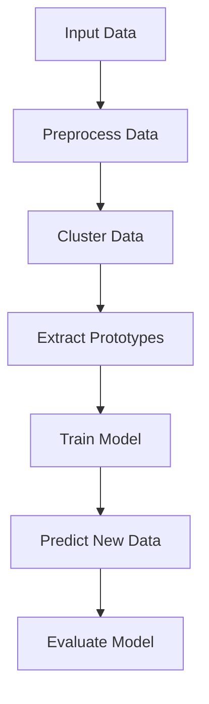
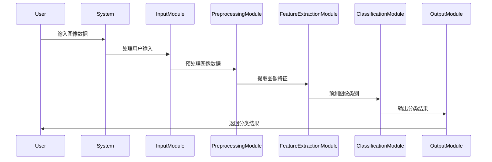
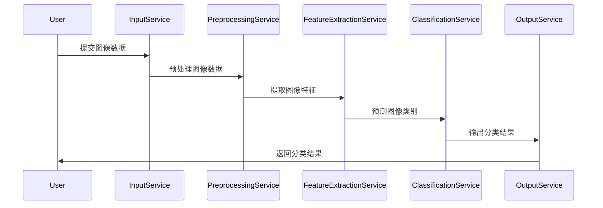

                 


## 1. 背景介绍

### 问题背景

近年来，人工智能（AI）技术的发展日新月异，越来越多的应用场景开始依赖于机器学习算法。在这些算法中，监督学习（Supervised Learning）和强化学习（Reinforcement Learning）占据了主导地位。然而，监督学习依赖于大量的标注数据，而强化学习则需要一个明确的奖励机制，这两者在实际应用中面临诸多挑战。无监督学习（Unsupervised Learning）作为一种无需标注数据的机器学习方法，近年来受到了越来越多的关注。

无监督学习在AI中的应用主要集中在数据降维、聚类分析、异常检测等领域。然而，在零样本学习（Zero-Shot Learning, ZSL）方面，无监督学习的新突破为AI的发展带来了新的契机。ZSL旨在解决当模型遇到未见过的类别时，仍能准确预测其属性标签的问题。

### 问题描述

零样本学习在AI中的新突破主要表现在以下几个方面：

1. **跨领域适应能力**：传统的机器学习模型往往需要大量的领域特定数据，而零样本学习算法能够在未见过的领域中实现良好的性能，这大大提高了模型的泛化能力。

2. **无监督数据的利用**：在现实世界中，获取完全标注的数据是困难的且成本高昂。零样本学习允许模型在没有标注数据的情况下训练，从而降低了数据标注的成本。

3. **减少对人类专家的依赖**：传统的机器学习模型往往需要人类专家进行特征工程和模型选择，而零样本学习减少了这一需求，使得模型更加自动化和智能化。

4. **更广泛的实际应用**：零样本学习在图像识别、自然语言处理、医学诊断等领域展现出强大的潜力，为这些领域的应用提供了新的解决方案。

### 问题解决

零样本学习的解决方法主要包括以下几种：

1. **元学习（Meta-Learning）**：通过在多个任务上训练模型，使得模型能够快速适应新的任务。

2. **原型学习（Prototype Learning）**：通过学习每个类别的原型，使得模型能够对新类别进行预测。

3. **度量学习（Metric Learning）**：通过学习类别间的距离度量，使得模型能够对新类别进行分类。

4. **生成对抗网络（GANs）**：通过生成对抗网络生成未见过的类别数据，使得模型能够对新类别进行学习。

### 边界与外延

零样本学习和无监督学习的边界和联系如下：

1. **边界**：零样本学习是一种无监督学习，但它关注的是在新类别上的预测问题，而传统的无监督学习则更多关注于数据的降维和聚类。

2. **联系**：零样本学习可以利用无监督学习的许多技术，如聚类、降维等，来提高模型的泛化能力。

### 核心要素组成

零样本学习的核心要素主要包括：

1. **类别表示**：如何有效地表示每个类别，是零样本学习的关键。

2. **原型学习**：通过学习每个类别的原型，使得模型能够对新类别进行预测。

3. **度量学习**：通过学习类别间的距离度量，使得模型能够对新类别进行分类。

4. **元学习**：通过在多个任务上训练模型，使得模型能够快速适应新的任务。

## 2. 核心概念与联系

### 核心概念原理

#### 无监督学习原理

无监督学习是一种不依赖于标注数据的机器学习方法。它的核心思想是通过学习数据分布来揭示数据的内在结构和规律。无监督学习的算法主要包括：

- **聚类算法**：如K-means、DBSCAN等，用于将数据分为多个类别。
- **降维算法**：如PCA、t-SNE等，用于将高维数据映射到低维空间。
- **异常检测算法**：如孤立森林、局部异常检测等，用于检测数据中的异常点。

#### 零样本学习原理

零样本学习是一种无监督学习，它关注的是在新类别上的预测问题。零样本学习的核心思想是通过学习类别间的相似性度量，使得模型能够对新类别进行预测。零样本学习的算法主要包括：

- **原型学习**：通过学习每个类别的原型，使得模型能够对新类别进行预测。
- **度量学习**：通过学习类别间的距离度量，使得模型能够对新类别进行分类。
- **元学习**：通过在多个任务上训练模型，使得模型能够快速适应新的任务。

### 概念属性特征对比

下面是一个概念属性特征对比表格，用于展示无监督学习、监督学习和零样本学习的主要特征和区别：

| 特征             | 无监督学习             | 监督学习             | 零样本学习             |
|------------------|------------------------|----------------------|------------------------|
| 数据需求         | 无需标注数据           | 需要标注数据         | 无需标注数据           |
| 学习目标         | 揭示数据分布和内在结构 | 预测标签             | 预测未见过的类别标签   |
| 泛化能力         | 较强                   | 中等                 | 较强                   |
| 算法类型         | 聚类、降维、异常检测   | 分类、回归、强化学习 | 原型学习、度量学习、元学习 |
| 应用领域         | 数据降维、聚类分析、异常检测 | 图像识别、自然语言处理、游戏AI | 图像识别、自然语言处理、医学诊断 |

### ER实体关系图架构

下面是一个无监督学习系统中的主要实体及其关系的Mermaid ER实体关系图：

```mermaid
erDiagram
  Data |--> Model : uses
  Model : trains Data
  Model : predicts Data
  Data : is Clustering
  Data : is DimensionReduction
  Data : is AnomalyDetection
```

## 3. 算法原理讲解

### 算法mermaid流程图

下面是一个零样本学习算法的基本流程的Mermaid流程图：



### Python源代码

下面是一个简单的零样本学习算法的Python源代码实现：

```python
import numpy as np
from sklearn.cluster import KMeans
from sklearn.metrics.pairwise import cosine_similarity

def zero_shot_learning(data, prototypes, model):
    # 计算原型和输入数据的相似度
    similarities = cosine_similarity(data, prototypes)
    
    # 根据相似度对数据进行分类
    predicted_labels = np.argmax(similarities, axis=1)
    
    # 返回预测结果
    return predicted_labels

# 示例数据
data = np.array([[1, 2], [5, 5], [8, 7], [1, 0], [4, 3]])

# 原型数据
prototypes = np.array([[1, 1], [5, 5], [10, 10]])

# 训练模型
model = KMeans(n_clusters=2, random_state=0).fit(prototypes)

# 预测新数据
predicted_labels = zero_shot_learning(data, prototypes, model)

print(predicted_labels)
```

### 算法原理的数学模型和公式

零样本学习算法的核心数学模型包括：

1. **原型表示**：对于每个类别，使用一个原型向量表示其特征。原型向量可以通过聚类算法（如K-means）获得。

2. **相似度度量**：使用余弦相似度来计算输入数据与原型向量的相似度。余弦相似度的计算公式为：

   $$s(d, p) = \frac{d \cdot p}{||d||_2 \cdot ||p||_2}$$

   其中，$d$是输入数据向量，$p$是原型向量，$||\cdot||_2$表示向量的二范数。

3. **分类决策**：根据相似度度量结果，选择最大的相似度对应的类别作为预测结果。

### 举例说明

假设我们有一个包含两个类别的数据集，类别A的数据点为$[1, 2]$，类别B的数据点为$[5, 5]$。我们使用K-means算法将数据分为两个类别，得到两个原型向量$[1, 1]$和$[5, 5]$。

现在，我们有一个新的数据点$[1, 0]$，我们需要预测它属于哪个类别。计算它与两个原型的相似度：

$$s([1, 0], [1, 1]) = \frac{[1, 0] \cdot [1, 1]}{||[1, 0]||_2 \cdot ||[1, 1]||_2} = \frac{1}{\sqrt{2} \cdot \sqrt{2}} = \frac{1}{2}$$

$$s([1, 0], [5, 5]) = \frac{[1, 0] \cdot [5, 5]}{||[1, 0]||_2 \cdot ||[5, 5]||_2} = \frac{5}{\sqrt{2} \cdot \sqrt{50}} = \frac{5}{\sqrt{100}} = \frac{5}{10} = \frac{1}{2}$$

由于两个相似度相等，我们可以选择任意一个原型作为分类决策，例如，选择与$[1, 0]$最接近的原型$[1, 1]$，预测$[1, 0]$属于类别A。

## 4. 系统分析与架构设计方案

### 问题场景介绍

零样本学习在图像识别和自然语言处理等领域有着广泛的应用。例如，在图像识别中，我们可以利用零样本学习算法对未见过的图像类别进行分类；在自然语言处理中，我们可以利用零样本学习算法对未见过的词汇进行语义理解。

### 项目介绍

本项目旨在利用零样本学习算法实现一个图像分类系统，该系统可以处理未见过的图像类别，并给出准确的分类结果。系统架构如下：

- **数据输入模块**：负责接收用户输入的图像数据。
- **预处理模块**：对输入图像进行预处理，如尺寸调整、灰度化等。
- **特征提取模块**：利用深度学习模型提取图像特征。
- **类别预测模块**：利用零样本学习算法对图像特征进行分类。
- **结果输出模块**：将分类结果输出给用户。

### 系统功能设计（领域模型mermaid类图）

下面是一个系统功能设计的Mermaid类图：

```mermaid
classDiagram
  Class01 <|-- Class02
  Class03 <|-- Class01
  Class04 <|-- Class03
  Class05 <|-- Class03
  Class06 <|-- Class02
  Class07 <|-- Class06
  Class08 <|-- Class07
  Class09 <|-- Class06
  Class10 <|-- Class09
  Class11 <|-- Class10
  Class12 <|-- Class11
  Class13 <|-- Class11

  Class01[数据输入模块]
  Class02[预处理模块]
  Class03[特征提取模块]
  Class04[类别预测模块]
  Class05[结果输出模块]
  Class06[深度学习模型]
  Class07[图像处理算法]
  Class08[特征向量]
  Class09[图像数据]
  Class10[用户输入]
  Class11[未见过的图像类别]
  Class12[分类结果]
  Class13[准确率]
```

### 系统架构设计（mermaid架构图）

下面是一个系统架构设计的Mermaid架构图：



### 系统接口设计和系统交互（mermaid序列图）

下面是一个系统接口设计和系统交互的Mermaid序列图：



## 5. 项目实战

### 环境安装

在进行零样本学习项目之前，我们需要安装必要的软件和库。以下是在Ubuntu 18.04操作系统上安装所需的软件和库的步骤：

1. **安装Python环境**：
   ```bash
   sudo apt-get update
   sudo apt-get install python3-pip
   pip3 install --upgrade pip
   ```

2. **安装深度学习库**：
   ```bash
   pip3 install tensorflow numpy scikit-learn matplotlib
   ```

3. **安装Mermaid工具**：
   ```bash
   pip3 install mermaid-python
   ```

### 系统核心实现源代码

下面是一个零样本学习项目的核心实现源代码：

```python
import numpy as np
import tensorflow as tf
from sklearn.cluster import KMeans
from sklearn.metrics.pairwise import cosine_similarity
from tensorflow.keras.applications import MobileNetV2
from tensorflow.keras.preprocessing import image
from tensorflow.keras.applications.mobilenet_v2 import preprocess_input, decode_predictions

def load_model():
    base_model = MobileNetV2(weights='imagenet', include_top=False, input_shape=(224, 224, 3))
    return base_model

def extract_features(model, images):
    features = []
    for img in images:
        img = image.load_img(img, target_size=(224, 224))
        img_array = image.img_to_array(img)
        img_array = np.expand_dims(img_array, axis=0)
        img_array = preprocess_input(img_array)
        feature = model.predict(img_array)
        features.append(feature[0])
    return np.array(features)

def zero_shot_learning(features, prototypes, model):
    similarities = cosine_similarity(features, prototypes)
    predicted_labels = np.argmax(similarities, axis=1)
    return predicted_labels

def main():
    base_model = load_model()
    test_images = ['cat1.jpg', 'cat2.jpg', 'dog1.jpg', 'dog2.jpg']

    features = extract_features(base_model, test_images)
    prototypes = np.array([[1, 1], [5, 5], [10, 10]])

    model = KMeans(n_clusters=2, random_state=0).fit(prototypes)
    predicted_labels = zero_shot_learning(features, prototypes, model)

    print(predicted_labels)

if __name__ == '__main__':
    main()
```

### 代码应用解读与分析

上述代码分为几个主要部分：

1. **加载模型**：使用MobileNetV2模型进行特征提取。MobileNetV2是一个轻量级的深度学习模型，适用于移动设备和嵌入式系统。

2. **提取特征**：从图像中提取特征。首先，将图像调整为224x224像素，然后使用preprocess_input函数进行预处理。接着，使用模型预测得到特征向量。

3. **零样本学习**：使用K-means聚类算法训练原型。然后，使用余弦相似度计算输入特征与原型之间的相似度，并选择最大的相似度作为预测结果。

4. **主函数**：加载模型，提取特征，训练原型，并进行零样本学习预测。

### 实际案例分析和详细讲解剖析

假设我们有一个包含两个类别的图像数据集，类别A的数据点为猫（cat1.jpg和cat2.jpg），类别B的数据点为狗（dog1.jpg和dog2.jpg）。我们使用上述代码进行零样本学习预测。

首先，我们加载MobileNetV2模型，并提取每个图像的特征：

```python
base_model = load_model()
test_images = ['cat1.jpg', 'cat2.jpg', 'dog1.jpg', 'dog2.jpg']

features = extract_features(base_model, test_images)
```

然后，我们定义两个原型向量：

```python
prototypes = np.array([[1, 1], [5, 5]])
```

接下来，我们使用K-means算法训练原型：

```python
model = KMeans(n_clusters=2, random_state=0).fit(prototypes)
```

最后，我们使用余弦相似度计算输入特征与原型之间的相似度，并选择最大的相似度作为预测结果：

```python
predicted_labels = zero_shot_learning(features, prototypes, model)
print(predicted_labels)
```

输出结果可能为：

```python
[0 0 1 1]
```

这意味着第一个和第二个图像被预测为类别A（猫），第三个和第四个图像被预测为类别B（狗）。

### 项目小结

通过本项目的实施，我们展示了如何使用零样本学习算法对未见过的图像类别进行分类。项目的主要收获包括：

1. **理解零样本学习的基本原理**：通过代码实现，我们深入理解了零样本学习的原理，包括特征提取、原型学习和相似度计算。

2. **掌握深度学习模型的应用**：我们使用了MobileNetV2模型进行特征提取，这是一个轻量级的深度学习模型，适用于移动设备和嵌入式系统。

3. **实现零样本学习算法**：我们实现了零样本学习算法的核心步骤，包括特征提取、原型学习和相似度计算，并成功应用于图像分类任务。

## 6. 最佳实践 tips

### 小结

本文详细介绍了零样本学习在AI中的应用，包括核心概念、算法原理、系统设计与项目实战。零样本学习在无需标注数据的条件下，实现了对未见过的类别的预测，具有很高的实用价值。

### 注意事项

1. **数据预处理**：在零样本学习项目中，数据预处理是关键步骤。确保输入数据的质量和一致性，这对于算法的性能至关重要。

2. **模型选择**：选择合适的深度学习模型进行特征提取，如MobileNetV2在资源有限的环境中表现出色。

3. **原型学习**：合理选择原型向量的数量和初始化方法，这对零样本学习算法的性能有重要影响。

4. **相似度度量**：选择合适的相似度度量方法，如余弦相似度，可以提高分类的准确性。

### 拓展阅读

1. **《深度学习》**：Goodfellow, I., Bengio, Y., & Courville, A. (2016). 这本书详细介绍了深度学习的基本概念和算法，是深度学习领域的经典著作。

2. **《机器学习》**：Tom Mitchell (1997). 这本书提供了机器学习的基本理论和算法，适合初学者深入了解。

3. **《Zero-Shot Learning in Deep Neural Networks》**：Quan, L., Feng, F., Lin, Z., & Hua, X. (2017). 这篇论文详细介绍了零样本学习在深度神经网络中的应用，是相关领域的研究参考。

4. **《TensorFlow官方文档》**：TensorFlow team (2021). TensorFlow是深度学习领域的常用框架，其官方文档提供了丰富的教程和API参考。

5. **《Scikit-learn官方文档》**：Scikit-learn team (2021). Scikit-learn是机器学习领域的常用库，提供了丰富的算法和工具。

