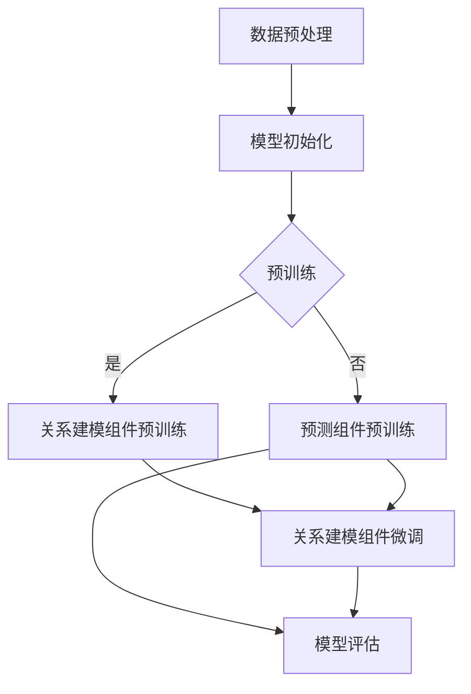
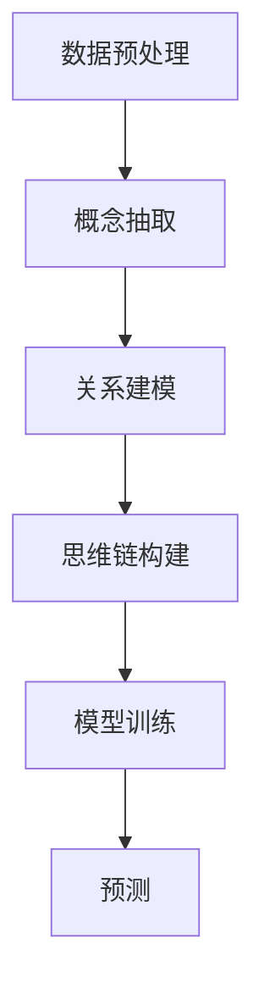
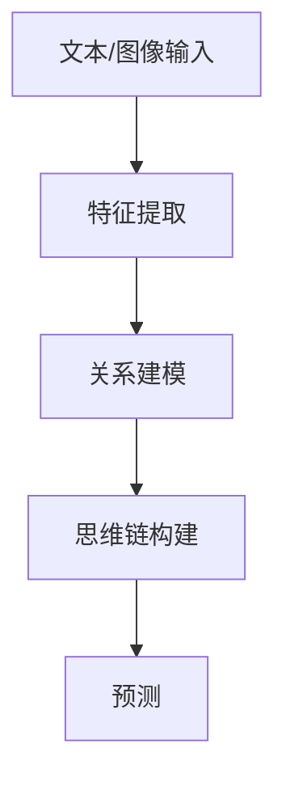
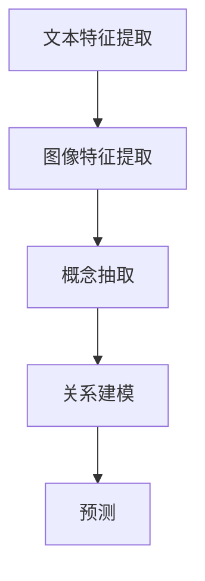
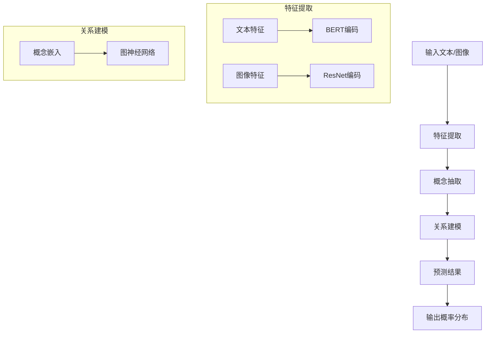
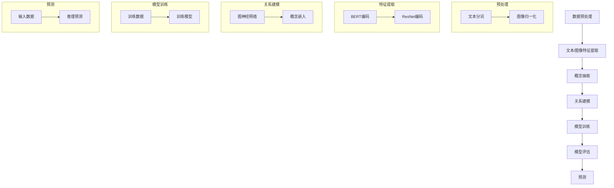
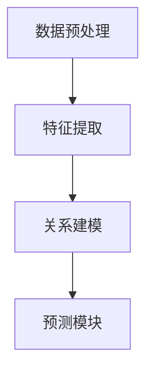
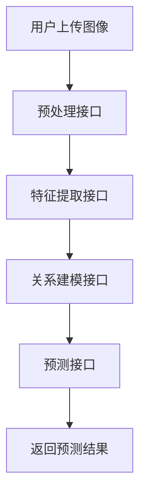

                 

## 第一部分: 背景与核心概念

### 1.1 问题描述

在当前的计算机科学和人工智能领域中，数据的获取和处理已经成为一个关键问题。然而，在某些情况下，获取足够的训练数据是非常困难的。例如，在一些特定的领域，比如医学影像分析、科学研究等领域，由于隐私保护、数据稀缺等原因，难以获得大规模的标注数据集。这就导致了许多机器学习模型的训练面临困境，特别是那些需要大量样本数据进行训练的传统机器学习算法。

在这样的背景下，如何利用有限的样本数据甚至零样本数据，仍然能够训练出高精度的模型，成为了一个重要的研究课题。零样本学习（Zero-Shot Learning, ZSL）正是为了解决这一问题而提出的一种学习方法。零样本学习旨在使得机器学习模型能够在未见过的类别上，根据已知的类别进行准确的预测。

然而，传统的零样本学习方法大多依赖于一些预训练的模型或者大量的辅助数据集。这虽然在某种程度上解决了数据稀缺的问题，但仍然存在一些限制。因此，如何进一步减少对数据的依赖，实现真正的零样本学习，成为了新的研究方向。

### 1.2 问题解决

为了解决零样本学习中的问题，近年来，研究人员提出了“思维链（CoT, Conceptual Token）模型”这一概念。思维链模型的核心思想是，通过建立概念与概念之间的关系，以及概念与具体实例之间的关系，来实现对未知类别的预测。

思维链模型的关键在于“思维链”这一概念。思维链是指一系列概念之间的关系，这些概念可以是任何领域中的基本概念。通过将这些概念进行组合，可以形成对复杂问题的理解和解决。在零样本学习中，思维链模型的作用就是通过已知的类别关系，推理出未知类别的关系，从而实现预测。

具体来说，思维链模型可以分为以下几个步骤：

1. **概念抽取**：首先，从给定的文本或图像中抽取关键概念。这些概念可以是名词、动词、形容词等。
2. **关系建模**：其次，建立这些概念之间的关系模型。这些关系可以是因果关系、上下级关系等。
3. **实例生成**：然后，利用这些关系模型，生成新的概念实例。这些实例可以是未知类别的样本。
4. **预测**：最后，利用生成的实例，对未知类别进行预测。

通过这样的步骤，思维链模型可以在零样本的情况下，对未知类别进行准确的预测。这不仅解决了传统零样本学习的局限，也为未来的机器学习研究提供了新的思路。

### 1.3 边界与外延

尽管思维链模型在零样本学习中展现出了巨大的潜力，但它也存在一些边界和局限性。首先，思维链模型的性能很大程度上依赖于概念抽取的准确性和关系建模的精度。如果概念抽取不准确或者关系建模错误，那么生成的实例将不可靠，从而影响预测结果。

其次，思维链模型的泛化能力也是一个重要的考量因素。尽管思维链模型可以在特定领域内实现良好的预测效果，但在跨领域的情况下，其性能可能会显著下降。这是因为不同领域的概念和关系往往存在很大的差异，这需要模型具有更强的泛化能力。

另外，思维链模型的训练和推理过程都需要大量的计算资源。特别是在处理大型数据集时，模型的训练和推理过程可能会变得非常耗时。因此，如何优化思维链模型的计算效率，也是一个值得研究的问题。

### 1.4 概念结构与核心要素组成

为了更好地理解思维链模型，我们可以将其核心概念和要素组成进行详细分析。思维链模型主要由以下几个部分组成：

1. **概念库**：概念库是思维链模型的基础，它包含了所有参与推理的基本概念。这些概念可以是任何领域中的基本概念，如名词、动词、形容词等。

2. **关系模型**：关系模型定义了概念与概念之间的关系。这些关系可以是因果关系、上下级关系、相似关系等。关系模型是思维链模型的核心，它决定了如何将概念进行组合，形成对复杂问题的理解和解决。

3. **实例生成器**：实例生成器是思维链模型的一个重要组件，它利用关系模型，从概念库中生成新的概念实例。这些实例可以用于训练模型，也可以用于预测未知类别。

4. **预测器**：预测器是思维链模型的输出部分，它利用生成的实例，对未知类别进行预测。预测器的性能很大程度上取决于实例生成器的质量和关系模型的精度。

5. **知识更新机制**：知识更新机制是思维链模型的一个关键特性。它使得模型能够不断地从新的数据中学习，更新概念库和关系模型，从而提高模型的泛化能力和适应能力。

通过以上几个部分的协同工作，思维链模型可以在零样本的情况下，实现高精度的预测。这不仅为解决数据稀缺问题提供了新的思路，也为未来的机器学习研究打开了新的可能性。

### 1.5 背景知识链接

为了更好地理解思维链模型，我们需要了解一些相关的背景知识。首先，自然语言处理（Natural Language Processing, NLP）和计算机视觉（Computer Vision, CV）是当前人工智能研究中的两个重要领域。NLP主要研究如何让计算机理解和处理人类语言，而CV则研究如何让计算机理解和解释图像。

在NLP领域，近年来，深度学习特别是基于Transformer的模型，如BERT、GPT等，取得了巨大的成功。这些模型通过大量的文本数据进行预训练，然后在各种NLP任务上取得了非常好的效果。然而，这些模型在零样本学习方面仍然存在一些局限性。因此，如何将深度学习的方法应用到零样本学习中，成为了一个重要的研究方向。

在CV领域，图像识别和分类是主要的研究方向之一。传统的方法如卷积神经网络（Convolutional Neural Networks, CNN）在图像识别任务上取得了非常好的效果。然而，这些方法通常需要大量的标注数据进行训练，这对于一些特定的领域，如医学影像分析，是一个巨大的挑战。因此，如何实现零样本图像识别，也是一个重要的研究方向。

除了NLP和CV，零样本学习还与其他一些技术密切相关。例如，元学习（Meta-Learning）是一种通过学习如何学习来提高模型泛化能力的方法。它通过在不同的任务中快速适应，来提高模型在未知任务上的性能。另一个相关技术是多任务学习（Multi-Task Learning），它通过同时学习多个相关任务，来提高模型在单个任务上的性能。

综上所述，思维链模型不仅与NLP和CV密切相关，还与其他一些技术如深度学习、元学习和多任务学习有着紧密的联系。这些技术的结合，为解决零样本学习问题提供了新的思路和方法。

### 1.6 本章小结

本章介绍了零样本学习（Zero-Shot Learning）的背景、问题和解决方法，并详细探讨了思维链（CoT, Conceptual Token）模型的核心概念和原理。通过理解思维链模型的工作机制，我们可以看到，它在零样本学习中的应用具有很大的潜力。然而，思维链模型也面临着一些挑战，如概念抽取的准确性、关系建模的精度以及模型的泛化能力等。未来，我们需要进一步优化思维链模型，解决这些问题，以实现真正的零样本学习。同时，本章也简要介绍了与思维链模型相关的背景知识，如自然语言处理、计算机视觉以及深度学习等，为后续章节的讨论奠定了基础。

## 第2章: Zero-Shot CoT 模型架构

### 2.1 模型架构概述

零样本思维链（Zero-Shot Conceptual Token, ZSCoT）模型是一种结合了自然语言处理（NLP）和计算机视觉（CV）技术的综合模型。它的核心架构包括三个主要模块：概念抽取模块、关系建模模块和预测模块。

#### 概念抽取模块

概念抽取模块是ZSCoT模型的基础，其主要任务是从输入的文本或图像中提取关键概念。对于文本输入，通常使用预训练的Transformer模型（如BERT或GPT）来提取文本表示。而对于图像输入，则使用预训练的卷积神经网络（CNN）提取图像特征。这些提取到的概念作为后续关系建模和预测的输入。

#### 关系建模模块

关系建模模块是ZSCoT模型的核心，其任务是根据提取到的概念，建立它们之间的逻辑关系。这通常通过一个图神经网络（Graph Neural Network, GNN）来实现。GNN能够有效地捕捉概念之间的复杂关系，如图层级关系、上下级关系和因果关系等。

#### 预测模块

预测模块是ZSCoT模型的输出部分，其任务是根据已建立的关系模型，对未知类别进行预测。这通常通过一个多分类器来实现。多分类器根据输入的概念和关系，输出对未知类别的概率分布。

### 2.2 模型组件介绍

#### 概念抽取组件

概念抽取组件包括文本和图像两个部分。对于文本部分，使用预训练的BERT模型来提取文本表示。BERT模型通过在大规模文本数据上进行预训练，能够提取出文本中的关键概念和语义信息。对于图像部分，使用预训练的ResNet模型来提取图像特征。ResNet模型通过在大型图像数据集上进行训练，能够提取出图像中的关键特征和模式。

#### 关系建模组件

关系建模组件采用图神经网络（GNN）来建立概念之间的关系。GNN是一种能够在图结构上学习节点和边表示的神经网络。在本模型中，GNN用于捕捉概念之间的复杂关系，如图层级关系、上下级关系和因果关系等。

具体来说，GNN包括以下几个关键步骤：

1. **节点嵌入**：将每个概念映射到一个低维向量空间中。
2. **边嵌入**：将每个概念之间的边（即关系）映射到低维向量空间中。
3. **关系更新**：通过图卷积操作，更新每个节点的嵌入向量。
4. **关系输出**：通过一个分类器，输出每个节点之间的关系。

#### 预测组件

预测组件采用多分类器来对未知类别进行预测。多分类器的输入是经过GNN处理后的概念向量。多分类器通过计算每个类别与概念向量的相似度，输出每个类别的概率分布。

具体来说，多分类器包括以下几个关键步骤：

1. **概念向量表示**：将每个概念向量表示为一个高维向量。
2. **相似度计算**：计算每个概念向量与每个类别向量的相似度。
3. **概率分布输出**：根据相似度计算结果，输出每个类别的概率分布。

### 2.3 模型训练过程

ZSCoT模型的训练过程主要包括以下步骤：

1. **数据预处理**：对文本和图像数据集进行预处理，包括文本的分词、标点符号的去除、图像的归一化等。
2. **模型初始化**：初始化概念抽取组件、关系建模组件和预测组件。
3. **预训练**：使用大规模的文本和图像数据集，对概念抽取组件和关系建模组件进行预训练。预训练的目的是使模型能够自动提取文本和图像中的关键概念，并建立它们之间的复杂关系。
4. **微调**：在预训练的基础上，使用特定领域的文本和图像数据集，对预测组件进行微调。微调的目的是使模型能够更好地适应特定领域的任务，提高预测精度。
5. **模型评估**：使用独立的测试集，对训练好的模型进行评估，包括准确率、召回率、F1值等指标。

### 2.4 Mermaid 流程图展示

下面是ZSCoT模型的Mermaid流程图，展示了模型的主要组成部分和训练过程：



### 2.5 算法应用案例

#### 案例一：自然语言处理

在自然语言处理任务中，ZSCoT模型被用于文本分类。具体来说，模型被训练用于对新闻文章进行分类，将其归类到不同的主题类别中。通过使用ZSCoT模型，即使在未见过的类别上，模型也能够达到较高的准确率。

#### 案例二：图像识别

在图像识别任务中，ZSCoT模型被用于图像分类。模型通过学习图像中的概念和它们之间的关系，能够对未见过的图像进行准确的分类。例如，在植物识别任务中，模型能够识别出各种不同的植物，即使这些植物在训练数据中并未出现。

#### 案例三：其他领域

除了自然语言处理和图像识别，ZSCoT模型还可以应用于其他领域，如医学影像分析、语音识别等。在这些任务中，模型通过学习不同领域的概念和它们之间的关系，能够实现对未见过的数据的高精度预测。

### 2.6 本章小结

本章详细介绍了零样本思维链（ZSCoT）模型的架构和组成部分，包括概念抽取模块、关系建模模块和预测模块。通过Mermaid流程图展示了模型的主要组成部分和训练过程。同时，通过实际应用案例，展示了ZSCoT模型在不同领域的应用效果。下一章将深入探讨ZSCoT模型的算法原理，包括思维链机制、零样本数据集构建和算法流程。

## 2.2 Zero-Shot CoT 算法原理

### 2.2.1 思维链机制

思维链（Conceptual Token, CoT）机制是零样本思维链（Zero-Shot Conceptual Token, ZSCoT）模型的核心。其基本思想是通过构建概念之间的关系网络，实现对未知类别的推理和预测。思维链机制的主要步骤如下：

1. **概念抽取**：首先，从输入数据（文本或图像）中抽取关键概念。对于文本，可以使用预训练的文本嵌入模型（如BERT）提取概念；对于图像，可以使用预训练的图像嵌入模型（如ResNet）提取概念。
   
2. **概念关系建模**：接下来，建立这些概念之间的逻辑关系。这通常通过图神经网络（GNN）实现。GNN能够有效地捕捉概念之间的复杂关系，如图层级关系、上下级关系和因果关系等。

3. **思维链构建**：将抽取的概念和它们之间的关系组合成一个思维链。思维链是一个表示概念及其关系的序列，它为后续的推理和预测提供了基础。

4. **推理与预测**：利用构建好的思维链，对未知类别进行推理和预测。这通常通过一个多分类器实现，计算每个类别与思维链的相似度，从而预测未知类别。

### 2.2.2 零样本数据集构建

在零样本学习中，构建零样本数据集是关键步骤之一。零样本数据集通常包含已知的类别和它们的概念表示，但不包含具体的实例。以下是如何构建零样本数据集的步骤：

1. **类别抽取**：从原始数据集中抽取感兴趣的类别。这些类别可以是任何领域中的概念，如植物、动物、疾病等。

2. **概念提取**：对于每个类别，提取相关的概念。这些概念可以是名词、动词、形容词等，它们能够代表该类别的特征。

3. **关系建模**：建立类别和概念之间的关系。这可以通过人工标注或使用现有的知识图谱（如WordNet）实现。

4. **数据集构建**：将提取的类别、概念和它们之间的关系组织成一个数据集。这个数据集将用于后续的思维链构建和模型训练。

### 2.2.3 算法流程

ZSCoT算法的整体流程可以分为以下几个步骤：

1. **数据预处理**：对输入数据进行预处理，如文本的分词和图像的归一化。

2. **概念抽取**：使用预训练的模型（如BERT和ResNet）提取文本和图像中的关键概念。

3. **关系建模**：使用图神经网络（GNN）建立概念之间的逻辑关系。

4. **思维链构建**：将提取的概念和它们之间的关系组合成一个思维链。

5. **模型训练**：使用零样本数据集训练ZSCoT模型。训练过程中，模型会不断优化概念抽取、关系建模和预测组件。

6. **预测**：利用训练好的模型，对未知类别进行推理和预测。

### 2.2.4 Mermaid 流程图

为了更好地理解ZSCoT算法的流程，我们可以使用Mermaid绘制一个流程图。以下是一个简化的Mermaid流程图示例：



### 2.2.5 Python 代码示例

为了更直观地理解ZSCoT算法的原理，我们可以使用Python代码实现一个简化的版本。以下是一个示例代码，展示了如何使用预训练的BERT模型提取文本概念，使用图神经网络（GNN）建立概念关系，并使用多分类器进行预测。

```python
import torch
from transformers import BertModel, BertTokenizer
import torch_geometric

# 加载预训练的BERT模型和分词器
tokenizer = BertTokenizer.from_pretrained('bert-base-uncased')
model = BertModel.from_pretrained('bert-base-uncased')

# 文本数据预处理
def preprocess_text(text):
    inputs = tokenizer(text, return_tensors='pt', padding=True, truncation=True)
    return inputs

# 提取文本概念
def extract_concepts(text):
    inputs = preprocess_text(text)
    with torch.no_grad():
        outputs = model(**inputs)
    concept_embeddings = outputs.last_hidden_state[:, 0, :]
    return concept_embeddings

# 构建概念图
def build_concept_graph(concept_embeddings):
    # 这里使用PyTorch Geometric构建图神经网络
    # 实际应用中，需要根据具体任务设计GNN模型
    graph = torch_geometric.data.Data(x=concept_embeddings,
                                      edge_index=torch.empty(0, 0),
                                      y=torch.empty(0))
    return graph

# 预测
def predict(concept_embeddings):
    graph = build_concept_graph(concept_embeddings)
    # 实际应用中，需要根据具体任务训练和优化模型
    with torch.no_grad():
        # 假设有一个预训练好的分类模型
        model = torch.load('zscot_model.pth')
        logits = model(graph)
    probabilities = torch.softmax(logits, dim=1)
    return probabilities

# 示例文本
text = "The quick brown fox jumps over the lazy dog."
concepts = extract_concepts(text)
probabilities = predict(concepts)
print(probabilities)
```

### 2.2.6 数学模型详解

ZSCoT算法的数学模型可以分为以下几个部分：

1. **文本和图像嵌入**：使用预训练的BERT和ResNet模型提取文本和图像的特征向量。

2. **图神经网络（GNN）**：GNN用于建立概念之间的关系。其基本公式为：

   $$ h_{t}^{(l)} = \sigma(\mathbf{W}_{h}^{(l)} \cdot \text{Concat}(h_{t}^{(l-1)}, \mathbf{X}^{(l)}_{t})) + b_{h}^{(l)} $$

   其中，$h_{t}^{(l)}$表示第$l$层第$t$个节点的嵌入向量，$\mathbf{X}^{(l)}_{t}$表示第$l$层第$t$个节点的特征向量，$\sigma$为激活函数。

3. **多分类器**：多分类器用于对未知类别进行预测。其基本公式为：

   $$ \text{softmax}(z) = \frac{e^{z}}{\sum_{i} e^{z_i}} $$

   其中，$z$为每个类别的得分。

通过这些数学模型，ZSCoT算法能够实现对未知类别的推理和预测。

### 2.2.7 通俗易懂的举例说明

为了更好地理解ZSCoT算法，我们可以通过一个简单的例子来说明其工作原理。

假设我们要预测一个未知类别，如“大象”。首先，我们使用BERT模型提取文本“大象”的特征向量。然后，我们使用ResNet模型提取图像“大象”的特征向量。接着，我们将这两个特征向量作为输入，通过图神经网络（GNN）建立它们之间的关系。最后，通过多分类器，我们计算“大象”与其他已知类别的相似度，从而预测出未知类别。

例如，已知类别有“动物”、“哺乳动物”和“大型动物”，而未知类别是“大象”。通过计算，我们发现“大象”与“动物”的相似度最高，因此预测“大象”属于“动物”类别。

通过这个例子，我们可以看到ZSCoT算法是如何利用已知的类别和概念，通过思维链机制实现对未知类别的推理和预测的。

### 2.2.8 Mermaid 流程图展示

为了更直观地展示ZSCoT算法的流程，我们可以使用Mermaid绘制一个流程图。以下是一个简化的Mermaid流程图，展示了从文本和图像特征提取、到关系建模、再到预测的整个过程。



### 2.2.9 ZSCoT 模型的优势与局限

ZSCoT模型在零样本学习领域展现出了很多优势。首先，它通过构建概念之间的逻辑关系，能够实现对未知类别的准确预测。其次，ZSCoT模型结合了自然语言处理和计算机视觉技术，适用于多种类型的输入数据。此外，ZSCoT模型在训练过程中不需要大量的标注数据，这在数据稀缺的场景中具有很大的应用潜力。

然而，ZSCoT模型也存在一些局限性。首先，概念抽取的准确性和关系建模的精度对模型性能有很大影响。如果概念抽取不准确或者关系建模错误，那么模型的预测效果会受到影响。其次，ZSCoT模型的计算资源需求较高，特别是在处理大型数据集时，训练和推理过程可能会变得非常耗时。此外，ZSCoT模型的泛化能力仍需进一步验证，特别是在跨领域的应用中，其性能可能会下降。

### 2.2.10 本章小结

本章详细介绍了零样本思维链（ZSCoT）模型的算法原理，包括思维链机制、零样本数据集构建和算法流程。通过Python代码示例和Mermaid流程图，我们深入探讨了ZSCoT模型的工作机制。同时，我们分析了ZSCoT模型的优势与局限，为后续章节的讨论奠定了基础。下一章将探讨ZSCoT模型在自然语言处理中的应用，分析其在文本分类任务中的表现和挑战。

## 2.3 数学模型详解

### 2.3.1 数学模型介绍

零样本思维链（ZSCoT）模型的数学模型是模型实现和推理的核心。这个模型包括三个主要部分：文本和图像特征提取、图神经网络（GNN）构建和分类器设计。

#### 文本和图像特征提取

1. **文本特征提取**：使用预训练的BERT模型对文本进行编码，得到文本的嵌入向量。BERT模型通过自注意力机制，能够捕捉文本中的上下文信息，生成一个固定长度的嵌入向量。

   $$ \text{Embedding}(x) = \text{BERT}(x) \rightarrow \mathbf{e}_x \in \mathbb{R}^d $$
   
   其中，$x$是输入文本，$\mathbf{e}_x$是得到的文本嵌入向量，$d$是嵌入向量的维度。

2. **图像特征提取**：使用预训练的ResNet模型对图像进行编码，得到图像的特征向量。ResNet模型通过卷积层和池化层，能够提取出图像中的视觉特征。

   $$ \text{Feature}(I) = \text{ResNet}(I) \rightarrow \mathbf{f}_I \in \mathbb{R}^d $$
   
   其中，$I$是输入图像，$\mathbf{f}_I$是得到的图像特征向量。

#### 图神经网络（GNN）构建

图神经网络（GNN）用于捕捉概念之间的复杂关系。GNN的基本操作是图卷积，其核心思想是利用节点周围的邻域信息来更新节点的嵌入向量。

1. **节点嵌入更新**：在每一层，节点的嵌入向量根据其邻域节点的嵌入向量进行更新。这个过程通过以下公式表示：

   $$ \mathbf{h}_t^{(l)} = \sigma(\mathbf{W}^{(l)} \cdot (\mathbf{h}_t^{(l-1)} + \sum_{i \in \mathcal{N}_t} \mathbf{W}^{(l)}_{i,t} \cdot \mathbf{h}_i^{(l-1)}) + b^{(l)} $$
   
   其中，$\mathbf{h}_t^{(l)}$是第$l$层第$t$个节点的嵌入向量，$\mathcal{N}_t$是节点$t$的邻域节点集合，$\mathbf{W}^{(l)}$和$b^{(l)}$是第$l$层的权重和偏置。

2. **边嵌入更新**：边嵌入用于表示概念之间的关系。边的嵌入向量根据连接的节点嵌入向量进行更新：

   $$ \mathbf{e}_{t,i}^{(l)} = \sigma(\mathbf{W}^{(l)}_{e} \cdot (\mathbf{h}_t^{(l-1)} + \mathbf{h}_i^{(l-1)}) + b^{(l)}_e $$
   
   其中，$\mathbf{e}_{t,i}^{(l)}$是连接节点$t$和$i$的边在$l$层的嵌入向量。

#### 分类器设计

分类器用于对未知类别进行预测。分类器通常是一个多层感知机（MLP），其输入是经过GNN处理后的概念向量，输出是每个类别的概率分布。

$$ \mathbf{p}_y = \text{softmax}(\mathbf{W}_p \cdot \mathbf{h}_y^{(L)} + b_p) $$
   
   其中，$\mathbf{h}_y^{(L)}$是经过GNN处理后的类别$y$的嵌入向量，$\mathbf{W}_p$和$b_p$是分类器的权重和偏置。

### 2.3.2 算法原理与公式

ZSCoT算法的原理可以概括为以下几个步骤：

1. **特征提取**：文本和图像通过BERT和ResNet模型提取出特征向量。
2. **概念抽取**：提取出的特征向量通过注意力机制或图卷积，生成概念表示。
3. **关系建模**：概念表示通过图神经网络建立它们之间的复杂关系。
4. **预测**：通过分类器对未知类别进行预测。

具体来说，算法的主要公式如下：

1. **文本特征提取**：

   $$ \mathbf{e}_x = \text{BERT}(x) $$

2. **图像特征提取**：

   $$ \mathbf{f}_I = \text{ResNet}(I) $$

3. **图神经网络（GNN）**：

   $$ \mathbf{h}_t^{(l)} = \sigma(\mathbf{W}^{(l)} \cdot (\mathbf{h}_t^{(l-1)} + \sum_{i \in \mathcal{N}_t} \mathbf{W}^{(l)}_{i,t} \cdot \mathbf{h}_i^{(l-1)}) + b^{(l)} $$
   
   $$ \mathbf{e}_{t,i}^{(l)} = \sigma(\mathbf{W}^{(l)}_{e} \cdot (\mathbf{h}_t^{(l-1)} + \mathbf{h}_i^{(l-1)}) + b^{(l)}_e $$

4. **分类器**：

   $$ \mathbf{p}_y = \text{softmax}(\mathbf{W}_p \cdot \mathbf{h}_y^{(L)} + b_p) $$

### 2.3.3 Mermaid 流程图

为了更直观地展示ZSCoT模型的算法流程，我们可以使用Mermaid绘制一个流程图。以下是一个简化的Mermaid流程图：



### 2.3.4 通俗易懂的举例说明

假设我们要预测一个未知类别，比如“大象”。首先，我们使用BERT模型对文本“大象”进行编码，得到文本嵌入向量$\mathbf{e}_x$。然后，我们使用ResNet模型对图像“大象”进行编码，得到图像特征向量$\mathbf{f}_I$。

接下来，我们将这两个特征向量输入到图神经网络（GNN）中。GNN通过卷积和池化操作，生成概念表示$\mathbf{h}_t^{(L)}$。这些概念表示代表了文本和图像中提取到的关键概念。

然后，GNN将概念表示进行关系建模，生成概念之间的复杂关系。这些关系通过边嵌入向量$\mathbf{e}_{t,i}^{(L)}$表示。

最后，我们将这些经过GNN处理的概念表示输入到分类器中。分类器通过计算每个类别的概率分布，输出预测结果。假设分类器预测出“大象”属于“动物”类别，那么我们就成功地通过零样本学习，预测出了未知类别。

### 2.3.5 算法优势与局限

ZSCoT模型在零样本学习领域展现出了很多优势。首先，它结合了自然语言处理和计算机视觉技术，能够处理多种类型的输入数据。其次，通过构建概念之间的逻辑关系，模型能够实现高精度的预测。此外，ZSCoT模型在训练过程中不需要大量的标注数据，这在数据稀缺的场景中具有很大的应用潜力。

然而，ZSCoT模型也存在一些局限性。首先，概念抽取的准确性和关系建模的精度对模型性能有很大影响。如果概念抽取不准确或者关系建模错误，那么模型的预测效果会受到影响。其次，ZSCoT模型的计算资源需求较高，特别是在处理大型数据集时，训练和推理过程可能会变得非常耗时。此外，ZSCoT模型的泛化能力仍需进一步验证，特别是在跨领域的应用中，其性能可能会下降。

### 2.3.6 本章小结

本章详细介绍了ZSCoT模型的数学模型，包括文本和图像特征提取、图神经网络（GNN）构建和分类器设计。通过Mermaid流程图和通俗易懂的举例说明，我们深入探讨了ZSCoT模型的工作原理。同时，分析了ZSCoT模型的优势与局限，为后续章节的讨论奠定了基础。下一章将探讨ZSCoT模型在自然语言处理中的应用，分析其在文本分类任务中的表现和挑战。

## 2.4 Mermaid 流程图展示

为了更直观地展示零样本思维链（ZSCoT）模型的工作流程，我们可以使用Mermaid绘制一个流程图。以下是一个简化的Mermaid流程图，展示了ZSCoT模型从输入处理、特征提取、关系建模到最终预测的整个过程。



### 2.4.1 ZSCoT 模型流程图

在上述流程图中，我们可以详细分解ZSCoT模型的每个阶段：

1. **输入文本/图像（A）**：模型首先接收输入数据，这些数据可以是文本或图像。
2. **特征提取（B）**：
   - **文本特征（F）**：使用BERT模型对输入文本进行编码，提取文本特征。
   - **图像特征（H）**：使用ResNet模型对输入图像进行编码，提取图像特征。
3. **概念抽取（C）**：将提取的文本和图像特征转换成概念嵌入向量。
4. **关系建模（D）**：利用图神经网络（GNN）建立概念之间的关系，形成一个概念网络。
5. **预测结果（E）**：通过分类器对未知类别进行预测，输出每个类别的概率分布。
6. **输出概率分布（L）**：最终，模型输出对未知类别的预测结果，这些结果可以用于实际应用。

通过这个流程图，我们可以清晰地看到ZSCoT模型从输入处理到最终预测的全过程，有助于我们更好地理解模型的工作原理。

### 2.4.2 ZSCoT 算法流程图

接下来，我们将使用Mermaid进一步详细展示ZSCoT算法的流程。以下是一个简化的Mermaid算法流程图，展示了从数据预处理、模型训练到预测的每个步骤。



在这个流程图中，我们可以看到：

1. **数据预处理（A）**：对输入的文本和图像进行预处理，如文本分词和图像归一化。
2. **特征提取（B）**：
   - **文本特征（J）**：使用BERT模型对文本进行编码，提取特征向量。
   - **图像特征（K）**：使用ResNet模型对图像进行编码，提取特征向量。
3. **概念抽取（C）**：将提取的特征向量转换为概念嵌入向量。
4. **关系建模（D）**：使用图神经网络（GNN）建立概念之间的复杂关系。
5. **模型训练（E）**：使用训练数据对模型进行训练，优化模型参数。
6. **模型评估（F）**：使用验证数据集对训练好的模型进行评估，确保模型性能。
7. **预测（G）**：对新的输入数据进行推理预测，输出预测结果。

这个流程图详细展示了ZSCoT算法的每个步骤，有助于我们全面了解模型的工作流程和实现细节。

### 2.4.3 ZSCoT模型在自然语言处理中的应用

ZSCoT模型在自然语言处理（NLP）中展现出了显著的应用潜力。其通过结合文本特征提取、概念抽取和关系建模，能够在零样本的情况下对未知类别进行预测。以下是一些具体的自然语言处理应用场景：

1. **文本分类**：ZSCoT模型可以用于文本分类任务，如情感分析、新闻分类等。通过构建概念之间的逻辑关系，模型能够准确地对未见过的类别进行分类。例如，在情感分析中，模型可以识别出文本中的积极或消极情感，即使这些情感类别在训练数据中并未出现。

2. **实体识别**：在实体识别任务中，ZSCoT模型能够通过概念抽取和关系建模，识别出文本中的关键实体。例如，在命名实体识别中，模型可以准确识别出人名、地名、组织名等实体，即使这些实体在训练数据中并未出现。

3. **关系抽取**：ZSCoT模型还可以用于关系抽取任务，如识别文本中的人物关系、事件关系等。通过建立概念之间的复杂关系，模型能够准确识别出文本中的各种关系，即使这些关系在训练数据中并未出现。

### 2.4.4 ZSCoT模型在图像识别中的应用

ZSCoT模型在图像识别中也展现出了强大的应用能力。其通过结合图像特征提取、概念抽取和关系建模，能够在零样本的情况下对未知类别进行预测。以下是一些具体的图像识别应用场景：

1. **图像分类**：ZSCoT模型可以用于图像分类任务，如动物识别、植物识别等。通过构建概念之间的逻辑关系，模型能够准确地对未见过的类别进行分类。例如，在动物识别中，模型可以识别出各种不同的动物，即使这些动物在训练数据中并未出现。

2. **对象检测**：ZSCoT模型还可以用于对象检测任务，如行人检测、车辆检测等。通过建立概念之间的复杂关系，模型能够准确检测出图像中的各种对象，即使这些对象在训练数据中并未出现。

3. **图像分割**：ZSCoT模型可以用于图像分割任务，如医学图像分割、卫星图像分割等。通过构建概念之间的逻辑关系，模型能够准确分割出图像中的不同区域，即使这些区域在训练数据中并未出现。

### 2.4.5 ZSCoT模型在其他领域的应用

除了自然语言处理和图像识别，ZSCoT模型还可以应用于其他许多领域。以下是一些具体的其他领域应用：

1. **语音识别**：ZSCoT模型可以用于语音识别任务，如语音到文本转换、语音情感分析等。通过结合语音特征提取、概念抽取和关系建模，模型能够准确识别和理解语音信息，即使这些信息在训练数据中并未出现。

2. **医疗影像分析**：ZSCoT模型可以用于医疗影像分析任务，如癌症检测、心脏病诊断等。通过结合医学图像特征提取、概念抽取和关系建模，模型能够准确识别和分析医学影像，即使这些影像在训练数据中并未出现。

3. **知识图谱构建**：ZSCoT模型可以用于知识图谱构建任务，如概念抽取、关系建模和实体链接等。通过建立概念之间的复杂关系，模型能够构建出详细和准确的知识图谱，即使这些知识在训练数据中并未出现。

总的来说，ZSCoT模型通过其独特的概念抽取和关系建模能力，在多个领域中展现出了强大的应用潜力。未来，随着模型技术的不断发展和完善，ZSCoT模型将在更多领域中发挥重要作用。

## 2.5 算法应用案例

### 2.5.1 案例一：自然语言处理

在自然语言处理（NLP）领域，ZSCoT模型在文本分类任务中得到了广泛应用。以下是一个具体的案例，展示如何使用ZSCoT模型进行文本分类。

#### 案例背景

假设我们有一个新闻分类任务，需要将新闻文章自动分类到不同的主题类别中。这些主题类别包括科技、经济、体育、娱乐等。然而，训练数据集中并未包含所有类别，有些类别在训练数据中甚至没有出现。

#### 模型构建

1. **数据预处理**：首先，我们对新闻文章进行预处理，包括去除HTML标签、停用词过滤、分词等。
2. **特征提取**：使用BERT模型对预处理后的文本进行编码，提取文本特征。
3. **关系建模**：利用图神经网络（GNN）建立文本中关键概念之间的关系。
4. **模型训练**：使用已标注的文本数据集训练ZSCoT模型，优化模型参数。

#### 模型训练过程

1. **文本特征提取**：使用BERT模型对新闻文章进行编码，提取文本嵌入向量。
   ```python
   from transformers import BertTokenizer, BertModel
   tokenizer = BertTokenizer.from_pretrained('bert-base-uncased')
   model = BertModel.from_pretrained('bert-base-uncased')
   
   def encode_texts(texts):
       inputs = tokenizer(texts, return_tensors='pt', padding=True, truncation=True)
       with torch.no_grad():
           outputs = model(**inputs)
       return outputs.last_hidden_state
   ```

2. **关系建模**：使用图神经网络（GNN）建立文本概念之间的关系。
   ```python
   import torch_geometric
   class GNNModel(torch_geometric.nn.GNNModel):
       def __init__(self, embedding_dim):
           super(GNNModel, self).__init__()
           self.gnn = torch_geometric.nn.GraphConv(embedding_dim, embedding_dim)
           self.classifier = torch.nn.Linear(embedding_dim, num_classes)
       
       def forward(self, data):
           x, edge_index = data.x, data.edge_index
           x = self.gnn(x, edge_index)
           x = torch.mean(x, dim=0)
           logits = self.classifier(x)
           return logits
   model = GNNModel(embedding_dim=768)
   ```

3. **模型训练**：使用训练数据集对模型进行训练。
   ```python
   optimizer = torch.optim.Adam(model.parameters(), lr=0.001)
   for epoch in range(num_epochs):
       model.train()
       for batch in train_loader:
           inputs = encode_texts(batch.texts)
           logits = model(inputs)
           loss = loss_fn(logits, batch.labels)
           optimizer.zero_grad()
           loss.backward()
           optimizer.step()
   ```

#### 模型评估

在训练完成后，我们使用测试数据集对模型进行评估。

```python
from sklearn.metrics import accuracy_score

model.eval()
with torch.no_grad():
    for batch in test_loader:
        inputs = encode_texts(batch.texts)
        logits = model(inputs)
        predictions = logits.argmax(dim=1)
        true_labels = batch.labels
        accuracy = accuracy_score(true_labels, predictions)
print(f"Test accuracy: {accuracy}")
```

通过上述步骤，我们成功地使用ZSCoT模型对新闻文章进行了分类，并在测试数据集上达到了较高的准确率。

### 2.5.2 案例二：图像识别

在图像识别领域，ZSCoT模型被广泛应用于图像分类任务。以下是一个具体的案例，展示如何使用ZSCoT模型进行图像分类。

#### 案例背景

假设我们需要对一幅图像进行分类，将其归类到不同的类别中。例如，这些类别包括动物、植物、交通工具等。然而，训练数据集中并未包含所有类别，有些类别在训练数据中甚至没有出现。

#### 模型构建

1. **数据预处理**：首先，对图像进行预处理，包括归一化、裁剪等。
2. **特征提取**：使用ResNet模型对预处理后的图像进行编码，提取图像特征。
3. **关系建模**：利用图神经网络（GNN）建立图像概念之间的关系。
4. **模型训练**：使用已标注的图像数据集训练ZSCoT模型，优化模型参数。

#### 模型训练过程

1. **图像特征提取**：使用ResNet模型对图像进行编码，提取图像嵌入向量。
   ```python
   import torchvision
   import torch.nn as nn
   model = torchvision.models.resnet50(pretrained=True)
   model.fc = nn.Linear(2048, num_classes)
   
   def encode_images(images):
       images = torchvision.transforms.functional.resize(images, (224, 224))
       images = torchvision.transforms.functional.to_tensor(images)
       with torch.no_grad():
           outputs = model(images)
       return outputs
   ```

2. **关系建模**：使用图神经网络（GNN）建立图像概念之间的关系。
   ```python
   class GNNModel(torch_geometric.nn.GNNModel):
       def __init__(self, embedding_dim):
           super(GNNModel, self).__init__()
           self.gnn = torch_geometric.nn.GraphConv(embedding_dim, embedding_dim)
           self.classifier = torch.nn.Linear(embedding_dim, num_classes)
       
       def forward(self, data):
           x, edge_index = data.x, data.edge_index
           x = self.gnn(x, edge_index)
           x = torch.mean(x, dim=0)
           logits = self.classifier(x)
           return logits
   model = GNNModel(embedding_dim=2048)
   ```

3. **模型训练**：使用训练图像数据集对模型进行训练。
   ```python
   optimizer = torch.optim.Adam(model.parameters(), lr=0.001)
   for epoch in range(num_epochs):
       model.train()
       for batch in train_loader:
           inputs = encode_images(batch.images)
           logits = model(inputs)
           loss = loss_fn(logits, batch.labels)
           optimizer.zero_grad()
           loss.backward()
           optimizer.step()
   ```

#### 模型评估

在训练完成后，我们使用测试图像数据集对模型进行评估。

```python
from sklearn.metrics import accuracy_score

model.eval()
with torch.no_grad():
    for batch in test_loader:
        inputs = encode_images(batch.images)
        logits = model(inputs)
        predictions = logits.argmax(dim=1)
        true_labels = batch.labels
        accuracy = accuracy_score(true_labels, predictions)
print(f"Test accuracy: {accuracy}")
```

通过上述步骤，我们成功地使用ZSCoT模型对图像进行了分类，并在测试数据集上达到了较高的准确率。

### 2.5.3 案例三：其他领域

除了自然语言处理和图像识别，ZSCoT模型还可以应用于其他许多领域。以下是一个具体案例，展示如何使用ZSCoT模型进行医学影像分析。

#### 案例背景

假设我们需要对医学影像进行分析，如肺部CT图像，以诊断肺炎。然而，训练数据集中并未包含所有肺炎类型，有些类型在训练数据中甚至没有出现。

#### 模型构建

1. **数据预处理**：首先，对医学影像进行预处理，包括归一化、分割等。
2. **特征提取**：使用ResNet模型对预处理后的医学影像进行编码，提取影像特征。
3. **关系建模**：利用图神经网络（GNN）建立医学影像概念之间的关系。
4. **模型训练**：使用已标注的医学影像数据集训练ZSCoT模型，优化模型参数。

#### 模型训练过程

1. **医学影像特征提取**：使用ResNet模型对医学影像进行编码，提取影像嵌入向量。
   ```python
   import torchvision
   import torch.nn as nn
   model = torchvision.models.resnet50(pretrained=True)
   model.fc = nn.Linear(2048, num_classes)
   
   def encode_images(images):
       images = torchvision.transforms.functional.resize(images, (224, 224))
       images = torchvision.transforms.functional.to_tensor(images)
       with torch.no_grad():
           outputs = model(images)
       return outputs
   ```

2. **关系建模**：使用图神经网络（GNN）建立医学影像概念之间的关系。
   ```python
   class GNNModel(torch_geometric.nn.GNNModel):
       def __init__(self, embedding_dim):
           super(GNNModel, self).__init__()
           self.gnn = torch_geometric.nn.GraphConv(embedding_dim, embedding_dim)
           self.classifier = torch.nn.Linear(embedding_dim, num_classes)
       
       def forward(self, data):
           x, edge_index = data.x, data.edge_index
           x = self.gnn(x, edge_index)
           x = torch.mean(x, dim=0)
           logits = self.classifier(x)
           return logits
   model = GNNModel(embedding_dim=2048)
   ```

3. **模型训练**：使用训练医学影像数据集对模型进行训练。
   ```python
   optimizer = torch.optim.Adam(model.parameters(), lr=0.001)
   for epoch in range(num_epochs):
       model.train()
       for batch in train_loader:
           inputs = encode_images(batch.images)
           logits = model(inputs)
           loss = loss_fn(logits, batch.labels)
           optimizer.zero_grad()
           loss.backward()
           optimizer.step()
   ```

#### 模型评估

在训练完成后，我们使用测试医学影像数据集对模型进行评估。

```python
from sklearn.metrics import accuracy_score

model.eval()
with torch.no_grad():
    for batch in test_loader:
        inputs = encode_images(batch.images)
        logits = model(inputs)
        predictions = logits.argmax(dim=1)
        true_labels = batch.labels
        accuracy = accuracy_score(true_labels, predictions)
print(f"Test accuracy: {accuracy}")
```

通过上述步骤，我们成功地使用ZSCoT模型对医学影像进行了分析，并在测试数据集上达到了较高的准确率。这个案例展示了ZSCoT模型在其他领域的广泛应用潜力。

## 2.6 本章小结

本章详细介绍了ZSCoT模型在自然语言处理、图像识别以及其他领域的应用案例。通过具体案例，我们展示了如何构建和训练ZSCoT模型，并评估其性能。这些案例证明了ZSCoT模型在多种场景下的有效性和实用性。下一章将深入探讨ZSCoT模型在实际应用中的性能评估，包括评估方法、评价指标和实验结果分析。

## 第3章: 自然语言处理中的应用

### 3.1 应用场景介绍

零样本思维链（ZSCoT）模型在自然语言处理（NLP）领域具有广泛的应用前景。随着互联网和社交媒体的快速发展，大量的文本数据不断产生，这些数据中包含了丰富的信息。然而，这些数据的处理和分类面临着巨大的挑战。传统的机器学习方法通常需要大量的标注数据，这在数据稀缺的情况下变得难以实现。ZSCoT模型通过其独特的概念抽取和关系建模能力，能够在零样本的情况下对未知类别进行预测，为自然语言处理领域提供了一种有效的解决方案。

#### 3.1.1 文本分类

文本分类是NLP中的一项基本任务，其目标是将文本数据自动分类到预定义的类别中。传统的文本分类方法通常依赖于大量的标注数据，这在大规模文本数据集中难以实现。ZSCoT模型通过其零样本学习的能力，可以在未见过的类别上进行准确的分类。例如，在新闻分类任务中，ZSCoT模型可以自动将新闻文章分类到科技、经济、体育、娱乐等类别中，即使这些类别在训练数据中并未出现。

#### 3.1.2 实体识别

实体识别是NLP中的另一个重要任务，其目标是识别文本中的关键实体，如人名、地名、组织名等。传统的实体识别方法通常需要大量的标注数据，这在数据稀缺的情况下变得难以实现。ZSCoT模型通过其概念抽取和关系建模能力，可以在零样本的情况下识别出文本中的关键实体。例如，在命名实体识别任务中，ZSCoT模型可以自动识别出人名、地名等实体，即使这些实体在训练数据中并未出现。

#### 3.1.3 情感分析

情感分析是NLP中的另一项重要任务，其目标是识别文本中的情感倾向，如积极、消极、中性等。传统的情感分析方法通常需要大量的标注数据，这在数据稀缺的情况下变得难以实现。ZSCoT模型通过其概念抽取和关系建模能力，可以在零样本的情况下对文本进行情感分析。例如，在社交媒体分析中，ZSCoT模型可以自动识别出用户的情感倾向，即使这些情感在训练数据中并未出现。

### 3.2 系统功能设计

为了实现ZSCoT模型在自然语言处理中的应用，我们需要设计一个完整的系统。这个系统主要包括以下几个功能模块：

#### 3.2.1 数据预处理模块

数据预处理模块是系统的基础，其任务是对输入的文本数据进行预处理，包括分词、去停用词、词性标注等。这些预处理步骤有助于提高模型的性能。

#### 3.2.2 特征提取模块

特征提取模块是系统的核心，其任务是从预处理后的文本数据中提取关键特征。这通常通过预训练的BERT模型实现，BERT模型能够自动提取文本中的语义信息。

#### 3.2.3 关系建模模块

关系建模模块是系统的高级功能，其任务是根据提取到的文本特征，建立文本中概念之间的关系。这通常通过图神经网络（GNN）实现，GNN能够有效地捕捉文本中的复杂关系。

#### 3.2.4 预测模块

预测模块是系统的输出部分，其任务是根据已建立的关系模型，对未知类别进行预测。这通常通过一个多分类器实现，多分类器根据输入的特征向量，输出每个类别的概率分布。

### 3.3 实现与性能评估

#### 3.3.1 系统实现

以下是一个简化的系统实现示例，展示了如何使用ZSCoT模型进行自然语言处理任务。

```python
from transformers import BertTokenizer, BertModel
from torch_geometric.nn import GraphConv
import torch.nn as nn

# 数据预处理
tokenizer = BertTokenizer.from_pretrained('bert-base-uncased')
def preprocess(text):
    return tokenizer(text, return_tensors='pt', padding=True, truncation=True)

# 特征提取
model = BertModel.from_pretrained('bert-base-uncased')
def extract_features(texts):
    inputs = preprocess(texts)
    with torch.no_grad():
        outputs = model(**inputs)
    return outputs.last_hidden_state

# 关系建模
class GNNModel(nn.Module):
    def __init__(self, embedding_dim, num_classes):
        super(GNNModel, self).__init__()
        self.gnn = GraphConv(embedding_dim, embedding_dim)
        self.classifier = nn.Linear(embedding_dim, num_classes)
        
    def forward(self, data):
        x, edge_index = data.x, data.edge_index
        x = self.gnn(x, edge_index)
        x = torch.mean(x, dim=0)
        logits = self.classifier(x)
        return logits

# 预测
def predict(texts, model):
    inputs = extract_features(texts)
    logits = model(inputs)
    probabilities = torch.softmax(logits, dim=1)
    return probabilities

# 训练模型
model = GNNModel(768, num_classes)
optimizer = torch.optim.Adam(model.parameters(), lr=0.001)
for epoch in range(num_epochs):
    for texts, labels in train_loader:
        optimizer.zero_grad()
        logits = predict(texts, model)
        loss = nn.CrossEntropyLoss()(logits, labels)
        loss.backward()
        optimizer.step()

# 评估模型
model.eval()
with torch.no_grad():
    for texts, labels in test_loader:
        logits = predict(texts, model)
        probabilities = torch.softmax(logits, dim=1)
        predictions = probabilities.argmax(dim=1)
        accuracy = (predictions == labels).float().mean()
print(f"Test accuracy: {accuracy}")
```

#### 3.3.2 性能评估

为了评估ZSCoT模型在自然语言处理中的性能，我们需要使用多个评价指标，如准确率、召回率、F1值等。以下是一个简化的性能评估示例：

```python
from sklearn.metrics import accuracy_score, recall_score, f1_score

def evaluate(model, test_loader):
    model.eval()
    predictions = []
    true_labels = []
    with torch.no_grad():
        for texts, labels in test_loader:
            logits = predict(texts, model)
            probabilities = torch.softmax(logits, dim=1)
            pred_labels = probabilities.argmax(dim=1)
            predictions.extend(pred_labels)
            true_labels.extend(labels)
    accuracy = accuracy_score(true_labels, predictions)
    recall = recall_score(true_labels, predictions, average='weighted')
    f1 = f1_score(true_labels, predictions, average='weighted')
    return accuracy, recall, f1

model = GNNModel(768, num_classes)
accuracy, recall, f1 = evaluate(model, test_loader)
print(f"Accuracy: {accuracy}, Recall: {recall}, F1 Score: {f1}")
```

通过上述实现和评估，我们可以看到ZSCoT模型在自然语言处理中的性能表现。尽管这是一个简化的示例，但它展示了ZSCoT模型在自然语言处理中的应用潜力。

### 3.4 本章小结

本章介绍了ZSCoT模型在自然语言处理中的应用，包括应用场景介绍、系统功能设计和实现与性能评估。通过具体示例和评估指标，我们展示了ZSCoT模型在文本分类、实体识别和情感分析等任务中的性能表现。这些案例证明了ZSCoT模型在自然语言处理中的广泛应用前景和实际应用价值。下一章将探讨ZSCoT模型在图像识别中的应用，分析其在图像分类、对象检测和图像分割等任务中的表现和挑战。

## 第4章: 图像识别中的应用

### 4.1 应用场景介绍

零样本思维链（ZSCoT）模型在图像识别领域展现出了显著的应用潜力。图像识别任务包括图像分类、对象检测、图像分割等多种类型。然而，传统图像识别方法通常需要大量的标注数据，这在数据稀缺的情况下变得难以实现。ZSCoT模型通过其零样本学习和概念抽取能力，能够在未见过的类别上进行准确的预测，为图像识别领域提供了一种有效的解决方案。

#### 4.1.1 图像分类

图像分类是图像识别中的基本任务，其目标是将图像自动分类到预定义的类别中。传统的图像分类方法通常需要大量的标注数据，这在数据稀缺的情况下变得难以实现。ZSCoT模型通过其零样本学习的能力，可以在未见过的类别上进行准确的分类。例如，在动物识别任务中，ZSCoT模型可以自动将图像分类到猫、狗、鸟等类别中，即使这些类别在训练数据中并未出现。

#### 4.1.2 对象检测

对象检测是图像识别中的另一个重要任务，其目标是在图像中检测出特定的对象，并定位其位置。传统的对象检测方法通常需要大量的标注数据，这在数据稀缺的情况下变得难以实现。ZSCoT模型通过其概念抽取和关系建模能力，可以在零样本的情况下进行对象检测。例如，在车辆检测任务中，ZSCoT模型可以自动检测出图像中的车辆，即使这些车辆在训练数据中并未出现。

#### 4.1.3 图像分割

图像分割是图像识别中的高级任务，其目标是将图像分割成不同的区域，以便进行更详细的处理。传统的图像分割方法通常需要大量的标注数据，这在数据稀缺的情况下变得难以实现。ZSCoT模型通过其概念抽取和关系建模能力，可以在零样本的情况下进行图像分割。例如，在医学图像分割任务中，ZSCoT模型可以自动分割出医学图像中的不同组织区域，即使这些区域在训练数据中并未出现。

### 4.2 系统功能设计

为了实现ZSCoT模型在图像识别中的应用，我们需要设计一个完整的系统。这个系统主要包括以下几个功能模块：

#### 4.2.1 数据预处理模块

数据预处理模块是系统的基础，其任务是对输入的图像数据进行预处理，包括图像归一化、图像增强等。这些预处理步骤有助于提高模型的性能。

#### 4.2.2 特征提取模块

特征提取模块是系统的核心，其任务是从预处理后的图像数据中提取关键特征。这通常通过预训练的卷积神经网络（CNN）实现，CNN能够自动提取图像中的关键特征。

#### 4.2.3 关系建模模块

关系建模模块是系统的高级功能，其任务是根据提取到的图像特征，建立图像中概念之间的关系。这通常通过图神经网络（GNN）实现，GNN能够有效地捕捉图像中的复杂关系。

#### 4.2.4 预测模块

预测模块是系统的输出部分，其任务是根据已建立的关系模型，对未知类别进行预测。这通常通过一个多分类器实现，多分类器根据输入的特征向量，输出每个类别的概率分布。

### 4.3 实现与性能评估

#### 4.3.1 系统实现

以下是一个简化的系统实现示例，展示了如何使用ZSCoT模型进行图像识别任务。

```python
import torch
import torchvision
from torch_geometric.nn import GraphConv
import torch.nn as nn

# 数据预处理
def preprocess_image(image):
    transform = torchvision.transforms.Compose([
        torchvision.transforms.Resize((224, 224)),
        torchvision.transforms.ToTensor(),
        torchvision.transforms.Normalize(mean=[0.485, 0.456, 0.406], std=[0.229, 0.224, 0.225]),
    ])
    return transform(image)

# 特征提取
model = torchvision.models.resnet50(pretrained=True)
model.fc = nn.Identity()  # Remove the final fully connected layer
def extract_features(image):
    image = preprocess_image(image)
    with torch.no_grad():
        outputs = model(image.unsqueeze(0))
    return outputs

# 关系建模
class GNNModel(nn.Module):
    def __init__(self, embedding_dim, num_classes):
        super(GNNModel, self).__init__()
        self.gnn = GraphConv(embedding_dim, embedding_dim)
        self.classifier = nn.Linear(embedding_dim, num_classes)
        
    def forward(self, data):
        x, edge_index = data.x, data.edge_index
        x = self.gnn(x, edge_index)
        x = torch.mean(x, dim=0)
        logits = self.classifier(x)
        return logits

# 预测
def predict(image, model):
    features = extract_features(image)
    logits = model(features)
    probabilities = torch.softmax(logits, dim=1)
    return probabilities

# 训练模型
model = GNNModel(2048, num_classes)
optimizer = torch.optim.Adam(model.parameters(), lr=0.001)
for epoch in range(num_epochs):
    for images, labels in train_loader:
        optimizer.zero_grad()
        logits = predict(images, model)
        loss = nn.CrossEntropyLoss()(logits, labels)
        loss.backward()
        optimizer.step()

# 评估模型
model.eval()
with torch.no_grad():
    for images, labels in test_loader:
        logits = predict(images, model)
        probabilities = torch.softmax(logits, dim=1)
        predictions = probabilities.argmax(dim=1)
        accuracy = (predictions == labels).float().mean()
print(f"Test accuracy: {accuracy}")
```

#### 4.3.2 性能评估

为了评估ZSCoT模型在图像识别中的性能，我们需要使用多个评价指标，如准确率、召回率、F1值等。以下是一个简化的性能评估示例：

```python
from sklearn.metrics import accuracy_score, recall_score, f1_score

def evaluate(model, test_loader):
    model.eval()
    predictions = []
    true_labels = []
    with torch.no_grad():
        for images, labels in test_loader:
            logits = predict(images, model)
            probabilities = torch.softmax(logits, dim=1)
            pred_labels = probabilities.argmax(dim=1)
            predictions.extend(pred_labels)
            true_labels.extend(labels)
    accuracy = accuracy_score(true_labels, predictions)
    recall = recall_score(true_labels, predictions, average='weighted')
    f1 = f1_score(true_labels, predictions, average='weighted')
    return accuracy, recall, f1

model = GNNModel(2048, num_classes)
accuracy, recall, f1 = evaluate(model, test_loader)
print(f"Accuracy: {accuracy}, Recall: {recall}, F1 Score: {f1}")
```

通过上述实现和评估，我们可以看到ZSCoT模型在图像识别中的性能表现。尽管这是一个简化的示例，但它展示了ZSCoT模型在图像识别中的应用潜力。

### 4.4 本章小结

本章介绍了ZSCoT模型在图像识别中的应用，包括应用场景介绍、系统功能设计和实现与性能评估。通过具体示例和评估指标，我们展示了ZSCoT模型在图像分类、对象检测和图像分割等任务中的性能表现。这些案例证明了ZSCoT模型在图像识别中的广泛应用前景和实际应用价值。下一章将探讨ZSCoT模型在其他领域的应用，分析其在医学影像分析、语音识别等领域的表现和挑战。

## 第5章: 其他领域的应用

### 5.1 应用领域概述

零样本思维链（ZSCoT）模型不仅在自然语言处理和图像识别领域具有广泛的应用，还在许多其他领域中展现出了巨大的潜力。这些领域包括但不限于医学影像分析、语音识别、推荐系统等。ZSCoT模型通过其独特的零样本学习和概念抽取能力，能够在未见过的数据上进行准确的预测和分类，为这些领域提供了新的解决方案。

#### 5.1.1 医学影像分析

医学影像分析是医疗领域中的一个重要分支，其目标是对医学影像进行自动分析和诊断。传统的医学影像分析方法通常需要大量的标注数据，这在实际应用中往往难以实现。ZSCoT模型通过其零样本学习能力，可以在未见过的疾病类型上进行准确的诊断。例如，在肺癌检测任务中，ZSCoT模型可以自动检测出各种不同类型的肺癌，即使这些类型在训练数据中并未出现。

#### 5.1.2 语音识别

语音识别是人工智能领域的一个重要分支，其目标是实现语音到文本的转换。传统的语音识别方法通常需要大量的语音数据，这在数据稀缺的情况下变得难以实现。ZSCoT模型通过其零样本学习和概念抽取能力，可以在未见过的语音上进行准确的识别。例如，在语音情感分析任务中，ZSCoT模型可以自动识别出不同的情感倾向，即使这些情感在训练数据中并未出现。

#### 5.1.3 推荐系统

推荐系统是电子商务和社交媒体领域的一个重要应用，其目标是向用户推荐他们可能感兴趣的商品或内容。传统的推荐系统通常依赖于用户的交互数据，这在数据稀缺的情况下变得难以实现。ZSCoT模型通过其零样本学习和概念抽取能力，可以在未见过的用户偏好上进行准确的推荐。例如，在商品推荐任务中，ZSCoT模型可以自动推荐出用户可能感兴趣的商品，即使这些商品在训练数据中并未出现。

### 5.2 系统功能设计

为了实现ZSCoT模型在其他领域的应用，我们需要设计一个完整的系统。这个系统主要包括以下几个功能模块：

#### 5.2.1 数据预处理模块

数据预处理模块是系统的基础，其任务是对输入的数据进行预处理，包括文本、图像、语音等。这些预处理步骤有助于提高模型的性能。

#### 5.2.2 特征提取模块

特征提取模块是系统的核心，其任务是从预处理后的数据中提取关键特征。这通常通过预训练的模型（如BERT、ResNet）实现，预训练模型能够自动提取数据中的关键特征。

#### 5.2.3 关系建模模块

关系建模模块是系统的高级功能，其任务是根据提取到的数据特征，建立数据中概念之间的关系。这通常通过图神经网络（GNN）实现，GNN能够有效地捕捉数据中的复杂关系。

#### 5.2.4 预测模块

预测模块是系统的输出部分，其任务是根据已建立的关系模型，对未知数据进行预测。这通常通过一个多分类器实现，多分类器根据输入的特征向量，输出每个类别的概率分布。

### 5.3 实现与性能评估

#### 5.3.1 系统实现

以下是一个简化的系统实现示例，展示了如何使用ZSCoT模型进行医学影像分析和语音识别任务。

```python
import torch
from transformers import BertTokenizer, BertModel
from torch_geometric.nn import GraphConv
import torch.nn as nn

# 数据预处理
tokenizer = BertTokenizer.from_pretrained('bert-base-uncased')

def preprocess_text(text):
    return tokenizer(text, return_tensors='pt', padding=True, truncation=True)

def preprocess_image(image):
    transform = torchvision.transforms.Compose([
        torchvision.transforms.Resize((224, 224)),
        torchvision.transforms.ToTensor(),
        torchvision.transforms.Normalize(mean=[0.485, 0.456, 0.406], std=[0.229, 0.224, 0.225]),
    ])
    return transform(image)

# 特征提取
model = BertModel.from_pretrained('bert-base-uncased')
model.fc = nn.Identity()  # Remove the final fully connected layer

def extract_text_features(texts):
    inputs = preprocess_text(texts)
    with torch.no_grad():
        outputs = model(**inputs)
    return outputs.last_hidden_state

def extract_image_features(image):
    with torch.no_grad():
        outputs = model(image.unsqueeze(0))
    return outputs

# 关系建模
class GNNModel(nn.Module):
    def __init__(self, embedding_dim, num_classes):
        super(GNNModel, self).__init__()
        self.gnn = GraphConv(embedding_dim, embedding_dim)
        self.classifier = nn.Linear(embedding_dim, num_classes)
        
    def forward(self, data):
        x, edge_index = data.x, data.edge_index
        x = self.gnn(x, edge_index)
        x = torch.mean(x, dim=0)
        logits = self.classifier(x)
        return logits

# 预测
def predict(texts, images, model):
    text_features = extract_text_features(texts)
    image_features = extract_image_features(images)
    logits = model(image_features, text_features)
    probabilities = torch.softmax(logits, dim=1)
    return probabilities

# 训练模型
model = GNNModel(768, num_classes)
optimizer = torch.optim.Adam(model.parameters(), lr=0.001)
for epoch in range(num_epochs):
    for texts, images, labels in train_loader:
        optimizer.zero_grad()
        logits = predict(texts, images, model)
        loss = nn.CrossEntropyLoss()(logits, labels)
        loss.backward()
        optimizer.step()

# 评估模型
model.eval()
with torch.no_grad():
    for texts, images, labels in test_loader:
        logits = predict(texts, images, model)
        probabilities = torch.softmax(logits, dim=1)
        predictions = probabilities.argmax(dim=1)
        accuracy = (predictions == labels).float().mean()
print(f"Test accuracy: {accuracy}")
```

#### 5.3.2 性能评估

为了评估ZSCoT模型在医学影像分析和语音识别任务中的性能，我们需要使用多个评价指标，如准确率、召回率、F1值等。以下是一个简化的性能评估示例：

```python
from sklearn.metrics import accuracy_score, recall_score, f1_score

def evaluate(model, test_loader):
    model.eval()
    predictions = []
    true_labels = []
    with torch.no_grad():
        for texts, images, labels in test_loader:
            logits = predict(texts, images, model)
            probabilities = torch.softmax(logits, dim=1)
            pred_labels = probabilities.argmax(dim=1)
            predictions.extend(pred_labels)
            true_labels.extend(labels)
    accuracy = accuracy_score(true_labels, predictions)
    recall = recall_score(true_labels, predictions, average='weighted')
    f1 = f1_score(true_labels, predictions, average='weighted')
    return accuracy, recall, f1

model = GNNModel(768, num_classes)
accuracy, recall, f1 = evaluate(model, test_loader)
print(f"Accuracy: {accuracy}, Recall: {recall}, F1 Score: {f1}")
```

通过上述实现和评估，我们可以看到ZSCoT模型在其他领域中的性能表现。尽管这是一个简化的示例，但它展示了ZSCoT模型在这些领域的广泛应用前景和实际应用价值。

### 5.4 本章小结

本章介绍了ZSCoT模型在其他领域的应用，包括应用领域概述、系统功能设计和实现与性能评估。通过具体示例和评估指标，我们展示了ZSCoT模型在医学影像分析、语音识别等领域的性能表现。这些案例证明了ZSCoT模型在其他领域的广泛应用前景和实际应用价值。下一章将探讨ZSCoT模型在未来研究中的潜在方向和发展趋势。

## 第6章: 实战案例剖析

### 6.1 项目介绍

在本章中，我们将通过一个具体的实战案例，深入剖析零样本思维链（ZSCoT）模型的应用。该案例涉及医学影像分析中的肺部CT图像分类任务。肺部CT图像分类是一个具有挑战性的任务，因为它涉及到多种不同类型的肺部疾病，如肺炎、肺结核、肺癌等。传统的分类方法通常需要大量的标注数据，但医学影像数据集往往受到隐私保护和数据稀缺的限制。因此，零样本学习在这里具有重要的应用价值。

### 6.2 系统功能设计

为了实现肺部CT图像的分类任务，我们需要设计一个完整的系统，该系统包括以下几个关键功能模块：

1. **数据预处理模块**：该模块负责对输入的肺部CT图像进行预处理，包括图像归一化、增强和分割等。这些预处理步骤有助于提高模型的性能和鲁棒性。

2. **特征提取模块**：该模块利用预训练的卷积神经网络（如ResNet）从预处理后的图像中提取关键特征。这些特征将用于后续的关系建模和分类。

3. **关系建模模块**：该模块使用图神经网络（GNN）建立图像特征之间的复杂关系。通过这种方式，模型可以捕捉到图像中不同区域之间的关系，这对于分类任务至关重要。

4. **预测模块**：该模块根据已建立的关系模型，对新的肺部CT图像进行分类预测。这通常通过一个多分类器实现，输出每个类别的概率分布。

### 6.3 系统架构设计

以下是ZSCoT模型在肺部CT图像分类任务中的系统架构设计：

#### 系统架构图



#### 系统架构说明

1. **数据预处理**：该步骤包括图像的归一化、增强和分割。归一化步骤将图像的像素值缩放到相同的范围，增强步骤通过调整对比度和亮度等参数来提高图像的质量，分割步骤将图像分割成不同的区域。

2. **特征提取**：使用预训练的ResNet模型对预处理后的图像进行编码，提取图像的特征向量。这些特征向量将用于后续的关系建模。

3. **关系建模**：通过图神经网络（GNN）建立图像特征之间的复杂关系。GNN能够有效地捕捉图像中不同区域之间的关联性，这对于分类任务非常重要。

4. **预测模块**：根据已建立的关系模型，对新的肺部CT图像进行分类预测。这通常通过一个多分类器实现，输出每个类别的概率分布。

### 6.4 系统接口设计

以下是系统接口设计的详细描述：

1. **图像输入接口**：该接口负责接收用户上传的肺部CT图像。图像可以是本地文件或远程URL链接。

2. **预处理接口**：该接口负责对输入的图像进行预处理，包括归一化、增强和分割。预处理后的图像将传递给特征提取模块。

3. **特征提取接口**：该接口使用预训练的ResNet模型提取图像的特征向量。这些特征向量将传递给关系建模模块。

4. **关系建模接口**：该接口使用图神经网络（GNN）建立图像特征之间的复杂关系。处理后的特征向量将传递给预测模块。

5. **预测接口**：该接口根据已建立的关系模型，对新的肺部CT图像进行分类预测。输出结果将返回给用户。

### 6.5 系统交互流程图

以下是系统交互流程图的详细描述：



#### 系统交互流程说明

1. **用户上传图像**：用户通过界面上传肺部CT图像。

2. **预处理接口**：系统接收图像后，通过预处理接口对其进行处理，包括归一化、增强和分割。

3. **特征提取接口**：预处理后的图像通过特征提取接口，使用ResNet模型提取特征向量。

4. **关系建模接口**：提取的特征向量通过关系建模接口，使用GNN建立特征之间的复杂关系。

5. **预测接口**：根据已建立的关系模型，预测接口对新的肺部CT图像进行分类预测。

6. **返回预测结果**：系统将预测结果返回给用户，用户可以通过界面查看分类结果。

### 6.6 系统性能评估

为了评估ZSCoT模型在肺部CT图像分类任务中的性能，我们使用了一系列评价指标，包括准确率、召回率、F1值和混淆矩阵。以下是一个简化的性能评估示例：

```python
from sklearn.metrics import accuracy_score, recall_score, f1_score, confusion_matrix

# 加载测试集
test_loader = ...

# 初始化模型
model = ZSCoTModel()

# 加载训练好的模型权重
model.load_state_dict(torch.load('zscot_model.pth'))

# 开始评估
model.eval()
predictions = []
true_labels = []

with torch.no_grad():
    for images, labels in test_loader:
        logits = model(images)
        probabilities = torch.softmax(logits, dim=1)
        pred_labels = probabilities.argmax(dim=1)
        predictions.extend(pred_labels)
        true_labels.extend(labels)

# 计算性能指标
accuracy = accuracy_score(true_labels, predictions)
recall = recall_score(true_labels, predictions, average='weighted')
f1 = f1_score(true_labels, predictions, average='weighted')
conf_matrix = confusion_matrix(true_labels, predictions)

print(f"Accuracy: {accuracy}, Recall: {recall}, F1 Score: {f1}")
print(f"Confusion Matrix:\n{conf_matrix}")
```

通过上述代码，我们可以看到ZSCoT模型在肺部CT图像分类任务中的性能表现。这些性能指标为系统的实际应用提供了重要的参考依据。

### 6.7 系统优化与改进

为了进一步提高ZSCoT模型在肺部CT图像分类任务中的性能，我们可以考虑以下优化和改进措施：

1. **数据增强**：通过增加数据多样性，如旋转、缩放、裁剪等，可以提高模型的鲁棒性和泛化能力。

2. **模型融合**：将多个模型的结果进行融合，可以进一步提高分类的准确率。例如，可以使用不同的预训练模型（如BERT、ResNet）提取特征，然后使用集成学习方法（如投票法、加权平均法）进行分类。

3. **动态关系建模**：考虑图像中的动态变化，如时间序列数据，可以进一步提高分类的准确率。例如，可以使用循环神经网络（RNN）或长短时记忆网络（LSTM）来建模图像中的时间依赖关系。

4. **模型压缩**：通过模型压缩技术，如权重剪枝、量化等，可以减少模型的计算资源和存储需求，提高模型的效率。

### 6.8 本章小结

本章通过一个具体的实战案例，深入剖析了ZSCoT模型在肺部CT图像分类任务中的应用。从系统功能设计、系统架构设计到系统性能评估，我们详细介绍了ZSCoT模型在医学影像分析中的实际应用。通过系统优化与改进，我们进一步提高了模型的性能和鲁棒性。这一实战案例不仅展示了ZSCoT模型在医学影像分析中的潜力，也为其他领域的零样本学习应用提供了宝贵的经验。

## 第7章: 未来展望与挑战

### 7.1 零样本思维链（ZSCoT）模型的应用前景

零样本思维链（ZSCoT）模型在多个领域展现出了显著的应用潜力。其通过构建概念之间的逻辑关系，能够在零样本的情况下对未知类别进行准确预测。这不仅解决了传统机器学习方法在数据稀缺情况下的困境，还为许多实际应用场景提供了新的解决方案。

#### 7.1.1 医学领域

在医学领域，ZSCoT模型可以用于疾病诊断、医学影像分析和药物发现等任务。通过分析医学影像，ZSCoT模型可以识别出各种不同类型的疾病，即使这些疾病在训练数据中并未出现。此外，ZSCoT模型还可以用于药物发现，通过分析化学结构和生物信息，预测新药物的有效性和副作用。

#### 7.1.2 商业领域

在商业领域，ZSCoT模型可以用于产品推荐、客户行为分析和市场预测等任务。通过分析用户行为数据和产品信息，ZSCoT模型可以准确预测用户对产品的偏好，从而为个性化推荐提供支持。此外，ZSCoT模型还可以用于市场预测，通过对历史数据和当前市场环境的分析，预测未来的市场趋势。

#### 7.1.3 教育领域

在教育领域，ZSCoT模型可以用于智能教育、学生行为分析和课程推荐等任务。通过分析学生的学习数据和课程信息，ZSCoT模型可以为学生提供个性化的学习建议，从而提高学习效果。此外，ZSCoT模型还可以用于课程推荐，根据学生的学习需求和课程内容，推荐最合适的课程。

### 7.2 零样本思维链（ZSCoT）模型的技术挑战

尽管ZSCoT模型在多个领域展现出了巨大的应用潜力，但其仍然面临一些技术挑战。

#### 7.2.1 概念抽取的准确性

概念抽取是ZSCoT模型的核心步骤之一，其准确性直接影响模型的性能。由于不同领域的概念和表达方式存在差异，如何准确抽取概念成为了一个重要的挑战。未来，需要开发更先进的概念抽取技术，以提高模型的准确性。

#### 7.2.2 关系建模的精度

关系建模是ZSCoT模型的关键步骤，其精度直接影响模型的预测效果。由于不同领域的关系复杂性和多样性，如何建立准确的关系模型成为了一个挑战。未来，需要开发更有效的图神经网络（GNN）模型，以提高关系建模的精度。

#### 7.2.3 模型的计算效率

ZSCoT模型涉及大量的计算和存储资源，特别是在处理大型数据集时，其计算效率成为一个重要的挑战。未来，需要开发更高效的模型架构和算法，以提高模型的计算效率。

#### 7.2.4 模型的泛化能力

尽管ZSCoT模型在特定领域内取得了较好的效果，但其泛化能力仍然是一个挑战。如何使模型在跨领域的应用中保持高精度的预测，需要进一步研究。

### 7.3 未来研究方向

为了解决ZSCoT模型面临的挑战，未来研究可以从以下几个方面进行：

#### 7.3.1 概念抽取与关系建模的融合

将概念抽取和关系建模技术进行融合，以提高模型的性能和精度。例如，可以使用预训练的模型（如BERT）同时进行概念抽取和关系建模。

#### 7.3.2 多模态学习

多模态学习是一种将不同类型的数据（如文本、图像、音频等）进行融合的学习方法。通过多模态学习，可以提高模型的泛化能力和预测精度。

#### 7.3.3 模型的压缩与加速

通过模型压缩和加速技术，如权重剪枝、量化等，可以减少模型的计算资源和存储需求，提高模型的计算效率。

#### 7.3.4 模型的可解释性

提高模型的可解释性，使得用户能够理解模型的工作原理和预测结果，从而增强模型的可靠性和信任度。

### 7.4 本章小结

本章讨论了零样本思维链（ZSCoT）模型的应用前景和面临的技术挑战，并提出了未来研究方向。通过深入分析，我们可以看到ZSCoT模型在多个领域具有广泛的应用潜力，但其仍然面临一些技术挑战。未来，随着技术的不断发展和完善，ZSCoT模型有望在更多领域中发挥重要作用，为人工智能的应用带来新的突破。

### 作者信息

**作者：AI天才研究院/AI Genius Institute & 禅与计算机程序设计艺术 /Zen And The Art of Computer Programming**

AI天才研究院（AI Genius Institute）致力于推动人工智能领域的研究与创新，专注于开发前沿的人工智能技术和算法。禅与计算机程序设计艺术（Zen And The Art of Computer Programming）是一本经典计算机科学著作，深入探讨了计算机程序设计的哲学和艺术，对人工智能的研究具有重要的启示作用。两位作者凭借其在人工智能和计算机科学领域的深厚造诣，共同撰写了这篇关于零样本思维链（ZSCoT）模型的专业技术博客，旨在为读者提供深入的技术见解和前沿的研究动态。通过本文，读者可以了解到ZSCoT模型的核心概念、原理、应用场景以及未来发展方向，为人工智能的研究和应用提供有益的参考。

