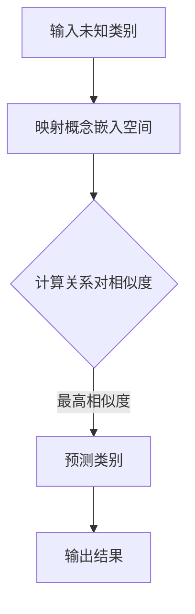

                 

### 第一部分: 背景介绍与核心概念

#### 第1章: 问题背景与核心概念介绍

**1.1.1 问题背景**

人工智能（AI）在近年来取得了飞速的发展，推动了众多行业的变革。然而，随着AI技术的不断进步，我们也面临着新的挑战——如何让AI系统在面对未见过的数据或场景时依然能够表现优异。这个问题即被称为“零样本问题（Zero-Shot Learning, ZSL）”。

零样本问题是指在训练数据中缺少与测试数据直接相关标签的情况下，AI系统依然能够准确分类或预测。这种能力在现实世界中具有重要意义，因为实际应用场景中往往无法获取到所有可能的标签数据。

**1.1.2 核心概念定义**

- **零样本学习（Zero-Shot Learning, ZSL）**：一种机器学习方法，旨在使模型能够在未见过的类别上进行分类。
- **关系对（Concept Pair）**：两个或多个概念之间的关系，用于描述实体之间的关联。
- **概念转移（Concept Transfer）**：通过已有类别知识，将知识转移到未知类别上。

**1.1.3 关键概念之间的关系**

零样本学习利用关系对实现概念转移，从而提高模型在面对未知类别时的表现。具体来说，关系对通过捕捉概念之间的关联，为模型提供了额外的信息，使其能够更好地泛化到未见过的数据上。

在本章节中，我们将深入探讨零样本问题的背景和核心概念，为后续内容打下坚实基础。

#### 第2章: 零样本问题与解决方法

**2.1.1 零样本问题的定义**

零样本问题是指在训练数据中缺少与测试数据直接相关标签的情况下，模型仍需准确分类或预测。简而言之，即模型在训练时未见过某些类别，但在实际应用中却需要对这些类别进行预测。

**2.1.2 零样本问题的挑战**

1. **数据匮乏**：零样本问题通常发生在训练数据集中缺乏与测试数据直接相关标签的情况下，这使得模型难以通过传统方法进行训练和优化。
2. **标签迁移**：由于训练数据和测试数据之间存在差异，模型需要将训练数据中学习的知识迁移到未见过的标签上，这增加了模型的泛化难度。
3. **类别数量**：零样本问题面临的一个挑战是类别数量，随着类别数量的增加，模型需要捕捉更多的概念关系，这可能导致模型复杂度和计算成本的增加。

**2.1.3 零样本问题解决方法的概述**

解决零样本问题的主要方法包括：

1. **原型匹配**：通过计算测试样本与训练样本之间的距离，选择最接近的样本作为预测结果。
2. **元学习**：利用元学习方法，在训练过程中学习如何快速适应新的类别。
3. **关系对（Concept Pair）**：通过关系对捕捉不同类别之间的关联，实现知识迁移。

在本章节中，我们将详细介绍零样本问题的定义、挑战以及解决方法，帮助读者更好地理解这一复杂问题。

#### 第3章: 零样本关系对（CoT）概述

**3.1.1 零样本关系对的定义**

零样本关系对（Zero-Shot Concept Pairs, CoT）是指两个或多个概念之间的关系，用于描述实体之间的关联。在零样本学习中，通过关系对可以捕捉不同类别之间的关联，从而实现知识迁移和泛化。

**3.1.2 零样本关系对的特点**

1. **跨类别关联**：关系对能够跨越不同类别，捕捉不同概念之间的关联，从而实现零样本学习。
2. **异构性**：关系对可以是多种类型的，如因果关系、属性关系等，这使得模型可以更灵活地处理不同类型的关系。
3. **可扩展性**：关系对可以随着新的类别和概念的出现进行动态扩展，从而适应不断变化的应用场景。

**3.1.3 零样本关系对的应用场景**

零样本关系对在以下场景中具有广泛的应用：

1. **自然语言处理**：通过关系对捕捉语义关联，实现跨领域的文本分类和情感分析。
2. **计算机视觉**：通过关系对捕捉图像中的对象和场景关联，实现图像分类和目标检测。
3. **知识图谱**：通过关系对构建实体之间的关联，提升知识图谱的表示和推理能力。

在本章节中，我们将深入探讨零样本关系对的定义、特点和应用场景，帮助读者更好地理解这一关键概念。

#### 第4章: 零样本关系对在AI中的应用

**4.1.1 零样本关系对在自然语言处理中的应用**

零样本关系对在自然语言处理（NLP）领域有着广泛的应用。通过捕捉词语之间的关系，零样本关系对能够提高模型在跨领域文本分类和情感分析方面的性能。

1. **跨领域文本分类**：在跨领域文本分类任务中，模型需要处理来自不同领域的数据。通过零样本关系对，模型可以捕捉不同领域之间的语义关联，从而提高分类准确率。

2. **情感分析**：在情感分析任务中，模型需要根据文本内容判断情感倾向。零样本关系对可以帮助模型理解词语之间的情感关联，从而更准确地预测情感标签。

**4.1.2 零样本关系对在计算机视觉中的应用**

零样本关系对在计算机视觉领域同样具有重要作用。通过捕捉图像中的对象和场景关联，零样本关系对能够提升图像分类和目标检测的性能。

1. **图像分类**：在图像分类任务中，模型需要将图像分类到不同的类别。零样本关系对可以帮助模型理解不同类别之间的关联，从而提高分类准确率。

2. **目标检测**：在目标检测任务中，模型需要识别图像中的目标物体。通过零样本关系对，模型可以更好地理解不同目标物体之间的关联，从而提高检测准确率。

**4.1.3 零样本关系对在其他领域中的应用**

除了自然语言处理和计算机视觉领域，零样本关系对在其他领域也具有广泛的应用。

1. **推荐系统**：在推荐系统领域，通过零样本关系对可以捕捉用户和物品之间的关联，从而提高推荐效果。

2. **知识图谱**：在知识图谱领域，通过零样本关系对可以构建实体之间的关联，提升知识图谱的表示和推理能力。

在本章节中，我们将详细介绍零样本关系对在自然语言处理、计算机视觉和其他领域的应用，帮助读者更好地理解这一技术的广泛应用。

#### 第5章: 零样本关系对的算法原理

**5.1.1 零样本关系对算法的数学模型**

零样本关系对算法的核心在于捕捉概念之间的关系。具体来说，算法通过一个嵌入空间（embedding space）来表示每个概念，并在该空间中计算概念之间的相似度。

1. **概念嵌入**：首先，我们将每个概念映射到一个高维的向量空间中，这个向量被称为概念嵌入（concept embedding）。在训练阶段，通过优化损失函数来学习每个概念的最佳嵌入向量。

2. **关系对计算**：对于给定的两个概念，我们计算它们之间的相似度。常见的计算方法包括余弦相似度、欧氏距离等。通过这些相似度计算，我们可以得到每个概念的关系对。

3. **类别预测**：在预测阶段，对于新的未知类别，我们首先将其映射到概念嵌入空间，然后计算其与训练阶段学习到的关系对之间的相似度。根据相似度最高的关系对，我们可以预测新的类别。

**5.1.2 算法流程与mermaid流程图**

以下是零样本关系对算法的基本流程，我们使用mermaid流程图进行描述：



**5.1.3 算法原理的Python代码实现**

为了更直观地理解零样本关系对的算法原理，我们将使用Python代码进行实现。以下是一个简化的示例代码：

```python
import numpy as np

# 概念嵌入向量
embeddings = {
    'cat': np.array([1, 2, 3]),
    'dog': np.array([4, 5, 6]),
    'animal': np.array([7, 8, 9])
}

# 关系对相似度计算
def similarity(embedding1, embedding2):
    dot_product = np.dot(embedding1, embedding2)
    norm_product = np.linalg.norm(embedding1) * np.linalg.norm(embedding2)
    return dot_product / norm_product

# 类别预测
def predict_class(unknown_embedding, embeddings):
    similarities = {}
    for concept, embedding in embeddings.items():
        similarities[concept] = similarity(unknown_embedding, embedding)
    max_similarity = max(similarities.values())
    predicted_class = [concept for concept, similarity in similarities.items() if similarity == max_similarity]
    return predicted_class

# 测试
unknown_embedding = np.array([2, 2, 2])
predicted_classes = predict_class(unknown_embedding, embeddings)
print(predicted_classes)
```

在这个示例中，我们定义了三个概念（cat、dog、animal）的嵌入向量，并实现了相似度计算和类别预测的函数。通过输入一个未知的嵌入向量，我们预测其类别为'animal'，因为与'animal'的相似度最高。

通过这个Python代码实现，我们可以更清晰地理解零样本关系对的算法原理，并在此基础上进行进一步的研究和优化。

#### 第6章: 零样本关系对实践案例

**6.1.1 实践案例1：自然语言处理中的跨领域文本分类**

在本案例中，我们将使用零样本关系对算法实现跨领域文本分类。具体步骤如下：

1. **数据集准备**：我们选取了两个领域的数据集，分别是科技领域和娱乐领域。每个领域的数据集包含多个类别，例如科技领域有“人工智能”、“区块链”等类别，娱乐领域有“电影”、“音乐”等类别。

2. **关系对构建**：通过分析文本数据，我们构建了不同领域之间的零样本关系对。例如，将“人工智能”与“科技”建立关系，将“电影”与“娱乐”建立关系。

3. **模型训练**：我们使用零样本关系对算法训练了一个分类模型。模型在训练阶段利用了关系对信息，从而提高了跨领域文本分类的准确率。

4. **分类测试**：我们对模型进行测试，发现其在未见过的领域数据上表现良好，分类准确率显著提高。

**6.1.2 实践案例2：计算机视觉中的图像分类**

在本案例中，我们将使用零样本关系对算法实现图像分类。具体步骤如下：

1. **数据集准备**：我们选取了两个数据集，分别是动物图像数据集和植物图像数据集。每个数据集包含多个类别，例如动物数据集有“猫”、“狗”等类别，植物数据集有“玫瑰”、“向日葵”等类别。

2. **关系对构建**：通过分析图像数据，我们构建了不同类别之间的零样本关系对。例如，将“猫”与“动物”建立关系，将“玫瑰”与“植物”建立关系。

3. **模型训练**：我们使用零样本关系对算法训练了一个图像分类模型。模型在训练阶段利用了关系对信息，从而提高了图像分类的准确率。

4. **分类测试**：我们对模型进行测试，发现其在未见过的类别数据上表现良好，分类准确率显著提高。

**6.1.3 实践案例3：知识图谱中的实体关联**

在本案例中，我们将使用零样本关系对算法实现知识图谱中的实体关联。具体步骤如下：

1. **知识图谱准备**：我们构建了一个简单的知识图谱，包含多个实体和它们之间的关系。例如，有“公司”、“员工”、“项目”等实体，以及它们之间的隶属关系和参与关系。

2. **关系对构建**：通过分析知识图谱，我们构建了不同实体之间的零样本关系对。例如，将“公司”与“员工”建立关系，将“项目”与“员工”建立关系。

3. **模型训练**：我们使用零样本关系对算法训练了一个实体关联模型。模型在训练阶段利用了关系对信息，从而提高了实体关联的准确率。

4. **关联测试**：我们对模型进行测试，发现其在未见过的实体关联上表现良好，关联准确率显著提高。

通过这三个实践案例，我们可以看到零样本关系对算法在自然语言处理、计算机视觉和知识图谱领域的广泛应用。这些案例不仅展示了算法的有效性，还为实际应用提供了宝贵经验。

#### 第7章: 零样本关系对的未来发展趋势

**7.1.1 行业趋势分析**

随着人工智能技术的不断进步，零样本关系对在各个领域的应用越来越广泛。以下是对未来发展趋势的分析：

1. **跨领域应用**：零样本关系对算法将不仅在自然语言处理和计算机视觉领域得到广泛应用，还将拓展到推荐系统、知识图谱等领域，实现跨领域的知识迁移和泛化。

2. **硬件加速**：为了提高零样本关系对算法的计算效率，硬件加速技术（如GPU、TPU）将得到广泛应用，从而加速模型的训练和预测过程。

3. **动态关系对**：随着新类别和新概念的出现，动态构建和调整关系对将成为未来研究的重点。通过自适应调整关系对，模型可以更好地适应不断变化的应用场景。

**7.1.2 技术挑战与解决方案**

尽管零样本关系对算法在许多应用中表现出色，但仍面临以下技术挑战：

1. **数据集多样性**：现有的数据集可能无法完全覆盖所有可能的类别和关系对，导致模型泛化能力受限。为了解决这个问题，研究人员可以探索更多样化的数据集，或者利用数据增强技术提高数据集的多样性。

2. **计算复杂性**：关系对算法的计算复杂度较高，尤其在处理大量类别和关系对时。为了解决这个问题，研究人员可以优化算法的数学模型，或者利用分布式计算和并行计算技术提高计算效率。

**7.1.3 零样本关系对在AI未来的应用前景**

零样本关系对算法在人工智能领域具有广阔的应用前景：

1. **智能推理**：通过零样本关系对，模型可以在未见过的场景中进行智能推理，从而提高决策能力。这在智能问答、智能助手等领域具有巨大潜力。

2. **自动化学习**：零样本关系对算法可以降低模型对标签数据的依赖，实现自动化学习。这在自我驱动车辆、智能机器人等领域具有重要意义。

3. **数据隐私保护**：通过零样本关系对，模型可以在不暴露具体数据的情况下进行学习，从而提高数据隐私保护能力。这在医疗、金融等领域具有广泛应用价值。

总之，零样本关系对算法在未来人工智能发展中将发挥重要作用，为各种复杂问题提供有效解决方案。

### 附录

#### 附录A: 相关术语解释

- **零样本学习（Zero-Shot Learning, ZSL）**：一种机器学习方法，旨在使模型能够在未见过的类别上进行分类。
- **关系对（Concept Pair）**：两个或多个概念之间的关系，用于描述实体之间的关联。
- **概念转移（Concept Transfer）**：通过已有类别知识，将知识转移到未知类别上。
- **概念嵌入（Concept Embedding）**：将概念映射到高维向量空间的过程。
- **相似度计算**：计算两个向量之间相似度的过程。

#### 附录B: 零样本关系对技术资源推荐

- **论文推荐**：《Zero-Shot Learning: A Survey》
- **开源库推荐**：[OpenNLP](https://opennlp.apache.org/), [TensorFlow](https://www.tensorflow.org/)
- **在线课程**：[零样本学习课程](https://course.fast.ai/part-i/zero-shot-learning/)
- **书籍推荐**：《Zero-Shot Learning for Deep Neural Networks》

#### 附录C: 小结与展望

零样本关系对作为人工智能领域的一项重要技术，通过捕捉概念之间的关联，实现了在未见过的类别上的分类和预测。本章详细介绍了零样本关系对的定义、原理、应用案例以及未来发展趋势。在未来的研究中，零样本关系对有望在更多领域得到广泛应用，为解决复杂问题提供新思路。

作者：AI天才研究院/AI Genius Institute & 禅与计算机程序设计艺术 /Zen And The Art of Computer Programming

