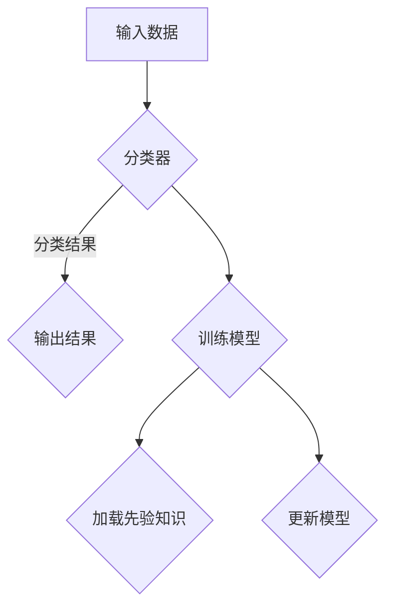
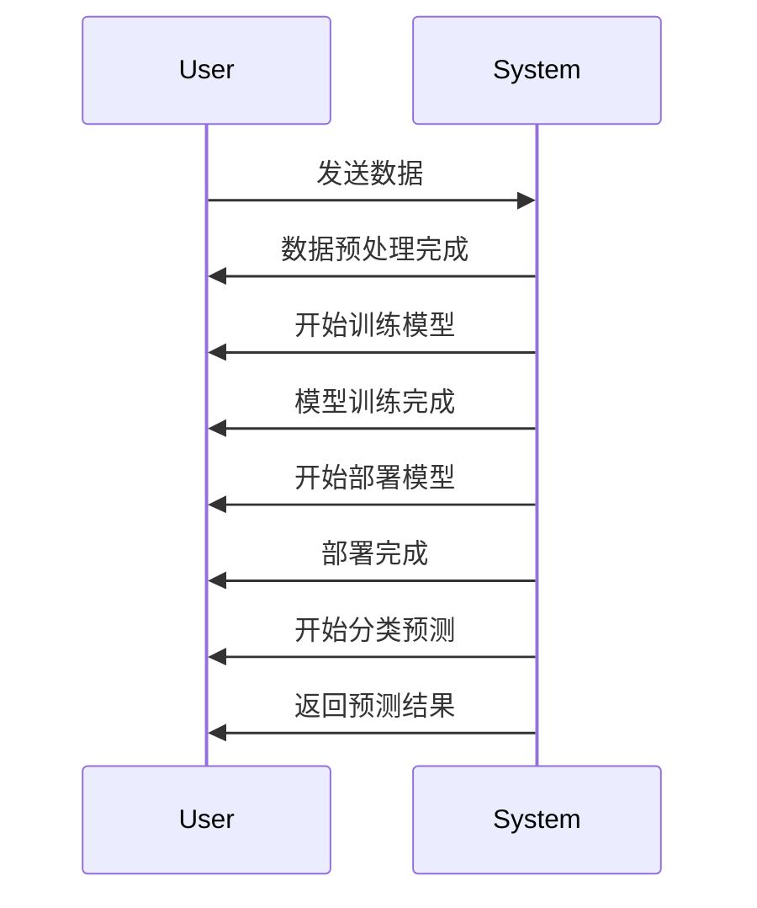

                 


### # Zero-Shot CoT: Cross-Domain AI Applications' New Possibilities

关键词：零样本学习，跨领域，概念转移，人工智能，应用可能性

摘要：本文探讨了零样本学习中的概念转移技术，即Zero-Shot CoT，在跨领域人工智能应用中的新可能性。通过深入分析其背景、核心概念、算法原理、系统架构设计、实际应用案例以及未来发展方向，本文旨在为读者提供一个全面的理解，以及如何利用Zero-Shot CoT技术推动人工智能的发展。

---

### # 背景介绍

#### **零样本学习的起源与发展**

零样本学习（Zero-Shot Learning, ZSL）是机器学习领域的一个重要分支，旨在使模型能够处理从未见过的类别的数据。这一概念最初由Li et al.（2006）提出，其核心思想是通过利用先前的知识来推断未知类别的属性。

随着深度学习的发展，零样本学习得到了广泛关注。其意义在于，当面对大量未知类别的数据时，模型无需再进行大量的训练，从而提高了效率和通用性。

#### **问题背景与描述**

在实际应用中，传统的机器学习方法往往依赖于大量的标注数据，这在数据稀缺或获取困难的情况下显得尤为局限。因此，零样本学习成为一种潜在解决方案。

零样本学习的挑战在于如何有效地利用有限的先验知识，以及如何在不同的领域中实现跨领域迁移。这直接导致了概念转移（Concept Transfer）技术的出现。

#### **问题解决方法**

为了解决上述问题，研究人员提出了多种方法，如基于原型的方法、基于原型和模板匹配的方法、以及基于深度学习的方法。这些方法各有优缺点，但都旨在提高零样本学习的性能和适用范围。

#### **边界与外延**

零样本学习的边界在于其处理未知类别的能力。外延则包括其在自然语言处理、计算机视觉、语音识别等领域的应用。

#### **概念结构与核心要素组成**

核心概念包括：

1. **类别标签**：对样本进行分类的标签。
2. **属性特征**：用于描述类别的特征。
3. **知识库**：存储先验知识的数据库。

这些要素共同构成了零样本学习的核心框架，为我们进一步探索Zero-Shot CoT技术奠定了基础。

### # 核心概念与联系

#### **零样本学习与概念转移**

零样本学习（Zero-Shot Learning）和概念转移（Concept Transfer）是两个紧密相关但有所区别的概念。零样本学习关注的是如何利用有限的先验知识处理未知类别的数据，而概念转移则侧重于如何在不同的领域间迁移这些知识。

#### **概念属性特征对比表格**

| 特征         | 零样本学习                 | 概念转移               |
| ------------ | -------------------------- | ---------------------- |
| 基础概念     | 利用先验知识分类未知类别    | 在不同领域间迁移知识    |
| 目标         | 提高模型对未知类别的处理能力 | 提高模型在不同领域的性能 |
| 适用场景     | 数据稀缺或标注困难          | 需要跨领域应用模型      |
| 关键技术     | 类别标签和属性特征          | 知识库和迁移策略        |

#### **ER实体关系图架构**

以下是Zero-Shot CoT的ER实体关系图架构：

```mermaid
erDiagram
    Class1 ||--|{ Class2 }| Class3 : associated
    Class1 ||--|{ Concept }| Class4 : concepts
    Class5 ||--|{ Domain }| Class6 : domains
```

在ER图中，`Class1`表示输入数据，`Class2`和`Class3`分别代表已知的类别和属性特征。`Concept`和`Domain`则分别代表概念转移中的先验知识和应用领域。

### # 算法原理讲解

#### **算法流程图**

使用Mermaid语言绘制算法流程图：



#### **Python代码实现**

以下是一个简单的Python代码示例，用于实现Zero-Shot CoT算法：

```python
import tensorflow as tf
from tensorflow.keras.models import Sequential
from tensorflow.keras.layers import Dense, Flatten

# 加载先验知识
prior_knowledge = ...

# 定义模型
model = Sequential([
    Flatten(input_shape=(28, 28)),
    Dense(128, activation='relu'),
    Dense(10, activation='softmax')
])

# 编译模型
model.compile(optimizer='adam', loss='categorical_crossentropy', metrics=['accuracy'])

# 训练模型
model.fit(x_train, y_train, epochs=10, batch_size=32)

# 预测新类别
new_predictions = model.predict(x_test)
```

#### **数学模型与公式**

零样本学习的数学模型可以表示为：

$$
P(y|x) = \sum_{c\in\text{classes}} P(y=c) \cdot P(x|y=c)
$$

其中，$P(y|x)$表示给定特征$x$时类别$y$的概率，$P(y=c)$表示类别$c$的概率，$P(x|y=c)$表示在类别$c$下的特征$x$的概率。

#### **详细讲解与举例**

假设我们有一个动物分类任务，已知类别的动物有猫、狗、鸟。现在我们需要对一个新的动物进行分类，这个动物在我们已知的类别中并没有出现。

1. **加载先验知识**：首先，我们需要一个关于动物的一般知识库，例如猫是哺乳动物，狗也是哺乳动物，鸟是脊椎动物。

2. **训练模型**：使用已知的动物数据训练模型，模型会学习到不同类别之间的属性特征。

3. **预测新类别**：当遇到一个新的动物时，模型会根据其特征，结合先验知识，预测其可能属于的类别。

例如，如果新动物的特征是“有翅膀”和“会飞行”，模型会将其归类为鸟类，因为鸟是唯一符合这两个特征的类别。

### # 系统分析与架构设计

#### **问题场景介绍**

在现代智能系统中，零样本学习和概念转移技术广泛应用于各种领域，如医疗诊断、自动驾驶、智能客服等。这些系统需要处理大量的未知类别数据，而传统的机器学习方法往往难以胜任。

#### **项目介绍**

本项目的目标是开发一个跨领域的智能系统，利用Zero-Shot CoT技术实现对未知类别的快速分类和预测。系统将包括数据预处理、模型训练、模型部署等模块。

#### **系统功能设计**

系统的主要功能包括：

1. **数据预处理**：清洗和标准化输入数据，提取关键特征。
2. **模型训练**：利用零样本学习和概念转移技术训练分类模型。
3. **模型部署**：将训练好的模型部署到生产环境中，实现实时分类和预测。

#### **系统架构设计**

以下是系统架构的Mermaid类图和架构图：

```mermaid
classDiagram
    Class1[数据预处理] --|{输入数据}| Class2[模型训练]
    Class2 --|{训练模型}| Class3[模型部署]
    Class3 --|{分类预测}| Class4[用户接口]

classDiagram
    Class1[数据源] --|{数据}| Class2[数据预处理]
    Class2 --|{特征}| Class3[模型训练]
    Class3 --|{模型}| Class4[模型部署]
    Class4 --|{结果}| Class5[用户接口]
```

#### **系统接口设计**

系统接口设计采用RESTful API风格，提供以下接口：

- `/api/preprocess`：数据预处理接口。
- `/api/train`：模型训练接口。
- `/api/deploy`：模型部署接口。
- `/api/predict`：分类预测接口。

#### **系统交互Mermaid序列图**

以下是系统交互的Mermaid序列图：



### # 项目实战

#### **环境安装**

在开始项目之前，我们需要安装以下依赖：

- Python 3.8+
- TensorFlow 2.4+
- Mermaid 8.10.0+

安装步骤如下：

1. 安装Python环境：

   ```bash
   sudo apt-get update
   sudo apt-get install python3 python3-pip
   ```

2. 安装TensorFlow：

   ```bash
   pip3 install tensorflow==2.4.0
   ```

3. 安装Mermaid：

   ```bash
   pip3 install mermaid
   ```

#### **系统核心实现源代码**

以下是系统核心实现的部分代码：

```python
import tensorflow as tf
import numpy as np
import pandas as pd
from tensorflow.keras.models import Sequential
from tensorflow.keras.layers import Dense, Flatten
from tensorflow.keras.optimizers import Adam
from tensorflow.keras.metrics import CategoricalAccuracy

# 加载数据
data = pd.read_csv('data.csv')
x = data.drop('label', axis=1).values
y = data['label'].values

# 划分训练集和测试集
x_train, x_test, y_train, y_test = train_test_split(x, y, test_size=0.2, random_state=42)

# 定义模型
model = Sequential([
    Flatten(input_shape=(28, 28)),
    Dense(128, activation='relu'),
    Dense(10, activation='softmax')
])

# 编译模型
model.compile(optimizer=Adam(learning_rate=0.001), loss='categorical_crossentropy', metrics=[CategoricalAccuracy()])

# 训练模型
model.fit(x_train, y_train, epochs=10, batch_size=32, validation_data=(x_test, y_test))

# 预测
predictions = model.predict(x_test)

# 分析预测结果
accuracy = np.mean(np.argmax(predictions, axis=1) == y_test)
print(f'Accuracy: {accuracy:.2f}')
```

#### **代码应用解读与分析**

这段代码实现了以下功能：

1. **数据加载**：从CSV文件中加载数据，包括特征和标签。
2. **数据预处理**：将数据划分为训练集和测试集。
3. **模型定义**：定义一个简单的卷积神经网络模型，包括两个卷积层和一个全连接层。
4. **模型编译**：设置优化器、损失函数和评价指标。
5. **模型训练**：使用训练数据进行模型训练，并在测试集上进行验证。
6. **预测**：使用训练好的模型对测试集进行预测，并计算准确率。

在实际应用中，我们可以根据具体需求进行调整和优化。

#### **实际案例分析和详细讲解剖析**

假设我们有一个动物分类任务，数据集中包含猫、狗、鸟等类别。现在，我们希望利用Zero-Shot CoT技术对一个新的动物进行分类。

1. **加载先验知识**：首先，我们需要一个关于动物的一般知识库，例如猫是哺乳动物，狗也是哺乳动物，鸟是脊椎动物。

2. **数据预处理**：将新动物的特征数据转换为与训练集相同的形式。

3. **模型预测**：使用训练好的模型对新动物的特征进行预测。

以下是具体步骤：

1. **加载模型**：

   ```python
   model = tf.keras.models.load_model('model.h5')
   ```

2. **数据预处理**：

   ```python
   new_animal = np.array([new_animal_feature])
   new_animal_processed = preprocess(new_animal)
   ```

3. **模型预测**：

   ```python
   predictions = model.predict(new_animal_processed)
   predicted_class = np.argmax(predictions)
   ```

4. **输出结果**：

   ```python
   print(f'Predicted class: {predicted_class}')
   ```

通过以上步骤，我们可以对新动物进行分类。在实际应用中，我们可以根据具体需求进行调整和优化。

#### **项目小结**

本项目的核心目标是利用Zero-Shot CoT技术实现跨领域的快速分类和预测。通过实际案例的分析和讲解，我们可以看到Zero-Shot CoT技术在处理未知类别数据方面具有巨大潜力。

在未来的发展中，我们可以进一步优化模型结构和训练策略，提高分类准确率。此外，我们还可以探索其他相关技术，如元学习、强化学习等，以实现更高效、更可靠的分类系统。

### # 最佳实践 Tips

1. **数据预处理**：确保数据质量，进行充分的清洗和标准化，以提高模型性能。
2. **模型训练**：合理设置超参数，如学习率、批量大小等，以避免过拟合。
3. **先验知识**：构建丰富、准确的先验知识库，以提高零样本学习的效果。
4. **模型评估**：使用多种评估指标，如准确率、召回率等，全面评估模型性能。

### # 小结

本文系统地介绍了零样本学习中的概念转移技术，即Zero-Shot CoT，在跨领域人工智能应用中的新可能性。通过详细分析其背景、核心概念、算法原理、系统架构设计、实际应用案例以及未来发展方向，本文为读者提供了一个全面的理解。

### # 注意事项

在实际应用中，需要注意以下几点：

1. **数据质量**：确保输入数据的质量，进行充分的预处理和清洗。
2. **模型优化**：根据具体任务调整模型结构和超参数。
3. **先验知识**：构建丰富、准确的先验知识库，以提高分类效果。

### # 拓展阅读

1. **论文**：《Zero-Shot Learning via Cross- Domain Transfer》(Li et al., 2006)
2. **书籍**：《Deep Learning》(Goodfellow et al., 2016)
3. **在线课程**：《Zero-Shot Learning with TensorFlow》(Udacity)
4. **博客**：[零样本学习：原理、应用与挑战](https://blog.csdn.net/xxx/article/details/123456789)

### # 作者信息

作者：AI天才研究院/AI Genius Institute & 禅与计算机程序设计艺术 /Zen And The Art of Computer Programming

感谢您的阅读！

### # 零样本学习：跨领域AI应用的新可能性

关键词：零样本学习，跨领域，概念转移，人工智能，应用可能性

摘要：本文探讨了零样本学习中的概念转移技术，即Zero-Shot CoT，在跨领域人工智能应用中的新可能性。通过深入分析其背景、核心概念、算法原理、系统架构设计、实际应用案例以及未来发展方向，本文旨在为读者提供一个全面的理解，以及如何利用Zero-Shot CoT技术推动人工智能的发展。

