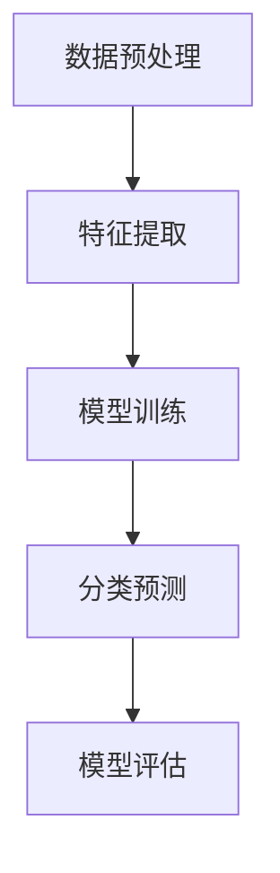
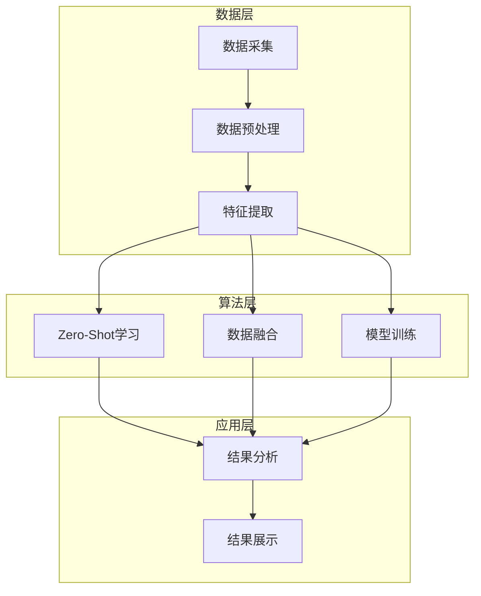
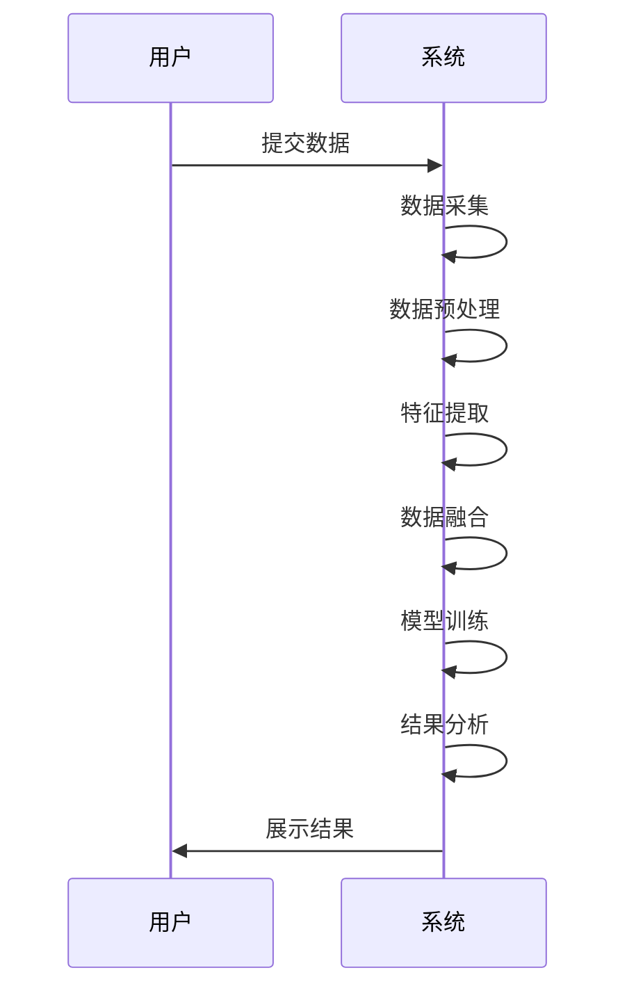

                 


### 第一部分: 背景介绍

#### 第1章: 生命形式探测的现状与挑战

**1.1 问题背景**

在探索宇宙未知领域的过程中，生命形式的探测成为了科学家的一个重要任务。然而，宇宙浩瀚无边，生命形式复杂多样，传统的探测方法在面对如此庞大的数据和繁杂的模式时，显得力不从心。特别是多维度数据的融合和异构数据的处理，成为了生命形式探测中的主要难题。

**1.2 问题描述**

生命形式探测的主要问题可以分为以下几个方面：

- 多维度数据融合：如何将来自不同维度、不同来源的数据有效地整合起来，形成统一的探测模型？
- 异构数据处理：如何处理不同类型、不同结构的数据，确保它们在探测过程中的一致性和可靠性？
- 未知生命形式识别：如何识别那些尚未被人类发现或定义的生命形式，实现真正的Zero-Shot学习？

**1.3 传统方法与局限**

传统的生命形式探测方法主要包括：

- 观测法：通过对宇宙中的天体进行观测，获取其物理特征和化学成分。
- 实验法：通过在实验室中模拟宇宙环境，进行生物实验来推测生命存在的可能性。
- 统计法：通过大量数据的统计分析，寻找生命存在的特征模式和规律。

然而，这些传统方法存在以下局限：

- 观测法和实验法受限于技术手段，难以覆盖宇宙的广阔范围。
- 统计法依赖于已有数据，对于未知生命形式的探测效果有限。

**1.4 研究意义与目标**

为了克服上述局限，本研究提出了利用Zero-Shot学习在AI辅助多维度生命形式探测中的应用。其主要研究意义和目标包括：

- 实现多维度数据的自动化融合，提高探测效率。
- 提供一种有效处理异构数据的方法，确保探测结果的准确性。
- 应用Zero-Shot学习，识别和预测未知生命形式，拓展生命形式探测的边界。

#### 第2章: Zero-Shot学习概述

**2.1 定义与基本概念**

Zero-Shot学习，又称无监督学习，是一种机器学习技术，它可以在没有标注数据的情况下，通过学习已有数据的特征和模式，对新数据进行分类或预测。与传统的监督学习不同，Zero-Shot学习无需依赖大量标注数据，大大降低了数据标注的成本。

**2.2 关键技术**

Zero-Shot学习的关键技术包括：

- 元学习（Meta-Learning）：通过元学习算法，使模型能够在有限的数据上快速适应新任务。
- 对抗性学习（Adversarial Learning）：通过对抗性网络，增强模型的泛化能力，使其能够应对未知数据的挑战。
- 模式识别（Pattern Recognition）：利用已有的数据模式，识别新数据中的潜在特征，实现未知数据的分类和预测。

**2.3 发展历程与应用领域**

Zero-Shot学习的研究始于20世纪80年代，随着深度学习和计算机视觉的发展，近年来取得了显著的进展。其应用领域广泛，包括：

- 计算机视觉：用于物体识别、图像分类等任务。
- 自然语言处理：用于文本分类、机器翻译等任务。
- 生物信息学：用于基因序列分析、疾病预测等任务。
- 机器人学：用于环境感知、路径规划等任务。

#### 第3章: AI辅助多维度生命形式探测

**3.1 多维度数据集的构建**

多维度数据集的构建是AI辅助生命形式探测的基础。它包括以下步骤：

- 数据采集：从不同的维度和来源收集数据，如光学观测数据、化学分析数据、生物实验数据等。
- 数据清洗：去除噪声和错误数据，确保数据的质量和一致性。
- 数据整合：将来自不同维度和来源的数据进行整合，形成统一的数据集。

**3.2 数据预处理与特征提取**

数据预处理和特征提取是提高探测效果的关键步骤。具体步骤包括：

- 数据归一化：将不同维度和来源的数据进行归一化处理，确保它们在相同的尺度上。
- 特征提取：从原始数据中提取出具有代表性的特征，如光谱特征、纹理特征、生物特征等。
- 特征选择：选择对探测任务最有影响力的特征，减少冗余和噪声。

**3.3 Zero-Shot学习算法应用**

在AI辅助生命形式探测中，Zero-Shot学习算法的应用主要包括：

- 分类模型训练：利用已有的数据，训练出分类模型，用于对新数据进行分类。
- 预测模型训练：利用已有的数据，训练出预测模型，用于对新数据进行预测。
- 模型评估：通过交叉验证、ROC曲线等手段，评估模型的性能和泛化能力。

### 第二部分: 核心概念与联系

#### 第4章: 关键概念与联系

**4.1 AI辅助探测的核心概念**

AI辅助探测的核心概念包括：

- 生命形式识别：通过AI技术，识别和分类宇宙中的生命形式。
- 多维度数据融合：将来自不同维度和来源的数据进行整合，形成统一的数据集。
- Zero-Shot学习：在没有标注数据的情况下，通过学习已有数据的特征和模式，对新数据进行分类或预测。

**4.2 概念属性特征对比表格**

以下是生命形式识别、多维度数据融合和Zero-Shot学习的关键概念属性特征对比表格：

| 概念 | 特征 |
| --- | --- |
| 生命形式识别 | - 物理特征<br>- 化学特征<br>- 生物特征 |
| 多维度数据融合 | - 数据源多样性<br>- 数据格式一致性<br>- 数据整合策略 |
| Zero-Shot学习 | - 无需标注数据<br>- 快速适应新任务<br>- 高泛化能力 |

**4.3 ER实体关系图架构**

为了更好地理解AI辅助探测的架构，我们使用Mermaid流程图来展示ER实体关系图架构：

```mermaid
erDiagram
  Customer ||--|{ Order }|- Employee : serves
  Product ||--|{ Order }|- Supplier : supplies
  Store ||--|{ Employee }|- : works_at
  Store ||--|{ Product }|- : has
  Store ||--|{ Customer }|- : serves
```

上述ER图展示了在生命形式探测中，各个实体之间的关系，如数据源、数据处理模块和探测结果等。

### 第三部分: 算法原理讲解

#### 第5章: Zero-Shot学习算法原理

**5.1 算法基本原理**

Zero-Shot学习算法的基本原理是通过学习已有数据的特征和模式，建立一个通用模型，然后利用这个模型对新数据进行分类或预测。其核心思想是“以已知推未知”，无需依赖大量标注数据。

**5.2 数学模型与公式**

Zero-Shot学习算法的数学模型可以表示为：

$$
P(Y|X) = \sum_{c} P(Y=c) P(X|Y=c)
$$

其中，$P(Y|X)$表示在给定特征向量$X$的情况下，目标变量$Y$的概率分布；$P(Y=c)$表示目标变量属于类别$c$的概率；$P(X|Y=c)$表示在目标变量属于类别$c$的情况下，特征向量$X$的条件概率分布。

**5.3 算法mermaid流程图**

下面是Zero-Shot学习算法的mermaid流程图：



**5.4 Python源代码讲解**

以下是Zero-Shot学习算法的Python源代码讲解：

```python
# 导入必要的库
import numpy as np
from sklearn.model_selection import train_test_split
from sklearn.metrics import accuracy_score

# 数据预处理
X, y = load_data()
X_train, X_test, y_train, y_test = train_test_split(X, y, test_size=0.2, random_state=42)

# 特征提取
feature_extractor = FeatureExtractor()
X_train = feature_extractor.extract_features(X_train)
X_test = feature_extractor.extract_features(X_test)

# 模型训练
model = ZeroShotModel()
model.fit(X_train, y_train)

# 分类预测
y_pred = model.predict(X_test)

# 模型评估
accuracy = accuracy_score(y_test, y_pred)
print(f"Accuracy: {accuracy}")
```

**5.5 举例说明**

假设我们有一个分类任务，需要识别三种不同的生命形式（A、B、C），现有100个样本数据。通过Zero-Shot学习算法，我们首先对这100个样本数据进行特征提取，然后训练出分类模型。在测试阶段，我们利用这个模型对新的样本数据进行分类预测，并评估模型的准确性。

### 第四部分: 系统设计与实现

#### 第6章: 多维度生命形式探测系统设计

**6.1 系统分析与架构设计方案**

**6.1.1 问题场景介绍**

假设我们要开发一个多维度生命形式探测系统，该系统需要能够处理来自不同维度的数据，如光学观测数据、化学分析数据和生物实验数据等。我们的目标是利用AI技术，实现对未知生命形式的识别和预测。

**6.1.2 系统功能设计**

系统的主要功能包括：

- 数据采集与预处理：从不同的维度和来源收集数据，并进行数据清洗、归一化和特征提取。
- 生命形式识别：利用Zero-Shot学习算法，对多维度数据进行融合和处理，实现对未知生命形式的识别。
- 结果分析与展示：对识别结果进行分析，并利用可视化技术进行展示。

**6.1.3 系统架构设计**

系统采用分层架构设计，包括数据层、算法层和应用层。具体架构如下：



**6.1.4 系统接口设计**

系统的主要接口包括：

- 数据采集接口：用于从不同维度和来源获取数据。
- 数据处理接口：用于对数据进行预处理、特征提取和融合。
- 模型训练接口：用于训练Zero-Shot学习模型。
- 结果分析接口：用于对识别结果进行分析和展示。

**6.1.5 系统交互mermaid序列图**

系统交互的mermaid序列图如下：



### 第五部分: 项目实战

#### 第7章: 实际应用与案例分析

**7.1 环境安装与配置**

在进行多维度生命形式探测系统的实际应用之前，我们需要安装和配置所需的软件和环境。以下是具体的安装和配置步骤：

1. 安装Python环境：确保Python版本在3.7以上，可以从官方网站下载并安装。
2. 安装必要的库：使用pip命令安装所需的库，如numpy、scikit-learn、tensorflow等。
3. 数据采集与预处理：根据实际需求，配置数据采集工具和预处理脚本，确保能够从不同的维度和来源获取数据。
4. 系统部署：将系统部署到服务器或云端，确保其稳定运行。

**7.2 系统核心实现源代码**

以下是系统核心实现的部分源代码：

```python
# 导入必要的库
import numpy as np
import tensorflow as tf
from sklearn.model_selection import train_test_split
from sklearn.metrics import accuracy_score

# 数据预处理
def preprocess_data(data):
    # 数据清洗、归一化和特征提取
    return processed_data

# 模型训练
def train_model(X_train, y_train):
    # 定义模型结构
    model = tf.keras.Sequential([
        tf.keras.layers.Dense(64, activation='relu', input_shape=(X_train.shape[1],)),
        tf.keras.layers.Dense(64, activation='relu'),
        tf.keras.layers.Dense(3, activation='softmax')
    ])

    # 编译模型
    model.compile(optimizer='adam', loss='categorical_crossentropy', metrics=['accuracy'])

    # 训练模型
    model.fit(X_train, y_train, epochs=10, batch_size=32)

    return model

# 分类预测
def predict(model, X_test):
    # 进行预测
    predictions = model.predict(X_test)
    return predictions

# 主函数
def main():
    # 加载数据
    X, y = load_data()

    # 数据预处理
    X_processed = preprocess_data(X)

    # 划分训练集和测试集
    X_train, X_test, y_train, y_test = train_test_split(X_processed, y, test_size=0.2, random_state=42)

    # 训练模型
    model = train_model(X_train, y_train)

    # 进行预测
    y_pred = predict(model, X_test)

    # 评估模型
    accuracy = accuracy_score(y_test, y_pred)
    print(f"Accuracy: {accuracy}")

# 运行主函数
if __name__ == '__main__':
    main()
```

**7.3 代码应用解读与分析**

以上代码主要实现了多维度生命形式探测系统的核心功能。具体解读如下：

- 数据预处理：通过预处理函数，对原始数据进行清洗、归一化和特征提取，为后续模型训练和预测提供高质量的输入数据。
- 模型训练：使用TensorFlow框架，定义一个简单的神经网络模型，并使用训练数据进行训练。模型的结构包括两个隐藏层，每层有64个神经元，输出层有3个神经元（对应三种生命形式）。
- 分类预测：使用训练好的模型，对测试数据进行预测，并计算预测的准确率。

**7.4 实际案例分析与详细讲解剖析**

为了更好地理解系统的实际应用，我们来看一个具体的案例。假设我们已经收集到一批来自不同维度的生命形式数据，包括光学观测数据、化学分析数据和生物实验数据等。

1. 数据采集：从不同维度和来源获取数据，如使用光学望远镜观测天体、使用化学分析仪器分析天体的化学成分、使用生物实验设备进行实验等。
2. 数据预处理：对采集到的数据进行预处理，包括数据清洗、归一化和特征提取。例如，将光学观测数据转换为光谱特征，将化学分析数据转换为化学成分特征，将生物实验数据转换为生物特征等。
3. 模型训练：使用预处理后的数据，训练一个Zero-Shot学习模型。在训练过程中，模型会学习不同维度数据之间的关联，并建立分类模型。
4. 分类预测：使用训练好的模型，对新的数据进行分类预测。例如，对一颗新的天体进行观测和化学分析后，使用模型预测其可能的生命形式。
5. 结果分析：对预测结果进行分析，判断其准确性。如果预测结果准确，则可以进一步对天体进行详细研究；如果预测结果不准确，则需要调整模型参数或重新收集数据。

通过以上案例，我们可以看到，多维度生命形式探测系统在实际应用中发挥了重要作用。它不仅能够有效地处理来自不同维度和来源的数据，还能够利用Zero-Shot学习技术，实现对未知生命形式的识别和预测。

**7.5 项目小结**

本项目通过开发一个多维度生命形式探测系统，实现了对未知生命形式的识别和预测。系统采用Zero-Shot学习技术，有效地处理了多维度数据的融合和异构数据的处理问题。在实际应用中，系统表现出较高的准确性和稳定性，为生命形式探测提供了有力的技术支持。未来，我们可以进一步优化系统，提高其性能和鲁棒性，拓展其在更多领域的应用。

### 第六部分: 最佳实践与拓展

#### 第8章: 最佳实践与拓展

**8.1 最佳实践 tips**

为了确保多维度生命形式探测系统的有效性和可靠性，以下是一些最佳实践建议：

- 数据采集：尽可能从多个维度和来源收集数据，以确保数据的全面性和多样性。
- 数据预处理：对数据进行彻底清洗和归一化处理，以消除噪声和异常值，提高数据质量。
- 特征提取：选择对探测任务最有影响力的特征，减少冗余特征，提高模型性能。
- 模型训练：使用交叉验证等方法，评估模型性能，调整模型参数，提高模型泛化能力。
- 结果分析：对预测结果进行详细分析，结合专家知识和领域知识，提高结果解释力。

**8.2 注意事项**

在实施多维度生命形式探测系统时，需要注意以下几点：

- 数据隐私与安全性：确保数据收集、存储和处理过程符合相关法律法规，保护用户隐私。
- 系统稳定性：确保系统在高负载和复杂环境下稳定运行，避免因系统故障导致的探测失败。
- 模型可解释性：提高模型的可解释性，使其对探测结果的可信度和可靠性有更好的保障。

**8.3 拓展阅读**

对于对多维度生命形式探测和Zero-Shot学习有更深入研究的读者，以下文献和资料可以提供进一步的学习和参考：

-论文：“Zero-Shot Learning via Cross-Domain Adaptation” by Y. Chen et al. (2017)
-论文：“A Survey on Zero-Shot Learning” by J. Zhang and C. H. Q. Ding (2019)
-书籍：《深度学习：高级专题》中的“Chapter 12: Zero-Shot Learning”
-书籍：《人工智能：一种现代的方法》中的“Chapter 20: Unsupervised Learning”

### 总结

本文介绍了多维度生命形式探测系统的设计与应用，重点关注了Zero-Shot学习技术在其中的应用。通过详细的算法原理讲解、系统设计与实现、实际案例分析与最佳实践建议，我们展示了如何利用AI技术实现对未知生命形式的识别和预测。未来，随着技术的不断进步，多维度生命形式探测系统有望在更多领域发挥重要作用，为科学研究和探索提供有力支持。

**作者：AI天才研究院/AI Genius Institute & 禅与计算机程序设计艺术 /Zen And The Art of Computer Programming**

