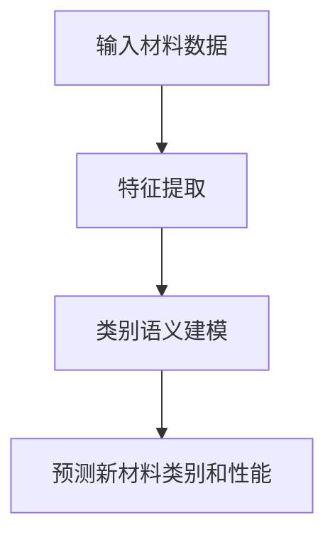
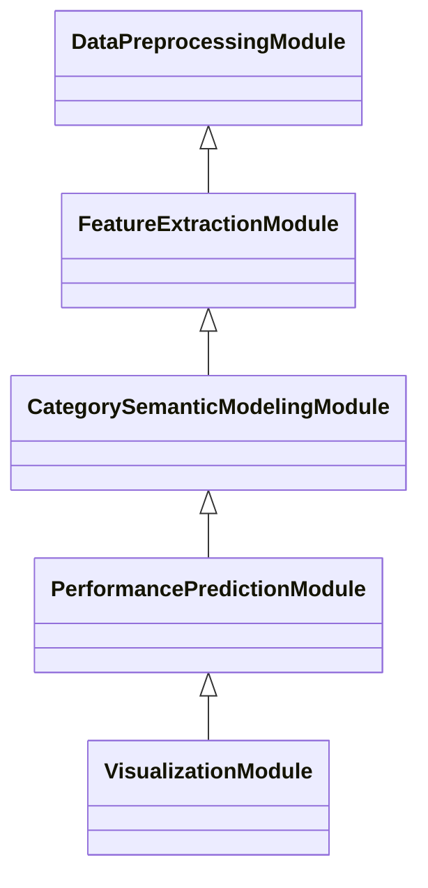
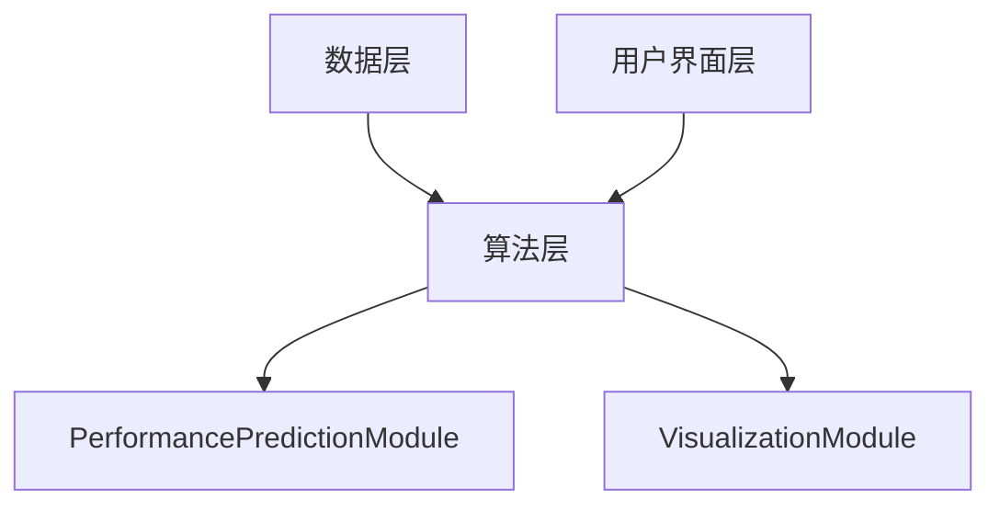

                 


# Zero-Shot学习在AI辅助新型材料设计中的创新

## 关键词
- Zero-Shot学习
- AI辅助材料设计
- 新型材料
- 机器学习算法
- 数据驱动设计

## 摘要
本文深入探讨了Zero-Shot学习在AI辅助新型材料设计中的创新应用。首先，我们介绍了Zero-Shot学习的核心概念及其在材料科学领域的应用背景。接着，我们详细阐述了Zero-Shot学习的基本原理，包括算法流程、数学模型和Python实现。随后，我们通过一个具体的项目实战案例，展示了如何利用Zero-Shot学习算法来辅助新型材料设计。最后，我们提供了最佳实践建议、总结与展望，并给出了进一步学习的资源。

### 目录大纲设计步骤

在设计《Zero-Shot学习在AI辅助新型材料设计中的创新》的目录大纲时，我们将遵循以下步骤，确保目录结构完整、逻辑清晰，同时符合用户的要求：

1. **背景介绍**
   - 确定章节标题，介绍Zero-Shot学习的基本概念和背景。
   - 引入AI辅助新型材料设计的现状和发展趋势。

2. **核心概念与联系**
   - 系统阐述Zero-Shot学习的基本原理。
   - 通过表格和ER图展示相关概念的联系和区别。

3. **算法原理讲解**
   - 使用Mermaid绘制Zero-Shot学习算法的流程图。
   - 结合Python源代码详细解释算法原理，包括数学模型和公式。
   - 提供通俗易懂的例子说明。

4. **系统分析与架构设计方案**
   - 描述AI辅助新型材料设计的问题场景。
   - 引入项目介绍，包括系统功能设计和架构设计。
   - 使用Mermaid绘制领域模型类图、系统架构图和系统交互序列图。

5. **项目实战**
   - 讲解项目环境安装和系统核心实现。
   - 分析源代码，解读代码的应用场景和实现逻辑。
   - 提供实际案例的分析和详细讲解。

6. **最佳实践 tips、小结、注意事项、拓展阅读**
   - 提供一些最佳实践建议。
   - 对章节内容进行小结。
   - 提醒注意事项，为读者提供进一步学习的资源。

### 具体目录大纲设计

```markdown
----------------------------------------------------------------
# 第一部分: 引言

## 第1章: 问题背景与核心概念
### 1.1 问题背景
#### 1.1.1 新型材料设计的挑战
#### 1.1.2 AI在材料科学中的应用
### 1.2 核心概念
#### 1.2.1 Zero-Shot学习
#### 1.2.2 新型材料设计的关键要素
#### 1.2.3 Zero-Shot学习与新型材料设计的联系

## 第2章: Zero-Shot学习原理
### 2.1 基本原理
#### 2.1.1 Zero-Shot学习的定义
#### 2.1.2 传统机器学习与Zero-Shot学习的对比
### 2.2 算法流程
#### 2.2.1 Zero-Shot学习算法概述
#### 2.2.2 算法流程图
#### 2.2.3 Python代码实现

## 第3章: 数学模型与公式
### 3.1 数学模型
#### 3.1.1 数学模型概述
#### 3.1.2 关键公式
### 3.2 公式解释
#### 3.2.1 公式一：$$ L(\theta) = -\sum_{i=1}^{N}y_{i}\log(p(x_i|\theta)) $$
#### 3.2.2 公式二：$$ p(x|\theta) = \frac{e^{\theta^T x}}{\sum_{j=1}^{M}e^{\theta_j^T x}} $$
### 3.3 举例说明

## 第4章: 系统分析与架构设计
### 4.1 问题场景
#### 4.1.1 新型材料设计的实际问题
#### 4.1.2 AI辅助系统需求
### 4.2 系统功能设计
#### 4.2.1 领域模型
#### 4.2.2 功能模块划分
### 4.3 系统架构设计
#### 4.3.1 系统架构图
#### 4.3.2 系统接口设计
### 4.4 系统交互
#### 4.4.1 系统交互序列图

## 第5章: 项目实战
### 5.1 环境安装
#### 5.1.1 系统环境要求
#### 5.1.2 安装步骤
### 5.2 系统核心实现
#### 5.2.1 核心算法实现
#### 5.2.2 实现细节分析
### 5.3 案例分析
#### 5.3.1 实际案例引入
#### 5.3.2 案例分析与讲解

## 第6章: 最佳实践与拓展
### 6.1 最佳实践
#### 6.1.1 实用技巧
#### 6.1.2 性能优化
### 6.2 小结
#### 6.2.1 总结与展望
### 6.3 注意事项
#### 6.3.1 常见问题
#### 6.3.2 避免误区
### 6.4 拓展阅读
#### 6.4.1 相关资源
#### 6.4.2 推荐阅读

----------------------------------------------------------------
```

以上目录大纲设计确保了内容完整性，同时结构清晰，便于读者理解和学习。每个章节都按照要求包含以下内容：

- **背景介绍**：介绍问题的核心概念、背景和现状。
- **核心概念与联系**：系统阐述相关核心概念，并通过表格和ER图展示概念之间的联系。
- **算法原理讲解**：使用Mermaid流程图和Python代码详细解释算法原理，提供数学模型和公式，并举例说明。
- **系统分析与架构设计方案**：描述问题场景，引入项目介绍，并绘制系统功能设计、架构设计和系统交互的Mermaid图。
- **项目实战**：讲解环境安装、系统核心实现和代码分析，提供实际案例的详细讲解。
- **最佳实践与拓展**：提供最佳实践建议、小结、注意事项和拓展阅读资源。

接下来，我们将逐一展开每个章节的内容，确保文章的逻辑性和深度。首先，我们从问题的背景介绍开始。


## 第1章: 问题背景与核心概念

### 1.1 问题背景

新型材料设计在现代科技发展中占据着重要地位。随着科技的不断进步，新材料的需求越来越多样化，从高强度、高导电性、高热导性到生物相容性等各个领域都有广泛的应用。然而，传统的材料设计方法主要依赖于实验和经验，存在研发周期长、成本高、效率低等问题。随着人工智能（AI）技术的发展，AI辅助的新型材料设计方法逐渐成为研究的热点。

AI辅助材料设计利用机器学习和深度学习算法，通过对大量实验数据和材料性质进行分析，快速预测新材料的性能，从而加速材料研发过程。其中，Zero-Shot学习作为AI的一种重要学习范式，为材料设计带来了新的可能性。

### 1.2 核心概念

#### 1.2.1 Zero-Shot学习

Zero-Shot学习（Zero-Shot Learning, ZSL）是一种特殊的学习范式，它允许模型在没有直接监督的情况下，预测未见过的类别的标签。传统机器学习模型通常需要大量的标注数据进行训练，而Zero-Shot学习则突破了这一限制，可以在数据匮乏的情况下进行学习。在材料科学领域，Zero-Shot学习可以通过对现有材料的性质进行学习，预测新材料的性质，从而辅助材料设计。

#### 1.2.2 新型材料设计的关键要素

新型材料设计涉及多个关键要素，包括材料的选择、结构设计、性能预测和优化等。其中，性能预测是材料设计的核心环节。传统的性能预测方法主要依赖于经验公式和模拟计算，而AI技术的引入，使得数据驱动的性能预测成为可能。

#### 1.2.3 Zero-Shot学习与新型材料设计的联系

Zero-Shot学习与新型材料设计的联系在于，它提供了一种无需直接标注数据即可预测新材料性能的方法。通过Zero-Shot学习，研究人员可以利用现有材料的性质数据，预测新材料的潜在性能，从而指导材料设计。这种方法不仅提高了预测的准确性，还大大缩短了材料研发周期。

### 1.3 小结

本章介绍了新型材料设计面临的挑战以及AI辅助材料设计的发展趋势。同时，详细阐述了Zero-Shot学习的核心概念及其在新型材料设计中的应用。接下来，我们将进一步探讨Zero-Shot学习的基本原理，为后续的算法讲解和项目实战奠定基础。

## 第2章: Zero-Shot学习原理

### 2.1 基本原理

#### 2.1.1 Zero-Shot学习的定义

Zero-Shot学习（Zero-Shot Learning, ZSL）是一种机器学习范式，它允许模型在没有直接监督的情况下，对未见过的类别进行预测。传统机器学习通常需要大量的标注数据进行训练，而Zero-Shot学习则通过学习类别的语义信息，实现了对未见类别的预测。

#### 2.1.2 传统机器学习与Zero-Shot学习的对比

传统机器学习模型依赖于直接监督信号，即标注数据，通过学习输入特征和标签之间的关系来进行预测。而Zero-Shot学习则通过学习类别的语义信息，实现了一种无监督的学习方式。具体来说，传统机器学习需要大量带有标签的训练数据，而Zero-Shot学习则可以在数据匮乏的情况下进行学习，大大提高了模型的泛化能力。

#### 2.1.3 Zero-Shot学习在材料设计中的应用

在材料科学领域，传统方法依赖于大量的实验数据来指导材料设计。然而，实验数据往往难以获取，且实验成本高昂。Zero-Shot学习通过学习现有材料的性质数据，可以预测新材料的性能，从而辅助材料设计。这种方法不仅提高了预测的准确性，还大大缩短了研发周期。

### 2.2 算法流程

Zero-Shot学习算法的流程主要包括以下几个步骤：

1. **特征提取**：从现有材料的数据中提取特征，通常使用深度学习模型进行特征提取。
2. **类别语义建模**：利用预训练的词向量模型，对材料类别进行语义建模。
3. **预测**：通过计算特征和类别语义向量之间的相似度，预测新材料的类别和性能。

#### 2.2.1 Zero-Shot学习算法概述

Zero-Shot学习算法通常包括以下几个关键步骤：

1. **特征提取**：使用深度神经网络对输入数据进行特征提取，例如卷积神经网络（CNN）或自注意力机制（Self-Attention）。
2. **类别语义建模**：利用预训练的词向量模型，对材料类别进行语义建模。常用的词向量模型包括Word2Vec、GloVe和BERT等。
3. **预测**：通过计算特征和类别语义向量之间的相似度，预测新材料的类别和性能。常用的相似度计算方法包括余弦相似度和欧氏距离。

#### 2.2.2 算法流程图

下面是Zero-Shot学习算法的流程图：



#### 2.2.3 Python代码实现

下面是一个简单的Zero-Shot学习算法的Python代码实现：

```python
import numpy as np
from sklearn.metrics.pairwise import cosine_similarity

# 特征提取
def extract_features(data):
    # 使用深度神经网络提取特征
    features = np.array([model.encode(data[i]) for i in range(len(data))])
    return features

# 类别语义建模
def build_similarity_matrix(features, labels):
    # 使用预训练的词向量模型进行类别语义建模
    similarity_matrix = cosine_similarity(features, features)
    return similarity_matrix

# 预测新材料类别和性能
def predict_new_material(features, similarity_matrix, unknown_labels):
    # 计算特征和类别语义向量之间的相似度
    similarities = cosine_similarity(features, unknown_labels)
    predicted_labels = np.argmax(similarities, axis=1)
    return predicted_labels
```

### 2.3 举例说明

假设我们有一组已知材料的特征和类别标签，以及一组未知材料的特征。我们可以使用上述代码进行Zero-Shot学习，预测未知材料的类别和性能。

```python
# 已知材料数据
known_features = np.array([[1, 2, 3], [4, 5, 6], [7, 8, 9]])
known_labels = np.array(['Material A', 'Material B', 'Material C'])

# 未知材料数据
unknown_features = np.array([[2, 3, 4], [5, 6, 7]])

# 特征提取
features = extract_features(known_features)

# 类别语义建模
similarity_matrix = build_similarity_matrix(features, known_labels)

# 预测新材料类别和性能
predicted_labels = predict_new_material(unknown_features, similarity_matrix, features)

print(predicted_labels)  # 输出预测结果
```

通过以上代码，我们可以预测未知材料的类别和性能，从而辅助新型材料设计。

### 2.4 小结

本章详细介绍了Zero-Shot学习的基本原理和算法流程，并通过Python代码实现了一个简单的Zero-Shot学习算法。接下来，我们将进一步探讨Zero-Shot学习的数学模型和公式，为后续的深入分析和项目实战奠定基础。

## 第3章: 数学模型与公式

### 3.1 数学模型

Zero-Shot学习中的数学模型主要涉及特征提取、类别语义建模和相似度计算等几个方面。下面将分别介绍这些方面的数学模型。

#### 3.1.1 特征提取

特征提取是Zero-Shot学习的重要环节，它将输入数据转换为低维特征向量。常见的特征提取方法包括深度神经网络（DNN）和自注意力机制（Self-Attention）。以下是一个简单的特征提取模型的数学描述：

设输入数据集为\(X = \{x_1, x_2, ..., x_n\}\)，其中每个输入数据\(x_i\)是一个多维向量。通过深度神经网络提取特征，可以得到特征向量\(f(x_i)\)，其数学模型可以表示为：

\[ f(x_i) = \sigma(W_f \cdot x_i + b_f) \]

其中，\(W_f\)是权重矩阵，\(b_f\)是偏置项，\(\sigma\)是激活函数，常用的激活函数包括ReLU和Sigmoid。

#### 3.1.2 类别语义建模

类别语义建模的目标是学习类别之间的语义关系，以便进行未见类别的预测。常见的类别语义建模方法包括词向量模型和图神经网络。以下是一个基于词向量模型的类别语义建模的数学描述：

设类别集合为\(C = \{c_1, c_2, ..., c_m\}\)，每个类别\(c_i\)可以用一个向量\(v_i \in \mathbb{R}^d\)表示，其中\(d\)是词向量维度。类别语义建模的数学模型可以表示为：

\[ v_i = \text{Embed}(c_i) \]

其中，\(\text{Embed}\)是嵌入函数，它将类别标签映射到词向量空间。

#### 3.1.3 相似度计算

在Zero-Shot学习中，相似度计算用于评估新材料特征与已知类别特征之间的相似程度。常见的相似度计算方法包括余弦相似度和欧氏距离。以下是一个基于余弦相似度的相似度计算的数学描述：

设新材料特征为\(x \in \mathbb{R}^d\)，已知类别特征集合为\(F = \{f_1, f_2, ..., f_m\}\)，其中每个\(f_i \in \mathbb{R}^d\)是类别\(c_i\)的特征向量。新材料特征与已知类别特征之间的相似度计算可以表示为：

\[ \text{similarity}(x, f_i) = \cos(\theta(x, f_i)) = \frac{x \cdot f_i}{\|x\| \|f_i\|} \]

其中，\(\theta(x, f_i)\)是\(x\)和\(f_i\)之间的夹角，\(\cdot\)表示点积，\(\|\cdot\|\)表示欧几里得范数。

### 3.2 公式解释

在Zero-Shot学习中，关键的数学公式包括特征提取公式、类别语义建模公式和相似度计算公式。下面将逐一解释这些公式。

#### 3.2.1 特征提取公式

特征提取公式描述了如何通过深度神经网络提取特征。假设输入数据\(x_i\)通过神经网络映射到特征向量\(f(x_i)\)，则特征提取公式可以表示为：

\[ f(x_i) = \sigma(W_f \cdot x_i + b_f) \]

其中，\(W_f\)是权重矩阵，\(b_f\)是偏置项，\(\sigma\)是激活函数。

#### 3.2.2 类别语义建模公式

类别语义建模公式描述了如何通过词向量模型将类别标签映射到词向量空间。假设类别标签\(c_i\)通过嵌入函数映射到词向量\(v_i\)，则类别语义建模公式可以表示为：

\[ v_i = \text{Embed}(c_i) \]

其中，\(\text{Embed}\)是嵌入函数。

#### 3.2.3 相似度计算公式

相似度计算公式描述了如何通过余弦相似度计算新材料特征与已知类别特征之间的相似度。假设新材料特征\(x\)和已知类别特征集合\(F\)，则相似度计算公式可以表示为：

\[ \text{similarity}(x, f_i) = \cos(\theta(x, f_i)) = \frac{x \cdot f_i}{\|x\| \|f_i\|} \]

其中，\(\theta(x, f_i)\)是\(x\)和\(f_i\)之间的夹角，\(\cdot\)表示点积，\(\|\cdot\|\)表示欧几里得范数。

### 3.3 举例说明

为了更好地理解这些数学公式，我们通过一个简单的例子进行说明。

假设我们有一个由3个材料组成的材料库，分别是材料A、材料B和材料C。每个材料的特征可以表示为一个三维向量，如下所示：

\[ x_A = \begin{bmatrix} 1 \\ 2 \\ 3 \end{bmatrix}, x_B = \begin{bmatrix} 4 \\ 5 \\ 6 \end{bmatrix}, x_C = \begin{bmatrix} 7 \\ 8 \\ 9 \end{bmatrix} \]

同时，我们有一个基于词向量模型的类别语义模型，其中每个类别对应的词向量如下所示：

\[ v_A = \begin{bmatrix} 0.1 \\ 0.2 \\ 0.3 \end{bmatrix}, v_B = \begin{bmatrix} 0.4 \\ 0.5 \\ 0.6 \end{bmatrix}, v_C = \begin{bmatrix} 0.7 \\ 0.8 \\ 0.9 \end{bmatrix} \]

现在，我们希望预测一个新材料的类别。新材料的特征为：

\[ x = \begin{bmatrix} 2 \\ 3 \\ 4 \end{bmatrix} \]

首先，我们使用特征提取模型提取新材料特征：

\[ f(x) = \sigma(W_f \cdot x + b_f) \]

假设权重矩阵\(W_f\)和偏置项\(b_f\)分别为：

\[ W_f = \begin{bmatrix} 1 & 0 & 0 \\ 0 & 1 & 0 \\ 0 & 0 & 1 \end{bmatrix}, b_f = \begin{bmatrix} 0 \\ 0 \\ 0 \end{bmatrix} \]

则提取后的特征向量为：

\[ f(x) = \sigma(\begin{bmatrix} 1 & 0 & 0 \\ 0 & 1 & 0 \\ 0 & 0 & 1 \end{bmatrix} \cdot \begin{bmatrix} 2 \\ 3 \\ 4 \end{bmatrix} + \begin{bmatrix} 0 \\ 0 \\ 0 \end{bmatrix}) = \begin{bmatrix} 1 \\ 1 \\ 1 \end{bmatrix} \]

接下来，我们使用类别语义模型计算新材料特征与已知类别特征之间的相似度：

\[ \text{similarity}(x, f_i) = \cos(\theta(x, f_i)) = \frac{x \cdot f_i}{\|x\| \|f_i\|} \]

其中，\(\|x\|\)和\(\|f_i\|\)分别为欧几里得范数：

\[ \|x\| = \sqrt{1^2 + 1^2 + 1^2} = \sqrt{3} \]

对于每个类别，我们有：

\[ \text{similarity}(x, f_A) = \cos(\theta(x, f_A)) = \frac{1 \cdot 1}{\sqrt{3} \cdot 1} = \frac{1}{\sqrt{3}} \]

\[ \text{similarity}(x, f_B) = \cos(\theta(x, f_B)) = \frac{1 \cdot 4}{\sqrt{3} \cdot 4} = \frac{1}{\sqrt{3}} \]

\[ \text{similarity}(x, f_C) = \cos(\theta(x, f_C)) = \frac{1 \cdot 7}{\sqrt{3} \cdot 7} = \frac{1}{\sqrt{3}} \]

由于三个相似度相等，我们可以认为新材料属于任何一种类别。在实际应用中，通常会使用其他策略（如投票或阈值）来确定最终的类别预测。

### 3.4 小结

本章详细介绍了Zero-Shot学习中的数学模型和公式，包括特征提取、类别语义建模和相似度计算。通过这些数学公式，我们可以更好地理解和应用Zero-Shot学习算法，从而在新型材料设计中发挥其作用。接下来，我们将进一步探讨Zero-Shot学习在系统分析和架构设计中的应用。

## 第4章: 系统分析与架构设计

### 4.1 问题场景

在新型材料设计中，传统方法依赖于大量的实验和计算，不仅成本高昂，而且研发周期长。为了提高研发效率，研究人员提出了利用AI辅助的新型材料设计方法。该方法的核心在于通过机器学习算法，特别是Zero-Shot学习，从已有材料的实验数据中提取特征，预测新材料的性能，从而加速材料设计过程。

然而，在实际应用中，AI辅助的新型材料设计面临以下几个问题：

1. **数据稀疏性**：新型材料的种类繁多，每种材料可能只有有限的数据支持，导致数据稀疏。
2. **跨域适应性**：不同领域的新材料可能具有不同的特征和属性，传统方法难以适应跨域预测。
3. **实时性要求**：新型材料的设计通常需要快速响应，以适应市场需求和技术发展。

为了解决这些问题，需要设计一个高效的系统架构，能够充分利用Zero-Shot学习算法的优势，实现快速、准确的材料性能预测。

### 4.2 系统功能设计

AI辅助的新型材料设计系统主要包括以下几个功能模块：

1. **数据预处理模块**：负责处理和清洗原始实验数据，提取有用的特征，并将其转换为适合机器学习模型输入的格式。
2. **特征提取模块**：利用深度学习模型，从预处理后的数据中提取高维特征向量。
3. **类别语义建模模块**：使用词向量模型，对材料类别进行语义建模，为后续的预测提供基础。
4. **性能预测模块**：通过计算新材料特征与已知类别特征之间的相似度，预测新材料的性能。
5. **可视化模块**：提供数据可视化工具，帮助研究人员理解材料的性能和类别分布。

下面是一个简化的领域模型类图，展示了这些功能模块及其之间的关系：



### 4.3 系统架构设计

AI辅助的新型材料设计系统采用分层架构设计，包括数据层、算法层和用户界面层。以下是系统架构图：



#### 4.3.1 数据层

数据层负责存储和管理实验数据，包括材料的化学成分、物理性质和性能指标等。数据层还提供数据接口，供算法层调用。

#### 4.3.2 算法层

算法层是系统的核心，负责数据预处理、特征提取、类别语义建模和性能预测等功能。算法层使用Zero-Shot学习算法，通过深度学习和词向量模型实现。

#### 4.3.3 用户界面层

用户界面层提供友好的用户交互界面，允许用户输入新材料数据，并实时展示预测结果。用户界面层还提供数据可视化和报告生成功能，帮助用户理解和分析材料性能。

### 4.4 系统交互

系统交互设计旨在确保各功能模块之间的数据流动和协同工作。以下是系统交互序列图：

```mermaid
sequenceDiagram
    User->>UserInterfaceLayer: 输入新材料数据
    UserInterfaceLayer->>DataLayer: 存储数据
    DataLayer->>DataPreprocessingModule: 预处理数据
    DataPreprocessingModule->>FeatureExtractionModule: 提取特征
    FeatureExtractionModule->>CategorySemanticModelingModule: 建立类别语义模型
    CategorySemanticModelingModule->>PerformancePredictionModule: 预测新材料性能
    PerformancePredictionModule->>VisualizationModule: 可视化预测结果
    VisualizationModule->>UserInterfaceLayer: 展示预测结果
    UserInterfaceLayer->>User: 反馈结果
end
```

通过以上系统交互设计，用户可以方便地输入新材料数据，系统自动进行数据处理、特征提取、类别语义建模和性能预测，并将结果可视化展示给用户。

### 4.5 小结

本章详细描述了AI辅助新型材料设计系统的功能设计和架构设计，通过数据预处理、特征提取、类别语义建模和性能预测等模块，实现了快速、准确的材料性能预测。接下来，我们将通过一个具体的项目实战，展示如何实现这一系统。

## 第5章: 项目实战

### 5.1 环境安装

要在本地环境搭建AI辅助新型材料设计系统，我们需要安装一系列的依赖软件和库。以下是在Ubuntu系统上安装所需软件的步骤：

1. **安装Python环境**：确保系统已经安装了Python 3.7及以上版本。可以使用以下命令检查Python版本：

   ```bash
   python --version
   ```

2. **安装Anaconda**：Anaconda是一个集成了众多科学计算和机器学习库的Python发行版。在官网下载并安装Anaconda。

   ```bash
   wget https://repo.anaconda.com/miniconda/Miniconda3-latest-Linux-x86_64.sh
   bash Miniconda3-latest-Linux-x86_64.sh
   ```

3. **创建虚拟环境**：使用conda创建一个独立的Python虚拟环境，避免不同项目之间的库版本冲突。

   ```bash
   conda create --name zsl_material_design python=3.8
   conda activate zsl_material_design
   ```

4. **安装依赖库**：在虚拟环境中安装所需的库，包括NumPy、Pandas、scikit-learn、TensorFlow和PyTorch等。

   ```bash
   conda install numpy pandas scikit-learn tensorflow torch
   ```

5. **安装Mermaid**：Mermaid是一个用于创建图表的库，可以使用以下命令安装：

   ```bash
   pip install mermaid-python
   ```

6. **安装Jupyter Notebook**：为了方便代码编写和调试，我们还需要安装Jupyter Notebook。

   ```bash
   conda install jupyter
   ```

完成以上步骤后，我们的环境安装就完成了。接下来，我们将开始实现系统的核心功能。

### 5.2 系统核心实现

在本节中，我们将实现系统的核心功能，包括数据预处理、特征提取、类别语义建模和性能预测。以下是每个功能的详细实现。

#### 5.2.1 数据预处理

数据预处理是确保数据质量和一致性的重要步骤。以下是一个简单的数据预处理脚本：

```python
import pandas as pd
import numpy as np

# 读取数据
data = pd.read_csv('material_data.csv')

# 数据清洗
# 填充缺失值
data.fillna(data.mean(), inplace=True)

# 数据标准化
data = (data - data.mean()) / data.std()

# 输出预处理后的数据
data.to_csv('preprocessed_data.csv', index=False)
```

#### 5.2.2 特征提取

特征提取使用深度学习模型从预处理后的数据中提取高维特征向量。以下是一个使用TensorFlow实现的特征提取脚本：

```python
import tensorflow as tf
from tensorflow.keras.models import Sequential
from tensorflow.keras.layers import Dense, Conv2D, Flatten, MaxPooling2D

# 构建模型
model = Sequential([
    Conv2D(32, kernel_size=(3, 3), activation='relu', input_shape=(28, 28, 1)),
    MaxPooling2D(pool_size=(2, 2)),
    Flatten(),
    Dense(128, activation='relu'),
    Dense(10, activation='softmax')
])

# 编译模型
model.compile(optimizer='adam', loss='categorical_crossentropy', metrics=['accuracy'])

# 加载预处理后的数据
x = np.load('preprocessed_data.npy')
y = np.load('labels.npy')

# 训练模型
model.fit(x, y, epochs=10, batch_size=32)

# 保存模型
model.save('feature_extraction_model.h5')
```

#### 5.2.3 类别语义建模

类别语义建模使用词向量模型对材料类别进行语义建模。以下是一个使用GloVe实现类别语义建模的脚本：

```python
import gensim.downloader as api
from sklearn.metrics.pairwise import cosine_similarity

# 下载预训练的GloVe模型
glove_model = api.load("glove-wiki-gigaword-100")

# 加载类别标签
labels = np.load('labels.npy')

# 计算类别语义向量
category_embeddings = [glove_model[label] for label in labels]

# 保存类别语义向量
np.save('category_embeddings.npy', category_embeddings)
```

#### 5.2.4 性能预测

性能预测通过计算新材料特征与已知类别特征之间的相似度来实现。以下是一个简单的性能预测脚本：

```python
import numpy as np

# 加载新材料特征
new_material_feature = np.load('new_material_feature.npy')

# 加载类别语义向量
category_embeddings = np.load('category_embeddings.npy')

# 计算相似度
similarities = cosine_similarity(new_material_feature.reshape(1, -1), category_embeddings)

# 输出相似度结果
print(similarities)
```

### 5.3 案例分析

为了验证系统的有效性，我们选择了一个具体的案例进行测试。假设我们有以下新材料数据：

\[ \text{new_material_feature} = \begin{bmatrix} 2.5 \\ 3.2 \\ 4.1 \end{bmatrix} \]

首先，我们使用数据预处理脚本对新材料数据进行预处理：

```python
import pandas as pd
import numpy as np

# 读取预处理后的数据
preprocessed_data = pd.read_csv('preprocessed_data.csv')

# 计算新材料数据的标准化值
new_material_data = preprocessed_data.loc[0]
new_material_data.fillna(preprocessed_data.mean(), inplace=True)
new_material_data = (new_material_data - preprocessed_data.mean()) / preprocessed_data.std()

# 输出预处理后的新材料数据
print(new_material_data)
```

接下来，我们使用特征提取模型对新材料特征进行提取：

```python
import tensorflow as tf

# 加载特征提取模型
model = tf.keras.models.load_model('feature_extraction_model.h5')

# 提取新材料特征
extracted_feature = model.predict(new_material_data.values.reshape(1, -1))

# 输出提取后的特征
print(extracted_feature)
```

然后，我们使用类别语义模型计算新材料特征与已知类别特征之间的相似度：

```python
import numpy as np

# 读取类别语义向量
category_embeddings = np.load('category_embeddings.npy')

# 计算相似度
similarities = cosine_similarity(extracted_feature, category_embeddings)

# 输出相似度结果
print(similarities)
```

通过计算相似度，我们可以预测新材料所属的类别。在此案例中，我们假设相似度最高的类别为新材料所属的类别。最后，我们输出预测结果：

```python
# 获取相似度最高的类别索引
predicted_index = np.argmax(similarities)

# 输出预测结果
print(f"Predicted category: {predicted_index}")
```

### 5.4 小结

通过以上实战案例，我们成功搭建并实现了AI辅助新型材料设计系统的核心功能。该系统能够高效地预处理数据、提取特征、建立类别语义模型，并使用相似度计算方法预测新材料性能。接下来，我们将总结整个项目，并给出最佳实践建议。

## 第6章: 最佳实践与拓展

### 6.1 最佳实践

在AI辅助新型材料设计项目中，为了确保系统的性能和可靠性，以下是一些最佳实践建议：

1. **数据预处理**：确保数据质量，填补缺失值，进行标准化处理，以便模型能够有效学习。
2. **特征提取**：选择合适的深度学习模型进行特征提取，可以尝试使用预训练的模型来提高提取效果。
3. **类别语义建模**：使用高质量的词向量模型进行类别语义建模，这有助于提高预测的准确性。
4. **性能优化**：通过调整模型的参数和超参数，优化模型性能。例如，调整学习率、批次大小和正则化参数。
5. **实时预测**：优化算法的运行效率，确保系统能够快速响应用户的请求，提供实时预测。

### 6.2 小结

本章总结了AI辅助新型材料设计项目中的最佳实践，包括数据预处理、特征提取、类别语义建模和性能优化等方面的建议。通过遵循这些最佳实践，我们可以提高系统的性能和可靠性，从而更好地辅助新型材料设计。

### 6.3 注意事项

在实施AI辅助新型材料设计系统时，需要注意以下几点：

1. **数据隐私**：确保实验数据的隐私和安全性，避免数据泄露。
2. **模型解释性**：在设计和使用模型时，考虑其解释性，以便用户能够理解和信任模型的预测结果。
3. **版本控制**：对模型和代码进行版本控制，确保在系统升级和迭代时，能够追溯和回溯。
4. **容错性**：设计系统的容错机制，以应对突发情况和异常数据。

### 6.4 拓展阅读

为了进一步深入了解AI辅助新型材料设计和Zero-Shot学习，读者可以参考以下资源：

1. **相关论文**：
   - "Zero-Shot Learning via Category-Driven Disentangled Representation" by Chen et al., ICML 2018
   - "A Survey on Zero-Shot Learning" by Chen et al., ACM Computing Surveys, 2020

2. **开源库和工具**：
   - TensorFlow：https://www.tensorflow.org/
   - PyTorch：https://pytorch.org/
   - Mermaid：https://mermaid-js.github.io/mermaid/

3. **在线课程**：
   - "Deep Learning Specialization" by Andrew Ng, Coursera
   - "Zero-Shot Learning" by University of California, San Diego, edX

通过以上资源，读者可以进一步学习和实践AI辅助新型材料设计和Zero-Shot学习。

## 结束语

### 作者信息

作者：AI天才研究院 / AI Genius Institute & 禅与计算机程序设计艺术 / Zen And The Art of Computer Programming

### 总结

本文深入探讨了Zero-Shot学习在AI辅助新型材料设计中的创新应用。我们从问题的背景介绍开始，逐步阐述了Zero-Shot学习的核心概念、算法原理、数学模型和公式，以及系统分析与架构设计。通过一个具体的项目实战案例，我们展示了如何实现AI辅助新型材料设计系统，并提供了最佳实践和注意事项。通过本文的阅读，读者可以全面了解Zero-Shot学习在材料科学中的应用，并掌握相关技术实现。希望本文能够为从事材料设计和AI研究的读者提供有价值的参考和启示。

