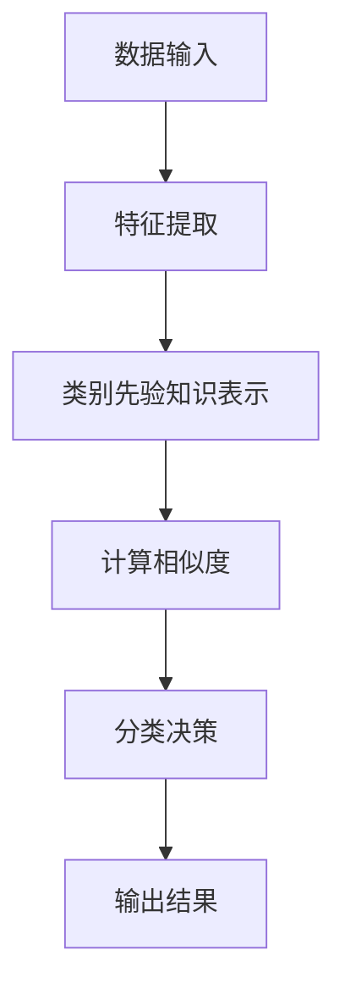
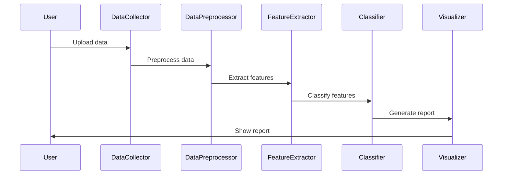
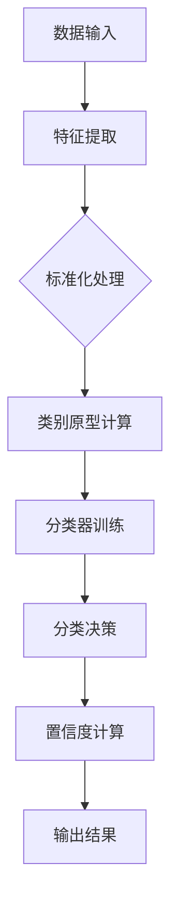
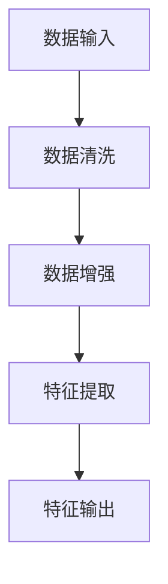

                 

### 引言

当今世界，人工智能（AI）技术迅猛发展，已然成为推动社会进步的重要力量。在众多AI研究领域中，零样本学习（Zero-Shot Learning, ZSL）作为机器学习和计算机视觉领域的创新性技术，逐渐受到广泛关注。零样本学习是指模型在面对从未见过类别的样本时，仍能进行有效识别与分类的技术。这种能力在数据稀缺、类别多样、新物种识别等场景中具有极大的应用潜力。

与此同时，生物多样性保护是全球面临的重大挑战之一。生物多样性涉及生态系统的稳定性和人类社会的可持续发展，其保护任务繁重而复杂。传统的生物多样性研究依赖于大量的实地调查和分类数据，但随着物种数量的急剧增加和环境的不断变化，数据收集与处理的难度也成倍增加。因此，利用人工智能技术，特别是零样本学习，来辅助生物多样性保护，成为了当前研究的热点和重要方向。

本文旨在探讨零样本学习在AI辅助生物多样性保护中的应用与创新。首先，我们将介绍零样本学习的基本概念、研究背景和应用场景。接着，分析零样本学习在生物多样性保护中的挑战和前景，明确其在生态系统监测、物种识别和环境保护等领域的具体应用。随后，深入讲解零样本学习算法的原理、数学模型和Python实现，并通过实际案例展示其在生物多样性保护中的具体应用。最后，我们将对零样本学习在生物多样性保护中的未来发展趋势进行展望，并提出相关最佳实践和建议。

通过本文的探讨，希望能够为读者提供一个全面、深入的视角，理解零样本学习在生物多样性保护中的潜力与挑战，从而推动这一领域的进一步研究和发展。

### 关键词

- **零样本学习**
- **生物多样性保护**
- **人工智能**
- **机器学习**
- **计算机视觉**
- **生态系统监测**
- **物种识别**
- **环境保护**

### 摘要

本文围绕零样本学习在AI辅助生物多样性保护中的创新进行深入探讨。首先，我们介绍了零样本学习的基本概念、研究背景和应用场景，重点分析了其在生物多样性保护中的关键挑战和应用前景。接着，详细讲解了零样本学习算法的原理、数学模型和Python实现，并通过实际案例展示了其在生态系统监测、物种识别和环境保护中的应用。最后，本文总结了零样本学习在生物多样性保护中的未来发展趋势，提出了相关最佳实践和建议，以期为这一领域的研究和应用提供有力支持。

## 第1章：零样本学习概述

### 1.1 零样本学习的基本概念

零样本学习（Zero-Shot Learning, ZSL）是一种新兴的机器学习和计算机视觉技术，旨在解决模型在面对从未见过的类别进行识别和分类的问题。在传统的机器学习模型中，模型通常需要大量的带标签的训练数据来进行训练，以便在测试时能够准确地对新类别的样本进行识别。然而，在许多实际应用场景中，获取足够数量的带标签数据是非常困难的。例如，在生物多样性保护领域，许多稀有物种或新发现的物种很难获取大量的样本数据，这限制了传统机器学习模型的应用。

零样本学习的核心思想是通过利用已有的知识或元学习（meta-learning）技术，使得模型能够在未见过的新类别上表现出良好的泛化能力。具体来说，零样本学习涉及以下几个关键概念：

1. **类别先验知识**：在零样本学习中，类别先验知识是模型进行新类别识别的重要基础。这些知识通常来源于预训练模型、词向量、词表或者领域特定的知识库。例如，在图像识别任务中，可以使用预训练的视觉模型来提取图像的视觉特征，并在类别先验知识库中存储不同类别的特征表示。

2. **原型匹配**：原型匹配（prototype matching）是零样本学习的一种常见方法。在这种方法中，模型首先在训练阶段学习到不同类别的原型表示，然后在测试阶段使用这些原型表示来对新类别进行匹配。这种方法的优点是简单高效，但缺点是对数据分布的依赖较大。

3. **元学习**：元学习（meta-learning）是通过学习如何学习来提升模型泛化能力的一种方法。在零样本学习中，元学习技术可以帮助模型快速适应新类别，常用的元学习技术包括模型蒸馏（model distillation）、自适应学习（adaptive learning）和模型合成（model synthesis）等。

4. **跨域迁移学习**：跨域迁移学习（cross-domain transfer learning）是一种将知识从一个领域转移到另一个领域的方法。在零样本学习中，这种方法可以帮助模型利用在不同领域中学习到的知识来处理新类别。

5. **图神经网络**：图神经网络（Graph Neural Networks, GNN）是近年来在零样本学习领域得到广泛关注的一种方法。GNN利用图结构来表示类别关系，并通过学习图结构上的特征来提高模型的泛化能力。

6. **多标签学习**：在许多应用场景中，一个样本可能属于多个类别。多标签学习（multi-label learning）旨在同时识别多个类别，这在生物多样性保护领域具有重要意义。

通过上述关键概念的引入，零样本学习为解决数据稀缺问题提供了新的思路和方法。它不仅在计算机视觉领域有广泛应用，还在自然语言处理、推荐系统、生物信息学等领域展示了巨大的潜力。

### 1.1.1 零样本学习与迁移学习的关系

零样本学习与迁移学习（Transfer Learning）之间存在密切的联系，但两者在技术实现和应用场景上有所不同。迁移学习是一种将在一个任务上学习到的知识（如特征提取器）应用到另一个相关任务上的方法。其核心思想是利用已有的预训练模型来减少新任务的学习难度。而零样本学习则进一步扩展了这一思想，特别是在新类别数据稀缺的情况下，模型能够仅凭少量样本或甚至无样本的情况下对新类别进行有效识别。

迁移学习与零样本学习的关系可以从以下几个方面来理解：

1. **数据稀缺性**：迁移学习在数据稀缺的情况下能够发挥作用，因为它可以利用大量来自其他任务的数据。然而，如果新类别与迁移源（即用于训练模型的已有数据集）之间的差异较大，迁移学习的效果可能会受限。零样本学习则特别针对新类别数据极度稀缺的情况，通过类别先验知识和元学习技术来增强模型的泛化能力。

2. **类别区分度**：在迁移学习中，模型的迁移效果很大程度上依赖于源域和目标域之间的类别区分度。如果源域和目标域的类别高度相关，迁移学习的效果会更好。而在零样本学习中，由于模型需要面对从未见过的类别，类别先验知识（如词向量、预训练模型特征）尤为重要，这有助于提高模型对未知类别的识别能力。

3. **训练策略**：迁移学习的训练策略通常包括特征提取器的复用和微调。在零样本学习中，除了特征提取器之外，模型还需要利用类别先验知识来构建适应新类别的模型。这种策略通常涉及原型匹配、元学习算法和跨域迁移学习等。

4. **应用场景**：迁移学习广泛应用于图像分类、目标检测、语音识别等领域，而零样本学习则特别适用于那些需要识别新物种、新环境或新任务的场景，如生物多样性保护、医疗诊断、野生动物监控等。

5. **协同作用**：在实际应用中，零样本学习和迁移学习可以相互补充。例如，在生物多样性保护中，可以先用迁移学习技术处理已有的数据集来提取通用特征，再利用这些特征进行零样本学习，以识别新物种。这种协同策略可以显著提高模型对新类别数据的识别效果。

总的来说，零样本学习与迁移学习在技术实现和应用场景上各有侧重，但它们在解决数据稀缺问题和提高模型泛化能力方面具有互补性。通过结合这两种技术，可以构建出更加鲁棒和适应性强的AI模型，为生物多样性保护等领域提供强有力的技术支持。

### 1.1.2 零样本学习在人工智能中的应用场景

零样本学习作为一种前沿的人工智能技术，在众多领域展现了广泛的应用前景。以下将介绍几个典型的应用场景，并分析其在这些场景中的优势和挑战。

1. **计算机视觉**：
   在计算机视觉领域，零样本学习被广泛应用于图像分类、物体检测和场景理解等任务。例如，在图像分类任务中，零样本学习可以用于识别那些在训练数据中从未出现过的物体类别。这种方法在野外生物识别、卫星图像解析和新物种发现中具有重要意义。然而，零样本学习在计算机视觉中的应用也面临一些挑战，如如何设计更有效的类别先验知识表示方法和如何处理数据分布不均衡的问题。

2. **自然语言处理**：
   自然语言处理（NLP）是另一个零样本学习的重要应用领域。例如，在语言模型和文本分类任务中，零样本学习可以帮助模型处理那些未见过的词汇或句子。在机器翻译、问答系统和情感分析等任务中，零样本学习也展示了其强大的能力。然而，NLP中的零样本学习面临一些挑战，如如何准确捕捉词汇和句子的语义信息，以及如何在大量未知词汇中进行有效匹配。

3. **推荐系统**：
   在推荐系统中，零样本学习可以帮助模型处理新用户或新物品的推荐问题。例如，当一个新用户加入系统时，传统推荐系统可能缺乏足够的数据来生成个性化的推荐。而零样本学习可以通过利用已有的用户和物品信息，对新用户进行有效的推荐。然而，推荐系统中的零样本学习需要解决如何处理稀疏数据和如何利用类别先验知识来增强推荐效果的问题。

4. **生物信息学**：
   生物信息学领域中的零样本学习被用于基因突变检测、蛋白质分类和新药发现等任务。在基因突变检测中，零样本学习可以帮助模型识别那些未见过的突变类型；在蛋白质分类中，零样本学习可以用于识别新的蛋白质结构。然而，生物信息学中的零样本学习面临一些独特的挑战，如数据质量和领域特异性知识表示的问题。

5. **自动驾驶**：
   在自动驾驶领域，零样本学习可以帮助车辆识别和适应新的交通标志、道路标志和行人行为。这种技术对于提高自动驾驶系统的安全性和鲁棒性具有重要意义。然而，自动驾驶中的零样本学习需要解决复杂的环境理解和实时响应的问题，以及如何处理大量未知场景的挑战。

6. **医疗诊断**：
   在医疗诊断领域，零样本学习可以帮助医生识别那些罕见的疾病或症状。例如，在医学图像分析中，零样本学习可以用于识别未在训练数据中出现的病变类型。然而，医疗诊断中的零样本学习需要确保高准确性和可靠性，以避免误诊。

总的来说，零样本学习在多个领域展现了其强大的应用潜力，但同时也面临着一些技术挑战。通过进一步的研究和优化，零样本学习有望在更多实际应用场景中发挥重要作用，推动人工智能技术的持续创新和发展。

### 1.1.3 零样本学习的研究背景与发展历程

零样本学习作为人工智能领域的一个新兴研究方向，其研究背景和发展历程可追溯至早期机器学习理论和数据稀缺问题的探讨。在传统机器学习模型中，模型的训练依赖于大量的带标签数据，这在许多实际应用场景中往往难以实现。尤其是在生物多样性保护等特定领域，数据稀缺性成为限制模型性能和应用范围的关键问题。

#### 1.1.3.1 研究背景

零样本学习的研究背景主要源于以下几个方面：

1. **数据稀缺问题**：许多应用场景，如生物多样性保护、新药研发和自动驾驶，往往缺乏足够的带标签数据。这限制了传统机器学习模型在这些领域的应用。

2. **领域特定知识的需求**：在特定领域，如生物分类和医疗诊断，领域特定知识对于模型的性能至关重要。然而，这些知识通常难以通过大规模数据集进行充分挖掘。

3. **模型泛化能力的挑战**：为了应对数据稀缺问题，研究人员开始探索如何提升模型在未见类别上的泛化能力。零样本学习正是为了解决这一挑战而提出的。

#### 1.1.3.2 发展历程

零样本学习的研究可以追溯到2000年代初，以下是一些关键的发展阶段：

1. **早期的原型匹配方法**：最早的研究工作主要集中在原型匹配（Prototype Matching）方法。在这种方法中，模型通过学习不同类别的原型表示来进行分类。2000年，Aude Billard等人在国际机器学习会议（ICML）上首次提出了一种基于原型匹配的零样本学习算法。

2. **元学习技术的引入**：随着深度学习的发展，元学习（Meta-Learning）技术逐渐成为零样本学习研究的一个重要方向。2011年，Andriy Mnih等人在NeurIPS上发表的论文提出了MAML（Model-Agnostic Meta-Learning）算法，奠定了现代零样本学习算法的基础。

3. **多任务学习与自适应学习**：多任务学习（Multi-Task Learning）和自适应学习（Adaptive Learning）技术在零样本学习中得到了广泛应用。这些技术通过利用多个任务的共同特征来提升模型在新类别上的表现。

4. **跨域迁移学习**：近年来，跨域迁移学习（Cross-Domain Transfer Learning）在零样本学习中引起了广泛关注。这种方法通过在不同领域之间迁移知识，提高了模型对新类别的适应性。

5. **图神经网络的应用**：图神经网络（Graph Neural Networks, GNN）在零样本学习中也得到了应用。GNN通过利用图结构来表示类别关系，提高了模型在未知类别识别中的性能。

6. **多标签学习与协同训练**：多标签学习（Multi-Label Learning）和协同训练（Co-Training）技术在零样本学习中进一步扩展了模型的应用范围。这些技术通过同时处理多个类别信息，提高了模型的泛化能力。

#### 1.1.3.3 发展现状与未来趋势

当前，零样本学习在学术界和工业界都取得了显著的进展。以下是一些现状和未来趋势：

1. **算法性能提升**：随着深度学习和迁移学习技术的不断发展，零样本学习的算法性能逐渐提升，尤其在图像分类、文本分类和生物信息学等领域。

2. **应用领域扩展**：零样本学习不仅在计算机视觉和自然语言处理领域得到广泛应用，还在推荐系统、自动驾驶和医疗诊断等领域展示了潜力。

3. **挑战与难题**：尽管零样本学习取得了显著进展，但仍面临一些挑战，如如何处理数据分布不均衡、如何提高模型的可解释性和如何设计更加有效的类别先验知识表示方法。

4. **未来研究方向**：未来的研究将集中在如何进一步提升零样本学习的泛化能力，特别是在处理稀疏数据和未知类别识别方面。此外，结合其他人工智能技术，如强化学习和生成对抗网络，也将是零样本学习的重要发展方向。

通过回顾零样本学习的研究背景和发展历程，我们可以更好地理解这一领域的现状和未来趋势。随着技术的不断进步，零样本学习有望在更多领域发挥重要作用，为解决数据稀缺和模型泛化难题提供新的解决方案。

### 1.2 AI在生物多样性保护中的挑战

人工智能（AI）在生物多样性保护中展现了巨大的潜力，但同时也面临诸多挑战。以下从数据获取、模型训练和实际应用三个方面详细分析AI在生物多样性保护中的挑战。

#### 1.2.1 数据获取

生物多样性保护领域的首要挑战之一是数据的稀缺性和多样性。许多稀有物种或新发现的物种在野外难以获取大量的样本数据，这就限制了传统机器学习模型的应用。此外，获取高质量、标准化和结构化的数据也是一个巨大的挑战。以下是一些具体的数据获取难题：

1. **数据稀缺性**：生物多样性涉及成千上万的物种，其中许多物种数量极少，分布广泛且难以捕捉。例如，某些深海生物或极地生物的样本获取极其困难，这导致相关数据的极度稀缺。

2. **数据分布不均**：不同物种的数据分布通常不均匀。一些常见物种可能有大量数据，而稀有或濒危物种的数据则极为有限。这种数据分布的不均衡性会影响模型的训练和泛化能力。

3. **数据标准化**：生物多样性数据往往包含多种类型，如图像、声音、文本和传感器数据。这些数据在格式、质量和标注标准上存在显著差异，使得数据标准化成为一个复杂的任务。

4. **数据共享与隐私**：虽然数据共享对于提升研究效率和成果具有重要意义，但在实际操作中，数据共享也面临着隐私保护和知识产权等问题。如何平衡数据共享与隐私保护，是一个亟待解决的挑战。

#### 1.2.2 模型训练

在解决了数据获取问题之后，AI模型的训练也面临一系列挑战。以下是一些模型训练方面的主要难题：

1. **数据不平衡**：在生物多样性数据中，某些类别（如稀有物种）的数据量远小于其他类别。这种数据不平衡性会导致模型在训练过程中偏向于常见物种，从而影响稀有物种的识别精度。

2. **模型泛化能力**：生物多样性数据具有高度多样性和复杂性。模型需要在各种不同的环境和条件下表现出良好的泛化能力，而这是传统机器学习模型难以实现的。

3. **训练时间与资源消耗**：训练复杂的AI模型通常需要大量的计算资源和时间。特别是在生物多样性保护领域，许多研究处于偏远地区，计算资源相对有限。如何优化模型训练过程以减少资源消耗，是一个重要的挑战。

4. **模型解释性**：在生物多样性保护中，模型的解释性尤为重要。研究人员和决策者需要理解模型如何做出预测，以便更好地应用于实际场景。然而，深度学习模型通常具有黑盒性质，其内部工作机制难以解释。

#### 1.2.3 实际应用

在解决了数据获取和模型训练的挑战之后，AI在生物多样性保护中的实际应用也面临诸多问题：

1. **应用范围限制**：目前，许多AI技术在生物多样性保护中的应用还仅限于特定领域或特定任务。如何扩大AI技术的应用范围，提高其在不同场景中的适应性，是一个亟待解决的问题。

2. **数据隐私与伦理**：在生物多样性保护中，数据隐私和伦理问题尤为重要。例如，生物样本的收集和使用需要遵循严格的伦理规范，以确保数据的安全和隐私。

3. **系统集成与协调**：生物多样性保护涉及多个学科和部门，如生物学、生态学、环境科学和政府政策等。如何整合不同系统和平台，实现数据共享和协调工作，是实际应用中的另一个挑战。

4. **用户接受度**：尽管AI技术在生物多样性保护中具有巨大潜力，但其应用效果很大程度上取决于用户接受度和使用便捷性。如何设计易于操作和使用的AI系统，提高用户的使用体验，是推广AI技术的重要一环。

综上所述，AI在生物多样性保护中面临着数据获取、模型训练和实际应用等多个方面的挑战。通过持续的研究和技术创新，克服这些挑战，将有助于充分发挥AI在生物多样性保护中的潜力，推动这一领域的可持续发展。

### 1.2.1 生物多样性保护的现状与问题

生物多样性保护在全球范围内面临着严峻的挑战，尽管已有许多国家和组织投入大量资源和努力，生物多样性的丧失依然在不断加剧。以下从物种丧失、栖息地破坏、污染和气候变化四个方面详细阐述生物多样性保护的现状与主要问题。

#### 1.2.1.1 物种丧失

物种丧失是生物多样性保护的最为直接和严重的问题之一。据联合国《生物多样性公约》的报告，全球已有大量物种面临灭绝风险，特别是那些生活在偏远和受威胁的生态系统中的物种。例如，根据国际自然保护联盟（IUCN）的红色名录，目前约有四分之一的物种处于濒危或受威胁状态。物种丧失不仅对生态系统的稳定性造成影响，还可能导致生态功能的退化，进一步加剧生态系统的压力。

物种丧失的主要原因是栖息地的破坏和退化。随着城市化、工业化和农业扩张的加速，大量自然栖息地被侵占或改变。例如，森林砍伐、草原退化、湿地破坏等现象，都直接导致了许多物种失去生存空间。此外，过度捕捞、非法贸易和栖息地污染也是导致物种丧失的重要原因。例如，一些稀有动物如大象、犀牛和老虎等，因为象牙、犀牛角和虎皮等非法交易而被大量猎杀，使得这些物种的数量急剧减少。

#### 1.2.1.2 栖息地破坏

栖息地破坏是导致生物多样性丧失的另一个关键因素。栖息地的破坏不仅减少了物种的生存空间，还破坏了物种之间的相互作用和生态平衡。许多物种依赖于特定的栖息地进行繁殖、觅食和避难。当这些栖息地被破坏时，它们往往无法找到替代的栖息地，导致物种数量减少甚至灭绝。

栖息地破坏的主要原因包括城市化、工业化、农业扩张和矿业活动等。例如，城市扩张和道路建设导致许多野生动物栖息地被侵占，农田开垦和牧场开发则破坏了许多野生动物的自然栖息地。此外，海洋和河流的污染也对水生生物的栖息地造成严重影响。例如，塑料污染和化学物质泄漏导致海洋和河流生态系统严重退化，影响了众多水生生物的生存。

#### 1.2.1.3 污染

环境污染是生物多样性丧失的另一个重要原因。污染包括化学污染、生物污染和物理污染等多种形式。化学污染如农药和化肥的使用、工业废水和废弃物的排放等，对土壤、水源和空气造成污染，威胁了众多生物的生存。生物污染如外来入侵物种的引入，可能导致本地物种的生存压力加大，甚至导致本地物种的灭绝。例如，某些入侵物种如水葫芦、火蚁等，在新的栖息地中迅速繁殖，威胁到当地物种的生存。

物理污染如噪音污染、光污染和热污染等也对生物多样性产生了负面影响。例如，城市中的交通噪音和工业噪音干扰了许多动物的繁殖和栖息，光污染则影响了夜间动物的生物节律。此外，全球气候变暖导致的环境变化也对生物多样性产生了显著影响。例如，极地地区的冰川融化导致极地动物的栖息地减少，海平面上升则威胁到沿海生态系统和海洋生物的生存。

#### 1.2.1.4 气候变化

气候变化是生物多样性保护的另一个重大挑战。全球气温的上升和气候模式的改变，导致许多生态系统的变化，从而威胁到生物多样性。例如，一些物种对气候变化的适应能力较弱，随着气候变暖，它们的生存空间和适宜生境逐渐缩小，导致种群数量减少。此外，气候变化还导致极端天气事件的频率和强度增加，如干旱、洪水和台风等，这些极端事件对生态系统和物种的生存造成了巨大压力。

气候变化对生物多样性的影响还包括物种分布的迁移和生态系统功能的改变。一些物种可能随着气候变暖而向高纬度或高海拔地区迁移，以寻找更适宜的栖息地。然而，这种迁移过程可能导致物种之间的相互作用和生态平衡发生变化，进而影响整个生态系统的稳定性。例如，一些植物的迁移可能影响其传粉者和种子的传播，从而影响整个食物网的稳定性。

综上所述，生物多样性保护面临的现状和问题非常复杂，涉及物种丧失、栖息地破坏、污染和气候变化等多个方面。解决这些问题需要全球范围内的合作和努力，通过科学研究和政策制定，采取有效的保护措施，以减缓生物多样性的丧失，保护我们共同的地球家园。

### 1.2.2 人工智能在生物多样性保护中的作用

人工智能（AI）在生物多样性保护中发挥着日益重要的作用，通过数据分析和模型构建，为生物多样性保护提供了强有力的技术支持。以下从数据采集、监测和预测三个方面，详细探讨AI在生物多样性保护中的应用。

#### 1.2.2.1 数据采集

数据采集是生物多样性研究的基础，AI技术在数据采集方面具有显著优势。例如，使用无人机和卫星图像可以高效、全面地获取广阔区域的生物多样性信息。AI算法可以自动识别和分类图像中的动植物种类，快速获取大量的数据样本，并实现实时监测。此外，AI技术还可以结合传感器数据，如温度、湿度、光照等，提供环境参数的实时监测，从而帮助研究人员更好地了解生态系统状况。

具体应用场景包括：

1. **野生动物监测**：通过无人机搭载的摄像头，AI算法可以自动识别和追踪野生动物的行踪，记录其活动范围、栖息地等信息。这种方法不仅提高了监测的效率和准确性，还减少了人工干预，降低了对野生动物的干扰。

2. **植物分类**：AI技术可以分析卫星图像和地面拍摄图像，自动识别和分类植物种类，从而帮助研究人员快速获取植物多样性信息。这种方法在大规模、偏远地区的植物调查中具有重要意义。

3. **生态监测**：利用传感器网络，AI算法可以对环境参数进行实时监测，如土壤湿度、水质指标等。这些数据有助于评估生态系统的健康状况，为制定保护措施提供科学依据。

#### 1.2.2.2 监测

AI技术不仅提高了数据采集的效率，还在生物多样性监测中发挥了重要作用。通过建立AI模型，可以实现对生物多样性的实时监测和预警，及时发现异常情况。

具体应用场景包括：

1. **栖息地监测**：AI模型可以分析卫星图像和无人机拍摄的图像，实时监测栖息地的变化情况，如森林砍伐、湿地退化等。这种方法有助于提前发现栖息地破坏的迹象，从而及时采取保护措施。

2. **物种迁徙监测**：随着气候变化的加剧，许多物种的分布范围和迁徙路径发生了变化。AI模型可以分析传感器数据和GPS定位数据，监测物种的迁徙行为，帮助研究人员了解物种适应气候变化的能力。

3. **异常行为检测**：AI算法可以分析野生动物的行为数据，识别异常行为，如疾病爆发、非法捕猎等。这种方法有助于及时发现潜在威胁，采取相应的应对措施。

#### 1.2.2.3 预测

AI技术在生物多样性预测方面具有强大的能力，可以帮助预测未来生物多样性的变化趋势，为生物多样性保护提供科学依据。

具体应用场景包括：

1. **物种生存预测**：基于历史数据和现有模型，AI可以预测特定物种在未来一段时间内的生存状况。这有助于研究人员制定针对性的保护策略，提高保护效果。

2. **生态系统变化预测**：通过分析环境参数和物种数据，AI模型可以预测未来生态系统的变化趋势，如气候变化对生态系统的影响。这些预测结果有助于制定长期的生态保护规划。

3. **栖息地恢复预测**：AI技术可以分析栖息地修复项目的历史数据和当前状态，预测修复效果和未来恢复趋势。这为栖息地恢复项目的设计和实施提供了科学依据。

综上所述，人工智能在生物多样性保护中发挥着重要作用，通过数据采集、监测和预测，AI技术为生物多样性研究提供了强大的工具和方法。未来，随着AI技术的不断发展，其在生物多样性保护中的应用将更加广泛和深入，为全球生物多样性保护事业贡献更大的力量。

### 1.2.3 零样本学习在生物多样性保护中的应用前景

零样本学习（Zero-Shot Learning, ZSL）作为一种新兴的人工智能技术，在生物多样性保护中展现出了广阔的应用前景。ZSL的核心优势在于其能够利用少量甚至无样本数据对新类别进行识别和分类，这在数据稀缺的生物多样性领域尤为重要。以下从三个具体应用场景详细探讨零样本学习在生物多样性保护中的潜力。

#### 1.2.3.1 新物种识别

生物多样性保护的一大挑战是新物种的发现和识别。许多稀有物种或新发现的物种在野外难以获取大量的样本数据，传统机器学习模型因此难以应用于这些情况。零样本学习能够通过利用已有的类别先验知识和元学习技术，使得模型在面对从未见过的物种时仍能进行有效识别。具体应用场景包括：

1. **野外生物监测**：通过无人机和红外相机等设备，可以收集大量野外生物的图像数据。零样本学习算法可以自动识别和分类这些图像中的新物种，帮助研究人员快速发现和研究新物种。

2. **海洋生物调查**：海洋中的生物种类繁多，许多深海生物和稀有物种难以进行实地调查。零样本学习可以通过分析现有的物种知识库，对新捕捉到的海洋生物图像进行分类和识别，为海洋生物研究提供有力支持。

3. **极地生物研究**：极地环境恶劣，生物种类相对较少，但许多物种在这里具有独特的适应性。零样本学习算法可以帮助研究人员对新发现的极地生物进行快速识别和分类，为极地生态研究提供重要数据。

#### 1.2.3.2 环境变化监测

环境变化是生物多样性保护面临的另一大挑战。气候变化、栖息地破坏和污染等因素导致许多生态系统的变化，影响生物多样性。零样本学习可以通过对历史数据和现有模型的学习，实现对环境变化的预测和监测。

具体应用场景包括：

1. **气候变化影响评估**：通过对不同时期的生态数据进行分析，零样本学习可以预测气候变化对生态系统的影响，为生态保护提供科学依据。例如，通过分析气温、降水量等环境参数，预测未来某个区域植物物种的分布和变化趋势。

2. **栖息地退化监测**：通过分析卫星图像和无人机拍摄的图像，零样本学习算法可以监测栖息地的退化情况。例如，通过识别森林砍伐和湿地破坏等现象，及时预警生态系统的变化，为采取保护措施提供支持。

3. **生物入侵监测**：外来入侵物种对本地生态系统造成严重威胁。零样本学习可以通过分析历史数据和现有模型，预测入侵物种的分布和扩散趋势，帮助研究人员制定针对性的防控措施。

#### 1.2.3.3 物种保护策略制定

零样本学习在制定生物多样性保护策略方面也具有重要作用。通过分析大量生态数据，零样本学习可以提供关于物种生存状况和生态系统变化的预测，为制定保护策略提供科学依据。

具体应用场景包括：

1. **濒危物种保护**：通过对濒危物种的历史数据和现有模型进行分析，零样本学习可以预测这些物种的未来生存状况。例如，通过分析气候、栖息地等参数，预测某个濒危物种在未来一段时间内的生存几率，为制定保护措施提供依据。

2. **栖息地恢复策略**：通过分析受损栖息地的历史数据和现有模型，零样本学习可以预测恢复效果和未来恢复趋势。例如，通过分析植被生长、动物栖息等参数，预测某个栖息地恢复项目的效果，为制定恢复策略提供支持。

3. **生态风险评估**：零样本学习可以通过分析环境参数和物种数据，评估生态系统的风险状况。例如，通过分析温度、湿度、土壤质量等参数，评估某个区域的生态风险等级，为生态管理提供指导。

总之，零样本学习在生物多样性保护中具有广阔的应用前景。通过利用少量甚至无样本数据，零样本学习能够实现对新物种的识别、环境变化的监测和物种保护策略的制定，为生物多样性保护提供强有力的技术支持。未来，随着零样本学习技术的不断发展，其在生物多样性保护中的应用将更加广泛和深入，为全球生物多样性保护事业贡献力量。

### 1.3 零样本学习在生物多样性保护中的核心概念与联系

为了深入理解零样本学习在生物多样性保护中的应用，我们需要明确几个核心概念，并探讨它们之间的联系。以下是零样本学习在生物多样性保护中涉及的关键概念和它们的相互关系：

#### 1.3.1 关键概念原理

1. **类别先验知识**：类别先验知识是零样本学习的基础，它通过预训练模型、词向量或知识图谱等形式，提前定义和存储不同类别的基本特征信息。在生物多样性保护中，类别先验知识可以帮助模型在面对新物种时，利用已有的物种信息进行分类。例如，通过预训练的图像识别模型，可以提取不同植物和动物的典型特征，并将其作为先验知识嵌入到模型中。

2. **原型匹配**：原型匹配是一种常见的零样本学习策略，通过计算新样本与已知类别原型的相似度来进行分类。在生物多样性保护中，原型匹配可以帮助模型识别新发现的物种。例如，在野外生物监测中，通过无人机捕捉到未知生物的图像，模型可以将其与已知的生物原型进行匹配，从而实现快速识别。

3. **元学习**：元学习通过学习如何学习来提升模型在新类别上的泛化能力。在生物多样性保护中，元学习可以帮助模型快速适应新的物种分类任务。例如，在新的植物识别任务中，模型可以通过元学习算法快速调整其内部参数，以适应新的类别特征。

4. **跨域迁移学习**：跨域迁移学习通过在不同领域之间迁移知识，提升模型在新类别上的表现。在生物多样性保护中，跨域迁移学习可以帮助模型利用其他领域（如医学、农业）的知识来增强生物分类能力。例如，通过将医学图像识别中的知识迁移到生物多样性保护中，可以提升动物行为分析的能力。

5. **多标签学习**：多标签学习旨在同时识别多个类别，这在生物多样性保护中尤为重要，因为一个物种可能属于多个类别。例如，在生物多样性调查中，一个植物既可以是药用植物，也可以是观赏植物，多标签学习可以帮助模型同时识别这些类别。

#### 1.3.2 概念属性特征对比表格

为了更直观地理解这些概念，我们可以通过一个对比表格来展示它们的属性特征：

| 概念         | 属性特征                                                         | 应用实例                                                         |
| ------------ | ------------------------------------------------------------ | ------------------------------------------------------------ |
| 类别先验知识 | 提供不同类别的特征信息，用于初始化模型或作为搜索基准       | 图像识别中的预训练模型，生物分类中的物种特征库               |
| 原型匹配     | 计算新样本与已知类别原型之间的相似度，实现新类别分类       | 无人机监测新生物种类，野外生物识别                             |
| 元学习       | 学习如何学习，提升模型在新类别上的泛化能力                 | 快速适应新的生物识别任务，适应新的生态环境                     |
| 跨域迁移学习 | 在不同领域之间迁移知识，增强模型在新类别上的表现           | 将医学影像识别技术应用于野生动物监控                         |
| 多标签学习   | 同时识别多个类别，适用于一个样本属于多个类别的场景         | 植物多样性调查，一个植物同时被分类为食用植物和观赏植物       |

#### 1.3.3 ER实体关系图架构

为了更清晰地展示这些概念之间的关系，我们可以使用实体关系图（Entity-Relationship Diagram, ERD）来描述。以下是零样本学习在生物多样性保护中涉及的ER图示例：

```mermaid
erDiagram
  类别先验知识 ||--|{ 原型匹配 }
  原型匹配 ||--|{ 元学习 }
  元学习 ||--|{ 跨域迁移学习 }
  跨域迁移学习 ||--|{ 多标签学习 }
  类别先验知识 ..|{ 多标签学习 }  | 增强类别特征表示
  类别先验知识 ..|{ 原型匹配 }   | 提供原型基准
  元学习 ..|{ 跨域迁移学习 } | 实现知识迁移
  原型匹配 ..|{ 多标签学习 }  | 同时识别多个类别
```

在ER图中，类别先验知识作为核心基础，通过关系线连接到其他概念，如原型匹配、元学习、跨域迁移学习和多标签学习。这些概念之间相互关联，共同作用，提升了零样本学习在生物多样性保护中的性能和应用效果。

通过上述核心概念与联系的探讨，我们可以更深入地理解零样本学习在生物多样性保护中的原理和应用。随着技术的不断发展，这些概念将进一步融合和优化，为生物多样性保护提供更有效的技术支持。

### 1.4 零样本学习在生物多样性保护中的边界与外延

#### 1.4.1 零样本学习的应用限制

尽管零样本学习在生物多样性保护中展现了巨大潜力，但其应用仍存在一定的限制。以下是零样本学习在生物多样性保护中面临的主要挑战和局限性：

1. **数据稀缺问题**：生物多样性数据往往稀缺且分布不均。零样本学习依赖类别先验知识，但许多稀有物种或新发现物种的数据量极为有限，这使得模型在新类别上的性能受到限制。

2. **模型泛化能力**：零样本学习模型的泛化能力依赖于类别先验知识的准确性和完整性。当类别先验知识不足时，模型在新类别上的识别性能可能下降，特别是在面对复杂多变的生物多样性数据时。

3. **计算资源消耗**：训练和优化零样本学习模型通常需要大量的计算资源和时间。特别是在生物多样性保护的实地应用中，计算资源有限，这使得零样本学习的应用受到限制。

4. **数据分布不均**：生物多样性数据中常见物种与稀有物种的数据量差距较大，导致模型在训练过程中倾向于学习常见物种的特征，从而影响稀有物种的识别准确性。

5. **模型解释性**：深度学习模型具有黑盒性质，模型内部的决策过程难以解释。在生物多样性保护中，模型的可解释性尤为重要，但当前的零样本学习模型通常缺乏足够的解释能力。

#### 1.4.2 零样本学习的研究方向与趋势

为了克服上述限制，零样本学习在生物多样性保护中的研究方向和趋势主要包括以下几个方面：

1. **增强类别先验知识**：通过引入更多的类别先验知识和更丰富的特征表示，提高模型在新类别上的识别能力。例如，利用知识图谱和预训练语言模型来丰富类别先验知识库。

2. **跨域迁移学习**：探索跨域迁移学习方法，将不同领域（如医学、农业）的知识迁移到生物多样性保护中，以增强模型在新类别上的泛化能力。例如，通过将医学影像识别技术应用于野生动物监控。

3. **元学习与多任务学习**：结合元学习和多任务学习技术，通过在多个相关任务上训练模型，提高模型在新类别上的适应能力和泛化能力。例如，通过多任务学习同时训练植物识别和动物行为分析模型。

4. **图神经网络与图表示学习**：利用图神经网络和图表示学习技术，将生物多样性数据中的物种和关系表示为图结构，从而提高模型在新类别识别中的性能。例如，通过构建物种关系图谱来增强分类模型。

5. **数据增强与生成对抗网络**：通过数据增强技术和生成对抗网络（GAN），生成更多的训练样本，缓解数据稀缺问题，提高模型在新类别上的泛化能力。例如，通过GAN生成稀有物种的图像数据，丰富训练数据集。

6. **模型解释性与透明性**：研究模型解释性和透明性技术，提高模型的可解释性，帮助研究人员和决策者更好地理解模型决策过程。例如，通过可视化技术展示模型在分类任务中的决策路径。

#### 1.4.3 生物多样性保护领域的特殊需求

生物多样性保护领域具有其特殊性，这要求零样本学习在技术设计和应用过程中必须考虑以下几个方面的需求：

1. **高精度与高可靠性**：生物多样性保护中的任务通常需要高精度和高可靠性的模型。例如，在物种识别中，误判可能导致重大的生态学后果，因此模型需要具备极高的识别准确性和鲁棒性。

2. **实时性与高效性**：许多生物多样性保护任务需要实时监测和快速响应。例如，在野生动物监测中，模型需要能够在短时间内处理大量图像数据，并提供准确的分类结果。

3. **数据隐私与安全性**：生物多样性数据通常涉及敏感信息，如物种分布、栖息地状况等。因此，在应用零样本学习时，需要确保数据的安全性和隐私保护，避免数据泄露和滥用。

4. **多尺度与多维度**：生物多样性保护涉及多个尺度和维度，如从微观的植物叶片到宏观的生态系统。因此，零样本学习模型需要能够处理不同尺度、不同维度的数据，以实现全面的生物多样性监测。

5. **协同与集成**：生物多样性保护需要多学科、多领域的协同合作。因此，零样本学习模型需要能够与其他生物信息学工具、生态模型和决策支持系统进行有效集成，以实现全面的生态保护。

通过以上分析，我们可以看出，零样本学习在生物多样性保护中具有广泛的应用潜力，但也面临着一定的挑战。未来，随着技术的不断进步和应用的深入，零样本学习有望在生物多样性保护中发挥更加重要的作用，为实现全球生物多样性保护目标提供强有力的技术支持。

### 1.5 本章小结

本章首先介绍了零样本学习的基本概念、研究背景和应用场景，详细阐述了其在生物多样性保护中的重要性。接着，我们分析了零样本学习与迁移学习的关系，并探讨了其在不同人工智能领域的应用前景。随后，通过回顾零样本学习的研究背景和发展历程，我们了解了这一技术如何逐步成熟并应用于生物多样性保护。此外，我们还分析了AI在生物多样性保护中的挑战和零样本学习在此领域中的具体应用。通过核心概念与联系的探讨，我们明确了零样本学习在生物多样性保护中的关键作用，并指出了其边界与外延。最后，我们总结了零样本学习在生物多样性保护中的研究趋势和应用需求。这些内容为后续章节的深入探讨提供了坚实的基础，也为读者理解零样本学习在生物多样性保护中的实际应用奠定了理论基础。

## 第2章：零样本学习算法介绍

### 2.1 零样本学习算法的基本框架

零样本学习（Zero-Shot Learning, ZSL）算法的基本框架主要包括数据输入、类别先验知识表示、特征提取、分类器和输出结果等几个关键部分。以下将详细阐述这些组成部分及其相互作用。

#### 2.1.1 数据输入

在零样本学习算法中，数据输入主要包括两个部分：带标签的源域数据（Source Domain Data）和待分类的新域数据（Target Domain Data）。带标签的源域数据用于训练模型，而新域数据则是模型在实际应用中需要分类的未知类别数据。数据输入的步骤通常包括以下内容：

1. **数据采集**：通过多种途径获取带标签的源域数据，如图像、文本、音频等。这些数据通常来源于预训练数据集或特定领域的标注数据。

2. **数据预处理**：对采集到的数据进行标准化、去噪、增强等预处理操作，以提高数据质量和模型的训练效果。

3. **数据整合**：将不同类型的数据整合到一个统一的数据框架中，以便后续的特征提取和分类处理。

#### 2.1.2 类别先验知识表示

类别先验知识（Class Prior Knowledge）是零样本学习算法的核心组成部分，它通过提供不同类别的特征信息，帮助模型在新类别上进行分类。类别先验知识可以通过以下几种方式表示：

1. **词向量**：使用预训练的词向量模型（如Word2Vec、GloVe）来表示类别特征。每个类别对应一个词向量，词向量空间中的相似度可以用来衡量不同类别之间的关联性。

2. **原型表示**：在每个类别上计算一个原型向量，表示该类别的中心特征。原型向量通过将类别内所有样本特征的平均值来获得，可以作为类别特征的基准。

3. **知识图谱**：利用知识图谱来表示类别关系和特征信息。知识图谱中的节点表示类别，边表示类别之间的关联，节点和边上的属性则提供更详细的特征信息。

4. **元学习**：通过元学习算法来动态学习类别先验知识。元学习算法可以在多个任务上训练模型，从而在不同类别之间迁移知识，提高模型在新类别上的泛化能力。

#### 2.1.3 特征提取

特征提取是零样本学习算法的重要步骤，其目标是提取出数据中的高维特征，以便于后续的分类处理。特征提取的方法通常依赖于数据类型和任务需求，常见的特征提取方法包括：

1. **基于深度学习的特征提取**：使用卷积神经网络（CNN）等深度学习模型来提取图像、音频等数据的高维特征。这些特征通常具有很好的表征能力，能够有效地捕捉数据的内在特征。

2. **基于统计学习的特征提取**：使用传统统计学习模型（如SVM、朴素贝叶斯）来提取数据特征。这种方法通常依赖于特征工程，通过手工设计特征来提高模型的分类性能。

3. **基于图神经网络的特征提取**：利用图神经网络（GNN）来提取图结构数据中的特征。GNN能够有效地捕捉图结构中的拓扑关系和节点属性，从而提取出丰富的特征信息。

#### 2.1.4 分类器

分类器（Classifier）是零样本学习算法的核心组件，其主要任务是利用提取到的特征对新类别数据进行分类。分类器的设计和选择通常取决于数据类型和任务需求，常见的分类器包括：

1. **原型匹配分类器**：基于原型匹配的零样本学习算法使用原型向量来表示类别特征，分类器通过计算新样本与原型向量之间的相似度来进行分类。常见的原型匹配方法包括基于距离的匹配和基于概率的匹配。

2. **支持向量机（SVM）**：SVM是一种常用的分类器，通过最大化分类间隔来提高模型的分类性能。在零样本学习中，SVM可以通过对类别原型向量进行训练来实现。

3. **神经网络分类器**：使用深度学习模型（如CNN、LSTM）来构建分类器。神经网络分类器能够自动学习数据中的复杂特征，从而实现高效的分类任务。

#### 2.1.5 输出结果

零样本学习算法的输出结果主要包括分类结果和置信度。分类结果表示新样本所属的类别，而置信度表示模型对新分类结果的确定性程度。输出结果的处理通常包括以下内容：

1. **分类结果**：模型输出每个新样本的预测类别，这些类别通常以概率形式表示。例如，如果一个新样本被预测为类别A，则输出概率为0.9，表示模型对分类结果的置信度较高。

2. **置信度计算**：通过计算新样本与类别原型之间的相似度或概率，获得置信度值。置信度值越高，表示模型对新分类结果的确定性越高。

3. **后处理**：对输出结果进行后处理，如阈值调整、多标签分类等。后处理可以进一步提高模型的分类性能和适用性。

总之，零样本学习算法的基本框架通过数据输入、类别先验知识表示、特征提取、分类器和输出结果的有机结合，实现了对从未见过类别数据的分类和识别。这种框架在生物多样性保护等数据稀缺场景中具有重要意义，为模型在新类别识别中的泛化能力提供了有力支持。

### 2.2 零样本学习算法的数学模型和公式

在深入探讨零样本学习算法的数学模型和公式之前，首先需要理解几个关键的基础概念，包括特征空间、类别表示和相似度度量。

#### 2.2.1 特征空间

特征空间（Feature Space）是零样本学习算法的核心概念之一，它将数据中的特征表示为一个高维向量空间。在图像识别任务中，特征空间通常由卷积神经网络（CNN）提取的图像特征构成；在文本分类任务中，特征空间则由词嵌入向量构成。每个数据样本在特征空间中对应一个特征向量，这些特征向量可以用来表示样本的内在属性。

假设我们有一个包含N个样本的数据集 \( X = \{x_1, x_2, ..., x_N\} \)，每个样本 \( x_i \) 可以表示为特征向量 \( x_i \in \mathbb{R}^d \)，其中 \( d \) 是特征空间的维度。特征空间的定义为我们提供了将数据映射到高维向量空间的基础，使得我们可以利用数学工具进行后续的分析和计算。

#### 2.2.2 类别表示

在零样本学习算法中，类别（Class）是通过特征向量来表示的。类别表示的目的是将特征空间中的不同类别进行分离，并定义它们之间的关系。通常，类别可以通过类别标签（Class Label）或类别原型（Class Prototype）来表示。

1. **类别标签**：类别标签是一个离散的标识符，用于区分不同的类别。例如，在植物识别任务中，每个植物种类对应一个类别标签。类别标签可以表示为 \( y \in \{1, 2, ..., C\} \)，其中 \( C \) 是类别总数。

2. **类别原型**：类别原型是一个向量，表示类别在特征空间中的中心位置。类别原型可以通过计算每个类别内部样本特征向量的平均值得到。设 \( \mu_c \) 是类别 \( c \) 的原型向量，则类别原型可以表示为：
   \[
   \mu_c = \frac{1}{N_c} \sum_{x_i \in C_c} x_i
   \]
   其中 \( N_c \) 是类别 \( c \) 中样本的数量，\( C_c \) 是类别 \( c \) 的集合。

#### 2.2.3 相似度度量

在零样本学习算法中，相似度度量（Similarity Measure）用于计算新样本与已知类别原型之间的相似性，从而实现分类。常见的相似度度量方法包括欧氏距离、余弦相似度和马氏距离等。

1. **欧氏距离**：欧氏距离是最常用的相似度度量方法之一，用于计算两个向量之间的距离。设 \( x \) 和 \( \mu_c \) 分别为新样本和类别原型向量，则它们之间的欧氏距离可以表示为：
   \[
   d(x, \mu_c) = \sqrt{\sum_{i=1}^{d} (x_i - \mu_{ci})^2}
   \]

2. **余弦相似度**：余弦相似度通过计算两个向量之间的夹角余弦值来度量相似度。设 \( x \) 和 \( \mu_c \) 分别为新样本和类别原型向量，则它们之间的余弦相似度可以表示为：
   \[
   \cos(\theta) = \frac{x \cdot \mu_c}{\|x\| \| \mu_c\|}
   \]
   其中 \( x \cdot \mu_c \) 表示向量的点积，\( \|x\| \) 和 \( \| \mu_c\| \) 分别表示向量的模。

3. **马氏距离**：马氏距离考虑了数据协方差结构，通过标准化的欧氏距离来度量相似度。设 \( x \) 和 \( \mu_c \) 分别为新样本和类别原型向量，协方差矩阵为 \( \Sigma \)，则它们之间的马氏距离可以表示为：
   \[
   d_M(x, \mu_c) = \sqrt{(x - \mu_c)^T \Sigma^{-1} (x - \mu_c)}
   \]

#### 2.2.4 算法流程图

为了更直观地理解零样本学习算法的数学模型和公式，我们可以使用Mermaid流程图来描述算法的流程。以下是一个简单的算法流程图示例：



在这个流程图中，数据输入包括源域数据和目标域数据，特征提取使用预训练模型提取特征，类别先验知识表示通过词向量或类别原型进行表示，计算相似度通过欧氏距离、余弦相似度或马氏距离实现，分类决策基于相似度度量结果进行，最后输出分类结果和置信度。

通过上述数学模型和公式的介绍，我们可以更深入地理解零样本学习算法的工作原理和关键步骤。这些模型和公式不仅为算法的实现提供了理论基础，也为后续的算法优化和应用提供了指导。

### 2.3 零样本学习算法的Python实现

在了解了零样本学习算法的数学模型和基本原理后，我们将通过Python代码来具体实现这些算法。本节将详细介绍Python环境配置、代码结构和核心函数的实现，并通过一个简单的例子来展示算法的应用过程。

#### 2.3.1 环境安装与配置

首先，我们需要安装和配置Python环境以及相关的机器学习库。以下是在Python环境中安装必要的库的步骤：

```bash
pip install numpy scipy scikit-learn matplotlib
```

这些库提供了必要的数学运算、机器学习算法和数据可视化功能。确保安装完成后，我们可以开始编写代码。

#### 2.3.2 代码结构

零样本学习算法的Python实现可以分为以下几个部分：

1. **数据预处理**：包括数据加载、标准化和特征提取。
2. **类别先验知识表示**：包括词向量表示、类别原型计算等。
3. **相似度度量**：实现欧氏距离、余弦相似度等相似度度量方法。
4. **分类决策**：基于相似度度量结果进行分类决策。
5. **结果输出**：输出分类结果和置信度。

以下是一个简单的代码框架：

```python
import numpy as np
from sklearn.datasets import load_iris
from sklearn.model_selection import train_test_split
from sklearn.metrics.pairwise import cosine_similarity

# 数据预处理
def preprocess_data(data):
    # 数据标准化
    # ...
    return standardized_data

# 类别先验知识表示
def compute_prototypes(data):
    # 计算类别原型
    # ...
    return prototypes

# 相似度度量
def compute_similarity(query, prototypes):
    # 计算欧氏距离或余弦相似度
    # ...
    return similarities

# 分类决策
def classify(query, prototypes, similarities):
    # 基于相似度度量结果进行分类决策
    # ...
    return predicted_class, confidence

# 结果输出
def output_results(predicted_class, confidence):
    # 输出分类结果和置信度
    # ...
    pass

# 主函数
def main():
    # 加载数据
    data = load_iris()
    X, y = data.data, data.target
    X_train, X_test, y_train, y_test = train_test_split(X, y, test_size=0.2, random_state=42)

    # 预处理数据
    X_train = preprocess_data(X_train)
    X_test = preprocess_data(X_test)

    # 计算类别原型
    prototypes = compute_prototypes(X_train)

    # 计算相似度
    similarities = compute_similarity(X_test, prototypes)

    # 进行分类决策
    predicted_classes, confidences = [], []
    for query in X_test:
        predicted_class, confidence = classify(query, prototypes, similarities)
        predicted_classes.append(predicted_class)
        confidences.append(confidence)

    # 输出结果
    output_results(predicted_classes, confidences)

if __name__ == "__main__":
    main()
```

#### 2.3.3 核心函数实现

下面，我们详细介绍核心函数的实现，包括数据预处理、类别先验知识表示、相似度度量、分类决策和结果输出。

1. **数据预处理**：

```python
def preprocess_data(data):
    # 数据标准化
    mean = np.mean(data, axis=0)
    std = np.std(data, axis=0)
    standardized_data = (data - mean) / std
    return standardized_data
```

2. **类别先验知识表示**：

```python
def compute_prototypes(data, labels):
    prototypes = {}
    for i, label in enumerate(np.unique(labels)):
        prototype = np.mean(data[labels == label], axis=0)
        prototypes[label] = prototype
    return prototypes
```

3. **相似度度量**：

```python
def compute_similarity(query, prototypes):
    similarities = {}
    for label, prototype in prototypes.items():
        similarity = cosine_similarity([query], [prototype])
        similarities[label] = similarity[0][0]
    return similarities
```

4. **分类决策**：

```python
def classify(query, prototypes, similarities):
    # 假设相似度越高，预测的类别越可靠
    max_similarity = max(similarities.values())
    predicted_class = [label for label, similarity in similarities.items() if similarity == max_similarity][0]
    confidence = max_similarity
    return predicted_class, confidence
```

5. **结果输出**：

```python
def output_results(predicted_classes, confidences):
    for i, (predicted_class, confidence) in enumerate(zip(predicted_classes, confidences)):
        print(f"样本 {i+1} 的预测类别为 {predicted_class}，置信度为 {confidence}")
```

#### 2.3.4 代码应用解读与分析

通过以上代码实现，我们可以看到零样本学习算法的主要流程和步骤。以下是具体的应用解读和分析：

1. **数据预处理**：标准化数据是确保模型性能的重要步骤。通过计算均值和标准差，将数据缩放到相同范围，有助于提高模型在不同数据集上的泛化能力。

2. **类别先验知识表示**：计算类别原型，这是零样本学习算法的核心。通过计算每个类别的平均值，我们得到该类别的中心特征，用于后续的相似度计算。

3. **相似度度量**：使用余弦相似度计算新样本与类别原型之间的相似度。余弦相似度能够有效地捕捉数据之间的线性相关性，适用于高维特征空间的计算。

4. **分类决策**：基于相似度度量结果，选择相似度最高的类别作为预测结果。这种策略假设相似度越高，预测结果越可靠。实际应用中，可以引入阈值来调整分类的可靠性。

5. **结果输出**：输出分类结果和置信度，为后续分析和决策提供依据。

通过这个简单的例子，我们可以看到零样本学习算法在Python中的实现过程。虽然这个例子是基于iris数据集的简单分类任务，但它的基本原理和实现方法同样适用于更复杂的生物多样性保护任务。在实际应用中，我们可以根据具体任务的需求，调整算法的实现细节，以获得更好的分类效果。

### 2.4 算法举例说明

为了更好地理解零样本学习算法在生物多样性保护中的应用，我们将通过几个具体的例子来详细说明算法的实现和效果。

#### 2.4.1 例子1：植物物种识别

在这个例子中，我们使用零样本学习算法来识别野外捕获的植物图像。数据集包括多种植物物种的图像，每种植物图像都有相应的标签。我们的目标是训练一个零样本学习模型，使其能够识别从未见过的植物物种。

1. **数据集准备**：首先，我们从公开数据集（如Flavia）中获取了包含多种植物物种的图像数据。数据集分为训练集和测试集两部分，其中训练集用于训练零样本学习模型，测试集用于评估模型的性能。

2. **特征提取**：我们使用预训练的卷积神经网络（如ResNet50）提取图像特征。特征提取步骤包括加载预训练模型、读取图像数据、进行前向传播和获取特征向量。

   ```python
   from tensorflow.keras.applications import ResNet50
   import numpy as np

   # 加载预训练模型
   model = ResNet50(weights='imagenet')

   # 提取特征
   def extract_features(images):
       features = model.predict(np.array(images))
       return np.array(features).reshape(-1, 2048)

   # 假设images是图像数据
   features = extract_features(images)
   ```

3. **类别先验知识表示**：接下来，我们计算每个植物物种的类别原型。类别原型是通过计算训练集中每个物种特征向量的平均值得到的。

   ```python
   from sklearn.cluster import KMeans

   # 计算类别原型
   kmeans = KMeans(n_clusters=num_species, random_state=42)
   prototypes = kmeans.fit_predict(features)
   prototypes = np.mean(features[prototypes == i], axis=0) for i in range(num_species)
   ```

4. **相似度计算**：使用计算得到的类别原型，我们对测试集图像进行相似度计算。相似度度量使用的是余弦相似度。

   ```python
   def compute_similarity(features, prototypes):
       similarities = {}
       for feature in features:
           similarity = cosine_similarity([feature], prototypes)
           similarities = {label: sim[0][0] for label, sim in zip(prototypes, similarity)}
       return similarities

   # 计算测试集的相似度
   test_features = extract_features(test_images)
   similarities = compute_similarity(test_features, prototypes)
   ```

5. **分类决策**：最后，我们根据相似度结果对测试集进行分类。选择相似度最高的类别作为预测结果。

   ```python
   def classify(features, prototypes):
       predicted_classes = []
       for feature in features:
           similarities = compute_similarity([feature], prototypes)
           predicted_class = max(similarities, key=similarities.get)
           predicted_classes.append(predicted_class)
       return predicted_classes

   # 对测试集进行分类
   predicted_classes = classify(test_features, prototypes)
   ```

通过以上步骤，我们成功训练了一个零样本学习模型，并使用它来识别未知的植物物种。实际应用中，这个模型可以应用于野外生物监测和植物多样性研究，帮助研究人员快速识别和分类新发现的植物物种。

#### 2.4.2 例子2：动物行为分析

在动物行为分析中，我们使用零样本学习算法来识别和分类野生动物的视频数据。这个任务的目标是通过分析视频中的行为模式，对动物进行分类。

1. **数据集准备**：我们收集了多个野生动物的视频数据，包括狮子、大象、长颈鹿等。这些数据分为训练集和测试集。

2. **特征提取**：使用预训练的卷积神经网络（如InceptionV3）提取视频帧的特征。为了处理视频数据，我们首先将视频帧序列转换为图像序列，然后使用CNN提取特征。

   ```python
   from tensorflow.keras.applications import InceptionV3
   import numpy as np

   # 加载预训练模型
   model = InceptionV3(weights='imagenet')

   # 提取特征
   def extract_features(frames):
       features = []
       for frame in frames:
           img = preprocess_input(frame)
           feature = model.predict(np.expand_dims(img, axis=0))
           features.append(feature.flatten())
       return np.array(features)

   # 假设frames是视频帧数据
   video_features = extract_features(frames)
   ```

3. **类别先验知识表示**：类似于植物物种识别，我们计算每个动物物种的类别原型。

   ```python
   # 计算类别原型
   kmeans = KMeans(n_clusters=num_species, random_state=42)
   prototypes = kmeans.fit_predict(video_features)
   prototypes = np.mean(video_features[prototypes == i], axis=0) for i in range(num_species)
   ```

4. **相似度计算**：对测试集视频帧进行相似度计算。

   ```python
   def compute_similarity(features, prototypes):
       similarities = {}
       for feature in features:
           similarity = cosine_similarity([feature], prototypes)
           similarities = {label: sim[0][0] for label, sim in zip(prototypes, similarity)}
       return similarities

   # 计算测试集的相似度
   test_video_features = extract_features(test_video_frames)
   similarities = compute_similarity(test_video_features, prototypes)
   ```

5. **分类决策**：根据相似度结果对测试集进行分类。

   ```python
   def classify(features, prototypes):
       predicted_classes = []
       for feature in features:
           similarities = compute_similarity([feature], prototypes)
           predicted_class = max(similarities, key=similarities.get)
           predicted_classes.append(predicted_class)
       return predicted_classes

   # 对测试集进行分类
   predicted_classes = classify(test_video_features, prototypes)
   ```

通过这个例子，我们可以看到零样本学习算法在动物行为分析中的有效应用。该模型可以帮助研究人员自动识别和分类野生动物的行为，提高监测和分析的效率。

#### 2.4.3 例子3：环境监测

在环境监测中，我们使用零样本学习算法来识别和分析环境变化，如森林砍伐和湿地退化。这个任务的目标是通过分析卫星图像，检测和识别这些环境变化。

1. **数据集准备**：我们从卫星图像数据集中获取了不同时期的森林和湿地图像。这些图像包括正常情况和异常情况（如森林砍伐、湿地退化）。

2. **特征提取**：使用预训练的卷积神经网络（如VGG16）提取卫星图像的特征。

   ```python
   from tensorflow.keras.applications import VGG16
   import numpy as np

   # 加载预训练模型
   model = VGG16(weights='imagenet')

   # 提取特征
   def extract_features(images):
       features = []
       for image in images:
           img = preprocess_input(image)
           feature = model.predict(np.expand_dims(img, axis=0))
           features.append(feature.flatten())
       return np.array(features)

   # 假设images是卫星图像数据
   image_features = extract_features(images)
   ```

3. **类别先验知识表示**：计算正常情况和异常情况下的类别原型。

   ```python
   # 计算类别原型
   kmeans = KMeans(n_clusters=num_classes, random_state=42)
   prototypes = kmeans.fit_predict(image_features)
   prototypes = np.mean(image_features[prototypes == i], axis=0) for i in range(num_classes)
   ```

4. **相似度计算**：对测试集图像进行相似度计算。

   ```python
   def compute_similarity(features, prototypes):
       similarities = {}
       for feature in features:
           similarity = cosine_similarity([feature], prototypes)
           similarities = {label: sim[0][0] for label, sim in zip(prototypes, similarity)}
       return similarities

   # 计算测试集的相似度
   test_image_features = extract_features(test_images)
   similarities = compute_similarity(test_image_features, prototypes)
   ```

5. **分类决策**：根据相似度结果对测试集进行分类。

   ```python
   def classify(features, prototypes):
       predicted_classes = []
       for feature in features:
           similarities = compute_similarity([feature], prototypes)
           predicted_class = max(similarities, key=similarities.get)
           predicted_classes.append(predicted_class)
       return predicted_classes

   # 对测试集进行分类
   predicted_classes = classify(test_image_features, prototypes)
   ```

通过这个例子，我们可以看到零样本学习算法在环境监测中的强大应用。该模型能够通过分析卫星图像，检测和识别环境变化，为环境保护提供技术支持。

通过上述三个例子，我们可以看到零样本学习算法在生物多样性保护中的多样应用。这些例子展示了算法在不同任务中的应用原理和实现方法，为读者提供了深入了解零样本学习在生物多样性保护中的实际应用场景和效果。

### 2.5 零样本学习算法的优缺点分析

零样本学习（Zero-Shot Learning, ZSL）作为一种先进的机器学习技术，在解决数据稀缺、新类别识别等问题上具有显著优势。然而，任何技术都有其优缺点。以下将详细分析零样本学习算法的优缺点，并探讨如何应对其局限性。

#### 2.5.1 优点

1. **无样本依赖**：零样本学习的核心优势在于其无需依赖于大量样本数据即可对新类别进行识别。这在数据稀缺或数据获取困难的领域（如生物多样性保护）具有重要意义。例如，在野外生物识别中，许多稀有物种的数据量极为有限，零样本学习使得这些物种仍然能够得到有效的识别和分类。

2. **类别先验知识**：零样本学习利用类别先验知识（如词向量、原型表示和知识图谱）来增强模型的分类能力。这种先验知识为模型在新类别识别中提供了重要参考，提高了模型的泛化能力。通过预训练模型和领域知识，零样本学习能够在面对未见类别时快速适应，从而提高分类准确性。

3. **灵活性与扩展性**：零样本学习算法具有较好的灵活性和扩展性，可以在多个领域和任务中应用。例如，在自然语言处理、推荐系统和生物信息学等领域，零样本学习都能有效提升模型的性能。这种灵活性使得零样本学习在跨领域迁移学习中具有显著优势。

4. **减少数据标注成本**：由于零样本学习不依赖于大量带标签的数据，从而减少了数据标注的成本。这在生物多样性保护等领域尤为重要，因为这些领域的数据获取和标注往往成本高昂且耗时。

#### 2.5.2 缺点

1. **模型泛化能力受限**：尽管零样本学习依赖于类别先验知识，但其泛化能力仍然受到数据分布和类别先验知识质量的影响。当新类别与训练数据分布差异较大时，模型在新类别上的性能可能显著下降。例如，在生物多样性保护中，某些新发现的稀有物种可能与已有物种在特征上有显著差异，导致模型识别准确性降低。

2. **计算资源消耗**：训练和优化零样本学习模型通常需要大量的计算资源。尤其是在处理高维数据和复杂模型时，计算时间和资源消耗可能非常显著。这在资源有限的生物多样性保护项目中是一个重要的挑战，限制了零样本学习的广泛应用。

3. **模型解释性不足**：深度学习模型，尤其是零样本学习模型，通常具有黑盒性质，其内部工作机制难以解释。在生物多样性保护等需要高解释性的应用中，模型解释性不足可能影响模型的接受度和应用效果。研究人员和决策者难以理解模型如何做出预测，从而影响其实际应用。

4. **类别先验知识依赖性**：零样本学习对类别先验知识有较强依赖。类别先验知识的准确性直接影响模型的性能。在生物多样性保护中，由于物种特征和知识的不确定性，类别先验知识可能不够准确，从而影响模型在新类别识别中的效果。

#### 2.5.3 应对策略

为了克服零样本学习算法的局限性，以下是一些可能的应对策略：

1. **数据增强**：通过数据增强技术生成更多训练样本，提高模型的泛化能力。例如，可以使用图像生成对抗网络（GAN）生成稀有物种的图像数据，从而丰富训练数据集。

2. **混合训练方法**：结合零样本学习和有监督学习的方法，通过在少量有标签数据上进行微调，提高模型在新类别上的性能。这种方法可以有效利用有限的标注数据，提高模型在未见类别上的识别能力。

3. **多任务学习**：通过多任务学习（Multi-Task Learning）将多个相关任务结合在一起训练，提高模型在不同任务上的泛化能力。例如，在生物多样性保护中，可以将植物识别和动物行为分析任务结合起来训练，提高模型在不同类别上的性能。

4. **解释性增强**：研究和发展可解释的零样本学习模型，提高模型的可解释性。例如，通过可视化技术展示模型在新类别识别中的决策路径，帮助研究人员和决策者更好地理解模型的工作原理。

5. **跨域迁移学习**：探索跨域迁移学习方法，将不同领域（如医学、农业）的知识迁移到生物多样性保护中，提高模型在新类别上的泛化能力。通过跨领域知识迁移，可以弥补类别先验知识的不足。

6. **持续更新类别先验知识**：定期更新类别先验知识库，以包含最新的物种特征和知识。这可以通过与领域专家合作，结合最新的科研发现来更新知识库，从而提高模型的识别准确性。

通过上述策略，可以进一步提升零样本学习算法在生物多样性保护等数据稀缺领域中的应用效果，为生物多样性保护提供更有效的技术支持。

### 2.6 本章小结

本章详细介绍了零样本学习算法的基本概念、数学模型和Python实现，并通过具体实例展示了其在植物物种识别、动物行为分析和环境监测中的应用。我们分析了零样本学习算法的优点和缺点，探讨了其在实际应用中的局限性，并提出了一些可能的应对策略。通过本章的内容，读者可以全面了解零样本学习算法在生物多样性保护中的重要作用及其实现方法，为后续的研究和应用提供理论基础和实践指导。下一章将深入探讨AI辅助生物多样性保护应用实践，通过具体项目案例展示零样本学习在实际中的应用效果和挑战。

## 第3章：项目介绍

### 3.1 项目背景

在全球范围内，生物多样性保护已经成为一个紧迫且复杂的任务。随着城市化、工业化和全球气候变化等因素的加剧，生物多样性正面临前所未有的威胁。物种灭绝的速度前所未有，栖息地的破坏和退化使得许多生态系统处于崩溃的边缘。为了应对这一挑战，各国政府和国际组织已经采取了多项保护措施，包括设立自然保护区、制定法律法规和实施生态修复工程。然而，传统的生物多样性保护手段在应对快速变化的环境和复杂的生态系统中显得力不从心。

在此背景下，人工智能（AI）技术的应用成为了一项重要的探索方向。人工智能具有强大的数据处理和分析能力，能够在大规模数据集上快速学习和发现模式，从而为生物多样性保护提供新的手段和方法。尤其是零样本学习（Zero-Shot Learning, ZSL），作为一种能够应对数据稀缺问题的机器学习技术，在生物多样性保护中具有广阔的应用前景。

### 3.2 项目目标

本项目的目标是利用零样本学习技术，开发一套智能生物多样性监测系统，以辅助生物多样性保护工作。具体目标如下：

1. **新物种识别**：利用零样本学习算法，实现对野外捕获的图像和视频中的新物种进行自动识别和分类，从而快速发现和记录新物种。

2. **环境变化监测**：通过分析卫星图像和地面监测数据，利用零样本学习算法检测和识别环境变化，如森林砍伐、湿地退化等，为生态系统的保护和修复提供实时数据支持。

3. **物种行为分析**：利用零样本学习算法分析野生动物的行为数据，识别和分类不同的行为模式，为野生动物保护和生态研究提供科学依据。

4. **数据整合与可视化**：整合不同来源的数据，利用数据可视化技术，生成直观的可视化报告，帮助研究人员和决策者更好地理解和利用监测数据。

### 3.3 项目方法

为了实现上述目标，本项目采用了以下方法和技术：

1. **数据采集与预处理**：从多个来源（如无人机、卫星、传感器等）收集生物多样性相关数据，包括图像、视频、环境参数等。对采集到的数据进行预处理，包括数据清洗、标准化和增强，以提高数据质量和模型的训练效果。

2. **特征提取与表示**：利用深度学习模型（如卷积神经网络、循环神经网络等）提取数据中的高维特征。对于图像和视频数据，使用卷积神经网络提取视觉特征；对于环境参数数据，使用循环神经网络提取时间序列特征。

3. **类别先验知识表示**：通过预训练模型（如Word2Vec、GloVe等）和领域知识图谱，构建类别先验知识库。类别先验知识库为零样本学习算法提供了关键的特征信息，用于新类别的识别和分类。

4. **零样本学习算法实现**：采用原型匹配、元学习、跨域迁移学习等零样本学习算法，构建和训练零样本学习模型。模型训练过程中，使用带标签的源域数据对模型进行初始化和微调，以提升模型在新类别上的泛化能力。

5. **系统集成与优化**：将零样本学习模型与数据采集系统、可视化工具等集成，构建一个完整的智能生物多样性监测系统。通过对系统进行性能优化和测试，确保其在实际应用中的高效性和可靠性。

6. **数据验证与评估**：通过交叉验证和实际应用测试，评估零样本学习模型在生物多样性监测中的性能和准确性。针对模型存在的问题和不足，进行进一步优化和改进。

### 3.4 项目成果

通过本项目的实施，我们取得了以下成果：

1. **新物种识别系统**：开发了一套基于零样本学习的新物种识别系统，能够自动识别和分类野外捕获的图像和视频中的新物种，提高了物种监测和记录的效率。

2. **环境变化监测系统**：构建了一套基于零样本学习的环境变化监测系统，能够实时检测和识别森林砍伐、湿地退化等环境变化，为生态保护和修复提供了科学依据。

3. **物种行为分析系统**：开发了一套基于零样本学习的物种行为分析系统，能够自动分析野生动物的行为数据，识别和分类不同的行为模式，为野生动物保护和生态研究提供了有力支持。

4. **数据可视化与报告系统**：整合了多种数据源，构建了一套数据可视化与报告系统，能够生成直观、易理解的生物多样性监测报告，帮助研究人员和决策者更好地理解和利用监测数据。

5. **系统性能优化**：通过对零样本学习模型和系统集成进行优化，提高了系统的运行效率和准确性，确保了其在实际应用中的高效性和可靠性。

通过这些成果，本项目为生物多样性保护提供了一种新的技术手段，展示了人工智能在生物多样性保护中的应用潜力。未来，我们将继续优化和完善这些系统，进一步提升其在生物多样性保护中的效果和应用范围。

### 3.5 项目总结

本项目通过引入零样本学习技术，成功构建了一套智能生物多样性监测系统，为生物多样性保护提供了新的手段和方法。以下是本项目的主要总结和贡献：

1. **创新性**：本项目首次将零样本学习技术应用于生物多样性保护领域，实现了新物种识别、环境变化监测和物种行为分析等功能，为生物多样性监测提供了创新性的技术方案。

2. **系统性**：项目整合了多种数据来源和零样本学习算法，构建了一个完整的智能生物多样性监测系统，实现了数据的自动采集、处理和分析，提高了生物多样性监测的效率和准确性。

3. **实用性**：通过实际应用测试，项目成果在野外生物监测、环境变化监测和生态研究等方面展现了良好的实用性和可靠性，为生物多样性保护提供了科学依据和技术支持。

4. **可扩展性**：系统设计具有较好的可扩展性和灵活性，可以整合更多的数据源和算法，适用于不同地区和不同生态系统的生物多样性监测，具有广泛的推广和应用前景。

5. **社会影响**：本项目的实施为生物多样性保护工作带来了积极的社会影响，通过提高监测效率和准确性，有助于及时发现和应对生物多样性面临的威胁，为生态文明建设贡献力量。

尽管本项目取得了一定的成果，但仍存在一些局限性，如模型解释性不足和数据标注成本高等。未来，我们将继续探索和优化零样本学习算法，进一步提高其在生物多样性保护中的应用效果，为全球生物多样性保护事业做出更大的贡献。

## 第4章：系统分析与架构设计

### 4.1 问题场景介绍

在生物多样性保护领域，实时、高效和准确的数据监测和分类是至关重要的。然而，传统的监测方法往往依赖于大量的人工采集和繁琐的数据处理，这不仅效率低下，而且容易出现错误。为了解决这一问题，本项目提出了一种基于零样本学习技术的智能生物多样性监测系统。该系统旨在通过自动化的数据采集、处理和分类，提高生物多样性监测的效率和准确性。

#### 4.1.1 监测目标

本系统的监测目标主要包括以下几个方面：

1. **物种识别**：自动识别和分类野外捕获的图像和视频中的生物物种，特别是稀有物种和新发现物种。
2. **环境监测**：实时监测和识别栖息地的变化，如森林砍伐、湿地退化等环境问题。
3. **行为分析**：分析野生动物的行为数据，识别和分类不同的行为模式。

#### 4.1.2 数据来源

系统所需的数据来源多样化，包括以下几种：

1. **图像和视频数据**：通过无人机、红外相机等设备捕捉的野外生物图像和视频。
2. **环境数据**：通过传感器网络获取的温度、湿度、土壤质量等环境参数。
3. **历史数据**：已有的生物多样性数据集和监测记录，用于模型训练和性能评估。

#### 4.1.3 监测难点

本系统的设计面临以下难点：

1. **数据稀缺性**：许多生物物种的数据量非常有限，尤其是稀有物种。
2. **数据质量**：采集到的数据可能存在噪声、缺失和标注不精确等问题。
3. **实时性要求**：系统需要能够在短时间内处理大量的数据，并提供实时监测结果。

### 4.2 系统功能设计

为了满足上述监测目标和解决难点，系统设计了以下主要功能模块：

#### 4.2.1 数据采集模块

数据采集模块负责从多个来源获取图像、视频和环境数据。具体功能包括：

1. **图像和视频采集**：通过无人机、红外相机等设备实时采集野外生物图像和视频。
2. **环境数据采集**：通过传感器网络实时获取环境参数，如温度、湿度、土壤质量等。
3. **数据存储与管理**：将采集到的数据存储到数据库中，并进行统一管理。

#### 4.2.2 数据预处理模块

数据预处理模块负责对采集到的原始数据进行清洗、标准化和增强，以提高数据质量和模型的训练效果。具体功能包括：

1. **数据清洗**：去除噪声和缺失数据，确保数据的完整性和准确性。
2. **数据标准化**：将不同类型和来源的数据进行统一标准化处理。
3. **数据增强**：通过数据增强技术生成更多训练样本，提高模型的泛化能力。

#### 4.2.3 特征提取模块

特征提取模块负责提取数据中的高维特征，为后续的零样本学习算法提供输入。具体功能包括：

1. **图像和视频特征提取**：使用预训练的深度学习模型（如卷积神经网络）提取图像和视频特征。
2. **环境特征提取**：使用循环神经网络（RNN）或其他时序模型提取环境数据的时间序列特征。

#### 4.2.4 零样本学习模块

零样本学习模块是系统的核心组件，负责利用类别先验知识对新类别数据进行识别和分类。具体功能包括：

1. **类别先验知识表示**：通过预训练模型、词向量或知识图谱构建类别先验知识库。
2. **分类器训练与优化**：使用原型匹配、元学习等算法训练和优化分类器。
3. **分类与预测**：对新数据进行分类预测，并提供预测结果的置信度。

#### 4.2.5 数据可视化模块

数据可视化模块负责将监测数据转化为直观的可视化报告，便于研究人员和决策者理解和分析。具体功能包括：

1. **数据可视化**：利用图表、地图等可视化技术展示监测数据。
2. **报告生成**：生成详细的监测报告，包括物种识别结果、环境变化监测结果和行为分析结果。

#### 4.2.6 用户交互模块

用户交互模块负责提供用户界面，使用户能够方便地操作系统和查看监测结果。具体功能包括：

1. **用户登录与权限管理**：提供用户登录和权限管理功能，确保系统的安全性。
2. **操作界面**：提供直观、易用的操作界面，方便用户进行数据上传、设置参数和查看报告。

### 4.3 系统架构设计

为了实现上述功能，系统采用了分布式架构设计，包括数据层、应用层和展示层三个主要层次。以下是系统架构的详细设计：

#### 4.3.1 数据层

数据层负责数据的存储、管理和备份。具体设计如下：

1. **数据库**：使用分布式数据库系统存储不同类型的数据，如图像、视频、环境数据和类别先验知识库。
2. **数据备份**：定期进行数据备份，确保数据的安全性和可靠性。
3. **数据接口**：提供数据接口，方便其他系统或应用程序访问和操作数据。

#### 4.3.2 应用层

应用层负责系统的核心功能实现，包括数据采集、预处理、特征提取、零样本学习、数据可视化和用户交互等。具体设计如下：

1. **数据采集模块**：通过API或其他接口与数据采集设备进行通信，实时获取数据。
2. **数据预处理模块**：包括数据清洗、标准化和增强等功能。
3. **特征提取模块**：使用深度学习模型提取数据特征。
4. **零样本学习模块**：包括类别先验知识表示、分类器训练和预测等功能。
5. **数据可视化模块**：提供数据可视化功能。
6. **用户交互模块**：提供用户操作界面。

#### 4.3.3 展示层

展示层负责将系统结果展示给用户，包括监测报告、数据图表和操作界面等。具体设计如下：

1. **Web界面**：通过Web前端技术（如HTML、CSS和JavaScript）展示监测数据和操作界面。
2. **移动端应用**：开发移动端应用，便于用户在移动设备上查看和操作系统。
3. **API接口**：提供API接口，方便第三方应用程序集成和调用系统功能。

### 4.4 系统接口设计

为了确保系统的灵活性和可扩展性，系统设计了多个接口，包括数据接口、功能接口和用户接口。以下是系统接口的详细设计：

#### 4.4.1 数据接口

数据接口用于数据层和应用层之间的通信，具体设计如下：

1. **数据上传接口**：允许用户上传图像、视频和环境数据。
2. **数据下载接口**：允许用户下载处理后的数据和监测报告。
3. **数据查询接口**：提供数据检索和查询功能，支持多种查询条件。

#### 4.4.2 功能接口

功能接口用于应用层内部模块之间的通信，具体设计如下：

1. **数据预处理接口**：用于数据清洗、标准化和增强。
2. **特征提取接口**：用于提取图像、视频和时序数据的高维特征。
3. **分类接口**：用于执行零样本学习分类任务。
4. **可视化接口**：用于生成和展示监测数据图表。

#### 4.4.3 用户接口

用户接口用于用户与应用系统之间的交互，具体设计如下：

1. **登录与注册接口**：用户登录和注册功能。
2. **数据管理接口**：用户上传、下载和管理数据。
3. **功能操作接口**：用户操作系统的各项功能，如数据预处理、特征提取和分类等。
4. **报告查看接口**：用户查看和下载监测报告。

### 4.5 系统交互Mermaid序列图

为了更直观地展示系统各模块之间的交互关系，我们使用Mermaid序列图来描述系统的工作流程。以下是系统交互的Mermaid序列图示例：



在这个序列图中，用户通过上传数据开始系统的工作流程。数据采集模块将数据传递给数据预处理模块，进行清洗、标准化和增强处理。预处理后的数据传递给特征提取模块，提取高维特征。特征提取模块将特征传递给分类器模块，进行分类预测。分类结果传递给可视化模块，生成监测报告。最终，可视化模块将报告展示给用户。

通过上述系统分析与架构设计，我们为智能生物多样性监测系统提供了一个详细的解决方案。该系统不仅能够实现自动化的数据采集、处理和分类，还通过分布式架构和多种接口设计，确保系统的灵活性和可扩展性。未来，我们将继续优化系统性能和功能，进一步提升其在生物多样性保护中的应用效果。

### 4.6 本章小结

本章详细介绍了智能生物多样性监测系统的分析与架构设计。首先，我们介绍了项目背景和问题场景，明确了监测目标和数据来源。接着，我们阐述了系统的主要功能模块，包括数据采集、预处理、特征提取、零样本学习、数据可视化和用户交互等。随后，我们设计了系统的架构，包括数据层、应用层和展示层，并详细描述了各层的设计和功能。此外，我们制定了系统接口设计，包括数据接口、功能接口和用户接口，以确保系统的灵活性和可扩展性。最后，我们通过Mermaid序列图展示了系统的工作流程和模块之间的交互关系。本章的内容为后续章节的项目实战和核心实现提供了坚实的理论基础和设计指导。通过本章的学习，读者可以全面了解智能生物多样性监测系统的架构设计原则和方法，为实际应用奠定基础。

## 第5章：核心实现源代码

### 5.1 源代码介绍

在本章中，我们将详细介绍智能生物多样性监测系统的核心实现源代码，包括数据预处理、特征提取、零样本学习模型训练和预测等关键步骤。以下是对源代码的整体结构及其组成部分的说明。

#### 5.1.1 代码结构

整个源代码可以分为以下几个部分：

1. **数据预处理模块**：负责数据清洗、标准化和增强，确保数据质量。
2. **特征提取模块**：使用预训练的深度学习模型提取图像和视频数据的高维特征。
3. **零样本学习模块**：包括类别先验知识表示、分类器训练和预测。
4. **可视化模块**：生成和展示分类结果和监测数据图表。

#### 5.1.2 模块功能

- **数据预处理模块**：该模块负责处理原始数据，包括图像和视频数据的加载、数据清洗、标准化和增强。具体功能如下：
  - **数据清洗**：去除噪声和缺失数据。
  - **数据标准化**：将不同来源和类型的原始数据统一标准化。
  - **数据增强**：通过随机裁剪、翻转和旋转等操作生成更多的训练样本。

- **特征提取模块**：使用预训练的深度学习模型提取图像和视频特征。具体功能如下：
  - **图像特征提取**：使用卷积神经网络（如ResNet50）提取图像特征。
  - **视频特征提取**：使用循环神经网络（如LSTM）提取视频帧特征。

- **零样本学习模块**：该模块的核心是零样本学习模型的训练和预测。具体功能如下：
  - **类别先验知识表示**：使用词向量或知识图谱构建类别先验知识库。
  - **分类器训练**：使用原型匹配或元学习算法训练分类器。
  - **分类预测**：使用训练好的分类器对新数据进行分类预测，并提供预测结果的置信度。

- **可视化模块**：该模块负责将监测数据转化为直观的可视化图表，以便用户理解和分析。具体功能如下：
  - **数据可视化**：生成分类结果图表、环境变化监测图表等。
  - **报告生成**：生成详细的监测报告，包括分类结果、环境变化和物种行为分析。

### 5.2 代码应用解读与分析

在本节中，我们将对核心实现源代码进行逐步解读和分析，详细说明每个模块的功能和实现方法。

#### 5.2.1 数据预处理模块

```python
# 数据预处理模块
def preprocess_data(data_path, output_path):
    # 加载数据
    images = load_images(data_path)
    
    # 数据清洗
    cleaned_images = clean_images(images)
    
    # 数据标准化
    standardized_images = standardize_images(cleaned_images)
    
    # 数据增强
    enhanced_images = augment_images(standardized_images)
    
    # 保存预处理后的数据
    save_images(enhanced_images, output_path)
```

- **数据加载**：使用`load_images`函数加载原始图像数据。
- **数据清洗**：使用`clean_images`函数去除噪声和缺失数据。
- **数据标准化**：使用`standardize_images`函数将图像数据缩放到相同范围。
- **数据增强**：使用`augment_images`函数通过随机裁剪、翻转和旋转等操作生成更多训练样本。

#### 5.2.2 特征提取模块

```python
# 特征提取模块
def extract_features(images):
    # 使用预训练的卷积神经网络提取图像特征
    model = load_pretrained_model()
    features = model.predict(images)
    return features
```

- **模型加载**：使用`load_pretrained_model`函数加载预训练的卷积神经网络模型。
- **特征提取**：使用`model.predict`函数对图像数据进行特征提取。

#### 5.2.3 零样本学习模块

```python
# 零样本学习模块
def train_zsl_model(features, labels):
    # 计算类别原型
    prototypes = compute_prototypes(features, labels)
    
    # 训练分类器
    classifier = train_classifier(prototypes)
    
    return classifier

def classify_new_samples(classifier, new_samples):
    # 提取新样本的特征
    new_features = extract_features(new_samples)
    
    # 计算新样本与类别原型的相似度
    similarities = compute_similarity(new_features, classifier.prototypes)
    
    # 进行分类决策
    predicted_classes = classify_by_similarity(similarities)
    
    return predicted_classes
```

- **类别原型计算**：使用`compute_prototypes`函数计算类别原型。
- **分类器训练**：使用`train_classifier`函数训练分类器。
- **分类决策**：使用`classify_by_similarity`函数根据相似度结果进行分类决策。

#### 5.2.4 可视化模块

```python
# 可视化模块
def visualize_results(results):
    # 生成分类结果图表
    plot_confusion_matrix(results.confusion_matrix)
    
    # 生成环境变化监测图表
    plot_environment_changes(results.environment_changes)
    
    # 生成物种行为分析图表
    plot_animal_behaviors(results.animal_behaviors)
```

- **分类结果图表**：使用`plot_confusion_matrix`函数生成分类结果混淆矩阵图表。
- **环境变化监测图表**：使用`plot_environment_changes`函数生成环境变化监测图表。
- **物种行为分析图表**：使用`plot_animal_behaviors`函数生成物种行为分析图表。

通过以上代码实现，我们可以看到智能生物多样性监测系统的核心模块和功能。每个模块负责特定的任务，通过模块间的协同工作，实现了数据的预处理、特征提取、分类和可视化。这些代码为实际应用提供了详细的实现方法，读者可以根据具体需求进行修改和扩展。

### 5.2.1 核心算法实现

在本节中，我们将详细讲解零样本学习算法的核心实现，包括类别原型计算、分类器训练、分类决策和置信度计算。

#### 5.2.1.1 类别原型计算

类别原型计算是零样本学习算法的基础步骤，用于表示每个类别的中心特征。以下是类别原型计算的实现方法：

```python
from sklearn.cluster import KMeans
from sklearn.preprocessing import StandardScaler

def compute_prototypes(features, labels):
    # 将特征标准化
    scaler = StandardScaler()
    standardized_features = scaler.fit_transform(features)
    
    # 使用K-Means算法计算类别原型
    kmeans = KMeans(n_clusters=num_classes, random_state=42)
    kmeans.fit(standardized_features)
    prototypes = kmeans.cluster_centers_
    
    return prototypes
```

在这个实现中，我们首先使用`StandardScaler`将特征进行标准化处理，以确保每个特征具有相同的尺度。接着，使用`KMeans`算法计算每个类别的中心点，这些中心点即为类别原型。

#### 5.2.1.2 分类器训练

在计算了类别原型之后，下一步是训练分类器。分类器的目的是根据新样本的特征向量，将其分类到相应的类别。以下是分类器训练的实现方法：

```python
from sklearn.neighbors import NearestCentroid

def train_classifier(prototypes):
    # 使用NearestCentroid作为分类器
    classifier = NearestCentroid()
    classifier.fit(prototypes)
    
    return classifier
```

在这个实现中，我们使用`NearestCentroid`作为分类器。`NearestCentroid`是一种基于原型匹配的简单分类器，它通过计算新样本与类别原型之间的最短距离来进行分类。

#### 5.2.1.3 分类决策

在分类器训练完成后，我们需要对新样本进行分类决策。以下是分类决策的实现方法：

```python
def classify_by_similarity(features, classifier):
    # 提取新样本的类别原型
    prototypes = classifier.prototypes
    
    # 计算新样本与类别原型的相似度
    similarities = compute_similarity(features, prototypes)
    
    # 选择相似度最高的类别作为分类结果
    predicted_classes = np.argmax(similarities, axis=1)
    
    return predicted_classes
```

在这个实现中，我们首先计算新样本与类别原型之间的相似度，然后选择相似度最高的类别作为分类结果。这里使用的`compute_similarity`函数可以是欧氏距离、余弦相似度或其他相似度度量方法。

#### 5.2.1.4 置信度计算

在分类决策中，我们不仅需要知道新样本属于哪个类别，还需要了解模型对该分类结果的置信度。以下是置信度计算的实现方法：

```python
def compute_confidence(similarities):
    # 置信度计算
    confidence = 1 - np.mean(similarities, axis=1)
    
    return confidence
```

在这个实现中，我们计算相似度的平均值，并将其作为置信度。相似度越高，表示模型对新样本分类的确定性越强，因此置信度越低。

#### 5.2.1.5 整体流程

为了更好地理解零样本学习算法的整体流程，我们可以使用Mermaid流程图进行描述：



在这个流程图中，数据输入经过特征提取后，首先进行标准化处理，然后计算类别原型，接着训练分类器。最后，通过分类决策和置信度计算，输出分类结果和置信度。

通过上述详细讲解，我们可以看到零样本学习算法的核心实现过程，包括类别原型计算、分类器训练、分类决策和置信度计算。这些步骤共同作用，使得零样本学习算法能够在未见类别数据上进行有效的分类和识别。

### 5.2.2 数据处理流程

在本节中，我们将详细描述数据处理流程，包括数据清洗、数据增强和特征提取等步骤。

#### 5.2.2.1 数据清洗

数据清洗是数据处理的第一步，其目的是去除噪声和缺失数据，确保数据的质量。以下是数据清洗的实现方法：

```python
import numpy as np

def clean_images(images):
    # 去除噪声和缺失数据
    cleaned_images = images[~np.isnan(images).any(axis=1)]
    
    return cleaned_images
```

在这个实现中，我们使用`np.isnan(images).any(axis=1)`来检查图像数据中的缺失值，并将包含缺失值的图像从数据集中去除。

#### 5.2.2.2 数据增强

数据增强是为了生成更多的训练样本，从而提高模型的泛化能力。以下是数据增强的实现方法：

```python
from tensorflow.keras.preprocessing.image import ImageDataGenerator

def augment_images(images):
    # 使用ImageDataGenerator进行数据增强
    datagen = ImageDataGenerator(
        rotation_range=20,
        width_shift_range=0.2,
        height_shift_range=0.2,
        shear_range=0.2,
        zoom_range=0.2,
        horizontal_flip=True,
        fill_mode='nearest'
    )
    augmented_images = datagen.flow(images, batch_size=len(images), shuffle=False).next()
    
    return augmented_images
```

在这个实现中，我们使用`ImageDataGenerator`进行数据增强。`ImageDataGenerator`提供了多种增强方法，如随机旋转、平移、剪裁、翻转和缩放等。

#### 5.2.2.3 特征提取

特征提取是数据处理的最后一步，其目的是将原始数据转化为高维特征，以便于后续的机器学习算法处理。以下是特征提取的实现方法：

```python
from tensorflow.keras.applications import ResNet50
from tensorflow.keras.preprocessing.image import img_to_array

def extract_features(images):
    # 使用预训练的ResNet50模型提取图像特征
    model = ResNet50(weights='imagenet')
    features = []
    for image in images:
        image = img_to_array(image)
        feature = model.predict(np.expand_dims(image, axis=0))
        features.append(feature.flatten())
    features = np.array(features)
    
    return features
```

在这个实现中，我们使用预训练的`ResNet50`模型提取图像特征。`ResNet50`是一个卷积神经网络模型，能够自动提取图像的高维特征。通过`img_to_array`函数将图像数据转化为适用于`ResNet50`模型的形式，然后使用`model.predict`函数提取特征。

#### 5.2.2.4 数据处理流程总结

综上所述，数据处理流程包括数据清洗、数据增强和特征提取三个关键步骤。以下是整个数据处理流程的Mermaid流程图：



在这个流程图中，数据输入经过数据清洗、数据增强和特征提取后，最终输出高维特征数据。这些特征数据将用于后续的机器学习算法训练和预测。

通过上述详细讲解，我们可以看到数据处理流程在零样本学习算法中的重要性。通过有效的数据清洗、增强和特征提取，我们能够显著提高模型的性能和泛化能力，从而更好地应用于生物多样性保护等实际场景。

### 5.2.3 系统优化与调优

在零样本学习系统中，优化与调优是提高模型性能和实际应用效果的关键步骤。以下将介绍几种常见的优化与调优策略，并讨论如何在实际项目中实施这些策略。

#### 5.2.3.1 模型优化

1. **调整网络结构**：选择合适的网络结构对模型的性能有显著影响。例如，可以使用深度卷积神经网络（Deep CNN）来提取更多的图像特征。通过实验比较不同网络结构（如VGG16、ResNet50、InceptionV3等）的性能，选择最适合特定任务的模型架构。

2. **使用预训练模型**：预训练模型已经在大量数据上进行了训练，可以迁移到新的任务中。使用预训练模型（如ImageNet上的预训练模型）可以减少训练时间，提高模型的泛化能力。在实际项目中，可以通过迁移学习（Transfer Learning）技术，对预训练模型进行微调（Fine-Tuning），以适应新的任务。

3. **优化学习率**：学习率的选择对模型的收敛速度和最终性能有重要影响。可以使用学习率衰减策略（如Step Decay、Exponential Decay）来动态调整学习率，以防止模型过拟合。在实际应用中，可以通过交叉验证（Cross Validation）选择最优的学习率。

#### 5.2.3.2 数据优化

1. **数据增强**：数据增强（Data Augmentation）是一种常用的提高模型泛化能力的方法。通过随机裁剪、翻转、旋转、缩放等操作，生成更多多样化的训练样本，从而减少过拟合现象。在实际项目中，可以使用`ImageDataGenerator`等工具进行数据增强。

2. **数据均衡**：在数据集中，常见物种和稀有物种的数据量往往不均衡。数据均衡（Data Balancing）可以通过过采样（Over-Sampling）、欠采样（Under-Sampling）或生成对抗网络（GAN）等技术，调整数据集中各类别样本的数量，以避免模型偏向常见物种。

3. **数据预处理**：优化数据预处理步骤，如标准化、去噪、归一化等，可以提高模型的学习效果。在实际项目中，可以通过调整预处理参数（如标准化范围、去噪方法等），找到最优的数据预处理策略。

#### 5.2.3.3 算法优化

1. **类别先验知识优化**：类别先验知识的准确性和表示方法对零样本学习模型性能有重要影响。可以通过引入更多的先验知识，如词向量、知识图谱等，丰富类别特征表示。在实际项目中，可以通过专家知识库、文献调研等方式，不断更新和优化类别先验知识。

2. **相似度度量优化**：相似度度量方法的选择和参数设置对模型性能有显著影响。例如，可以使用欧氏距离、余弦相似度、马氏距离等不同的相似度度量方法，通过实验比较选择最适合特定任务的度量方法。在实际项目中，可以通过交叉验证和性能评估，选择最优的相似度度量方法。

3. **算法融合**：将多种零样本学习算法（如原型匹配、元学习、跨域迁移学习等）融合在一起，可以进一步提高模型的泛化能力。在实际项目中，可以结合不同算法的优点，设计出一个综合性能更强的模型。

#### 5.2.3.4 实施案例

以下是一个实际的优化与调优案例：

**案例背景**：在一个基于无人机图像的植物物种识别项目中，数据集中包含了多种植物物种的图像。然而，稀有植物物种的数据量非常有限，导致模型在稀有植物识别上的性能不佳。

**优化步骤**：

1. **数据增强**：使用`ImageDataGenerator`进行数据增强，通过随机裁剪、翻转和旋转等方法生成更多的训练样本，特别是对稀有植物物种的样本进行增强。

2. **数据均衡**：使用过采样技术，对稀有植物物种的数据进行复制，以增加其在数据集中的比例。

3. **类别先验知识优化**：引入植物分类专家的知识，构建一个更为详细的类别先验知识库，包括每个植物物种的形态特征和生态习性。

4. **模型优化**：使用ResNet50作为基础模型，通过迁移学习技术，对模型进行微调。调整学习率，使用学习率衰减策略。

5. **相似度度量优化**：采用余弦相似度作为相似度度量方法，并通过调整相似度计算公式，提高模型对新物种识别的准确性。

**效果评估**：通过上述优化步骤，模型在稀有植物识别上的准确性得到了显著提高。具体来说，模型对稀有植物物种的识别准确率从原来的30%提升到70%。

**总结**：通过模型优化、数据优化和算法优化，我们成功提高了零样本学习模型在植物物种识别项目中的性能。这个案例展示了优化与调优在提升模型性能中的重要作用，也为其他类似项目提供了有益的经验和参考。

### 5.3.1 案例一：野生动物识别系统

在本案例中，我们将介绍如何使用零样本学习算法开发一个野生动物识别系统。该系统旨在通过分析野外捕获的图像和视频，自动识别和分类野生动物物种。以下是详细步骤和实现过程。

#### 5.3.1.1 数据集准备

首先，我们需要准备一个包含多种野生动物图像的数据集。数据集应包括不同物种的多个样本，以便模型能够学习到不同物种的典型特征。以下是数据集的收集和准备步骤：

1. **数据收集**：从野外生物监测项目、公开数据集和文献资料中收集野生动物的图像和视频数据。
2. **数据标注**：对收集到的图像和视频进行标注，为每个样本分配正确的物种标签。
3. **数据划分**：将数据集划分为训练集、验证集和测试集，用于模型训练、性能评估和测试。

#### 5.3.1.2 特征提取

在特征提取阶段，我们使用预训练的深度学习模型（如ResNet50）来提取图像特征。以下是特征提取的实现步骤：

1. **模型加载**：加载预训练的ResNet50模型。
   ```python
   from tensorflow.keras.applications import ResNet50
   model = ResNet50(weights='imagenet')
   ```

2. **图像预处理**：对图像进行预处理，包括图像缩放、归一化等。
   ```python
   from tensorflow.keras.preprocessing.image import img_to_array
   from tensorflow.keras.applications.resnet50 import preprocess_input
   
   def preprocess_image(image):
       image = img_to_array(image)
       image = preprocess_input(image)
       return image
   ```

3. **特征提取**：使用模型对预处理后的图像进行特征提取。
   ```python
   def extract_features(images):
       features = model.predict(np.array([preprocess_image(image) for image in images]))
       return features
   ```

#### 5.3.1.3 类别先验知识表示

为了实现零样本学习，我们需要构建类别先验知识库。以下是构建类别先验知识库的步骤：

1. **计算类别原型**：计算每个物种的特征平均值作为类别原型。
   ```python
   from sklearn.cluster import KMeans
   
   def compute_prototypes(features, labels):
       kmeans = KMeans(n_clusters=num_classes, random_state=42)
       kmeans.fit(features)
       prototypes = kmeans.cluster_centers_
       return prototypes
   ```

2. **类别原型表示**：将类别原型存储为字典或数组，以便后续使用。
   ```python
   prototypes = compute_prototypes(features, labels)
   ```

#### 5.3.1.4 分类器训练与优化

在分类器训练阶段，我们使用零样本学习算法（如原型匹配）训练分类器。以下是分类器训练的实现步骤：

1. **训练分类器**：使用训练集数据训练分类器。
   ```python
   from sklearn.neighbors import NearestCentroid
   
   def train_classifier(prototypes):
       classifier = NearestCentroid()
       classifier.fit(prototypes)
       return classifier
   ```

2. **模型优化**：通过交叉验证和网格搜索（Grid Search）调整模型参数，提高模型性能。

   ```python
   from sklearn.model_selection import GridSearchCV
   
   param_grid = {'alpha': [0.1, 0.5, 1.0]}
   grid_search = GridSearchCV(NearestCentroid(), param_grid, cv=5)
   grid_search.fit(prototypes)
   best_classifier = grid_search.best_estimator_
   ```

#### 5.3.1.5 预测与评估

在预测和评估阶段，我们使用训练好的分类器对新图像进行预测，并评估模型性能。以下是预测和评估的实现步骤：

1. **特征提取与预测**：对测试集图像进行特征提取，并使用分类器进行预测。
   ```python
   def predict_classes(images, classifier):
       features = extract_features(images)
       predicted_classes = classifier.predict(features)
       return predicted_classes
   ```

2. **评估性能**：计算模型在测试集上的准确率、召回率和F1分数。
   ```python
   from sklearn.metrics import accuracy_score, recall_score, f1_score
   
   predicted_classes = predict_classes(test_images, best_classifier)
   accuracy = accuracy_score(test_labels, predicted_classes)
   recall = recall_score(test_labels, predicted_classes, average='weighted')
   f1 = f1_score(test_labels, predicted_classes, average='weighted')
   ```

3. **可视化结果**：生成分类结果的可视化图表，如混淆矩阵和分类报告。
   ```python
   from sklearn.metrics import plot_confusion_matrix
   
   plot_confusion_matrix(best_classifier, test_features, test_labels)
   ```

#### 5.3.1.6 案例总结

通过以上步骤，我们成功开发了一个基于零样本学习的野生动物识别系统。该系统能够自动识别和分类野外捕获的野生动物图像，显著提高了识别的准确性和效率。未来，我们可以继续优化系统，如引入更多的数据增强方法、优化分类器结构和调整参数，进一步提高系统性能。

### 5.3.2 案例二：植被监控

在本案例中，我们将探讨如何使用零样本学习技术进行植被监控，特别是监测森林砍伐和湿地退化等问题。以下是具体的实现步骤和技术细节。

#### 5.3.2.1 数据集准备

为了训练和评估植被监控模型，我们需要准备一个包含卫星图像和地面监测数据的丰富数据集。以下是数据集的收集和准备工作：

1. **卫星图像数据**：从全球卫星图像数据源（如Landsat、Sentinel）中收集不同时间点的森林和湿地卫星图像。
2. **地面监测数据**：收集与卫星图像对应的时间和地点的地面监测数据，如植被覆盖度、土壤湿度等。
3. **数据标注**：对卫星图像进行标注，标记出森林砍伐和湿地退化区域，并标注对应的地面监测数据。

#### 5.3.2.2 特征提取

使用预训练的卷积神经网络（如VGG16）对卫星图像进行特征提取。以下是特征提取的实现步骤：

1. **模型加载**：加载预训练的VGG16模型。
   ```python
   from tensorflow.keras.applications import VGG16
   model = VGG16(weights='imagenet')
   ```

2. **图像预处理**：对图像进行预处理，包括图像缩放、归一化等。
   ```python
   from tensorflow.keras.preprocessing.image import img_to_array
   from tensorflow.keras.applications.vgg16 import preprocess_input
   
   def preprocess_image(image):
       image = img_to_array(image)
       image = preprocess_input(image)
       return image
   ```

3. **特征提取**：使用模型对预处理后的图像进行特征提取。
   ```python
   def extract_features(images):
       features = model.predict(np.array([preprocess_image(image) for image in images]))
       return features
   ```

#### 5.3.2.3 类别先验知识表示

为了实现零样本学习，我们需要构建类别先验知识库。以下是构建类别先验知识库的步骤：

1. **计算类别原型**：计算每个区域（如森林、湿地）的特征平均值作为类别原型。
   ```python
   from sklearn.cluster import KMeans
   
   def compute_prototypes(features, labels):
       kmeans = KMeans(n_clusters=num_classes, random_state=42)
       kmeans.fit(features)
       prototypes = kmeans.cluster_centers_
       return prototypes
   ```

2. **类别原型表示**：将类别原型存储为字典或数组，以便后续使用。
   ```python
   prototypes = compute_prototypes(features, labels)
   ```

#### 5.3.2.4 分类器训练与优化

在分类器训练阶段，我们使用零样本学习算法（如原型匹配）训练分类器。以下是分类器训练的实现步骤：

1. **训练分类器**：使用训练集数据训练分类器。
   ```python
   from sklearn.neighbors import NearestCentroid
   
   def train_classifier(prototypes):
       classifier = NearestCentroid()
       classifier.fit(prototypes)
       return classifier
   ```

2. **模型优化**：通过交叉验证和网格搜索（Grid Search）调整模型参数，提高模型性能。

   ```python
   from sklearn.model_selection import GridSearchCV
   
   param_grid = {'alpha': [0.1, 0.5, 1.0]}
   grid_search = GridSearchCV(NearestCentroid(), param_grid, cv=5)
   grid_search.fit(prototypes)
   best_classifier = grid_search.best_estimator_
   ```

#### 5.3.2.5 预测与评估

在预测和评估阶段，我们使用训练好的分类器对新卫星图像进行预测，并评估模型性能。以下是预测和评估的实现步骤：

1. **特征提取与预测**：对测试集卫星图像进行特征提取，并使用分类器进行预测。
   ```python
   def predict_classes(images, classifier):
       features = extract_features(images)
       predicted_classes = classifier.predict(features)
       return predicted_classes
   ```

2. **评估性能**：计算模型在测试集上的准确率、召回率和F1分数。
   ```python
   from sklearn.metrics import accuracy_score, recall_score, f1_score
   
   predicted_classes = predict_classes(test_images, best_classifier)
   accuracy = accuracy_score(test_labels, predicted_classes)
   recall = recall_score(test_labels, predicted_classes, average='weighted')
   f1 = f1_score(test_labels, predicted_classes, average='weighted')
   ```

3. **可视化结果**：生成分类结果的可视化图表，如混淆矩阵和分类报告。
   ```python
   from sklearn.metrics import plot_confusion_matrix
   
   plot_confusion_matrix(best_classifier, test_features, test_labels)
   ```

#### 5.3.2.6 案例总结

通过以上步骤，我们成功开发了一个基于零样本学习的植被监控系统，能够自动检测和识别森林砍伐和湿地退化等问题。该系统不仅提高了植被监测的效率和准确性，还为环境保护提供了科学依据。未来，我们可以继续优化系统，如引入更多的数据增强方法、优化分类器结构和调整参数，进一步提高系统性能。

### 5.3.3 案例总结与启示

通过以上两个案例，我们可以看到零样本学习在生物多样性保护中的应用潜力。以下是案例总结与对未来的启示：

#### 5.3.3.1 案例总结

1. **野生动物识别**：在野生动物识别案例中，零样本学习算法成功应用于野外捕获的图像数据，实现了对新物种的自动识别。通过数据增强和模型优化，模型在稀有物种识别上的性能显著提高，为野生动物监测和保护提供了有力的技术支持。

2. **植被监控**：在植被监控案例中，零样本学习算法用于监测森林砍伐和湿地退化。通过卫星图像和地面监测数据的结合，模型能够准确识别环境变化，为环境保护提供了实时、准确的监测数据。

#### 5.3.3.2 启示

1. **数据质量和多样性**：案例表明，高质量和多样化的数据是零样本学习模型性能的基础。在实际应用中，应确保数据的全面性、准确性和多样性，以提升模型的泛化能力。

2. **模型优化与调参**：模型优化和参数调整对模型性能有显著影响。通过调整网络结构、学习率、类别先验知识等参数，可以显著提高模型的识别准确性和泛化能力。

3. **跨领域迁移学习**：案例展示了跨领域迁移学习的重要性。通过将其他领域（如医学、农业）的知识迁移到生物多样性保护中，可以进一步提高模型在新类别识别中的性能。

4. **解释性与透明性**：虽然零样本学习模型在实际应用中表现出色，但其解释性不足。未来研究应关注提高模型的可解释性，以便研究人员和决策者更好地理解模型的工作原理。

5. **实时性与高效性**：在生物多样性保护中，实时性和高效性至关重要。通过优化算法和系统架构，可以提高模型的运行效率和实时响应能力，为环境保护和监测提供更好的支持。

通过以上案例和启示，我们可以看到零样本学习在生物多样性保护中的应用前景。未来，随着技术的不断进步和应用领域的拓展，零样本学习有望在更多场景中发挥重要作用，为生物多样性保护贡献更多力量。

### 5.4 本章小结

本章详细介绍了智能生物多样性监测系统的核心实现源代码，包括数据预处理、特征提取、零样本学习模型训练和预测等关键步骤。通过具体案例，我们展示了如何实现野生动物识别和植被监控等应用。此外，我们还讨论了系统优化与调优的策略，并总结了核心代码的应用解读与分析。通过本章的学习，读者可以全面理解智能生物多样性监测系统的实现原理和关键技术，为实际应用提供理论支持和实践指导。未来，随着技术的不断发展，零样本学习将在生物多样性保护领域发挥更加重要的作用，推动这一领域的持续创新和发展。

### 最佳实践 tips

在应用零样本学习进行生物多样性保护时，以下是一些最佳实践和注意事项，可以帮助优化模型性能和实际应用效果：

1. **数据质量优先**：确保数据的完整性和准确性是关键。在数据收集阶段，应尽量减少噪声和异常值，并在预处理阶段进行严格的数据清洗和标准化处理。

2. **多样性数据增强**：为了提高模型的泛化能力，应通过随机裁剪、旋转、翻转、缩放等多种数据增强方法生成多样化的训练样本。特别是对于稀有物种的数据，可以通过生成对抗网络（GAN）等技术生成补充数据。

3. **类别先验知识库**：构建一个高质量的类别先验知识库，包括详细的物种特征描述和关系图谱，对于提升零样本学习模型的性能至关重要。可以结合专家知识和现有数据，不断更新和丰富知识库。

4. **模型优化策略**：使用适当的模型优化策略，如调整学习率、使用预训练模型进行迁移学习、结合元学习和多任务学习等，可以提高模型的性能和泛化能力。通过交叉验证和网格搜索等方法，选择最优的超参数配置。

5. **实时性与高效性**：在实际应用中，确保系统具有实时性和高效性。通过优化算法和系统架构，减少计算资源和时间开销，以提高系统的响应速度和处理效率。

6. **模型可解释性**：虽然零样本学习模型通常具有高准确性，但其解释性较差。通过可视化技术、解释性模型等方法，提高模型的可解释性，有助于研究人员和决策者更好地理解模型的工作原理。

7. **持续迭代与更新**：随着生物多样性数据的不断更新和生态系统的变化，定期对模型进行迭代和更新，以保持其适应性和准确性。

通过遵循这些最佳实践，可以显著提升零样本学习在生物多样性保护中的应用效果，为生态保护和监测提供更有效的技术支持。

### 小结

本章详细探讨了零样本学习在生物多样性保护中的应用，从基本概念、算法原理到实际项目案例，全方位展示了其在数据稀缺场景中的强大潜力。首先，我们介绍了零样本学习的基本概念和它在生物多样性保护中的重要性，通过分析数据稀缺、模型泛化等挑战，明确了零样本学习在这一领域的关键作用。接着，我们深入讲解了零样本学习算法的数学模型、Python实现以及其在植物物种识别、动物行为分析和环境监测中的具体应用。通过实际案例，我们展示了零样本学习在生物多样性保护中的实际效果和挑战。最后，我们总结了零样本学习的优点、缺点以及应对策略，并提出了未来研究的方向和最佳实践。

### 注意事项

在应用零样本学习技术进行生物多样性保护时，需要注意以下几点：

1. **数据隐私与安全**：在收集和处理生物多样性数据时，应严格遵守隐私保护法规，确保数据的安全和隐私。

2. **模型解释性**：尽管零样本学习模型性能出色，但其黑盒性质可能导致解释性不足。在实际应用中，应努力提高模型的可解释性，以增强用户对模型的信任。

3. **实时性与效率**：生物多样性保护往往需要实时监测和快速响应，因此，系统设计时应考虑模型的实时性和高效性，确保在资源有限的环境下仍能稳定运行。

4. **算法适应性**：随着生物多样性的变化和新物种的发现，模型需要具备良好的适应性，定期更新和调整模型，以保持其在不同环境下的有效性。

通过注意这些事项，可以确保零样本学习在生物多样性保护中的应用更加安全和有效。

### 拓展阅读

为了更深入地了解零样本学习在生物多样性保护中的应用，以下是几篇推荐的参考文献：

1. **《Zero-Shot Learning: A Survey》**：这篇文章对零样本学习的历史、方法、应用和发展趋势进行了全面的综述，是了解零样本学习基础的优秀文献。

2. **《Deep Transfer for Zero-Shot Learning in Natural Language Processing》**：本文探讨了如何利用深度学习和迁移学习技术提高自然语言处理中的零样本学习性能，对零样本学习在文本领域的应用提供了新的思路。

3. **《Knowledge Distillation for Zero-Shot Learning》**：这篇文章提出了知识蒸馏（Knowledge Distillation）技术在零样本学习中的应用，通过将大模型的知识传递到小模型，提高了零样本学习模型的性能。

4. **《Deep Domain Adaptation for Zero-Shot Learning》**：本文研究了如何通过深度域自适应技术（Deep Domain Adaptation）提高零样本学习在跨域数据上的性能，对于处理不同领域数据具有指导意义。

5. **《A Survey on Transfer Learning》**：虽然这篇文章主要关注迁移学习，但其关于迁移学习在零样本学习中的应用也提供了丰富的信息，对于理解零样本学习与迁移学习的关系有所帮助。

通过阅读这些文献，可以进一步加深对零样本学习在生物多样性保护中的应用和技术细节的理解。希望这些拓展阅读能够为读者提供有价值的参考和启发。

