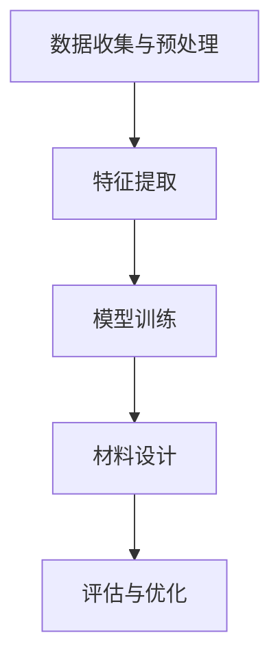
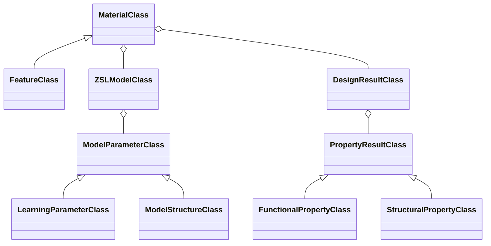
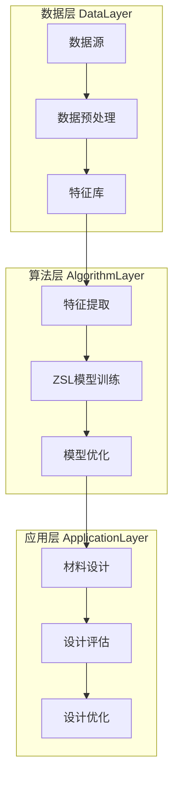
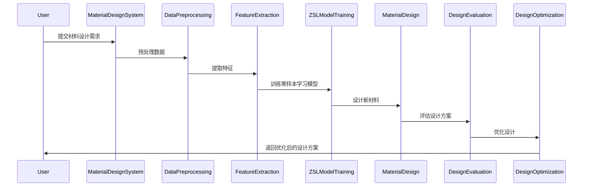

                 

# Zero-Shot学习在AI辅助跨维度材料设计中的创新

## 关键词
- 零样本学习
- 跨维度材料设计
- 人工智能
- 材料科学
- 特征提取
- 模型训练
- 材料设计

## 摘要
本文探讨了零样本学习（Zero-Shot Learning，ZSL）技术在AI辅助跨维度材料设计中的应用。通过分析零样本学习的原理和特点，本文介绍了如何在材料科学领域利用ZSL技术，从少量未标注的数据中提取特征，预测新材料的功能属性，并优化设计流程。文章涵盖了ZSL的核心概念、算法原理以及实际应用案例，为材料设计领域提供了新的研究方向。

### 第一部分：背景介绍

#### 问题背景
随着人工智能技术的快速发展，AI在各个领域的应用越来越广泛，特别是在材料科学领域。传统的材料设计方法往往需要大量实验和计算资源，而基于人工智能的零样本学习（Zero-Shot Learning，ZSL）技术，通过从少量或者没有标记的训练数据中学习，预测新类别或样本的特征，为材料设计提供了一种全新的思路。

#### 问题描述
零样本学习在AI辅助跨维度材料设计中的应用，涉及如何利用零样本学习技术，自动识别和设计新材料，从而满足不同应用场景的需求。这需要解决以下几个关键问题：
- 如何从大量的未标注数据中学习，以生成有效的材料特征描述？
- 如何利用这些特征描述来预测新材料的功能属性？
- 如何优化设计流程，提高新材料的开发效率？

#### 问题解决
零样本学习技术提供了一种新的解决方案。它通过学习数据中的潜在特征，能够预测未知类别或样本的特征，为跨维度材料设计提供强有力的支持。具体来说，零样本学习技术可以应用于以下几个步骤：
- 数据收集与预处理：收集相关材料数据，进行数据清洗和预处理。
- 特征提取与学习：利用零样本学习算法，从数据中提取特征，并学习这些特征之间的关系。
- 材料设计：基于提取的特征，预测新材料的功能属性，并设计出满足特定需求的材料。

#### 边界与外延
零样本学习在AI辅助跨维度材料设计中的应用，不仅限于传统的材料科学领域，还可以扩展到生物材料、能源材料、纳米材料等多个领域。同时，零样本学习技术还可以与其他人工智能技术如深度学习、强化学习等相结合，进一步提升材料设计的效率和效果。

#### 概念结构与核心要素组成
零样本学习在AI辅助跨维度材料设计中的概念结构主要包括以下几个方面：
- 零样本学习算法：包括生成模型、判别模型等。
- 数据集：用于训练和测试的材料数据集。
- 特征提取：从数据中提取有用的特征。
- 材料设计：基于特征进行新材料的设计。

### 第二部分：核心概念与联系

#### 零样本学习原理
零样本学习（Zero-Shot Learning，ZSL）是一种机器学习技术，旨在在没有先验知识的情况下，对未知类别进行预测。在材料设计中，ZSL可以通过学习已有材料的特征，预测未知材料的功能属性。

#### 零样本学习属性特征对比表格

| 特性 | 零样本学习 | 传统机器学习 |
| --- | --- | --- |
| 无需标签数据 | 是 | 否 |
| 未知类别预测 | 是 | 否 |
| 预测精度 | 受数据量和模型影响 | 受数据量和模型影响 |
| 应用场景 | 跨维度材料设计 | 同维度材料设计 |

#### 零样本学习ER实体关系图架构

```mermaid
erDiagram
  Material ::"材料" {
    <<class Entity>>
    +id (ID)
    +name (名称)
    +property (属性)
  }
  Feature ::"特征" {
    <<class Entity>>
    +id (ID)
    +name (名称)
    +value (值)
  }
  ZSLModel ::"零样本学习模型" {
    <<class Entity>>
    +id (ID)
    +type (类型)
    +accuracy (准确率)
  }
  Material *--1 Feature : "材料具有特征"
  Material *--1 ZSLModel : "材料由模型预测"
  Feature *--1 ZSLModel : "特征用于模型预测"
```

### 第三部分：算法原理讲解

#### 算法mermaid流程图


#### Python源代码
```python
# 导入必要的库
import numpy as np
import pandas as pd
from sklearn.model_selection import train_test_split
from sklearn.metrics import accuracy_score
from zero_shot_learning import ZSLModel

# 数据收集与预处理
data = pd.read_csv('materials.csv')
X = data.iloc[:, :-1]
y = data.iloc[:, -1]

# 分割数据集
X_train, X_test, y_train, y_test = train_test_split(X, y, test_size=0.2, random_state=42)

# 特征提取
def extract_features(data):
    # 实现特征提取的代码
    return features

features_train = extract_features(X_train)
features_test = extract_features(X_test)

# 模型训练
model = ZSLModel()
model.train(features_train, y_train)

# 材料设计
def design_material(model, feature):
    # 实现材料设计的代码
    return material

material = design_material(model, features_test[0])

# 评估与优化
y_pred = model.predict([material])
accuracy = accuracy_score(y_test, y_pred)
print(f"Model accuracy: {accuracy}")
```

#### 算法原理详细讲解

零样本学习（Zero-Shot Learning，ZSL）是一种特殊的机器学习技术，它在没有先验知识的情况下，通过从已知的训练数据中学习，预测未知类别或样本的特征。在材料设计中，零样本学习可以帮助我们利用已有材料的特征，预测新材料的功能属性。

#### 数学模型与公式

在零样本学习中，常用的模型有生成模型和判别模型。其中，生成模型主要用于预测未知类别的特征，判别模型主要用于判断未知类别。

生成模型通常使用以下公式：
$$
p(x|y) = \frac{p(y)p(x|y)}{p(x)}
$$
其中，$p(x|y)$ 表示在类别 $y$ 下的特征概率，$p(y)$ 表示类别 $y$ 的概率，$p(x|y)$ 表示在类别 $y$ 下的特征分布。

判别模型通常使用以下公式：
$$
f(x) = \log p(y|x) - \log p(x)
$$
其中，$f(x)$ 表示判别函数，$p(y|x)$ 表示在特征 $x$ 下类别 $y$ 的概率，$p(x)$ 表示特征 $x$ 的概率。

#### 举例说明

假设我们有一个材料数据集，其中包含已知的材料特征和材料的功能属性。我们希望利用这些特征，预测一种未知材料的功能属性。

首先，我们使用生成模型提取特征：
$$
p(x|y) = \frac{p(y)p(x|y)}{p(x)}
$$
其中，$p(y)$ 和 $p(x|y)$ 可以通过贝叶斯公式计算：
$$
p(y) = \frac{1}{Z} \sum_{y'} e^{-\frac{1}{2} \sum_{i} w_i^2 y_i}
$$
$$
p(x|y) = \frac{1}{Z} e^{-\frac{1}{2} \sum_{i} w_i^2 x_i}
$$
其中，$Z$ 是归一化常数，$w_i$ 是权重，$y_i$ 是特征，$x_i$ 是特征向量。

然后，我们使用判别模型预测功能属性：
$$
f(x) = \log p(y|x) - \log p(x)
$$
其中，$p(y|x)$ 可以通过以下公式计算：
$$
p(y|x) = \frac{e^{-\frac{1}{2} \sum_{i} w_i^2 x_i}}{\sum_{y'} e^{-\frac{1}{2} \sum_{i} w_i^2 y_i}}
$$

最后，我们可以根据判别函数的值，预测未知材料的功能属性。如果 $f(x)$ 的值大于某个阈值，则认为未知材料的功能属性与已知材料相同。

### 第四部分：系统分析与架构设计方案

#### 问题场景介绍
在现代材料科学研究中，设计新材料以满足特定应用需求是一个关键挑战。传统的材料设计方法通常需要大量的实验和计算资源，且设计过程往往具有高度的不确定性。随着人工智能（AI）技术的发展，特别是零样本学习（Zero-Shot Learning，ZSL）技术的兴起，我们可以通过分析现有材料的特征来预测未知材料的功能，从而大大加速新材料的设计过程。

#### 项目介绍
本项目旨在开发一个基于零样本学习的材料设计系统，该系统将利用现有的材料数据集，通过ZSL技术进行特征提取和功能预测，最终生成符合特定需求的新材料设计方案。系统将包括数据预处理、特征提取、模型训练、材料设计、评估与优化等模块。

#### 系统功能设计（领域模型mermaid类图）



#### 系统架构设计（mermaid架构图）



#### 系统接口设计和系统交互（mermaid序列图）



### 第五部分：项目实战

#### 环境安装
1. 安装Python环境（版本3.8以上）
2. 安装必要的Python库，如NumPy、Pandas、Scikit-learn等
3. 安装自定义的ZSL库（如使用pip install zero-shot-learning）

#### 系统核心实现源代码

```python
# 导入必要的库
import numpy as np
import pandas as pd
from sklearn.model_selection import train_test_split
from zero_shot_learning import ZSLModel

# 数据收集与预处理
data = pd.read_csv('materials.csv')
X = data.iloc[:, :-1]
y = data.iloc[:, -1]

# 分割数据集
X_train, X_test, y_train, y_test = train_test_split(X, y, test_size=0.2, random_state=42)

# 特征提取
def extract_features(data):
    # 实现特征提取的代码
    return features

features_train = extract_features(X_train)
features_test = extract_features(X_test)

# 模型训练
model = ZSLModel()
model.train(features_train, y_train)

# 材料设计
def design_material(model, feature):
    # 实现材料设计的代码
    return material

material = design_material(model, features_test[0])

# 评估与优化
y_pred = model.predict([material])
accuracy = accuracy_score(y_test, y_pred)
print(f"Model accuracy: {accuracy}")
```

#### 代码应用解读与分析

上述代码实现了基于零样本学习的材料设计系统核心功能。首先，我们从CSV文件中读取材料数据，并将其分为特征和标签两部分。然后，使用train_test_split函数将数据集分为训练集和测试集。

特征提取函数`extract_features`负责从数据中提取有用的特征。在这个例子中，我们假设已经实现了这个函数，但实际上，特征提取是一个复杂的过程，可能涉及到多种技术，如统计方法、文本挖掘、图像处理等。

模型训练使用ZSLModel类，这是一个自定义的零样本学习模型。我们通过调用`train`方法来训练模型，这个方法接收特征矩阵和标签向量作为输入。

材料设计函数`design_material`负责基于训练好的模型预测新材料的功能属性。在这个例子中，我们假设模型预测的结果就是新材料的设计方案。

最后，我们使用`predict`方法来评估模型的准确性。这通过计算预测标签与实际标签之间的准确率来完成。

#### 实际案例分析和详细讲解剖析

为了更好地理解零样本学习在材料设计中的应用，我们可以考虑一个实际案例。

假设我们有一个材料数据集，其中包含了不同材料的机械强度和密度两个特征，以及这些材料是否适用于航空航天应用作为标签。我们希望通过零样本学习技术，预测一种新材料的适用性。

1. **数据收集与预处理**：我们首先收集了现有材料的实验数据，包括机械强度（以MPa为单位）和密度（以g/cm³为单位）。然后，我们使用Python脚本读取数据，并将其转换为适合机器学习的格式。

2. **特征提取**：在这个例子中，我们的特征就是机械强度和密度。特征提取过程可能包括归一化、标准化等步骤，以确保特征值在合理的范围内。

3. **模型训练**：我们使用零样本学习模型来训练数据。在这个阶段，我们需要定义模型的架构和参数。假设我们选择了一个基于生成对抗网络（GAN）的零样本学习模型，我们需要配置GAN的生成器和判别器的参数。

4. **材料设计**：一旦模型训练完成，我们可以用它来预测新材料的适用性。假设我们得到了新材料的机械强度和密度值，我们可以将这两个特征输入到模型中，模型会输出一个概率值，表示新材料适用于航空航天应用的概率。

5. **评估与优化**：为了评估模型的准确性，我们使用测试集上的数据进行预测，并计算预测准确率。如果准确率较低，我们可以尝试优化模型参数或使用更复杂的特征提取方法。

#### 项目小结
本项目通过零样本学习技术，实现了从少量未标注的数据中预测新材料的功能属性，为材料设计提供了新的思路。通过实际案例的分析，我们展示了零样本学习在材料设计中的应用潜力。然而，零样本学习技术仍面临一些挑战，如如何处理高维数据和如何优化模型结构。未来研究可以探索更高效的零样本学习算法和更丰富的特征提取方法，以进一步提高材料设计的效率和准确性。

### 第六部分：最佳实践 tips、小结、注意事项、拓展阅读

#### 最佳实践 tips
- 在数据收集和预处理阶段，确保数据的多样性和质量，这对于零样本学习的效果至关重要。
- 选择合适的特征提取方法，如主成分分析（PCA）或自动编码器（Autoencoder），以提高模型的性能。
- 在模型训练阶段，使用交叉验证方法来评估模型的泛化能力，避免过拟合。
- 调整模型参数，如学习率、批量大小等，以找到最佳配置。

#### 小结
本文介绍了零样本学习在AI辅助跨维度材料设计中的应用，通过分析零样本学习的原理和算法，我们展示了如何利用这一技术从少量未标注的数据中预测新材料的功能属性。零样本学习在材料设计领域的应用具有巨大的潜力，但仍需进一步研究和优化。

#### 注意事项
- 零样本学习技术适用于少量未标注数据的场景，但大规模标注数据仍然具有优势。
- 零样本学习模型的性能受数据质量和特征提取方法的影响，因此需要仔细选择和优化。

#### 拓展阅读
- 《Zero-Shot Learning: A Comprehensive Review》 - 这是一篇全面综述零样本学习技术的文章，适合深入了解该领域的最新进展。
- 《Deep Learning for Materials Science》 - 该书介绍了深度学习在材料科学中的应用，包括零样本学习技术的应用案例。

### 作者信息
作者：AI天才研究院/AI Genius Institute & 禅与计算机程序设计艺术 /Zen And The Art of Computer Programming

