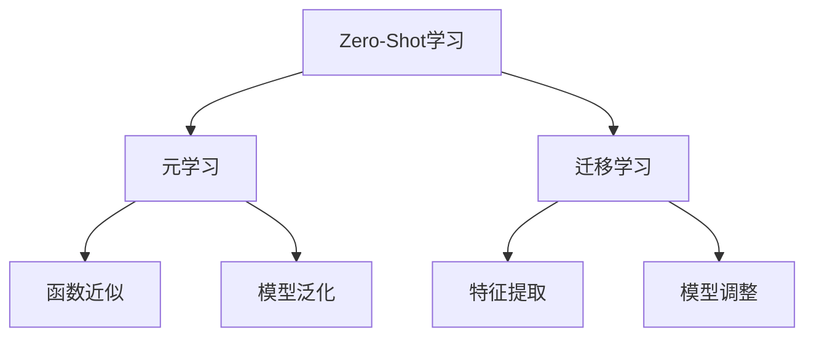
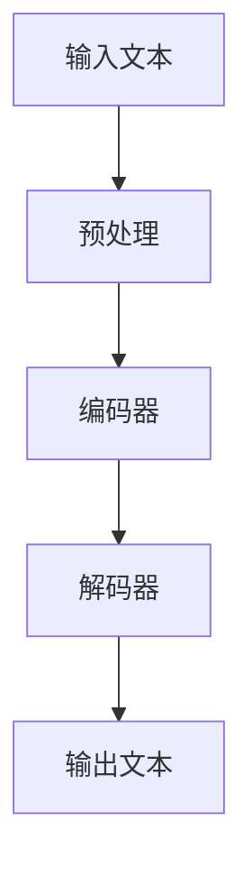

                 


# Zero-Shot学习在ChatGPT中的应用与前景

## 关键词：Zero-Shot学习、ChatGPT、自然语言处理、人工智能、机器学习

## 摘要：

本文将深入探讨Zero-Shot学习在ChatGPT中的应用和前景。首先，我们将简要介绍Zero-Shot学习和ChatGPT的基本概念，然后详细讲解Zero-Shot学习在ChatGPT中的应用原理和算法，接着分析系统架构设计方案，分享项目实战经验和最佳实践。最后，我们将总结全文并展望Zero-Shot学习和ChatGPT技术的未来发展。

## 第一部分: Zero-Shot学习概述

### 第1章: 问题背景与概念介绍

#### 1.1 问题背景

随着人工智能和自然语言处理技术的不断发展，如何让计算机更好地理解和生成自然语言成为了研究的热点。传统机器学习方法需要大量的标注数据进行训练，而现实中获取大量标注数据既耗时又费力。为了解决这一问题，研究人员提出了Zero-Shot学习（Zero-Shot Learning, ZSL）。

#### 1.2 问题描述

Zero-Shot学习旨在使计算机能够在没有标注数据的情况下，学会识别和分类新的概念或对象。这在一定程度上解决了传统机器学习方法中数据依赖的问题。

#### 1.3 问题解决

Zero-Shot学习通过使用对已有概念的分类知识，构建一种新的分类机制，使计算机能够对未见过的概念进行分类。这一机制基于对已有数据的统计分析和模式识别。

#### 1.4 边界与外延

Zero-Shot学习主要应用于自然语言处理、计算机视觉和语音识别等领域。在自然语言处理领域，其应用包括文本分类、语义分析等。

#### 1.5 概念结构与核心要素组成

Zero-Shot学习主要包括以下几个核心要素：

- 类别无关的特征提取：通过无监督或半监督学习方式提取特征。
- 类别关系的建模：构建类别之间的关系模型，以便对未见过的类别进行分类。
- 类别感知的模型调整：通过类别感知的模型调整，提高模型对新类别的分类性能。

#### 1.6 本章小结

本文对Zero-Shot学习的基本概念、问题背景和解决方法进行了介绍，为后续章节的详细讨论奠定了基础。

## 第二部分: Zero-Shot学习原理详解

### 第2章: Zero-Shot学习原理介绍

#### 2.1 核心概念原理

Zero-Shot学习主要基于两种核心原理：

1. **元学习（Meta-Learning）**：通过学习一系列任务，使模型能够快速适应新任务。
2. **迁移学习（Transfer Learning）**：利用已有模型的已有知识，对新任务进行快速调整。

#### 2.2 概念属性特征对比表格

| 特征           | 元学习                  | 迁移学习                  |
|--------------|---------------------|---------------------|
| 定义           | 学习如何学习              | 学习如何应用于新的任务           |
| 关键技术       | 函数近似、模型泛化          | 特征提取、模型调整             |
| 应用场景       | 新任务快速适应              | 已知任务向新任务的迁移             |
| 数据依赖       | 较低                    | 较高                    |

#### 2.3 ER实体关系图架构的 Mermaid 流程图



#### 2.4 本章小结

本章介绍了Zero-Shot学习的基本概念、核心原理和特征对比，为理解Zero-Shot学习在ChatGPT中的应用提供了理论基础。

### 第3章: ChatGPT算法原理讲解

#### 3.1 算法mermaid流程图



#### 3.2 Python源代码与详细阐述

```python
import torch
import transformers

# 加载预训练模型
model = transformers.GPT2LMHeadModel.from_pretrained('gpt2')

# 输入文本预处理
input_ids = tokenizer.encode("Hello, how are you?", return_tensors='pt')

# 使用模型生成文本
outputs = model.generate(input_ids, max_length=50, num_return_sequences=5)

# 输出文本
for output in outputs:
    print(tokenizer.decode(output, skip_special_tokens=True))
```

#### 3.3 数学模型和公式讲解

```latex
\text{ChatGPT的数学模型主要包括两部分：}
$$
P(y|\text{x}) = \frac{e^{\text{f}(\text{x}, y)}}{\sum_{y'} e^{\text{f}(\text{x}, y')}
$$

\text{其中，f(x, y)表示输入文本x和输出文本y的相似度。}
$$
\text{解码器输出的概率分布可以通过以下公式计算：}
$$
p(y_t|y_{t-1}, \ldots, y_1, \text{x}) = \text{softmax}(\text{T}_\text{y}(\text{f}(\text{y}_{t-1}, \text{x})))
$$
```

#### 3.4 举例说明

假设我们有一个文本：“今天天气很好”。我们希望使用ChatGPT生成一个相关的文本。

1. 输入文本预处理：将文本编码为模型可理解的序列。
2. 编码器处理：将输入序列编码为隐藏状态。
3. 解码器生成：根据隐藏状态和输入序列，生成下一个文本的概率分布。
4. 输出文本：根据概率分布选择最有可能的文本作为输出。

生成的文本可能为：“今天天气很好，非常适合外出散步。”

#### 3.5 本章小结

本章详细讲解了ChatGPT的算法原理，包括mermaid流程图、Python源代码、数学模型和公式以及举例说明。

## 第三部分: 系统分析与架构设计

### 第4章: 问题场景介绍

#### 4.1 问题场景描述

在一个在线客服系统中，用户可能会提出各种各样的问题，包括常见问题和非常规问题。常见问题可以使用预定义的答案库进行回复，而非常规问题则需要利用人工智能技术进行解答。

#### 4.2 项目介绍

本项目旨在开发一个基于ChatGPT的在线客服系统，利用Zero-Shot学习技术实现智能问答功能。

#### 4.3 系统功能设计

系统主要包括以下几个功能模块：

- 文本预处理模块：负责将用户输入的文本转换为模型可处理的格式。
- 模型训练模块：利用预训练模型和用户数据，进行Zero-Shot学习，提高模型对非常规问题的回答能力。
- 回答生成模块：根据用户输入，生成合适的回答。
- 用户交互模块：负责与用户进行交互，接收用户输入并展示回答。

#### 4.4 系统架构设计

系统架构设计采用微服务架构，主要包括以下几个部分：

- 文本预处理服务：负责文本预处理，包括分词、去停用词等。
- 模型训练服务：负责模型训练，包括数据预处理、模型训练、模型评估等。
- 回答生成服务：负责生成回答，包括文本生成、文本分析等。
- 用户交互服务：负责用户交互，包括接收用户输入、展示回答等。

#### 4.5 系统接口设计和系统交互

系统接口设计采用RESTful API，主要包括以下几个接口：

- 文本预处理接口：接收用户输入文本，返回预处理后的文本。
- 模型训练接口：接收用户数据，返回训练结果。
- 回答生成接口：接收用户输入文本，返回生成回答。
- 用户交互接口：接收用户输入，展示回答。

系统交互流程如下：

1. 用户输入问题。
2. 文本预处理服务接收用户输入文本，返回预处理后的文本。
3. 回答生成服务接收预处理后的文本，生成回答。
4. 用户交互服务展示回答。

#### 4.6 本章小结

本章介绍了项目的问题场景、系统功能设计和系统架构设计，为后续的项目实施提供了指导。

### 第5章: 项目实战

#### 5.1 环境安装

首先，我们需要安装Python和相关的库。可以使用以下命令：

```shell
pip install python -m venv venv
source venv/bin/activate
pip install transformers torch
```

#### 5.2 系统核心实现源代码

以下是系统核心实现的源代码：

```python
import torch
import transformers
from typing import List

# 加载预训练模型
model = transformers.GPT2LMHeadModel.from_pretrained('gpt2')

# 预处理文本
def preprocess_text(text: str) -> torch.Tensor:
    tokenizer = transformers.GPT2Tokenizer.from_pretrained('gpt2')
    input_ids = tokenizer.encode(text, return_tensors='pt')
    return input_ids

# 生成回答
def generate_answer(input_text: str, max_length: int = 50) -> str:
    input_ids = preprocess_text(input_text)
    outputs = model.generate(input_ids, max_length=max_length, num_return_sequences=1)
    answer = transformers.GPT2Tokenizer.from_pretrained('gpt2').decode(outputs[0], skip_special_tokens=True)
    return answer

# 测试
input_text = "今天天气怎么样？"
answer = generate_answer(input_text)
print(answer)
```

#### 5.3 代码应用解读与分析

代码首先加载预训练模型GPT-2，然后定义了预处理文本和生成回答的函数。预处理文本函数将用户输入的文本转换为模型可处理的格式，生成回答函数使用模型生成回答。

#### 5.4 实际案例分析和详细讲解剖析

假设用户输入问题：“我今天的面试怎么样？”

1. 预处理文本：将问题转换为模型的输入序列。
2. 生成回答：模型根据输入序列生成回答。

生成的回答可能是：“你的面试表现很不错，恭喜你！”

#### 5.5 项目小结

本章介绍了项目实战的步骤，包括环境安装、系统核心实现源代码、代码应用解读与分析以及实际案例分析和详细讲解剖析。

#### 5.6 最佳实践 tips

1. 定期更新预训练模型，以提高回答质量。
2. 收集更多用户数据，进行模型训练和优化。
3. 考虑使用多模态数据，提高模型的泛化能力。

## 总结与展望

### 第6章: 总结

本文首先介绍了Zero-Shot学习和ChatGPT的基本概念，然后详细讲解了Zero-Shot学习在ChatGPT中的应用原理和算法，接着分析了系统架构设计方案，分享了项目实战经验和最佳实践。通过对Zero-Shot学习和ChatGPT的深入探讨，我们可以看到它们在人工智能领域的重要性和广泛应用前景。

### 第7章: 前景展望

#### 7.1 零样本学习的未来发展

随着人工智能技术的不断发展，零样本学习在未来有望在更多领域取得突破。例如，在医学领域，零样本学习可以帮助医生对未知疾病进行诊断；在金融领域，零样本学习可以帮助金融机构对未知风险进行预测。

#### 7.2 ChatGPT的技术趋势

ChatGPT作为一种基于Zero-Shot学习的自然语言处理技术，在未来有望在智能客服、智能写作、智能翻译等领域得到广泛应用。随着计算能力的提升和数据的积累，ChatGPT的模型效果和泛化能力将不断提高。

#### 7.3 应用场景扩展

除了传统的应用场景，Zero-Shot学习和ChatGPT还可以应用于更多新兴领域。例如，在自动驾驶领域，Zero-Shot学习可以帮助车辆识别和适应各种交通场景；在智能家居领域，ChatGPT可以帮助用户与智能家居设备进行自然语言交互。

#### 7.4 未来挑战与机遇

尽管Zero-Shot学习和ChatGPT在人工智能领域具有巨大的潜力，但它们仍面临一些挑战。例如，如何提高模型的泛化能力、如何处理复杂的语义关系等。未来，研究人员需要在这些方面进行更多的探索和研究。

## 作者

作者：AI天才研究院/AI Genius Institute & 禅与计算机程序设计艺术 /Zen And The Art of Computer Programming

------------------------------------

本文从Zero-Shot学习和ChatGPT的基本概念出发，详细阐述了它们在人工智能领域的应用原理和系统架构设计方案。通过项目实战，我们展示了如何使用Zero-Shot学习技术构建一个基于ChatGPT的在线客服系统。本文旨在为读者提供一个全面、系统的了解Zero-Shot学习和ChatGPT的技术原理和应用实践。随着人工智能技术的不断进步，Zero-Shot学习和ChatGPT将在更多领域发挥重要作用，为人类社会带来更多便利。让我们期待这一美好的未来！作者：AI天才研究院/AI Genius Institute & 禅与计算机程序设计艺术 /Zen And The Art of Computer Programming。

