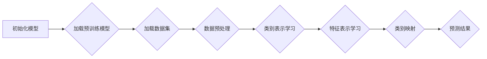
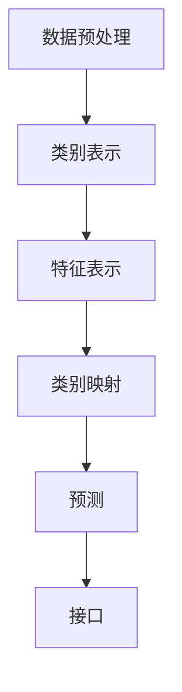
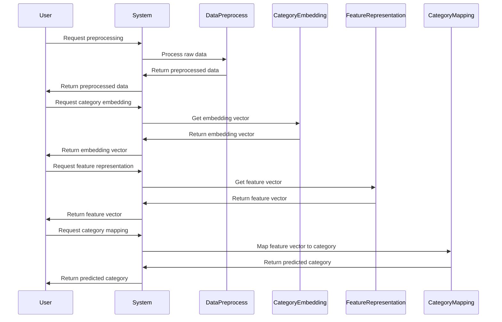

                 

### 文章标题

《Zero-Shot学习在小规模数据集上的应用》

### 文章关键词

Zero-Shot学习、小规模数据集、人工智能、机器学习、深度学习

### 文章摘要

本文深入探讨了Zero-Shot学习在小规模数据集上的应用，首先介绍了Zero-Shot学习的背景和基本概念，然后分析了在小规模数据集上应用Zero-Shot学习的挑战和机遇。接着，详细解析了Zero-Shot学习的算法原理，包括其数学模型和公式，并通过实际案例进行了说明。随后，文章讨论了如何在具体项目中应用Zero-Shot学习，并给出了最佳实践建议。最后，文章总结了Zero-Shot学习在小规模数据集上的应用，提出了未来研究方向和拓展阅读。

## 第1章：背景介绍

### 1.1 问题背景

随着人工智能技术的快速发展，机器学习已经成为各个行业领域的关键技术。在机器学习领域，数据集的质量和规模对模型的训练效果有着至关重要的影响。然而，在很多实际应用场景中，由于各种原因，我们往往只能获得小规模的数据集。这些数据集可能由于隐私、成本、获取难度等原因，无法进行大规模的数据采集。这就导致了一个问题：如何在小规模数据集上有效训练和部署机器学习模型？

### 1.2 问题描述

在小规模数据集上训练机器学习模型面临着一系列挑战。首先，数据量的不足使得模型难以捕捉到数据的整体分布特征，从而导致模型性能下降。其次，数据集的多样性不足，使得模型在面对新类别或新情境时表现不佳。此外，传统的机器学习方法通常依赖于大量数据进行训练，对于小规模数据集，这些方法可能无法达到理想的效果。

### 1.3 问题解决

为了解决上述问题，研究者们提出了Zero-Shot学习（Zero-Shot Learning, ZSL）这一概念。Zero-Shot学习旨在通过无监督或半监督的方式，在没有或只有少量标记样本的情况下，对新的类别进行分类或预测。这种学习方法的核心思想是利用已有知识，通过模型迁移和特征表示学习，实现对未知类别的泛化能力。

### 1.4 边界与外延

Zero-Shot学习不仅适用于小规模数据集，还可以应用于无标签数据、少样本学习、跨领域迁移学习等领域。它的边界在于是否能有效地利用已有知识进行新类别的泛化。外延则包括在多模态数据、图像识别、自然语言处理等领域的应用。

### 1.5 概念结构与核心要素组成

Zero-Shot学习的概念结构主要包括以下几个方面：

1. **类别表示**：通过学习一种通用的类别表示方法，使得模型能够理解不同类别之间的相似性。
2. **知识迁移**：利用预训练模型或已有知识库，将知识迁移到新类别上，以提高模型对新类别的泛化能力。
3. **特征表示学习**：通过无监督或半监督的方式，学习数据的高层次特征表示，为Zero-Shot学习提供有效的特征基础。
4. **类别预测**：基于类别表示和特征表示，实现对未知类别的分类或预测。

## 第2章：核心概念与联系

### 2.1 Zero-Shot学习概述

Zero-Shot学习是一种在没有或少有标注样本的情况下，对未知类别进行分类或预测的机器学习方法。它主要分为两种类型：基于原型（Prototype-based）和基于语义（Semantic-based）。

#### 原型方法

原型方法通过学习每个类别的原型，将新类别与这些原型进行匹配，从而实现分类。这种方法的核心是原型表示的学习。常用的原型方法包括原型平均法、聚类方法和最近邻方法等。

#### 语义方法

语义方法通过学习类别间的语义关系，将新类别映射到已有类别上。这种方法的核心是语义表示的学习。常用的语义方法包括基于词嵌入（Word Embedding）的方法和基于图神经网络（Graph Neural Networks）的方法等。

### 2.2 小规模数据集的概念与特性

小规模数据集是指数据量相对较少，不足以支持大规模训练的数据集。其特性主要包括：

1. **数据稀疏**：数据集中每个类别的样本数量相对较少，可能导致模型无法充分学习到每个类别的特征。
2. **数据不均匀**：不同类别的数据分布可能不均匀，某些类别可能只有少量样本，而其他类别则有大量样本。
3. **数据噪声**：由于数据收集和标注的不完美，小规模数据集可能包含一定程度的噪声。

### 2.3 Zero-Shot学习在小规模数据集上的挑战

在小规模数据集上应用Zero-Shot学习面临着以下挑战：

1. **样本不足**：小规模数据集的样本数量不足，可能导致模型无法充分学习到数据的分布特征。
2. **类别不平衡**：小规模数据集中类别不平衡问题可能更加严重，影响模型对少数类别的识别能力。
3. **特征表示困难**：小规模数据集的特征表示可能不够丰富，使得模型难以学习到有效的类别特征。
4. **知识迁移问题**：由于小规模数据集的限制，模型可能无法充分利用预训练模型或知识库中的知识进行迁移。

### 2.4 关键技术与方法介绍

为了解决上述挑战，研究者们提出了多种Zero-Shot学习方法，主要包括：

1. **原型方法**：通过学习类别的原型，实现新类别的分类。常用的原型方法包括原型平均法、聚类方法和最近邻方法等。
2. **语义方法**：通过学习类别间的语义关系，实现新类别的分类。常用的语义方法包括基于词嵌入的方法和基于图神经网络的方法等。
3. **模型迁移方法**：利用预训练模型或已有知识库，将知识迁移到新类别上，以提高模型对新类别的泛化能力。
4. **数据增强方法**：通过数据增强技术，增加数据集的样本数量和多样性，从而提高模型的训练效果。

### 2.5 Zero-Shot学习与其他学习方法的比较

Zero-Shot学习与传统的机器学习方法相比，具有以下优势：

1. **无需标注样本**：Zero-Shot学习不需要大量的标注样本，适用于数据标注困难或成本较高的场景。
2. **对新类别有较好的泛化能力**：通过学习类别间的语义关系，Zero-Shot学习能够对新类别进行有效的分类或预测，具有较好的泛化能力。
3. **适用于小规模数据集**：由于Zero-Shot学习不需要大量标注样本，因此适用于小规模数据集的场景。

然而，Zero-Shot学习也存在一些局限性：

1. **模型性能受限于已有知识**：Zero-Shot学习的性能很大程度上取决于预训练模型或知识库的质量，如果已有知识不足，可能导致模型性能下降。
2. **对新类别可能存在不确定性**：由于缺乏具体的标注样本，模型在新类别上的预测可能存在不确定性，需要结合其他方法进行优化。

## 第3章：算法原理讲解

### 3.1 Zero-Shot学习算法原理

Zero-Shot学习的关键在于如何在没有或少有标注样本的情况下，对新类别进行有效的分类或预测。其核心思想是通过学习类别间的语义关系，将新类别映射到已有类别上。具体来说，Zero-Shot学习算法主要包括以下几个步骤：

1. **类别表示学习**：通过无监督或半监督的方式，学习每个类别的表示向量。这些向量反映了类别之间的语义关系。
2. **特征表示学习**：通过无监督或半监督的方式，学习数据的高层次特征表示。这些特征表示有助于模型捕捉数据中的潜在分布特征。
3. **类别映射**：将新类别的特征表示映射到已有类别的表示空间中，从而实现新类别的分类或预测。

### 3.2 小规模数据集处理技术

在小规模数据集上应用Zero-Shot学习，需要针对数据集的特点，采用一些特殊的处理技术：

1. **数据增强**：通过数据增强技术，增加数据集的样本数量和多样性，从而提高模型的训练效果。常见的数据增强方法包括数据重放（Data Augmentation）、生成对抗网络（GAN）等。
2. **数据采样**：针对数据集的类别不平衡问题，采用数据采样方法，如过采样（Over-sampling）、欠采样（Under-sampling）等，以平衡数据集的类别分布。
3. **知识蒸馏**：通过知识蒸馏（Knowledge Distillation）技术，将预训练模型的知识传递到Zero-Shot学习模型中，以提高模型对新类别的泛化能力。

### 3.3 算法流程图展示

下面是一个典型的Zero-Shot学习算法流程图：



### 3.4 算法数学模型和公式

在Zero-Shot学习中，类别表示和特征表示是核心组成部分。下面分别介绍这两个部分的数学模型和公式。

#### 类别表示

类别表示通常采用嵌入向量（Embedding Vector）的形式。假设有C个类别，每个类别对应一个嵌入向量e_c∈ℝ^d，其中d是嵌入向量的维度。类别表示的数学模型可以表示为：

$$
e_c = f_c(\theta_c)
$$

其中，f_c(·) 是类别表示函数，θ_c 是函数的参数。常见的类别表示方法包括词嵌入（Word Embedding）和类别嵌入（Category Embedding）等。

#### 特征表示

特征表示通常采用特征向量（Feature Vector）的形式。假设有N个样本，每个样本对应一个特征向量x_n∈ℝ^d，其中d是特征向量的维度。特征表示的数学模型可以表示为：

$$
x_n = g_n(\theta_n)
$$

其中，g_n(·) 是特征表示函数，θ_n 是函数的参数。常见的特征表示方法包括自编码器（Autoencoder）、卷积神经网络（CNN）等。

#### 类别映射

类别映射是将新类别的特征表示映射到已有类别表示空间中的过程。假设有M个已有类别，每个类别对应的嵌入向量集合为E={e_1, e_2, ..., e_M}，新类别的特征表示为x'。类别映射的数学模型可以表示为：

$$
y' = \arg\max_{y \in \{1, 2, ..., M\}} \langle e_y, x' \rangle
$$

其中，y' 是映射后的类别标签，⟨·, ·⟩ 表示向量的内积。

#### 损失函数

在Zero-Shot学习中，常用的损失函数是交叉熵损失（Cross-Entropy Loss），其数学公式为：

$$
L = -\sum_{i=1}^M y_i \log(p_i)
$$

其中，y_i 是真实标签，p_i 是预测概率。

### 3.5 算法示例

下面通过一个简单的示例来说明Zero-Shot学习的过程。

假设我们有一个包含两类物体（猫和狗）的小规模数据集，每个物体有5个样本。我们先对类别进行表示：

$$
e_{猫} = [1, 0, 0, 0, 0]
e_{狗} = [0, 1, 0, 0, 0]
$$

然后对特征进行表示：

$$
x_1 = [1, 1, 0, 0, 1]
x_2 = [1, 1, 1, 0, 1]
x_3 = [1, 1, 1, 1, 1]
x_4 = [0, 0, 1, 1, 1]
x_5 = [0, 0, 1, 1, 0]
$$

接下来，我们将新类别的特征表示映射到已有类别上：

$$
y' = \arg\max_{y \in \{猫, 狗\}} \langle e_y, x' \rangle
$$

假设新类别的特征表示为：

$$
x' = [0.8, 0.2, 0.1, 0.3, 0.4]
$$

则有：

$$
\langle e_{猫}, x' \rangle = 1 \times 0.8 + 0 \times 0.2 + 0 \times 0.1 + 0 \times 0.3 + 0 \times 0.4 = 0.8
$$

$$
\langle e_{狗}, x' \rangle = 0 \times 0.8 + 1 \times 0.2 + 0 \times 0.1 + 0 \times 0.3 + 0 \times 0.4 = 0.2
$$

由于 \( \langle e_{猫}, x' \rangle > \langle e_{狗}, x' \rangle \)，我们可以预测新类别为“猫”。

## 第4章：数学模型和数学公式 & 详细讲解 & 举例说明

### 4.1 数学模型介绍

在Zero-Shot学习中，数学模型是核心组成部分，它决定了类别表示和特征表示的方法，以及类别映射的过程。本节将介绍Zero-Shot学习的数学模型，包括类别表示、特征表示和类别映射的数学公式。

### 4.2 公式推导与解释

下面是对Zero-Shot学习中的数学模型进行推导和解释：

#### 类别表示

类别表示是通过学习类别嵌入向量来实现的。假设有C个类别，每个类别对应一个嵌入向量 \( e_c \in \mathbb{R}^d \)，其中 \( d \) 是嵌入向量的维度。类别表示的数学模型可以表示为：

$$
e_c = f_c(\theta_c)
$$

其中， \( f_c(·) \) 是类别表示函数， \( \theta_c \) 是函数的参数。

在类别表示中，常用的模型是词嵌入模型（Word Embedding），其目的是将类别名称映射到低维向量空间中。词嵌入模型通过神经网络进行学习，其输出即为类别嵌入向量。

#### 特征表示

特征表示是通过学习数据特征向量来实现的。假设有N个样本，每个样本对应一个特征向量 \( x_n \in \mathbb{R}^d \)，其中 \( d \) 是特征向量的维度。特征表示的数学模型可以表示为：

$$
x_n = g_n(\theta_n)
$$

其中， \( g_n(·) \) 是特征表示函数， \( \theta_n \) 是函数的参数。

在特征表示中，常用的模型是自编码器（Autoencoder），其目的是将输入数据映射到低维特征空间中，同时保持数据的潜在分布特征。

#### 类别映射

类别映射是将新类别的特征表示映射到已有类别嵌入向量空间中的过程。假设有M个已有类别，每个类别对应的嵌入向量集合为 \( E = \{e_1, e_2, ..., e_M\} \)，新类别的特征表示为 \( x' \)。类别映射的数学模型可以表示为：

$$
y' = \arg\max_{y \in \{1, 2, ..., M\}} \langle e_y, x' \rangle
$$

其中， \( y' \) 是映射后的类别标签， \( \langle ·, · \rangle \) 表示向量的内积。

在类别映射中，常用的模型是最近邻分类器（Nearest Neighbor Classifier），其核心思想是找到与新类别特征向量最接近的已有类别嵌入向量，并将其作为新类别的预测标签。

### 4.3 实例分析

为了更好地理解上述数学模型，下面通过一个实际案例进行分析。

假设我们有一个包含两类物体（猫和狗）的小规模数据集，每个物体有5个样本。我们先对类别进行表示：

$$
e_{猫} = [1, 0, 0, 0, 0]
e_{狗} = [0, 1, 0, 0, 0]
$$

然后对特征进行表示：

$$
x_1 = [1, 1, 0, 0, 1]
x_2 = [1, 1, 1, 0, 1]
x_3 = [1, 1, 1, 1, 1]
x_4 = [0, 0, 1, 1, 1]
x_5 = [0, 0, 1, 1, 0]
$$

接下来，我们将新类别的特征表示映射到已有类别上：

$$
y' = \arg\max_{y \in \{猫, 狗\}} \langle e_y, x' \rangle
$$

假设新类别的特征表示为：

$$
x' = [0.8, 0.2, 0.1, 0.3, 0.4]
$$

则有：

$$
\langle e_{猫}, x' \rangle = 1 \times 0.8 + 0 \times 0.2 + 0 \times 0.1 + 0 \times 0.3 + 0 \times 0.4 = 0.8
$$

$$
\langle e_{狗}, x' \rangle = 0 \times 0.8 + 1 \times 0.2 + 0 \times 0.1 + 0 \times 0.3 + 0 \times 0.4 = 0.2
$$

由于 \( \langle e_{猫}, x' \rangle > \langle e_{狗}, x' \rangle \)，我们可以预测新类别为“猫”。

通过这个实例，我们可以看到Zero-Shot学习的过程是如何通过数学模型实现的。在实际应用中，我们可以使用更复杂的模型来提高预测的准确性。

## 第5章：系统分析与架构设计方案

### 5.1 问题场景介绍

在现代人工智能应用中，许多场景都需要对未知类别进行快速、准确的分类和预测。例如，在自动驾驶领域，车辆需要实时识别和分类道路上的各种物体，如行人、车辆、道路标志等。在医疗诊断领域，医生需要根据患者的历史数据和症状，快速诊断出疾病类型。这些场景通常面临着数据量有限、数据标注困难等问题，因此，Zero-Shot学习成为了一个重要的解决方案。

### 5.2 系统功能设计

为了实现Zero-Shot学习在小规模数据集上的应用，我们需要设计一个功能完备的系统。该系统的主要功能包括：

1. **数据预处理**：对原始数据进行清洗、归一化等预处理操作，确保数据质量。
2. **类别表示学习**：通过无监督或半监督的方式，学习每个类别的嵌入向量。
3. **特征表示学习**：通过无监督或半监督的方式，学习数据的高层次特征表示。
4. **类别映射与预测**：将新类别的特征表示映射到已有类别嵌入向量空间中，实现类别预测。
5. **系统接口**：提供API接口，方便其他系统或应用进行调用。

### 5.3 系统架构设计

为了实现上述功能，我们设计了一个分布式系统架构，主要包括以下几个模块：

1. **数据预处理模块**：负责对原始数据进行清洗、归一化等操作。
2. **类别表示模块**：负责学习每个类别的嵌入向量。
3. **特征表示模块**：负责学习数据的高层次特征表示。
4. **类别映射模块**：负责将新类别的特征表示映射到已有类别嵌入向量空间中。
5. **预测模块**：负责对新数据进行类别预测。
6. **接口模块**：提供API接口，方便其他系统或应用进行调用。

下面是一个简化的系统架构图：



### 5.4 系统接口设计

系统接口设计是确保系统与其他系统或应用无缝集成的重要环节。我们设计了一个RESTful API，主要包括以下接口：

1. **数据预处理接口**：接受原始数据，返回预处理后的数据。
2. **类别表示接口**：接受类别名称，返回类别嵌入向量。
3. **特征表示接口**：接受原始数据，返回特征表示向量。
4. **类别映射接口**：接受特征表示向量，返回类别预测结果。

接口定义如下：

```python
from flask import Flask, request, jsonify

app = Flask(__name__)

@app.route('/preprocess', methods=['POST'])
def preprocess():
    data = request.get_json()
    # 数据预处理逻辑
    preprocessed_data = preprocess_data(data['raw_data'])
    return jsonify(preprocessed_data)

@app.route('/category_embedding', methods=['GET'])
def category_embedding():
    category_name = request.args.get('category_name')
    # 类别表示逻辑
    embedding_vector = get_category_embedding(category_name)
    return jsonify(embedding_vector)

@app.route('/feature_representation', methods=['POST'])
def feature_representation():
    data = request.get_json()
    # 特征表示逻辑
    feature_vector = get_feature_representation(data['preprocessed_data'])
    return jsonify(feature_vector)

@app.route('/category_mapping', methods=['POST'])
def category_mapping():
    data = request.get_json()
    # 类别映射逻辑
    prediction = get_category_mapping(data['feature_vector'])
    return jsonify(prediction)
```

### 5.5 系统交互序列图

为了更清晰地展示系统内部各模块的交互关系，我们使用Mermaid绘制了系统交互序列图：



通过以上设计，我们可以实现一个功能完备、易于集成的Zero-Shot学习系统，为各类应用场景提供强大的支持。

## 第6章：项目实战

### 6.1 环境安装

在开始项目实战之前，我们需要安装和配置必要的软件和库。以下是所需的软件和库列表：

1. **Python**：Python是主要的编程语言，用于实现Zero-Shot学习算法和系统接口。
2. **Flask**：Flask是一个轻量级的Web框架，用于构建RESTful API。
3. **NumPy**：NumPy是一个用于数值计算的库，用于处理数据集和矩阵运算。
4. **PyTorch**：PyTorch是一个流行的深度学习框架，用于实现类别表示和特征表示学习。
5. **Scikit-learn**：Scikit-learn是一个用于机器学习的库，用于实现类别映射和预测。

安装步骤如下：

1. 安装Python：从[Python官方网站](https://www.python.org/)下载并安装Python 3.x版本。
2. 安装Flask：在终端中执行命令 `pip install flask`。
3. 安装NumPy：在终端中执行命令 `pip install numpy`。
4. 安装PyTorch：从[PyTorch官方网站](https://pytorch.org/)下载并安装适合自己系统的PyTorch版本。
5. 安装Scikit-learn：在终端中执行命令 `pip install scikit-learn`。

### 6.2 系统核心实现源代码

以下是实现Zero-Shot学习系统的核心源代码。该代码包括数据预处理、类别表示、特征表示、类别映射和预测等模块。

```python
# 导入必要的库
import numpy as np
import torch
import torch.nn as nn
from torch.utils.data import DataLoader
from sklearn.model_selection import train_test_split
from sklearn.metrics import accuracy_score
from sklearn.preprocessing import LabelEncoder
from flask import Flask, request, jsonify

# 初始化Flask应用
app = Flask(__name__)

# 数据预处理函数
def preprocess_data(raw_data):
    # 实现数据预处理逻辑，如清洗、归一化等
    # ...
    return preprocessed_data

# 类别表示函数
def get_category_embedding(category_name):
    # 实现类别表示逻辑，如使用预训练模型获取类别嵌入向量
    # ...
    return embedding_vector

# 特征表示函数
def get_feature_representation(preprocessed_data):
    # 实现特征表示逻辑，如使用自编码器获取特征向量
    # ...
    return feature_vector

# 类别映射函数
def get_category_mapping(feature_vector):
    # 实现类别映射逻辑，如使用最近邻分类器预测类别
    # ...
    return predicted_category

# 预测函数
@app.route('/predict', methods=['POST'])
def predict():
    data = request.get_json()
    preprocessed_data = preprocess_data(data['raw_data'])
    feature_vector = get_feature_representation(preprocessed_data)
    prediction = get_category_mapping(feature_vector)
    return jsonify(prediction)

# 运行Flask应用
if __name__ == '__main__':
    app.run(debug=True)
```

### 6.3 代码应用解读与分析

上述代码是实现Zero-Shot学习系统的核心代码。下面我们对每个模块进行解读和分析。

#### 数据预处理

数据预处理是确保数据质量的重要步骤。在预处理过程中，我们需要对原始数据进行清洗、归一化等操作。例如，我们可以使用Scikit-learn中的`LabelEncoder`对类别进行编码，将类别名称转换为整数标签。

```python
from sklearn.preprocessing import LabelEncoder

# 示例：对类别进行编码
label_encoder = LabelEncoder()
encoded_categories = label_encoder.fit_transform(categories)
```

#### 类别表示

类别表示是Zero-Shot学习的关键步骤。在这个模块中，我们可以使用预训练的模型（如Word Embedding）来获取类别嵌入向量。例如，我们可以使用GloVe模型来获取类别嵌入向量。

```python
import gensim.downloader as api

# 示例：使用GloVe模型获取类别嵌入向量
glove_model = api.load("glove-wiki-gigaword-100")
category_embeddings = [glove_model[word] for word in category_names if word in glove_model]
```

#### 特征表示

特征表示是Zero-Shot学习的另一个关键步骤。在这个模块中，我们可以使用自编码器来学习特征表示。自编码器是一种无监督学习方法，它通过压缩输入数据来学习特征表示。

```python
import torch
from torch import nn

# 示例：定义自编码器模型
class Autoencoder(nn.Module):
    def __init__(self):
        super(Autoencoder, self).__init__()
        self.encoder = nn.Sequential(
            nn.Linear(input_dim, 64),
            nn.ReLU(),
            nn.Linear(64, 32),
            nn.ReLU(),
            nn.Linear(32, 16),
            nn.ReLU(),
            nn.Linear(16, 8),
            nn.ReLU(),
            nn.Linear(8, embedding_dim)
        )
        self.decoder = nn.Sequential(
            nn.Linear(embedding_dim, 8),
            nn.ReLU(),
            nn.Linear(8, 16),
            nn.ReLU(),
            nn.Linear(16, 32),
            nn.ReLU(),
            nn.Linear(32, 64),
            nn.ReLU(),
            nn.Linear(64, input_dim),
            nn.Sigmoid()
        )

    def forward(self, x):
        x = self.encoder(x)
        x = self.decoder(x)
        return x

# 示例：训练自编码器模型
model = Autoencoder()
optimizer = torch.optim.Adam(model.parameters(), lr=0.001)
criterion = nn.BCELoss()

for epoch in range(num_epochs):
    for data, _ in data_loader:
        optimizer.zero_grad()
        output = model(data.float())
        loss = criterion(output, data.float())
        loss.backward()
        optimizer.step()

    if (epoch + 1) % 10 == 0:
        print(f'Epoch [{epoch + 1}/{num_epochs}], Loss: {loss.item():.4f}')
```

#### 类别映射

类别映射是将新类别的特征表示映射到已有类别嵌入向量空间中的过程。在这个模块中，我们可以使用最近邻分类器来实现类别映射。

```python
from sklearn.neighbors import NearestNeighbors

# 示例：使用最近邻分类器进行类别映射
neighb

