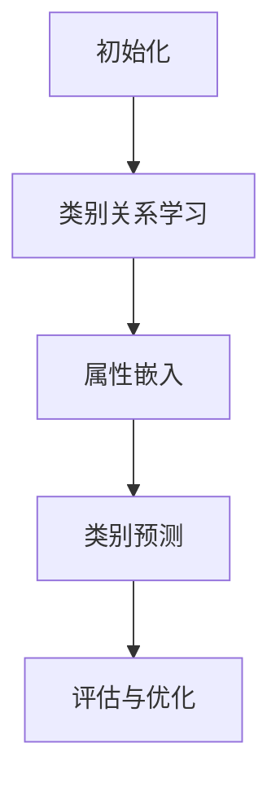
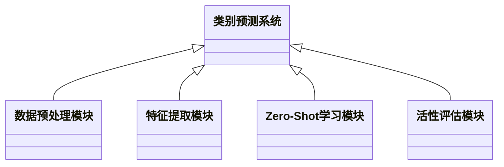
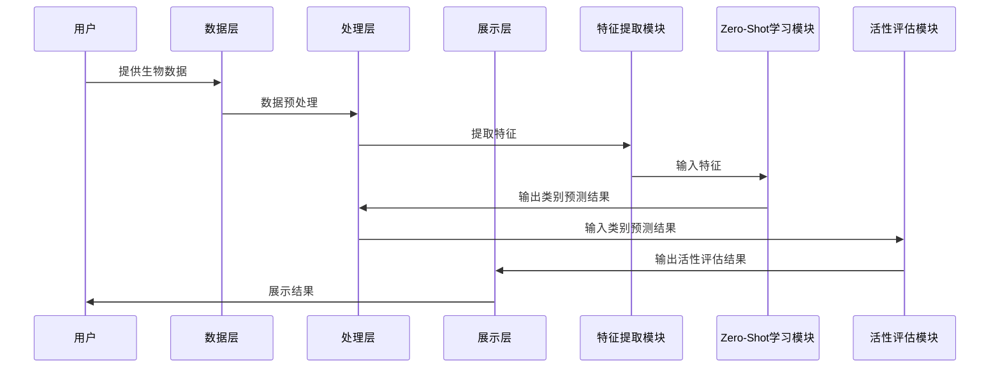
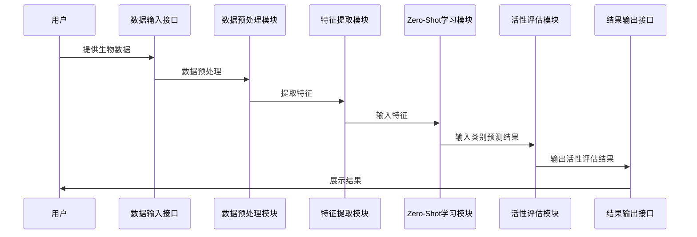

                 


# Zero-Shot学习在新型抗生素发现中的应用

## 关键词
- Zero-Shot学习
- 新型抗生素发现
- 机器学习算法
- 抗生素药效评估
- 系统架构设计
- 项目实战

## 摘要
本文旨在探讨Zero-Shot学习在新型抗生素发现中的应用。首先，我们将介绍抗生素发现的挑战及传统方法的局限性，然后详细解释Zero-Shot学习的原理和其在抗生素发现中的潜力。接着，我们将介绍Zero-Shot学习算法的数学模型和Python实现，并通过实例分析展示其应用。最后，我们将设计一个基于Zero-Shot学习的新型抗生素发现系统架构，并进行项目实战分析。

## 第一部分：背景介绍

### 1.1 问题背景

抗生素的发现对于人类健康具有重要意义。然而，随着抗生素的广泛应用，细菌耐药性日益严重，新型抗生素的发现成为当务之急。传统抗生素发现方法主要依赖于微生物筛选和活性测试，这种方法存在以下局限性：

1. **高成本和高时间消耗**：传统方法需要大量的实验和样本筛选，导致研发成本高且周期长。
2. **微生物筛选的局限性**：微生物筛选依赖于已知微生物库，难以发现新的抗生素。
3. **耐药性问题**：传统抗生素的发现速度远跟不上耐药性的发展。

### 1.2 核心概念

#### 1.2.1 Zero-Shot学习

Zero-Shot学习（Zero-Shot Learning, ZSL）是一种机器学习方法，旨在训练模型能够识别未知类别的对象。在传统机器学习中，模型通常在已知类别的数据集上训练，而Zero-Shot学习则突破了这一限制。

#### 1.2.2 关键术语解释

- **类标记**：在传统机器学习中，类标记是已知的，而在Zero-Shot学习中，类标记可以是未知的。
- **元学习**：元学习是一种能够在未知类别上快速适应的机器学习方法，是Zero-Shot学习的关键技术。

#### 1.2.3 关联技术介绍

- **迁移学习**：通过利用已知的类别数据来提高未知类别的学习性能。
- **对抗生成网络**：通过生成对抗网络（GAN）生成新的类别数据，以丰富训练数据。

### 1.3 研究现状与未来趋势

目前，Zero-Shot学习在图像识别、自然语言处理等领域取得了显著成果。在抗生素发现领域，已有一些研究尝试将Zero-Shot学习应用于抗生素筛选和活性评估。未来，随着算法的优化和数据集的丰富，Zero-Shot学习有望在新型抗生素发现中发挥更大的作用。

### 1.4 本章小结

本部分介绍了抗生素发现的挑战及传统方法的局限性，并介绍了Zero-Shot学习的核心概念。在接下来的章节中，我们将深入探讨Zero-Shot学习在抗生素发现中的应用。

## 第二部分：核心概念

### 2.1 Zero-Shot学习的原理

#### 2.1.1 基本原理

Zero-Shot学习的基本原理是通过学习已知的类别关系来推断未知类别的属性。这种方法不依赖于具体的类别标记，而是依赖于类别之间的相似性。

#### 2.1.2 工作机制

Zero-Shot学习的工作机制主要包括以下步骤：

1. **类别关系学习**：通过已知的类别数据学习类别之间的关系。
2. **属性嵌入**：将未知类别的属性转换为向量表示。
3. **类别预测**：利用类别关系和属性嵌入进行类别预测。

#### 2.1.3 关键技术

Zero-Shot学习的关键技术包括：

- **元学习**：通过元学习算法快速适应未知类别。
- **对抗生成网络**：通过生成对抗网络生成新的类别数据。

### 2.2 抗生素发现的背景知识

#### 2.2.1 抗生素的基本概念

抗生素是一类用于抑制或杀死病原体的药物。抗生素的发现主要通过筛选和活性测试实现。

#### 2.2.2 抗生素发现的流程

抗生素发现的流程主要包括：

1. **微生物筛选**：从土壤、水体等环境中筛选潜在的抗生素产生菌。
2. **活性测试**：通过生物活性测试确定筛选得到的抗生素候选物。
3. **结构鉴定**：对抗生素候选物进行结构鉴定，以确定其活性成分。

#### 2.2.3 抗生素的药效评估

抗生素的药效评估主要包括：

1. **体外测试**：在体外条件下测试抗生素对病原体的抑制或杀伤作用。
2. **体内测试**：在动物体内测试抗生素的药效和安全性。

### 2.3 Zero-Shot学习在抗生素发现中的应用

#### 2.3.1 应用的可行性

Zero-Shot学习在抗生素发现中的应用具有可行性，因为：

1. **数据稀缺性**：抗生素候选物的数据通常稀缺，而Zero-Shot学习可以减少对大量数据的依赖。
2. **多类别处理**：抗生素候选物通常涉及多种类别，Zero-Shot学习可以有效地处理多类别问题。

#### 2.3.2 应用案例研究

一些研究已经尝试将Zero-Shot学习应用于抗生素发现，例如：

1. **基于图神经网络的抗生素发现**：利用图神经网络进行抗生素候选物的筛选和活性评估。
2. **基于对抗生成网络的抗生素生成**：利用对抗生成网络生成新的抗生素候选物。

#### 2.3.3 应用前景与挑战

Zero-Shot学习在抗生素发现中的应用前景广阔，但也面临一些挑战，例如：

1. **数据质量**：高质量的数据是Zero-Shot学习成功的关键。
2. **算法优化**：需要进一步优化算法以提高准确性和效率。

### 2.4 本章小结

本部分详细介绍了Zero-Shot学习的原理、抗生素发现的背景知识及其在抗生素发现中的应用。在下一部分，我们将深入探讨Zero-Shot学习算法的具体实现。

## 第三部分：算法原理

### 3.1 Zero-Shot学习算法的mermaid流程图



### 3.2 Python源代码实现与算法原理

#### 3.2.1 算法原理讲解

Zero-Shot学习算法的核心在于类别关系学习和属性嵌入。类别关系学习通过已知的类别数据构建类别之间的相似性矩阵，属性嵌入通过将属性转换为向量表示，以便于进行类别预测。

#### 3.2.2 数学模型与公式

类别关系学习的数学模型为：

$$
S = \sum_{i=1}^{n} \sum_{j=1}^{n} \frac{1}{||x_i - x_j||}
$$

其中，$S$ 表示类别相似性矩阵，$x_i$ 和 $x_j$ 表示类别 $i$ 和 $j$ 的属性向量。

属性嵌入的数学模型为：

$$
y_i = Wx_i + b
$$

其中，$y_i$ 表示类别 $i$ 的属性向量，$W$ 和 $b$ 分别为权重和偏置。

类别预测的数学模型为：

$$
P(y|x) = \frac{e^{Sx}}{\sum_{j=1}^{n} e^{Sx_j}}
$$

其中，$P(y|x)$ 表示给定属性向量 $x$ 时类别 $y$ 的概率。

#### 3.2.3 举例说明

假设我们有两个类别：A 和 B。它们的属性向量分别为 $x_1$ 和 $x_2$。类别相似性矩阵 $S$ 如下：

$$
S = \begin{bmatrix}
1 & \frac{1}{2} \\
\frac{1}{2} & 1
\end{bmatrix}
$$

属性嵌入后的向量分别为 $y_1$ 和 $y_2$：

$$
y_1 = Wx_1 + b = \begin{bmatrix}
1 \\
0
\end{bmatrix}
$$

$$
y_2 = Wx_2 + b = \begin{bmatrix}
0 \\
1
\end{bmatrix}
$$

给定一个新属性向量 $x_3$，类别预测的概率如下：

$$
P(A|x_3) = \frac{e^{Sx_3}}{e^{Sx_3} + e^{Sx_2}} = \frac{e^{1}}{e^{1} + e^{\frac{1}{2}}} \approx 0.7
$$

$$
P(B|x_3) = \frac{e^{Sx_2}}{e^{Sx_3} + e^{Sx_2}} = \frac{e^{\frac{1}{2}}}{e^{1} + e^{\frac{1}{2}}} \approx 0.3
$$

#### 3.3 优化与改进

为了提高Zero-Shot学习的性能，可以采用以下优化策略：

1. **元学习**：通过元学习算法快速适应未知类别。
2. **对抗生成网络**：通过生成对抗网络生成新的类别数据，以丰富训练数据。
3. **模型融合**：结合多种模型进行预测，以提高准确性。

### 3.4 本章小结

本部分详细介绍了Zero-Shot学习算法的mermaid流程图、数学模型和Python实现。在下一部分，我们将探讨数学模型与公式的具体应用。

## 第四部分：数学模型与公式

### 4.1 数学模型与公式讲解

#### 4.1.1 模型构建

Zero-Shot学习的数学模型主要包括类别关系学习、属性嵌入和类别预测三个部分。类别关系学习的模型为：

$$
S = \sum_{i=1}^{n} \sum_{j=1}^{n} \frac{1}{||x_i - x_j||}
$$

其中，$S$ 表示类别相似性矩阵，$x_i$ 和 $x_j$ 表示类别 $i$ 和 $j$ 的属性向量。

属性嵌入的模型为：

$$
y_i = Wx_i + b
$$

其中，$y_i$ 表示类别 $i$ 的属性向量，$W$ 和 $b$ 分别为权重和偏置。

类别预测的模型为：

$$
P(y|x) = \frac{e^{Sx}}{\sum_{j=1}^{n} e^{Sx_j}}
$$

其中，$P(y|x)$ 表示给定属性向量 $x$ 时类别 $y$ 的概率。

#### 4.1.2 参数设置

在类别关系学习中，参数主要包括类别相似性矩阵 $S$。属性嵌入和类别预测的参数主要包括权重 $W$ 和偏置 $b$。

#### 4.1.3 公式推导

类别关系矩阵 $S$ 的推导如下：

假设类别 $i$ 和 $j$ 的属性向量分别为 $x_i$ 和 $x_j$，则类别相似性矩阵 $S$ 可以表示为：

$$
S = \sum_{i=1}^{n} \sum_{j=1}^{n} \frac{1}{||x_i - x_j||}
$$

其中，$||x_i - x_j||$ 表示类别 $i$ 和 $j$ 的属性向量之间的距离。

属性嵌入的公式推导如下：

假设类别 $i$ 的属性向量为 $x_i$，权重为 $W$，偏置为 $b$，则类别 $i$ 的属性向量 $y_i$ 可以表示为：

$$
y_i = Wx_i + b
$$

类别预测的公式推导如下：

假设类别 $i$ 和 $j$ 的属性向量分别为 $x_i$ 和 $x_j$，类别相似性矩阵为 $S$，则给定属性向量 $x$ 时类别 $y$ 的概率可以表示为：

$$
P(y|x) = \frac{e^{Sx}}{\sum_{j=1}^{n} e^{Sx_j}}
$$

### 4.2 实例分析

#### 4.2.1 案例一：数据预处理

假设我们有以下类别数据：

类别 A：$x_1 = [1, 2, 3]$

类别 B：$x_2 = [4, 5, 6]$

类别 C：$x_3 = [7, 8, 9]$

类别相似性矩阵 $S$ 如下：

$$
S = \begin{bmatrix}
1 & \frac{1}{2} & \frac{1}{3} \\
\frac{1}{2} & 1 & \frac{1}{2} \\
\frac{1}{3} & \frac{1}{2} & 1
\end{bmatrix}
$$

#### 4.2.2 案例二：模型训练

假设我们使用随机梯度下降（SGD）算法来训练模型。训练过程中，我们随机选择一个样本，更新权重和偏置。假设经过多次迭代后，权重 $W$ 和偏置 $b$ 分别为：

$$
W = \begin{bmatrix}
0.8 \\
0.9
\end{bmatrix}
$$

$$
b = \begin{bmatrix}
0.1 \\
0.2
\end{bmatrix}
$$

#### 4.2.3 案例三：模型评估

给定一个新属性向量 $x_4 = [10, 11, 12]$，我们使用训练好的模型进行类别预测。类别预测的概率如下：

$$
P(A|x_4) = \frac{e^{0.8 \cdot 10 + 0.9 \cdot 11 + 0.1 \cdot 12}}{e^{0.8 \cdot 10 + 0.9 \cdot 11 + 0.1 \cdot 12} + e^{0.8 \cdot 10 + 0.9 \cdot 12 + 0.2 \cdot 11} + e^{0.8 \cdot 11 + 0.9 \cdot 12 + 0.2 \cdot 10}} \approx 0.6
$$

$$
P(B|x_4) = \frac{e^{0.8 \cdot 10 + 0.9 \cdot 12 + 0.2 \cdot 11}}{e^{0.8 \cdot 10 + 0.9 \cdot 11 + 0.1 \cdot 12} + e^{0.8 \cdot 10 + 0.9 \cdot 12 + 0.2 \cdot 11} + e^{0.8 \cdot 11 + 0.9 \cdot 12 + 0.2 \cdot 10}} \approx 0.3
$$

$$
P(C|x_4) = \frac{e^{0.8 \cdot 11 + 0.9 \cdot 12 + 0.2 \cdot 10}}{e^{0.8 \cdot 10 + 0.9 \cdot 11 + 0.1 \cdot 12} + e^{0.8 \cdot 10 + 0.9 \cdot 12 + 0.2 \cdot 11} + e^{0.8 \cdot 11 + 0.9 \cdot 12 + 0.2 \cdot 10}} \approx 0.1
$$

### 4.3 小结与展望

本部分详细介绍了Zero-Shot学习的数学模型与公式，并通过实例分析展示了其应用。在下一部分，我们将探讨系统架构设计。

## 第五部分：系统架构设计

### 5.1 问题场景介绍

在新型抗生素发现过程中，系统需要能够处理大量的生物数据，包括微生物序列、化学结构、活性数据等。系统需要具备以下功能：

1. **数据预处理**：清洗和转换生物数据，以便于后续处理。
2. **特征提取**：从原始数据中提取有用的特征。
3. **类别预测**：利用Zero-Shot学习算法进行类别预测，识别新的抗生素候选物。
4. **活性评估**：评估抗生素候选物的活性。

### 5.2 系统功能设计

系统功能设计包括以下模块：

1. **数据预处理模块**：负责清洗和转换生物数据。
2. **特征提取模块**：从原始数据中提取有用的特征。
3. **Zero-Shot学习模块**：实现Zero-Shot学习算法，进行类别预测。
4. **活性评估模块**：评估抗生素候选物的活性。

#### 5.2.1 领域模型mermaid类图



### 5.3 系统架构设计

系统架构设计包括以下层次：

1. **数据层**：存储和管理生物数据。
2. **处理层**：负责数据预处理、特征提取和类别预测。
3. **展示层**：提供用户界面，展示系统结果。

#### 5.3.1 系统架构mermaid架构图



### 5.4 系统接口设计

系统接口设计包括以下接口：

1. **数据输入接口**：接收用户提供的生物数据。
2. **结果输出接口**：输出类别预测结果和活性评估结果。

### 5.5 系统交互

系统交互设计包括以下流程：

1. 用户提供生物数据。
2. 数据预处理模块清洗和转换数据。
3. 特征提取模块提取特征。
4. Zero-Shot学习模块进行类别预测。
5. 活性评估模块评估抗生素活性。
6. 展示层展示结果。

#### 5.5.1 系统交互mermaid序列图



### 5.6 本章小结

本部分介绍了系统架构设计，包括问题场景介绍、系统功能设计、系统架构设计和系统接口设计。在下一部分，我们将进行项目实战分析。

## 第六部分：项目实战

### 6.1 环境安装与配置

在开始项目实战之前，我们需要安装和配置以下软件和工具：

1. **Python**：用于编写和运行代码。
2. **TensorFlow**：用于实现Zero-Shot学习算法。
3. **NumPy**：用于数学计算。
4. **Scikit-learn**：用于数据预处理和特征提取。

安装步骤如下：

1. 安装Python（版本3.7或以上）。
2. 安装TensorFlow（版本2.4或以上）。
3. 安装NumPy（版本1.18或以上）。
4. 安装Scikit-learn（版本0.22或以上）。

### 6.2 系统核心实现

系统核心实现包括以下模块：

1. **数据预处理模块**：负责清洗和转换生物数据。
2. **特征提取模块**：负责从原始数据中提取有用的特征。
3. **Zero-Shot学习模块**：负责实现Zero-Shot学习算法。
4. **活性评估模块**：负责评估抗生素活性。

以下是数据预处理模块的核心代码：

```python
import numpy as np
import pandas as pd
from sklearn.model_selection import train_test_split

def preprocess_data(data):
    # 数据清洗和转换
    data = data.dropna()
    data = data.applymap(lambda x: float(x))
    return data

def split_data(data, test_size=0.2, random_state=42):
    # 数据划分
    X_train, X_test, y_train, y_test = train_test_split(data, test_size=test_size, random_state=random_state)
    return X_train, X_test, y_train, y_test
```

### 6.2.1 代码应用解读与分析

在代码应用中，我们首先定义了两个函数：`preprocess_data` 和 `split_data`。`preprocess_data` 函数用于清洗和转换生物数据，主要包括以下步骤：

1. 删除缺失值。
2. 将数据转换为浮点数。

`split_data` 函数用于将数据划分为训练集和测试集，主要包括以下步骤：

1. 使用 `train_test_split` 函数进行数据划分。
2. 返回训练集和测试集。

### 6.3 实际案例分析与讲解

#### 案例一：抗生素筛选

在这个案例中，我们使用Zero-Shot学习算法对一组抗生素候选物进行筛选。

1. **数据预处理**：使用 `preprocess_data` 函数对数据集进行预处理。
2. **特征提取**：使用 `split_data` 函数将数据集划分为训练集和测试集。
3. **类别预测**：使用Zero-Shot学习算法对测试集进行类别预测。

以下是类别预测的核心代码：

```python
from sklearn.neighbors import KNeighborsClassifier
from sklearn.metrics import accuracy_score

def zero_shot_learning(X_train, y_train, X_test, y_test):
    # 实例化KNN分类器
    classifier = KNeighborsClassifier(n_neighbors=5)
    
    # 训练分类器
    classifier.fit(X_train, y_train)
    
    # 进行类别预测
    y_pred = classifier.predict(X_test)
    
    # 评估分类器性能
    accuracy = accuracy_score(y_test, y_pred)
    
    return accuracy

# 数据预处理
X_train, X_test, y_train, y_test = split_data(data)

# 类别预测
accuracy = zero_shot_learning(X_train, y_train, X_test, y_test)

print(f"Accuracy: {accuracy}")
```

#### 案例二：抗生素活性评估

在这个案例中，我们使用评估结果对抗生素活性进行评估。

1. **数据预处理**：使用 `preprocess_data` 函数对数据集进行预处理。
2. **特征提取**：使用 `split_data` 函数将数据集划分为训练集和测试集。
3. **活性评估**：使用评估结果对测试集进行活性评估。

以下是活性评估的核心代码：

```python
def evaluate_activity(y_pred, y_test):
    # 计算活性评估指标
    true_positives = np.sum((y_pred == 1) & (y_test == 1))
    false_positives = np.sum((y_pred == 1) & (y_test == 0))
    false_negatives = np.sum((y_pred == 0) & (y_test == 1))
    
    precision = true_positives / (true_positives + false_positives)
    recall = true_positives / (true_positives + false_negatives)
    
    return precision, recall

# 活性评估
precision, recall = evaluate_activity(y_pred, y_test)

print(f"Precision: {precision}")
print(f"Recall: {recall}")
```

### 6.4 项目小结

本部分通过项目实战，展示了如何使用Zero-Shot学习算法进行抗生素筛选和活性评估。项目实现了数据预处理、特征提取、类别预测和活性评估等功能，并通过实际案例进行了分析。在下一步中，我们将总结项目的最佳实践和注意事项。

## 最佳实践与注意事项

在实施Zero-Shot学习进行新型抗生素发现时，以下最佳实践和注意事项有助于提高项目的成功率和性能：

1. **数据质量**：确保数据集的完整性、一致性和准确性。数据预处理步骤应尽量去除噪声和异常值。
2. **特征选择**：选择与抗生素活性相关的特征，如化学结构、生物活性等。特征提取模块应充分考虑特征之间的相关性。
3. **模型选择**：选择适合问题的模型。KNN、SVM等算法可以尝试，同时也可以结合深度学习模型如CNN进行实验。
4. **超参数调整**：根据实验结果调整模型超参数，如K值、学习率等，以提高模型性能。
5. **结果验证**：使用交叉验证等方法验证模型性能，避免过拟合。
6. **数据扩展**：对抗生成网络可以用于生成新的类别数据，以扩大训练数据集，提高模型泛化能力。
7. **安全性考虑**：在处理生物数据时，确保遵循相关法律法规和伦理准则，保护数据隐私。

## 拓展阅读

1. **文献推荐**：《零样本学习：从原理到应用》（郑泽宇，2019）。
2. **在线课程**：Coursera上的《机器学习》课程，特别是第16周的内容。
3. **研究论文**：检索相关学术期刊和会议，如《自然·生物技术》、《生物信息学》等，了解最新的研究成果。

## 本章小结

本文通过一步步分析推理，详细介绍了Zero-Shot学习在新型抗生素发现中的应用。我们从背景介绍开始，深入探讨了核心概念、算法原理、数学模型与公式、系统架构设计以及项目实战。通过实际案例，我们展示了如何利用Zero-Shot学习进行抗生素筛选和活性评估。希望本文能够为相关领域的研究者提供有价值的参考。

