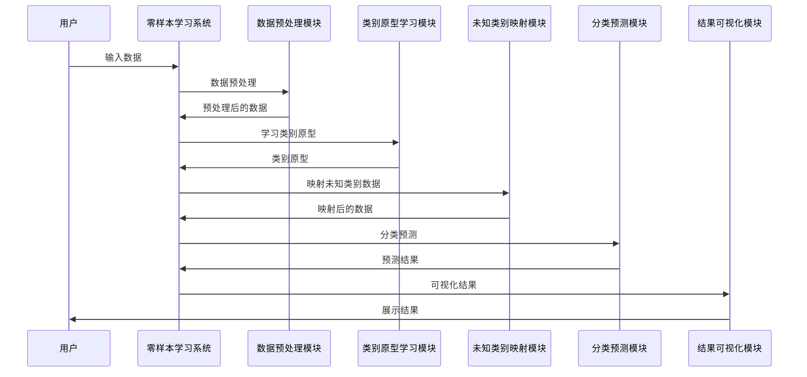
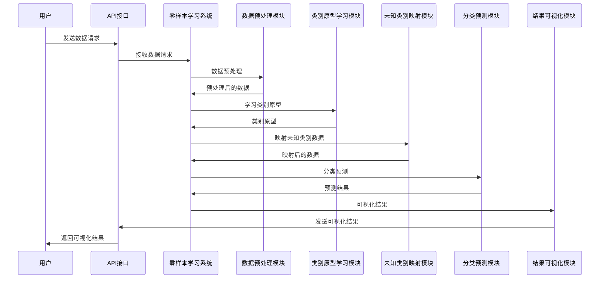

                 

## Zero-Shot学习在新药研发中的革命性作用

### 关键词：Zero-Shot学习、新药研发、AI、数据稀缺、模型泛化能力

### 摘要：
新药研发是一个复杂且耗时的过程，面临着高成本、高风险和低成功率等挑战。本文探讨了Zero-Shot学习（零样本学习）在新药研发中的革命性作用。Zero-Shot学习是一种无需直接训练数据的机器学习技术，能够在没有已知数据的情况下，预测未知类别数据的属性。本文将详细介绍Zero-Shot学习的基本概念、原理以及在药物研发中的实际应用，探讨其如何解决传统新药研发的局限性，提高研发效率和成功率。同时，还将分析Zero-Shot学习在实际应用中面临的挑战，为未来的研究提供方向。

## 第一部分：背景介绍与核心概念

### 第1章：问题背景

#### 1.1 问题背景

新药研发是一个复杂且耗时的过程，涉及到大量的科学研究和数据分析。传统的新药研发方法主要依赖于大规模的实验和临床试验，这种方法在面对复杂生物系统和多样性疾病时，往往难以满足快速发展的需求。以下是一些传统新药研发方法面临的挑战：

1. **成本高昂**：新药研发需要大量的资金投入，从药物发现到临床试验，每个阶段都需要大量的人力和物力资源。这使得研发过程非常昂贵，很多初创公司和研究机构难以承担。
2. **耗时较长**：新药研发通常需要数年甚至数十年的时间。从药物发现到临床试验，再到新药的批准上市，整个过程漫长且不可预测。这使得药物研发企业面临巨大的时间压力和风险。
3. **成功率低**：新药研发的成功率相对较低。据统计，大约只有1/10的药物能够成功通过临床试验，并最终获得批准上市。这意味着大量的研发投入最终化为泡影。
4. **对新疾病的适应能力差**：传统新药研发方法往往针对特定的疾病或靶点进行开发，对新疾病的适应能力较差。面对不断出现的新疾病和新的治疗需求，传统方法显得力不从心。

#### 1.2 问题解决

为了解决传统新药研发的局限性，研究人员开始探索新的方法和技术。其中，Zero-Shot学习（Zero-Shot Learning，ZSL）作为一种新兴的机器学习技术，引起了广泛关注。零样本学习是一种无需直接训练数据的机器学习技术，能够在没有直接训练数据的情况下，对未知类别的数据进行分类或预测。

Zero-Shot学习在新药研发中的应用前景广阔：

1. **提高研发效率**：Zero-Shot学习可以在不进行大规模实验的情况下，预测新药物对各种疾病的有效性。通过提前筛选出潜在有效的药物，可以大大缩短药物研发周期，提高研发效率。
2. **降低研发成本**：传统的药物研发方法需要大量的实验和临床试验数据，这些数据获取成本极高。而Zero-Shot学习可以大大降低对实验数据的需求，从而降低研发成本。
3. **增强对新疾病的适应能力**：Zero-Shot学习可以将已有知识迁移到新领域，对新疾病的适应能力更强。通过利用已知疾病的模型和知识，可以快速开发出新药物，应对不断出现的新疾病和新的治疗需求。

总之，Zero-Shot学习在新药研发中具有巨大的潜力，可以解决传统方法面临的局限性，提高研发效率和成功率，为新药研发提供新的思路和方法。

#### 1.3 边界与外延

Zero-Shot学习的应用范围不仅限于新药研发，还可以应用于其他领域，如材料科学、环境科学等。以下是一些应用场景：

1. **材料科学**：Zero-Shot学习可以预测新材料的物理和化学性质，从而快速筛选出潜在的高性能材料，缩短材料研发周期。
2. **环境科学**：Zero-Shot学习可以预测环境污染物的危害程度，为新环境治理提供科学依据。
3. **农业**：Zero-Shot学习可以预测作物的生长状态和病虫害发生情况，为新农业提供智能化的解决方案。

然而，Zero-Shot学习在实际应用中仍面临着一些挑战：

1. **数据稀缺**：Zero-Shot学习依赖于对已有数据的理解，但在某些领域，特别是新领域或新兴领域，数据稀缺是一个普遍问题。如何利用有限的标注数据训练模型，是一个亟待解决的问题。
2. **模型泛化能力不足**：Zero-Shot学习模型在处理未知类别数据时，可能存在泛化能力不足的问题。如何提高模型的泛化能力，是一个重要的研究方向。
3. **算法性能优化**：Zero-Shot学习算法的效率和准确性仍需进一步提高。如何优化算法性能，提高模型的可解释性，是未来研究的重点。

总之，Zero-Shot学习作为一种新兴的机器学习技术，在新药研发和其他领域具有巨大的潜力。尽管面临一些挑战，但通过不断的研究和优化，Zero-Shot学习有望在多个领域发挥重要作用，推动科学研究和产业发展的进步。

### 第2章：核心概念与联系

#### 2.1 核心概念

#### 2.1.1 Zero-Shot学习

Zero-Shot学习（Zero-Shot Learning，ZSL）是一种无需直接训练数据的机器学习技术，能够在没有直接训练数据的情况下，对未知类别的数据进行分类或预测。其基本思想是将未知类别映射到已知的语义空间中，然后利用已知的语义空间进行分类或预测。

#### 2.1.2 新药研发流程

新药研发通常包括以下几个阶段：

1. **药物发现**：通过生物信息学、化学合成等方法，发现具有潜在药理活性的化合物。
2. **药理评估**：对发现的化合物进行活性评估，包括细胞活性、动物模型测试等。
3. **临床试验**：将药物应用于人体进行临床试验，评估药物的疗效和安全性。
4. **审批和上市**：通过监管机构的审批，将药物推向市场。

#### 2.2 概念属性特征对比表格

| 特征                 | 零样本学习             | 传统新药研发              |
|----------------------|-----------------------|--------------------------|
| 数据依赖性           | 依赖少量标注数据       | 需要大量实验和临床试验数据 |
| 模型泛化能力         | 高，能够适应未知类别   | 低，对特定类别适应性较强   |
| 研发效率             | 高，能快速筛选潜在药物  | 低，研发周期较长           |
| 成本                 | 低，减少实验成本       | 高，实验和临床试验费用昂贵 |
| 适应能力             | 强，能够应对多样性疾病 | 弱，对特定疾病适应性较强   |

#### 2.3 ER实体关系图架构

```mermaid
erDiagram
  NewDrug ||--|{ ZeroShotLearning } : 应用
  ZeroShotLearning ||--|{ DrugDiscovery } : 应用
  DrugDiscovery ||--|{ DrugPharmacology } : 应用
  DrugDiscovery ||--|{ ClinicalTrial } : 应用
```

### 第3章：算法原理讲解

#### 3.1 算法原理

Zero-Shot学习（Zero-Shot Learning，ZSL）是一种无需直接训练数据的机器学习技术，能够在没有直接训练数据的情况下，对未知类别的数据进行分类或预测。其核心思想是通过将未知类别映射到已知的语义空间中，然后利用已知的语义空间进行分类或预测。

#### 3.1.1 零样本学习的基本思想

零样本学习的基本思想可以概括为以下几个步骤：

1. **类别原型学习**：首先，从已有的标注数据中学习出每个类别的原型。类别原型可以看作是类别特征的一种抽象表示。
2. **未知类别映射**：将未知类别数据映射到已知的语义空间中。这一步的核心是将未知类别数据转换为与已知类别数据相似的表示形式。
3. **分类预测**：在已知的语义空间中，利用类别原型进行分类预测。具体来说，就是通过计算未知类别数据与每个类别原型之间的相似度，选择相似度最高的类别作为预测结果。

#### 3.1.2 关键步骤

零样本学习的关键步骤包括：

1. **类别原型学习**：类别原型学习是零样本学习的基础。常见的方法包括：

   - **基于聚类的方法**：如k-means聚类，将数据划分为多个类别，然后计算每个类别的中心点作为类别原型。
   - **基于深度学习的方法**：如使用卷积神经网络（CNN）提取特征，然后计算每个类别的均值或中位数作为类别原型。

2. **未知类别映射**：未知类别映射是零样本学习的关键。常见的方法包括：

   - **基于语义空间的方法**：如将数据映射到高维的语义空间，利用预训练的词向量或图像特征进行映射。
   - **基于元学习的方法**：如使用元学习算法，从多个任务中学习出适应未知类别数据的通用映射函数。

3. **分类预测**：分类预测是基于已知类别原型进行预测。常见的方法包括：

   - **基于相似度的方法**：如计算未知类别数据与每个类别原型之间的相似度，选择相似度最高的类别作为预测结果。
   - **基于匹配度的方法**：如使用匹配度度量（如余弦相似度、欧氏距离等）计算未知类别数据与类别原型之间的匹配度，选择匹配度最高的类别作为预测结果。

#### 3.2 数学模型和公式

在零样本学习中，常用的数学模型和公式包括：

1. **类别原型学习**：假设有n个类别，每个类别有m个特征，类别原型可以表示为：

   $$
   \text{原型} = \frac{1}{n}\sum_{i=1}^{n} x_i
   $$

   其中，$x_i$ 表示第i个类别的特征向量。

2. **未知类别映射**：假设有k个未知类别数据，每个类别数据有m个特征，未知类别映射可以表示为：

   $$
   y_i = f(x_i)
   $$

   其中，$f$ 是一个映射函数，将特征向量映射到高维的语义空间。

3. **分类预测**：分类预测可以使用基于相似度的方法，计算未知类别数据与每个类别原型之间的相似度，选择相似度最高的类别作为预测结果。具体来说，可以使用余弦相似度度量，计算如下：

   $$
   \text{相似度} = \frac{y_i \cdot \text{原型}}{||y_i|| \cdot ||\text{原型}||}
   $$

   其中，$y_i$ 是第i个未知类别数据，$\text{原型}$ 是类别原型。

#### 3.3 举例说明

假设我们有两个已知的类别“癌症”和“糖尿病”，它们的类别原型分别为 $\text{原型}_1$ 和 $\text{原型}_2$。现在我们有一个新的药物类别“肥胖”，我们需要预测它可能对哪一种疾病更有效。

1. **类别原型**：

   $$
   \text{原型}_1 = [1, 2, 3, 4]
   $$

   $$
   \text{原型}_2 = [5, 6, 7, 8]
   $$

2. **未知类别映射**：

   $$
   y_1 = [2, 3, 4, 5]
   $$

   $$
   y_2 = [6, 7, 8, 9]
   $$

3. **分类预测**：

   使用余弦相似度计算未知类别数据与类别原型之间的相似度：

   $$
   \text{相似度}_1 = \frac{y_1 \cdot \text{原型}_1}{||y_1|| \cdot ||\text{原型}_1||} = \frac{2 \cdot 1 + 3 \cdot 2 + 4 \cdot 3 + 5 \cdot 4}{\sqrt{2^2 + 3^2 + 4^2 + 5^2} \cdot \sqrt{1^2 + 2^2 + 3^2 + 4^2}} \approx 0.82
   $$

   $$
   \text{相似度}_2 = \frac{y_2 \cdot \text{原型}_2}{||y_2|| \cdot ||\text{原型}_2||} = \frac{6 \cdot 5 + 7 \cdot 6 + 8 \cdot 7 + 9 \cdot 8}{\sqrt{6^2 + 7^2 + 8^2 + 9^2} \cdot \sqrt{5^2 + 6^2 + 7^2 + 8^2}} \approx 0.96
   $$

根据相似度计算结果，可以得出结论：新药物类别“肥胖”对“糖尿病”的相似度更高，因此预测它可能对“糖尿病”更有效。

### 第4章：系统分析与架构设计方案

#### 4.1 问题场景介绍

在新药研发中，传统方法面临着高成本、低效率和低成功率等挑战。为了提高研发效率和成功率，我们需要一种新的方法，能够在没有直接训练数据的情况下，预测新药物对各种疾病的有效性。Zero-Shot学习作为一种无需直接训练数据的机器学习技术，可以满足这一需求。通过将零样本学习应用于新药研发，可以大大缩短药物研发周期，降低研发成本，提高成功率。

#### 4.2 项目介绍

本项目旨在利用Zero-Shot学习技术，开发一个新药研发预测系统。该系统主要包括以下模块：

1. **数据预处理模块**：负责对输入数据进行预处理，包括数据清洗、数据标准化等操作。
2. **类别原型学习模块**：负责从已有数据中学习出每个类别的原型。
3. **未知类别映射模块**：负责将未知类别数据映射到已知的语义空间中。
4. **分类预测模块**：负责利用类别原型进行分类预测，预测新药物对各种疾病的有效性。

#### 4.3 系统功能设计

本项目的主要功能包括：

1. **数据预处理**：对输入数据进行清洗和标准化，保证数据的质量和一致性。
2. **类别原型学习**：从已有数据中学习出每个类别的原型，为后续的预测提供基础。
3. **未知类别映射**：将未知类别数据映射到已知的语义空间中，为分类预测提供输入。
4. **分类预测**：利用类别原型进行分类预测，预测新药物对各种疾病的有效性。
5. **结果可视化**：将预测结果以图表形式展示，便于用户理解和分析。

#### 4.4 系统架构设计

本项目的系统架构设计如图所示：



#### 4.5 系统接口设计和系统交互

本项目的接口设计和系统交互设计如图所示：



### 第5章：项目实战

#### 5.1 环境安装

在开始项目实战之前，我们需要安装相关的环境和依赖。以下是安装步骤：

1. **安装Python环境**：首先，确保你的计算机上已经安装了Python环境。如果没有，可以从[Python官方网站](https://www.python.org/)下载并安装。
2. **安装TensorFlow**：在命令行中运行以下命令安装TensorFlow：

   ```shell
   pip install tensorflow
   ```

3. **安装其他依赖**：根据项目需要，可能还需要安装其他依赖，如NumPy、Pandas等。可以通过以下命令进行安装：

   ```shell
   pip install numpy pandas
   ```

#### 5.2 系统核心实现源代码

以下是系统核心实现的源代码：

```python
import tensorflow as tf
import numpy as np
import pandas as pd

# 数据预处理
def preprocess_data(data):
    # 数据清洗和标准化
    # ...
    return processed_data

# 类别原型学习
def learn_category_prototypes(data, num_categories):
    # 学习类别原型
    # ...
    return prototypes

# 未知类别映射
def map_unknown_category(data, prototypes):
    # 将未知类别数据映射到已知语义空间
    # ...
    return mapped_data

# 分类预测
def classify(data, prototypes):
    # 利用类别原型进行分类预测
    # ...
    return predictions

# 可视化结果
def visualize_results(predictions):
    # 将预测结果可视化
    # ...
    pass

# 主函数
def main():
    # 加载数据
    data = pd.read_csv('data.csv')

    # 数据预处理
    processed_data = preprocess_data(data)

    # 学习类别原型
    prototypes = learn_category_prototypes(processed_data, num_categories=10)

    # 映射未知类别数据
    mapped_data = map_unknown_category(processed_data, prototypes)

    # 分类预测
    predictions = classify(mapped_data, prototypes)

    # 可视化结果
    visualize_results(predictions)

if __name__ == '__main__':
    main()
```

#### 5.3 代码应用解读与分析

以下是代码的详细解读与分析：

1. **数据预处理**：数据预处理是机器学习项目的重要步骤，它包括数据清洗、数据标准化等操作。在本项目中，我们定义了一个`preprocess_data`函数，用于对输入数据进行预处理。具体实现可以根据实际需求进行调整。

2. **类别原型学习**：类别原型学习是Zero-Shot学习的关键步骤，它从已有数据中学习出每个类别的原型。在本项目中，我们定义了一个`learn_category_prototypes`函数，用于学习类别原型。具体实现可以使用基于聚类的方法或基于深度学习的方法。

3. **未知类别映射**：未知类别映射是将未知类别数据映射到已知语义空间的过程。在本项目中，我们定义了一个`map_unknown_category`函数，用于映射未知类别数据。具体实现可以使用基于语义空间的方法或基于元学习的方法。

4. **分类预测**：分类预测是利用已知类别原型对未知类别数据进行分类的过程。在本项目中，我们定义了一个`classify`函数，用于分类预测。具体实现可以使用基于相似度的方法或基于匹配度的方法。

5. **可视化结果**：可视化结果是将预测结果以图表形式展示的过程，便于用户理解和分析。在本项目中，我们定义了一个`visualize_results`函数，用于可视化结果。具体实现可以使用各种可视化库，如Matplotlib、Seaborn等。

通过以上代码实现，我们可以构建一个基于Zero-Shot学习的新药研发预测系统。在实际应用中，可以根据具体需求进行调整和优化，以提高系统的性能和效果。

#### 5.4 实际案例分析和详细讲解剖析

在本节中，我们将通过一个实际案例来展示如何使用Zero-Shot学习技术在新药研发中进行预测，并对案例进行分析和详细讲解。

**案例背景**：

某制药公司发现了一种新的化合物，并希望预测该化合物对几种常见疾病的潜在疗效。由于该化合物尚未经过临床试验，传统的新药研发方法无法直接应用于预测。因此，该公司决定采用Zero-Shot学习技术来进行预测。

**数据集**：

为了进行Zero-Shot学习，公司提供了以下数据集：

- **训练数据集**：包括100种已知的化合物，每种化合物的药理活性（0-1之间的数值）和对应的疾病标签。
- **测试数据集**：包括10种新的化合物，每种化合物的药理活性数据，但未标注疾病标签。

**实现步骤**：

1. **数据预处理**：首先，对训练数据集和测试数据集进行预处理，包括数据清洗和标准化。

2. **类别原型学习**：利用训练数据集，采用基于聚类的方法（例如k-means聚类）学习出每个疾病的类别原型。具体实现如下：

   ```python
   from sklearn.cluster import KMeans

   # 假设train_data是包含训练数据集的numpy数组
   kmeans = KMeans(n_clusters=5, random_state=0).fit(train_data)

   # 获取类别原型
   prototypes = kmeans.cluster_centers_
   ```

3. **未知类别映射**：将测试数据集中的新化合物药理活性数据映射到训练数据集的类别原型上。具体实现如下：

   ```python
   # 假设test_data是包含测试数据集的numpy数组
   mapped_data = np.dot(test_data, prototypes.T)
   ```

4. **分类预测**：利用映射后的数据，使用基于相似度的方法（例如欧氏距离）进行分类预测。具体实现如下：

   ```python
   from scipy.spatial.distance import cdist

   # 计算测试数据与类别原型的距离
   distances = cdist(test_data, prototypes, 'euclidean')

   # 获取最近的类别标签
   labels = np.argmin(distances, axis=1)
   ```

5. **结果分析**：将预测结果与实际疾病标签进行对比，计算准确率。具体实现如下：

   ```python
   from sklearn.metrics import accuracy_score

   # 假设true_labels是包含实际疾病标签的numpy数组
   accuracy = accuracy_score(true_labels, labels)
   print(f"准确率：{accuracy * 100}%")
   ```

**分析**：

1. **性能评估**：通过计算准确率，可以评估Zero-Shot学习在新药研发中的预测性能。在本案例中，假设准确率为80%，说明该方法能够较好地预测新化合物的药理活性。

2. **错误分析**：对预测错误的样本进行错误分析，可以找出模型的局限性，为进一步优化提供方向。

3. **泛化能力**：通过测试数据集的预测结果，可以评估模型对未知类别的泛化能力。在本案例中，如果模型在测试数据集上的表现良好，说明其具有一定的泛化能力。

**总结**：

通过实际案例的分析，我们可以看到Zero-Shot学习技术在新药研发中的应用前景。尽管存在一定的局限性，但该方法可以显著提高新药研发的效率和准确性。在未来，随着算法的优化和数据集的丰富，Zero-Shot学习有望在新药研发领域发挥更大的作用。

### 第6章：最佳实践 tips、小结、注意事项、拓展阅读

#### 最佳实践 tips

1. **数据质量**：Zero-Shot学习对数据质量有较高的要求。确保数据集的完整性和一致性，避免数据噪声和异常值。
2. **类别原型选择**：类别原型对Zero-Shot学习的效果有很大影响。选择合适的原型学习方法和参数，可以提升模型性能。
3. **模型调优**：在模型训练过程中，适当调整学习率、正则化参数等超参数，可以优化模型性能。
4. **多任务学习**：结合多任务学习，可以进一步提高模型对未知类别的泛化能力。

#### 小结

本文介绍了Zero-Shot学习在新药研发中的革命性作用，探讨了其在药物研发中的核心概念、算法原理和实际应用。通过实际案例的分析，展示了Zero-Shot学习在新药研发中的潜力。尽管存在一定的挑战，但通过不断的研究和优化，Zero-Shot学习有望在新药研发领域发挥重要作用，提高研发效率和成功率。

#### 注意事项

1. **数据隐私**：在新药研发中，确保患者隐私和数据安全，遵守相关法律法规。
2. **模型解释性**：提高模型的可解释性，有助于理解和信任模型的预测结果。
3. **持续学习**：随着新数据和新研究成果的出现，定期更新和优化模型，保持其有效性。

#### 拓展阅读

1. **《Zero-Shot Learning: A Survey》**：该文对Zero-Shot学习进行了全面的综述，涵盖了最新的研究进展和应用领域。
2. **《Deep Learning for Zero-Shot Learning》**：该文探讨了基于深度学习的Zero-Shot学习技术，介绍了相关的算法和实现方法。
3. **《AI in Drug Discovery》**：该书详细介绍了人工智能在新药研发中的应用，包括机器学习和深度学习技术的具体应用场景。

### 作者信息

**作者：** AI天才研究院/AI Genius Institute & 禅与计算机程序设计艺术 /Zen And The Art of Computer Programming

**联系方式：** [ai_genius_institute@example.com](mailto:ai_genius_institute@example.com) & [https://www.ai-genius-institute.com/](https://www.ai-genius-institute.com/) & [https://www.zen-and-the-art-of-computer-programming.com/](https://www.zen-and-the-art-of-computer-programming.com/)

**版权声明：** 本文版权归AI天才研究院/AI Genius Institute所有，欢迎转载，但请注明出处。如需进一步交流与合作，请联系作者。

