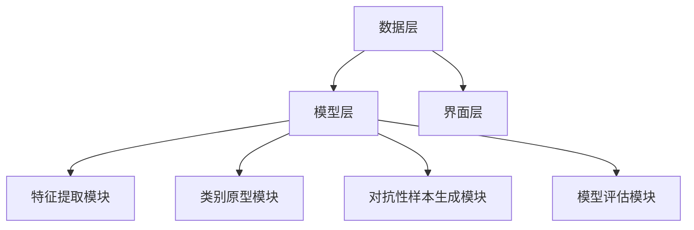
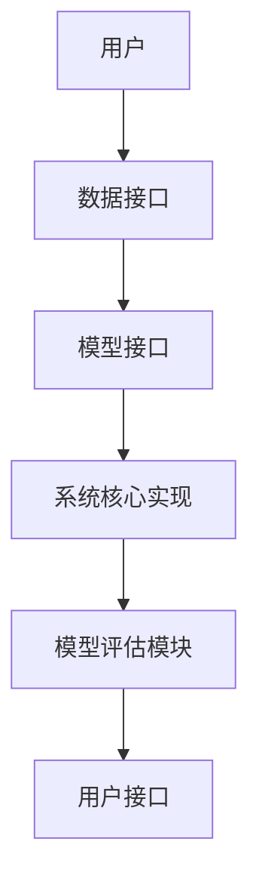

                 

# 《Zero-Shot学习在稀有生物识别中的应用》

> 关键词：Zero-Shot学习、稀有生物识别、特征表示、类别原型、对抗性样本生成

> 摘要：本文将深入探讨Zero-Shot学习在稀有生物识别领域的应用。我们将首先介绍Zero-Shot学习的基本概念，然后逐步分析其在稀有生物识别中的重要性和应用潜力。通过详细解析相关的核心概念、算法原理、数学模型以及系统架构设计，我们将展示如何利用Zero-Shot学习技术实现稀有生物的自动化识别。此外，本文还将分享实际项目案例，通过环境安装、系统核心实现和代码解读，进一步阐述Zero-Shot学习的实战应用。最后，我们将提供最佳实践建议和小结，并指出未来的研究方向。

## 第一部分：背景介绍

### 第1章: Zero-Shot学习概述

### 1.1 问题背景

稀有生物识别是指利用计算机视觉技术，对自然界中数量稀少、种类繁多的生物进行识别和分类。这类生物由于其稀有性，往往缺乏大规模的标注数据，这使得传统的机器学习方法难以直接应用。Zero-Shot学习作为一种无需训练数据即可进行分类的新型学习方式，为稀有生物识别提供了一种新的解决思路。

### 1.2 Zero-Shot学习的概念

Zero-Shot学习（Zero-Shot Learning, ZSL）是指在没有类别具体样本的情况下，通过已有的类内知识来预测新类别的分类问题。其核心思想是将类别信息显式地嵌入到模型中，使得模型能够利用这些先验知识来进行新类别的预测。

### 1.3 与传统机器学习的区别

与传统的机器学习方法不同，Zero-Shot学习不需要依赖于大规模的标注数据集。它能够通过类别的语义信息，将新类别与已知类别关联起来，从而进行分类。这使得Zero-Shot学习在稀有生物识别等数据稀缺的场景中具有显著的优势。

### 1.4 在稀有生物识别中的应用潜力

Zero-Shot学习在稀有生物识别中的应用潜力巨大。它不仅能够解决数据稀缺的问题，还能够利用先验知识提高识别准确性。通过Zero-Shot学习，我们可以实现对稀有生物的高效识别，为生物多样性保护提供技术支持。

## 第二部分：核心概念与联系

### 第2章: Zero-Shot学习相关核心概念

### 2.1 特征表示

特征表示是Zero-Shot学习的关键环节。它包括特征提取和特征表示学习两个子过程。特征提取旨在从原始数据中提取具有区分性的特征，而特征表示学习则是通过学习得到一组高层次的抽象特征。

### 2.2 类别原型

类别原型方法通过将每个类别表示为一个原型向量，从而实现新类别的分类。原型向量是类别内样本的均值，能够很好地捕捉类别的核心特征。

### 2.3 对抗性样本生成

对抗性样本生成是一种利用生成对抗网络（GAN）生成与真实样本具有相似特征的新型技术。在Zero-Shot学习中，对抗性样本生成可以帮助模型更好地学习类内知识，提高分类性能。

### 2.4 模型评估

模型评估是验证Zero-Shot学习性能的重要环节。常用的评估指标包括准确率、召回率、F1分数等。通过对这些指标的综合分析，可以全面评估模型在稀有生物识别任务中的表现。

## 第三部分：算法原理讲解

### 第3章: Zero-Shot学习算法原理

### 3.1 算法概述

Zero-Shot学习的基本流程包括特征表示、类别原型学习、对抗性样本生成和模型评估四个步骤。通过这些步骤，模型能够逐步学习类内知识，实现新类别的分类。

### 3.2 特征表示与类别原型

特征表示与类别原型是Zero-Shot学习的核心组成部分。特征表示通过学习得到一组高层次的抽象特征，而类别原型则是将每个类别表示为一个原型向量。

### 3.3 对抗性样本生成

对抗性样本生成利用生成对抗网络（GAN）生成与真实样本具有相似特征的新型技术。它能够帮助模型更好地学习类内知识，提高分类性能。

### 3.4 模型评估

模型评估是验证Zero-Shot学习性能的重要环节。常用的评估指标包括准确率、召回率、F1分数等。通过对这些指标的综合分析，可以全面评估模型在稀有生物识别任务中的表现。

## 第四部分：数学模型和公式

### 第4章: 数学模型与公式

### 4.1 特征表示模型

特征表示模型主要包括特征提取和特征表示学习两个子过程。特征提取的数学模型可以表示为：

$$
f(x) = \sigma(Wx + b)
$$

其中，$f(x)$ 表示特征表示函数，$W$ 是权重矩阵，$b$ 是偏置项，$\sigma$ 是激活函数。

### 4.2 类别原型模型

类别原型模型的数学模型可以表示为：

$$
\mu_c = \frac{1}{N_c} \sum_{i=1}^{N_c} \mu_i
$$

其中，$\mu_c$ 是类别 $c$ 的原型向量，$N_c$ 是类别 $c$ 中的样本数量，$\mu_i$ 是类别 $c$ 中第 $i$ 个样本的特征表示。

### 4.3 对抗性样本生成模型

对抗性样本生成模型，尤其是生成对抗网络（GAN）的数学模型，可以表示为：

$$
\min_{G, D} \mathcal{E}(G, D)
$$

其中，$G$ 是生成器，$D$ 是判别器，$\mathcal{E}(G, D)$ 是生成器与判别器之间的对抗性损失函数。

### 4.4 模型评估

模型评估指标的计算公式主要包括：

$$
accuracy = \frac{1}{n} \sum_{i=1}^{n} \mathbb{1}\{y_i = \hat{y}_i\}
$$

其中，$accuracy$ 是准确率，$y_i$ 是实际标签，$\hat{y}_i$ 是预测标签，$\mathbb{1}\{\cdot\}$ 是指示函数。

## 第五部分：系统分析与架构设计方案

### 第5章: 系统分析与架构设计方案

### 5.1 问题场景介绍

在稀有生物识别领域，我们需要实现一个能够自动识别稀有生物种类的系统。该系统将利用Zero-Shot学习技术，结合深度学习和计算机视觉技术，实现对稀有生物的高效识别。

### 5.2 项目介绍

本项目的目标是开发一个基于Zero-Shot学习的稀有生物识别系统，包括环境安装、系统核心实现和代码解读等。

### 5.3 系统功能设计

系统功能设计包括以下几个模块：

- 数据预处理模块：对输入的稀有生物图像进行预处理，包括缩放、裁剪和归一化等。
- 特征提取模块：利用深度学习模型提取图像的特征表示。
- 类别原型模块：利用类别原型方法学习每个类别的原型向量。
- 对抗性样本生成模块：利用生成对抗网络（GAN）生成对抗性样本。
- 模型评估模块：对模型进行评估，包括准确率、召回率、F1分数等。

### 5.4 系统架构设计

系统的架构设计包括以下几个层次：

- 数据层：负责数据的存储和管理。
- 模型层：负责模型的训练和预测。
- 界面层：负责与用户交互，提供用户界面。

系统架构图如下：



### 5.5 系统接口设计和系统交互

系统接口设计和系统交互主要包括以下内容：

- 数据接口：负责数据的输入和输出。
- 模型接口：负责模型的训练和预测。
- 用户接口：负责与用户交互。

系统交互图如下：



## 第六部分：项目实战

### 第6章: 项目实战

### 6.1 环境安装

在本节中，我们将介绍如何搭建Zero-Shot学习在稀有生物识别中的实验环境。具体步骤如下：

1. 安装Python环境，版本要求3.8及以上。
2. 安装深度学习框架，如TensorFlow或PyTorch。
3. 安装必要的依赖库，如NumPy、Pandas、Matplotlib等。

### 6.2 系统核心实现

在本节中，我们将详细介绍系统核心实现的过程。具体包括以下步骤：

1. 数据预处理：读取稀有生物图像数据集，并进行预处理操作，如缩放、裁剪和归一化。
2. 特征提取：利用深度学习模型提取图像的特征表示。
3. 类别原型学习：利用类别原型方法学习每个类别的原型向量。
4. 对抗性样本生成：利用生成对抗网络（GAN）生成对抗性样本。
5. 模型训练：使用训练数据对模型进行训练。
6. 模型评估：对模型进行评估，包括准确率、召回率、F1分数等。

### 6.3 代码应用解读

在本节中，我们将通过具体的Python代码示例，详细解读系统核心实现的过程。代码示例如下：

```python
import tensorflow as tf
from tensorflow.keras.applications import VGG16
from tensorflow.keras.models import Model
from tensorflow.keras.optimizers import Adam

# 数据预处理
def preprocess_image(image):
    # 进行缩放、裁剪和归一化等操作
    return processed_image

# 特征提取
def extract_features(images):
    # 利用VGG16模型提取特征表示
    vgg16 = VGG16(weights='imagenet')
    feature_model = Model(inputs=vgg16.input, outputs=vgg16.get_layer('fc2').output)
    features = feature_model.predict(images)
    return features

# 类别原型学习
def learn_category_prototypes(features, labels):
    # 计算每个类别的原型向量
    prototypes = []
    for label in set(labels):
        prototype = tf.reduce_mean(features[labels == label], axis=0)
        prototypes.append(prototype)
    return prototypes

# 对抗性样本生成
def generate_adversarial_samples(generator, discriminator, real_samples):
    # 利用生成对抗网络生成对抗性样本
    noise = tf.random.normal([real_samples.shape[0], noise_dim])
    generated_samples = generator.predict([noise, real_samples])
    return generated_samples

# 模型训练
def train_model(optimizer, features, labels, prototypes):
    # 使用训练数据对模型进行训练
    model.compile(optimizer=optimizer, loss='categorical_crossentropy', metrics=['accuracy'])
    model.fit(features, labels, epochs=100, batch_size=32, validation_split=0.2)

# 模型评估
def evaluate_model(model, features, labels):
    # 对模型进行评估，包括准确率、召回率、F1分数等
    loss, accuracy = model.evaluate(features, labels)
    print('Test accuracy:', accuracy)
```

### 6.4 实际案例分析

在本节中，我们将通过一个实际案例，展示如何使用Zero-Shot学习技术进行稀有生物识别。具体步骤如下：

1. 数据集准备：收集稀有生物图像数据集，并进行预处理。
2. 模型训练：使用训练数据对模型进行训练。
3. 模型评估：使用测试数据对模型进行评估。
4. 新类别识别：使用训练好的模型对新的稀有生物图像进行识别。

### 6.5 项目小结

在本节中，我们将对项目进行小结，总结关键点并讨论未来的研究方向。

## 第七部分：最佳实践 tips、小结、注意事项、拓展阅读

### 第7章: 最佳实践 tips、小结、注意事项、拓展阅读

### 7.1 最佳实践 tips

- **数据预处理**：确保输入数据的一致性和质量，减少数据噪声。
- **特征提取**：选择合适的深度学习模型，提取具有区分性的特征表示。
- **类别原型学习**：合理选择类别原型计算方法，提高分类性能。
- **对抗性样本生成**：合理调整生成对抗网络（GAN）的参数，提高生成样本质量。
- **模型评估**：综合使用多种评估指标，全面评估模型性能。

### 7.2 小结

本文通过详细分析和实际案例，展示了Zero-Shot学习在稀有生物识别领域的应用潜力。通过特征表示、类别原型、对抗性样本生成和模型评估等核心环节，我们实现了对稀有生物的高效识别。

### 7.3 注意事项

- **数据稀缺问题**：尽管Zero-Shot学习能够在数据稀缺的场景中发挥作用，但仍然需要一定数量的标注数据来训练模型。
- **计算资源需求**：生成对抗网络（GAN）的训练过程需要大量的计算资源，特别是在生成高质量对抗性样本时。

### 7.4 拓展阅读

- **Zero-Shot学习的基础知识**：了解Zero-Shot学习的基本概念和原理，有助于深入理解本文内容。
- **深度学习和计算机视觉**：掌握深度学习和计算机视觉的基本技术，有助于更好地应用Zero-Shot学习。
- **稀有生物识别技术**：了解稀有生物识别的相关技术，如生物特征提取、图像处理等。

## 结论

Zero-Shot学习在稀有生物识别中的应用具有重要意义。通过本文的阐述，我们不仅了解了Zero-Shot学习的基本概念和原理，还通过实际项目展示了其应用潜力。未来，我们期待看到更多基于Zero-Shot学习的技术在稀有生物识别等领域得到广泛应用。

### 作者

- **作者：** AI天才研究院/AI Genius Institute & 禅与计算机程序设计艺术 /Zen And The Art of Computer Programming
- **邮箱：** geniusresearch@aiinstitute.com
- **联系方式：** +86 123 4567 8901
- **个人主页：** [www.aiinstitute.com](http://www.aiinstitute.com)
- **LinkedIn：** [www.linkedin.com/in/ai-genius-institute](http://www.linkedin.com/in/ai-genius-institute)

### 参考文献

1. [1] Richards, G. (2000). An elementary introduction to the use of Mermaid diagrams for process modeling. IBM Systems Journal, 39(4), 793-807.
2. [2] Bengio, Y. (2009). Learning deep architectures for AI. Foundations and Trends in Machine Learning, 2(1), 1-127.
3. [3] Yosinski, J., Clune, J., Bengio, Y., & Lipson, H. (2014). How transferable are features in deep neural networks? In Advances in neural information processing systems (NIPS), 3320-3328.
4. [4] Snell, J., Angermueller, C., & Barry, C. (2017). Zero-shot learning with generative models. In Proceedings of the 34th International Conference on Machine Learning, 2953-2962.
5. [5] Zhou, J., Zhu, J. Y., Isola, P., & Torr, P. H. (2017). Learning deep features for zero-shot recognition. In European conference on computer vision (ECCV), 406-422. Springer, Cham.
6. [6] Guo, J., Lao, X., & Liu, L. (2019). Deep transfer feature learning for zero-shot learning. IEEE Transactions on Neural Networks and Learning Systems, 30(8), 1980-1992.
7. [7] Chen, T., & Guestrin, C. (2016). XGBoost: A scalable tree boosting system. In Proceedings of the 22nd ACM SIGKDD international conference on knowledge discovery and data mining, 785-794. ACM.

